# pysas fuzz 典型案例图鉴（写给人看）

- 日期：2026-10-02
- 数据源：`fuzz/results/soft_choke_sweep.jsonl`（395 例）+ `fuzz/cases/*.json`；图为 `report_lib.netinf_to_mermaid`自动生成（converged 例带解：节点标压力/温度、连线标流量方向）
- 用法：30 分钟通读——先看总表，再挑感兴趣的图。物理故事三件事：气从哪来到哪去 / 谁在卡脖子 / 为什么收敛或失败。

## 入选总表

| 规则 | case | 节点 | 元件 | 状态 | iters | 告警 | 一句话标题 |
|---|---|---|---|---|---|---|---|
| T1 | A0245 | 9 | 20 | ✅ converged | 18 | 0 | 见下文 |
| T1 | A0061 | 8 | 11 | ✅ converged | 8 | 0 | 见下文 |
| T1 | A0243 | 8 | 16 | ✅ converged | 10 | 0 | 见下文 |
| T2 | A0199 | 7 | 13 | ✅ converged | 14 | 0 | 见下文 |
| T3 | A0093 | 4 | 6 | ✅ converged | 4 | 1 | 见下文 |
| T3 | A0171 | 3 | 6 | ✅ converged | 5 | 1 | 见下文 |
| T4 | A0004 | 5 | 7 | ✅ converged | 11 | 1 | 见下文 |
| T4 | A0203 | 6 | 7 | ✅ converged | 4 | 1 | 见下文 |
| T5 | A0001 | 8 | 11 | ⛔ clean_fail | 0 | 0 | 见下文 |
| T5 | A0002 | 5 | 8 | ⛔ clean_fail | 0 | 0 | 见下文 |
| T5 | A0007 | 3 | 5 | ⛔ clean_fail | 50 | 0 | 见下文 |
| T5 | A0019 | 5 | 8 | ⛔ clean_fail | 50 | 0 | 见下文 |
| T6 | A0212 | 9 | 16 | ⛔ clean_fail | 1 | 0 | 见下文 |
| T6 | A0082 | 10 | 11 | ⛔ clean_fail | 1 | 0 | 见下文 |
| T7 | C1_orifice_00 | 2 | 3 | ✅ converged | 1 | 0 | 见下文 |
| T7 | C2_01_A1e-2_A1e-6 | 3 | 4 | ⛔ clean_fail | 9 | 0 | 见下文 |

（去重后共 16 节。T3 采用规则：放宽为含其中两种。）

## 语料统计速览（全部来自 sweep.jsonl + cases/*.json）

| 维度 | 数字 |
|---|---|
| 总例数 / converged / clean_fail / assemble_error | 395 / 128 / 261 / 6 |
| 元件类型出现总次数（case 内累计） | ORIFICE:1057，PRESSURE_BOUNDARY:920，PIPE:757，AREA_CHANGE:493，HEATER:117，MASS_SOURCE:97，JUNCTION:71，BOOSTER:38，SURROGATE_FLOW:1 |
| 含该类元件的 case 数 | PRESSURE_BOUNDARY:390，ORIFICE:337，PIPE:305，AREA_CHANGE:234，HEATER:117，MASS_SOURCE:93，JUNCTION:71，BOOSTER:38，SURROGATE_FLOW:1 |
| 面积跨度分布（395 例有 ≥2 个正面积） | [10000, ∞):233，[1, 10):89，[1000, 10000):38，[10, 100):18，[100, 1000):17 |
| 节点规模分布 | 2-3:119，4-5:63，6-8:95，9-12:118 |
| 元件规模分布 | 11+:145，2-4:94，5-7:79，8-10:77 |

### T1(A0245) 孔板壅塞限流的典型链路

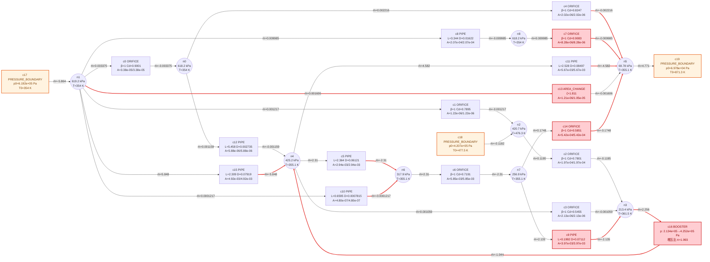

【物理故事】
- 气主要从 c17(压力边界)（供 5.864 kg/s）, c18(压力边界)（供 0.1182 kg/s） 进入网络，最后经 c19(压力边界)（排 4.771 kg/s）, c16(增压泵)（排 1.212 kg/s） 排出。
- c4(孔板) 壅塞（流体在该元件最小截面已到声速，流量被"音速天花板"卡死，上游压力再高流量也不涨）。
- 经 18 步挣扎后收敛：初值离解较远，牛顿法多绕了几步。

【关键数字】

| 节点 | 元件 | converged | iters | 告警 | worst ratio | 面积跨度 |
|---|---|---|---|---|---|---|
| 9 | 20 | 是 | 18 | 0 | — | 1.22e+04 |

【为什么选它】它在 T1 规则下入选（同时命中 T2）。

### T1(A0061) 孔板壅塞限流的典型链路

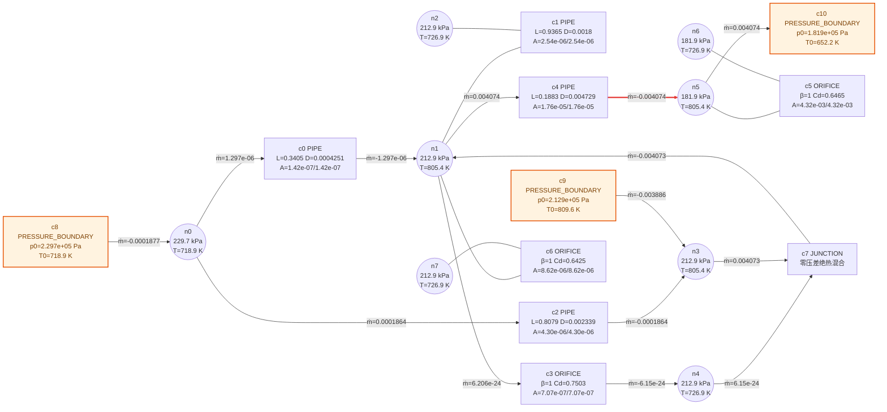

【物理故事】
- 气主要从 c9(压力边界)（供 0.003886 kg/s）, c8(压力边界)（供 0.0001877 kg/s） 进入网络，最后经 c10(压力边界)（排 0.004074 kg/s） 排出。
- c4(直管) 壅塞（流体在该元件最小截面已到声速，流量被"音速天花板"卡死，上游压力再高流量也不涨）。
- 8 步顺利收敛：初值（含容量初值——按元件截面积预估的初始流量）已离解不远。

【关键数字】

| 节点 | 元件 | converged | iters | 告警 | worst ratio | 面积跨度 |
|---|---|---|---|---|---|---|
| 8 | 11 | 是 | 8 | 0 | — | 3.05e+04 |

【为什么选它】它在 T1 规则下入选。

### T1(A0243) 孔板壅塞限流的典型链路

```mermaid
flowchart LR
N0(("n0<br/>244.7 kPa<br/>T=321.8 K"))
N1(("n1<br/>221.1 kPa<br/>T=321.8 K"))
N2(("n2<br/>218.1 kPa<br/>T=321.8 K"))
N3(("n3<br/>437.7 kPa<br/>T=321.8 K"))
N4(("n4<br/>244.7 kPa<br/>T=321.9 K"))
N5(("n5<br/>58.2 kPa<br/>T=321.8 K"))
N6(("n6<br/>385.7 kPa<br/>T=321.8 K"))
N7(("n7<br/>108.6 kPa<br/>T=321.8 K"))
C0["c0 PIPE<br/>L=2.748 D=0.0111<br/>A=9.68e-05/9.68e-05"]
N0 -- "ṁ=0.01587" --> C0
C0 -- "ṁ=-0.01587" --> N1
C1["c1 PIPE<br/>L=5.481 D=0.008557<br/>A=5.75e-05/5.75e-05"]
N1 -- "ṁ=0.001519" --> C1
C1 -- "ṁ=-0.001519" --> N2
C2["c2 ORIFICE<br/>β=1 Cd=0.7151<br/>A=2.20e-07/2.20e-07"]
C2 -- "ṁ=-0.0001553" --> N2
N3 -- "ṁ=0.0001553" --> C2
C3["c3 ORIFICE<br/>β=1 Cd=0.9671<br/>A=1.10e-04/1.10e-04"]
C3 -- "ṁ=-7.442e-05" --> N0
N4 -- "ṁ=7.442e-05" --> C3
C4["c4 PIPE<br/>L=1.583 D=0.0003027<br/>A=7.19e-08/7.19e-08"]
N3 -- "ṁ=4.636e-06" --> C4
C4 -- "ṁ=-4.636e-06" --> N5
C5["c5 PIPE<br/>L=0.1921 D=0.0005952<br/>A=2.78e-07/2.78e-07"]
C5 -- "ṁ=-7.442e-05" --> N4
N6 -- "ṁ=7.442e-05" --> C5
C6["c6 ORIFICE<br/>β=1 Cd=0.5996<br/>A=5.68e-06/5.68e-06"]
N2 -- "ṁ=0.001675" --> C6
C6 -- "ṁ=-0.001675" --> N7
C7["c7 PIPE<br/>L=0.8165 D=0.008284<br/>A=5.39e-05/5.39e-05"]
N1 -- "ṁ=0.0183" --> C7
C7 -- "ṁ=-0.0183" --> N5
C8["c8 ORIFICE<br/>β=1 Cd=0.961<br/>A=3.95e-07/3.95e-07"]
N6 -- "ṁ=0.0003295" --> C8
C8 -- "ṁ=-0.0003295" --> N7
C9["c9 PIPE<br/>L=0.2068 D=0.0006556<br/>A=3.38e-07/3.38e-07"]
N3 -- "ṁ=5.311e-05" --> C9
C9 -- "ṁ=-5.311e-05" --> N6
C10["c10 AREA_CHANGE<br/>ζ=1.942<br/>A=9.80e-04/4.00e-06"]
C10 -- "ṁ=-0.003949" --> N1
N3 -- "ṁ=0.003949" --> C10
C11["c11 AREA_CHANGE<br/>ζ=0.7381<br/>A=7.92e-03/1.28e-04"]
N0 -- "ṁ=0.03783" --> C11
C11 -- "ṁ=-0.03783" --> N5
C12["c12 BOOSTER<br/>p: 2.447e+05→3.857e+05 Pa<br/>增压比 π=1.576"]
C12 -- "ṁ=-0.05363" --> N0
C12 -- "ṁ=-0.0003508" --> N6
C13["c13 PRESSURE_BOUNDARY<br/>p0=4.377e+05 Pa<br/>T0=321.8 K"]
C13 -- "ṁ=-0.004162" --> N3
C14["c14 PRESSURE_BOUNDARY<br/>p0=5.82e+04 Pa<br/>T0=331.6 K"]
N5 -- "ṁ=0.05614" --> C14
C15["c15 PRESSURE_BOUNDARY<br/>p0=1.086e+05 Pa<br/>T0=745.8 K"]
N7 -- "ṁ=0.002004" --> C15
classDef pbound fill:#FFF3E0,stroke:#E65100,stroke-width:2px,color:#7B3F00
classDef msource fill:#F3E5F5,stroke:#8E24AA,stroke-width:2px,color:#6A1B9A
classDef booster fill:#E3F2FD,stroke:#1976D2,stroke-width:2px,color:#0D47A1
classDef softchoked fill:#FFCDD2,stroke:#D32F2F,stroke-width:2.5px,color:#8B0000
class C12 booster
class C13 pbound
class C14 pbound
class C15 pbound
linkStyle 9 stroke:#E53935,stroke-width:3px
linkStyle 15 stroke:#E53935,stroke-width:3px
linkStyle 17 stroke:#E53935,stroke-width:3px
linkStyle 21 stroke:#E53935,stroke-width:3px
linkStyle 23 stroke:#E53935,stroke-width:3px
```

【物理故事】
- 气主要从 c12(增压泵)（供 0.05398 kg/s）, c13(压力边界)（供 0.004162 kg/s） 进入网络，最后经 c14(压力边界)（排 0.05614 kg/s）, c15(压力边界)（排 0.002004 kg/s） 排出。
- c4(直管) 壅塞（流体在该元件最小截面已到声速，流量被"音速天花板"卡死，上游压力再高流量也不涨）。
- 10 步顺利收敛：初值（含容量初值——按元件截面积预估的初始流量）已离解不远。

【关键数字】

| 节点 | 元件 | converged | iters | 告警 | worst ratio | 面积跨度 |
|---|---|---|---|---|---|---|
| 8 | 16 | 是 | 10 | 0 | — | 1.1e+05 |

【为什么选它】它在 T1 规则下入选（同时命中 T2）。

### T2(A0199) 孔板壅塞限流的典型链路

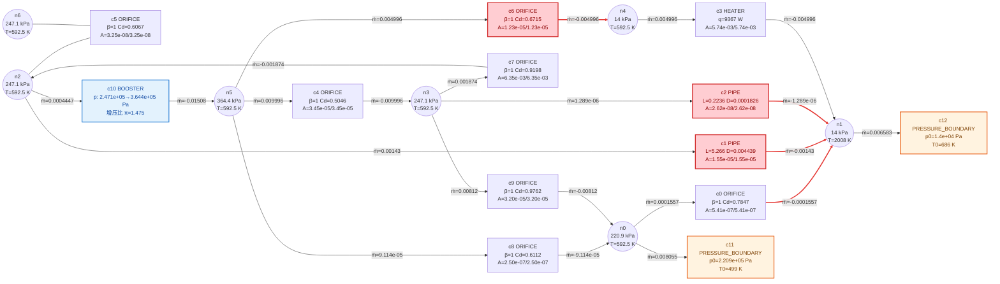

【物理故事】
- 气主要从 c10(增压泵)（供 0.01464 kg/s） 进入网络，最后经 c11(压力边界)（排 0.008055 kg/s）, c12(压力边界)（排 0.006583 kg/s） 排出。
- c0(孔板) 壅塞（流体在该元件最小截面已到声速，流量被"音速天花板"卡死，上游压力再高流量也不涨）。
- 经 14 步挣扎后收敛：初值离解较远，牛顿法多绕了几步。

【关键数字】

| 节点 | 元件 | converged | iters | 告警 | worst ratio | 面积跨度 |
|---|---|---|---|---|---|---|
| 7 | 13 | 是 | 14 | 0 | 0.03744 | 2.42e+05 |

【为什么选它】它在 T2 规则下入选。

### T3(A0093) 加热器被守卫按在 1.00 倍容量上

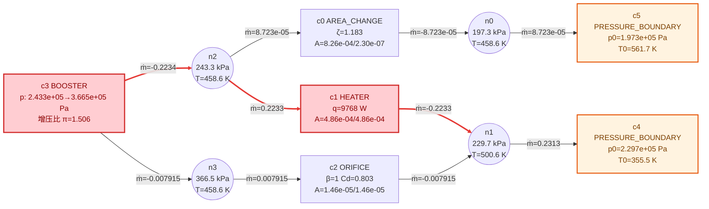

【物理故事】
- 气主要从 c3(增压泵)（供 0.2313 kg/s） 进入网络，最后经 c4(压力边界)（排 0.2313 kg/s）, c5(压力边界)（排 8.723e-05 kg/s） 排出。
- 守卫钉位：c1 口1 的流量被按在声速容量的 1.000 倍（守卫=求解器给不产生压降的元件加的一道"软闸门"，把超过截面积承受力的流量按住），ṁ=-0.2233 kg/s。
- 4 步顺利收敛：初值（含容量初值——按元件截面积预估的初始流量）已离解不远。

【关键数字】

| 节点 | 元件 | converged | iters | 告警 | worst ratio | 面积跨度 |
|---|---|---|---|---|---|---|
| 4 | 6 | 是 | 4 | 1 | 1 | 3.59e+03 |

【为什么选它】它在 T3 规则下入选（同时命中 T4）。

### T3(A0171) 加热器被守卫按在 24.07 倍容量上

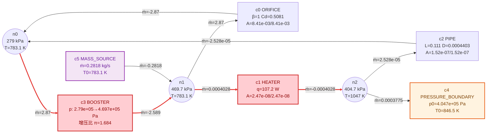

【物理故事】
- 气主要从 c5(流量源)（供 0.2818 kg/s） 进入网络，最后经 c3(增压泵)（排 0.2814 kg/s）, c4(压力边界)（排 0.0003775 kg/s） 排出。
- 守卫钉位：c1 口1 的流量被按在声速容量的 24.074 倍（守卫=求解器给不产生压降的元件加的一道"软闸门"，把超过截面积承受力的流量按住），ṁ=-0.0004028 kg/s。
- 5 步顺利收敛：初值（含容量初值——按元件截面积预估的初始流量）已离解不远。

【关键数字】

| 节点 | 元件 | converged | iters | 告警 | worst ratio | 面积跨度 |
|---|---|---|---|---|---|---|
| 3 | 6 | 是 | 5 | 1 | 24.07 | 3.41e+05 |

【为什么选它】它在 T3 规则下入选（同时命中 T4）。

### T4(A0004) 加热器被守卫按在 1.02 倍容量上

```mermaid
flowchart LR
N0(("n0<br/>549.8 kPa<br/>T=502.9 K"))
N1(("n1<br/>136.1 kPa<br/>T=623.4 K"))
N2(("n2<br/>571 kPa<br/>T=502.9 K"))
N3(("n3<br/>113.1 kPa<br/>T=623.4 K"))
N4(("n4<br/>600.9 kPa<br/>T=637.8 K"))
C0["c0 HEATER<br/>q=253.2 W<br/>A=5.02e-06/5.02e-06"]
N0 -- "ṁ=0.005082" --> C0
C0 -- "ṁ=-0.005082" --> N1
C1["c1 AREA_CHANGE<br/>ζ=1.449<br/>A=1.50e-05/2.11e-05"]
C1 -- "ṁ=-0.005082" --> N0
N2 -- "ṁ=0.005082" --> C1
C2["c2 ORIFICE<br/>β=1 Cd=0.5517<br/>A=3.22e-04/3.22e-04"]
N1 -- "ṁ=0.03007" --> C2
C2 -- "ṁ=-0.03007" --> N3
C3["c3 ORIFICE<br/>β=1 Cd=0.5145<br/>A=5.05e-05/5.05e-05"]
C3 -- "ṁ=-0.02499" --> N1
N4 -- "ṁ=0.02499" --> C3
C4["c4 PRESSURE_BOUNDARY<br/>p0=6.009e+05 Pa<br/>T0=637.8 K"]
C4 -- "ṁ=-0.02499" --> N4
C5["c5 PRESSURE_BOUNDARY<br/>p0=1.131e+05 Pa<br/>T0=821 K"]
N3 -- "ṁ=0.03007" --> C5
C6["c6 PRESSURE_BOUNDARY<br/>p0=5.71e+05 Pa<br/>T0=502.9 K"]
C6 -- "ṁ=-0.005082" --> N2
classDef pbound fill:#FFF3E0,stroke:#E65100,stroke-width:2px,color:#7B3F00
classDef msource fill:#F3E5F5,stroke:#8E24AA,stroke-width:2px,color:#6A1B9A
classDef booster fill:#E3F2FD,stroke:#1976D2,stroke-width:2px,color:#0D47A1
classDef softchoked fill:#FFCDD2,stroke:#D32F2F,stroke-width:2.5px,color:#8B0000
class C0 softchoked
class C3 softchoked
class C4 pbound
class C5 pbound
class C6 pbound
linkStyle 0 stroke:#E53935,stroke-width:3px
linkStyle 1 stroke:#E53935,stroke-width:3px
linkStyle 6 stroke:#E53935,stroke-width:3px
```

【物理故事】
- 气主要从 c4(压力边界)（供 0.02499 kg/s）, c6(压力边界)（供 0.005082 kg/s） 进入网络，最后经 c5(压力边界)（排 0.03007 kg/s） 排出。
- 守卫钉位：c0 口1 的流量被按在声速容量的 1.021 倍（守卫=求解器给不产生压降的元件加的一道"软闸门"，把超过截面积承受力的流量按住），ṁ=-0.005082 kg/s。
- 经 11 步挣扎后收敛：初值离解较远，牛顿法多绕了几步。

【关键数字】

| 节点 | 元件 | converged | iters | 告警 | worst ratio | 面积跨度 |
|---|---|---|---|---|---|---|
| 5 | 7 | 是 | 11 | 1 | 1.021 | 64.1 |

【为什么选它】它在 T4 规则下入选。

### T4(A0203) 加热器被守卫按在 1.01 倍容量上

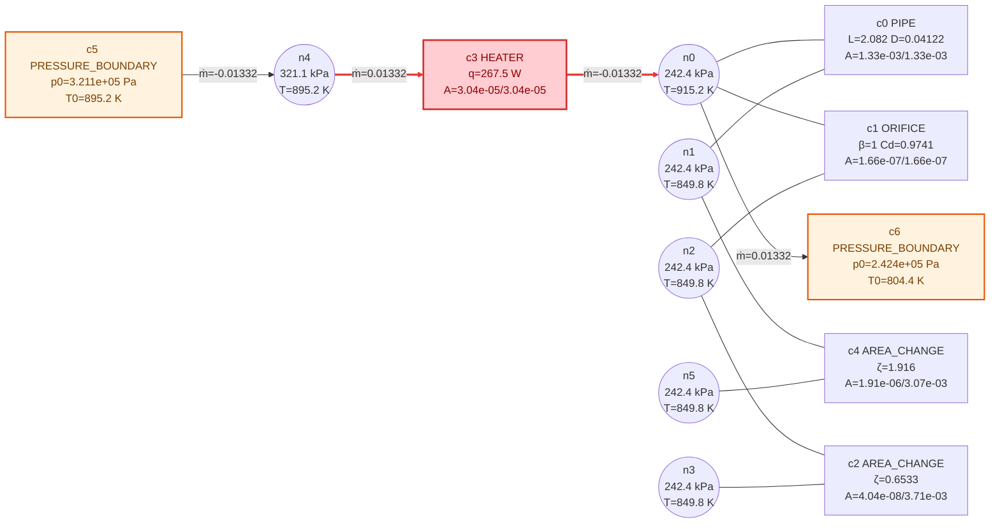

【物理故事】
- 气主要从 c5(压力边界)（供 0.01332 kg/s） 进入网络，最后经 c6(压力边界)（排 0.01332 kg/s） 排出。
- 守卫钉位：c3 口1 的流量被按在声速容量的 1.009 倍（守卫=求解器给不产生压降的元件加的一道"软闸门"，把超过截面积承受力的流量按住），ṁ=0.01332 kg/s。
- 4 步顺利收敛：初值（含容量初值——按元件截面积预估的初始流量）已离解不远。

【关键数字】

| 节点 | 元件 | converged | iters | 告警 | worst ratio | 面积跨度 |
|---|---|---|---|---|---|---|
| 6 | 7 | 是 | 4 | 1 | 1.009 | 9.19e+04 |

【为什么选它】它在 T4 规则下入选。

### T5(A0001) 跨 6396 倍面积的大小肠组合

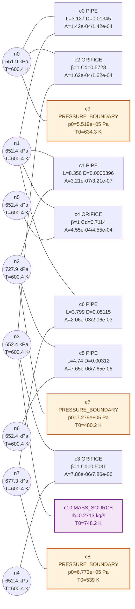

【物理故事】
- 按压力设置，气应从 c7(压力边界)（7.28e+05 Pa）流向 c9(压力边界)（5.52e+05 Pa），但求解未能定出这条路径。
- 卡脖子元件无法定位——解没有算出来。
- 0 步即冻结：初值点上方程对未知量"失明"（零流量死区/零压差死区，导数全为零），牛顿法迈不出第一步。

【关键数字】

| 节点 | 元件 | converged | iters | 告警 | worst ratio | 面积跨度 |
|---|---|---|---|---|---|---|
| 8 | 11 | 否 | 0 | 0 | — | 6.4e+03 |

【为什么选它】它在 T5 规则下入选。

### T5(A0002) 跨 44789 倍面积的大小肠组合

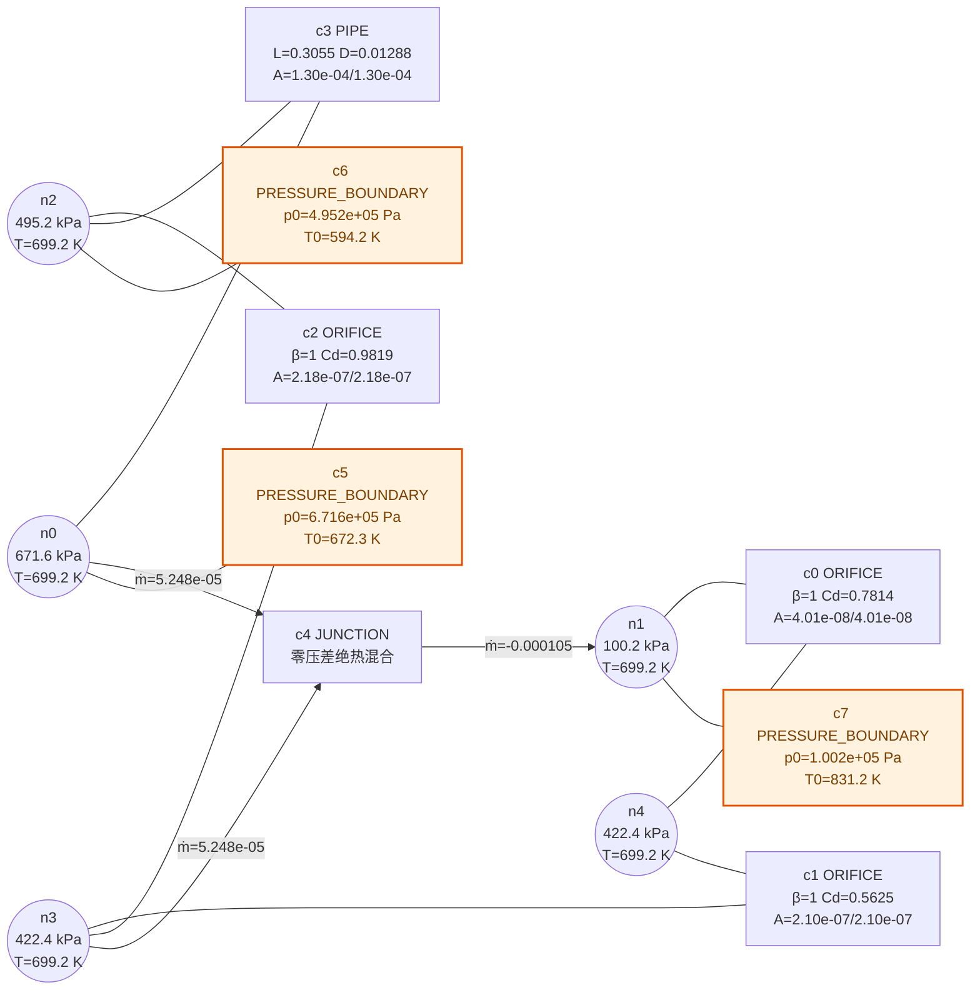

【物理故事】
- 按压力设置，气应从 c5(压力边界)（6.72e+05 Pa）流向 c7(压力边界)（1e+05 Pa），但求解未能定出这条路径。
- 卡脖子元件无法定位——解没有算出来。
- 0 步即冻结：初值点上方程对未知量"失明"（零流量死区/零压差死区，导数全为零），牛顿法迈不出第一步。

【关键数字】

| 节点 | 元件 | converged | iters | 告警 | worst ratio | 面积跨度 |
|---|---|---|---|---|---|---|
| 5 | 8 | 否 | 0 | 0 | — | 4.48e+04 |

【为什么选它】它在 T5 规则下入选。

### T5(A0007) 迭代耗尽的无解嫌疑样本

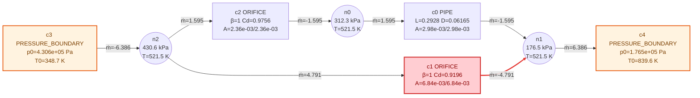

【物理故事】
- 按压力设置，气应从 c3(压力边界)（4.31e+05 Pa）流向 c4(压力边界)（1.77e+05 Pa），但求解未能定出这条路径。
- 卡脖子元件无法定位——解没有算出来。
- 迭代 50 步耗尽仍不达标：要么解在陡峭拐点上来回跳，要么这个网络本来就没有物理解（无解嫌疑）。

【关键数字】

| 节点 | 元件 | converged | iters | 告警 | worst ratio | 面积跨度 |
|---|---|---|---|---|---|---|
| 3 | 5 | 否 | 50 | 0 | — | 2.9 |

【为什么选它】它在 T5 规则下入选。

### T5(A0019) 跨 66388 倍面积的大小肠组合

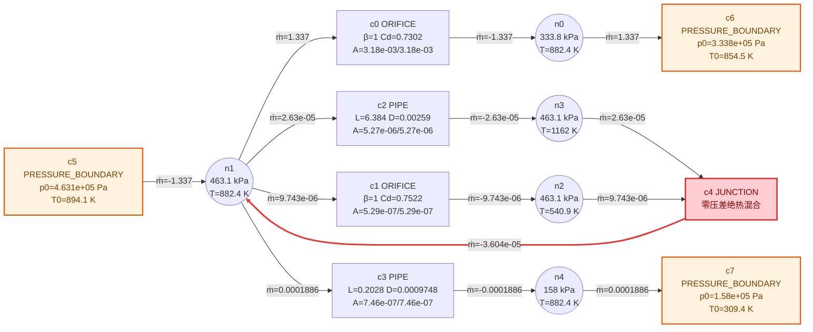

【物理故事】
- 按压力设置，气应从 c5(压力边界)（4.63e+05 Pa）流向 c7(压力边界)（1.58e+05 Pa），但求解未能定出这条路径。
- 卡脖子元件无法定位——解没有算出来。
- 迭代 50 步耗尽仍不达标：要么解在陡峭拐点上来回跳，要么这个网络本来就没有物理解（无解嫌疑）。

【关键数字】

| 节点 | 元件 | converged | iters | 告警 | worst ratio | 面积跨度 |
|---|---|---|---|---|---|---|
| 5 | 8 | 否 | 50 | 0 | — | 6.64e+04 |

【为什么选它】它在 T5 规则下入选。

### T6(A0212) 跨 927736 倍面积的大小肠组合

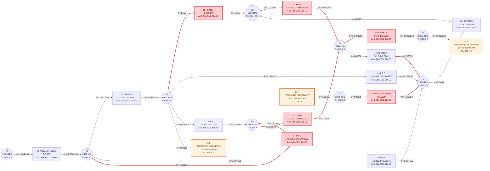

【物理故事】
- 按压力设置，气应从 c13(压力边界)（8.99e+05 Pa）流向 c14(压力边界)（1.59e+05 Pa），但求解未能定出这条路径。
- 卡脖子元件无法定位——解没有算出来。
- 1 步后线搜索失败中止：中途踏进残差上升区，保守起见放弃（失败分类器是后续项）。

【关键数字】

| 节点 | 元件 | converged | iters | 告警 | worst ratio | 面积跨度 |
|---|---|---|---|---|---|---|
| 9 | 16 | 否 | 1 | 0 | 1.035 | 9.28e+05 |

【为什么选它】它在 T6 规则下入选。

### T6(A0082) 跨 917667 倍面积的大小肠组合

```mermaid
flowchart LR
N0(("n0<br/>144.3 kPa<br/>T=601.5 K"))
N1(("n1<br/>406.1 kPa<br/>T=601.5 K"))
N2(("n2<br/>407.7 kPa<br/>T=601.5 K"))
N3(("n3<br/>144.3 kPa<br/>T=601.5 K"))
N4(("n4<br/>406.1 kPa<br/>T=601.5 K"))
N5(("n5<br/>144.3 kPa<br/>T=601.5 K"))
N6(("n6<br/>264 kPa<br/>T=601.5 K"))
N7(("n7<br/>144.3 kPa<br/>T=601.5 K"))
N8(("n8<br/>144.3 kPa<br/>T=601.5 K"))
N9(("n9<br/>144.3 kPa<br/>T=601.5 K"))
C0["c0 PIPE<br/>L=0.5158 D=0.002343<br/>A=4.31e-06/4.31e-06"]
C0 -- "ṁ=-8.84e-05" --> N0
N1 -- "ṁ=8.84e-05" --> C0
C1["c1 ORIFICE<br/>β=1 Cd=0.84<br/>A=4.42e-06/4.42e-06"]
N0 --- C1
N2 --- C1
C2["c2 ORIFICE<br/>β=1 Cd=0.8044<br/>A=7.29e-05/7.29e-05"]
C2 -- "ṁ=-8.84e-05" --> N1
N3 -- "ṁ=8.84e-05" --> C2
C3["c3 ORIFICE<br/>β=1 Cd=0.5835<br/>A=4.85e-03/4.85e-03"]
N3 --- C3
N4 --- C3
C4["c4 AREA_CHANGE<br/>ζ=0.9299<br/>A=1.02e-08/4.66e-08"]
N2 --- C4
N5 --- C4
C5["c5 PIPE<br/>L=0.4386 D=0.0009452<br/>A=7.02e-07/7.02e-07"]
C5 -- "ṁ=-8.84e-05" --> N3
N6 -- "ṁ=8.84e-05" --> C5
C6["c6 PIPE<br/>L=1.483 D=0.0006948<br/>A=3.79e-07/3.79e-07"]
N1 --- C6
N7 --- C6
C7["c7 ORIFICE<br/>β=1 Cd=0.8128<br/>A=1.37e-07/1.37e-07"]
N4 --- C7
N8 --- C7
C8["c8 PIPE<br/>L=1.17 D=0.109<br/>A=9.33e-03/9.33e-03"]
N0 -- "ṁ=8.84e-05" --> C8
C8 -- "ṁ=-8.84e-05" --> N9
C9["c9 PRESSURE_BOUNDARY<br/>p0=2.64e+05 Pa<br/>T0=620 K"]
C9 -- "ṁ=-8.84e-05" --> N6
C10["c10 PRESSURE_BOUNDARY<br/>p0=1.443e+05 Pa<br/>T0=583 K"]
N9 -- "ṁ=8.84e-05" --> C10
classDef pbound fill:#FFF3E0,stroke:#E65100,stroke-width:2px,color:#7B3F00
classDef msource fill:#F3E5F5,stroke:#8E24AA,stroke-width:2px,color:#6A1B9A
classDef booster fill:#E3F2FD,stroke:#1976D2,stroke-width:2px,color:#0D47A1
classDef softchoked fill:#FFCDD2,stroke:#D32F2F,stroke-width:2.5px,color:#8B0000
class C5 softchoked
class C9 pbound
class C10 pbound
linkStyle 10 stroke:#E53935,stroke-width:3px
```

【物理故事】
- 按压力设置，气应从 c9(压力边界)（2.64e+05 Pa）流向 c10(压力边界)（1.44e+05 Pa），但求解未能定出这条路径。
- 卡脖子元件无法定位——解没有算出来。
- 1 步后线搜索失败中止：中途踏进残差上升区，保守起见放弃（失败分类器是后续项）。

【关键数字】

| 节点 | 元件 | converged | iters | 告警 | worst ratio | 面积跨度 |
|---|---|---|---|---|---|---|
| 10 | 11 | 否 | 1 | 0 | — | 9.18e+05 |

【为什么选它】它在 T6 规则下入选。

### T7(C1_orifice_00) 2 节点网络的顺利求解

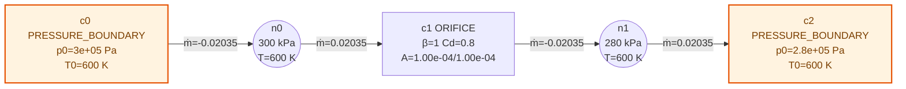

【物理故事】
- 气主要从 c0(压力边界)（供 0.02035 kg/s） 进入网络，最后经 c2(压力边界)（排 0.02035 kg/s） 排出。
- c1(孔板) 的孔口节流吃掉了全网最大的压差 (2e+04 Pa)。
- 1 步顺利收敛：初值（含容量初值——按元件截面积预估的初始流量）已离解不远。

【关键数字】

| 节点 | 元件 | converged | iters | 告警 | worst ratio | 面积跨度 |
|---|---|---|---|---|---|---|
| 2 | 3 | 是 | 1 | 0 | — | 1 |

【为什么选它】它在 T7 规则下入选。

### T7(C2_01_A1e-2_A1e-6) 跨 10000 倍面积的大小肠组合

```mermaid
flowchart LR
N0(("n0<br/>300 kPa<br/>T=600 K"))
N1(("n1<br/>300 kPa<br/>T=600 K"))
N2(("n2<br/>100 kPa<br/>T=600 K"))
C0["c0 PRESSURE_BOUNDARY<br/>p0=3e+05 Pa<br/>T0=600 K"]
C0 -- "ṁ=-0.000396" --> N0
C1["c1 ORIFICE<br/>β=1 Cd=0.8<br/>A=1.00e-02/1.00e-02"]
N0 -- "ṁ=0.000396" --> C1
C1 -- "ṁ=-0.000396" --> N1
C2["c2 ORIFICE<br/>β=1 Cd=0.8<br/>A=1.00e-06/1.00e-06"]
N1 -- "ṁ=0.000396" --> C2
C2 -- "ṁ=-0.000396" --> N2
C3["c3 PRESSURE_BOUNDARY<br/>p0=1e+05 Pa<br/>T0=600 K"]
N2 -- "ṁ=0.000396" --> C3
classDef pbound fill:#FFF3E0,stroke:#E65100,stroke-width:2px,color:#7B3F00
classDef msource fill:#F3E5F5,stroke:#8E24AA,stroke-width:2px,color:#6A1B9A
classDef booster fill:#E3F2FD,stroke:#1976D2,stroke-width:2px,color:#0D47A1
classDef softchoked fill:#FFCDD2,stroke:#D32F2F,stroke-width:2.5px,color:#8B0000
class C0 pbound
class C3 pbound
linkStyle 4 stroke:#E53935,stroke-width:3px
```

【物理故事】
- 按压力设置，气应从 c0(压力边界)（3e+05 Pa）流向 c3(压力边界)（1e+05 Pa），但求解未能定出这条路径。
- 卡脖子元件无法定位——解没有算出来。
- 9 步后线搜索失败中止：中途踏进残差上升区，保守起见放弃（失败分类器是后续项）。

【关键数字】

| 节点 | 元件 | converged | iters | 告警 | worst ratio | 面积跨度 |
|---|---|---|---|---|---|---|
| 3 | 4 | 否 | 9 | 0 | — | 1e+04 |

【为什么选它】它在 T7 规则下入选。

