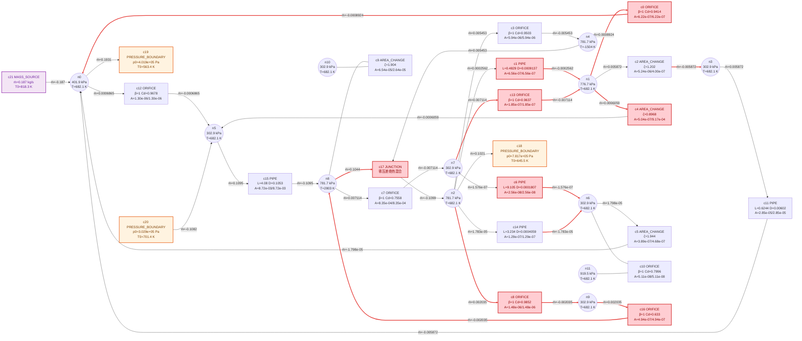
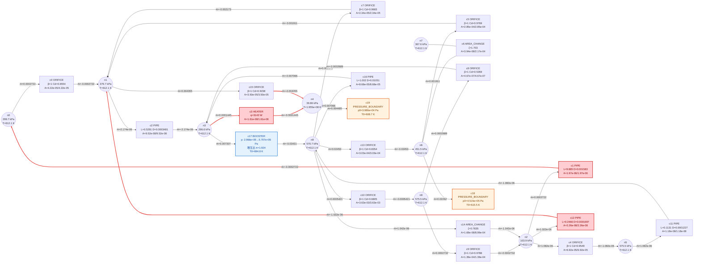
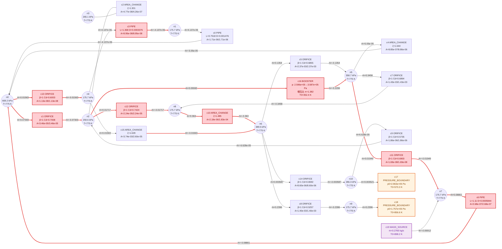

# pysas fuzz 复杂网络专项（复杂度 top10）

- 日期：2026-10-02
- 复杂度定义：节点数 + 元件数 + (含 JUNCTION?×3) + (含 BOOSTER?×3) + (含 HEATER?×2) + log10(面积跨度)

## 复杂度排行（前 10，可复算）

| 排名 | case | 分数 | 节点 | 元件 | J/B/H 加成 | log10(跨度) | 状态 | iters | 告警 |
|---|---|---|---|---|---|---|---|---|---|
| 1 | A0296 | 44.76 | 12 | 24 | 3 | 5.76 | clean_fail | 0 | 0 |
| 2 | A0166 | 43.38 | 12 | 24 | 2 | 5.38 | clean_fail | 0 | 0 |
| 3 | A0162 | 42.53 | 12 | 22 | 3 | 5.53 | clean_fail | 1 | 0 |
| 4 | A0248 | 41.69 | 11 | 23 | 2 | 5.69 | clean_fail | 2 | 0 |
| 5 | A0060 | 40.49 | 10 | 20 | 5 | 5.49 | clean_fail | 1 | 0 |
| 6 | A0193 | 40.46 | 12 | 20 | 3 | 5.46 | clean_fail | 0 | 0 |
| 7 | A0032 | 39.76 | 11 | 21 | 2 | 5.76 | clean_fail | 2 | 0 |
| 8 | A0151 | 39.60 | 12 | 19 | 3 | 5.60 | clean_fail | 6 | 0 |
| 9 | A0230 | 39.52 | 11 | 20 | 3 | 5.52 | clean_fail | 1 | 0 |
| 10 | A0145 | 38.87 | 11 | 22 | 0 | 5.87 | clean_fail | 0 | 0 |

## top10 vs 其余语料

| 组 | 例数 | converged | 收敛率 | iters 中位数 | 告警例 |
|---|---|---|---|---|---|
| 复杂度 top10 | 10 | 0 | 0.0% | — | 0 |
| 其余语料 | 379 | 128 | 33.8% | 1 | 4 |

**一句话结论**：复杂度 top10 收敛率 0.0% 低于其余语料的 33.8%（iters 中位数 — vs 1，告警率 0% vs 1%）——复杂网络确实更难收敛——top10 全部 clean_fail，大规模+多类型组合超出 default_guess 收敛域

## 复杂例 1：A0296（分数 44.76）

### P1(A0296) 跨 577821 倍面积的大小肠组合

```mermaid
flowchart LR
N0(("n0<br/>151.2 kPa<br/>T=591.5 K"))
N1(("n1<br/>151.2 kPa<br/>T=591.5 K"))
N2(("n2<br/>151.2 kPa<br/>T=591.5 K"))
N3(("n3<br/>151.2 kPa<br/>T=591.5 K"))
N4(("n4<br/>151.2 kPa<br/>T=591.5 K"))
N5(("n5<br/>151.2 kPa<br/>T=591.5 K"))
N6(("n6<br/>209.9 kPa<br/>T=591.5 K"))
N7(("n7<br/>151.2 kPa<br/>T=591.5 K"))
N8(("n8<br/>92.46 kPa<br/>T=591.5 K"))
N9(("n9<br/>151.2 kPa<br/>T=591.5 K"))
N10(("n10<br/>151.2 kPa<br/>T=591.5 K"))
N11(("n11<br/>151.2 kPa<br/>T=591.5 K"))
C0["c0 PIPE<br/>L=6.853 D=0.0001603<br/>A=2.02e-08/2.02e-08"]
N0 --- C0
N1 --- C0
C1["c1 ORIFICE<br/>β=1 Cd=0.9304<br/>A=6.12e-03/6.12e-03"]
N0 --- C1
N2 --- C1
C2["c2 ORIFICE<br/>β=1 Cd=0.7357<br/>A=5.01e-03/5.01e-03"]
N0 --- C2
N3 --- C2
C3["c3 PIPE<br/>L=2.504 D=0.01511<br/>A=1.79e-04/1.79e-04"]
N1 --- C3
N4 --- C3
C4["c4 ORIFICE<br/>β=1 Cd=0.6105<br/>A=2.43e-03/2.43e-03"]
N0 --- C4
N5 --- C4
C5["c5 ORIFICE<br/>β=1 Cd=0.5224<br/>A=9.75e-05/9.75e-05"]
N1 --- C5
N6 --- C5
C6["c6 ORIFICE<br/>β=1 Cd=0.6354<br/>A=6.38e-05/6.38e-05"]
N5 --- C6
N7 --- C6
C7["c7 ORIFICE<br/>β=1 Cd=0.9601<br/>A=1.06e-08/1.06e-08"]
N7 --- C7
N8 --- C7
C8["c8 AREA_CHANGE<br/>ζ=1.746<br/>A=1.09e-03/1.12e-08"]
N7 --- C8
N9 --- C8
C9["c9 AREA_CHANGE<br/>ζ=1.724<br/>A=1.51e-07/4.50e-05"]
N3 --- C9
N10 --- C9
C10["c10 PIPE<br/>L=2.168 D=0.01909<br/>A=2.86e-04/2.86e-04"]
N3 --- C10
N11 --- C10
C11["c11 ORIFICE<br/>β=1 Cd=0.5836<br/>A=6.57e-04/6.57e-04"]
N7 --- C11
N10 --- C11
C12["c12 ORIFICE<br/>β=1 Cd=0.8029<br/>A=1.64e-06/1.64e-06"]
N3 --- C12
N4 --- C12
C13["c13 AREA_CHANGE<br/>ζ=1.759<br/>A=1.28e-06/5.37e-07"]
N2 --- C13
N5 --- C13
C14["c14 ORIFICE<br/>β=1 Cd=0.6404<br/>A=8.56e-08/8.56e-08"]
N1 --- C14
N9 --- C14
C15["c15 AREA_CHANGE<br/>ζ=1.804<br/>A=2.73e-03/3.57e-05"]
N5 --- C15
N11 --- C15
C16["c16 ORIFICE<br/>β=1 Cd=0.6097<br/>A=1.14e-03/1.14e-03"]
N7 --- C16
N11 --- C16
C17["c17 ORIFICE<br/>β=1 Cd=0.5277<br/>A=1.41e-05/1.41e-05"]
N1 --- C17
N11 --- C17
C18["c18 ORIFICE<br/>β=1 Cd=0.5736<br/>A=1.67e-05/1.67e-05"]
N2 --- C18
N11 --- C18
C19["c19 ORIFICE<br/>β=1 Cd=0.7049<br/>A=1.18e-04/1.18e-04"]
N0 --- C19
N7 --- C19
C20["c20 JUNCTION<br/>零压差绝热混合"]
N7 --- C20
N5 --- C20
N0 --- C20
C21["c21 PRESSURE_BOUNDARY<br/>p0=2.099e+05 Pa<br/>T0=778.3 K"]
N6 --- C21
C22["c22 PRESSURE_BOUNDARY<br/>p0=9.246e+04 Pa<br/>T0=489.2 K"]
N8 --- C22
C23["c23 MASS_SOURCE<br/>ṁ=-0.2811 kg/s<br/>T0=507.1 K"]
N10 --- C23
classDef pbound fill:#FFF3E0,stroke:#E65100,stroke-width:2px,color:#7B3F00
classDef msource fill:#F3E5F5,stroke:#8E24AA,stroke-width:2px,color:#6A1B9A
classDef booster fill:#E3F2FD,stroke:#1976D2,stroke-width:2px,color:#0D47A1
classDef softchoked fill:#FFCDD2,stroke:#D32F2F,stroke-width:2.5px,color:#8B0000
class C21 pbound
class C22 pbound
class C23 msource
```

【物理故事】
- 按压力设置，气应从 c21(压力边界)（2.1e+05 Pa）流向 c22(压力边界)（9.25e+04 Pa），但求解未能定出这条路径。
- 卡脖子元件无法定位——解没有算出来。
- 0 步即冻结：初值点上方程对未知量"失明"（零流量死区/零压差死区，导数全为零），牛顿法迈不出第一步。

【关键数字】

| 节点 | 元件 | converged | iters | 告警 | worst ratio | 面积跨度 |
|---|---|---|---|---|---|---|
| 12 | 24 | 否 | 0 | 0 | — | 5.78e+05 |

【为什么选它】它在 P1 规则下入选。

_（本例无守卫口径合格行：无非锚定两口压力行元件。）_

## 复杂例 2：A0166（分数 43.38）

### P1(A0166) 跨 239111 倍面积的大小肠组合

```mermaid
flowchart LR
N0(("n0<br/>279.5 kPa<br/>T=540.6 K"))
N1(("n1<br/>429.9 kPa<br/>T=540.6 K"))
N2(("n2<br/>279.5 kPa<br/>T=540.6 K"))
N3(("n3<br/>279.5 kPa<br/>T=540.6 K"))
N4(("n4<br/>279.5 kPa<br/>T=540.6 K"))
N5(("n5<br/>279.5 kPa<br/>T=540.6 K"))
N6(("n6<br/>279.5 kPa<br/>T=540.6 K"))
N7(("n7<br/>279.5 kPa<br/>T=540.6 K"))
N8(("n8<br/>129.2 kPa<br/>T=540.6 K"))
N9(("n9<br/>279.5 kPa<br/>T=540.6 K"))
N10(("n10<br/>279.5 kPa<br/>T=540.6 K"))
N11(("n11<br/>279.5 kPa<br/>T=540.6 K"))
C0["c0 HEATER<br/>q=9399 W<br/>A=8.52e-04/8.52e-04"]
C0 -- "ṁ=-0.7001" --> N0
N1 -- "ṁ=0.7001" --> C0
C1["c1 ORIFICE<br/>β=1 Cd=0.901<br/>A=3.42e-03/3.42e-03"]
N1 --- C1
N2 --- C1
C2["c2 ORIFICE<br/>β=1 Cd=0.7835<br/>A=2.60e-07/2.60e-07"]
N0 --- C2
N3 --- C2
C3["c3 ORIFICE<br/>β=1 Cd=0.9958<br/>A=1.48e-06/1.48e-06"]
N1 --- C3
N4 --- C3
C4["c4 ORIFICE<br/>β=1 Cd=0.7992<br/>A=7.04e-06/7.04e-06"]
N2 --- C4
N5 --- C4
C5["c5 ORIFICE<br/>β=1 Cd=0.6833<br/>A=1.72e-06/1.72e-06"]
N4 --- C5
N6 --- C5
C6["c6 ORIFICE<br/>β=1 Cd=0.7873<br/>A=2.30e-07/2.30e-07"]
N2 --- C6
N7 --- C6
C7["c7 PIPE<br/>L=0.1691 D=0.02223<br/>A=3.88e-04/3.88e-04"]
N7 --- C7
N8 --- C7
C8["c8 ORIFICE<br/>β=1 Cd=0.9073<br/>A=9.22e-03/9.22e-03"]
N3 --- C8
N9 --- C8
C9["c9 PIPE<br/>L=0.2226 D=0.02541<br/>A=5.07e-04/5.07e-04"]
N3 --- C9
N10 --- C9
C10["c10 ORIFICE<br/>β=1 Cd=0.5118<br/>A=6.60e-04/6.60e-04"]
N8 --- C10
N11 --- C10
C11["c11 ORIFICE<br/>β=1 Cd=0.7806<br/>A=7.03e-03/7.03e-03"]
N1 --- C11
N8 --- C11
C12["c12 ORIFICE<br/>β=1 Cd=0.8608<br/>A=9.37e-04/9.37e-04"]
N4 --- C12
N8 --- C12
C13["c13 PIPE<br/>L=0.3625 D=0.01035<br/>A=8.42e-05/8.42e-05"]
N8 --- C13
N9 --- C13
C14["c14 PIPE<br/>L=1.637 D=0.0007961<br/>A=4.98e-07/4.98e-07"]
N9 --- C14
N11 --- C14
C15["c15 PIPE<br/>L=2.941 D=0.0002362<br/>A=4.38e-08/4.38e-08"]
N1 --- C15
N9 --- C15
C16["c16 AREA_CHANGE<br/>ζ=1.997<br/>A=3.86e-08/2.25e-04"]
N4 --- C16
N7 --- C16
C17["c17 ORIFICE<br/>β=1 Cd=0.916<br/>A=3.10e-06/3.10e-06"]
N2 --- C17
N3 --- C17
C18["c18 ORIFICE<br/>β=1 Cd=0.8153<br/>A=7.42e-06/7.42e-06"]
N0 --- C18
N8 --- C18
C19["c19 AREA_CHANGE<br/>ζ=1.736<br/>A=2.65e-04/4.90e-04"]
N2 --- C19
N4 --- C19
C20["c20 PIPE<br/>L=0.123 D=0.0007321<br/>A=4.21e-07/4.21e-07"]
N5 --- C20
N9 --- C20
C21["c21 AREA_CHANGE<br/>ζ=0.4661<br/>A=1.78e-03/4.79e-07"]
N1 --- C21
N6 --- C21
C22["c22 PRESSURE_BOUNDARY<br/>p0=4.299e+05 Pa<br/>T0=596.2 K"]
N1 --- C22
C23["c23 PRESSURE_BOUNDARY<br/>p0=1.292e+05 Pa<br/>T0=485 K"]
N8 --- C23
classDef pbound fill:#FFF3E0,stroke:#E65100,stroke-width:2px,color:#7B3F00
classDef msource fill:#F3E5F5,stroke:#8E24AA,stroke-width:2px,color:#6A1B9A
classDef booster fill:#E3F2FD,stroke:#1976D2,stroke-width:2px,color:#0D47A1
classDef softchoked fill:#FFCDD2,stroke:#D32F2F,stroke-width:2.5px,color:#8B0000
class C0 softchoked
class C22 pbound
class C23 pbound
linkStyle 0 stroke:#E53935,stroke-width:3px
linkStyle 1 stroke:#E53935,stroke-width:3px
```

【物理故事】
- 按压力设置，气应从 c22(压力边界)（4.3e+05 Pa）流向 c23(压力边界)（1.29e+05 Pa），但求解未能定出这条路径。
- 卡脖子元件无法定位——解没有算出来。
- 0 步即冻结：初值点上方程对未知量"失明"（零流量死区/零压差死区，导数全为零），牛顿法迈不出第一步。

【关键数字】

| 节点 | 元件 | converged | iters | 告警 | worst ratio | 面积跨度 |
|---|---|---|---|---|---|---|
| 12 | 24 | 否 | 0 | 0 | 1.1 | 2.39e+05 |

【为什么选它】它在 P1 规则下入选。

守卫口径逐元件表（非锚定两口件逐行；ratio=|ṁ|/cap，cap=upwind 声速容量）：

| 元件 | 口 | ṁ [kg/s] | cap [kg/s] | ratio | 状态 |
|---|---|---|---|---|---|
| c0 | 1 | 0.7001 | 0.6364 | 1.1 | ⚠️ 超容（守卫激活） |

## 复杂例 3：A0162（分数 42.53）

### P1(A0162) 跨 339865 倍面积的大小肠组合

【物理故事】
- 按压力设置，气应从 c18(压力边界)（7.82e+05 Pa）流向 c20(压力边界)（3.03e+05 Pa），但求解未能定出这条路径。
- 卡脖子元件无法定位——解没有算出来。
- 1 步后线搜索失败中止：中途踏进残差上升区，保守起见放弃（失败分类器是后续项）。

【关键数字】

| 节点 | 元件 | converged | iters | 告警 | worst ratio | 面积跨度 |
|---|---|---|---|---|---|---|
| 12 | 22 | 否 | 1 | 0 | — | 3.4e+05 |

【为什么选它】它在 P1 规则下入选。

_（本例无守卫口径合格行：无非锚定两口压力行元件。）_

## 复杂例 4：A0248（分数 41.69）

### P1(A0248) 跨 490547 倍面积的大小肠组合

```mermaid
flowchart LR
N0(("n0<br/>130.1 kPa<br/>T=713.8 K"))
N1(("n1<br/>1750 kPa<br/>T=1128 K"))
N2(("n2<br/>225.5 kPa<br/>T=731 K"))
N3(("n3<br/>130.1 kPa<br/>T=701.9 K"))
N4(("n4<br/>130.1 kPa<br/>T=680.1 K"))
N5(("n5<br/>525.3 kPa<br/>T=719.5 K"))
N6(("n6<br/>130.1 kPa<br/>T=705.6 K"))
N7(("n7<br/>130.1 kPa<br/>T=702.8 K"))
N8(("n8<br/>211.1 kPa<br/>T=701.9 K"))
N9(("n9<br/>130.1 kPa<br/>T=713.8 K"))
N10(("n10<br/>209.6 kPa<br/>T=731 K"))
C0["c0 PIPE<br/>L=0.9354 D=0.0003549<br/>A=9.89e-08/9.89e-08"]
C0 -- "ṁ=-0.0001592" --> N0
N1 -- "ṁ=0.0001592" --> C0
C1["c1 PIPE<br/>L=4.685 D=0.001936<br/>A=2.94e-06/2.94e-06"]
C1 -- "ṁ=-0.02626" --> N0
N2 -- "ṁ=0.02626" --> C1
C2["c2 HEATER<br/>q=6333 W<br/>A=2.52e-04/2.52e-04"]
N0 -- "ṁ=0.03114" --> C2
C2 -- "ṁ=-0.03114" --> N3
C3["c3 ORIFICE<br/>β=1 Cd=0.7242<br/>A=2.71e-03/2.71e-03"]
C3 -- "ṁ=-6.235e-05" --> N3
N4 -- "ṁ=6.235e-05" --> C3
C4["c4 PIPE<br/>L=0.1663 D=0.0009965<br/>A=7.80e-07/7.80e-07"]
N1 -- "ṁ=0.001652" --> C4
C4 -- "ṁ=-0.001652" --> N5
C5["c5 PIPE<br/>L=1.111 D=0.0002924<br/>A=6.71e-08/6.71e-08"]
C5 -- "ṁ=-6.235e-05" --> N4
N6 -- "ṁ=6.235e-05" --> C5
C6["c6 PIPE<br/>L=0.1796 D=0.002664<br/>A=5.58e-06/5.58e-06"]
N3 -- "ṁ=0.04436" --> C6
C6 -- "ṁ=-0.04436" --> N7
C7["c7 ORIFICE<br/>β=1 Cd=0.6662<br/>A=1.23e-08/1.23e-08"]
C7 -- "ṁ=-0.0002968" --> N7
N8 -- "ṁ=0.0002968" --> C7
C8["c8 ORIFICE<br/>β=1 Cd=0.5203<br/>A=1.72e-08/1.72e-08"]
C8 -- "ṁ=-2.675e-05" --> N5
N9 -- "ṁ=2.675e-05" --> C8
C9["c9 AREA_CHANGE<br/>ζ=1.942<br/>A=1.52e-07/8.25e-05"]
N1 -- "ṁ=0.0025" --> C9
C9 -- "ṁ=-0.0025" --> N10
C10["c10 ORIFICE<br/>β=1 Cd=0.9679<br/>A=1.77e-08/1.77e-08"]
N6 -- "ṁ=3.661e-05" --> C10
C10 -- "ṁ=-3.661e-05" --> N9
C11["c11 PIPE<br/>L=1.627 D=0.001494<br/>A=1.75e-06/1.75e-06"]
N1 -- "ṁ=0.008537" --> C11
C11 -- "ṁ=-0.008537" --> N9
C12["c12 ORIFICE<br/>β=1 Cd=0.7172<br/>A=4.97e-07/4.97e-07"]
N0 -- "ṁ=0.04848" --> C12
C12 -- "ṁ=-0.04848" --> N10
C13["c13 ORIFICE<br/>β=1 Cd=0.9717<br/>A=7.08e-04/7.08e-04"]
C13 -- "ṁ=-0.04465" --> N0
N7 -- "ṁ=0.04465" --> C13
C14["c14 ORIFICE<br/>β=1 Cd=0.9673<br/>A=1.09e-03/1.09e-03"]
C14 -- "ṁ=-0.05098" --> N2
N10 -- "ṁ=0.05098" --> C14
C15["c15 ORIFICE<br/>β=1 Cd=0.6379<br/>A=3.29e-07/3.29e-07"]
C15 -- "ṁ=-0.008547" --> N0
N9 -- "ṁ=0.008547" --> C15
C16["c16 AREA_CHANGE<br/>ζ=1.288<br/>A=5.70e-08/3.73e-05"]
C16 -- "ṁ=-0.001508" --> N3
N6 -- "ṁ=0.001508" --> C16
C17["c17 PIPE<br/>L=0.6224 D=0.08768<br/>A=6.04e-03/6.04e-03"]
C17 -- "ṁ=-0.01165" --> N3
N8 -- "ṁ=0.01165" --> C17
C18["c18 ORIFICE<br/>β=1 Cd=0.6596<br/>A=2.79e-06/2.79e-06"]
C18 -- "ṁ=-0.001678" --> N2
N5 -- "ṁ=0.001678" --> C18
C19["c19 PRESSURE_BOUNDARY<br/>p0=2.255e+05 Pa<br/>T0=790.3 K"]
N2 -- "ṁ=0.0264" --> C19
C20["c20 PRESSURE_BOUNDARY<br/>p0=1.301e+05 Pa<br/>T0=370.6 K"]
C20 -- "ṁ=-0.001607" --> N6
C21["c21 PRESSURE_BOUNDARY<br/>p0=2.111e+05 Pa<br/>T0=317 K"]
C21 -- "ṁ=-0.01195" --> N8
C22["c22 MASS_SOURCE<br/>ṁ=0.08434 kg/s<br/>T0=698.7 K"]
C22 -- "ṁ=-0.01285" --> N1
classDef pbound fill:#FFF3E0,stroke:#E65100,stroke-width:2px,color:#7B3F00
classDef msource fill:#F3E5F5,stroke:#8E24AA,stroke-width:2px,color:#6A1B9A
classDef booster fill:#E3F2FD,stroke:#1976D2,stroke-width:2px,color:#0D47A1
classDef softchoked fill:#FFCDD2,stroke:#D32F2F,stroke-width:2.5px,color:#8B0000
class C0 softchoked
class C1 softchoked
class C4 softchoked
class C5 softchoked
class C6 softchoked
class C7 softchoked
class C8 softchoked
class C9 softchoked
class C10 softchoked
class C11 softchoked
class C12 softchoked
class C15 softchoked
class C16 softchoked
class C19 pbound
class C20 pbound
class C21 pbound
class C22 msource
linkStyle 0 stroke:#E53935,stroke-width:3px
linkStyle 2 stroke:#E53935,stroke-width:3px
linkStyle 3 stroke:#E53935,stroke-width:3px
linkStyle 8 stroke:#E53935,stroke-width:3px
linkStyle 9 stroke:#E53935,stroke-width:3px
linkStyle 10 stroke:#E53935,stroke-width:3px
linkStyle 11 stroke:#E53935,stroke-width:3px
linkStyle 12 stroke:#E53935,stroke-width:3px
linkStyle 13 stroke:#E53935,stroke-width:3px
linkStyle 14 stroke:#E53935,stroke-width:3px
linkStyle 15 stroke:#E53935,stroke-width:3px
linkStyle 16 stroke:#E53935,stroke-width:3px
linkStyle 17 stroke:#E53935,stroke-width:3px
linkStyle 18 stroke:#E53935,stroke-width:3px
linkStyle 20 stroke:#E53935,stroke-width:3px
linkStyle 21 stroke:#E53935,stroke-width:3px
linkStyle 22 stroke:#E53935,stroke-width:3px
linkStyle 23 stroke:#E53935,stroke-width:3px
linkStyle 24 stroke:#E53935,stroke-width:3px
linkStyle 25 stroke:#E53935,stroke-width:3px
linkStyle 30 stroke:#E53935,stroke-width:3px
linkStyle 31 stroke:#E53935,stroke-width:3px
linkStyle 32 stroke:#E53935,stroke-width:3px
```

【物理故事】
- 按压力设置，气应从 c19(压力边界)（2.26e+05 Pa）流向 c20(压力边界)（1.3e+05 Pa），但求解未能定出这条路径。
- 卡脖子元件无法定位——解没有算出来。
- 2 步后线搜索失败中止：中途踏进残差上升区，保守起见放弃（失败分类器是后续项）。

【关键数字】

| 节点 | 元件 | converged | iters | 告警 | worst ratio | 面积跨度 |
|---|---|---|---|---|---|---|
| 11 | 23 | 否 | 2 | 0 | 0.6272 | 4.91e+05 |

【为什么选它】它在 P1 规则下入选。

守卫口径逐元件表（非锚定两口件逐行；ratio=|ṁ|/cap，cap=upwind 声速容量）：

| 元件 | 口 | ṁ [kg/s] | cap [kg/s] | ratio | 状态 |
|---|---|---|---|---|---|
| c2 | 1 | -0.03114 | 0.04964 | 0.6272 | 亚容量 |

## 复杂例 5：A0060（分数 40.49）

### P1(A0060) 跨 306580 倍面积的大小肠组合

【物理故事】
- 按压力设置，气应从 c18(压力边界)（4.52e+05 Pa）流向 c19(压力边界)（3.99e+04 Pa），但求解未能定出这条路径。
- 卡脖子元件无法定位——解没有算出来。
- 1 步后线搜索失败中止：中途踏进残差上升区，保守起见放弃（失败分类器是后续项）。

【关键数字】

| 节点 | 元件 | converged | iters | 告警 | worst ratio | 面积跨度 |
|---|---|---|---|---|---|---|
| 10 | 20 | 否 | 1 | 0 | 18.51 | 3.07e+05 |

【为什么选它】它在 P1 规则下入选。

守卫口径逐元件表（非锚定两口件逐行；ratio=|ṁ|/cap，cap=upwind 声速容量）：

| 元件 | 口 | ṁ [kg/s] | cap [kg/s] | ratio | 状态 |
|---|---|---|---|---|---|
| c3 | 1 | -0.0001445 | 7.806e-06 | 18.51 | ⚠️ 超容（守卫激活） |

## 复杂例 6：A0193（分数 40.46）

### P1(A0193) 跨 287292 倍面积的大小肠组合

```mermaid
flowchart LR
N0(("n0<br/>453.6 kPa<br/>T=463.7 K"))
N1(("n1<br/>453.6 kPa<br/>T=463.7 K"))
N2(("n2<br/>453.6 kPa<br/>T=463.7 K"))
N3(("n3<br/>420.4 kPa<br/>T=463.7 K"))
N4(("n4<br/>512.3 kPa<br/>T=463.7 K"))
N5(("n5<br/>453.6 kPa<br/>T=463.7 K"))
N6(("n6<br/>453.6 kPa<br/>T=463.7 K"))
N7(("n7<br/>428.1 kPa<br/>T=463.7 K"))
N8(("n8<br/>453.6 kPa<br/>T=463.7 K"))
N9(("n9<br/>453.6 kPa<br/>T=463.7 K"))
N10(("n10<br/>453.6 kPa<br/>T=463.7 K"))
N11(("n11<br/>453.6 kPa<br/>T=463.7 K"))
C0["c0 AREA_CHANGE<br/>ζ=1.899<br/>A=1.32e-03/3.33e-08"]
N0 --- C0
N1 --- C0
C1["c1 ORIFICE<br/>β=1 Cd=0.5754<br/>A=7.96e-08/7.96e-08"]
N0 --- C1
N2 --- C1
C2["c2 ORIFICE<br/>β=1 Cd=0.8932<br/>A=5.05e-04/5.05e-04"]
N0 --- C2
N3 --- C2
C3["c3 AREA_CHANGE<br/>ζ=1.279<br/>A=3.55e-03/3.53e-05"]
N1 --- C3
N4 --- C3
C4["c4 AREA_CHANGE<br/>ζ=1.524<br/>A=9.69e-05/1.45e-05"]
N3 --- C4
N5 --- C4
C5["c5 AREA_CHANGE<br/>ζ=1.86<br/>A=3.77e-06/2.14e-04"]
N1 --- C5
N6 --- C5
C6["c6 ORIFICE<br/>β=1 Cd=0.7176<br/>A=3.87e-08/3.87e-08"]
N0 --- C6
N7 --- C6
C7["c7 ORIFICE<br/>β=1 Cd=0.5125<br/>A=1.07e-05/1.07e-05"]
N1 --- C7
N8 --- C7
C8["c8 ORIFICE<br/>β=1 Cd=0.6383<br/>A=2.14e-06/2.14e-06"]
N3 --- C8
N9 --- C8
C9["c9 ORIFICE<br/>β=1 Cd=0.8356<br/>A=2.40e-04/2.40e-04"]
N9 --- C9
N10 --- C9
C10["c10 ORIFICE<br/>β=1 Cd=0.7718<br/>A=6.24e-07/6.24e-07"]
N2 --- C10
N11 --- C10
C11["c11 PIPE<br/>L=6.023 D=0.009114<br/>A=6.52e-05/6.52e-05"]
N4 --- C11
N11 --- C11
C12["c12 PIPE<br/>L=0.2104 D=0.03523<br/>A=9.75e-04/9.75e-04"]
N5 --- C12
N11 --- C12
C13["c13 AREA_CHANGE<br/>ζ=1.383<br/>A=4.25e-08/1.72e-04"]
N0 --- C13
N11 --- C13
C14["c14 ORIFICE<br/>β=1 Cd=0.9625<br/>A=1.48e-05/1.48e-05"]
N1 --- C14
N2 --- C14
C15["c15 AREA_CHANGE<br/>ζ=1.534<br/>A=1.82e-04/8.97e-04"]
N6 --- C15
N10 --- C15
C16["c16 JUNCTION<br/>零压差绝热混合"]
N6 --- C16
N9 --- C16
N8 --- C16
C17["c17 PRESSURE_BOUNDARY<br/>p0=5.123e+05 Pa<br/>T0=570.5 K"]
N4 --- C17
C18["c18 PRESSURE_BOUNDARY<br/>p0=4.281e+05 Pa<br/>T0=502.9 K"]
N7 --- C18
C19["c19 PRESSURE_BOUNDARY<br/>p0=4.204e+05 Pa<br/>T0=317.7 K"]
N3 --- C19
classDef pbound fill:#FFF3E0,stroke:#E65100,stroke-width:2px,color:#7B3F00
classDef msource fill:#F3E5F5,stroke:#8E24AA,stroke-width:2px,color:#6A1B9A
classDef booster fill:#E3F2FD,stroke:#1976D2,stroke-width:2px,color:#0D47A1
classDef softchoked fill:#FFCDD2,stroke:#D32F2F,stroke-width:2.5px,color:#8B0000
class C17 pbound
class C18 pbound
class C19 pbound
```

【物理故事】
- 按压力设置，气应从 c17(压力边界)（5.12e+05 Pa）流向 c19(压力边界)（4.2e+05 Pa），但求解未能定出这条路径。
- 卡脖子元件无法定位——解没有算出来。
- 0 步即冻结：初值点上方程对未知量"失明"（零流量死区/零压差死区，导数全为零），牛顿法迈不出第一步。

【关键数字】

| 节点 | 元件 | converged | iters | 告警 | worst ratio | 面积跨度 |
|---|---|---|---|---|---|---|
| 12 | 20 | 否 | 0 | 0 | — | 2.87e+05 |

【为什么选它】它在 P1 规则下入选。

_（本例无守卫口径合格行：无非锚定两口压力行元件。）_

## 复杂例 7：A0032（分数 39.76）

### P1(A0032) 跨 577072 倍面积的大小肠组合

```mermaid
flowchart LR
N0(("n0<br/>878.7 kPa<br/>T=6916 K"))
N1(("n1<br/>202.9 kPa<br/>T=247.7 K"))
N2(("n2<br/>89.94 kPa<br/>T=6739 K"))
N3(("n3<br/>249 kPa<br/>T=268.7 K"))
N4(("n4<br/>244.5 kPa<br/>T=5233 K"))
N5(("n5<br/>481.1 kPa<br/>T=7475 K"))
N6(("n6<br/>229.6 kPa<br/>T=5233 K"))
N7(("n7<br/>89.94 kPa<br/>T=268.3 K"))
N8(("n8<br/>89.94 kPa<br/>T=5233 K"))
N9(("n9<br/>831.2 kPa<br/>T=7475 K"))
N10(("n10<br/>243.9 kPa<br/>T=267.8 K"))
C0["c0 ORIFICE<br/>β=1 Cd=0.8854<br/>A=8.50e-05/8.50e-05"]
N0 -- "ṁ=0.07561" --> C0
C0 -- "ṁ=-0.07561" --> N1
C1["c1 PIPE<br/>L=0.8081 D=0.03701<br/>A=1.08e-03/1.08e-03"]
C1 -- "ṁ=-0.08509" --> N0
N2 -- "ṁ=0.08509" --> C1
C2["c2 ORIFICE<br/>β=1 Cd=0.5692<br/>A=4.95e-03/4.95e-03"]
N1 -- "ṁ=0.001541" --> C2
C2 -- "ṁ=-0.001541" --> N3
C3["c3 ORIFICE<br/>β=1 Cd=0.7246<br/>A=6.48e-03/6.48e-03"]
N1 -- "ṁ=0.03608" --> C3
C3 -- "ṁ=-0.03608" --> N4
C4["c4 HEATER<br/>q=6861 W<br/>A=1.09e-07/1.09e-07"]
C4 -- "ṁ=-0.001244" --> N4
N5 -- "ṁ=0.001244" --> C4
C5["c5 AREA_CHANGE<br/>ζ=1.196<br/>A=2.78e-06/2.32e-06"]
N5 -- "ṁ=0.008251" --> C5
C5 -- "ṁ=-0.008251" --> N6
C6["c6 ORIFICE<br/>β=1 Cd=0.6384<br/>A=1.30e-04/1.30e-04"]
N1 -- "ṁ=0.0152" --> C6
C6 -- "ṁ=-0.0152" --> N7
C7["c7 ORIFICE<br/>β=1 Cd=0.902<br/>A=9.39e-04/9.39e-04"]
C7 -- "ṁ=-0.08242" --> N2
N8 -- "ṁ=0.08242" --> C7
C8["c8 ORIFICE<br/>β=1 Cd=0.951<br/>A=1.75e-06/1.75e-06"]
C8 -- "ṁ=-0.009495" --> N5
N9 -- "ṁ=0.009495" --> C8
C9["c9 ORIFICE<br/>β=1 Cd=0.7726<br/>A=6.10e-06/6.10e-06"]
C9 -- "ṁ=-0.001542" --> N7
N10 -- "ṁ=0.001542" --> C9
C10["c10 AREA_CHANGE<br/>ζ=1.963<br/>A=9.83e-03/2.03e-05"]
N3 -- "ṁ=0.001541" --> C10
C10 -- "ṁ=-0.001541" --> N10
C11["c11 AREA_CHANGE<br/>ζ=1.553<br/>A=2.77e-07/6.55e-07"]
N6 -- "ṁ=0.04302" --> C11
C11 -- "ṁ=-0.04302" --> N8
C12["c12 ORIFICE<br/>β=1 Cd=0.6617<br/>A=1.45e-07/1.45e-07"]
N1 -- "ṁ=1.627e-06" --> C12
C12 -- "ṁ=-1.627e-06" --> N10
C13["c13 PIPE<br/>L=3.374 D=0.02115<br/>A=3.51e-04/3.51e-04"]
N1 -- "ṁ=0.0394" --> C13
C13 -- "ṁ=-0.0394" --> N8
C14["c14 PIPE<br/>L=0.6817 D=0.006043<br/>A=2.87e-05/2.87e-05"]
N0 -- "ṁ=0.009495" --> C14
C14 -- "ṁ=-0.009495" --> N9
C15["c15 ORIFICE<br/>β=1 Cd=0.5723<br/>A=2.08e-03/2.08e-03"]
N4 -- "ṁ=0.03732" --> C15
C15 -- "ṁ=-0.03732" --> N6
C16["c16 AREA_CHANGE<br/>ζ=0.9663<br/>A=1.56e-03/4.97e-07"]
C16 -- "ṁ=-1.383e-05" --> N0
N7 -- "ṁ=1.383e-05" --> C16
C17["c17 ORIFICE<br/>β=1 Cd=0.5719<br/>A=1.70e-08/1.70e-08"]
C17 -- "ṁ=-0.002668" --> N2
N6 -- "ṁ=0.002668" --> C17
C18["c18 PIPE<br/>L=0.3366 D=0.0007052<br/>A=3.91e-07/3.91e-07"]
C18 -- "ṁ=-0.0001185" --> N6
N7 -- "ṁ=0.0001185" --> C18
C19["c19 PRESSURE_BOUNDARY<br/>p0=2.029e+05 Pa<br/>T0=475.8 K"]
C19 -- "ṁ=-0.01661" --> N1
C20["c20 PRESSURE_BOUNDARY<br/>p0=8.994e+04 Pa<br/>T0=682.7 K"]
N7 -- "ṁ=0.01661" --> C20
classDef pbound fill:#FFF3E0,stroke:#E65100,stroke-width:2px,color:#7B3F00
classDef msource fill:#F3E5F5,stroke:#8E24AA,stroke-width:2px,color:#6A1B9A
classDef booster fill:#E3F2FD,stroke:#1976D2,stroke-width:2px,color:#0D47A1
classDef softchoked fill:#FFCDD2,stroke:#D32F2F,stroke-width:2.5px,color:#8B0000
class C0 softchoked
class C1 softchoked
class C4 softchoked
class C5 softchoked
class C7 softchoked
class C8 softchoked
class C11 softchoked
class C17 softchoked
class C18 softchoked
class C19 pbound
class C20 pbound
linkStyle 0 stroke:#E53935,stroke-width:3px
linkStyle 1 stroke:#E53935,stroke-width:3px
linkStyle 2 stroke:#E53935,stroke-width:3px
linkStyle 3 stroke:#E53935,stroke-width:3px
linkStyle 8 stroke:#E53935,stroke-width:3px
linkStyle 9 stroke:#E53935,stroke-width:3px
linkStyle 10 stroke:#E53935,stroke-width:3px
linkStyle 11 stroke:#E53935,stroke-width:3px
linkStyle 14 stroke:#E53935,stroke-width:3px
linkStyle 15 stroke:#E53935,stroke-width:3px
linkStyle 16 stroke:#E53935,stroke-width:3px
linkStyle 17 stroke:#E53935,stroke-width:3px
linkStyle 22 stroke:#E53935,stroke-width:3px
linkStyle 23 stroke:#E53935,stroke-width:3px
linkStyle 29 stroke:#E53935,stroke-width:3px
linkStyle 34 stroke:#E53935,stroke-width:3px
linkStyle 35 stroke:#E53935,stroke-width:3px
linkStyle 36 stroke:#E53935,stroke-width:3px
linkStyle 37 stroke:#E53935,stroke-width:3px
```

【物理故事】
- 按压力设置，气应从 c19(压力边界)（2.03e+05 Pa）流向 c20(压力边界)（8.99e+04 Pa），但求解未能定出这条路径。
- 卡脖子元件无法定位——解没有算出来。
- 2 步后线搜索失败中止：中途踏进残差上升区，保守起见放弃（失败分类器是后续项）。

【关键数字】

| 节点 | 元件 | converged | iters | 告警 | worst ratio | 面积跨度 |
|---|---|---|---|---|---|---|
| 11 | 21 | 否 | 2 | 0 | 50.64 | 5.77e+05 |

【为什么选它】它在 P1 规则下入选。

守卫口径逐元件表（非锚定两口件逐行；ratio=|ṁ|/cap，cap=upwind 声速容量）：

| 元件 | 口 | ṁ [kg/s] | cap [kg/s] | ratio | 状态 |
|---|---|---|---|---|---|
| c4 | 1 | 0.001244 | 2.456e-05 | 50.64 | ⚠️ 超容（守卫激活） |

## 复杂例 8：A0151（分数 39.60）

### P1(A0151) 跨 398491 倍面积的大小肠组合

```mermaid
flowchart LR
N0(("n0<br/>554.7 kPa<br/>T=802.7 K"))
N1(("n1<br/>228.2 kPa<br/>T=773 K"))
N2(("n2<br/>644.3 kPa<br/>T=581.5 K"))
N3(("n3<br/>554.7 kPa<br/>T=803.4 K"))
N4(("n4<br/>554.7 kPa<br/>T=803.1 K"))
N5(("n5<br/>554.7 kPa<br/>T=713.5 K"))
N6(("n6<br/>228.2 kPa<br/>T=803 K"))
N7(("n7<br/>228.2 kPa<br/>T=842.8 K"))
N8(("n8<br/>228.2 kPa<br/>T=802.9 K"))
N9(("n9<br/>228.2 kPa<br/>T=650.7 K"))
N10(("n10<br/>554.7 kPa<br/>T=803 K"))
N11(("n11<br/>228.2 kPa<br/>T=794 K"))
C0["c0 PIPE<br/>L=1.382 D=0.0001663<br/>A=2.17e-08/2.17e-08"]
N0 -- "ṁ=2.559e-07" --> C0
C0 -- "ṁ=-2.559e-07" --> N1
C1["c1 ORIFICE<br/>β=1 Cd=0.587<br/>A=2.52e-07/2.52e-07"]
C1 -- "ṁ=-0.0001594" --> N1
N2 -- "ṁ=0.0001594" --> C1
C2["c2 PIPE<br/>L=0.4765 D=0.001906<br/>A=2.85e-06/2.85e-06"]
C2 -- "ṁ=-0.001024" --> N1
N3 -- "ṁ=0.001024" --> C2
C3["c3 AREA_CHANGE<br/>ζ=1.965<br/>A=2.55e-06/1.50e-07"]
N0 -- "ṁ=2.653e-06" --> C3
C3 -- "ṁ=-2.653e-06" --> N4
C4["c4 ORIFICE<br/>β=1 Cd=0.7005<br/>A=3.55e-08/3.55e-08"]
N3 -- "ṁ=1.603e-09" --> C4
C4 -- "ṁ=-1.603e-09" --> N5
C5["c5 ORIFICE<br/>β=1 Cd=0.7635<br/>A=1.97e-08/1.97e-08"]
N4 -- "ṁ=1.362e-05" --> C5
C5 -- "ṁ=-1.362e-05" --> N6
C6["c6 PIPE<br/>L=0.1168 D=0.06387<br/>A=3.20e-03/3.20e-03"]
N1 -- "ṁ=0.001184" --> C6
C6 -- "ṁ=-0.001184" --> N7
C7["c7 ORIFICE<br/>β=1 Cd=0.9774<br/>A=1.37e-06/1.37e-06"]
N6 -- "ṁ=1.35e-05" --> C7
C7 -- "ṁ=-1.35e-05" --> N8
C8["c8 ORIFICE<br/>β=1 Cd=0.7711<br/>A=3.20e-07/3.20e-07"]
N6 --- C8
N9 --- C8
C9["c9 AREA_CHANGE<br/>ζ=1.042<br/>A=2.23e-06/5.06e-03"]
N3 -- "ṁ=2.907e-06" --> C9
C9 -- "ṁ=-2.907e-06" --> N10
C10["c10 AREA_CHANGE<br/>ζ=1.71<br/>A=4.15e-07/1.30e-08"]
N6 -- "ṁ=1.164e-07" --> C10
C10 -- "ṁ=-1.164e-07" --> N11
C11["c11 AREA_CHANGE<br/>ζ=0.913<br/>A=7.09e-04/5.20e-04"]
N3 -- "ṁ=0.2098" --> C11
C11 -- "ṁ=-0.2098" --> N7
C12["c12 AREA_CHANGE<br/>ζ=0.6053<br/>A=3.53e-08/2.22e-06"]
C12 -- "ṁ=-2.909e-06" --> N0
N10 -- "ṁ=2.909e-06" --> C12
C13["c13 ORIFICE<br/>β=1 Cd=0.8258<br/>A=5.16e-03/5.16e-03"]
N3 -- "ṁ=1.097e-05" --> C13
C13 -- "ṁ=-1.097e-05" --> N4
C14["c14 PIPE<br/>L=7.332 D=0.0003419<br/>A=9.18e-08/9.18e-08"]
N5 -- "ṁ=1.603e-09" --> C14
C14 -- "ṁ=-1.603e-09" --> N10
C15["c15 JUNCTION<br/>零压差绝热混合"]
N8 -- "ṁ=1.35e-05" --> C15
C15 -- "ṁ=-1.362e-05" --> N7
N11 -- "ṁ=1.164e-07" --> C15
C16["c16 PRESSURE_BOUNDARY<br/>p0=6.443e+05 Pa<br/>T0=582.7 K"]
C16 -- "ṁ=-0.0001594" --> N2
C17["c17 PRESSURE_BOUNDARY<br/>p0=2.282e+05 Pa<br/>T0=568.9 K"]
N7 -- "ṁ=0.211" --> C17
C18["c18 PRESSURE_BOUNDARY<br/>p0=5.547e+05 Pa<br/>T0=800.5 K"]
C18 -- "ṁ=-0.2108" --> N3
classDef pbound fill:#FFF3E0,stroke:#E65100,stroke-width:2px,color:#7B3F00
classDef msource fill:#F3E5F5,stroke:#8E24AA,stroke-width:2px,color:#6A1B9A
classDef booster fill:#E3F2FD,stroke:#1976D2,stroke-width:2px,color:#0D47A1
classDef softchoked fill:#FFCDD2,stroke:#D32F2F,stroke-width:2.5px,color:#8B0000
class C15 softchoked
class C16 pbound
class C17 pbound
class C18 pbound
linkStyle 11 stroke:#E53935,stroke-width:3px
linkStyle 30 stroke:#E53935,stroke-width:3px
```

【物理故事】
- 按压力设置，气应从 c16(压力边界)（6.44e+05 Pa）流向 c17(压力边界)（2.28e+05 Pa），但求解未能定出这条路径。
- 卡脖子元件无法定位——解没有算出来。
- 6 步后线搜索失败中止：中途踏进残差上升区，保守起见放弃（失败分类器是后续项）。

【关键数字】

| 节点 | 元件 | converged | iters | 告警 | worst ratio | 面积跨度 |
|---|---|---|---|---|---|---|
| 12 | 19 | 否 | 6 | 0 | — | 3.98e+05 |

【为什么选它】它在 P1 规则下入选。

_（本例无守卫口径合格行：无非锚定两口压力行元件。）_

## 复杂例 9：A0230（分数 39.52）

### P1(A0230) 跨 330314 倍面积的大小肠组合

【物理故事】
- 按压力设置，气应从 c17(压力边界)（2.86e+05 Pa）流向 c18(压力边界)（1.76e+05 Pa），但求解未能定出这条路径。
- 卡脖子元件无法定位——解没有算出来。
- 1 步后线搜索失败中止：中途踏进残差上升区，保守起见放弃（失败分类器是后续项）。

【关键数字】

| 节点 | 元件 | converged | iters | 告警 | worst ratio | 面积跨度 |
|---|---|---|---|---|---|---|
| 11 | 20 | 否 | 1 | 0 | — | 3.3e+05 |

【为什么选它】它在 P1 规则下入选。

_（本例无守卫口径合格行：无非锚定两口压力行元件。）_

## 复杂例 10：A0145（分数 38.87）

### P1(A0145) 跨 746788 倍面积的大小肠组合

```mermaid
flowchart LR
N0(("n0<br/>153.1 kPa<br/>T=413 K"))
N1(("n1<br/>179.6 kPa<br/>T=413 K"))
N2(("n2<br/>179.6 kPa<br/>T=413 K"))
N3(("n3<br/>179.6 kPa<br/>T=413 K"))
N4(("n4<br/>179.6 kPa<br/>T=413 K"))
N5(("n5<br/>179.6 kPa<br/>T=413 K"))
N6(("n6<br/>179.6 kPa<br/>T=413 K"))
N7(("n7<br/>179.6 kPa<br/>T=413 K"))
N8(("n8<br/>179.6 kPa<br/>T=413 K"))
N9(("n9<br/>220.8 kPa<br/>T=413 K"))
N10(("n10<br/>164.9 kPa<br/>T=413 K"))
C0["c0 PIPE<br/>L=0.1365 D=0.00588<br/>A=2.72e-05/2.72e-05"]
N0 --- C0
N1 --- C0
C1["c1 ORIFICE<br/>β=1 Cd=0.714<br/>A=7.58e-08/7.58e-08"]
N1 --- C1
N2 --- C1
C2["c2 PIPE<br/>L=0.4449 D=0.0005844<br/>A=2.68e-07/2.68e-07"]
N1 --- C2
N3 --- C2
C3["c3 PIPE<br/>L=0.5676 D=0.000148<br/>A=1.72e-08/1.72e-08"]
N1 --- C3
N4 --- C3
C4["c4 ORIFICE<br/>β=1 Cd=0.5048<br/>A=4.91e-05/4.91e-05"]
N2 --- C4
N5 --- C4
C5["c5 AREA_CHANGE<br/>ζ=1.366<br/>A=5.41e-07/7.10e-08"]
N2 --- C5
N6 --- C5
C6["c6 AREA_CHANGE<br/>ζ=1.967<br/>A=2.17e-04/1.09e-08"]
N2 --- C6
N7 --- C6
C7["c7 PIPE<br/>L=2.972 D=0.002453<br/>A=4.73e-06/4.73e-06"]
N3 --- C7
N8 --- C7
C8["c8 AREA_CHANGE<br/>ζ=0.7109<br/>A=8.02e-08/2.03e-03"]
N4 --- C8
N9 --- C8
C9["c9 ORIFICE<br/>β=1 Cd=0.564<br/>A=8.14e-08/8.14e-08"]
N9 --- C9
N10 --- C9
C10["c10 PIPE<br/>L=0.5881 D=0.1019<br/>A=8.15e-03/8.15e-03"]
N3 --- C10
N5 --- C10
C11["c11 ORIFICE<br/>β=1 Cd=0.5237<br/>A=3.82e-07/3.82e-07"]
N0 --- C11
N10 --- C11
C12["c12 PIPE<br/>L=4.506 D=0.0008884<br/>A=6.20e-07/6.20e-07"]
N0 --- C12
N2 --- C12
C13["c13 ORIFICE<br/>β=1 Cd=0.5967<br/>A=3.30e-08/3.30e-08"]
N8 --- C13
N9 --- C13
C14["c14 PIPE<br/>L=0.1008 D=0.0001582<br/>A=1.97e-08/1.97e-08"]
N0 --- C14
N8 --- C14
C15["c15 ORIFICE<br/>β=1 Cd=0.8128<br/>A=3.43e-04/3.43e-04"]
N1 --- C15
N5 --- C15
C16["c16 PIPE<br/>L=1.182 D=0.0003988<br/>A=1.25e-07/1.25e-07"]
N6 --- C16
N8 --- C16
C17["c17 AREA_CHANGE<br/>ζ=1.281<br/>A=1.10e-06/3.35e-08"]
N2 --- C17
N8 --- C17
C18["c18 PIPE<br/>L=0.701 D=0.02084<br/>A=3.41e-04/3.41e-04"]
N1 --- C18
N9 --- C18
C19["c19 PRESSURE_BOUNDARY<br/>p0=2.208e+05 Pa<br/>T0=488.6 K"]
N9 --- C19
C20["c20 PRESSURE_BOUNDARY<br/>p0=1.649e+05 Pa<br/>T0=434.2 K"]
N10 --- C20
C21["c21 PRESSURE_BOUNDARY<br/>p0=1.531e+05 Pa<br/>T0=316.3 K"]
N0 --- C21
classDef pbound fill:#FFF3E0,stroke:#E65100,stroke-width:2px,color:#7B3F00
classDef msource fill:#F3E5F5,stroke:#8E24AA,stroke-width:2px,color:#6A1B9A
classDef booster fill:#E3F2FD,stroke:#1976D2,stroke-width:2px,color:#0D47A1
classDef softchoked fill:#FFCDD2,stroke:#D32F2F,stroke-width:2.5px,color:#8B0000
class C19 pbound
class C20 pbound
class C21 pbound
```

【物理故事】
- 按压力设置，气应从 c19(压力边界)（2.21e+05 Pa）流向 c21(压力边界)（1.53e+05 Pa），但求解未能定出这条路径。
- 卡脖子元件无法定位——解没有算出来。
- 0 步即冻结：初值点上方程对未知量"失明"（零流量死区/零压差死区，导数全为零），牛顿法迈不出第一步。

【关键数字】

| 节点 | 元件 | converged | iters | 告警 | worst ratio | 面积跨度 |
|---|---|---|---|---|---|---|
| 11 | 22 | 否 | 0 | 0 | — | 7.47e+05 |

【为什么选它】它在 P1 规则下入选。

_（本例无守卫口径合格行：无非锚定两口压力行元件。）_

