# M2 同伦双探针可行性报告（flatline vs backpressure）

- 日期：2026-10-02
- 对象：sweep.jsonl 全部 clean_fail 例（261 例）× 双探针；纪律：pysas 零改动、cases 只读、单例 try/except 全包 + 120s 粗粒度超时（本轮 0 例超时）
- 探针 A backpressure：20 步线性回拧（lam=k/20，每步以上一步解为初值）；探针 B flatline：两步版（压平 1 步 + 直接回原值 1 步）
- 小样验证：10 例探针 A 首步（lam=0.05 近压平）10/10 收敛；放量 261 例首步 261/261 收敛——脚本行为符合预期

## 结论表（M2 立项核心数字）

| 探针 | 救活 | 救活率 | 说明 |
|---|---|---|---|
| B flatline（两步） | **16** | 6.1% | ≈重启诊断 R5 平坦化基线的同族手段 |
| A backpressure（20 步回拧） | **13** | 5.0% | 全程走完 20 步回到原网络 |
| **增量 Y−X** | **-3** | | 细粒度回压延拓 **不优于** 两步压平——M2 若立项，价值不在"更细的延拓路径"本身 |

- 两探针救活集合高度互补：共同救活 6 例，backpressure 独有 7 例（['A0007', 'A0035', 'A0053', 'A0135', 'A0202', 'A0224', 'A0240']），flatline 独有 10 例（['A0018', 'A0078', 'A0098', 'A0113', 'A0136', 'A0157', 'A0168', 'A0178', 'A0220', 'A0237']）——"换一条路径"的收益存在但与路径粗细无关；
- 跟丢集中度：探针 A 的 248 例跟丢中 239 例丢在第 1 步（第 1 步 lam=0.05，距压平仅 5% 就回不去了），只有 2 例走到 k=11/14——"均匀回拧"不是好的延拓方向。

## 跟丢分析（探针 A）

| 跟丢步号 k | 例数 | lam 区间 |
|---|---|---|
| 1 | 239 | 0.00→0.05 |
| 2 | 7 | 0.05→0.10 |
| 11 | 1 | 0.50→0.55 |
| 14 | 1 | 0.65→0.70 |

跟丢最晚的 5 例（回拧走得最远仍在终点前失败——离可解最近的一批）：

**A0220**（丢在 k=14, lam=0.70，各步 iters=[6, 5, 6, 3, 6, 1]）

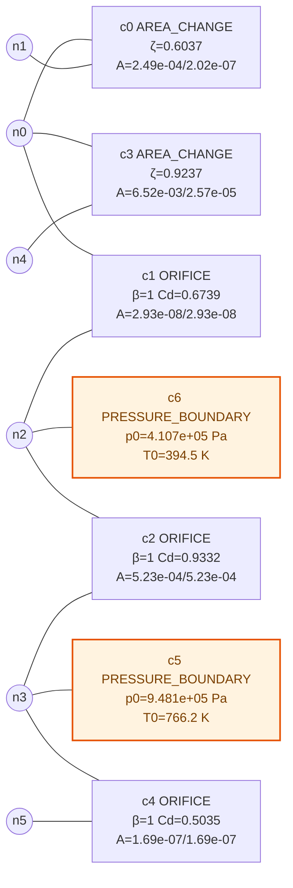
定性：多 PB 大压差网络（2 个 PB），回拧至中段压差即失根——该网络物理解对压差高度敏感（或本无解，同伦也到不了）。

**A0113**（丢在 k=11, lam=0.55，各步 iters=[11, 9, 7, 10, 6, 5]）

```mermaid
flowchart LR
N0(("n0"))
N1(("n1"))
N2(("n2"))
N3(("n3"))
N4(("n4"))
N5(("n5"))
N6(("n6"))
N7(("n7"))
N8(("n8"))
C0["c0 PIPE<br/>L=0.5667 D=0.004813<br/>A=1.82e-05/1.82e-05"]
N0 --- C0
N1 --- C0
C1["c1 AREA_CHANGE<br/>ζ=0.6141<br/>A=7.07e-06/4.39e-04"]
N1 --- C1
N2 --- C1
C2["c2 PIPE<br/>L=9.206 D=0.105<br/>A=8.65e-03/8.65e-03"]
N0 --- C2
N3 --- C2
C3["c3 ORIFICE<br/>β=1 Cd=0.6176<br/>A=3.82e-04/3.82e-04"]
N1 --- C3
N4 --- C3
C4["c4 AREA_CHANGE<br/>ζ=0.5706<br/>A=9.09e-05/2.84e-05"]
N4 --- C4
N5 --- C4
C5["c5 PIPE<br/>L=3.455 D=0.0001157<br/>A=1.05e-08/1.05e-08"]
N2 --- C5
N6 --- C5
C6["c6 PIPE<br/>L=1.071 D=0.002888<br/>A=6.55e-06/6.55e-06"]
N1 --- C6
N7 --- C6
C7["c7 AREA_CHANGE<br/>ζ=1.489<br/>A=2.38e-06/1.55e-03"]
N6 --- C7
N8 --- C7
C8["c8 PIPE<br/>L=0.6568 D=0.001543<br/>A=1.87e-06/1.87e-06"]
N7 --- C8
N8 --- C8
C9["c9 AREA_CHANGE<br/>ζ=0.5917<br/>A=1.13e-07/1.49e-05"]
N0 --- C9
N8 --- C9
C10["c10 ORIFICE<br/>β=1 Cd=0.8601<br/>A=9.82e-07/9.82e-07"]
N4 --- C10
N8 --- C10
C11["c11 ORIFICE<br/>β=1 Cd=0.6138<br/>A=1.29e-04/1.29e-04"]
N2 --- C11
N5 --- C11
C12["c12 AREA_CHANGE<br/>ζ=1.558<br/>A=8.53e-04/7.81e-05"]
N0 --- C12
N4 --- C12
C13["c13 ORIFICE<br/>β=1 Cd=0.6602<br/>A=8.49e-08/8.49e-08"]
N6 --- C13
N7 --- C13
C14["c14 PRESSURE_BOUNDARY<br/>p0=6.023e+05 Pa<br/>T0=679 K"]
N3 --- C14
C15["c15 PRESSURE_BOUNDARY<br/>p0=5.343e+05 Pa<br/>T0=577.4 K"]
N1 --- C15
C16["c16 PRESSURE_BOUNDARY<br/>p0=8.35e+04 Pa<br/>T0=421.7 K"]
N2 --- C16
classDef pbound fill:#FFF3E0,stroke:#E65100,stroke-width:2px,color:#7B3F00
classDef msource fill:#F3E5F5,stroke:#8E24AA,stroke-width:2px,color:#6A1B9A
classDef booster fill:#E3F2FD,stroke:#1976D2,stroke-width:2px,color:#0D47A1
classDef softchoked fill:#FFCDD2,stroke:#D32F2F,stroke-width:2.5px,color:#8B0000
class C14 pbound
class C15 pbound
class C16 pbound
```
定性：多 PB 大压差网络（3 个 PB），回拧至中段压差即失根——该网络物理解对压差高度敏感（或本无解，同伦也到不了）。

**A0018**（丢在 k=2, lam=0.10，各步 iters=[6, 0]）

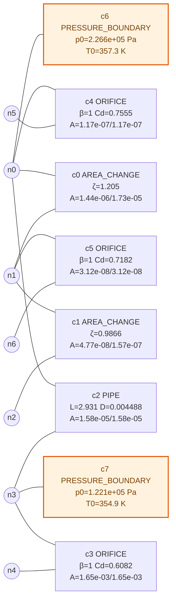
定性：多 PB 大压差网络（2 个 PB），回拧至中段压差即失根——该网络物理解对压差高度敏感（或本无解，同伦也到不了）。

**A0068**（丢在 k=2, lam=0.10，各步 iters=[8, 4]）

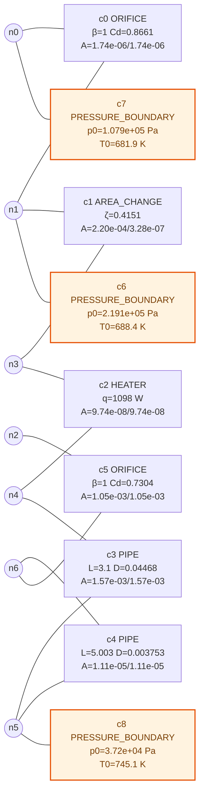
定性：多 PB 大压差网络（3 个 PB），回拧至中段压差即失根——该网络物理解对压差高度敏感（或本无解，同伦也到不了）。

**A0098**（丢在 k=2, lam=0.10，各步 iters=[9, 0]）

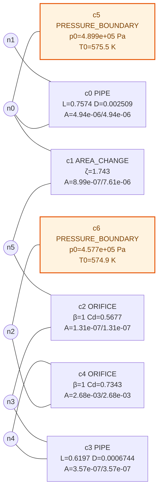
定性：多 PB 大压差网络（2 个 PB），回拧至中段压差即失根——该网络物理解对压差高度敏感（或本无解，同伦也到不了）。

## 救活抽验（随机 10 例守卫复核）

| case | 经探针 | 解处 worst ratio | 告警数 | 是否守卫人工根 |
|---|---|---|---|---|
| A0053 | backpressure | 0.002629 | 0 | 否（物理根） |
| A0237 | flatline | — | 0 | 否（物理根） |
| A0042 | backpressure | — | 0 | 否（物理根） |
| A0190 | backpressure | — | 0 | 否（物理根） |
| A0136 | flatline | 0 | 0 | 否（物理根） |
| A0137 | backpressure | — | 0 | 否（物理根） |
| A0202 | backpressure | — | 0 | 否（物理根） |
| A0020 | backpressure | — | 0 | 否（物理根） |
| A0135 | backpressure | — | 0 | 否（物理根） |
| A0098 | flatline | — | 0 | 否（物理根） |

（worst ratio 为 "—" = 该网络无守卫口径合格行（无非锚定两口压力行元件），守卫从未参与。）

抽验 10 例中 0 例落回守卫钉位根——救活解全部为物理根，延拓没有引入人工根污染。

## 异根五例：四初值解向量分段定位（P2.4）

对初值敏感性实验中出现异根的 5 例（A0199/A0005/A0062/A0093/A0101），把各组初值收敛解两两配对，按解向量三段取 max|dx|（原始量纲）：节点压力段 / 节点温度段 / 全部端口流量段；再对最异段列分量级 top3。

| case | 压力段 max\|dx\| [Pa] | 温度段 max\|dx\| [K] | 流量段 max\|dx\| [kg/s] | 最异段 | 最异段分量 top3 |
|---|---|---|---|---|---|
| A0199 | 0.3677 | 7.191e-08 | 9.734e-12 | 压力 | p_n6 Δ=0.3677；p_n3 Δ=5.58e-05；p_n1 Δ=0 |
| A0005 | 1878 | 5.401e+04 | 7.678e-07 | 温度 | T_n5 Δ=5.401e+04；T_n3 Δ=5.201e+04；T_n0 Δ=22.11 |
| A0062 | 0 | 0.07454 | 7.053e-08 | 温度 | T_n1 Δ=0.07454；T_n0 Δ=1.073e-05；T_n2 Δ=7.371e-07 |
| A0093 | 0 | 0.5067 | 9.28e-12 | 温度 | T_n1 Δ=0.5067；T_n2 Δ=3.681e-08；T_n3 Δ=3.681e-08 |
| A0101 | 0.004659 | 189 | 1.298e-07 | 温度 | T_n0 Δ=189；T_n2 Δ=18.98；T_n4 Δ=18.91 |

**每例一句话结论**：

- **A0199**：最异段差异仅 0.3677 （噪声级）——实为同根，此前的"异根"判定系容差误报（最异对 b_zeroflow vs c_half）。
- **A0005**：异根不定性在温度段——零流量死肢节点无能量约束，温度是数值自由量（流量/压力根一致）（最异对 b_zeroflow vs c_half）。
- **A0062**：最异段差异仅 0.07454 （噪声级）——实为同根，此前的"异根"判定系容差误报（最异对 c_half vs c_double）。
- **A0093**：异根不定性在温度段——零流量死肢节点无能量约束，温度是数值自由量（流量/压力根一致）（最异对 a_default vs c_double）。
- **A0101**：异根不定性在温度段——零流量死肢节点无能量约束，温度是数值自由量（流量/压力根一致）（最异对 b_zeroflow vs c_half）。

## 附录：全部探针条目

<details><summary>A0001 — A: lost_at=1，final=False，iters=[5]，0.545s | B: lost_at=0，final=False，iters=[10]，0.43s</summary>

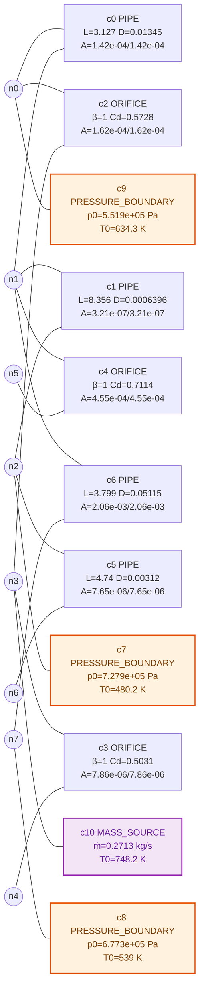

</details>

<details><summary>A0002 — A: lost_at=1，final=False，iters=[0]，0.035s | B: lost_at=1，final=False，iters=[0, 0]，0.032s</summary>

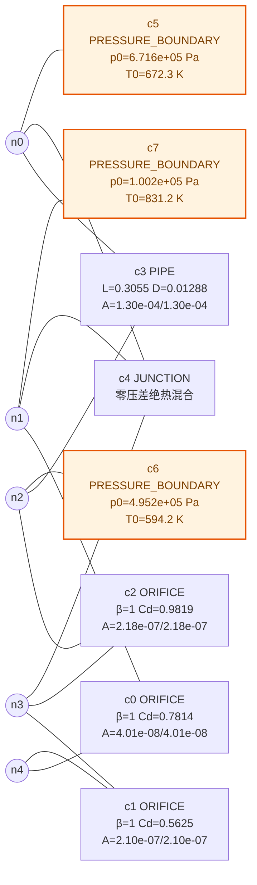

</details>

<details><summary>A0003 — A: lost_at=1，final=False，iters=[2]，0.153s | B: lost_at=1，final=False，iters=[0, 0]，0.059s</summary>

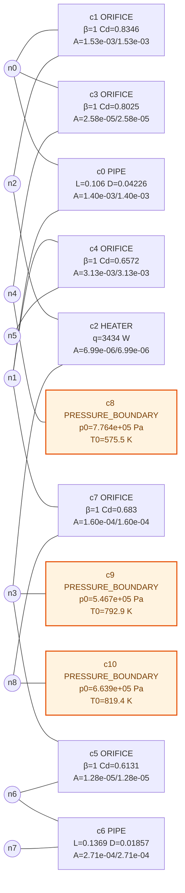

</details>

<details><summary>A0006 — A: lost_at=1，final=False，iters=[7]，0.617s | B: lost_at=1，final=False，iters=[0, 0]，0.085s</summary>

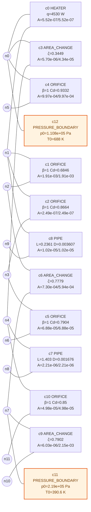

</details>

<details><summary>A0007 — A: lost_at=None，final=True，iters=[7, 4, 3, 3, 3, 3, 3, 3, 3, 2, 2, 2, 2, 2, 2, 1, 1, 1, 1, 1]，0.969s | B: lost_at=1，final=False，iters=[0, 0]，0.03s</summary>

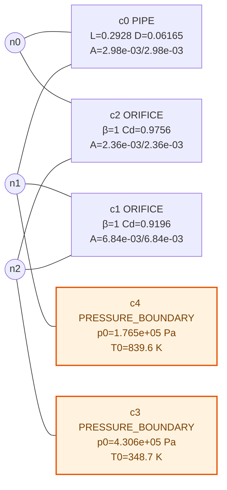

</details>

<details><summary>A0008 — A: lost_at=1，final=False，iters=[0]，0.05s | B: lost_at=1，final=False，iters=[0, 0]，0.046s</summary>

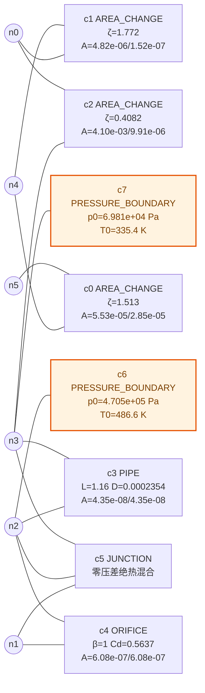

</details>

<details><summary>A0009 — A: lost_at=1，final=False，iters=[3]，0.439s | B: lost_at=1，final=False，iters=[0, 3]，0.407s</summary>

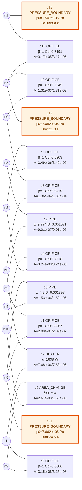

</details>

<details><summary>A0010 — A: lost_at=1，final=False，iters=[0]，0.093s | B: lost_at=1，final=False，iters=[0, 0]，0.081s</summary>

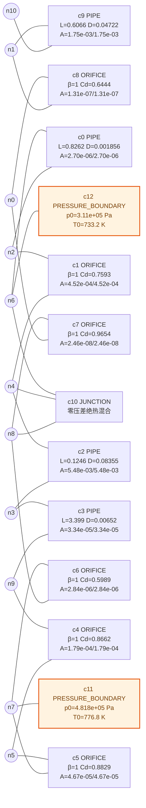

</details>

<details><summary>A0012 — A: lost_at=1，final=False，iters=[0]，0.027s | B: lost_at=1，final=False，iters=[0, 0]，0.041s</summary>

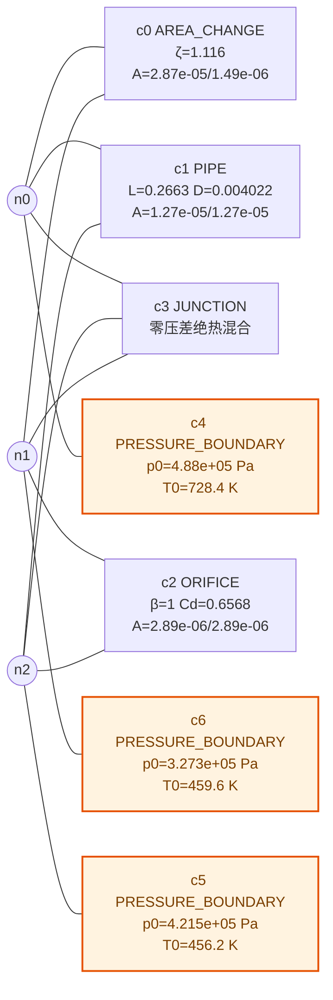

</details>

<details><summary>A0013 — A: lost_at=1，final=False，iters=[0]，0.124s | B: lost_at=1，final=False，iters=[11, 1]，1.477s</summary>

```mermaid
flowchart LR
N0(("n0"))
N1(("n1"))
N2(("n2"))
N3(("n3"))
N4(("n4"))
N5(("n5"))
N6(("n6"))
N7(("n7"))
N8(("n8"))
N9(("n9"))
N10(("n10"))
N11(("n11"))
C0["c0 ORIFICE<br/>β=1 Cd=0.7692<br/>A=1.62e-07/1.62e-07"]
N0 --- C0
N1 --- C0
C1["c1 PIPE<br/>L=0.2001 D=0.01383<br/>A=1.50e-04/1.50e-04"]
N1 --- C1
N2 --- C1
C2["c2 AREA_CHANGE<br/>ζ=0.7422<br/>A=4.47e-04/1.05e-04"]
N2 --- C2
N3 --- C2
C3["c3 AREA_CHANGE<br/>ζ=0.4152<br/>A=4.22e-04/2.74e-04"]
N2 --- C3
N4 --- C3
C4["c4 PIPE<br/>L=2.881 D=0.07237<br/>A=4.11e-03/4.11e-03"]
N0 --- C4
N5 --- C4
C5["c5 ORIFICE<br/>β=1 Cd=0.6064<br/>A=1.54e-06/1.54e-06"]
N2 --- C5
N6 --- C5
C6["c6 HEATER<br/>q=4823 W<br/>A=1.41e-05/1.41e-05"]
N6 --- C6
N7 --- C6
C7["c7 ORIFICE<br/>β=1 Cd=0.5144<br/>A=8.05e-05/8.05e-05"]
N5 --- C7
N8 --- C7
C8["c8 PIPE<br/>L=0.2724 D=0.1004<br/>A=7.92e-03/7.92e-03"]
N4 --- C8
N9 --- C8
C9["c9 PIPE<br/>L=6.633 D=0.002642<br/>A=5.48e-06/5.48e-06"]
N0 --- C9
N10 --- C9
C10["c10 AREA_CHANGE<br/>ζ=1.146<br/>A=8.72e-07/3.01e-04"]
N5 --- C10
N11 --- C10
C11["c11 ORIFICE<br/>β=1 Cd=0.583<br/>A=1.23e-04/1.23e-04"]
N3 --- C11
N10 --- C11
C12["c12 PIPE<br/>L=2.848 D=0.001117<br/>A=9.79e-07/9.79e-07"]
N6 --- C12
N9 --- C12
C13["c13 PRESSURE_BOUNDARY<br/>p0=6.382e+05 Pa<br/>T0=775 K"]
N9 --- C13
C14["c14 PRESSURE_BOUNDARY<br/>p0=2.526e+05 Pa<br/>T0=674.3 K"]
N7 --- C14
C15["c15 PRESSURE_BOUNDARY<br/>p0=5.682e+05 Pa<br/>T0=581.7 K"]
N5 --- C15
C16["c16 MASS_SOURCE<br/>ṁ=0.1546 kg/s<br/>T0=535.9 K"]
N1 --- C16
classDef pbound fill:#FFF3E0,stroke:#E65100,stroke-width:2px,color:#7B3F00
classDef msource fill:#F3E5F5,stroke:#8E24AA,stroke-width:2px,color:#6A1B9A
classDef booster fill:#E3F2FD,stroke:#1976D2,stroke-width:2px,color:#0D47A1
classDef softchoked fill:#FFCDD2,stroke:#D32F2F,stroke-width:2.5px,color:#8B0000
class C13 pbound
class C14 pbound
class C15 pbound
class C16 msource
```

</details>

<details><summary>A0014 — A: lost_at=1，final=False，iters=[1]，0.133s | B: lost_at=0，final=False，iters=[1]，0.131s</summary>

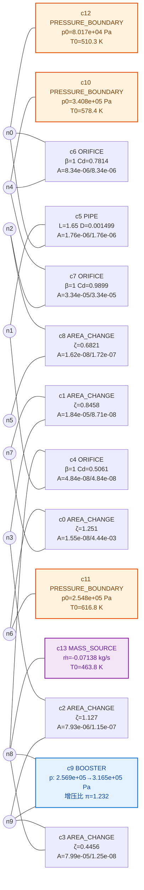

</details>

<details><summary>A0015 — A: lost_at=1，final=False，iters=[0]，0.12s | B: lost_at=1，final=False，iters=[0, 0]，0.102s</summary>

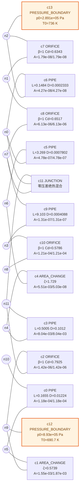

</details>

<details><summary>A0017 — A: lost_at=1，final=False，iters=[1]，0.205s | B: lost_at=1，final=False，iters=[0, 0]，0.054s</summary>

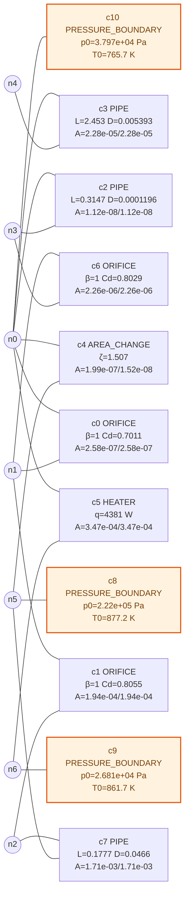

</details>

<details><summary>A0018 — A: lost_at=2，final=False，iters=[6, 0]，0.3s | B: lost_at=None，final=True，iters=[0, 6]，0.246s</summary>


</details>

<details><summary>A0019 — A: lost_at=1，final=False，iters=[50]，2.631s | B: lost_at=1，final=False，iters=[0, 0]，0.052s</summary>

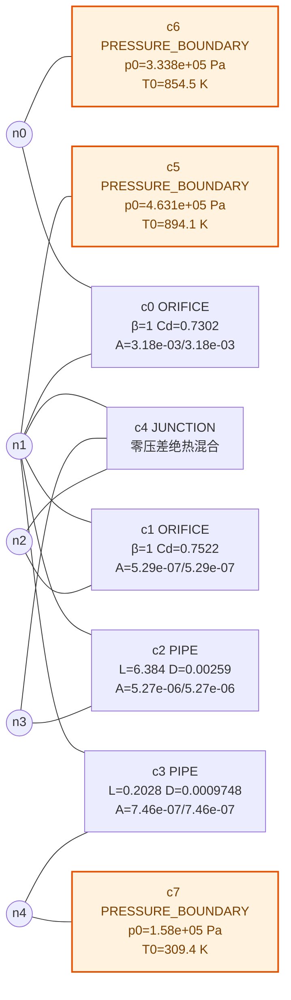

</details>

<details><summary>A0020 — A: lost_at=None，final=True，iters=[10, 4, 3, 3, 3, 3, 2, 2, 2, 2, 2, 2, 2, 2, 2, 2, 2, 2, 2, 2]，2.049s | B: lost_at=None，final=True，iters=[0, 6]，0.21s</summary>

```mermaid
flowchart LR
N0(("n0"))
N1(("n1"))
N2(("n2"))
N3(("n3"))
C0["c0 PIPE<br/>L=9.226 D=0.001428<br/>A=1.60e-06/1.60e-06"]
N0 --- C0
N3 --- C0
C1["c1 ORIFICE<br/>β=1 Cd=0.8838<br/>A=7.80e-08/7.80e-08"]
N3 --- C1
N1 --- C1
C2["c2 PIPE<br/>L=0.831 D=0.00455<br/>A=1.63e-05/1.63e-05"]
N1 --- C2
N2 --- C2
C3["c3 PRESSURE_BOUNDARY<br/>p0=2.997e+05 Pa<br/>T0=852.2 K"]
N3 --- C3
C4["c4 PRESSURE_BOUNDARY<br/>p0=2.767e+05 Pa<br/>T0=397.2 K"]
N1 --- C4
C5["c5 PRESSURE_BOUNDARY<br/>p0=3.623e+04 Pa<br/>T0=798.7 K"]
N2 --- C5
classDef pbound fill:#FFF3E0,stroke:#E65100,stroke-width:2px,color:#7B3F00
classDef msource fill:#F3E5F5,stroke:#8E24AA,stroke-width:2px,color:#6A1B9A
classDef booster fill:#E3F2FD,stroke:#1976D2,stroke-width:2px,color:#0D47A1
classDef softchoked fill:#FFCDD2,stroke:#D32F2F,stroke-width:2.5px,color:#8B0000
class C3 pbound
class C4 pbound
class C5 pbound
```

</details>

<details><summary>A0021 — A: lost_at=1，final=False，iters=[0]，0.063s | B: lost_at=1，final=False，iters=[0, 1]，0.161s</summary>

```mermaid
flowchart LR
N0(("n0"))
N1(("n1"))
N2(("n2"))
N3(("n3"))
N4(("n4"))
N5(("n5"))
N6(("n6"))
N7(("n7"))
N8(("n8"))
C0["c0 AREA_CHANGE<br/>ζ=0.4973<br/>A=3.70e-04/1.02e-04"]
N3 --- C0
N5 --- C0
C1["c1 PIPE<br/>L=0.7397 D=0.0002231<br/>A=3.91e-08/3.91e-08"]
N5 --- C1
N6 --- C1
C2["c2 PIPE<br/>L=2.325 D=0.005702<br/>A=2.55e-05/2.55e-05"]
N6 --- C2
N0 --- C2
C3["c3 ORIFICE<br/>β=1 Cd=0.5443<br/>A=9.17e-03/9.17e-03"]
N0 --- C3
N1 --- C3
C4["c4 HEATER<br/>q=844 W<br/>A=2.69e-05/2.69e-05"]
N1 --- C4
N8 --- C4
C5["c5 ORIFICE<br/>β=1 Cd=0.9087<br/>A=1.34e-04/1.34e-04"]
N8 --- C5
N4 --- C5
C6["c6 AREA_CHANGE<br/>ζ=1.494<br/>A=1.13e-08/2.20e-07"]
N4 --- C6
N7 --- C6
C7["c7 ORIFICE<br/>β=1 Cd=0.8854<br/>A=4.10e-04/4.10e-04"]
N7 --- C7
N2 --- C7
C8["c8 PRESSURE_BOUNDARY<br/>p0=4.098e+05 Pa<br/>T0=479.5 K"]
N1 --- C8
C9["c9 PRESSURE_BOUNDARY<br/>p0=3.778e+05 Pa<br/>T0=427.1 K"]
N4 --- C9
classDef pbound fill:#FFF3E0,stroke:#E65100,stroke-width:2px,color:#7B3F00
classDef msource fill:#F3E5F5,stroke:#8E24AA,stroke-width:2px,color:#6A1B9A
classDef booster fill:#E3F2FD,stroke:#1976D2,stroke-width:2px,color:#0D47A1
classDef softchoked fill:#FFCDD2,stroke:#D32F2F,stroke-width:2.5px,color:#8B0000
class C8 pbound
class C9 pbound
```

</details>

<details><summary>A0022 — A: lost_at=1，final=False，iters=[0]，0.126s | B: lost_at=0，final=False，iters=[0]，0.134s</summary>

```mermaid
flowchart LR
N0(("n0"))
N1(("n1"))
N2(("n2"))
N3(("n3"))
N4(("n4"))
N5(("n5"))
N6(("n6"))
N7(("n7"))
N8(("n8"))
N9(("n9"))
N10(("n10"))
N11(("n11"))
C0["c0 HEATER<br/>q=4725 W<br/>A=7.13e-03/7.13e-03"]
N9 --- C0
N10 --- C0
C1["c1 ORIFICE<br/>β=1 Cd=0.643<br/>A=5.67e-07/5.67e-07"]
N10 --- C1
N7 --- C1
C2["c2 ORIFICE<br/>β=1 Cd=0.6219<br/>A=3.92e-04/3.92e-04"]
N7 --- C2
N11 --- C2
C3["c3 PIPE<br/>L=0.5289 D=0.004009<br/>A=1.26e-05/1.26e-05"]
N11 --- C3
N4 --- C3
C4["c4 PIPE<br/>L=9.984 D=0.005021<br/>A=1.98e-05/1.98e-05"]
N4 --- C4
N5 --- C4
C5["c5 PIPE<br/>L=3.424 D=0.0009664<br/>A=7.34e-07/7.34e-07"]
N5 --- C5
N0 --- C5
C6["c6 AREA_CHANGE<br/>ζ=1.136<br/>A=4.05e-08/8.48e-07"]
N0 --- C6
N6 --- C6
C7["c7 ORIFICE<br/>β=1 Cd=0.6693<br/>A=5.85e-03/5.85e-03"]
N6 --- C7
N8 --- C7
C8["c8 PIPE<br/>L=8.284 D=0.00912<br/>A=6.53e-05/6.53e-05"]
N8 --- C8
N2 --- C8
C9["c9 ORIFICE<br/>β=1 Cd=0.9971<br/>A=1.13e-03/1.13e-03"]
N2 --- C9
N1 --- C9
C10["c10 ORIFICE<br/>β=1 Cd=0.7324<br/>A=6.45e-07/6.45e-07"]
N1 --- C10
N3 --- C10
C11["c11 BOOSTER<br/>p: 4.308e+05→5.126e+05 Pa<br/>增压比 π=1.190<br/>T0=371.8 K"]
N5 --- C11
N8 --- C11
C12["c12 PRESSURE_BOUNDARY<br/>p0=3.442e+05 Pa<br/>T0=694.4 K"]
N6 --- C12
C13["c13 PRESSURE_BOUNDARY<br/>p0=1.719e+05 Pa<br/>T0=485.1 K"]
N0 --- C13
C14["c14 MASS_SOURCE<br/>ṁ=0.1036 kg/s<br/>T0=301.3 K"]
N3 --- C14
classDef pbound fill:#FFF3E0,stroke:#E65100,stroke-width:2px,color:#7B3F00
classDef msource fill:#F3E5F5,stroke:#8E24AA,stroke-width:2px,color:#6A1B9A
classDef booster fill:#E3F2FD,stroke:#1976D2,stroke-width:2px,color:#0D47A1
classDef softchoked fill:#FFCDD2,stroke:#D32F2F,stroke-width:2.5px,color:#8B0000
class C11 booster
class C12 pbound
class C13 pbound
class C14 msource
```

</details>

<details><summary>A0023 — A: lost_at=1，final=False，iters=[0]，0.088s | B: lost_at=1，final=False，iters=[1, 0]，0.121s</summary>

```mermaid
flowchart LR
N0(("n0"))
N1(("n1"))
N2(("n2"))
N3(("n3"))
N4(("n4"))
N5(("n5"))
N6(("n6"))
N7(("n7"))
C0["c0 ORIFICE<br/>β=1 Cd=0.6812<br/>A=2.52e-05/2.52e-05"]
N0 --- C0
N1 --- C0
C1["c1 ORIFICE<br/>β=1 Cd=0.8827<br/>A=1.55e-04/1.55e-04"]
N1 --- C1
N2 --- C1
C2["c2 ORIFICE<br/>β=1 Cd=0.9263<br/>A=2.63e-04/2.63e-04"]
N0 --- C2
N3 --- C2
C3["c3 ORIFICE<br/>β=1 Cd=0.7037<br/>A=4.63e-05/4.63e-05"]
N1 --- C3
N4 --- C3
C4["c4 PIPE<br/>L=0.4785 D=0.0002239<br/>A=3.94e-08/3.94e-08"]
N4 --- C4
N5 --- C4
C5["c5 ORIFICE<br/>β=1 Cd=0.8372<br/>A=3.57e-03/3.57e-03"]
N0 --- C5
N6 --- C5
C6["c6 ORIFICE<br/>β=1 Cd=0.7487<br/>A=4.28e-03/4.28e-03"]
N2 --- C6
N7 --- C6
C7["c7 AREA_CHANGE<br/>ζ=1.263<br/>A=5.41e-03/7.46e-03"]
N2 --- C7
N4 --- C7
C8["c8 PIPE<br/>L=3.456 D=0.004837<br/>A=1.84e-05/1.84e-05"]
N0 --- C8
N7 --- C8
C9["c9 AREA_CHANGE<br/>ζ=0.5277<br/>A=1.49e-08/4.75e-03"]
N0 --- C9
N2 --- C9
C10["c10 ORIFICE<br/>β=1 Cd=0.7917<br/>A=8.31e-06/8.31e-06"]
N3 --- C10
N5 --- C10
C11["c11 PIPE<br/>L=5.774 D=0.01852<br/>A=2.69e-04/2.69e-04"]
N5 --- C11
N6 --- C11
C12["c12 JUNCTION<br/>零压差绝热混合"]
N3 --- C12
N7 --- C12
N2 --- C12
C13["c13 PRESSURE_BOUNDARY<br/>p0=5.601e+05 Pa<br/>T0=735.7 K"]
N3 --- C13
C14["c14 PRESSURE_BOUNDARY<br/>p0=9.088e+04 Pa<br/>T0=740.2 K"]
N7 --- C14
C15["c15 MASS_SOURCE<br/>ṁ=-0.177 kg/s<br/>T0=747.6 K"]
N7 --- C15
classDef pbound fill:#FFF3E0,stroke:#E65100,stroke-width:2px,color:#7B3F00
classDef msource fill:#F3E5F5,stroke:#8E24AA,stroke-width:2px,color:#6A1B9A
classDef booster fill:#E3F2FD,stroke:#1976D2,stroke-width:2px,color:#0D47A1
classDef softchoked fill:#FFCDD2,stroke:#D32F2F,stroke-width:2.5px,color:#8B0000
class C13 pbound
class C14 pbound
class C15 msource
```

</details>

<details><summary>A0024 — A: lost_at=1，final=False，iters=[7]，0.742s | B: lost_at=1，final=False，iters=[0, 13]，1.398s</summary>

```mermaid
flowchart LR
N0(("n0"))
N1(("n1"))
N2(("n2"))
N3(("n3"))
N4(("n4"))
N5(("n5"))
N6(("n6"))
N7(("n7"))
N8(("n8"))
N9(("n9"))
C0["c0 AREA_CHANGE<br/>ζ=0.9811<br/>A=3.87e-08/7.57e-04"]
N0 --- C0
N1 --- C0
C1["c1 ORIFICE<br/>β=1 Cd=0.6283<br/>A=3.81e-05/3.81e-05"]
N1 --- C1
N2 --- C1
C2["c2 HEATER<br/>q=7196 W<br/>A=3.31e-07/3.31e-07"]
N2 --- C2
N3 --- C2
C3["c3 ORIFICE<br/>β=1 Cd=0.9971<br/>A=7.89e-03/7.89e-03"]
N2 --- C3
N4 --- C3
C4["c4 AREA_CHANGE<br/>ζ=1.811<br/>A=8.70e-05/7.01e-03"]
N0 --- C4
N5 --- C4
C5["c5 ORIFICE<br/>β=1 Cd=0.6847<br/>A=6.35e-07/6.35e-07"]
N5 --- C5
N6 --- C5
C6["c6 AREA_CHANGE<br/>ζ=0.7506<br/>A=3.37e-06/5.01e-04"]
N6 --- C6
N7 --- C6
C7["c7 ORIFICE<br/>β=1 Cd=0.8105<br/>A=1.07e-08/1.07e-08"]
N4 --- C7
N8 --- C7
C8["c8 AREA_CHANGE<br/>ζ=1.482<br/>A=1.99e-06/4.80e-08"]
N6 --- C8
N9 --- C8
C9["c9 PIPE<br/>L=3.226 D=0.009946<br/>A=7.77e-05/7.77e-05"]
N7 --- C9
N9 --- C9
C10["c10 AREA_CHANGE<br/>ζ=0.8832<br/>A=5.04e-07/2.49e-03"]
N7 --- C10
N8 --- C10
C11["c11 ORIFICE<br/>β=1 Cd=0.6781<br/>A=2.70e-04/2.70e-04"]
N1 --- C11
N4 --- C11
C12["c12 PIPE<br/>L=2.037 D=0.00742<br/>A=4.32e-05/4.32e-05"]
N2 --- C12
N7 --- C12
C13["c13 ORIFICE<br/>β=1 Cd=0.8071<br/>A=7.55e-05/7.55e-05"]
N3 --- C13
N9 --- C13
C14["c14 ORIFICE<br/>β=1 Cd=0.5491<br/>A=1.60e-05/1.60e-05"]
N3 --- C14
N6 --- C14
C15["c15 PRESSURE_BOUNDARY<br/>p0=4.869e+05 Pa<br/>T0=634.8 K"]
N4 --- C15
C16["c16 PRESSURE_BOUNDARY<br/>p0=1.317e+05 Pa<br/>T0=649.8 K"]
N2 --- C16
classDef pbound fill:#FFF3E0,stroke:#E65100,stroke-width:2px,color:#7B3F00
classDef msource fill:#F3E5F5,stroke:#8E24AA,stroke-width:2px,color:#6A1B9A
classDef booster fill:#E3F2FD,stroke:#1976D2,stroke-width:2px,color:#0D47A1
classDef softchoked fill:#FFCDD2,stroke:#D32F2F,stroke-width:2.5px,color:#8B0000
class C15 pbound
class C16 pbound
```

</details>

<details><summary>A0025 — A: lost_at=1，final=False，iters=[0]，0.155s | B: lost_at=1，final=False，iters=[0, 1]，0.179s</summary>

```mermaid
flowchart LR
N0(("n0"))
N1(("n1"))
N2(("n2"))
N3(("n3"))
N4(("n4"))
N5(("n5"))
N6(("n6"))
N7(("n7"))
C0["c0 AREA_CHANGE<br/>ζ=0.828<br/>A=8.44e-06/6.24e-03"]
N0 --- C0
N1 --- C0
C1["c1 ORIFICE<br/>β=1 Cd=0.9838<br/>A=1.72e-06/1.72e-06"]
N1 --- C1
N2 --- C1
C2["c2 PIPE<br/>L=2.692 D=0.0001573<br/>A=1.94e-08/1.94e-08"]
N2 --- C2
N3 --- C2
C3["c3 AREA_CHANGE<br/>ζ=1.048<br/>A=3.42e-03/1.76e-04"]
N1 --- C3
N4 --- C3
C4["c4 ORIFICE<br/>β=1 Cd=0.9498<br/>A=8.60e-07/8.60e-07"]
N3 --- C4
N5 --- C4
C5["c5 PIPE<br/>L=1.558 D=0.0005298<br/>A=2.20e-07/2.20e-07"]
N1 --- C5
N6 --- C5
C6["c6 AREA_CHANGE<br/>ζ=0.426<br/>A=4.54e-06/1.35e-05"]
N0 --- C6
N7 --- C6
C7["c7 AREA_CHANGE<br/>ζ=0.7599<br/>A=6.33e-06/1.69e-08"]
N0 --- C7
N4 --- C7
C8["c8 ORIFICE<br/>β=1 Cd=0.7498<br/>A=1.37e-08/1.37e-08"]
N5 --- C8
N6 --- C8
C9["c9 PRESSURE_BOUNDARY<br/>p0=5.465e+05 Pa<br/>T0=885.9 K"]
N3 --- C9
C10["c10 PRESSURE_BOUNDARY<br/>p0=1.034e+05 Pa<br/>T0=620.5 K"]
N6 --- C10
C11["c11 PRESSURE_BOUNDARY<br/>p0=8.646e+04 Pa<br/>T0=653.3 K"]
N5 --- C11
classDef pbound fill:#FFF3E0,stroke:#E65100,stroke-width:2px,color:#7B3F00
classDef msource fill:#F3E5F5,stroke:#8E24AA,stroke-width:2px,color:#6A1B9A
classDef booster fill:#E3F2FD,stroke:#1976D2,stroke-width:2px,color:#0D47A1
classDef softchoked fill:#FFCDD2,stroke:#D32F2F,stroke-width:2.5px,color:#8B0000
class C9 pbound
class C10 pbound
class C11 pbound
```

</details>

<details><summary>A0026 — A: lost_at=1，final=False，iters=[0]，0.141s | B: lost_at=0，final=False，iters=[0]，0.145s</summary>

```mermaid
flowchart LR
N0(("n0"))
N1(("n1"))
N2(("n2"))
N3(("n3"))
N4(("n4"))
N5(("n5"))
N6(("n6"))
N7(("n7"))
C0["c0 PIPE<br/>L=0.2892 D=0.000743<br/>A=4.34e-07/4.34e-07"]
N0 --- C0
N1 --- C0
C1["c1 ORIFICE<br/>β=1 Cd=0.783<br/>A=1.25e-05/1.25e-05"]
N0 --- C1
N2 --- C1
C2["c2 AREA_CHANGE<br/>ζ=0.9647<br/>A=1.49e-07/1.47e-07"]
N0 --- C2
N3 --- C2
C3["c3 ORIFICE<br/>β=1 Cd=0.565<br/>A=2.25e-04/2.25e-04"]
N3 --- C3
N4 --- C3
C4["c4 ORIFICE<br/>β=1 Cd=0.8692<br/>A=9.69e-08/9.69e-08"]
N0 --- C4
N5 --- C4
C5["c5 PIPE<br/>L=0.764 D=0.03182<br/>A=7.95e-04/7.95e-04"]
N1 --- C5
N6 --- C5
C6["c6 PIPE<br/>L=2.506 D=0.0004641<br/>A=1.69e-07/1.69e-07"]
N1 --- C6
N7 --- C6
C7["c7 ORIFICE<br/>β=1 Cd=0.8542<br/>A=1.42e-03/1.42e-03"]
N0 --- C7
N7 --- C7
C8["c8 PIPE<br/>L=0.6613 D=0.08651<br/>A=5.88e-03/5.88e-03"]
N1 --- C8
N4 --- C8
C9["c9 AREA_CHANGE<br/>ζ=1.274<br/>A=3.41e-06/1.31e-03"]
N2 --- C9
N7 --- C9
C10["c10 PIPE<br/>L=0.1419 D=0.002167<br/>A=3.69e-06/3.69e-06"]
N4 --- C10
N5 --- C10
C11["c11 ORIFICE<br/>β=1 Cd=0.8496<br/>A=6.77e-05/6.77e-05"]
N2 --- C11
N5 --- C11
C12["c12 PIPE<br/>L=0.5231 D=0.03503<br/>A=9.64e-04/9.64e-04"]
N1 --- C12
N2 --- C12
C13["c13 BOOSTER<br/>p: 2.387e+05→3.641e+05 Pa<br/>增压比 π=1.526"]
N2 --- C13
N3 --- C13
C14["c14 PRESSURE_BOUNDARY<br/>p0=5.132e+05 Pa<br/>T0=804.9 K"]
N5 --- C14
C15["c15 PRESSURE_BOUNDARY<br/>p0=2.047e+05 Pa<br/>T0=579.7 K"]
N0 --- C15
C16["c16 PRESSURE_BOUNDARY<br/>p0=1.773e+05 Pa<br/>T0=785.9 K"]
N6 --- C16
classDef pbound fill:#FFF3E0,stroke:#E65100,stroke-width:2px,color:#7B3F00
classDef msource fill:#F3E5F5,stroke:#8E24AA,stroke-width:2px,color:#6A1B9A
classDef booster fill:#E3F2FD,stroke:#1976D2,stroke-width:2px,color:#0D47A1
classDef softchoked fill:#FFCDD2,stroke:#D32F2F,stroke-width:2.5px,color:#8B0000
class C13 booster
class C14 pbound
class C15 pbound
class C16 pbound
```

</details>

<details><summary>A0027 — A: lost_at=1，final=False，iters=[26]，1.331s | B: lost_at=1，final=False，iters=[0, 0]，0.043s</summary>

```mermaid
flowchart LR
N0(("n0"))
N1(("n1"))
N2(("n2"))
N3(("n3"))
N4(("n4"))
N5(("n5"))
C0["c0 AREA_CHANGE<br/>ζ=1.975<br/>A=2.81e-06/1.11e-08"]
N5 --- C0
N0 --- C0
C1["c1 PIPE<br/>L=6.974 D=0.1053<br/>A=8.70e-03/8.70e-03"]
N0 --- C1
N4 --- C1
C2["c2 ORIFICE<br/>β=1 Cd=0.85<br/>A=7.76e-07/7.76e-07"]
N4 --- C2
N2 --- C2
C3["c3 ORIFICE<br/>β=1 Cd=0.5085<br/>A=6.14e-05/6.14e-05"]
N2 --- C3
N1 --- C3
C4["c4 HEATER<br/>q=6778 W<br/>A=1.04e-03/1.04e-03"]
N1 --- C4
N3 --- C4
C5["c5 PRESSURE_BOUNDARY<br/>p0=3.182e+05 Pa<br/>T0=658.5 K"]
N0 --- C5
C6["c6 PRESSURE_BOUNDARY<br/>p0=2.34e+05 Pa<br/>T0=540.5 K"]
N3 --- C6
classDef pbound fill:#FFF3E0,stroke:#E65100,stroke-width:2px,color:#7B3F00
classDef msource fill:#F3E5F5,stroke:#8E24AA,stroke-width:2px,color:#6A1B9A
classDef booster fill:#E3F2FD,stroke:#1976D2,stroke-width:2px,color:#0D47A1
classDef softchoked fill:#FFCDD2,stroke:#D32F2F,stroke-width:2.5px,color:#8B0000
class C5 pbound
class C6 pbound
```

</details>

<details><summary>A0028 — A: lost_at=1，final=False，iters=[0]，0.079s | B: lost_at=1，final=False，iters=[0, 0]，0.062s</summary>

```mermaid
flowchart LR
N0(("n0"))
N1(("n1"))
N2(("n2"))
N3(("n3"))
N4(("n4"))
C0["c0 PIPE<br/>L=6.436 D=0.001658<br/>A=2.16e-06/2.16e-06"]
N0 --- C0
N1 --- C0
C1["c1 PIPE<br/>L=2.816 D=0.01875<br/>A=2.76e-04/2.76e-04"]
N0 --- C1
N2 --- C1
C2["c2 PIPE<br/>L=0.1596 D=0.000285<br/>A=6.38e-08/6.38e-08"]
N2 --- C2
N3 --- C2
C3["c3 PIPE<br/>L=0.9705 D=0.05318<br/>A=2.22e-03/2.22e-03"]
N1 --- C3
N4 --- C3
C4["c4 AREA_CHANGE<br/>ζ=1.215<br/>A=1.69e-03/5.28e-05"]
N1 --- C4
N3 --- C4
C5["c5 PRESSURE_BOUNDARY<br/>p0=3.598e+05 Pa<br/>T0=681.9 K"]
N0 --- C5
C6["c6 PRESSURE_BOUNDARY<br/>p0=7.953e+04 Pa<br/>T0=365.3 K"]
N3 --- C6
classDef pbound fill:#FFF3E0,stroke:#E65100,stroke-width:2px,color:#7B3F00
classDef msource fill:#F3E5F5,stroke:#8E24AA,stroke-width:2px,color:#6A1B9A
classDef booster fill:#E3F2FD,stroke:#1976D2,stroke-width:2px,color:#0D47A1
classDef softchoked fill:#FFCDD2,stroke:#D32F2F,stroke-width:2.5px,color:#8B0000
class C5 pbound
class C6 pbound
```

</details>

<details><summary>A0029 — A: lost_at=1，final=False，iters=[0]，0.065s | B: lost_at=1，final=False，iters=[0, 2]，0.153s</summary>

```mermaid
flowchart LR
N0(("n0"))
N1(("n1"))
N2(("n2"))
N3(("n3"))
N4(("n4"))
N5(("n5"))
N6(("n6"))
N7(("n7"))
C0["c0 ORIFICE<br/>β=1 Cd=0.8627<br/>A=4.99e-03/4.99e-03"]
N0 --- C0
N1 --- C0
C1["c1 AREA_CHANGE<br/>ζ=1.351<br/>A=3.47e-07/5.87e-03"]
N1 --- C1
N2 --- C1
C2["c2 PIPE<br/>L=0.1923 D=0.08985<br/>A=6.34e-03/6.34e-03"]
N1 --- C2
N3 --- C2
C3["c3 AREA_CHANGE<br/>ζ=1.17<br/>A=3.97e-07/6.74e-08"]
N0 --- C3
N4 --- C3
C4["c4 HEATER<br/>q=1022 W<br/>A=3.24e-07/3.24e-07"]
N3 --- C4
N5 --- C4
C5["c5 ORIFICE<br/>β=1 Cd=0.6194<br/>A=6.24e-06/6.24e-06"]
N0 --- C5
N6 --- C5
C6["c6 PIPE<br/>L=0.1455 D=0.0008781<br/>A=6.06e-07/6.06e-07"]
N2 --- C6
N7 --- C6
C7["c7 ORIFICE<br/>β=1 Cd=0.8119<br/>A=4.21e-08/4.21e-08"]
N2 --- C7
N3 --- C7
C8["c8 PRESSURE_BOUNDARY<br/>p0=5.114e+05 Pa<br/>T0=793.9 K"]
N2 --- C8
C9["c9 PRESSURE_BOUNDARY<br/>p0=1.198e+05 Pa<br/>T0=367.9 K"]
N0 --- C9
C10["c10 PRESSURE_BOUNDARY<br/>p0=1.026e+05 Pa<br/>T0=638.8 K"]
N7 --- C10
classDef pbound fill:#FFF3E0,stroke:#E65100,stroke-width:2px,color:#7B3F00
classDef msource fill:#F3E5F5,stroke:#8E24AA,stroke-width:2px,color:#6A1B9A
classDef booster fill:#E3F2FD,stroke:#1976D2,stroke-width:2px,color:#0D47A1
classDef softchoked fill:#FFCDD2,stroke:#D32F2F,stroke-width:2.5px,color:#8B0000
class C8 pbound
class C9 pbound
class C10 pbound
```

</details>

<details><summary>A0030 — A: lost_at=1，final=False，iters=[0]，0.088s | B: lost_at=0，final=False，iters=[0]，0.057s</summary>

```mermaid
flowchart LR
N0(("n0"))
N1(("n1"))
N2(("n2"))
N3(("n3"))
N4(("n4"))
N5(("n5"))
N6(("n6"))
N7(("n7"))
N8(("n8"))
N9(("n9"))
C0["c0 PIPE<br/>L=2.216 D=0.0001867<br/>A=2.74e-08/2.74e-08"]
N0 --- C0
N1 --- C0
C1["c1 AREA_CHANGE<br/>ζ=1.765<br/>A=1.52e-08/3.00e-06"]
N0 --- C1
N2 --- C1
C2["c2 ORIFICE<br/>β=1 Cd=0.7053<br/>A=1.99e-06/1.99e-06"]
N2 --- C2
N3 --- C2
C3["c3 ORIFICE<br/>β=1 Cd=0.7847<br/>A=3.51e-07/3.51e-07"]
N0 --- C3
N4 --- C3
C4["c4 ORIFICE<br/>β=1 Cd=0.8638<br/>A=3.70e-06/3.70e-06"]
N1 --- C4
N5 --- C4
C5["c5 ORIFICE<br/>β=1 Cd=0.9962<br/>A=7.68e-08/7.68e-08"]
N0 --- C5
N6 --- C5
C6["c6 HEATER<br/>q=4244 W<br/>A=2.76e-07/2.76e-07"]
N1 --- C6
N7 --- C6
C7["c7 AREA_CHANGE<br/>ζ=1.676<br/>A=6.03e-08/2.54e-06"]
N1 --- C7
N8 --- C7
C8["c8 ORIFICE<br/>β=1 Cd=0.9733<br/>A=3.73e-04/3.73e-04"]
N5 --- C8
N9 --- C8
C9["c9 PRESSURE_BOUNDARY<br/>p0=6.423e+05 Pa<br/>T0=347.3 K"]
N0 --- C9
C10["c10 PRESSURE_BOUNDARY<br/>p0=3.204e+05 Pa<br/>T0=330.5 K"]
N3 --- C10
C11["c11 MASS_SOURCE<br/>ṁ=-0.299 kg/s<br/>T0=623.4 K"]
N5 --- C11
classDef pbound fill:#FFF3E0,stroke:#E65100,stroke-width:2px,color:#7B3F00
classDef msource fill:#F3E5F5,stroke:#8E24AA,stroke-width:2px,color:#6A1B9A
classDef booster fill:#E3F2FD,stroke:#1976D2,stroke-width:2px,color:#0D47A1
classDef softchoked fill:#FFCDD2,stroke:#D32F2F,stroke-width:2.5px,color:#8B0000
class C9 pbound
class C10 pbound
class C11 msource
```

</details>

<details><summary>A0031 — A: lost_at=1，final=False，iters=[0]，0.039s | B: lost_at=1，final=False，iters=[2, 7]，0.306s</summary>

```mermaid
flowchart LR
N0(("n0"))
N1(("n1"))
N2(("n2"))
N3(("n3"))
C0["c0 PIPE<br/>L=0.7652 D=0.08656<br/>A=5.88e-03/5.88e-03"]
N0 --- C0
N1 --- C0
C1["c1 AREA_CHANGE<br/>ζ=1.911<br/>A=1.00e-08/1.16e-06"]
N1 --- C1
N2 --- C1
C2["c2 ORIFICE<br/>β=1 Cd=0.7324<br/>A=3.16e-07/3.16e-07"]
N1 --- C2
N3 --- C2
C3["c3 AREA_CHANGE<br/>ζ=1.541<br/>A=2.52e-04/7.21e-05"]
N2 --- C3
N3 --- C3
C4["c4 ORIFICE<br/>β=1 Cd=0.9175<br/>A=7.07e-05/7.07e-05"]
N0 --- C4
N2 --- C4
C5["c5 PRESSURE_BOUNDARY<br/>p0=9.915e+05 Pa<br/>T0=688 K"]
N3 --- C5
C6["c6 PRESSURE_BOUNDARY<br/>p0=6.436e+05 Pa<br/>T0=304 K"]
N0 --- C6
C7["c7 PRESSURE_BOUNDARY<br/>p0=2.435e+05 Pa<br/>T0=586.7 K"]
N2 --- C7
C8["c8 MASS_SOURCE<br/>ṁ=-0.1306 kg/s<br/>T0=329.3 K"]
N2 --- C8
classDef pbound fill:#FFF3E0,stroke:#E65100,stroke-width:2px,color:#7B3F00
classDef msource fill:#F3E5F5,stroke:#8E24AA,stroke-width:2px,color:#6A1B9A
classDef booster fill:#E3F2FD,stroke:#1976D2,stroke-width:2px,color:#0D47A1
classDef softchoked fill:#FFCDD2,stroke:#D32F2F,stroke-width:2.5px,color:#8B0000
class C5 pbound
class C6 pbound
class C7 pbound
class C8 msource
```

</details>

<details><summary>A0032 — A: lost_at=1，final=False，iters=[0]，0.152s | B: lost_at=1，final=False，iters=[0, 2]，0.414s</summary>

```mermaid
flowchart LR
N0(("n0"))
N1(("n1"))
N2(("n2"))
N3(("n3"))
N4(("n4"))
N5(("n5"))
N6(("n6"))
N7(("n7"))
N8(("n8"))
N9(("n9"))
N10(("n10"))
C0["c0 ORIFICE<br/>β=1 Cd=0.8854<br/>A=8.50e-05/8.50e-05"]
N0 --- C0
N1 --- C0
C1["c1 PIPE<br/>L=0.8081 D=0.03701<br/>A=1.08e-03/1.08e-03"]
N0 --- C1
N2 --- C1
C2["c2 ORIFICE<br/>β=1 Cd=0.5692<br/>A=4.95e-03/4.95e-03"]
N1 --- C2
N3 --- C2
C3["c3 ORIFICE<br/>β=1 Cd=0.7246<br/>A=6.48e-03/6.48e-03"]
N1 --- C3
N4 --- C3
C4["c4 HEATER<br/>q=6861 W<br/>A=1.09e-07/1.09e-07"]
N4 --- C4
N5 --- C4
C5["c5 AREA_CHANGE<br/>ζ=1.196<br/>A=2.78e-06/2.32e-06"]
N5 --- C5
N6 --- C5
C6["c6 ORIFICE<br/>β=1 Cd=0.6384<br/>A=1.30e-04/1.30e-04"]
N1 --- C6
N7 --- C6
C7["c7 ORIFICE<br/>β=1 Cd=0.902<br/>A=9.39e-04/9.39e-04"]
N2 --- C7
N8 --- C7
C8["c8 ORIFICE<br/>β=1 Cd=0.951<br/>A=1.75e-06/1.75e-06"]
N5 --- C8
N9 --- C8
C9["c9 ORIFICE<br/>β=1 Cd=0.7726<br/>A=6.10e-06/6.10e-06"]
N7 --- C9
N10 --- C9
C10["c10 AREA_CHANGE<br/>ζ=1.963<br/>A=9.83e-03/2.03e-05"]
N3 --- C10
N10 --- C10
C11["c11 AREA_CHANGE<br/>ζ=1.553<br/>A=2.77e-07/6.55e-07"]
N6 --- C11
N8 --- C11
C12["c12 ORIFICE<br/>β=1 Cd=0.6617<br/>A=1.45e-07/1.45e-07"]
N1 --- C12
N10 --- C12
C13["c13 PIPE<br/>L=3.374 D=0.02115<br/>A=3.51e-04/3.51e-04"]
N1 --- C13
N8 --- C13
C14["c14 PIPE<br/>L=0.6817 D=0.006043<br/>A=2.87e-05/2.87e-05"]
N0 --- C14
N9 --- C14
C15["c15 ORIFICE<br/>β=1 Cd=0.5723<br/>A=2.08e-03/2.08e-03"]
N4 --- C15
N6 --- C15
C16["c16 AREA_CHANGE<br/>ζ=0.9663<br/>A=1.56e-03/4.97e-07"]
N0 --- C16
N7 --- C16
C17["c17 ORIFICE<br/>β=1 Cd=0.5719<br/>A=1.70e-08/1.70e-08"]
N2 --- C17
N6 --- C17
C18["c18 PIPE<br/>L=0.3366 D=0.0007052<br/>A=3.91e-07/3.91e-07"]
N6 --- C18
N7 --- C18
C19["c19 PRESSURE_BOUNDARY<br/>p0=2.029e+05 Pa<br/>T0=475.8 K"]
N1 --- C19
C20["c20 PRESSURE_BOUNDARY<br/>p0=8.994e+04 Pa<br/>T0=682.7 K"]
N7 --- C20
classDef pbound fill:#FFF3E0,stroke:#E65100,stroke-width:2px,color:#7B3F00
classDef msource fill:#F3E5F5,stroke:#8E24AA,stroke-width:2px,color:#6A1B9A
classDef booster fill:#E3F2FD,stroke:#1976D2,stroke-width:2px,color:#0D47A1
classDef softchoked fill:#FFCDD2,stroke:#D32F2F,stroke-width:2.5px,color:#8B0000
class C19 pbound
class C20 pbound
```

</details>

<details><summary>A0033 — A: lost_at=1，final=False，iters=[1]，0.108s | B: lost_at=1，final=False，iters=[0, 0]，0.061s</summary>

```mermaid
flowchart LR
N0(("n0"))
N1(("n1"))
N2(("n2"))
N3(("n3"))
N4(("n4"))
N5(("n5"))
N6(("n6"))
N7(("n7"))
C0["c0 HEATER<br/>q=8679 W<br/>A=9.10e-08/9.10e-08"]
N0 --- C0
N7 --- C0
C1["c1 PIPE<br/>L=1.877 D=0.01112<br/>A=9.71e-05/9.71e-05"]
N7 --- C1
N6 --- C1
C2["c2 PIPE<br/>L=0.6111 D=0.05668<br/>A=2.52e-03/2.52e-03"]
N6 --- C2
N3 --- C2
C3["c3 PIPE<br/>L=2.383 D=0.009689<br/>A=7.37e-05/7.37e-05"]
N3 --- C3
N1 --- C3
C4["c4 AREA_CHANGE<br/>ζ=1.925<br/>A=1.36e-03/3.43e-06"]
N1 --- C4
N2 --- C4
C5["c5 ORIFICE<br/>β=1 Cd=0.7058<br/>A=8.72e-05/8.72e-05"]
N2 --- C5
N4 --- C5
C6["c6 ORIFICE<br/>β=1 Cd=0.7349<br/>A=1.58e-08/1.58e-08"]
N4 --- C6
N5 --- C6
C7["c7 PRESSURE_BOUNDARY<br/>p0=6.654e+05 Pa<br/>T0=699.3 K"]
N0 --- C7
C8["c8 PRESSURE_BOUNDARY<br/>p0=2.838e+05 Pa<br/>T0=697 K"]
N3 --- C8
classDef pbound fill:#FFF3E0,stroke:#E65100,stroke-width:2px,color:#7B3F00
classDef msource fill:#F3E5F5,stroke:#8E24AA,stroke-width:2px,color:#6A1B9A
classDef booster fill:#E3F2FD,stroke:#1976D2,stroke-width:2px,color:#0D47A1
classDef softchoked fill:#FFCDD2,stroke:#D32F2F,stroke-width:2.5px,color:#8B0000
class C7 pbound
class C8 pbound
```

</details>

<details><summary>A0035 — A: lost_at=None，final=True，iters=[12, 2, 2, 2, 2, 2, 2, 1, 1, 1, 1, 1, 1, 1, 1, 1, 1, 1, 1, 1]，0.726s | B: lost_at=1，final=False，iters=[0, 0]，0.036s</summary>

```mermaid
flowchart LR
N0(("n0"))
N1(("n1"))
N2(("n2"))
N3(("n3"))
C0["c0 AREA_CHANGE<br/>ζ=1.724<br/>A=2.18e-06/9.83e-04"]
N2 --- C0
N1 --- C0
C1["c1 AREA_CHANGE<br/>ζ=1.992<br/>A=2.37e-06/8.16e-07"]
N1 --- C1
N0 --- C1
C2["c2 HEATER<br/>q=7075 W<br/>A=1.53e-05/1.53e-05"]
N0 --- C2
N3 --- C2
C3["c3 PRESSURE_BOUNDARY<br/>p0=2.056e+05 Pa<br/>T0=452.6 K"]
N3 --- C3
C4["c4 PRESSURE_BOUNDARY<br/>p0=1.907e+05 Pa<br/>T0=460.2 K"]
N2 --- C4
C5["c5 PRESSURE_BOUNDARY<br/>p0=1.952e+05 Pa<br/>T0=492.2 K"]
N1 --- C5
classDef pbound fill:#FFF3E0,stroke:#E65100,stroke-width:2px,color:#7B3F00
classDef msource fill:#F3E5F5,stroke:#8E24AA,stroke-width:2px,color:#6A1B9A
classDef booster fill:#E3F2FD,stroke:#1976D2,stroke-width:2px,color:#0D47A1
classDef softchoked fill:#FFCDD2,stroke:#D32F2F,stroke-width:2.5px,color:#8B0000
class C3 pbound
class C4 pbound
class C5 pbound
```

</details>

<details><summary>A0036 — A: lost_at=1，final=False，iters=[0]，0.072s | B: lost_at=0，final=False，iters=[1]，0.122s</summary>

```mermaid
flowchart LR
N0(("n0"))
N1(("n1"))
N2(("n2"))
N3(("n3"))
N4(("n4"))
N5(("n5"))
N6(("n6"))
N7(("n7"))
N8(("n8"))
N9(("n9"))
C0["c0 PIPE<br/>L=2.124 D=0.02802<br/>A=6.17e-04/6.17e-04"]
N0 --- C0
N1 --- C0
C1["c1 ORIFICE<br/>β=1 Cd=0.8174<br/>A=6.19e-06/6.19e-06"]
N0 --- C1
N2 --- C1
C2["c2 ORIFICE<br/>β=1 Cd=0.533<br/>A=2.62e-03/2.62e-03"]
N2 --- C2
N3 --- C2
C3["c3 ORIFICE<br/>β=1 Cd=0.7337<br/>A=1.11e-07/1.11e-07"]
N2 --- C3
N4 --- C3
C4["c4 ORIFICE<br/>β=1 Cd=0.6858<br/>A=4.65e-03/4.65e-03"]
N4 --- C4
N5 --- C4
C5["c5 AREA_CHANGE<br/>ζ=0.3017<br/>A=1.67e-08/4.37e-06"]
N4 --- C5
N6 --- C5
C6["c6 AREA_CHANGE<br/>ζ=1.457<br/>A=1.23e-08/3.19e-07"]
N1 --- C6
N7 --- C6
C7["c7 ORIFICE<br/>β=1 Cd=0.7594<br/>A=1.26e-07/1.26e-07"]
N1 --- C7
N8 --- C7
C8["c8 ORIFICE<br/>β=1 Cd=0.5941<br/>A=3.44e-06/3.44e-06"]
N6 --- C8
N9 --- C8
C9["c9 JUNCTION<br/>零压差绝热混合"]
N8 --- C9
N5 --- C9
N7 --- C9
C10["c10 PRESSURE_BOUNDARY<br/>p0=2.325e+05 Pa<br/>T0=886.6 K"]
N2 --- C10
C11["c11 PRESSURE_BOUNDARY<br/>p0=5.13e+04 Pa<br/>T0=749.9 K"]
N6 --- C11
C12["c12 MASS_SOURCE<br/>ṁ=0.1577 kg/s<br/>T0=530.5 K"]
N0 --- C12
classDef pbound fill:#FFF3E0,stroke:#E65100,stroke-width:2px,color:#7B3F00
classDef msource fill:#F3E5F5,stroke:#8E24AA,stroke-width:2px,color:#6A1B9A
classDef booster fill:#E3F2FD,stroke:#1976D2,stroke-width:2px,color:#0D47A1
classDef softchoked fill:#FFCDD2,stroke:#D32F2F,stroke-width:2.5px,color:#8B0000
class C10 pbound
class C11 pbound
class C12 msource
```

</details>

<details><summary>A0037 — A: lost_at=1，final=False，iters=[0]，0.026s | B: lost_at=1，final=False，iters=[0, 1]，0.063s</summary>

```mermaid
flowchart LR
N0(("n0"))
N1(("n1"))
N2(("n2"))
N3(("n3"))
C0["c0 PIPE<br/>L=0.3662 D=0.008178<br/>A=5.25e-05/5.25e-05"]
N2 --- C0
N1 --- C0
C1["c1 ORIFICE<br/>β=1 Cd=0.7429<br/>A=9.72e-05/9.72e-05"]
N1 --- C1
N3 --- C1
C2["c2 ORIFICE<br/>β=1 Cd=0.6627<br/>A=6.84e-07/6.84e-07"]
N3 --- C2
N0 --- C2
C3["c3 PRESSURE_BOUNDARY<br/>p0=2.314e+05 Pa<br/>T0=536.8 K"]
N1 --- C3
C4["c4 PRESSURE_BOUNDARY<br/>p0=2.338e+04 Pa<br/>T0=845.3 K"]
N0 --- C4
classDef pbound fill:#FFF3E0,stroke:#E65100,stroke-width:2px,color:#7B3F00
classDef msource fill:#F3E5F5,stroke:#8E24AA,stroke-width:2px,color:#6A1B9A
classDef booster fill:#E3F2FD,stroke:#1976D2,stroke-width:2px,color:#0D47A1
classDef softchoked fill:#FFCDD2,stroke:#D32F2F,stroke-width:2.5px,color:#8B0000
class C3 pbound
class C4 pbound
```

</details>

<details><summary>A0038 — A: lost_at=1，final=False，iters=[8]，1.474s | B: lost_at=1，final=False，iters=[0, 5]，0.875s</summary>

```mermaid
flowchart LR
N0(("n0"))
N1(("n1"))
N2(("n2"))
N3(("n3"))
N4(("n4"))
N5(("n5"))
N6(("n6"))
N7(("n7"))
N8(("n8"))
N9(("n9"))
N10(("n10"))
N11(("n11"))
C0["c0 PIPE<br/>L=0.1484 D=0.0001946<br/>A=2.98e-08/2.98e-08"]
N0 --- C0
N1 --- C0
C1["c1 ORIFICE<br/>β=1 Cd=0.831<br/>A=1.61e-03/1.61e-03"]
N0 --- C1
N2 --- C1
C2["c2 AREA_CHANGE<br/>ζ=1.541<br/>A=1.60e-03/2.09e-04"]
N1 --- C2
N3 --- C2
C3["c3 PIPE<br/>L=4.228 D=0.001006<br/>A=7.94e-07/7.94e-07"]
N0 --- C3
N4 --- C3
C4["c4 HEATER<br/>q=5774 W<br/>A=1.41e-08/1.41e-08"]
N3 --- C4
N5 --- C4
C5["c5 PIPE<br/>L=0.1529 D=0.001015<br/>A=8.08e-07/8.08e-07"]
N0 --- C5
N6 --- C5
C6["c6 ORIFICE<br/>β=1 Cd=0.5315<br/>A=1.76e-07/1.76e-07"]
N6 --- C6
N7 --- C6
C7["c7 ORIFICE<br/>β=1 Cd=0.6418<br/>A=4.05e-03/4.05e-03"]
N0 --- C7
N8 --- C7
C8["c8 ORIFICE<br/>β=1 Cd=0.7924<br/>A=2.57e-05/2.57e-05"]
N3 --- C8
N9 --- C8
C9["c9 AREA_CHANGE<br/>ζ=1.321<br/>A=1.35e-06/1.11e-04"]
N2 --- C9
N10 --- C9
C10["c10 PIPE<br/>L=2.759 D=0.001986<br/>A=3.10e-06/3.10e-06"]
N3 --- C10
N11 --- C10
C11["c11 PRESSURE_BOUNDARY<br/>p0=6.046e+05 Pa<br/>T0=711 K"]
N7 --- C11
C12["c12 PRESSURE_BOUNDARY<br/>p0=7.523e+04 Pa<br/>T0=538.2 K"]
N2 --- C12
classDef pbound fill:#FFF3E0,stroke:#E65100,stroke-width:2px,color:#7B3F00
classDef msource fill:#F3E5F5,stroke:#8E24AA,stroke-width:2px,color:#6A1B9A
classDef booster fill:#E3F2FD,stroke:#1976D2,stroke-width:2px,color:#0D47A1
classDef softchoked fill:#FFCDD2,stroke:#D32F2F,stroke-width:2.5px,color:#8B0000
class C11 pbound
class C12 pbound
```

</details>

<details><summary>A0039 — A: lost_at=1，final=False，iters=[5]，0.164s | B: lost_at=1，final=False，iters=[0, 50]，1.23s</summary>

```mermaid
flowchart LR
N0(("n0"))
N1(("n1"))
N2(("n2"))
N3(("n3"))
N4(("n4"))
N5(("n5"))
C0["c0 ORIFICE<br/>β=1 Cd=0.8679<br/>A=9.60e-05/9.60e-05"]
N0 --- C0
N1 --- C0
C1["c1 ORIFICE<br/>β=1 Cd=0.7506<br/>A=2.34e-04/2.34e-04"]
N1 --- C1
N2 --- C1
C2["c2 AREA_CHANGE<br/>ζ=1.291<br/>A=3.39e-06/4.54e-03"]
N2 --- C2
N3 --- C2
C3["c3 ORIFICE<br/>β=1 Cd=0.636<br/>A=9.33e-06/9.33e-06"]
N1 --- C3
N4 --- C3
C4["c4 AREA_CHANGE<br/>ζ=1.521<br/>A=7.74e-04/9.42e-07"]
N0 --- C4
N5 --- C4
C5["c5 PRESSURE_BOUNDARY<br/>p0=6.373e+05 Pa<br/>T0=776.8 K"]
N0 --- C5
C6["c6 PRESSURE_BOUNDARY<br/>p0=2.626e+05 Pa<br/>T0=792 K"]
N1 --- C6
classDef pbound fill:#FFF3E0,stroke:#E65100,stroke-width:2px,color:#7B3F00
classDef msource fill:#F3E5F5,stroke:#8E24AA,stroke-width:2px,color:#6A1B9A
classDef booster fill:#E3F2FD,stroke:#1976D2,stroke-width:2px,color:#0D47A1
classDef softchoked fill:#FFCDD2,stroke:#D32F2F,stroke-width:2.5px,color:#8B0000
class C5 pbound
class C6 pbound
```

</details>

<details><summary>A0040 — A: lost_at=1，final=False，iters=[2]，0.13s | B: lost_at=0，final=False，iters=[1]，0.085s</summary>

```mermaid
flowchart LR
N0(("n0"))
N1(("n1"))
N2(("n2"))
N3(("n3"))
N4(("n4"))
N5(("n5"))
N6(("n6"))
N7(("n7"))
C0["c0 ORIFICE<br/>β=1 Cd=0.7313<br/>A=1.44e-06/1.44e-06"]
N7 --- C0
N2 --- C0
C1["c1 AREA_CHANGE<br/>ζ=1.441<br/>A=1.89e-04/1.07e-08"]
N2 --- C1
N6 --- C1
C2["c2 AREA_CHANGE<br/>ζ=1.115<br/>A=7.30e-06/8.44e-06"]
N6 --- C2
N4 --- C2
C3["c3 HEATER<br/>q=1674 W<br/>A=1.87e-06/1.87e-06"]
N4 --- C3
N5 --- C3
C4["c4 ORIFICE<br/>β=1 Cd=0.9158<br/>A=1.01e-06/1.01e-06"]
N5 --- C4
N3 --- C4
C5["c5 ORIFICE<br/>β=1 Cd=0.7426<br/>A=5.08e-04/5.08e-04"]
N3 --- C5
N1 --- C5
C6["c6 ORIFICE<br/>β=1 Cd=0.8749<br/>A=6.29e-03/6.29e-03"]
N1 --- C6
N0 --- C6
C7["c7 PRESSURE_BOUNDARY<br/>p0=5.469e+05 Pa<br/>T0=790.3 K"]
N0 --- C7
C8["c8 PRESSURE_BOUNDARY<br/>p0=1.195e+05 Pa<br/>T0=502.1 K"]
N2 --- C8
C9["c9 MASS_SOURCE<br/>ṁ=-0.2136 kg/s<br/>T0=416.5 K"]
N4 --- C9
classDef pbound fill:#FFF3E0,stroke:#E65100,stroke-width:2px,color:#7B3F00
classDef msource fill:#F3E5F5,stroke:#8E24AA,stroke-width:2px,color:#6A1B9A
classDef booster fill:#E3F2FD,stroke:#1976D2,stroke-width:2px,color:#0D47A1
classDef softchoked fill:#FFCDD2,stroke:#D32F2F,stroke-width:2.5px,color:#8B0000
class C7 pbound
class C8 pbound
class C9 msource
```

</details>

<details><summary>A0041 — A: lost_at=1，final=False，iters=[0]，0.086s | B: lost_at=0，final=False，iters=[2]，0.148s</summary>

```mermaid
flowchart LR
N0(("n0"))
N1(("n1"))
N2(("n2"))
N3(("n3"))
N4(("n4"))
N5(("n5"))
N6(("n6"))
N7(("n7"))
N8(("n8"))
C0["c0 ORIFICE<br/>β=1 Cd=0.7499<br/>A=1.43e-04/1.43e-04"]
N8 --- C0
N6 --- C0
C1["c1 AREA_CHANGE<br/>ζ=1.678<br/>A=4.95e-08/1.94e-08"]
N6 --- C1
N5 --- C1
C2["c2 PIPE<br/>L=0.1663 D=0.01172<br/>A=1.08e-04/1.08e-04"]
N5 --- C2
N7 --- C2
C3["c3 ORIFICE<br/>β=1 Cd=0.6567<br/>A=9.87e-06/9.87e-06"]
N7 --- C3
N0 --- C3
C4["c4 ORIFICE<br/>β=1 Cd=0.75<br/>A=2.23e-05/2.23e-05"]
N0 --- C4
N4 --- C4
C5["c5 PIPE<br/>L=1.097 D=0.008123<br/>A=5.18e-05/5.18e-05"]
N4 --- C5
N3 --- C5
C6["c6 AREA_CHANGE<br/>ζ=0.6812<br/>A=1.46e-07/7.84e-05"]
N3 --- C6
N1 --- C6
C7["c7 ORIFICE<br/>β=1 Cd=0.9917<br/>A=7.05e-04/7.05e-04"]
N1 --- C7
N2 --- C7
C8["c8 JUNCTION<br/>零压差绝热混合"]
N4 --- C8
N3 --- C8
N0 --- C8
C9["c9 PRESSURE_BOUNDARY<br/>p0=2.112e+05 Pa<br/>T0=497.7 K"]
N5 --- C9
C10["c10 PRESSURE_BOUNDARY<br/>p0=1.311e+05 Pa<br/>T0=873.7 K"]
N7 --- C10
C11["c11 PRESSURE_BOUNDARY<br/>p0=1.77e+05 Pa<br/>T0=737.6 K"]
N4 --- C11
C12["c12 MASS_SOURCE<br/>ṁ=0.166 kg/s<br/>T0=710.9 K"]
N1 --- C12
classDef pbound fill:#FFF3E0,stroke:#E65100,stroke-width:2px,color:#7B3F00
classDef msource fill:#F3E5F5,stroke:#8E24AA,stroke-width:2px,color:#6A1B9A
classDef booster fill:#E3F2FD,stroke:#1976D2,stroke-width:2px,color:#0D47A1
classDef softchoked fill:#FFCDD2,stroke:#D32F2F,stroke-width:2.5px,color:#8B0000
class C9 pbound
class C10 pbound
class C11 pbound
class C12 msource
```

</details>

<details><summary>A0042 — A: lost_at=None，final=True，iters=[8, 1, 1, 1, 1, 1, 1, 1, 1, 1, 1, 1, 1, 1, 1, 1, 1, 1, 1, 1]，0.81s | B: lost_at=None，final=True，iters=[13, 1]，0.454s</summary>

```mermaid
flowchart LR
N0(("n0"))
N1(("n1"))
N2(("n2"))
N3(("n3"))
N4(("n4"))
C0["c0 PIPE<br/>L=0.1934 D=0.004537<br/>A=1.62e-05/1.62e-05"]
N4 --- C0
N1 --- C0
C1["c1 AREA_CHANGE<br/>ζ=0.6263<br/>A=9.58e-06/4.05e-06"]
N1 --- C1
N0 --- C1
C2["c2 ORIFICE<br/>β=1 Cd=0.6875<br/>A=4.19e-05/4.19e-05"]
N0 --- C2
N3 --- C2
C3["c3 ORIFICE<br/>β=1 Cd=0.6642<br/>A=9.78e-08/9.78e-08"]
N3 --- C3
N2 --- C3
C4["c4 PRESSURE_BOUNDARY<br/>p0=3.318e+05 Pa<br/>T0=573.5 K"]
N2 --- C4
C5["c5 PRESSURE_BOUNDARY<br/>p0=3.074e+05 Pa<br/>T0=864.7 K"]
N4 --- C5
C6["c6 MASS_SOURCE<br/>ṁ=0.0634 kg/s<br/>T0=533 K"]
N3 --- C6
classDef pbound fill:#FFF3E0,stroke:#E65100,stroke-width:2px,color:#7B3F00
classDef msource fill:#F3E5F5,stroke:#8E24AA,stroke-width:2px,color:#6A1B9A
classDef booster fill:#E3F2FD,stroke:#1976D2,stroke-width:2px,color:#0D47A1
classDef softchoked fill:#FFCDD2,stroke:#D32F2F,stroke-width:2.5px,color:#8B0000
class C4 pbound
class C5 pbound
class C6 msource
```

</details>

<details><summary>A0043 — A: lost_at=1，final=False，iters=[1]，0.249s | B: lost_at=0，final=False，iters=[1]，0.244s</summary>

```mermaid
flowchart LR
N0(("n0"))
N1(("n1"))
N2(("n2"))
N3(("n3"))
N4(("n4"))
N5(("n5"))
N6(("n6"))
N7(("n7"))
N8(("n8"))
N9(("n9"))
N10(("n10"))
N11(("n11"))
C0["c0 PIPE<br/>L=1.361 D=0.0005771<br/>A=2.62e-07/2.62e-07"]
N0 --- C0
N1 --- C0
C1["c1 PIPE<br/>L=0.5285 D=0.005317<br/>A=2.22e-05/2.22e-05"]
N0 --- C1
N2 --- C1
C2["c2 AREA_CHANGE<br/>ζ=1.073<br/>A=2.51e-08/1.19e-05"]
N2 --- C2
N3 --- C2
C3["c3 ORIFICE<br/>β=1 Cd=0.8744<br/>A=1.39e-03/1.39e-03"]
N0 --- C3
N4 --- C3
C4["c4 ORIFICE<br/>β=1 Cd=0.643<br/>A=2.79e-03/2.79e-03"]
N2 --- C4
N5 --- C4
C5["c5 ORIFICE<br/>β=1 Cd=0.9741<br/>A=3.20e-03/3.20e-03"]
N1 --- C5
N6 --- C5
C6["c6 PIPE<br/>L=1.222 D=0.003659<br/>A=1.05e-05/1.05e-05"]
N0 --- C6
N7 --- C6
C7["c7 HEATER<br/>q=7381 W<br/>A=4.77e-08/4.77e-08"]
N1 --- C7
N8 --- C7
C8["c8 ORIFICE<br/>β=1 Cd=0.7972<br/>A=2.26e-04/2.26e-04"]
N7 --- C8
N9 --- C8
C9["c9 ORIFICE<br/>β=1 Cd=0.9192<br/>A=1.16e-07/1.16e-07"]
N2 --- C9
N10 --- C9
C10["c10 PIPE<br/>L=2.862 D=0.007735<br/>A=4.70e-05/4.70e-05"]
N6 --- C10
N11 --- C10
C11["c11 BOOSTER<br/>p: 3.005e+05→3.51e+05 Pa<br/>增压比 π=1.168<br/>T0=444.2 K"]
N1 --- C11
N7 --- C11
C12["c12 PRESSURE_BOUNDARY<br/>p0=4.863e+05 Pa<br/>T0=517.8 K"]
N4 --- C12
C13["c13 PRESSURE_BOUNDARY<br/>p0=3.326e+05 Pa<br/>T0=680.5 K"]
N11 --- C13
classDef pbound fill:#FFF3E0,stroke:#E65100,stroke-width:2px,color:#7B3F00
classDef msource fill:#F3E5F5,stroke:#8E24AA,stroke-width:2px,color:#6A1B9A
classDef booster fill:#E3F2FD,stroke:#1976D2,stroke-width:2px,color:#0D47A1
classDef softchoked fill:#FFCDD2,stroke:#D32F2F,stroke-width:2.5px,color:#8B0000
class C11 booster
class C12 pbound
class C13 pbound
```

</details>

<details><summary>A0044 — A: lost_at=1，final=False，iters=[0]，0.081s | B: lost_at=0，final=False，iters=[0]，0.083s</summary>

```mermaid
flowchart LR
N0(("n0"))
N1(("n1"))
N2(("n2"))
N3(("n3"))
N4(("n4"))
N5(("n5"))
N6(("n6"))
N7(("n7"))
C0["c0 HEATER<br/>q=5094 W<br/>A=6.94e-06/6.94e-06"]
N0 --- C0
N1 --- C0
C1["c1 AREA_CHANGE<br/>ζ=0.8255<br/>A=2.04e-07/1.86e-08"]
N0 --- C1
N2 --- C1
C2["c2 PIPE<br/>L=0.8757 D=0.0001944<br/>A=2.97e-08/2.97e-08"]
N0 --- C2
N3 --- C2
C3["c3 AREA_CHANGE<br/>ζ=1.026<br/>A=6.58e-03/1.83e-03"]
N0 --- C3
N4 --- C3
C4["c4 ORIFICE<br/>β=1 Cd=0.5907<br/>A=3.33e-03/3.33e-03"]
N2 --- C4
N5 --- C4
C5["c5 ORIFICE<br/>β=1 Cd=0.8343<br/>A=8.54e-05/8.54e-05"]
N4 --- C5
N6 --- C5
C6["c6 AREA_CHANGE<br/>ζ=1.438<br/>A=2.71e-03/9.56e-08"]
N4 --- C6
N7 --- C6
C7["c7 BOOSTER<br/>p: 3.712e+05→6.962e+05 Pa<br/>增压比 π=1.876"]
N1 --- C7
N3 --- C7
C8["c8 PRESSURE_BOUNDARY<br/>p0=2.702e+05 Pa<br/>T0=869.8 K"]
N4 --- C8
C9["c9 PRESSURE_BOUNDARY<br/>p0=5.253e+04 Pa<br/>T0=571.3 K"]
N7 --- C9
classDef pbound fill:#FFF3E0,stroke:#E65100,stroke-width:2px,color:#7B3F00
classDef msource fill:#F3E5F5,stroke:#8E24AA,stroke-width:2px,color:#6A1B9A
classDef booster fill:#E3F2FD,stroke:#1976D2,stroke-width:2px,color:#0D47A1
classDef softchoked fill:#FFCDD2,stroke:#D32F2F,stroke-width:2.5px,color:#8B0000
class C7 booster
class C8 pbound
class C9 pbound
```

</details>

<details><summary>A0045 — A: lost_at=1，final=False，iters=[5]，0.843s | B: lost_at=1，final=False，iters=[0, 4]，0.697s</summary>

```mermaid
flowchart LR
N0(("n0"))
N1(("n1"))
N2(("n2"))
N3(("n3"))
N4(("n4"))
N5(("n5"))
N6(("n6"))
N7(("n7"))
N8(("n8"))
N9(("n9"))
N10(("n10"))
C0["c0 ORIFICE<br/>β=1 Cd=0.8646<br/>A=4.70e-06/4.70e-06"]
N5 --- C0
N1 --- C0
C1["c1 HEATER<br/>q=8126 W<br/>A=1.35e-03/1.35e-03"]
N1 --- C1
N2 --- C1
C2["c2 ORIFICE<br/>β=1 Cd=0.6953<br/>A=1.36e-06/1.36e-06"]
N2 --- C2
N4 --- C2
C3["c3 PIPE<br/>L=4.506 D=0.0001301<br/>A=1.33e-08/1.33e-08"]
N4 --- C3
N9 --- C3
C4["c4 AREA_CHANGE<br/>ζ=1.91<br/>A=2.06e-03/5.52e-05"]
N9 --- C4
N0 --- C4
C5["c5 ORIFICE<br/>β=1 Cd=0.94<br/>A=9.86e-07/9.86e-07"]
N0 --- C5
N7 --- C5
C6["c6 AREA_CHANGE<br/>ζ=1.149<br/>A=1.06e-08/4.03e-04"]
N7 --- C6
N6 --- C6
C7["c7 AREA_CHANGE<br/>ζ=1.429<br/>A=1.63e-04/9.88e-08"]
N6 --- C7
N10 --- C7
C8["c8 ORIFICE<br/>β=1 Cd=0.9733<br/>A=5.34e-04/5.34e-04"]
N10 --- C8
N8 --- C8
C9["c9 PIPE<br/>L=2.003 D=0.0003609<br/>A=1.02e-07/1.02e-07"]
N8 --- C9
N3 --- C9
C10["c10 PRESSURE_BOUNDARY<br/>p0=2.778e+05 Pa<br/>T0=575.5 K"]
N9 --- C10
C11["c11 PRESSURE_BOUNDARY<br/>p0=1.182e+05 Pa<br/>T0=756.6 K"]
N8 --- C11
classDef pbound fill:#FFF3E0,stroke:#E65100,stroke-width:2px,color:#7B3F00
classDef msource fill:#F3E5F5,stroke:#8E24AA,stroke-width:2px,color:#6A1B9A
classDef booster fill:#E3F2FD,stroke:#1976D2,stroke-width:2px,color:#0D47A1
classDef softchoked fill:#FFCDD2,stroke:#D32F2F,stroke-width:2.5px,color:#8B0000
class C10 pbound
class C11 pbound
```

</details>

<details><summary>A0046 — A: lost_at=1，final=False，iters=[0]，0.037s | B: lost_at=1，final=False，iters=[0, 1]，0.072s</summary>

```mermaid
flowchart LR
N0(("n0"))
N1(("n1"))
N2(("n2"))
N3(("n3"))
N4(("n4"))
N5(("n5"))
C0["c0 PIPE<br/>L=0.3381 D=0.003501<br/>A=9.62e-06/9.62e-06"]
N0 --- C0
N1 --- C0
C1["c1 AREA_CHANGE<br/>ζ=0.9001<br/>A=6.54e-06/1.85e-08"]
N1 --- C1
N2 --- C1
C2["c2 ORIFICE<br/>β=1 Cd=0.8595<br/>A=7.22e-03/7.22e-03"]
N0 --- C2
N3 --- C2
C3["c3 ORIFICE<br/>β=1 Cd=0.5253<br/>A=2.52e-04/2.52e-04"]
N3 --- C3
N4 --- C3
C4["c4 AREA_CHANGE<br/>ζ=1.441<br/>A=3.59e-04/2.63e-07"]
N4 --- C4
N5 --- C4
C5["c5 PRESSURE_BOUNDARY<br/>p0=4.604e+05 Pa<br/>T0=555.8 K"]
N0 --- C5
C6["c6 PRESSURE_BOUNDARY<br/>p0=2.183e+05 Pa<br/>T0=534.1 K"]
N5 --- C6
classDef pbound fill:#FFF3E0,stroke:#E65100,stroke-width:2px,color:#7B3F00
classDef msource fill:#F3E5F5,stroke:#8E24AA,stroke-width:2px,color:#6A1B9A
classDef booster fill:#E3F2FD,stroke:#1976D2,stroke-width:2px,color:#0D47A1
classDef softchoked fill:#FFCDD2,stroke:#D32F2F,stroke-width:2.5px,color:#8B0000
class C5 pbound
class C6 pbound
```

</details>

<details><summary>A0047 — A: lost_at=1，final=False，iters=[1]，0.108s | B: lost_at=1，final=False，iters=[0, 0]，0.065s</summary>

```mermaid
flowchart LR
N0(("n0"))
N1(("n1"))
N2(("n2"))
N3(("n3"))
N4(("n4"))
N5(("n5"))
N6(("n6"))
N7(("n7"))
N8(("n8"))
C0["c0 ORIFICE<br/>β=1 Cd=0.7485<br/>A=3.85e-07/3.85e-07"]
N8 --- C0
N0 --- C0
C1["c1 ORIFICE<br/>β=1 Cd=0.8302<br/>A=7.58e-08/7.58e-08"]
N0 --- C1
N2 --- C1
C2["c2 PIPE<br/>L=0.1163 D=0.02132<br/>A=3.57e-04/3.57e-04"]
N2 --- C2
N6 --- C2
C3["c3 HEATER<br/>q=3684 W<br/>A=7.93e-05/7.93e-05"]
N6 --- C3
N3 --- C3
C4["c4 ORIFICE<br/>β=1 Cd=0.6665<br/>A=9.23e-06/9.23e-06"]
N3 --- C4
N1 --- C4
C5["c5 ORIFICE<br/>β=1 Cd=0.5208<br/>A=4.11e-05/4.11e-05"]
N1 --- C5
N5 --- C5
C6["c6 PIPE<br/>L=1.157 D=0.0005294<br/>A=2.20e-07/2.20e-07"]
N5 --- C6
N4 --- C6
C7["c7 AREA_CHANGE<br/>ζ=0.3079<br/>A=1.13e-05/3.71e-03"]
N4 --- C7
N7 --- C7
C8["c8 PRESSURE_BOUNDARY<br/>p0=7.035e+05 Pa<br/>T0=360.7 K"]
N7 --- C8
C9["c9 PRESSURE_BOUNDARY<br/>p0=2.726e+05 Pa<br/>T0=318 K"]
N3 --- C9
classDef pbound fill:#FFF3E0,stroke:#E65100,stroke-width:2px,color:#7B3F00
classDef msource fill:#F3E5F5,stroke:#8E24AA,stroke-width:2px,color:#6A1B9A
classDef booster fill:#E3F2FD,stroke:#1976D2,stroke-width:2px,color:#0D47A1
classDef softchoked fill:#FFCDD2,stroke:#D32F2F,stroke-width:2.5px,color:#8B0000
class C8 pbound
class C9 pbound
```

</details>

<details><summary>A0048 — A: lost_at=1，final=False，iters=[0]，0.116s | B: lost_at=0，final=False，iters=[0]，0.075s</summary>

```mermaid
flowchart LR
N0(("n0"))
N1(("n1"))
N2(("n2"))
N3(("n3"))
N4(("n4"))
N5(("n5"))
N6(("n6"))
N7(("n7"))
N8(("n8"))
N9(("n9"))
N10(("n10"))
C0["c0 ORIFICE<br/>β=1 Cd=0.6699<br/>A=1.21e-04/1.21e-04"]
N0 --- C0
N1 --- C0
C1["c1 PIPE<br/>L=0.1642 D=0.03314<br/>A=8.62e-04/8.62e-04"]
N0 --- C1
N2 --- C1
C2["c2 ORIFICE<br/>β=1 Cd=0.7562<br/>A=7.58e-04/7.58e-04"]
N0 --- C2
N3 --- C2
C3["c3 ORIFICE<br/>β=1 Cd=0.8302<br/>A=6.65e-06/6.65e-06"]
N0 --- C3
N4 --- C3
C4["c4 PIPE<br/>L=0.1249 D=0.05324<br/>A=2.23e-03/2.23e-03"]
N0 --- C4
N5 --- C4
C5["c5 PIPE<br/>L=0.6133 D=0.0009012<br/>A=6.38e-07/6.38e-07"]
N1 --- C5
N6 --- C5
C6["c6 ORIFICE<br/>β=1 Cd=0.8025<br/>A=3.38e-03/3.38e-03"]
N6 --- C6
N7 --- C6
C7["c7 PIPE<br/>L=0.458 D=0.002729<br/>A=5.85e-06/5.85e-06"]
N2 --- C7
N8 --- C7
C8["c8 ORIFICE<br/>β=1 Cd=0.7148<br/>A=4.73e-08/4.73e-08"]
N6 --- C8
N9 --- C8
C9["c9 ORIFICE<br/>β=1 Cd=0.6924<br/>A=6.76e-06/6.76e-06"]
N9 --- C9
N10 --- C9
C10["c10 PRESSURE_BOUNDARY<br/>p0=9.423e+05 Pa<br/>T0=621.2 K"]
N8 --- C10
C11["c11 PRESSURE_BOUNDARY<br/>p0=5.991e+05 Pa<br/>T0=356.3 K"]
N1 --- C11
C12["c12 PRESSURE_BOUNDARY<br/>p0=6.235e+05 Pa<br/>T0=469.1 K"]
N3 --- C12
C13["c13 MASS_SOURCE<br/>ṁ=-0.1158 kg/s<br/>T0=831.3 K"]
N6 --- C13
classDef pbound fill:#FFF3E0,stroke:#E65100,stroke-width:2px,color:#7B3F00
classDef msource fill:#F3E5F5,stroke:#8E24AA,stroke-width:2px,color:#6A1B9A
classDef booster fill:#E3F2FD,stroke:#1976D2,stroke-width:2px,color:#0D47A1
classDef softchoked fill:#FFCDD2,stroke:#D32F2F,stroke-width:2.5px,color:#8B0000
class C10 pbound
class C11 pbound
class C12 pbound
class C13 msource
```

</details>

<details><summary>A0049 — A: lost_at=1，final=False，iters=[0]，0.078s | B: lost_at=0，final=False，iters=[0]，0.072s</summary>

```mermaid
flowchart LR
N0(("n0"))
N1(("n1"))
N2(("n2"))
N3(("n3"))
N4(("n4"))
N5(("n5"))
N6(("n6"))
N7(("n7"))
N8(("n8"))
C0["c0 HEATER<br/>q=6899 W<br/>A=7.05e-08/7.05e-08"]
N0 --- C0
N1 --- C0
C1["c1 PIPE<br/>L=0.1664 D=0.00124<br/>A=1.21e-06/1.21e-06"]
N1 --- C1
N2 --- C1
C2["c2 ORIFICE<br/>β=1 Cd=0.7088<br/>A=2.35e-03/2.35e-03"]
N0 --- C2
N3 --- C2
C3["c3 ORIFICE<br/>β=1 Cd=0.5267<br/>A=2.41e-03/2.41e-03"]
N2 --- C3
N4 --- C3
C4["c4 PIPE<br/>L=5.616 D=0.04826<br/>A=1.83e-03/1.83e-03"]
N4 --- C4
N5 --- C4
C5["c5 ORIFICE<br/>β=1 Cd=0.5832<br/>A=4.36e-05/4.36e-05"]
N2 --- C5
N6 --- C5
C6["c6 ORIFICE<br/>β=1 Cd=0.8894<br/>A=9.08e-06/9.08e-06"]
N3 --- C6
N7 --- C6
C7["c7 PIPE<br/>L=0.1332 D=0.0346<br/>A=9.40e-04/9.40e-04"]
N6 --- C7
N8 --- C7
C8["c8 BOOSTER<br/>p: 3.838e+05→6.483e+05 Pa<br/>增压比 π=1.689<br/>T0=478.9 K"]
N5 --- C8
N6 --- C8
C9["c9 PRESSURE_BOUNDARY<br/>p0=6.03e+05 Pa<br/>T0=657.2 K"]
N2 --- C9
C10["c10 PRESSURE_BOUNDARY<br/>p0=1.373e+05 Pa<br/>T0=886.5 K"]
N7 --- C10
classDef pbound fill:#FFF3E0,stroke:#E65100,stroke-width:2px,color:#7B3F00
classDef msource fill:#F3E5F5,stroke:#8E24AA,stroke-width:2px,color:#6A1B9A
classDef booster fill:#E3F2FD,stroke:#1976D2,stroke-width:2px,color:#0D47A1
classDef softchoked fill:#FFCDD2,stroke:#D32F2F,stroke-width:2.5px,color:#8B0000
class C8 booster
class C9 pbound
class C10 pbound
```

</details>

<details><summary>A0050 — A: lost_at=1，final=False，iters=[0]，0.102s | B: lost_at=1，final=False，iters=[0, 0]，0.073s</summary>

```mermaid
flowchart LR
N0(("n0"))
N1(("n1"))
N2(("n2"))
N3(("n3"))
N4(("n4"))
N5(("n5"))
N6(("n6"))
C0["c0 ORIFICE<br/>β=1 Cd=0.7419<br/>A=1.13e-06/1.13e-06"]
N0 --- C0
N1 --- C0
C1["c1 ORIFICE<br/>β=1 Cd=0.5951<br/>A=1.16e-05/1.16e-05"]
N1 --- C1
N2 --- C1
C2["c2 ORIFICE<br/>β=1 Cd=0.5827<br/>A=6.56e-03/6.56e-03"]
N1 --- C2
N3 --- C2
C3["c3 AREA_CHANGE<br/>ζ=1.184<br/>A=1.18e-07/1.91e-08"]
N1 --- C3
N4 --- C3
C4["c4 PIPE<br/>L=7.547 D=0.0007057<br/>A=3.91e-07/3.91e-07"]
N0 --- C4
N5 --- C4
C5["c5 PIPE<br/>L=5.564 D=0.0002251<br/>A=3.98e-08/3.98e-08"]
N3 --- C5
N6 --- C5
C6["c6 AREA_CHANGE<br/>ζ=1.403<br/>A=2.47e-06/1.64e-03"]
N0 --- C6
N2 --- C6
C7["c7 ORIFICE<br/>β=1 Cd=0.8721<br/>A=8.76e-08/8.76e-08"]
N0 --- C7
N3 --- C7
C8["c8 PIPE<br/>L=0.2848 D=0.007454<br/>A=4.36e-05/4.36e-05"]
N2 --- C8
N3 --- C8
C9["c9 ORIFICE<br/>β=1 Cd=0.6<br/>A=2.08e-04/2.08e-04"]
N3 --- C9
N5 --- C9
C10["c10 PIPE<br/>L=1.107 D=0.001328<br/>A=1.39e-06/1.39e-06"]
N0 --- C10
N4 --- C10
C11["c11 JUNCTION<br/>零压差绝热混合"]
N0 --- C11
N2 --- C11
N1 --- C11
C12["c12 PRESSURE_BOUNDARY<br/>p0=9.696e+05 Pa<br/>T0=503.3 K"]
N2 --- C12
C13["c13 PRESSURE_BOUNDARY<br/>p0=2.191e+05 Pa<br/>T0=596.2 K"]
N1 --- C13
C14["c14 PRESSURE_BOUNDARY<br/>p0=9.245e+05 Pa<br/>T0=614.5 K"]
N0 --- C14
classDef pbound fill:#FFF3E0,stroke:#E65100,stroke-width:2px,color:#7B3F00
classDef msource fill:#F3E5F5,stroke:#8E24AA,stroke-width:2px,color:#6A1B9A
classDef booster fill:#E3F2FD,stroke:#1976D2,stroke-width:2px,color:#0D47A1
classDef softchoked fill:#FFCDD2,stroke:#D32F2F,stroke-width:2.5px,color:#8B0000
class C12 pbound
class C13 pbound
class C14 pbound
```

</details>

<details><summary>A0051 — A: lost_at=1，final=False，iters=[1]，0.16s | B: lost_at=1，final=False，iters=[0, 0]，0.073s</summary>

```mermaid
flowchart LR
N0(("n0"))
N1(("n1"))
N2(("n2"))
N3(("n3"))
N4(("n4"))
N5(("n5"))
N6(("n6"))
N7(("n7"))
N8(("n8"))
N9(("n9"))
N10(("n10"))
C0["c0 ORIFICE<br/>β=1 Cd=0.878<br/>A=1.87e-07/1.87e-07"]
N0 --- C0
N1 --- C0
C1["c1 PIPE<br/>L=0.2639 D=0.11<br/>A=9.50e-03/9.50e-03"]
N1 --- C1
N2 --- C1
C2["c2 PIPE<br/>L=1.336 D=0.04991<br/>A=1.96e-03/1.96e-03"]
N0 --- C2
N3 --- C2
C3["c3 ORIFICE<br/>β=1 Cd=0.5598<br/>A=1.62e-07/1.62e-07"]
N1 --- C3
N4 --- C3
C4["c4 HEATER<br/>q=7743 W<br/>A=4.43e-04/4.43e-04"]
N1 --- C4
N5 --- C4
C5["c5 AREA_CHANGE<br/>ζ=0.3332<br/>A=2.63e-05/1.02e-06"]
N3 --- C5
N6 --- C5
C6["c6 ORIFICE<br/>β=1 Cd=0.9519<br/>A=2.98e-03/2.98e-03"]
N1 --- C6
N7 --- C6
C7["c7 AREA_CHANGE<br/>ζ=0.3721<br/>A=4.78e-03/1.18e-04"]
N0 --- C7
N8 --- C7
C8["c8 PIPE<br/>L=2.922 D=0.004139<br/>A=1.35e-05/1.35e-05"]
N5 --- C8
N9 --- C8
C9["c9 ORIFICE<br/>β=1 Cd=0.7432<br/>A=4.12e-03/4.12e-03"]
N1 --- C9
N10 --- C9
C10["c10 PRESSURE_BOUNDARY<br/>p0=5.677e+05 Pa<br/>T0=767.2 K"]
N4 --- C10
C11["c11 PRESSURE_BOUNDARY<br/>p0=3.548e+05 Pa<br/>T0=857 K"]
N1 --- C11
C12["c12 PRESSURE_BOUNDARY<br/>p0=2.177e+05 Pa<br/>T0=607.9 K"]
N6 --- C12
classDef pbound fill:#FFF3E0,stroke:#E65100,stroke-width:2px,color:#7B3F00
classDef msource fill:#F3E5F5,stroke:#8E24AA,stroke-width:2px,color:#6A1B9A
classDef booster fill:#E3F2FD,stroke:#1976D2,stroke-width:2px,color:#0D47A1
classDef softchoked fill:#FFCDD2,stroke:#D32F2F,stroke-width:2.5px,color:#8B0000
class C10 pbound
class C11 pbound
class C12 pbound
```

</details>

<details><summary>A0053 — A: lost_at=None，final=True，iters=[11, 4, 9, 5, 5, 5, 4, 3, 3, 3, 3, 3, 3, 3, 3, 3, 3, 4, 3, 3]，7.158s | B: lost_at=0，final=False，iters=[1]，0.151s</summary>

```mermaid
flowchart LR
N0(("n0"))
N1(("n1"))
N2(("n2"))
N3(("n3"))
N4(("n4"))
N5(("n5"))
N6(("n6"))
N7(("n7"))
N8(("n8"))
C0["c0 PIPE<br/>L=1.32 D=0.03401<br/>A=9.08e-04/9.08e-04"]
N0 --- C0
N1 --- C0
C1["c1 AREA_CHANGE<br/>ζ=1.985<br/>A=1.09e-06/6.65e-06"]
N1 --- C1
N2 --- C1
C2["c2 PIPE<br/>L=0.168 D=0.003902<br/>A=1.20e-05/1.20e-05"]
N0 --- C2
N3 --- C2
C3["c3 AREA_CHANGE<br/>ζ=1.82<br/>A=7.39e-04/2.64e-06"]
N0 --- C3
N4 --- C3
C4["c4 AREA_CHANGE<br/>ζ=0.7776<br/>A=2.05e-05/2.19e-03"]
N1 --- C4
N5 --- C4
C5["c5 HEATER<br/>q=3679 W<br/>A=2.53e-05/2.53e-05"]
N1 --- C5
N6 --- C5
C6["c6 ORIFICE<br/>β=1 Cd=0.6856<br/>A=6.37e-05/6.37e-05"]
N3 --- C6
N7 --- C6
C7["c7 ORIFICE<br/>β=1 Cd=0.5434<br/>A=5.41e-06/5.41e-06"]
N5 --- C7
N8 --- C7
C8["c8 ORIFICE<br/>β=1 Cd=0.6981<br/>A=1.48e-07/1.48e-07"]
N4 --- C8
N5 --- C8
C9["c9 AREA_CHANGE<br/>ζ=0.4339<br/>A=5.59e-04/3.16e-05"]
N5 --- C9
N7 --- C9
C10["c10 ORIFICE<br/>β=1 Cd=0.9445<br/>A=1.86e-07/1.86e-07"]
N6 --- C10
N8 --- C10
C11["c11 AREA_CHANGE<br/>ζ=1.282<br/>A=1.59e-06/6.01e-04"]
N4 --- C11
N7 --- C11
C12["c12 PIPE<br/>L=2.574 D=0.05088<br/>A=2.03e-03/2.03e-03"]
N1 --- C12
N7 --- C12
C13["c13 AREA_CHANGE<br/>ζ=0.7994<br/>A=2.41e-06/1.03e-06"]
N1 --- C13
N4 --- C13
C14["c14 PRESSURE_BOUNDARY<br/>p0=4.509e+05 Pa<br/>T0=399.2 K"]
N8 --- C14
C15["c15 PRESSURE_BOUNDARY<br/>p0=4.337e+05 Pa<br/>T0=318.7 K"]
N0 --- C15
C16["c16 MASS_SOURCE<br/>ṁ=0.2111 kg/s<br/>T0=303.7 K"]
N3 --- C16
classDef pbound fill:#FFF3E0,stroke:#E65100,stroke-width:2px,color:#7B3F00
classDef msource fill:#F3E5F5,stroke:#8E24AA,stroke-width:2px,color:#6A1B9A
classDef booster fill:#E3F2FD,stroke:#1976D2,stroke-width:2px,color:#0D47A1
classDef softchoked fill:#FFCDD2,stroke:#D32F2F,stroke-width:2.5px,color:#8B0000
class C14 pbound
class C15 pbound
class C16 msource
```

</details>

<details><summary>A0054 — A: lost_at=1，final=False，iters=[2]，0.354s | B: lost_at=1，final=False，iters=[0, 2]，0.289s</summary>

```mermaid
flowchart LR
N0(("n0"))
N1(("n1"))
N2(("n2"))
N3(("n3"))
N4(("n4"))
N5(("n5"))
N6(("n6"))
N7(("n7"))
C0["c0 ORIFICE<br/>β=1 Cd=0.5516<br/>A=6.06e-04/6.06e-04"]
N0 --- C0
N1 --- C0
C1["c1 ORIFICE<br/>β=1 Cd=0.8852<br/>A=8.36e-07/8.36e-07"]
N0 --- C1
N2 --- C1
C2["c2 PIPE<br/>L=0.2739 D=0.003738<br/>A=1.10e-05/1.10e-05"]
N1 --- C2
N3 --- C2
C3["c3 ORIFICE<br/>β=1 Cd=0.9935<br/>A=8.35e-06/8.35e-06"]
N0 --- C3
N4 --- C3
C4["c4 AREA_CHANGE<br/>ζ=1.495<br/>A=3.65e-04/6.15e-08"]
N0 --- C4
N5 --- C4
C5["c5 PIPE<br/>L=6.254 D=0.00553<br/>A=2.40e-05/2.40e-05"]
N3 --- C5
N6 --- C5
C6["c6 AREA_CHANGE<br/>ζ=0.7317<br/>A=1.72e-07/2.70e-03"]
N4 --- C6
N7 --- C6
C7["c7 AREA_CHANGE<br/>ζ=0.6236<br/>A=8.34e-03/2.00e-08"]
N1 --- C7
N2 --- C7
C8["c8 AREA_CHANGE<br/>ζ=1.66<br/>A=3.45e-05/1.76e-05"]
N5 --- C8
N6 --- C8
C9["c9 PIPE<br/>L=3.991 D=0.0605<br/>A=2.87e-03/2.87e-03"]
N0 --- C9
N7 --- C9
C10["c10 PIPE<br/>L=3.41 D=0.001387<br/>A=1.51e-06/1.51e-06"]
N1 --- C10
N4 --- C10
C11["c11 JUNCTION<br/>零压差绝热混合"]
N1 --- C11
N6 --- C11
N4 --- C11
C12["c12 PRESSURE_BOUNDARY<br/>p0=8.45e+05 Pa<br/>T0=863.3 K"]
N1 --- C12
C13["c13 PRESSURE_BOUNDARY<br/>p0=3.511e+05 Pa<br/>T0=514.9 K"]
N0 --- C13
classDef pbound fill:#FFF3E0,stroke:#E65100,stroke-width:2px,color:#7B3F00
classDef msource fill:#F3E5F5,stroke:#8E24AA,stroke-width:2px,color:#6A1B9A
classDef booster fill:#E3F2FD,stroke:#1976D2,stroke-width:2px,color:#0D47A1
classDef softchoked fill:#FFCDD2,stroke:#D32F2F,stroke-width:2.5px,color:#8B0000
class C12 pbound
class C13 pbound
```

</details>

<details><summary>A0055 — A: lost_at=1，final=False，iters=[0]，0.043s | B: lost_at=1，final=False，iters=[0, 0]，0.024s</summary>

```mermaid
flowchart LR
N0(("n0"))
N1(("n1"))
N2(("n2"))
N3(("n3"))
C0["c0 PIPE<br/>L=0.561 D=0.03084<br/>A=7.47e-04/7.47e-04"]
N0 --- C0
N1 --- C0
C1["c1 ORIFICE<br/>β=1 Cd=0.7165<br/>A=9.40e-04/9.40e-04"]
N1 --- C1
N2 --- C1
C2["c2 HEATER<br/>q=9692 W<br/>A=1.52e-04/1.52e-04"]
N0 --- C2
N3 --- C2
C3["c3 PRESSURE_BOUNDARY<br/>p0=3.24e+05 Pa<br/>T0=555.4 K"]
N3 --- C3
C4["c4 PRESSURE_BOUNDARY<br/>p0=2.251e+05 Pa<br/>T0=638.1 K"]
N2 --- C4
C5["c5 PRESSURE_BOUNDARY<br/>p0=2.864e+05 Pa<br/>T0=619.1 K"]
N0 --- C5
classDef pbound fill:#FFF3E0,stroke:#E65100,stroke-width:2px,color:#7B3F00
classDef msource fill:#F3E5F5,stroke:#8E24AA,stroke-width:2px,color:#6A1B9A
classDef booster fill:#E3F2FD,stroke:#1976D2,stroke-width:2px,color:#0D47A1
classDef softchoked fill:#FFCDD2,stroke:#D32F2F,stroke-width:2.5px,color:#8B0000
class C3 pbound
class C4 pbound
class C5 pbound
```

</details>

<details><summary>A0056 — A: lost_at=1，final=False，iters=[2]，0.108s | B: lost_at=1，final=False，iters=[0, 0]，0.048s</summary>

```mermaid
flowchart LR
N0(("n0"))
N1(("n1"))
N2(("n2"))
N3(("n3"))
N4(("n4"))
C0["c0 HEATER<br/>q=7676 W<br/>A=1.11e-04/1.11e-04"]
N3 --- C0
N0 --- C0
C1["c1 AREA_CHANGE<br/>ζ=0.4711<br/>A=3.94e-07/1.52e-04"]
N0 --- C1
N1 --- C1
C2["c2 PIPE<br/>L=0.4685 D=0.006299<br/>A=3.12e-05/3.12e-05"]
N1 --- C2
N2 --- C2
C3["c3 ORIFICE<br/>β=1 Cd=0.6975<br/>A=2.62e-05/2.62e-05"]
N2 --- C3
N4 --- C3
C4["c4 PRESSURE_BOUNDARY<br/>p0=3.981e+05 Pa<br/>T0=499.7 K"]
N2 --- C4
C5["c5 PRESSURE_BOUNDARY<br/>p0=1.269e+05 Pa<br/>T0=598.9 K"]
N0 --- C5
C6["c6 PRESSURE_BOUNDARY<br/>p0=2.682e+05 Pa<br/>T0=527.9 K"]
N4 --- C6
classDef pbound fill:#FFF3E0,stroke:#E65100,stroke-width:2px,color:#7B3F00
classDef msource fill:#F3E5F5,stroke:#8E24AA,stroke-width:2px,color:#6A1B9A
classDef booster fill:#E3F2FD,stroke:#1976D2,stroke-width:2px,color:#0D47A1
classDef softchoked fill:#FFCDD2,stroke:#D32F2F,stroke-width:2.5px,color:#8B0000
class C4 pbound
class C5 pbound
class C6 pbound
```

</details>

<details><summary>A0057 — A: lost_at=1，final=False，iters=[9]，0.353s | B: lost_at=1，final=False，iters=[0, 7]，0.262s</summary>

```mermaid
flowchart LR
N0(("n0"))
N1(("n1"))
N2(("n2"))
N3(("n3"))
N4(("n4"))
N5(("n5"))
N6(("n6"))
C0["c0 AREA_CHANGE<br/>ζ=1.639<br/>A=6.11e-05/1.02e-04"]
N4 --- C0
N2 --- C0
C1["c1 AREA_CHANGE<br/>ζ=0.3942<br/>A=4.12e-03/9.70e-05"]
N2 --- C1
N3 --- C1
C2["c2 ORIFICE<br/>β=1 Cd=0.9388<br/>A=1.18e-05/1.18e-05"]
N3 --- C2
N6 --- C2
C3["c3 ORIFICE<br/>β=1 Cd=0.6038<br/>A=6.98e-04/6.98e-04"]
N6 --- C3
N1 --- C3
C4["c4 AREA_CHANGE<br/>ζ=1.053<br/>A=3.84e-06/1.86e-04"]
N1 --- C4
N5 --- C4
C5["c5 ORIFICE<br/>β=1 Cd=0.555<br/>A=8.21e-08/8.21e-08"]
N5 --- C5
N0 --- C5
C6["c6 PRESSURE_BOUNDARY<br/>p0=4.525e+05 Pa<br/>T0=307.4 K"]
N0 --- C6
C7["c7 PRESSURE_BOUNDARY<br/>p0=3.317e+05 Pa<br/>T0=488.7 K"]
N3 --- C7
C8["c8 PRESSURE_BOUNDARY<br/>p0=1.846e+05 Pa<br/>T0=513.3 K"]
N6 --- C8
classDef pbound fill:#FFF3E0,stroke:#E65100,stroke-width:2px,color:#7B3F00
classDef msource fill:#F3E5F5,stroke:#8E24AA,stroke-width:2px,color:#6A1B9A
classDef booster fill:#E3F2FD,stroke:#1976D2,stroke-width:2px,color:#0D47A1
classDef softchoked fill:#FFCDD2,stroke:#D32F2F,stroke-width:2.5px,color:#8B0000
class C6 pbound
class C7 pbound
class C8 pbound
```

</details>

<details><summary>A0058 — A: lost_at=1，final=False，iters=[0]，0.074s | B: lost_at=1，final=False，iters=[0, 0]，0.072s</summary>

```mermaid
flowchart LR
N0(("n0"))
N1(("n1"))
N2(("n2"))
N3(("n3"))
N4(("n4"))
N5(("n5"))
N6(("n6"))
N7(("n7"))
N8(("n8"))
N9(("n9"))
N10(("n10"))
C0["c0 PIPE<br/>L=2.798 D=0.02228<br/>A=3.90e-04/3.90e-04"]
N0 --- C0
N8 --- C0
C1["c1 ORIFICE<br/>β=1 Cd=0.9558<br/>A=4.69e-05/4.69e-05"]
N8 --- C1
N4 --- C1
C2["c2 AREA_CHANGE<br/>ζ=0.8895<br/>A=9.03e-06/5.92e-06"]
N4 --- C2
N2 --- C2
C3["c3 AREA_CHANGE<br/>ζ=0.8227<br/>A=1.08e-06/3.31e-08"]
N2 --- C3
N6 --- C3
C4["c4 PIPE<br/>L=0.2329 D=0.02029<br/>A=3.23e-04/3.23e-04"]
N6 --- C4
N5 --- C4
C5["c5 ORIFICE<br/>β=1 Cd=0.9569<br/>A=4.83e-08/4.83e-08"]
N5 --- C5
N3 --- C5
C6["c6 ORIFICE<br/>β=1 Cd=0.8643<br/>A=1.12e-04/1.12e-04"]
N3 --- C6
N10 --- C6
C7["c7 ORIFICE<br/>β=1 Cd=0.751<br/>A=2.41e-07/2.41e-07"]
N10 --- C7
N9 --- C7
C8["c8 HEATER<br/>q=4250 W<br/>A=2.97e-08/2.97e-08"]
N9 --- C8
N1 --- C8
C9["c9 ORIFICE<br/>β=1 Cd=0.8065<br/>A=9.30e-07/9.30e-07"]
N1 --- C9
N7 --- C9
C10["c10 PRESSURE_BOUNDARY<br/>p0=2.746e+05 Pa<br/>T0=514.6 K"]
N8 --- C10
C11["c11 PRESSURE_BOUNDARY<br/>p0=2.39e+05 Pa<br/>T0=646.1 K"]
N9 --- C11
C12["c12 PRESSURE_BOUNDARY<br/>p0=1.343e+05 Pa<br/>T0=837.7 K"]
N6 --- C12
classDef pbound fill:#FFF3E0,stroke:#E65100,stroke-width:2px,color:#7B3F00
classDef msource fill:#F3E5F5,stroke:#8E24AA,stroke-width:2px,color:#6A1B9A
classDef booster fill:#E3F2FD,stroke:#1976D2,stroke-width:2px,color:#0D47A1
classDef softchoked fill:#FFCDD2,stroke:#D32F2F,stroke-width:2.5px,color:#8B0000
class C10 pbound
class C11 pbound
class C12 pbound
```

</details>

<details><summary>A0059 — A: lost_at=1，final=False，iters=[12]，0.536s | B: lost_at=1，final=False，iters=[0, 2]，0.138s</summary>

```mermaid
flowchart LR
N0(("n0"))
N1(("n1"))
N2(("n2"))
N3(("n3"))
N4(("n4"))
N5(("n5"))
N6(("n6"))
C0["c0 ORIFICE<br/>β=1 Cd=0.6001<br/>A=5.09e-06/5.09e-06"]
N0 --- C0
N1 --- C0
C1["c1 ORIFICE<br/>β=1 Cd=0.9673<br/>A=1.22e-06/1.22e-06"]
N0 --- C1
N2 --- C1
C2["c2 HEATER<br/>q=6634 W<br/>A=6.65e-04/6.65e-04"]
N1 --- C2
N3 --- C2
C3["c3 PIPE<br/>L=1.617 D=0.003851<br/>A=1.16e-05/1.16e-05"]
N2 --- C3
N4 --- C3
C4["c4 ORIFICE<br/>β=1 Cd=0.9442<br/>A=1.59e-03/1.59e-03"]
N4 --- C4
N5 --- C4
C5["c5 ORIFICE<br/>β=1 Cd=0.8362<br/>A=4.69e-05/4.69e-05"]
N4 --- C5
N6 --- C5
C6["c6 PRESSURE_BOUNDARY<br/>p0=6.222e+05 Pa<br/>T0=827.6 K"]
N5 --- C6
C7["c7 PRESSURE_BOUNDARY<br/>p0=4.556e+04 Pa<br/>T0=555.3 K"]
N2 --- C7
classDef pbound fill:#FFF3E0,stroke:#E65100,stroke-width:2px,color:#7B3F00
classDef msource fill:#F3E5F5,stroke:#8E24AA,stroke-width:2px,color:#6A1B9A
classDef booster fill:#E3F2FD,stroke:#1976D2,stroke-width:2px,color:#0D47A1
classDef softchoked fill:#FFCDD2,stroke:#D32F2F,stroke-width:2.5px,color:#8B0000
class C6 pbound
class C7 pbound
```

</details>

<details><summary>A0060 — A: lost_at=1，final=False，iters=[9]，1.872s | B: lost_at=0，final=False，iters=[15]，3.011s</summary>

```mermaid
flowchart LR
N0(("n0"))
N1(("n1"))
N2(("n2"))
N3(("n3"))
N4(("n4"))
N5(("n5"))
N6(("n6"))
N7(("n7"))
N8(("n8"))
N9(("n9"))
C0["c0 ORIFICE<br/>β=1 Cd=0.6554<br/>A=4.22e-05/4.22e-05"]
N0 --- C0
N1 --- C0
C1["c1 PIPE<br/>L=9.885 D=0.001583<br/>A=1.97e-06/1.97e-06"]
N0 --- C1
N2 --- C1
C2["c2 PIPE<br/>L=0.5291 D=0.0003481<br/>A=9.52e-08/9.52e-08"]
N1 --- C2
N3 --- C2
C3["c3 HEATER<br/>q=3143 W<br/>A=1.61e-08/1.61e-08"]
N3 --- C3
N4 --- C3
C4["c4 ORIFICE<br/>β=1 Cd=0.9549<br/>A=6.92e-05/6.92e-05"]
N2 --- C4
N5 --- C4
C5["c5 ORIFICE<br/>β=1 Cd=0.9769<br/>A=2.85e-04/2.85e-04"]
N1 --- C5
N6 --- C5
C6["c6 AREA_CHANGE<br/>ζ=1.703<br/>A=3.94e-08/2.17e-04"]
N6 --- C6
N7 --- C6
C7["c7 ORIFICE<br/>β=1 Cd=0.9683<br/>A=2.34e-05/2.34e-05"]
N1 --- C7
N8 --- C7
C8["c8 ORIFICE<br/>β=1 Cd=0.5359<br/>A=4.67e-07/4.67e-07"]
N3 --- C8
N9 --- C8
C9["c9 ORIFICE<br/>β=1 Cd=0.9788<br/>A=1.39e-04/1.39e-04"]
N2 --- C9
N9 --- C9
C10["c10 ORIFICE<br/>β=1 Cd=0.6805<br/>A=3.63e-03/3.63e-03"]
N8 --- C10
N9 --- C10
C11["c11 PIPE<br/>L=0.1131 D=0.0001227<br/>A=1.18e-08/1.18e-08"]
N5 --- C11
N8 --- C11
C12["c12 PIPE<br/>L=0.2466 D=0.0001697<br/>A=2.26e-08/2.26e-08"]
N1 --- C12
N2 --- C12
C13["c13 ORIFICE<br/>β=1 Cd=0.8354<br/>A=3.03e-04/3.03e-04"]
N6 --- C13
N8 --- C13
C14["c14 AREA_CHANGE<br/>ζ=0.7835<br/>A=1.69e-08/8.99e-04"]
N2 --- C14
N8 --- C14
C15["c15 ORIFICE<br/>β=1 Cd=0.9238<br/>A=3.50e-05/3.50e-05"]
N1 --- C15
N4 --- C15
C16["c16 PIPE<br/>L=1.002 D=0.01051<br/>A=8.68e-05/8.68e-05"]
N3 --- C16
N8 --- C16
C17["c17 BOOSTER<br/>p: 2.966e+05→5.707e+05 Pa<br/>增压比 π=1.924<br/>T0=694.8 K"]
N3 --- C17
N8 --- C17
C18["c18 PRESSURE_BOUNDARY<br/>p0=4.515e+05 Pa<br/>T0=615.5 K"]
N6 --- C18
C19["c19 PRESSURE_BOUNDARY<br/>p0=3.986e+04 Pa<br/>T0=608.7 K"]
N4 --- C19
classDef pbound fill:#FFF3E0,stroke:#E65100,stroke-width:2px,color:#7B3F00
classDef msource fill:#F3E5F5,stroke:#8E24AA,stroke-width:2px,color:#6A1B9A
classDef booster fill:#E3F2FD,stroke:#1976D2,stroke-width:2px,color:#0D47A1
classDef softchoked fill:#FFCDD2,stroke:#D32F2F,stroke-width:2.5px,color:#8B0000
class C17 booster
class C18 pbound
class C19 pbound
```

</details>

<details><summary>A0064 — A: lost_at=1，final=False，iters=[2]，0.087s | B: lost_at=1，final=False，iters=[2, 1]，0.114s</summary>

```mermaid
flowchart LR
N0(("n0"))
N1(("n1"))
N2(("n2"))
N3(("n3"))
N4(("n4"))
C0["c0 AREA_CHANGE<br/>ζ=1.967<br/>A=5.78e-05/5.50e-05"]
N0 --- C0
N1 --- C0
C1["c1 ORIFICE<br/>β=1 Cd=0.8766<br/>A=1.43e-08/1.43e-08"]
N0 --- C1
N2 --- C1
C2["c2 AREA_CHANGE<br/>ζ=1.272<br/>A=4.14e-08/3.21e-07"]
N2 --- C2
N3 --- C2
C3["c3 AREA_CHANGE<br/>ζ=1.817<br/>A=5.29e-07/3.27e-08"]
N0 --- C3
N4 --- C3
C4["c4 JUNCTION<br/>零压差绝热混合"]
N4 --- C4
N2 --- C4
N0 --- C4
C5["c5 PRESSURE_BOUNDARY<br/>p0=5.074e+05 Pa<br/>T0=416.7 K"]
N4 --- C5
C6["c6 PRESSURE_BOUNDARY<br/>p0=3.052e+05 Pa<br/>T0=678.7 K"]
N1 --- C6
C7["c7 MASS_SOURCE<br/>ṁ=-0.2276 kg/s<br/>T0=774.5 K"]
N4 --- C7
classDef pbound fill:#FFF3E0,stroke:#E65100,stroke-width:2px,color:#7B3F00
classDef msource fill:#F3E5F5,stroke:#8E24AA,stroke-width:2px,color:#6A1B9A
classDef booster fill:#E3F2FD,stroke:#1976D2,stroke-width:2px,color:#0D47A1
classDef softchoked fill:#FFCDD2,stroke:#D32F2F,stroke-width:2.5px,color:#8B0000
class C5 pbound
class C6 pbound
class C7 msource
```

</details>

<details><summary>A0065 — A: lost_at=1，final=False，iters=[1]，0.251s | B: lost_at=1，final=False，iters=[0, 2]，0.324s</summary>

```mermaid
flowchart LR
N0(("n0"))
N1(("n1"))
N2(("n2"))
N3(("n3"))
N4(("n4"))
N5(("n5"))
N6(("n6"))
N7(("n7"))
N8(("n8"))
N9(("n9"))
C0["c0 PIPE<br/>L=1.617 D=0.02711<br/>A=5.77e-04/5.77e-04"]
N0 --- C0
N1 --- C0
C1["c1 ORIFICE<br/>β=1 Cd=0.6793<br/>A=4.53e-04/4.53e-04"]
N1 --- C1
N2 --- C1
C2["c2 PIPE<br/>L=2.897 D=0.0005817<br/>A=2.66e-07/2.66e-07"]
N2 --- C2
N3 --- C2
C3["c3 ORIFICE<br/>β=1 Cd=0.5247<br/>A=1.03e-08/1.03e-08"]
N0 --- C3
N4 --- C3
C4["c4 PIPE<br/>L=0.6198 D=0.02321<br/>A=4.23e-04/4.23e-04"]
N3 --- C4
N5 --- C4
C5["c5 AREA_CHANGE<br/>ζ=1.164<br/>A=3.54e-03/5.45e-06"]
N1 --- C5
N6 --- C5
C6["c6 HEATER<br/>q=9197 W<br/>A=2.14e-03/2.14e-03"]
N4 --- C6
N7 --- C6
C7["c7 PIPE<br/>L=0.7306 D=0.004929<br/>A=1.91e-05/1.91e-05"]
N7 --- C7
N8 --- C7
C8["c8 PIPE<br/>L=0.1122 D=0.01966<br/>A=3.03e-04/3.03e-04"]
N6 --- C8
N9 --- C8
C9["c9 PIPE<br/>L=8.711 D=0.001626<br/>A=2.08e-06/2.08e-06"]
N3 --- C9
N9 --- C9
C10["c10 ORIFICE<br/>β=1 Cd=0.8396<br/>A=5.95e-04/5.95e-04"]
N8 --- C10
N9 --- C10
C11["c11 PRESSURE_BOUNDARY<br/>p0=9.47e+05 Pa<br/>T0=342.2 K"]
N7 --- C11
C12["c12 PRESSURE_BOUNDARY<br/>p0=5.842e+05 Pa<br/>T0=324.6 K"]
N3 --- C12
C13["c13 PRESSURE_BOUNDARY<br/>p0=2.529e+05 Pa<br/>T0=895.2 K"]
N1 --- C13
classDef pbound fill:#FFF3E0,stroke:#E65100,stroke-width:2px,color:#7B3F00
classDef msource fill:#F3E5F5,stroke:#8E24AA,stroke-width:2px,color:#6A1B9A
classDef booster fill:#E3F2FD,stroke:#1976D2,stroke-width:2px,color:#0D47A1
classDef softchoked fill:#FFCDD2,stroke:#D32F2F,stroke-width:2.5px,color:#8B0000
class C11 pbound
class C12 pbound
class C13 pbound
```

</details>

<details><summary>A0067 — A: lost_at=1，final=False，iters=[0]，0.1s | B: lost_at=0，final=False，iters=[0]，0.1s</summary>

```mermaid
flowchart LR
N0(("n0"))
N1(("n1"))
N2(("n2"))
N3(("n3"))
N4(("n4"))
N5(("n5"))
N6(("n6"))
N7(("n7"))
N8(("n8"))
N9(("n9"))
N10(("n10"))
C0["c0 ORIFICE<br/>β=1 Cd=0.7255<br/>A=5.90e-05/5.90e-05"]
N0 --- C0
N1 --- C0
C1["c1 ORIFICE<br/>β=1 Cd=0.8156<br/>A=2.33e-03/2.33e-03"]
N0 --- C1
N2 --- C1
C2["c2 ORIFICE<br/>β=1 Cd=0.5367<br/>A=3.28e-06/3.28e-06"]
N2 --- C2
N3 --- C2
C3["c3 AREA_CHANGE<br/>ζ=1.526<br/>A=2.38e-08/6.94e-05"]
N1 --- C3
N4 --- C3
C4["c4 ORIFICE<br/>β=1 Cd=0.9515<br/>A=6.18e-03/6.18e-03"]
N4 --- C4
N5 --- C4
C5["c5 PIPE<br/>L=0.8085 D=0.006614<br/>A=3.44e-05/3.44e-05"]
N1 --- C5
N6 --- C5
C6["c6 PIPE<br/>L=0.2059 D=0.001857<br/>A=2.71e-06/2.71e-06"]
N2 --- C6
N7 --- C6
C7["c7 PIPE<br/>L=2.73 D=0.1093<br/>A=9.38e-03/9.38e-03"]
N7 --- C7
N8 --- C7
C8["c8 ORIFICE<br/>β=1 Cd=0.7729<br/>A=1.88e-06/1.88e-06"]
N1 --- C8
N9 --- C8
C9["c9 ORIFICE<br/>β=1 Cd=0.5809<br/>A=3.35e-03/3.35e-03"]
N9 --- C9
N10 --- C9
C10["c10 BOOSTER<br/>p: 2.804e+05→4.726e+05 Pa<br/>增压比 π=1.686"]
N5 --- C10
N6 --- C10
C11["c11 PRESSURE_BOUNDARY<br/>p0=4.665e+05 Pa<br/>T0=786.1 K"]
N2 --- C11
C12["c12 PRESSURE_BOUNDARY<br/>p0=1.749e+05 Pa<br/>T0=462.5 K"]
N4 --- C12
C13["c13 PRESSURE_BOUNDARY<br/>p0=3.799e+05 Pa<br/>T0=537.8 K"]
N1 --- C13
C14["c14 MASS_SOURCE<br/>ṁ=0.1681 kg/s<br/>T0=609.8 K"]
N2 --- C14
classDef pbound fill:#FFF3E0,stroke:#E65100,stroke-width:2px,color:#7B3F00
classDef msource fill:#F3E5F5,stroke:#8E24AA,stroke-width:2px,color:#6A1B9A
classDef booster fill:#E3F2FD,stroke:#1976D2,stroke-width:2px,color:#0D47A1
classDef softchoked fill:#FFCDD2,stroke:#D32F2F,stroke-width:2.5px,color:#8B0000
class C10 booster
class C11 pbound
class C12 pbound
class C13 pbound
class C14 msource
```

</details>

<details><summary>A0068 — A: lost_at=2，final=False，iters=[8, 4]，0.734s | B: lost_at=1，final=False，iters=[0, 0]，0.059s</summary>

```mermaid
flowchart LR
N0(("n0"))
N1(("n1"))
N2(("n2"))
N3(("n3"))
N4(("n4"))
N5(("n5"))
N6(("n6"))
C0["c0 ORIFICE<br/>β=1 Cd=0.8661<br/>A=1.74e-06/1.74e-06"]
N0 --- C0
N1 --- C0
C1["c1 AREA_CHANGE<br/>ζ=0.4151<br/>A=2.20e-04/3.28e-07"]
N1 --- C1
N3 --- C1
C2["c2 HEATER<br/>q=1098 W<br/>A=9.74e-08/9.74e-08"]
N3 --- C2
N4 --- C2
C3["c3 PIPE<br/>L=3.1 D=0.04468<br/>A=1.57e-03/1.57e-03"]
N4 --- C3
N5 --- C3
C4["c4 PIPE<br/>L=5.003 D=0.003753<br/>A=1.11e-05/1.11e-05"]
N5 --- C4
N6 --- C4
C5["c5 ORIFICE<br/>β=1 Cd=0.7304<br/>A=1.05e-03/1.05e-03"]
N6 --- C5
N2 --- C5
C6["c6 PRESSURE_BOUNDARY<br/>p0=2.191e+05 Pa<br/>T0=688.4 K"]
N1 --- C6
C7["c7 PRESSURE_BOUNDARY<br/>p0=1.079e+05 Pa<br/>T0=681.9 K"]
N0 --- C7
C8["c8 PRESSURE_BOUNDARY<br/>p0=3.72e+04 Pa<br/>T0=745.1 K"]
N5 --- C8
classDef pbound fill:#FFF3E0,stroke:#E65100,stroke-width:2px,color:#7B3F00
classDef msource fill:#F3E5F5,stroke:#8E24AA,stroke-width:2px,color:#6A1B9A
classDef booster fill:#E3F2FD,stroke:#1976D2,stroke-width:2px,color:#0D47A1
classDef softchoked fill:#FFCDD2,stroke:#D32F2F,stroke-width:2.5px,color:#8B0000
class C6 pbound
class C7 pbound
class C8 pbound
```

</details>

<details><summary>A0069 — A: lost_at=1，final=False，iters=[0]，0.043s | B: lost_at=1，final=False，iters=[0, 0]，0.042s</summary>

```mermaid
flowchart LR
N0(("n0"))
N1(("n1"))
N2(("n2"))
N3(("n3"))
N4(("n4"))
C0["c0 PIPE<br/>L=0.1254 D=0.05915<br/>A=2.75e-03/2.75e-03"]
N0 --- C0
N1 --- C0
C1["c1 ORIFICE<br/>β=1 Cd=0.6944<br/>A=2.72e-03/2.72e-03"]
N0 --- C1
N2 --- C1
C2["c2 AREA_CHANGE<br/>ζ=1.076<br/>A=5.07e-04/2.08e-08"]
N1 --- C2
N3 --- C2
C3["c3 ORIFICE<br/>β=1 Cd=0.5642<br/>A=7.09e-03/7.09e-03"]
N1 --- C3
N4 --- C3
C4["c4 AREA_CHANGE<br/>ζ=1.585<br/>A=1.43e-04/3.87e-08"]
N0 --- C4
N4 --- C4
C5["c5 PRESSURE_BOUNDARY<br/>p0=7.572e+05 Pa<br/>T0=609.5 K"]
N0 --- C5
C6["c6 PRESSURE_BOUNDARY<br/>p0=3.377e+05 Pa<br/>T0=764.3 K"]
N2 --- C6
classDef pbound fill:#FFF3E0,stroke:#E65100,stroke-width:2px,color:#7B3F00
classDef msource fill:#F3E5F5,stroke:#8E24AA,stroke-width:2px,color:#6A1B9A
classDef booster fill:#E3F2FD,stroke:#1976D2,stroke-width:2px,color:#0D47A1
classDef softchoked fill:#FFCDD2,stroke:#D32F2F,stroke-width:2.5px,color:#8B0000
class C5 pbound
class C6 pbound
```

</details>

<details><summary>A0070 — A: lost_at=1，final=False，iters=[5]，0.626s | B: lost_at=1，final=False，iters=[0, 0]，0.097s</summary>

```mermaid
flowchart LR
N0(("n0"))
N1(("n1"))
N2(("n2"))
N3(("n3"))
N4(("n4"))
N5(("n5"))
N6(("n6"))
C0["c0 PIPE<br/>L=0.5896 D=0.0001327<br/>A=1.38e-08/1.38e-08"]
N0 --- C0
N1 --- C0
C1["c1 AREA_CHANGE<br/>ζ=0.8968<br/>A=1.39e-05/1.57e-08"]
N0 --- C1
N2 --- C1
C2["c2 AREA_CHANGE<br/>ζ=0.8999<br/>A=6.50e-05/3.36e-07"]
N0 --- C2
N3 --- C2
C3["c3 AREA_CHANGE<br/>ζ=0.4754<br/>A=3.46e-03/4.31e-06"]
N3 --- C3
N4 --- C3
C4["c4 HEATER<br/>q=9034 W<br/>A=1.10e-04/1.10e-04"]
N2 --- C4
N5 --- C4
C5["c5 ORIFICE<br/>β=1 Cd=0.8649<br/>A=2.94e-03/2.94e-03"]
N2 --- C5
N6 --- C5
C6["c6 ORIFICE<br/>β=1 Cd=0.8476<br/>A=3.65e-05/3.65e-05"]
N3 --- C6
N6 --- C6
C7["c7 ORIFICE<br/>β=1 Cd=0.9487<br/>A=9.95e-04/9.95e-04"]
N3 --- C7
N5 --- C7
C8["c8 PIPE<br/>L=1.287 D=0.01664<br/>A=2.18e-04/2.18e-04"]
N4 --- C8
N6 --- C8
C9["c9 PIPE<br/>L=0.295 D=0.00624<br/>A=3.06e-05/3.06e-05"]
N0 --- C9
N6 --- C9
C10["c10 PIPE<br/>L=2.024 D=0.07534<br/>A=4.46e-03/4.46e-03"]
N1 --- C10
N2 --- C10
C11["c11 PRESSURE_BOUNDARY<br/>p0=2.205e+05 Pa<br/>T0=543.9 K"]
N6 --- C11
C12["c12 PRESSURE_BOUNDARY<br/>p0=1.514e+04 Pa<br/>T0=753.8 K"]
N2 --- C12
C13["c13 PRESSURE_BOUNDARY<br/>p0=4.231e+04 Pa<br/>T0=382.9 K"]
N4 --- C13
classDef pbound fill:#FFF3E0,stroke:#E65100,stroke-width:2px,color:#7B3F00
classDef msource fill:#F3E5F5,stroke:#8E24AA,stroke-width:2px,color:#6A1B9A
classDef booster fill:#E3F2FD,stroke:#1976D2,stroke-width:2px,color:#0D47A1
classDef softchoked fill:#FFCDD2,stroke:#D32F2F,stroke-width:2.5px,color:#8B0000
class C11 pbound
class C12 pbound
class C13 pbound
```

</details>

<details><summary>A0071 — A: lost_at=1，final=False，iters=[17]，0.623s | B: lost_at=1，final=False，iters=[0, 0]，0.042s</summary>

```mermaid
flowchart LR
N0(("n0"))
N1(("n1"))
N2(("n2"))
N3(("n3"))
N4(("n4"))
N5(("n5"))
C0["c0 ORIFICE<br/>β=1 Cd=0.9156<br/>A=7.76e-04/7.76e-04"]
N0 --- C0
N1 --- C0
C1["c1 AREA_CHANGE<br/>ζ=1.857<br/>A=1.04e-04/9.87e-08"]
N1 --- C1
N2 --- C1
C2["c2 PIPE<br/>L=1.172 D=0.04265<br/>A=1.43e-03/1.43e-03"]
N0 --- C2
N3 --- C2
C3["c3 HEATER<br/>q=6862 W<br/>A=1.02e-03/1.02e-03"]
N0 --- C3
N4 --- C3
C4["c4 AREA_CHANGE<br/>ζ=0.6539<br/>A=2.01e-07/1.94e-06"]
N1 --- C4
N5 --- C4
C5["c5 PRESSURE_BOUNDARY<br/>p0=2.19e+05 Pa<br/>T0=879.3 K"]
N1 --- C5
C6["c6 PRESSURE_BOUNDARY<br/>p0=1.217e+05 Pa<br/>T0=772.3 K"]
N2 --- C6
classDef pbound fill:#FFF3E0,stroke:#E65100,stroke-width:2px,color:#7B3F00
classDef msource fill:#F3E5F5,stroke:#8E24AA,stroke-width:2px,color:#6A1B9A
classDef booster fill:#E3F2FD,stroke:#1976D2,stroke-width:2px,color:#0D47A1
classDef softchoked fill:#FFCDD2,stroke:#D32F2F,stroke-width:2.5px,color:#8B0000
class C5 pbound
class C6 pbound
```

</details>

<details><summary>A0072 — A: lost_at=1，final=False，iters=[0]，0.074s | B: lost_at=1，final=False，iters=[0, 1]，0.157s</summary>

```mermaid
flowchart LR
N0(("n0"))
N1(("n1"))
N2(("n2"))
N3(("n3"))
N4(("n4"))
N5(("n5"))
N6(("n6"))
N7(("n7"))
N8(("n8"))
N9(("n9"))
N10(("n10"))
N11(("n11"))
C0["c0 PIPE<br/>L=0.1516 D=0.0018<br/>A=2.55e-06/2.55e-06"]
N0 --- C0
N1 --- C0
C1["c1 HEATER<br/>q=8150 W<br/>A=7.48e-06/7.48e-06"]
N0 --- C1
N2 --- C1
C2["c2 AREA_CHANGE<br/>ζ=1.931<br/>A=8.95e-08/6.74e-03"]
N1 --- C2
N3 --- C2
C3["c3 AREA_CHANGE<br/>ζ=0.3602<br/>A=6.11e-03/5.45e-08"]
N3 --- C3
N4 --- C3
C4["c4 PIPE<br/>L=9.047 D=0.002246<br/>A=3.96e-06/3.96e-06"]
N1 --- C4
N5 --- C4
C5["c5 ORIFICE<br/>β=1 Cd=0.8894<br/>A=1.39e-05/1.39e-05"]
N5 --- C5
N6 --- C5
C6["c6 ORIFICE<br/>β=1 Cd=0.5418<br/>A=2.92e-03/2.92e-03"]
N3 --- C6
N7 --- C6
C7["c7 PIPE<br/>L=0.1045 D=0.001224<br/>A=1.18e-06/1.18e-06"]
N2 --- C7
N8 --- C7
C8["c8 ORIFICE<br/>β=1 Cd=0.6878<br/>A=1.72e-04/1.72e-04"]
N7 --- C8
N9 --- C8
C9["c9 ORIFICE<br/>β=1 Cd=0.5401<br/>A=1.29e-08/1.29e-08"]
N4 --- C9
N10 --- C9
C10["c10 ORIFICE<br/>β=1 Cd=0.7874<br/>A=5.91e-07/5.91e-07"]
N6 --- C10
N11 --- C10
C11["c11 PRESSURE_BOUNDARY<br/>p0=7.04e+05 Pa<br/>T0=406.5 K"]
N6 --- C11
C12["c12 PRESSURE_BOUNDARY<br/>p0=2.845e+05 Pa<br/>T0=533.1 K"]
N9 --- C12
classDef pbound fill:#FFF3E0,stroke:#E65100,stroke-width:2px,color:#7B3F00
classDef msource fill:#F3E5F5,stroke:#8E24AA,stroke-width:2px,color:#6A1B9A
classDef booster fill:#E3F2FD,stroke:#1976D2,stroke-width:2px,color:#0D47A1
classDef softchoked fill:#FFCDD2,stroke:#D32F2F,stroke-width:2.5px,color:#8B0000
class C11 pbound
class C12 pbound
```

</details>

<details><summary>A0074 — A: lost_at=1，final=False，iters=[8]，1.552s | B: lost_at=1，final=False，iters=[0, 2]，0.491s</summary>

```mermaid
flowchart LR
N0(("n0"))
N1(("n1"))
N2(("n2"))
N3(("n3"))
N4(("n4"))
N5(("n5"))
N6(("n6"))
N7(("n7"))
N8(("n8"))
N9(("n9"))
C0["c0 PIPE<br/>L=0.1787 D=0.0002767<br/>A=6.01e-08/6.01e-08"]
N0 --- C0
N1 --- C0
C1["c1 ORIFICE<br/>β=1 Cd=0.7387<br/>A=6.65e-03/6.65e-03"]
N0 --- C1
N2 --- C1
C2["c2 PIPE<br/>L=6.615 D=0.0002884<br/>A=6.53e-08/6.53e-08"]
N2 --- C2
N3 --- C2
C3["c3 ORIFICE<br/>β=1 Cd=0.9481<br/>A=7.24e-05/7.24e-05"]
N1 --- C3
N4 --- C3
C4["c4 ORIFICE<br/>β=1 Cd=0.6941<br/>A=6.18e-06/6.18e-06"]
N2 --- C4
N5 --- C4
C5["c5 ORIFICE<br/>β=1 Cd=0.9551<br/>A=1.67e-04/1.67e-04"]
N1 --- C5
N6 --- C5
C6["c6 ORIFICE<br/>β=1 Cd=0.6389<br/>A=4.34e-07/4.34e-07"]
N0 --- C6
N7 --- C6
C7["c7 ORIFICE<br/>β=1 Cd=0.7464<br/>A=6.06e-03/6.06e-03"]
N5 --- C7
N8 --- C7
C8["c8 PIPE<br/>L=1.048 D=0.001078<br/>A=9.12e-07/9.12e-07"]
N2 --- C8
N9 --- C8
C9["c9 PIPE<br/>L=0.4142 D=0.005759<br/>A=2.61e-05/2.61e-05"]
N1 --- C9
N8 --- C9
C10["c10 AREA_CHANGE<br/>ζ=1.096<br/>A=3.30e-06/2.06e-08"]
N5 --- C10
N6 --- C10
C11["c11 ORIFICE<br/>β=1 Cd=0.6712<br/>A=4.23e-08/4.23e-08"]
N4 --- C11
N6 --- C11
C12["c12 AREA_CHANGE<br/>ζ=0.3553<br/>A=1.40e-04/6.97e-08"]
N1 --- C12
N2 --- C12
C13["c13 PIPE<br/>L=3.398 D=0.05127<br/>A=2.06e-03/2.06e-03"]
N0 --- C13
N3 --- C13
C14["c14 PRESSURE_BOUNDARY<br/>p0=4.703e+05 Pa<br/>T0=739.7 K"]
N0 --- C14
C15["c15 PRESSURE_BOUNDARY<br/>p0=6.17e+04 Pa<br/>T0=588.2 K"]
N8 --- C15
classDef pbound fill:#FFF3E0,stroke:#E65100,stroke-width:2px,color:#7B3F00
classDef msource fill:#F3E5F5,stroke:#8E24AA,stroke-width:2px,color:#6A1B9A
classDef booster fill:#E3F2FD,stroke:#1976D2,stroke-width:2px,color:#0D47A1
classDef softchoked fill:#FFCDD2,stroke:#D32F2F,stroke-width:2.5px,color:#8B0000
class C14 pbound
class C15 pbound
```

</details>

<details><summary>A0075 — A: lost_at=1，final=False，iters=[0]，0.057s | B: lost_at=1，final=False，iters=[2, 0]，0.121s</summary>

```mermaid
flowchart LR
N0(("n0"))
N1(("n1"))
N2(("n2"))
N3(("n3"))
N4(("n4"))
N5(("n5"))
N6(("n6"))
C0["c0 ORIFICE<br/>β=1 Cd=0.9107<br/>A=1.89e-08/1.89e-08"]
N0 --- C0
N1 --- C0
C1["c1 HEATER<br/>q=8443 W<br/>A=1.65e-06/1.65e-06"]
N0 --- C1
N2 --- C1
C2["c2 PIPE<br/>L=1.479 D=0.03219<br/>A=8.14e-04/8.14e-04"]
N1 --- C2
N3 --- C2
C3["c3 PIPE<br/>L=1.298 D=0.007206<br/>A=4.08e-05/4.08e-05"]
N1 --- C3
N4 --- C3
C4["c4 ORIFICE<br/>β=1 Cd=0.7603<br/>A=2.82e-08/2.82e-08"]
N2 --- C4
N5 --- C4
C5["c5 AREA_CHANGE<br/>ζ=0.4751<br/>A=2.08e-04/1.43e-08"]
N4 --- C5
N6 --- C5
C6["c6 PRESSURE_BOUNDARY<br/>p0=2.885e+05 Pa<br/>T0=883.8 K"]
N0 --- C6
C7["c7 PRESSURE_BOUNDARY<br/>p0=1.369e+05 Pa<br/>T0=857.7 K"]
N5 --- C7
C8["c8 PRESSURE_BOUNDARY<br/>p0=8.393e+04 Pa<br/>T0=534.4 K"]
N3 --- C8
C9["c9 MASS_SOURCE<br/>ṁ=0.1285 kg/s<br/>T0=540.3 K"]
N5 --- C9
classDef pbound fill:#FFF3E0,stroke:#E65100,stroke-width:2px,color:#7B3F00
classDef msource fill:#F3E5F5,stroke:#8E24AA,stroke-width:2px,color:#6A1B9A
classDef booster fill:#E3F2FD,stroke:#1976D2,stroke-width:2px,color:#0D47A1
classDef softchoked fill:#FFCDD2,stroke:#D32F2F,stroke-width:2.5px,color:#8B0000
class C6 pbound
class C7 pbound
class C8 pbound
class C9 msource
```

</details>

<details><summary>A0076 — A: lost_at=1，final=False，iters=[1]，0.287s | B: lost_at=1，final=False，iters=[2, 0]，0.204s</summary>

```mermaid
flowchart LR
N0(("n0"))
N1(("n1"))
N2(("n2"))
N3(("n3"))
N4(("n4"))
N5(("n5"))
N6(("n6"))
N7(("n7"))
N8(("n8"))
C0["c0 AREA_CHANGE<br/>ζ=1.46<br/>A=1.14e-04/3.42e-07"]
N6 --- C0
N4 --- C0
C1["c1 HEATER<br/>q=1067 W<br/>A=1.51e-07/1.51e-07"]
N4 --- C1
N8 --- C1
C2["c2 ORIFICE<br/>β=1 Cd=0.6097<br/>A=1.38e-08/1.38e-08"]
N8 --- C2
N1 --- C2
C3["c3 PIPE<br/>L=2.907 D=0.0001582<br/>A=1.97e-08/1.97e-08"]
N1 --- C3
N7 --- C3
C4["c4 PIPE<br/>L=0.1225 D=0.0001979<br/>A=3.07e-08/3.07e-08"]
N7 --- C4
N5 --- C4
C5["c5 AREA_CHANGE<br/>ζ=0.9586<br/>A=9.51e-04/5.04e-08"]
N5 --- C5
N2 --- C5
C6["c6 AREA_CHANGE<br/>ζ=0.9687<br/>A=7.25e-07/3.11e-05"]
N2 --- C6
N3 --- C6
C7["c7 PIPE<br/>L=2.903 D=0.0001285<br/>A=1.30e-08/1.30e-08"]
N3 --- C7
N0 --- C7
C8["c8 PRESSURE_BOUNDARY<br/>p0=3.893e+05 Pa<br/>T0=367.8 K"]
N7 --- C8
C9["c9 PRESSURE_BOUNDARY<br/>p0=2.703e+05 Pa<br/>T0=323.7 K"]
N6 --- C9
C10["c10 PRESSURE_BOUNDARY<br/>p0=2.922e+05 Pa<br/>T0=392.7 K"]
N8 --- C10
C11["c11 MASS_SOURCE<br/>ṁ=0.2695 kg/s<br/>T0=719.4 K"]
N7 --- C11
classDef pbound fill:#FFF3E0,stroke:#E65100,stroke-width:2px,color:#7B3F00
classDef msource fill:#F3E5F5,stroke:#8E24AA,stroke-width:2px,color:#6A1B9A
classDef booster fill:#E3F2FD,stroke:#1976D2,stroke-width:2px,color:#0D47A1
classDef softchoked fill:#FFCDD2,stroke:#D32F2F,stroke-width:2.5px,color:#8B0000
class C8 pbound
class C9 pbound
class C10 pbound
class C11 msource
```

</details>

<details><summary>A0077 — A: lost_at=1，final=False，iters=[1]，0.342s | B: lost_at=1，final=False，iters=[0, 0]，0.147s</summary>

```mermaid
flowchart LR
N0(("n0"))
N1(("n1"))
N2(("n2"))
N3(("n3"))
N4(("n4"))
N5(("n5"))
N6(("n6"))
N7(("n7"))
N8(("n8"))
N9(("n9"))
N10(("n10"))
N11(("n11"))
C0["c0 ORIFICE<br/>β=1 Cd=0.6233<br/>A=2.28e-03/2.28e-03"]
N0 --- C0
N1 --- C0
C1["c1 ORIFICE<br/>β=1 Cd=0.9002<br/>A=9.45e-06/9.45e-06"]
N1 --- C1
N2 --- C1
C2["c2 ORIFICE<br/>β=1 Cd=0.9528<br/>A=5.69e-07/5.69e-07"]
N1 --- C2
N3 --- C2
C3["c3 PIPE<br/>L=7.836 D=0.01679<br/>A=2.21e-04/2.21e-04"]
N0 --- C3
N4 --- C3
C4["c4 ORIFICE<br/>β=1 Cd=0.5507<br/>A=2.32e-03/2.32e-03"]
N1 --- C4
N5 --- C4
C5["c5 PIPE<br/>L=0.1214 D=0.07145<br/>A=4.01e-03/4.01e-03"]
N1 --- C5
N6 --- C5
C6["c6 PIPE<br/>L=5.752 D=0.001188<br/>A=1.11e-06/1.11e-06"]
N2 --- C6
N7 --- C6
C7["c7 ORIFICE<br/>β=1 Cd=0.505<br/>A=1.48e-03/1.48e-03"]
N6 --- C7
N8 --- C7
C8["c8 PIPE<br/>L=3.291 D=0.006056<br/>A=2.88e-05/2.88e-05"]
N8 --- C8
N9 --- C8
C9["c9 PIPE<br/>L=0.625 D=0.02242<br/>A=3.95e-04/3.95e-04"]
N4 --- C9
N10 --- C9
C10["c10 PIPE<br/>L=0.1026 D=0.07854<br/>A=4.84e-03/4.84e-03"]
N1 --- C10
N11 --- C10
C11["c11 ORIFICE<br/>β=1 Cd=0.5929<br/>A=4.02e-06/4.02e-06"]
N4 --- C11
N5 --- C11
C12["c12 ORIFICE<br/>β=1 Cd=0.8621<br/>A=2.10e-06/2.10e-06"]
N7 --- C12
N11 --- C12
C13["c13 PIPE<br/>L=5.083 D=0.00439<br/>A=1.51e-05/1.51e-05"]
N2 --- C13
N5 --- C13
C14["c14 AREA_CHANGE<br/>ζ=0.8711<br/>A=1.18e-03/3.05e-06"]
N3 --- C14
N10 --- C14
C15["c15 AREA_CHANGE<br/>ζ=1.222<br/>A=1.46e-07/2.06e-05"]
N8 --- C15
N11 --- C15
C16["c16 PIPE<br/>L=2.15 D=0.005576<br/>A=2.44e-05/2.44e-05"]
N5 --- C16
N10 --- C16
C17["c17 PIPE<br/>L=1.458 D=0.0001899<br/>A=2.83e-08/2.83e-08"]
N2 --- C17
N6 --- C17
C18["c18 PRESSURE_BOUNDARY<br/>p0=3.239e+05 Pa<br/>T0=405 K"]
N3 --- C18
C19["c19 PRESSURE_BOUNDARY<br/>p0=2.236e+05 Pa<br/>T0=724.3 K"]
N1 --- C19
C20["c20 PRESSURE_BOUNDARY<br/>p0=2.336e+05 Pa<br/>T0=723.4 K"]
N4 --- C20
classDef pbound fill:#FFF3E0,stroke:#E65100,stroke-width:2px,color:#7B3F00
classDef msource fill:#F3E5F5,stroke:#8E24AA,stroke-width:2px,color:#6A1B9A
classDef booster fill:#E3F2FD,stroke:#1976D2,stroke-width:2px,color:#0D47A1
classDef softchoked fill:#FFCDD2,stroke:#D32F2F,stroke-width:2.5px,color:#8B0000
class C18 pbound
class C19 pbound
class C20 pbound
```

</details>

<details><summary>A0078 — A: lost_at=1，final=False，iters=[1]，0.102s | B: lost_at=None，final=True，iters=[0, 8]，0.442s</summary>

```mermaid
flowchart LR
N0(("n0"))
N1(("n1"))
N2(("n2"))
N3(("n3"))
N4(("n4"))
N5(("n5"))
N6(("n6"))
C0["c0 ORIFICE<br/>β=1 Cd=0.7073<br/>A=8.21e-08/8.21e-08"]
N5 --- C0
N0 --- C0
C1["c1 PIPE<br/>L=8.249 D=0.0003636<br/>A=1.04e-07/1.04e-07"]
N0 --- C1
N6 --- C1
C2["c2 ORIFICE<br/>β=1 Cd=0.5197<br/>A=2.40e-07/2.40e-07"]
N6 --- C2
N2 --- C2
C3["c3 ORIFICE<br/>β=1 Cd=0.8162<br/>A=8.48e-05/8.48e-05"]
N2 --- C3
N3 --- C3
C4["c4 HEATER<br/>q=4694 W<br/>A=4.36e-03/4.36e-03"]
N3 --- C4
N4 --- C4
C5["c5 ORIFICE<br/>β=1 Cd=0.6722<br/>A=5.78e-08/5.78e-08"]
N4 --- C5
N1 --- C5
C6["c6 PRESSURE_BOUNDARY<br/>p0=6.666e+05 Pa<br/>T0=560.9 K"]
N3 --- C6
C7["c7 PRESSURE_BOUNDARY<br/>p0=2.612e+05 Pa<br/>T0=374.4 K"]
N6 --- C7
C8["c8 PRESSURE_BOUNDARY<br/>p0=5.552e+05 Pa<br/>T0=830.4 K"]
N2 --- C8
classDef pbound fill:#FFF3E0,stroke:#E65100,stroke-width:2px,color:#7B3F00
classDef msource fill:#F3E5F5,stroke:#8E24AA,stroke-width:2px,color:#6A1B9A
classDef booster fill:#E3F2FD,stroke:#1976D2,stroke-width:2px,color:#0D47A1
classDef softchoked fill:#FFCDD2,stroke:#D32F2F,stroke-width:2.5px,color:#8B0000
class C6 pbound
class C7 pbound
class C8 pbound
```

</details>

<details><summary>A0079 — A: lost_at=1，final=False，iters=[4]，0.125s | B: lost_at=1，final=False，iters=[0, 7]，0.198s</summary>

```mermaid
flowchart LR
N0(("n0"))
N1(("n1"))
N2(("n2"))
N3(("n3"))
C0["c0 PIPE<br/>L=0.3661 D=0.01046<br/>A=8.60e-05/8.60e-05"]
N0 --- C0
N1 --- C0
C1["c1 AREA_CHANGE<br/>ζ=0.6647<br/>A=1.10e-05/1.10e-06"]
N0 --- C1
N2 --- C1
C2["c2 ORIFICE<br/>β=1 Cd=0.9703<br/>A=4.90e-04/4.90e-04"]
N0 --- C2
N3 --- C2
C3["c3 PRESSURE_BOUNDARY<br/>p0=4.419e+05 Pa<br/>T0=567.3 K"]
N1 --- C3
C4["c4 PRESSURE_BOUNDARY<br/>p0=1.265e+05 Pa<br/>T0=841.5 K"]
N2 --- C4
C5["c5 PRESSURE_BOUNDARY<br/>p0=3.45e+05 Pa<br/>T0=543.1 K"]
N0 --- C5
classDef pbound fill:#FFF3E0,stroke:#E65100,stroke-width:2px,color:#7B3F00
classDef msource fill:#F3E5F5,stroke:#8E24AA,stroke-width:2px,color:#6A1B9A
classDef booster fill:#E3F2FD,stroke:#1976D2,stroke-width:2px,color:#0D47A1
classDef softchoked fill:#FFCDD2,stroke:#D32F2F,stroke-width:2.5px,color:#8B0000
class C3 pbound
class C4 pbound
class C5 pbound
```

</details>

<details><summary>A0080 — A: lost_at=1，final=False，iters=[0]，0.054s | B: lost_at=1，final=False，iters=[2, 0]，0.116s</summary>

```mermaid
flowchart LR
N0(("n0"))
N1(("n1"))
N2(("n2"))
N3(("n3"))
C0["c0 ORIFICE<br/>β=1 Cd=0.8994<br/>A=1.61e-06/1.61e-06"]
N0 --- C0
N1 --- C0
C1["c1 ORIFICE<br/>β=1 Cd=0.8859<br/>A=3.90e-08/3.90e-08"]
N1 --- C1
N2 --- C1
C2["c2 ORIFICE<br/>β=1 Cd=0.7595<br/>A=7.22e-07/7.22e-07"]
N2 --- C2
N3 --- C2
C3["c3 PIPE<br/>L=3.651 D=0.001492<br/>A=1.75e-06/1.75e-06"]
N0 --- C3
N3 --- C3
C4["c4 AREA_CHANGE<br/>ζ=0.4024<br/>A=2.07e-08/1.71e-08"]
N1 --- C4
N3 --- C4
C5["c5 PIPE<br/>L=4.496 D=0.001561<br/>A=1.91e-06/1.91e-06"]
N0 --- C5
N2 --- C5
C6["c6 JUNCTION<br/>零压差绝热混合"]
N0 --- C6
N3 --- C6
N1 --- C6
C7["c7 PRESSURE_BOUNDARY<br/>p0=7.666e+05 Pa<br/>T0=359.3 K"]
N0 --- C7
C8["c8 PRESSURE_BOUNDARY<br/>p0=4.094e+04 Pa<br/>T0=477.5 K"]
N2 --- C8
C9["c9 PRESSURE_BOUNDARY<br/>p0=4.752e+05 Pa<br/>T0=722.5 K"]
N3 --- C9
C10["c10 MASS_SOURCE<br/>ṁ=0.2601 kg/s<br/>T0=862.8 K"]
N2 --- C10
classDef pbound fill:#FFF3E0,stroke:#E65100,stroke-width:2px,color:#7B3F00
classDef msource fill:#F3E5F5,stroke:#8E24AA,stroke-width:2px,color:#6A1B9A
classDef booster fill:#E3F2FD,stroke:#1976D2,stroke-width:2px,color:#0D47A1
classDef softchoked fill:#FFCDD2,stroke:#D32F2F,stroke-width:2.5px,color:#8B0000
class C7 pbound
class C8 pbound
class C9 pbound
class C10 msource
```

</details>

<details><summary>A0081 — A: lost_at=1，final=False，iters=[0]，0.098s | B: lost_at=1，final=False，iters=[1, 0]，0.145s</summary>

```mermaid
flowchart LR
N0(("n0"))
N1(("n1"))
N2(("n2"))
N3(("n3"))
N4(("n4"))
N5(("n5"))
N6(("n6"))
N7(("n7"))
N8(("n8"))
N9(("n9"))
N10(("n10"))
N11(("n11"))
C0["c0 PIPE<br/>L=1.859 D=0.1043<br/>A=8.54e-03/8.54e-03"]
N8 --- C0
N6 --- C0
C1["c1 AREA_CHANGE<br/>ζ=0.8572<br/>A=3.13e-05/1.99e-08"]
N6 --- C1
N7 --- C1
C2["c2 PIPE<br/>L=0.8341 D=0.0001152<br/>A=1.04e-08/1.04e-08"]
N7 --- C2
N3 --- C2
C3["c3 ORIFICE<br/>β=1 Cd=0.8188<br/>A=4.65e-06/4.65e-06"]
N3 --- C3
N9 --- C3
C4["c4 ORIFICE<br/>β=1 Cd=0.5588<br/>A=8.59e-05/8.59e-05"]
N9 --- C4
N0 --- C4
C5["c5 ORIFICE<br/>β=1 Cd=0.7545<br/>A=2.61e-08/2.61e-08"]
N0 --- C5
N4 --- C5
C6["c6 ORIFICE<br/>β=1 Cd=0.899<br/>A=4.70e-06/4.70e-06"]
N4 --- C6
N10 --- C6
C7["c7 PIPE<br/>L=0.1217 D=0.003879<br/>A=1.18e-05/1.18e-05"]
N10 --- C7
N11 --- C7
C8["c8 AREA_CHANGE<br/>ζ=1.506<br/>A=2.95e-03/9.47e-05"]
N11 --- C8
N5 --- C8
C9["c9 HEATER<br/>q=9666 W<br/>A=2.38e-06/2.38e-06"]
N5 --- C9
N1 --- C9
C10["c10 PIPE<br/>L=5.747 D=0.007539<br/>A=4.46e-05/4.46e-05"]
N1 --- C10
N2 --- C10
C11["c11 PRESSURE_BOUNDARY<br/>p0=5.323e+05 Pa<br/>T0=582.4 K"]
N9 --- C11
C12["c12 PRESSURE_BOUNDARY<br/>p0=2.544e+05 Pa<br/>T0=520.6 K"]
N10 --- C12
C13["c13 MASS_SOURCE<br/>ṁ=-0.1508 kg/s<br/>T0=490.3 K"]
N10 --- C13
classDef pbound fill:#FFF3E0,stroke:#E65100,stroke-width:2px,color:#7B3F00
classDef msource fill:#F3E5F5,stroke:#8E24AA,stroke-width:2px,color:#6A1B9A
classDef booster fill:#E3F2FD,stroke:#1976D2,stroke-width:2px,color:#0D47A1
classDef softchoked fill:#FFCDD2,stroke:#D32F2F,stroke-width:2.5px,color:#8B0000
class C11 pbound
class C12 pbound
class C13 msource
```

</details>

<details><summary>A0082 — A: lost_at=1，final=False，iters=[1]，0.165s | B: lost_at=1，final=False，iters=[0, 0]，0.085s</summary>

```mermaid
flowchart LR
N0(("n0"))
N1(("n1"))
N2(("n2"))
N3(("n3"))
N4(("n4"))
N5(("n5"))
N6(("n6"))
N7(("n7"))
N8(("n8"))
N9(("n9"))
C0["c0 PIPE<br/>L=0.5158 D=0.002343<br/>A=4.31e-06/4.31e-06"]
N0 --- C0
N1 --- C0
C1["c1 ORIFICE<br/>β=1 Cd=0.84<br/>A=4.42e-06/4.42e-06"]
N0 --- C1
N2 --- C1
C2["c2 ORIFICE<br/>β=1 Cd=0.8044<br/>A=7.29e-05/7.29e-05"]
N1 --- C2
N3 --- C2
C3["c3 ORIFICE<br/>β=1 Cd=0.5835<br/>A=4.85e-03/4.85e-03"]
N3 --- C3
N4 --- C3
C4["c4 AREA_CHANGE<br/>ζ=0.9299<br/>A=1.02e-08/4.66e-08"]
N2 --- C4
N5 --- C4
C5["c5 PIPE<br/>L=0.4386 D=0.0009452<br/>A=7.02e-07/7.02e-07"]
N3 --- C5
N6 --- C5
C6["c6 PIPE<br/>L=1.483 D=0.0006948<br/>A=3.79e-07/3.79e-07"]
N1 --- C6
N7 --- C6
C7["c7 ORIFICE<br/>β=1 Cd=0.8128<br/>A=1.37e-07/1.37e-07"]
N4 --- C7
N8 --- C7
C8["c8 PIPE<br/>L=1.17 D=0.109<br/>A=9.33e-03/9.33e-03"]
N0 --- C8
N9 --- C8
C9["c9 PRESSURE_BOUNDARY<br/>p0=2.64e+05 Pa<br/>T0=620 K"]
N6 --- C9
C10["c10 PRESSURE_BOUNDARY<br/>p0=1.443e+05 Pa<br/>T0=583 K"]
N9 --- C10
classDef pbound fill:#FFF3E0,stroke:#E65100,stroke-width:2px,color:#7B3F00
classDef msource fill:#F3E5F5,stroke:#8E24AA,stroke-width:2px,color:#6A1B9A
classDef booster fill:#E3F2FD,stroke:#1976D2,stroke-width:2px,color:#0D47A1
classDef softchoked fill:#FFCDD2,stroke:#D32F2F,stroke-width:2.5px,color:#8B0000
class C9 pbound
class C10 pbound
```

</details>

<details><summary>A0083 — A: lost_at=1，final=False，iters=[1]，0.067s | B: lost_at=1，final=False，iters=[2, 0]，0.094s</summary>

```mermaid
flowchart LR
N0(("n0"))
N1(("n1"))
N2(("n2"))
N3(("n3"))
N4(("n4"))
N5(("n5"))
C0["c0 ORIFICE<br/>β=1 Cd=0.6538<br/>A=4.64e-08/4.64e-08"]
N0 --- C0
N1 --- C0
C1["c1 HEATER<br/>q=5284 W<br/>A=5.25e-05/5.25e-05"]
N1 --- C1
N2 --- C1
C2["c2 AREA_CHANGE<br/>ζ=1.88<br/>A=8.69e-07/2.77e-07"]
N0 --- C2
N3 --- C2
C3["c3 ORIFICE<br/>β=1 Cd=0.5673<br/>A=1.34e-07/1.34e-07"]
N3 --- C3
N4 --- C3
C4["c4 PIPE<br/>L=0.6341 D=0.01571<br/>A=1.94e-04/1.94e-04"]
N1 --- C4
N5 --- C4
C5["c5 PRESSURE_BOUNDARY<br/>p0=5.747e+05 Pa<br/>T0=864.9 K"]
N3 --- C5
C6["c6 PRESSURE_BOUNDARY<br/>p0=3.942e+05 Pa<br/>T0=644.7 K"]
N5 --- C6
C7["c7 MASS_SOURCE<br/>ṁ=-0.1298 kg/s<br/>T0=859.2 K"]
N3 --- C7
classDef pbound fill:#FFF3E0,stroke:#E65100,stroke-width:2px,color:#7B3F00
classDef msource fill:#F3E5F5,stroke:#8E24AA,stroke-width:2px,color:#6A1B9A
classDef booster fill:#E3F2FD,stroke:#1976D2,stroke-width:2px,color:#0D47A1
classDef softchoked fill:#FFCDD2,stroke:#D32F2F,stroke-width:2.5px,color:#8B0000
class C5 pbound
class C6 pbound
class C7 msource
```

</details>

<details><summary>A0084 — A: lost_at=1，final=False，iters=[7]，0.469s | B: lost_at=1，final=False，iters=[2, 0]，0.137s</summary>

```mermaid
flowchart LR
N0(("n0"))
N1(("n1"))
N2(("n2"))
N3(("n3"))
N4(("n4"))
N5(("n5"))
N6(("n6"))
N7(("n7"))
C0["c0 ORIFICE<br/>β=1 Cd=0.707<br/>A=8.68e-03/8.68e-03"]
N0 --- C0
N1 --- C0
C1["c1 AREA_CHANGE<br/>ζ=0.7366<br/>A=2.52e-04/4.83e-04"]
N1 --- C1
N2 --- C1
C2["c2 ORIFICE<br/>β=1 Cd=0.9545<br/>A=1.04e-08/1.04e-08"]
N2 --- C2
N3 --- C2
C3["c3 PIPE<br/>L=1.652 D=0.002008<br/>A=3.17e-06/3.17e-06"]
N2 --- C3
N4 --- C3
C4["c4 AREA_CHANGE<br/>ζ=0.9237<br/>A=1.59e-03/3.33e-03"]
N2 --- C4
N5 --- C4
C5["c5 ORIFICE<br/>β=1 Cd=0.8594<br/>A=1.94e-08/1.94e-08"]
N2 --- C5
N6 --- C5
C6["c6 ORIFICE<br/>β=1 Cd=0.7006<br/>A=2.17e-06/2.17e-06"]
N3 --- C6
N7 --- C6
C7["c7 JUNCTION<br/>零压差绝热混合"]
N1 --- C7
N6 --- C7
N5 --- C7
C8["c8 PRESSURE_BOUNDARY<br/>p0=2.557e+05 Pa<br/>T0=625.6 K"]
N2 --- C8
C9["c9 PRESSURE_BOUNDARY<br/>p0=1.771e+05 Pa<br/>T0=396.9 K"]
N6 --- C9
C10["c10 PRESSURE_BOUNDARY<br/>p0=3.855e+04 Pa<br/>T0=775.7 K"]
N4 --- C10
C11["c11 MASS_SOURCE<br/>ṁ=0.1863 kg/s<br/>T0=626.6 K"]
N2 --- C11
classDef pbound fill:#FFF3E0,stroke:#E65100,stroke-width:2px,color:#7B3F00
classDef msource fill:#F3E5F5,stroke:#8E24AA,stroke-width:2px,color:#6A1B9A
classDef booster fill:#E3F2FD,stroke:#1976D2,stroke-width:2px,color:#0D47A1
classDef softchoked fill:#FFCDD2,stroke:#D32F2F,stroke-width:2.5px,color:#8B0000
class C8 pbound
class C9 pbound
class C10 pbound
class C11 msource
```

</details>

<details><summary>A0085 — A: lost_at=1，final=False，iters=[0]，0.148s | B: lost_at=0，final=False，iters=[2]，0.186s</summary>

```mermaid
flowchart LR
N0(("n0"))
N1(("n1"))
N2(("n2"))
N3(("n3"))
N4(("n4"))
N5(("n5"))
N6(("n6"))
N7(("n7"))
N8(("n8"))
N9(("n9"))
N10(("n10"))
N11(("n11"))
C0["c0 ORIFICE<br/>β=1 Cd=0.6492<br/>A=4.73e-05/4.73e-05"]
N0 --- C0
N1 --- C0
C1["c1 PIPE<br/>L=1.402 D=0.0008748<br/>A=6.01e-07/6.01e-07"]
N1 --- C1
N2 --- C1
C2["c2 PIPE<br/>L=5.088 D=0.04198<br/>A=1.38e-03/1.38e-03"]
N2 --- C2
N3 --- C2
C3["c3 PIPE<br/>L=9.106 D=0.003373<br/>A=8.94e-06/8.94e-06"]
N0 --- C3
N4 --- C3
C4["c4 PIPE<br/>L=5.858 D=0.0006452<br/>A=3.27e-07/3.27e-07"]
N4 --- C4
N5 --- C4
C5["c5 HEATER<br/>q=7224 W<br/>A=4.38e-07/4.38e-07"]
N4 --- C5
N6 --- C5
C6["c6 AREA_CHANGE<br/>ζ=0.9582<br/>A=1.92e-06/7.09e-04"]
N0 --- C6
N7 --- C6
C7["c7 ORIFICE<br/>β=1 Cd=0.8213<br/>A=3.88e-07/3.88e-07"]
N6 --- C7
N8 --- C7
C8["c8 ORIFICE<br/>β=1 Cd=0.6968<br/>A=6.48e-03/6.48e-03"]
N7 --- C8
N9 --- C8
C9["c9 ORIFICE<br/>β=1 Cd=0.7992<br/>A=2.67e-04/2.67e-04"]
N7 --- C9
N10 --- C9
C10["c10 ORIFICE<br/>β=1 Cd=0.9457<br/>A=5.77e-04/5.77e-04"]
N2 --- C10
N11 --- C10
C11["c11 PRESSURE_BOUNDARY<br/>p0=6.116e+05 Pa<br/>T0=724.4 K"]
N3 --- C11
C12["c12 PRESSURE_BOUNDARY<br/>p0=4.659e+04 Pa<br/>T0=659.4 K"]
N0 --- C12
C13["c13 PRESSURE_BOUNDARY<br/>p0=5.607e+05 Pa<br/>T0=727.6 K"]
N5 --- C13
C14["c14 MASS_SOURCE<br/>ṁ=-0.1699 kg/s<br/>T0=337.5 K"]
N7 --- C14
classDef pbound fill:#FFF3E0,stroke:#E65100,stroke-width:2px,color:#7B3F00
classDef msource fill:#F3E5F5,stroke:#8E24AA,stroke-width:2px,color:#6A1B9A
classDef booster fill:#E3F2FD,stroke:#1976D2,stroke-width:2px,color:#0D47A1
classDef softchoked fill:#FFCDD2,stroke:#D32F2F,stroke-width:2.5px,color:#8B0000
class C11 pbound
class C12 pbound
class C13 pbound
class C14 msource
```

</details>

<details><summary>A0086 — A: lost_at=1，final=False，iters=[1]，0.161s | B: lost_at=0，final=False，iters=[10]，1.013s</summary>

```mermaid
flowchart LR
N0(("n0"))
N1(("n1"))
N2(("n2"))
N3(("n3"))
N4(("n4"))
N5(("n5"))
N6(("n6"))
N7(("n7"))
N8(("n8"))
N9(("n9"))
C0["c0 PIPE<br/>L=0.9392 D=0.01229<br/>A=1.19e-04/1.19e-04"]
N0 --- C0
N1 --- C0
C1["c1 AREA_CHANGE<br/>ζ=1.386<br/>A=1.58e-06/3.10e-08"]
N0 --- C1
N2 --- C1
C2["c2 ORIFICE<br/>β=1 Cd=0.9527<br/>A=5.07e-05/5.07e-05"]
N0 --- C2
N3 --- C2
C3["c3 ORIFICE<br/>β=1 Cd=0.959<br/>A=6.31e-05/6.31e-05"]
N3 --- C3
N4 --- C3
C4["c4 PIPE<br/>L=0.171 D=0.003072<br/>A=7.41e-06/7.41e-06"]
N0 --- C4
N5 --- C4
C5["c5 ORIFICE<br/>β=1 Cd=0.7321<br/>A=7.35e-06/7.35e-06"]
N2 --- C5
N6 --- C5
C6["c6 HEATER<br/>q=7088 W<br/>A=5.21e-04/5.21e-04"]
N6 --- C6
N7 --- C6
C7["c7 AREA_CHANGE<br/>ζ=1.537<br/>A=5.23e-03/3.31e-04"]
N3 --- C7
N8 --- C7
C8["c8 PIPE<br/>L=0.5173 D=0.0004062<br/>A=1.30e-07/1.30e-07"]
N3 --- C8
N9 --- C8
C9["c9 PRESSURE_BOUNDARY<br/>p0=4.513e+05 Pa<br/>T0=879.6 K"]
N1 --- C9
C10["c10 PRESSURE_BOUNDARY<br/>p0=6.554e+04 Pa<br/>T0=741.8 K"]
N4 --- C10
C11["c11 MASS_SOURCE<br/>ṁ=0.129 kg/s<br/>T0=714.9 K"]
N5 --- C11
classDef pbound fill:#FFF3E0,stroke:#E65100,stroke-width:2px,color:#7B3F00
classDef msource fill:#F3E5F5,stroke:#8E24AA,stroke-width:2px,color:#6A1B9A
classDef booster fill:#E3F2FD,stroke:#1976D2,stroke-width:2px,color:#0D47A1
classDef softchoked fill:#FFCDD2,stroke:#D32F2F,stroke-width:2.5px,color:#8B0000
class C9 pbound
class C10 pbound
class C11 msource
```

</details>

<details><summary>A0087 — A: lost_at=1，final=False，iters=[0]，0.081s | B: lost_at=1，final=False，iters=[0, 2]，0.197s</summary>

```mermaid
flowchart LR
N0(("n0"))
N1(("n1"))
N2(("n2"))
N3(("n3"))
N4(("n4"))
N5(("n5"))
N6(("n6"))
N7(("n7"))
N8(("n8"))
N9(("n9"))
C0["c0 HEATER<br/>q=6841 W<br/>A=2.18e-04/2.18e-04"]
N0 --- C0
N1 --- C0
C1["c1 ORIFICE<br/>β=1 Cd=0.6173<br/>A=1.39e-06/1.39e-06"]
N0 --- C1
N2 --- C1
C2["c2 PIPE<br/>L=1.553 D=0.004038<br/>A=1.28e-05/1.28e-05"]
N2 --- C2
N3 --- C2
C3["c3 ORIFICE<br/>β=1 Cd=0.5599<br/>A=5.41e-03/5.41e-03"]
N0 --- C3
N4 --- C3
C4["c4 PIPE<br/>L=1.067 D=0.01644<br/>A=2.12e-04/2.12e-04"]
N0 --- C4
N5 --- C4
C5["c5 ORIFICE<br/>β=1 Cd=0.9508<br/>A=4.53e-06/4.53e-06"]
N0 --- C5
N6 --- C5
C6["c6 AREA_CHANGE<br/>ζ=1.222<br/>A=1.54e-08/4.94e-03"]
N5 --- C6
N7 --- C6
C7["c7 AREA_CHANGE<br/>ζ=1.256<br/>A=2.65e-07/1.76e-04"]
N2 --- C7
N8 --- C7
C8["c8 AREA_CHANGE<br/>ζ=1.763<br/>A=7.80e-04/7.67e-07"]
N2 --- C8
N9 --- C8
C9["c9 PRESSURE_BOUNDARY<br/>p0=6.234e+05 Pa<br/>T0=635.1 K"]
N2 --- C9
C10["c10 PRESSURE_BOUNDARY<br/>p0=4.444e+05 Pa<br/>T0=408.7 K"]
N8 --- C10
classDef pbound fill:#FFF3E0,stroke:#E65100,stroke-width:2px,color:#7B3F00
classDef msource fill:#F3E5F5,stroke:#8E24AA,stroke-width:2px,color:#6A1B9A
classDef booster fill:#E3F2FD,stroke:#1976D2,stroke-width:2px,color:#0D47A1
classDef softchoked fill:#FFCDD2,stroke:#D32F2F,stroke-width:2.5px,color:#8B0000
class C9 pbound
class C10 pbound
```

</details>

<details><summary>A0088 — A: lost_at=1，final=False，iters=[0]，0.058s | B: lost_at=0，final=False，iters=[2]，0.129s</summary>

```mermaid
flowchart LR
N0(("n0"))
N1(("n1"))
N2(("n2"))
N3(("n3"))
N4(("n4"))
N5(("n5"))
N6(("n6"))
C0["c0 AREA_CHANGE<br/>ζ=0.9862<br/>A=5.29e-06/1.00e-04"]
N0 --- C0
N1 --- C0
C1["c1 ORIFICE<br/>β=1 Cd=0.6075<br/>A=1.01e-03/1.01e-03"]
N0 --- C1
N2 --- C1
C2["c2 PIPE<br/>L=0.1277 D=0.003586<br/>A=1.01e-05/1.01e-05"]
N1 --- C2
N3 --- C2
C3["c3 ORIFICE<br/>β=1 Cd=0.7555<br/>A=2.77e-08/2.77e-08"]
N3 --- C3
N4 --- C3
C4["c4 ORIFICE<br/>β=1 Cd=0.8665<br/>A=4.80e-03/4.80e-03"]
N0 --- C4
N5 --- C4
C5["c5 AREA_CHANGE<br/>ζ=1.953<br/>A=4.40e-07/1.29e-04"]
N0 --- C5
N6 --- C5
C6["c6 JUNCTION<br/>零压差绝热混合"]
N5 --- C6
N2 --- C6
N0 --- C6
C7["c7 PRESSURE_BOUNDARY<br/>p0=3.259e+05 Pa<br/>T0=648.2 K"]
N4 --- C7
C8["c8 PRESSURE_BOUNDARY<br/>p0=6.141e+04 Pa<br/>T0=789.1 K"]
N1 --- C8
C9["c9 MASS_SOURCE<br/>ṁ=-0.1961 kg/s<br/>T0=414.6 K"]
N3 --- C9
classDef pbound fill:#FFF3E0,stroke:#E65100,stroke-width:2px,color:#7B3F00
classDef msource fill:#F3E5F5,stroke:#8E24AA,stroke-width:2px,color:#6A1B9A
classDef booster fill:#E3F2FD,stroke:#1976D2,stroke-width:2px,color:#0D47A1
classDef softchoked fill:#FFCDD2,stroke:#D32F2F,stroke-width:2.5px,color:#8B0000
class C7 pbound
class C8 pbound
class C9 msource
```

</details>

<details><summary>A0089 — A: lost_at=1，final=False，iters=[1]，0.187s | B: lost_at=0，final=False，iters=[0]，0.095s</summary>

```mermaid
flowchart LR
N0(("n0"))
N1(("n1"))
N2(("n2"))
N3(("n3"))
N4(("n4"))
N5(("n5"))
N6(("n6"))
N7(("n7"))
C0["c0 ORIFICE<br/>β=1 Cd=0.8045<br/>A=1.02e-08/1.02e-08"]
N0 --- C0
N1 --- C0
C1["c1 HEATER<br/>q=7698 W<br/>A=3.29e-04/3.29e-04"]
N0 --- C1
N2 --- C1
C2["c2 PIPE<br/>L=0.1337 D=0.006737<br/>A=3.57e-05/3.57e-05"]
N1 --- C2
N3 --- C2
C3["c3 PIPE<br/>L=7.895 D=0.01255<br/>A=1.24e-04/1.24e-04"]
N2 --- C3
N4 --- C3
C4["c4 PIPE<br/>L=0.1782 D=0.0003395<br/>A=9.05e-08/9.05e-08"]
N1 --- C4
N5 --- C4
C5["c5 PIPE<br/>L=3.838 D=0.0003478<br/>A=9.50e-08/9.50e-08"]
N2 --- C5
N6 --- C5
C6["c6 ORIFICE<br/>β=1 Cd=0.9992<br/>A=1.00e-05/1.00e-05"]
N3 --- C6
N7 --- C6
C7["c7 BOOSTER<br/>p: 4.679e+05→9.105e+05 Pa<br/>增压比 π=1.946"]
N3 --- C7
N6 --- C7
C8["c8 PRESSURE_BOUNDARY<br/>p0=7.644e+05 Pa<br/>T0=835.4 K"]
N2 --- C8
C9["c9 PRESSURE_BOUNDARY<br/>p0=4.083e+05 Pa<br/>T0=709.6 K"]
N1 --- C9
C10["c10 PRESSURE_BOUNDARY<br/>p0=1.787e+05 Pa<br/>T0=388.6 K"]
N0 --- C10
classDef pbound fill:#FFF3E0,stroke:#E65100,stroke-width:2px,color:#7B3F00
classDef msource fill:#F3E5F5,stroke:#8E24AA,stroke-width:2px,color:#6A1B9A
classDef booster fill:#E3F2FD,stroke:#1976D2,stroke-width:2px,color:#0D47A1
classDef softchoked fill:#FFCDD2,stroke:#D32F2F,stroke-width:2.5px,color:#8B0000
class C7 booster
class C8 pbound
class C9 pbound
class C10 pbound
```

</details>

<details><summary>A0090 — A: lost_at=1，final=False，iters=[5]，0.835s | B: lost_at=0，final=False，iters=[4]，0.715s</summary>

```mermaid
flowchart LR
N0(("n0"))
N1(("n1"))
N2(("n2"))
N3(("n3"))
N4(("n4"))
N5(("n5"))
N6(("n6"))
N7(("n7"))
N8(("n8"))
N9(("n9"))
C0["c0 ORIFICE<br/>β=1 Cd=0.5036<br/>A=2.47e-06/2.47e-06"]
N0 --- C0
N1 --- C0
C1["c1 PIPE<br/>L=3.579 D=0.0001628<br/>A=2.08e-08/2.08e-08"]
N1 --- C1
N2 --- C1
C2["c2 PIPE<br/>L=0.9849 D=0.0303<br/>A=7.21e-04/7.21e-04"]
N1 --- C2
N3 --- C2
C3["c3 PIPE<br/>L=0.2571 D=0.001884<br/>A=2.79e-06/2.79e-06"]
N0 --- C3
N4 --- C3
C4["c4 ORIFICE<br/>β=1 Cd=0.5948<br/>A=1.19e-04/1.19e-04"]
N2 --- C4
N5 --- C4
C5["c5 AREA_CHANGE<br/>ζ=1.999<br/>A=1.07e-05/4.09e-04"]
N5 --- C5
N6 --- C5
C6["c6 AREA_CHANGE<br/>ζ=0.9975<br/>A=1.39e-07/2.23e-05"]
N0 --- C6
N7 --- C6
C7["c7 PIPE<br/>L=0.4493 D=0.0003883<br/>A=1.18e-07/1.18e-07"]
N1 --- C7
N8 --- C7
C8["c8 PIPE<br/>L=8.395 D=0.002903<br/>A=6.62e-06/6.62e-06"]
N0 --- C8
N9 --- C8
C9["c9 BOOSTER<br/>p: 4.488e+05→6.624e+05 Pa<br/>增压比 π=1.476"]
N1 --- C9
N2 --- C9
C10["c10 PRESSURE_BOUNDARY<br/>p0=8.465e+05 Pa<br/>T0=832.3 K"]
N5 --- C10
C11["c11 PRESSURE_BOUNDARY<br/>p0=2.497e+05 Pa<br/>T0=850.8 K"]
N8 --- C11
classDef pbound fill:#FFF3E0,stroke:#E65100,stroke-width:2px,color:#7B3F00
classDef msource fill:#F3E5F5,stroke:#8E24AA,stroke-width:2px,color:#6A1B9A
classDef booster fill:#E3F2FD,stroke:#1976D2,stroke-width:2px,color:#0D47A1
classDef softchoked fill:#FFCDD2,stroke:#D32F2F,stroke-width:2.5px,color:#8B0000
class C9 booster
class C10 pbound
class C11 pbound
```

</details>

<details><summary>A0091 — A: lost_at=1，final=False，iters=[2]，0.09s | B: lost_at=1，final=False，iters=[0, 8]，0.22s</summary>

```mermaid
flowchart LR
N0(("n0"))
N1(("n1"))
N2(("n2"))
N3(("n3"))
C0["c0 ORIFICE<br/>β=1 Cd=0.6415<br/>A=3.48e-05/3.48e-05"]
N3 --- C0
N1 --- C0
C1["c1 PIPE<br/>L=0.1571 D=0.000904<br/>A=6.42e-07/6.42e-07"]
N1 --- C1
N0 --- C1
C2["c2 AREA_CHANGE<br/>ζ=1.586<br/>A=4.59e-03/1.42e-06"]
N0 --- C2
N2 --- C2
C3["c3 PRESSURE_BOUNDARY<br/>p0=8.747e+05 Pa<br/>T0=310.6 K"]
N0 --- C3
C4["c4 PRESSURE_BOUNDARY<br/>p0=4.401e+05 Pa<br/>T0=754.6 K"]
N2 --- C4
classDef pbound fill:#FFF3E0,stroke:#E65100,stroke-width:2px,color:#7B3F00
classDef msource fill:#F3E5F5,stroke:#8E24AA,stroke-width:2px,color:#6A1B9A
classDef booster fill:#E3F2FD,stroke:#1976D2,stroke-width:2px,color:#0D47A1
classDef softchoked fill:#FFCDD2,stroke:#D32F2F,stroke-width:2.5px,color:#8B0000
class C3 pbound
class C4 pbound
```

</details>

<details><summary>A0092 — A: lost_at=1，final=False，iters=[0]，0.061s | B: lost_at=1，final=False，iters=[0, 0]，0.067s</summary>

```mermaid
flowchart LR
N0(("n0"))
N1(("n1"))
N2(("n2"))
N3(("n3"))
N4(("n4"))
N5(("n5"))
N6(("n6"))
N7(("n7"))
N8(("n8"))
N9(("n9"))
C0["c0 ORIFICE<br/>β=1 Cd=0.9376<br/>A=1.32e-05/1.32e-05"]
N7 --- C0
N5 --- C0
C1["c1 HEATER<br/>q=9845 W<br/>A=2.44e-04/2.44e-04"]
N5 --- C1
N4 --- C1
C2["c2 ORIFICE<br/>β=1 Cd=0.5816<br/>A=5.84e-07/5.84e-07"]
N4 --- C2
N3 --- C2
C3["c3 AREA_CHANGE<br/>ζ=0.6699<br/>A=1.52e-04/6.68e-04"]
N3 --- C3
N0 --- C3
C4["c4 ORIFICE<br/>β=1 Cd=0.9079<br/>A=8.81e-06/8.81e-06"]
N0 --- C4
N1 --- C4
C5["c5 ORIFICE<br/>β=1 Cd=0.8254<br/>A=7.07e-08/7.07e-08"]
N1 --- C5
N9 --- C5
C6["c6 PIPE<br/>L=1.534 D=0.0835<br/>A=5.48e-03/5.48e-03"]
N9 --- C6
N2 --- C6
C7["c7 PIPE<br/>L=0.6618 D=0.004304<br/>A=1.45e-05/1.45e-05"]
N2 --- C7
N8 --- C7
C8["c8 ORIFICE<br/>β=1 Cd=0.8093<br/>A=3.41e-05/3.41e-05"]
N8 --- C8
N6 --- C8
C9["c9 PRESSURE_BOUNDARY<br/>p0=2.237e+05 Pa<br/>T0=359.2 K"]
N7 --- C9
C10["c10 PRESSURE_BOUNDARY<br/>p0=5.9e+04 Pa<br/>T0=647.4 K"]
N1 --- C10
classDef pbound fill:#FFF3E0,stroke:#E65100,stroke-width:2px,color:#7B3F00
classDef msource fill:#F3E5F5,stroke:#8E24AA,stroke-width:2px,color:#6A1B9A
classDef booster fill:#E3F2FD,stroke:#1976D2,stroke-width:2px,color:#0D47A1
classDef softchoked fill:#FFCDD2,stroke:#D32F2F,stroke-width:2.5px,color:#8B0000
class C9 pbound
class C10 pbound
```

</details>

<details><summary>A0094 — A: lost_at=1，final=False，iters=[3]，1.125s | B: lost_at=0，final=False，iters=[7]，1.53s</summary>

```mermaid
flowchart LR
N0(("n0"))
N1(("n1"))
N2(("n2"))
N3(("n3"))
N4(("n4"))
N5(("n5"))
N6(("n6"))
N7(("n7"))
N8(("n8"))
C0["c0 ORIFICE<br/>β=1 Cd=0.8704<br/>A=2.13e-08/2.13e-08"]
N0 --- C0
N1 --- C0
C1["c1 AREA_CHANGE<br/>ζ=1.217<br/>A=1.14e-03/8.15e-04"]
N1 --- C1
N2 --- C1
C2["c2 AREA_CHANGE<br/>ζ=0.7848<br/>A=4.23e-06/2.16e-08"]
N1 --- C2
N3 --- C2
C3["c3 PIPE<br/>L=6.096 D=0.0005823<br/>A=2.66e-07/2.66e-07"]
N1 --- C3
N4 --- C3
C4["c4 ORIFICE<br/>β=1 Cd=0.5855<br/>A=3.85e-04/3.85e-04"]
N0 --- C4
N5 --- C4
C5["c5 PIPE<br/>L=0.8088 D=0.0004249<br/>A=1.42e-07/1.42e-07"]
N3 --- C5
N6 --- C5
C6["c6 PIPE<br/>L=0.651 D=0.0004054<br/>A=1.29e-07/1.29e-07"]
N4 --- C6
N7 --- C6
C7["c7 PIPE<br/>L=2.908 D=0.002866<br/>A=6.45e-06/6.45e-06"]
N5 --- C7
N8 --- C7
C8["c8 PIPE<br/>L=0.507 D=0.0004778<br/>A=1.79e-07/1.79e-07"]
N0 --- C8
N3 --- C8
C9["c9 PIPE<br/>L=1.065 D=0.005174<br/>A=2.10e-05/2.10e-05"]
N3 --- C9
N5 --- C9
C10["c10 PIPE<br/>L=0.1397 D=0.0001458<br/>A=1.67e-08/1.67e-08"]
N2 --- C10
N8 --- C10
C11["c11 PIPE<br/>L=2.592 D=0.003461<br/>A=9.41e-06/9.41e-06"]
N4 --- C11
N6 --- C11
C12["c12 ORIFICE<br/>β=1 Cd=0.5534<br/>A=7.10e-07/7.10e-07"]
N4 --- C12
N8 --- C12
C13["c13 PIPE<br/>L=0.2776 D=0.0002869<br/>A=6.46e-08/6.46e-08"]
N0 --- C13
N7 --- C13
C14["c14 PIPE<br/>L=6.888 D=0.02453<br/>A=4.72e-04/4.72e-04"]
N2 --- C14
N7 --- C14
C15["c15 PRESSURE_BOUNDARY<br/>p0=3.365e+05 Pa<br/>T0=620.7 K"]
N4 --- C15
C16["c16 PRESSURE_BOUNDARY<br/>p0=7.804e+04 Pa<br/>T0=323.7 K"]
N5 --- C16
C17["c17 PRESSURE_BOUNDARY<br/>p0=2.296e+05 Pa<br/>T0=766 K"]
N3 --- C17
C18["c18 MASS_SOURCE<br/>ṁ=0.09771 kg/s<br/>T0=643.1 K"]
N8 --- C18
classDef pbound fill:#FFF3E0,stroke:#E65100,stroke-width:2px,color:#7B3F00
classDef msource fill:#F3E5F5,stroke:#8E24AA,stroke-width:2px,color:#6A1B9A
classDef booster fill:#E3F2FD,stroke:#1976D2,stroke-width:2px,color:#0D47A1
classDef softchoked fill:#FFCDD2,stroke:#D32F2F,stroke-width:2.5px,color:#8B0000
class C15 pbound
class C16 pbound
class C17 pbound
class C18 msource
```

</details>

<details><summary>A0096 — A: lost_at=1，final=False，iters=[6]，0.378s | B: lost_at=1，final=False，iters=[2, 1]，0.205s</summary>

```mermaid
flowchart LR
N0(("n0"))
N1(("n1"))
N2(("n2"))
N3(("n3"))
N4(("n4"))
N5(("n5"))
N6(("n6"))
N7(("n7"))
C0["c0 ORIFICE<br/>β=1 Cd=0.5696<br/>A=4.45e-04/4.45e-04"]
N0 --- C0
N1 --- C0
C1["c1 ORIFICE<br/>β=1 Cd=0.8794<br/>A=1.17e-07/1.17e-07"]
N0 --- C1
N2 --- C1
C2["c2 PIPE<br/>L=0.4913 D=0.07812<br/>A=4.79e-03/4.79e-03"]
N0 --- C2
N3 --- C2
C3["c3 PIPE<br/>L=0.1961 D=0.01264<br/>A=1.25e-04/1.25e-04"]
N1 --- C3
N4 --- C3
C4["c4 ORIFICE<br/>β=1 Cd=0.6764<br/>A=1.37e-05/1.37e-05"]
N1 --- C4
N5 --- C4
C5["c5 ORIFICE<br/>β=1 Cd=0.526<br/>A=1.53e-07/1.53e-07"]
N3 --- C5
N6 --- C5
C6["c6 ORIFICE<br/>β=1 Cd=0.7585<br/>A=2.54e-08/2.54e-08"]
N5 --- C6
N7 --- C6
C7["c7 JUNCTION<br/>零压差绝热混合"]
N3 --- C7
N6 --- C7
N2 --- C7
C8["c8 PRESSURE_BOUNDARY<br/>p0=3.757e+05 Pa<br/>T0=888.1 K"]
N6 --- C8
C9["c9 PRESSURE_BOUNDARY<br/>p0=2.501e+05 Pa<br/>T0=577.3 K"]
N4 --- C9
C10["c10 MASS_SOURCE<br/>ṁ=-0.01604 kg/s<br/>T0=432.1 K"]
N3 --- C10
classDef pbound fill:#FFF3E0,stroke:#E65100,stroke-width:2px,color:#7B3F00
classDef msource fill:#F3E5F5,stroke:#8E24AA,stroke-width:2px,color:#6A1B9A
classDef booster fill:#E3F2FD,stroke:#1976D2,stroke-width:2px,color:#0D47A1
classDef softchoked fill:#FFCDD2,stroke:#D32F2F,stroke-width:2.5px,color:#8B0000
class C8 pbound
class C9 pbound
class C10 msource
```

</details>

<details><summary>A0097 — A: lost_at=1，final=False，iters=[0]，0.132s | B: lost_at=1，final=False，iters=[0, 0]，0.082s</summary>

```mermaid
flowchart LR
N0(("n0"))
N1(("n1"))
N2(("n2"))
N3(("n3"))
N4(("n4"))
N5(("n5"))
N6(("n6"))
N7(("n7"))
N8(("n8"))
C0["c0 PIPE<br/>L=0.3373 D=0.03277<br/>A=8.43e-04/8.43e-04"]
N0 --- C0
N1 --- C0
C1["c1 ORIFICE<br/>β=1 Cd=0.5468<br/>A=1.23e-07/1.23e-07"]
N0 --- C1
N2 --- C1
C2["c2 ORIFICE<br/>β=1 Cd=0.5743<br/>A=5.91e-07/5.91e-07"]
N0 --- C2
N3 --- C2
C3["c3 PIPE<br/>L=4.507 D=0.0002317<br/>A=4.21e-08/4.21e-08"]
N2 --- C3
N4 --- C3
C4["c4 HEATER<br/>q=9063 W<br/>A=2.07e-06/2.07e-06"]
N4 --- C4
N5 --- C4
C5["c5 ORIFICE<br/>β=1 Cd=0.6308<br/>A=2.79e-04/2.79e-04"]
N4 --- C5
N6 --- C5
C6["c6 ORIFICE<br/>β=1 Cd=0.5908<br/>A=7.52e-07/7.52e-07"]
N2 --- C6
N7 --- C6
C7["c7 PIPE<br/>L=0.1093 D=0.0002068<br/>A=3.36e-08/3.36e-08"]
N2 --- C7
N8 --- C7
C8["c8 PRESSURE_BOUNDARY<br/>p0=4.84e+05 Pa<br/>T0=812.4 K"]
N2 --- C8
C9["c9 PRESSURE_BOUNDARY<br/>p0=1.344e+05 Pa<br/>T0=411.4 K"]
N6 --- C9
classDef pbound fill:#FFF3E0,stroke:#E65100,stroke-width:2px,color:#7B3F00
classDef msource fill:#F3E5F5,stroke:#8E24AA,stroke-width:2px,color:#6A1B9A
classDef booster fill:#E3F2FD,stroke:#1976D2,stroke-width:2px,color:#0D47A1
classDef softchoked fill:#FFCDD2,stroke:#D32F2F,stroke-width:2.5px,color:#8B0000
class C8 pbound
class C9 pbound
```

</details>

<details><summary>A0098 — A: lost_at=2，final=False，iters=[9, 0]，0.414s | B: lost_at=None，final=True，iters=[0, 29]，1.499s</summary>

```mermaid
flowchart LR
N0(("n0"))
N1(("n1"))
N2(("n2"))
N3(("n3"))
N4(("n4"))
N5(("n5"))
C0["c0 PIPE<br/>L=0.7574 D=0.002509<br/>A=4.94e-06/4.94e-06"]
N1 --- C0
N0 --- C0
C1["c1 AREA_CHANGE<br/>ζ=1.743<br/>A=8.99e-07/7.61e-06"]
N0 --- C1
N5 --- C1
C2["c2 ORIFICE<br/>β=1 Cd=0.5677<br/>A=1.31e-07/1.31e-07"]
N5 --- C2
N3 --- C2
C3["c3 PIPE<br/>L=0.6197 D=0.0006744<br/>A=3.57e-07/3.57e-07"]
N3 --- C3
N4 --- C3
C4["c4 ORIFICE<br/>β=1 Cd=0.7343<br/>A=2.68e-03/2.68e-03"]
N4 --- C4
N2 --- C4
C5["c5 PRESSURE_BOUNDARY<br/>p0=4.899e+05 Pa<br/>T0=575.5 K"]
N0 --- C5
C6["c6 PRESSURE_BOUNDARY<br/>p0=4.577e+05 Pa<br/>T0=574.9 K"]
N2 --- C6
classDef pbound fill:#FFF3E0,stroke:#E65100,stroke-width:2px,color:#7B3F00
classDef msource fill:#F3E5F5,stroke:#8E24AA,stroke-width:2px,color:#6A1B9A
classDef booster fill:#E3F2FD,stroke:#1976D2,stroke-width:2px,color:#0D47A1
classDef softchoked fill:#FFCDD2,stroke:#D32F2F,stroke-width:2.5px,color:#8B0000
class C5 pbound
class C6 pbound
```

</details>

<details><summary>A0099 — A: lost_at=1，final=False，iters=[6]，0.229s | B: lost_at=1，final=False，iters=[0, 0]，0.041s</summary>

```mermaid
flowchart LR
N0(("n0"))
N1(("n1"))
N2(("n2"))
N3(("n3"))
N4(("n4"))
C0["c0 AREA_CHANGE<br/>ζ=1.291<br/>A=3.00e-05/3.15e-05"]
N3 --- C0
N0 --- C0
C1["c1 ORIFICE<br/>β=1 Cd=0.5029<br/>A=1.33e-03/1.33e-03"]
N0 --- C1
N1 --- C1
C2["c2 PIPE<br/>L=0.9848 D=0.01514<br/>A=1.80e-04/1.80e-04"]
N1 --- C2
N2 --- C2
C3["c3 ORIFICE<br/>β=1 Cd=0.7857<br/>A=8.19e-05/8.19e-05"]
N2 --- C3
N4 --- C3
C4["c4 PRESSURE_BOUNDARY<br/>p0=5.809e+05 Pa<br/>T0=348.8 K"]
N0 --- C4
C5["c5 PRESSURE_BOUNDARY<br/>p0=8.697e+04 Pa<br/>T0=334.4 K"]
N2 --- C5
classDef pbound fill:#FFF3E0,stroke:#E65100,stroke-width:2px,color:#7B3F00
classDef msource fill:#F3E5F5,stroke:#8E24AA,stroke-width:2px,color:#6A1B9A
classDef booster fill:#E3F2FD,stroke:#1976D2,stroke-width:2px,color:#0D47A1
classDef softchoked fill:#FFCDD2,stroke:#D32F2F,stroke-width:2.5px,color:#8B0000
class C4 pbound
class C5 pbound
```

</details>

<details><summary>A0100 — A: lost_at=1，final=False，iters=[26]，0.946s | B: lost_at=1，final=False，iters=[0, 0]，0.044s</summary>

```mermaid
flowchart LR
N0(("n0"))
N1(("n1"))
N2(("n2"))
N3(("n3"))
N4(("n4"))
N5(("n5"))
N6(("n6"))
C0["c0 ORIFICE<br/>β=1 Cd=0.763<br/>A=1.30e-03/1.30e-03"]
N0 --- C0
N1 --- C0
C1["c1 HEATER<br/>q=9543 W<br/>A=1.31e-05/1.31e-05"]
N0 --- C1
N2 --- C1
C2["c2 ORIFICE<br/>β=1 Cd=0.5821<br/>A=3.43e-04/3.43e-04"]
N1 --- C2
N3 --- C2
C3["c3 ORIFICE<br/>β=1 Cd=0.6876<br/>A=1.35e-03/1.35e-03"]
N2 --- C3
N4 --- C3
C4["c4 ORIFICE<br/>β=1 Cd=0.8802<br/>A=4.85e-04/4.85e-04"]
N1 --- C4
N5 --- C4
C5["c5 ORIFICE<br/>β=1 Cd=0.5658<br/>A=1.63e-04/1.63e-04"]
N2 --- C5
N6 --- C5
C6["c6 ORIFICE<br/>β=1 Cd=0.9102<br/>A=5.16e-07/5.16e-07"]
N5 --- C6
N6 --- C6
C7["c7 PRESSURE_BOUNDARY<br/>p0=3.47e+05 Pa<br/>T0=718.4 K"]
N3 --- C7
C8["c8 PRESSURE_BOUNDARY<br/>p0=1.269e+05 Pa<br/>T0=802.5 K"]
N1 --- C8
C9["c9 PRESSURE_BOUNDARY<br/>p0=2.129e+04 Pa<br/>T0=785.1 K"]
N6 --- C9
classDef pbound fill:#FFF3E0,stroke:#E65100,stroke-width:2px,color:#7B3F00
classDef msource fill:#F3E5F5,stroke:#8E24AA,stroke-width:2px,color:#6A1B9A
classDef booster fill:#E3F2FD,stroke:#1976D2,stroke-width:2px,color:#0D47A1
classDef softchoked fill:#FFCDD2,stroke:#D32F2F,stroke-width:2.5px,color:#8B0000
class C7 pbound
class C8 pbound
class C9 pbound
```

</details>

<details><summary>A0102 — A: lost_at=1，final=False，iters=[23]，3.926s | B: lost_at=1，final=False，iters=[0, 0]，0.086s</summary>

```mermaid
flowchart LR
N0(("n0"))
N1(("n1"))
N2(("n2"))
N3(("n3"))
N4(("n4"))
N5(("n5"))
N6(("n6"))
N7(("n7"))
C0["c0 AREA_CHANGE<br/>ζ=0.7075<br/>A=6.30e-03/1.44e-06"]
N0 --- C0
N1 --- C0
C1["c1 ORIFICE<br/>β=1 Cd=0.5374<br/>A=1.54e-05/1.54e-05"]
N0 --- C1
N2 --- C1
C2["c2 ORIFICE<br/>β=1 Cd=0.5772<br/>A=3.26e-04/3.26e-04"]
N0 --- C2
N3 --- C2
C3["c3 PIPE<br/>L=1.047 D=0.0002369<br/>A=4.41e-08/4.41e-08"]
N3 --- C3
N4 --- C3
C4["c4 HEATER<br/>q=1082 W<br/>A=2.38e-06/2.38e-06"]
N2 --- C4
N5 --- C4
C5["c5 ORIFICE<br/>β=1 Cd=0.6645<br/>A=8.46e-05/8.46e-05"]
N0 --- C5
N6 --- C5
C6["c6 ORIFICE<br/>β=1 Cd=0.9938<br/>A=8.95e-08/8.95e-08"]
N5 --- C6
N7 --- C6
C7["c7 PIPE<br/>L=7.7 D=0.07663<br/>A=4.61e-03/4.61e-03"]
N6 --- C7
N7 --- C7
C8["c8 PIPE<br/>L=0.8332 D=0.08166<br/>A=5.24e-03/5.24e-03"]
N3 --- C8
N7 --- C8
C9["c9 AREA_CHANGE<br/>ζ=1.236<br/>A=1.48e-07/6.99e-07"]
N0 --- C9
N7 --- C9
C10["c10 PIPE<br/>L=5.178 D=0.007446<br/>A=4.35e-05/4.35e-05"]
N1 --- C10
N7 --- C10
C11["c11 PRESSURE_BOUNDARY<br/>p0=2.852e+05 Pa<br/>T0=418.2 K"]
N4 --- C11
C12["c12 PRESSURE_BOUNDARY<br/>p0=1.788e+05 Pa<br/>T0=548.2 K"]
N3 --- C12
C13["c13 PRESSURE_BOUNDARY<br/>p0=1.41e+05 Pa<br/>T0=339.8 K"]
N5 --- C13
classDef pbound fill:#FFF3E0,stroke:#E65100,stroke-width:2px,color:#7B3F00
classDef msource fill:#F3E5F5,stroke:#8E24AA,stroke-width:2px,color:#6A1B9A
classDef booster fill:#E3F2FD,stroke:#1976D2,stroke-width:2px,color:#0D47A1
classDef softchoked fill:#FFCDD2,stroke:#D32F2F,stroke-width:2.5px,color:#8B0000
class C11 pbound
class C12 pbound
class C13 pbound
```

</details>

<details><summary>A0103 — A: lost_at=1，final=False，iters=[4]，0.082s | B: lost_at=1，final=False，iters=[2, 1]，0.058s</summary>

```mermaid
flowchart LR
N0(("n0"))
N1(("n1"))
N2(("n2"))
C0["c0 ORIFICE<br/>β=1 Cd=0.5424<br/>A=2.69e-08/2.69e-08"]
N0 --- C0
N1 --- C0
C1["c1 AREA_CHANGE<br/>ζ=0.8759<br/>A=3.32e-04/1.53e-04"]
N1 --- C1
N2 --- C1
C2["c2 PRESSURE_BOUNDARY<br/>p0=2.836e+05 Pa<br/>T0=536.2 K"]
N1 --- C2
C3["c3 PRESSURE_BOUNDARY<br/>p0=1.529e+05 Pa<br/>T0=761.4 K"]
N0 --- C3
C4["c4 MASS_SOURCE<br/>ṁ=0.1628 kg/s<br/>T0=577.2 K"]
N1 --- C4
classDef pbound fill:#FFF3E0,stroke:#E65100,stroke-width:2px,color:#7B3F00
classDef msource fill:#F3E5F5,stroke:#8E24AA,stroke-width:2px,color:#6A1B9A
classDef booster fill:#E3F2FD,stroke:#1976D2,stroke-width:2px,color:#0D47A1
classDef softchoked fill:#FFCDD2,stroke:#D32F2F,stroke-width:2.5px,color:#8B0000
class C2 pbound
class C3 pbound
class C4 msource
```

</details>

<details><summary>A0104 — A: lost_at=1，final=False，iters=[0]，0.112s | B: lost_at=1，final=False，iters=[8, 3]，0.907s</summary>

```mermaid
flowchart LR
N0(("n0"))
N1(("n1"))
N2(("n2"))
N3(("n3"))
N4(("n4"))
N5(("n5"))
N6(("n6"))
N7(("n7"))
C0["c0 ORIFICE<br/>β=1 Cd=0.524<br/>A=2.75e-07/2.75e-07"]
N0 --- C0
N1 --- C0
C1["c1 ORIFICE<br/>β=1 Cd=0.9315<br/>A=1.17e-05/1.17e-05"]
N1 --- C1
N2 --- C1
C2["c2 PIPE<br/>L=1.043 D=0.00124<br/>A=1.21e-06/1.21e-06"]
N0 --- C2
N3 --- C2
C3["c3 PIPE<br/>L=0.6277 D=0.00215<br/>A=3.63e-06/3.63e-06"]
N1 --- C3
N4 --- C3
C4["c4 ORIFICE<br/>β=1 Cd=0.9374<br/>A=7.89e-05/7.89e-05"]
N1 --- C4
N5 --- C4
C5["c5 PIPE<br/>L=0.385 D=0.101<br/>A=8.01e-03/8.01e-03"]
N5 --- C5
N6 --- C5
C6["c6 AREA_CHANGE<br/>ζ=1.754<br/>A=4.22e-08/1.12e-04"]
N2 --- C6
N7 --- C6
C7["c7 PIPE<br/>L=0.2756 D=0.01139<br/>A=1.02e-04/1.02e-04"]
N4 --- C7
N5 --- C7
C8["c8 AREA_CHANGE<br/>ζ=0.4052<br/>A=1.00e-03/5.12e-08"]
N4 --- C8
N7 --- C8
C9["c9 ORIFICE<br/>β=1 Cd=0.52<br/>A=4.43e-07/4.43e-07"]
N1 --- C9
N3 --- C9
C10["c10 PIPE<br/>L=0.116 D=0.009435<br/>A=6.99e-05/6.99e-05"]
N6 --- C10
N7 --- C10
C11["c11 AREA_CHANGE<br/>ζ=0.6841<br/>A=2.21e-08/1.81e-05"]
N5 --- C11
N7 --- C11
C12["c12 AREA_CHANGE<br/>ζ=1.416<br/>A=1.57e-04/5.81e-04"]
N4 --- C12
N6 --- C12
C13["c13 PRESSURE_BOUNDARY<br/>p0=2.214e+05 Pa<br/>T0=733.6 K"]
N5 --- C13
C14["c14 PRESSURE_BOUNDARY<br/>p0=2.283e+04 Pa<br/>T0=479.9 K"]
N1 --- C14
C15["c15 MASS_SOURCE<br/>ṁ=0.123 kg/s<br/>T0=822.4 K"]
N0 --- C15
classDef pbound fill:#FFF3E0,stroke:#E65100,stroke-width:2px,color:#7B3F00
classDef msource fill:#F3E5F5,stroke:#8E24AA,stroke-width:2px,color:#6A1B9A
classDef booster fill:#E3F2FD,stroke:#1976D2,stroke-width:2px,color:#0D47A1
classDef softchoked fill:#FFCDD2,stroke:#D32F2F,stroke-width:2.5px,color:#8B0000
class C13 pbound
class C14 pbound
class C15 msource
```

</details>

<details><summary>A0105 — A: lost_at=1，final=False，iters=[1]，0.222s | B: lost_at=0，final=False，iters=[8]，0.751s</summary>

```mermaid
flowchart LR
N0(("n0"))
N1(("n1"))
N2(("n2"))
N3(("n3"))
N4(("n4"))
N5(("n5"))
N6(("n6"))
N7(("n7"))
N8(("n8"))
N9(("n9"))
N10(("n10"))
C0["c0 AREA_CHANGE<br/>ζ=1.995<br/>A=1.20e-03/6.99e-06"]
N0 --- C0
N1 --- C0
C1["c1 AREA_CHANGE<br/>ζ=0.4635<br/>A=1.03e-06/4.05e-03"]
N1 --- C1
N2 --- C1
C2["c2 ORIFICE<br/>β=1 Cd=0.5921<br/>A=1.76e-08/1.76e-08"]
N0 --- C2
N3 --- C2
C3["c3 PIPE<br/>L=7.136 D=0.0002804<br/>A=6.18e-08/6.18e-08"]
N0 --- C3
N4 --- C3
C4["c4 HEATER<br/>q=1223 W<br/>A=4.14e-04/4.14e-04"]
N0 --- C4
N5 --- C4
C5["c5 AREA_CHANGE<br/>ζ=0.8347<br/>A=2.88e-08/4.75e-05"]
N5 --- C5
N6 --- C5
C6["c6 PIPE<br/>L=9.768 D=0.0001948<br/>A=2.98e-08/2.98e-08"]
N5 --- C6
N7 --- C6
C7["c7 PIPE<br/>L=3.982 D=0.0002152<br/>A=3.64e-08/3.64e-08"]
N7 --- C7
N8 --- C7
C8["c8 ORIFICE<br/>β=1 Cd=0.5604<br/>A=6.31e-08/6.31e-08"]
N1 --- C8
N9 --- C8
C9["c9 AREA_CHANGE<br/>ζ=1.957<br/>A=8.47e-08/9.39e-07"]
N9 --- C9
N10 --- C9
C10["c10 PRESSURE_BOUNDARY<br/>p0=4.353e+05 Pa<br/>T0=615.8 K"]
N1 --- C10
C11["c11 PRESSURE_BOUNDARY<br/>p0=3.817e+05 Pa<br/>T0=301.2 K"]
N4 --- C11
C12["c12 MASS_SOURCE<br/>ṁ=0.2003 kg/s<br/>T0=425.6 K"]
N8 --- C12
classDef pbound fill:#FFF3E0,stroke:#E65100,stroke-width:2px,color:#7B3F00
classDef msource fill:#F3E5F5,stroke:#8E24AA,stroke-width:2px,color:#6A1B9A
classDef booster fill:#E3F2FD,stroke:#1976D2,stroke-width:2px,color:#0D47A1
classDef softchoked fill:#FFCDD2,stroke:#D32F2F,stroke-width:2.5px,color:#8B0000
class C10 pbound
class C11 pbound
class C12 msource
```

</details>

<details><summary>A0106 — A: lost_at=1，final=False，iters=[2]，0.128s | B: lost_at=0，final=False，iters=[2]，0.103s</summary>

```mermaid
flowchart LR
N0(("n0"))
N1(("n1"))
N2(("n2"))
N3(("n3"))
N4(("n4"))
C0["c0 HEATER<br/>q=8989 W<br/>A=4.17e-07/4.17e-07"]
N0 --- C0
N1 --- C0
C1["c1 ORIFICE<br/>β=1 Cd=0.5439<br/>A=3.77e-03/3.77e-03"]
N1 --- C1
N2 --- C1
C2["c2 AREA_CHANGE<br/>ζ=1.404<br/>A=1.10e-04/2.98e-04"]
N0 --- C2
N3 --- C2
C3["c3 PIPE<br/>L=0.457 D=0.0004663<br/>A=1.71e-07/1.71e-07"]
N3 --- C3
N4 --- C3
C4["c4 PRESSURE_BOUNDARY<br/>p0=9.948e+05 Pa<br/>T0=785.6 K"]
N4 --- C4
C5["c5 PRESSURE_BOUNDARY<br/>p0=5.941e+05 Pa<br/>T0=315.1 K"]
N2 --- C5
C6["c6 PRESSURE_BOUNDARY<br/>p0=2.265e+05 Pa<br/>T0=636.4 K"]
N1 --- C6
C7["c7 MASS_SOURCE<br/>ṁ=-0.02601 kg/s<br/>T0=349.8 K"]
N0 --- C7
classDef pbound fill:#FFF3E0,stroke:#E65100,stroke-width:2px,color:#7B3F00
classDef msource fill:#F3E5F5,stroke:#8E24AA,stroke-width:2px,color:#6A1B9A
classDef booster fill:#E3F2FD,stroke:#1976D2,stroke-width:2px,color:#0D47A1
classDef softchoked fill:#FFCDD2,stroke:#D32F2F,stroke-width:2.5px,color:#8B0000
class C4 pbound
class C5 pbound
class C6 pbound
class C7 msource
```

</details>

<details><summary>A0107 — A: lost_at=1，final=False，iters=[1]，0.181s | B: lost_at=1，final=False，iters=[0, 0]，0.086s</summary>

```mermaid
flowchart LR
N0(("n0"))
N1(("n1"))
N2(("n2"))
N3(("n3"))
N4(("n4"))
N5(("n5"))
N6(("n6"))
N7(("n7"))
N8(("n8"))
N9(("n9"))
C0["c0 ORIFICE<br/>β=1 Cd=0.6762<br/>A=3.18e-05/3.18e-05"]
N0 --- C0
N1 --- C0
C1["c1 ORIFICE<br/>β=1 Cd=0.9393<br/>A=1.32e-03/1.32e-03"]
N0 --- C1
N2 --- C1
C2["c2 PIPE<br/>L=8.488 D=0.001786<br/>A=2.51e-06/2.51e-06"]
N2 --- C2
N3 --- C2
C3["c3 PIPE<br/>L=0.2084 D=0.08498<br/>A=5.67e-03/5.67e-03"]
N0 --- C3
N4 --- C3
C4["c4 AREA_CHANGE<br/>ζ=0.7969<br/>A=1.17e-03/3.34e-04"]
N2 --- C4
N5 --- C4
C5["c5 PIPE<br/>L=6.036 D=0.003204<br/>A=8.06e-06/8.06e-06"]
N1 --- C5
N6 --- C5
C6["c6 AREA_CHANGE<br/>ζ=1.612<br/>A=7.96e-04/5.07e-05"]
N3 --- C6
N7 --- C6
C7["c7 PIPE<br/>L=6.726 D=0.03228<br/>A=8.19e-04/8.19e-04"]
N3 --- C7
N8 --- C7
C8["c8 ORIFICE<br/>β=1 Cd=0.635<br/>A=1.17e-08/1.17e-08"]
N6 --- C8
N9 --- C8
C9["c9 JUNCTION<br/>零压差绝热混合"]
N6 --- C9
N2 --- C9
N4 --- C9
C10["c10 PRESSURE_BOUNDARY<br/>p0=4.015e+05 Pa<br/>T0=523.3 K"]
N1 --- C10
C11["c11 PRESSURE_BOUNDARY<br/>p0=2.556e+05 Pa<br/>T0=826 K"]
N0 --- C11
classDef pbound fill:#FFF3E0,stroke:#E65100,stroke-width:2px,color:#7B3F00
classDef msource fill:#F3E5F5,stroke:#8E24AA,stroke-width:2px,color:#6A1B9A
classDef booster fill:#E3F2FD,stroke:#1976D2,stroke-width:2px,color:#0D47A1
classDef softchoked fill:#FFCDD2,stroke:#D32F2F,stroke-width:2.5px,color:#8B0000
class C10 pbound
class C11 pbound
```

</details>

<details><summary>A0108 — A: lost_at=None，final=True，iters=[6, 1, 1, 1, 1, 2, 2, 3, 2, 2, 2, 2, 2, 2, 2, 2, 2, 2, 2, 2]，2.133s | B: lost_at=None，final=True，iters=[6, 2]，0.445s</summary>

```mermaid
flowchart LR
N0(("n0"))
N1(("n1"))
N2(("n2"))
N3(("n3"))
N4(("n4"))
N5(("n5"))
C0["c0 ORIFICE<br/>β=1 Cd=0.7511<br/>A=3.24e-03/3.24e-03"]
N0 --- C0
N1 --- C0
C1["c1 PIPE<br/>L=0.3576 D=0.0003934<br/>A=1.22e-07/1.22e-07"]
N1 --- C1
N2 --- C1
C2["c2 AREA_CHANGE<br/>ζ=1.5<br/>A=1.36e-06/1.12e-06"]
N1 --- C2
N3 --- C2
C3["c3 HEATER<br/>q=9500 W<br/>A=6.92e-05/6.92e-05"]
N1 --- C3
N4 --- C3
C4["c4 PIPE<br/>L=0.2263 D=0.004616<br/>A=1.67e-05/1.67e-05"]
N0 --- C4
N5 --- C4
C5["c5 BOOSTER<br/>p: 4.533e+05→5.506e+05 Pa<br/>增压比 π=1.215<br/>T0=398.9 K"]
N1 --- C5
N2 --- C5
C6["c6 PRESSURE_BOUNDARY<br/>p0=3.478e+05 Pa<br/>T0=783.5 K"]
N0 --- C6
C7["c7 PRESSURE_BOUNDARY<br/>p0=1.372e+05 Pa<br/>T0=896.6 K"]
N3 --- C7
C8["c8 PRESSURE_BOUNDARY<br/>p0=1.776e+04 Pa<br/>T0=333.6 K"]
N4 --- C8
C9["c9 MASS_SOURCE<br/>ṁ=0.03095 kg/s<br/>T0=328.8 K"]
N5 --- C9
classDef pbound fill:#FFF3E0,stroke:#E65100,stroke-width:2px,color:#7B3F00
classDef msource fill:#F3E5F5,stroke:#8E24AA,stroke-width:2px,color:#6A1B9A
classDef booster fill:#E3F2FD,stroke:#1976D2,stroke-width:2px,color:#0D47A1
classDef softchoked fill:#FFCDD2,stroke:#D32F2F,stroke-width:2.5px,color:#8B0000
class C5 booster
class C6 pbound
class C7 pbound
class C8 pbound
class C9 msource
```

</details>

<details><summary>A0109 — A: lost_at=1，final=False，iters=[0]，0.057s | B: lost_at=1，final=False，iters=[2, 1]，0.202s</summary>

```mermaid
flowchart LR
N0(("n0"))
N1(("n1"))
N2(("n2"))
N3(("n3"))
N4(("n4"))
N5(("n5"))
N6(("n6"))
C0["c0 ORIFICE<br/>β=1 Cd=0.5662<br/>A=5.10e-06/5.10e-06"]
N4 --- C0
N6 --- C0
C1["c1 AREA_CHANGE<br/>ζ=0.6583<br/>A=2.66e-07/4.68e-08"]
N6 --- C1
N1 --- C1
C2["c2 ORIFICE<br/>β=1 Cd=0.6901<br/>A=6.39e-03/6.39e-03"]
N1 --- C2
N2 --- C2
C3["c3 ORIFICE<br/>β=1 Cd=0.517<br/>A=8.16e-06/8.16e-06"]
N2 --- C3
N5 --- C3
C4["c4 PIPE<br/>L=7.367 D=0.000479<br/>A=1.80e-07/1.80e-07"]
N5 --- C4
N0 --- C4
C5["c5 ORIFICE<br/>β=1 Cd=0.7935<br/>A=6.80e-05/6.80e-05"]
N0 --- C5
N3 --- C5
C6["c6 JUNCTION<br/>零压差绝热混合"]
N1 --- C6
N6 --- C6
N4 --- C6
C7["c7 PRESSURE_BOUNDARY<br/>p0=4.218e+05 Pa<br/>T0=760.9 K"]
N1 --- C7
C8["c8 PRESSURE_BOUNDARY<br/>p0=1.61e+05 Pa<br/>T0=844.1 K"]
N3 --- C8
C9["c9 MASS_SOURCE<br/>ṁ=0.2233 kg/s<br/>T0=505.2 K"]
N3 --- C9
classDef pbound fill:#FFF3E0,stroke:#E65100,stroke-width:2px,color:#7B3F00
classDef msource fill:#F3E5F5,stroke:#8E24AA,stroke-width:2px,color:#6A1B9A
classDef booster fill:#E3F2FD,stroke:#1976D2,stroke-width:2px,color:#0D47A1
classDef softchoked fill:#FFCDD2,stroke:#D32F2F,stroke-width:2.5px,color:#8B0000
class C7 pbound
class C8 pbound
class C9 msource
```

</details>

<details><summary>A0110 — A: lost_at=1，final=False，iters=[0]，0.024s | B: lost_at=1，final=False，iters=[0, 0]，0.039s</summary>

```mermaid
flowchart LR
N0(("n0"))
N1(("n1"))
N2(("n2"))
N3(("n3"))
C0["c0 ORIFICE<br/>β=1 Cd=0.6712<br/>A=1.98e-06/1.98e-06"]
N0 --- C0
N1 --- C0
C1["c1 AREA_CHANGE<br/>ζ=1.292<br/>A=4.88e-05/2.26e-05"]
N1 --- C1
N2 --- C1
C2["c2 ORIFICE<br/>β=1 Cd=0.5501<br/>A=7.36e-03/7.36e-03"]
N1 --- C2
N3 --- C2
C3["c3 ORIFICE<br/>β=1 Cd=0.6263<br/>A=2.07e-06/2.07e-06"]
N2 --- C3
N3 --- C3
C4["c4 JUNCTION<br/>零压差绝热混合"]
N0 --- C4
N2 --- C4
N3 --- C4
C5["c5 PRESSURE_BOUNDARY<br/>p0=6.893e+05 Pa<br/>T0=591.4 K"]
N2 --- C5
C6["c6 PRESSURE_BOUNDARY<br/>p0=4.452e+05 Pa<br/>T0=568.3 K"]
N3 --- C6
C7["c7 PRESSURE_BOUNDARY<br/>p0=2.786e+05 Pa<br/>T0=604.5 K"]
N0 --- C7
classDef pbound fill:#FFF3E0,stroke:#E65100,stroke-width:2px,color:#7B3F00
classDef msource fill:#F3E5F5,stroke:#8E24AA,stroke-width:2px,color:#6A1B9A
classDef booster fill:#E3F2FD,stroke:#1976D2,stroke-width:2px,color:#0D47A1
classDef softchoked fill:#FFCDD2,stroke:#D32F2F,stroke-width:2.5px,color:#8B0000
class C5 pbound
class C6 pbound
class C7 pbound
```

</details>

<details><summary>A0111 — A: lost_at=1，final=False，iters=[0]，0.05s | B: lost_at=1，final=False，iters=[0, 0]，0.028s</summary>

```mermaid
flowchart LR
N0(("n0"))
N1(("n1"))
N2(("n2"))
C0["c0 PIPE<br/>L=0.9218 D=0.0003166<br/>A=7.87e-08/7.87e-08"]
N0 --- C0
N1 --- C0
C1["c1 AREA_CHANGE<br/>ζ=0.9276<br/>A=2.10e-04/2.72e-07"]
N1 --- C1
N2 --- C1
C2["c2 ORIFICE<br/>β=1 Cd=0.7648<br/>A=7.85e-03/7.85e-03"]
N0 --- C2
N2 --- C2
C3["c3 JUNCTION<br/>零压差绝热混合"]
N1 --- C3
N0 --- C3
N2 --- C3
C4["c4 PRESSURE_BOUNDARY<br/>p0=2.004e+05 Pa<br/>T0=385.2 K"]
N2 --- C4
C5["c5 PRESSURE_BOUNDARY<br/>p0=1.392e+05 Pa<br/>T0=323.3 K"]
N1 --- C5
C6["c6 PRESSURE_BOUNDARY<br/>p0=3.337e+04 Pa<br/>T0=459.6 K"]
N0 --- C6
classDef pbound fill:#FFF3E0,stroke:#E65100,stroke-width:2px,color:#7B3F00
classDef msource fill:#F3E5F5,stroke:#8E24AA,stroke-width:2px,color:#6A1B9A
classDef booster fill:#E3F2FD,stroke:#1976D2,stroke-width:2px,color:#0D47A1
classDef softchoked fill:#FFCDD2,stroke:#D32F2F,stroke-width:2.5px,color:#8B0000
class C4 pbound
class C5 pbound
class C6 pbound
```

</details>

<details><summary>A0112 — A: lost_at=2，final=False，iters=[30, 9]，4.786s | B: lost_at=1，final=False，iters=[0, 0]，0.074s</summary>

```mermaid
flowchart LR
N0(("n0"))
N1(("n1"))
N2(("n2"))
N3(("n3"))
N4(("n4"))
N5(("n5"))
N6(("n6"))
C0["c0 PIPE<br/>L=1.606 D=0.001049<br/>A=8.64e-07/8.64e-07"]
N0 --- C0
N1 --- C0
C1["c1 ORIFICE<br/>β=1 Cd=0.7899<br/>A=6.20e-04/6.20e-04"]
N0 --- C1
N2 --- C1
C2["c2 PIPE<br/>L=1.264 D=0.05083<br/>A=2.03e-03/2.03e-03"]
N1 --- C2
N3 --- C2
C3["c3 PIPE<br/>L=1.852 D=0.0002361<br/>A=4.38e-08/4.38e-08"]
N2 --- C3
N4 --- C3
C4["c4 ORIFICE<br/>β=1 Cd=0.6734<br/>A=1.49e-03/1.49e-03"]
N2 --- C4
N5 --- C4
C5["c5 HEATER<br/>q=1468 W<br/>A=1.10e-07/1.10e-07"]
N1 --- C5
N6 --- C5
C6["c6 AREA_CHANGE<br/>ζ=0.8916<br/>A=8.78e-07/1.02e-07"]
N1 --- C6
N4 --- C6
C7["c7 ORIFICE<br/>β=1 Cd=0.6998<br/>A=1.47e-07/1.47e-07"]
N0 --- C7
N5 --- C7
C8["c8 PRESSURE_BOUNDARY<br/>p0=8.208e+05 Pa<br/>T0=562.6 K"]
N6 --- C8
C9["c9 PRESSURE_BOUNDARY<br/>p0=3.386e+05 Pa<br/>T0=754.8 K"]
N3 --- C9
C10["c10 PRESSURE_BOUNDARY<br/>p0=2.13e+05 Pa<br/>T0=856.4 K"]
N5 --- C10
classDef pbound fill:#FFF3E0,stroke:#E65100,stroke-width:2px,color:#7B3F00
classDef msource fill:#F3E5F5,stroke:#8E24AA,stroke-width:2px,color:#6A1B9A
classDef booster fill:#E3F2FD,stroke:#1976D2,stroke-width:2px,color:#0D47A1
classDef softchoked fill:#FFCDD2,stroke:#D32F2F,stroke-width:2.5px,color:#8B0000
class C8 pbound
class C9 pbound
class C10 pbound
```

</details>

<details><summary>A0113 — A: lost_at=11，final=False，iters=[16, 7, 7, 6, 6, 11, 9, 7, 10, 6, 5]，15.884s | B: lost_at=None，final=True，iters=[0, 11]，1.826s</summary>

```mermaid
flowchart LR
N0(("n0"))
N1(("n1"))
N2(("n2"))
N3(("n3"))
N4(("n4"))
N5(("n5"))
N6(("n6"))
N7(("n7"))
N8(("n8"))
C0["c0 PIPE<br/>L=0.5667 D=0.004813<br/>A=1.82e-05/1.82e-05"]
N0 --- C0
N1 --- C0
C1["c1 AREA_CHANGE<br/>ζ=0.6141<br/>A=7.07e-06/4.39e-04"]
N1 --- C1
N2 --- C1
C2["c2 PIPE<br/>L=9.206 D=0.105<br/>A=8.65e-03/8.65e-03"]
N0 --- C2
N3 --- C2
C3["c3 ORIFICE<br/>β=1 Cd=0.6176<br/>A=3.82e-04/3.82e-04"]
N1 --- C3
N4 --- C3
C4["c4 AREA_CHANGE<br/>ζ=0.5706<br/>A=9.09e-05/2.84e-05"]
N4 --- C4
N5 --- C4
C5["c5 PIPE<br/>L=3.455 D=0.0001157<br/>A=1.05e-08/1.05e-08"]
N2 --- C5
N6 --- C5
C6["c6 PIPE<br/>L=1.071 D=0.002888<br/>A=6.55e-06/6.55e-06"]
N1 --- C6
N7 --- C6
C7["c7 AREA_CHANGE<br/>ζ=1.489<br/>A=2.38e-06/1.55e-03"]
N6 --- C7
N8 --- C7
C8["c8 PIPE<br/>L=0.6568 D=0.001543<br/>A=1.87e-06/1.87e-06"]
N7 --- C8
N8 --- C8
C9["c9 AREA_CHANGE<br/>ζ=0.5917<br/>A=1.13e-07/1.49e-05"]
N0 --- C9
N8 --- C9
C10["c10 ORIFICE<br/>β=1 Cd=0.8601<br/>A=9.82e-07/9.82e-07"]
N4 --- C10
N8 --- C10
C11["c11 ORIFICE<br/>β=1 Cd=0.6138<br/>A=1.29e-04/1.29e-04"]
N2 --- C11
N5 --- C11
C12["c12 AREA_CHANGE<br/>ζ=1.558<br/>A=8.53e-04/7.81e-05"]
N0 --- C12
N4 --- C12
C13["c13 ORIFICE<br/>β=1 Cd=0.6602<br/>A=8.49e-08/8.49e-08"]
N6 --- C13
N7 --- C13
C14["c14 PRESSURE_BOUNDARY<br/>p0=6.023e+05 Pa<br/>T0=679 K"]
N3 --- C14
C15["c15 PRESSURE_BOUNDARY<br/>p0=5.343e+05 Pa<br/>T0=577.4 K"]
N1 --- C15
C16["c16 PRESSURE_BOUNDARY<br/>p0=8.35e+04 Pa<br/>T0=421.7 K"]
N2 --- C16
classDef pbound fill:#FFF3E0,stroke:#E65100,stroke-width:2px,color:#7B3F00
classDef msource fill:#F3E5F5,stroke:#8E24AA,stroke-width:2px,color:#6A1B9A
classDef booster fill:#E3F2FD,stroke:#1976D2,stroke-width:2px,color:#0D47A1
classDef softchoked fill:#FFCDD2,stroke:#D32F2F,stroke-width:2.5px,color:#8B0000
class C14 pbound
class C15 pbound
class C16 pbound
```

</details>

<details><summary>A0114 — A: lost_at=1，final=False，iters=[0]，0.096s | B: lost_at=1，final=False，iters=[0, 0]，0.082s</summary>

```mermaid
flowchart LR
N0(("n0"))
N1(("n1"))
N2(("n2"))
N3(("n3"))
N4(("n4"))
N5(("n5"))
N6(("n6"))
N7(("n7"))
N8(("n8"))
N9(("n9"))
N10(("n10"))
C0["c0 AREA_CHANGE<br/>ζ=1.077<br/>A=1.42e-06/2.00e-08"]
N0 --- C0
N1 --- C0
C1["c1 ORIFICE<br/>β=1 Cd=0.7183<br/>A=1.72e-07/1.72e-07"]
N1 --- C1
N4 --- C1
C2["c2 AREA_CHANGE<br/>ζ=1.835<br/>A=2.17e-05/5.65e-04"]
N4 --- C2
N7 --- C2
C3["c3 ORIFICE<br/>β=1 Cd=0.6572<br/>A=2.13e-07/2.13e-07"]
N7 --- C3
N10 --- C3
C4["c4 ORIFICE<br/>β=1 Cd=0.5622<br/>A=1.23e-08/1.23e-08"]
N10 --- C4
N6 --- C4
C5["c5 ORIFICE<br/>β=1 Cd=0.6503<br/>A=1.06e-07/1.06e-07"]
N6 --- C5
N8 --- C5
C6["c6 PIPE<br/>L=0.6215 D=0.008019<br/>A=5.05e-05/5.05e-05"]
N8 --- C6
N5 --- C6
C7["c7 ORIFICE<br/>β=1 Cd=0.8863<br/>A=5.79e-06/5.79e-06"]
N5 --- C7
N3 --- C7
C8["c8 PIPE<br/>L=4.274 D=0.001747<br/>A=2.40e-06/2.40e-06"]
N3 --- C8
N9 --- C8
C9["c9 PIPE<br/>L=0.2552 D=0.06319<br/>A=3.14e-03/3.14e-03"]
N9 --- C9
N2 --- C9
C10["c10 JUNCTION<br/>零压差绝热混合"]
N0 --- C10
N8 --- C10
N1 --- C10
C11["c11 PRESSURE_BOUNDARY<br/>p0=6.072e+05 Pa<br/>T0=468.6 K"]
N10 --- C11
C12["c12 PRESSURE_BOUNDARY<br/>p0=2.532e+05 Pa<br/>T0=850.8 K"]
N3 --- C12
classDef pbound fill:#FFF3E0,stroke:#E65100,stroke-width:2px,color:#7B3F00
classDef msource fill:#F3E5F5,stroke:#8E24AA,stroke-width:2px,color:#6A1B9A
classDef booster fill:#E3F2FD,stroke:#1976D2,stroke-width:2px,color:#0D47A1
classDef softchoked fill:#FFCDD2,stroke:#D32F2F,stroke-width:2.5px,color:#8B0000
class C11 pbound
class C12 pbound
```

</details>

<details><summary>A0115 — A: lost_at=1，final=False，iters=[10]，0.374s | B: lost_at=1，final=False，iters=[0, 12]，0.418s</summary>

```mermaid
flowchart LR
N0(("n0"))
N1(("n1"))
N2(("n2"))
N3(("n3"))
N4(("n4"))
N5(("n5"))
N6(("n6"))
C0["c0 AREA_CHANGE<br/>ζ=1.414<br/>A=2.18e-03/1.44e-07"]
N0 --- C0
N1 --- C0
C1["c1 ORIFICE<br/>β=1 Cd=0.9209<br/>A=1.69e-04/1.69e-04"]
N0 --- C1
N2 --- C1
C2["c2 HEATER<br/>q=2426 W<br/>A=9.09e-07/9.09e-07"]
N2 --- C2
N3 --- C2
C3["c3 ORIFICE<br/>β=1 Cd=0.8227<br/>A=4.95e-05/4.95e-05"]
N2 --- C3
N4 --- C3
C4["c4 ORIFICE<br/>β=1 Cd=0.6777<br/>A=6.60e-08/6.60e-08"]
N0 --- C4
N5 --- C4
C5["c5 AREA_CHANGE<br/>ζ=0.9372<br/>A=9.15e-08/1.06e-03"]
N0 --- C5
N6 --- C5
C6["c6 PRESSURE_BOUNDARY<br/>p0=2.195e+05 Pa<br/>T0=866.9 K"]
N4 --- C6
C7["c7 PRESSURE_BOUNDARY<br/>p0=2.122e+05 Pa<br/>T0=573.7 K"]
N5 --- C7
C8["c8 PRESSURE_BOUNDARY<br/>p0=6.098e+04 Pa<br/>T0=440.8 K"]
N1 --- C8
classDef pbound fill:#FFF3E0,stroke:#E65100,stroke-width:2px,color:#7B3F00
classDef msource fill:#F3E5F5,stroke:#8E24AA,stroke-width:2px,color:#6A1B9A
classDef booster fill:#E3F2FD,stroke:#1976D2,stroke-width:2px,color:#0D47A1
classDef softchoked fill:#FFCDD2,stroke:#D32F2F,stroke-width:2.5px,color:#8B0000
class C6 pbound
class C7 pbound
class C8 pbound
```

</details>

<details><summary>A0116 — A: lost_at=2，final=False，iters=[8, 1]，1.017s | B: lost_at=1，final=False，iters=[5, 0]，0.494s</summary>

```mermaid
flowchart LR
N0(("n0"))
N1(("n1"))
N2(("n2"))
N3(("n3"))
N4(("n4"))
N5(("n5"))
N6(("n6"))
N7(("n7"))
N8(("n8"))
N9(("n9"))
C0["c0 PIPE<br/>L=0.135 D=0.0001508<br/>A=1.79e-08/1.79e-08"]
N9 --- C0
N1 --- C0
C1["c1 PIPE<br/>L=7.623 D=0.02371<br/>A=4.42e-04/4.42e-04"]
N1 --- C1
N3 --- C1
C2["c2 AREA_CHANGE<br/>ζ=1.337<br/>A=3.92e-07/7.56e-08"]
N3 --- C2
N4 --- C2
C3["c3 PIPE<br/>L=0.741 D=0.008294<br/>A=5.40e-05/5.40e-05"]
N4 --- C3
N6 --- C3
C4["c4 ORIFICE<br/>β=1 Cd=0.9551<br/>A=6.57e-06/6.57e-06"]
N6 --- C4
N5 --- C4
C5["c5 AREA_CHANGE<br/>ζ=0.9487<br/>A=3.40e-04/4.09e-08"]
N5 --- C5
N8 --- C5
C6["c6 AREA_CHANGE<br/>ζ=1.402<br/>A=1.95e-04/2.57e-08"]
N8 --- C6
N0 --- C6
C7["c7 ORIFICE<br/>β=1 Cd=0.5084<br/>A=5.56e-03/5.56e-03"]
N0 --- C7
N7 --- C7
C8["c8 PIPE<br/>L=0.5895 D=0.01354<br/>A=1.44e-04/1.44e-04"]
N7 --- C8
N2 --- C8
C9["c9 JUNCTION<br/>零压差绝热混合"]
N7 --- C9
N4 --- C9
N3 --- C9
C10["c10 PRESSURE_BOUNDARY<br/>p0=7.427e+05 Pa<br/>T0=546.1 K"]
N9 --- C10
C11["c11 PRESSURE_BOUNDARY<br/>p0=1.316e+05 Pa<br/>T0=353.3 K"]
N3 --- C11
C12["c12 PRESSURE_BOUNDARY<br/>p0=7.241e+05 Pa<br/>T0=610.8 K"]
N0 --- C12
C13["c13 MASS_SOURCE<br/>ṁ=0.05916 kg/s<br/>T0=705.2 K"]
N1 --- C13
classDef pbound fill:#FFF3E0,stroke:#E65100,stroke-width:2px,color:#7B3F00
classDef msource fill:#F3E5F5,stroke:#8E24AA,stroke-width:2px,color:#6A1B9A
classDef booster fill:#E3F2FD,stroke:#1976D2,stroke-width:2px,color:#0D47A1
classDef softchoked fill:#FFCDD2,stroke:#D32F2F,stroke-width:2.5px,color:#8B0000
class C10 pbound
class C11 pbound
class C12 pbound
class C13 msource
```

</details>

<details><summary>A0117 — A: lost_at=1，final=False，iters=[0]，0.078s | B: lost_at=0，final=False，iters=[1]，0.166s</summary>

```mermaid
flowchart LR
N0(("n0"))
N1(("n1"))
N2(("n2"))
N3(("n3"))
N4(("n4"))
N5(("n5"))
N6(("n6"))
N7(("n7"))
N8(("n8"))
N9(("n9"))
N10(("n10"))
N11(("n11"))
C0["c0 ORIFICE<br/>β=1 Cd=0.764<br/>A=1.38e-04/1.38e-04"]
N0 --- C0
N1 --- C0
C1["c1 PIPE<br/>L=1.024 D=0.0005984<br/>A=2.81e-07/2.81e-07"]
N0 --- C1
N2 --- C1
C2["c2 AREA_CHANGE<br/>ζ=1.23<br/>A=6.95e-06/1.63e-05"]
N1 --- C2
N3 --- C2
C3["c3 AREA_CHANGE<br/>ζ=1.202<br/>A=8.87e-06/6.06e-06"]
N0 --- C3
N4 --- C3
C4["c4 ORIFICE<br/>β=1 Cd=0.6872<br/>A=4.71e-08/4.71e-08"]
N4 --- C4
N5 --- C4
C5["c5 ORIFICE<br/>β=1 Cd=0.8301<br/>A=2.57e-07/2.57e-07"]
N2 --- C5
N6 --- C5
C6["c6 AREA_CHANGE<br/>ζ=1.756<br/>A=1.10e-06/4.52e-06"]
N3 --- C6
N7 --- C6
C7["c7 AREA_CHANGE<br/>ζ=0.9852<br/>A=3.04e-08/1.32e-03"]
N7 --- C7
N8 --- C7
C8["c8 ORIFICE<br/>β=1 Cd=0.9079<br/>A=6.97e-04/6.97e-04"]
N4 --- C8
N9 --- C8
C9["c9 ORIFICE<br/>β=1 Cd=0.9853<br/>A=6.78e-04/6.78e-04"]
N9 --- C9
N10 --- C9
C10["c10 ORIFICE<br/>β=1 Cd=0.6286<br/>A=3.38e-07/3.38e-07"]
N6 --- C10
N11 --- C10
C11["c11 JUNCTION<br/>零压差绝热混合"]
N6 --- C11
N1 --- C11
N3 --- C11
C12["c12 PRESSURE_BOUNDARY<br/>p0=2.082e+05 Pa<br/>T0=345 K"]
N9 --- C12
C13["c13 PRESSURE_BOUNDARY<br/>p0=5.197e+04 Pa<br/>T0=898.4 K"]
N4 --- C13
C14["c14 MASS_SOURCE<br/>ṁ=0.02901 kg/s<br/>T0=716.9 K"]
N2 --- C14
classDef pbound fill:#FFF3E0,stroke:#E65100,stroke-width:2px,color:#7B3F00
classDef msource fill:#F3E5F5,stroke:#8E24AA,stroke-width:2px,color:#6A1B9A
classDef booster fill:#E3F2FD,stroke:#1976D2,stroke-width:2px,color:#0D47A1
classDef softchoked fill:#FFCDD2,stroke:#D32F2F,stroke-width:2.5px,color:#8B0000
class C12 pbound
class C13 pbound
class C14 msource
```

</details>

<details><summary>A0118 — A: lost_at=1，final=False，iters=[1]，0.171s | B: lost_at=1，final=False，iters=[0, 0]，0.067s</summary>

```mermaid
flowchart LR
N0(("n0"))
N1(("n1"))
N2(("n2"))
N3(("n3"))
N4(("n4"))
N5(("n5"))
C0["c0 ORIFICE<br/>β=1 Cd=0.9033<br/>A=2.58e-07/2.58e-07"]
N0 --- C0
N1 --- C0
C1["c1 ORIFICE<br/>β=1 Cd=0.663<br/>A=1.10e-06/1.10e-06"]
N0 --- C1
N2 --- C1
C2["c2 ORIFICE<br/>β=1 Cd=0.611<br/>A=1.22e-05/1.22e-05"]
N0 --- C2
N3 --- C2
C3["c3 PIPE<br/>L=2.616 D=0.01132<br/>A=1.01e-04/1.01e-04"]
N0 --- C3
N4 --- C3
C4["c4 PIPE<br/>L=2.722 D=0.0003192<br/>A=8.00e-08/8.00e-08"]
N2 --- C4
N5 --- C4
C5["c5 AREA_CHANGE<br/>ζ=1.253<br/>A=5.45e-04/1.87e-04"]
N2 --- C5
N3 --- C5
C6["c6 ORIFICE<br/>β=1 Cd=0.7512<br/>A=3.91e-03/3.91e-03"]
N1 --- C6
N5 --- C6
C7["c7 JUNCTION<br/>零压差绝热混合"]
N3 --- C7
N1 --- C7
N2 --- C7
C8["c8 PRESSURE_BOUNDARY<br/>p0=2.633e+05 Pa<br/>T0=888.9 K"]
N5 --- C8
C9["c9 PRESSURE_BOUNDARY<br/>p0=1.483e+05 Pa<br/>T0=641.7 K"]
N1 --- C9
classDef pbound fill:#FFF3E0,stroke:#E65100,stroke-width:2px,color:#7B3F00
classDef msource fill:#F3E5F5,stroke:#8E24AA,stroke-width:2px,color:#6A1B9A
classDef booster fill:#E3F2FD,stroke:#1976D2,stroke-width:2px,color:#0D47A1
classDef softchoked fill:#FFCDD2,stroke:#D32F2F,stroke-width:2.5px,color:#8B0000
class C8 pbound
class C9 pbound
```

</details>

<details><summary>A0120 — A: lost_at=1，final=False，iters=[0]，0.102s | B: lost_at=1，final=False，iters=[0, 0]，0.088s</summary>

```mermaid
flowchart LR
N0(("n0"))
N1(("n1"))
N2(("n2"))
N3(("n3"))
N4(("n4"))
N5(("n5"))
N6(("n6"))
N7(("n7"))
N8(("n8"))
N9(("n9"))
N10(("n10"))
N11(("n11"))
C0["c0 AREA_CHANGE<br/>ζ=1.067<br/>A=1.39e-07/7.93e-08"]
N0 --- C0
N1 --- C0
C1["c1 AREA_CHANGE<br/>ζ=1.639<br/>A=1.44e-03/1.76e-06"]
N1 --- C1
N2 --- C1
C2["c2 ORIFICE<br/>β=1 Cd=0.7528<br/>A=4.12e-08/4.12e-08"]
N1 --- C2
N3 --- C2
C3["c3 PIPE<br/>L=0.6099 D=0.002099<br/>A=3.46e-06/3.46e-06"]
N3 --- C3
N4 --- C3
C4["c4 ORIFICE<br/>β=1 Cd=0.5132<br/>A=2.33e-04/2.33e-04"]
N3 --- C4
N5 --- C4
C5["c5 ORIFICE<br/>β=1 Cd=0.7469<br/>A=4.90e-08/4.90e-08"]
N2 --- C5
N6 --- C5
C6["c6 AREA_CHANGE<br/>ζ=1.282<br/>A=9.99e-04/6.89e-05"]
N3 --- C6
N7 --- C6
C7["c7 ORIFICE<br/>β=1 Cd=0.6226<br/>A=1.32e-05/1.32e-05"]
N1 --- C7
N8 --- C7
C8["c8 PIPE<br/>L=0.1221 D=0.04366<br/>A=1.50e-03/1.50e-03"]
N4 --- C8
N9 --- C8
C9["c9 HEATER<br/>q=3562 W<br/>A=7.82e-08/7.82e-08"]
N9 --- C9
N10 --- C9
C10["c10 PIPE<br/>L=1.56 D=0.008009<br/>A=5.04e-05/5.04e-05"]
N7 --- C10
N11 --- C10
C11["c11 PIPE<br/>L=0.1368 D=0.002737<br/>A=5.88e-06/5.88e-06"]
N1 --- C11
N6 --- C11
C12["c12 PRESSURE_BOUNDARY<br/>p0=5.128e+05 Pa<br/>T0=371.1 K"]
N7 --- C12
C13["c13 PRESSURE_BOUNDARY<br/>p0=2.351e+05 Pa<br/>T0=771.1 K"]
N4 --- C13
C14["c14 PRESSURE_BOUNDARY<br/>p0=4.445e+05 Pa<br/>T0=310.4 K"]
N2 --- C14
classDef pbound fill:#FFF3E0,stroke:#E65100,stroke-width:2px,color:#7B3F00
classDef msource fill:#F3E5F5,stroke:#8E24AA,stroke-width:2px,color:#6A1B9A
classDef booster fill:#E3F2FD,stroke:#1976D2,stroke-width:2px,color:#0D47A1
classDef softchoked fill:#FFCDD2,stroke:#D32F2F,stroke-width:2.5px,color:#8B0000
class C12 pbound
class C13 pbound
class C14 pbound
```

</details>

<details><summary>A0121 — A: lost_at=1，final=False，iters=[0]，0.113s | B: lost_at=0，final=False，iters=[8]，1.049s</summary>

```mermaid
flowchart LR
N0(("n0"))
N1(("n1"))
N2(("n2"))
N3(("n3"))
N4(("n4"))
N5(("n5"))
N6(("n6"))
N7(("n7"))
N8(("n8"))
N9(("n9"))
N10(("n10"))
C0["c0 PIPE<br/>L=0.7913 D=0.004227<br/>A=1.40e-05/1.40e-05"]
N0 --- C0
N1 --- C0
C1["c1 PIPE<br/>L=0.252 D=0.00722<br/>A=4.09e-05/4.09e-05"]
N1 --- C1
N2 --- C1
C2["c2 ORIFICE<br/>β=1 Cd=0.5996<br/>A=5.01e-08/5.01e-08"]
N0 --- C2
N3 --- C2
C3["c3 ORIFICE<br/>β=1 Cd=0.6948<br/>A=7.26e-05/7.26e-05"]
N2 --- C3
N4 --- C3
C4["c4 ORIFICE<br/>β=1 Cd=0.5012<br/>A=7.04e-08/7.04e-08"]
N4 --- C4
N5 --- C4
C5["c5 ORIFICE<br/>β=1 Cd=0.7471<br/>A=2.47e-05/2.47e-05"]
N2 --- C5
N6 --- C5
C6["c6 PIPE<br/>L=0.1156 D=0.000116<br/>A=1.06e-08/1.06e-08"]
N2 --- C6
N7 --- C6
C7["c7 AREA_CHANGE<br/>ζ=0.5273<br/>A=2.67e-06/2.73e-07"]
N6 --- C7
N8 --- C7
C8["c8 ORIFICE<br/>β=1 Cd=0.8318<br/>A=5.25e-07/5.25e-07"]
N1 --- C8
N9 --- C8
C9["c9 AREA_CHANGE<br/>ζ=1.721<br/>A=4.79e-06/1.38e-03"]
N5 --- C9
N10 --- C9
C10["c10 PIPE<br/>L=0.1388 D=0.0002943<br/>A=6.80e-08/6.80e-08"]
N3 --- C10
N8 --- C10
C11["c11 AREA_CHANGE<br/>ζ=1.097<br/>A=6.45e-06/1.92e-05"]
N8 --- C11
N9 --- C11
C12["c12 AREA_CHANGE<br/>ζ=1.848<br/>A=5.76e-04/1.18e-07"]
N3 --- C12
N5 --- C12
C13["c13 ORIFICE<br/>β=1 Cd=0.9748<br/>A=3.16e-07/3.16e-07"]
N2 --- C13
N5 --- C13
C14["c14 PRESSURE_BOUNDARY<br/>p0=5.725e+05 Pa<br/>T0=420.1 K"]
N7 --- C14
C15["c15 PRESSURE_BOUNDARY<br/>p0=3.166e+05 Pa<br/>T0=612.8 K"]
N5 --- C15
C16["c16 MASS_SOURCE<br/>ṁ=0.2788 kg/s<br/>T0=426.8 K"]
N9 --- C16
classDef pbound fill:#FFF3E0,stroke:#E65100,stroke-width:2px,color:#7B3F00
classDef msource fill:#F3E5F5,stroke:#8E24AA,stroke-width:2px,color:#6A1B9A
classDef booster fill:#E3F2FD,stroke:#1976D2,stroke-width:2px,color:#0D47A1
classDef softchoked fill:#FFCDD2,stroke:#D32F2F,stroke-width:2.5px,color:#8B0000
class C14 pbound
class C15 pbound
class C16 msource
```

</details>

<details><summary>A0122 — A: lost_at=1，final=False，iters=[2]，0.238s | B: lost_at=0，final=False，iters=[4]，0.405s</summary>

```mermaid
flowchart LR
N0(("n0"))
N1(("n1"))
N2(("n2"))
N3(("n3"))
N4(("n4"))
N5(("n5"))
N6(("n6"))
N7(("n7"))
N8(("n8"))
N9(("n9"))
C0["c0 AREA_CHANGE<br/>ζ=1.255<br/>A=6.48e-08/1.96e-07"]
N5 --- C0
N0 --- C0
C1["c1 ORIFICE<br/>β=1 Cd=0.9027<br/>A=2.32e-03/2.32e-03"]
N0 --- C1
N7 --- C1
C2["c2 AREA_CHANGE<br/>ζ=1.937<br/>A=2.30e-04/5.67e-07"]
N7 --- C2
N4 --- C2
C3["c3 AREA_CHANGE<br/>ζ=0.8961<br/>A=2.33e-03/1.81e-08"]
N4 --- C3
N9 --- C3
C4["c4 PIPE<br/>L=3.44 D=0.0008455<br/>A=5.61e-07/5.61e-07"]
N9 --- C4
N8 --- C4
C5["c5 ORIFICE<br/>β=1 Cd=0.8812<br/>A=1.70e-08/1.70e-08"]
N8 --- C5
N1 --- C5
C6["c6 ORIFICE<br/>β=1 Cd=0.7004<br/>A=3.24e-08/3.24e-08"]
N1 --- C6
N2 --- C6
C7["c7 PIPE<br/>L=2.381 D=0.002477<br/>A=4.82e-06/4.82e-06"]
N2 --- C7
N6 --- C7
C8["c8 ORIFICE<br/>β=1 Cd=0.5277<br/>A=1.85e-04/1.85e-04"]
N6 --- C8
N3 --- C8
C9["c9 BOOSTER<br/>p: 3.289e+05→6.104e+05 Pa<br/>增压比 π=1.856"]
N7 --- C9
N9 --- C9
C10["c10 PRESSURE_BOUNDARY<br/>p0=6.345e+05 Pa<br/>T0=601.8 K"]
N3 --- C10
C11["c11 PRESSURE_BOUNDARY<br/>p0=1.838e+05 Pa<br/>T0=839.9 K"]
N4 --- C11
C12["c12 MASS_SOURCE<br/>ṁ=0.1572 kg/s<br/>T0=491.4 K"]
N0 --- C12
classDef pbound fill:#FFF3E0,stroke:#E65100,stroke-width:2px,color:#7B3F00
classDef msource fill:#F3E5F5,stroke:#8E24AA,stroke-width:2px,color:#6A1B9A
classDef booster fill:#E3F2FD,stroke:#1976D2,stroke-width:2px,color:#0D47A1
classDef softchoked fill:#FFCDD2,stroke:#D32F2F,stroke-width:2.5px,color:#8B0000
class C9 booster
class C10 pbound
class C11 pbound
class C12 msource
```

</details>

<details><summary>A0123 — A: lost_at=1，final=False，iters=[1]，0.18s | B: lost_at=1，final=False，iters=[0, 5]，0.687s</summary>

```mermaid
flowchart LR
N0(("n0"))
N1(("n1"))
N2(("n2"))
N3(("n3"))
N4(("n4"))
N5(("n5"))
N6(("n6"))
N7(("n7"))
N8(("n8"))
N9(("n9"))
C0["c0 PIPE<br/>L=4.193 D=0.02023<br/>A=3.21e-04/3.21e-04"]
N0 --- C0
N1 --- C0
C1["c1 ORIFICE<br/>β=1 Cd=0.5189<br/>A=4.04e-05/4.04e-05"]
N1 --- C1
N2 --- C1
C2["c2 PIPE<br/>L=0.7957 D=0.09045<br/>A=6.43e-03/6.43e-03"]
N2 --- C2
N3 --- C2
C3["c3 PIPE<br/>L=0.2262 D=0.0001263<br/>A=1.25e-08/1.25e-08"]
N3 --- C3
N4 --- C3
C4["c4 ORIFICE<br/>β=1 Cd=0.7865<br/>A=2.27e-05/2.27e-05"]
N1 --- C4
N5 --- C4
C5["c5 ORIFICE<br/>β=1 Cd=0.7738<br/>A=3.01e-04/3.01e-04"]
N2 --- C5
N6 --- C5
C6["c6 ORIFICE<br/>β=1 Cd=0.5896<br/>A=1.02e-05/1.02e-05"]
N6 --- C6
N7 --- C6
C7["c7 PIPE<br/>L=0.1398 D=0.005933<br/>A=2.76e-05/2.76e-05"]
N2 --- C7
N8 --- C7
C8["c8 AREA_CHANGE<br/>ζ=0.6963<br/>A=4.62e-06/1.05e-03"]
N3 --- C8
N9 --- C8
C9["c9 JUNCTION<br/>零压差绝热混合"]
N9 --- C9
N8 --- C9
N1 --- C9
C10["c10 PRESSURE_BOUNDARY<br/>p0=2.917e+05 Pa<br/>T0=632.7 K"]
N2 --- C10
C11["c11 PRESSURE_BOUNDARY<br/>p0=2.741e+04 Pa<br/>T0=597.4 K"]
N0 --- C11
classDef pbound fill:#FFF3E0,stroke:#E65100,stroke-width:2px,color:#7B3F00
classDef msource fill:#F3E5F5,stroke:#8E24AA,stroke-width:2px,color:#6A1B9A
classDef booster fill:#E3F2FD,stroke:#1976D2,stroke-width:2px,color:#0D47A1
classDef softchoked fill:#FFCDD2,stroke:#D32F2F,stroke-width:2.5px,color:#8B0000
class C10 pbound
class C11 pbound
```

</details>

<details><summary>A0124 — A: lost_at=1，final=False，iters=[3]，0.145s | B: lost_at=0，final=False，iters=[0]，0.03s</summary>

```mermaid
flowchart LR
N0(("n0"))
N1(("n1"))
N2(("n2"))
N3(("n3"))
N4(("n4"))
N5(("n5"))
C0["c0 HEATER<br/>q=7674 W<br/>A=1.13e-05/1.13e-05"]
N0 --- C0
N1 --- C0
C1["c1 ORIFICE<br/>β=1 Cd=0.6179<br/>A=6.90e-08/6.90e-08"]
N1 --- C1
N2 --- C1
C2["c2 PIPE<br/>L=6.073 D=0.03354<br/>A=8.83e-04/8.83e-04"]
N0 --- C2
N3 --- C2
C3["c3 ORIFICE<br/>β=1 Cd=0.8141<br/>A=6.58e-05/6.58e-05"]
N3 --- C3
N4 --- C3
C4["c4 ORIFICE<br/>β=1 Cd=0.6086<br/>A=1.51e-08/1.51e-08"]
N2 --- C4
N5 --- C4
C5["c5 PRESSURE_BOUNDARY<br/>p0=3.43e+05 Pa<br/>T0=716.1 K"]
N2 --- C5
C6["c6 PRESSURE_BOUNDARY<br/>p0=3.219e+05 Pa<br/>T0=519.1 K"]
N1 --- C6
C7["c7 PRESSURE_BOUNDARY<br/>p0=2.698e+05 Pa<br/>T0=417.3 K"]
N0 --- C7
C8["c8 MASS_SOURCE<br/>ṁ=0.08162 kg/s<br/>T0=681.1 K"]
N3 --- C8
classDef pbound fill:#FFF3E0,stroke:#E65100,stroke-width:2px,color:#7B3F00
classDef msource fill:#F3E5F5,stroke:#8E24AA,stroke-width:2px,color:#6A1B9A
classDef booster fill:#E3F2FD,stroke:#1976D2,stroke-width:2px,color:#0D47A1
classDef softchoked fill:#FFCDD2,stroke:#D32F2F,stroke-width:2.5px,color:#8B0000
class C5 pbound
class C6 pbound
class C7 pbound
class C8 msource
```

</details>

<details><summary>A0125 — A: lost_at=1，final=False，iters=[0]，0.067s | B: lost_at=1，final=False，iters=[0, 0]，0.086s</summary>

```mermaid
flowchart LR
N0(("n0"))
N1(("n1"))
N2(("n2"))
N3(("n3"))
N4(("n4"))
N5(("n5"))
N6(("n6"))
N7(("n7"))
N8(("n8"))
N9(("n9"))
N10(("n10"))
N11(("n11"))
C0["c0 ORIFICE<br/>β=1 Cd=0.6919<br/>A=4.31e-05/4.31e-05"]
N8 --- C0
N7 --- C0
C1["c1 PIPE<br/>L=0.1806 D=0.06881<br/>A=3.72e-03/3.72e-03"]
N7 --- C1
N3 --- C1
C2["c2 ORIFICE<br/>β=1 Cd=0.8939<br/>A=1.38e-08/1.38e-08"]
N3 --- C2
N4 --- C2
C3["c3 ORIFICE<br/>β=1 Cd=0.9926<br/>A=3.98e-06/3.98e-06"]
N4 --- C3
N5 --- C3
C4["c4 PIPE<br/>L=0.2307 D=0.0002137<br/>A=3.59e-08/3.59e-08"]
N5 --- C4
N0 --- C4
C5["c5 PIPE<br/>L=3.395 D=0.07117<br/>A=3.98e-03/3.98e-03"]
N0 --- C5
N1 --- C5
C6["c6 PIPE<br/>L=0.1937 D=0.008089<br/>A=5.14e-05/5.14e-05"]
N1 --- C6
N9 --- C6
C7["c7 ORIFICE<br/>β=1 Cd=0.8383<br/>A=1.13e-07/1.13e-07"]
N9 --- C7
N10 --- C7
C8["c8 HEATER<br/>q=6858 W<br/>A=2.71e-08/2.71e-08"]
N10 --- C8
N11 --- C8
C9["c9 ORIFICE<br/>β=1 Cd=0.9209<br/>A=6.42e-08/6.42e-08"]
N11 --- C9
N6 --- C9
C10["c10 ORIFICE<br/>β=1 Cd=0.8022<br/>A=5.70e-04/5.70e-04"]
N6 --- C10
N2 --- C10
C11["c11 PRESSURE_BOUNDARY<br/>p0=8.98e+05 Pa<br/>T0=399.3 K"]
N3 --- C11
C12["c12 PRESSURE_BOUNDARY<br/>p0=5.494e+05 Pa<br/>T0=694.4 K"]
N2 --- C12
classDef pbound fill:#FFF3E0,stroke:#E65100,stroke-width:2px,color:#7B3F00
classDef msource fill:#F3E5F5,stroke:#8E24AA,stroke-width:2px,color:#6A1B9A
classDef booster fill:#E3F2FD,stroke:#1976D2,stroke-width:2px,color:#0D47A1
classDef softchoked fill:#FFCDD2,stroke:#D32F2F,stroke-width:2.5px,color:#8B0000
class C11 pbound
class C12 pbound
```

</details>

<details><summary>A0126 — A: lost_at=1，final=False，iters=[0]，0.052s | B: lost_at=0，final=False，iters=[0]，0.052s</summary>

```mermaid
flowchart LR
N0(("n0"))
N1(("n1"))
N2(("n2"))
N3(("n3"))
N4(("n4"))
N5(("n5"))
N6(("n6"))
N7(("n7"))
C0["c0 ORIFICE<br/>β=1 Cd=0.6377<br/>A=2.31e-06/2.31e-06"]
N7 --- C0
N1 --- C0
C1["c1 HEATER<br/>q=7766 W<br/>A=3.39e-03/3.39e-03"]
N1 --- C1
N4 --- C1
C2["c2 AREA_CHANGE<br/>ζ=1.183<br/>A=5.44e-06/1.32e-05"]
N4 --- C2
N3 --- C2
C3["c3 PIPE<br/>L=0.4905 D=0.00904<br/>A=6.42e-05/6.42e-05"]
N3 --- C3
N6 --- C3
C4["c4 AREA_CHANGE<br/>ζ=0.5071<br/>A=6.16e-06/1.94e-05"]
N6 --- C4
N0 --- C4
C5["c5 AREA_CHANGE<br/>ζ=1.983<br/>A=2.86e-06/5.48e-08"]
N0 --- C5
N5 --- C5
C6["c6 PIPE<br/>L=0.1564 D=0.00221<br/>A=3.84e-06/3.84e-06"]
N5 --- C6
N2 --- C6
C7["c7 BOOSTER<br/>p: 2.046e+05→2.315e+05 Pa<br/>增压比 π=1.132"]
N0 --- C7
N7 --- C7
C8["c8 PRESSURE_BOUNDARY<br/>p0=2.34e+05 Pa<br/>T0=444.8 K"]
N4 --- C8
C9["c9 PRESSURE_BOUNDARY<br/>p0=5.46e+04 Pa<br/>T0=416.6 K"]
N1 --- C9
C10["c10 PRESSURE_BOUNDARY<br/>p0=3.517e+04 Pa<br/>T0=731.8 K"]
N3 --- C10
classDef pbound fill:#FFF3E0,stroke:#E65100,stroke-width:2px,color:#7B3F00
classDef msource fill:#F3E5F5,stroke:#8E24AA,stroke-width:2px,color:#6A1B9A
classDef booster fill:#E3F2FD,stroke:#1976D2,stroke-width:2px,color:#0D47A1
classDef softchoked fill:#FFCDD2,stroke:#D32F2F,stroke-width:2.5px,color:#8B0000
class C7 booster
class C8 pbound
class C9 pbound
class C10 pbound
```

</details>

<details><summary>A0128 — A: lost_at=1，final=False，iters=[5]，0.652s | B: lost_at=1，final=False，iters=[0, 0]，0.088s</summary>

```mermaid
flowchart LR
N0(("n0"))
N1(("n1"))
N2(("n2"))
N3(("n3"))
N4(("n4"))
N5(("n5"))
N6(("n6"))
N7(("n7"))
N8(("n8"))
N9(("n9"))
N10(("n10"))
N11(("n11"))
C0["c0 ORIFICE<br/>β=1 Cd=0.6648<br/>A=8.13e-03/8.13e-03"]
N8 --- C0
N6 --- C0
C1["c1 ORIFICE<br/>β=1 Cd=0.9716<br/>A=5.44e-03/5.44e-03"]
N6 --- C1
N4 --- C1
C2["c2 AREA_CHANGE<br/>ζ=0.4125<br/>A=9.63e-07/4.23e-08"]
N4 --- C2
N0 --- C2
C3["c3 AREA_CHANGE<br/>ζ=1.646<br/>A=1.16e-05/1.70e-04"]
N0 --- C3
N9 --- C3
C4["c4 PIPE<br/>L=0.2398 D=0.0002321<br/>A=4.23e-08/4.23e-08"]
N9 --- C4
N10 --- C4
C5["c5 PIPE<br/>L=0.1184 D=0.001916<br/>A=2.88e-06/2.88e-06"]
N10 --- C5
N7 --- C5
C6["c6 ORIFICE<br/>β=1 Cd=0.591<br/>A=2.39e-03/2.39e-03"]
N7 --- C6
N11 --- C6
C7["c7 AREA_CHANGE<br/>ζ=1.148<br/>A=8.84e-04/3.54e-05"]
N11 --- C7
N3 --- C7
C8["c8 AREA_CHANGE<br/>ζ=0.3366<br/>A=8.49e-08/7.94e-05"]
N3 --- C8
N5 --- C8
C9["c9 AREA_CHANGE<br/>ζ=0.7941<br/>A=5.02e-04/1.06e-08"]
N5 --- C9
N1 --- C9
C10["c10 AREA_CHANGE<br/>ζ=0.4319<br/>A=2.48e-07/7.91e-06"]
N1 --- C10
N2 --- C10
C11["c11 JUNCTION<br/>零压差绝热混合"]
N0 --- C11
N4 --- C11
N8 --- C11
C12["c12 PRESSURE_BOUNDARY<br/>p0=6.253e+05 Pa<br/>T0=785.1 K"]
N1 --- C12
C13["c13 PRESSURE_BOUNDARY<br/>p0=4.271e+05 Pa<br/>T0=446.7 K"]
N6 --- C13
C14["c14 PRESSURE_BOUNDARY<br/>p0=6.016e+05 Pa<br/>T0=443.3 K"]
N9 --- C14
classDef pbound fill:#FFF3E0,stroke:#E65100,stroke-width:2px,color:#7B3F00
classDef msource fill:#F3E5F5,stroke:#8E24AA,stroke-width:2px,color:#6A1B9A
classDef booster fill:#E3F2FD,stroke:#1976D2,stroke-width:2px,color:#0D47A1
classDef softchoked fill:#FFCDD2,stroke:#D32F2F,stroke-width:2.5px,color:#8B0000
class C12 pbound
class C13 pbound
class C14 pbound
```

</details>

<details><summary>A0129 — A: lost_at=1，final=False，iters=[2]，0.232s | B: lost_at=1，final=False，iters=[0, 1]，0.143s</summary>

```mermaid
flowchart LR
N0(("n0"))
N1(("n1"))
N2(("n2"))
N3(("n3"))
N4(("n4"))
N5(("n5"))
N6(("n6"))
N7(("n7"))
N8(("n8"))
N9(("n9"))
C0["c0 ORIFICE<br/>β=1 Cd=0.9878<br/>A=3.43e-03/3.43e-03"]
N0 --- C0
N1 --- C0
C1["c1 PIPE<br/>L=3.14 D=0.01346<br/>A=1.42e-04/1.42e-04"]
N0 --- C1
N2 --- C1
C2["c2 AREA_CHANGE<br/>ζ=1.817<br/>A=1.23e-08/2.33e-06"]
N2 --- C2
N3 --- C2
C3["c3 PIPE<br/>L=0.3233 D=0.004007<br/>A=1.26e-05/1.26e-05"]
N0 --- C3
N4 --- C3
C4["c4 ORIFICE<br/>β=1 Cd=0.8546<br/>A=1.25e-08/1.25e-08"]
N2 --- C4
N5 --- C4
C5["c5 ORIFICE<br/>β=1 Cd=0.5125<br/>A=4.53e-07/4.53e-07"]
N1 --- C5
N6 --- C5
C6["c6 PIPE<br/>L=2.041 D=0.03075<br/>A=7.42e-04/7.42e-04"]
N5 --- C6
N7 --- C6
C7["c7 ORIFICE<br/>β=1 Cd=0.6828<br/>A=6.91e-06/6.91e-06"]
N7 --- C7
N8 --- C7
C8["c8 ORIFICE<br/>β=1 Cd=0.7878<br/>A=2.95e-05/2.95e-05"]
N8 --- C8
N9 --- C8
C9["c9 PRESSURE_BOUNDARY<br/>p0=3.788e+05 Pa<br/>T0=773.3 K"]
N8 --- C9
C10["c10 PRESSURE_BOUNDARY<br/>p0=2.569e+05 Pa<br/>T0=743.5 K"]
N3 --- C10
C11["c11 PRESSURE_BOUNDARY<br/>p0=1.134e+05 Pa<br/>T0=833.9 K"]
N1 --- C11
classDef pbound fill:#FFF3E0,stroke:#E65100,stroke-width:2px,color:#7B3F00
classDef msource fill:#F3E5F5,stroke:#8E24AA,stroke-width:2px,color:#6A1B9A
classDef booster fill:#E3F2FD,stroke:#1976D2,stroke-width:2px,color:#0D47A1
classDef softchoked fill:#FFCDD2,stroke:#D32F2F,stroke-width:2.5px,color:#8B0000
class C9 pbound
class C10 pbound
class C11 pbound
```

</details>

<details><summary>A0130 — A: lost_at=1，final=False，iters=[0]，0.022s | B: lost_at=0，final=False，iters=[0]，0.021s</summary>

```mermaid
flowchart LR
N0(("n0"))
N1(("n1"))
N2(("n2"))
C0["c0 ORIFICE<br/>β=1 Cd=0.75<br/>A=4.85e-04/4.85e-04"]
N0 --- C0
N1 --- C0
C1["c1 ORIFICE<br/>β=1 Cd=0.588<br/>A=7.67e-05/7.67e-05"]
N1 --- C1
N2 --- C1
C2["c2 ORIFICE<br/>β=1 Cd=0.9657<br/>A=9.90e-06/9.90e-06"]
N0 --- C2
N2 --- C2
C3["c3 JUNCTION<br/>零压差绝热混合"]
N1 --- C3
N0 --- C3
N2 --- C3
C4["c4 PRESSURE_BOUNDARY<br/>p0=4.091e+05 Pa<br/>T0=809.1 K"]
N2 --- C4
C5["c5 PRESSURE_BOUNDARY<br/>p0=1.026e+05 Pa<br/>T0=585.3 K"]
N0 --- C5
C6["c6 MASS_SOURCE<br/>ṁ=0.1091 kg/s<br/>T0=662.4 K"]
N1 --- C6
classDef pbound fill:#FFF3E0,stroke:#E65100,stroke-width:2px,color:#7B3F00
classDef msource fill:#F3E5F5,stroke:#8E24AA,stroke-width:2px,color:#6A1B9A
classDef booster fill:#E3F2FD,stroke:#1976D2,stroke-width:2px,color:#0D47A1
classDef softchoked fill:#FFCDD2,stroke:#D32F2F,stroke-width:2.5px,color:#8B0000
class C4 pbound
class C5 pbound
class C6 msource
```

</details>

<details><summary>A0131 — A: lost_at=2，final=False，iters=[16, 5]，3.027s | B: lost_at=1，final=False，iters=[0, 2]，0.4s</summary>

```mermaid
flowchart LR
N0(("n0"))
N1(("n1"))
N2(("n2"))
N3(("n3"))
N4(("n4"))
N5(("n5"))
N6(("n6"))
C0["c0 ORIFICE<br/>β=1 Cd=0.8603<br/>A=3.46e-05/3.46e-05"]
N0 --- C0
N1 --- C0
C1["c1 ORIFICE<br/>β=1 Cd=0.6526<br/>A=5.48e-04/5.48e-04"]
N0 --- C1
N2 --- C1
C2["c2 ORIFICE<br/>β=1 Cd=0.8991<br/>A=9.21e-06/9.21e-06"]
N0 --- C2
N3 --- C2
C3["c3 AREA_CHANGE<br/>ζ=0.8179<br/>A=1.19e-05/1.17e-07"]
N1 --- C3
N4 --- C3
C4["c4 AREA_CHANGE<br/>ζ=0.7319<br/>A=5.38e-08/1.35e-03"]
N4 --- C4
N5 --- C4
C5["c5 PIPE<br/>L=7.669 D=0.0001501<br/>A=1.77e-08/1.77e-08"]
N5 --- C5
N6 --- C5
C6["c6 ORIFICE<br/>β=1 Cd=0.7956<br/>A=1.36e-08/1.36e-08"]
N3 --- C6
N6 --- C6
C7["c7 ORIFICE<br/>β=1 Cd=0.9698<br/>A=1.30e-06/1.30e-06"]
N1 --- C7
N2 --- C7
C8["c8 PIPE<br/>L=4.785 D=0.001105<br/>A=9.58e-07/9.58e-07"]
N2 --- C8
N4 --- C8
C9["c9 AREA_CHANGE<br/>ζ=0.594<br/>A=6.17e-05/8.34e-04"]
N0 --- C9
N5 --- C9
C10["c10 PIPE<br/>L=0.7089 D=0.009973<br/>A=7.81e-05/7.81e-05"]
N1 --- C10
N6 --- C10
C11["c11 JUNCTION<br/>零压差绝热混合"]
N3 --- C11
N1 --- C11
N5 --- C11
C12["c12 PRESSURE_BOUNDARY<br/>p0=2.803e+05 Pa<br/>T0=857.3 K"]
N3 --- C12
C13["c13 PRESSURE_BOUNDARY<br/>p0=1.274e+05 Pa<br/>T0=482.1 K"]
N0 --- C13
classDef pbound fill:#FFF3E0,stroke:#E65100,stroke-width:2px,color:#7B3F00
classDef msource fill:#F3E5F5,stroke:#8E24AA,stroke-width:2px,color:#6A1B9A
classDef booster fill:#E3F2FD,stroke:#1976D2,stroke-width:2px,color:#0D47A1
classDef softchoked fill:#FFCDD2,stroke:#D32F2F,stroke-width:2.5px,color:#8B0000
class C12 pbound
class C13 pbound
```

</details>

<details><summary>A0132 — A: lost_at=1，final=False，iters=[11]，3.375s | B: lost_at=1，final=False，iters=[0, 10]，3.837s</summary>

```mermaid
flowchart LR
N0(("n0"))
N1(("n1"))
N2(("n2"))
N3(("n3"))
N4(("n4"))
N5(("n5"))
N6(("n6"))
N7(("n7"))
N8(("n8"))
N9(("n9"))
N10(("n10"))
C0["c0 AREA_CHANGE<br/>ζ=1.539<br/>A=1.06e-07/9.62e-05"]
N0 --- C0
N1 --- C0
C1["c1 PIPE<br/>L=5.28 D=0.0001407<br/>A=1.55e-08/1.55e-08"]
N1 --- C1
N2 --- C1
C2["c2 AREA_CHANGE<br/>ζ=1.885<br/>A=5.47e-04/5.52e-04"]
N2 --- C2
N3 --- C2
C3["c3 PIPE<br/>L=7.138 D=0.0002031<br/>A=3.24e-08/3.24e-08"]
N2 --- C3
N4 --- C3
C4["c4 ORIFICE<br/>β=1 Cd=0.6873<br/>A=1.84e-04/1.84e-04"]
N1 --- C4
N5 --- C4
C5["c5 ORIFICE<br/>β=1 Cd=0.663<br/>A=9.47e-06/9.47e-06"]
N5 --- C5
N6 --- C5
C6["c6 PIPE<br/>L=0.195 D=0.002016<br/>A=3.19e-06/3.19e-06"]
N4 --- C6
N7 --- C6
C7["c7 AREA_CHANGE<br/>ζ=0.7191<br/>A=2.28e-04/5.15e-06"]
N7 --- C7
N8 --- C7
C8["c8 AREA_CHANGE<br/>ζ=0.8629<br/>A=1.06e-05/2.07e-06"]
N3 --- C8
N9 --- C8
C9["c9 ORIFICE<br/>β=1 Cd=0.6339<br/>A=1.91e-07/1.91e-07"]
N9 --- C9
N10 --- C9
C10["c10 ORIFICE<br/>β=1 Cd=0.6864<br/>A=2.27e-07/2.27e-07"]
N1 --- C10
N9 --- C10
C11["c11 PIPE<br/>L=0.6335 D=0.01169<br/>A=1.07e-04/1.07e-04"]
N5 --- C11
N10 --- C11
C12["c12 AREA_CHANGE<br/>ζ=0.7494<br/>A=7.02e-03/6.71e-07"]
N2 --- C12
N7 --- C12
C13["c13 AREA_CHANGE<br/>ζ=0.5428<br/>A=1.20e-04/8.58e-07"]
N0 --- C13
N9 --- C13
C14["c14 AREA_CHANGE<br/>ζ=0.363<br/>A=1.06e-06/2.03e-07"]
N1 --- C14
N10 --- C14
C15["c15 PIPE<br/>L=5.186 D=0.01431<br/>A=1.61e-04/1.61e-04"]
N5 --- C15
N7 --- C15
C16["c16 JUNCTION<br/>零压差绝热混合"]
N8 --- C16
N5 --- C16
N2 --- C16
C17["c17 PRESSURE_BOUNDARY<br/>p0=2.267e+05 Pa<br/>T0=458.4 K"]
N2 --- C17
C18["c18 PRESSURE_BOUNDARY<br/>p0=1.402e+05 Pa<br/>T0=871.9 K"]
N3 --- C18
classDef pbound fill:#FFF3E0,stroke:#E65100,stroke-width:2px,color:#7B3F00
classDef msource fill:#F3E5F5,stroke:#8E24AA,stroke-width:2px,color:#6A1B9A
classDef booster fill:#E3F2FD,stroke:#1976D2,stroke-width:2px,color:#0D47A1
classDef softchoked fill:#FFCDD2,stroke:#D32F2F,stroke-width:2.5px,color:#8B0000
class C17 pbound
class C18 pbound
```

</details>

<details><summary>A0133 — A: lost_at=1，final=False，iters=[0]，0.041s | B: lost_at=1，final=False，iters=[0, 0]，0.045s</summary>

```mermaid
flowchart LR
N0(("n0"))
N1(("n1"))
N2(("n2"))
N3(("n3"))
C0["c0 PIPE<br/>L=0.2114 D=0.07826<br/>A=4.81e-03/4.81e-03"]
N0 --- C0
N3 --- C0
C1["c1 PIPE<br/>L=0.2832 D=0.005189<br/>A=2.11e-05/2.11e-05"]
N3 --- C1
N1 --- C1
C2["c2 ORIFICE<br/>β=1 Cd=0.8593<br/>A=3.54e-08/3.54e-08"]
N1 --- C2
N2 --- C2
C3["c3 PRESSURE_BOUNDARY<br/>p0=6.903e+05 Pa<br/>T0=562.5 K"]
N2 --- C3
C4["c4 PRESSURE_BOUNDARY<br/>p0=1.685e+05 Pa<br/>T0=616.3 K"]
N1 --- C4
classDef pbound fill:#FFF3E0,stroke:#E65100,stroke-width:2px,color:#7B3F00
classDef msource fill:#F3E5F5,stroke:#8E24AA,stroke-width:2px,color:#6A1B9A
classDef booster fill:#E3F2FD,stroke:#1976D2,stroke-width:2px,color:#0D47A1
classDef softchoked fill:#FFCDD2,stroke:#D32F2F,stroke-width:2.5px,color:#8B0000
class C3 pbound
class C4 pbound
```

</details>

<details><summary>A0135 — A: lost_at=None，final=True，iters=[12, 2, 2, 2, 2, 2, 2, 2, 2, 2, 2, 2, 2, 2, 2, 2, 2, 2, 2, 2]，4.825s | B: lost_at=1，final=False，iters=[0, 0]，0.079s</summary>

```mermaid
flowchart LR
N0(("n0"))
N1(("n1"))
N2(("n2"))
N3(("n3"))
N4(("n4"))
N5(("n5"))
N6(("n6"))
N7(("n7"))
N8(("n8"))
C0["c0 ORIFICE<br/>β=1 Cd=0.6431<br/>A=4.89e-08/4.89e-08"]
N0 --- C0
N4 --- C0
C1["c1 AREA_CHANGE<br/>ζ=0.4571<br/>A=7.74e-06/2.59e-08"]
N4 --- C1
N1 --- C1
C2["c2 PIPE<br/>L=0.2126 D=0.00709<br/>A=3.95e-05/3.95e-05"]
N1 --- C2
N5 --- C2
C3["c3 ORIFICE<br/>β=1 Cd=0.5429<br/>A=7.06e-08/7.06e-08"]
N5 --- C3
N3 --- C3
C4["c4 AREA_CHANGE<br/>ζ=0.7841<br/>A=3.36e-03/6.40e-07"]
N3 --- C4
N8 --- C4
C5["c5 ORIFICE<br/>β=1 Cd=0.6814<br/>A=7.53e-08/7.53e-08"]
N8 --- C5
N2 --- C5
C6["c6 PIPE<br/>L=8.191 D=0.005586<br/>A=2.45e-05/2.45e-05"]
N2 --- C6
N7 --- C6
C7["c7 PIPE<br/>L=3.757 D=0.001193<br/>A=1.12e-06/1.12e-06"]
N7 --- C7
N6 --- C7
C8["c8 PRESSURE_BOUNDARY<br/>p0=3.685e+05 Pa<br/>T0=676.1 K"]
N8 --- C8
C9["c9 PRESSURE_BOUNDARY<br/>p0=3.054e+05 Pa<br/>T0=732.9 K"]
N6 --- C9
C10["c10 PRESSURE_BOUNDARY<br/>p0=1.255e+05 Pa<br/>T0=349.3 K"]
N1 --- C10
classDef pbound fill:#FFF3E0,stroke:#E65100,stroke-width:2px,color:#7B3F00
classDef msource fill:#F3E5F5,stroke:#8E24AA,stroke-width:2px,color:#6A1B9A
classDef booster fill:#E3F2FD,stroke:#1976D2,stroke-width:2px,color:#0D47A1
classDef softchoked fill:#FFCDD2,stroke:#D32F2F,stroke-width:2.5px,color:#8B0000
class C8 pbound
class C9 pbound
class C10 pbound
```

</details>

<details><summary>A0136 — A: lost_at=1，final=False，iters=[2]，0.335s | B: lost_at=None，final=True，iters=[10, 5]，1.617s</summary>

```mermaid
flowchart LR
N0(("n0"))
N1(("n1"))
N2(("n2"))
N3(("n3"))
N4(("n4"))
N5(("n5"))
N6(("n6"))
N7(("n7"))
N8(("n8"))
N9(("n9"))
N10(("n10"))
C0["c0 PIPE<br/>L=0.8383 D=0.03738<br/>A=1.10e-03/1.10e-03"]
N0 --- C0
N1 --- C0
C1["c1 AREA_CHANGE<br/>ζ=0.7189<br/>A=1.82e-04/8.32e-08"]
N1 --- C1
N2 --- C1
C2["c2 PIPE<br/>L=2.611 D=0.002377<br/>A=4.44e-06/4.44e-06"]
N2 --- C2
N3 --- C2
C3["c3 PIPE<br/>L=4.327 D=0.0002984<br/>A=6.99e-08/6.99e-08"]
N1 --- C3
N4 --- C3
C4["c4 AREA_CHANGE<br/>ζ=0.3308<br/>A=1.68e-08/8.05e-05"]
N4 --- C4
N5 --- C4
C5["c5 PIPE<br/>L=1.01 D=0.002137<br/>A=3.59e-06/3.59e-06"]
N5 --- C5
N6 --- C5
C6["c6 AREA_CHANGE<br/>ζ=0.7421<br/>A=7.70e-07/1.72e-04"]
N5 --- C6
N7 --- C6
C7["c7 ORIFICE<br/>β=1 Cd=0.5709<br/>A=2.99e-04/2.99e-04"]
N0 --- C7
N8 --- C7
C8["c8 HEATER<br/>q=9767 W<br/>A=1.50e-07/1.50e-07"]
N6 --- C8
N9 --- C8
C9["c9 AREA_CHANGE<br/>ζ=1.557<br/>A=1.07e-05/3.32e-08"]
N2 --- C9
N10 --- C9
C10["c10 PRESSURE_BOUNDARY<br/>p0=6.286e+05 Pa<br/>T0=663.7 K"]
N10 --- C10
C11["c11 PRESSURE_BOUNDARY<br/>p0=5.94e+05 Pa<br/>T0=779.2 K"]
N5 --- C11
C12["c12 PRESSURE_BOUNDARY<br/>p0=5.488e+05 Pa<br/>T0=450.7 K"]
N8 --- C12
C13["c13 MASS_SOURCE<br/>ṁ=0.1435 kg/s<br/>T0=459.3 K"]
N3 --- C13
classDef pbound fill:#FFF3E0,stroke:#E65100,stroke-width:2px,color:#7B3F00
classDef msource fill:#F3E5F5,stroke:#8E24AA,stroke-width:2px,color:#6A1B9A
classDef booster fill:#E3F2FD,stroke:#1976D2,stroke-width:2px,color:#0D47A1
classDef softchoked fill:#FFCDD2,stroke:#D32F2F,stroke-width:2.5px,color:#8B0000
class C10 pbound
class C11 pbound
class C12 pbound
class C13 msource
```

</details>

<details><summary>A0137 — A: lost_at=None，final=True，iters=[4, 3, 2, 3, 3, 3, 3, 3, 3, 3, 3, 3, 2, 2, 2, 2, 2, 2, 2, 2]，1.266s | B: lost_at=None，final=True，iters=[2, 12]，0.374s</summary>

```mermaid
flowchart LR
N0(("n0"))
N1(("n1"))
N2(("n2"))
C0["c0 PIPE<br/>L=2.5 D=0.009121<br/>A=6.53e-05/6.53e-05"]
N2 --- C0
N0 --- C0
C1["c1 ORIFICE<br/>β=1 Cd=0.7851<br/>A=3.06e-04/3.06e-04"]
N0 --- C1
N1 --- C1
C2["c2 PRESSURE_BOUNDARY<br/>p0=2.862e+05 Pa<br/>T0=301.6 K"]
N0 --- C2
C3["c3 PRESSURE_BOUNDARY<br/>p0=1.77e+05 Pa<br/>T0=840.1 K"]
N2 --- C3
C4["c4 PRESSURE_BOUNDARY<br/>p0=1.229e+05 Pa<br/>T0=422.2 K"]
N1 --- C4
C5["c5 MASS_SOURCE<br/>ṁ=0.05284 kg/s<br/>T0=817.6 K"]
N0 --- C5
classDef pbound fill:#FFF3E0,stroke:#E65100,stroke-width:2px,color:#7B3F00
classDef msource fill:#F3E5F5,stroke:#8E24AA,stroke-width:2px,color:#6A1B9A
classDef booster fill:#E3F2FD,stroke:#1976D2,stroke-width:2px,color:#0D47A1
classDef softchoked fill:#FFCDD2,stroke:#D32F2F,stroke-width:2.5px,color:#8B0000
class C2 pbound
class C3 pbound
class C4 pbound
class C5 msource
```

</details>

<details><summary>A0138 — A: lost_at=1，final=False，iters=[0]，0.035s | B: lost_at=0，final=False，iters=[1]，0.047s</summary>

```mermaid
flowchart LR
N0(("n0"))
N1(("n1"))
N2(("n2"))
N3(("n3"))
C0["c0 ORIFICE<br/>β=1 Cd=0.7707<br/>A=5.65e-07/5.65e-07"]
N1 --- C0
N2 --- C0
C1["c1 ORIFICE<br/>β=1 Cd=0.6629<br/>A=3.77e-08/3.77e-08"]
N2 --- C1
N3 --- C1
C2["c2 ORIFICE<br/>β=1 Cd=0.8529<br/>A=1.58e-06/1.58e-06"]
N3 --- C2
N0 --- C2
C3["c3 JUNCTION<br/>零压差绝热混合"]
N0 --- C3
N1 --- C3
N2 --- C3
C4["c4 PRESSURE_BOUNDARY<br/>p0=5.794e+05 Pa<br/>T0=499.9 K"]
N1 --- C4
C5["c5 PRESSURE_BOUNDARY<br/>p0=4.298e+05 Pa<br/>T0=853.2 K"]
N2 --- C5
C6["c6 MASS_SOURCE<br/>ṁ=0.1551 kg/s<br/>T0=639.5 K"]
N1 --- C6
classDef pbound fill:#FFF3E0,stroke:#E65100,stroke-width:2px,color:#7B3F00
classDef msource fill:#F3E5F5,stroke:#8E24AA,stroke-width:2px,color:#6A1B9A
classDef booster fill:#E3F2FD,stroke:#1976D2,stroke-width:2px,color:#0D47A1
classDef softchoked fill:#FFCDD2,stroke:#D32F2F,stroke-width:2.5px,color:#8B0000
class C4 pbound
class C5 pbound
class C6 msource
```

</details>

<details><summary>A0139 — A: lost_at=1，final=False，iters=[2]，0.322s | B: lost_at=1，final=False，iters=[1, 0]，0.125s</summary>

```mermaid
flowchart LR
N0(("n0"))
N1(("n1"))
N2(("n2"))
N3(("n3"))
N4(("n4"))
N5(("n5"))
N6(("n6"))
C0["c0 ORIFICE<br/>β=1 Cd=0.6337<br/>A=2.06e-05/2.06e-05"]
N0 --- C0
N1 --- C0
C1["c1 ORIFICE<br/>β=1 Cd=0.922<br/>A=1.95e-06/1.95e-06"]
N1 --- C1
N2 --- C1
C2["c2 PIPE<br/>L=3.331 D=0.004242<br/>A=1.41e-05/1.41e-05"]
N0 --- C2
N3 --- C2
C3["c3 PIPE<br/>L=5.5 D=0.09726<br/>A=7.43e-03/7.43e-03"]
N0 --- C3
N4 --- C3
C4["c4 ORIFICE<br/>β=1 Cd=0.7634<br/>A=1.33e-04/1.33e-04"]
N4 --- C4
N5 --- C4
C5["c5 PIPE<br/>L=0.223 D=0.0003914<br/>A=1.20e-07/1.20e-07"]
N2 --- C5
N6 --- C5
C6["c6 AREA_CHANGE<br/>ζ=0.4069<br/>A=1.87e-06/2.31e-03"]
N1 --- C6
N4 --- C6
C7["c7 JUNCTION<br/>零压差绝热混合"]
N2 --- C7
N4 --- C7
N1 --- C7
C8["c8 PRESSURE_BOUNDARY<br/>p0=3.174e+05 Pa<br/>T0=792.6 K"]
N6 --- C8
C9["c9 PRESSURE_BOUNDARY<br/>p0=2.766e+05 Pa<br/>T0=501.7 K"]
N2 --- C9
C10["c10 PRESSURE_BOUNDARY<br/>p0=1.871e+05 Pa<br/>T0=755.9 K"]
N0 --- C10
C11["c11 MASS_SOURCE<br/>ṁ=0.01193 kg/s<br/>T0=594.4 K"]
N1 --- C11
classDef pbound fill:#FFF3E0,stroke:#E65100,stroke-width:2px,color:#7B3F00
classDef msource fill:#F3E5F5,stroke:#8E24AA,stroke-width:2px,color:#6A1B9A
classDef booster fill:#E3F2FD,stroke:#1976D2,stroke-width:2px,color:#0D47A1
classDef softchoked fill:#FFCDD2,stroke:#D32F2F,stroke-width:2.5px,color:#8B0000
class C8 pbound
class C9 pbound
class C10 pbound
class C11 msource
```

</details>

<details><summary>A0140 — A: lost_at=1，final=False，iters=[4]，0.216s | B: lost_at=1，final=False，iters=[2, 0]，0.105s</summary>

```mermaid
flowchart LR
N0(("n0"))
N1(("n1"))
N2(("n2"))
N3(("n3"))
N4(("n4"))
C0["c0 ORIFICE<br/>β=1 Cd=0.5127<br/>A=5.08e-07/5.08e-07"]
N3 --- C0
N4 --- C0
C1["c1 PIPE<br/>L=0.8864 D=0.08632<br/>A=5.85e-03/5.85e-03"]
N4 --- C1
N1 --- C1
C2["c2 PIPE<br/>L=4.417 D=0.01735<br/>A=2.37e-04/2.37e-04"]
N1 --- C2
N0 --- C2
C3["c3 ORIFICE<br/>β=1 Cd=0.9796<br/>A=4.46e-07/4.46e-07"]
N0 --- C3
N2 --- C3
C4["c4 PRESSURE_BOUNDARY<br/>p0=5.941e+05 Pa<br/>T0=364.5 K"]
N1 --- C4
C5["c5 PRESSURE_BOUNDARY<br/>p0=5.713e+05 Pa<br/>T0=496.8 K"]
N2 --- C5
C6["c6 PRESSURE_BOUNDARY<br/>p0=7.546e+04 Pa<br/>T0=619.4 K"]
N4 --- C6
C7["c7 MASS_SOURCE<br/>ṁ=0.1698 kg/s<br/>T0=614.1 K"]
N4 --- C7
classDef pbound fill:#FFF3E0,stroke:#E65100,stroke-width:2px,color:#7B3F00
classDef msource fill:#F3E5F5,stroke:#8E24AA,stroke-width:2px,color:#6A1B9A
classDef booster fill:#E3F2FD,stroke:#1976D2,stroke-width:2px,color:#0D47A1
classDef softchoked fill:#FFCDD2,stroke:#D32F2F,stroke-width:2.5px,color:#8B0000
class C4 pbound
class C5 pbound
class C6 pbound
class C7 msource
```

</details>

<details><summary>A0141 — A: lost_at=1，final=False，iters=[50]，1.235s | B: lost_at=1，final=False，iters=[0, 0]，0.03s</summary>

```mermaid
flowchart LR
N0(("n0"))
N1(("n1"))
N2(("n2"))
C0["c0 AREA_CHANGE<br/>ζ=1.807<br/>A=5.30e-03/5.10e-03"]
N1 --- C0
N2 --- C0
C1["c1 ORIFICE<br/>β=1 Cd=0.604<br/>A=4.82e-05/4.82e-05"]
N2 --- C1
N0 --- C1
C2["c2 PRESSURE_BOUNDARY<br/>p0=8.838e+05 Pa<br/>T0=365.6 K"]
N1 --- C2
C3["c3 PRESSURE_BOUNDARY<br/>p0=9.355e+04 Pa<br/>T0=600.5 K"]
N0 --- C3
C4["c4 PRESSURE_BOUNDARY<br/>p0=3.255e+05 Pa<br/>T0=347.4 K"]
N2 --- C4
classDef pbound fill:#FFF3E0,stroke:#E65100,stroke-width:2px,color:#7B3F00
classDef msource fill:#F3E5F5,stroke:#8E24AA,stroke-width:2px,color:#6A1B9A
classDef booster fill:#E3F2FD,stroke:#1976D2,stroke-width:2px,color:#0D47A1
classDef softchoked fill:#FFCDD2,stroke:#D32F2F,stroke-width:2.5px,color:#8B0000
class C2 pbound
class C3 pbound
class C4 pbound
```

</details>

<details><summary>A0142 — A: lost_at=1，final=False，iters=[9]，1.437s | B: lost_at=1，final=False，iters=[0, 0]，0.105s</summary>

```mermaid
flowchart LR
N0(("n0"))
N1(("n1"))
N2(("n2"))
N3(("n3"))
N4(("n4"))
N5(("n5"))
N6(("n6"))
N7(("n7"))
C0["c0 AREA_CHANGE<br/>ζ=1.457<br/>A=7.52e-04/3.65e-08"]
N0 --- C0
N1 --- C0
C1["c1 PIPE<br/>L=0.6806 D=0.0001653<br/>A=2.15e-08/2.15e-08"]
N1 --- C1
N2 --- C1
C2["c2 ORIFICE<br/>β=1 Cd=0.562<br/>A=1.09e-04/1.09e-04"]
N2 --- C2
N3 --- C2
C3["c3 PIPE<br/>L=3.112 D=0.001619<br/>A=2.06e-06/2.06e-06"]
N3 --- C3
N4 --- C3
C4["c4 PIPE<br/>L=2.267 D=0.0004396<br/>A=1.52e-07/1.52e-07"]
N3 --- C4
N5 --- C4
C5["c5 PIPE<br/>L=2.053 D=0.02307<br/>A=4.18e-04/4.18e-04"]
N5 --- C5
N6 --- C5
C6["c6 PIPE<br/>L=5.709 D=0.001896<br/>A=2.82e-06/2.82e-06"]
N3 --- C6
N7 --- C6
C7["c7 JUNCTION<br/>零压差绝热混合"]
N6 --- C7
N7 --- C7
N0 --- C7
C8["c8 PRESSURE_BOUNDARY<br/>p0=5.769e+05 Pa<br/>T0=646.9 K"]
N6 --- C8
C9["c9 PRESSURE_BOUNDARY<br/>p0=2.611e+05 Pa<br/>T0=669.4 K"]
N1 --- C9
C10["c10 PRESSURE_BOUNDARY<br/>p0=4.724e+05 Pa<br/>T0=556.2 K"]
N5 --- C10
classDef pbound fill:#FFF3E0,stroke:#E65100,stroke-width:2px,color:#7B3F00
classDef msource fill:#F3E5F5,stroke:#8E24AA,stroke-width:2px,color:#6A1B9A
classDef booster fill:#E3F2FD,stroke:#1976D2,stroke-width:2px,color:#0D47A1
classDef softchoked fill:#FFCDD2,stroke:#D32F2F,stroke-width:2.5px,color:#8B0000
class C8 pbound
class C9 pbound
class C10 pbound
```

</details>

<details><summary>A0144 — A: lost_at=1，final=False，iters=[11]，2.117s | B: lost_at=0，final=False，iters=[3]，0.377s</summary>

```mermaid
flowchart LR
N0(("n0"))
N1(("n1"))
N2(("n2"))
N3(("n3"))
N4(("n4"))
N5(("n5"))
N6(("n6"))
N7(("n7"))
N8(("n8"))
N9(("n9"))
N10(("n10"))
C0["c0 PIPE<br/>L=2.518 D=0.0003041<br/>A=7.27e-08/7.27e-08"]
N0 --- C0
N1 --- C0
C1["c1 ORIFICE<br/>β=1 Cd=0.755<br/>A=2.18e-06/2.18e-06"]
N0 --- C1
N2 --- C1
C2["c2 AREA_CHANGE<br/>ζ=1.653<br/>A=1.24e-04/1.02e-08"]
N0 --- C2
N3 --- C2
C3["c3 ORIFICE<br/>β=1 Cd=0.5498<br/>A=3.66e-08/3.66e-08"]
N1 --- C3
N4 --- C3
C4["c4 ORIFICE<br/>β=1 Cd=0.7333<br/>A=4.08e-07/4.08e-07"]
N0 --- C4
N5 --- C4
C5["c5 ORIFICE<br/>β=1 Cd=0.6431<br/>A=4.93e-06/4.93e-06"]
N2 --- C5
N6 --- C5
C6["c6 ORIFICE<br/>β=1 Cd=0.7097<br/>A=1.02e-07/1.02e-07"]
N5 --- C6
N7 --- C6
C7["c7 PIPE<br/>L=0.1999 D=0.0004133<br/>A=1.34e-07/1.34e-07"]
N0 --- C7
N8 --- C7
C8["c8 ORIFICE<br/>β=1 Cd=0.5823<br/>A=6.75e-07/6.75e-07"]
N1 --- C8
N9 --- C8
C9["c9 ORIFICE<br/>β=1 Cd=0.6933<br/>A=7.21e-07/7.21e-07"]
N5 --- C9
N10 --- C9
C10["c10 PIPE<br/>L=0.1939 D=0.005199<br/>A=2.12e-05/2.12e-05"]
N4 --- C10
N6 --- C10
C11["c11 ORIFICE<br/>β=1 Cd=0.6801<br/>A=2.13e-04/2.13e-04"]
N7 --- C11
N9 --- C11
C12["c12 ORIFICE<br/>β=1 Cd=0.8595<br/>A=4.36e-05/4.36e-05"]
N8 --- C12
N9 --- C12
C13["c13 ORIFICE<br/>β=1 Cd=0.5867<br/>A=7.09e-08/7.09e-08"]
N4 --- C13
N9 --- C13
C14["c14 JUNCTION<br/>零压差绝热混合"]
N3 --- C14
N5 --- C14
N8 --- C14
C15["c15 PRESSURE_BOUNDARY<br/>p0=4.122e+05 Pa<br/>T0=866.8 K"]
N6 --- C15
C16["c16 PRESSURE_BOUNDARY<br/>p0=6.912e+04 Pa<br/>T0=320.5 K"]
N3 --- C16
C17["c17 PRESSURE_BOUNDARY<br/>p0=3.631e+05 Pa<br/>T0=716.4 K"]
N1 --- C17
C18["c18 MASS_SOURCE<br/>ṁ=0.2047 kg/s<br/>T0=874.5 K"]
N9 --- C18
classDef pbound fill:#FFF3E0,stroke:#E65100,stroke-width:2px,color:#7B3F00
classDef msource fill:#F3E5F5,stroke:#8E24AA,stroke-width:2px,color:#6A1B9A
classDef booster fill:#E3F2FD,stroke:#1976D2,stroke-width:2px,color:#0D47A1
classDef softchoked fill:#FFCDD2,stroke:#D32F2F,stroke-width:2.5px,color:#8B0000
class C15 pbound
class C16 pbound
class C17 pbound
class C18 msource
```

</details>

<details><summary>A0145 — A: lost_at=1，final=False，iters=[0]，0.253s | B: lost_at=1，final=False，iters=[0, 0]，0.175s</summary>

```mermaid
flowchart LR
N0(("n0"))
N1(("n1"))
N2(("n2"))
N3(("n3"))
N4(("n4"))
N5(("n5"))
N6(("n6"))
N7(("n7"))
N8(("n8"))
N9(("n9"))
N10(("n10"))
C0["c0 PIPE<br/>L=0.1365 D=0.00588<br/>A=2.72e-05/2.72e-05"]
N0 --- C0
N1 --- C0
C1["c1 ORIFICE<br/>β=1 Cd=0.714<br/>A=7.58e-08/7.58e-08"]
N1 --- C1
N2 --- C1
C2["c2 PIPE<br/>L=0.4449 D=0.0005844<br/>A=2.68e-07/2.68e-07"]
N1 --- C2
N3 --- C2
C3["c3 PIPE<br/>L=0.5676 D=0.000148<br/>A=1.72e-08/1.72e-08"]
N1 --- C3
N4 --- C3
C4["c4 ORIFICE<br/>β=1 Cd=0.5048<br/>A=4.91e-05/4.91e-05"]
N2 --- C4
N5 --- C4
C5["c5 AREA_CHANGE<br/>ζ=1.366<br/>A=5.41e-07/7.10e-08"]
N2 --- C5
N6 --- C5
C6["c6 AREA_CHANGE<br/>ζ=1.967<br/>A=2.17e-04/1.09e-08"]
N2 --- C6
N7 --- C6
C7["c7 PIPE<br/>L=2.972 D=0.002453<br/>A=4.73e-06/4.73e-06"]
N3 --- C7
N8 --- C7
C8["c8 AREA_CHANGE<br/>ζ=0.7109<br/>A=8.02e-08/2.03e-03"]
N4 --- C8
N9 --- C8
C9["c9 ORIFICE<br/>β=1 Cd=0.564<br/>A=8.14e-08/8.14e-08"]
N9 --- C9
N10 --- C9
C10["c10 PIPE<br/>L=0.5881 D=0.1019<br/>A=8.15e-03/8.15e-03"]
N3 --- C10
N5 --- C10
C11["c11 ORIFICE<br/>β=1 Cd=0.5237<br/>A=3.82e-07/3.82e-07"]
N0 --- C11
N10 --- C11
C12["c12 PIPE<br/>L=4.506 D=0.0008884<br/>A=6.20e-07/6.20e-07"]
N0 --- C12
N2 --- C12
C13["c13 ORIFICE<br/>β=1 Cd=0.5967<br/>A=3.30e-08/3.30e-08"]
N8 --- C13
N9 --- C13
C14["c14 PIPE<br/>L=0.1008 D=0.0001582<br/>A=1.97e-08/1.97e-08"]
N0 --- C14
N8 --- C14
C15["c15 ORIFICE<br/>β=1 Cd=0.8128<br/>A=3.43e-04/3.43e-04"]
N1 --- C15
N5 --- C15
C16["c16 PIPE<br/>L=1.182 D=0.0003988<br/>A=1.25e-07/1.25e-07"]
N6 --- C16
N8 --- C16
C17["c17 AREA_CHANGE<br/>ζ=1.281<br/>A=1.10e-06/3.35e-08"]
N2 --- C17
N8 --- C17
C18["c18 PIPE<br/>L=0.701 D=0.02084<br/>A=3.41e-04/3.41e-04"]
N1 --- C18
N9 --- C18
C19["c19 PRESSURE_BOUNDARY<br/>p0=2.208e+05 Pa<br/>T0=488.6 K"]
N9 --- C19
C20["c20 PRESSURE_BOUNDARY<br/>p0=1.649e+05 Pa<br/>T0=434.2 K"]
N10 --- C20
C21["c21 PRESSURE_BOUNDARY<br/>p0=1.531e+05 Pa<br/>T0=316.3 K"]
N0 --- C21
classDef pbound fill:#FFF3E0,stroke:#E65100,stroke-width:2px,color:#7B3F00
classDef msource fill:#F3E5F5,stroke:#8E24AA,stroke-width:2px,color:#6A1B9A
classDef booster fill:#E3F2FD,stroke:#1976D2,stroke-width:2px,color:#0D47A1
classDef softchoked fill:#FFCDD2,stroke:#D32F2F,stroke-width:2.5px,color:#8B0000
class C19 pbound
class C20 pbound
class C21 pbound
```

</details>

<details><summary>A0146 — A: lost_at=1，final=False，iters=[0]，0.056s | B: lost_at=1，final=False，iters=[0, 0]，0.067s</summary>

```mermaid
flowchart LR
N0(("n0"))
N1(("n1"))
N2(("n2"))
N3(("n3"))
N4(("n4"))
N5(("n5"))
N6(("n6"))
N7(("n7"))
C0["c0 ORIFICE<br/>β=1 Cd=0.7692<br/>A=3.08e-03/3.08e-03"]
N0 --- C0
N6 --- C0
C1["c1 PIPE<br/>L=6.785 D=0.0784<br/>A=4.83e-03/4.83e-03"]
N6 --- C1
N4 --- C1
C2["c2 HEATER<br/>q=6213 W<br/>A=2.10e-05/2.10e-05"]
N4 --- C2
N5 --- C2
C3["c3 ORIFICE<br/>β=1 Cd=0.5194<br/>A=1.32e-06/1.32e-06"]
N5 --- C3
N7 --- C3
C4["c4 AREA_CHANGE<br/>ζ=1.24<br/>A=1.44e-08/7.32e-05"]
N7 --- C4
N2 --- C4
C5["c5 ORIFICE<br/>β=1 Cd=0.9307<br/>A=1.70e-05/1.70e-05"]
N2 --- C5
N3 --- C5
C6["c6 ORIFICE<br/>β=1 Cd=0.5635<br/>A=1.77e-08/1.77e-08"]
N3 --- C6
N1 --- C6
C7["c7 PRESSURE_BOUNDARY<br/>p0=8.951e+05 Pa<br/>T0=483.8 K"]
N7 --- C7
C8["c8 PRESSURE_BOUNDARY<br/>p0=2.374e+05 Pa<br/>T0=674.5 K"]
N0 --- C8
classDef pbound fill:#FFF3E0,stroke:#E65100,stroke-width:2px,color:#7B3F00
classDef msource fill:#F3E5F5,stroke:#8E24AA,stroke-width:2px,color:#6A1B9A
classDef booster fill:#E3F2FD,stroke:#1976D2,stroke-width:2px,color:#0D47A1
classDef softchoked fill:#FFCDD2,stroke:#D32F2F,stroke-width:2.5px,color:#8B0000
class C7 pbound
class C8 pbound
```

</details>

<details><summary>A0147 — A: lost_at=1，final=False，iters=[0]，0.06s | B: lost_at=1，final=False，iters=[0, 0]，0.056s</summary>

```mermaid
flowchart LR
N0(("n0"))
N1(("n1"))
N2(("n2"))
N3(("n3"))
N4(("n4"))
N5(("n5"))
C0["c0 PIPE<br/>L=0.8522 D=0.006183<br/>A=3.00e-05/3.00e-05"]
N0 --- C0
N1 --- C0
C1["c1 PIPE<br/>L=0.1091 D=0.01398<br/>A=1.53e-04/1.53e-04"]
N1 --- C1
N2 --- C1
C2["c2 ORIFICE<br/>β=1 Cd=0.9811<br/>A=3.34e-06/3.34e-06"]
N0 --- C2
N3 --- C2
C3["c3 PIPE<br/>L=3.413 D=0.05772<br/>A=2.62e-03/2.62e-03"]
N1 --- C3
N4 --- C3
C4["c4 ORIFICE<br/>β=1 Cd=0.6888<br/>A=4.07e-04/4.07e-04"]
N2 --- C4
N5 --- C4
C5["c5 JUNCTION<br/>零压差绝热混合"]
N4 --- C5
N0 --- C5
N1 --- C5
C6["c6 PRESSURE_BOUNDARY<br/>p0=2.162e+05 Pa<br/>T0=664.1 K"]
N0 --- C6
C7["c7 PRESSURE_BOUNDARY<br/>p0=1.136e+05 Pa<br/>T0=626.2 K"]
N1 --- C7
C8["c8 PRESSURE_BOUNDARY<br/>p0=1.949e+05 Pa<br/>T0=870.5 K"]
N5 --- C8
classDef pbound fill:#FFF3E0,stroke:#E65100,stroke-width:2px,color:#7B3F00
classDef msource fill:#F3E5F5,stroke:#8E24AA,stroke-width:2px,color:#6A1B9A
classDef booster fill:#E3F2FD,stroke:#1976D2,stroke-width:2px,color:#0D47A1
classDef softchoked fill:#FFCDD2,stroke:#D32F2F,stroke-width:2.5px,color:#8B0000
class C6 pbound
class C7 pbound
class C8 pbound
```

</details>

<details><summary>A0148 — A: lost_at=1，final=False，iters=[0]，0.048s | B: lost_at=1，final=False，iters=[0, 0]，0.036s</summary>

```mermaid
flowchart LR
N0(("n0"))
N1(("n1"))
N2(("n2"))
N3(("n3"))
C0["c0 PIPE<br/>L=1.562 D=0.004069<br/>A=1.30e-05/1.30e-05"]
N0 --- C0
N1 --- C0
C1["c1 AREA_CHANGE<br/>ζ=0.9765<br/>A=5.79e-06/3.69e-07"]
N1 --- C1
N2 --- C1
C2["c2 ORIFICE<br/>β=1 Cd=0.8083<br/>A=3.07e-04/3.07e-04"]
N0 --- C2
N3 --- C2
C3["c3 JUNCTION<br/>零压差绝热混合"]
N3 --- C3
N1 --- C3
N0 --- C3
C4["c4 PRESSURE_BOUNDARY<br/>p0=7.277e+05 Pa<br/>T0=308.3 K"]
N1 --- C4
C5["c5 PRESSURE_BOUNDARY<br/>p0=6.192e+05 Pa<br/>T0=893.8 K"]
N0 --- C5
C6["c6 PRESSURE_BOUNDARY<br/>p0=6.074e+05 Pa<br/>T0=481 K"]
N3 --- C6
classDef pbound fill:#FFF3E0,stroke:#E65100,stroke-width:2px,color:#7B3F00
classDef msource fill:#F3E5F5,stroke:#8E24AA,stroke-width:2px,color:#6A1B9A
classDef booster fill:#E3F2FD,stroke:#1976D2,stroke-width:2px,color:#0D47A1
classDef softchoked fill:#FFCDD2,stroke:#D32F2F,stroke-width:2.5px,color:#8B0000
class C4 pbound
class C5 pbound
class C6 pbound
```

</details>

<details><summary>A0149 — A: lost_at=1，final=False，iters=[3]，1.337s | B: lost_at=1，final=False，iters=[0, 1]，0.509s</summary>

```mermaid
flowchart LR
N0(("n0"))
N1(("n1"))
N2(("n2"))
N3(("n3"))
N4(("n4"))
N5(("n5"))
N6(("n6"))
N7(("n7"))
N8(("n8"))
N9(("n9"))
N10(("n10"))
C0["c0 PIPE<br/>L=8.375 D=0.01275<br/>A=1.28e-04/1.28e-04"]
N0 --- C0
N1 --- C0
C1["c1 PIPE<br/>L=2.48 D=0.02364<br/>A=4.39e-04/4.39e-04"]
N0 --- C1
N2 --- C1
C2["c2 ORIFICE<br/>β=1 Cd=0.5439<br/>A=6.75e-03/6.75e-03"]
N1 --- C2
N3 --- C2
C3["c3 ORIFICE<br/>β=1 Cd=0.7863<br/>A=8.01e-03/8.01e-03"]
N0 --- C3
N4 --- C3
C4["c4 ORIFICE<br/>β=1 Cd=0.7295<br/>A=2.55e-08/2.55e-08"]
N1 --- C4
N5 --- C4
C5["c5 PIPE<br/>L=4.808 D=0.00167<br/>A=2.19e-06/2.19e-06"]
N5 --- C5
N6 --- C5
C6["c6 AREA_CHANGE<br/>ζ=1.997<br/>A=6.15e-08/2.73e-04"]
N2 --- C6
N7 --- C6
C7["c7 PIPE<br/>L=1.229 D=0.000259<br/>A=5.27e-08/5.27e-08"]
N7 --- C7
N8 --- C7
C8["c8 ORIFICE<br/>β=1 Cd=0.7567<br/>A=1.56e-08/1.56e-08"]
N2 --- C8
N9 --- C8
C9["c9 ORIFICE<br/>β=1 Cd=0.9753<br/>A=1.45e-07/1.45e-07"]
N5 --- C9
N10 --- C9
C10["c10 PIPE<br/>L=0.643 D=0.0001595<br/>A=2.00e-08/2.00e-08"]
N4 --- C10
N9 --- C10
C11["c11 ORIFICE<br/>β=1 Cd=0.5814<br/>A=5.62e-04/5.62e-04"]
N9 --- C11
N10 --- C11
C12["c12 AREA_CHANGE<br/>ζ=0.8455<br/>A=2.54e-04/3.09e-08"]
N0 --- C12
N9 --- C12
C13["c13 ORIFICE<br/>β=1 Cd=0.8612<br/>A=6.29e-06/6.29e-06"]
N0 --- C13
N5 --- C13
C14["c14 PIPE<br/>L=0.1068 D=0.002467<br/>A=4.78e-06/4.78e-06"]
N5 --- C14
N9 --- C14
C15["c15 ORIFICE<br/>β=1 Cd=0.9265<br/>A=4.69e-08/4.69e-08"]
N5 --- C15
N8 --- C15
C16["c16 AREA_CHANGE<br/>ζ=1.662<br/>A=5.33e-08/4.00e-06"]
N3 --- C16
N5 --- C16
C17["c17 PIPE<br/>L=0.2771 D=0.002005<br/>A=3.16e-06/3.16e-06"]
N3 --- C17
N8 --- C17
C18["c18 AREA_CHANGE<br/>ζ=0.4053<br/>A=1.62e-06/2.24e-07"]
N0 --- C18
N3 --- C18
C19["c19 ORIFICE<br/>β=1 Cd=0.8645<br/>A=4.08e-07/4.08e-07"]
N4 --- C19
N6 --- C19
C20["c20 PRESSURE_BOUNDARY<br/>p0=3.055e+05 Pa<br/>T0=529 K"]
N3 --- C20
C21["c21 PRESSURE_BOUNDARY<br/>p0=1.358e+05 Pa<br/>T0=706.5 K"]
N5 --- C21
classDef pbound fill:#FFF3E0,stroke:#E65100,stroke-width:2px,color:#7B3F00
classDef msource fill:#F3E5F5,stroke:#8E24AA,stroke-width:2px,color:#6A1B9A
classDef booster fill:#E3F2FD,stroke:#1976D2,stroke-width:2px,color:#0D47A1
classDef softchoked fill:#FFCDD2,stroke:#D32F2F,stroke-width:2.5px,color:#8B0000
class C20 pbound
class C21 pbound
```

</details>

<details><summary>A0151 — A: lost_at=1，final=False，iters=[6]，1.497s | B: lost_at=1，final=False，iters=[0, 0]，0.176s</summary>

```mermaid
flowchart LR
N0(("n0"))
N1(("n1"))
N2(("n2"))
N3(("n3"))
N4(("n4"))
N5(("n5"))
N6(("n6"))
N7(("n7"))
N8(("n8"))
N9(("n9"))
N10(("n10"))
N11(("n11"))
C0["c0 PIPE<br/>L=1.382 D=0.0001663<br/>A=2.17e-08/2.17e-08"]
N0 --- C0
N1 --- C0
C1["c1 ORIFICE<br/>β=1 Cd=0.587<br/>A=2.52e-07/2.52e-07"]
N1 --- C1
N2 --- C1
C2["c2 PIPE<br/>L=0.4765 D=0.001906<br/>A=2.85e-06/2.85e-06"]
N1 --- C2
N3 --- C2
C3["c3 AREA_CHANGE<br/>ζ=1.965<br/>A=2.55e-06/1.50e-07"]
N0 --- C3
N4 --- C3
C4["c4 ORIFICE<br/>β=1 Cd=0.7005<br/>A=3.55e-08/3.55e-08"]
N3 --- C4
N5 --- C4
C5["c5 ORIFICE<br/>β=1 Cd=0.7635<br/>A=1.97e-08/1.97e-08"]
N4 --- C5
N6 --- C5
C6["c6 PIPE<br/>L=0.1168 D=0.06387<br/>A=3.20e-03/3.20e-03"]
N1 --- C6
N7 --- C6
C7["c7 ORIFICE<br/>β=1 Cd=0.9774<br/>A=1.37e-06/1.37e-06"]
N6 --- C7
N8 --- C7
C8["c8 ORIFICE<br/>β=1 Cd=0.7711<br/>A=3.20e-07/3.20e-07"]
N6 --- C8
N9 --- C8
C9["c9 AREA_CHANGE<br/>ζ=1.042<br/>A=2.23e-06/5.06e-03"]
N3 --- C9
N10 --- C9
C10["c10 AREA_CHANGE<br/>ζ=1.71<br/>A=4.15e-07/1.30e-08"]
N6 --- C10
N11 --- C10
C11["c11 AREA_CHANGE<br/>ζ=0.913<br/>A=7.09e-04/5.20e-04"]
N3 --- C11
N7 --- C11
C12["c12 AREA_CHANGE<br/>ζ=0.6053<br/>A=3.53e-08/2.22e-06"]
N0 --- C12
N10 --- C12
C13["c13 ORIFICE<br/>β=1 Cd=0.8258<br/>A=5.16e-03/5.16e-03"]
N3 --- C13
N4 --- C13
C14["c14 PIPE<br/>L=7.332 D=0.0003419<br/>A=9.18e-08/9.18e-08"]
N5 --- C14
N10 --- C14
C15["c15 JUNCTION<br/>零压差绝热混合"]
N8 --- C15
N7 --- C15
N11 --- C15
C16["c16 PRESSURE_BOUNDARY<br/>p0=6.443e+05 Pa<br/>T0=582.7 K"]
N2 --- C16
C17["c17 PRESSURE_BOUNDARY<br/>p0=2.282e+05 Pa<br/>T0=568.9 K"]
N7 --- C17
C18["c18 PRESSURE_BOUNDARY<br/>p0=5.547e+05 Pa<br/>T0=800.5 K"]
N3 --- C18
classDef pbound fill:#FFF3E0,stroke:#E65100,stroke-width:2px,color:#7B3F00
classDef msource fill:#F3E5F5,stroke:#8E24AA,stroke-width:2px,color:#6A1B9A
classDef booster fill:#E3F2FD,stroke:#1976D2,stroke-width:2px,color:#0D47A1
classDef softchoked fill:#FFCDD2,stroke:#D32F2F,stroke-width:2.5px,color:#8B0000
class C16 pbound
class C17 pbound
class C18 pbound
```

</details>

<details><summary>A0152 — A: lost_at=None，final=True，iters=[4, 4, 3, 3, 3, 3, 3, 3, 3, 3, 3, 3, 3, 3, 3, 3, 3, 3, 3, 3]，2.021s | B: lost_at=None，final=True，iters=[0, 8]，0.249s</summary>

```mermaid
flowchart LR
N0(("n0"))
N1(("n1"))
N2(("n2"))
N3(("n3"))
N4(("n4"))
N5(("n5"))
C0["c0 ORIFICE<br/>β=1 Cd=0.8974<br/>A=4.16e-03/4.16e-03"]
N0 --- C0
N4 --- C0
C1["c1 ORIFICE<br/>β=1 Cd=0.8427<br/>A=5.37e-05/5.37e-05"]
N4 --- C1
N2 --- C1
C2["c2 HEATER<br/>q=8089 W<br/>A=1.28e-03/1.28e-03"]
N2 --- C2
N1 --- C2
C3["c3 ORIFICE<br/>β=1 Cd=0.8107<br/>A=9.05e-04/9.05e-04"]
N1 --- C3
N5 --- C3
C4["c4 ORIFICE<br/>β=1 Cd=0.5108<br/>A=1.33e-03/1.33e-03"]
N5 --- C4
N3 --- C4
C5["c5 PRESSURE_BOUNDARY<br/>p0=6.654e+05 Pa<br/>T0=841.3 K"]
N0 --- C5
C6["c6 PRESSURE_BOUNDARY<br/>p0=3.97e+05 Pa<br/>T0=671.6 K"]
N4 --- C6
classDef pbound fill:#FFF3E0,stroke:#E65100,stroke-width:2px,color:#7B3F00
classDef msource fill:#F3E5F5,stroke:#8E24AA,stroke-width:2px,color:#6A1B9A
classDef booster fill:#E3F2FD,stroke:#1976D2,stroke-width:2px,color:#0D47A1
classDef softchoked fill:#FFCDD2,stroke:#D32F2F,stroke-width:2.5px,color:#8B0000
class C5 pbound
class C6 pbound
```

</details>

<details><summary>A0153 — A: lost_at=1，final=False，iters=[0]，0.058s | B: lost_at=1，final=False，iters=[0, 0]，0.045s</summary>

```mermaid
flowchart LR
N0(("n0"))
N1(("n1"))
N2(("n2"))
N3(("n3"))
N4(("n4"))
C0["c0 AREA_CHANGE<br/>ζ=1.187<br/>A=5.46e-04/7.41e-03"]
N0 --- C0
N1 --- C0
C1["c1 AREA_CHANGE<br/>ζ=1.943<br/>A=1.89e-05/8.61e-08"]
N0 --- C1
N2 --- C1
C2["c2 PIPE<br/>L=2.644 D=0.002589<br/>A=5.26e-06/5.26e-06"]
N1 --- C2
N3 --- C2
C3["c3 PIPE<br/>L=1.386 D=0.02652<br/>A=5.52e-04/5.52e-04"]
N2 --- C3
N4 --- C3
C4["c4 ORIFICE<br/>β=1 Cd=0.5259<br/>A=2.99e-08/2.99e-08"]
N3 --- C4
N4 --- C4
C5["c5 JUNCTION<br/>零压差绝热混合"]
N2 --- C5
N0 --- C5
N4 --- C5
C6["c6 PRESSURE_BOUNDARY<br/>p0=5.904e+05 Pa<br/>T0=818.9 K"]
N4 --- C6
C7["c7 PRESSURE_BOUNDARY<br/>p0=2.033e+05 Pa<br/>T0=454 K"]
N2 --- C7
C8["c8 PRESSURE_BOUNDARY<br/>p0=3.045e+05 Pa<br/>T0=652.6 K"]
N3 --- C8
classDef pbound fill:#FFF3E0,stroke:#E65100,stroke-width:2px,color:#7B3F00
classDef msource fill:#F3E5F5,stroke:#8E24AA,stroke-width:2px,color:#6A1B9A
classDef booster fill:#E3F2FD,stroke:#1976D2,stroke-width:2px,color:#0D47A1
classDef softchoked fill:#FFCDD2,stroke:#D32F2F,stroke-width:2.5px,color:#8B0000
class C6 pbound
class C7 pbound
class C8 pbound
```

</details>

<details><summary>A0154 — A: lost_at=1，final=False，iters=[3]，0.579s | B: lost_at=1，final=False，iters=[0, 2]，0.322s</summary>

```mermaid
flowchart LR
N0(("n0"))
N1(("n1"))
N2(("n2"))
N3(("n3"))
N4(("n4"))
N5(("n5"))
N6(("n6"))
N7(("n7"))
N8(("n8"))
N9(("n9"))
C0["c0 AREA_CHANGE<br/>ζ=0.7988<br/>A=2.45e-03/1.27e-03"]
N0 --- C0
N1 --- C0
C1["c1 AREA_CHANGE<br/>ζ=1.582<br/>A=2.07e-05/1.95e-08"]
N0 --- C1
N2 --- C1
C2["c2 ORIFICE<br/>β=1 Cd=0.7633<br/>A=1.51e-03/1.51e-03"]
N1 --- C2
N3 --- C2
C3["c3 PIPE<br/>L=8.856 D=0.002254<br/>A=3.99e-06/3.99e-06"]
N2 --- C3
N4 --- C3
C4["c4 PIPE<br/>L=1.417 D=0.000385<br/>A=1.16e-07/1.16e-07"]
N3 --- C4
N5 --- C4
C5["c5 AREA_CHANGE<br/>ζ=1.347<br/>A=2.81e-05/2.82e-05"]
N4 --- C5
N6 --- C5
C6["c6 ORIFICE<br/>β=1 Cd=0.6301<br/>A=3.90e-03/3.90e-03"]
N0 --- C6
N7 --- C6
C7["c7 ORIFICE<br/>β=1 Cd=0.7601<br/>A=8.96e-04/8.96e-04"]
N4 --- C7
N8 --- C7
C8["c8 PIPE<br/>L=0.2341 D=0.0001896<br/>A=2.82e-08/2.82e-08"]
N5 --- C8
N9 --- C8
C9["c9 JUNCTION<br/>零压差绝热混合"]
N5 --- C9
N8 --- C9
N6 --- C9
C10["c10 PRESSURE_BOUNDARY<br/>p0=6.77e+05 Pa<br/>T0=878.8 K"]
N2 --- C10
C11["c11 PRESSURE_BOUNDARY<br/>p0=9.623e+04 Pa<br/>T0=751.2 K"]
N5 --- C11
C12["c12 PRESSURE_BOUNDARY<br/>p0=3.685e+05 Pa<br/>T0=395.2 K"]
N1 --- C12
classDef pbound fill:#FFF3E0,stroke:#E65100,stroke-width:2px,color:#7B3F00
classDef msource fill:#F3E5F5,stroke:#8E24AA,stroke-width:2px,color:#6A1B9A
classDef booster fill:#E3F2FD,stroke:#1976D2,stroke-width:2px,color:#0D47A1
classDef softchoked fill:#FFCDD2,stroke:#D32F2F,stroke-width:2.5px,color:#8B0000
class C10 pbound
class C11 pbound
class C12 pbound
```

</details>

<details><summary>A0155 — A: lost_at=1，final=False，iters=[1]，0.119s | B: lost_at=1，final=False，iters=[0, 0]，0.068s</summary>

```mermaid
flowchart LR
N0(("n0"))
N1(("n1"))
N2(("n2"))
N3(("n3"))
N4(("n4"))
N5(("n5"))
N6(("n6"))
C0["c0 ORIFICE<br/>β=1 Cd=0.8582<br/>A=1.13e-04/1.13e-04"]
N4 --- C0
N2 --- C0
C1["c1 AREA_CHANGE<br/>ζ=1.566<br/>A=6.83e-07/2.21e-04"]
N2 --- C1
N1 --- C1
C2["c2 HEATER<br/>q=4146 W<br/>A=1.43e-08/1.43e-08"]
N1 --- C2
N3 --- C2
C3["c3 PIPE<br/>L=1.437 D=0.04532<br/>A=1.61e-03/1.61e-03"]
N3 --- C3
N0 --- C3
C4["c4 ORIFICE<br/>β=1 Cd=0.9854<br/>A=2.38e-04/2.38e-04"]
N0 --- C4
N6 --- C4
C5["c5 PIPE<br/>L=0.239 D=0.0005792<br/>A=2.63e-07/2.63e-07"]
N6 --- C5
N5 --- C5
C6["c6 PRESSURE_BOUNDARY<br/>p0=2.433e+05 Pa<br/>T0=844.8 K"]
N3 --- C6
C7["c7 PRESSURE_BOUNDARY<br/>p0=2.087e+04 Pa<br/>T0=400.8 K"]
N0 --- C7
classDef pbound fill:#FFF3E0,stroke:#E65100,stroke-width:2px,color:#7B3F00
classDef msource fill:#F3E5F5,stroke:#8E24AA,stroke-width:2px,color:#6A1B9A
classDef booster fill:#E3F2FD,stroke:#1976D2,stroke-width:2px,color:#0D47A1
classDef softchoked fill:#FFCDD2,stroke:#D32F2F,stroke-width:2.5px,color:#8B0000
class C6 pbound
class C7 pbound
```

</details>

<details><summary>A0156 — A: lost_at=1，final=False，iters=[0]，0.126s | B: lost_at=0，final=False，iters=[1]，0.149s</summary>

```mermaid
flowchart LR
N0(("n0"))
N1(("n1"))
N2(("n2"))
N3(("n3"))
N4(("n4"))
N5(("n5"))
N6(("n6"))
N7(("n7"))
N8(("n8"))
N9(("n9"))
N10(("n10"))
C0["c0 AREA_CHANGE<br/>ζ=1.305<br/>A=4.58e-04/4.66e-06"]
N0 --- C0
N1 --- C0
C1["c1 PIPE<br/>L=1.038 D=0.09553<br/>A=7.17e-03/7.17e-03"]
N1 --- C1
N2 --- C1
C2["c2 PIPE<br/>L=1.648 D=0.001139<br/>A=1.02e-06/1.02e-06"]
N2 --- C2
N3 --- C2
C3["c3 PIPE<br/>L=0.8282 D=0.005552<br/>A=2.42e-05/2.42e-05"]
N1 --- C3
N4 --- C3
C4["c4 ORIFICE<br/>β=1 Cd=0.5063<br/>A=7.54e-07/7.54e-07"]
N3 --- C4
N5 --- C4
C5["c5 ORIFICE<br/>β=1 Cd=0.8422<br/>A=1.86e-04/1.86e-04"]
N0 --- C5
N6 --- C5
C6["c6 PIPE<br/>L=0.1503 D=0.0006979<br/>A=3.83e-07/3.83e-07"]
N1 --- C6
N7 --- C6
C7["c7 PIPE<br/>L=0.4039 D=0.01293<br/>A=1.31e-04/1.31e-04"]
N0 --- C7
N8 --- C7
C8["c8 ORIFICE<br/>β=1 Cd=0.6063<br/>A=2.82e-05/2.82e-05"]
N3 --- C8
N9 --- C8
C9["c9 ORIFICE<br/>β=1 Cd=0.7685<br/>A=5.16e-08/5.16e-08"]
N9 --- C9
N10 --- C9
C10["c10 PRESSURE_BOUNDARY<br/>p0=9.683e+05 Pa<br/>T0=760.5 K"]
N1 --- C10
C11["c11 PRESSURE_BOUNDARY<br/>p0=2.977e+05 Pa<br/>T0=677.5 K"]
N9 --- C11
C12["c12 MASS_SOURCE<br/>ṁ=0.1506 kg/s<br/>T0=460.9 K"]
N0 --- C12
classDef pbound fill:#FFF3E0,stroke:#E65100,stroke-width:2px,color:#7B3F00
classDef msource fill:#F3E5F5,stroke:#8E24AA,stroke-width:2px,color:#6A1B9A
classDef booster fill:#E3F2FD,stroke:#1976D2,stroke-width:2px,color:#0D47A1
classDef softchoked fill:#FFCDD2,stroke:#D32F2F,stroke-width:2.5px,color:#8B0000
class C10 pbound
class C11 pbound
class C12 msource
```

</details>

<details><summary>A0157 — A: lost_at=1，final=False，iters=[13]，1.027s | B: lost_at=None，final=True，iters=[0, 11]，0.524s</summary>

```mermaid
flowchart LR
N0(("n0"))
N1(("n1"))
N2(("n2"))
N3(("n3"))
C0["c0 ORIFICE<br/>β=1 Cd=0.9909<br/>A=1.08e-07/1.08e-07"]
N0 --- C0
N1 --- C0
C1["c1 PIPE<br/>L=0.9404 D=0.0008928<br/>A=6.26e-07/6.26e-07"]
N0 --- C1
N2 --- C1
C2["c2 ORIFICE<br/>β=1 Cd=0.9767<br/>A=5.11e-07/5.11e-07"]
N2 --- C2
N3 --- C2
C3["c3 PIPE<br/>L=7.133 D=0.006643<br/>A=3.47e-05/3.47e-05"]
N0 --- C3
N3 --- C3
C4["c4 PRESSURE_BOUNDARY<br/>p0=2.126e+05 Pa<br/>T0=333 K"]
N2 --- C4
C5["c5 PRESSURE_BOUNDARY<br/>p0=2.409e+04 Pa<br/>T0=714.5 K"]
N1 --- C5
classDef pbound fill:#FFF3E0,stroke:#E65100,stroke-width:2px,color:#7B3F00
classDef msource fill:#F3E5F5,stroke:#8E24AA,stroke-width:2px,color:#6A1B9A
classDef booster fill:#E3F2FD,stroke:#1976D2,stroke-width:2px,color:#0D47A1
classDef softchoked fill:#FFCDD2,stroke:#D32F2F,stroke-width:2.5px,color:#8B0000
class C4 pbound
class C5 pbound
```

</details>

<details><summary>A0158 — A: lost_at=1，final=False，iters=[0]，0.067s | B: lost_at=1，final=False，iters=[0, 0]，0.085s</summary>

```mermaid
flowchart LR
N0(("n0"))
N1(("n1"))
N2(("n2"))
N3(("n3"))
N4(("n4"))
N5(("n5"))
N6(("n6"))
N7(("n7"))
C0["c0 AREA_CHANGE<br/>ζ=1.547<br/>A=1.67e-06/1.82e-04"]
N6 --- C0
N4 --- C0
C1["c1 PIPE<br/>L=0.133 D=0.0002406<br/>A=4.55e-08/4.55e-08"]
N4 --- C1
N7 --- C1
C2["c2 ORIFICE<br/>β=1 Cd=0.7326<br/>A=7.14e-05/7.14e-05"]
N7 --- C2
N1 --- C2
C3["c3 PIPE<br/>L=4.888 D=0.06206<br/>A=3.03e-03/3.03e-03"]
N1 --- C3
N5 --- C3
C4["c4 PIPE<br/>L=6.975 D=0.04264<br/>A=1.43e-03/1.43e-03"]
N5 --- C4
N2 --- C4
C5["c5 ORIFICE<br/>β=1 Cd=0.6363<br/>A=1.83e-06/1.83e-06"]
N2 --- C5
N3 --- C5
C6["c6 PIPE<br/>L=0.6099 D=0.01513<br/>A=1.80e-04/1.80e-04"]
N3 --- C6
N0 --- C6
C7["c7 PRESSURE_BOUNDARY<br/>p0=4.287e+05 Pa<br/>T0=347.7 K"]
N2 --- C7
C8["c8 PRESSURE_BOUNDARY<br/>p0=1.592e+05 Pa<br/>T0=698.7 K"]
N0 --- C8
classDef pbound fill:#FFF3E0,stroke:#E65100,stroke-width:2px,color:#7B3F00
classDef msource fill:#F3E5F5,stroke:#8E24AA,stroke-width:2px,color:#6A1B9A
classDef booster fill:#E3F2FD,stroke:#1976D2,stroke-width:2px,color:#0D47A1
classDef softchoked fill:#FFCDD2,stroke:#D32F2F,stroke-width:2.5px,color:#8B0000
class C7 pbound
class C8 pbound
```

</details>

<details><summary>A0159 — A: lost_at=1，final=False，iters=[0]，0.092s | B: lost_at=0，final=False，iters=[0]，0.079s</summary>

```mermaid
flowchart LR
N0(("n0"))
N1(("n1"))
N2(("n2"))
N3(("n3"))
N4(("n4"))
N5(("n5"))
N6(("n6"))
N7(("n7"))
N8(("n8"))
N9(("n9"))
C0["c0 ORIFICE<br/>β=1 Cd=0.8527<br/>A=8.01e-07/8.01e-07"]
N0 --- C0
N1 --- C0
C1["c1 AREA_CHANGE<br/>ζ=1.202<br/>A=5.13e-07/1.64e-05"]
N0 --- C1
N2 --- C1
C2["c2 ORIFICE<br/>β=1 Cd=0.9974<br/>A=6.76e-05/6.76e-05"]
N1 --- C2
N3 --- C2
C3["c3 ORIFICE<br/>β=1 Cd=0.8195<br/>A=5.86e-07/5.86e-07"]
N3 --- C3
N4 --- C3
C4["c4 ORIFICE<br/>β=1 Cd=0.6308<br/>A=3.50e-04/3.50e-04"]
N1 --- C4
N5 --- C4
C5["c5 AREA_CHANGE<br/>ζ=0.816<br/>A=5.60e-08/1.85e-04"]
N3 --- C5
N6 --- C5
C6["c6 PIPE<br/>L=0.4197 D=0.005203<br/>A=2.13e-05/2.13e-05"]
N3 --- C6
N7 --- C6
C7["c7 ORIFICE<br/>β=1 Cd=0.6725<br/>A=1.29e-04/1.29e-04"]
N7 --- C7
N8 --- C7
C8["c8 PIPE<br/>L=0.1929 D=0.02088<br/>A=3.43e-04/3.43e-04"]
N0 --- C8
N9 --- C8
C9["c9 JUNCTION<br/>零压差绝热混合"]
N2 --- C9
N4 --- C9
N9 --- C9
C10["c10 PRESSURE_BOUNDARY<br/>p0=3.087e+05 Pa<br/>T0=602.5 K"]
N8 --- C10
C11["c11 PRESSURE_BOUNDARY<br/>p0=7.934e+04 Pa<br/>T0=832.1 K"]
N6 --- C11
C12["c12 PRESSURE_BOUNDARY<br/>p0=2.861e+05 Pa<br/>T0=475.2 K"]
N7 --- C12
C13["c13 MASS_SOURCE<br/>ṁ=-0.09955 kg/s<br/>T0=793.2 K"]
N1 --- C13
classDef pbound fill:#FFF3E0,stroke:#E65100,stroke-width:2px,color:#7B3F00
classDef msource fill:#F3E5F5,stroke:#8E24AA,stroke-width:2px,color:#6A1B9A
classDef booster fill:#E3F2FD,stroke:#1976D2,stroke-width:2px,color:#0D47A1
classDef softchoked fill:#FFCDD2,stroke:#D32F2F,stroke-width:2.5px,color:#8B0000
class C10 pbound
class C11 pbound
class C12 pbound
class C13 msource
```

</details>

<details><summary>A0160 — A: lost_at=1，final=False，iters=[0]，0.095s | B: lost_at=1，final=False，iters=[0, 5]，0.508s</summary>

```mermaid
flowchart LR
N0(("n0"))
N1(("n1"))
N2(("n2"))
N3(("n3"))
N4(("n4"))
N5(("n5"))
N6(("n6"))
N7(("n7"))
N8(("n8"))
C0["c0 ORIFICE<br/>β=1 Cd=0.9091<br/>A=1.24e-03/1.24e-03"]
N0 --- C0
N1 --- C0
C1["c1 ORIFICE<br/>β=1 Cd=0.7025<br/>A=3.69e-04/3.69e-04"]
N1 --- C1
N2 --- C1
C2["c2 ORIFICE<br/>β=1 Cd=0.937<br/>A=8.03e-05/8.03e-05"]
N1 --- C2
N3 --- C2
C3["c3 HEATER<br/>q=6971 W<br/>A=2.85e-03/2.85e-03"]
N0 --- C3
N4 --- C3
C4["c4 ORIFICE<br/>β=1 Cd=0.8956<br/>A=3.10e-04/3.10e-04"]
N1 --- C4
N5 --- C4
C5["c5 ORIFICE<br/>β=1 Cd=0.6997<br/>A=1.82e-06/1.82e-06"]
N5 --- C5
N6 --- C5
C6["c6 AREA_CHANGE<br/>ζ=1.043<br/>A=3.03e-05/1.26e-04"]
N0 --- C6
N7 --- C6
C7["c7 PIPE<br/>L=0.6458 D=0.0001948<br/>A=2.98e-08/2.98e-08"]
N2 --- C7
N8 --- C7
C8["c8 ORIFICE<br/>β=1 Cd=0.7955<br/>A=8.16e-03/8.16e-03"]
N0 --- C8
N3 --- C8
C9["c9 PRESSURE_BOUNDARY<br/>p0=6.132e+05 Pa<br/>T0=661.5 K"]
N7 --- C9
C10["c10 PRESSURE_BOUNDARY<br/>p0=4.3e+05 Pa<br/>T0=350.9 K"]
N2 --- C10
C11["c11 PRESSURE_BOUNDARY<br/>p0=6.001e+05 Pa<br/>T0=865.2 K"]
N8 --- C11
classDef pbound fill:#FFF3E0,stroke:#E65100,stroke-width:2px,color:#7B3F00
classDef msource fill:#F3E5F5,stroke:#8E24AA,stroke-width:2px,color:#6A1B9A
classDef booster fill:#E3F2FD,stroke:#1976D2,stroke-width:2px,color:#0D47A1
classDef softchoked fill:#FFCDD2,stroke:#D32F2F,stroke-width:2.5px,color:#8B0000
class C9 pbound
class C10 pbound
class C11 pbound
```

</details>

<details><summary>A0162 — A: lost_at=1，final=False，iters=[7]，2.196s | B: lost_at=1，final=False，iters=[2, 0]，0.339s</summary>

```mermaid
flowchart LR
N0(("n0"))
N1(("n1"))
N2(("n2"))
N3(("n3"))
N4(("n4"))
N5(("n5"))
N6(("n6"))
N7(("n7"))
N8(("n8"))
N9(("n9"))
N10(("n10"))
N11(("n11"))
C0["c0 ORIFICE<br/>β=1 Cd=0.9414<br/>A=6.22e-07/6.22e-07"]
N0 --- C0
N1 --- C0
C1["c1 PIPE<br/>L=0.4829 D=0.0009137<br/>A=6.56e-07/6.56e-07"]
N1 --- C1
N2 --- C1
C2["c2 AREA_CHANGE<br/>ζ=1.202<br/>A=5.24e-06/4.00e-07"]
N1 --- C2
N3 --- C2
C3["c3 ORIFICE<br/>β=1 Cd=0.9503<br/>A=5.94e-06/5.94e-06"]
N2 --- C3
N4 --- C3
C4["c4 AREA_CHANGE<br/>ζ=0.8968<br/>A=5.04e-07/9.17e-04"]
N1 --- C4
N5 --- C4
C5["c5 AREA_CHANGE<br/>ζ=1.944<br/>A=3.89e-07/4.68e-07"]
N0 --- C5
N6 --- C5
C6["c6 PIPE<br/>L=9.105 D=0.0001807<br/>A=2.56e-08/2.56e-08"]
N6 --- C6
N7 --- C6
C7["c7 ORIFICE<br/>β=1 Cd=0.7558<br/>A=8.35e-04/8.35e-04"]
N7 --- C7
N8 --- C7
C8["c8 ORIFICE<br/>β=1 Cd=0.9852<br/>A=1.48e-06/1.48e-06"]
N2 --- C8
N9 --- C8
C9["c9 AREA_CHANGE<br/>ζ=1.904<br/>A=6.54e-05/2.64e-05"]
N8 --- C9
N10 --- C9
C10["c10 ORIFICE<br/>β=1 Cd=0.7996<br/>A=5.11e-08/5.11e-08"]
N6 --- C10
N11 --- C10
C11["c11 PIPE<br/>L=0.6244 D=0.00602<br/>A=2.85e-05/2.85e-05"]
N0 --- C11
N3 --- C11
C12["c12 ORIFICE<br/>β=1 Cd=0.9678<br/>A=1.30e-06/1.30e-06"]
N0 --- C12
N5 --- C12
C13["c13 ORIFICE<br/>β=1 Cd=0.9637<br/>A=1.85e-07/1.85e-07"]
N1 --- C13
N7 --- C13
C14["c14 PIPE<br/>L=3.234 D=0.0004059<br/>A=1.29e-07/1.29e-07"]
N2 --- C14
N6 --- C14
C15["c15 PIPE<br/>L=4.08 D=0.1053<br/>A=8.72e-03/8.72e-03"]
N5 --- C15
N8 --- C15
C16["c16 ORIFICE<br/>β=1 Cd=0.633<br/>A=4.94e-07/4.94e-07"]
N8 --- C16
N9 --- C16
C17["c17 JUNCTION<br/>零压差绝热混合"]
N8 --- C17
N2 --- C17
N4 --- C17
C18["c18 PRESSURE_BOUNDARY<br/>p0=7.817e+05 Pa<br/>T0=645.5 K"]
N2 --- C18
C19["c19 PRESSURE_BOUNDARY<br/>p0=4.019e+05 Pa<br/>T0=563.4 K"]
N0 --- C19
C20["c20 PRESSURE_BOUNDARY<br/>p0=3.029e+05 Pa<br/>T0=701.4 K"]
N5 --- C20
C21["c21 MASS_SOURCE<br/>ṁ=0.187 kg/s<br/>T0=818.3 K"]
N0 --- C21
classDef pbound fill:#FFF3E0,stroke:#E65100,stroke-width:2px,color:#7B3F00
classDef msource fill:#F3E5F5,stroke:#8E24AA,stroke-width:2px,color:#6A1B9A
classDef booster fill:#E3F2FD,stroke:#1976D2,stroke-width:2px,color:#0D47A1
classDef softchoked fill:#FFCDD2,stroke:#D32F2F,stroke-width:2.5px,color:#8B0000
class C18 pbound
class C19 pbound
class C20 pbound
class C21 msource
```

</details>

<details><summary>A0163 — A: lost_at=1，final=False，iters=[13]，1.257s | B: lost_at=1，final=False，iters=[0, 0]，0.072s</summary>

```mermaid
flowchart LR
N0(("n0"))
N1(("n1"))
N2(("n2"))
N3(("n3"))
N4(("n4"))
N5(("n5"))
N6(("n6"))
N7(("n7"))
N8(("n8"))
C0["c0 ORIFICE<br/>β=1 Cd=0.7114<br/>A=4.09e-07/4.09e-07"]
N0 --- C0
N1 --- C0
C1["c1 ORIFICE<br/>β=1 Cd=0.9625<br/>A=9.58e-05/9.58e-05"]
N1 --- C1
N2 --- C1
C2["c2 PIPE<br/>L=0.1833 D=0.005314<br/>A=2.22e-05/2.22e-05"]
N0 --- C2
N3 --- C2
C3["c3 PIPE<br/>L=2.392 D=0.02226<br/>A=3.89e-04/3.89e-04"]
N0 --- C3
N4 --- C3
C4["c4 ORIFICE<br/>β=1 Cd=0.9593<br/>A=4.64e-07/4.64e-07"]
N1 --- C4
N5 --- C4
C5["c5 ORIFICE<br/>β=1 Cd=0.8843<br/>A=3.88e-05/3.88e-05"]
N5 --- C5
N6 --- C5
C6["c6 ORIFICE<br/>β=1 Cd=0.6111<br/>A=8.25e-08/8.25e-08"]
N2 --- C6
N7 --- C6
C7["c7 ORIFICE<br/>β=1 Cd=0.8096<br/>A=2.98e-04/2.98e-04"]
N3 --- C7
N8 --- C7
C8["c8 JUNCTION<br/>零压差绝热混合"]
N3 --- C8
N7 --- C8
N5 --- C8
C9["c9 PRESSURE_BOUNDARY<br/>p0=6.103e+05 Pa<br/>T0=744.5 K"]
N7 --- C9
C10["c10 PRESSURE_BOUNDARY<br/>p0=5.309e+05 Pa<br/>T0=414.6 K"]
N2 --- C10
C11["c11 PRESSURE_BOUNDARY<br/>p0=2.188e+05 Pa<br/>T0=327.6 K"]
N8 --- C11
classDef pbound fill:#FFF3E0,stroke:#E65100,stroke-width:2px,color:#7B3F00
classDef msource fill:#F3E5F5,stroke:#8E24AA,stroke-width:2px,color:#6A1B9A
classDef booster fill:#E3F2FD,stroke:#1976D2,stroke-width:2px,color:#0D47A1
classDef softchoked fill:#FFCDD2,stroke:#D32F2F,stroke-width:2.5px,color:#8B0000
class C9 pbound
class C10 pbound
class C11 pbound
```

</details>

<details><summary>A0164 — A: lost_at=1，final=False，iters=[50]，1.168s | B: lost_at=1，final=False，iters=[0, 0]，0.031s</summary>

```mermaid
flowchart LR
N0(("n0"))
N1(("n1"))
N2(("n2"))
C0["c0 AREA_CHANGE<br/>ζ=1.427<br/>A=7.61e-08/5.75e-07"]
N0 --- C0
N1 --- C0
C1["c1 ORIFICE<br/>β=1 Cd=0.6889<br/>A=9.40e-04/9.40e-04"]
N0 --- C1
N2 --- C1
C2["c2 PRESSURE_BOUNDARY<br/>p0=9.627e+05 Pa<br/>T0=683.6 K"]
N2 --- C2
C3["c3 PRESSURE_BOUNDARY<br/>p0=8.368e+04 Pa<br/>T0=397.9 K"]
N1 --- C3
C4["c4 PRESSURE_BOUNDARY<br/>p0=2.064e+05 Pa<br/>T0=381.9 K"]
N0 --- C4
classDef pbound fill:#FFF3E0,stroke:#E65100,stroke-width:2px,color:#7B3F00
classDef msource fill:#F3E5F5,stroke:#8E24AA,stroke-width:2px,color:#6A1B9A
classDef booster fill:#E3F2FD,stroke:#1976D2,stroke-width:2px,color:#0D47A1
classDef softchoked fill:#FFCDD2,stroke:#D32F2F,stroke-width:2.5px,color:#8B0000
class C2 pbound
class C3 pbound
class C4 pbound
```

</details>

<details><summary>A0166 — A: lost_at=1，final=False，iters=[3]，1.044s | B: lost_at=1，final=False，iters=[0, 3]，1.085s</summary>

```mermaid
flowchart LR
N0(("n0"))
N1(("n1"))
N2(("n2"))
N3(("n3"))
N4(("n4"))
N5(("n5"))
N6(("n6"))
N7(("n7"))
N8(("n8"))
N9(("n9"))
N10(("n10"))
N11(("n11"))
C0["c0 HEATER<br/>q=9399 W<br/>A=8.52e-04/8.52e-04"]
N0 --- C0
N1 --- C0
C1["c1 ORIFICE<br/>β=1 Cd=0.901<br/>A=3.42e-03/3.42e-03"]
N1 --- C1
N2 --- C1
C2["c2 ORIFICE<br/>β=1 Cd=0.7835<br/>A=2.60e-07/2.60e-07"]
N0 --- C2
N3 --- C2
C3["c3 ORIFICE<br/>β=1 Cd=0.9958<br/>A=1.48e-06/1.48e-06"]
N1 --- C3
N4 --- C3
C4["c4 ORIFICE<br/>β=1 Cd=0.7992<br/>A=7.04e-06/7.04e-06"]
N2 --- C4
N5 --- C4
C5["c5 ORIFICE<br/>β=1 Cd=0.6833<br/>A=1.72e-06/1.72e-06"]
N4 --- C5
N6 --- C5
C6["c6 ORIFICE<br/>β=1 Cd=0.7873<br/>A=2.30e-07/2.30e-07"]
N2 --- C6
N7 --- C6
C7["c7 PIPE<br/>L=0.1691 D=0.02223<br/>A=3.88e-04/3.88e-04"]
N7 --- C7
N8 --- C7
C8["c8 ORIFICE<br/>β=1 Cd=0.9073<br/>A=9.22e-03/9.22e-03"]
N3 --- C8
N9 --- C8
C9["c9 PIPE<br/>L=0.2226 D=0.02541<br/>A=5.07e-04/5.07e-04"]
N3 --- C9
N10 --- C9
C10["c10 ORIFICE<br/>β=1 Cd=0.5118<br/>A=6.60e-04/6.60e-04"]
N8 --- C10
N11 --- C10
C11["c11 ORIFICE<br/>β=1 Cd=0.7806<br/>A=7.03e-03/7.03e-03"]
N1 --- C11
N8 --- C11
C12["c12 ORIFICE<br/>β=1 Cd=0.8608<br/>A=9.37e-04/9.37e-04"]
N4 --- C12
N8 --- C12
C13["c13 PIPE<br/>L=0.3625 D=0.01035<br/>A=8.42e-05/8.42e-05"]
N8 --- C13
N9 --- C13
C14["c14 PIPE<br/>L=1.637 D=0.0007961<br/>A=4.98e-07/4.98e-07"]
N9 --- C14
N11 --- C14
C15["c15 PIPE<br/>L=2.941 D=0.0002362<br/>A=4.38e-08/4.38e-08"]
N1 --- C15
N9 --- C15
C16["c16 AREA_CHANGE<br/>ζ=1.997<br/>A=3.86e-08/2.25e-04"]
N4 --- C16
N7 --- C16
C17["c17 ORIFICE<br/>β=1 Cd=0.916<br/>A=3.10e-06/3.10e-06"]
N2 --- C17
N3 --- C17
C18["c18 ORIFICE<br/>β=1 Cd=0.8153<br/>A=7.42e-06/7.42e-06"]
N0 --- C18
N8 --- C18
C19["c19 AREA_CHANGE<br/>ζ=1.736<br/>A=2.65e-04/4.90e-04"]
N2 --- C19
N4 --- C19
C20["c20 PIPE<br/>L=0.123 D=0.0007321<br/>A=4.21e-07/4.21e-07"]
N5 --- C20
N9 --- C20
C21["c21 AREA_CHANGE<br/>ζ=0.4661<br/>A=1.78e-03/4.79e-07"]
N1 --- C21
N6 --- C21
C22["c22 PRESSURE_BOUNDARY<br/>p0=4.299e+05 Pa<br/>T0=596.2 K"]
N1 --- C22
C23["c23 PRESSURE_BOUNDARY<br/>p0=1.292e+05 Pa<br/>T0=485 K"]
N8 --- C23
classDef pbound fill:#FFF3E0,stroke:#E65100,stroke-width:2px,color:#7B3F00
classDef msource fill:#F3E5F5,stroke:#8E24AA,stroke-width:2px,color:#6A1B9A
classDef booster fill:#E3F2FD,stroke:#1976D2,stroke-width:2px,color:#0D47A1
classDef softchoked fill:#FFCDD2,stroke:#D32F2F,stroke-width:2.5px,color:#8B0000
class C22 pbound
class C23 pbound
```

</details>

<details><summary>A0167 — A: lost_at=1，final=False，iters=[16]，1.392s | B: lost_at=1，final=False，iters=[2, 7]，0.646s</summary>

```mermaid
flowchart LR
N0(("n0"))
N1(("n1"))
N2(("n2"))
N3(("n3"))
N4(("n4"))
N5(("n5"))
C0["c0 ORIFICE<br/>β=1 Cd=0.5025<br/>A=8.48e-03/8.48e-03"]
N0 --- C0
N1 --- C0
C1["c1 PIPE<br/>L=0.1088 D=0.0008768<br/>A=6.04e-07/6.04e-07"]
N0 --- C1
N2 --- C1
C2["c2 PIPE<br/>L=2.993 D=0.00386<br/>A=1.17e-05/1.17e-05"]
N1 --- C2
N3 --- C2
C3["c3 HEATER<br/>q=6503 W<br/>A=4.30e-08/4.30e-08"]
N0 --- C3
N4 --- C3
C4["c4 ORIFICE<br/>β=1 Cd=0.9958<br/>A=6.49e-08/6.49e-08"]
N2 --- C4
N5 --- C4
C5["c5 PRESSURE_BOUNDARY<br/>p0=2.268e+05 Pa<br/>T0=489.5 K"]
N4 --- C5
C6["c6 PRESSURE_BOUNDARY<br/>p0=4.066e+04 Pa<br/>T0=338.9 K"]
N3 --- C6
C7["c7 PRESSURE_BOUNDARY<br/>p0=1.387e+05 Pa<br/>T0=726.2 K"]
N2 --- C7
C8["c8 MASS_SOURCE<br/>ṁ=0.1467 kg/s<br/>T0=529.3 K"]
N4 --- C8
classDef pbound fill:#FFF3E0,stroke:#E65100,stroke-width:2px,color:#7B3F00
classDef msource fill:#F3E5F5,stroke:#8E24AA,stroke-width:2px,color:#6A1B9A
classDef booster fill:#E3F2FD,stroke:#1976D2,stroke-width:2px,color:#0D47A1
classDef softchoked fill:#FFCDD2,stroke:#D32F2F,stroke-width:2.5px,color:#8B0000
class C5 pbound
class C6 pbound
class C7 pbound
class C8 msource
```

</details>

<details><summary>A0168 — A: lost_at=1，final=False，iters=[7]，0.689s | B: lost_at=None，final=True，iters=[0, 11]，0.843s</summary>

```mermaid
flowchart LR
N0(("n0"))
N1(("n1"))
N2(("n2"))
N3(("n3"))
N4(("n4"))
N5(("n5"))
C0["c0 AREA_CHANGE<br/>ζ=0.6538<br/>A=2.54e-04/7.09e-08"]
N0 --- C0
N5 --- C0
C1["c1 PIPE<br/>L=0.2371 D=0.0007902<br/>A=4.90e-07/4.90e-07"]
N5 --- C1
N4 --- C1
C2["c2 PIPE<br/>L=1.021 D=0.0007203<br/>A=4.07e-07/4.07e-07"]
N4 --- C2
N2 --- C2
C3["c3 PIPE<br/>L=4.493 D=0.0005547<br/>A=2.42e-07/2.42e-07"]
N2 --- C3
N3 --- C3
C4["c4 ORIFICE<br/>β=1 Cd=0.6085<br/>A=9.47e-06/9.47e-06"]
N3 --- C4
N1 --- C4
C5["c5 PRESSURE_BOUNDARY<br/>p0=7.876e+05 Pa<br/>T0=363.8 K"]
N1 --- C5
C6["c6 PRESSURE_BOUNDARY<br/>p0=2.919e+05 Pa<br/>T0=558.7 K"]
N5 --- C6
classDef pbound fill:#FFF3E0,stroke:#E65100,stroke-width:2px,color:#7B3F00
classDef msource fill:#F3E5F5,stroke:#8E24AA,stroke-width:2px,color:#6A1B9A
classDef booster fill:#E3F2FD,stroke:#1976D2,stroke-width:2px,color:#0D47A1
classDef softchoked fill:#FFCDD2,stroke:#D32F2F,stroke-width:2.5px,color:#8B0000
class C5 pbound
class C6 pbound
```

</details>

<details><summary>A0169 — A: lost_at=1，final=False，iters=[5]，0.399s | B: lost_at=1，final=False，iters=[0, 2]，0.141s</summary>

```mermaid
flowchart LR
N0(("n0"))
N1(("n1"))
N2(("n2"))
N3(("n3"))
N4(("n4"))
N5(("n5"))
C0["c0 PIPE<br/>L=0.3074 D=0.003305<br/>A=8.58e-06/8.58e-06"]
N3 --- C0
N0 --- C0
C1["c1 HEATER<br/>q=9924 W<br/>A=2.78e-07/2.78e-07"]
N0 --- C1
N5 --- C1
C2["c2 PIPE<br/>L=0.3327 D=0.001629<br/>A=2.08e-06/2.08e-06"]
N5 --- C2
N1 --- C2
C3["c3 ORIFICE<br/>β=1 Cd=0.8606<br/>A=7.24e-07/7.24e-07"]
N1 --- C3
N2 --- C3
C4["c4 AREA_CHANGE<br/>ζ=0.8076<br/>A=2.82e-06/1.26e-08"]
N2 --- C4
N4 --- C4
C5["c5 PRESSURE_BOUNDARY<br/>p0=3.6e+05 Pa<br/>T0=356.2 K"]
N1 --- C5
C6["c6 PRESSURE_BOUNDARY<br/>p0=2.478e+04 Pa<br/>T0=636.5 K"]
N3 --- C6
classDef pbound fill:#FFF3E0,stroke:#E65100,stroke-width:2px,color:#7B3F00
classDef msource fill:#F3E5F5,stroke:#8E24AA,stroke-width:2px,color:#6A1B9A
classDef booster fill:#E3F2FD,stroke:#1976D2,stroke-width:2px,color:#0D47A1
classDef softchoked fill:#FFCDD2,stroke:#D32F2F,stroke-width:2.5px,color:#8B0000
class C5 pbound
class C6 pbound
```

</details>

<details><summary>A0170 — A: lost_at=1，final=False，iters=[0]，0.098s | B: lost_at=1，final=False，iters=[0, 0]，0.068s</summary>

```mermaid
flowchart LR
N0(("n0"))
N1(("n1"))
N2(("n2"))
N3(("n3"))
N4(("n4"))
N5(("n5"))
C0["c0 ORIFICE<br/>β=1 Cd=0.6333<br/>A=2.91e-07/2.91e-07"]
N0 --- C0
N1 --- C0
C1["c1 ORIFICE<br/>β=1 Cd=0.521<br/>A=3.32e-08/3.32e-08"]
N1 --- C1
N2 --- C1
C2["c2 ORIFICE<br/>β=1 Cd=0.5613<br/>A=7.56e-07/7.56e-07"]
N2 --- C2
N3 --- C2
C3["c3 ORIFICE<br/>β=1 Cd=0.8345<br/>A=5.45e-03/5.45e-03"]
N2 --- C3
N4 --- C3
C4["c4 PIPE<br/>L=2.926 D=0.001207<br/>A=1.14e-06/1.14e-06"]
N0 --- C4
N5 --- C4
C5["c5 ORIFICE<br/>β=1 Cd=0.5711<br/>A=6.66e-05/6.66e-05"]
N3 --- C5
N4 --- C5
C6["c6 ORIFICE<br/>β=1 Cd=0.7384<br/>A=6.74e-03/6.74e-03"]
N3 --- C6
N5 --- C6
C7["c7 PIPE<br/>L=6.906 D=0.0006206<br/>A=3.03e-07/3.03e-07"]
N1 --- C7
N4 --- C7
C8["c8 ORIFICE<br/>β=1 Cd=0.5978<br/>A=1.44e-03/1.44e-03"]
N0 --- C8
N4 --- C8
C9["c9 ORIFICE<br/>β=1 Cd=0.8207<br/>A=3.24e-05/3.24e-05"]
N0 --- C9
N3 --- C9
C10["c10 JUNCTION<br/>零压差绝热混合"]
N5 --- C10
N0 --- C10
N4 --- C10
C11["c11 PRESSURE_BOUNDARY<br/>p0=7.057e+05 Pa<br/>T0=323.9 K"]
N1 --- C11
C12["c12 PRESSURE_BOUNDARY<br/>p0=3.691e+05 Pa<br/>T0=688.4 K"]
N0 --- C12
C13["c13 PRESSURE_BOUNDARY<br/>p0=3.23e+05 Pa<br/>T0=839.3 K"]
N5 --- C13
classDef pbound fill:#FFF3E0,stroke:#E65100,stroke-width:2px,color:#7B3F00
classDef msource fill:#F3E5F5,stroke:#8E24AA,stroke-width:2px,color:#6A1B9A
classDef booster fill:#E3F2FD,stroke:#1976D2,stroke-width:2px,color:#0D47A1
classDef softchoked fill:#FFCDD2,stroke:#D32F2F,stroke-width:2.5px,color:#8B0000
class C11 pbound
class C12 pbound
class C13 pbound
```

</details>

<details><summary>A0172 — A: lost_at=1，final=False，iters=[1]，0.144s | B: lost_at=1，final=False，iters=[5, 0]，0.399s</summary>

```mermaid
flowchart LR
N0(("n0"))
N1(("n1"))
N2(("n2"))
N3(("n3"))
N4(("n4"))
N5(("n5"))
N6(("n6"))
N7(("n7"))
N8(("n8"))
N9(("n9"))
C0["c0 PIPE<br/>L=8.684 D=0.04738<br/>A=1.76e-03/1.76e-03"]
N1 --- C0
N2 --- C0
C1["c1 ORIFICE<br/>β=1 Cd=0.8217<br/>A=4.33e-03/4.33e-03"]
N2 --- C1
N0 --- C1
C2["c2 ORIFICE<br/>β=1 Cd=0.9232<br/>A=1.43e-04/1.43e-04"]
N0 --- C2
N7 --- C2
C3["c3 ORIFICE<br/>β=1 Cd=0.7608<br/>A=2.35e-08/2.35e-08"]
N7 --- C3
N6 --- C3
C4["c4 PIPE<br/>L=0.2192 D=0.001104<br/>A=9.57e-07/9.57e-07"]
N6 --- C4
N4 --- C4
C5["c5 PIPE<br/>L=4.472 D=0.08955<br/>A=6.30e-03/6.30e-03"]
N4 --- C5
N5 --- C5
C6["c6 ORIFICE<br/>β=1 Cd=0.9717<br/>A=3.47e-07/3.47e-07"]
N5 --- C6
N9 --- C6
C7["c7 ORIFICE<br/>β=1 Cd=0.7032<br/>A=6.80e-08/6.80e-08"]
N9 --- C7
N3 --- C7
C8["c8 AREA_CHANGE<br/>ζ=0.8633<br/>A=2.89e-07/1.40e-08"]
N3 --- C8
N8 --- C8
C9["c9 PRESSURE_BOUNDARY<br/>p0=3.203e+05 Pa<br/>T0=531.4 K"]
N0 --- C9
C10["c10 PRESSURE_BOUNDARY<br/>p0=2.569e+05 Pa<br/>T0=759.2 K"]
N7 --- C10
C11["c11 PRESSURE_BOUNDARY<br/>p0=8.916e+04 Pa<br/>T0=460.2 K"]
N5 --- C11
C12["c12 MASS_SOURCE<br/>ṁ=0.01827 kg/s<br/>T0=806.2 K"]
N2 --- C12
classDef pbound fill:#FFF3E0,stroke:#E65100,stroke-width:2px,color:#7B3F00
classDef msource fill:#F3E5F5,stroke:#8E24AA,stroke-width:2px,color:#6A1B9A
classDef booster fill:#E3F2FD,stroke:#1976D2,stroke-width:2px,color:#0D47A1
classDef softchoked fill:#FFCDD2,stroke:#D32F2F,stroke-width:2.5px,color:#8B0000
class C9 pbound
class C10 pbound
class C11 pbound
class C12 msource
```

</details>

<details><summary>A0173 — A: lost_at=1，final=False，iters=[2]，0.2s | B: lost_at=1，final=False，iters=[8, 1]，0.583s</summary>

```mermaid
flowchart LR
N0(("n0"))
N1(("n1"))
N2(("n2"))
N3(("n3"))
N4(("n4"))
N5(("n5"))
N6(("n6"))
N7(("n7"))
N8(("n8"))
C0["c0 AREA_CHANGE<br/>ζ=0.4575<br/>A=5.45e-05/8.75e-05"]
N1 --- C0
N3 --- C0
C1["c1 AREA_CHANGE<br/>ζ=1.74<br/>A=1.27e-08/2.75e-07"]
N3 --- C1
N6 --- C1
C2["c2 AREA_CHANGE<br/>ζ=1.882<br/>A=3.73e-03/1.10e-04"]
N6 --- C2
N2 --- C2
C3["c3 PIPE<br/>L=8.915 D=0.004771<br/>A=1.79e-05/1.79e-05"]
N2 --- C3
N8 --- C3
C4["c4 ORIFICE<br/>β=1 Cd=0.5946<br/>A=2.96e-03/2.96e-03"]
N8 --- C4
N4 --- C4
C5["c5 AREA_CHANGE<br/>ζ=0.8395<br/>A=8.29e-03/4.08e-05"]
N4 --- C5
N5 --- C5
C6["c6 PIPE<br/>L=7.425 D=0.009308<br/>A=6.80e-05/6.80e-05"]
N5 --- C6
N0 --- C6
C7["c7 ORIFICE<br/>β=1 Cd=0.5524<br/>A=7.22e-06/7.22e-06"]
N0 --- C7
N7 --- C7
C8["c8 PRESSURE_BOUNDARY<br/>p0=3.08e+05 Pa<br/>T0=664.7 K"]
N7 --- C8
C9["c9 PRESSURE_BOUNDARY<br/>p0=2.369e+05 Pa<br/>T0=409.9 K"]
N8 --- C9
C10["c10 MASS_SOURCE<br/>ṁ=-0.2737 kg/s<br/>T0=820.3 K"]
N4 --- C10
classDef pbound fill:#FFF3E0,stroke:#E65100,stroke-width:2px,color:#7B3F00
classDef msource fill:#F3E5F5,stroke:#8E24AA,stroke-width:2px,color:#6A1B9A
classDef booster fill:#E3F2FD,stroke:#1976D2,stroke-width:2px,color:#0D47A1
classDef softchoked fill:#FFCDD2,stroke:#D32F2F,stroke-width:2.5px,color:#8B0000
class C8 pbound
class C9 pbound
class C10 msource
```

</details>

<details><summary>A0174 — A: lost_at=1，final=False，iters=[19]，2.182s | B: lost_at=1，final=False，iters=[0, 2]，0.286s</summary>

```mermaid
flowchart LR
N0(("n0"))
N1(("n1"))
N2(("n2"))
N3(("n3"))
N4(("n4"))
N5(("n5"))
N6(("n6"))
N7(("n7"))
N8(("n8"))
N9(("n9"))
N10(("n10"))
C0["c0 AREA_CHANGE<br/>ζ=1.357<br/>A=6.80e-03/2.14e-05"]
N5 --- C0
N7 --- C0
C1["c1 ORIFICE<br/>β=1 Cd=0.7013<br/>A=3.71e-07/3.71e-07"]
N7 --- C1
N2 --- C1
C2["c2 PIPE<br/>L=3.53 D=0.0001266<br/>A=1.26e-08/1.26e-08"]
N2 --- C2
N0 --- C2
C3["c3 ORIFICE<br/>β=1 Cd=0.6117<br/>A=4.80e-03/4.80e-03"]
N0 --- C3
N3 --- C3
C4["c4 PIPE<br/>L=0.414 D=0.000898<br/>A=6.33e-07/6.33e-07"]
N3 --- C4
N8 --- C4
C5["c5 ORIFICE<br/>β=1 Cd=0.6847<br/>A=7.15e-03/7.15e-03"]
N8 --- C5
N10 --- C5
C6["c6 ORIFICE<br/>β=1 Cd=0.6853<br/>A=9.53e-05/9.53e-05"]
N10 --- C6
N9 --- C6
C7["c7 ORIFICE<br/>β=1 Cd=0.6187<br/>A=1.57e-03/1.57e-03"]
N9 --- C7
N4 --- C7
C8["c8 AREA_CHANGE<br/>ζ=0.3104<br/>A=3.42e-03/4.25e-04"]
N4 --- C8
N1 --- C8
C9["c9 PIPE<br/>L=0.5122 D=0.03533<br/>A=9.80e-04/9.80e-04"]
N1 --- C9
N6 --- C9
C10["c10 JUNCTION<br/>零压差绝热混合"]
N5 --- C10
N0 --- C10
N2 --- C10
C11["c11 PRESSURE_BOUNDARY<br/>p0=4.495e+05 Pa<br/>T0=679.7 K"]
N7 --- C11
C12["c12 PRESSURE_BOUNDARY<br/>p0=1.369e+05 Pa<br/>T0=438.7 K"]
N6 --- C12
classDef pbound fill:#FFF3E0,stroke:#E65100,stroke-width:2px,color:#7B3F00
classDef msource fill:#F3E5F5,stroke:#8E24AA,stroke-width:2px,color:#6A1B9A
classDef booster fill:#E3F2FD,stroke:#1976D2,stroke-width:2px,color:#0D47A1
classDef softchoked fill:#FFCDD2,stroke:#D32F2F,stroke-width:2.5px,color:#8B0000
class C11 pbound
class C12 pbound
```

</details>

<details><summary>A0175 — A: lost_at=1，final=False，iters=[1]，0.109s | B: lost_at=1，final=False，iters=[0, 0]，0.055s</summary>

```mermaid
flowchart LR
N0(("n0"))
N1(("n1"))
N2(("n2"))
N3(("n3"))
N4(("n4"))
N5(("n5"))
N6(("n6"))
C0["c0 ORIFICE<br/>β=1 Cd=0.6861<br/>A=5.56e-03/5.56e-03"]
N0 --- C0
N1 --- C0
C1["c1 PIPE<br/>L=3.961 D=0.08844<br/>A=6.14e-03/6.14e-03"]
N1 --- C1
N2 --- C1
C2["c2 ORIFICE<br/>β=1 Cd=0.969<br/>A=3.97e-05/3.97e-05"]
N0 --- C2
N3 --- C2
C3["c3 ORIFICE<br/>β=1 Cd=0.5881<br/>A=9.78e-05/9.78e-05"]
N0 --- C3
N4 --- C3
C4["c4 ORIFICE<br/>β=1 Cd=0.875<br/>A=1.43e-08/1.43e-08"]
N4 --- C4
N5 --- C4
C5["c5 ORIFICE<br/>β=1 Cd=0.5095<br/>A=2.88e-07/2.88e-07"]
N2 --- C5
N6 --- C5
C6["c6 JUNCTION<br/>零压差绝热混合"]
N0 --- C6
N3 --- C6
N2 --- C6
C7["c7 PRESSURE_BOUNDARY<br/>p0=2.079e+05 Pa<br/>T0=408.7 K"]
N6 --- C7
C8["c8 PRESSURE_BOUNDARY<br/>p0=1.247e+05 Pa<br/>T0=769.1 K"]
N1 --- C8
classDef pbound fill:#FFF3E0,stroke:#E65100,stroke-width:2px,color:#7B3F00
classDef msource fill:#F3E5F5,stroke:#8E24AA,stroke-width:2px,color:#6A1B9A
classDef booster fill:#E3F2FD,stroke:#1976D2,stroke-width:2px,color:#0D47A1
classDef softchoked fill:#FFCDD2,stroke:#D32F2F,stroke-width:2.5px,color:#8B0000
class C7 pbound
class C8 pbound
```

</details>

<details><summary>A0176 — A: lost_at=1，final=False，iters=[7]，0.568s | B: lost_at=1，final=False，iters=[0, 14]，1.719s</summary>

```mermaid
flowchart LR
N0(("n0"))
N1(("n1"))
N2(("n2"))
N3(("n3"))
C0["c0 PIPE<br/>L=0.6895 D=0.003697<br/>A=1.07e-05/1.07e-05"]
N0 --- C0
N1 --- C0
C1["c1 AREA_CHANGE<br/>ζ=0.8161<br/>A=1.13e-08/1.44e-08"]
N1 --- C1
N2 --- C1
C2["c2 PIPE<br/>L=4.217 D=0.001842<br/>A=2.67e-06/2.67e-06"]
N2 --- C2
N3 --- C2
C3["c3 ORIFICE<br/>β=1 Cd=0.7401<br/>A=4.59e-03/4.59e-03"]
N0 --- C3
N2 --- C3
C4["c4 ORIFICE<br/>β=1 Cd=0.7828<br/>A=4.67e-03/4.67e-03"]
N0 --- C4
N3 --- C4
C5["c5 PIPE<br/>L=2.122 D=0.0003576<br/>A=1.00e-07/1.00e-07"]
N1 --- C5
N3 --- C5
C6["c6 PRESSURE_BOUNDARY<br/>p0=5.099e+05 Pa<br/>T0=715.8 K"]
N3 --- C6
C7["c7 PRESSURE_BOUNDARY<br/>p0=4.821e+05 Pa<br/>T0=625.9 K"]
N1 --- C7
classDef pbound fill:#FFF3E0,stroke:#E65100,stroke-width:2px,color:#7B3F00
classDef msource fill:#F3E5F5,stroke:#8E24AA,stroke-width:2px,color:#6A1B9A
classDef booster fill:#E3F2FD,stroke:#1976D2,stroke-width:2px,color:#0D47A1
classDef softchoked fill:#FFCDD2,stroke:#D32F2F,stroke-width:2.5px,color:#8B0000
class C6 pbound
class C7 pbound
```

</details>

<details><summary>A0177 — A: lost_at=1，final=False，iters=[0]，0.109s | B: lost_at=1，final=False，iters=[0, 0]，0.077s</summary>

```mermaid
flowchart LR
N0(("n0"))
N1(("n1"))
N2(("n2"))
N3(("n3"))
N4(("n4"))
N5(("n5"))
N6(("n6"))
N7(("n7"))
N8(("n8"))
C0["c0 HEATER<br/>q=8440 W<br/>A=2.12e-04/2.12e-04"]
N0 --- C0
N1 --- C0
C1["c1 ORIFICE<br/>β=1 Cd=0.5325<br/>A=3.28e-07/3.28e-07"]
N0 --- C1
N2 --- C1
C2["c2 ORIFICE<br/>β=1 Cd=0.8686<br/>A=7.77e-07/7.77e-07"]
N2 --- C2
N3 --- C2
C3["c3 PIPE<br/>L=0.9685 D=0.0941<br/>A=6.95e-03/6.95e-03"]
N2 --- C3
N4 --- C3
C4["c4 ORIFICE<br/>β=1 Cd=0.9117<br/>A=1.16e-04/1.16e-04"]
N2 --- C4
N5 --- C4
C5["c5 PIPE<br/>L=1.029 D=0.0002791<br/>A=6.12e-08/6.12e-08"]
N5 --- C5
N6 --- C5
C6["c6 AREA_CHANGE<br/>ζ=1.42<br/>A=9.92e-06/2.34e-05"]
N2 --- C6
N7 --- C6
C7["c7 ORIFICE<br/>β=1 Cd=0.8583<br/>A=2.42e-03/2.42e-03"]
N0 --- C7
N8 --- C7
C8["c8 PRESSURE_BOUNDARY<br/>p0=2.083e+05 Pa<br/>T0=760.1 K"]
N5 --- C8
C9["c9 PRESSURE_BOUNDARY<br/>p0=7.314e+04 Pa<br/>T0=693.4 K"]
N6 --- C9
classDef pbound fill:#FFF3E0,stroke:#E65100,stroke-width:2px,color:#7B3F00
classDef msource fill:#F3E5F5,stroke:#8E24AA,stroke-width:2px,color:#6A1B9A
classDef booster fill:#E3F2FD,stroke:#1976D2,stroke-width:2px,color:#0D47A1
classDef softchoked fill:#FFCDD2,stroke:#D32F2F,stroke-width:2.5px,color:#8B0000
class C8 pbound
class C9 pbound
```

</details>

<details><summary>A0178 — A: lost_at=1，final=False，iters=[6]，0.374s | B: lost_at=None，final=True，iters=[0, 7]，0.743s</summary>

```mermaid
flowchart LR
N0(("n0"))
N1(("n1"))
N2(("n2"))
N3(("n3"))
N4(("n4"))
C0["c0 PIPE<br/>L=1.01 D=0.01984<br/>A=3.09e-04/3.09e-04"]
N0 --- C0
N1 --- C0
C1["c1 PIPE<br/>L=0.4908 D=0.02181<br/>A=3.74e-04/3.74e-04"]
N0 --- C1
N2 --- C1
C2["c2 PIPE<br/>L=8.788 D=0.0001272<br/>A=1.27e-08/1.27e-08"]
N2 --- C2
N3 --- C2
C3["c3 HEATER<br/>q=6081 W<br/>A=1.37e-03/1.37e-03"]
N2 --- C3
N4 --- C3
C4["c4 PIPE<br/>L=3.198 D=0.0001904<br/>A=2.85e-08/2.85e-08"]
N3 --- C4
N4 --- C4
C5["c5 PRESSURE_BOUNDARY<br/>p0=3.216e+05 Pa<br/>T0=581.7 K"]
N1 --- C5
C6["c6 PRESSURE_BOUNDARY<br/>p0=2.112e+05 Pa<br/>T0=659.3 K"]
N0 --- C6
C7["c7 PRESSURE_BOUNDARY<br/>p0=1.948e+05 Pa<br/>T0=792.3 K"]
N4 --- C7
classDef pbound fill:#FFF3E0,stroke:#E65100,stroke-width:2px,color:#7B3F00
classDef msource fill:#F3E5F5,stroke:#8E24AA,stroke-width:2px,color:#6A1B9A
classDef booster fill:#E3F2FD,stroke:#1976D2,stroke-width:2px,color:#0D47A1
classDef softchoked fill:#FFCDD2,stroke:#D32F2F,stroke-width:2.5px,color:#8B0000
class C5 pbound
class C6 pbound
class C7 pbound
```

</details>

<details><summary>A0179 — A: lost_at=1，final=False，iters=[1]，0.11s | B: lost_at=1，final=False，iters=[2, 1]，0.187s</summary>

```mermaid
flowchart LR
N0(("n0"))
N1(("n1"))
N2(("n2"))
N3(("n3"))
N4(("n4"))
C0["c0 AREA_CHANGE<br/>ζ=1.956<br/>A=4.45e-05/1.43e-05"]
N3 --- C0
N1 --- C0
C1["c1 ORIFICE<br/>β=1 Cd=0.5455<br/>A=7.55e-03/7.55e-03"]
N1 --- C1
N0 --- C1
C2["c2 PIPE<br/>L=2.362 D=0.0001735<br/>A=2.36e-08/2.36e-08"]
N0 --- C2
N4 --- C2
C3["c3 AREA_CHANGE<br/>ζ=1.119<br/>A=6.50e-08/1.51e-05"]
N4 --- C3
N2 --- C3
C4["c4 JUNCTION<br/>零压差绝热混合"]
N4 --- C4
N3 --- C4
N1 --- C4
C5["c5 PRESSURE_BOUNDARY<br/>p0=5.278e+05 Pa<br/>T0=589 K"]
N4 --- C5
C6["c6 PRESSURE_BOUNDARY<br/>p0=5.041e+05 Pa<br/>T0=643.9 K"]
N2 --- C6
C7["c7 MASS_SOURCE<br/>ṁ=0.07644 kg/s<br/>T0=463.1 K"]
N3 --- C7
classDef pbound fill:#FFF3E0,stroke:#E65100,stroke-width:2px,color:#7B3F00
classDef msource fill:#F3E5F5,stroke:#8E24AA,stroke-width:2px,color:#6A1B9A
classDef booster fill:#E3F2FD,stroke:#1976D2,stroke-width:2px,color:#0D47A1
classDef softchoked fill:#FFCDD2,stroke:#D32F2F,stroke-width:2.5px,color:#8B0000
class C5 pbound
class C6 pbound
class C7 msource
```

</details>

<details><summary>A0180 — A: lost_at=1，final=False，iters=[0]，0.092s | B: lost_at=1，final=False，iters=[0, 0]，0.096s</summary>

```mermaid
flowchart LR
N0(("n0"))
N1(("n1"))
N2(("n2"))
N3(("n3"))
N4(("n4"))
N5(("n5"))
N6(("n6"))
N7(("n7"))
N8(("n8"))
N9(("n9"))
N10(("n10"))
C0["c0 PIPE<br/>L=2.501 D=0.03453<br/>A=9.36e-04/9.36e-04"]
N0 --- C0
N1 --- C0
C1["c1 ORIFICE<br/>β=1 Cd=0.7673<br/>A=6.39e-08/6.39e-08"]
N0 --- C1
N2 --- C1
C2["c2 ORIFICE<br/>β=1 Cd=0.6627<br/>A=1.06e-04/1.06e-04"]
N2 --- C2
N3 --- C2
C3["c3 ORIFICE<br/>β=1 Cd=0.9037<br/>A=3.02e-03/3.02e-03"]
N2 --- C3
N4 --- C3
C4["c4 HEATER<br/>q=705.8 W<br/>A=2.66e-08/2.66e-08"]
N0 --- C4
N5 --- C4
C5["c5 ORIFICE<br/>β=1 Cd=0.8748<br/>A=4.72e-07/4.72e-07"]
N5 --- C5
N6 --- C5
C6["c6 PIPE<br/>L=3.547 D=0.04579<br/>A=1.65e-03/1.65e-03"]
N1 --- C6
N7 --- C6
C7["c7 ORIFICE<br/>β=1 Cd=0.7947<br/>A=5.68e-05/5.68e-05"]
N3 --- C7
N8 --- C7
C8["c8 PIPE<br/>L=6.989 D=0.002296<br/>A=4.14e-06/4.14e-06"]
N4 --- C8
N9 --- C8
C9["c9 AREA_CHANGE<br/>ζ=1.16<br/>A=1.59e-06/6.40e-03"]
N9 --- C9
N10 --- C9
C10["c10 PRESSURE_BOUNDARY<br/>p0=2.396e+05 Pa<br/>T0=527.8 K"]
N1 --- C10
C11["c11 PRESSURE_BOUNDARY<br/>p0=1.07e+05 Pa<br/>T0=544.7 K"]
N10 --- C11
classDef pbound fill:#FFF3E0,stroke:#E65100,stroke-width:2px,color:#7B3F00
classDef msource fill:#F3E5F5,stroke:#8E24AA,stroke-width:2px,color:#6A1B9A
classDef booster fill:#E3F2FD,stroke:#1976D2,stroke-width:2px,color:#0D47A1
classDef softchoked fill:#FFCDD2,stroke:#D32F2F,stroke-width:2.5px,color:#8B0000
class C10 pbound
class C11 pbound
```

</details>

<details><summary>A0182 — A: lost_at=1，final=False，iters=[6]，0.756s | B: lost_at=0，final=False，iters=[7]，0.398s</summary>

```mermaid
flowchart LR
N0(("n0"))
N1(("n1"))
N2(("n2"))
N3(("n3"))
N4(("n4"))
N5(("n5"))
N6(("n6"))
N7(("n7"))
C0["c0 AREA_CHANGE<br/>ζ=1.134<br/>A=8.07e-08/5.92e-05"]
N0 --- C0
N1 --- C0
C1["c1 ORIFICE<br/>β=1 Cd=0.9189<br/>A=2.57e-04/2.57e-04"]
N1 --- C1
N2 --- C1
C2["c2 ORIFICE<br/>β=1 Cd=0.6834<br/>A=1.37e-06/1.37e-06"]
N1 --- C2
N3 --- C2
C3["c3 PIPE<br/>L=0.9834 D=0.005087<br/>A=2.03e-05/2.03e-05"]
N0 --- C3
N4 --- C3
C4["c4 HEATER<br/>q=6878 W<br/>A=1.14e-07/1.14e-07"]
N1 --- C4
N5 --- C4
C5["c5 PIPE<br/>L=0.5415 D=0.0002008<br/>A=3.17e-08/3.17e-08"]
N0 --- C5
N6 --- C5
C6["c6 PIPE<br/>L=6.092 D=0.005243<br/>A=2.16e-05/2.16e-05"]
N6 --- C6
N7 --- C6
C7["c7 PRESSURE_BOUNDARY<br/>p0=3.514e+05 Pa<br/>T0=338.9 K"]
N3 --- C7
C8["c8 PRESSURE_BOUNDARY<br/>p0=1.016e+05 Pa<br/>T0=576 K"]
N0 --- C8
C9["c9 MASS_SOURCE<br/>ṁ=0.0855 kg/s<br/>T0=539.8 K"]
N2 --- C9
classDef pbound fill:#FFF3E0,stroke:#E65100,stroke-width:2px,color:#7B3F00
classDef msource fill:#F3E5F5,stroke:#8E24AA,stroke-width:2px,color:#6A1B9A
classDef booster fill:#E3F2FD,stroke:#1976D2,stroke-width:2px,color:#0D47A1
classDef softchoked fill:#FFCDD2,stroke:#D32F2F,stroke-width:2.5px,color:#8B0000
class C7 pbound
class C8 pbound
class C9 msource
```

</details>

<details><summary>A0183 — A: lost_at=1，final=False，iters=[3]，0.564s | B: lost_at=0，final=False，iters=[1]，0.225s</summary>

```mermaid
flowchart LR
N0(("n0"))
N1(("n1"))
N2(("n2"))
N3(("n3"))
N4(("n4"))
N5(("n5"))
N6(("n6"))
N7(("n7"))
N8(("n8"))
N9(("n9"))
C0["c0 ORIFICE<br/>β=1 Cd=0.8937<br/>A=9.30e-06/9.30e-06"]
N0 --- C0
N1 --- C0
C1["c1 HEATER<br/>q=5492 W<br/>A=2.96e-03/2.96e-03"]
N0 --- C1
N2 --- C1
C2["c2 ORIFICE<br/>β=1 Cd=0.8787<br/>A=3.13e-04/3.13e-04"]
N1 --- C2
N3 --- C2
C3["c3 PIPE<br/>L=3.636 D=0.0004473<br/>A=1.57e-07/1.57e-07"]
N1 --- C3
N4 --- C3
C4["c4 ORIFICE<br/>β=1 Cd=0.9948<br/>A=1.96e-08/1.96e-08"]
N4 --- C4
N5 --- C4
C5["c5 ORIFICE<br/>β=1 Cd=0.6439<br/>A=4.58e-07/4.58e-07"]
N2 --- C5
N6 --- C5
C6["c6 PIPE<br/>L=2.631 D=0.0007867<br/>A=4.86e-07/4.86e-07"]
N1 --- C6
N7 --- C6
C7["c7 ORIFICE<br/>β=1 Cd=0.6716<br/>A=7.44e-05/7.44e-05"]
N7 --- C7
N8 --- C7
C8["c8 ORIFICE<br/>β=1 Cd=0.5974<br/>A=6.02e-08/6.02e-08"]
N8 --- C8
N9 --- C8
C9["c9 ORIFICE<br/>β=1 Cd=0.5002<br/>A=1.38e-05/1.38e-05"]
N5 --- C9
N9 --- C9
C10["c10 ORIFICE<br/>β=1 Cd=0.9265<br/>A=4.50e-06/4.50e-06"]
N0 --- C10
N4 --- C10
C11["c11 AREA_CHANGE<br/>ζ=1.787<br/>A=2.80e-07/6.01e-08"]
N6 --- C11
N9 --- C11
C12["c12 AREA_CHANGE<br/>ζ=1.282<br/>A=1.05e-05/3.39e-05"]
N5 --- C12
N8 --- C12
C13["c13 ORIFICE<br/>β=1 Cd=0.5706<br/>A=7.21e-04/7.21e-04"]
N1 --- C13
N5 --- C13
C14["c14 PRESSURE_BOUNDARY<br/>p0=6.287e+05 Pa<br/>T0=420.3 K"]
N0 --- C14
C15["c15 PRESSURE_BOUNDARY<br/>p0=3.476e+05 Pa<br/>T0=681.7 K"]
N3 --- C15
C16["c16 PRESSURE_BOUNDARY<br/>p0=3.681e+05 Pa<br/>T0=402.4 K"]
N1 --- C16
C17["c17 MASS_SOURCE<br/>ṁ=0.2741 kg/s<br/>T0=450.3 K"]
N6 --- C17
classDef pbound fill:#FFF3E0,stroke:#E65100,stroke-width:2px,color:#7B3F00
classDef msource fill:#F3E5F5,stroke:#8E24AA,stroke-width:2px,color:#6A1B9A
classDef booster fill:#E3F2FD,stroke:#1976D2,stroke-width:2px,color:#0D47A1
classDef softchoked fill:#FFCDD2,stroke:#D32F2F,stroke-width:2.5px,color:#8B0000
class C14 pbound
class C15 pbound
class C16 pbound
class C17 msource
```

</details>

<details><summary>A0184 — A: lost_at=1，final=False，iters=[0]，0.033s | B: lost_at=1，final=False，iters=[2, 0]，0.067s</summary>

```mermaid
flowchart LR
N0(("n0"))
N1(("n1"))
N2(("n2"))
C0["c0 AREA_CHANGE<br/>ζ=1.263<br/>A=4.06e-07/3.79e-05"]
N0 --- C0
N1 --- C0
C1["c1 AREA_CHANGE<br/>ζ=1.654<br/>A=1.44e-03/6.16e-03"]
N1 --- C1
N2 --- C1
C2["c2 AREA_CHANGE<br/>ζ=1.42<br/>A=1.87e-03/1.15e-08"]
N0 --- C2
N2 --- C2
C3["c3 JUNCTION<br/>零压差绝热混合"]
N2 --- C3
N0 --- C3
N1 --- C3
C4["c4 PRESSURE_BOUNDARY<br/>p0=3.566e+05 Pa<br/>T0=677.7 K"]
N0 --- C4
C5["c5 PRESSURE_BOUNDARY<br/>p0=2.961e+05 Pa<br/>T0=509.2 K"]
N1 --- C5
C6["c6 MASS_SOURCE<br/>ṁ=0.2353 kg/s<br/>T0=550.2 K"]
N1 --- C6
classDef pbound fill:#FFF3E0,stroke:#E65100,stroke-width:2px,color:#7B3F00
classDef msource fill:#F3E5F5,stroke:#8E24AA,stroke-width:2px,color:#6A1B9A
classDef booster fill:#E3F2FD,stroke:#1976D2,stroke-width:2px,color:#0D47A1
classDef softchoked fill:#FFCDD2,stroke:#D32F2F,stroke-width:2.5px,color:#8B0000
class C4 pbound
class C5 pbound
class C6 msource
```

</details>

<details><summary>A0185 — A: lost_at=1，final=False，iters=[3]，0.417s | B: lost_at=1，final=False，iters=[0, 16]，2.146s</summary>

```mermaid
flowchart LR
N0(("n0"))
N1(("n1"))
N2(("n2"))
N3(("n3"))
N4(("n4"))
N5(("n5"))
N6(("n6"))
N7(("n7"))
N8(("n8"))
N9(("n9"))
C0["c0 HEATER<br/>q=1487 W<br/>A=2.21e-08/2.21e-08"]
N0 --- C0
N1 --- C0
C1["c1 ORIFICE<br/>β=1 Cd=0.9667<br/>A=6.83e-03/6.83e-03"]
N1 --- C1
N2 --- C1
C2["c2 AREA_CHANGE<br/>ζ=0.8394<br/>A=7.68e-08/4.48e-03"]
N2 --- C2
N3 --- C2
C3["c3 ORIFICE<br/>β=1 Cd=0.9927<br/>A=6.89e-08/6.89e-08"]
N1 --- C3
N4 --- C3
C4["c4 ORIFICE<br/>β=1 Cd=0.5522<br/>A=4.20e-08/4.20e-08"]
N1 --- C4
N5 --- C4
C5["c5 ORIFICE<br/>β=1 Cd=0.5832<br/>A=4.95e-08/4.95e-08"]
N1 --- C5
N6 --- C5
C6["c6 AREA_CHANGE<br/>ζ=0.3054<br/>A=3.29e-06/1.97e-07"]
N1 --- C6
N7 --- C6
C7["c7 ORIFICE<br/>β=1 Cd=0.6307<br/>A=1.09e-08/1.09e-08"]
N0 --- C7
N8 --- C7
C8["c8 ORIFICE<br/>β=1 Cd=0.7492<br/>A=3.01e-04/3.01e-04"]
N7 --- C8
N9 --- C8
C9["c9 ORIFICE<br/>β=1 Cd=0.5207<br/>A=9.98e-08/9.98e-08"]
N3 --- C9
N8 --- C9
C10["c10 PIPE<br/>L=0.1094 D=0.0002664<br/>A=5.57e-08/5.57e-08"]
N5 --- C10
N6 --- C10
C11["c11 PIPE<br/>L=1.47 D=0.03868<br/>A=1.18e-03/1.18e-03"]
N0 --- C11
N3 --- C11
C12["c12 PRESSURE_BOUNDARY<br/>p0=5.95e+05 Pa<br/>T0=412.4 K"]
N9 --- C12
C13["c13 PRESSURE_BOUNDARY<br/>p0=4.708e+05 Pa<br/>T0=672.4 K"]
N7 --- C13
C14["c14 PRESSURE_BOUNDARY<br/>p0=3.815e+05 Pa<br/>T0=504.6 K"]
N8 --- C14
classDef pbound fill:#FFF3E0,stroke:#E65100,stroke-width:2px,color:#7B3F00
classDef msource fill:#F3E5F5,stroke:#8E24AA,stroke-width:2px,color:#6A1B9A
classDef booster fill:#E3F2FD,stroke:#1976D2,stroke-width:2px,color:#0D47A1
classDef softchoked fill:#FFCDD2,stroke:#D32F2F,stroke-width:2.5px,color:#8B0000
class C12 pbound
class C13 pbound
class C14 pbound
```

</details>

<details><summary>A0186 — A: lost_at=1，final=False，iters=[0]，0.153s | B: lost_at=1，final=False，iters=[0, 0]，0.112s</summary>

```mermaid
flowchart LR
N0(("n0"))
N1(("n1"))
N2(("n2"))
N3(("n3"))
N4(("n4"))
N5(("n5"))
N6(("n6"))
N7(("n7"))
N8(("n8"))
N9(("n9"))
C0["c0 ORIFICE<br/>β=1 Cd=0.642<br/>A=8.64e-05/8.64e-05"]
N0 --- C0
N1 --- C0
C1["c1 PIPE<br/>L=1.018 D=0.001341<br/>A=1.41e-06/1.41e-06"]
N0 --- C1
N2 --- C1
C2["c2 ORIFICE<br/>β=1 Cd=0.8436<br/>A=1.89e-04/1.89e-04"]
N0 --- C2
N3 --- C2
C3["c3 ORIFICE<br/>β=1 Cd=0.5324<br/>A=1.06e-04/1.06e-04"]
N3 --- C3
N4 --- C3
C4["c4 ORIFICE<br/>β=1 Cd=0.5072<br/>A=8.61e-05/8.61e-05"]
N1 --- C4
N5 --- C4
C5["c5 ORIFICE<br/>β=1 Cd=0.6628<br/>A=1.32e-07/1.32e-07"]
N1 --- C5
N6 --- C5
C6["c6 AREA_CHANGE<br/>ζ=1.739<br/>A=4.29e-03/4.65e-04"]
N5 --- C6
N7 --- C6
C7["c7 ORIFICE<br/>β=1 Cd=0.7106<br/>A=3.16e-07/3.16e-07"]
N3 --- C7
N8 --- C7
C8["c8 ORIFICE<br/>β=1 Cd=0.7136<br/>A=1.03e-04/1.03e-04"]
N7 --- C8
N9 --- C8
C9["c9 ORIFICE<br/>β=1 Cd=0.524<br/>A=5.13e-07/5.13e-07"]
N4 --- C9
N6 --- C9
C10["c10 ORIFICE<br/>β=1 Cd=0.6405<br/>A=2.63e-06/2.63e-06"]
N4 --- C10
N9 --- C10
C11["c11 PIPE<br/>L=9.86 D=0.02478<br/>A=4.82e-04/4.82e-04"]
N6 --- C11
N7 --- C11
C12["c12 PIPE<br/>L=0.2434 D=0.000517<br/>A=2.10e-07/2.10e-07"]
N0 --- C12
N8 --- C12
C13["c13 JUNCTION<br/>零压差绝热混合"]
N0 --- C13
N7 --- C13
N9 --- C13
C14["c14 PRESSURE_BOUNDARY<br/>p0=2.012e+05 Pa<br/>T0=883.6 K"]
N0 --- C14
C15["c15 PRESSURE_BOUNDARY<br/>p0=1.386e+05 Pa<br/>T0=525.9 K"]
N5 --- C15
C16["c16 PRESSURE_BOUNDARY<br/>p0=1.505e+05 Pa<br/>T0=439.1 K"]
N8 --- C16
classDef pbound fill:#FFF3E0,stroke:#E65100,stroke-width:2px,color:#7B3F00
classDef msource fill:#F3E5F5,stroke:#8E24AA,stroke-width:2px,color:#6A1B9A
classDef booster fill:#E3F2FD,stroke:#1976D2,stroke-width:2px,color:#0D47A1
classDef softchoked fill:#FFCDD2,stroke:#D32F2F,stroke-width:2.5px,color:#8B0000
class C14 pbound
class C15 pbound
class C16 pbound
```

</details>

<details><summary>A0188 — A: lost_at=1，final=False，iters=[0]，0.082s | B: lost_at=1，final=False，iters=[0, 10]，0.698s</summary>

```mermaid
flowchart LR
N0(("n0"))
N1(("n1"))
N2(("n2"))
N3(("n3"))
N4(("n4"))
N5(("n5"))
N6(("n6"))
N7(("n7"))
N8(("n8"))
C0["c0 ORIFICE<br/>β=1 Cd=0.6953<br/>A=4.46e-08/4.46e-08"]
N3 --- C0
N8 --- C0
C1["c1 PIPE<br/>L=4.567 D=0.005102<br/>A=2.04e-05/2.04e-05"]
N8 --- C1
N2 --- C1
C2["c2 ORIFICE<br/>β=1 Cd=0.7919<br/>A=5.58e-03/5.58e-03"]
N2 --- C2
N7 --- C2
C3["c3 ORIFICE<br/>β=1 Cd=0.8243<br/>A=1.82e-05/1.82e-05"]
N7 --- C3
N6 --- C3
C4["c4 PIPE<br/>L=3.62 D=0.03241<br/>A=8.25e-04/8.25e-04"]
N6 --- C4
N4 --- C4
C5["c5 ORIFICE<br/>β=1 Cd=0.714<br/>A=2.53e-06/2.53e-06"]
N4 --- C5
N1 --- C5
C6["c6 ORIFICE<br/>β=1 Cd=0.6573<br/>A=2.05e-05/2.05e-05"]
N1 --- C6
N5 --- C6
C7["c7 HEATER<br/>q=2863 W<br/>A=1.77e-05/1.77e-05"]
N5 --- C7
N0 --- C7
C8["c8 PRESSURE_BOUNDARY<br/>p0=3.538e+05 Pa<br/>T0=359.4 K"]
N1 --- C8
C9["c9 PRESSURE_BOUNDARY<br/>p0=6.786e+04 Pa<br/>T0=462.1 K"]
N8 --- C9
classDef pbound fill:#FFF3E0,stroke:#E65100,stroke-width:2px,color:#7B3F00
classDef msource fill:#F3E5F5,stroke:#8E24AA,stroke-width:2px,color:#6A1B9A
classDef booster fill:#E3F2FD,stroke:#1976D2,stroke-width:2px,color:#0D47A1
classDef softchoked fill:#FFCDD2,stroke:#D32F2F,stroke-width:2.5px,color:#8B0000
class C8 pbound
class C9 pbound
```

</details>

<details><summary>A0190 — A: lost_at=None，final=True，iters=[12, 7, 7, 7, 7, 7, 7, 7, 7, 7, 7, 7, 7, 7, 7, 7, 7, 7, 7, 7]，9.986s | B: lost_at=None，final=True，iters=[0, 13]，0.973s</summary>

```mermaid
flowchart LR
N0(("n0"))
N1(("n1"))
N2(("n2"))
N3(("n3"))
N4(("n4"))
N5(("n5"))
N6(("n6"))
N7(("n7"))
C0["c0 PIPE<br/>L=0.2487 D=0.007484<br/>A=4.40e-05/4.40e-05"]
N0 --- C0
N1 --- C0
C1["c1 ORIFICE<br/>β=1 Cd=0.8541<br/>A=1.69e-07/1.69e-07"]
N0 --- C1
N2 --- C1
C2["c2 ORIFICE<br/>β=1 Cd=0.9909<br/>A=5.73e-08/5.73e-08"]
N0 --- C2
N3 --- C2
C3["c3 ORIFICE<br/>β=1 Cd=0.9267<br/>A=1.86e-08/1.86e-08"]
N3 --- C3
N4 --- C3
C4["c4 ORIFICE<br/>β=1 Cd=0.7819<br/>A=2.91e-08/2.91e-08"]
N1 --- C4
N5 --- C4
C5["c5 PIPE<br/>L=0.1394 D=0.01677<br/>A=2.21e-04/2.21e-04"]
N3 --- C5
N6 --- C5
C6["c6 PIPE<br/>L=2.802 D=0.0088<br/>A=6.08e-05/6.08e-05"]
N3 --- C6
N7 --- C6
C7["c7 PRESSURE_BOUNDARY<br/>p0=2.617e+05 Pa<br/>T0=448 K"]
N6 --- C7
C8["c8 PRESSURE_BOUNDARY<br/>p0=1.731e+05 Pa<br/>T0=725.5 K"]
N5 --- C8
C9["c9 PRESSURE_BOUNDARY<br/>p0=4.31e+04 Pa<br/>T0=836 K"]
N3 --- C9
classDef pbound fill:#FFF3E0,stroke:#E65100,stroke-width:2px,color:#7B3F00
classDef msource fill:#F3E5F5,stroke:#8E24AA,stroke-width:2px,color:#6A1B9A
classDef booster fill:#E3F2FD,stroke:#1976D2,stroke-width:2px,color:#0D47A1
classDef softchoked fill:#FFCDD2,stroke:#D32F2F,stroke-width:2.5px,color:#8B0000
class C7 pbound
class C8 pbound
class C9 pbound
```

</details>

<details><summary>A0191 — A: lost_at=1，final=False，iters=[16]，0.727s | B: lost_at=1，final=False，iters=[0, 12]，0.579s</summary>

```mermaid
flowchart LR
N0(("n0"))
N1(("n1"))
N2(("n2"))
N3(("n3"))
N4(("n4"))
N5(("n5"))
N6(("n6"))
N7(("n7"))
C0["c0 ORIFICE<br/>β=1 Cd=0.7402<br/>A=7.50e-08/7.50e-08"]
N3 --- C0
N2 --- C0
C1["c1 AREA_CHANGE<br/>ζ=1.198<br/>A=5.77e-06/8.26e-06"]
N2 --- C1
N6 --- C1
C2["c2 ORIFICE<br/>β=1 Cd=0.9465<br/>A=1.74e-05/1.74e-05"]
N6 --- C2
N4 --- C2
C3["c3 ORIFICE<br/>β=1 Cd=0.8716<br/>A=5.93e-05/5.93e-05"]
N4 --- C3
N7 --- C3
C4["c4 ORIFICE<br/>β=1 Cd=0.8549<br/>A=2.79e-06/2.79e-06"]
N7 --- C4
N5 --- C4
C5["c5 HEATER<br/>q=4117 W<br/>A=1.72e-03/1.72e-03"]
N5 --- C5
N1 --- C5
C6["c6 ORIFICE<br/>β=1 Cd=0.8508<br/>A=9.28e-03/9.28e-03"]
N1 --- C6
N0 --- C6
C7["c7 PRESSURE_BOUNDARY<br/>p0=6.936e+05 Pa<br/>T0=598.5 K"]
N0 --- C7
C8["c8 PRESSURE_BOUNDARY<br/>p0=2.518e+05 Pa<br/>T0=420.5 K"]
N3 --- C8
C9["c9 PRESSURE_BOUNDARY<br/>p0=2.602e+05 Pa<br/>T0=659.5 K"]
N4 --- C9
classDef pbound fill:#FFF3E0,stroke:#E65100,stroke-width:2px,color:#7B3F00
classDef msource fill:#F3E5F5,stroke:#8E24AA,stroke-width:2px,color:#6A1B9A
classDef booster fill:#E3F2FD,stroke:#1976D2,stroke-width:2px,color:#0D47A1
classDef softchoked fill:#FFCDD2,stroke:#D32F2F,stroke-width:2.5px,color:#8B0000
class C7 pbound
class C8 pbound
class C9 pbound
```

</details>

<details><summary>A0192 — A: lost_at=1，final=False，iters=[13]，1.777s | B: lost_at=1，final=False，iters=[2, 9]，1.38s</summary>

```mermaid
flowchart LR
N0(("n0"))
N1(("n1"))
N2(("n2"))
N3(("n3"))
N4(("n4"))
N5(("n5"))
N6(("n6"))
N7(("n7"))
C0["c0 PIPE<br/>L=0.2644 D=0.000718<br/>A=4.05e-07/4.05e-07"]
N0 --- C0
N1 --- C0
C1["c1 ORIFICE<br/>β=1 Cd=0.9751<br/>A=2.03e-06/2.03e-06"]
N0 --- C1
N2 --- C1
C2["c2 ORIFICE<br/>β=1 Cd=0.8312<br/>A=7.70e-07/7.70e-07"]
N1 --- C2
N3 --- C2
C3["c3 ORIFICE<br/>β=1 Cd=0.5307<br/>A=8.48e-05/8.48e-05"]
N1 --- C3
N4 --- C3
C4["c4 AREA_CHANGE<br/>ζ=1.3<br/>A=1.97e-05/5.79e-06"]
N0 --- C4
N5 --- C4
C5["c5 PIPE<br/>L=1.878 D=0.007744<br/>A=4.71e-05/4.71e-05"]
N3 --- C5
N6 --- C5
C6["c6 PIPE<br/>L=0.8837 D=0.01495<br/>A=1.76e-04/1.76e-04"]
N4 --- C6
N7 --- C6
C7["c7 AREA_CHANGE<br/>ζ=0.6324<br/>A=8.76e-08/4.23e-04"]
N5 --- C7
N7 --- C7
C8["c8 AREA_CHANGE<br/>ζ=1.104<br/>A=7.59e-05/4.28e-07"]
N1 --- C8
N5 --- C8
C9["c9 PIPE<br/>L=3.706 D=0.00791<br/>A=4.91e-05/4.91e-05"]
N0 --- C9
N3 --- C9
C10["c10 ORIFICE<br/>β=1 Cd=0.613<br/>A=1.90e-05/1.90e-05"]
N1 --- C10
N6 --- C10
C11["c11 PRESSURE_BOUNDARY<br/>p0=4.328e+05 Pa<br/>T0=372.4 K"]
N5 --- C11
C12["c12 PRESSURE_BOUNDARY<br/>p0=2.593e+04 Pa<br/>T0=415.5 K"]
N1 --- C12
C13["c13 PRESSURE_BOUNDARY<br/>p0=2.402e+05 Pa<br/>T0=804.5 K"]
N7 --- C13
C14["c14 MASS_SOURCE<br/>ṁ=0.1796 kg/s<br/>T0=683.9 K"]
N5 --- C14
classDef pbound fill:#FFF3E0,stroke:#E65100,stroke-width:2px,color:#7B3F00
classDef msource fill:#F3E5F5,stroke:#8E24AA,stroke-width:2px,color:#6A1B9A
classDef booster fill:#E3F2FD,stroke:#1976D2,stroke-width:2px,color:#0D47A1
classDef softchoked fill:#FFCDD2,stroke:#D32F2F,stroke-width:2.5px,color:#8B0000
class C11 pbound
class C12 pbound
class C13 pbound
class C14 msource
```

</details>

<details><summary>A0193 — A: lost_at=1，final=False，iters=[0]，0.116s | B: lost_at=1，final=False，iters=[0, 0]，0.114s</summary>

```mermaid
flowchart LR
N0(("n0"))
N1(("n1"))
N2(("n2"))
N3(("n3"))
N4(("n4"))
N5(("n5"))
N6(("n6"))
N7(("n7"))
N8(("n8"))
N9(("n9"))
N10(("n10"))
N11(("n11"))
C0["c0 AREA_CHANGE<br/>ζ=1.899<br/>A=1.32e-03/3.33e-08"]
N0 --- C0
N1 --- C0
C1["c1 ORIFICE<br/>β=1 Cd=0.5754<br/>A=7.96e-08/7.96e-08"]
N0 --- C1
N2 --- C1
C2["c2 ORIFICE<br/>β=1 Cd=0.8932<br/>A=5.05e-04/5.05e-04"]
N0 --- C2
N3 --- C2
C3["c3 AREA_CHANGE<br/>ζ=1.279<br/>A=3.55e-03/3.53e-05"]
N1 --- C3
N4 --- C3
C4["c4 AREA_CHANGE<br/>ζ=1.524<br/>A=9.69e-05/1.45e-05"]
N3 --- C4
N5 --- C4
C5["c5 AREA_CHANGE<br/>ζ=1.86<br/>A=3.77e-06/2.14e-04"]
N1 --- C5
N6 --- C5
C6["c6 ORIFICE<br/>β=1 Cd=0.7176<br/>A=3.87e-08/3.87e-08"]
N0 --- C6
N7 --- C6
C7["c7 ORIFICE<br/>β=1 Cd=0.5125<br/>A=1.07e-05/1.07e-05"]
N1 --- C7
N8 --- C7
C8["c8 ORIFICE<br/>β=1 Cd=0.6383<br/>A=2.14e-06/2.14e-06"]
N3 --- C8
N9 --- C8
C9["c9 ORIFICE<br/>β=1 Cd=0.8356<br/>A=2.40e-04/2.40e-04"]
N9 --- C9
N10 --- C9
C10["c10 ORIFICE<br/>β=1 Cd=0.7718<br/>A=6.24e-07/6.24e-07"]
N2 --- C10
N11 --- C10
C11["c11 PIPE<br/>L=6.023 D=0.009114<br/>A=6.52e-05/6.52e-05"]
N4 --- C11
N11 --- C11
C12["c12 PIPE<br/>L=0.2104 D=0.03523<br/>A=9.75e-04/9.75e-04"]
N5 --- C12
N11 --- C12
C13["c13 AREA_CHANGE<br/>ζ=1.383<br/>A=4.25e-08/1.72e-04"]
N0 --- C13
N11 --- C13
C14["c14 ORIFICE<br/>β=1 Cd=0.9625<br/>A=1.48e-05/1.48e-05"]
N1 --- C14
N2 --- C14
C15["c15 AREA_CHANGE<br/>ζ=1.534<br/>A=1.82e-04/8.97e-04"]
N6 --- C15
N10 --- C15
C16["c16 JUNCTION<br/>零压差绝热混合"]
N6 --- C16
N9 --- C16
N8 --- C16
C17["c17 PRESSURE_BOUNDARY<br/>p0=5.123e+05 Pa<br/>T0=570.5 K"]
N4 --- C17
C18["c18 PRESSURE_BOUNDARY<br/>p0=4.281e+05 Pa<br/>T0=502.9 K"]
N7 --- C18
C19["c19 PRESSURE_BOUNDARY<br/>p0=4.204e+05 Pa<br/>T0=317.7 K"]
N3 --- C19
classDef pbound fill:#FFF3E0,stroke:#E65100,stroke-width:2px,color:#7B3F00
classDef msource fill:#F3E5F5,stroke:#8E24AA,stroke-width:2px,color:#6A1B9A
classDef booster fill:#E3F2FD,stroke:#1976D2,stroke-width:2px,color:#0D47A1
classDef softchoked fill:#FFCDD2,stroke:#D32F2F,stroke-width:2.5px,color:#8B0000
class C17 pbound
class C18 pbound
class C19 pbound
```

</details>

<details><summary>A0194 — A: lost_at=1，final=False，iters=[4]，0.422s | B: lost_at=1，final=False，iters=[0, 10]，1.009s</summary>

```mermaid
flowchart LR
N0(("n0"))
N1(("n1"))
N2(("n2"))
N3(("n3"))
N4(("n4"))
N5(("n5"))
N6(("n6"))
N7(("n7"))
C0["c0 PIPE<br/>L=1.945 D=0.0004681<br/>A=1.72e-07/1.72e-07"]
N0 --- C0
N1 --- C0
C1["c1 ORIFICE<br/>β=1 Cd=0.5766<br/>A=6.13e-08/6.13e-08"]
N0 --- C1
N2 --- C1
C2["c2 PIPE<br/>L=3.382 D=0.0006528<br/>A=3.35e-07/3.35e-07"]
N0 --- C2
N3 --- C2
C3["c3 AREA_CHANGE<br/>ζ=1.032<br/>A=2.32e-06/3.28e-07"]
N3 --- C3
N4 --- C3
C4["c4 AREA_CHANGE<br/>ζ=1.96<br/>A=7.87e-07/1.15e-05"]
N1 --- C4
N5 --- C4
C5["c5 ORIFICE<br/>β=1 Cd=0.5361<br/>A=1.72e-07/1.72e-07"]
N2 --- C5
N6 --- C5
C6["c6 PIPE<br/>L=9.347 D=0.003389<br/>A=9.02e-06/9.02e-06"]
N3 --- C6
N7 --- C6
C7["c7 PRESSURE_BOUNDARY<br/>p0=6.329e+05 Pa<br/>T0=747 K"]
N2 --- C7
C8["c8 PRESSURE_BOUNDARY<br/>p0=1.427e+05 Pa<br/>T0=352.7 K"]
N5 --- C8
classDef pbound fill:#FFF3E0,stroke:#E65100,stroke-width:2px,color:#7B3F00
classDef msource fill:#F3E5F5,stroke:#8E24AA,stroke-width:2px,color:#6A1B9A
classDef booster fill:#E3F2FD,stroke:#1976D2,stroke-width:2px,color:#0D47A1
classDef softchoked fill:#FFCDD2,stroke:#D32F2F,stroke-width:2.5px,color:#8B0000
class C7 pbound
class C8 pbound
```

</details>

<details><summary>A0195 — A: lost_at=1，final=False，iters=[0]，0.141s | B: lost_at=1，final=False，iters=[0, 0]，0.09s</summary>

```mermaid
flowchart LR
N0(("n0"))
N1(("n1"))
N2(("n2"))
N3(("n3"))
N4(("n4"))
N5(("n5"))
N6(("n6"))
C0["c0 ORIFICE<br/>β=1 Cd=0.9556<br/>A=1.98e-07/1.98e-07"]
N0 --- C0
N1 --- C0
C1["c1 PIPE<br/>L=2.951 D=0.006797<br/>A=3.63e-05/3.63e-05"]
N1 --- C1
N2 --- C1
C2["c2 PIPE<br/>L=0.5624 D=0.07847<br/>A=4.84e-03/4.84e-03"]
N0 --- C2
N3 --- C2
C3["c3 ORIFICE<br/>β=1 Cd=0.9788<br/>A=6.64e-08/6.64e-08"]
N3 --- C3
N4 --- C3
C4["c4 PIPE<br/>L=8.52 D=0.0005173<br/>A=2.10e-07/2.10e-07"]
N2 --- C4
N5 --- C4
C5["c5 PIPE<br/>L=2.682 D=0.0006392<br/>A=3.21e-07/3.21e-07"]
N1 --- C5
N6 --- C5
C6["c6 PRESSURE_BOUNDARY<br/>p0=2.973e+05 Pa<br/>T0=622.4 K"]
N4 --- C6
C7["c7 PRESSURE_BOUNDARY<br/>p0=1.816e+05 Pa<br/>T0=437.6 K"]
N2 --- C7
C8["c8 PRESSURE_BOUNDARY<br/>p0=1e+05 Pa<br/>T0=853.5 K"]
N1 --- C8
classDef pbound fill:#FFF3E0,stroke:#E65100,stroke-width:2px,color:#7B3F00
classDef msource fill:#F3E5F5,stroke:#8E24AA,stroke-width:2px,color:#6A1B9A
classDef booster fill:#E3F2FD,stroke:#1976D2,stroke-width:2px,color:#0D47A1
classDef softchoked fill:#FFCDD2,stroke:#D32F2F,stroke-width:2.5px,color:#8B0000
class C6 pbound
class C7 pbound
class C8 pbound
```

</details>

<details><summary>A0197 — A: lost_at=1，final=False，iters=[5]，1.05s | B: lost_at=1，final=False，iters=[0, 1]，0.311s</summary>

```mermaid
flowchart LR
N0(("n0"))
N1(("n1"))
N2(("n2"))
N3(("n3"))
N4(("n4"))
N5(("n5"))
N6(("n6"))
N7(("n7"))
N8(("n8"))
N9(("n9"))
N10(("n10"))
N11(("n11"))
C0["c0 PIPE<br/>L=0.8288 D=0.006344<br/>A=3.16e-05/3.16e-05"]
N0 --- C0
N1 --- C0
C1["c1 PIPE<br/>L=9.388 D=0.001092<br/>A=9.37e-07/9.37e-07"]
N0 --- C1
N2 --- C1
C2["c2 AREA_CHANGE<br/>ζ=0.9787<br/>A=3.32e-03/8.55e-06"]
N1 --- C2
N3 --- C2
C3["c3 PIPE<br/>L=5.765 D=0.000737<br/>A=4.27e-07/4.27e-07"]
N2 --- C3
N4 --- C3
C4["c4 HEATER<br/>q=9481 W<br/>A=9.32e-05/9.32e-05"]
N2 --- C4
N5 --- C4
C5["c5 PIPE<br/>L=0.7868 D=0.01725<br/>A=2.34e-04/2.34e-04"]
N1 --- C5
N6 --- C5
C6["c6 PIPE<br/>L=1.087 D=0.01942<br/>A=2.96e-04/2.96e-04"]
N1 --- C6
N7 --- C6
C7["c7 AREA_CHANGE<br/>ζ=1.4<br/>A=6.99e-03/3.20e-06"]
N5 --- C7
N8 --- C7
C8["c8 PIPE<br/>L=0.9651 D=0.00138<br/>A=1.49e-06/1.49e-06"]
N6 --- C8
N9 --- C8
C9["c9 ORIFICE<br/>β=1 Cd=0.9888<br/>A=3.14e-03/3.14e-03"]
N2 --- C9
N10 --- C9
C10["c10 PIPE<br/>L=0.1817 D=0.0001298<br/>A=1.32e-08/1.32e-08"]
N9 --- C10
N11 --- C10
C11["c11 PRESSURE_BOUNDARY<br/>p0=5.882e+05 Pa<br/>T0=516.1 K"]
N3 --- C11
C12["c12 PRESSURE_BOUNDARY<br/>p0=5.664e+05 Pa<br/>T0=718.7 K"]
N8 --- C12
C13["c13 PRESSURE_BOUNDARY<br/>p0=8.343e+04 Pa<br/>T0=403.6 K"]
N1 --- C13
classDef pbound fill:#FFF3E0,stroke:#E65100,stroke-width:2px,color:#7B3F00
classDef msource fill:#F3E5F5,stroke:#8E24AA,stroke-width:2px,color:#6A1B9A
classDef booster fill:#E3F2FD,stroke:#1976D2,stroke-width:2px,color:#0D47A1
classDef softchoked fill:#FFCDD2,stroke:#D32F2F,stroke-width:2.5px,color:#8B0000
class C11 pbound
class C12 pbound
class C13 pbound
```

</details>

<details><summary>A0198 — A: lost_at=1，final=False，iters=[0]，0.073s | B: lost_at=0，final=False，iters=[0]，0.068s</summary>

```mermaid
flowchart LR
N0(("n0"))
N1(("n1"))
N2(("n2"))
N3(("n3"))
N4(("n4"))
N5(("n5"))
N6(("n6"))
N7(("n7"))
N8(("n8"))
C0["c0 PIPE<br/>L=5.547 D=0.07209<br/>A=4.08e-03/4.08e-03"]
N0 --- C0
N1 --- C0
C1["c1 HEATER<br/>q=3499 W<br/>A=4.05e-05/4.05e-05"]
N0 --- C1
N2 --- C1
C2["c2 AREA_CHANGE<br/>ζ=1.477<br/>A=1.57e-03/7.59e-04"]
N2 --- C2
N3 --- C2
C3["c3 AREA_CHANGE<br/>ζ=1.915<br/>A=4.14e-08/5.18e-05"]
N0 --- C3
N4 --- C3
C4["c4 AREA_CHANGE<br/>ζ=0.6521<br/>A=3.28e-03/2.69e-07"]
N2 --- C4
N5 --- C4
C5["c5 PIPE<br/>L=0.1707 D=0.008941<br/>A=6.28e-05/6.28e-05"]
N0 --- C5
N6 --- C5
C6["c6 ORIFICE<br/>β=1 Cd=0.8515<br/>A=8.84e-06/8.84e-06"]
N6 --- C6
N7 --- C6
C7["c7 PIPE<br/>L=1.366 D=0.1124<br/>A=9.93e-03/9.93e-03"]
N5 --- C7
N8 --- C7
C8["c8 BOOSTER<br/>p: 3.631e+05→6.953e+05 Pa<br/>增压比 π=1.915<br/>T0=330.5 K"]
N4 --- C8
N6 --- C8
C9["c9 PRESSURE_BOUNDARY<br/>p0=3.601e+05 Pa<br/>T0=500.7 K"]
N8 --- C9
C10["c10 PRESSURE_BOUNDARY<br/>p0=3.953e+04 Pa<br/>T0=367.3 K"]
N2 --- C10
classDef pbound fill:#FFF3E0,stroke:#E65100,stroke-width:2px,color:#7B3F00
classDef msource fill:#F3E5F5,stroke:#8E24AA,stroke-width:2px,color:#6A1B9A
classDef booster fill:#E3F2FD,stroke:#1976D2,stroke-width:2px,color:#0D47A1
classDef softchoked fill:#FFCDD2,stroke:#D32F2F,stroke-width:2.5px,color:#8B0000
class C8 booster
class C9 pbound
class C10 pbound
```

</details>

<details><summary>A0200 — A: lost_at=1，final=False，iters=[8]，0.493s | B: lost_at=1，final=False，iters=[0, 9]，0.56s</summary>

```mermaid
flowchart LR
N0(("n0"))
N1(("n1"))
N2(("n2"))
N3(("n3"))
N4(("n4"))
N5(("n5"))
N6(("n6"))
N7(("n7"))
C0["c0 AREA_CHANGE<br/>ζ=1.642<br/>A=4.49e-06/3.11e-04"]
N3 --- C0
N2 --- C0
C1["c1 AREA_CHANGE<br/>ζ=1.432<br/>A=9.90e-06/5.07e-06"]
N2 --- C1
N7 --- C1
C2["c2 ORIFICE<br/>β=1 Cd=0.9139<br/>A=1.06e-06/1.06e-06"]
N7 --- C2
N4 --- C2
C3["c3 PIPE<br/>L=2.058 D=0.003168<br/>A=7.88e-06/7.88e-06"]
N4 --- C3
N5 --- C3
C4["c4 AREA_CHANGE<br/>ζ=1.537<br/>A=1.28e-06/1.56e-04"]
N5 --- C4
N6 --- C4
C5["c5 AREA_CHANGE<br/>ζ=0.5323<br/>A=1.85e-03/2.85e-06"]
N6 --- C5
N0 --- C5
C6["c6 AREA_CHANGE<br/>ζ=1.182<br/>A=2.41e-06/1.34e-04"]
N0 --- C6
N1 --- C6
C7["c7 PRESSURE_BOUNDARY<br/>p0=2.471e+05 Pa<br/>T0=465.8 K"]
N2 --- C7
C8["c8 PRESSURE_BOUNDARY<br/>p0=2.229e+05 Pa<br/>T0=372.1 K"]
N1 --- C8
classDef pbound fill:#FFF3E0,stroke:#E65100,stroke-width:2px,color:#7B3F00
classDef msource fill:#F3E5F5,stroke:#8E24AA,stroke-width:2px,color:#6A1B9A
classDef booster fill:#E3F2FD,stroke:#1976D2,stroke-width:2px,color:#0D47A1
classDef softchoked fill:#FFCDD2,stroke:#D32F2F,stroke-width:2.5px,color:#8B0000
class C7 pbound
class C8 pbound
```

</details>

<details><summary>A0201 — A: lost_at=1，final=False，iters=[1]，0.238s | B: lost_at=1，final=False，iters=[0, 0]，0.112s</summary>

```mermaid
flowchart LR
N0(("n0"))
N1(("n1"))
N2(("n2"))
N3(("n3"))
N4(("n4"))
N5(("n5"))
N6(("n6"))
N7(("n7"))
N8(("n8"))
N9(("n9"))
N10(("n10"))
C0["c0 PIPE<br/>L=4.679 D=0.03788<br/>A=1.13e-03/1.13e-03"]
N0 --- C0
N1 --- C0
C1["c1 ORIFICE<br/>β=1 Cd=0.6976<br/>A=3.03e-04/3.03e-04"]
N0 --- C1
N2 --- C1
C2["c2 ORIFICE<br/>β=1 Cd=0.8562<br/>A=7.40e-04/7.40e-04"]
N0 --- C2
N3 --- C2
C3["c3 PIPE<br/>L=2.426 D=0.0007111<br/>A=3.97e-07/3.97e-07"]
N1 --- C3
N4 --- C3
C4["c4 AREA_CHANGE<br/>ζ=1.849<br/>A=5.90e-04/5.93e-05"]
N0 --- C4
N5 --- C4
C5["c5 PIPE<br/>L=0.8004 D=0.04803<br/>A=1.81e-03/1.81e-03"]
N5 --- C5
N6 --- C5
C6["c6 ORIFICE<br/>β=1 Cd=0.7424<br/>A=6.46e-07/6.46e-07"]
N3 --- C6
N7 --- C6
C7["c7 PIPE<br/>L=0.6524 D=0.0004172<br/>A=1.37e-07/1.37e-07"]
N3 --- C7
N8 --- C7
C8["c8 PIPE<br/>L=1.555 D=0.002778<br/>A=6.06e-06/6.06e-06"]
N4 --- C8
N9 --- C8
C9["c9 HEATER<br/>q=9165 W<br/>A=4.66e-07/4.66e-07"]
N7 --- C9
N10 --- C9
C10["c10 PRESSURE_BOUNDARY<br/>p0=4.855e+05 Pa<br/>T0=491 K"]
N10 --- C10
C11["c11 PRESSURE_BOUNDARY<br/>p0=1.169e+05 Pa<br/>T0=572.6 K"]
N2 --- C11
C12["c12 PRESSURE_BOUNDARY<br/>p0=2.42e+05 Pa<br/>T0=742 K"]
N5 --- C12
classDef pbound fill:#FFF3E0,stroke:#E65100,stroke-width:2px,color:#7B3F00
classDef msource fill:#F3E5F5,stroke:#8E24AA,stroke-width:2px,color:#6A1B9A
classDef booster fill:#E3F2FD,stroke:#1976D2,stroke-width:2px,color:#0D47A1
classDef softchoked fill:#FFCDD2,stroke:#D32F2F,stroke-width:2.5px,color:#8B0000
class C10 pbound
class C11 pbound
class C12 pbound
```

</details>

<details><summary>A0202 — A: lost_at=None，final=True，iters=[8, 7, 6, 6, 6, 5, 5, 5, 5, 2, 2, 3, 3, 3, 3, 3, 3, 3, 3, 3]，4.776s | B: lost_at=1，final=False，iters=[0, 0]，0.06s</summary>

```mermaid
flowchart LR
N0(("n0"))
N1(("n1"))
N2(("n2"))
N3(("n3"))
C0["c0 PIPE<br/>L=6.376 D=0.0001531<br/>A=1.84e-08/1.84e-08"]
N0 --- C0
N1 --- C0
C1["c1 ORIFICE<br/>β=1 Cd=0.5178<br/>A=1.21e-07/1.21e-07"]
N0 --- C1
N2 --- C1
C2["c2 AREA_CHANGE<br/>ζ=1.823<br/>A=1.98e-07/1.79e-08"]
N2 --- C2
N3 --- C2
C3["c3 ORIFICE<br/>β=1 Cd=0.5211<br/>A=4.01e-07/4.01e-07"]
N1 --- C3
N2 --- C3
C4["c4 PIPE<br/>L=5.999 D=0.04073<br/>A=1.30e-03/1.30e-03"]
N0 --- C4
N3 --- C4
C5["c5 PRESSURE_BOUNDARY<br/>p0=9.212e+05 Pa<br/>T0=574.1 K"]
N0 --- C5
C6["c6 PRESSURE_BOUNDARY<br/>p0=5e+05 Pa<br/>T0=464.9 K"]
N3 --- C6
C7["c7 PRESSURE_BOUNDARY<br/>p0=5.31e+05 Pa<br/>T0=374.5 K"]
N2 --- C7
classDef pbound fill:#FFF3E0,stroke:#E65100,stroke-width:2px,color:#7B3F00
classDef msource fill:#F3E5F5,stroke:#8E24AA,stroke-width:2px,color:#6A1B9A
classDef booster fill:#E3F2FD,stroke:#1976D2,stroke-width:2px,color:#0D47A1
classDef softchoked fill:#FFCDD2,stroke:#D32F2F,stroke-width:2.5px,color:#8B0000
class C5 pbound
class C6 pbound
class C7 pbound
```

</details>

<details><summary>A0205 — A: lost_at=1，final=False，iters=[0]，0.083s | B: lost_at=1，final=False，iters=[0, 0]，0.075s</summary>

```mermaid
flowchart LR
N0(("n0"))
N1(("n1"))
N2(("n2"))
N3(("n3"))
N4(("n4"))
N5(("n5"))
N6(("n6"))
N7(("n7"))
N8(("n8"))
C0["c0 ORIFICE<br/>β=1 Cd=0.7144<br/>A=1.68e-08/1.68e-08"]
N0 --- C0
N1 --- C0
C1["c1 AREA_CHANGE<br/>ζ=0.4987<br/>A=4.08e-06/1.18e-06"]
N1 --- C1
N2 --- C1
C2["c2 PIPE<br/>L=1.734 D=0.1071<br/>A=9.01e-03/9.01e-03"]
N1 --- C2
N3 --- C2
C3["c3 AREA_CHANGE<br/>ζ=0.312<br/>A=4.10e-04/3.49e-04"]
N2 --- C3
N4 --- C3
C4["c4 ORIFICE<br/>β=1 Cd=0.8583<br/>A=2.51e-06/2.51e-06"]
N1 --- C4
N5 --- C4
C5["c5 PIPE<br/>L=0.1064 D=0.01046<br/>A=8.60e-05/8.60e-05"]
N2 --- C5
N6 --- C5
C6["c6 ORIFICE<br/>β=1 Cd=0.8466<br/>A=4.52e-07/4.52e-07"]
N0 --- C6
N7 --- C6
C7["c7 ORIFICE<br/>β=1 Cd=0.5937<br/>A=6.64e-05/6.64e-05"]
N5 --- C7
N8 --- C7
C8["c8 JUNCTION<br/>零压差绝热混合"]
N3 --- C8
N2 --- C8
N4 --- C8
C9["c9 PRESSURE_BOUNDARY<br/>p0=2.262e+05 Pa<br/>T0=590 K"]
N4 --- C9
C10["c10 PRESSURE_BOUNDARY<br/>p0=1.364e+05 Pa<br/>T0=726 K"]
N2 --- C10
C11["c11 PRESSURE_BOUNDARY<br/>p0=3.72e+04 Pa<br/>T0=866.8 K"]
N6 --- C11
classDef pbound fill:#FFF3E0,stroke:#E65100,stroke-width:2px,color:#7B3F00
classDef msource fill:#F3E5F5,stroke:#8E24AA,stroke-width:2px,color:#6A1B9A
classDef booster fill:#E3F2FD,stroke:#1976D2,stroke-width:2px,color:#0D47A1
classDef softchoked fill:#FFCDD2,stroke:#D32F2F,stroke-width:2.5px,color:#8B0000
class C9 pbound
class C10 pbound
class C11 pbound
```

</details>

<details><summary>A0206 — A: lost_at=1，final=False，iters=[0]，0.106s | B: lost_at=1，final=False，iters=[0, 0]，0.127s</summary>

```mermaid
flowchart LR
N0(("n0"))
N1(("n1"))
N2(("n2"))
N3(("n3"))
N4(("n4"))
N5(("n5"))
N6(("n6"))
N7(("n7"))
N8(("n8"))
N9(("n9"))
N10(("n10"))
N11(("n11"))
C0["c0 AREA_CHANGE<br/>ζ=1.728<br/>A=4.55e-07/2.44e-03"]
N0 --- C0
N1 --- C0
C1["c1 ORIFICE<br/>β=1 Cd=0.7849<br/>A=4.57e-05/4.57e-05"]
N0 --- C1
N2 --- C1
C2["c2 PIPE<br/>L=5.582 D=0.002912<br/>A=6.66e-06/6.66e-06"]
N0 --- C2
N3 --- C2
C3["c3 ORIFICE<br/>β=1 Cd=0.8853<br/>A=9.46e-07/9.46e-07"]
N0 --- C3
N4 --- C3
C4["c4 AREA_CHANGE<br/>ζ=0.755<br/>A=1.01e-07/3.58e-03"]
N4 --- C4
N5 --- C4
C5["c5 ORIFICE<br/>β=1 Cd=0.6258<br/>A=1.06e-04/1.06e-04"]
N1 --- C5
N6 --- C5
C6["c6 PIPE<br/>L=0.1905 D=0.00096<br/>A=7.24e-07/7.24e-07"]
N1 --- C6
N7 --- C6
C7["c7 ORIFICE<br/>β=1 Cd=0.9086<br/>A=1.40e-06/1.40e-06"]
N0 --- C7
N8 --- C7
C8["c8 PIPE<br/>L=0.2013 D=0.01575<br/>A=1.95e-04/1.95e-04"]
N2 --- C8
N9 --- C8
C9["c9 ORIFICE<br/>β=1 Cd=0.9583<br/>A=1.57e-04/1.57e-04"]
N9 --- C9
N10 --- C9
C10["c10 PIPE<br/>L=7.346 D=0.0002197<br/>A=3.79e-08/3.79e-08"]
N0 --- C10
N11 --- C10
C11["c11 ORIFICE<br/>β=1 Cd=0.9993<br/>A=2.69e-06/2.69e-06"]
N3 --- C11
N8 --- C11
C12["c12 AREA_CHANGE<br/>ζ=1.22<br/>A=2.20e-06/1.57e-06"]
N10 --- C12
N11 --- C12
C13["c13 PRESSURE_BOUNDARY<br/>p0=7.149e+05 Pa<br/>T0=468.4 K"]
N8 --- C13
C14["c14 PRESSURE_BOUNDARY<br/>p0=6.831e+05 Pa<br/>T0=809 K"]
N6 --- C14
classDef pbound fill:#FFF3E0,stroke:#E65100,stroke-width:2px,color:#7B3F00
classDef msource fill:#F3E5F5,stroke:#8E24AA,stroke-width:2px,color:#6A1B9A
classDef booster fill:#E3F2FD,stroke:#1976D2,stroke-width:2px,color:#0D47A1
classDef softchoked fill:#FFCDD2,stroke:#D32F2F,stroke-width:2.5px,color:#8B0000
class C13 pbound
class C14 pbound
```

</details>

<details><summary>A0207 — A: lost_at=1，final=False，iters=[15]，0.363s | B: lost_at=1，final=False，iters=[0, 0]，0.037s</summary>

```mermaid
flowchart LR
N0(("n0"))
N1(("n1"))
N2(("n2"))
N3(("n3"))
C0["c0 AREA_CHANGE<br/>ζ=0.3148<br/>A=2.09e-08/3.27e-08"]
N1 --- C0
N3 --- C0
C1["c1 ORIFICE<br/>β=1 Cd=0.7693<br/>A=9.76e-05/9.76e-05"]
N3 --- C1
N0 --- C1
C2["c2 ORIFICE<br/>β=1 Cd=0.6373<br/>A=3.97e-04/3.97e-04"]
N0 --- C2
N2 --- C2
C3["c3 PRESSURE_BOUNDARY<br/>p0=8.031e+05 Pa<br/>T0=300.2 K"]
N2 --- C3
C4["c4 PRESSURE_BOUNDARY<br/>p0=3.789e+05 Pa<br/>T0=535.8 K"]
N1 --- C4
C5["c5 PRESSURE_BOUNDARY<br/>p0=6.469e+05 Pa<br/>T0=341.4 K"]
N0 --- C5
classDef pbound fill:#FFF3E0,stroke:#E65100,stroke-width:2px,color:#7B3F00
classDef msource fill:#F3E5F5,stroke:#8E24AA,stroke-width:2px,color:#6A1B9A
classDef booster fill:#E3F2FD,stroke:#1976D2,stroke-width:2px,color:#0D47A1
classDef softchoked fill:#FFCDD2,stroke:#D32F2F,stroke-width:2.5px,color:#8B0000
class C3 pbound
class C4 pbound
class C5 pbound
```

</details>

<details><summary>A0208 — A: lost_at=1，final=False，iters=[0]，0.057s | B: lost_at=0，final=False，iters=[7]，0.3s</summary>

```mermaid
flowchart LR
N0(("n0"))
N1(("n1"))
N2(("n2"))
N3(("n3"))
N4(("n4"))
C0["c0 PIPE<br/>L=8.775 D=0.07962<br/>A=4.98e-03/4.98e-03"]
N0 --- C0
N1 --- C0
C1["c1 ORIFICE<br/>β=1 Cd=0.5125<br/>A=3.91e-05/3.91e-05"]
N1 --- C1
N2 --- C1
C2["c2 AREA_CHANGE<br/>ζ=0.777<br/>A=4.25e-08/2.47e-06"]
N1 --- C2
N3 --- C2
C3["c3 ORIFICE<br/>β=1 Cd=0.5967<br/>A=1.87e-06/1.87e-06"]
N0 --- C3
N4 --- C3
C4["c4 AREA_CHANGE<br/>ζ=1.404<br/>A=5.40e-04/1.44e-05"]
N0 --- C4
N3 --- C4
C5["c5 PRESSURE_BOUNDARY<br/>p0=4.374e+05 Pa<br/>T0=600 K"]
N0 --- C5
C6["c6 PRESSURE_BOUNDARY<br/>p0=2.348e+05 Pa<br/>T0=420.3 K"]
N2 --- C6
C7["c7 MASS_SOURCE<br/>ṁ=0.08277 kg/s<br/>T0=378.5 K"]
N3 --- C7
classDef pbound fill:#FFF3E0,stroke:#E65100,stroke-width:2px,color:#7B3F00
classDef msource fill:#F3E5F5,stroke:#8E24AA,stroke-width:2px,color:#6A1B9A
classDef booster fill:#E3F2FD,stroke:#1976D2,stroke-width:2px,color:#0D47A1
classDef softchoked fill:#FFCDD2,stroke:#D32F2F,stroke-width:2.5px,color:#8B0000
class C5 pbound
class C6 pbound
class C7 msource
```

</details>

<details><summary>A0209 — A: lost_at=1，final=False，iters=[0]，0.082s | B: lost_at=0，final=False，iters=[0]，0.083s</summary>

```mermaid
flowchart LR
N0(("n0"))
N1(("n1"))
N2(("n2"))
N3(("n3"))
N4(("n4"))
N5(("n5"))
N6(("n6"))
N7(("n7"))
N8(("n8"))
C0["c0 ORIFICE<br/>β=1 Cd=0.9413<br/>A=1.95e-08/1.95e-08"]
N0 --- C0
N1 --- C0
C1["c1 PIPE<br/>L=0.876 D=0.02609<br/>A=5.35e-04/5.35e-04"]
N0 --- C1
N2 --- C1
C2["c2 ORIFICE<br/>β=1 Cd=0.7824<br/>A=2.21e-06/2.21e-06"]
N0 --- C2
N3 --- C2
C3["c3 ORIFICE<br/>β=1 Cd=0.9829<br/>A=2.80e-07/2.80e-07"]
N1 --- C3
N4 --- C3
C4["c4 PIPE<br/>L=1.341 D=0.01165<br/>A=1.07e-04/1.07e-04"]
N2 --- C4
N5 --- C4
C5["c5 ORIFICE<br/>β=1 Cd=0.5232<br/>A=6.39e-04/6.39e-04"]
N0 --- C5
N6 --- C5
C6["c6 AREA_CHANGE<br/>ζ=1.226<br/>A=1.16e-06/1.04e-03"]
N5 --- C6
N7 --- C6
C7["c7 ORIFICE<br/>β=1 Cd=0.5145<br/>A=4.66e-05/4.66e-05"]
N1 --- C7
N8 --- C7
C8["c8 BOOSTER<br/>p: 2.481e+05→3.659e+05 Pa<br/>增压比 π=1.475<br/>T0=556.9 K"]
N1 --- C8
N5 --- C8
C9["c9 PRESSURE_BOUNDARY<br/>p0=8.487e+05 Pa<br/>T0=550.9 K"]
N4 --- C9
C10["c10 PRESSURE_BOUNDARY<br/>p0=6.376e+05 Pa<br/>T0=881.9 K"]
N3 --- C10
C11["c11 MASS_SOURCE<br/>ṁ=0.2611 kg/s<br/>T0=313.1 K"]
N4 --- C11
classDef pbound fill:#FFF3E0,stroke:#E65100,stroke-width:2px,color:#7B3F00
classDef msource fill:#F3E5F5,stroke:#8E24AA,stroke-width:2px,color:#6A1B9A
classDef booster fill:#E3F2FD,stroke:#1976D2,stroke-width:2px,color:#0D47A1
classDef softchoked fill:#FFCDD2,stroke:#D32F2F,stroke-width:2.5px,color:#8B0000
class C8 booster
class C9 pbound
class C10 pbound
class C11 msource
```

</details>

<details><summary>A0210 — A: lost_at=1，final=False，iters=[0]，0.039s | B: lost_at=1，final=False，iters=[0, 0]，0.039s</summary>

```mermaid
flowchart LR
N0(("n0"))
N1(("n1"))
N2(("n2"))
N3(("n3"))
C0["c0 ORIFICE<br/>β=1 Cd=0.869<br/>A=2.17e-08/2.17e-08"]
N2 --- C0
N1 --- C0
C1["c1 ORIFICE<br/>β=1 Cd=0.8945<br/>A=1.87e-06/1.87e-06"]
N1 --- C1
N0 --- C1
C2["c2 ORIFICE<br/>β=1 Cd=0.576<br/>A=7.68e-03/7.68e-03"]
N0 --- C2
N3 --- C2
C3["c3 JUNCTION<br/>零压差绝热混合"]
N2 --- C3
N0 --- C3
N1 --- C3
C4["c4 PRESSURE_BOUNDARY<br/>p0=2.233e+05 Pa<br/>T0=593.1 K"]
N3 --- C4
C5["c5 PRESSURE_BOUNDARY<br/>p0=9.001e+04 Pa<br/>T0=446.8 K"]
N0 --- C5
C6["c6 PRESSURE_BOUNDARY<br/>p0=2.356e+04 Pa<br/>T0=855.6 K"]
N1 --- C6
classDef pbound fill:#FFF3E0,stroke:#E65100,stroke-width:2px,color:#7B3F00
classDef msource fill:#F3E5F5,stroke:#8E24AA,stroke-width:2px,color:#6A1B9A
classDef booster fill:#E3F2FD,stroke:#1976D2,stroke-width:2px,color:#0D47A1
classDef softchoked fill:#FFCDD2,stroke:#D32F2F,stroke-width:2.5px,color:#8B0000
class C4 pbound
class C5 pbound
class C6 pbound
```

</details>

<details><summary>A0211 — A: lost_at=1，final=False，iters=[9]，0.935s | B: lost_at=0，final=False，iters=[24]，2.063s</summary>

```mermaid
flowchart LR
N0(("n0"))
N1(("n1"))
N2(("n2"))
N3(("n3"))
N4(("n4"))
N5(("n5"))
N6(("n6"))
N7(("n7"))
N8(("n8"))
C0["c0 PIPE<br/>L=1.632 D=0.001296<br/>A=1.32e-06/1.32e-06"]
N7 --- C0
N3 --- C0
C1["c1 ORIFICE<br/>β=1 Cd=0.5519<br/>A=7.32e-05/7.32e-05"]
N3 --- C1
N0 --- C1
C2["c2 AREA_CHANGE<br/>ζ=1.881<br/>A=2.27e-07/5.87e-07"]
N0 --- C2
N8 --- C2
C3["c3 PIPE<br/>L=0.5236 D=0.0009232<br/>A=6.69e-07/6.69e-07"]
N8 --- C3
N1 --- C3
C4["c4 ORIFICE<br/>β=1 Cd=0.7871<br/>A=5.85e-04/5.85e-04"]
N1 --- C4
N2 --- C4
C5["c5 AREA_CHANGE<br/>ζ=0.5217<br/>A=1.14e-04/1.74e-08"]
N2 --- C5
N5 --- C5
C6["c6 HEATER<br/>q=9674 W<br/>A=2.10e-03/2.10e-03"]
N5 --- C6
N4 --- C6
C7["c7 ORIFICE<br/>β=1 Cd=0.7578<br/>A=1.48e-03/1.48e-03"]
N4 --- C7
N6 --- C7
C8["c8 BOOSTER<br/>p: 3.993e+05→6.414e+05 Pa<br/>增压比 π=1.607<br/>T0=465.7 K"]
N0 --- C8
N1 --- C8
C9["c9 PRESSURE_BOUNDARY<br/>p0=8.549e+05 Pa<br/>T0=761.7 K"]
N2 --- C9
C10["c10 PRESSURE_BOUNDARY<br/>p0=1.629e+05 Pa<br/>T0=418.1 K"]
N8 --- C10
C11["c11 PRESSURE_BOUNDARY<br/>p0=1.233e+05 Pa<br/>T0=412.3 K"]
N7 --- C11
C12["c12 MASS_SOURCE<br/>ṁ=0.1014 kg/s<br/>T0=422.5 K"]
N2 --- C12
classDef pbound fill:#FFF3E0,stroke:#E65100,stroke-width:2px,color:#7B3F00
classDef msource fill:#F3E5F5,stroke:#8E24AA,stroke-width:2px,color:#6A1B9A
classDef booster fill:#E3F2FD,stroke:#1976D2,stroke-width:2px,color:#0D47A1
classDef softchoked fill:#FFCDD2,stroke:#D32F2F,stroke-width:2.5px,color:#8B0000
class C8 booster
class C9 pbound
class C10 pbound
class C11 pbound
class C12 msource
```

</details>

<details><summary>A0212 — A: lost_at=1，final=False，iters=[0]，0.128s | B: lost_at=1，final=False，iters=[0, 0]，0.122s</summary>

```mermaid
flowchart LR
N0(("n0"))
N1(("n1"))
N2(("n2"))
N3(("n3"))
N4(("n4"))
N5(("n5"))
N6(("n6"))
N7(("n7"))
N8(("n8"))
C0["c0 ORIFICE<br/>β=1 Cd=0.7686<br/>A=1.22e-08/1.22e-08"]
N0 --- C0
N1 --- C0
C1["c1 HEATER<br/>q=5058 W<br/>A=7.70e-04/7.70e-04"]
N1 --- C1
N2 --- C1
C2["c2 PIPE<br/>L=4.512 D=0.0006363<br/>A=3.18e-07/3.18e-07"]
N2 --- C2
N3 --- C2
C3["c3 PIPE<br/>L=0.2966 D=0.0005223<br/>A=2.14e-07/2.14e-07"]
N1 --- C3
N4 --- C3
C4["c4 ORIFICE<br/>β=1 Cd=0.5993<br/>A=1.06e-08/1.06e-08"]
N3 --- C4
N5 --- C4
C5["c5 AREA_CHANGE<br/>ζ=1.835<br/>A=1.80e-07/2.73e-08"]
N0 --- C5
N6 --- C5
C6["c6 AREA_CHANGE<br/>ζ=0.9539<br/>A=2.24e-06/1.83e-03"]
N4 --- C6
N7 --- C6
C7["c7 PIPE<br/>L=0.1206 D=0.0004292<br/>A=1.45e-07/1.45e-07"]
N0 --- C7
N8 --- C7
C8["c8 PIPE<br/>L=5.192 D=0.00875<br/>A=6.01e-05/6.01e-05"]
N0 --- C8
N4 --- C8
C9["c9 ORIFICE<br/>β=1 Cd=0.6749<br/>A=1.54e-05/1.54e-05"]
N3 --- C9
N4 --- C9
C10["c10 PIPE<br/>L=1.62 D=0.001225<br/>A=1.18e-06/1.18e-06"]
N3 --- C10
N8 --- C10
C11["c11 ORIFICE<br/>β=1 Cd=0.5453<br/>A=5.42e-03/5.42e-03"]
N2 --- C11
N4 --- C11
C12["c12 PIPE<br/>L=7.653 D=0.1121<br/>A=9.86e-03/9.86e-03"]
N1 --- C12
N8 --- C12
C13["c13 PRESSURE_BOUNDARY<br/>p0=8.991e+05 Pa<br/>T0=516.8 K"]
N1 --- C13
C14["c14 PRESSURE_BOUNDARY<br/>p0=1.586e+05 Pa<br/>T0=779.7 K"]
N7 --- C14
C15["c15 PRESSURE_BOUNDARY<br/>p0=5.886e+05 Pa<br/>T0=591.6 K"]
N5 --- C15
classDef pbound fill:#FFF3E0,stroke:#E65100,stroke-width:2px,color:#7B3F00
classDef msource fill:#F3E5F5,stroke:#8E24AA,stroke-width:2px,color:#6A1B9A
classDef booster fill:#E3F2FD,stroke:#1976D2,stroke-width:2px,color:#0D47A1
classDef softchoked fill:#FFCDD2,stroke:#D32F2F,stroke-width:2.5px,color:#8B0000
class C13 pbound
class C14 pbound
class C15 pbound
```

</details>

<details><summary>A0213 — A: lost_at=1，final=False，iters=[0]，0.04s | B: lost_at=0，final=False，iters=[0]，0.033s</summary>

```mermaid
flowchart LR
N0(("n0"))
N1(("n1"))
N2(("n2"))
N3(("n3"))
N4(("n4"))
C0["c0 PIPE<br/>L=1.121 D=0.06683<br/>A=3.51e-03/3.51e-03"]
N0 --- C0
N4 --- C0
C1["c1 AREA_CHANGE<br/>ζ=0.3404<br/>A=4.52e-06/8.37e-08"]
N4 --- C1
N1 --- C1
C2["c2 AREA_CHANGE<br/>ζ=0.7331<br/>A=1.35e-03/8.86e-08"]
N1 --- C2
N2 --- C2
C3["c3 AREA_CHANGE<br/>ζ=0.7331<br/>A=1.71e-07/1.53e-06"]
N2 --- C3
N3 --- C3
C4["c4 JUNCTION<br/>零压差绝热混合"]
N3 --- C4
N4 --- C4
N1 --- C4
C5["c5 PRESSURE_BOUNDARY<br/>p0=3.47e+05 Pa<br/>T0=569 K"]
N4 --- C5
C6["c6 PRESSURE_BOUNDARY<br/>p0=2.847e+05 Pa<br/>T0=815.5 K"]
N1 --- C6
C7["c7 PRESSURE_BOUNDARY<br/>p0=1.881e+05 Pa<br/>T0=329.7 K"]
N0 --- C7
C8["c8 MASS_SOURCE<br/>ṁ=0.1842 kg/s<br/>T0=854.3 K"]
N2 --- C8
classDef pbound fill:#FFF3E0,stroke:#E65100,stroke-width:2px,color:#7B3F00
classDef msource fill:#F3E5F5,stroke:#8E24AA,stroke-width:2px,color:#6A1B9A
classDef booster fill:#E3F2FD,stroke:#1976D2,stroke-width:2px,color:#0D47A1
classDef softchoked fill:#FFCDD2,stroke:#D32F2F,stroke-width:2.5px,color:#8B0000
class C5 pbound
class C6 pbound
class C7 pbound
class C8 msource
```

</details>

<details><summary>A0214 — A: lost_at=1，final=False，iters=[4]，0.356s | B: lost_at=1，final=False，iters=[0, 0]，0.071s</summary>

```mermaid
flowchart LR
N0(("n0"))
N1(("n1"))
N2(("n2"))
N3(("n3"))
N4(("n4"))
N5(("n5"))
N6(("n6"))
N7(("n7"))
N8(("n8"))
C0["c0 HEATER<br/>q=1679 W<br/>A=4.41e-04/4.41e-04"]
N0 --- C0
N1 --- C0
C1["c1 PIPE<br/>L=0.1263 D=0.01106<br/>A=9.61e-05/9.61e-05"]
N1 --- C1
N2 --- C1
C2["c2 ORIFICE<br/>β=1 Cd=0.5309<br/>A=6.26e-04/6.26e-04"]
N2 --- C2
N3 --- C2
C3["c3 ORIFICE<br/>β=1 Cd=0.9294<br/>A=2.61e-07/2.61e-07"]
N3 --- C3
N4 --- C3
C4["c4 ORIFICE<br/>β=1 Cd=0.9334<br/>A=4.09e-06/4.09e-06"]
N3 --- C4
N5 --- C4
C5["c5 PIPE<br/>L=0.5731 D=0.00086<br/>A=5.81e-07/5.81e-07"]
N5 --- C5
N6 --- C5
C6["c6 ORIFICE<br/>β=1 Cd=0.8656<br/>A=5.98e-04/5.98e-04"]
N3 --- C6
N7 --- C6
C7["c7 ORIFICE<br/>β=1 Cd=0.5041<br/>A=4.61e-07/4.61e-07"]
N1 --- C7
N8 --- C7
C8["c8 PRESSURE_BOUNDARY<br/>p0=9.049e+05 Pa<br/>T0=403.9 K"]
N8 --- C8
C9["c9 PRESSURE_BOUNDARY<br/>p0=8.578e+05 Pa<br/>T0=698.4 K"]
N7 --- C9
classDef pbound fill:#FFF3E0,stroke:#E65100,stroke-width:2px,color:#7B3F00
classDef msource fill:#F3E5F5,stroke:#8E24AA,stroke-width:2px,color:#6A1B9A
classDef booster fill:#E3F2FD,stroke:#1976D2,stroke-width:2px,color:#0D47A1
classDef softchoked fill:#FFCDD2,stroke:#D32F2F,stroke-width:2.5px,color:#8B0000
class C8 pbound
class C9 pbound
```

</details>

<details><summary>A0215 — A: lost_at=1，final=False，iters=[0]，0.146s | B: lost_at=0，final=False，iters=[0]，0.15s</summary>

```mermaid
flowchart LR
N0(("n0"))
N1(("n1"))
N2(("n2"))
N3(("n3"))
N4(("n4"))
N5(("n5"))
N6(("n6"))
N7(("n7"))
N8(("n8"))
N9(("n9"))
N10(("n10"))
C0["c0 AREA_CHANGE<br/>ζ=0.9762<br/>A=2.06e-06/1.45e-05"]
N0 --- C0
N1 --- C0
C1["c1 ORIFICE<br/>β=1 Cd=0.9416<br/>A=1.14e-08/1.14e-08"]
N0 --- C1
N2 --- C1
C2["c2 ORIFICE<br/>β=1 Cd=0.6794<br/>A=3.55e-03/3.55e-03"]
N2 --- C2
N3 --- C2
C3["c3 PIPE<br/>L=1.01 D=0.02827<br/>A=6.28e-04/6.28e-04"]
N1 --- C3
N4 --- C3
C4["c4 PIPE<br/>L=2.573 D=0.008703<br/>A=5.95e-05/5.95e-05"]
N3 --- C4
N5 --- C4
C5["c5 PIPE<br/>L=5.027 D=0.01266<br/>A=1.26e-04/1.26e-04"]
N0 --- C5
N6 --- C5
C6["c6 HEATER<br/>q=181.2 W<br/>A=2.47e-05/2.47e-05"]
N1 --- C6
N7 --- C6
C7["c7 PIPE<br/>L=8.661 D=0.0002251<br/>A=3.98e-08/3.98e-08"]
N6 --- C7
N8 --- C7
C8["c8 ORIFICE<br/>β=1 Cd=0.7246<br/>A=9.12e-06/9.12e-06"]
N0 --- C8
N9 --- C8
C9["c9 ORIFICE<br/>β=1 Cd=0.5956<br/>A=4.76e-04/4.76e-04"]
N4 --- C9
N10 --- C9
C10["c10 AREA_CHANGE<br/>ζ=0.5468<br/>A=2.15e-08/1.70e-06"]
N5 --- C10
N8 --- C10
C11["c11 ORIFICE<br/>β=1 Cd=0.5905<br/>A=2.78e-06/2.78e-06"]
N5 --- C11
N6 --- C11
C12["c12 PIPE<br/>L=0.2449 D=0.001062<br/>A=8.86e-07/8.86e-07"]
N4 --- C12
N8 --- C12
C13["c13 BOOSTER<br/>p: 2.502e+05→4.966e+05 Pa<br/>增压比 π=1.985"]
N2 --- C13
N3 --- C13
C14["c14 PRESSURE_BOUNDARY<br/>p0=7.918e+05 Pa<br/>T0=415.7 K"]
N4 --- C14
C15["c15 PRESSURE_BOUNDARY<br/>p0=1.303e+05 Pa<br/>T0=380.3 K"]
N10 --- C15
classDef pbound fill:#FFF3E0,stroke:#E65100,stroke-width:2px,color:#7B3F00
classDef msource fill:#F3E5F5,stroke:#8E24AA,stroke-width:2px,color:#6A1B9A
classDef booster fill:#E3F2FD,stroke:#1976D2,stroke-width:2px,color:#0D47A1
classDef softchoked fill:#FFCDD2,stroke:#D32F2F,stroke-width:2.5px,color:#8B0000
class C13 booster
class C14 pbound
class C15 pbound
```

</details>

<details><summary>A0216 — A: lost_at=1，final=False，iters=[5]，0.305s | B: lost_at=1，final=False，iters=[0, 1]，0.134s</summary>

```mermaid
flowchart LR
N0(("n0"))
N1(("n1"))
N2(("n2"))
N3(("n3"))
N4(("n4"))
N5(("n5"))
N6(("n6"))
C0["c0 PIPE<br/>L=6.507 D=0.001193<br/>A=1.12e-06/1.12e-06"]
N2 --- C0
N3 --- C0
C1["c1 ORIFICE<br/>β=1 Cd=0.9652<br/>A=2.17e-03/2.17e-03"]
N3 --- C1
N4 --- C1
C2["c2 ORIFICE<br/>β=1 Cd=0.7847<br/>A=3.97e-05/3.97e-05"]
N4 --- C2
N6 --- C2
C3["c3 ORIFICE<br/>β=1 Cd=0.8977<br/>A=6.58e-06/6.58e-06"]
N6 --- C3
N5 --- C3
C4["c4 ORIFICE<br/>β=1 Cd=0.619<br/>A=1.16e-08/1.16e-08"]
N5 --- C4
N1 --- C4
C5["c5 ORIFICE<br/>β=1 Cd=0.7572<br/>A=2.04e-08/2.04e-08"]
N1 --- C5
N0 --- C5
C6["c6 JUNCTION<br/>零压差绝热混合"]
N4 --- C6
N0 --- C6
N1 --- C6
C7["c7 PRESSURE_BOUNDARY<br/>p0=8.545e+05 Pa<br/>T0=726.9 K"]
N6 --- C7
C8["c8 PRESSURE_BOUNDARY<br/>p0=4.514e+05 Pa<br/>T0=851.8 K"]
N0 --- C8
classDef pbound fill:#FFF3E0,stroke:#E65100,stroke-width:2px,color:#7B3F00
classDef msource fill:#F3E5F5,stroke:#8E24AA,stroke-width:2px,color:#6A1B9A
classDef booster fill:#E3F2FD,stroke:#1976D2,stroke-width:2px,color:#0D47A1
classDef softchoked fill:#FFCDD2,stroke:#D32F2F,stroke-width:2.5px,color:#8B0000
class C7 pbound
class C8 pbound
```

</details>

<details><summary>A0217 — A: lost_at=1，final=False，iters=[7]，0.375s | B: lost_at=1，final=False，iters=[6, 1]，0.354s</summary>

```mermaid
flowchart LR
N0(("n0"))
N1(("n1"))
N2(("n2"))
N3(("n3"))
N4(("n4"))
N5(("n5"))
N6(("n6"))
N7(("n7"))
C0["c0 HEATER<br/>q=6340 W<br/>A=6.99e-06/6.99e-06"]
N0 --- C0
N1 --- C0
C1["c1 ORIFICE<br/>β=1 Cd=0.9647<br/>A=7.09e-03/7.09e-03"]
N1 --- C1
N2 --- C1
C2["c2 ORIFICE<br/>β=1 Cd=0.8069<br/>A=3.86e-04/3.86e-04"]
N2 --- C2
N3 --- C2
C3["c3 ORIFICE<br/>β=1 Cd=0.9243<br/>A=1.58e-05/1.58e-05"]
N1 --- C3
N4 --- C3
C4["c4 AREA_CHANGE<br/>ζ=1.44<br/>A=8.65e-08/1.04e-06"]
N2 --- C4
N5 --- C4
C5["c5 ORIFICE<br/>β=1 Cd=0.8944<br/>A=2.85e-03/2.85e-03"]
N5 --- C5
N6 --- C5
C6["c6 ORIFICE<br/>β=1 Cd=0.982<br/>A=1.22e-03/1.22e-03"]
N4 --- C6
N7 --- C6
C7["c7 PRESSURE_BOUNDARY<br/>p0=2.036e+05 Pa<br/>T0=466.5 K"]
N5 --- C7
C8["c8 PRESSURE_BOUNDARY<br/>p0=1.161e+05 Pa<br/>T0=853.5 K"]
N4 --- C8
C9["c9 PRESSURE_BOUNDARY<br/>p0=4.125e+04 Pa<br/>T0=853.2 K"]
N2 --- C9
C10["c10 MASS_SOURCE<br/>ṁ=0.2885 kg/s<br/>T0=537.6 K"]
N1 --- C10
classDef pbound fill:#FFF3E0,stroke:#E65100,stroke-width:2px,color:#7B3F00
classDef msource fill:#F3E5F5,stroke:#8E24AA,stroke-width:2px,color:#6A1B9A
classDef booster fill:#E3F2FD,stroke:#1976D2,stroke-width:2px,color:#0D47A1
classDef softchoked fill:#FFCDD2,stroke:#D32F2F,stroke-width:2.5px,color:#8B0000
class C7 pbound
class C8 pbound
class C9 pbound
class C10 msource
```

</details>

<details><summary>A0218 — A: lost_at=1，final=False，iters=[9]，0.35s | B: lost_at=1，final=False，iters=[2, 12]，0.503s</summary>

```mermaid
flowchart LR
N0(("n0"))
N1(("n1"))
N2(("n2"))
N3(("n3"))
N4(("n4"))
N5(("n5"))
C0["c0 AREA_CHANGE<br/>ζ=1.337<br/>A=5.01e-03/3.39e-08"]
N0 --- C0
N1 --- C0
C1["c1 ORIFICE<br/>β=1 Cd=0.7484<br/>A=5.11e-05/5.11e-05"]
N1 --- C1
N2 --- C1
C2["c2 ORIFICE<br/>β=1 Cd=0.8014<br/>A=1.07e-08/1.07e-08"]
N0 --- C2
N3 --- C2
C3["c3 AREA_CHANGE<br/>ζ=0.9955<br/>A=1.86e-06/8.93e-08"]
N0 --- C3
N4 --- C3
C4["c4 ORIFICE<br/>β=1 Cd=0.8295<br/>A=2.11e-05/2.11e-05"]
N2 --- C4
N5 --- C4
C5["c5 PRESSURE_BOUNDARY<br/>p0=3.188e+05 Pa<br/>T0=817.1 K"]
N5 --- C5
C6["c6 PRESSURE_BOUNDARY<br/>p0=1.944e+05 Pa<br/>T0=893.8 K"]
N4 --- C6
C7["c7 MASS_SOURCE<br/>ṁ=-0.1284 kg/s<br/>T0=567.3 K"]
N5 --- C7
classDef pbound fill:#FFF3E0,stroke:#E65100,stroke-width:2px,color:#7B3F00
classDef msource fill:#F3E5F5,stroke:#8E24AA,stroke-width:2px,color:#6A1B9A
classDef booster fill:#E3F2FD,stroke:#1976D2,stroke-width:2px,color:#0D47A1
classDef softchoked fill:#FFCDD2,stroke:#D32F2F,stroke-width:2.5px,color:#8B0000
class C5 pbound
class C6 pbound
class C7 msource
```

</details>

<details><summary>A0219 — A: lost_at=1，final=False，iters=[0]，0.134s | B: lost_at=1，final=False，iters=[0, 1]，0.361s</summary>

```mermaid
flowchart LR
N0(("n0"))
N1(("n1"))
N2(("n2"))
N3(("n3"))
N4(("n4"))
N5(("n5"))
N6(("n6"))
N7(("n7"))
C0["c0 AREA_CHANGE<br/>ζ=1.18<br/>A=2.35e-07/6.44e-08"]
N0 --- C0
N1 --- C0
C1["c1 ORIFICE<br/>β=1 Cd=0.7057<br/>A=3.29e-03/3.29e-03"]
N1 --- C1
N2 --- C1
C2["c2 ORIFICE<br/>β=1 Cd=0.6664<br/>A=1.26e-05/1.26e-05"]
N0 --- C2
N3 --- C2
C3["c3 AREA_CHANGE<br/>ζ=1.801<br/>A=2.08e-07/6.10e-06"]
N0 --- C3
N4 --- C3
C4["c4 ORIFICE<br/>β=1 Cd=0.5211<br/>A=7.94e-07/7.94e-07"]
N3 --- C4
N5 --- C4
C5["c5 AREA_CHANGE<br/>ζ=1.951<br/>A=5.25e-05/1.20e-07"]
N1 --- C5
N6 --- C5
C6["c6 PIPE<br/>L=3.831 D=0.0001328<br/>A=1.39e-08/1.39e-08"]
N6 --- C6
N7 --- C6
C7["c7 PIPE<br/>L=0.9125 D=0.00275<br/>A=5.94e-06/5.94e-06"]
N0 --- C7
N5 --- C7
C8["c8 ORIFICE<br/>β=1 Cd=0.5542<br/>A=6.16e-06/6.16e-06"]
N4 --- C8
N7 --- C8
C9["c9 ORIFICE<br/>β=1 Cd=0.6656<br/>A=5.72e-07/5.72e-07"]
N1 --- C9
N7 --- C9
C10["c10 ORIFICE<br/>β=1 Cd=0.9948<br/>A=2.02e-06/2.02e-06"]
N5 --- C10
N6 --- C10
C11["c11 AREA_CHANGE<br/>ζ=1.148<br/>A=3.43e-04/2.97e-06"]
N2 --- C11
N3 --- C11
C12["c12 PIPE<br/>L=3.429 D=0.006084<br/>A=2.91e-05/2.91e-05"]
N0 --- C12
N6 --- C12
C13["c13 ORIFICE<br/>β=1 Cd=0.6285<br/>A=1.48e-07/1.48e-07"]
N2 --- C13
N5 --- C13
C14["c14 JUNCTION<br/>零压差绝热混合"]
N1 --- C14
N0 --- C14
N4 --- C14
C15["c15 PRESSURE_BOUNDARY<br/>p0=4.892e+05 Pa<br/>T0=744.6 K"]
N5 --- C15
C16["c16 PRESSURE_BOUNDARY<br/>p0=2.895e+05 Pa<br/>T0=305 K"]
N3 --- C16
classDef pbound fill:#FFF3E0,stroke:#E65100,stroke-width:2px,color:#7B3F00
classDef msource fill:#F3E5F5,stroke:#8E24AA,stroke-width:2px,color:#6A1B9A
classDef booster fill:#E3F2FD,stroke:#1976D2,stroke-width:2px,color:#0D47A1
classDef softchoked fill:#FFCDD2,stroke:#D32F2F,stroke-width:2.5px,color:#8B0000
class C15 pbound
class C16 pbound
```

</details>

<details><summary>A0220 — A: lost_at=14，final=False，iters=[7, 6, 4, 6, 5, 5, 6, 7, 6, 5, 6, 3, 6, 1]，2.295s | B: lost_at=None，final=True，iters=[0, 8]，0.25s</summary>

```mermaid
flowchart LR
N0(("n0"))
N1(("n1"))
N2(("n2"))
N3(("n3"))
N4(("n4"))
N5(("n5"))
C0["c0 AREA_CHANGE<br/>ζ=0.6037<br/>A=2.49e-04/2.02e-07"]
N0 --- C0
N1 --- C0
C1["c1 ORIFICE<br/>β=1 Cd=0.6739<br/>A=2.93e-08/2.93e-08"]
N0 --- C1
N2 --- C1
C2["c2 ORIFICE<br/>β=1 Cd=0.9332<br/>A=5.23e-04/5.23e-04"]
N2 --- C2
N3 --- C2
C3["c3 AREA_CHANGE<br/>ζ=0.9237<br/>A=6.52e-03/2.57e-05"]
N0 --- C3
N4 --- C3
C4["c4 ORIFICE<br/>β=1 Cd=0.5035<br/>A=1.69e-07/1.69e-07"]
N3 --- C4
N5 --- C4
C5["c5 PRESSURE_BOUNDARY<br/>p0=9.481e+05 Pa<br/>T0=766.2 K"]
N3 --- C5
C6["c6 PRESSURE_BOUNDARY<br/>p0=4.107e+05 Pa<br/>T0=394.5 K"]
N2 --- C6
classDef pbound fill:#FFF3E0,stroke:#E65100,stroke-width:2px,color:#7B3F00
classDef msource fill:#F3E5F5,stroke:#8E24AA,stroke-width:2px,color:#6A1B9A
classDef booster fill:#E3F2FD,stroke:#1976D2,stroke-width:2px,color:#0D47A1
classDef softchoked fill:#FFCDD2,stroke:#D32F2F,stroke-width:2.5px,color:#8B0000
class C5 pbound
class C6 pbound
```

</details>

<details><summary>A0221 — A: lost_at=1，final=False，iters=[1]，0.091s | B: lost_at=0，final=False，iters=[1]，0.097s</summary>

```mermaid
flowchart LR
N0(("n0"))
N1(("n1"))
N2(("n2"))
N3(("n3"))
N4(("n4"))
N5(("n5"))
N6(("n6"))
N7(("n7"))
C0["c0 ORIFICE<br/>β=1 Cd=0.8796<br/>A=9.99e-06/9.99e-06"]
N0 --- C0
N3 --- C0
C1["c1 AREA_CHANGE<br/>ζ=0.6325<br/>A=1.49e-04/1.91e-05"]
N3 --- C1
N6 --- C1
C2["c2 AREA_CHANGE<br/>ζ=1.289<br/>A=7.30e-03/2.95e-05"]
N6 --- C2
N1 --- C2
C3["c3 PIPE<br/>L=0.1039 D=0.04111<br/>A=1.33e-03/1.33e-03"]
N1 --- C3
N7 --- C3
C4["c4 AREA_CHANGE<br/>ζ=0.892<br/>A=1.58e-06/2.24e-08"]
N7 --- C4
N2 --- C4
C5["c5 ORIFICE<br/>β=1 Cd=0.981<br/>A=2.91e-04/2.91e-04"]
N2 --- C5
N5 --- C5
C6["c6 ORIFICE<br/>β=1 Cd=0.7508<br/>A=4.81e-06/4.81e-06"]
N5 --- C6
N4 --- C6
C7["c7 BOOSTER<br/>p: 4.147e+05→4.844e+05 Pa<br/>增压比 π=1.168<br/>T0=440 K"]
N4 --- C7
N5 --- C7
C8["c8 PRESSURE_BOUNDARY<br/>p0=2.418e+05 Pa<br/>T0=759.6 K"]
N2 --- C8
C9["c9 PRESSURE_BOUNDARY<br/>p0=1.65e+05 Pa<br/>T0=896.2 K"]
N1 --- C9
classDef pbound fill:#FFF3E0,stroke:#E65100,stroke-width:2px,color:#7B3F00
classDef msource fill:#F3E5F5,stroke:#8E24AA,stroke-width:2px,color:#6A1B9A
classDef booster fill:#E3F2FD,stroke:#1976D2,stroke-width:2px,color:#0D47A1
classDef softchoked fill:#FFCDD2,stroke:#D32F2F,stroke-width:2.5px,color:#8B0000
class C7 booster
class C8 pbound
class C9 pbound
```

</details>

<details><summary>A0222 — A: lost_at=1，final=False，iters=[4]，0.638s | B: lost_at=1，final=False，iters=[0, 0]，0.114s</summary>

```mermaid
flowchart LR
N0(("n0"))
N1(("n1"))
N2(("n2"))
N3(("n3"))
N4(("n4"))
N5(("n5"))
N6(("n6"))
N7(("n7"))
N8(("n8"))
N9(("n9"))
C0["c0 AREA_CHANGE<br/>ζ=1.742<br/>A=5.55e-06/6.17e-05"]
N1 --- C0
N0 --- C0
C1["c1 PIPE<br/>L=0.4911 D=0.002443<br/>A=4.69e-06/4.69e-06"]
N0 --- C1
N4 --- C1
C2["c2 AREA_CHANGE<br/>ζ=0.6359<br/>A=5.44e-04/5.22e-05"]
N4 --- C2
N9 --- C2
C3["c3 PIPE<br/>L=7.662 D=0.0005361<br/>A=2.26e-07/2.26e-07"]
N9 --- C3
N3 --- C3
C4["c4 PIPE<br/>L=4.672 D=0.08558<br/>A=5.75e-03/5.75e-03"]
N3 --- C4
N2 --- C4
C5["c5 PIPE<br/>L=0.3893 D=0.0008967<br/>A=6.32e-07/6.32e-07"]
N2 --- C5
N8 --- C5
C6["c6 HEATER<br/>q=5313 W<br/>A=3.79e-04/3.79e-04"]
N8 --- C6
N6 --- C6
C7["c7 AREA_CHANGE<br/>ζ=1.814<br/>A=3.79e-05/2.90e-06"]
N6 --- C7
N5 --- C7
C8["c8 AREA_CHANGE<br/>ζ=0.8027<br/>A=3.47e-08/2.35e-06"]
N5 --- C8
N7 --- C8
C9["c9 PRESSURE_BOUNDARY<br/>p0=2.875e+05 Pa<br/>T0=739 K"]
N3 --- C9
C10["c10 PRESSURE_BOUNDARY<br/>p0=5.168e+04 Pa<br/>T0=718.1 K"]
N2 --- C10
classDef pbound fill:#FFF3E0,stroke:#E65100,stroke-width:2px,color:#7B3F00
classDef msource fill:#F3E5F5,stroke:#8E24AA,stroke-width:2px,color:#6A1B9A
classDef booster fill:#E3F2FD,stroke:#1976D2,stroke-width:2px,color:#0D47A1
classDef softchoked fill:#FFCDD2,stroke:#D32F2F,stroke-width:2.5px,color:#8B0000
class C9 pbound
class C10 pbound
```

</details>

<details><summary>A0223 — A: lost_at=1，final=False，iters=[1]，0.201s | B: lost_at=1，final=False，iters=[0, 1]，0.214s</summary>

```mermaid
flowchart LR
N0(("n0"))
N1(("n1"))
N2(("n2"))
N3(("n3"))
N4(("n4"))
N5(("n5"))
N6(("n6"))
N7(("n7"))
N8(("n8"))
N9(("n9"))
C0["c0 AREA_CHANGE<br/>ζ=0.5862<br/>A=3.95e-05/3.55e-08"]
N0 --- C0
N1 --- C0
C1["c1 ORIFICE<br/>β=1 Cd=0.7922<br/>A=3.02e-07/3.02e-07"]
N1 --- C1
N2 --- C1
C2["c2 PIPE<br/>L=4.886 D=0.0009413<br/>A=6.96e-07/6.96e-07"]
N0 --- C2
N3 --- C2
C3["c3 AREA_CHANGE<br/>ζ=1.793<br/>A=2.29e-05/2.41e-04"]
N0 --- C3
N4 --- C3
C4["c4 AREA_CHANGE<br/>ζ=1.984<br/>A=7.47e-08/2.04e-08"]
N1 --- C4
N5 --- C4
C5["c5 ORIFICE<br/>β=1 Cd=0.7942<br/>A=5.91e-03/5.91e-03"]
N4 --- C5
N6 --- C5
C6["c6 ORIFICE<br/>β=1 Cd=0.5709<br/>A=6.44e-06/6.44e-06"]
N1 --- C6
N7 --- C6
C7["c7 PIPE<br/>L=8.62 D=0.0008051<br/>A=5.09e-07/5.09e-07"]
N3 --- C7
N8 --- C7
C8["c8 HEATER<br/>q=3427 W<br/>A=1.95e-03/1.95e-03"]
N6 --- C8
N9 --- C8
C9["c9 AREA_CHANGE<br/>ζ=1.229<br/>A=1.16e-04/1.95e-07"]
N0 --- C9
N6 --- C9
C10["c10 PIPE<br/>L=0.4221 D=0.000212<br/>A=3.53e-08/3.53e-08"]
N4 --- C10
N8 --- C10
C11["c11 PRESSURE_BOUNDARY<br/>p0=9.868e+05 Pa<br/>T0=656.5 K"]
N9 --- C11
C12["c12 PRESSURE_BOUNDARY<br/>p0=2.854e+05 Pa<br/>T0=501.4 K"]
N8 --- C12
classDef pbound fill:#FFF3E0,stroke:#E65100,stroke-width:2px,color:#7B3F00
classDef msource fill:#F3E5F5,stroke:#8E24AA,stroke-width:2px,color:#6A1B9A
classDef booster fill:#E3F2FD,stroke:#1976D2,stroke-width:2px,color:#0D47A1
classDef softchoked fill:#FFCDD2,stroke:#D32F2F,stroke-width:2.5px,color:#8B0000
class C11 pbound
class C12 pbound
```

</details>

<details><summary>A0224 — A: lost_at=None，final=True，iters=[10, 3, 2, 2, 2, 2, 2, 2, 2, 1, 1, 1, 1, 1, 1, 1, 1, 1, 1, 2]，2.281s | B: lost_at=1，final=False，iters=[0, 0]，0.069s</summary>

```mermaid
flowchart LR
N0(("n0"))
N1(("n1"))
N2(("n2"))
C0["c0 PIPE<br/>L=1.047 D=0.003663<br/>A=1.05e-05/1.05e-05"]
N0 --- C0
N1 --- C0
C1["c1 PIPE<br/>L=2.039 D=0.0001406<br/>A=1.55e-08/1.55e-08"]
N0 --- C1
N2 --- C1
C2["c2 ORIFICE<br/>β=1 Cd=0.8693<br/>A=3.09e-03/3.09e-03"]
N1 --- C2
N2 --- C2
C3["c3 PRESSURE_BOUNDARY<br/>p0=2.346e+05 Pa<br/>T0=802.7 K"]
N2 --- C3
C4["c4 PRESSURE_BOUNDARY<br/>p0=3.427e+04 Pa<br/>T0=538.9 K"]
N1 --- C4
C5["c5 PRESSURE_BOUNDARY<br/>p0=1.79e+05 Pa<br/>T0=658.2 K"]
N0 --- C5
classDef pbound fill:#FFF3E0,stroke:#E65100,stroke-width:2px,color:#7B3F00
classDef msource fill:#F3E5F5,stroke:#8E24AA,stroke-width:2px,color:#6A1B9A
classDef booster fill:#E3F2FD,stroke:#1976D2,stroke-width:2px,color:#0D47A1
classDef softchoked fill:#FFCDD2,stroke:#D32F2F,stroke-width:2.5px,color:#8B0000
class C3 pbound
class C4 pbound
class C5 pbound
```

</details>

<details><summary>A0225 — A: lost_at=1，final=False，iters=[10]，3.118s | B: lost_at=1，final=False，iters=[2, 2]，0.79s</summary>

```mermaid
flowchart LR
N0(("n0"))
N1(("n1"))
N2(("n2"))
N3(("n3"))
N4(("n4"))
N5(("n5"))
N6(("n6"))
N7(("n7"))
N8(("n8"))
N9(("n9"))
C0["c0 AREA_CHANGE<br/>ζ=1.865<br/>A=1.10e-05/1.37e-08"]
N0 --- C0
N1 --- C0
C1["c1 AREA_CHANGE<br/>ζ=0.9467<br/>A=1.90e-03/6.54e-04"]
N0 --- C1
N2 --- C1
C2["c2 PIPE<br/>L=0.2714 D=0.03679<br/>A=1.06e-03/1.06e-03"]
N1 --- C2
N3 --- C2
C3["c3 AREA_CHANGE<br/>ζ=1.83<br/>A=9.66e-05/5.84e-05"]
N3 --- C3
N4 --- C3
C4["c4 PIPE<br/>L=3.872 D=0.0006928<br/>A=3.77e-07/3.77e-07"]
N3 --- C4
N5 --- C4
C5["c5 PIPE<br/>L=1.146 D=0.000782<br/>A=4.80e-07/4.80e-07"]
N5 --- C5
N6 --- C5
C6["c6 PIPE<br/>L=0.1171 D=0.007937<br/>A=4.95e-05/4.95e-05"]
N3 --- C6
N7 --- C6
C7["c7 AREA_CHANGE<br/>ζ=1.267<br/>A=6.83e-06/7.87e-06"]
N6 --- C7
N8 --- C7
C8["c8 AREA_CHANGE<br/>ζ=1.717<br/>A=8.93e-04/8.22e-07"]
N0 --- C8
N9 --- C8
C9["c9 PIPE<br/>L=0.1438 D=0.001064<br/>A=8.89e-07/8.89e-07"]
N3 --- C9
N8 --- C9
C10["c10 ORIFICE<br/>β=1 Cd=0.9657<br/>A=7.05e-03/7.05e-03"]
N4 --- C10
N7 --- C10
C11["c11 ORIFICE<br/>β=1 Cd=0.6543<br/>A=2.75e-07/2.75e-07"]
N7 --- C11
N9 --- C11
C12["c12 PIPE<br/>L=6.017 D=0.003951<br/>A=1.23e-05/1.23e-05"]
N0 --- C12
N7 --- C12
C13["c13 ORIFICE<br/>β=1 Cd=0.9778<br/>A=9.73e-03/9.73e-03"]
N0 --- C13
N4 --- C13
C14["c14 ORIFICE<br/>β=1 Cd=0.6117<br/>A=4.96e-05/4.96e-05"]
N3 --- C14
N6 --- C14
C15["c15 PIPE<br/>L=0.2372 D=0.0007237<br/>A=4.11e-07/4.11e-07"]
N7 --- C15
N8 --- C15
C16["c16 ORIFICE<br/>β=1 Cd=0.5334<br/>A=1.26e-04/1.26e-04"]
N2 --- C16
N7 --- C16
C17["c17 ORIFICE<br/>β=1 Cd=0.5287<br/>A=1.78e-05/1.78e-05"]
N4 --- C17
N5 --- C17
C18["c18 PRESSURE_BOUNDARY<br/>p0=2.022e+05 Pa<br/>T0=703 K"]
N2 --- C18
C19["c19 PRESSURE_BOUNDARY<br/>p0=1.69e+05 Pa<br/>T0=718.4 K"]
N5 --- C19
C20["c20 PRESSURE_BOUNDARY<br/>p0=1.128e+05 Pa<br/>T0=345.2 K"]
N9 --- C20
C21["c21 MASS_SOURCE<br/>ṁ=0.2041 kg/s<br/>T0=674.9 K"]
N5 --- C21
classDef pbound fill:#FFF3E0,stroke:#E65100,stroke-width:2px,color:#7B3F00
classDef msource fill:#F3E5F5,stroke:#8E24AA,stroke-width:2px,color:#6A1B9A
classDef booster fill:#E3F2FD,stroke:#1976D2,stroke-width:2px,color:#0D47A1
classDef softchoked fill:#FFCDD2,stroke:#D32F2F,stroke-width:2.5px,color:#8B0000
class C18 pbound
class C19 pbound
class C20 pbound
class C21 msource
```

</details>

<details><summary>A0227 — A: lost_at=1，final=False，iters=[0]，0.084s | B: lost_at=1，final=False，iters=[0, 0]，0.073s</summary>

```mermaid
flowchart LR
N0(("n0"))
N1(("n1"))
N2(("n2"))
N3(("n3"))
N4(("n4"))
N5(("n5"))
N6(("n6"))
N7(("n7"))
C0["c0 AREA_CHANGE<br/>ζ=1.906<br/>A=5.01e-06/4.53e-04"]
N4 --- C0
N2 --- C0
C1["c1 PIPE<br/>L=0.6233 D=0.0001309<br/>A=1.35e-08/1.35e-08"]
N2 --- C1
N0 --- C1
C2["c2 PIPE<br/>L=0.1074 D=0.0001315<br/>A=1.36e-08/1.36e-08"]
N0 --- C2
N1 --- C2
C3["c3 PIPE<br/>L=0.6167 D=0.006376<br/>A=3.19e-05/3.19e-05"]
N1 --- C3
N7 --- C3
C4["c4 HEATER<br/>q=4926 W<br/>A=3.56e-07/3.56e-07"]
N7 --- C4
N6 --- C4
C5["c5 AREA_CHANGE<br/>ζ=1.045<br/>A=4.21e-07/4.70e-07"]
N6 --- C5
N5 --- C5
C6["c6 PIPE<br/>L=7.417 D=0.003649<br/>A=1.05e-05/1.05e-05"]
N5 --- C6
N3 --- C6
C7["c7 PRESSURE_BOUNDARY<br/>p0=4.239e+05 Pa<br/>T0=762.1 K"]
N7 --- C7
C8["c8 PRESSURE_BOUNDARY<br/>p0=3.914e+05 Pa<br/>T0=313.3 K"]
N6 --- C8
C9["c9 PRESSURE_BOUNDARY<br/>p0=1.928e+05 Pa<br/>T0=450.7 K"]
N5 --- C9
classDef pbound fill:#FFF3E0,stroke:#E65100,stroke-width:2px,color:#7B3F00
classDef msource fill:#F3E5F5,stroke:#8E24AA,stroke-width:2px,color:#6A1B9A
classDef booster fill:#E3F2FD,stroke:#1976D2,stroke-width:2px,color:#0D47A1
classDef softchoked fill:#FFCDD2,stroke:#D32F2F,stroke-width:2.5px,color:#8B0000
class C7 pbound
class C8 pbound
class C9 pbound
```

</details>

<details><summary>A0228 — A: lost_at=1，final=False，iters=[50]，1.454s | B: lost_at=1，final=False，iters=[0, 0]，0.039s</summary>

```mermaid
flowchart LR
N0(("n0"))
N1(("n1"))
N2(("n2"))
N3(("n3"))
C0["c0 ORIFICE<br/>β=1 Cd=0.6975<br/>A=4.78e-08/4.78e-08"]
N0 --- C0
N2 --- C0
C1["c1 ORIFICE<br/>β=1 Cd=0.634<br/>A=5.21e-03/5.21e-03"]
N2 --- C1
N1 --- C1
C2["c2 ORIFICE<br/>β=1 Cd=0.8237<br/>A=2.84e-06/2.84e-06"]
N1 --- C2
N3 --- C2
C3["c3 PRESSURE_BOUNDARY<br/>p0=4.29e+05 Pa<br/>T0=585.9 K"]
N3 --- C3
C4["c4 PRESSURE_BOUNDARY<br/>p0=4.788e+04 Pa<br/>T0=834.7 K"]
N1 --- C4
C5["c5 PRESSURE_BOUNDARY<br/>p0=1.403e+05 Pa<br/>T0=465 K"]
N2 --- C5
classDef pbound fill:#FFF3E0,stroke:#E65100,stroke-width:2px,color:#7B3F00
classDef msource fill:#F3E5F5,stroke:#8E24AA,stroke-width:2px,color:#6A1B9A
classDef booster fill:#E3F2FD,stroke:#1976D2,stroke-width:2px,color:#0D47A1
classDef softchoked fill:#FFCDD2,stroke:#D32F2F,stroke-width:2.5px,color:#8B0000
class C3 pbound
class C4 pbound
class C5 pbound
```

</details>

<details><summary>A0229 — A: lost_at=1，final=False，iters=[0]，0.11s | B: lost_at=1，final=False，iters=[0, 2]，0.313s</summary>

```mermaid
flowchart LR
N0(("n0"))
N1(("n1"))
N2(("n2"))
N3(("n3"))
N4(("n4"))
N5(("n5"))
N6(("n6"))
C0["c0 PIPE<br/>L=0.2308 D=0.01945<br/>A=2.97e-04/2.97e-04"]
N0 --- C0
N1 --- C0
C1["c1 ORIFICE<br/>β=1 Cd=0.9001<br/>A=5.28e-08/5.28e-08"]
N1 --- C1
N2 --- C1
C2["c2 HEATER<br/>q=5380 W<br/>A=5.58e-03/5.58e-03"]
N1 --- C2
N3 --- C2
C3["c3 PIPE<br/>L=6.088 D=0.001214<br/>A=1.16e-06/1.16e-06"]
N1 --- C3
N4 --- C3
C4["c4 PIPE<br/>L=0.288 D=0.0003544<br/>A=9.86e-08/9.86e-08"]
N3 --- C4
N5 --- C4
C5["c5 PIPE<br/>L=0.5902 D=0.002874<br/>A=6.49e-06/6.49e-06"]
N3 --- C5
N6 --- C5
C6["c6 AREA_CHANGE<br/>ζ=0.9935<br/>A=5.00e-05/7.93e-03"]
N5 --- C6
N6 --- C6
C7["c7 ORIFICE<br/>β=1 Cd=0.5228<br/>A=5.61e-07/5.61e-07"]
N3 --- C7
N4 --- C7
C8["c8 PRESSURE_BOUNDARY<br/>p0=2.547e+05 Pa<br/>T0=373.7 K"]
N6 --- C8
C9["c9 PRESSURE_BOUNDARY<br/>p0=1.484e+05 Pa<br/>T0=683.4 K"]
N2 --- C9
C10["c10 PRESSURE_BOUNDARY<br/>p0=8.204e+04 Pa<br/>T0=346.9 K"]
N5 --- C10
classDef pbound fill:#FFF3E0,stroke:#E65100,stroke-width:2px,color:#7B3F00
classDef msource fill:#F3E5F5,stroke:#8E24AA,stroke-width:2px,color:#6A1B9A
classDef booster fill:#E3F2FD,stroke:#1976D2,stroke-width:2px,color:#0D47A1
classDef softchoked fill:#FFCDD2,stroke:#D32F2F,stroke-width:2.5px,color:#8B0000
class C8 pbound
class C9 pbound
class C10 pbound
```

</details>

<details><summary>A0230 — A: lost_at=1，final=False，iters=[1]，0.228s | B: lost_at=0，final=False，iters=[1]，0.204s</summary>

```mermaid
flowchart LR
N0(("n0"))
N1(("n1"))
N2(("n2"))
N3(("n3"))
N4(("n4"))
N5(("n5"))
N6(("n6"))
N7(("n7"))
N8(("n8"))
N9(("n9"))
N10(("n10"))
C0["c0 PIPE<br/>L=0.7518 D=0.001476<br/>A=1.71e-06/1.71e-06"]
N0 --- C0
N1 --- C0
C1["c1 ORIFICE<br/>β=1 Cd=0.7008<br/>A=3.46e-05/3.46e-05"]
N0 --- C1
N2 --- C1
C2["c2 AREA_CHANGE<br/>ζ=1.301<br/>A=4.77e-08/4.26e-07"]
N2 --- C2
N3 --- C2
C3["c3 PIPE<br/>L=1.368 D=0.0003376<br/>A=8.95e-08/8.95e-08"]
N1 --- C3
N4 --- C3
C4["c4 AREA_CHANGE<br/>ζ=1.644<br/>A=8.85e-07/8.86e-06"]
N0 --- C4
N5 --- C4
C5["c5 ORIFICE<br/>β=1 Cd=0.6855<br/>A=2.37e-03/2.37e-03"]
N5 --- C5
N6 --- C5
C6["c6 PIPE<br/>L=1.11 D=0.0005844<br/>A=2.68e-07/2.68e-07"]
N0 --- C6
N7 --- C6
C7["c7 ORIFICE<br/>β=1 Cd=0.6864<br/>A=1.43e-03/1.43e-03"]
N5 --- C7
N8 --- C7
C8["c8 ORIFICE<br/>β=1 Cd=0.5257<br/>A=1.40e-03/1.40e-03"]
N6 --- C8
N9 --- C8
C9["c9 ORIFICE<br/>β=1 Cd=0.5735<br/>A=1.86e-06/1.86e-06"]
N2 --- C9
N10 --- C9
C10["c10 AREA_CHANGE<br/>ζ=1.485<br/>A=2.19e-06/1.83e-04"]
N6 --- C10
N8 --- C10
C11["c11 ORIFICE<br/>β=1 Cd=0.6903<br/>A=1.69e-08/1.69e-08"]
N5 --- C11
N7 --- C11
C12["c12 ORIFICE<br/>β=1 Cd=0.7424<br/>A=2.24e-05/2.24e-05"]
N2 --- C12
N8 --- C12
C13["c13 ORIFICE<br/>β=1 Cd=0.6003<br/>A=1.13e-08/1.13e-08"]
N0 --- C13
N4 --- C13
C14["c14 ORIFICE<br/>β=1 Cd=0.6592<br/>A=8.60e-06/8.60e-06"]
N6 --- C14
N10 --- C14
C15["c15 AREA_CHANGE<br/>ζ=1.628<br/>A=3.74e-03/2.60e-05"]
N4 --- C15
N6 --- C15
C16["c16 BOOSTER<br/>p: 2.596e+05→3.587e+05 Pa<br/>增压比 π=1.382<br/>T0=352.4 K"]
N2 --- C16
N5 --- C16
C17["c17 PRESSURE_BOUNDARY<br/>p0=2.863e+05 Pa<br/>T0=570.3 K"]
N10 --- C17
C18["c18 PRESSURE_BOUNDARY<br/>p0=1.757e+05 Pa<br/>T0=856.6 K"]
N9 --- C18
C19["c19 MASS_SOURCE<br/>ṁ=0.2765 kg/s<br/>T0=898.2 K"]
N7 --- C19
classDef pbound fill:#FFF3E0,stroke:#E65100,stroke-width:2px,color:#7B3F00
classDef msource fill:#F3E5F5,stroke:#8E24AA,stroke-width:2px,color:#6A1B9A
classDef booster fill:#E3F2FD,stroke:#1976D2,stroke-width:2px,color:#0D47A1
classDef softchoked fill:#FFCDD2,stroke:#D32F2F,stroke-width:2.5px,color:#8B0000
class C16 booster
class C17 pbound
class C18 pbound
class C19 msource
```

</details>

<details><summary>A0232 — A: lost_at=1，final=False，iters=[0]，0.147s | B: lost_at=1，final=False，iters=[0, 0]，0.114s</summary>

```mermaid
flowchart LR
N0(("n0"))
N1(("n1"))
N2(("n2"))
N3(("n3"))
N4(("n4"))
N5(("n5"))
N6(("n6"))
N7(("n7"))
C0["c0 AREA_CHANGE<br/>ζ=1.866<br/>A=3.91e-06/9.40e-03"]
N0 --- C0
N1 --- C0
C1["c1 HEATER<br/>q=6834 W<br/>A=5.59e-07/5.59e-07"]
N1 --- C1
N2 --- C1
C2["c2 AREA_CHANGE<br/>ζ=1.983<br/>A=9.84e-05/4.74e-04"]
N2 --- C2
N3 --- C2
C3["c3 PIPE<br/>L=4.706 D=0.09497<br/>A=7.08e-03/7.08e-03"]
N1 --- C3
N4 --- C3
C4["c4 PIPE<br/>L=1.48 D=0.001125<br/>A=9.94e-07/9.94e-07"]
N3 --- C4
N5 --- C4
C5["c5 AREA_CHANGE<br/>ζ=1.839<br/>A=1.30e-08/7.96e-08"]
N5 --- C5
N6 --- C5
C6["c6 PIPE<br/>L=3.776 D=0.0004393<br/>A=1.52e-07/1.52e-07"]
N6 --- C6
N7 --- C6
C7["c7 PIPE<br/>L=6.18 D=0.0007499<br/>A=4.42e-07/4.42e-07"]
N3 --- C7
N6 --- C7
C8["c8 ORIFICE<br/>β=1 Cd=0.8592<br/>A=1.19e-08/1.19e-08"]
N0 --- C8
N3 --- C8
C9["c9 ORIFICE<br/>β=1 Cd=0.7327<br/>A=9.35e-06/9.35e-06"]
N2 --- C9
N4 --- C9
C10["c10 PIPE<br/>L=0.2999 D=0.05413<br/>A=2.30e-03/2.30e-03"]
N4 --- C10
N6 --- C10
C11["c11 AREA_CHANGE<br/>ζ=0.4794<br/>A=6.68e-03/4.99e-03"]
N2 --- C11
N6 --- C11
C12["c12 AREA_CHANGE<br/>ζ=0.5988<br/>A=9.59e-07/1.11e-04"]
N1 --- C12
N7 --- C12
C13["c13 PRESSURE_BOUNDARY<br/>p0=7.982e+05 Pa<br/>T0=797.9 K"]
N0 --- C13
C14["c14 PRESSURE_BOUNDARY<br/>p0=6.293e+05 Pa<br/>T0=521.8 K"]
N3 --- C14
C15["c15 PRESSURE_BOUNDARY<br/>p0=4.987e+05 Pa<br/>T0=512.1 K"]
N2 --- C15
classDef pbound fill:#FFF3E0,stroke:#E65100,stroke-width:2px,color:#7B3F00
classDef msource fill:#F3E5F5,stroke:#8E24AA,stroke-width:2px,color:#6A1B9A
classDef booster fill:#E3F2FD,stroke:#1976D2,stroke-width:2px,color:#0D47A1
classDef softchoked fill:#FFCDD2,stroke:#D32F2F,stroke-width:2.5px,color:#8B0000
class C13 pbound
class C14 pbound
class C15 pbound
```

</details>

<details><summary>A0234 — A: lost_at=1，final=False，iters=[0]，0.18s | B: lost_at=0，final=False，iters=[0]，0.178s</summary>

```mermaid
flowchart LR
N0(("n0"))
N1(("n1"))
N2(("n2"))
N3(("n3"))
N4(("n4"))
N5(("n5"))
N6(("n6"))
N7(("n7"))
N8(("n8"))
N9(("n9"))
C0["c0 ORIFICE<br/>β=1 Cd=0.7806<br/>A=1.19e-08/1.19e-08"]
N0 --- C0
N1 --- C0
C1["c1 PIPE<br/>L=2.273 D=0.006489<br/>A=3.31e-05/3.31e-05"]
N0 --- C1
N2 --- C1
C2["c2 HEATER<br/>q=3910 W<br/>A=1.25e-06/1.25e-06"]
N2 --- C2
N3 --- C2
C3["c3 PIPE<br/>L=0.2735 D=0.0001402<br/>A=1.54e-08/1.54e-08"]
N0 --- C3
N4 --- C3
C4["c4 PIPE<br/>L=3.831 D=0.06184<br/>A=3.00e-03/3.00e-03"]
N2 --- C4
N5 --- C4
C5["c5 AREA_CHANGE<br/>ζ=1.792<br/>A=2.00e-08/1.72e-04"]
N1 --- C5
N6 --- C5
C6["c6 PIPE<br/>L=0.3547 D=0.01824<br/>A=2.61e-04/2.61e-04"]
N3 --- C6
N7 --- C6
C7["c7 ORIFICE<br/>β=1 Cd=0.8736<br/>A=3.52e-08/3.52e-08"]
N0 --- C7
N8 --- C7
C8["c8 PIPE<br/>L=0.4577 D=0.0009454<br/>A=7.02e-07/7.02e-07"]
N4 --- C8
N9 --- C8
C9["c9 ORIFICE<br/>β=1 Cd=0.7443<br/>A=1.09e-05/1.09e-05"]
N2 --- C9
N6 --- C9
C10["c10 AREA_CHANGE<br/>ζ=0.3761<br/>A=4.39e-07/2.89e-04"]
N3 --- C10
N8 --- C10
C11["c11 BOOSTER<br/>p: 4.66e+05→5.246e+05 Pa<br/>增压比 π=1.126"]
N4 --- C11
N5 --- C11
C12["c12 PRESSURE_BOUNDARY<br/>p0=4.961e+05 Pa<br/>T0=402.8 K"]
N0 --- C12
C13["c13 PRESSURE_BOUNDARY<br/>p0=3.207e+05 Pa<br/>T0=754.6 K"]
N8 --- C13
classDef pbound fill:#FFF3E0,stroke:#E65100,stroke-width:2px,color:#7B3F00
classDef msource fill:#F3E5F5,stroke:#8E24AA,stroke-width:2px,color:#6A1B9A
classDef booster fill:#E3F2FD,stroke:#1976D2,stroke-width:2px,color:#0D47A1
classDef softchoked fill:#FFCDD2,stroke:#D32F2F,stroke-width:2.5px,color:#8B0000
class C11 booster
class C12 pbound
class C13 pbound
```

</details>

<details><summary>A0235 — A: lost_at=1，final=False，iters=[0]，0.073s | B: lost_at=0，final=False，iters=[1]，0.135s</summary>

```mermaid
flowchart LR
N0(("n0"))
N1(("n1"))
N2(("n2"))
N3(("n3"))
N4(("n4"))
N5(("n5"))
N6(("n6"))
N7(("n7"))
N8(("n8"))
N9(("n9"))
C0["c0 ORIFICE<br/>β=1 Cd=0.8902<br/>A=3.72e-04/3.72e-04"]
N1 --- C0
N6 --- C0
C1["c1 ORIFICE<br/>β=1 Cd=0.5273<br/>A=1.11e-03/1.11e-03"]
N6 --- C1
N9 --- C1
C2["c2 PIPE<br/>L=1.102 D=0.004291<br/>A=1.45e-05/1.45e-05"]
N9 --- C2
N4 --- C2
C3["c3 ORIFICE<br/>β=1 Cd=0.6874<br/>A=3.86e-06/3.86e-06"]
N4 --- C3
N0 --- C3
C4["c4 ORIFICE<br/>β=1 Cd=0.8018<br/>A=1.32e-05/1.32e-05"]
N0 --- C4
N7 --- C4
C5["c5 ORIFICE<br/>β=1 Cd=0.9035<br/>A=1.19e-05/1.19e-05"]
N7 --- C5
N8 --- C5
C6["c6 PIPE<br/>L=0.1633 D=0.0268<br/>A=5.64e-04/5.64e-04"]
N8 --- C6
N2 --- C6
C7["c7 ORIFICE<br/>β=1 Cd=0.8598<br/>A=8.15e-08/8.15e-08"]
N2 --- C7
N5 --- C7
C8["c8 AREA_CHANGE<br/>ζ=1.292<br/>A=4.58e-07/5.27e-07"]
N5 --- C8
N3 --- C8
C9["c9 JUNCTION<br/>零压差绝热混合"]
N8 --- C9
N2 --- C9
N3 --- C9
C10["c10 PRESSURE_BOUNDARY<br/>p0=3.423e+05 Pa<br/>T0=439.8 K"]
N6 --- C10
C11["c11 PRESSURE_BOUNDARY<br/>p0=1.409e+05 Pa<br/>T0=512.1 K"]
N7 --- C11
C12["c12 MASS_SOURCE<br/>ṁ=0.06429 kg/s<br/>T0=854.1 K"]
N3 --- C12
classDef pbound fill:#FFF3E0,stroke:#E65100,stroke-width:2px,color:#7B3F00
classDef msource fill:#F3E5F5,stroke:#8E24AA,stroke-width:2px,color:#6A1B9A
classDef booster fill:#E3F2FD,stroke:#1976D2,stroke-width:2px,color:#0D47A1
classDef softchoked fill:#FFCDD2,stroke:#D32F2F,stroke-width:2.5px,color:#8B0000
class C10 pbound
class C11 pbound
class C12 msource
```

</details>

<details><summary>A0236 — A: lost_at=1，final=False，iters=[0]，0.069s | B: lost_at=1，final=False，iters=[0, 3]，0.271s</summary>

```mermaid
flowchart LR
N0(("n0"))
N1(("n1"))
N2(("n2"))
N3(("n3"))
N4(("n4"))
N5(("n5"))
N6(("n6"))
N7(("n7"))
N8(("n8"))
N9(("n9"))
N10(("n10"))
N11(("n11"))
C0["c0 AREA_CHANGE<br/>ζ=0.5664<br/>A=2.01e-04/2.62e-08"]
N6 --- C0
N5 --- C0
C1["c1 AREA_CHANGE<br/>ζ=1.944<br/>A=1.12e-08/1.70e-08"]
N5 --- C1
N2 --- C1
C2["c2 ORIFICE<br/>β=1 Cd=0.8296<br/>A=1.99e-03/1.99e-03"]
N2 --- C2
N8 --- C2
C3["c3 ORIFICE<br/>β=1 Cd=0.8163<br/>A=1.56e-05/1.56e-05"]
N8 --- C3
N4 --- C3
C4["c4 ORIFICE<br/>β=1 Cd=0.7063<br/>A=2.93e-04/2.93e-04"]
N4 --- C4
N10 --- C4
C5["c5 AREA_CHANGE<br/>ζ=0.9349<br/>A=1.04e-08/1.27e-07"]
N10 --- C5
N0 --- C5
C6["c6 ORIFICE<br/>β=1 Cd=0.6827<br/>A=1.26e-06/1.26e-06"]
N0 --- C6
N1 --- C6
C7["c7 ORIFICE<br/>β=1 Cd=0.8482<br/>A=1.35e-07/1.35e-07"]
N1 --- C7
N7 --- C7
C8["c8 ORIFICE<br/>β=1 Cd=0.8146<br/>A=8.54e-03/8.54e-03"]
N7 --- C8
N11 --- C8
C9["c9 ORIFICE<br/>β=1 Cd=0.6197<br/>A=1.37e-07/1.37e-07"]
N11 --- C9
N3 --- C9
C10["c10 AREA_CHANGE<br/>ζ=1.874<br/>A=4.75e-07/4.40e-05"]
N3 --- C10
N9 --- C10
C11["c11 JUNCTION<br/>零压差绝热混合"]
N10 --- C11
N1 --- C11
N8 --- C11
C12["c12 PRESSURE_BOUNDARY<br/>p0=4.295e+05 Pa<br/>T0=586.1 K"]
N4 --- C12
C13["c13 PRESSURE_BOUNDARY<br/>p0=1.599e+05 Pa<br/>T0=642.8 K"]
N6 --- C13
classDef pbound fill:#FFF3E0,stroke:#E65100,stroke-width:2px,color:#7B3F00
classDef msource fill:#F3E5F5,stroke:#8E24AA,stroke-width:2px,color:#6A1B9A
classDef booster fill:#E3F2FD,stroke:#1976D2,stroke-width:2px,color:#0D47A1
classDef softchoked fill:#FFCDD2,stroke:#D32F2F,stroke-width:2.5px,color:#8B0000
class C12 pbound
class C13 pbound
```

</details>

<details><summary>A0237 — A: lost_at=1，final=False，iters=[2]，0.278s | B: lost_at=None，final=True，iters=[0, 9]，0.872s</summary>

```mermaid
flowchart LR
N0(("n0"))
N1(("n1"))
N2(("n2"))
N3(("n3"))
N4(("n4"))
N5(("n5"))
C0["c0 ORIFICE<br/>β=1 Cd=0.6935<br/>A=7.30e-05/7.30e-05"]
N0 --- C0
N1 --- C0
C1["c1 ORIFICE<br/>β=1 Cd=0.5759<br/>A=2.36e-05/2.36e-05"]
N0 --- C1
N2 --- C1
C2["c2 PIPE<br/>L=2.148 D=0.01367<br/>A=1.47e-04/1.47e-04"]
N0 --- C2
N3 --- C2
C3["c3 AREA_CHANGE<br/>ζ=1.841<br/>A=3.09e-06/2.62e-04"]
N2 --- C3
N4 --- C3
C4["c4 PIPE<br/>L=1.284 D=0.0004139<br/>A=1.35e-07/1.35e-07"]
N3 --- C4
N5 --- C4
C5["c5 PIPE<br/>L=0.5044 D=0.07254<br/>A=4.13e-03/4.13e-03"]
N4 --- C5
N5 --- C5
C6["c6 AREA_CHANGE<br/>ζ=1.5<br/>A=1.31e-05/2.72e-03"]
N0 --- C6
N5 --- C6
C7["c7 ORIFICE<br/>β=1 Cd=0.7273<br/>A=3.15e-05/3.15e-05"]
N3 --- C7
N4 --- C7
C8["c8 PIPE<br/>L=0.1942 D=0.001181<br/>A=1.10e-06/1.10e-06"]
N1 --- C8
N4 --- C8
C9["c9 PRESSURE_BOUNDARY<br/>p0=3.221e+05 Pa<br/>T0=305.5 K"]
N2 --- C9
C10["c10 PRESSURE_BOUNDARY<br/>p0=2.386e+05 Pa<br/>T0=588 K"]
N5 --- C10
C11["c11 PRESSURE_BOUNDARY<br/>p0=1.687e+05 Pa<br/>T0=459 K"]
N1 --- C11
classDef pbound fill:#FFF3E0,stroke:#E65100,stroke-width:2px,color:#7B3F00
classDef msource fill:#F3E5F5,stroke:#8E24AA,stroke-width:2px,color:#6A1B9A
classDef booster fill:#E3F2FD,stroke:#1976D2,stroke-width:2px,color:#0D47A1
classDef softchoked fill:#FFCDD2,stroke:#D32F2F,stroke-width:2.5px,color:#8B0000
class C9 pbound
class C10 pbound
class C11 pbound
```

</details>

<details><summary>A0238 — A: lost_at=1，final=False，iters=[15]，0.867s | B: lost_at=0，final=False，iters=[8]，0.488s</summary>

```mermaid
flowchart LR
N0(("n0"))
N1(("n1"))
N2(("n2"))
N3(("n3"))
N4(("n4"))
N5(("n5"))
N6(("n6"))
N7(("n7"))
N8(("n8"))
N9(("n9"))
C0["c0 ORIFICE<br/>β=1 Cd=0.999<br/>A=2.71e-07/2.71e-07"]
N9 --- C0
N3 --- C0
C1["c1 ORIFICE<br/>β=1 Cd=0.5646<br/>A=1.32e-03/1.32e-03"]
N3 --- C1
N1 --- C1
C2["c2 AREA_CHANGE<br/>ζ=0.4727<br/>A=2.75e-05/2.82e-06"]
N1 --- C2
N2 --- C2
C3["c3 AREA_CHANGE<br/>ζ=1.204<br/>A=8.61e-04/1.46e-05"]
N2 --- C3
N8 --- C3
C4["c4 AREA_CHANGE<br/>ζ=1.998<br/>A=1.56e-04/4.40e-05"]
N8 --- C4
N0 --- C4
C5["c5 ORIFICE<br/>β=1 Cd=0.8466<br/>A=1.43e-07/1.43e-07"]
N0 --- C5
N6 --- C5
C6["c6 ORIFICE<br/>β=1 Cd=0.6971<br/>A=8.66e-06/8.66e-06"]
N6 --- C6
N4 --- C6
C7["c7 ORIFICE<br/>β=1 Cd=0.5211<br/>A=6.04e-04/6.04e-04"]
N4 --- C7
N5 --- C7
C8["c8 ORIFICE<br/>β=1 Cd=0.6535<br/>A=1.53e-07/1.53e-07"]
N5 --- C8
N7 --- C8
C9["c9 BOOSTER<br/>p: 3.669e+05→4.899e+05 Pa<br/>增压比 π=1.335<br/>T0=573.9 K"]
N6 --- C9
N7 --- C9
C10["c10 PRESSURE_BOUNDARY<br/>p0=9.058e+05 Pa<br/>T0=731.7 K"]
N8 --- C10
C11["c11 PRESSURE_BOUNDARY<br/>p0=6.323e+05 Pa<br/>T0=627.2 K"]
N1 --- C11
classDef pbound fill:#FFF3E0,stroke:#E65100,stroke-width:2px,color:#7B3F00
classDef msource fill:#F3E5F5,stroke:#8E24AA,stroke-width:2px,color:#6A1B9A
classDef booster fill:#E3F2FD,stroke:#1976D2,stroke-width:2px,color:#0D47A1
classDef softchoked fill:#FFCDD2,stroke:#D32F2F,stroke-width:2.5px,color:#8B0000
class C9 booster
class C10 pbound
class C11 pbound
```

</details>

<details><summary>A0239 — A: lost_at=1，final=False，iters=[1]，0.129s | B: lost_at=1，final=False，iters=[0, 0]，0.056s</summary>

```mermaid
flowchart LR
N0(("n0"))
N1(("n1"))
N2(("n2"))
N3(("n3"))
N4(("n4"))
N5(("n5"))
C0["c0 PIPE<br/>L=0.2518 D=0.04223<br/>A=1.40e-03/1.40e-03"]
N0 --- C0
N1 --- C0
C1["c1 ORIFICE<br/>β=1 Cd=0.9799<br/>A=1.36e-03/1.36e-03"]
N1 --- C1
N2 --- C1
C2["c2 AREA_CHANGE<br/>ζ=0.9208<br/>A=2.03e-08/2.28e-08"]
N1 --- C2
N3 --- C2
C3["c3 PIPE<br/>L=0.2017 D=0.02512<br/>A=4.96e-04/4.96e-04"]
N3 --- C3
N4 --- C3
C4["c4 AREA_CHANGE<br/>ζ=1.203<br/>A=3.10e-08/1.39e-05"]
N4 --- C4
N5 --- C4
C5["c5 JUNCTION<br/>零压差绝热混合"]
N0 --- C5
N2 --- C5
N1 --- C5
C6["c6 PRESSURE_BOUNDARY<br/>p0=2.901e+05 Pa<br/>T0=441.4 K"]
N3 --- C6
C7["c7 PRESSURE_BOUNDARY<br/>p0=1.342e+05 Pa<br/>T0=667.4 K"]
N4 --- C7
C8["c8 PRESSURE_BOUNDARY<br/>p0=2e+05 Pa<br/>T0=602.8 K"]
N2 --- C8
classDef pbound fill:#FFF3E0,stroke:#E65100,stroke-width:2px,color:#7B3F00
classDef msource fill:#F3E5F5,stroke:#8E24AA,stroke-width:2px,color:#6A1B9A
classDef booster fill:#E3F2FD,stroke:#1976D2,stroke-width:2px,color:#0D47A1
classDef softchoked fill:#FFCDD2,stroke:#D32F2F,stroke-width:2.5px,color:#8B0000
class C6 pbound
class C7 pbound
class C8 pbound
```

</details>

<details><summary>A0240 — A: lost_at=None，final=True，iters=[31, 3, 2, 2, 2, 2, 2, 2, 2, 2, 2, 2, 2, 2, 2, 2, 2, 2, 2, 2]，1.385s | B: lost_at=1，final=False，iters=[0, 0]，0.031s</summary>

```mermaid
flowchart LR
N0(("n0"))
N1(("n1"))
N2(("n2"))
C0["c0 AREA_CHANGE<br/>ζ=0.4875<br/>A=2.14e-07/2.98e-07"]
N0 --- C0
N1 --- C0
C1["c1 ORIFICE<br/>β=1 Cd=0.5473<br/>A=2.64e-06/2.64e-06"]
N1 --- C1
N2 --- C1
C2["c2 PRESSURE_BOUNDARY<br/>p0=5.858e+05 Pa<br/>T0=428.3 K"]
N0 --- C2
C3["c3 PRESSURE_BOUNDARY<br/>p0=2.082e+05 Pa<br/>T0=780.1 K"]
N2 --- C3
C4["c4 PRESSURE_BOUNDARY<br/>p0=5.268e+05 Pa<br/>T0=789.2 K"]
N1 --- C4
classDef pbound fill:#FFF3E0,stroke:#E65100,stroke-width:2px,color:#7B3F00
classDef msource fill:#F3E5F5,stroke:#8E24AA,stroke-width:2px,color:#6A1B9A
classDef booster fill:#E3F2FD,stroke:#1976D2,stroke-width:2px,color:#0D47A1
classDef softchoked fill:#FFCDD2,stroke:#D32F2F,stroke-width:2.5px,color:#8B0000
class C2 pbound
class C3 pbound
class C4 pbound
```

</details>

<details><summary>A0241 — A: lost_at=1，final=False，iters=[0]，0.074s | B: lost_at=0，final=False，iters=[0]，0.067s</summary>

```mermaid
flowchart LR
N0(("n0"))
N1(("n1"))
N2(("n2"))
N3(("n3"))
N4(("n4"))
N5(("n5"))
N6(("n6"))
N7(("n7"))
C0["c0 ORIFICE<br/>β=1 Cd=0.8727<br/>A=2.70e-08/2.70e-08"]
N1 --- C0
N5 --- C0
C1["c1 ORIFICE<br/>β=1 Cd=0.5281<br/>A=7.09e-08/7.09e-08"]
N5 --- C1
N7 --- C1
C2["c2 PIPE<br/>L=3.062 D=0.00169<br/>A=2.24e-06/2.24e-06"]
N7 --- C2
N0 --- C2
C3["c3 PIPE<br/>L=0.7029 D=0.0009605<br/>A=7.25e-07/7.25e-07"]
N0 --- C3
N3 --- C3
C4["c4 ORIFICE<br/>β=1 Cd=0.9853<br/>A=4.10e-03/4.10e-03"]
N3 --- C4
N6 --- C4
C5["c5 AREA_CHANGE<br/>ζ=0.8161<br/>A=1.05e-07/3.82e-08"]
N6 --- C5
N4 --- C5
C6["c6 ORIFICE<br/>β=1 Cd=0.6071<br/>A=3.38e-07/3.38e-07"]
N4 --- C6
N2 --- C6
C7["c7 PRESSURE_BOUNDARY<br/>p0=2.569e+05 Pa<br/>T0=535.1 K"]
N5 --- C7
C8["c8 PRESSURE_BOUNDARY<br/>p0=8.998e+04 Pa<br/>T0=607.7 K"]
N1 --- C8
C9["c9 MASS_SOURCE<br/>ṁ=-0.1343 kg/s<br/>T0=843.1 K"]
N4 --- C9
classDef pbound fill:#FFF3E0,stroke:#E65100,stroke-width:2px,color:#7B3F00
classDef msource fill:#F3E5F5,stroke:#8E24AA,stroke-width:2px,color:#6A1B9A
classDef booster fill:#E3F2FD,stroke:#1976D2,stroke-width:2px,color:#0D47A1
classDef softchoked fill:#FFCDD2,stroke:#D32F2F,stroke-width:2.5px,color:#8B0000
class C7 pbound
class C8 pbound
class C9 msource
```

</details>

<details><summary>A0242 — A: lost_at=1，final=False，iters=[0]，0.143s | B: lost_at=1，final=False，iters=[0, 12]，1.54s</summary>

```mermaid
flowchart LR
N0(("n0"))
N1(("n1"))
N2(("n2"))
N3(("n3"))
N4(("n4"))
N5(("n5"))
N6(("n6"))
N7(("n7"))
N8(("n8"))
N9(("n9"))
C0["c0 ORIFICE<br/>β=1 Cd=0.7668<br/>A=2.15e-06/2.15e-06"]
N0 --- C0
N1 --- C0
C1["c1 ORIFICE<br/>β=1 Cd=0.9816<br/>A=1.74e-05/1.74e-05"]
N1 --- C1
N2 --- C1
C2["c2 ORIFICE<br/>β=1 Cd=0.5979<br/>A=3.31e-07/3.31e-07"]
N2 --- C2
N3 --- C2
C3["c3 ORIFICE<br/>β=1 Cd=0.7292<br/>A=1.38e-04/1.38e-04"]
N1 --- C3
N4 --- C3
C4["c4 ORIFICE<br/>β=1 Cd=0.9128<br/>A=2.49e-08/2.49e-08"]
N1 --- C4
N5 --- C4
C5["c5 AREA_CHANGE<br/>ζ=1.06<br/>A=2.66e-07/2.28e-06"]
N4 --- C5
N6 --- C5
C6["c6 PIPE<br/>L=6.409 D=0.001118<br/>A=9.81e-07/9.81e-07"]
N3 --- C6
N7 --- C6
C7["c7 PIPE<br/>L=9.479 D=0.006983<br/>A=3.83e-05/3.83e-05"]
N1 --- C7
N8 --- C7
C8["c8 PIPE<br/>L=0.5114 D=0.007653<br/>A=4.60e-05/4.60e-05"]
N1 --- C8
N9 --- C8
C9["c9 PRESSURE_BOUNDARY<br/>p0=2.338e+05 Pa<br/>T0=495 K"]
N7 --- C9
C10["c10 PRESSURE_BOUNDARY<br/>p0=1.681e+05 Pa<br/>T0=534.1 K"]
N6 --- C10
C11["c11 PRESSURE_BOUNDARY<br/>p0=1.9e+05 Pa<br/>T0=839.7 K"]
N8 --- C11
classDef pbound fill:#FFF3E0,stroke:#E65100,stroke-width:2px,color:#7B3F00
classDef msource fill:#F3E5F5,stroke:#8E24AA,stroke-width:2px,color:#6A1B9A
classDef booster fill:#E3F2FD,stroke:#1976D2,stroke-width:2px,color:#0D47A1
classDef softchoked fill:#FFCDD2,stroke:#D32F2F,stroke-width:2.5px,color:#8B0000
class C9 pbound
class C10 pbound
class C11 pbound
```

</details>

<details><summary>A0244 — A: lost_at=1，final=False，iters=[1]，0.207s | B: lost_at=1，final=False，iters=[0, 1]，0.217s</summary>

```mermaid
flowchart LR
N0(("n0"))
N1(("n1"))
N2(("n2"))
N3(("n3"))
N4(("n4"))
N5(("n5"))
N6(("n6"))
N7(("n7"))
N8(("n8"))
N9(("n9"))
N10(("n10"))
N11(("n11"))
C0["c0 HEATER<br/>q=9284 W<br/>A=4.34e-04/4.34e-04"]
N0 --- C0
N1 --- C0
C1["c1 PIPE<br/>L=0.1905 D=0.0002575<br/>A=5.21e-08/5.21e-08"]
N0 --- C1
N2 --- C1
C2["c2 ORIFICE<br/>β=1 Cd=0.5236<br/>A=5.33e-07/5.33e-07"]
N0 --- C2
N3 --- C2
C3["c3 AREA_CHANGE<br/>ζ=0.9456<br/>A=9.71e-05/8.29e-03"]
N1 --- C3
N4 --- C3
C4["c4 AREA_CHANGE<br/>ζ=1.654<br/>A=1.20e-08/1.42e-04"]
N3 --- C4
N5 --- C4
C5["c5 ORIFICE<br/>β=1 Cd=0.9247<br/>A=4.97e-08/4.97e-08"]
N4 --- C5
N6 --- C5
C6["c6 PIPE<br/>L=5.64 D=0.01632<br/>A=2.09e-04/2.09e-04"]
N5 --- C6
N7 --- C6
C7["c7 AREA_CHANGE<br/>ζ=1.48<br/>A=1.57e-08/2.31e-04"]
N7 --- C7
N8 --- C7
C8["c8 ORIFICE<br/>β=1 Cd=0.7956<br/>A=4.03e-08/4.03e-08"]
N6 --- C8
N9 --- C8
C9["c9 PIPE<br/>L=0.9623 D=0.005486<br/>A=2.36e-05/2.36e-05"]
N3 --- C9
N10 --- C9
C10["c10 ORIFICE<br/>β=1 Cd=0.9307<br/>A=1.88e-03/1.88e-03"]
N4 --- C10
N11 --- C10
C11["c11 PRESSURE_BOUNDARY<br/>p0=6.622e+05 Pa<br/>T0=408.2 K"]
N4 --- C11
C12["c12 PRESSURE_BOUNDARY<br/>p0=6.471e+05 Pa<br/>T0=423.1 K"]
N8 --- C12
C13["c13 PRESSURE_BOUNDARY<br/>p0=1.364e+05 Pa<br/>T0=339 K"]
N9 --- C13
classDef pbound fill:#FFF3E0,stroke:#E65100,stroke-width:2px,color:#7B3F00
classDef msource fill:#F3E5F5,stroke:#8E24AA,stroke-width:2px,color:#6A1B9A
classDef booster fill:#E3F2FD,stroke:#1976D2,stroke-width:2px,color:#0D47A1
classDef softchoked fill:#FFCDD2,stroke:#D32F2F,stroke-width:2.5px,color:#8B0000
class C11 pbound
class C12 pbound
class C13 pbound
```

</details>

<details><summary>A0246 — A: lost_at=1，final=False，iters=[0]，0.057s | B: lost_at=1，final=False，iters=[0, 5]，0.304s</summary>

```mermaid
flowchart LR
N0(("n0"))
N1(("n1"))
N2(("n2"))
N3(("n3"))
N4(("n4"))
N5(("n5"))
N6(("n6"))
C0["c0 ORIFICE<br/>β=1 Cd=0.6506<br/>A=3.69e-04/3.69e-04"]
N0 --- C0
N1 --- C0
C1["c1 AREA_CHANGE<br/>ζ=0.9271<br/>A=8.96e-08/4.02e-06"]
N1 --- C1
N2 --- C1
C2["c2 ORIFICE<br/>β=1 Cd=0.9936<br/>A=4.13e-03/4.13e-03"]
N1 --- C2
N3 --- C2
C3["c3 ORIFICE<br/>β=1 Cd=0.9656<br/>A=1.23e-08/1.23e-08"]
N2 --- C3
N4 --- C3
C4["c4 AREA_CHANGE<br/>ζ=0.9464<br/>A=8.55e-07/2.90e-06"]
N1 --- C4
N5 --- C4
C5["c5 ORIFICE<br/>β=1 Cd=0.5811<br/>A=1.51e-06/1.51e-06"]
N3 --- C5
N6 --- C5
C6["c6 PIPE<br/>L=0.1207 D=0.009039<br/>A=6.42e-05/6.42e-05"]
N3 --- C6
N5 --- C6
C7["c7 PRESSURE_BOUNDARY<br/>p0=3.997e+05 Pa<br/>T0=527 K"]
N4 --- C7
C8["c8 PRESSURE_BOUNDARY<br/>p0=2.189e+05 Pa<br/>T0=732.2 K"]
N6 --- C8
C9["c9 PRESSURE_BOUNDARY<br/>p0=3.359e+05 Pa<br/>T0=362.5 K"]
N2 --- C9
classDef pbound fill:#FFF3E0,stroke:#E65100,stroke-width:2px,color:#7B3F00
classDef msource fill:#F3E5F5,stroke:#8E24AA,stroke-width:2px,color:#6A1B9A
classDef booster fill:#E3F2FD,stroke:#1976D2,stroke-width:2px,color:#0D47A1
classDef softchoked fill:#FFCDD2,stroke:#D32F2F,stroke-width:2.5px,color:#8B0000
class C7 pbound
class C8 pbound
class C9 pbound
```

</details>

<details><summary>A0247 — A: lost_at=1，final=False，iters=[9]，0.274s | B: lost_at=1，final=False，iters=[0, 8]，0.26s</summary>

```mermaid
flowchart LR
N0(("n0"))
N1(("n1"))
N2(("n2"))
N3(("n3"))
N4(("n4"))
C0["c0 ORIFICE<br/>β=1 Cd=0.9766<br/>A=1.08e-08/1.08e-08"]
N0 --- C0
N4 --- C0
C1["c1 ORIFICE<br/>β=1 Cd=0.8221<br/>A=7.80e-08/7.80e-08"]
N4 --- C1
N2 --- C1
C2["c2 ORIFICE<br/>β=1 Cd=0.5091<br/>A=1.17e-07/1.17e-07"]
N2 --- C2
N1 --- C2
C3["c3 AREA_CHANGE<br/>ζ=0.5525<br/>A=4.34e-08/4.64e-07"]
N1 --- C3
N3 --- C3
C4["c4 PRESSURE_BOUNDARY<br/>p0=7.902e+05 Pa<br/>T0=691.3 K"]
N1 --- C4
C5["c5 PRESSURE_BOUNDARY<br/>p0=2.48e+05 Pa<br/>T0=781.9 K"]
N0 --- C5
classDef pbound fill:#FFF3E0,stroke:#E65100,stroke-width:2px,color:#7B3F00
classDef msource fill:#F3E5F5,stroke:#8E24AA,stroke-width:2px,color:#6A1B9A
classDef booster fill:#E3F2FD,stroke:#1976D2,stroke-width:2px,color:#0D47A1
classDef softchoked fill:#FFCDD2,stroke:#D32F2F,stroke-width:2.5px,color:#8B0000
class C4 pbound
class C5 pbound
```

</details>

<details><summary>A0248 — A: lost_at=1，final=False，iters=[12]，3.441s | B: lost_at=0，final=False，iters=[2]，0.644s</summary>

```mermaid
flowchart LR
N0(("n0"))
N1(("n1"))
N2(("n2"))
N3(("n3"))
N4(("n4"))
N5(("n5"))
N6(("n6"))
N7(("n7"))
N8(("n8"))
N9(("n9"))
N10(("n10"))
C0["c0 PIPE<br/>L=0.9354 D=0.0003549<br/>A=9.89e-08/9.89e-08"]
N0 --- C0
N1 --- C0
C1["c1 PIPE<br/>L=4.685 D=0.001936<br/>A=2.94e-06/2.94e-06"]
N0 --- C1
N2 --- C1
C2["c2 HEATER<br/>q=6333 W<br/>A=2.52e-04/2.52e-04"]
N0 --- C2
N3 --- C2
C3["c3 ORIFICE<br/>β=1 Cd=0.7242<br/>A=2.71e-03/2.71e-03"]
N3 --- C3
N4 --- C3
C4["c4 PIPE<br/>L=0.1663 D=0.0009965<br/>A=7.80e-07/7.80e-07"]
N1 --- C4
N5 --- C4
C5["c5 PIPE<br/>L=1.111 D=0.0002924<br/>A=6.71e-08/6.71e-08"]
N4 --- C5
N6 --- C5
C6["c6 PIPE<br/>L=0.1796 D=0.002664<br/>A=5.58e-06/5.58e-06"]
N3 --- C6
N7 --- C6
C7["c7 ORIFICE<br/>β=1 Cd=0.6662<br/>A=1.23e-08/1.23e-08"]
N7 --- C7
N8 --- C7
C8["c8 ORIFICE<br/>β=1 Cd=0.5203<br/>A=1.72e-08/1.72e-08"]
N5 --- C8
N9 --- C8
C9["c9 AREA_CHANGE<br/>ζ=1.942<br/>A=1.52e-07/8.25e-05"]
N1 --- C9
N10 --- C9
C10["c10 ORIFICE<br/>β=1 Cd=0.9679<br/>A=1.77e-08/1.77e-08"]
N6 --- C10
N9 --- C10
C11["c11 PIPE<br/>L=1.627 D=0.001494<br/>A=1.75e-06/1.75e-06"]
N1 --- C11
N9 --- C11
C12["c12 ORIFICE<br/>β=1 Cd=0.7172<br/>A=4.97e-07/4.97e-07"]
N0 --- C12
N10 --- C12
C13["c13 ORIFICE<br/>β=1 Cd=0.9717<br/>A=7.08e-04/7.08e-04"]
N0 --- C13
N7 --- C13
C14["c14 ORIFICE<br/>β=1 Cd=0.9673<br/>A=1.09e-03/1.09e-03"]
N2 --- C14
N10 --- C14
C15["c15 ORIFICE<br/>β=1 Cd=0.6379<br/>A=3.29e-07/3.29e-07"]
N0 --- C15
N9 --- C15
C16["c16 AREA_CHANGE<br/>ζ=1.288<br/>A=5.70e-08/3.73e-05"]
N3 --- C16
N6 --- C16
C17["c17 PIPE<br/>L=0.6224 D=0.08768<br/>A=6.04e-03/6.04e-03"]
N3 --- C17
N8 --- C17
C18["c18 ORIFICE<br/>β=1 Cd=0.6596<br/>A=2.79e-06/2.79e-06"]
N2 --- C18
N5 --- C18
C19["c19 PRESSURE_BOUNDARY<br/>p0=2.255e+05 Pa<br/>T0=790.3 K"]
N2 --- C19
C20["c20 PRESSURE_BOUNDARY<br/>p0=1.301e+05 Pa<br/>T0=370.6 K"]
N6 --- C20
C21["c21 PRESSURE_BOUNDARY<br/>p0=2.111e+05 Pa<br/>T0=317 K"]
N8 --- C21
C22["c22 MASS_SOURCE<br/>ṁ=0.08434 kg/s<br/>T0=698.7 K"]
N1 --- C22
classDef pbound fill:#FFF3E0,stroke:#E65100,stroke-width:2px,color:#7B3F00
classDef msource fill:#F3E5F5,stroke:#8E24AA,stroke-width:2px,color:#6A1B9A
classDef booster fill:#E3F2FD,stroke:#1976D2,stroke-width:2px,color:#0D47A1
classDef softchoked fill:#FFCDD2,stroke:#D32F2F,stroke-width:2.5px,color:#8B0000
class C19 pbound
class C20 pbound
class C21 pbound
class C22 msource
```

</details>

<details><summary>A0249 — A: lost_at=1，final=False，iters=[8]，0.695s | B: lost_at=1，final=False，iters=[0, 19]，1.875s</summary>

```mermaid
flowchart LR
N0(("n0"))
N1(("n1"))
N2(("n2"))
N3(("n3"))
N4(("n4"))
N5(("n5"))
C0["c0 HEATER<br/>q=3911 W<br/>A=1.47e-04/1.47e-04"]
N0 --- C0
N1 --- C0
C1["c1 ORIFICE<br/>β=1 Cd=0.7074<br/>A=1.44e-07/1.44e-07"]
N1 --- C1
N2 --- C1
C2["c2 ORIFICE<br/>β=1 Cd=0.8794<br/>A=3.93e-05/3.93e-05"]
N2 --- C2
N3 --- C2
C3["c3 PIPE<br/>L=0.1535 D=0.006552<br/>A=3.37e-05/3.37e-05"]
N0 --- C3
N4 --- C3
C4["c4 ORIFICE<br/>β=1 Cd=0.5878<br/>A=4.16e-07/4.16e-07"]
N3 --- C4
N5 --- C4
C5["c5 PIPE<br/>L=7.081 D=0.003047<br/>A=7.29e-06/7.29e-06"]
N3 --- C5
N4 --- C5
C6["c6 ORIFICE<br/>β=1 Cd=0.6234<br/>A=3.18e-08/3.18e-08"]
N4 --- C6
N5 --- C6
C7["c7 AREA_CHANGE<br/>ζ=1.121<br/>A=1.11e-05/1.72e-05"]
N1 --- C7
N3 --- C7
C8["c8 PRESSURE_BOUNDARY<br/>p0=2.196e+05 Pa<br/>T0=825.7 K"]
N2 --- C8
C9["c9 PRESSURE_BOUNDARY<br/>p0=1.933e+05 Pa<br/>T0=894.7 K"]
N5 --- C9
classDef pbound fill:#FFF3E0,stroke:#E65100,stroke-width:2px,color:#7B3F00
classDef msource fill:#F3E5F5,stroke:#8E24AA,stroke-width:2px,color:#6A1B9A
classDef booster fill:#E3F2FD,stroke:#1976D2,stroke-width:2px,color:#0D47A1
classDef softchoked fill:#FFCDD2,stroke:#D32F2F,stroke-width:2.5px,color:#8B0000
class C8 pbound
class C9 pbound
```

</details>

<details><summary>A0250 — A: lost_at=1，final=False，iters=[0]，0.103s | B: lost_at=1，final=False，iters=[0, 8]，0.893s</summary>

```mermaid
flowchart LR
N0(("n0"))
N1(("n1"))
N2(("n2"))
N3(("n3"))
N4(("n4"))
N5(("n5"))
N6(("n6"))
N7(("n7"))
N8(("n8"))
C0["c0 HEATER<br/>q=8150 W<br/>A=2.12e-03/2.12e-03"]
N0 --- C0
N1 --- C0
C1["c1 ORIFICE<br/>β=1 Cd=0.8734<br/>A=1.30e-08/1.30e-08"]
N1 --- C1
N2 --- C1
C2["c2 AREA_CHANGE<br/>ζ=1.44<br/>A=5.82e-06/2.35e-04"]
N1 --- C2
N3 --- C2
C3["c3 PIPE<br/>L=8.575 D=0.04609<br/>A=1.67e-03/1.67e-03"]
N1 --- C3
N4 --- C3
C4["c4 ORIFICE<br/>β=1 Cd=0.9533<br/>A=1.77e-06/1.77e-06"]
N1 --- C4
N5 --- C4
C5["c5 ORIFICE<br/>β=1 Cd=0.7611<br/>A=7.06e-07/7.06e-07"]
N3 --- C5
N6 --- C5
C6["c6 ORIFICE<br/>β=1 Cd=0.5056<br/>A=5.10e-06/5.10e-06"]
N2 --- C6
N7 --- C6
C7["c7 PIPE<br/>L=0.1229 D=0.001873<br/>A=2.76e-06/2.76e-06"]
N6 --- C7
N8 --- C7
C8["c8 ORIFICE<br/>β=1 Cd=0.9346<br/>A=5.13e-05/5.13e-05"]
N2 --- C8
N3 --- C8
C9["c9 ORIFICE<br/>β=1 Cd=0.929<br/>A=9.04e-05/9.04e-05"]
N4 --- C9
N7 --- C9
C10["c10 AREA_CHANGE<br/>ζ=1.768<br/>A=2.84e-04/7.99e-06"]
N0 --- C10
N3 --- C10
C11["c11 PRESSURE_BOUNDARY<br/>p0=3.299e+05 Pa<br/>T0=395.7 K"]
N2 --- C11
C12["c12 PRESSURE_BOUNDARY<br/>p0=2.135e+05 Pa<br/>T0=829 K"]
N6 --- C12
classDef pbound fill:#FFF3E0,stroke:#E65100,stroke-width:2px,color:#7B3F00
classDef msource fill:#F3E5F5,stroke:#8E24AA,stroke-width:2px,color:#6A1B9A
classDef booster fill:#E3F2FD,stroke:#1976D2,stroke-width:2px,color:#0D47A1
classDef softchoked fill:#FFCDD2,stroke:#D32F2F,stroke-width:2.5px,color:#8B0000
class C11 pbound
class C12 pbound
```

</details>

<details><summary>A0252 — A: lost_at=1，final=False，iters=[2]，0.265s | B: lost_at=1，final=False，iters=[0, 0]，0.075s</summary>

```mermaid
flowchart LR
N0(("n0"))
N1(("n1"))
N2(("n2"))
N3(("n3"))
N4(("n4"))
N5(("n5"))
N6(("n6"))
C0["c0 HEATER<br/>q=424.2 W<br/>A=1.92e-04/1.92e-04"]
N2 --- C0
N5 --- C0
C1["c1 ORIFICE<br/>β=1 Cd=0.71<br/>A=4.36e-06/4.36e-06"]
N5 --- C1
N6 --- C1
C2["c2 PIPE<br/>L=7.152 D=0.0006359<br/>A=3.18e-07/3.18e-07"]
N6 --- C2
N1 --- C2
C3["c3 ORIFICE<br/>β=1 Cd=0.8723<br/>A=1.23e-03/1.23e-03"]
N1 --- C3
N3 --- C3
C4["c4 PIPE<br/>L=8.929 D=0.04397<br/>A=1.52e-03/1.52e-03"]
N3 --- C4
N4 --- C4
C5["c5 PIPE<br/>L=1.252 D=0.07483<br/>A=4.40e-03/4.40e-03"]
N4 --- C5
N0 --- C5
C6["c6 PRESSURE_BOUNDARY<br/>p0=4.173e+05 Pa<br/>T0=323.7 K"]
N6 --- C6
C7["c7 PRESSURE_BOUNDARY<br/>p0=3.127e+05 Pa<br/>T0=734.4 K"]
N3 --- C7
C8["c8 PRESSURE_BOUNDARY<br/>p0=1.993e+05 Pa<br/>T0=850.3 K"]
N1 --- C8
classDef pbound fill:#FFF3E0,stroke:#E65100,stroke-width:2px,color:#7B3F00
classDef msource fill:#F3E5F5,stroke:#8E24AA,stroke-width:2px,color:#6A1B9A
classDef booster fill:#E3F2FD,stroke:#1976D2,stroke-width:2px,color:#0D47A1
classDef softchoked fill:#FFCDD2,stroke:#D32F2F,stroke-width:2.5px,color:#8B0000
class C6 pbound
class C7 pbound
class C8 pbound
```

</details>

<details><summary>A0254 — A: lost_at=1，final=False，iters=[0]，0.074s | B: lost_at=0，final=False，iters=[0]，0.076s</summary>

```mermaid
flowchart LR
N0(("n0"))
N1(("n1"))
N2(("n2"))
N3(("n3"))
N4(("n4"))
N5(("n5"))
N6(("n6"))
N7(("n7"))
N8(("n8"))
N9(("n9"))
C0["c0 AREA_CHANGE<br/>ζ=0.37<br/>A=3.06e-04/1.58e-04"]
N0 --- C0
N1 --- C0
C1["c1 ORIFICE<br/>β=1 Cd=0.953<br/>A=1.46e-07/1.46e-07"]
N1 --- C1
N2 --- C1
C2["c2 AREA_CHANGE<br/>ζ=0.8203<br/>A=4.43e-05/2.85e-07"]
N1 --- C2
N3 --- C2
C3["c3 ORIFICE<br/>β=1 Cd=0.6277<br/>A=2.74e-04/2.74e-04"]
N0 --- C3
N4 --- C3
C4["c4 PIPE<br/>L=1.224 D=0.001025<br/>A=8.24e-07/8.24e-07"]
N0 --- C4
N5 --- C4
C5["c5 ORIFICE<br/>β=1 Cd=0.7539<br/>A=2.72e-06/2.72e-06"]
N2 --- C5
N6 --- C5
C6["c6 PIPE<br/>L=0.4028 D=0.03038<br/>A=7.25e-04/7.25e-04"]
N2 --- C6
N7 --- C6
C7["c7 ORIFICE<br/>β=1 Cd=0.7308<br/>A=1.15e-08/1.15e-08"]
N2 --- C7
N8 --- C7
C8["c8 ORIFICE<br/>β=1 Cd=0.9154<br/>A=8.74e-06/8.74e-06"]
N7 --- C8
N9 --- C8
C9["c9 BOOSTER<br/>p: 3.136e+05→3.531e+05 Pa<br/>增压比 π=1.126<br/>T0=830.4 K"]
N3 --- C9
N6 --- C9
C10["c10 PRESSURE_BOUNDARY<br/>p0=2.292e+05 Pa<br/>T0=716.7 K"]
N4 --- C10
C11["c11 PRESSURE_BOUNDARY<br/>p0=8.378e+04 Pa<br/>T0=891.2 K"]
N1 --- C11
C12["c12 MASS_SOURCE<br/>ṁ=-0.06795 kg/s<br/>T0=338.6 K"]
N5 --- C12
classDef pbound fill:#FFF3E0,stroke:#E65100,stroke-width:2px,color:#7B3F00
classDef msource fill:#F3E5F5,stroke:#8E24AA,stroke-width:2px,color:#6A1B9A
classDef booster fill:#E3F2FD,stroke:#1976D2,stroke-width:2px,color:#0D47A1
classDef softchoked fill:#FFCDD2,stroke:#D32F2F,stroke-width:2.5px,color:#8B0000
class C9 booster
class C10 pbound
class C11 pbound
class C12 msource
```

</details>

<details><summary>A0255 — A: lost_at=1，final=False，iters=[1]，0.146s | B: lost_at=1，final=False，iters=[0, 0]，0.076s</summary>

```mermaid
flowchart LR
N0(("n0"))
N1(("n1"))
N2(("n2"))
N3(("n3"))
N4(("n4"))
N5(("n5"))
N6(("n6"))
N7(("n7"))
C0["c0 AREA_CHANGE<br/>ζ=0.6816<br/>A=2.19e-05/6.28e-04"]
N0 --- C0
N1 --- C0
C1["c1 PIPE<br/>L=0.2056 D=0.01993<br/>A=3.12e-04/3.12e-04"]
N1 --- C1
N2 --- C1
C2["c2 ORIFICE<br/>β=1 Cd=0.8559<br/>A=5.58e-06/5.58e-06"]
N1 --- C2
N3 --- C2
C3["c3 HEATER<br/>q=8012 W<br/>A=1.34e-04/1.34e-04"]
N0 --- C3
N4 --- C3
C4["c4 PIPE<br/>L=0.6729 D=0.0008837<br/>A=6.13e-07/6.13e-07"]
N1 --- C4
N5 --- C4
C5["c5 PIPE<br/>L=0.138 D=0.01355<br/>A=1.44e-04/1.44e-04"]
N0 --- C5
N6 --- C5
C6["c6 ORIFICE<br/>β=1 Cd=0.6244<br/>A=1.19e-06/1.19e-06"]
N6 --- C6
N7 --- C6
C7["c7 PRESSURE_BOUNDARY<br/>p0=2.186e+05 Pa<br/>T0=711.5 K"]
N3 --- C7
C8["c8 PRESSURE_BOUNDARY<br/>p0=5.066e+04 Pa<br/>T0=365.7 K"]
N4 --- C8
C9["c9 PRESSURE_BOUNDARY<br/>p0=1.025e+05 Pa<br/>T0=511.9 K"]
N0 --- C9
classDef pbound fill:#FFF3E0,stroke:#E65100,stroke-width:2px,color:#7B3F00
classDef msource fill:#F3E5F5,stroke:#8E24AA,stroke-width:2px,color:#6A1B9A
classDef booster fill:#E3F2FD,stroke:#1976D2,stroke-width:2px,color:#0D47A1
classDef softchoked fill:#FFCDD2,stroke:#D32F2F,stroke-width:2.5px,color:#8B0000
class C7 pbound
class C8 pbound
class C9 pbound
```

</details>

<details><summary>A0256 — A: lost_at=1，final=False，iters=[7]，0.588s | B: lost_at=1，final=False，iters=[0, 0]，0.084s</summary>

```mermaid
flowchart LR
N0(("n0"))
N1(("n1"))
N2(("n2"))
N3(("n3"))
N4(("n4"))
N5(("n5"))
N6(("n6"))
N7(("n7"))
N8(("n8"))
N9(("n9"))
N10(("n10"))
N11(("n11"))
C0["c0 ORIFICE<br/>β=1 Cd=0.9356<br/>A=2.44e-07/2.44e-07"]
N0 --- C0
N7 --- C0
C1["c1 HEATER<br/>q=8435 W<br/>A=1.16e-04/1.16e-04"]
N7 --- C1
N3 --- C1
C2["c2 ORIFICE<br/>β=1 Cd=0.7455<br/>A=1.13e-03/1.13e-03"]
N3 --- C2
N1 --- C2
C3["c3 ORIFICE<br/>β=1 Cd=0.6478<br/>A=9.04e-07/9.04e-07"]
N1 --- C3
N11 --- C3
C4["c4 ORIFICE<br/>β=1 Cd=0.564<br/>A=1.52e-08/1.52e-08"]
N11 --- C4
N6 --- C4
C5["c5 ORIFICE<br/>β=1 Cd=0.5954<br/>A=6.19e-03/6.19e-03"]
N6 --- C5
N5 --- C5
C6["c6 ORIFICE<br/>β=1 Cd=0.6422<br/>A=1.20e-08/1.20e-08"]
N5 --- C6
N2 --- C6
C7["c7 AREA_CHANGE<br/>ζ=1.087<br/>A=1.20e-06/7.92e-04"]
N2 --- C7
N4 --- C7
C8["c8 PIPE<br/>L=7.492 D=0.07449<br/>A=4.36e-03/4.36e-03"]
N4 --- C8
N10 --- C8
C9["c9 ORIFICE<br/>β=1 Cd=0.6887<br/>A=5.07e-04/5.07e-04"]
N10 --- C9
N8 --- C9
C10["c10 ORIFICE<br/>β=1 Cd=0.5001<br/>A=4.46e-08/4.46e-08"]
N8 --- C10
N9 --- C10
C11["c11 PRESSURE_BOUNDARY<br/>p0=3.674e+05 Pa<br/>T0=705.1 K"]
N5 --- C11
C12["c12 PRESSURE_BOUNDARY<br/>p0=2.543e+05 Pa<br/>T0=566.2 K"]
N8 --- C12
classDef pbound fill:#FFF3E0,stroke:#E65100,stroke-width:2px,color:#7B3F00
classDef msource fill:#F3E5F5,stroke:#8E24AA,stroke-width:2px,color:#6A1B9A
classDef booster fill:#E3F2FD,stroke:#1976D2,stroke-width:2px,color:#0D47A1
classDef softchoked fill:#FFCDD2,stroke:#D32F2F,stroke-width:2.5px,color:#8B0000
class C11 pbound
class C12 pbound
```

</details>

<details><summary>A0258 — A: lost_at=1，final=False，iters=[0]，0.118s | B: lost_at=1，final=False，iters=[2, 0]，0.164s</summary>

```mermaid
flowchart LR
N0(("n0"))
N1(("n1"))
N2(("n2"))
N3(("n3"))
N4(("n4"))
N5(("n5"))
C0["c0 PIPE<br/>L=2.16 D=0.003195<br/>A=8.02e-06/8.02e-06"]
N4 --- C0
N3 --- C0
C1["c1 PIPE<br/>L=0.4975 D=0.03914<br/>A=1.20e-03/1.20e-03"]
N3 --- C1
N0 --- C1
C2["c2 ORIFICE<br/>β=1 Cd=0.8017<br/>A=2.41e-04/2.41e-04"]
N0 --- C2
N2 --- C2
C3["c3 PIPE<br/>L=0.3127 D=0.004567<br/>A=1.64e-05/1.64e-05"]
N2 --- C3
N1 --- C3
C4["c4 PIPE<br/>L=1.439 D=0.0001919<br/>A=2.89e-08/2.89e-08"]
N1 --- C4
N5 --- C4
C5["c5 JUNCTION<br/>零压差绝热混合"]
N2 --- C5
N4 --- C5
N0 --- C5
C6["c6 PRESSURE_BOUNDARY<br/>p0=8.774e+05 Pa<br/>T0=450.1 K"]
N1 --- C6
C7["c7 PRESSURE_BOUNDARY<br/>p0=5.38e+05 Pa<br/>T0=804.9 K"]
N4 --- C7
C8["c8 PRESSURE_BOUNDARY<br/>p0=4.472e+05 Pa<br/>T0=326.8 K"]
N5 --- C8
C9["c9 MASS_SOURCE<br/>ṁ=0.1163 kg/s<br/>T0=899.4 K"]
N5 --- C9
classDef pbound fill:#FFF3E0,stroke:#E65100,stroke-width:2px,color:#7B3F00
classDef msource fill:#F3E5F5,stroke:#8E24AA,stroke-width:2px,color:#6A1B9A
classDef booster fill:#E3F2FD,stroke:#1976D2,stroke-width:2px,color:#0D47A1
classDef softchoked fill:#FFCDD2,stroke:#D32F2F,stroke-width:2.5px,color:#8B0000
class C6 pbound
class C7 pbound
class C8 pbound
class C9 msource
```

</details>

<details><summary>A0259 — A: lost_at=1，final=False，iters=[1]，0.123s | B: lost_at=1，final=False，iters=[0, 0]，0.078s</summary>

```mermaid
flowchart LR
N0(("n0"))
N1(("n1"))
N2(("n2"))
N3(("n3"))
N4(("n4"))
N5(("n5"))
N6(("n6"))
N7(("n7"))
N8(("n8"))
C0["c0 PIPE<br/>L=1.066 D=0.01469<br/>A=1.70e-04/1.70e-04"]
N0 --- C0
N1 --- C0
C1["c1 ORIFICE<br/>β=1 Cd=0.8783<br/>A=5.09e-05/5.09e-05"]
N0 --- C1
N2 --- C1
C2["c2 ORIFICE<br/>β=1 Cd=0.7167<br/>A=1.07e-03/1.07e-03"]
N0 --- C2
N3 --- C2
C3["c3 ORIFICE<br/>β=1 Cd=0.7475<br/>A=6.06e-07/6.06e-07"]
N1 --- C3
N4 --- C3
C4["c4 PIPE<br/>L=0.47 D=0.001594<br/>A=1.99e-06/1.99e-06"]
N2 --- C4
N5 --- C4
C5["c5 ORIFICE<br/>β=1 Cd=0.9627<br/>A=3.83e-05/3.83e-05"]
N4 --- C5
N6 --- C5
C6["c6 ORIFICE<br/>β=1 Cd=0.902<br/>A=5.76e-05/5.76e-05"]
N0 --- C6
N7 --- C6
C7["c7 HEATER<br/>q=3227 W<br/>A=1.49e-06/1.49e-06"]
N6 --- C7
N8 --- C7
C8["c8 PRESSURE_BOUNDARY<br/>p0=2.457e+05 Pa<br/>T0=667.5 K"]
N3 --- C8
C9["c9 PRESSURE_BOUNDARY<br/>p0=1.633e+05 Pa<br/>T0=348.2 K"]
N7 --- C9
classDef pbound fill:#FFF3E0,stroke:#E65100,stroke-width:2px,color:#7B3F00
classDef msource fill:#F3E5F5,stroke:#8E24AA,stroke-width:2px,color:#6A1B9A
classDef booster fill:#E3F2FD,stroke:#1976D2,stroke-width:2px,color:#0D47A1
classDef softchoked fill:#FFCDD2,stroke:#D32F2F,stroke-width:2.5px,color:#8B0000
class C8 pbound
class C9 pbound
```

</details>

<details><summary>A0261 — A: lost_at=1，final=False，iters=[1]，0.206s | B: lost_at=1，final=False，iters=[0, 0]，0.088s</summary>

```mermaid
flowchart LR
N0(("n0"))
N1(("n1"))
N2(("n2"))
N3(("n3"))
N4(("n4"))
N5(("n5"))
N6(("n6"))
C0["c0 AREA_CHANGE<br/>ζ=1.131<br/>A=3.05e-08/7.85e-07"]
N0 --- C0
N1 --- C0
C1["c1 PIPE<br/>L=0.2022 D=0.004458<br/>A=1.56e-05/1.56e-05"]
N1 --- C1
N2 --- C1
C2["c2 ORIFICE<br/>β=1 Cd=0.5452<br/>A=1.79e-03/1.79e-03"]
N2 --- C2
N3 --- C2
C3["c3 PIPE<br/>L=0.3101 D=0.0006274<br/>A=3.09e-07/3.09e-07"]
N1 --- C3
N4 --- C3
C4["c4 PIPE<br/>L=0.5749 D=0.03222<br/>A=8.16e-04/8.16e-04"]
N0 --- C4
N5 --- C4
C5["c5 HEATER<br/>q=7166 W<br/>A=9.93e-04/9.93e-04"]
N4 --- C5
N6 --- C5
C6["c6 PIPE<br/>L=0.4558 D=0.1021<br/>A=8.19e-03/8.19e-03"]
N4 --- C6
N5 --- C6
C7["c7 PIPE<br/>L=3.504 D=0.001183<br/>A=1.10e-06/1.10e-06"]
N2 --- C7
N4 --- C7
C8["c8 PRESSURE_BOUNDARY<br/>p0=9.848e+05 Pa<br/>T0=525.6 K"]
N6 --- C8
C9["c9 PRESSURE_BOUNDARY<br/>p0=5.001e+05 Pa<br/>T0=748.3 K"]
N3 --- C9
classDef pbound fill:#FFF3E0,stroke:#E65100,stroke-width:2px,color:#7B3F00
classDef msource fill:#F3E5F5,stroke:#8E24AA,stroke-width:2px,color:#6A1B9A
classDef booster fill:#E3F2FD,stroke:#1976D2,stroke-width:2px,color:#0D47A1
classDef softchoked fill:#FFCDD2,stroke:#D32F2F,stroke-width:2.5px,color:#8B0000
class C8 pbound
class C9 pbound
```

</details>

<details><summary>A0262 — A: lost_at=1，final=False，iters=[0]，0.156s | B: lost_at=0，final=False，iters=[5]，0.676s</summary>

```mermaid
flowchart LR
N0(("n0"))
N1(("n1"))
N2(("n2"))
N3(("n3"))
N4(("n4"))
N5(("n5"))
N6(("n6"))
C0["c0 ORIFICE<br/>β=1 Cd=0.7451<br/>A=1.80e-08/1.80e-08"]
N0 --- C0
N1 --- C0
C1["c1 ORIFICE<br/>β=1 Cd=0.6958<br/>A=1.30e-04/1.30e-04"]
N1 --- C1
N2 --- C1
C2["c2 ORIFICE<br/>β=1 Cd=0.9136<br/>A=3.20e-03/3.20e-03"]
N0 --- C2
N3 --- C2
C3["c3 AREA_CHANGE<br/>ζ=1.886<br/>A=1.63e-08/5.74e-04"]
N1 --- C3
N4 --- C3
C4["c4 PIPE<br/>L=0.3988 D=0.09715<br/>A=7.41e-03/7.41e-03"]
N3 --- C4
N5 --- C4
C5["c5 ORIFICE<br/>β=1 Cd=0.6732<br/>A=1.40e-03/1.40e-03"]
N1 --- C5
N6 --- C5
C6["c6 PIPE<br/>L=1.083 D=0.003249<br/>A=8.29e-06/8.29e-06"]
N1 --- C6
N5 --- C6
C7["c7 PIPE<br/>L=3.347 D=0.08564<br/>A=5.76e-03/5.76e-03"]
N5 --- C7
N6 --- C7
C8["c8 PIPE<br/>L=1.778 D=0.001335<br/>A=1.40e-06/1.40e-06"]
N0 --- C8
N5 --- C8
C9["c9 ORIFICE<br/>β=1 Cd=0.8703<br/>A=3.60e-06/3.60e-06"]
N2 --- C9
N3 --- C9
C10["c10 PIPE<br/>L=1.816 D=0.0006228<br/>A=3.05e-07/3.05e-07"]
N0 --- C10
N6 --- C10
C11["c11 PIPE<br/>L=0.5446 D=0.0008865<br/>A=6.17e-07/6.17e-07"]
N2 --- C11
N6 --- C11
C12["c12 JUNCTION<br/>零压差绝热混合"]
N6 --- C12
N5 --- C12
N0 --- C12
C13["c13 PRESSURE_BOUNDARY<br/>p0=3.658e+05 Pa<br/>T0=883.9 K"]
N4 --- C13
C14["c14 PRESSURE_BOUNDARY<br/>p0=5.319e+04 Pa<br/>T0=603.4 K"]
N0 --- C14
C15["c15 MASS_SOURCE<br/>ṁ=-0.2849 kg/s<br/>T0=712 K"]
N2 --- C15
classDef pbound fill:#FFF3E0,stroke:#E65100,stroke-width:2px,color:#7B3F00
classDef msource fill:#F3E5F5,stroke:#8E24AA,stroke-width:2px,color:#6A1B9A
classDef booster fill:#E3F2FD,stroke:#1976D2,stroke-width:2px,color:#0D47A1
classDef softchoked fill:#FFCDD2,stroke:#D32F2F,stroke-width:2.5px,color:#8B0000
class C13 pbound
class C14 pbound
class C15 msource
```

</details>

<details><summary>A0264 — A: lost_at=1，final=False，iters=[0]，0.209s | B: lost_at=1，final=False，iters=[0, 0]，0.126s</summary>

```mermaid
flowchart LR
N0(("n0"))
N1(("n1"))
N2(("n2"))
N3(("n3"))
N4(("n4"))
N5(("n5"))
N6(("n6"))
N7(("n7"))
N8(("n8"))
N9(("n9"))
N10(("n10"))
N11(("n11"))
C0["c0 AREA_CHANGE<br/>ζ=1.152<br/>A=1.10e-08/3.78e-04"]
N0 --- C0
N1 --- C0
C1["c1 ORIFICE<br/>β=1 Cd=0.7845<br/>A=2.52e-08/2.52e-08"]
N0 --- C1
N2 --- C1
C2["c2 HEATER<br/>q=7753 W<br/>A=3.83e-05/3.83e-05"]
N0 --- C2
N3 --- C2
C3["c3 ORIFICE<br/>β=1 Cd=0.7255<br/>A=5.33e-08/5.33e-08"]
N3 --- C3
N4 --- C3
C4["c4 ORIFICE<br/>β=1 Cd=0.6047<br/>A=1.35e-08/1.35e-08"]
N1 --- C4
N5 --- C4
C5["c5 PIPE<br/>L=0.2228 D=0.01047<br/>A=8.60e-05/8.60e-05"]
N0 --- C5
N6 --- C5
C6["c6 ORIFICE<br/>β=1 Cd=0.7188<br/>A=2.10e-05/2.10e-05"]
N0 --- C6
N7 --- C6
C7["c7 ORIFICE<br/>β=1 Cd=0.7672<br/>A=3.47e-05/3.47e-05"]
N0 --- C7
N8 --- C7
C8["c8 AREA_CHANGE<br/>ζ=1.353<br/>A=4.13e-04/1.12e-04"]
N8 --- C8
N9 --- C8
C9["c9 PIPE<br/>L=0.1778 D=0.003705<br/>A=1.08e-05/1.08e-05"]
N8 --- C9
N10 --- C9
C10["c10 ORIFICE<br/>β=1 Cd=0.8065<br/>A=6.92e-06/6.92e-06"]
N6 --- C10
N11 --- C10
C11["c11 AREA_CHANGE<br/>ζ=1.02<br/>A=1.36e-08/1.98e-06"]
N4 --- C11
N8 --- C11
C12["c12 PIPE<br/>L=0.2449 D=0.05469<br/>A=2.35e-03/2.35e-03"]
N2 --- C12
N10 --- C12
C13["c13 PIPE<br/>L=0.2227 D=0.0001438<br/>A=1.62e-08/1.62e-08"]
N3 --- C13
N6 --- C13
C14["c14 PIPE<br/>L=4.175 D=0.04373<br/>A=1.50e-03/1.50e-03"]
N5 --- C14
N11 --- C14
C15["c15 PIPE<br/>L=0.3308 D=0.00018<br/>A=2.54e-08/2.54e-08"]
N0 --- C15
N11 --- C15
C16["c16 PRESSURE_BOUNDARY<br/>p0=9.377e+05 Pa<br/>T0=610.4 K"]
N11 --- C16
C17["c17 PRESSURE_BOUNDARY<br/>p0=4.656e+05 Pa<br/>T0=825.4 K"]
N6 --- C17
classDef pbound fill:#FFF3E0,stroke:#E65100,stroke-width:2px,color:#7B3F00
classDef msource fill:#F3E5F5,stroke:#8E24AA,stroke-width:2px,color:#6A1B9A
classDef booster fill:#E3F2FD,stroke:#1976D2,stroke-width:2px,color:#0D47A1
classDef softchoked fill:#FFCDD2,stroke:#D32F2F,stroke-width:2.5px,color:#8B0000
class C16 pbound
class C17 pbound
```

</details>

<details><summary>A0265 — A: lost_at=1，final=False，iters=[2]，0.338s | B: lost_at=1，final=False，iters=[0, 0]，0.102s</summary>

```mermaid
flowchart LR
N0(("n0"))
N1(("n1"))
N2(("n2"))
N3(("n3"))
N4(("n4"))
N5(("n5"))
N6(("n6"))
N7(("n7"))
N8(("n8"))
N9(("n9"))
C0["c0 ORIFICE<br/>β=1 Cd=0.9352<br/>A=1.01e-07/1.01e-07"]
N0 --- C0
N1 --- C0
C1["c1 PIPE<br/>L=4.785 D=0.02123<br/>A=3.54e-04/3.54e-04"]
N0 --- C1
N2 --- C1
C2["c2 ORIFICE<br/>β=1 Cd=0.5401<br/>A=2.24e-05/2.24e-05"]
N0 --- C2
N3 --- C2
C3["c3 AREA_CHANGE<br/>ζ=1.728<br/>A=3.18e-03/3.24e-07"]
N2 --- C3
N4 --- C3
C4["c4 PIPE<br/>L=0.1209 D=0.04986<br/>A=1.95e-03/1.95e-03"]
N2 --- C4
N5 --- C4
C5["c5 ORIFICE<br/>β=1 Cd=0.5227<br/>A=1.03e-03/1.03e-03"]
N0 --- C5
N6 --- C5
C6["c6 PIPE<br/>L=1.967 D=0.01188<br/>A=1.11e-04/1.11e-04"]
N4 --- C6
N7 --- C6
C7["c7 PIPE<br/>L=2.741 D=0.001024<br/>A=8.23e-07/8.23e-07"]
N2 --- C7
N8 --- C7
C8["c8 PIPE<br/>L=2.912 D=0.005668<br/>A=2.52e-05/2.52e-05"]
N6 --- C8
N9 --- C8
C9["c9 PRESSURE_BOUNDARY<br/>p0=2.006e+05 Pa<br/>T0=425.5 K"]
N5 --- C9
C10["c10 PRESSURE_BOUNDARY<br/>p0=1.688e+05 Pa<br/>T0=373.3 K"]
N0 --- C10
classDef pbound fill:#FFF3E0,stroke:#E65100,stroke-width:2px,color:#7B3F00
classDef msource fill:#F3E5F5,stroke:#8E24AA,stroke-width:2px,color:#6A1B9A
classDef booster fill:#E3F2FD,stroke:#1976D2,stroke-width:2px,color:#0D47A1
classDef softchoked fill:#FFCDD2,stroke:#D32F2F,stroke-width:2.5px,color:#8B0000
class C9 pbound
class C10 pbound
```

</details>

<details><summary>A0266 — A: lost_at=1，final=False，iters=[13]，1.501s | B: lost_at=1，final=False，iters=[2, 8]，1.033s</summary>

```mermaid
flowchart LR
N0(("n0"))
N1(("n1"))
N2(("n2"))
N3(("n3"))
N4(("n4"))
N5(("n5"))
N6(("n6"))
N7(("n7"))
N8(("n8"))
N9(("n9"))
N10(("n10"))
C0["c0 AREA_CHANGE<br/>ζ=0.494<br/>A=3.45e-08/9.54e-05"]
N0 --- C0
N1 --- C0
C1["c1 ORIFICE<br/>β=1 Cd=0.5287<br/>A=2.17e-07/2.17e-07"]
N1 --- C1
N2 --- C1
C2["c2 ORIFICE<br/>β=1 Cd=0.5242<br/>A=1.75e-03/1.75e-03"]
N0 --- C2
N3 --- C2
C3["c3 ORIFICE<br/>β=1 Cd=0.5338<br/>A=2.19e-06/2.19e-06"]
N2 --- C3
N4 --- C3
C4["c4 ORIFICE<br/>β=1 Cd=0.555<br/>A=6.77e-08/6.77e-08"]
N4 --- C4
N5 --- C4
C5["c5 AREA_CHANGE<br/>ζ=0.9375<br/>A=1.22e-06/8.10e-07"]
N2 --- C5
N6 --- C5
C6["c6 ORIFICE<br/>β=1 Cd=0.6614<br/>A=3.58e-04/3.58e-04"]
N4 --- C6
N7 --- C6
C7["c7 ORIFICE<br/>β=1 Cd=0.5159<br/>A=7.47e-04/7.47e-04"]
N2 --- C7
N8 --- C7
C8["c8 ORIFICE<br/>β=1 Cd=0.6169<br/>A=5.55e-05/5.55e-05"]
N0 --- C8
N9 --- C8
C9["c9 ORIFICE<br/>β=1 Cd=0.8831<br/>A=3.40e-06/3.40e-06"]
N1 --- C9
N10 --- C9
C10["c10 ORIFICE<br/>β=1 Cd=0.6633<br/>A=8.19e-05/8.19e-05"]
N8 --- C10
N10 --- C10
C11["c11 AREA_CHANGE<br/>ζ=1.274<br/>A=2.37e-04/1.54e-06"]
N4 --- C11
N8 --- C11
C12["c12 PIPE<br/>L=0.5988 D=0.0004115<br/>A=1.33e-07/1.33e-07"]
N3 --- C12
N10 --- C12
C13["c13 ORIFICE<br/>β=1 Cd=0.8009<br/>A=1.66e-08/1.66e-08"]
N0 --- C13
N6 --- C13
C14["c14 PRESSURE_BOUNDARY<br/>p0=3.325e+05 Pa<br/>T0=782.9 K"]
N4 --- C14
C15["c15 PRESSURE_BOUNDARY<br/>p0=4.553e+04 Pa<br/>T0=802.8 K"]
N6 --- C15
C16["c16 MASS_SOURCE<br/>ṁ=-0.05583 kg/s<br/>T0=527 K"]
N6 --- C16
classDef pbound fill:#FFF3E0,stroke:#E65100,stroke-width:2px,color:#7B3F00
classDef msource fill:#F3E5F5,stroke:#8E24AA,stroke-width:2px,color:#6A1B9A
classDef booster fill:#E3F2FD,stroke:#1976D2,stroke-width:2px,color:#0D47A1
classDef softchoked fill:#FFCDD2,stroke:#D32F2F,stroke-width:2.5px,color:#8B0000
class C14 pbound
class C15 pbound
class C16 msource
```

</details>

<details><summary>A0267 — A: lost_at=1，final=False，iters=[50]，1.222s | B: lost_at=1，final=False，iters=[0, 0]，0.031s</summary>

```mermaid
flowchart LR
N0(("n0"))
N1(("n1"))
N2(("n2"))
C0["c0 AREA_CHANGE<br/>ζ=0.4135<br/>A=2.11e-05/7.71e-06"]
N0 --- C0
N1 --- C0
C1["c1 ORIFICE<br/>β=1 Cd=0.7636<br/>A=4.89e-03/4.89e-03"]
N1 --- C1
N2 --- C1
C2["c2 PRESSURE_BOUNDARY<br/>p0=2.577e+05 Pa<br/>T0=823 K"]
N1 --- C2
C3["c3 PRESSURE_BOUNDARY<br/>p0=1.733e+05 Pa<br/>T0=309.8 K"]
N0 --- C3
C4["c4 PRESSURE_BOUNDARY<br/>p0=1.881e+05 Pa<br/>T0=342.8 K"]
N2 --- C4
classDef pbound fill:#FFF3E0,stroke:#E65100,stroke-width:2px,color:#7B3F00
classDef msource fill:#F3E5F5,stroke:#8E24AA,stroke-width:2px,color:#6A1B9A
classDef booster fill:#E3F2FD,stroke:#1976D2,stroke-width:2px,color:#0D47A1
classDef softchoked fill:#FFCDD2,stroke:#D32F2F,stroke-width:2.5px,color:#8B0000
class C2 pbound
class C3 pbound
class C4 pbound
```

</details>

<details><summary>A0268 — A: lost_at=2，final=False，iters=[4, 1]，0.221s | B: lost_at=1，final=False，iters=[0, 1]，0.098s</summary>

```mermaid
flowchart LR
N0(("n0"))
N1(("n1"))
N2(("n2"))
N3(("n3"))
N4(("n4"))
N5(("n5"))
C0["c0 AREA_CHANGE<br/>ζ=1.855<br/>A=1.21e-05/6.63e-04"]
N1 --- C0
N2 --- C0
C1["c1 ORIFICE<br/>β=1 Cd=0.9477<br/>A=1.86e-08/1.86e-08"]
N2 --- C1
N5 --- C1
C2["c2 AREA_CHANGE<br/>ζ=1.525<br/>A=4.63e-07/9.26e-08"]
N5 --- C2
N3 --- C2
C3["c3 ORIFICE<br/>β=1 Cd=0.9217<br/>A=8.04e-03/8.04e-03"]
N3 --- C3
N4 --- C3
C4["c4 AREA_CHANGE<br/>ζ=1.898<br/>A=1.03e-05/1.01e-06"]
N4 --- C4
N0 --- C4
C5["c5 JUNCTION<br/>零压差绝热混合"]
N4 --- C5
N2 --- C5
N1 --- C5
C6["c6 PRESSURE_BOUNDARY<br/>p0=9.835e+05 Pa<br/>T0=308.3 K"]
N3 --- C6
C7["c7 PRESSURE_BOUNDARY<br/>p0=8.48e+05 Pa<br/>T0=754.1 K"]
N4 --- C7
C8["c8 PRESSURE_BOUNDARY<br/>p0=9.083e+05 Pa<br/>T0=390.7 K"]
N0 --- C8
classDef pbound fill:#FFF3E0,stroke:#E65100,stroke-width:2px,color:#7B3F00
classDef msource fill:#F3E5F5,stroke:#8E24AA,stroke-width:2px,color:#6A1B9A
classDef booster fill:#E3F2FD,stroke:#1976D2,stroke-width:2px,color:#0D47A1
classDef softchoked fill:#FFCDD2,stroke:#D32F2F,stroke-width:2.5px,color:#8B0000
class C6 pbound
class C7 pbound
class C8 pbound
```

</details>

<details><summary>A0270 — A: lost_at=1，final=False，iters=[10]，1.026s | B: lost_at=1，final=False，iters=[9, 13]，1.956s</summary>

```mermaid
flowchart LR
N0(("n0"))
N1(("n1"))
N2(("n2"))
N3(("n3"))
N4(("n4"))
N5(("n5"))
N6(("n6"))
N7(("n7"))
C0["c0 ORIFICE<br/>β=1 Cd=0.785<br/>A=1.05e-03/1.05e-03"]
N1 --- C0
N3 --- C0
C1["c1 AREA_CHANGE<br/>ζ=1.92<br/>A=6.89e-05/1.05e-07"]
N3 --- C1
N4 --- C1
C2["c2 HEATER<br/>q=7963 W<br/>A=8.78e-06/8.78e-06"]
N4 --- C2
N2 --- C2
C3["c3 PIPE<br/>L=0.1679 D=0.002129<br/>A=3.56e-06/3.56e-06"]
N2 --- C3
N5 --- C3
C4["c4 PIPE<br/>L=0.857 D=0.0001899<br/>A=2.83e-08/2.83e-08"]
N5 --- C4
N0 --- C4
C5["c5 ORIFICE<br/>β=1 Cd=0.9434<br/>A=1.46e-04/1.46e-04"]
N0 --- C5
N7 --- C5
C6["c6 ORIFICE<br/>β=1 Cd=0.7809<br/>A=4.93e-04/4.93e-04"]
N7 --- C6
N6 --- C6
C7["c7 PRESSURE_BOUNDARY<br/>p0=8.444e+05 Pa<br/>T0=797.6 K"]
N6 --- C7
C8["c8 PRESSURE_BOUNDARY<br/>p0=4.097e+05 Pa<br/>T0=629.2 K"]
N1 --- C8
C9["c9 PRESSURE_BOUNDARY<br/>p0=6.345e+05 Pa<br/>T0=510.2 K"]
N5 --- C9
C10["c10 MASS_SOURCE<br/>ṁ=0.1308 kg/s<br/>T0=841.3 K"]
N3 --- C10
classDef pbound fill:#FFF3E0,stroke:#E65100,stroke-width:2px,color:#7B3F00
classDef msource fill:#F3E5F5,stroke:#8E24AA,stroke-width:2px,color:#6A1B9A
classDef booster fill:#E3F2FD,stroke:#1976D2,stroke-width:2px,color:#0D47A1
classDef softchoked fill:#FFCDD2,stroke:#D32F2F,stroke-width:2.5px,color:#8B0000
class C7 pbound
class C8 pbound
class C9 pbound
class C10 msource
```

</details>

<details><summary>A0271 — A: lost_at=1，final=False，iters=[12]，0.737s | B: lost_at=1，final=False，iters=[0, 5]，0.324s</summary>

```mermaid
flowchart LR
N0(("n0"))
N1(("n1"))
N2(("n2"))
N3(("n3"))
N4(("n4"))
N5(("n5"))
N6(("n6"))
C0["c0 HEATER<br/>q=830.2 W<br/>A=1.64e-05/1.64e-05"]
N0 --- C0
N1 --- C0
C1["c1 PIPE<br/>L=5.942 D=0.003703<br/>A=1.08e-05/1.08e-05"]
N1 --- C1
N2 --- C1
C2["c2 ORIFICE<br/>β=1 Cd=0.7249<br/>A=7.91e-08/7.91e-08"]
N2 --- C2
N3 --- C2
C3["c3 ORIFICE<br/>β=1 Cd=0.6413<br/>A=4.86e-07/4.86e-07"]
N1 --- C3
N4 --- C3
C4["c4 ORIFICE<br/>β=1 Cd=0.6353<br/>A=5.00e-07/5.00e-07"]
N0 --- C4
N5 --- C4
C5["c5 ORIFICE<br/>β=1 Cd=0.779<br/>A=1.83e-04/1.83e-04"]
N4 --- C5
N6 --- C5
C6["c6 PRESSURE_BOUNDARY<br/>p0=4.798e+05 Pa<br/>T0=569.3 K"]
N4 --- C6
C7["c7 PRESSURE_BOUNDARY<br/>p0=2.061e+05 Pa<br/>T0=655.8 K"]
N3 --- C7
classDef pbound fill:#FFF3E0,stroke:#E65100,stroke-width:2px,color:#7B3F00
classDef msource fill:#F3E5F5,stroke:#8E24AA,stroke-width:2px,color:#6A1B9A
classDef booster fill:#E3F2FD,stroke:#1976D2,stroke-width:2px,color:#0D47A1
classDef softchoked fill:#FFCDD2,stroke:#D32F2F,stroke-width:2.5px,color:#8B0000
class C6 pbound
class C7 pbound
```

</details>

<details><summary>A0272 — A: lost_at=1，final=False，iters=[0]，0.205s | B: lost_at=1，final=False，iters=[0, 9]，1.817s</summary>

```mermaid
flowchart LR
N0(("n0"))
N1(("n1"))
N2(("n2"))
N3(("n3"))
N4(("n4"))
N5(("n5"))
N6(("n6"))
N7(("n7"))
N8(("n8"))
N9(("n9"))
N10(("n10"))
N11(("n11"))
C0["c0 PIPE<br/>L=0.5209 D=0.001144<br/>A=1.03e-06/1.03e-06"]
N5 --- C0
N4 --- C0
C1["c1 AREA_CHANGE<br/>ζ=0.6631<br/>A=6.17e-06/3.45e-07"]
N4 --- C1
N2 --- C1
C2["c2 ORIFICE<br/>β=1 Cd=0.9397<br/>A=5.78e-08/5.78e-08"]
N2 --- C2
N0 --- C2
C3["c3 PIPE<br/>L=1.433 D=0.0001642<br/>A=2.12e-08/2.12e-08"]
N0 --- C3
N3 --- C3
C4["c4 PIPE<br/>L=0.1206 D=0.001701<br/>A=2.27e-06/2.27e-06"]
N3 --- C4
N10 --- C4
C5["c5 AREA_CHANGE<br/>ζ=0.5<br/>A=1.04e-04/8.19e-05"]
N10 --- C5
N9 --- C5
C6["c6 ORIFICE<br/>β=1 Cd=0.9727<br/>A=2.18e-08/2.18e-08"]
N9 --- C6
N6 --- C6
C7["c7 AREA_CHANGE<br/>ζ=1.614<br/>A=1.99e-07/6.45e-06"]
N6 --- C7
N8 --- C7
C8["c8 ORIFICE<br/>β=1 Cd=0.6174<br/>A=4.72e-07/4.72e-07"]
N8 --- C8
N7 --- C8
C9["c9 AREA_CHANGE<br/>ζ=0.4905<br/>A=7.19e-08/2.28e-05"]
N7 --- C9
N1 --- C9
C10["c10 PIPE<br/>L=0.4062 D=0.003514<br/>A=9.70e-06/9.70e-06"]
N1 --- C10
N11 --- C10
C11["c11 PRESSURE_BOUNDARY<br/>p0=2.079e+05 Pa<br/>T0=308.4 K"]
N0 --- C11
C12["c12 PRESSURE_BOUNDARY<br/>p0=1.843e+05 Pa<br/>T0=831.9 K"]
N5 --- C12
C13["c13 PRESSURE_BOUNDARY<br/>p0=6.669e+04 Pa<br/>T0=611.1 K"]
N2 --- C13
classDef pbound fill:#FFF3E0,stroke:#E65100,stroke-width:2px,color:#7B3F00
classDef msource fill:#F3E5F5,stroke:#8E24AA,stroke-width:2px,color:#6A1B9A
classDef booster fill:#E3F2FD,stroke:#1976D2,stroke-width:2px,color:#0D47A1
classDef softchoked fill:#FFCDD2,stroke:#D32F2F,stroke-width:2.5px,color:#8B0000
class C11 pbound
class C12 pbound
class C13 pbound
```

</details>

<details><summary>A0274 — A: lost_at=1，final=False，iters=[0]，0.119s | B: lost_at=0，final=False，iters=[0]，0.11s</summary>

```mermaid
flowchart LR
N0(("n0"))
N1(("n1"))
N2(("n2"))
N3(("n3"))
N4(("n4"))
N5(("n5"))
N6(("n6"))
N7(("n7"))
C0["c0 AREA_CHANGE<br/>ζ=1.447<br/>A=1.07e-06/4.57e-05"]
N2 --- C0
N1 --- C0
C1["c1 ORIFICE<br/>β=1 Cd=0.8117<br/>A=1.10e-05/1.10e-05"]
N1 --- C1
N7 --- C1
C2["c2 PIPE<br/>L=0.8768 D=0.003704<br/>A=1.08e-05/1.08e-05"]
N7 --- C2
N5 --- C2
C3["c3 ORIFICE<br/>β=1 Cd=0.9708<br/>A=1.81e-07/1.81e-07"]
N5 --- C3
N4 --- C3
C4["c4 PIPE<br/>L=0.409 D=0.008894<br/>A=6.21e-05/6.21e-05"]
N4 --- C4
N6 --- C4
C5["c5 ORIFICE<br/>β=1 Cd=0.6943<br/>A=5.92e-07/5.92e-07"]
N6 --- C5
N0 --- C5
C6["c6 PIPE<br/>L=0.2781 D=0.0005021<br/>A=1.98e-07/1.98e-07"]
N0 --- C6
N3 --- C6
C7["c7 BOOSTER<br/>p: 4.072e+05→5.05e+05 Pa<br/>增压比 π=1.240"]
N3 --- C7
N6 --- C7
C8["c8 PRESSURE_BOUNDARY<br/>p0=2.507e+05 Pa<br/>T0=618.5 K"]
N1 --- C8
C9["c9 PRESSURE_BOUNDARY<br/>p0=3.969e+04 Pa<br/>T0=697.9 K"]
N5 --- C9
classDef pbound fill:#FFF3E0,stroke:#E65100,stroke-width:2px,color:#7B3F00
classDef msource fill:#F3E5F5,stroke:#8E24AA,stroke-width:2px,color:#6A1B9A
classDef booster fill:#E3F2FD,stroke:#1976D2,stroke-width:2px,color:#0D47A1
classDef softchoked fill:#FFCDD2,stroke:#D32F2F,stroke-width:2.5px,color:#8B0000
class C7 booster
class C8 pbound
class C9 pbound
```

</details>

<details><summary>A0275 — A: lost_at=1，final=False，iters=[17]，3.024s | B: lost_at=1，final=False，iters=[0, 0]，0.113s</summary>

```mermaid
flowchart LR
N0(("n0"))
N1(("n1"))
N2(("n2"))
N3(("n3"))
N4(("n4"))
N5(("n5"))
N6(("n6"))
N7(("n7"))
N8(("n8"))
N9(("n9"))
C0["c0 PIPE<br/>L=7.314 D=0.001182<br/>A=1.10e-06/1.10e-06"]
N0 --- C0
N1 --- C0
C1["c1 HEATER<br/>q=7230 W<br/>A=9.04e-07/9.04e-07"]
N1 --- C1
N2 --- C1
C2["c2 ORIFICE<br/>β=1 Cd=0.9328<br/>A=3.47e-04/3.47e-04"]
N1 --- C2
N3 --- C2
C3["c3 AREA_CHANGE<br/>ζ=0.7416<br/>A=4.07e-05/2.95e-04"]
N3 --- C3
N4 --- C3
C4["c4 ORIFICE<br/>β=1 Cd=0.6367<br/>A=1.16e-04/1.16e-04"]
N3 --- C4
N5 --- C4
C5["c5 PIPE<br/>L=2.413 D=0.003601<br/>A=1.02e-05/1.02e-05"]
N3 --- C5
N6 --- C5
C6["c6 ORIFICE<br/>β=1 Cd=0.699<br/>A=9.94e-06/9.94e-06"]
N5 --- C6
N7 --- C6
C7["c7 AREA_CHANGE<br/>ζ=1.864<br/>A=2.73e-03/9.79e-05"]
N7 --- C7
N8 --- C7
C8["c8 AREA_CHANGE<br/>ζ=1.826<br/>A=1.00e-06/9.30e-03"]
N0 --- C8
N9 --- C8
C9["c9 PIPE<br/>L=0.3479 D=0.0004487<br/>A=1.58e-07/1.58e-07"]
N0 --- C9
N4 --- C9
C10["c10 AREA_CHANGE<br/>ζ=0.539<br/>A=4.51e-07/2.61e-06"]
N8 --- C10
N9 --- C10
C11["c11 AREA_CHANGE<br/>ζ=1.232<br/>A=1.20e-05/2.33e-03"]
N1 --- C11
N8 --- C11
C12["c12 PRESSURE_BOUNDARY<br/>p0=2.01e+05 Pa<br/>T0=455.6 K"]
N2 --- C12
C13["c13 PRESSURE_BOUNDARY<br/>p0=1.193e+05 Pa<br/>T0=745 K"]
N4 --- C13
C14["c14 PRESSURE_BOUNDARY<br/>p0=1.8e+05 Pa<br/>T0=556.3 K"]
N7 --- C14
classDef pbound fill:#FFF3E0,stroke:#E65100,stroke-width:2px,color:#7B3F00
classDef msource fill:#F3E5F5,stroke:#8E24AA,stroke-width:2px,color:#6A1B9A
classDef booster fill:#E3F2FD,stroke:#1976D2,stroke-width:2px,color:#0D47A1
classDef softchoked fill:#FFCDD2,stroke:#D32F2F,stroke-width:2.5px,color:#8B0000
class C12 pbound
class C13 pbound
class C14 pbound
```

</details>

<details><summary>A0276 — A: lost_at=1，final=False，iters=[1]，0.36s | B: lost_at=0，final=False，iters=[2]，0.461s</summary>

```mermaid
flowchart LR
N0(("n0"))
N1(("n1"))
N2(("n2"))
N3(("n3"))
N4(("n4"))
N5(("n5"))
N6(("n6"))
N7(("n7"))
N8(("n8"))
N9(("n9"))
N10(("n10"))
C0["c0 PIPE<br/>L=2.138 D=0.01013<br/>A=8.06e-05/8.06e-05"]
N0 --- C0
N1 --- C0
C1["c1 ORIFICE<br/>β=1 Cd=0.8876<br/>A=3.33e-06/3.33e-06"]
N0 --- C1
N2 --- C1
C2["c2 PIPE<br/>L=8.09 D=0.001021<br/>A=8.18e-07/8.18e-07"]
N0 --- C2
N3 --- C2
C3["c3 AREA_CHANGE<br/>ζ=0.7357<br/>A=5.68e-04/4.24e-07"]
N2 --- C3
N4 --- C3
C4["c4 PIPE<br/>L=1.531 D=0.008833<br/>A=6.13e-05/6.13e-05"]
N3 --- C4
N5 --- C4
C5["c5 PIPE<br/>L=1.372 D=0.004841<br/>A=1.84e-05/1.84e-05"]
N2 --- C5
N6 --- C5
C6["c6 PIPE<br/>L=7.898 D=0.000133<br/>A=1.39e-08/1.39e-08"]
N3 --- C6
N7 --- C6
C7["c7 ORIFICE<br/>β=1 Cd=0.6638<br/>A=2.36e-05/2.36e-05"]
N5 --- C7
N8 --- C7
C8["c8 PIPE<br/>L=5.078 D=0.01037<br/>A=8.44e-05/8.44e-05"]
N1 --- C8
N9 --- C8
C9["c9 PIPE<br/>L=2.485 D=0.0001705<br/>A=2.28e-08/2.28e-08"]
N7 --- C9
N10 --- C9
C10["c10 PRESSURE_BOUNDARY<br/>p0=6.436e+05 Pa<br/>T0=795.4 K"]
N9 --- C10
C11["c11 PRESSURE_BOUNDARY<br/>p0=1.618e+05 Pa<br/>T0=311.4 K"]
N5 --- C11
C12["c12 MASS_SOURCE<br/>ṁ=0.07139 kg/s<br/>T0=384.1 K"]
N10 --- C12
classDef pbound fill:#FFF3E0,stroke:#E65100,stroke-width:2px,color:#7B3F00
classDef msource fill:#F3E5F5,stroke:#8E24AA,stroke-width:2px,color:#6A1B9A
classDef booster fill:#E3F2FD,stroke:#1976D2,stroke-width:2px,color:#0D47A1
classDef softchoked fill:#FFCDD2,stroke:#D32F2F,stroke-width:2.5px,color:#8B0000
class C10 pbound
class C11 pbound
class C12 msource
```

</details>

<details><summary>A0277 — A: lost_at=1，final=False，iters=[9]，0.678s | B: lost_at=1，final=False，iters=[0, 2]，0.218s</summary>

```mermaid
flowchart LR
N0(("n0"))
N1(("n1"))
N2(("n2"))
N3(("n3"))
N4(("n4"))
N5(("n5"))
N6(("n6"))
N7(("n7"))
N8(("n8"))
N9(("n9"))
N10(("n10"))
C0["c0 ORIFICE<br/>β=1 Cd=0.7424<br/>A=8.50e-04/8.50e-04"]
N0 --- C0
N1 --- C0
C1["c1 AREA_CHANGE<br/>ζ=0.6443<br/>A=4.77e-05/3.04e-03"]
N1 --- C1
N2 --- C1
C2["c2 ORIFICE<br/>β=1 Cd=0.676<br/>A=4.30e-08/4.30e-08"]
N1 --- C2
N3 --- C2
C3["c3 ORIFICE<br/>β=1 Cd=0.59<br/>A=3.21e-04/3.21e-04"]
N3 --- C3
N4 --- C3
C4["c4 ORIFICE<br/>β=1 Cd=0.5793<br/>A=3.62e-07/3.62e-07"]
N0 --- C4
N5 --- C4
C5["c5 AREA_CHANGE<br/>ζ=1.764<br/>A=1.21e-08/2.98e-06"]
N4 --- C5
N6 --- C5
C6["c6 ORIFICE<br/>β=1 Cd=0.9428<br/>A=1.77e-07/1.77e-07"]
N5 --- C6
N7 --- C6
C7["c7 ORIFICE<br/>β=1 Cd=0.8079<br/>A=4.96e-08/4.96e-08"]
N4 --- C7
N8 --- C7
C8["c8 ORIFICE<br/>β=1 Cd=0.6221<br/>A=6.38e-07/6.38e-07"]
N0 --- C8
N9 --- C8
C9["c9 PIPE<br/>L=0.1306 D=0.004548<br/>A=1.62e-05/1.62e-05"]
N7 --- C9
N10 --- C9
C10["c10 PRESSURE_BOUNDARY<br/>p0=9.55e+05 Pa<br/>T0=842.4 K"]
N10 --- C10
C11["c11 PRESSURE_BOUNDARY<br/>p0=1.672e+05 Pa<br/>T0=492.8 K"]
N7 --- C11
C12["c12 PRESSURE_BOUNDARY<br/>p0=3.124e+05 Pa<br/>T0=564.9 K"]
N4 --- C12
classDef pbound fill:#FFF3E0,stroke:#E65100,stroke-width:2px,color:#7B3F00
classDef msource fill:#F3E5F5,stroke:#8E24AA,stroke-width:2px,color:#6A1B9A
classDef booster fill:#E3F2FD,stroke:#1976D2,stroke-width:2px,color:#0D47A1
classDef softchoked fill:#FFCDD2,stroke:#D32F2F,stroke-width:2.5px,color:#8B0000
class C10 pbound
class C11 pbound
class C12 pbound
```

</details>

<details><summary>A0278 — A: lost_at=1，final=False，iters=[0]，0.282s | B: lost_at=1，final=False，iters=[0, 0]，0.197s</summary>

```mermaid
flowchart LR
N0(("n0"))
N1(("n1"))
N2(("n2"))
N3(("n3"))
N4(("n4"))
N5(("n5"))
N6(("n6"))
N7(("n7"))
N8(("n8"))
C0["c0 ORIFICE<br/>β=1 Cd=0.693<br/>A=4.35e-08/4.35e-08"]
N0 --- C0
N1 --- C0
C1["c1 AREA_CHANGE<br/>ζ=1.728<br/>A=6.13e-07/4.73e-06"]
N0 --- C1
N2 --- C1
C2["c2 AREA_CHANGE<br/>ζ=1.537<br/>A=3.18e-04/1.64e-08"]
N1 --- C2
N3 --- C2
C3["c3 PIPE<br/>L=0.201 D=0.0007322<br/>A=4.21e-07/4.21e-07"]
N2 --- C3
N4 --- C3
C4["c4 PIPE<br/>L=5.84 D=0.0002362<br/>A=4.38e-08/4.38e-08"]
N3 --- C4
N5 --- C4
C5["c5 PIPE<br/>L=0.3058 D=0.06867<br/>A=3.70e-03/3.70e-03"]
N3 --- C5
N6 --- C5
C6["c6 AREA_CHANGE<br/>ζ=1.911<br/>A=6.43e-06/1.50e-06"]
N2 --- C6
N7 --- C6
C7["c7 PIPE<br/>L=1.09 D=0.0003349<br/>A=8.81e-08/8.81e-08"]
N3 --- C7
N8 --- C7
C8["c8 ORIFICE<br/>β=1 Cd=0.992<br/>A=1.37e-07/1.37e-07"]
N4 --- C8
N8 --- C8
C9["c9 PIPE<br/>L=9.152 D=0.0001728<br/>A=2.35e-08/2.35e-08"]
N2 --- C9
N6 --- C9
C10["c10 PIPE<br/>L=0.4238 D=0.01245<br/>A=1.22e-04/1.22e-04"]
N1 --- C10
N2 --- C10
C11["c11 PIPE<br/>L=5.267 D=0.001657<br/>A=2.16e-06/2.16e-06"]
N4 --- C11
N5 --- C11
C12["c12 PIPE<br/>L=1.626 D=0.0003484<br/>A=9.53e-08/9.53e-08"]
N0 --- C12
N5 --- C12
C13["c13 ORIFICE<br/>β=1 Cd=0.7764<br/>A=8.96e-04/8.96e-04"]
N5 --- C13
N6 --- C13
C14["c14 PRESSURE_BOUNDARY<br/>p0=3.927e+05 Pa<br/>T0=749.1 K"]
N3 --- C14
C15["c15 PRESSURE_BOUNDARY<br/>p0=1.735e+05 Pa<br/>T0=460 K"]
N4 --- C15
classDef pbound fill:#FFF3E0,stroke:#E65100,stroke-width:2px,color:#7B3F00
classDef msource fill:#F3E5F5,stroke:#8E24AA,stroke-width:2px,color:#6A1B9A
classDef booster fill:#E3F2FD,stroke:#1976D2,stroke-width:2px,color:#0D47A1
classDef softchoked fill:#FFCDD2,stroke:#D32F2F,stroke-width:2.5px,color:#8B0000
class C14 pbound
class C15 pbound
```

</details>

<details><summary>A0279 — A: lost_at=1，final=False，iters=[1]，0.075s | B: lost_at=0，final=False，iters=[1]，0.076s</summary>

```mermaid
flowchart LR
N0(("n0"))
N1(("n1"))
N2(("n2"))
N3(("n3"))
N4(("n4"))
N5(("n5"))
N6(("n6"))
C0["c0 ORIFICE<br/>β=1 Cd=0.7725<br/>A=4.95e-08/4.95e-08"]
N0 --- C0
N1 --- C0
C1["c1 ORIFICE<br/>β=1 Cd=0.5188<br/>A=1.17e-08/1.17e-08"]
N1 --- C1
N2 --- C1
C2["c2 AREA_CHANGE<br/>ζ=0.5382<br/>A=3.03e-04/7.04e-07"]
N0 --- C2
N3 --- C2
C3["c3 ORIFICE<br/>β=1 Cd=0.5046<br/>A=2.42e-05/2.42e-05"]
N2 --- C3
N4 --- C3
C4["c4 ORIFICE<br/>β=1 Cd=0.5203<br/>A=8.53e-08/8.53e-08"]
N4 --- C4
N5 --- C4
C5["c5 ORIFICE<br/>β=1 Cd=0.5499<br/>A=1.30e-03/1.30e-03"]
N3 --- C5
N6 --- C5
C6["c6 BOOSTER<br/>p: 2.444e+05→4.556e+05 Pa<br/>增压比 π=1.864"]
N4 --- C6
N6 --- C6
C7["c7 PRESSURE_BOUNDARY<br/>p0=8.72e+05 Pa<br/>T0=412.4 K"]
N2 --- C7
C8["c8 PRESSURE_BOUNDARY<br/>p0=3.549e+05 Pa<br/>T0=452.9 K"]
N3 --- C8
classDef pbound fill:#FFF3E0,stroke:#E65100,stroke-width:2px,color:#7B3F00
classDef msource fill:#F3E5F5,stroke:#8E24AA,stroke-width:2px,color:#6A1B9A
classDef booster fill:#E3F2FD,stroke:#1976D2,stroke-width:2px,color:#0D47A1
classDef softchoked fill:#FFCDD2,stroke:#D32F2F,stroke-width:2.5px,color:#8B0000
class C6 booster
class C7 pbound
class C8 pbound
```

</details>

<details><summary>A0280 — A: lost_at=1，final=False，iters=[0]，0.12s | B: lost_at=1，final=False，iters=[0, 0]，0.104s</summary>

```mermaid
flowchart LR
N0(("n0"))
N1(("n1"))
N2(("n2"))
N3(("n3"))
N4(("n4"))
N5(("n5"))
N6(("n6"))
N7(("n7"))
N8(("n8"))
C0["c0 ORIFICE<br/>β=1 Cd=0.8978<br/>A=3.69e-04/3.69e-04"]
N0 --- C0
N1 --- C0
C1["c1 ORIFICE<br/>β=1 Cd=0.73<br/>A=1.75e-04/1.75e-04"]
N0 --- C1
N2 --- C1
C2["c2 PIPE<br/>L=0.1197 D=0.002328<br/>A=4.26e-06/4.26e-06"]
N2 --- C2
N3 --- C2
C3["c3 AREA_CHANGE<br/>ζ=0.5823<br/>A=1.97e-07/6.38e-06"]
N1 --- C3
N4 --- C3
C4["c4 ORIFICE<br/>β=1 Cd=0.9072<br/>A=2.39e-04/2.39e-04"]
N4 --- C4
N5 --- C4
C5["c5 ORIFICE<br/>β=1 Cd=0.6823<br/>A=7.10e-03/7.10e-03"]
N2 --- C5
N6 --- C5
C6["c6 ORIFICE<br/>β=1 Cd=0.5336<br/>A=7.99e-08/7.99e-08"]
N5 --- C6
N7 --- C6
C7["c7 PIPE<br/>L=0.2781 D=0.002835<br/>A=6.31e-06/6.31e-06"]
N6 --- C7
N8 --- C7
C8["c8 ORIFICE<br/>β=1 Cd=0.8744<br/>A=3.64e-07/3.64e-07"]
N5 --- C8
N8 --- C8
C9["c9 PIPE<br/>L=3.067 D=0.01887<br/>A=2.80e-04/2.80e-04"]
N1 --- C9
N3 --- C9
C10["c10 ORIFICE<br/>β=1 Cd=0.7086<br/>A=3.78e-07/3.78e-07"]
N1 --- C10
N6 --- C10
C11["c11 ORIFICE<br/>β=1 Cd=0.9925<br/>A=1.43e-03/1.43e-03"]
N0 --- C11
N7 --- C11
C12["c12 PIPE<br/>L=0.7192 D=0.01427<br/>A=1.60e-04/1.60e-04"]
N0 --- C12
N5 --- C12
C13["c13 JUNCTION<br/>零压差绝热混合"]
N5 --- C13
N4 --- C13
N2 --- C13
C14["c14 PRESSURE_BOUNDARY<br/>p0=6.541e+05 Pa<br/>T0=813.7 K"]
N5 --- C14
C15["c15 PRESSURE_BOUNDARY<br/>p0=1.98e+05 Pa<br/>T0=829.6 K"]
N4 --- C15
C16["c16 PRESSURE_BOUNDARY<br/>p0=4.372e+05 Pa<br/>T0=651.7 K"]
N3 --- C16
classDef pbound fill:#FFF3E0,stroke:#E65100,stroke-width:2px,color:#7B3F00
classDef msource fill:#F3E5F5,stroke:#8E24AA,stroke-width:2px,color:#6A1B9A
classDef booster fill:#E3F2FD,stroke:#1976D2,stroke-width:2px,color:#0D47A1
classDef softchoked fill:#FFCDD2,stroke:#D32F2F,stroke-width:2.5px,color:#8B0000
class C14 pbound
class C15 pbound
class C16 pbound
```

</details>

<details><summary>A0281 — A: lost_at=1，final=False，iters=[1]，0.331s | B: lost_at=1，final=False，iters=[0, 50]，9.797s</summary>

```mermaid
flowchart LR
N0(("n0"))
N1(("n1"))
N2(("n2"))
N3(("n3"))
N4(("n4"))
N5(("n5"))
N6(("n6"))
N7(("n7"))
N8(("n8"))
N9(("n9"))
N10(("n10"))
N11(("n11"))
C0["c0 ORIFICE<br/>β=1 Cd=0.7877<br/>A=2.57e-03/2.57e-03"]
N0 --- C0
N1 --- C0
C1["c1 PIPE<br/>L=2.12 D=0.009422<br/>A=6.97e-05/6.97e-05"]
N1 --- C1
N2 --- C1
C2["c2 PIPE<br/>L=0.2318 D=0.004264<br/>A=1.43e-05/1.43e-05"]
N0 --- C2
N3 --- C2
C3["c3 ORIFICE<br/>β=1 Cd=0.6659<br/>A=1.18e-06/1.18e-06"]
N2 --- C3
N4 --- C3
C4["c4 PIPE<br/>L=0.7052 D=0.01254<br/>A=1.24e-04/1.24e-04"]
N1 --- C4
N5 --- C4
C5["c5 AREA_CHANGE<br/>ζ=0.726<br/>A=5.64e-08/7.77e-05"]
N5 --- C5
N6 --- C5
C6["c6 PIPE<br/>L=2.034 D=0.03504<br/>A=9.64e-04/9.64e-04"]
N2 --- C6
N7 --- C6
C7["c7 PIPE<br/>L=0.4156 D=0.004839<br/>A=1.84e-05/1.84e-05"]
N5 --- C7
N8 --- C7
C8["c8 AREA_CHANGE<br/>ζ=1.848<br/>A=2.48e-03/1.02e-06"]
N2 --- C8
N9 --- C8
C9["c9 PIPE<br/>L=2.219 D=0.01342<br/>A=1.41e-04/1.41e-04"]
N7 --- C9
N10 --- C9
C10["c10 ORIFICE<br/>β=1 Cd=0.5546<br/>A=3.87e-05/3.87e-05"]
N0 --- C10
N11 --- C10
C11["c11 ORIFICE<br/>β=1 Cd=0.6977<br/>A=2.35e-03/2.35e-03"]
N5 --- C11
N7 --- C11
C12["c12 PIPE<br/>L=4.908 D=0.04373<br/>A=1.50e-03/1.50e-03"]
N0 --- C12
N5 --- C12
C13["c13 AREA_CHANGE<br/>ζ=0.6633<br/>A=1.24e-07/1.01e-05"]
N7 --- C13
N9 --- C13
C14["c14 PRESSURE_BOUNDARY<br/>p0=4.459e+05 Pa<br/>T0=695.8 K"]
N4 --- C14
C15["c15 PRESSURE_BOUNDARY<br/>p0=3.053e+05 Pa<br/>T0=863.7 K"]
N5 --- C15
C16["c16 PRESSURE_BOUNDARY<br/>p0=3.064e+05 Pa<br/>T0=324.8 K"]
N8 --- C16
classDef pbound fill:#FFF3E0,stroke:#E65100,stroke-width:2px,color:#7B3F00
classDef msource fill:#F3E5F5,stroke:#8E24AA,stroke-width:2px,color:#6A1B9A
classDef booster fill:#E3F2FD,stroke:#1976D2,stroke-width:2px,color:#0D47A1
classDef softchoked fill:#FFCDD2,stroke:#D32F2F,stroke-width:2.5px,color:#8B0000
class C14 pbound
class C15 pbound
class C16 pbound
```

</details>

<details><summary>A0282 — A: lost_at=1，final=False，iters=[7]，1.623s | B: lost_at=1，final=False，iters=[0, 9]，2.014s</summary>

```mermaid
flowchart LR
N0(("n0"))
N1(("n1"))
N2(("n2"))
N3(("n3"))
N4(("n4"))
N5(("n5"))
N6(("n6"))
N7(("n7"))
N8(("n8"))
N9(("n9"))
N10(("n10"))
C0["c0 ORIFICE<br/>β=1 Cd=0.9877<br/>A=3.37e-07/3.37e-07"]
N0 --- C0
N1 --- C0
C1["c1 PIPE<br/>L=3.668 D=0.05661<br/>A=2.52e-03/2.52e-03"]
N1 --- C1
N2 --- C1
C2["c2 AREA_CHANGE<br/>ζ=0.3674<br/>A=5.05e-08/3.79e-05"]
N1 --- C2
N3 --- C2
C3["c3 ORIFICE<br/>β=1 Cd=0.5679<br/>A=1.26e-03/1.26e-03"]
N0 --- C3
N4 --- C3
C4["c4 PIPE<br/>L=1.804 D=0.0002879<br/>A=6.51e-08/6.51e-08"]
N4 --- C4
N5 --- C4
C5["c5 AREA_CHANGE<br/>ζ=0.6634<br/>A=4.20e-06/9.52e-05"]
N2 --- C5
N6 --- C5
C6["c6 PIPE<br/>L=0.189 D=0.0003024<br/>A=7.18e-08/7.18e-08"]
N4 --- C6
N7 --- C6
C7["c7 PIPE<br/>L=5.957 D=0.0002365<br/>A=4.39e-08/4.39e-08"]
N0 --- C7
N8 --- C7
C8["c8 PIPE<br/>L=0.8917 D=0.01388<br/>A=1.51e-04/1.51e-04"]
N1 --- C8
N9 --- C8
C9["c9 ORIFICE<br/>β=1 Cd=0.5446<br/>A=2.43e-06/2.43e-06"]
N0 --- C9
N10 --- C9
C10["c10 PRESSURE_BOUNDARY<br/>p0=3.215e+05 Pa<br/>T0=797.6 K"]
N4 --- C10
C11["c11 PRESSURE_BOUNDARY<br/>p0=1.974e+05 Pa<br/>T0=836 K"]
N1 --- C11
C12["c12 PRESSURE_BOUNDARY<br/>p0=8.001e+04 Pa<br/>T0=638.8 K"]
N5 --- C12
classDef pbound fill:#FFF3E0,stroke:#E65100,stroke-width:2px,color:#7B3F00
classDef msource fill:#F3E5F5,stroke:#8E24AA,stroke-width:2px,color:#6A1B9A
classDef booster fill:#E3F2FD,stroke:#1976D2,stroke-width:2px,color:#0D47A1
classDef softchoked fill:#FFCDD2,stroke:#D32F2F,stroke-width:2.5px,color:#8B0000
class C10 pbound
class C11 pbound
class C12 pbound
```

</details>

<details><summary>A0283 — A: lost_at=1，final=False，iters=[26]，1.619s | B: lost_at=1，final=False，iters=[0, 49]，2.677s</summary>

```mermaid
flowchart LR
N0(("n0"))
N1(("n1"))
N2(("n2"))
N3(("n3"))
C0["c0 PIPE<br/>L=0.3423 D=0.01254<br/>A=1.24e-04/1.24e-04"]
N0 --- C0
N1 --- C0
C1["c1 ORIFICE<br/>β=1 Cd=0.9301<br/>A=3.88e-04/3.88e-04"]
N0 --- C1
N2 --- C1
C2["c2 PIPE<br/>L=3.848 D=0.002591<br/>A=5.27e-06/5.27e-06"]
N0 --- C2
N3 --- C2
C3["c3 JUNCTION<br/>零压差绝热混合"]
N2 --- C3
N1 --- C3
N3 --- C3
C4["c4 PRESSURE_BOUNDARY<br/>p0=3.684e+05 Pa<br/>T0=311.3 K"]
N1 --- C4
C5["c5 PRESSURE_BOUNDARY<br/>p0=5.143e+04 Pa<br/>T0=750.7 K"]
N0 --- C5
classDef pbound fill:#FFF3E0,stroke:#E65100,stroke-width:2px,color:#7B3F00
classDef msource fill:#F3E5F5,stroke:#8E24AA,stroke-width:2px,color:#6A1B9A
classDef booster fill:#E3F2FD,stroke:#1976D2,stroke-width:2px,color:#0D47A1
classDef softchoked fill:#FFCDD2,stroke:#D32F2F,stroke-width:2.5px,color:#8B0000
class C4 pbound
class C5 pbound
```

</details>

<details><summary>A0285 — A: lost_at=1，final=False，iters=[0]，0.082s | B: lost_at=0，final=False，iters=[0]，0.079s</summary>

```mermaid
flowchart LR
N0(("n0"))
N1(("n1"))
N2(("n2"))
N3(("n3"))
N4(("n4"))
N5(("n5"))
N6(("n6"))
N7(("n7"))
N8(("n8"))
C0["c0 AREA_CHANGE<br/>ζ=1.275<br/>A=1.63e-04/1.09e-04"]
N0 --- C0
N2 --- C0
C1["c1 ORIFICE<br/>β=1 Cd=0.5793<br/>A=3.40e-08/3.40e-08"]
N2 --- C1
N8 --- C1
C2["c2 HEATER<br/>q=2454 W<br/>A=1.52e-06/1.52e-06"]
N8 --- C2
N6 --- C2
C3["c3 PIPE<br/>L=0.2555 D=0.01032<br/>A=8.36e-05/8.36e-05"]
N6 --- C3
N5 --- C3
C4["c4 AREA_CHANGE<br/>ζ=0.826<br/>A=4.30e-08/4.39e-06"]
N5 --- C4
N7 --- C4
C5["c5 ORIFICE<br/>β=1 Cd=0.5385<br/>A=2.72e-03/2.72e-03"]
N7 --- C5
N1 --- C5
C6["c6 AREA_CHANGE<br/>ζ=1.378<br/>A=6.15e-03/9.74e-07"]
N1 --- C6
N3 --- C6
C7["c7 ORIFICE<br/>β=1 Cd=0.9974<br/>A=4.13e-04/4.13e-04"]
N3 --- C7
N4 --- C7
C8["c8 BOOSTER<br/>p: 2.166e+05→3.354e+05 Pa<br/>增压比 π=1.548<br/>T0=379.5 K"]
N2 --- C8
N6 --- C8
C9["c9 PRESSURE_BOUNDARY<br/>p0=3.148e+05 Pa<br/>T0=876.8 K"]
N1 --- C9
C10["c10 PRESSURE_BOUNDARY<br/>p0=2.39e+05 Pa<br/>T0=655 K"]
N7 --- C10
C11["c11 PRESSURE_BOUNDARY<br/>p0=3.026e+05 Pa<br/>T0=702.9 K"]
N5 --- C11
classDef pbound fill:#FFF3E0,stroke:#E65100,stroke-width:2px,color:#7B3F00
classDef msource fill:#F3E5F5,stroke:#8E24AA,stroke-width:2px,color:#6A1B9A
classDef booster fill:#E3F2FD,stroke:#1976D2,stroke-width:2px,color:#0D47A1
classDef softchoked fill:#FFCDD2,stroke:#D32F2F,stroke-width:2.5px,color:#8B0000
class C8 booster
class C9 pbound
class C10 pbound
class C11 pbound
```

</details>

<details><summary>A0287 — A: lost_at=1，final=False，iters=[0]，0.108s | B: lost_at=1，final=False，iters=[0, 0]，0.167s</summary>

```mermaid
flowchart LR
N0(("n0"))
N1(("n1"))
N2(("n2"))
N3(("n3"))
N4(("n4"))
N5(("n5"))
N6(("n6"))
N7(("n7"))
N8(("n8"))
N9(("n9"))
N10(("n10"))
N11(("n11"))
C0["c0 PIPE<br/>L=1.424 D=0.0003736<br/>A=1.10e-07/1.10e-07"]
N1 --- C0
N4 --- C0
C1["c1 ORIFICE<br/>β=1 Cd=0.9608<br/>A=2.12e-03/2.12e-03"]
N4 --- C1
N8 --- C1
C2["c2 ORIFICE<br/>β=1 Cd=0.6546<br/>A=8.82e-05/8.82e-05"]
N8 --- C2
N11 --- C2
C3["c3 ORIFICE<br/>β=1 Cd=0.7802<br/>A=3.74e-07/3.74e-07"]
N11 --- C3
N5 --- C3
C4["c4 ORIFICE<br/>β=1 Cd=0.6247<br/>A=3.45e-05/3.45e-05"]
N5 --- C4
N9 --- C4
C5["c5 PIPE<br/>L=4.105 D=0.009217<br/>A=6.67e-05/6.67e-05"]
N9 --- C5
N2 --- C5
C6["c6 PIPE<br/>L=3.86 D=0.0005072<br/>A=2.02e-07/2.02e-07"]
N2 --- C6
N0 --- C6
C7["c7 PIPE<br/>L=0.4325 D=0.0002661<br/>A=5.56e-08/5.56e-08"]
N0 --- C7
N7 --- C7
C8["c8 PIPE<br/>L=3.368 D=0.0002109<br/>A=3.49e-08/3.49e-08"]
N7 --- C8
N10 --- C8
C9["c9 ORIFICE<br/>β=1 Cd=0.8837<br/>A=2.80e-07/2.80e-07"]
N10 --- C9
N6 --- C9
C10["c10 ORIFICE<br/>β=1 Cd=0.7238<br/>A=7.91e-05/7.91e-05"]
N6 --- C10
N3 --- C10
C11["c11 JUNCTION<br/>零压差绝热混合"]
N11 --- C11
N9 --- C11
N3 --- C11
C12["c12 PRESSURE_BOUNDARY<br/>p0=2.793e+05 Pa<br/>T0=538.6 K"]
N8 --- C12
C13["c13 PRESSURE_BOUNDARY<br/>p0=1.384e+05 Pa<br/>T0=539.6 K"]
N11 --- C13
C14["c14 PRESSURE_BOUNDARY<br/>p0=1.026e+05 Pa<br/>T0=669.8 K"]
N3 --- C14
classDef pbound fill:#FFF3E0,stroke:#E65100,stroke-width:2px,color:#7B3F00
classDef msource fill:#F3E5F5,stroke:#8E24AA,stroke-width:2px,color:#6A1B9A
classDef booster fill:#E3F2FD,stroke:#1976D2,stroke-width:2px,color:#0D47A1
classDef softchoked fill:#FFCDD2,stroke:#D32F2F,stroke-width:2.5px,color:#8B0000
class C12 pbound
class C13 pbound
class C14 pbound
```

</details>

<details><summary>A0288 — A: lost_at=1，final=False，iters=[8]，0.293s | B: lost_at=1，final=False，iters=[0, 4]，0.195s</summary>

```mermaid
flowchart LR
N0(("n0"))
N1(("n1"))
N2(("n2"))
N3(("n3"))
C0["c0 ORIFICE<br/>β=1 Cd=0.6939<br/>A=2.27e-04/2.27e-04"]
N1 --- C0
N3 --- C0
C1["c1 PIPE<br/>L=3.519 D=0.003256<br/>A=8.33e-06/8.33e-06"]
N3 --- C1
N0 --- C1
C2["c2 ORIFICE<br/>β=1 Cd=0.8998<br/>A=2.05e-03/2.05e-03"]
N0 --- C2
N2 --- C2
C3["c3 PRESSURE_BOUNDARY<br/>p0=6.699e+05 Pa<br/>T0=767.7 K"]
N3 --- C3
C4["c4 PRESSURE_BOUNDARY<br/>p0=3.29e+05 Pa<br/>T0=533 K"]
N2 --- C4
classDef pbound fill:#FFF3E0,stroke:#E65100,stroke-width:2px,color:#7B3F00
classDef msource fill:#F3E5F5,stroke:#8E24AA,stroke-width:2px,color:#6A1B9A
classDef booster fill:#E3F2FD,stroke:#1976D2,stroke-width:2px,color:#0D47A1
classDef softchoked fill:#FFCDD2,stroke:#D32F2F,stroke-width:2.5px,color:#8B0000
class C3 pbound
class C4 pbound
```

</details>

<details><summary>A0289 — A: lost_at=1，final=False，iters=[0]，0.106s | B: lost_at=0，final=False，iters=[0]，0.078s</summary>

```mermaid
flowchart LR
N0(("n0"))
N1(("n1"))
N2(("n2"))
N3(("n3"))
N4(("n4"))
N5(("n5"))
N6(("n6"))
N7(("n7"))
N8(("n8"))
N9(("n9"))
N10(("n10"))
N11(("n11"))
C0["c0 PIPE<br/>L=2.48 D=0.0002411<br/>A=4.57e-08/4.57e-08"]
N10 --- C0
N5 --- C0
C1["c1 ORIFICE<br/>β=1 Cd=0.9891<br/>A=3.29e-05/3.29e-05"]
N5 --- C1
N8 --- C1
C2["c2 AREA_CHANGE<br/>ζ=0.6016<br/>A=3.23e-06/4.32e-05"]
N8 --- C2
N6 --- C2
C3["c3 ORIFICE<br/>β=1 Cd=0.9401<br/>A=3.87e-03/3.87e-03"]
N6 --- C3
N2 --- C3
C4["c4 PIPE<br/>L=0.3403 D=0.0002192<br/>A=3.77e-08/3.77e-08"]
N2 --- C4
N11 --- C4
C5["c5 AREA_CHANGE<br/>ζ=0.9489<br/>A=1.66e-07/6.50e-07"]
N11 --- C5
N0 --- C5
C6["c6 ORIFICE<br/>β=1 Cd=0.8341<br/>A=4.15e-05/4.15e-05"]
N0 --- C6
N7 --- C6
C7["c7 AREA_CHANGE<br/>ζ=0.9245<br/>A=1.11e-08/1.55e-03"]
N7 --- C7
N4 --- C7
C8["c8 PIPE<br/>L=4.525 D=0.001966<br/>A=3.04e-06/3.04e-06"]
N4 --- C8
N1 --- C8
C9["c9 ORIFICE<br/>β=1 Cd=0.6482<br/>A=1.63e-04/1.63e-04"]
N1 --- C9
N3 --- C9
C10["c10 AREA_CHANGE<br/>ζ=0.3286<br/>A=3.80e-08/1.61e-04"]
N3 --- C10
N9 --- C10
C11["c11 JUNCTION<br/>零压差绝热混合"]
N10 --- C11
N7 --- C11
N9 --- C11
C12["c12 PRESSURE_BOUNDARY<br/>p0=7.652e+05 Pa<br/>T0=744.7 K"]
N9 --- C12
C13["c13 PRESSURE_BOUNDARY<br/>p0=7.475e+05 Pa<br/>T0=656.6 K"]
N10 --- C13
C14["c14 MASS_SOURCE<br/>ṁ=-0.2344 kg/s<br/>T0=454.7 K"]
N0 --- C14
classDef pbound fill:#FFF3E0,stroke:#E65100,stroke-width:2px,color:#7B3F00
classDef msource fill:#F3E5F5,stroke:#8E24AA,stroke-width:2px,color:#6A1B9A
classDef booster fill:#E3F2FD,stroke:#1976D2,stroke-width:2px,color:#0D47A1
classDef softchoked fill:#FFCDD2,stroke:#D32F2F,stroke-width:2.5px,color:#8B0000
class C12 pbound
class C13 pbound
class C14 msource
```

</details>

<details><summary>A0290 — A: lost_at=1，final=False，iters=[0]，0.057s | B: lost_at=1，final=False，iters=[0, 0]，0.07s</summary>

```mermaid
flowchart LR
N0(("n0"))
N1(("n1"))
N2(("n2"))
N3(("n3"))
N4(("n4"))
N5(("n5"))
N6(("n6"))
N7(("n7"))
C0["c0 AREA_CHANGE<br/>ζ=1.621<br/>A=1.78e-07/1.38e-04"]
N0 --- C0
N1 --- C0
C1["c1 PIPE<br/>L=1.115 D=0.01397<br/>A=1.53e-04/1.53e-04"]
N1 --- C1
N2 --- C1
C2["c2 HEATER<br/>q=6180 W<br/>A=2.73e-05/2.73e-05"]
N1 --- C2
N3 --- C2
C3["c3 AREA_CHANGE<br/>ζ=0.9556<br/>A=2.75e-05/9.49e-03"]
N3 --- C3
N4 --- C3
C4["c4 AREA_CHANGE<br/>ζ=1.791<br/>A=4.52e-06/1.45e-06"]
N1 --- C4
N5 --- C4
C5["c5 PIPE<br/>L=0.5789 D=0.07372<br/>A=4.27e-03/4.27e-03"]
N2 --- C5
N6 --- C5
C6["c6 ORIFICE<br/>β=1 Cd=0.7199<br/>A=5.26e-05/5.26e-05"]
N5 --- C6
N7 --- C6
C7["c7 PRESSURE_BOUNDARY<br/>p0=7.465e+05 Pa<br/>T0=345.3 K"]
N4 --- C7
C8["c8 PRESSURE_BOUNDARY<br/>p0=6.396e+05 Pa<br/>T0=658.2 K"]
N3 --- C8
classDef pbound fill:#FFF3E0,stroke:#E65100,stroke-width:2px,color:#7B3F00
classDef msource fill:#F3E5F5,stroke:#8E24AA,stroke-width:2px,color:#6A1B9A
classDef booster fill:#E3F2FD,stroke:#1976D2,stroke-width:2px,color:#0D47A1
classDef softchoked fill:#FFCDD2,stroke:#D32F2F,stroke-width:2.5px,color:#8B0000
class C7 pbound
class C8 pbound
```

</details>

<details><summary>A0291 — A: lost_at=1，final=False，iters=[0]，0.108s | B: lost_at=1，final=False，iters=[0, 4]，0.39s</summary>

```mermaid
flowchart LR
N0(("n0"))
N1(("n1"))
N2(("n2"))
N3(("n3"))
N4(("n4"))
N5(("n5"))
N6(("n6"))
N7(("n7"))
C0["c0 AREA_CHANGE<br/>ζ=1.863<br/>A=7.31e-03/6.08e-03"]
N4 --- C0
N1 --- C0
C1["c1 AREA_CHANGE<br/>ζ=1.754<br/>A=2.12e-03/1.13e-07"]
N1 --- C1
N7 --- C1
C2["c2 AREA_CHANGE<br/>ζ=1.796<br/>A=6.07e-07/1.28e-03"]
N7 --- C2
N6 --- C2
C3["c3 ORIFICE<br/>β=1 Cd=0.9298<br/>A=3.93e-08/3.93e-08"]
N6 --- C3
N5 --- C3
C4["c4 PIPE<br/>L=1.919 D=0.000237<br/>A=4.41e-08/4.41e-08"]
N5 --- C4
N2 --- C4
C5["c5 ORIFICE<br/>β=1 Cd=0.7251<br/>A=5.86e-04/5.86e-04"]
N2 --- C5
N3 --- C5
C6["c6 ORIFICE<br/>β=1 Cd=0.7897<br/>A=1.47e-05/1.47e-05"]
N3 --- C6
N0 --- C6
C7["c7 PRESSURE_BOUNDARY<br/>p0=2.179e+05 Pa<br/>T0=434.3 K"]
N5 --- C7
C8["c8 PRESSURE_BOUNDARY<br/>p0=1.963e+05 Pa<br/>T0=638 K"]
N2 --- C8
C9["c9 PRESSURE_BOUNDARY<br/>p0=1.919e+05 Pa<br/>T0=803.9 K"]
N6 --- C9
classDef pbound fill:#FFF3E0,stroke:#E65100,stroke-width:2px,color:#7B3F00
classDef msource fill:#F3E5F5,stroke:#8E24AA,stroke-width:2px,color:#6A1B9A
classDef booster fill:#E3F2FD,stroke:#1976D2,stroke-width:2px,color:#0D47A1
classDef softchoked fill:#FFCDD2,stroke:#D32F2F,stroke-width:2.5px,color:#8B0000
class C7 pbound
class C8 pbound
class C9 pbound
```

</details>

<details><summary>A0292 — A: lost_at=1，final=False，iters=[2]，0.228s | B: lost_at=1，final=False，iters=[0, 0]，0.078s</summary>

```mermaid
flowchart LR
N0(("n0"))
N1(("n1"))
N2(("n2"))
N3(("n3"))
N4(("n4"))
N5(("n5"))
N6(("n6"))
N7(("n7"))
C0["c0 ORIFICE<br/>β=1 Cd=0.9789<br/>A=4.61e-04/4.61e-04"]
N7 --- C0
N2 --- C0
C1["c1 ORIFICE<br/>β=1 Cd=0.9017<br/>A=3.37e-05/3.37e-05"]
N2 --- C1
N0 --- C1
C2["c2 AREA_CHANGE<br/>ζ=0.549<br/>A=4.83e-04/8.83e-07"]
N0 --- C2
N1 --- C2
C3["c3 ORIFICE<br/>β=1 Cd=0.8915<br/>A=5.27e-08/5.27e-08"]
N1 --- C3
N3 --- C3
C4["c4 PIPE<br/>L=0.3424 D=0.0001928<br/>A=2.92e-08/2.92e-08"]
N3 --- C4
N4 --- C4
C5["c5 PIPE<br/>L=0.1189 D=0.09162<br/>A=6.59e-03/6.59e-03"]
N4 --- C5
N6 --- C5
C6["c6 AREA_CHANGE<br/>ζ=0.5932<br/>A=9.77e-08/1.17e-03"]
N6 --- C6
N5 --- C6
C7["c7 JUNCTION<br/>零压差绝热混合"]
N1 --- C7
N5 --- C7
N0 --- C7
C8["c8 PRESSURE_BOUNDARY<br/>p0=3.48e+05 Pa<br/>T0=523.3 K"]
N5 --- C8
C9["c9 PRESSURE_BOUNDARY<br/>p0=3.215e+05 Pa<br/>T0=710.4 K"]
N6 --- C9
classDef pbound fill:#FFF3E0,stroke:#E65100,stroke-width:2px,color:#7B3F00
classDef msource fill:#F3E5F5,stroke:#8E24AA,stroke-width:2px,color:#6A1B9A
classDef booster fill:#E3F2FD,stroke:#1976D2,stroke-width:2px,color:#0D47A1
classDef softchoked fill:#FFCDD2,stroke:#D32F2F,stroke-width:2.5px,color:#8B0000
class C8 pbound
class C9 pbound
```

</details>

<details><summary>A0293 — A: lost_at=1，final=False，iters=[0]，0.044s | B: lost_at=1，final=False，iters=[0, 0]，0.039s</summary>

```mermaid
flowchart LR
N0(("n0"))
N1(("n1"))
N2(("n2"))
N3(("n3"))
C0["c0 ORIFICE<br/>β=1 Cd=0.7604<br/>A=5.75e-05/5.75e-05"]
N0 --- C0
N1 --- C0
C1["c1 PIPE<br/>L=0.3177 D=0.05251<br/>A=2.17e-03/2.17e-03"]
N0 --- C1
N2 --- C1
C2["c2 AREA_CHANGE<br/>ζ=1.366<br/>A=8.19e-08/1.92e-08"]
N2 --- C2
N3 --- C2
C3["c3 PIPE<br/>L=1.879 D=0.00104<br/>A=8.50e-07/8.50e-07"]
N1 --- C3
N2 --- C3
C4["c4 JUNCTION<br/>零压差绝热混合"]
N0 --- C4
N2 --- C4
N3 --- C4
C5["c5 PRESSURE_BOUNDARY<br/>p0=3.491e+05 Pa<br/>T0=455.2 K"]
N2 --- C5
C6["c6 PRESSURE_BOUNDARY<br/>p0=3.286e+05 Pa<br/>T0=803.6 K"]
N3 --- C6
classDef pbound fill:#FFF3E0,stroke:#E65100,stroke-width:2px,color:#7B3F00
classDef msource fill:#F3E5F5,stroke:#8E24AA,stroke-width:2px,color:#6A1B9A
classDef booster fill:#E3F2FD,stroke:#1976D2,stroke-width:2px,color:#0D47A1
classDef softchoked fill:#FFCDD2,stroke:#D32F2F,stroke-width:2.5px,color:#8B0000
class C5 pbound
class C6 pbound
```

</details>

<details><summary>A0294 — A: lost_at=1，final=False，iters=[1]，0.094s | B: lost_at=1，final=False，iters=[0, 2]，0.128s</summary>

```mermaid
flowchart LR
N0(("n0"))
N1(("n1"))
N2(("n2"))
N3(("n3"))
N4(("n4"))
N5(("n5"))
C0["c0 ORIFICE<br/>β=1 Cd=0.7555<br/>A=1.46e-07/1.46e-07"]
N2 --- C0
N0 --- C0
C1["c1 AREA_CHANGE<br/>ζ=1.49<br/>A=8.26e-04/4.57e-08"]
N0 --- C1
N4 --- C1
C2["c2 HEATER<br/>q=7242 W<br/>A=1.49e-04/1.49e-04"]
N4 --- C2
N1 --- C2
C3["c3 PIPE<br/>L=0.5892 D=0.0008964<br/>A=6.31e-07/6.31e-07"]
N1 --- C3
N5 --- C3
C4["c4 ORIFICE<br/>β=1 Cd=0.6663<br/>A=2.73e-06/2.73e-06"]
N5 --- C4
N3 --- C4
C5["c5 PRESSURE_BOUNDARY<br/>p0=2.473e+05 Pa<br/>T0=678.7 K"]
N2 --- C5
C6["c6 PRESSURE_BOUNDARY<br/>p0=1.415e+05 Pa<br/>T0=451.2 K"]
N5 --- C6
classDef pbound fill:#FFF3E0,stroke:#E65100,stroke-width:2px,color:#7B3F00
classDef msource fill:#F3E5F5,stroke:#8E24AA,stroke-width:2px,color:#6A1B9A
classDef booster fill:#E3F2FD,stroke:#1976D2,stroke-width:2px,color:#0D47A1
classDef softchoked fill:#FFCDD2,stroke:#D32F2F,stroke-width:2.5px,color:#8B0000
class C5 pbound
class C6 pbound
```

</details>

<details><summary>A0295 — A: lost_at=1，final=False，iters=[50]，1.61s | B: lost_at=1，final=False，iters=[2, 0]，0.085s</summary>

```mermaid
flowchart LR
N0(("n0"))
N1(("n1"))
N2(("n2"))
N3(("n3"))
C0["c0 PIPE<br/>L=0.2326 D=0.06755<br/>A=3.58e-03/3.58e-03"]
N0 --- C0
N1 --- C0
C1["c1 ORIFICE<br/>β=1 Cd=0.7857<br/>A=2.33e-07/2.33e-07"]
N0 --- C1
N2 --- C1
C2["c2 ORIFICE<br/>β=1 Cd=0.6761<br/>A=6.73e-07/6.73e-07"]
N0 --- C2
N3 --- C2
C3["c3 PRESSURE_BOUNDARY<br/>p0=4.429e+05 Pa<br/>T0=438.4 K"]
N2 --- C3
C4["c4 PRESSURE_BOUNDARY<br/>p0=2.087e+05 Pa<br/>T0=766 K"]
N0 --- C4
C5["c5 PRESSURE_BOUNDARY<br/>p0=8.434e+04 Pa<br/>T0=397.1 K"]
N1 --- C5
C6["c6 MASS_SOURCE<br/>ṁ=-0.2097 kg/s<br/>T0=811.5 K"]
N2 --- C6
classDef pbound fill:#FFF3E0,stroke:#E65100,stroke-width:2px,color:#7B3F00
classDef msource fill:#F3E5F5,stroke:#8E24AA,stroke-width:2px,color:#6A1B9A
classDef booster fill:#E3F2FD,stroke:#1976D2,stroke-width:2px,color:#0D47A1
classDef softchoked fill:#FFCDD2,stroke:#D32F2F,stroke-width:2.5px,color:#8B0000
class C3 pbound
class C4 pbound
class C5 pbound
class C6 msource
```

</details>

<details><summary>A0296 — A: lost_at=1，final=False，iters=[0]，0.136s | B: lost_at=0，final=False，iters=[0]，0.148s</summary>

```mermaid
flowchart LR
N0(("n0"))
N1(("n1"))
N2(("n2"))
N3(("n3"))
N4(("n4"))
N5(("n5"))
N6(("n6"))
N7(("n7"))
N8(("n8"))
N9(("n9"))
N10(("n10"))
N11(("n11"))
C0["c0 PIPE<br/>L=6.853 D=0.0001603<br/>A=2.02e-08/2.02e-08"]
N0 --- C0
N1 --- C0
C1["c1 ORIFICE<br/>β=1 Cd=0.9304<br/>A=6.12e-03/6.12e-03"]
N0 --- C1
N2 --- C1
C2["c2 ORIFICE<br/>β=1 Cd=0.7357<br/>A=5.01e-03/5.01e-03"]
N0 --- C2
N3 --- C2
C3["c3 PIPE<br/>L=2.504 D=0.01511<br/>A=1.79e-04/1.79e-04"]
N1 --- C3
N4 --- C3
C4["c4 ORIFICE<br/>β=1 Cd=0.6105<br/>A=2.43e-03/2.43e-03"]
N0 --- C4
N5 --- C4
C5["c5 ORIFICE<br/>β=1 Cd=0.5224<br/>A=9.75e-05/9.75e-05"]
N1 --- C5
N6 --- C5
C6["c6 ORIFICE<br/>β=1 Cd=0.6354<br/>A=6.38e-05/6.38e-05"]
N5 --- C6
N7 --- C6
C7["c7 ORIFICE<br/>β=1 Cd=0.9601<br/>A=1.06e-08/1.06e-08"]
N7 --- C7
N8 --- C7
C8["c8 AREA_CHANGE<br/>ζ=1.746<br/>A=1.09e-03/1.12e-08"]
N7 --- C8
N9 --- C8
C9["c9 AREA_CHANGE<br/>ζ=1.724<br/>A=1.51e-07/4.50e-05"]
N3 --- C9
N10 --- C9
C10["c10 PIPE<br/>L=2.168 D=0.01909<br/>A=2.86e-04/2.86e-04"]
N3 --- C10
N11 --- C10
C11["c11 ORIFICE<br/>β=1 Cd=0.5836<br/>A=6.57e-04/6.57e-04"]
N7 --- C11
N10 --- C11
C12["c12 ORIFICE<br/>β=1 Cd=0.8029<br/>A=1.64e-06/1.64e-06"]
N3 --- C12
N4 --- C12
C13["c13 AREA_CHANGE<br/>ζ=1.759<br/>A=1.28e-06/5.37e-07"]
N2 --- C13
N5 --- C13
C14["c14 ORIFICE<br/>β=1 Cd=0.6404<br/>A=8.56e-08/8.56e-08"]
N1 --- C14
N9 --- C14
C15["c15 AREA_CHANGE<br/>ζ=1.804<br/>A=2.73e-03/3.57e-05"]
N5 --- C15
N11 --- C15
C16["c16 ORIFICE<br/>β=1 Cd=0.6097<br/>A=1.14e-03/1.14e-03"]
N7 --- C16
N11 --- C16
C17["c17 ORIFICE<br/>β=1 Cd=0.5277<br/>A=1.41e-05/1.41e-05"]
N1 --- C17
N11 --- C17
C18["c18 ORIFICE<br/>β=1 Cd=0.5736<br/>A=1.67e-05/1.67e-05"]
N2 --- C18
N11 --- C18
C19["c19 ORIFICE<br/>β=1 Cd=0.7049<br/>A=1.18e-04/1.18e-04"]
N0 --- C19
N7 --- C19
C20["c20 JUNCTION<br/>零压差绝热混合"]
N7 --- C20
N5 --- C20
N0 --- C20
C21["c21 PRESSURE_BOUNDARY<br/>p0=2.099e+05 Pa<br/>T0=778.3 K"]
N6 --- C21
C22["c22 PRESSURE_BOUNDARY<br/>p0=9.246e+04 Pa<br/>T0=489.2 K"]
N8 --- C22
C23["c23 MASS_SOURCE<br/>ṁ=-0.2811 kg/s<br/>T0=507.1 K"]
N10 --- C23
classDef pbound fill:#FFF3E0,stroke:#E65100,stroke-width:2px,color:#7B3F00
classDef msource fill:#F3E5F5,stroke:#8E24AA,stroke-width:2px,color:#6A1B9A
classDef booster fill:#E3F2FD,stroke:#1976D2,stroke-width:2px,color:#0D47A1
classDef softchoked fill:#FFCDD2,stroke:#D32F2F,stroke-width:2.5px,color:#8B0000
class C21 pbound
class C22 pbound
class C23 msource
```

</details>

<details><summary>A0297 — A: lost_at=1，final=False，iters=[0]，0.05s | B: lost_at=1，final=False，iters=[0, 0]，0.06s</summary>

```mermaid
flowchart LR
N0(("n0"))
N1(("n1"))
N2(("n2"))
N3(("n3"))
N4(("n4"))
N5(("n5"))
N6(("n6"))
N7(("n7"))
C0["c0 ORIFICE<br/>β=1 Cd=0.6834<br/>A=5.21e-05/5.21e-05"]
N0 --- C0
N1 --- C0
C1["c1 ORIFICE<br/>β=1 Cd=0.7982<br/>A=1.48e-08/1.48e-08"]
N1 --- C1
N3 --- C1
C2["c2 AREA_CHANGE<br/>ζ=1.298<br/>A=3.11e-06/1.06e-07"]
N3 --- C2
N7 --- C2
C3["c3 HEATER<br/>q=7607 W<br/>A=5.76e-07/5.76e-07"]
N7 --- C3
N4 --- C3
C4["c4 PIPE<br/>L=3.313 D=0.1035<br/>A=8.41e-03/8.41e-03"]
N4 --- C4
N2 --- C4
C5["c5 AREA_CHANGE<br/>ζ=1.325<br/>A=1.13e-05/3.38e-08"]
N2 --- C5
N5 --- C5
C6["c6 AREA_CHANGE<br/>ζ=0.7239<br/>A=3.60e-05/1.71e-03"]
N5 --- C6
N6 --- C6
C7["c7 PRESSURE_BOUNDARY<br/>p0=4.408e+05 Pa<br/>T0=599.8 K"]
N2 --- C7
C8["c8 PRESSURE_BOUNDARY<br/>p0=2.788e+05 Pa<br/>T0=542 K"]
N5 --- C8
classDef pbound fill:#FFF3E0,stroke:#E65100,stroke-width:2px,color:#7B3F00
classDef msource fill:#F3E5F5,stroke:#8E24AA,stroke-width:2px,color:#6A1B9A
classDef booster fill:#E3F2FD,stroke:#1976D2,stroke-width:2px,color:#0D47A1
classDef softchoked fill:#FFCDD2,stroke:#D32F2F,stroke-width:2.5px,color:#8B0000
class C7 pbound
class C8 pbound
```

</details>

<details><summary>A0298 — A: lost_at=1，final=False，iters=[6]，0.946s | B: lost_at=0，final=False，iters=[5]，0.741s</summary>

```mermaid
flowchart LR
N0(("n0"))
N1(("n1"))
N2(("n2"))
N3(("n3"))
N4(("n4"))
N5(("n5"))
N6(("n6"))
N7(("n7"))
N8(("n8"))
N9(("n9"))
N10(("n10"))
N11(("n11"))
C0["c0 PIPE<br/>L=0.1624 D=0.0001302<br/>A=1.33e-08/1.33e-08"]
N0 --- C0
N1 --- C0
C1["c1 ORIFICE<br/>β=1 Cd=0.92<br/>A=4.10e-03/4.10e-03"]
N0 --- C1
N2 --- C1
C2["c2 HEATER<br/>q=1871 W<br/>A=1.67e-04/1.67e-04"]
N0 --- C2
N3 --- C2
C3["c3 AREA_CHANGE<br/>ζ=0.7787<br/>A=2.80e-04/1.10e-04"]
N2 --- C3
N4 --- C3
C4["c4 AREA_CHANGE<br/>ζ=1.329<br/>A=6.06e-04/2.59e-05"]
N1 --- C4
N5 --- C4
C5["c5 ORIFICE<br/>β=1 Cd=0.8303<br/>A=2.20e-03/2.20e-03"]
N2 --- C5
N6 --- C5
C6["c6 ORIFICE<br/>β=1 Cd=0.6554<br/>A=9.19e-04/9.19e-04"]
N0 --- C6
N7 --- C6
C7["c7 AREA_CHANGE<br/>ζ=0.7806<br/>A=4.11e-05/5.35e-04"]
N3 --- C7
N8 --- C7
C8["c8 AREA_CHANGE<br/>ζ=0.9658<br/>A=1.76e-04/4.03e-06"]
N1 --- C8
N9 --- C8
C9["c9 ORIFICE<br/>β=1 Cd=0.7509<br/>A=4.40e-03/4.40e-03"]
N1 --- C9
N10 --- C9
C10["c10 PIPE<br/>L=0.2734 D=0.005016<br/>A=1.98e-05/1.98e-05"]
N10 --- C10
N11 --- C10
C11["c11 PIPE<br/>L=0.2263 D=0.04547<br/>A=1.62e-03/1.62e-03"]
N3 --- C11
N5 --- C11
C12["c12 BOOSTER<br/>p: 4.582e+05→5.462e+05 Pa<br/>增压比 π=1.192<br/>T0=705.2 K"]
N1 --- C12
N2 --- C12
C13["c13 PRESSURE_BOUNDARY<br/>p0=9.633e+05 Pa<br/>T0=729.3 K"]
N5 --- C13
C14["c14 PRESSURE_BOUNDARY<br/>p0=6.706e+05 Pa<br/>T0=360.2 K"]
N9 --- C14
classDef pbound fill:#FFF3E0,stroke:#E65100,stroke-width:2px,color:#7B3F00
classDef msource fill:#F3E5F5,stroke:#8E24AA,stroke-width:2px,color:#6A1B9A
classDef booster fill:#E3F2FD,stroke:#1976D2,stroke-width:2px,color:#0D47A1
classDef softchoked fill:#FFCDD2,stroke:#D32F2F,stroke-width:2.5px,color:#8B0000
class C12 booster
class C13 pbound
class C14 pbound
```

</details>

<details><summary>A0300 — A: lost_at=1，final=False，iters=[0]，0.021s | B: lost_at=1，final=False，iters=[0, 0]，0.033s</summary>

```mermaid
flowchart LR
N0(("n0"))
N1(("n1"))
N2(("n2"))
C0["c0 ORIFICE<br/>β=1 Cd=0.9266<br/>A=4.42e-04/4.42e-04"]
N0 --- C0
N1 --- C0
C1["c1 ORIFICE<br/>β=1 Cd=0.8798<br/>A=4.93e-05/4.93e-05"]
N1 --- C1
N2 --- C1
C2["c2 JUNCTION<br/>零压差绝热混合"]
N1 --- C2
N0 --- C2
N2 --- C2
C3["c3 PRESSURE_BOUNDARY<br/>p0=2.746e+05 Pa<br/>T0=338.1 K"]
N2 --- C3
C4["c4 PRESSURE_BOUNDARY<br/>p0=1.618e+05 Pa<br/>T0=323.9 K"]
N1 --- C4
classDef pbound fill:#FFF3E0,stroke:#E65100,stroke-width:2px,color:#7B3F00
classDef msource fill:#F3E5F5,stroke:#8E24AA,stroke-width:2px,color:#6A1B9A
classDef booster fill:#E3F2FD,stroke:#1976D2,stroke-width:2px,color:#0D47A1
classDef softchoked fill:#FFCDD2,stroke:#D32F2F,stroke-width:2.5px,color:#8B0000
class C3 pbound
class C4 pbound
```

</details>

<details><summary>C2_01_A1e-2_A1e-6 — A: lost_at=1，final=False，iters=[5]，0.109s | B: lost_at=1，final=False，iters=[0, 8]，0.164s</summary>

```mermaid
flowchart LR
N0(("n0"))
N1(("n1"))
N2(("n2"))
C0["c0 PRESSURE_BOUNDARY<br/>p0=3e+05 Pa<br/>T0=600 K"]
N0 --- C0
C1["c1 ORIFICE<br/>β=1 Cd=0.8<br/>A=1.00e-02/1.00e-02"]
N0 --- C1
N1 --- C1
C2["c2 ORIFICE<br/>β=1 Cd=0.8<br/>A=1.00e-06/1.00e-06"]
N1 --- C2
N2 --- C2
C3["c3 PRESSURE_BOUNDARY<br/>p0=1e+05 Pa<br/>T0=600 K"]
N2 --- C3
classDef pbound fill:#FFF3E0,stroke:#E65100,stroke-width:2px,color:#7B3F00
classDef msource fill:#F3E5F5,stroke:#8E24AA,stroke-width:2px,color:#6A1B9A
classDef booster fill:#E3F2FD,stroke:#1976D2,stroke-width:2px,color:#0D47A1
classDef softchoked fill:#FFCDD2,stroke:#D32F2F,stroke-width:2.5px,color:#8B0000
class C0 pbound
class C3 pbound
```

</details>

<details><summary>C2_02_pratio005 — A: lost_at=1，final=False，iters=[2]，0.058s | B: lost_at=1，final=False，iters=[0, 11]，0.233s</summary>

```mermaid
flowchart LR
N0(("n0"))
N1(("n1"))
N2(("n2"))
C0["c0 PRESSURE_BOUNDARY<br/>p0=3e+05 Pa<br/>T0=600 K"]
N0 --- C0
C1["c1 ORIFICE<br/>β=1 Cd=0.8<br/>A=1.00e-02/1.00e-02"]
N0 --- C1
N1 --- C1
C2["c2 ORIFICE<br/>β=1 Cd=0.8<br/>A=1.00e-06/1.00e-06"]
N1 --- C2
N2 --- C2
C3["c3 PRESSURE_BOUNDARY<br/>p0=2.85e+05 Pa<br/>T0=600 K"]
N2 --- C3
classDef pbound fill:#FFF3E0,stroke:#E65100,stroke-width:2px,color:#7B3F00
classDef msource fill:#F3E5F5,stroke:#8E24AA,stroke-width:2px,color:#6A1B9A
classDef booster fill:#E3F2FD,stroke:#1976D2,stroke-width:2px,color:#0D47A1
classDef softchoked fill:#FFCDD2,stroke:#D32F2F,stroke-width:2.5px,color:#8B0000
class C0 pbound
class C3 pbound
```

</details>

<details><summary>C2_03_or_pipe_or — A: lost_at=1，final=False，iters=[8]，0.239s | B: lost_at=1，final=False，iters=[0, 2]，0.095s</summary>

```mermaid
flowchart LR
N0(("n0"))
N1(("n1"))
N2(("n2"))
N3(("n3"))
C0["c0 PRESSURE_BOUNDARY<br/>p0=3e+05 Pa<br/>T0=600 K"]
N0 --- C0
C1["c1 ORIFICE<br/>β=1 Cd=0.8<br/>A=1.00e-02/1.00e-02"]
N0 --- C1
N1 --- C1
C2["c2 PIPE<br/>L=2 D=0.03568<br/>A=1.00e-03/1.00e-03"]
N1 --- C2
N2 --- C2
C3["c3 ORIFICE<br/>β=1 Cd=0.8<br/>A=1.00e-06/1.00e-06"]
N2 --- C3
N3 --- C3
C4["c4 PRESSURE_BOUNDARY<br/>p0=1e+05 Pa<br/>T0=600 K"]
N3 --- C4
classDef pbound fill:#FFF3E0,stroke:#E65100,stroke-width:2px,color:#7B3F00
classDef msource fill:#F3E5F5,stroke:#8E24AA,stroke-width:2px,color:#6A1B9A
classDef booster fill:#E3F2FD,stroke:#1976D2,stroke-width:2px,color:#0D47A1
classDef softchoked fill:#FFCDD2,stroke:#D32F2F,stroke-width:2.5px,color:#8B0000
class C0 pbound
class C4 pbound
```

</details>

<details><summary>C2_04_three_stage — A: lost_at=1，final=False，iters=[7]，0.177s | B: lost_at=1，final=False，iters=[0, 7]，0.185s</summary>

```mermaid
flowchart LR
N0(("n0"))
N1(("n1"))
N2(("n2"))
N3(("n3"))
C0["c0 PRESSURE_BOUNDARY<br/>p0=5e+05 Pa<br/>T0=600 K"]
N0 --- C0
C1["c1 ORIFICE<br/>β=1 Cd=0.8<br/>A=1.00e-02/1.00e-02"]
N0 --- C1
N1 --- C1
C2["c2 ORIFICE<br/>β=1 Cd=0.8<br/>A=1.00e-04/1.00e-04"]
N1 --- C2
N2 --- C2
C3["c3 ORIFICE<br/>β=1 Cd=0.8<br/>A=1.00e-06/1.00e-06"]
N2 --- C3
N3 --- C3
C4["c4 PRESSURE_BOUNDARY<br/>p0=2.5e+04 Pa<br/>T0=600 K"]
N3 --- C4
classDef pbound fill:#FFF3E0,stroke:#E65100,stroke-width:2px,color:#7B3F00
classDef msource fill:#F3E5F5,stroke:#8E24AA,stroke-width:2px,color:#6A1B9A
classDef booster fill:#E3F2FD,stroke:#1976D2,stroke-width:2px,color:#0D47A1
classDef softchoked fill:#FFCDD2,stroke:#D32F2F,stroke-width:2.5px,color:#8B0000
class C0 pbound
class C4 pbound
```

</details>

<details><summary>C2_05_cd1_extreme — A: lost_at=1，final=False，iters=[5]，0.109s | B: lost_at=1，final=False，iters=[0, 8]，0.172s</summary>

```mermaid
flowchart LR
N0(("n0"))
N1(("n1"))
N2(("n2"))
C0["c0 PRESSURE_BOUNDARY<br/>p0=3e+05 Pa<br/>T0=600 K"]
N0 --- C0
C1["c1 ORIFICE<br/>β=1 Cd=1<br/>A=1.00e-02/1.00e-02"]
N0 --- C1
N1 --- C1
C2["c2 ORIFICE<br/>β=1 Cd=1<br/>A=1.00e-06/1.00e-06"]
N1 --- C2
N2 --- C2
C3["c3 PRESSURE_BOUNDARY<br/>p0=1e+05 Pa<br/>T0=600 K"]
N2 --- C3
classDef pbound fill:#FFF3E0,stroke:#E65100,stroke-width:2px,color:#7B3F00
classDef msource fill:#F3E5F5,stroke:#8E24AA,stroke-width:2px,color:#6A1B9A
classDef booster fill:#E3F2FD,stroke:#1976D2,stroke-width:2px,color:#0D47A1
classDef softchoked fill:#FFCDD2,stroke:#D32F2F,stroke-width:2.5px,color:#8B0000
class C0 pbound
class C3 pbound
```

</details>

