# pysas 软壅塞守卫体系回归报告（定向矩阵 + fuzz 全量扫描）

- 日期：2026-10-02
- 对象：`pysas`（分支 `dev/fuzz-and-more`，HEAD `cc2740b`——软壅塞守卫三件套：方程侧陡坡 `_soft_choke_guard` + 容量初值 `default_guess` + 终态告警 `solve()` 尾部）
- 判读口径：`report_lib.guard_rows` **独立复刻**守卫判定（非锚定、≤2 口、row_units==1 行、upwind 口滞止态 cap）——与实现同规则、测试层另写，防"自己验自己"；含亚容量行（ratio<1 也报，供余量列）
- 口径注记：实现把一次 solve 的全部命中**合并进一条 warn 文案**，故"告警数"按**命中条数**（hits）口径报告，warn 调用数另列
- 运行方式：Windows GBK 终端，`python -X utf8`（D:\Python\Python312\python.exe）；纪律：pysas 源码零改动，产出仅落 `fuzz/`

## 0. 执行摘要

**定向矩阵 18/18 PASS、0 SKIP、0 FAIL（全过）；fuzz 全量扫描 395 例（A 层 300 例 + C 层 95 例），收敛 128（32.4%），守卫告警例 4，ratio P50/P90/MAX = 0.03744/1.018/24.07（分位数只取收敛例；未收敛解中间态最大 9769，无解质量意义）**

| 代号 | 组 | verdict | status | iters | 命中 | warn调用 | worst ratio |
|---|---|---|---|---|---|---|---|
| DG-1 | A | PASS | converged | 3 | 1 | 1 | 1.001 |
| DG-1b | A | PASS | converged | 3 | 1 | 1 | 1.001 |
| DG-2 | A | PASS | converged | 1 | 0 | 0 | 0.1818 |
| DG-3 | A | PASS | converged | 3 | 1 | 1 | 1.001 |
| DG-4 | A | PASS | converged | 3 | 1 | 1 | 1.001 |
| DG-5 | A | PASS | converged | 3 | 1 | 1 | 1.001 |
| DG-6 | A | PASS | converged | 2 | 2 | 1 | 1.001 |
| DG-7 | A | PASS | converged | 3 | 0 | 0 | 0.6 |
| DG-8 | A | PASS | clean_fail | 4 | 0 | 0 | 0.999 |
| J-1 | B | PASS | converged | 4 | 0 | 0 | — |
| J-2 | B | PASS | clean_fail | 0 | 1 | 0 | 1.1 |
| J-2b | B | PASS | converged | 7 | 1 | 1 | 1.007 |
| PB-1 | B | PASS | converged | 7 | 0 | 0 | — |
| SU-1 | B | PASS | converged | 1 | 0 | 0 | — |
| 5P-1 | B | PASS | converged | 2 | 0 | 0 | — |
| BM-1 | C | PASS | — | — | 0 | — | — |
| V1 | C | PASS | — | — | 0 | — | — |
| V2 | C | PASS | — | — | 0 | — | — |

**定点四例**：4/4 断言成立

| 定点 | 断言 | 结果 | 实测 |
|---|---|---|---|
| A0004 | converged 且 worst∈[1.00,1.05] 且 1 命中 | ✅ | {"status": "converged", "worst_ratio": 1.0208409959693896, "hits": 1} |
| A0199 | converged 且 HEATER ratio<0.05 且零命中 | ✅ | {"status": "converged", "heater_ratio": 0.03744160217712915, "hits": 0} |
| A0257 | converged 且零命中 | ✅ | {"status": "converged", "hits": 0} |
| A0275 | 允许不收敛（记录归 M2 同伦） | ✅ | {"status": "clean_fail", "iters": 1, "worst_ratio": 1.0987895892530584} |

## 1. 定向矩阵逐例详析（A 守卫行为 / B 豁免矩阵 / C 基准对照）

### DG-1（A 组）—— PB 5e5 → HEATER(A=1e-3,q=1000W) → PB 1e5

**verdict: PASS**　status=converged　iters=3　命中=1　告警调用=1　worst ratio=1.001

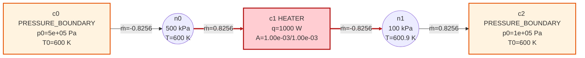

**物理故事**：heater 零压降行 f2=p2−p1 对流量全盲，全网 4e5 Pa 压差全部由守卫陡坡吸收：物理解要求流量超声速容量（cap 按 upwind 5e5/600K≈0.825 kg/s），守卫把工作点钉在闭式根 cap+Δp/K（K=κ·p_ref/m_ref），终态告警指路网络容量不足。流量自 n0 经 heater 到 n1，q=1000W 使 n1 温升约 0.9 K。

- ✅ converged（converged）
- ✅ ṁ0≈0.8256±1e-3（ṁ0=0.825626）
- ✅ 闭式根|ṁ0−(cap+Δp/K)|<5e-4（m_closed=0.825626 K=6.061e+08）
- ✅ 恰 1 条守卫命中（hits=[(1, 1)]）
- ✅ 恰 1 条软壅塞告警调用（warn_calls=1）

| 命中元件 | 口 | ṁ | cap | ratio |
|---|---|---|---|---|
| c1 | 1 | -0.8256 | 0.825 | 1.0008 |

### DG-1b（A 组）—— DG-1 但初值换手工对称 ±1.1·cap

**verdict: PASS**　status=converged　iters=3　命中=1　告警调用=1　worst ratio=1.001


**物理故事**：与 DG-1 同网络，初值由测试侧独立构造（锚定压力/均值温度/±1.1·cap 对称流量，与 default_guess 同式不同源）——两路径必须落到同一根：容量初值只影响路径不影响根的回归钉。

- ✅ converged（converged）
- ✅ 同根|Δṁ|<1e-9（|0.825625656 − 0.825625656|=0.00e+00）
- 📝 default_guess 初值 ṁ0=0.825625656，手工初值 ṁ0=0.825625656

| 命中元件 | 口 | ṁ | cap | ratio |
|---|---|---|---|---|
| c1 | 1 | -0.8256 | 0.825 | 1.0008 |

### DG-2（A 组）—— MASS_SOURCE(0.03,600K) → HEATER(A=1e-3) → PB 1e5

**verdict: PASS**　status=converged　iters=1　命中=0　告警调用=0　worst ratio=0.1818

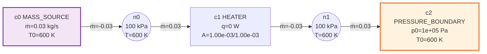

**物理故事**：源规定 0.03 kg/s 远低于 heater 容量（upwind 1e5/600K 口径 cap≈0.165）：守卫死区内精确零扰动（+0.0），解=纯物理根、零告警——亚容量网络守卫完全隐身的检查。

- ✅ converged（converged）
- ✅ ṁ=0.03±1e-7（ṁ0=0.030000000）
- ✅ 零告警（hits=[] warn=0）

### DG-3（A 组）—— DG-1 反向（node0 侧 PB 1e5、node1 侧 PB 5e5）

**verdict: PASS**　status=converged　iters=3　命中=1　告警调用=1　worst ratio=1.001

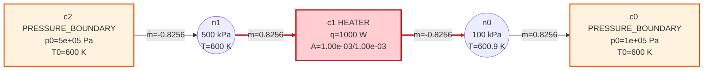

**物理故事**：流量自 heater port1 进 port0 出：upwind 判定切换到进料口（取料口总压最大者 n1=5e5），闭式根对称成立 ṁ0≈−0.8256——守卫 upwind 口径方向对称性的检查（反向用本口容量会把 cap 定在低压侧）。

- ✅ converged（converged）
- ✅ ṁ0≈−0.8256±1e-2（ṁ0=-0.825626）
- ✅ 1 条守卫命中（hits=[(1, 1)]）

| 命中元件 | 口 | ṁ | cap | ratio |
|---|---|---|---|---|
| c1 | 1 | 0.8256 | 0.825 | 1.0008 |

### DG-4（A 组）—— DG-1 面积扫描 A∈{1e-4,3e-4,1e-3,3e-3,1e-2}

**verdict: PASS**　status=converged　iters=3　命中=1　告警调用=1　worst ratio=1.001


**物理故事**：面积扫描：cap 与 m_ref 同比例缩放 → K=κ·p_ref/m_ref 反比缩放 → 相对钉位偏移 ratio−1 = Δp/(κ·p_ref)≈8e-4 与面积无关（守卫标度的物理检查，K→∞ 极限的有限-κ 版本）。注意绝对 offset=Δp/K∝A（任务带 [4e-4,1e-3] 仅在 A≈1e-3 档成立，逐档实测记录在案）。

- ✅ 各档 converged+1 命中+ratio∈[1,1.05]+相对偏移守标度（通过 5/5 档，不收敛 0 档（归 M2））
- 📝 逐档实测: [{"A": 0.0001, "status": "converged", "iters": 4, "hits": 1, "ratio": 1.0008, "offset": 6.599725466059636e-05, "offset_rel": 0.0007999999999998365, "ok": true, "exp_rel": 0.0008}, {"A": 0.0003, "status": "converged", "iters": 4, "hits": 1, "ratio": 1.0008, "offset": 0.00019799176398180296, "offset_rel": 0.0007999999999998927, "ok": true, "exp_rel": 0.0008}, {"A": 0.001, "status": "converged", "iters": 3, "hits": 1, "ratio": 1.000800000012752, "offset": 0.0006599725571090342, "offset_rel": 0.0008000000127518329, "ok": true, "exp_rel": 0.0008}, {"A": 0.003, "status": "converged", "iters": 3, "hits": 1, "ratio": 1.000800000003899, "offset": 0.0019799176496801962, "offset_rel": 0.0008000000038989514, "ok": true, "exp_rel": 0.0008}, {"A": 0.01, "status": "converged", "iters": 2, "hits": 1, "ratio": 1.0008, "offset": 0.006599725466060136, "offset_rel": 0.0007999999999998971, "ok": true, "exp_rel": 0.0008}]
- 📝 绝对 offset 随 A 线性缩放（6.60e-05~6.60e-03）；任务书 offset∈[4e-4,1e-3] 带仅在 A=1e-3 档成立——与面积无关的量是相对偏移 offset/cap=Δp/(κ·p_ref)，已按此断言

| 命中元件 | 口 | ṁ | cap | ratio |
|---|---|---|---|---|
| c1 | 1 | -0.8256 | 0.825 | 1.0008 |

### DG-5（A 组）—— DG-1 压差扫描 p_up∈{2e5,3e5,5e5,7e5,9e5}

**verdict: PASS**　status=converged　iters=3　命中=1　告警调用=1　worst ratio=1.001

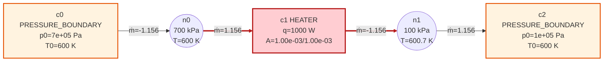

**物理故事**：压差扫描：ratio−1 = Δp/(κ·p_ref) 恒在 1e-3 量级（远小于 5% 带）；offset/Δp = 1/K = m_ref/(κ·p_ref) 近常数——cap∝p0/√T0 与 p0 的一次律相抵，K 的 p_ref/m_ref 定标自消（守卫标度跨压差可移植的检查）。

- ✅ 各档 converged+1 命中+ratio∈[1,1.05]+offset/Δp 近常数（收敛 5/5，ratios=['1.0005', '1.0007', '1.0008', '1.0009', '1.0009']）
- 📝 offset/Δp = 1/K 跨档极差比 1.000（近常数）
- 📝 逐档实测: [{"p_up": 200000.0, "status": "converged", "iters": 3, "hits": 1, "ratio": 1.000500000018998, "offset_over_dp": 1.649931429149043e-09, "one_over_K": 1.6499313665152463e-09}, {"p_up": 300000.0, "status": "converged", "iters": 3, "hits": 1, "ratio": 1.0006666666886472, "offset_over_dp": 1.6499314210816073e-09, "one_over_K": 1.649931366515246e-09}, {"p_up": 500000.0, "status": "converged", "iters": 3, "hits": 1, "ratio": 1.000800000012752, "offset_over_dp": 1.6499313927725856e-09, "one_over_K": 1.6499313665152465e-09}, {"p_up": 700000.0, "status": "converged", "iters": 3, "hits": 1, "ratio": 1.0008571428424797, "offset_over_dp": 1.6499313381146408e-09, "one_over_K": 1.649931366515246e-09}, {"p_up": 900000.0, "status": "converged", "iters": 3, "hits": 1, "ratio": 1.0008888888924647, "offset_over_dp": 1.649931373298441e-09, "one_over_K": 1.649931366515246e-09}]

| 命中元件 | 口 | ṁ | cap | ratio |
|---|---|---|---|---|
| c1 | 1 | -1.156 | 1.155 | 1.0009 |

### DG-6（A 组）—— PB 5e5 → H1(A=1e-3) → 节点 → H2(A=1e-3) → PB 1e5

**verdict: PASS**　status=converged　iters=2　命中=2　告警调用=1　worst ratio=1.001

```mermaid
flowchart LR
N0(("n0<br/>500 kPa<br/>T=600 K"))
N1(("n1<br/>100 kPa<br/>T=600 K"))
N2(("n2<br/>499.6 kPa<br/>T=600 K"))
C0["c0 PRESSURE_BOUNDARY<br/>p0=5e+05 Pa<br/>T0=600 K"]
C0 -- "ṁ=-0.825" --> N0
C1["c1 HEATER<br/>q=0 W<br/>A=1.00e-03/1.00e-03"]
N0 -- "ṁ=0.825" --> C1
C1 -- "ṁ=-0.825" --> N2
C2["c2 HEATER<br/>q=0 W<br/>A=1.00e-03/1.00e-03"]
N2 -- "ṁ=0.825" --> C2
C2 -- "ṁ=-0.825" --> N1
C3["c3 PRESSURE_BOUNDARY<br/>p0=1e+05 Pa<br/>T0=600 K"]
N1 -- "ṁ=0.825" --> C3
classDef pbound fill:#FFF3E0,stroke:#E65100,stroke-width:2px
classDef msource fill:#F3E5F5,stroke:#6A1B9A,stroke-width:2px
classDef booster fill:#E3F2FD,stroke:#1565C0,stroke-width:2px
classDef softchoked fill:#FFCDD2,stroke:#B71C1C,stroke-width:2.5px
class C0 pbound
class C1 softchoked
class C2 softchoked
class C3 pbound
linkStyle 1 stroke:#B71C1C,stroke-width:3px
linkStyle 2 stroke:#B71C1C,stroke-width:3px
linkStyle 3 stroke:#B71C1C,stroke-width:3px
linkStyle 4 stroke:#B71C1C,stroke-width:3px
```

**物理故事**：双零压降串联：两根陡坡行串联分压，中间节点压力由两守卫行联立决定（≈4.996e5，贴着上游锚点）——H1 贴激活阈值（ratio−1≈1e-6），H2 吸收主要偏移（ratio−1≈8e-4）；两件各自命中（hits=2，告警调用合并为 1 条——实现把全部命中写进同一文案）。|ṁ|≈cap+Δp/(2K)∈[0.82,0.83]。

- ✅ converged（converged）
- ✅ 2 条守卫命中（hits=[(1, 1), (2, 1)]）
- ✅ |ṁ|∈[0.82,0.83]（ṁ=0.824966）
- 📝 告警调用数=1（实现把全部命中合并进一条 warn 文案——'告警数'按命中条数口径）

| 命中元件 | 口 | ṁ | cap | ratio |
|---|---|---|---|---|
| c1 | 1 | -0.825 | 0.825 | 1 |
| c2 | 1 | -0.825 | 0.8243 | 1.0008 |

### DG-7（A 组）—— PB 5e5 → ORIFICE(A=2e-4,β=0.6,Cd=1) → HEATER(A=1e-3) → PB 1e5

**verdict: PASS**　status=converged　iters=3　命中=0　告警调用=0　worst ratio=0.6

```mermaid
flowchart LR
N0(("n0<br/>500 kPa<br/>T=600 K"))
N1(("n1<br/>100 kPa<br/>T=600 K"))
N2(("n2<br/>100 kPa<br/>T=600 K"))
C0["c0 PRESSURE_BOUNDARY<br/>p0=5e+05 Pa<br/>T0=600 K"]
C0 -- "ṁ=-0.099" --> N0
C1["c1 ORIFICE<br/>β=0.6 Cd=1<br/>A=2.00e-04/2.00e-04"]
N0 -- "ṁ=0.099" --> C1
C1 -- "ṁ=-0.099" --> N1
C2["c2 HEATER<br/>q=0 W<br/>A=1.00e-03/1.00e-03"]
N1 -- "ṁ=0.099" --> C2
C2 -- "ṁ=-0.099" --> N2
C3["c3 PRESSURE_BOUNDARY<br/>p0=1e+05 Pa<br/>T0=600 K"]
N2 -- "ṁ=0.099" --> C3
classDef pbound fill:#FFF3E0,stroke:#E65100,stroke-width:2px
classDef msource fill:#F3E5F5,stroke:#6A1B9A,stroke-width:2px
classDef booster fill:#E3F2FD,stroke:#1565C0,stroke-width:2px
classDef softchoked fill:#FFCDD2,stroke:#B71C1C,stroke-width:2.5px
class C0 pbound
class C3 pbound
linkStyle 2 stroke:#B71C1C,stroke-width:3px
```

**物理故事**：孔板喉口有效面积 0.6·2e-4=1.2e-4，链路流量由孔板物理壅塞限定 ṁ≈0.099（超临界闭式）；heater 的 upwind 是自身上游 1e5 节点（零压降、亚容量、压力行未被扰动），守卫口径 cap≈0.165 → ratio=0.6<1，守卫全程旁观零告警。按 5e5 全压口径 heater cap≈0.825，链路流量仅为其 12%（<50% 带，任务书口径）——孔板自限流、heater 远未饱和。

- ✅ converged（converged）
- ✅ 零告警（守卫旁观）（hits=[]）
- ✅ heater ratio<1（守卫口径）（ratio=0.6000）
- ✅ |ṁ|<0.5·cap(5e5 全压口径)（ṁ=0.0990 vs 0.5·cap=0.4125）
- 📝 守卫口径 ratio=0.6000（upwind=1e5，cap=0.1650）；任务书 '<cap·0.5' 按 5e5 全压口径成立、按守卫 upwind 口径为 0.6·cap——双口径均记录，物理结论（孔板限流、heater 远未饱和）不变

### DG-8（A 组）—— MASS_SOURCE(0.03) → HEATER(A=1e-4) → PB 1e5

**verdict: PASS**　status=clean_fail　iters=4　命中=0　告警调用=0　worst ratio=0.999

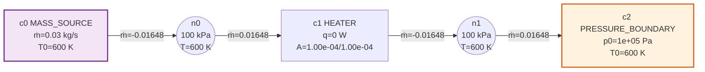

**物理故事**：源规定 0.03 kg/s vs heater 容量（A=1e-4@1e5≈0.0165）：源规定流量超过守卫钉位上限 → 无根网络，预期 clean-fail；失败路径不崩溃、安静退出（记录 iters 与解处 ratio≈1）。

- ✅ 不崩溃（有 status 无 exception）（clean_fail）
- ✅ 预期不收敛（clean_fail）（clean_fail）
- 📝 iters=4，解处 worst ratio=0.9990

### J-1（B 组）—— pysas/netinf_junction.json（junction 三通网络）

**verdict: PASS**　status=converged　iters=4　命中=0　告警调用=0　worst ratio=—

```mermaid
flowchart LR
N0(("n0<br/>300 kPa<br/>T=500 K"))
N1(("n1<br/>300 kPa<br/>T=800 K"))
N2(("n2<br/>253.7 kPa<br/>T=585 K"))
N3(("n3<br/>253.7 kPa<br/>T=585 K"))
N4(("n4<br/>253.7 kPa<br/>T=585 K"))
N5(("n5<br/>100 kPa<br/>T=585 K"))
N6(("n6<br/>100 kPa<br/>T=585 K"))
C0["c0 PRESSURE_BOUNDARY<br/>p0=3e+05 Pa<br/>T0=500 K"]
C0 -- "ṁ=-0.06433" --> N0
C1["c1 ORIFICE<br/>β=1 Cd=0.8<br/>A=2.00e-04/2.00e-04"]
N0 -- "ṁ=0.06433" --> C1
C1 -- "ṁ=-0.06433" --> N2
C2["c2 PRESSURE_BOUNDARY<br/>p0=3e+05 Pa<br/>T0=800 K"]
C2 -- "ṁ=-0.02543" --> N1
C3["c3 ORIFICE<br/>β=1 Cd=0.8<br/>A=1.00e-04/1.00e-04"]
N1 -- "ṁ=0.02543" --> C3
C3 -- "ṁ=-0.02543" --> N2
C4["c4 JUNCTION<br/>零压差绝热混合"]
N2 -- "ṁ=0.08976" --> C4
C4 -- "ṁ=-0.05385" --> N3
C4 -- "ṁ=-0.0359" --> N4
C5["c5 PIPE<br/>L=0.5 D=0.02<br/>A=1.50e-04/1.50e-04"]
N3 -- "ṁ=0.05385" --> C5
C5 -- "ṁ=-0.05385" --> N5
C6["c6 PIPE<br/>L=0.5 D=0.02<br/>A=1.00e-04/1.00e-04"]
N4 -- "ṁ=0.0359" --> C6
C6 -- "ṁ=-0.0359" --> N6
C7["c7 PRESSURE_BOUNDARY<br/>p0=1e+05 Pa<br/>T0=600 K"]
N5 -- "ṁ=0.05385" --> C7
C8["c8 PRESSURE_BOUNDARY<br/>p0=1e+05 Pa<br/>T0=600 K"]
N6 -- "ṁ=0.0359" --> C8
classDef pbound fill:#FFF3E0,stroke:#E65100,stroke-width:2px
classDef msource fill:#F3E5F5,stroke:#6A1B9A,stroke-width:2px
classDef booster fill:#E3F2FD,stroke:#1565C0,stroke-width:2px
classDef softchoked fill:#FFCDD2,stroke:#B71C1C,stroke-width:2.5px
class C0 pbound
class C2 pbound
class C4 softchoked
class C7 pbound
class C8 pbound
linkStyle 6 stroke:#B71C1C,stroke-width:3px
linkStyle 10 stroke:#B71C1C,stroke-width:3px
linkStyle 12 stroke:#B71C1C,stroke-width:3px
```

**物理故事**：junction 零压差行组（f2/f3）是'多腔等压'的结构约束，逐口陡坡与它互锁（A0257 实证）→ 方程侧守卫按 >2 口豁免——全网收敛零告警。

- ✅ converged（converged）
- ✅ 零告警（hits=[]）

### J-2（B 组）—— PB 3e5 → HEATER(A=1e-4) → 节点 → JUNCTION(3口) → 两个 PB 1e5（任务书裸拓扑）

**verdict: PASS**　status=clean_fail　iters=0　命中=1　告警调用=0　worst ratio=1.1

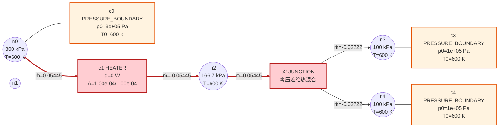

**物理故事**：junction 出口直挂两个等压 PB：两支路完全对称等压 → 分流比不定（J 有一维零空间，任 split 都满足全部方程）——实测 iters=0 冻结在容量初值。定性：拓扑病态非守卫问题；守卫口径下 junction 口从未出现在命中里（多口豁免生效）。适定变体见 J-2b。

- ✅ 不崩溃
- ✅ junction 口不在守卫命中里（hits=[(1, 1)]）
- 📝 实测 status=clean_fail iters=0 warn=0——裸拓扑分流不定，实测定性记录在案（不判失败）

| 命中元件 | 口 | ṁ | cap | ratio |
|---|---|---|---|---|
| c1 | 1 | -0.05445 | 0.0495 | 1.1 |

### J-2b（B 组）—— PB 3e5 → HEATER(A=1e-4) → 节点 → JUNCTION(3口) → 各支路 ORIFICE(A=1e-3) → PB 1e5 ×2

**verdict: PASS**　status=converged　iters=7　命中=1　告警调用=1　worst ratio=1.007

```mermaid
flowchart LR
N0(("n0<br/>300 kPa<br/>T=600 K"))
N1(("n1"))
N2(("n2<br/>100.5 kPa<br/>T=600 K"))
N3(("n3<br/>100.5 kPa<br/>T=600 K"))
N4(("n4<br/>100 kPa<br/>T=600 K"))
N5(("n5<br/>100.5 kPa<br/>T=600 K"))
N6(("n6<br/>100 kPa<br/>T=600 K"))
C0["c0 PRESSURE_BOUNDARY<br/>p0=3e+05 Pa<br/>T0=600 K"]
C0 -- "ṁ=-0.04983" --> N0
C1["c1 HEATER<br/>q=0 W<br/>A=1.00e-04/1.00e-04"]
N0 -- "ṁ=0.04983" --> C1
C1 -- "ṁ=-0.04983" --> N2
C2["c2 JUNCTION<br/>零压差绝热混合"]
N2 -- "ṁ=0.04983" --> C2
C2 -- "ṁ=-0.02491" --> N3
C2 -- "ṁ=-0.02491" --> N5
C3["c3 ORIFICE<br/>β=1 Cd=1<br/>A=1.00e-03/1.00e-03"]
N3 -- "ṁ=0.02491" --> C3
C3 -- "ṁ=-0.02491" --> N4
C4["c4 ORIFICE<br/>β=1 Cd=1<br/>A=1.00e-03/1.00e-03"]
N5 -- "ṁ=0.02491" --> C4
C4 -- "ṁ=-0.02491" --> N6
C5["c5 PRESSURE_BOUNDARY<br/>p0=1e+05 Pa<br/>T0=600 K"]
N4 -- "ṁ=0.02491" --> C5
C6["c6 PRESSURE_BOUNDARY<br/>p0=1e+05 Pa<br/>T0=600 K"]
N6 -- "ṁ=0.02491" --> C6
classDef pbound fill:#FFF3E0,stroke:#E65100,stroke-width:2px
classDef msource fill:#F3E5F5,stroke:#6A1B9A,stroke-width:2px
classDef booster fill:#E3F2FD,stroke:#1565C0,stroke-width:2px
classDef softchoked fill:#FFCDD2,stroke:#B71C1C,stroke-width:2.5px
class C0 pbound
class C1 softchoked
class C2 softchoked
class C5 pbound
class C6 pbound
linkStyle 1 stroke:#B71C1C,stroke-width:3px
linkStyle 2 stroke:#B71C1C,stroke-width:3px
linkStyle 3 stroke:#B71C1C,stroke-width:3px
linkStyle 4 stroke:#B71C1C,stroke-width:3px
linkStyle 5 stroke:#B71C1C,stroke-width:3px
```

**物理故事**：J-2 的适定变体：junction 每条出口支路加限流孔板再挂 PB，分流由孔板特性定住。heater（A=1e-4，cap≈0.0495）成为唯一瓶颈被守卫钉位——全部命中只指向 heater，junction 永不出现（多口豁免在有告警网络中的实证）。

- ✅ converged（converged）
- ✅ 全部命中只指向 heater(c1)（hits=[(1, 1)]）
- ✅ junction(c2) 永不出现（hits=[(1, 1)]）

| 命中元件 | 口 | ṁ | cap | ratio |
|---|---|---|---|---|
| c1 | 1 | -0.04983 | 0.0495 | 1.0066 |

### PB-1（B 组）—— pysas/netinf双壅塞陷阱.json（投影牛顿领地）

**verdict: PASS**　status=converged　iters=7　命中=0　告警调用=0　worst ratio=—

```mermaid
flowchart LR
N0(("n0<br/>300 kPa<br/>T=600 K"))
N1(("n1<br/>100.2 kPa<br/>T=600 K"))
N2(("n2<br/>100 kPa<br/>T=600 K"))
C0["c0 PRESSURE_BOUNDARY<br/>p0=3e+05 Pa<br/>T0=600 K"]
C0 -- "ṁ=-0.005944" --> N0
C1["c1 PIPE<br/>L=0.5 D=0.02<br/>A=1.42e-05/1.42e-05"]
N0 -- "ṁ=0.005944" --> C1
C1 -- "ṁ=-0.005944" --> N1
C2["c2 PIPE<br/>L=0.5 D=0.02<br/>A=3.14e-04/3.14e-04"]
N1 -- "ṁ=0.005944" --> C2
C2 -- "ṁ=-0.005944" --> N2
C3["c3 PRESSURE_BOUNDARY<br/>p0=1e+05 Pa<br/>T0=600 K"]
N2 -- "ṁ=0.005944" --> C3
classDef pbound fill:#FFF3E0,stroke:#E65100,stroke-width:2px
classDef msource fill:#F3E5F5,stroke:#6A1B9A,stroke-width:2px
classDef booster fill:#E3F2FD,stroke:#1565C0,stroke-width:2px
classDef softchoked fill:#FFCDD2,stroke:#B71C1C,stroke-width:2.5px
class C0 pbound
class C3 pbound
linkStyle 2 stroke:#B71C1C,stroke-width:3px
```

**物理故事**：两孔板物理壅塞自限流（孔板特性行流量纲、无压力行）——守卫不管物理壅塞：零告警，投影牛顿领地照常收敛。

- ✅ converged（converged）
- ✅ 零告警（hits=[]）

### SU-1（B 组）—— pysas/netinf_surrogate.json（SURROGATE_FLOW）

**verdict: PASS**　status=converged　iters=1　命中=0　告警调用=0　worst ratio=—

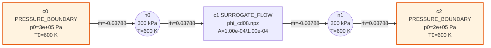

**物理故事**：SURROGATE_FLOW 无压力行（row_units 全 0）——守卫无对象；npz 特性表驱动收敛零告警。dev 树内无 out/phi_cd08.npz（io 按 JSON 所在目录解析相对 model_path），从旧工作区复制副本到 fuzz/results/ 供读（原文件零改动）。

- ✅ converged（converged ）
- ✅ 零告警（hits=[]）

### 5P-1（B 组）—— pysas/netinf_5port.json（5 管网络）

**verdict: PASS**　status=converged　iters=2　命中=0　告警调用=0　worst ratio=—

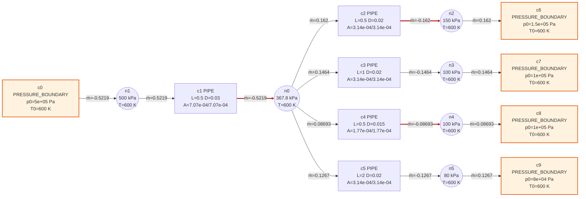

**物理故事**：管件特性行皆流量纲（无 row_units==1 压力行）——守卫零对象，收敛零告警。

- ✅ converged（converged）
- ✅ 零告警（hits=[]）

### BM-1（C 组）—— pysas/netinf.json + netinf_B.json + scipy 对照

**verdict: PASS**　status=—　iters=—　命中=0　告警调用=—　worst ratio=—

```mermaid
flowchart LR
N0(("n0<br/>300 kPa<br/>T=600 K"))
N1(("n1<br/>277.1 kPa<br/>T=600 K"))
N2(("n2<br/>100 kPa<br/>T=600 K"))
C0["c0 PRESSURE_BOUNDARY<br/>p0=3e+05 Pa<br/>T0=600 K"]
C0 -- "ṁ=-0.1217" --> N0
C1["c1 PIPE<br/>L=0.5 D=0.02<br/>A=3.14e-04/3.14e-04"]
N0 -- "ṁ=0.1217" --> C1
C1 -- "ṁ=-0.1217" --> N1
C2["c2 PIPE<br/>L=0.5 D=0.02<br/>A=3.14e-04/3.14e-04"]
N1 -- "ṁ=0.1217" --> C2
C2 -- "ṁ=-0.1217" --> N2
C3["c3 PRESSURE_BOUNDARY<br/>p0=1e+05 Pa<br/>T0=600 K"]
N2 -- "ṁ=0.1217" --> C3
classDef pbound fill:#FFF3E0,stroke:#E65100,stroke-width:2px
classDef msource fill:#F3E5F5,stroke:#6A1B9A,stroke-width:2px
classDef booster fill:#E3F2FD,stroke:#1565C0,stroke-width:2px
classDef softchoked fill:#FFCDD2,stroke:#B71C1C,stroke-width:2.5px
class C0 pbound
class C3 pbound
linkStyle 4 stroke:#B71C1C,stroke-width:3px
```

netinf_B.json：
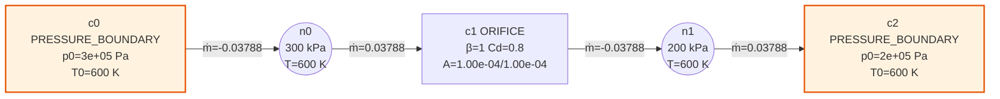

**物理故事**：基线网络守卫亚容量零扰动 → 收敛零告警；scipy least_squares(lm) 独立对照同根：缩放坐标 max|dx|<1e-9（pysas 收敛判据 max|F̃|<1e-6 作用在缩放坐标，raw 坐标差~1e-6·p_ref 是容差平移，逐项记录在案）。

- ✅ 两例 converged+零告警+scipy 同根(缩放 max|dx|<1e-9)（{"pysas/netinf.json": {"status": "converged", "iters": 5, "warn": 0, "scipy": {"ok": true, "max_F_scaled": 4.209127552179204e-16, "max_dx_scaled": 2.9130808876232095e-11, "max_dx_raw": 8.668110240250826e-06, "method": "lm"}}, "pysas/netinf_B.json": {"status": "converged", "iters": 1, "warn": 0, "scipy": {"ok": true, "max_F_scaled": 0.0, "max_dx_scaled": 5.663949309564487e-10, "max_dx_raw": 8.888275715435157e-08, "method": "lm"}}}）

### V1（C 组）—— papers 基准 V1：锐边孔板流量特性（34 点×3 扫描）

**verdict: PASS**　status=—　iters=—　命中=0　告警调用=—　worst ratio=—

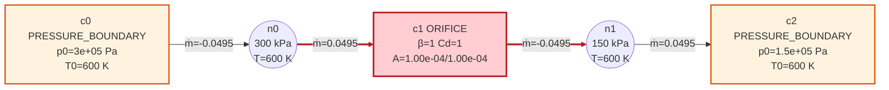

**物理故事**：孔板无压力行、容量初值不涉及（网络无 row_units==1 行）→ 守卫零扰动。三重对照：① dev 实现（补丁副本）自身四项文献判据全过；② 与参考 v1_results.json 逐点 |Δṁ|<1e-9（孔板物理自参考生成以来未变）；③ 与旧工作树（pre-guard）双跑结果逐位一致。补丁两处：路径改指 dev 树 + 解向量提取行从旧布局 [p|ṁ] 位置下标适配为 dev API（想法 22 后布局为 [p|T|ṁ]，位置下标取到的是温度）。原基准文件零改动。

- ✅ dev 变体退出码 0（四项文献判据全过）（rc=0 tail=役（数值由气体类构造器赋予），已忽略
residual: it=1  alpha=1.000  max|F|=5.84e-10
共 102 个工作点全部收敛（最大迭代 1 步）
壅塞平台闭式 = 0.049498 kg/s，转折 β = 0.5284
  ✓ ① A: |ṁ/Φ−1|<1e-9 全压比段
  ✓ ② A: 壅塞平台=闭式且转折在 β_crit±0.025
  ✓ ③ B: ṁ_B/Φ = 0.61±1e-9
  ✓ ④ C: 等效 Cd 复现 Jobson C(β) (|ΔC|<2e-3)
图: fig_v1_orifice.png   数据: v1_results.json
）
- ✅ 与参考结果逐点对照 worst rel<1e-6（求解器自身判据带）（worst_rel=1.07e-07 key=[]）
- ✅ dev vs 旧工作树(pre-guard) 双跑逐位一致（worst_rel=0.00e+00 []）
- 📝 布局适配行: return abs(res.x[system.n_interior + 1])
- 📝 vs 参考 worst rel = 1.07e-07（1e-9 级逐点差是两侧各自 max|F̃|<1e-6 缩放收敛判据的容差噪声，孔板物理未变——dev vs pre-guard 双跑已逐位一致）
- 📝 图为代表性工作点（β=0.5, Cd=1, 3e5→1.5e5）——基准本体是 34 点×3 扫描，拓扑同形

### V2（C 组）—— papers 基准 V2：Darcy 管件串/并联网络

**verdict: PASS**　status=—　iters=—　命中=0　告警调用=—　worst ratio=—

```mermaid
flowchart LR
N0(("n0<br/>300 kPa<br/>T=600 K"))
N1(("n1<br/>283.4 kPa<br/>T=600 K"))
N2(("n2<br/>100 kPa<br/>T=600 K"))
C0["c0 PRESSURE_BOUNDARY<br/>p0=3e+05 Pa<br/>T0=600 K"]
C0 -- "ṁ=-0.1311" --> N0
C1["c1 PIPE<br/>L=0.5 D=0.03<br/>A=3.14e-04/3.14e-04"]
N0 -- "ṁ=0.1311" --> C1
C1 -- "ṁ=-0.1311" --> N1
C2["c2 PIPE<br/>L=0.5 D=0.03<br/>A=3.14e-04/3.14e-04"]
N1 -- "ṁ=0.1311" --> C2
C2 -- "ṁ=-0.1311" --> N2
C3["c3 PRESSURE_BOUNDARY<br/>p0=1e+05 Pa<br/>T0=600 K"]
N2 -- "ṁ=0.1311" --> C3
classDef pbound fill:#FFF3E0,stroke:#E65100,stroke-width:2px
classDef msource fill:#F3E5F5,stroke:#6A1B9A,stroke-width:2px
classDef booster fill:#E3F2FD,stroke:#1565C0,stroke-width:2px
classDef softchoked fill:#FFCDD2,stroke:#B71C1C,stroke-width:2.5px
class C0 pbound
class C3 pbound
linkStyle 4 stroke:#B71C1C,stroke-width:3px
```

**物理故事**：管件特性行皆流量纲（无压力行）→ 守卫零对象。核对发现：参考 v2_results.json 生成后管件模型经历 Fanno 压缩管流重构（git: 11bfd85 不可压算法体 → bef9569 Fanno cap 口径——两工作区当前 pipe.py 逐位相同、同解 0.1217 kg/s），脚本的不可压 Darcy 手算对照已不再描述现管件物理——参考基线过期，与守卫无关（守卫对管件零作用）。守卫回归的实质判据改为：dev（含守卫）与旧工作树（pre-guard）双跑结果逐位一致——零扰动直接实证。参考对照差值如实记录。

- ✅ dev 变体完成并产出 v2_results.json（rc=1 tail=_exact|<0.5 Pa
  ✗ ② T: |ṁ−定点解|<1e-8
  ✗ ③ P: 支路压降相等 |Δ|<0.5 Pa
  ✓ ④ P: Kirchhoff |ṁ₁+ṁ₂−ṁ_tot|<1e-9
  ✗ ⑤ P: 支路流量=独立 Darcy 定点解
  T: p_mid=277100.94 (exact 216227.77)  ṁ=0.121728 kg/s
  P: p_plenum=288342 Pa  ṁ₁=0.088984  ṁ₂=0.047509  ṁ_tot=0.136493 kg/s
图: fig_v2_network.png   数据: v2_results.json
）
- ✅ dev vs 旧工作树(pre-guard) 双跑逐位一致（守卫零扰动）（worst_rel=0.00e+00 []）
- 📝 布局适配行: p_mid, m_tot_T, m_br1, m_br2, m_tot_P, p_plenum
- 📝 vs 过期参考 worst rel = 8.71e-01（例 ['root.results.T_series.p_mid_solver: 277100.9411393568 vs 216227.7660168388 (rel 2.82e-01)', 'root.results.T_series.mdot_solver: 0.1217278777272548 vs 0.25769260148645806 (rel 1.36e-01)']）——管件模型演化所致，非守卫回归：旧工作树（pre-guard）同解，pipe.py 两树逐位相同
- 📝 图为代表性串联拓扑——基准本体含 T/P 两算例

## 2. fuzz 全量扫描（A 层随机语料 + C 层边界酷刑，冷启动）

### 2.1 汇总统计

| 维度 | 结果 |
|---|---|
| 算例数 | 395 |
| A 层 | 300 例，收敛 44，告警例 4 |
| C 层 | 95 例，收敛 84，告警例 0 |
| converged | 128（32.4%） |
| clean_fail | 261 |
| assemble_error | 6 |
| 守卫告警例（converged+hits） | 4 |
| worst ratio 分位 P50 / P90 / MAX | 0.03744 / 1.018 / 24.07 |
| scipy 双解嫌疑（max\|dx\|_scaled>1e-6） | 6 |
| scipy 未收敛例（lm 从同初值） | 27 |
| 扫描耗时 | 214.7 s |

### 2.2 converged+有告警 例逐例详析

#### A0004　worst=1.0208

```mermaid
flowchart LR
N0(("n0<br/>549.8 kPa<br/>T=502.9 K"))
N1(("n1<br/>136.1 kPa<br/>T=623.4 K"))
N2(("n2<br/>571 kPa<br/>T=502.9 K"))
N3(("n3<br/>113.1 kPa<br/>T=623.4 K"))
N4(("n4<br/>600.9 kPa<br/>T=637.8 K"))
C0["c0 HEATER<br/>q=253.2 W<br/>A=5.02e-06/5.02e-06"]
N0 -- "ṁ=0.005082" --> C0
C0 -- "ṁ=-0.005082" --> N1
C1["c1 AREA_CHANGE<br/>ζ=1.449<br/>A=1.50e-05/2.11e-05"]
C1 -- "ṁ=-0.005082" --> N0
N2 -- "ṁ=0.005082" --> C1
C2["c2 ORIFICE<br/>β=1 Cd=0.5517<br/>A=3.22e-04/3.22e-04"]
N1 -- "ṁ=0.03007" --> C2
C2 -- "ṁ=-0.03007" --> N3
C3["c3 ORIFICE<br/>β=1 Cd=0.5145<br/>A=5.05e-05/5.05e-05"]
C3 -- "ṁ=-0.02499" --> N1
N4 -- "ṁ=0.02499" --> C3
C4["c4 PRESSURE_BOUNDARY<br/>p0=6.009e+05 Pa<br/>T0=637.8 K"]
C4 -- "ṁ=-0.02499" --> N4
C5["c5 PRESSURE_BOUNDARY<br/>p0=1.131e+05 Pa<br/>T0=821 K"]
N3 -- "ṁ=0.03007" --> C5
C6["c6 PRESSURE_BOUNDARY<br/>p0=5.71e+05 Pa<br/>T0=502.9 K"]
C6 -- "ṁ=-0.005082" --> N2
classDef pbound fill:#FFF3E0,stroke:#E65100,stroke-width:2px
classDef msource fill:#F3E5F5,stroke:#6A1B9A,stroke-width:2px
classDef booster fill:#E3F2FD,stroke:#1565C0,stroke-width:2px
classDef softchoked fill:#FFCDD2,stroke:#B71C1C,stroke-width:2.5px
class C0 softchoked
class C3 softchoked
class C4 pbound
class C5 pbound
class C6 pbound
linkStyle 0 stroke:#B71C1C,stroke-width:3px
linkStyle 1 stroke:#B71C1C,stroke-width:3px
linkStyle 6 stroke:#B71C1C,stroke-width:3px
```

**定性**：c0(HEATER)口1 ratio=1.021 —— 守卫钉位（非物理解，告警指路网络容量不足）

| 元件 | 口 | 类型 | ṁ [kg/s] | cap [kg/s] | ratio | 口节点压力 [Pa] |
|---|---|---|---|---|---|---|
| c0 | 1 | HEATER | -0.005082 | 0.004978 | 1.0208 | 5.498e+05/1.361e+05 |

#### A0093　worst=1.0001

```mermaid
flowchart LR
N0(("n0<br/>197.3 kPa<br/>T=458.6 K"))
N1(("n1<br/>229.7 kPa<br/>T=500.6 K"))
N2(("n2<br/>243.3 kPa<br/>T=458.6 K"))
N3(("n3<br/>366.5 kPa<br/>T=458.6 K"))
C0["c0 AREA_CHANGE<br/>ζ=1.183<br/>A=8.26e-04/2.30e-07"]
C0 -- "ṁ=-8.723e-05" --> N0
N2 -- "ṁ=8.723e-05" --> C0
C1["c1 HEATER<br/>q=9768 W<br/>A=4.86e-04/4.86e-04"]
N2 -- "ṁ=0.2233" --> C1
C1 -- "ṁ=-0.2233" --> N1
C2["c2 ORIFICE<br/>β=1 Cd=0.803<br/>A=1.46e-05/1.46e-05"]
C2 -- "ṁ=-0.007915" --> N1
N3 -- "ṁ=0.007915" --> C2
C3["c3 BOOSTER<br/>p: 2.433e+05→3.665e+05 Pa<br/>增压比 π=1.506"]
C3 -- "ṁ=-0.2234" --> N2
C3 -- "ṁ=-0.007915" --> N3
C4["c4 PRESSURE_BOUNDARY<br/>p0=2.297e+05 Pa<br/>T0=355.5 K"]
N1 -- "ṁ=0.2313" --> C4
C5["c5 PRESSURE_BOUNDARY<br/>p0=1.973e+05 Pa<br/>T0=561.7 K"]
N0 -- "ṁ=8.723e-05" --> C5
classDef pbound fill:#FFF3E0,stroke:#E65100,stroke-width:2px
classDef msource fill:#F3E5F5,stroke:#6A1B9A,stroke-width:2px
classDef booster fill:#E3F2FD,stroke:#1565C0,stroke-width:2px
classDef softchoked fill:#FFCDD2,stroke:#B71C1C,stroke-width:2.5px
class C1 softchoked
class C3 softchoked
class C4 pbound
class C5 pbound
linkStyle 2 stroke:#B71C1C,stroke-width:3px
linkStyle 3 stroke:#B71C1C,stroke-width:3px
linkStyle 6 stroke:#B71C1C,stroke-width:3px
```

**定性**：c1(HEATER)口1 ratio=1 —— 守卫钉位（非物理解，告警指路网络容量不足）

| 元件 | 口 | 类型 | ṁ [kg/s] | cap [kg/s] | ratio | 口节点压力 [Pa] |
|---|---|---|---|---|---|---|
| c1 | 1 | HEATER | -0.2233 | 0.2233 | 1.0001 | 2.433e+05/2.297e+05 |

#### A0171　worst=24.074

```mermaid
flowchart LR
N0(("n0<br/>279 kPa<br/>T=783.1 K"))
N1(("n1<br/>469.7 kPa<br/>T=783.1 K"))
N2(("n2<br/>404.7 kPa<br/>T=1047 K"))
C0["c0 ORIFICE<br/>β=1 Cd=0.5081<br/>A=8.41e-03/8.41e-03"]
C0 -- "ṁ=-2.87" --> N0
N1 -- "ṁ=2.87" --> C0
C1["c1 HEATER<br/>q=107.2 W<br/>A=2.47e-08/2.47e-08"]
N1 -- "ṁ=0.0004028" --> C1
C1 -- "ṁ=-0.0004028" --> N2
C2["c2 PIPE<br/>L=0.111 D=0.0004403<br/>A=1.52e-07/1.52e-07"]
C2 -- "ṁ=-2.528e-05" --> N0
N2 -- "ṁ=2.528e-05" --> C2
C3["c3 BOOSTER<br/>p: 2.79e+05→4.697e+05 Pa<br/>增压比 π=1.684"]
N0 -- "ṁ=2.87" --> C3
C3 -- "ṁ=-2.589" --> N1
C4["c4 PRESSURE_BOUNDARY<br/>p0=4.047e+05 Pa<br/>T0=846.5 K"]
N2 -- "ṁ=0.0003775" --> C4
C5["c5 MASS_SOURCE<br/>ṁ=0.2818 kg/s<br/>T0=783.1 K"]
C5 -- "ṁ=-0.2818" --> N1
classDef pbound fill:#FFF3E0,stroke:#E65100,stroke-width:2px
classDef msource fill:#F3E5F5,stroke:#6A1B9A,stroke-width:2px
classDef booster fill:#E3F2FD,stroke:#1565C0,stroke-width:2px
classDef softchoked fill:#FFCDD2,stroke:#B71C1C,stroke-width:2.5px
class C1 softchoked
class C3 softchoked
class C4 pbound
class C5 msource
linkStyle 2 stroke:#B71C1C,stroke-width:3px
linkStyle 3 stroke:#B71C1C,stroke-width:3px
linkStyle 6 stroke:#B71C1C,stroke-width:3px
linkStyle 7 stroke:#B71C1C,stroke-width:3px
```

**定性**：c1(HEATER)口1 ratio=24.07 —— 守卫钉位（非物理解，告警指路网络容量不足）

| 元件 | 口 | 类型 | ṁ [kg/s] | cap [kg/s] | ratio | 口节点压力 [Pa] |
|---|---|---|---|---|---|---|
| c1 | 1 | HEATER | -0.0004028 | 1.673e-05 | 24.074 | 4.697e+05/4.047e+05 |

#### A0203　worst=1.0086

```mermaid
flowchart LR
N0(("n0<br/>242.4 kPa<br/>T=915.2 K"))
N1(("n1<br/>242.4 kPa<br/>T=849.8 K"))
N2(("n2<br/>242.4 kPa<br/>T=849.8 K"))
N3(("n3<br/>242.4 kPa<br/>T=849.8 K"))
N4(("n4<br/>321.1 kPa<br/>T=895.2 K"))
N5(("n5<br/>242.4 kPa<br/>T=849.8 K"))
C0["c0 PIPE<br/>L=2.082 D=0.04122<br/>A=1.33e-03/1.33e-03"]
N0 --- C0
N1 --- C0
C1["c1 ORIFICE<br/>β=1 Cd=0.9741<br/>A=1.66e-07/1.66e-07"]
N0 --- C1
N2 --- C1
C2["c2 AREA_CHANGE<br/>ζ=0.6533<br/>A=4.04e-08/3.71e-03"]
N2 --- C2
N3 --- C2
C3["c3 HEATER<br/>q=267.5 W<br/>A=3.04e-05/3.04e-05"]
C3 -- "ṁ=-0.01332" --> N0
N4 -- "ṁ=0.01332" --> C3
C4["c4 AREA_CHANGE<br/>ζ=1.916<br/>A=1.91e-06/3.07e-03"]
N1 --- C4
N5 --- C4
C5["c5 PRESSURE_BOUNDARY<br/>p0=3.211e+05 Pa<br/>T0=895.2 K"]
C5 -- "ṁ=-0.01332" --> N4
C6["c6 PRESSURE_BOUNDARY<br/>p0=2.424e+05 Pa<br/>T0=804.4 K"]
N0 -- "ṁ=0.01332" --> C6
classDef pbound fill:#FFF3E0,stroke:#E65100,stroke-width:2px
classDef msource fill:#F3E5F5,stroke:#6A1B9A,stroke-width:2px
classDef booster fill:#E3F2FD,stroke:#1565C0,stroke-width:2px
classDef softchoked fill:#FFCDD2,stroke:#B71C1C,stroke-width:2.5px
class C3 softchoked
class C5 pbound
class C6 pbound
linkStyle 6 stroke:#B71C1C,stroke-width:3px
linkStyle 7 stroke:#B71C1C,stroke-width:3px
```

**定性**：c3(HEATER)口1 ratio=1.009 —— 守卫钉位（非物理解，告警指路网络容量不足）

| 元件 | 口 | 类型 | ṁ [kg/s] | cap [kg/s] | ratio | 口节点压力 [Pa] |
|---|---|---|---|---|---|---|
| c3 | 1 | HEATER | 0.01332 | 0.0132 | 1.0086 | 2.424e+05/3.211e+05 |

### 2.3 worst ratio top10 详析

#### Top1 A0171　worst=24.074 iters=5

```mermaid
flowchart LR
N0(("n0<br/>279 kPa<br/>T=783.1 K"))
N1(("n1<br/>469.7 kPa<br/>T=783.1 K"))
N2(("n2<br/>404.7 kPa<br/>T=1047 K"))
C0["c0 ORIFICE<br/>β=1 Cd=0.5081<br/>A=8.41e-03/8.41e-03"]
C0 -- "ṁ=-2.87" --> N0
N1 -- "ṁ=2.87" --> C0
C1["c1 HEATER<br/>q=107.2 W<br/>A=2.47e-08/2.47e-08"]
N1 -- "ṁ=0.0004028" --> C1
C1 -- "ṁ=-0.0004028" --> N2
C2["c2 PIPE<br/>L=0.111 D=0.0004403<br/>A=1.52e-07/1.52e-07"]
C2 -- "ṁ=-2.528e-05" --> N0
N2 -- "ṁ=2.528e-05" --> C2
C3["c3 BOOSTER<br/>p: 2.79e+05→4.697e+05 Pa<br/>增压比 π=1.684"]
N0 -- "ṁ=2.87" --> C3
C3 -- "ṁ=-2.589" --> N1
C4["c4 PRESSURE_BOUNDARY<br/>p0=4.047e+05 Pa<br/>T0=846.5 K"]
N2 -- "ṁ=0.0003775" --> C4
C5["c5 MASS_SOURCE<br/>ṁ=0.2818 kg/s<br/>T0=783.1 K"]
C5 -- "ṁ=-0.2818" --> N1
classDef pbound fill:#FFF3E0,stroke:#E65100,stroke-width:2px
classDef msource fill:#F3E5F5,stroke:#6A1B9A,stroke-width:2px
classDef booster fill:#E3F2FD,stroke:#1565C0,stroke-width:2px
classDef softchoked fill:#FFCDD2,stroke:#B71C1C,stroke-width:2.5px
class C1 softchoked
class C3 softchoked
class C4 pbound
class C5 msource
linkStyle 2 stroke:#B71C1C,stroke-width:3px
linkStyle 3 stroke:#B71C1C,stroke-width:3px
linkStyle 6 stroke:#B71C1C,stroke-width:3px
linkStyle 7 stroke:#B71C1C,stroke-width:3px
```

**定性**：c1(HEATER)口1 ratio=24.07 —— 守卫钉位（非物理解，告警指路网络容量不足）

| 元件 | 口 | 类型 | ṁ [kg/s] | cap [kg/s] | ratio | 口节点压力 [Pa] |
|---|---|---|---|---|---|---|
| c1 | 1 | HEATER | -0.0004028 | 1.673e-05 | 24.074 | 4.697e+05/4.047e+05 |

#### Top2 A0004　worst=1.0208 iters=11

```mermaid
flowchart LR
N0(("n0<br/>549.8 kPa<br/>T=502.9 K"))
N1(("n1<br/>136.1 kPa<br/>T=623.4 K"))
N2(("n2<br/>571 kPa<br/>T=502.9 K"))
N3(("n3<br/>113.1 kPa<br/>T=623.4 K"))
N4(("n4<br/>600.9 kPa<br/>T=637.8 K"))
C0["c0 HEATER<br/>q=253.2 W<br/>A=5.02e-06/5.02e-06"]
N0 -- "ṁ=0.005082" --> C0
C0 -- "ṁ=-0.005082" --> N1
C1["c1 AREA_CHANGE<br/>ζ=1.449<br/>A=1.50e-05/2.11e-05"]
C1 -- "ṁ=-0.005082" --> N0
N2 -- "ṁ=0.005082" --> C1
C2["c2 ORIFICE<br/>β=1 Cd=0.5517<br/>A=3.22e-04/3.22e-04"]
N1 -- "ṁ=0.03007" --> C2
C2 -- "ṁ=-0.03007" --> N3
C3["c3 ORIFICE<br/>β=1 Cd=0.5145<br/>A=5.05e-05/5.05e-05"]
C3 -- "ṁ=-0.02499" --> N1
N4 -- "ṁ=0.02499" --> C3
C4["c4 PRESSURE_BOUNDARY<br/>p0=6.009e+05 Pa<br/>T0=637.8 K"]
C4 -- "ṁ=-0.02499" --> N4
C5["c5 PRESSURE_BOUNDARY<br/>p0=1.131e+05 Pa<br/>T0=821 K"]
N3 -- "ṁ=0.03007" --> C5
C6["c6 PRESSURE_BOUNDARY<br/>p0=5.71e+05 Pa<br/>T0=502.9 K"]
C6 -- "ṁ=-0.005082" --> N2
classDef pbound fill:#FFF3E0,stroke:#E65100,stroke-width:2px
classDef msource fill:#F3E5F5,stroke:#6A1B9A,stroke-width:2px
classDef booster fill:#E3F2FD,stroke:#1565C0,stroke-width:2px
classDef softchoked fill:#FFCDD2,stroke:#B71C1C,stroke-width:2.5px
class C0 softchoked
class C3 softchoked
class C4 pbound
class C5 pbound
class C6 pbound
linkStyle 0 stroke:#B71C1C,stroke-width:3px
linkStyle 1 stroke:#B71C1C,stroke-width:3px
linkStyle 6 stroke:#B71C1C,stroke-width:3px
```

**定性**：c0(HEATER)口1 ratio=1.021 —— 守卫钉位（非物理解，告警指路网络容量不足）

| 元件 | 口 | 类型 | ṁ [kg/s] | cap [kg/s] | ratio | 口节点压力 [Pa] |
|---|---|---|---|---|---|---|
| c0 | 1 | HEATER | -0.005082 | 0.004978 | 1.0208 | 5.498e+05/1.361e+05 |

#### Top3 A0203　worst=1.0086 iters=4

```mermaid
flowchart LR
N0(("n0<br/>242.4 kPa<br/>T=915.2 K"))
N1(("n1<br/>242.4 kPa<br/>T=849.8 K"))
N2(("n2<br/>242.4 kPa<br/>T=849.8 K"))
N3(("n3<br/>242.4 kPa<br/>T=849.8 K"))
N4(("n4<br/>321.1 kPa<br/>T=895.2 K"))
N5(("n5<br/>242.4 kPa<br/>T=849.8 K"))
C0["c0 PIPE<br/>L=2.082 D=0.04122<br/>A=1.33e-03/1.33e-03"]
N0 --- C0
N1 --- C0
C1["c1 ORIFICE<br/>β=1 Cd=0.9741<br/>A=1.66e-07/1.66e-07"]
N0 --- C1
N2 --- C1
C2["c2 AREA_CHANGE<br/>ζ=0.6533<br/>A=4.04e-08/3.71e-03"]
N2 --- C2
N3 --- C2
C3["c3 HEATER<br/>q=267.5 W<br/>A=3.04e-05/3.04e-05"]
C3 -- "ṁ=-0.01332" --> N0
N4 -- "ṁ=0.01332" --> C3
C4["c4 AREA_CHANGE<br/>ζ=1.916<br/>A=1.91e-06/3.07e-03"]
N1 --- C4
N5 --- C4
C5["c5 PRESSURE_BOUNDARY<br/>p0=3.211e+05 Pa<br/>T0=895.2 K"]
C5 -- "ṁ=-0.01332" --> N4
C6["c6 PRESSURE_BOUNDARY<br/>p0=2.424e+05 Pa<br/>T0=804.4 K"]
N0 -- "ṁ=0.01332" --> C6
classDef pbound fill:#FFF3E0,stroke:#E65100,stroke-width:2px
classDef msource fill:#F3E5F5,stroke:#6A1B9A,stroke-width:2px
classDef booster fill:#E3F2FD,stroke:#1565C0,stroke-width:2px
classDef softchoked fill:#FFCDD2,stroke:#B71C1C,stroke-width:2.5px
class C3 softchoked
class C5 pbound
class C6 pbound
linkStyle 6 stroke:#B71C1C,stroke-width:3px
linkStyle 7 stroke:#B71C1C,stroke-width:3px
```

**定性**：c3(HEATER)口1 ratio=1.009 —— 守卫钉位（非物理解，告警指路网络容量不足）

| 元件 | 口 | 类型 | ṁ [kg/s] | cap [kg/s] | ratio | 口节点压力 [Pa] |
|---|---|---|---|---|---|---|
| c3 | 1 | HEATER | 0.01332 | 0.0132 | 1.0086 | 2.424e+05/3.211e+05 |

#### Top4 A0093　worst=1.0001 iters=4

```mermaid
flowchart LR
N0(("n0<br/>197.3 kPa<br/>T=458.6 K"))
N1(("n1<br/>229.7 kPa<br/>T=500.6 K"))
N2(("n2<br/>243.3 kPa<br/>T=458.6 K"))
N3(("n3<br/>366.5 kPa<br/>T=458.6 K"))
C0["c0 AREA_CHANGE<br/>ζ=1.183<br/>A=8.26e-04/2.30e-07"]
C0 -- "ṁ=-8.723e-05" --> N0
N2 -- "ṁ=8.723e-05" --> C0
C1["c1 HEATER<br/>q=9768 W<br/>A=4.86e-04/4.86e-04"]
N2 -- "ṁ=0.2233" --> C1
C1 -- "ṁ=-0.2233" --> N1
C2["c2 ORIFICE<br/>β=1 Cd=0.803<br/>A=1.46e-05/1.46e-05"]
C2 -- "ṁ=-0.007915" --> N1
N3 -- "ṁ=0.007915" --> C2
C3["c3 BOOSTER<br/>p: 2.433e+05→3.665e+05 Pa<br/>增压比 π=1.506"]
C3 -- "ṁ=-0.2234" --> N2
C3 -- "ṁ=-0.007915" --> N3
C4["c4 PRESSURE_BOUNDARY<br/>p0=2.297e+05 Pa<br/>T0=355.5 K"]
N1 -- "ṁ=0.2313" --> C4
C5["c5 PRESSURE_BOUNDARY<br/>p0=1.973e+05 Pa<br/>T0=561.7 K"]
N0 -- "ṁ=8.723e-05" --> C5
classDef pbound fill:#FFF3E0,stroke:#E65100,stroke-width:2px
classDef msource fill:#F3E5F5,stroke:#6A1B9A,stroke-width:2px
classDef booster fill:#E3F2FD,stroke:#1565C0,stroke-width:2px
classDef softchoked fill:#FFCDD2,stroke:#B71C1C,stroke-width:2.5px
class C1 softchoked
class C3 softchoked
class C4 pbound
class C5 pbound
linkStyle 2 stroke:#B71C1C,stroke-width:3px
linkStyle 3 stroke:#B71C1C,stroke-width:3px
linkStyle 6 stroke:#B71C1C,stroke-width:3px
```

**定性**：c1(HEATER)口1 ratio=1 —— 守卫钉位（非物理解，告警指路网络容量不足）

| 元件 | 口 | 类型 | ṁ [kg/s] | cap [kg/s] | ratio | 口节点压力 [Pa] |
|---|---|---|---|---|---|---|
| c1 | 1 | HEATER | -0.2233 | 0.2233 | 1.0001 | 2.433e+05/2.297e+05 |

#### Top5 A0251　worst=0.54835 iters=10

```mermaid
flowchart LR
N0(("n0<br/>230.2 kPa<br/>T=624 K"))
N1(("n1<br/>190.2 kPa<br/>T=545.6 K"))
N2(("n2<br/>201.2 kPa<br/>T=511.7 K"))
N3(("n3<br/>185.5 kPa<br/>T=621.9 K"))
N4(("n4<br/>185.5 kPa<br/>T=746.8 K"))
C0["c0 ORIFICE<br/>β=1 Cd=0.5449<br/>A=3.60e-06/3.60e-06"]
N0 -- "ṁ=0.0005677" --> C0
C0 -- "ṁ=-0.0005677" --> N1
C1["c1 ORIFICE<br/>β=1 Cd=0.6617<br/>A=1.18e-05/1.18e-05"]
C1 -- "ṁ=-0.001314" --> N1
N2 -- "ṁ=0.001314" --> C1
C2["c2 ORIFICE<br/>β=1 Cd=0.8918<br/>A=2.64e-04/2.64e-04"]
N0 -- "ṁ=0.07105" --> C2
C2 -- "ṁ=-0.07105" --> N3
C3["c3 HEATER<br/>q=9173 W<br/>A=4.42e-04/4.42e-04"]
N3 -- "ṁ=0.07293" --> C3
C3 -- "ṁ=-0.07293" --> N4
C4["c4 AREA_CHANGE<br/>ζ=0.6083<br/>A=2.47e-06/8.15e-07"]
N0 -- "ṁ=0.0001706" --> C4
C4 -- "ṁ=-0.0001706" --> N4
C5["c5 ORIFICE<br/>β=1 Cd=0.9337<br/>A=9.57e-07/9.57e-07"]
N0 -- "ṁ=0.000227" --> C5
C5 -- "ṁ=-0.000227" --> N2
C6["c6 PIPE<br/>L=0.49 D=0.005884<br/>A=2.72e-05/2.72e-05"]
N1 -- "ṁ=0.001882" --> C6
C6 -- "ṁ=-0.001882" --> N3
C7["c7 AREA_CHANGE<br/>ζ=0.3008<br/>A=5.86e-07/1.05e-08"]
N2 -- "ṁ=2.441e-06" --> C7
C7 -- "ṁ=-2.441e-06" --> N3
C8["c8 PRESSURE_BOUNDARY<br/>p0=2.012e+05 Pa<br/>T0=488.3 K"]
C8 -- "ṁ=-0.00109" --> N2
C9["c9 PRESSURE_BOUNDARY<br/>p0=1.855e+05 Pa<br/>T0=453.3 K"]
N4 -- "ṁ=0.0731" --> C9
C10["c10 MASS_SOURCE<br/>ṁ=0.07201 kg/s<br/>T0=624 K"]
C10 -- "ṁ=-0.07201" --> N0
classDef pbound fill:#FFF3E0,stroke:#E65100,stroke-width:2px
classDef msource fill:#F3E5F5,stroke:#6A1B9A,stroke-width:2px
classDef booster fill:#E3F2FD,stroke:#1565C0,stroke-width:2px
classDef softchoked fill:#FFCDD2,stroke:#B71C1C,stroke-width:2.5px
class C8 pbound
class C9 pbound
class C10 msource
```

**定性**：收敛且无守卫命中

（无守卫命中）

#### Top6 A0062　worst=0.059127 iters=6

```mermaid
flowchart LR
N0(("n0<br/>145.2 kPa<br/>T=333.3 K"))
N1(("n1<br/>145.2 kPa<br/>T=333.4 K"))
N2(("n2<br/>299.8 kPa<br/>T=333.3 K"))
C0["c0 HEATER<br/>q=171.2 W<br/>A=5.42e-05/5.42e-05"]
N0 -- "ṁ=0.001031" --> C0
C0 -- "ṁ=-0.001031" --> N1
C1["c1 PIPE<br/>L=1.22 D=0.1008<br/>A=7.98e-03/7.98e-03"]
C1 -- "ṁ=-4.866" --> N1
N2 -- "ṁ=4.866" --> C1
C2["c2 ORIFICE<br/>β=1 Cd=0.561<br/>A=2.77e-06/2.77e-06"]
C2 -- "ṁ=-0.001031" --> N0
N2 -- "ṁ=0.001031" --> C2
C3["c3 PRESSURE_BOUNDARY<br/>p0=2.998e+05 Pa<br/>T0=333.3 K"]
C3 -- "ṁ=-4.867" --> N2
C4["c4 PRESSURE_BOUNDARY<br/>p0=1.452e+05 Pa<br/>T0=502.1 K"]
N1 -- "ṁ=4.867" --> C4
classDef pbound fill:#FFF3E0,stroke:#E65100,stroke-width:2px
classDef msource fill:#F3E5F5,stroke:#6A1B9A,stroke-width:2px
classDef booster fill:#E3F2FD,stroke:#1565C0,stroke-width:2px
classDef softchoked fill:#FFCDD2,stroke:#B71C1C,stroke-width:2.5px
class C1 softchoked
class C3 pbound
class C4 pbound
linkStyle 2 stroke:#B71C1C,stroke-width:3px
```

**定性**：收敛且无守卫命中

（无守卫命中）

#### Top7 A0199　worst=0.037442 iters=14

```mermaid
flowchart LR
N0(("n0<br/>220.9 kPa<br/>T=592.5 K"))
N1(("n1<br/>14 kPa<br/>T=2008 K"))
N2(("n2<br/>247.1 kPa<br/>T=592.5 K"))
N3(("n3<br/>247.1 kPa<br/>T=592.5 K"))
N4(("n4<br/>14 kPa<br/>T=592.5 K"))
N5(("n5<br/>364.4 kPa<br/>T=592.5 K"))
N6(("n6<br/>247.1 kPa<br/>T=592.5 K"))
C0["c0 ORIFICE<br/>β=1 Cd=0.7847<br/>A=5.41e-07/5.41e-07"]
N0 -- "ṁ=0.0001557" --> C0
C0 -- "ṁ=-0.0001557" --> N1
C1["c1 PIPE<br/>L=5.266 D=0.004439<br/>A=1.55e-05/1.55e-05"]
C1 -- "ṁ=-0.00143" --> N1
N2 -- "ṁ=0.00143" --> C1
C2["c2 PIPE<br/>L=0.2236 D=0.0001826<br/>A=2.62e-08/2.62e-08"]
C2 -- "ṁ=-1.289e-06" --> N1
N3 -- "ṁ=1.289e-06" --> C2
C3["c3 HEATER<br/>q=9367 W<br/>A=5.74e-03/5.74e-03"]
C3 -- "ṁ=-0.004996" --> N1
N4 -- "ṁ=0.004996" --> C3
C4["c4 ORIFICE<br/>β=1 Cd=0.5046<br/>A=3.45e-05/3.45e-05"]
C4 -- "ṁ=-0.009996" --> N3
N5 -- "ṁ=0.009996" --> C4
C5["c5 ORIFICE<br/>β=1 Cd=0.6067<br/>A=3.25e-08/3.25e-08"]
N2 --- C5
N6 --- C5
C6["c6 ORIFICE<br/>β=1 Cd=0.6715<br/>A=1.23e-05/1.23e-05"]
C6 -- "ṁ=-0.004996" --> N4
N5 -- "ṁ=0.004996" --> C6
C7["c7 ORIFICE<br/>β=1 Cd=0.9198<br/>A=6.35e-03/6.35e-03"]
C7 -- "ṁ=-0.001874" --> N2
N3 -- "ṁ=0.001874" --> C7
C8["c8 ORIFICE<br/>β=1 Cd=0.6112<br/>A=2.50e-07/2.50e-07"]
C8 -- "ṁ=-9.114e-05" --> N0
N5 -- "ṁ=9.114e-05" --> C8
C9["c9 ORIFICE<br/>β=1 Cd=0.9762<br/>A=3.20e-05/3.20e-05"]
C9 -- "ṁ=-0.00812" --> N0
N3 -- "ṁ=0.00812" --> C9
C10["c10 BOOSTER<br/>p: 2.471e+05→3.644e+05 Pa<br/>增压比 π=1.475"]
N2 -- "ṁ=0.0004447" --> C10
C10 -- "ṁ=-0.01508" --> N5
C11["c11 PRESSURE_BOUNDARY<br/>p0=2.209e+05 Pa<br/>T0=499 K"]
N0 -- "ṁ=0.008055" --> C11
C12["c12 PRESSURE_BOUNDARY<br/>p0=1.4e+04 Pa<br/>T0=686 K"]
N1 -- "ṁ=0.006583" --> C12
classDef pbound fill:#FFF3E0,stroke:#E65100,stroke-width:2px
classDef msource fill:#F3E5F5,stroke:#6A1B9A,stroke-width:2px
classDef booster fill:#E3F2FD,stroke:#1565C0,stroke-width:2px
classDef softchoked fill:#FFCDD2,stroke:#B71C1C,stroke-width:2.5px
class C1 softchoked
class C2 softchoked
class C6 softchoked
class C10 booster
class C11 pbound
class C12 pbound
linkStyle 1 stroke:#B71C1C,stroke-width:3px
linkStyle 2 stroke:#B71C1C,stroke-width:3px
linkStyle 4 stroke:#B71C1C,stroke-width:3px
linkStyle 12 stroke:#B71C1C,stroke-width:3px
```

**定性**：收敛且无守卫命中

（无守卫命中）

#### Top8 A0181　worst=0.0015674 iters=5

```mermaid
flowchart LR
N0(("n0<br/>229.1 kPa<br/>T=459.9 K"))
N1(("n1<br/>372.9 kPa<br/>T=459.9 K"))
N2(("n2<br/>229.1 kPa<br/>T=1059 K"))
N3(("n3<br/>286.5 kPa<br/>T=459.9 K"))
N4(("n4<br/>191.7 kPa<br/>T=932.2 K"))
C0["c0 ORIFICE<br/>β=1 Cd=0.7171<br/>A=1.61e-05/1.61e-05"]
C0 -- "ṁ=-0.007006" --> N3
N1 -- "ṁ=0.007006" --> C0
C1["c1 ORIFICE<br/>β=1 Cd=0.5414<br/>A=9.34e-07/9.34e-07"]
N1 -- "ṁ=0.0003495" --> C1
C1 -- "ṁ=-0.0003495" --> N0
C2["c2 HEATER<br/>q=7343 W<br/>A=1.23e-08/1.23e-08"]
C2 -- "ṁ=-5.468e-09" --> N0
N2 -- "ṁ=5.468e-09" --> C2
C3["c3 PIPE<br/>L=0.597 D=0.0001992<br/>A=3.12e-08/3.12e-08"]
C3 -- "ṁ=-5.468e-09" --> N2
N4 -- "ṁ=5.468e-09" --> C3
C4["c4 BOOSTER<br/>p: 2.291e+05→2.865e+05 Pa<br/>增压比 π=1.251"]
N0 -- "ṁ=0.0003496" --> C4
N3 -- "ṁ=0.007006" --> C4
C5["c5 PRESSURE_BOUNDARY<br/>p0=3.729e+05 Pa<br/>T0=587.6 K"]
N1 -- "ṁ=0.1607" --> C5
C6["c6 PRESSURE_BOUNDARY<br/>p0=1.917e+05 Pa<br/>T0=455.7 K"]
C6 -- "ṁ=-5.468e-09" --> N4
C7["c7 MASS_SOURCE<br/>ṁ=0.168 kg/s<br/>T0=459.9 K"]
C7 -- "ṁ=-0.168" --> N1
classDef pbound fill:#FFF3E0,stroke:#E65100,stroke-width:2px
classDef msource fill:#F3E5F5,stroke:#6A1B9A,stroke-width:2px
classDef booster fill:#E3F2FD,stroke:#1565C0,stroke-width:2px
classDef softchoked fill:#FFCDD2,stroke:#B71C1C,stroke-width:2.5px
class C4 booster
class C5 pbound
class C6 pbound
class C7 msource
```

**定性**：收敛且无守卫命中

（无守卫命中）

#### Top9 A0101　worst=9.8729e-23 iters=4

```mermaid
flowchart LR
N0(("n0<br/>251.4 kPa<br/>T=679.6 K"))
N1(("n1<br/>251.4 kPa<br/>T=643.5 K"))
N2(("n2<br/>295.3 kPa<br/>T=681.5 K"))
N3(("n3<br/>251.4 kPa<br/>T=572.5 K"))
N4(("n4<br/>287.4 kPa<br/>T=681.2 K"))
C0["c0 AREA_CHANGE<br/>ζ=0.6077<br/>A=2.29e-06/3.61e-05"]
N0 -- "ṁ=5.902e-07" --> C0
C0 -- "ṁ=-5.902e-07" --> N1
C1["c1 PIPE<br/>L=0.3222 D=0.0002488<br/>A=4.86e-08/4.86e-08"]
C1 -- "ṁ=-5.902e-07" --> N0
N2 -- "ṁ=5.902e-07" --> C1
C2["c2 HEATER<br/>q=2702 W<br/>A=1.86e-05/1.86e-05"]
C2 -- "ṁ=-1.927e-24" --> N1
N3 -- "ṁ=7.784e-25" --> C2
C3["c3 AREA_CHANGE<br/>ζ=1.351<br/>A=1.40e-07/3.14e-08"]
N2 -- "ṁ=4.178e-06" --> C3
C3 -- "ṁ=-4.178e-06" --> N4
C4["c4 PRESSURE_BOUNDARY<br/>p0=2.953e+05 Pa<br/>T0=681.8 K"]
C4 -- "ṁ=-4.768e-06" --> N2
C5["c5 PRESSURE_BOUNDARY<br/>p0=2.514e+05 Pa<br/>T0=579.5 K"]
N1 -- "ṁ=0.2082" --> C5
C6["c6 PRESSURE_BOUNDARY<br/>p0=2.874e+05 Pa<br/>T0=368.9 K"]
N4 -- "ṁ=4.178e-06" --> C6
C7["c7 MASS_SOURCE<br/>ṁ=0.2082 kg/s<br/>T0=643.5 K"]
C7 -- "ṁ=-0.2082" --> N1
classDef pbound fill:#FFF3E0,stroke:#E65100,stroke-width:2px
classDef msource fill:#F3E5F5,stroke:#6A1B9A,stroke-width:2px
classDef booster fill:#E3F2FD,stroke:#1565C0,stroke-width:2px
classDef softchoked fill:#FFCDD2,stroke:#B71C1C,stroke-width:2.5px
class C4 pbound
class C5 pbound
class C6 pbound
class C7 msource
```

**定性**：收敛且无守卫命中

（无守卫命中）

#### Top10 A0005　worst=1.2791e-23 iters=8

```mermaid
flowchart LR
N0(("n0<br/>171.4 kPa<br/>T=977.3 K"))
N1(("n1<br/>171.4 kPa<br/>T=745.8 K"))
N2(("n2<br/>332.6 kPa<br/>T=865.7 K"))
N3(("n3<br/>334 kPa<br/>T=1.731e+04 K"))
N4(("n4<br/>313.7 kPa<br/>T=693.7 K"))
N5(("n5<br/>171.4 kPa<br/>T=1.915e+04 K"))
C0["c0 HEATER<br/>q=440.4 W<br/>A=1.48e-03/1.48e-03"]
N0 -- "ṁ=1.271e-23" --> C0
C0 -- "ṁ=-4.186e-24" --> N1
C1["c1 AREA_CHANGE<br/>ζ=1.37<br/>A=3.23e-04/9.55e-08"]
C1 -- "ṁ=-4.358e-05" --> N0
N2 -- "ṁ=4.358e-05" --> C1
C2["c2 ORIFICE<br/>β=1 Cd=0.905<br/>A=5.30e-08/5.30e-08"]
C2 -- "ṁ=-7.456e-08" --> N2
N3 -- "ṁ=7.456e-08" --> C2
C3["c3 AREA_CHANGE<br/>ζ=0.7525<br/>A=1.82e-08/1.28e-05"]
C3 -- "ṁ=-4.697e-06" --> N0
N4 -- "ṁ=4.697e-06" --> C3
C4["c4 PIPE<br/>L=0.1789 D=0.000148<br/>A=1.72e-08/1.72e-08"]
C4 -- "ṁ=-7.456e-08" --> N3
N5 -- "ṁ=7.456e-08" --> C4
C5["c5 ORIFICE<br/>β=1 Cd=0.987<br/>A=1.30e-07/1.30e-07"]
N0 -- "ṁ=7.456e-08" --> C5
C5 -- "ṁ=-7.456e-08" --> N5
C6["c6 PRESSURE_BOUNDARY<br/>p0=3.326e+05 Pa<br/>T0=856.9 K"]
C6 -- "ṁ=-4.351e-05" --> N2
C7["c7 PRESSURE_BOUNDARY<br/>p0=3.137e+05 Pa<br/>T0=693.6 K"]
C7 -- "ṁ=-4.697e-06" --> N4
C8["c8 PRESSURE_BOUNDARY<br/>p0=1.714e+05 Pa<br/>T0=686.8 K"]
N0 -- "ṁ=4.82e-05" --> C8
classDef pbound fill:#FFF3E0,stroke:#E65100,stroke-width:2px
classDef msource fill:#F3E5F5,stroke:#6A1B9A,stroke-width:2px
classDef booster fill:#E3F2FD,stroke:#1565C0,stroke-width:2px
classDef softchoked fill:#FFCDD2,stroke:#B71C1C,stroke-width:2.5px
class C4 softchoked
class C6 pbound
class C7 pbound
class C8 pbound
linkStyle 8 stroke:#B71C1C,stroke-width:3px
```

**定性**：收敛且无守卫命中

（无守卫命中）

### 2.4 定点四例详析（A0004 / A0199 / A0257 / A0275）

#### A0004　✅ converged 且 worst∈[1.00,1.05] 且 1 命中

实测：status=converged iters=11 worst=1.0208 命中=1

```mermaid
flowchart LR
N0(("n0<br/>549.8 kPa<br/>T=502.9 K"))
N1(("n1<br/>136.1 kPa<br/>T=623.4 K"))
N2(("n2<br/>571 kPa<br/>T=502.9 K"))
N3(("n3<br/>113.1 kPa<br/>T=623.4 K"))
N4(("n4<br/>600.9 kPa<br/>T=637.8 K"))
C0["c0 HEATER<br/>q=253.2 W<br/>A=5.02e-06/5.02e-06"]
N0 -- "ṁ=0.005082" --> C0
C0 -- "ṁ=-0.005082" --> N1
C1["c1 AREA_CHANGE<br/>ζ=1.449<br/>A=1.50e-05/2.11e-05"]
C1 -- "ṁ=-0.005082" --> N0
N2 -- "ṁ=0.005082" --> C1
C2["c2 ORIFICE<br/>β=1 Cd=0.5517<br/>A=3.22e-04/3.22e-04"]
N1 -- "ṁ=0.03007" --> C2
C2 -- "ṁ=-0.03007" --> N3
C3["c3 ORIFICE<br/>β=1 Cd=0.5145<br/>A=5.05e-05/5.05e-05"]
C3 -- "ṁ=-0.02499" --> N1
N4 -- "ṁ=0.02499" --> C3
C4["c4 PRESSURE_BOUNDARY<br/>p0=6.009e+05 Pa<br/>T0=637.8 K"]
C4 -- "ṁ=-0.02499" --> N4
C5["c5 PRESSURE_BOUNDARY<br/>p0=1.131e+05 Pa<br/>T0=821 K"]
N3 -- "ṁ=0.03007" --> C5
C6["c6 PRESSURE_BOUNDARY<br/>p0=5.71e+05 Pa<br/>T0=502.9 K"]
C6 -- "ṁ=-0.005082" --> N2
classDef pbound fill:#FFF3E0,stroke:#E65100,stroke-width:2px
classDef msource fill:#F3E5F5,stroke:#6A1B9A,stroke-width:2px
classDef booster fill:#E3F2FD,stroke:#1565C0,stroke-width:2px
classDef softchoked fill:#FFCDD2,stroke:#B71C1C,stroke-width:2.5px
class C0 softchoked
class C3 softchoked
class C4 pbound
class C5 pbound
class C6 pbound
linkStyle 0 stroke:#B71C1C,stroke-width:3px
linkStyle 1 stroke:#B71C1C,stroke-width:3px
linkStyle 6 stroke:#B71C1C,stroke-width:3px
```

| 元件 | 口 | 类型 | ṁ [kg/s] | cap [kg/s] | ratio | 口节点压力 [Pa] |
|---|---|---|---|---|---|---|
| c0 | 1 | HEATER | -0.005082 | 0.004978 | 1.0208 | 5.498e+05/1.361e+05 |

#### A0199　✅ converged 且 HEATER ratio<0.05 且零命中

实测：status=converged iters=14 worst=0.037442 命中=0

A0199 是"守卫人工根被容量初值修复消除"的正案例：

- **n1 是低压汇**（实测 14 kPa，全网一切流量排向它）；
- **BOOSTER 把 n5 顶到 364.4 kPa，成全网实际主源**（它才是驱动压差的建立者）；
- **HEATER 串在小孔板 c6 下游**：链流量由 c6 的物理壅塞限定，heater 自身 ratio=0.0374·cap 远未触及守卫阈值——守卫全程旁观；
- 历史意义：旧初值（零流量起步）曾收敛到守卫制造的钉位根（heater ratio=1.000，压力行死区冻结假根）；master cc2740b 的容量初值（±1.1·cap 越 kink）让 FD 雅可比看见陡坡斜率后，落到物理根——守卫只在真超容时才兜底，正常网络解不再被人工根污染。

```mermaid
flowchart LR
N0(("n0<br/>220.9 kPa<br/>T=592.5 K"))
N1(("n1<br/>14 kPa<br/>T=2008 K"))
N2(("n2<br/>247.1 kPa<br/>T=592.5 K"))
N3(("n3<br/>247.1 kPa<br/>T=592.5 K"))
N4(("n4<br/>14 kPa<br/>T=592.5 K"))
N5(("n5<br/>364.4 kPa<br/>T=592.5 K"))
N6(("n6<br/>247.1 kPa<br/>T=592.5 K"))
C0["c0 ORIFICE<br/>β=1 Cd=0.7847<br/>A=5.41e-07/5.41e-07"]
N0 -- "ṁ=0.0001557" --> C0
C0 -- "ṁ=-0.0001557" --> N1
C1["c1 PIPE<br/>L=5.266 D=0.004439<br/>A=1.55e-05/1.55e-05"]
C1 -- "ṁ=-0.00143" --> N1
N2 -- "ṁ=0.00143" --> C1
C2["c2 PIPE<br/>L=0.2236 D=0.0001826<br/>A=2.62e-08/2.62e-08"]
C2 -- "ṁ=-1.289e-06" --> N1
N3 -- "ṁ=1.289e-06" --> C2
C3["c3 HEATER<br/>q=9367 W<br/>A=5.74e-03/5.74e-03"]
C3 -- "ṁ=-0.004996" --> N1
N4 -- "ṁ=0.004996" --> C3
C4["c4 ORIFICE<br/>β=1 Cd=0.5046<br/>A=3.45e-05/3.45e-05"]
C4 -- "ṁ=-0.009996" --> N3
N5 -- "ṁ=0.009996" --> C4
C5["c5 ORIFICE<br/>β=1 Cd=0.6067<br/>A=3.25e-08/3.25e-08"]
N2 --- C5
N6 --- C5
C6["c6 ORIFICE<br/>β=1 Cd=0.6715<br/>A=1.23e-05/1.23e-05"]
C6 -- "ṁ=-0.004996" --> N4
N5 -- "ṁ=0.004996" --> C6
C7["c7 ORIFICE<br/>β=1 Cd=0.9198<br/>A=6.35e-03/6.35e-03"]
C7 -- "ṁ=-0.001874" --> N2
N3 -- "ṁ=0.001874" --> C7
C8["c8 ORIFICE<br/>β=1 Cd=0.6112<br/>A=2.50e-07/2.50e-07"]
C8 -- "ṁ=-9.114e-05" --> N0
N5 -- "ṁ=9.114e-05" --> C8
C9["c9 ORIFICE<br/>β=1 Cd=0.9762<br/>A=3.20e-05/3.20e-05"]
C9 -- "ṁ=-0.00812" --> N0
N3 -- "ṁ=0.00812" --> C9
C10["c10 BOOSTER<br/>p: 2.471e+05→3.644e+05 Pa<br/>增压比 π=1.475"]
N2 -- "ṁ=0.0004447" --> C10
C10 -- "ṁ=-0.01508" --> N5
C11["c11 PRESSURE_BOUNDARY<br/>p0=2.209e+05 Pa<br/>T0=499 K"]
N0 -- "ṁ=0.008055" --> C11
C12["c12 PRESSURE_BOUNDARY<br/>p0=1.4e+04 Pa<br/>T0=686 K"]
N1 -- "ṁ=0.006583" --> C12
classDef pbound fill:#FFF3E0,stroke:#E65100,stroke-width:2px
classDef msource fill:#F3E5F5,stroke:#6A1B9A,stroke-width:2px
classDef booster fill:#E3F2FD,stroke:#1565C0,stroke-width:2px
classDef softchoked fill:#FFCDD2,stroke:#B71C1C,stroke-width:2.5px
class C1 softchoked
class C2 softchoked
class C6 softchoked
class C10 booster
class C11 pbound
class C12 pbound
linkStyle 1 stroke:#B71C1C,stroke-width:3px
linkStyle 2 stroke:#B71C1C,stroke-width:3px
linkStyle 4 stroke:#B71C1C,stroke-width:3px
linkStyle 12 stroke:#B71C1C,stroke-width:3px
```

（无守卫命中）

#### A0257　✅ converged 且零命中

实测：status=converged iters=8 worst=— 命中=0

```mermaid
flowchart LR
N0(("n0<br/>285.5 kPa<br/>T=689.3 K"))
N1(("n1<br/>558.2 kPa<br/>T=689.3 K"))
N2(("n2<br/>558.2 kPa<br/>T=689.3 K"))
N3(("n3<br/>285.4 kPa<br/>T=689.3 K"))
N4(("n4<br/>558.2 kPa<br/>T=689.3 K"))
C0["c0 AREA_CHANGE<br/>ζ=1.717<br/>A=1.43e-04/4.72e-03"]
C0 -- "ṁ=-0.05336" --> N0
N1 -- "ṁ=0.05336" --> C0
C1["c1 ORIFICE<br/>β=1 Cd=0.6825<br/>A=8.23e-05/8.23e-05"]
C1 -- "ṁ=-0.04827" --> N0
N2 -- "ṁ=0.04827" --> C1
C2["c2 PIPE<br/>L=0.3589 D=0.0001367<br/>A=1.47e-08/1.47e-08"]
N2 -- "ṁ=5.573e-07" --> C2
C2 -- "ṁ=-5.573e-07" --> N3
C3["c3 ORIFICE<br/>β=1 Cd=0.5127<br/>A=1.79e-08/1.79e-08"]
N1 -- "ṁ=6.588e-52" --> C3
N4 -- "ṁ=6.588e-52" --> C3
C4["c4 AREA_CHANGE<br/>ζ=1.933<br/>A=6.31e-06/2.16e-06"]
C4 -- "ṁ=-0.001857" --> N0
N4 -- "ṁ=0.001857" --> C4
C5["c5 PIPE<br/>L=2.818 D=0.1103<br/>A=9.55e-03/9.55e-03"]
N0 -- "ṁ=0.1035" --> C5
C5 -- "ṁ=-0.1035" --> N3
C6["c6 AREA_CHANGE<br/>ζ=0.8071<br/>A=6.28e-04/2.58e-08"]
C6 -- "ṁ=-2.215e-05" --> N3
N4 -- "ṁ=2.215e-05" --> C6
C7["c7 JUNCTION<br/>零压差绝热混合"]
N1 -- "ṁ=0.203" --> C7
C7 -- "ṁ=-0.1548" --> N4
C7 -- "ṁ=-0.04827" --> N2
C8["c8 PRESSURE_BOUNDARY<br/>p0=5.582e+05 Pa<br/>T0=824.1 K"]
N4 -- "ṁ=0.1529" --> C8
C9["c9 PRESSURE_BOUNDARY<br/>p0=2.854e+05 Pa<br/>T0=899.8 K"]
N3 -- "ṁ=0.1035" --> C9
C10["c10 MASS_SOURCE<br/>ṁ=0.2564 kg/s<br/>T0=689.3 K"]
C10 -- "ṁ=-0.2564" --> N1
classDef pbound fill:#FFF3E0,stroke:#E65100,stroke-width:2px
classDef msource fill:#F3E5F5,stroke:#6A1B9A,stroke-width:2px
classDef booster fill:#E3F2FD,stroke:#1565C0,stroke-width:2px
classDef softchoked fill:#FFCDD2,stroke:#B71C1C,stroke-width:2.5px
class C8 pbound
class C9 pbound
class C10 msource
linkStyle 9 stroke:#B71C1C,stroke-width:3px
linkStyle 13 stroke:#B71C1C,stroke-width:3px
linkStyle 16 stroke:#B71C1C,stroke-width:3px
```

（无守卫命中）

#### A0275　✅ 允许不收敛（记录归 M2 同伦）

实测：status=clean_fail iters=1 worst=1.0988 命中=1

A0275 归 M2 同伦：双零压降+守卫钉位网络上不收敛路径（fuzz 报告已知边界，想法 33 修复范围外）——本扫描如实记录其不收敛状态，不判失败。

```mermaid
flowchart LR
N0(("n0<br/>166.9 kPa<br/>T=585.7 K"))
N1(("n1<br/>166.6 kPa<br/>T=2.242e+07 K"))
N2(("n2<br/>201 kPa<br/>T=585.7 K"))
N3(("n3<br/>166.9 kPa<br/>T=585.7 K"))
N4(("n4<br/>119.3 kPa<br/>T=585.7 K"))
N5(("n5<br/>166.6 kPa<br/>T=585.7 K"))
N6(("n6<br/>166.6 kPa<br/>T=585.7 K"))
N7(("n7<br/>180 kPa<br/>T=585.7 K"))
N8(("n8<br/>166.9 kPa<br/>T=585.7 K"))
N9(("n9<br/>166.6 kPa<br/>T=585.7 K"))
C0["c0 PIPE<br/>L=7.314 D=0.001182<br/>A=1.10e-06/1.10e-06"]
C0 -- "ṁ=-6.509e-10" --> N0
N1 -- "ṁ=6.509e-10" --> C0
C1["c1 HEATER<br/>q=7230 W<br/>A=9.04e-07/9.04e-07"]
C1 -- "ṁ=-0.0003333" --> N1
N2 -- "ṁ=0.0003333" --> C1
C2["c2 ORIFICE<br/>β=1 Cd=0.9328<br/>A=3.47e-04/3.47e-04"]
N1 -- "ṁ=0.0003235" --> C2
C2 -- "ṁ=-0.0003235" --> N3
C3["c3 AREA_CHANGE<br/>ζ=0.7416<br/>A=4.07e-05/2.95e-04"]
N3 -- "ṁ=0.0003642" --> C3
C3 -- "ṁ=-0.0003642" --> N4
C4["c4 ORIFICE<br/>β=1 Cd=0.6367<br/>A=1.16e-04/1.16e-04"]
C4 -- "ṁ=-4.067e-05" --> N3
N5 -- "ṁ=4.067e-05" --> C4
C5["c5 PIPE<br/>L=2.413 D=0.003601<br/>A=1.02e-05/1.02e-05"]
N3 --- C5
N6 --- C5
C6["c6 ORIFICE<br/>β=1 Cd=0.699<br/>A=9.94e-06/9.94e-06"]
C6 -- "ṁ=-4.067e-05" --> N5
N7 -- "ṁ=4.067e-05" --> C6
C7["c7 AREA_CHANGE<br/>ζ=1.864<br/>A=2.73e-03/9.79e-05"]
N7 -- "ṁ=0.0003136" --> C7
C7 -- "ṁ=-0.0003136" --> N8
C8["c8 AREA_CHANGE<br/>ζ=1.826<br/>A=1.00e-06/9.30e-03"]
C8 -- "ṁ=-1.583e-07" --> N0
N9 -- "ṁ=1.583e-07" --> C8
C9["c9 PIPE<br/>L=0.3479 D=0.0004487<br/>A=1.58e-07/1.58e-07"]
N0 -- "ṁ=1.59e-07" --> C9
C9 -- "ṁ=-1.59e-07" --> N4
C10["c10 AREA_CHANGE<br/>ζ=0.539<br/>A=4.51e-07/2.61e-06"]
N8 -- "ṁ=1.583e-07" --> C10
C10 -- "ṁ=-1.583e-07" --> N9
C11["c11 AREA_CHANGE<br/>ζ=1.232<br/>A=1.20e-05/2.33e-03"]
C11 -- "ṁ=-0.0003134" --> N1
N8 -- "ṁ=0.0003134" --> C11
C12["c12 PRESSURE_BOUNDARY<br/>p0=2.01e+05 Pa<br/>T0=455.6 K"]
C12 -- "ṁ=-1.006e-05" --> N2
C13["c13 PRESSURE_BOUNDARY<br/>p0=1.193e+05 Pa<br/>T0=745 K"]
N4 -- "ṁ=0.0003643" --> C13
C14["c14 PRESSURE_BOUNDARY<br/>p0=1.8e+05 Pa<br/>T0=556.3 K"]
C14 -- "ṁ=-0.0003543" --> N7
classDef pbound fill:#FFF3E0,stroke:#E65100,stroke-width:2px
classDef msource fill:#F3E5F5,stroke:#6A1B9A,stroke-width:2px
classDef booster fill:#E3F2FD,stroke:#1565C0,stroke-width:2px
classDef softchoked fill:#FFCDD2,stroke:#B71C1C,stroke-width:2.5px
class C1 softchoked
class C12 pbound
class C13 pbound
class C14 pbound
linkStyle 2 stroke:#B71C1C,stroke-width:3px
linkStyle 3 stroke:#B71C1C,stroke-width:3px
```

| 元件 | 口 | 类型 | ṁ [kg/s] | cap [kg/s] | ratio | 口节点压力 [Pa] |
|---|---|---|---|---|---|---|
| c1 | 1 | HEATER | 0.0003333 | 0.0003033 | 1.0988 | 1.666e+05/2.01e+05 |

### 2.5 scipy 独立对照（同初值 least_squares-lm）

以下收敛例 scipy 从**同一初值**出发落到不同根（缩放坐标 max|dx|>1e-6）——"初值选根族"嫌疑清单，只记录不判失败：

| case | max\|dx\| 缩放 | max\|dx\| 原始 |
|---|---|---|
| A0016 | 7.238e-05 | 0.04343 |
| A0034 | 2.605e-01 | 2165 |
| A0063 | 4.452e-05 | 0.02671 |
| A0119 | 8.961e-02 | 53.76 |
| A0181 | 1.020e+02 | 6.122e+04 |
| A0260 | 7.904e-05 | 0.04742 |

scipy 自身未收敛（lm 异常/不达 1e-8）27 例：A0004, A0005, A0052, A0061, A0062, A0066, A0093, A0101, A0127, A0143, A0150, A0165, A0171, A0187, A0199, A0203, A0226, A0231, A0233, A0245 …

## 3. 附录：全部扫描例逐例条目（每例一图）

除 §2 已详析（告警例/top10/定点）外的其余全部扫描例，折叠条目：

<details><summary>A0001 — status=clean_fail, iters=0, warn=0, worst=—</summary>

```mermaid
flowchart LR
N0(("n0<br/>551.9 kPa<br/>T=600.4 K"))
N1(("n1<br/>652.4 kPa<br/>T=600.4 K"))
N2(("n2<br/>727.9 kPa<br/>T=600.4 K"))
N3(("n3<br/>652.4 kPa<br/>T=600.4 K"))
N4(("n4<br/>652.4 kPa<br/>T=600.4 K"))
N5(("n5<br/>652.4 kPa<br/>T=600.4 K"))
N6(("n6<br/>652.4 kPa<br/>T=600.4 K"))
N7(("n7<br/>677.3 kPa<br/>T=600.4 K"))
C0["c0 PIPE<br/>L=3.127 D=0.01345<br/>A=1.42e-04/1.42e-04"]
N0 --- C0
N1 --- C0
C1["c1 PIPE<br/>L=8.356 D=0.0006396<br/>A=3.21e-07/3.21e-07"]
N1 --- C1
N2 --- C1
C2["c2 ORIFICE<br/>β=1 Cd=0.5728<br/>A=1.62e-04/1.62e-04"]
N0 --- C2
N3 --- C2
C3["c3 ORIFICE<br/>β=1 Cd=0.5031<br/>A=7.86e-06/7.86e-06"]
N3 --- C3
N4 --- C3
C4["c4 ORIFICE<br/>β=1 Cd=0.7114<br/>A=4.55e-04/4.55e-04"]
N1 --- C4
N5 --- C4
C5["c5 PIPE<br/>L=4.74 D=0.00312<br/>A=7.65e-06/7.65e-06"]
N2 --- C5
N6 --- C5
C6["c6 PIPE<br/>L=3.799 D=0.05115<br/>A=2.06e-03/2.06e-03"]
N1 --- C6
N7 --- C6
C7["c7 PRESSURE_BOUNDARY<br/>p0=7.279e+05 Pa<br/>T0=480.2 K"]
N2 --- C7
C8["c8 PRESSURE_BOUNDARY<br/>p0=6.773e+05 Pa<br/>T0=539 K"]
N7 --- C8
C9["c9 PRESSURE_BOUNDARY<br/>p0=5.519e+05 Pa<br/>T0=634.3 K"]
N0 --- C9
C10["c10 MASS_SOURCE<br/>ṁ=0.2713 kg/s<br/>T0=748.2 K"]
N3 --- C10
classDef pbound fill:#FFF3E0,stroke:#E65100,stroke-width:2px
classDef msource fill:#F3E5F5,stroke:#6A1B9A,stroke-width:2px
classDef booster fill:#E3F2FD,stroke:#1565C0,stroke-width:2px
classDef softchoked fill:#FFCDD2,stroke:#B71C1C,stroke-width:2.5px
class C7 pbound
class C8 pbound
class C9 pbound
class C10 msource
```

未收敛（clean_fail，iters=0）

</details>

<details><summary>A0002 — status=clean_fail, iters=0, warn=0, worst=—</summary>

```mermaid
flowchart LR
N0(("n0<br/>671.6 kPa<br/>T=699.2 K"))
N1(("n1<br/>100.2 kPa<br/>T=699.2 K"))
N2(("n2<br/>495.2 kPa<br/>T=699.2 K"))
N3(("n3<br/>422.4 kPa<br/>T=699.2 K"))
N4(("n4<br/>422.4 kPa<br/>T=699.2 K"))
C0["c0 ORIFICE<br/>β=1 Cd=0.7814<br/>A=4.01e-08/4.01e-08"]
N1 --- C0
N4 --- C0
C1["c1 ORIFICE<br/>β=1 Cd=0.5625<br/>A=2.10e-07/2.10e-07"]
N4 --- C1
N3 --- C1
C2["c2 ORIFICE<br/>β=1 Cd=0.9819<br/>A=2.18e-07/2.18e-07"]
N3 --- C2
N2 --- C2
C3["c3 PIPE<br/>L=0.3055 D=0.01288<br/>A=1.30e-04/1.30e-04"]
N2 --- C3
N0 --- C3
C4["c4 JUNCTION<br/>零压差绝热混合"]
N0 -- "ṁ=5.248e-05" --> C4
C4 -- "ṁ=-0.000105" --> N1
N3 -- "ṁ=5.248e-05" --> C4
C5["c5 PRESSURE_BOUNDARY<br/>p0=6.716e+05 Pa<br/>T0=672.3 K"]
N0 --- C5
C6["c6 PRESSURE_BOUNDARY<br/>p0=4.952e+05 Pa<br/>T0=594.2 K"]
N2 --- C6
C7["c7 PRESSURE_BOUNDARY<br/>p0=1.002e+05 Pa<br/>T0=831.2 K"]
N1 --- C7
classDef pbound fill:#FFF3E0,stroke:#E65100,stroke-width:2px
classDef msource fill:#F3E5F5,stroke:#6A1B9A,stroke-width:2px
classDef booster fill:#E3F2FD,stroke:#1565C0,stroke-width:2px
classDef softchoked fill:#FFCDD2,stroke:#B71C1C,stroke-width:2.5px
class C5 pbound
class C6 pbound
class C7 pbound
```

未收敛（clean_fail，iters=0）

</details>

<details><summary>A0003 — status=clean_fail, iters=13, warn=0, worst=1.044</summary>

```mermaid
flowchart LR
N0(("n0<br/>665.3 kPa<br/>T=575.5 K"))
N1(("n1<br/>665.3 kPa<br/>T=575.5 K"))
N2(("n2<br/>665.3 kPa<br/>T=575.5 K"))
N3(("n3<br/>546.7 kPa<br/>T=993.6 K"))
N4(("n4<br/>776.4 kPa<br/>T=575.5 K"))
N5(("n5<br/>665.3 kPa<br/>T=729.3 K"))
N6(("n6<br/>546.7 kPa<br/>T=729.3 K"))
N7(("n7<br/>546.7 kPa<br/>T=729.3 K"))
N8(("n8<br/>663.9 kPa<br/>T=575.5 K"))
C0["c0 PIPE<br/>L=0.106 D=0.04226<br/>A=1.40e-03/1.40e-03"]
N0 -- "ṁ=0.01131" --> C0
C0 -- "ṁ=-0.01131" --> N1
C1["c1 ORIFICE<br/>β=1 Cd=0.8346<br/>A=1.53e-03/1.53e-03"]
N0 -- "ṁ=0.008174" --> C1
C1 -- "ṁ=-0.008174" --> N2
C2["c2 HEATER<br/>q=3434 W<br/>A=6.99e-06/6.99e-06"]
N2 -- "ṁ=0.008174" --> C2
C2 -- "ṁ=-0.008174" --> N3
C3["c3 ORIFICE<br/>β=1 Cd=0.8025<br/>A=2.58e-05/2.58e-05"]
C3 -- "ṁ=-0.01948" --> N0
N4 -- "ṁ=0.01948" --> C3
C4["c4 ORIFICE<br/>β=1 Cd=0.6572<br/>A=3.13e-03/3.13e-03"]
N1 --- C4
N5 --- C4
C5["c5 ORIFICE<br/>β=1 Cd=0.6131<br/>A=1.28e-05/1.28e-05"]
N3 --- C5
N6 --- C5
C6["c6 PIPE<br/>L=0.1369 D=0.01857<br/>A=2.71e-04/2.71e-04"]
N6 --- C6
N7 --- C6
C7["c7 ORIFICE<br/>β=1 Cd=0.683<br/>A=1.60e-04/1.60e-04"]
N1 -- "ṁ=0.01131" --> C7
C7 -- "ṁ=-0.01131" --> N8
C8["c8 PRESSURE_BOUNDARY<br/>p0=7.764e+05 Pa<br/>T0=575.5 K"]
C8 -- "ṁ=-0.01948" --> N4
C9["c9 PRESSURE_BOUNDARY<br/>p0=5.467e+05 Pa<br/>T0=792.9 K"]
N3 -- "ṁ=0.008174" --> C9
C10["c10 PRESSURE_BOUNDARY<br/>p0=6.639e+05 Pa<br/>T0=819.4 K"]
N8 -- "ṁ=0.01131" --> C10
classDef pbound fill:#FFF3E0,stroke:#E65100,stroke-width:2px
classDef msource fill:#F3E5F5,stroke:#6A1B9A,stroke-width:2px
classDef booster fill:#E3F2FD,stroke:#1565C0,stroke-width:2px
classDef softchoked fill:#FFCDD2,stroke:#B71C1C,stroke-width:2.5px
class C2 softchoked
class C8 pbound
class C9 pbound
class C10 pbound
linkStyle 4 stroke:#B71C1C,stroke-width:3px
linkStyle 5 stroke:#B71C1C,stroke-width:3px
```

未收敛（clean_fail，iters=13）

</details>

<details><summary>A0006 — status=clean_fail, iters=0, warn=0, worst=1.461</summary>

```mermaid
flowchart LR
N0(("n0<br/>110.8 kPa<br/>T=539.3 K"))
N1(("n1<br/>164.9 kPa<br/>T=539.3 K"))
N2(("n2<br/>164.9 kPa<br/>T=539.3 K"))
N3(("n3<br/>164.9 kPa<br/>T=539.3 K"))
N4(("n4<br/>164.9 kPa<br/>T=539.3 K"))
N5(("n5<br/>164.9 kPa<br/>T=539.3 K"))
N6(("n6<br/>164.9 kPa<br/>T=539.3 K"))
N7(("n7<br/>219 kPa<br/>T=539.3 K"))
N8(("n8<br/>164.9 kPa<br/>T=539.3 K"))
N9(("n9<br/>164.9 kPa<br/>T=539.3 K"))
N10(("n10<br/>164.9 kPa<br/>T=539.3 K"))
N11(("n11<br/>164.9 kPa<br/>T=539.3 K"))
C0["c0 HEATER<br/>q=4530 W<br/>A=5.52e-07/5.52e-07"]
C0 -- "ṁ=-0.0002314" --> N0
N1 -- "ṁ=0.0002314" --> C0
C1["c1 ORIFICE<br/>β=1 Cd=0.6846<br/>A=1.91e-03/1.91e-03"]
N1 --- C1
N2 --- C1
C2["c2 ORIFICE<br/>β=1 Cd=0.8664<br/>A=2.49e-07/2.49e-07"]
N1 --- C2
N3 --- C2
C3["c3 AREA_CHANGE<br/>ζ=0.3449<br/>A=5.70e-06/4.34e-05"]
N0 --- C3
N4 --- C3
C4["c4 ORIFICE<br/>β=1 Cd=0.9332<br/>A=9.97e-04/9.97e-04"]
N0 --- C4
N5 --- C4
C5["c5 ORIFICE<br/>β=1 Cd=0.7904<br/>A=6.88e-05/6.88e-05"]
N3 --- C5
N6 --- C5
C6["c6 AREA_CHANGE<br/>ζ=0.7779<br/>A=7.30e-04/5.94e-04"]
N2 --- C6
N7 --- C6
C7["c7 PIPE<br/>L=1.403 D=0.001676<br/>A=2.21e-06/2.21e-06"]
N4 --- C7
N8 --- C7
C8["c8 PIPE<br/>L=0.2361 D=0.003607<br/>A=1.02e-05/1.02e-05"]
N1 --- C8
N9 --- C8
C9["c9 AREA_CHANGE<br/>ζ=0.7902<br/>A=6.03e-06/2.15e-03"]
N7 --- C9
N10 --- C9
C10["c10 ORIFICE<br/>β=1 Cd=0.85<br/>A=4.98e-05/4.98e-05"]
N4 --- C10
N11 --- C10
C11["c11 PRESSURE_BOUNDARY<br/>p0=2.19e+05 Pa<br/>T0=390.6 K"]
N7 --- C11
C12["c12 PRESSURE_BOUNDARY<br/>p0=1.108e+05 Pa<br/>T0=688 K"]
N0 --- C12
classDef pbound fill:#FFF3E0,stroke:#E65100,stroke-width:2px
classDef msource fill:#F3E5F5,stroke:#6A1B9A,stroke-width:2px
classDef booster fill:#E3F2FD,stroke:#1565C0,stroke-width:2px
classDef softchoked fill:#FFCDD2,stroke:#B71C1C,stroke-width:2.5px
class C0 softchoked
class C11 pbound
class C12 pbound
linkStyle 0 stroke:#B71C1C,stroke-width:3px
linkStyle 1 stroke:#B71C1C,stroke-width:3px
```

未收敛（clean_fail，iters=0）

</details>

<details><summary>A0007 — status=clean_fail, iters=50, warn=0, worst=—</summary>

```mermaid
flowchart LR
N0(("n0<br/>312.3 kPa<br/>T=521.5 K"))
N1(("n1<br/>176.5 kPa<br/>T=521.5 K"))
N2(("n2<br/>430.6 kPa<br/>T=521.5 K"))
C0["c0 PIPE<br/>L=0.2928 D=0.06165<br/>A=2.98e-03/2.98e-03"]
N0 -- "ṁ=1.595" --> C0
C0 -- "ṁ=-1.595" --> N1
C1["c1 ORIFICE<br/>β=1 Cd=0.9196<br/>A=6.84e-03/6.84e-03"]
C1 -- "ṁ=-4.791" --> N1
N2 -- "ṁ=4.791" --> C1
C2["c2 ORIFICE<br/>β=1 Cd=0.9756<br/>A=2.36e-03/2.36e-03"]
C2 -- "ṁ=-1.595" --> N0
N2 -- "ṁ=1.595" --> C2
C3["c3 PRESSURE_BOUNDARY<br/>p0=4.306e+05 Pa<br/>T0=348.7 K"]
C3 -- "ṁ=-6.386" --> N2
C4["c4 PRESSURE_BOUNDARY<br/>p0=1.765e+05 Pa<br/>T0=839.6 K"]
N1 -- "ṁ=6.386" --> C4
classDef pbound fill:#FFF3E0,stroke:#E65100,stroke-width:2px
classDef msource fill:#F3E5F5,stroke:#6A1B9A,stroke-width:2px
classDef booster fill:#E3F2FD,stroke:#1565C0,stroke-width:2px
classDef softchoked fill:#FFCDD2,stroke:#B71C1C,stroke-width:2.5px
class C1 softchoked
class C3 pbound
class C4 pbound
linkStyle 2 stroke:#B71C1C,stroke-width:3px
```

未收敛（clean_fail，iters=50）

</details>

<details><summary>A0008 — status=clean_fail, iters=0, warn=0, worst=—</summary>

```mermaid
flowchart LR
N0(("n0<br/>270.1 kPa<br/>T=411 K"))
N1(("n1<br/>270.1 kPa<br/>T=411 K"))
N2(("n2<br/>470.5 kPa<br/>T=411 K"))
N3(("n3<br/>69.81 kPa<br/>T=411 K"))
N4(("n4<br/>270.1 kPa<br/>T=411 K"))
N5(("n5<br/>270.1 kPa<br/>T=411 K"))
C0["c0 AREA_CHANGE<br/>ζ=1.513<br/>A=5.53e-05/2.85e-05"]
N5 --- C0
N4 --- C0
C1["c1 AREA_CHANGE<br/>ζ=1.772<br/>A=4.82e-06/1.52e-07"]
N4 --- C1
N0 --- C1
C2["c2 AREA_CHANGE<br/>ζ=0.4082<br/>A=4.10e-03/9.91e-06"]
N0 --- C2
N3 --- C2
C3["c3 PIPE<br/>L=1.16 D=0.0002354<br/>A=4.35e-08/4.35e-08"]
N3 --- C3
N2 --- C3
C4["c4 ORIFICE<br/>β=1 Cd=0.5637<br/>A=6.08e-07/6.08e-07"]
N2 --- C4
N1 --- C4
C5["c5 JUNCTION<br/>零压差绝热混合"]
C5 -- "ṁ=-0.0001488" --> N3
N2 -- "ṁ=7.44e-05" --> C5
N1 -- "ṁ=7.44e-05" --> C5
C6["c6 PRESSURE_BOUNDARY<br/>p0=4.705e+05 Pa<br/>T0=486.6 K"]
N2 --- C6
C7["c7 PRESSURE_BOUNDARY<br/>p0=6.981e+04 Pa<br/>T0=335.4 K"]
N3 --- C7
classDef pbound fill:#FFF3E0,stroke:#E65100,stroke-width:2px
classDef msource fill:#F3E5F5,stroke:#6A1B9A,stroke-width:2px
classDef booster fill:#E3F2FD,stroke:#1565C0,stroke-width:2px
classDef softchoked fill:#FFCDD2,stroke:#B71C1C,stroke-width:2.5px
class C6 pbound
class C7 pbound
```

未收敛（clean_fail，iters=0）

</details>

<details><summary>A0009 — status=clean_fail, iters=0, warn=0, worst=0</summary>

```mermaid
flowchart LR
N0(("n0<br/>541.7 kPa<br/>T=615.6 K"))
N1(("n1<br/>150.7 kPa<br/>T=615.6 K"))
N2(("n2<br/>541.7 kPa<br/>T=615.6 K"))
N3(("n3<br/>541.7 kPa<br/>T=615.6 K"))
N4(("n4<br/>541.7 kPa<br/>T=615.6 K"))
N5(("n5<br/>541.7 kPa<br/>T=615.6 K"))
N6(("n6<br/>541.7 kPa<br/>T=615.6 K"))
N7(("n7<br/>708.2 kPa<br/>T=615.6 K"))
N8(("n8<br/>766.2 kPa<br/>T=615.6 K"))
N9(("n9<br/>541.7 kPa<br/>T=615.6 K"))
N10(("n10<br/>541.7 kPa<br/>T=615.6 K"))
N11(("n11<br/>541.7 kPa<br/>T=615.6 K"))
C0["c0 PIPE<br/>L=4.2 D=0.001398<br/>A=1.53e-06/1.53e-06"]
N4 --- C0
N8 --- C0
C1["c1 ORIFICE<br/>β=1 Cd=0.8367<br/>A=2.09e-07/2.09e-07"]
N8 --- C1
N5 --- C1
C2["c2 PIPE<br/>L=9.774 D=0.001071<br/>A=9.01e-07/9.01e-07"]
N5 --- C2
N3 --- C2
C3["c3 ORIFICE<br/>β=1 Cd=0.5903<br/>A=3.49e-06/3.49e-06"]
N3 --- C3
N2 --- C3
C4["c4 ORIFICE<br/>β=1 Cd=0.7518<br/>A=3.24e-03/3.24e-03"]
N2 --- C4
N10 --- C4
C5["c5 AREA_CHANGE<br/>ζ=1.794<br/>A=2.67e-03/1.55e-06"]
N10 --- C5
N9 --- C5
C6["c6 ORIFICE<br/>β=1 Cd=0.6606<br/>A=3.15e-08/3.15e-08"]
N9 --- C6
N11 --- C6
C7["c7 HEATER<br/>q=1638 W<br/>A=7.68e-06/7.68e-06"]
N11 --- C7
N6 --- C7
C8["c8 ORIFICE<br/>β=1 Cd=0.9419<br/>A=1.36e-04/1.36e-04"]
N6 --- C8
N0 --- C8
C9["c9 ORIFICE<br/>β=1 Cd=0.5245<br/>A=1.31e-03/1.31e-03"]
N0 --- C9
N7 --- C9
C10["c10 ORIFICE<br/>β=1 Cd=0.7191<br/>A=3.17e-05/3.17e-05"]
N7 --- C10
N1 --- C10
C11["c11 PRESSURE_BOUNDARY<br/>p0=7.662e+05 Pa<br/>T0=634.5 K"]
N8 --- C11
C12["c12 PRESSURE_BOUNDARY<br/>p0=7.082e+05 Pa<br/>T0=321.3 K"]
N7 --- C12
C13["c13 PRESSURE_BOUNDARY<br/>p0=1.507e+05 Pa<br/>T0=890.9 K"]
N1 --- C13
classDef pbound fill:#FFF3E0,stroke:#E65100,stroke-width:2px
classDef msource fill:#F3E5F5,stroke:#6A1B9A,stroke-width:2px
classDef booster fill:#E3F2FD,stroke:#1565C0,stroke-width:2px
classDef softchoked fill:#FFCDD2,stroke:#B71C1C,stroke-width:2.5px
class C11 pbound
class C12 pbound
class C13 pbound
```

未收敛（clean_fail，iters=0）

</details>

<details><summary>A0010 — status=clean_fail, iters=0, warn=0, worst=—</summary>

```mermaid
flowchart LR
N0(("n0<br/>396.4 kPa<br/>T=755 K"))
N1(("n1<br/>396.4 kPa<br/>T=755 K"))
N2(("n2<br/>396.4 kPa<br/>T=755 K"))
N3(("n3<br/>396.4 kPa<br/>T=755 K"))
N4(("n4<br/>396.4 kPa<br/>T=755 K"))
N5(("n5<br/>396.4 kPa<br/>T=755 K"))
N6(("n6<br/>311 kPa<br/>T=755 K"))
N7(("n7<br/>481.8 kPa<br/>T=755 K"))
N8(("n8<br/>396.4 kPa<br/>T=755 K"))
N9(("n9<br/>396.4 kPa<br/>T=755 K"))
N10(("n10<br/>396.4 kPa<br/>T=755 K"))
C0["c0 PIPE<br/>L=0.8262 D=0.001856<br/>A=2.70e-06/2.70e-06"]
N6 --- C0
N2 --- C0
C1["c1 ORIFICE<br/>β=1 Cd=0.7593<br/>A=4.52e-04/4.52e-04"]
N2 --- C1
N4 --- C1
C2["c2 PIPE<br/>L=0.1246 D=0.08355<br/>A=5.48e-03/5.48e-03"]
N4 --- C2
N3 --- C2
C3["c3 PIPE<br/>L=3.399 D=0.00652<br/>A=3.34e-05/3.34e-05"]
N3 --- C3
N9 --- C3
C4["c4 ORIFICE<br/>β=1 Cd=0.8662<br/>A=1.79e-04/1.79e-04"]
N9 --- C4
N5 --- C4
C5["c5 ORIFICE<br/>β=1 Cd=0.8829<br/>A=4.67e-05/4.67e-05"]
N5 --- C5
N7 --- C5
C6["c6 ORIFICE<br/>β=1 Cd=0.5989<br/>A=2.84e-06/2.84e-06"]
N7 --- C6
N8 --- C6
C7["c7 ORIFICE<br/>β=1 Cd=0.9654<br/>A=2.46e-08/2.46e-08"]
N8 --- C7
N0 --- C7
C8["c8 ORIFICE<br/>β=1 Cd=0.6444<br/>A=1.31e-07/1.31e-07"]
N0 --- C8
N1 --- C8
C9["c9 PIPE<br/>L=0.6066 D=0.04722<br/>A=1.75e-03/1.75e-03"]
N1 --- C9
N10 --- C9
C10["c10 JUNCTION<br/>零压差绝热混合"]
C10 -- "ṁ=-0.0002021" --> N6
N4 -- "ṁ=0.0001011" --> C10
N8 -- "ṁ=0.0001011" --> C10
C11["c11 PRESSURE_BOUNDARY<br/>p0=4.818e+05 Pa<br/>T0=776.8 K"]
N7 --- C11
C12["c12 PRESSURE_BOUNDARY<br/>p0=3.11e+05 Pa<br/>T0=733.2 K"]
N6 --- C12
classDef pbound fill:#FFF3E0,stroke:#E65100,stroke-width:2px
classDef msource fill:#F3E5F5,stroke:#6A1B9A,stroke-width:2px
classDef booster fill:#E3F2FD,stroke:#1565C0,stroke-width:2px
classDef softchoked fill:#FFCDD2,stroke:#B71C1C,stroke-width:2.5px
class C11 pbound
class C12 pbound
```

未收敛（clean_fail，iters=0）

</details>

<details><summary>A0011 — status=converged, iters=30, warn=0, worst=—</summary>

```mermaid
flowchart LR
N0(("n0<br/>254.1 kPa<br/>T=727.7 K"))
N1(("n1<br/>178.7 kPa<br/>T=683.8 K"))
N2(("n2<br/>33.51 kPa<br/>T=683.8 K"))
C0["c0 ORIFICE<br/>β=1 Cd=0.5257<br/>A=7.77e-03/7.77e-03"]
C0 -- "ṁ=-1.128" --> N2
N1 -- "ṁ=1.128" --> C0
C1["c1 AREA_CHANGE<br/>ζ=1.166<br/>A=1.45e-07/2.05e-04"]
C1 -- "ṁ=-2.659e-05" --> N1
N0 -- "ṁ=2.659e-05" --> C1
C2["c2 PRESSURE_BOUNDARY<br/>p0=2.541e+05 Pa<br/>T0=727.7 K"]
C2 -- "ṁ=-2.659e-05" --> N0
C3["c3 PRESSURE_BOUNDARY<br/>p0=1.787e+05 Pa<br/>T0=683.8 K"]
C3 -- "ṁ=-1.128" --> N1
C4["c4 PRESSURE_BOUNDARY<br/>p0=3.351e+04 Pa<br/>T0=406.4 K"]
N2 -- "ṁ=1.128" --> C4
classDef pbound fill:#FFF3E0,stroke:#E65100,stroke-width:2px
classDef msource fill:#F3E5F5,stroke:#6A1B9A,stroke-width:2px
classDef booster fill:#E3F2FD,stroke:#1565C0,stroke-width:2px
classDef softchoked fill:#FFCDD2,stroke:#B71C1C,stroke-width:2.5px
class C0 softchoked
class C2 pbound
class C3 pbound
class C4 pbound
linkStyle 0 stroke:#B71C1C,stroke-width:3px
```

收敛且无守卫命中

</details>

<details><summary>A0012 — status=clean_fail, iters=0, warn=0, worst=—</summary>

```mermaid
flowchart LR
N0(("n0<br/>488 kPa<br/>T=548.1 K"))
N1(("n1<br/>327.3 kPa<br/>T=548.1 K"))
N2(("n2<br/>421.5 kPa<br/>T=548.1 K"))
C0["c0 AREA_CHANGE<br/>ζ=1.116<br/>A=2.87e-05/1.49e-06"]
N0 --- C0
N1 --- C0
C1["c1 PIPE<br/>L=0.2663 D=0.004022<br/>A=1.27e-05/1.27e-05"]
N0 --- C1
N2 --- C1
C2["c2 ORIFICE<br/>β=1 Cd=0.6568<br/>A=2.89e-06/2.89e-06"]
N1 --- C2
N2 --- C2
C3["c3 JUNCTION<br/>零压差绝热混合"]
N0 -- "ṁ=0.01318" --> C3
N2 -- "ṁ=0.01318" --> C3
C3 -- "ṁ=-0.02637" --> N1
C4["c4 PRESSURE_BOUNDARY<br/>p0=4.88e+05 Pa<br/>T0=728.4 K"]
N0 --- C4
C5["c5 PRESSURE_BOUNDARY<br/>p0=4.215e+05 Pa<br/>T0=456.2 K"]
N2 --- C5
C6["c6 PRESSURE_BOUNDARY<br/>p0=3.273e+05 Pa<br/>T0=459.6 K"]
N1 --- C6
classDef pbound fill:#FFF3E0,stroke:#E65100,stroke-width:2px
classDef msource fill:#F3E5F5,stroke:#6A1B9A,stroke-width:2px
classDef booster fill:#E3F2FD,stroke:#1565C0,stroke-width:2px
classDef softchoked fill:#FFCDD2,stroke:#B71C1C,stroke-width:2.5px
class C4 pbound
class C5 pbound
class C6 pbound
```

未收敛（clean_fail，iters=0）

</details>

<details><summary>A0013 — status=clean_fail, iters=0, warn=0, worst=1.444</summary>

```mermaid
flowchart LR
N0(("n0<br/>486.3 kPa<br/>T=641.7 K"))
N1(("n1<br/>486.3 kPa<br/>T=641.7 K"))
N2(("n2<br/>486.3 kPa<br/>T=641.7 K"))
N3(("n3<br/>486.3 kPa<br/>T=641.7 K"))
N4(("n4<br/>486.3 kPa<br/>T=641.7 K"))
N5(("n5<br/>568.2 kPa<br/>T=641.7 K"))
N6(("n6<br/>486.3 kPa<br/>T=641.7 K"))
N7(("n7<br/>252.6 kPa<br/>T=641.7 K"))
N8(("n8<br/>486.3 kPa<br/>T=641.7 K"))
N9(("n9<br/>638.2 kPa<br/>T=641.7 K"))
N10(("n10<br/>486.3 kPa<br/>T=641.7 K"))
N11(("n11<br/>486.3 kPa<br/>T=641.7 K"))
C0["c0 ORIFICE<br/>β=1 Cd=0.7692<br/>A=1.62e-07/1.62e-07"]
N0 --- C0
N1 --- C0
C1["c1 PIPE<br/>L=0.2001 D=0.01383<br/>A=1.50e-04/1.50e-04"]
N1 --- C1
N2 --- C1
C2["c2 AREA_CHANGE<br/>ζ=0.7422<br/>A=4.47e-04/1.05e-04"]
N2 --- C2
N3 --- C2
C3["c3 AREA_CHANGE<br/>ζ=0.4152<br/>A=4.22e-04/2.74e-04"]
N2 --- C3
N4 --- C3
C4["c4 PIPE<br/>L=2.881 D=0.07237<br/>A=4.11e-03/4.11e-03"]
N0 --- C4
N5 --- C4
C5["c5 ORIFICE<br/>β=1 Cd=0.6064<br/>A=1.54e-06/1.54e-06"]
N2 --- C5
N6 --- C5
C6["c6 HEATER<br/>q=4823 W<br/>A=1.41e-05/1.41e-05"]
N6 -- "ṁ=0.01585" --> C6
C6 -- "ṁ=-0.01585" --> N7
C7["c7 ORIFICE<br/>β=1 Cd=0.5144<br/>A=8.05e-05/8.05e-05"]
N5 --- C7
N8 --- C7
C8["c8 PIPE<br/>L=0.2724 D=0.1004<br/>A=7.92e-03/7.92e-03"]
N4 --- C8
N9 --- C8
C9["c9 PIPE<br/>L=6.633 D=0.002642<br/>A=5.48e-06/5.48e-06"]
N0 --- C9
N10 --- C9
C10["c10 AREA_CHANGE<br/>ζ=1.146<br/>A=8.72e-07/3.01e-04"]
N5 --- C10
N11 --- C10
C11["c11 ORIFICE<br/>β=1 Cd=0.583<br/>A=1.23e-04/1.23e-04"]
N3 --- C11
N10 --- C11
C12["c12 PIPE<br/>L=2.848 D=0.001117<br/>A=9.79e-07/9.79e-07"]
N6 --- C12
N9 --- C12
C13["c13 PRESSURE_BOUNDARY<br/>p0=6.382e+05 Pa<br/>T0=775 K"]
N9 --- C13
C14["c14 PRESSURE_BOUNDARY<br/>p0=2.526e+05 Pa<br/>T0=674.3 K"]
N7 --- C14
C15["c15 PRESSURE_BOUNDARY<br/>p0=5.682e+05 Pa<br/>T0=581.7 K"]
N5 --- C15
C16["c16 MASS_SOURCE<br/>ṁ=0.1546 kg/s<br/>T0=535.9 K"]
N1 --- C16
classDef pbound fill:#FFF3E0,stroke:#E65100,stroke-width:2px
classDef msource fill:#F3E5F5,stroke:#6A1B9A,stroke-width:2px
classDef booster fill:#E3F2FD,stroke:#1565C0,stroke-width:2px
classDef softchoked fill:#FFCDD2,stroke:#B71C1C,stroke-width:2.5px
class C6 softchoked
class C13 pbound
class C14 pbound
class C15 pbound
class C16 msource
linkStyle 12 stroke:#B71C1C,stroke-width:3px
linkStyle 13 stroke:#B71C1C,stroke-width:3px
```

未收敛（clean_fail，iters=0）

</details>

<details><summary>A0014 — status=clean_fail, iters=1, warn=0, worst=—</summary>

```mermaid
flowchart LR
N0(("n0<br/>80.17 kPa<br/>T=542.3 K"))
N1(("n1<br/>91.49 kPa<br/>T=542.3 K"))
N2(("n2<br/>552.3 kPa<br/>T=542.3 K"))
N3(("n3<br/>487.6 kPa<br/>T=542.3 K"))
N4(("n4<br/>340.8 kPa<br/>T=542.3 K"))
N5(("n5<br/>-52.66 kPa<br/>T=542.3 K"))
N6(("n6<br/>254.8 kPa<br/>T=542.3 K"))
N7(("n7<br/>12.05 kPa<br/>T=542.3 K"))
N8(("n8<br/>256.9 kPa<br/>T=542.3 K"))
N9(("n9<br/>316.5 kPa<br/>T=542.3 K"))
C0["c0 AREA_CHANGE<br/>ζ=1.251<br/>A=1.55e-08/4.44e-03"]
N6 -- "ṁ=4.406e-05" --> C0
C0 -- "ṁ=-4.406e-05" --> N7
C1["c1 AREA_CHANGE<br/>ζ=0.8458<br/>A=1.84e-05/8.71e-08"]
N7 -- "ṁ=4.406e-05" --> C1
C1 -- "ṁ=-4.406e-05" --> N3
C2["c2 AREA_CHANGE<br/>ζ=1.127<br/>A=7.93e-06/1.15e-07"]
N3 -- "ṁ=4.406e-05" --> C2
C2 -- "ṁ=-4.406e-05" --> N9
C3["c3 AREA_CHANGE<br/>ζ=0.4456<br/>A=7.99e-05/1.25e-08"]
N9 -- "ṁ=4.119e-06" --> C3
C3 -- "ṁ=-4.119e-06" --> N8
C4["c4 ORIFICE<br/>β=1 Cd=0.5061<br/>A=4.84e-08/4.84e-08"]
N8 -- "ṁ=4.38e-05" --> C4
C4 -- "ṁ=-4.38e-05" --> N1
C5["c5 PIPE<br/>L=1.65 D=0.001499<br/>A=1.76e-06/1.76e-06"]
N1 -- "ṁ=4.38e-05" --> C5
C5 -- "ṁ=-4.38e-05" --> N0
C6["c6 ORIFICE<br/>β=1 Cd=0.7814<br/>A=8.34e-06/8.34e-06"]
C6 -- "ṁ=-0.003855" --> N0
N4 -- "ṁ=0.003855" --> C6
C7["c7 ORIFICE<br/>β=1 Cd=0.9899<br/>A=3.34e-05/3.34e-05"]
N4 --- C7
N2 --- C7
C8["c8 AREA_CHANGE<br/>ζ=0.6821<br/>A=1.62e-08/1.72e-07"]
N2 --- C8
N5 --- C8
C9["c9 BOOSTER<br/>p: 2.569e+05→3.165e+05 Pa<br/>增压比 π=1.232"]
C9 -- "ṁ=-0.07142" --> N8
N9 -- "ṁ=3.994e-05" --> C9
C10["c10 PRESSURE_BOUNDARY<br/>p0=3.408e+05 Pa<br/>T0=578.4 K"]
C10 -- "ṁ=-0.003855" --> N4
C11["c11 PRESSURE_BOUNDARY<br/>p0=2.548e+05 Pa<br/>T0=616.8 K"]
C11 -- "ṁ=-4.406e-05" --> N6
C12["c12 PRESSURE_BOUNDARY<br/>p0=8.017e+04 Pa<br/>T0=510.3 K"]
N0 -- "ṁ=0.003899" --> C12
C13["c13 MASS_SOURCE<br/>ṁ=-0.07138 kg/s<br/>T0=463.8 K"]
N8 -- "ṁ=0.07138" --> C13
classDef pbound fill:#FFF3E0,stroke:#E65100,stroke-width:2px
classDef msource fill:#F3E5F5,stroke:#6A1B9A,stroke-width:2px
classDef booster fill:#E3F2FD,stroke:#1565C0,stroke-width:2px
classDef softchoked fill:#FFCDD2,stroke:#B71C1C,stroke-width:2.5px
class C0 softchoked
class C4 softchoked
class C6 softchoked
class C9 softchoked
class C10 pbound
class C11 pbound
class C12 pbound
class C13 msource
linkStyle 0 stroke:#B71C1C,stroke-width:3px
linkStyle 3 stroke:#B71C1C,stroke-width:3px
linkStyle 8 stroke:#B71C1C,stroke-width:3px
linkStyle 9 stroke:#B71C1C,stroke-width:3px
linkStyle 12 stroke:#B71C1C,stroke-width:3px
linkStyle 18 stroke:#B71C1C,stroke-width:3px
```

未收敛（clean_fail，iters=1）

</details>

<details><summary>A0015 — status=clean_fail, iters=0, warn=0, worst=—</summary>

```mermaid
flowchart LR
N0(("n0<br/>591.1 kPa<br/>T=713.3 K"))
N1(("n1<br/>591.1 kPa<br/>T=713.3 K"))
N2(("n2<br/>289.1 kPa<br/>T=713.3 K"))
N3(("n3<br/>591.1 kPa<br/>T=713.3 K"))
N4(("n4<br/>591.1 kPa<br/>T=713.3 K"))
N5(("n5<br/>591.1 kPa<br/>T=713.3 K"))
N6(("n6<br/>591.1 kPa<br/>T=713.3 K"))
N7(("n7<br/>591.1 kPa<br/>T=713.3 K"))
N8(("n8<br/>591.1 kPa<br/>T=713.3 K"))
N9(("n9<br/>893 kPa<br/>T=713.3 K"))
N10(("n10<br/>591.1 kPa<br/>T=713.3 K"))
N11(("n11<br/>591.1 kPa<br/>T=713.3 K"))
C0["c0 PIPE<br/>L=0.1655 D=0.01224<br/>A=1.18e-04/1.18e-04"]
N10 --- C0
N5 --- C0
C1["c1 AREA_CHANGE<br/>ζ=0.5739<br/>A=1.55e-03/1.87e-03"]
N5 --- C1
N9 --- C1
C2["c2 ORIFICE<br/>β=1 Cd=0.7925<br/>A=1.42e-06/1.42e-06"]
N9 --- C2
N11 --- C2
C3["c3 PIPE<br/>L=0.5005 D=0.1012<br/>A=8.04e-03/8.04e-03"]
N11 --- C3
N4 --- C3
C4["c4 AREA_CHANGE<br/>ζ=1.729<br/>A=5.51e-03/5.03e-08"]
N4 --- C4
N6 --- C4
C5["c5 PIPE<br/>L=3.269 D=0.0007802<br/>A=4.78e-07/4.78e-07"]
N6 --- C5
N0 --- C5
C6["c6 PIPE<br/>L=0.1484 D=0.0002333<br/>A=4.27e-08/4.27e-08"]
N0 --- C6
N2 --- C6
C7["c7 ORIFICE<br/>β=1 Cd=0.6343<br/>A=1.79e-08/1.79e-08"]
N2 --- C7
N1 --- C7
C8["c8 ORIFICE<br/>β=1 Cd=0.6517<br/>A=6.13e-06/6.13e-06"]
N1 --- C8
N7 --- C8
C9["c9 PIPE<br/>L=9.103 D=0.0004088<br/>A=1.31e-07/1.31e-07"]
N7 --- C9
N3 --- C9
C10["c10 ORIFICE<br/>β=1 Cd=0.5786<br/>A=1.21e-04/1.21e-04"]
N3 --- C10
N8 --- C10
C11["c11 JUNCTION<br/>零压差绝热混合"]
N11 --- C11
N0 --- C11
N7 --- C11
C12["c12 PRESSURE_BOUNDARY<br/>p0=8.93e+05 Pa<br/>T0=690.7 K"]
N9 --- C12
C13["c13 PRESSURE_BOUNDARY<br/>p0=2.891e+05 Pa<br/>T0=736 K"]
N2 --- C13
classDef pbound fill:#FFF3E0,stroke:#E65100,stroke-width:2px
classDef msource fill:#F3E5F5,stroke:#6A1B9A,stroke-width:2px
classDef booster fill:#E3F2FD,stroke:#1565C0,stroke-width:2px
classDef softchoked fill:#FFCDD2,stroke:#B71C1C,stroke-width:2.5px
class C12 pbound
class C13 pbound
```

未收敛（clean_fail，iters=0）

</details>

<details><summary>A0016 — status=converged, iters=4, warn=0, worst=—</summary>

```mermaid
flowchart LR
N0(("n0<br/>245.5 kPa<br/>T=584.5 K"))
N1(("n1<br/>311.4 kPa<br/>T=584.5 K"))
N2(("n2<br/>45.66 kPa<br/>T=584.4 K"))
N3(("n3<br/>45.66 kPa<br/>T=622.4 K"))
C0["c0 PIPE<br/>L=0.1363 D=0.002221<br/>A=3.87e-06/3.87e-06"]
C0 -- "ṁ=-0.001409" --> N0
N1 -- "ṁ=0.001409" --> C0
C1["c1 PIPE<br/>L=0.5236 D=0.0007627<br/>A=4.57e-07/4.57e-07"]
N1 -- "ṁ=5.079e-05" --> C1
C1 -- "ṁ=-5.079e-05" --> N2
C2["c2 HEATER<br/>q=8622 W<br/>A=2.96e-06/2.96e-06"]
C2 -- "ṁ=-1.432e-26" --> N2
C2 -- "ṁ=-3.004e-27" --> N3
C3["c3 PRESSURE_BOUNDARY<br/>p0=3.114e+05 Pa<br/>T0=584.5 K"]
C3 -- "ṁ=-0.00146" --> N1
C4["c4 PRESSURE_BOUNDARY<br/>p0=4.566e+04 Pa<br/>T0=505.6 K"]
N2 -- "ṁ=5.079e-05" --> C4
C5["c5 PRESSURE_BOUNDARY<br/>p0=2.455e+05 Pa<br/>T0=777.1 K"]
N0 -- "ṁ=0.001409" --> C5
classDef pbound fill:#FFF3E0,stroke:#E65100,stroke-width:2px
classDef msource fill:#F3E5F5,stroke:#6A1B9A,stroke-width:2px
classDef booster fill:#E3F2FD,stroke:#1565C0,stroke-width:2px
classDef softchoked fill:#FFCDD2,stroke:#B71C1C,stroke-width:2.5px
class C0 softchoked
class C3 pbound
class C4 pbound
class C5 pbound
linkStyle 0 stroke:#B71C1C,stroke-width:3px
linkStyle 3 stroke:#B71C1C,stroke-width:3px
```

收敛且无守卫命中

</details>

<details><summary>A0017 — status=clean_fail, iters=1, warn=0, worst=1.001</summary>

```mermaid
flowchart LR
N0(("n0<br/>37.97 kPa<br/>T=834.9 K"))
N1(("n1<br/>26.81 kPa<br/>T=834.9 K"))
N2(("n2<br/>1729 kPa<br/>T=834.9 K"))
N3(("n3<br/>1776 kPa<br/>T=834.9 K"))
N4(("n4<br/>26.81 kPa<br/>T=834.9 K"))
N5(("n5<br/>222 kPa<br/>T=834.9 K"))
N6(("n6<br/>26.81 kPa<br/>T=4.266e+08 K"))
C0["c0 ORIFICE<br/>β=1 Cd=0.7011<br/>A=2.58e-07/2.58e-07"]
N0 -- "ṁ=0.0003899" --> C0
C0 -- "ṁ=-0.0003899" --> N1
C1["c1 ORIFICE<br/>β=1 Cd=0.8055<br/>A=1.94e-04/1.94e-04"]
C1 -- "ṁ=-0.5141" --> N1
N2 -- "ṁ=0.5141" --> C1
C2["c2 PIPE<br/>L=0.3147 D=0.0001196<br/>A=1.12e-08/1.12e-08"]
C2 -- "ṁ=-0.5145" --> N0
N3 -- "ṁ=0.5145" --> C2
C3["c3 PIPE<br/>L=2.453 D=0.005393<br/>A=2.28e-05/2.28e-05"]
N0 --- C3
N4 --- C3
C4["c4 AREA_CHANGE<br/>ζ=1.507<br/>A=1.99e-07/1.52e-08"]
C4 -- "ṁ=-4.724e-06" --> N0
N5 -- "ṁ=4.724e-06" --> C4
C5["c5 HEATER<br/>q=4381 W<br/>A=3.47e-04/3.47e-04"]
N0 -- "ṁ=0.01847" --> C5
C5 -- "ṁ=-0.01847" --> N6
C6["c6 ORIFICE<br/>β=1 Cd=0.8029<br/>A=2.26e-06/2.26e-06"]
N1 -- "ṁ=0.5145" --> C6
C6 -- "ṁ=-0.5145" --> N3
C7["c7 PIPE<br/>L=0.1777 D=0.0466<br/>A=1.71e-03/1.71e-03"]
C7 -- "ṁ=-0.5141" --> N2
N5 -- "ṁ=0.5141" --> C7
C8["c8 PRESSURE_BOUNDARY<br/>p0=2.22e+05 Pa<br/>T0=877.2 K"]
C8 -- "ṁ=-0.5141" --> N5
C9["c9 PRESSURE_BOUNDARY<br/>p0=2.681e+04 Pa<br/>T0=861.7 K"]
N6 -- "ṁ=0.01847" --> C9
C10["c10 PRESSURE_BOUNDARY<br/>p0=3.797e+04 Pa<br/>T0=765.7 K"]
N0 -- "ṁ=0.4957" --> C10
classDef pbound fill:#FFF3E0,stroke:#E65100,stroke-width:2px
classDef msource fill:#F3E5F5,stroke:#6A1B9A,stroke-width:2px
classDef booster fill:#E3F2FD,stroke:#1565C0,stroke-width:2px
classDef softchoked fill:#FFCDD2,stroke:#B71C1C,stroke-width:2.5px
class C0 softchoked
class C1 softchoked
class C2 softchoked
class C5 softchoked
class C6 softchoked
class C7 softchoked
class C8 pbound
class C9 pbound
class C10 pbound
linkStyle 0 stroke:#B71C1C,stroke-width:3px
linkStyle 1 stroke:#B71C1C,stroke-width:3px
linkStyle 2 stroke:#B71C1C,stroke-width:3px
linkStyle 3 stroke:#B71C1C,stroke-width:3px
linkStyle 4 stroke:#B71C1C,stroke-width:3px
linkStyle 5 stroke:#B71C1C,stroke-width:3px
linkStyle 10 stroke:#B71C1C,stroke-width:3px
linkStyle 11 stroke:#B71C1C,stroke-width:3px
linkStyle 12 stroke:#B71C1C,stroke-width:3px
linkStyle 13 stroke:#B71C1C,stroke-width:3px
linkStyle 14 stroke:#B71C1C,stroke-width:3px
```

未收敛（clean_fail，iters=1）

</details>

<details><summary>A0018 — status=clean_fail, iters=1, warn=0, worst=—</summary>

```mermaid
flowchart LR
N0(("n0<br/>226.6 kPa<br/>T=356.1 K"))
N1(("n1<br/>278.8 kPa<br/>T=356.1 K"))
N2(("n2<br/>122.1 kPa<br/>T=356.1 K"))
N3(("n3<br/>122.1 kPa<br/>T=356.1 K"))
N4(("n4<br/>122.1 kPa<br/>T=356.1 K"))
N5(("n5<br/>329.5 kPa<br/>T=356.1 K"))
N6(("n6<br/>122.1 kPa<br/>T=356.1 K"))
C0["c0 AREA_CHANGE<br/>ζ=1.205<br/>A=1.44e-06/1.73e-05"]
N0 --- C0
N1 --- C0
C1["c1 AREA_CHANGE<br/>ζ=0.9866<br/>A=4.77e-08/1.57e-07"]
N1 --- C1
N2 --- C1
C2["c2 PIPE<br/>L=2.931 D=0.004488<br/>A=1.58e-05/1.58e-05"]
N0 -- "ṁ=0.002562" --> C2
C2 -- "ṁ=-0.002562" --> N3
C3["c3 ORIFICE<br/>β=1 Cd=0.6082<br/>A=1.65e-03/1.65e-03"]
N3 --- C3
N4 --- C3
C4["c4 ORIFICE<br/>β=1 Cd=0.7555<br/>A=1.17e-07/1.17e-07"]
N0 --- C4
N5 --- C4
C5["c5 ORIFICE<br/>β=1 Cd=0.7182<br/>A=3.12e-08/3.12e-08"]
N1 --- C5
N6 --- C5
C6["c6 PRESSURE_BOUNDARY<br/>p0=2.266e+05 Pa<br/>T0=357.3 K"]
C6 -- "ṁ=-0.002562" --> N0
C7["c7 PRESSURE_BOUNDARY<br/>p0=1.221e+05 Pa<br/>T0=354.9 K"]
N3 -- "ṁ=0.002562" --> C7
classDef pbound fill:#FFF3E0,stroke:#E65100,stroke-width:2px
classDef msource fill:#F3E5F5,stroke:#6A1B9A,stroke-width:2px
classDef booster fill:#E3F2FD,stroke:#1565C0,stroke-width:2px
classDef softchoked fill:#FFCDD2,stroke:#B71C1C,stroke-width:2.5px
class C6 pbound
class C7 pbound
linkStyle 5 stroke:#B71C1C,stroke-width:3px
```

未收敛（clean_fail，iters=1）

</details>

<details><summary>A0019 — status=clean_fail, iters=50, warn=0, worst=—</summary>

```mermaid
flowchart LR
N0(("n0<br/>333.8 kPa<br/>T=882.4 K"))
N1(("n1<br/>463.1 kPa<br/>T=882.4 K"))
N2(("n2<br/>463.1 kPa<br/>T=540.9 K"))
N3(("n3<br/>463.1 kPa<br/>T=1162 K"))
N4(("n4<br/>158 kPa<br/>T=882.4 K"))
C0["c0 ORIFICE<br/>β=1 Cd=0.7302<br/>A=3.18e-03/3.18e-03"]
C0 -- "ṁ=-1.337" --> N0
N1 -- "ṁ=1.337" --> C0
C1["c1 ORIFICE<br/>β=1 Cd=0.7522<br/>A=5.29e-07/5.29e-07"]
N1 -- "ṁ=9.743e-06" --> C1
C1 -- "ṁ=-9.743e-06" --> N2
C2["c2 PIPE<br/>L=6.384 D=0.00259<br/>A=5.27e-06/5.27e-06"]
N1 -- "ṁ=2.63e-05" --> C2
C2 -- "ṁ=-2.63e-05" --> N3
C3["c3 PIPE<br/>L=0.2028 D=0.0009748<br/>A=7.46e-07/7.46e-07"]
N1 -- "ṁ=0.0001886" --> C3
C3 -- "ṁ=-0.0001886" --> N4
C4["c4 JUNCTION<br/>零压差绝热混合"]
C4 -- "ṁ=-3.604e-05" --> N1
N3 -- "ṁ=2.63e-05" --> C4
N2 -- "ṁ=9.743e-06" --> C4
C5["c5 PRESSURE_BOUNDARY<br/>p0=4.631e+05 Pa<br/>T0=894.1 K"]
C5 -- "ṁ=-1.337" --> N1
C6["c6 PRESSURE_BOUNDARY<br/>p0=3.338e+05 Pa<br/>T0=854.5 K"]
N0 -- "ṁ=1.337" --> C6
C7["c7 PRESSURE_BOUNDARY<br/>p0=1.58e+05 Pa<br/>T0=309.4 K"]
N4 -- "ṁ=0.0001886" --> C7
classDef pbound fill:#FFF3E0,stroke:#E65100,stroke-width:2px
classDef msource fill:#F3E5F5,stroke:#6A1B9A,stroke-width:2px
classDef booster fill:#E3F2FD,stroke:#1565C0,stroke-width:2px
classDef softchoked fill:#FFCDD2,stroke:#B71C1C,stroke-width:2.5px
class C4 softchoked
class C5 pbound
class C6 pbound
class C7 pbound
linkStyle 8 stroke:#B71C1C,stroke-width:3px
```

未收敛（clean_fail，iters=50）

</details>

<details><summary>A0020 — status=clean_fail, iters=50, warn=0, worst=—</summary>

```mermaid
flowchart LR
N0(("n0<br/>299.7 kPa<br/>T=682.7 K"))
N1(("n1<br/>276.7 kPa<br/>T=594.8 K"))
N2(("n2<br/>36.23 kPa<br/>T=594.8 K"))
N3(("n3<br/>299.7 kPa<br/>T=721.6 K"))
C0["c0 PIPE<br/>L=9.226 D=0.001428<br/>A=1.60e-06/1.60e-06"]
N0 --- C0
N3 --- C0
C1["c1 ORIFICE<br/>β=1 Cd=0.8838<br/>A=7.80e-08/7.80e-08"]
N3 -- "ṁ=1.702e-05" --> C1
C1 -- "ṁ=-1.702e-05" --> N1
C2["c2 PIPE<br/>L=0.831 D=0.00455<br/>A=1.63e-05/1.63e-05"]
N1 -- "ṁ=0.003938" --> C2
C2 -- "ṁ=-0.003938" --> N2
C3["c3 PRESSURE_BOUNDARY<br/>p0=2.997e+05 Pa<br/>T0=852.2 K"]
C3 -- "ṁ=-1.702e-05" --> N3
C4["c4 PRESSURE_BOUNDARY<br/>p0=2.767e+05 Pa<br/>T0=397.2 K"]
C4 -- "ṁ=-0.003921" --> N1
C5["c5 PRESSURE_BOUNDARY<br/>p0=3.623e+04 Pa<br/>T0=798.7 K"]
N2 -- "ṁ=0.003938" --> C5
classDef pbound fill:#FFF3E0,stroke:#E65100,stroke-width:2px
classDef msource fill:#F3E5F5,stroke:#6A1B9A,stroke-width:2px
classDef booster fill:#E3F2FD,stroke:#1565C0,stroke-width:2px
classDef softchoked fill:#FFCDD2,stroke:#B71C1C,stroke-width:2.5px
class C3 pbound
class C4 pbound
class C5 pbound
```

未收敛（clean_fail，iters=50）

</details>

<details><summary>A0021 — status=clean_fail, iters=0, warn=0, worst=1.1</summary>

```mermaid
flowchart LR
N0(("n0<br/>393.8 kPa<br/>T=453.3 K"))
N1(("n1<br/>409.8 kPa<br/>T=453.3 K"))
N2(("n2<br/>393.8 kPa<br/>T=453.3 K"))
N3(("n3<br/>393.8 kPa<br/>T=453.3 K"))
N4(("n4<br/>377.8 kPa<br/>T=453.3 K"))
N5(("n5<br/>393.8 kPa<br/>T=453.3 K"))
N6(("n6<br/>393.8 kPa<br/>T=453.3 K"))
N7(("n7<br/>393.8 kPa<br/>T=453.3 K"))
N8(("n8<br/>393.8 kPa<br/>T=453.3 K"))
C0["c0 AREA_CHANGE<br/>ζ=0.4973<br/>A=3.70e-04/1.02e-04"]
N3 --- C0
N5 --- C0
C1["c1 PIPE<br/>L=0.7397 D=0.0002231<br/>A=3.91e-08/3.91e-08"]
N5 --- C1
N6 --- C1
C2["c2 PIPE<br/>L=2.325 D=0.005702<br/>A=2.55e-05/2.55e-05"]
N6 --- C2
N0 --- C2
C3["c3 ORIFICE<br/>β=1 Cd=0.5443<br/>A=9.17e-03/9.17e-03"]
N0 --- C3
N1 --- C3
C4["c4 HEATER<br/>q=844 W<br/>A=2.69e-05/2.69e-05"]
N1 -- "ṁ=0.023" --> C4
C4 -- "ṁ=-0.023" --> N8
C5["c5 ORIFICE<br/>β=1 Cd=0.9087<br/>A=1.34e-04/1.34e-04"]
N8 --- C5
N4 --- C5
C6["c6 AREA_CHANGE<br/>ζ=1.494<br/>A=1.13e-08/2.20e-07"]
N4 --- C6
N7 --- C6
C7["c7 ORIFICE<br/>β=1 Cd=0.8854<br/>A=4.10e-04/4.10e-04"]
N7 --- C7
N2 --- C7
C8["c8 PRESSURE_BOUNDARY<br/>p0=4.098e+05 Pa<br/>T0=479.5 K"]
N1 --- C8
C9["c9 PRESSURE_BOUNDARY<br/>p0=3.778e+05 Pa<br/>T0=427.1 K"]
N4 --- C9
classDef pbound fill:#FFF3E0,stroke:#E65100,stroke-width:2px
classDef msource fill:#F3E5F5,stroke:#6A1B9A,stroke-width:2px
classDef booster fill:#E3F2FD,stroke:#1565C0,stroke-width:2px
classDef softchoked fill:#FFCDD2,stroke:#B71C1C,stroke-width:2.5px
class C4 softchoked
class C8 pbound
class C9 pbound
linkStyle 8 stroke:#B71C1C,stroke-width:3px
linkStyle 9 stroke:#B71C1C,stroke-width:3px
```

未收敛（clean_fail，iters=0）

</details>

<details><summary>A0022 — status=clean_fail, iters=0, warn=0, worst=0</summary>

```mermaid
flowchart LR
N0(("n0<br/>171.9 kPa<br/>T=493.6 K"))
N1(("n1<br/>364.9 kPa<br/>T=493.6 K"))
N2(("n2<br/>364.9 kPa<br/>T=493.6 K"))
N3(("n3<br/>364.9 kPa<br/>T=493.6 K"))
N4(("n4<br/>364.9 kPa<br/>T=493.6 K"))
N5(("n5<br/>430.8 kPa<br/>T=493.6 K"))
N6(("n6<br/>344.2 kPa<br/>T=493.6 K"))
N7(("n7<br/>364.9 kPa<br/>T=493.6 K"))
N8(("n8<br/>512.6 kPa<br/>T=493.6 K"))
N9(("n9<br/>364.9 kPa<br/>T=493.6 K"))
N10(("n10<br/>364.9 kPa<br/>T=493.6 K"))
N11(("n11<br/>364.9 kPa<br/>T=493.6 K"))
C0["c0 HEATER<br/>q=4725 W<br/>A=7.13e-03/7.13e-03"]
N9 --- C0
N10 --- C0
C1["c1 ORIFICE<br/>β=1 Cd=0.643<br/>A=5.67e-07/5.67e-07"]
N10 --- C1
N7 --- C1
C2["c2 ORIFICE<br/>β=1 Cd=0.6219<br/>A=3.92e-04/3.92e-04"]
N7 --- C2
N11 --- C2
C3["c3 PIPE<br/>L=0.5289 D=0.004009<br/>A=1.26e-05/1.26e-05"]
N11 --- C3
N4 --- C3
C4["c4 PIPE<br/>L=9.984 D=0.005021<br/>A=1.98e-05/1.98e-05"]
N4 --- C4
N5 --- C4
C5["c5 PIPE<br/>L=3.424 D=0.0009664<br/>A=7.34e-07/7.34e-07"]
N5 --- C5
N0 --- C5
C6["c6 AREA_CHANGE<br/>ζ=1.136<br/>A=4.05e-08/8.48e-07"]
N0 --- C6
N6 --- C6
C7["c7 ORIFICE<br/>β=1 Cd=0.6693<br/>A=5.85e-03/5.85e-03"]
N6 --- C7
N8 --- C7
C8["c8 PIPE<br/>L=8.284 D=0.00912<br/>A=6.53e-05/6.53e-05"]
N8 --- C8
N2 --- C8
C9["c9 ORIFICE<br/>β=1 Cd=0.9971<br/>A=1.13e-03/1.13e-03"]
N2 --- C9
N1 --- C9
C10["c10 ORIFICE<br/>β=1 Cd=0.7324<br/>A=6.45e-07/6.45e-07"]
N1 --- C10
N3 --- C10
C11["c11 BOOSTER<br/>p: 4.308e+05→5.126e+05 Pa<br/>增压比 π=1.190<br/>T0=371.8 K"]
N5 --- C11
N8 --- C11
C12["c12 PRESSURE_BOUNDARY<br/>p0=3.442e+05 Pa<br/>T0=694.4 K"]
N6 --- C12
C13["c13 PRESSURE_BOUNDARY<br/>p0=1.719e+05 Pa<br/>T0=485.1 K"]
N0 --- C13
C14["c14 MASS_SOURCE<br/>ṁ=0.1036 kg/s<br/>T0=301.3 K"]
N3 --- C14
classDef pbound fill:#FFF3E0,stroke:#E65100,stroke-width:2px
classDef msource fill:#F3E5F5,stroke:#6A1B9A,stroke-width:2px
classDef booster fill:#E3F2FD,stroke:#1565C0,stroke-width:2px
classDef softchoked fill:#FFCDD2,stroke:#B71C1C,stroke-width:2.5px
class C11 booster
class C12 pbound
class C13 pbound
class C14 msource
```

未收敛（clean_fail，iters=0）

</details>

<details><summary>A0023 — status=clean_fail, iters=0, warn=0, worst=—</summary>

```mermaid
flowchart LR
N0(("n0<br/>325.5 kPa<br/>T=741.2 K"))
N1(("n1<br/>325.5 kPa<br/>T=741.2 K"))
N2(("n2<br/>325.5 kPa<br/>T=741.2 K"))
N3(("n3<br/>560.1 kPa<br/>T=741.2 K"))
N4(("n4<br/>325.5 kPa<br/>T=741.2 K"))
N5(("n5<br/>325.5 kPa<br/>T=741.2 K"))
N6(("n6<br/>325.5 kPa<br/>T=741.2 K"))
N7(("n7<br/>90.88 kPa<br/>T=741.2 K"))
C0["c0 ORIFICE<br/>β=1 Cd=0.6812<br/>A=2.52e-05/2.52e-05"]
N0 --- C0
N1 --- C0
C1["c1 ORIFICE<br/>β=1 Cd=0.8827<br/>A=1.55e-04/1.55e-04"]
N1 --- C1
N2 --- C1
C2["c2 ORIFICE<br/>β=1 Cd=0.9263<br/>A=2.63e-04/2.63e-04"]
N0 --- C2
N3 --- C2
C3["c3 ORIFICE<br/>β=1 Cd=0.7037<br/>A=4.63e-05/4.63e-05"]
N1 --- C3
N4 --- C3
C4["c4 PIPE<br/>L=0.4785 D=0.0002239<br/>A=3.94e-08/3.94e-08"]
N4 --- C4
N5 --- C4
C5["c5 ORIFICE<br/>β=1 Cd=0.8372<br/>A=3.57e-03/3.57e-03"]
N0 --- C5
N6 --- C5
C6["c6 ORIFICE<br/>β=1 Cd=0.7487<br/>A=4.28e-03/4.28e-03"]
N2 --- C6
N7 --- C6
C7["c7 AREA_CHANGE<br/>ζ=1.263<br/>A=5.41e-03/7.46e-03"]
N2 --- C7
N4 --- C7
C8["c8 PIPE<br/>L=3.456 D=0.004837<br/>A=1.84e-05/1.84e-05"]
N0 --- C8
N7 --- C8
C9["c9 AREA_CHANGE<br/>ζ=0.5277<br/>A=1.49e-08/4.75e-03"]
N0 --- C9
N2 --- C9
C10["c10 ORIFICE<br/>β=1 Cd=0.7917<br/>A=8.31e-06/8.31e-06"]
N3 --- C10
N5 --- C10
C11["c11 PIPE<br/>L=5.774 D=0.01852<br/>A=2.69e-04/2.69e-04"]
N5 --- C11
N6 --- C11
C12["c12 JUNCTION<br/>零压差绝热混合"]
N3 -- "ṁ=0.0001491" --> C12
C12 -- "ṁ=-0.0002981" --> N7
N2 -- "ṁ=0.0001491" --> C12
C13["c13 PRESSURE_BOUNDARY<br/>p0=5.601e+05 Pa<br/>T0=735.7 K"]
N3 --- C13
C14["c14 PRESSURE_BOUNDARY<br/>p0=9.088e+04 Pa<br/>T0=740.2 K"]
N7 --- C14
C15["c15 MASS_SOURCE<br/>ṁ=-0.177 kg/s<br/>T0=747.6 K"]
N7 --- C15
classDef pbound fill:#FFF3E0,stroke:#E65100,stroke-width:2px
classDef msource fill:#F3E5F5,stroke:#6A1B9A,stroke-width:2px
classDef booster fill:#E3F2FD,stroke:#1565C0,stroke-width:2px
classDef softchoked fill:#FFCDD2,stroke:#B71C1C,stroke-width:2.5px
class C13 pbound
class C14 pbound
class C15 msource
linkStyle 25 stroke:#B71C1C,stroke-width:3px
```

未收敛（clean_fail，iters=0）

</details>

<details><summary>A0024 — status=clean_fail, iters=10, warn=0, worst=0.7169</summary>

```mermaid
flowchart LR
N0(("n0<br/>173.5 kPa<br/>T=634.7 K"))
N1(("n1<br/>491.1 kPa<br/>T=634.7 K"))
N2(("n2<br/>131.7 kPa<br/>T=-1.738e+05 K"))
N3(("n3<br/>131.7 kPa<br/>T=1253 K"))
N4(("n4<br/>486.9 kPa<br/>T=634.7 K"))
N5(("n5<br/>145.2 kPa<br/>T=634.7 K"))
N6(("n6<br/>131.7 kPa<br/>T=-927.9 K"))
N7(("n7<br/>131.7 kPa<br/>T=-297.7 K"))
N8(("n8<br/>131.7 kPa<br/>T=634.7 K"))
N9(("n9<br/>131.7 kPa<br/>T=1252 K"))
C0["c0 AREA_CHANGE<br/>ζ=0.9811<br/>A=3.87e-08/7.57e-04"]
C0 -- "ṁ=-5.139e-05" --> N0
N1 -- "ṁ=5.139e-05" --> C0
C1["c1 ORIFICE<br/>β=1 Cd=0.6283<br/>A=3.81e-05/3.81e-05"]
N1 -- "ṁ=0.01888" --> C1
C1 -- "ṁ=-0.01888" --> N2
C2["c2 HEATER<br/>q=7196 W<br/>A=3.31e-07/3.31e-07"]
N2 -- "ṁ=0.0003997" --> C2
C2 -- "ṁ=-0.0003997" --> N3
C3["c3 ORIFICE<br/>β=1 Cd=0.9971<br/>A=7.89e-03/7.89e-03"]
C3 -- "ṁ=-6.146" --> N2
N4 -- "ṁ=6.146" --> C3
C4["c4 AREA_CHANGE<br/>ζ=1.811<br/>A=8.70e-05/7.01e-03"]
N0 -- "ṁ=5.139e-05" --> C4
C4 -- "ṁ=-5.139e-05" --> N5
C5["c5 ORIFICE<br/>β=1 Cd=0.6847<br/>A=6.35e-07/6.35e-07"]
N5 -- "ṁ=5.139e-05" --> C5
C5 -- "ṁ=-5.139e-05" --> N6
C6["c6 AREA_CHANGE<br/>ζ=0.7506<br/>A=3.37e-06/5.01e-04"]
C6 -- "ṁ=-0.03416" --> N6
N7 -- "ṁ=0.03416" --> C6
C7["c7 ORIFICE<br/>β=1 Cd=0.8105<br/>A=1.07e-08/1.07e-08"]
N4 -- "ṁ=3.032e-05" --> C7
C7 -- "ṁ=-3.032e-05" --> N8
C8["c8 AREA_CHANGE<br/>ζ=1.482<br/>A=1.99e-06/4.80e-08"]
N6 -- "ṁ=0.0002625" --> C8
C8 -- "ṁ=-0.0002625" --> N9
C9["c9 PIPE<br/>L=3.226 D=0.009946<br/>A=7.77e-05/7.77e-05"]
C9 -- "ṁ=-0.03461" --> N7
N9 -- "ṁ=0.03461" --> C9
C10["c10 AREA_CHANGE<br/>ζ=0.8832<br/>A=5.04e-07/2.49e-03"]
C10 -- "ṁ=-3.032e-05" --> N7
N8 -- "ṁ=3.032e-05" --> C10
C11["c11 ORIFICE<br/>β=1 Cd=0.6781<br/>A=2.70e-04/2.70e-04"]
C11 -- "ṁ=-0.01893" --> N1
N4 -- "ṁ=0.01893" --> C11
C12["c12 PIPE<br/>L=2.037 D=0.00742<br/>A=4.32e-05/4.32e-05"]
C12 -- "ṁ=-0.0004814" --> N2
N7 -- "ṁ=0.0004814" --> C12
C13["c13 ORIFICE<br/>β=1 Cd=0.8071<br/>A=7.55e-05/7.55e-05"]
N3 -- "ṁ=0.03434" --> C13
C13 -- "ṁ=-0.03434" --> N9
C14["c14 ORIFICE<br/>β=1 Cd=0.5491<br/>A=1.60e-05/1.60e-05"]
C14 -- "ṁ=-0.03394" --> N3
N6 -- "ṁ=0.03394" --> C14
C15["c15 PRESSURE_BOUNDARY<br/>p0=4.869e+05 Pa<br/>T0=634.8 K"]
C15 -- "ṁ=-6.165" --> N4
C16["c16 PRESSURE_BOUNDARY<br/>p0=1.317e+05 Pa<br/>T0=649.8 K"]
N2 -- "ṁ=6.165" --> C16
classDef pbound fill:#FFF3E0,stroke:#E65100,stroke-width:2px
classDef msource fill:#F3E5F5,stroke:#6A1B9A,stroke-width:2px
classDef booster fill:#E3F2FD,stroke:#1565C0,stroke-width:2px
classDef softchoked fill:#FFCDD2,stroke:#B71C1C,stroke-width:2.5px
class C0 softchoked
class C3 softchoked
class C6 softchoked
class C7 softchoked
class C9 softchoked
class C12 softchoked
class C13 softchoked
class C14 softchoked
class C15 pbound
class C16 pbound
linkStyle 0 stroke:#B71C1C,stroke-width:3px
linkStyle 3 stroke:#B71C1C,stroke-width:3px
linkStyle 6 stroke:#B71C1C,stroke-width:3px
linkStyle 12 stroke:#B71C1C,stroke-width:3px
linkStyle 14 stroke:#B71C1C,stroke-width:3px
linkStyle 15 stroke:#B71C1C,stroke-width:3px
linkStyle 17 stroke:#B71C1C,stroke-width:3px
linkStyle 18 stroke:#B71C1C,stroke-width:3px
linkStyle 19 stroke:#B71C1C,stroke-width:3px
linkStyle 24 stroke:#B71C1C,stroke-width:3px
linkStyle 26 stroke:#B71C1C,stroke-width:3px
linkStyle 27 stroke:#B71C1C,stroke-width:3px
linkStyle 28 stroke:#B71C1C,stroke-width:3px
linkStyle 29 stroke:#B71C1C,stroke-width:3px
```

未收敛（clean_fail，iters=10）

</details>

<details><summary>A0025 — status=clean_fail, iters=0, warn=0, worst=—</summary>

```mermaid
flowchart LR
N0(("n0<br/>245.4 kPa<br/>T=719.9 K"))
N1(("n1<br/>245.4 kPa<br/>T=719.9 K"))
N2(("n2<br/>245.4 kPa<br/>T=719.9 K"))
N3(("n3<br/>546.5 kPa<br/>T=719.9 K"))
N4(("n4<br/>245.4 kPa<br/>T=719.9 K"))
N5(("n5<br/>86.46 kPa<br/>T=719.9 K"))
N6(("n6<br/>103.4 kPa<br/>T=719.9 K"))
N7(("n7<br/>245.4 kPa<br/>T=719.9 K"))
C0["c0 AREA_CHANGE<br/>ζ=0.828<br/>A=8.44e-06/6.24e-03"]
N0 --- C0
N1 --- C0
C1["c1 ORIFICE<br/>β=1 Cd=0.9838<br/>A=1.72e-06/1.72e-06"]
N1 --- C1
N2 --- C1
C2["c2 PIPE<br/>L=2.692 D=0.0001573<br/>A=1.94e-08/1.94e-08"]
N2 --- C2
N3 --- C2
C3["c3 AREA_CHANGE<br/>ζ=1.048<br/>A=3.42e-03/1.76e-04"]
N1 --- C3
N4 --- C3
C4["c4 ORIFICE<br/>β=1 Cd=0.9498<br/>A=8.60e-07/8.60e-07"]
N3 --- C4
N5 --- C4
C5["c5 PIPE<br/>L=1.558 D=0.0005298<br/>A=2.20e-07/2.20e-07"]
N1 --- C5
N6 --- C5
C6["c6 AREA_CHANGE<br/>ζ=0.426<br/>A=4.54e-06/1.35e-05"]
N0 --- C6
N7 --- C6
C7["c7 AREA_CHANGE<br/>ζ=0.7599<br/>A=6.33e-06/1.69e-08"]
N0 --- C7
N4 --- C7
C8["c8 ORIFICE<br/>β=1 Cd=0.7498<br/>A=1.37e-08/1.37e-08"]
N5 --- C8
N6 --- C8
C9["c9 PRESSURE_BOUNDARY<br/>p0=5.465e+05 Pa<br/>T0=885.9 K"]
N3 --- C9
C10["c10 PRESSURE_BOUNDARY<br/>p0=1.034e+05 Pa<br/>T0=620.5 K"]
N6 --- C10
C11["c11 PRESSURE_BOUNDARY<br/>p0=8.646e+04 Pa<br/>T0=653.3 K"]
N5 --- C11
classDef pbound fill:#FFF3E0,stroke:#E65100,stroke-width:2px
classDef msource fill:#F3E5F5,stroke:#6A1B9A,stroke-width:2px
classDef booster fill:#E3F2FD,stroke:#1565C0,stroke-width:2px
classDef softchoked fill:#FFCDD2,stroke:#B71C1C,stroke-width:2.5px
class C9 pbound
class C10 pbound
class C11 pbound
```

未收敛（clean_fail，iters=0）

</details>

<details><summary>A0026 — status=clean_fail, iters=0, warn=0, worst=—</summary>

```mermaid
flowchart LR
N0(("n0<br/>204.7 kPa<br/>T=723.5 K"))
N1(("n1<br/>299.6 kPa<br/>T=723.5 K"))
N2(("n2<br/>238.7 kPa<br/>T=723.5 K"))
N3(("n3<br/>364.1 kPa<br/>T=723.5 K"))
N4(("n4<br/>299.6 kPa<br/>T=723.5 K"))
N5(("n5<br/>513.2 kPa<br/>T=723.5 K"))
N6(("n6<br/>177.3 kPa<br/>T=723.5 K"))
N7(("n7<br/>299.6 kPa<br/>T=723.5 K"))
C0["c0 PIPE<br/>L=0.2892 D=0.000743<br/>A=4.34e-07/4.34e-07"]
N0 --- C0
N1 --- C0
C1["c1 ORIFICE<br/>β=1 Cd=0.783<br/>A=1.25e-05/1.25e-05"]
N0 --- C1
N2 --- C1
C2["c2 AREA_CHANGE<br/>ζ=0.9647<br/>A=1.49e-07/1.47e-07"]
N0 --- C2
N3 --- C2
C3["c3 ORIFICE<br/>β=1 Cd=0.565<br/>A=2.25e-04/2.25e-04"]
N3 --- C3
N4 --- C3
C4["c4 ORIFICE<br/>β=1 Cd=0.8692<br/>A=9.69e-08/9.69e-08"]
N0 --- C4
N5 --- C4
C5["c5 PIPE<br/>L=0.764 D=0.03182<br/>A=7.95e-04/7.95e-04"]
N1 --- C5
N6 --- C5
C6["c6 PIPE<br/>L=2.506 D=0.0004641<br/>A=1.69e-07/1.69e-07"]
N1 --- C6
N7 --- C6
C7["c7 ORIFICE<br/>β=1 Cd=0.8542<br/>A=1.42e-03/1.42e-03"]
N0 --- C7
N7 --- C7
C8["c8 PIPE<br/>L=0.6613 D=0.08651<br/>A=5.88e-03/5.88e-03"]
N1 --- C8
N4 --- C8
C9["c9 AREA_CHANGE<br/>ζ=1.274<br/>A=3.41e-06/1.31e-03"]
N2 --- C9
N7 --- C9
C10["c10 PIPE<br/>L=0.1419 D=0.002167<br/>A=3.69e-06/3.69e-06"]
N4 --- C10
N5 --- C10
C11["c11 ORIFICE<br/>β=1 Cd=0.8496<br/>A=6.77e-05/6.77e-05"]
N2 --- C11
N5 --- C11
C12["c12 PIPE<br/>L=0.5231 D=0.03503<br/>A=9.64e-04/9.64e-04"]
N1 --- C12
N2 --- C12
C13["c13 BOOSTER<br/>p: 2.387e+05→3.641e+05 Pa<br/>增压比 π=1.526"]
N2 --- C13
N3 --- C13
C14["c14 PRESSURE_BOUNDARY<br/>p0=5.132e+05 Pa<br/>T0=804.9 K"]
N5 --- C14
C15["c15 PRESSURE_BOUNDARY<br/>p0=2.047e+05 Pa<br/>T0=579.7 K"]
N0 --- C15
C16["c16 PRESSURE_BOUNDARY<br/>p0=1.773e+05 Pa<br/>T0=785.9 K"]
N6 --- C16
classDef pbound fill:#FFF3E0,stroke:#E65100,stroke-width:2px
classDef msource fill:#F3E5F5,stroke:#6A1B9A,stroke-width:2px
classDef booster fill:#E3F2FD,stroke:#1565C0,stroke-width:2px
classDef softchoked fill:#FFCDD2,stroke:#B71C1C,stroke-width:2.5px
class C13 booster
class C14 pbound
class C15 pbound
class C16 pbound
```

未收敛（clean_fail，iters=0）

</details>

<details><summary>A0027 — status=clean_fail, iters=1, warn=0, worst=1.131</summary>

```mermaid
flowchart LR
N0(("n0<br/>318.2 kPa<br/>T=599.5 K"))
N1(("n1<br/>503.3 kPa<br/>T=599.5 K"))
N2(("n2<br/>234 kPa<br/>T=599.5 K"))
N3(("n3<br/>234 kPa<br/>T=7.802e+07 K"))
N4(("n4<br/>570 kPa<br/>T=599.5 K"))
N5(("n5<br/>286.6 kPa<br/>T=599.5 K"))
C0["c0 AREA_CHANGE<br/>ζ=1.975<br/>A=2.81e-06/1.11e-08"]
N5 --- C0
N0 --- C0
C1["c1 PIPE<br/>L=6.974 D=0.1053<br/>A=8.70e-03/8.70e-03"]
N0 -- "ṁ=0.4513" --> C1
C1 -- "ṁ=-0.4513" --> N4
C2["c2 ORIFICE<br/>β=1 Cd=0.85<br/>A=7.76e-07/7.76e-07"]
N4 -- "ṁ=0.4513" --> C2
C2 -- "ṁ=-0.4513" --> N2
C3["c3 ORIFICE<br/>β=1 Cd=0.5085<br/>A=6.14e-05/6.14e-05"]
N2 -- "ṁ=0.4513" --> C3
C3 -- "ṁ=-0.4513" --> N1
C4["c4 HEATER<br/>q=6778 W<br/>A=1.04e-03/1.04e-03"]
N1 -- "ṁ=0.9764" --> C4
C4 -- "ṁ=-0.9764" --> N3
C5["c5 PRESSURE_BOUNDARY<br/>p0=3.182e+05 Pa<br/>T0=658.5 K"]
C5 -- "ṁ=-0.4513" --> N0
C6["c6 PRESSURE_BOUNDARY<br/>p0=2.34e+05 Pa<br/>T0=540.5 K"]
N3 -- "ṁ=0.4513" --> C6
classDef pbound fill:#FFF3E0,stroke:#E65100,stroke-width:2px
classDef msource fill:#F3E5F5,stroke:#6A1B9A,stroke-width:2px
classDef booster fill:#E3F2FD,stroke:#1565C0,stroke-width:2px
classDef softchoked fill:#FFCDD2,stroke:#B71C1C,stroke-width:2.5px
class C2 softchoked
class C3 softchoked
class C4 softchoked
class C5 pbound
class C6 pbound
linkStyle 4 stroke:#B71C1C,stroke-width:3px
linkStyle 5 stroke:#B71C1C,stroke-width:3px
linkStyle 6 stroke:#B71C1C,stroke-width:3px
linkStyle 7 stroke:#B71C1C,stroke-width:3px
linkStyle 8 stroke:#B71C1C,stroke-width:3px
linkStyle 9 stroke:#B71C1C,stroke-width:3px
```

未收敛（clean_fail，iters=1）

</details>

<details><summary>A0028 — status=clean_fail, iters=0, warn=0, worst=—</summary>

```mermaid
flowchart LR
N0(("n0<br/>359.8 kPa<br/>T=523.6 K"))
N1(("n1<br/>219.7 kPa<br/>T=523.6 K"))
N2(("n2<br/>219.7 kPa<br/>T=523.6 K"))
N3(("n3<br/>79.53 kPa<br/>T=523.6 K"))
N4(("n4<br/>219.7 kPa<br/>T=523.6 K"))
C0["c0 PIPE<br/>L=6.436 D=0.001658<br/>A=2.16e-06/2.16e-06"]
N0 --- C0
N1 --- C0
C1["c1 PIPE<br/>L=2.816 D=0.01875<br/>A=2.76e-04/2.76e-04"]
N0 --- C1
N2 --- C1
C2["c2 PIPE<br/>L=0.1596 D=0.000285<br/>A=6.38e-08/6.38e-08"]
N2 --- C2
N3 --- C2
C3["c3 PIPE<br/>L=0.9705 D=0.05318<br/>A=2.22e-03/2.22e-03"]
N1 --- C3
N4 --- C3
C4["c4 AREA_CHANGE<br/>ζ=1.215<br/>A=1.69e-03/5.28e-05"]
N1 --- C4
N3 --- C4
C5["c5 PRESSURE_BOUNDARY<br/>p0=3.598e+05 Pa<br/>T0=681.9 K"]
N0 --- C5
C6["c6 PRESSURE_BOUNDARY<br/>p0=7.953e+04 Pa<br/>T0=365.3 K"]
N3 --- C6
classDef pbound fill:#FFF3E0,stroke:#E65100,stroke-width:2px
classDef msource fill:#F3E5F5,stroke:#6A1B9A,stroke-width:2px
classDef booster fill:#E3F2FD,stroke:#1565C0,stroke-width:2px
classDef softchoked fill:#FFCDD2,stroke:#B71C1C,stroke-width:2.5px
class C5 pbound
class C6 pbound
```

未收敛（clean_fail，iters=0）

</details>

<details><summary>A0029 — status=clean_fail, iters=0, warn=0, worst=0</summary>

```mermaid
flowchart LR
N0(("n0<br/>119.8 kPa<br/>T=600.2 K"))
N1(("n1<br/>244.6 kPa<br/>T=600.2 K"))
N2(("n2<br/>511.4 kPa<br/>T=600.2 K"))
N3(("n3<br/>244.6 kPa<br/>T=600.2 K"))
N4(("n4<br/>244.6 kPa<br/>T=600.2 K"))
N5(("n5<br/>244.6 kPa<br/>T=600.2 K"))
N6(("n6<br/>244.6 kPa<br/>T=600.2 K"))
N7(("n7<br/>102.6 kPa<br/>T=600.2 K"))
C0["c0 ORIFICE<br/>β=1 Cd=0.8627<br/>A=4.99e-03/4.99e-03"]
N0 --- C0
N1 --- C0
C1["c1 AREA_CHANGE<br/>ζ=1.351<br/>A=3.47e-07/5.87e-03"]
N1 --- C1
N2 --- C1
C2["c2 PIPE<br/>L=0.1923 D=0.08985<br/>A=6.34e-03/6.34e-03"]
N1 --- C2
N3 --- C2
C3["c3 AREA_CHANGE<br/>ζ=1.17<br/>A=3.97e-07/6.74e-08"]
N0 --- C3
N4 --- C3
C4["c4 HEATER<br/>q=1022 W<br/>A=3.24e-07/3.24e-07"]
N3 --- C4
N5 --- C4
C5["c5 ORIFICE<br/>β=1 Cd=0.6194<br/>A=6.24e-06/6.24e-06"]
N0 --- C5
N6 --- C5
C6["c6 PIPE<br/>L=0.1455 D=0.0008781<br/>A=6.06e-07/6.06e-07"]
N2 --- C6
N7 --- C6
C7["c7 ORIFICE<br/>β=1 Cd=0.8119<br/>A=4.21e-08/4.21e-08"]
N2 --- C7
N3 --- C7
C8["c8 PRESSURE_BOUNDARY<br/>p0=5.114e+05 Pa<br/>T0=793.9 K"]
N2 --- C8
C9["c9 PRESSURE_BOUNDARY<br/>p0=1.198e+05 Pa<br/>T0=367.9 K"]
N0 --- C9
C10["c10 PRESSURE_BOUNDARY<br/>p0=1.026e+05 Pa<br/>T0=638.8 K"]
N7 --- C10
classDef pbound fill:#FFF3E0,stroke:#E65100,stroke-width:2px
classDef msource fill:#F3E5F5,stroke:#6A1B9A,stroke-width:2px
classDef booster fill:#E3F2FD,stroke:#1565C0,stroke-width:2px
classDef softchoked fill:#FFCDD2,stroke:#B71C1C,stroke-width:2.5px
class C8 pbound
class C9 pbound
class C10 pbound
```

未收敛（clean_fail，iters=0）

</details>

<details><summary>A0030 — status=clean_fail, iters=0, warn=0, worst=0</summary>

```mermaid
flowchart LR
N0(("n0<br/>642.3 kPa<br/>T=433.7 K"))
N1(("n1<br/>481.4 kPa<br/>T=433.7 K"))
N2(("n2<br/>481.4 kPa<br/>T=433.7 K"))
N3(("n3<br/>320.4 kPa<br/>T=433.7 K"))
N4(("n4<br/>481.4 kPa<br/>T=433.7 K"))
N5(("n5<br/>481.4 kPa<br/>T=433.7 K"))
N6(("n6<br/>481.4 kPa<br/>T=433.7 K"))
N7(("n7<br/>481.4 kPa<br/>T=433.7 K"))
N8(("n8<br/>481.4 kPa<br/>T=433.7 K"))
N9(("n9<br/>481.4 kPa<br/>T=433.7 K"))
C0["c0 PIPE<br/>L=2.216 D=0.0001867<br/>A=2.74e-08/2.74e-08"]
N0 --- C0
N1 --- C0
C1["c1 AREA_CHANGE<br/>ζ=1.765<br/>A=1.52e-08/3.00e-06"]
N0 --- C1
N2 --- C1
C2["c2 ORIFICE<br/>β=1 Cd=0.7053<br/>A=1.99e-06/1.99e-06"]
N2 --- C2
N3 --- C2
C3["c3 ORIFICE<br/>β=1 Cd=0.7847<br/>A=3.51e-07/3.51e-07"]
N0 --- C3
N4 --- C3
C4["c4 ORIFICE<br/>β=1 Cd=0.8638<br/>A=3.70e-06/3.70e-06"]
N1 --- C4
N5 --- C4
C5["c5 ORIFICE<br/>β=1 Cd=0.9962<br/>A=7.68e-08/7.68e-08"]
N0 --- C5
N6 --- C5
C6["c6 HEATER<br/>q=4244 W<br/>A=2.76e-07/2.76e-07"]
N1 --- C6
N7 --- C6
C7["c7 AREA_CHANGE<br/>ζ=1.676<br/>A=6.03e-08/2.54e-06"]
N1 --- C7
N8 --- C7
C8["c8 ORIFICE<br/>β=1 Cd=0.9733<br/>A=3.73e-04/3.73e-04"]
N5 --- C8
N9 --- C8
C9["c9 PRESSURE_BOUNDARY<br/>p0=6.423e+05 Pa<br/>T0=347.3 K"]
N0 --- C9
C10["c10 PRESSURE_BOUNDARY<br/>p0=3.204e+05 Pa<br/>T0=330.5 K"]
N3 --- C10
C11["c11 MASS_SOURCE<br/>ṁ=-0.299 kg/s<br/>T0=623.4 K"]
N5 --- C11
classDef pbound fill:#FFF3E0,stroke:#E65100,stroke-width:2px
classDef msource fill:#F3E5F5,stroke:#6A1B9A,stroke-width:2px
classDef booster fill:#E3F2FD,stroke:#1565C0,stroke-width:2px
classDef softchoked fill:#FFCDD2,stroke:#B71C1C,stroke-width:2.5px
class C9 pbound
class C10 pbound
class C11 msource
```

未收敛（clean_fail，iters=0）

</details>

<details><summary>A0031 — status=clean_fail, iters=0, warn=0, worst=—</summary>

```mermaid
flowchart LR
N0(("n0<br/>643.6 kPa<br/>T=477 K"))
N1(("n1<br/>626.2 kPa<br/>T=477 K"))
N2(("n2<br/>243.5 kPa<br/>T=477 K"))
N3(("n3<br/>991.5 kPa<br/>T=477 K"))
C0["c0 PIPE<br/>L=0.7652 D=0.08656<br/>A=5.88e-03/5.88e-03"]
N0 --- C0
N1 --- C0
C1["c1 AREA_CHANGE<br/>ζ=1.911<br/>A=1.00e-08/1.16e-06"]
N1 --- C1
N2 --- C1
C2["c2 ORIFICE<br/>β=1 Cd=0.7324<br/>A=3.16e-07/3.16e-07"]
N1 --- C2
N3 --- C2
C3["c3 AREA_CHANGE<br/>ζ=1.541<br/>A=2.52e-04/7.21e-05"]
N2 --- C3
N3 --- C3
C4["c4 ORIFICE<br/>β=1 Cd=0.9175<br/>A=7.07e-05/7.07e-05"]
N0 --- C4
N2 --- C4
C5["c5 PRESSURE_BOUNDARY<br/>p0=9.915e+05 Pa<br/>T0=688 K"]
N3 --- C5
C6["c6 PRESSURE_BOUNDARY<br/>p0=6.436e+05 Pa<br/>T0=304 K"]
N0 --- C6
C7["c7 PRESSURE_BOUNDARY<br/>p0=2.435e+05 Pa<br/>T0=586.7 K"]
N2 --- C7
C8["c8 MASS_SOURCE<br/>ṁ=-0.1306 kg/s<br/>T0=329.3 K"]
N2 --- C8
classDef pbound fill:#FFF3E0,stroke:#E65100,stroke-width:2px
classDef msource fill:#F3E5F5,stroke:#6A1B9A,stroke-width:2px
classDef booster fill:#E3F2FD,stroke:#1565C0,stroke-width:2px
classDef softchoked fill:#FFCDD2,stroke:#B71C1C,stroke-width:2.5px
class C5 pbound
class C6 pbound
class C7 pbound
class C8 msource
```

未收敛（clean_fail，iters=0）

</details>

<details><summary>A0032 — status=clean_fail, iters=2, warn=0, worst=50.64</summary>

```mermaid
flowchart LR
N0(("n0<br/>878.7 kPa<br/>T=6916 K"))
N1(("n1<br/>202.9 kPa<br/>T=247.7 K"))
N2(("n2<br/>89.94 kPa<br/>T=6739 K"))
N3(("n3<br/>249 kPa<br/>T=268.7 K"))
N4(("n4<br/>244.5 kPa<br/>T=5233 K"))
N5(("n5<br/>481.1 kPa<br/>T=7475 K"))
N6(("n6<br/>229.6 kPa<br/>T=5233 K"))
N7(("n7<br/>89.94 kPa<br/>T=268.3 K"))
N8(("n8<br/>89.94 kPa<br/>T=5233 K"))
N9(("n9<br/>831.2 kPa<br/>T=7475 K"))
N10(("n10<br/>243.9 kPa<br/>T=267.8 K"))
C0["c0 ORIFICE<br/>β=1 Cd=0.8854<br/>A=8.50e-05/8.50e-05"]
N0 -- "ṁ=0.07561" --> C0
C0 -- "ṁ=-0.07561" --> N1
C1["c1 PIPE<br/>L=0.8081 D=0.03701<br/>A=1.08e-03/1.08e-03"]
C1 -- "ṁ=-0.08509" --> N0
N2 -- "ṁ=0.08509" --> C1
C2["c2 ORIFICE<br/>β=1 Cd=0.5692<br/>A=4.95e-03/4.95e-03"]
N1 -- "ṁ=0.001541" --> C2
C2 -- "ṁ=-0.001541" --> N3
C3["c3 ORIFICE<br/>β=1 Cd=0.7246<br/>A=6.48e-03/6.48e-03"]
N1 -- "ṁ=0.03608" --> C3
C3 -- "ṁ=-0.03608" --> N4
C4["c4 HEATER<br/>q=6861 W<br/>A=1.09e-07/1.09e-07"]
C4 -- "ṁ=-0.001244" --> N4
N5 -- "ṁ=0.001244" --> C4
C5["c5 AREA_CHANGE<br/>ζ=1.196<br/>A=2.78e-06/2.32e-06"]
N5 -- "ṁ=0.008251" --> C5
C5 -- "ṁ=-0.008251" --> N6
C6["c6 ORIFICE<br/>β=1 Cd=0.6384<br/>A=1.30e-04/1.30e-04"]
N1 -- "ṁ=0.0152" --> C6
C6 -- "ṁ=-0.0152" --> N7
C7["c7 ORIFICE<br/>β=1 Cd=0.902<br/>A=9.39e-04/9.39e-04"]
C7 -- "ṁ=-0.08242" --> N2
N8 -- "ṁ=0.08242" --> C7
C8["c8 ORIFICE<br/>β=1 Cd=0.951<br/>A=1.75e-06/1.75e-06"]
C8 -- "ṁ=-0.009495" --> N5
N9 -- "ṁ=0.009495" --> C8
C9["c9 ORIFICE<br/>β=1 Cd=0.7726<br/>A=6.10e-06/6.10e-06"]
C9 -- "ṁ=-0.001542" --> N7
N10 -- "ṁ=0.001542" --> C9
C10["c10 AREA_CHANGE<br/>ζ=1.963<br/>A=9.83e-03/2.03e-05"]
N3 -- "ṁ=0.001541" --> C10
C10 -- "ṁ=-0.001541" --> N10
C11["c11 AREA_CHANGE<br/>ζ=1.553<br/>A=2.77e-07/6.55e-07"]
N6 -- "ṁ=0.04302" --> C11
C11 -- "ṁ=-0.04302" --> N8
C12["c12 ORIFICE<br/>β=1 Cd=0.6617<br/>A=1.45e-07/1.45e-07"]
N1 -- "ṁ=1.627e-06" --> C12
C12 -- "ṁ=-1.627e-06" --> N10
C13["c13 PIPE<br/>L=3.374 D=0.02115<br/>A=3.51e-04/3.51e-04"]
N1 -- "ṁ=0.0394" --> C13
C13 -- "ṁ=-0.0394" --> N8
C14["c14 PIPE<br/>L=0.6817 D=0.006043<br/>A=2.87e-05/2.87e-05"]
N0 -- "ṁ=0.009495" --> C14
C14 -- "ṁ=-0.009495" --> N9
C15["c15 ORIFICE<br/>β=1 Cd=0.5723<br/>A=2.08e-03/2.08e-03"]
N4 -- "ṁ=0.03732" --> C15
C15 -- "ṁ=-0.03732" --> N6
C16["c16 AREA_CHANGE<br/>ζ=0.9663<br/>A=1.56e-03/4.97e-07"]
C16 -- "ṁ=-1.383e-05" --> N0
N7 -- "ṁ=1.383e-05" --> C16
C17["c17 ORIFICE<br/>β=1 Cd=0.5719<br/>A=1.70e-08/1.70e-08"]
C17 -- "ṁ=-0.002668" --> N2
N6 -- "ṁ=0.002668" --> C17
C18["c18 PIPE<br/>L=0.3366 D=0.0007052<br/>A=3.91e-07/3.91e-07"]
C18 -- "ṁ=-0.0001185" --> N6
N7 -- "ṁ=0.0001185" --> C18
C19["c19 PRESSURE_BOUNDARY<br/>p0=2.029e+05 Pa<br/>T0=475.8 K"]
C19 -- "ṁ=-0.01661" --> N1
C20["c20 PRESSURE_BOUNDARY<br/>p0=8.994e+04 Pa<br/>T0=682.7 K"]
N7 -- "ṁ=0.01661" --> C20
classDef pbound fill:#FFF3E0,stroke:#E65100,stroke-width:2px
classDef msource fill:#F3E5F5,stroke:#6A1B9A,stroke-width:2px
classDef booster fill:#E3F2FD,stroke:#1565C0,stroke-width:2px
classDef softchoked fill:#FFCDD2,stroke:#B71C1C,stroke-width:2.5px
class C0 softchoked
class C1 softchoked
class C4 softchoked
class C5 softchoked
class C7 softchoked
class C8 softchoked
class C11 softchoked
class C17 softchoked
class C18 softchoked
class C19 pbound
class C20 pbound
linkStyle 0 stroke:#B71C1C,stroke-width:3px
linkStyle 1 stroke:#B71C1C,stroke-width:3px
linkStyle 2 stroke:#B71C1C,stroke-width:3px
linkStyle 3 stroke:#B71C1C,stroke-width:3px
linkStyle 8 stroke:#B71C1C,stroke-width:3px
linkStyle 9 stroke:#B71C1C,stroke-width:3px
linkStyle 10 stroke:#B71C1C,stroke-width:3px
linkStyle 11 stroke:#B71C1C,stroke-width:3px
linkStyle 14 stroke:#B71C1C,stroke-width:3px
linkStyle 15 stroke:#B71C1C,stroke-width:3px
linkStyle 16 stroke:#B71C1C,stroke-width:3px
linkStyle 17 stroke:#B71C1C,stroke-width:3px
linkStyle 22 stroke:#B71C1C,stroke-width:3px
linkStyle 23 stroke:#B71C1C,stroke-width:3px
linkStyle 29 stroke:#B71C1C,stroke-width:3px
linkStyle 34 stroke:#B71C1C,stroke-width:3px
linkStyle 35 stroke:#B71C1C,stroke-width:3px
linkStyle 36 stroke:#B71C1C,stroke-width:3px
linkStyle 37 stroke:#B71C1C,stroke-width:3px
```

未收敛（clean_fail，iters=2）

</details>

<details><summary>A0033 — status=clean_fail, iters=1, warn=0, worst=7310</summary>

```mermaid
flowchart LR
N0(("n0<br/>665.4 kPa<br/>T=698.1 K"))
N1(("n1<br/>283.8 kPa<br/>T=698.1 K"))
N2(("n2<br/>919.3 kPa<br/>T=698.1 K"))
N3(("n3<br/>283.8 kPa<br/>T=698.1 K"))
N4(("n4<br/>283.8 kPa<br/>T=698.1 K"))
N5(("n5<br/>919.3 kPa<br/>T=698.1 K"))
N6(("n6<br/>283.8 kPa<br/>T=698.1 K"))
N7(("n7<br/>945.6 kPa<br/>T=7.489e+08 K"))
C0["c0 HEATER<br/>q=8679 W<br/>A=9.10e-08/9.10e-08"]
C0 -- "ṁ=-0.000929" --> N0
N7 -- "ṁ=0.000929" --> C0
C1["c1 PIPE<br/>L=1.877 D=0.01112<br/>A=9.71e-05/9.71e-05"]
C1 -- "ṁ=-0.000929" --> N7
N6 -- "ṁ=0.000929" --> C1
C2["c2 PIPE<br/>L=0.6111 D=0.05668<br/>A=2.52e-03/2.52e-03"]
C2 -- "ṁ=-0.000929" --> N6
N3 -- "ṁ=0.000929" --> C2
C3["c3 PIPE<br/>L=2.383 D=0.009689<br/>A=7.37e-05/7.37e-05"]
N3 --- C3
N1 --- C3
C4["c4 AREA_CHANGE<br/>ζ=1.925<br/>A=1.36e-03/3.43e-06"]
N1 --- C4
N2 --- C4
C5["c5 ORIFICE<br/>β=1 Cd=0.7058<br/>A=8.72e-05/8.72e-05"]
N2 --- C5
N4 --- C5
C6["c6 ORIFICE<br/>β=1 Cd=0.7349<br/>A=1.58e-08/1.58e-08"]
N4 --- C6
N5 --- C6
C7["c7 PRESSURE_BOUNDARY<br/>p0=6.654e+05 Pa<br/>T0=699.3 K"]
N0 -- "ṁ=0.000929" --> C7
C8["c8 PRESSURE_BOUNDARY<br/>p0=2.838e+05 Pa<br/>T0=697 K"]
C8 -- "ṁ=-0.000929" --> N3
classDef pbound fill:#FFF3E0,stroke:#E65100,stroke-width:2px
classDef msource fill:#F3E5F5,stroke:#6A1B9A,stroke-width:2px
classDef booster fill:#E3F2FD,stroke:#1565C0,stroke-width:2px
classDef softchoked fill:#FFCDD2,stroke:#B71C1C,stroke-width:2.5px
class C0 softchoked
class C7 pbound
class C8 pbound
linkStyle 0 stroke:#B71C1C,stroke-width:3px
linkStyle 1 stroke:#B71C1C,stroke-width:3px
```

未收敛（clean_fail，iters=1）

</details>

<details><summary>A0034 — status=converged, iters=1, warn=0, worst=0</summary>

```mermaid
flowchart LR
N0(("n0<br/>74.46 kPa<br/>T=466 K"))
N1(("n1<br/>416.4 kPa<br/>T=466 K"))
N2(("n2<br/>418.6 kPa<br/>T=466 K"))
N3(("n3<br/>418.6 kPa<br/>T=466 K"))
N4(("n4<br/>855.2 kPa<br/>T=466 K"))
C0["c0 ORIFICE<br/>β=1 Cd=0.8821<br/>A=1.66e-06/1.66e-06"]
C0 -- "ṁ=-0.001139" --> N0
N1 -- "ṁ=0.001139" --> C0
C1["c1 PIPE<br/>L=0.2084 D=0.000192<br/>A=2.89e-08/2.89e-08"]
N1 --- C1
N2 --- C1
C2["c2 HEATER<br/>q=4457 W<br/>A=2.16e-03/2.16e-03"]
N2 --- C2
N3 --- C2
C3["c3 AREA_CHANGE<br/>ζ=0.8208<br/>A=2.04e-07/2.53e-04"]
C3 -- "ṁ=-0.000171" --> N1
N4 -- "ṁ=0.000171" --> C3
C4["c4 PRESSURE_BOUNDARY<br/>p0=8.552e+05 Pa<br/>T0=622.3 K"]
C4 -- "ṁ=-0.000171" --> N4
C5["c5 PRESSURE_BOUNDARY<br/>p0=4.164e+05 Pa<br/>T0=332.1 K"]
C5 -- "ṁ=-0.0009675" --> N1
C6["c6 PRESSURE_BOUNDARY<br/>p0=7.446e+04 Pa<br/>T0=443.7 K"]
N0 -- "ṁ=0.001139" --> C6
classDef pbound fill:#FFF3E0,stroke:#E65100,stroke-width:2px
classDef msource fill:#F3E5F5,stroke:#6A1B9A,stroke-width:2px
classDef booster fill:#E3F2FD,stroke:#1565C0,stroke-width:2px
classDef softchoked fill:#FFCDD2,stroke:#B71C1C,stroke-width:2.5px
class C0 softchoked
class C4 pbound
class C5 pbound
class C6 pbound
linkStyle 0 stroke:#B71C1C,stroke-width:3px
```

收敛且无守卫命中

</details>

<details><summary>A0035 — status=clean_fail, iters=3, warn=0, worst=1.002</summary>

```mermaid
flowchart LR
N0(("n0<br/>2.043e+04 kPa<br/>T=1.403e+07 K"))
N1(("n1<br/>195.2 kPa<br/>T=479.3 K"))
N2(("n2<br/>190.7 kPa<br/>T=479.8 K"))
N3(("n3<br/>205.6 kPa<br/>T=468.3 K"))
C0["c0 AREA_CHANGE<br/>ζ=1.724<br/>A=2.18e-06/9.83e-04"]
C0 -- "ṁ=-1.46e-06" --> N2
N1 -- "ṁ=1.46e-06" --> C0
C1["c1 AREA_CHANGE<br/>ζ=1.992<br/>A=2.37e-06/8.16e-07"]
N1 -- "ṁ=0.0004507" --> C1
C1 -- "ṁ=-0.0004507" --> N0
C2["c2 HEATER<br/>q=7075 W<br/>A=1.53e-05/1.53e-05"]
C2 -- "ṁ=-0.005896" --> N0
N3 -- "ṁ=0.005896" --> C2
C3["c3 PRESSURE_BOUNDARY<br/>p0=2.056e+05 Pa<br/>T0=452.6 K"]
N3 -- "ṁ=0.0004507" --> C3
C4["c4 PRESSURE_BOUNDARY<br/>p0=1.907e+05 Pa<br/>T0=460.2 K"]
N2 -- "ṁ=1.46e-06" --> C4
C5["c5 PRESSURE_BOUNDARY<br/>p0=1.952e+05 Pa<br/>T0=492.2 K"]
C5 -- "ṁ=-0.0004522" --> N1
classDef pbound fill:#FFF3E0,stroke:#E65100,stroke-width:2px
classDef msource fill:#F3E5F5,stroke:#6A1B9A,stroke-width:2px
classDef booster fill:#E3F2FD,stroke:#1565C0,stroke-width:2px
classDef softchoked fill:#FFCDD2,stroke:#B71C1C,stroke-width:2.5px
class C2 softchoked
class C3 pbound
class C4 pbound
class C5 pbound
linkStyle 3 stroke:#B71C1C,stroke-width:3px
linkStyle 4 stroke:#B71C1C,stroke-width:3px
linkStyle 5 stroke:#B71C1C,stroke-width:3px
```

未收敛（clean_fail，iters=3）

</details>

<details><summary>A0036 — status=clean_fail, iters=0, warn=0, worst=—</summary>

```mermaid
flowchart LR
N0(("n0<br/>141.9 kPa<br/>T=722.3 K"))
N1(("n1<br/>141.9 kPa<br/>T=722.3 K"))
N2(("n2<br/>232.5 kPa<br/>T=722.3 K"))
N3(("n3<br/>141.9 kPa<br/>T=722.3 K"))
N4(("n4<br/>141.9 kPa<br/>T=722.3 K"))
N5(("n5<br/>141.9 kPa<br/>T=722.3 K"))
N6(("n6<br/>51.3 kPa<br/>T=722.3 K"))
N7(("n7<br/>141.9 kPa<br/>T=722.3 K"))
N8(("n8<br/>141.9 kPa<br/>T=722.3 K"))
N9(("n9<br/>141.9 kPa<br/>T=722.3 K"))
C0["c0 PIPE<br/>L=2.124 D=0.02802<br/>A=6.17e-04/6.17e-04"]
N0 --- C0
N1 --- C0
C1["c1 ORIFICE<br/>β=1 Cd=0.8174<br/>A=6.19e-06/6.19e-06"]
N0 --- C1
N2 --- C1
C2["c2 ORIFICE<br/>β=1 Cd=0.533<br/>A=2.62e-03/2.62e-03"]
N2 --- C2
N3 --- C2
C3["c3 ORIFICE<br/>β=1 Cd=0.7337<br/>A=1.11e-07/1.11e-07"]
N2 --- C3
N4 --- C3
C4["c4 ORIFICE<br/>β=1 Cd=0.6858<br/>A=4.65e-03/4.65e-03"]
N4 --- C4
N5 --- C4
C5["c5 AREA_CHANGE<br/>ζ=0.3017<br/>A=1.67e-08/4.37e-06"]
N4 --- C5
N6 --- C5
C6["c6 AREA_CHANGE<br/>ζ=1.457<br/>A=1.23e-08/3.19e-07"]
N1 --- C6
N7 --- C6
C7["c7 ORIFICE<br/>β=1 Cd=0.7594<br/>A=1.26e-07/1.26e-07"]
N1 --- C7
N8 --- C7
C8["c8 ORIFICE<br/>β=1 Cd=0.5941<br/>A=3.44e-06/3.44e-06"]
N6 --- C8
N9 --- C8
C9["c9 JUNCTION<br/>零压差绝热混合"]
N8 --- C9
N5 --- C9
N7 --- C9
C10["c10 PRESSURE_BOUNDARY<br/>p0=2.325e+05 Pa<br/>T0=886.6 K"]
N2 --- C10
C11["c11 PRESSURE_BOUNDARY<br/>p0=5.13e+04 Pa<br/>T0=749.9 K"]
N6 --- C11
C12["c12 MASS_SOURCE<br/>ṁ=0.1577 kg/s<br/>T0=530.5 K"]
N0 --- C12
classDef pbound fill:#FFF3E0,stroke:#E65100,stroke-width:2px
classDef msource fill:#F3E5F5,stroke:#6A1B9A,stroke-width:2px
classDef booster fill:#E3F2FD,stroke:#1565C0,stroke-width:2px
classDef softchoked fill:#FFCDD2,stroke:#B71C1C,stroke-width:2.5px
class C10 pbound
class C11 pbound
class C12 msource
```

未收敛（clean_fail，iters=0）

</details>

<details><summary>A0037 — status=clean_fail, iters=0, warn=0, worst=—</summary>

```mermaid
flowchart LR
N0(("n0<br/>23.38 kPa<br/>T=691.1 K"))
N1(("n1<br/>231.4 kPa<br/>T=691.1 K"))
N2(("n2<br/>127.4 kPa<br/>T=691.1 K"))
N3(("n3<br/>127.4 kPa<br/>T=691.1 K"))
C0["c0 PIPE<br/>L=0.3662 D=0.008178<br/>A=5.25e-05/5.25e-05"]
N2 --- C0
N1 --- C0
C1["c1 ORIFICE<br/>β=1 Cd=0.7429<br/>A=9.72e-05/9.72e-05"]
N1 --- C1
N3 --- C1
C2["c2 ORIFICE<br/>β=1 Cd=0.6627<br/>A=6.84e-07/6.84e-07"]
N3 --- C2
N0 --- C2
C3["c3 PRESSURE_BOUNDARY<br/>p0=2.314e+05 Pa<br/>T0=536.8 K"]
N1 --- C3
C4["c4 PRESSURE_BOUNDARY<br/>p0=2.338e+04 Pa<br/>T0=845.3 K"]
N0 --- C4
classDef pbound fill:#FFF3E0,stroke:#E65100,stroke-width:2px
classDef msource fill:#F3E5F5,stroke:#6A1B9A,stroke-width:2px
classDef booster fill:#E3F2FD,stroke:#1565C0,stroke-width:2px
classDef softchoked fill:#FFCDD2,stroke:#B71C1C,stroke-width:2.5px
class C3 pbound
class C4 pbound
```

未收敛（clean_fail，iters=0）

</details>

<details><summary>A0038 — status=clean_fail, iters=5, warn=0, worst=1.067e-30</summary>

```mermaid
flowchart LR
N0(("n0<br/>75.23 kPa<br/>T=776.8 K"))
N1(("n1<br/>75.23 kPa<br/>T=624.6 K"))
N2(("n2<br/>75.23 kPa<br/>T=776.4 K"))
N3(("n3<br/>75.23 kPa<br/>T=624.6 K"))
N4(("n4<br/>75.23 kPa<br/>T=624.6 K"))
N5(("n5<br/>75.23 kPa<br/>T=624.6 K"))
N6(("n6<br/>172.2 kPa<br/>T=777.2 K"))
N7(("n7<br/>604.6 kPa<br/>T=777.6 K"))
N8(("n8<br/>75.23 kPa<br/>T=624.6 K"))
N9(("n9<br/>75.23 kPa<br/>T=624.6 K"))
N10(("n10<br/>75.23 kPa<br/>T=624.6 K"))
N11(("n11<br/>75.23 kPa<br/>T=624.6 K"))
C0["c0 PIPE<br/>L=0.1484 D=0.0001946<br/>A=2.98e-08/2.98e-08"]
N0 -- "ṁ=5.325e-21" --> C0
C0 -- "ṁ=-5.916e-21" --> N1
C1["c1 ORIFICE<br/>β=1 Cd=0.831<br/>A=1.61e-03/1.61e-03"]
N0 -- "ṁ=7.514e-05" --> C1
C1 -- "ṁ=-7.514e-05" --> N2
C2["c2 AREA_CHANGE<br/>ζ=1.541<br/>A=1.60e-03/2.09e-04"]
N1 -- "ṁ=1.569e-21" --> C2
C2 -- "ṁ=-1.569e-21" --> N3
C3["c3 PIPE<br/>L=4.228 D=0.001006<br/>A=7.94e-07/7.94e-07"]
N0 --- C3
N4 --- C3
C4["c4 HEATER<br/>q=5774 W<br/>A=1.41e-08/1.41e-08"]
N3 -- "ṁ=1.831e-36" --> C4
C4 -- "ṁ=-1.831e-36" --> N5
C5["c5 PIPE<br/>L=0.1529 D=0.001015<br/>A=8.08e-07/8.08e-07"]
C5 -- "ṁ=-7.514e-05" --> N0
N6 -- "ṁ=7.514e-05" --> C5
C6["c6 ORIFICE<br/>β=1 Cd=0.5315<br/>A=1.76e-07/1.76e-07"]
C6 -- "ṁ=-7.514e-05" --> N6
N7 -- "ṁ=7.514e-05" --> C6
C7["c7 ORIFICE<br/>β=1 Cd=0.6418<br/>A=4.05e-03/4.05e-03"]
N0 --- C7
N8 --- C7
C8["c8 ORIFICE<br/>β=1 Cd=0.7924<br/>A=2.57e-05/2.57e-05"]
C8 -- "ṁ=-9.795e-23" --> N3
N9 -- "ṁ=9.795e-23" --> C8
C9["c9 AREA_CHANGE<br/>ζ=1.321<br/>A=1.35e-06/1.11e-04"]
C9 -- "ṁ=-1.469e-21" --> N2
N10 -- "ṁ=1.454e-21" --> C9
C10["c10 PIPE<br/>L=2.759 D=0.001986<br/>A=3.10e-06/3.10e-06"]
C10 -- "ṁ=-2.772e-23" --> N3
N11 -- "ṁ=2.772e-23" --> C10
C11["c11 PRESSURE_BOUNDARY<br/>p0=6.046e+05 Pa<br/>T0=711 K"]
C11 -- "ṁ=-7.514e-05" --> N7
C12["c12 PRESSURE_BOUNDARY<br/>p0=7.523e+04 Pa<br/>T0=538.2 K"]
N2 -- "ṁ=7.514e-05" --> C12
classDef pbound fill:#FFF3E0,stroke:#E65100,stroke-width:2px
classDef msource fill:#F3E5F5,stroke:#6A1B9A,stroke-width:2px
classDef booster fill:#E3F2FD,stroke:#1565C0,stroke-width:2px
classDef softchoked fill:#FFCDD2,stroke:#B71C1C,stroke-width:2.5px
class C11 pbound
class C12 pbound
```

未收敛（clean_fail，iters=5）

</details>

<details><summary>A0039 — status=clean_fail, iters=0, warn=0, worst=—</summary>

```mermaid
flowchart LR
N0(("n0<br/>637.3 kPa<br/>T=784.4 K"))
N1(("n1<br/>262.6 kPa<br/>T=784.4 K"))
N2(("n2<br/>450 kPa<br/>T=784.4 K"))
N3(("n3<br/>450 kPa<br/>T=784.4 K"))
N4(("n4<br/>450 kPa<br/>T=784.4 K"))
N5(("n5<br/>450 kPa<br/>T=784.4 K"))
C0["c0 ORIFICE<br/>β=1 Cd=0.8679<br/>A=9.60e-05/9.60e-05"]
N0 --- C0
N1 --- C0
C1["c1 ORIFICE<br/>β=1 Cd=0.7506<br/>A=2.34e-04/2.34e-04"]
N1 --- C1
N2 --- C1
C2["c2 AREA_CHANGE<br/>ζ=1.291<br/>A=3.39e-06/4.54e-03"]
N2 --- C2
N3 --- C2
C3["c3 ORIFICE<br/>β=1 Cd=0.636<br/>A=9.33e-06/9.33e-06"]
N1 --- C3
N4 --- C3
C4["c4 AREA_CHANGE<br/>ζ=1.521<br/>A=7.74e-04/9.42e-07"]
N0 --- C4
N5 --- C4
C5["c5 PRESSURE_BOUNDARY<br/>p0=6.373e+05 Pa<br/>T0=776.8 K"]
N0 --- C5
C6["c6 PRESSURE_BOUNDARY<br/>p0=2.626e+05 Pa<br/>T0=792 K"]
N1 --- C6
classDef pbound fill:#FFF3E0,stroke:#E65100,stroke-width:2px
classDef msource fill:#F3E5F5,stroke:#6A1B9A,stroke-width:2px
classDef booster fill:#E3F2FD,stroke:#1565C0,stroke-width:2px
classDef softchoked fill:#FFCDD2,stroke:#B71C1C,stroke-width:2.5px
class C5 pbound
class C6 pbound
```

未收敛（clean_fail，iters=0）

</details>

<details><summary>A0040 — status=clean_fail, iters=1, warn=0, worst=2.974</summary>

```mermaid
flowchart LR
N0(("n0<br/>546.9 kPa<br/>T=569.6 K"))
N1(("n1<br/>355.3 kPa<br/>T=569.6 K"))
N2(("n2<br/>119.5 kPa<br/>T=569.6 K"))
N3(("n3<br/>311 kPa<br/>T=569.6 K"))
N4(("n4<br/>354.9 kPa<br/>T=569.6 K"))
N5(("n5<br/>354.9 kPa<br/>T=569.6 K"))
N6(("n6<br/>311.4 kPa<br/>T=569.6 K"))
N7(("n7<br/>328 kPa<br/>T=569.6 K"))
C0["c0 ORIFICE<br/>β=1 Cd=0.7313<br/>A=1.44e-06/1.44e-06"]
N7 --- C0
N2 --- C0
C1["c1 AREA_CHANGE<br/>ζ=1.441<br/>A=1.89e-04/1.07e-08"]
N2 -- "ṁ=2.987e-07" --> C1
C1 -- "ṁ=-2.987e-07" --> N6
C2["c2 AREA_CHANGE<br/>ζ=1.115<br/>A=7.30e-06/8.44e-06"]
N6 -- "ṁ=2.987e-07" --> C2
C2 -- "ṁ=-2.987e-07" --> N4
C3["c3 HEATER<br/>q=1674 W<br/>A=1.87e-06/1.87e-06"]
C3 -- "ṁ=-0.003338" --> N4
N5 -- "ṁ=0.003338" --> C3
C4["c4 ORIFICE<br/>β=1 Cd=0.9158<br/>A=1.01e-06/1.01e-06"]
C4 -- "ṁ=-0.003338" --> N5
N3 -- "ṁ=0.003338" --> C4
C5["c5 ORIFICE<br/>β=1 Cd=0.7426<br/>A=5.08e-04/5.08e-04"]
C5 -- "ṁ=-0.003338" --> N3
N1 -- "ṁ=0.003338" --> C5
C6["c6 ORIFICE<br/>β=1 Cd=0.8749<br/>A=6.29e-03/6.29e-03"]
C6 -- "ṁ=-0.003338" --> N1
N0 -- "ṁ=0.003338" --> C6
C7["c7 PRESSURE_BOUNDARY<br/>p0=5.469e+05 Pa<br/>T0=790.3 K"]
C7 -- "ṁ=-0.003338" --> N0
C8["c8 PRESSURE_BOUNDARY<br/>p0=1.195e+05 Pa<br/>T0=502.1 K"]
C8 -- "ṁ=-2.987e-07" --> N2
C9["c9 MASS_SOURCE<br/>ṁ=-0.2136 kg/s<br/>T0=416.5 K"]
N4 -- "ṁ=0.003338" --> C9
classDef pbound fill:#FFF3E0,stroke:#E65100,stroke-width:2px
classDef msource fill:#F3E5F5,stroke:#6A1B9A,stroke-width:2px
classDef booster fill:#E3F2FD,stroke:#1565C0,stroke-width:2px
classDef softchoked fill:#FFCDD2,stroke:#B71C1C,stroke-width:2.5px
class C3 softchoked
class C4 softchoked
class C7 pbound
class C8 pbound
class C9 msource
linkStyle 6 stroke:#B71C1C,stroke-width:3px
linkStyle 7 stroke:#B71C1C,stroke-width:3px
linkStyle 8 stroke:#B71C1C,stroke-width:3px
linkStyle 9 stroke:#B71C1C,stroke-width:3px
```

未收敛（clean_fail，iters=1）

</details>

<details><summary>A0041 — status=clean_fail, iters=0, warn=0, worst=—</summary>

```mermaid
flowchart LR
N0(("n0<br/>173.1 kPa<br/>T=705 K"))
N1(("n1<br/>173.1 kPa<br/>T=705 K"))
N2(("n2<br/>173.1 kPa<br/>T=705 K"))
N3(("n3<br/>173.1 kPa<br/>T=705 K"))
N4(("n4<br/>177 kPa<br/>T=705 K"))
N5(("n5<br/>211.2 kPa<br/>T=705 K"))
N6(("n6<br/>173.1 kPa<br/>T=705 K"))
N7(("n7<br/>131.1 kPa<br/>T=705 K"))
N8(("n8<br/>173.1 kPa<br/>T=705 K"))
C0["c0 ORIFICE<br/>β=1 Cd=0.7499<br/>A=1.43e-04/1.43e-04"]
N8 --- C0
N6 --- C0
C1["c1 AREA_CHANGE<br/>ζ=1.678<br/>A=4.95e-08/1.94e-08"]
N6 --- C1
N5 --- C1
C2["c2 PIPE<br/>L=0.1663 D=0.01172<br/>A=1.08e-04/1.08e-04"]
N5 --- C2
N7 --- C2
C3["c3 ORIFICE<br/>β=1 Cd=0.6567<br/>A=9.87e-06/9.87e-06"]
N7 --- C3
N0 --- C3
C4["c4 ORIFICE<br/>β=1 Cd=0.75<br/>A=2.23e-05/2.23e-05"]
N0 --- C4
N4 --- C4
C5["c5 PIPE<br/>L=1.097 D=0.008123<br/>A=5.18e-05/5.18e-05"]
N4 --- C5
N3 --- C5
C6["c6 AREA_CHANGE<br/>ζ=0.6812<br/>A=1.46e-07/7.84e-05"]
N3 --- C6
N1 --- C6
C7["c7 ORIFICE<br/>β=1 Cd=0.9917<br/>A=7.05e-04/7.05e-04"]
N1 --- C7
N2 --- C7
C8["c8 JUNCTION<br/>零压差绝热混合"]
N4 -- "ṁ=2.518e-05" --> C8
C8 -- "ṁ=-1.259e-05" --> N3
C8 -- "ṁ=-1.259e-05" --> N0
C9["c9 PRESSURE_BOUNDARY<br/>p0=2.112e+05 Pa<br/>T0=497.7 K"]
N5 --- C9
C10["c10 PRESSURE_BOUNDARY<br/>p0=1.311e+05 Pa<br/>T0=873.7 K"]
N7 --- C10
C11["c11 PRESSURE_BOUNDARY<br/>p0=1.77e+05 Pa<br/>T0=737.6 K"]
N4 --- C11
C12["c12 MASS_SOURCE<br/>ṁ=0.166 kg/s<br/>T0=710.9 K"]
N1 --- C12
classDef pbound fill:#FFF3E0,stroke:#E65100,stroke-width:2px
classDef msource fill:#F3E5F5,stroke:#6A1B9A,stroke-width:2px
classDef booster fill:#E3F2FD,stroke:#1565C0,stroke-width:2px
classDef softchoked fill:#FFCDD2,stroke:#B71C1C,stroke-width:2.5px
class C9 pbound
class C10 pbound
class C11 pbound
class C12 msource
```

未收敛（clean_fail，iters=0）

</details>

<details><summary>A0042 — status=clean_fail, iters=1, warn=0, worst=—</summary>

```mermaid
flowchart LR
N0(("n0<br/>307.4 kPa<br/>T=657.1 K"))
N1(("n1<br/>1716 kPa<br/>T=657.1 K"))
N2(("n2<br/>331.8 kPa<br/>T=657.1 K"))
N3(("n3<br/>1717 kPa<br/>T=657.1 K"))
N4(("n4<br/>307.4 kPa<br/>T=657.1 K"))
C0["c0 PIPE<br/>L=0.1934 D=0.004537<br/>A=1.62e-05/1.62e-05"]
C0 -- "ṁ=-0.03098" --> N4
N1 -- "ṁ=0.03098" --> C0
C1["c1 AREA_CHANGE<br/>ζ=0.6263<br/>A=9.58e-06/4.05e-06"]
C1 -- "ṁ=-0.03098" --> N1
N0 -- "ṁ=0.03098" --> C1
C2["c2 ORIFICE<br/>β=1 Cd=0.6875<br/>A=4.19e-05/4.19e-05"]
C2 -- "ṁ=-0.03098" --> N0
N3 -- "ṁ=0.03098" --> C2
C3["c3 ORIFICE<br/>β=1 Cd=0.6642<br/>A=9.78e-08/9.78e-08"]
N3 -- "ṁ=0.0007168" --> C3
C3 -- "ṁ=-0.0007168" --> N2
C4["c4 PRESSURE_BOUNDARY<br/>p0=3.318e+05 Pa<br/>T0=573.5 K"]
N2 -- "ṁ=0.0007168" --> C4
C5["c5 PRESSURE_BOUNDARY<br/>p0=3.074e+05 Pa<br/>T0=864.7 K"]
N4 -- "ṁ=0.03098" --> C5
C6["c6 MASS_SOURCE<br/>ṁ=0.0634 kg/s<br/>T0=533 K"]
C6 -- "ṁ=-0.0317" --> N3
classDef pbound fill:#FFF3E0,stroke:#E65100,stroke-width:2px
classDef msource fill:#F3E5F5,stroke:#6A1B9A,stroke-width:2px
classDef booster fill:#E3F2FD,stroke:#1565C0,stroke-width:2px
classDef softchoked fill:#FFCDD2,stroke:#B71C1C,stroke-width:2.5px
class C1 softchoked
class C3 softchoked
class C4 pbound
class C5 pbound
class C6 msource
linkStyle 2 stroke:#B71C1C,stroke-width:3px
linkStyle 3 stroke:#B71C1C,stroke-width:3px
linkStyle 6 stroke:#B71C1C,stroke-width:3px
linkStyle 7 stroke:#B71C1C,stroke-width:3px
```

未收敛（clean_fail，iters=1）

</details>

<details><summary>A0043 — status=clean_fail, iters=1, warn=0, worst=1.147</summary>

```mermaid
flowchart LR
N0(("n0<br/>458.7 kPa<br/>T=599.1 K"))
N1(("n1<br/>300.5 kPa<br/>T=1.739e+08 K"))
N2(("n2<br/>300.5 kPa<br/>T=599.1 K"))
N3(("n3<br/>458.7 kPa<br/>T=599.1 K"))
N4(("n4<br/>486.3 kPa<br/>T=599.1 K"))
N5(("n5<br/>458.7 kPa<br/>T=599.1 K"))
N6(("n6<br/>333.4 kPa<br/>T=599.1 K"))
N7(("n7<br/>351 kPa<br/>T=599.1 K"))
N8(("n8<br/>349.6 kPa<br/>T=599.1 K"))
N9(("n9<br/>359.3 kPa<br/>T=599.1 K"))
N10(("n10<br/>458.7 kPa<br/>T=599.1 K"))
N11(("n11<br/>332.6 kPa<br/>T=599.1 K"))
C0["c0 PIPE<br/>L=1.361 D=0.0005771<br/>A=2.62e-07/2.62e-07"]
N0 -- "ṁ=1.766e-05" --> C0
C0 -- "ṁ=-1.766e-05" --> N1
C1["c1 PIPE<br/>L=0.5285 D=0.005317<br/>A=2.22e-05/2.22e-05"]
N0 --- C1
N2 --- C1
C2["c2 AREA_CHANGE<br/>ζ=1.073<br/>A=2.51e-08/1.19e-05"]
N2 --- C2
N3 --- C2
C3["c3 ORIFICE<br/>β=1 Cd=0.8744<br/>A=1.39e-03/1.39e-03"]
C3 -- "ṁ=-0.00144" --> N0
N4 -- "ṁ=0.00144" --> C3
C4["c4 ORIFICE<br/>β=1 Cd=0.643<br/>A=2.79e-03/2.79e-03"]
N2 --- C4
N5 --- C4
C5["c5 ORIFICE<br/>β=1 Cd=0.9741<br/>A=3.20e-03/3.20e-03"]
N1 -- "ṁ=0.001759" --> C5
C5 -- "ṁ=-0.001759" --> N6
C6["c6 PIPE<br/>L=1.222 D=0.003659<br/>A=1.05e-05/1.05e-05"]
N0 -- "ṁ=0.001423" --> C6
C6 -- "ṁ=-0.001423" --> N7
C7["c7 HEATER<br/>q=7381 W<br/>A=4.77e-08/4.77e-08"]
C7 -- "ṁ=-3.159e-05" --> N1
N8 -- "ṁ=3.159e-05" --> C7
C8["c8 ORIFICE<br/>β=1 Cd=0.7972<br/>A=2.26e-04/2.26e-04"]
N7 --- C8
N9 --- C8
C9["c9 ORIFICE<br/>β=1 Cd=0.9192<br/>A=1.16e-07/1.16e-07"]
N2 --- C9
N10 --- C9
C10["c10 PIPE<br/>L=2.862 D=0.007735<br/>A=4.70e-05/4.70e-05"]
N6 -- "ṁ=0.001759" --> C10
C10 -- "ṁ=-0.001759" --> N11
C11["c11 BOOSTER<br/>p: 3.005e+05→3.51e+05 Pa<br/>增压比 π=1.168<br/>T0=444.2 K"]
C11 -- "ṁ=-0.001742" --> N1
N7 -- "ṁ=0.001423" --> C11
C12["c12 PRESSURE_BOUNDARY<br/>p0=4.863e+05 Pa<br/>T0=517.8 K"]
C12 -- "ṁ=-0.00144" --> N4
C13["c13 PRESSURE_BOUNDARY<br/>p0=3.326e+05 Pa<br/>T0=680.5 K"]
N11 -- "ṁ=0.001759" --> C13
classDef pbound fill:#FFF3E0,stroke:#E65100,stroke-width:2px
classDef msource fill:#F3E5F5,stroke:#6A1B9A,stroke-width:2px
classDef booster fill:#E3F2FD,stroke:#1565C0,stroke-width:2px
classDef softchoked fill:#FFCDD2,stroke:#B71C1C,stroke-width:2.5px
class C7 softchoked
class C11 booster
class C12 pbound
class C13 pbound
linkStyle 14 stroke:#B71C1C,stroke-width:3px
linkStyle 15 stroke:#B71C1C,stroke-width:3px
```

未收敛（clean_fail，iters=1）

</details>

<details><summary>A0044 — status=clean_fail, iters=0, warn=0, worst=2.063</summary>

```mermaid
flowchart LR
N0(("n0<br/>347.5 kPa<br/>T=720.6 K"))
N1(("n1<br/>371.2 kPa<br/>T=720.6 K"))
N2(("n2<br/>347.5 kPa<br/>T=720.6 K"))
N3(("n3<br/>696.2 kPa<br/>T=720.6 K"))
N4(("n4<br/>270.2 kPa<br/>T=720.6 K"))
N5(("n5<br/>347.5 kPa<br/>T=720.6 K"))
N6(("n6<br/>347.5 kPa<br/>T=720.6 K"))
N7(("n7<br/>52.53 kPa<br/>T=720.6 K"))
C0["c0 HEATER<br/>q=5094 W<br/>A=6.94e-06/6.94e-06"]
C0 -- "ṁ=-0.008003" --> N0
N1 -- "ṁ=0.008003" --> C0
C1["c1 AREA_CHANGE<br/>ζ=0.8255<br/>A=2.04e-07/1.86e-08"]
N0 --- C1
N2 --- C1
C2["c2 PIPE<br/>L=0.8757 D=0.0001944<br/>A=2.97e-08/2.97e-08"]
N0 --- C2
N3 --- C2
C3["c3 AREA_CHANGE<br/>ζ=1.026<br/>A=6.58e-03/1.83e-03"]
N0 --- C3
N4 --- C3
C4["c4 ORIFICE<br/>β=1 Cd=0.5907<br/>A=3.33e-03/3.33e-03"]
N2 --- C4
N5 --- C4
C5["c5 ORIFICE<br/>β=1 Cd=0.8343<br/>A=8.54e-05/8.54e-05"]
N4 --- C5
N6 --- C5
C6["c6 AREA_CHANGE<br/>ζ=1.438<br/>A=2.71e-03/9.56e-08"]
N4 --- C6
N7 --- C6
C7["c7 BOOSTER<br/>p: 3.712e+05→6.962e+05 Pa<br/>增压比 π=1.876"]
N1 --- C7
N3 --- C7
C8["c8 PRESSURE_BOUNDARY<br/>p0=2.702e+05 Pa<br/>T0=869.8 K"]
N4 --- C8
C9["c9 PRESSURE_BOUNDARY<br/>p0=5.253e+04 Pa<br/>T0=571.3 K"]
N7 --- C9
classDef pbound fill:#FFF3E0,stroke:#E65100,stroke-width:2px
classDef msource fill:#F3E5F5,stroke:#6A1B9A,stroke-width:2px
classDef booster fill:#E3F2FD,stroke:#1565C0,stroke-width:2px
classDef softchoked fill:#FFCDD2,stroke:#B71C1C,stroke-width:2.5px
class C0 softchoked
class C7 booster
class C8 pbound
class C9 pbound
linkStyle 0 stroke:#B71C1C,stroke-width:3px
linkStyle 1 stroke:#B71C1C,stroke-width:3px
```

未收敛（clean_fail，iters=0）

</details>

<details><summary>A0045 — status=clean_fail, iters=0, warn=0, worst=0</summary>

```mermaid
flowchart LR
N0(("n0<br/>198 kPa<br/>T=666 K"))
N1(("n1<br/>198 kPa<br/>T=666 K"))
N2(("n2<br/>198 kPa<br/>T=666 K"))
N3(("n3<br/>198 kPa<br/>T=666 K"))
N4(("n4<br/>198 kPa<br/>T=666 K"))
N5(("n5<br/>198 kPa<br/>T=666 K"))
N6(("n6<br/>198 kPa<br/>T=666 K"))
N7(("n7<br/>198 kPa<br/>T=666 K"))
N8(("n8<br/>118.2 kPa<br/>T=666 K"))
N9(("n9<br/>277.8 kPa<br/>T=666 K"))
N10(("n10<br/>198 kPa<br/>T=666 K"))
C0["c0 ORIFICE<br/>β=1 Cd=0.8646<br/>A=4.70e-06/4.70e-06"]
N5 --- C0
N1 --- C0
C1["c1 HEATER<br/>q=8126 W<br/>A=1.35e-03/1.35e-03"]
N1 --- C1
N2 --- C1
C2["c2 ORIFICE<br/>β=1 Cd=0.6953<br/>A=1.36e-06/1.36e-06"]
N2 --- C2
N4 --- C2
C3["c3 PIPE<br/>L=4.506 D=0.0001301<br/>A=1.33e-08/1.33e-08"]
N4 --- C3
N9 --- C3
C4["c4 AREA_CHANGE<br/>ζ=1.91<br/>A=2.06e-03/5.52e-05"]
N9 --- C4
N0 --- C4
C5["c5 ORIFICE<br/>β=1 Cd=0.94<br/>A=9.86e-07/9.86e-07"]
N0 --- C5
N7 --- C5
C6["c6 AREA_CHANGE<br/>ζ=1.149<br/>A=1.06e-08/4.03e-04"]
N7 --- C6
N6 --- C6
C7["c7 AREA_CHANGE<br/>ζ=1.429<br/>A=1.63e-04/9.88e-08"]
N6 --- C7
N10 --- C7
C8["c8 ORIFICE<br/>β=1 Cd=0.9733<br/>A=5.34e-04/5.34e-04"]
N10 --- C8
N8 --- C8
C9["c9 PIPE<br/>L=2.003 D=0.0003609<br/>A=1.02e-07/1.02e-07"]
N8 --- C9
N3 --- C9
C10["c10 PRESSURE_BOUNDARY<br/>p0=2.778e+05 Pa<br/>T0=575.5 K"]
N9 --- C10
C11["c11 PRESSURE_BOUNDARY<br/>p0=1.182e+05 Pa<br/>T0=756.6 K"]
N8 --- C11
classDef pbound fill:#FFF3E0,stroke:#E65100,stroke-width:2px
classDef msource fill:#F3E5F5,stroke:#6A1B9A,stroke-width:2px
classDef booster fill:#E3F2FD,stroke:#1565C0,stroke-width:2px
classDef softchoked fill:#FFCDD2,stroke:#B71C1C,stroke-width:2.5px
class C10 pbound
class C11 pbound
```

未收敛（clean_fail，iters=0）

</details>

<details><summary>A0046 — status=clean_fail, iters=0, warn=0, worst=—</summary>

```mermaid
flowchart LR
N0(("n0<br/>460.4 kPa<br/>T=545 K"))
N1(("n1<br/>339.4 kPa<br/>T=545 K"))
N2(("n2<br/>339.4 kPa<br/>T=545 K"))
N3(("n3<br/>339.4 kPa<br/>T=545 K"))
N4(("n4<br/>339.4 kPa<br/>T=545 K"))
N5(("n5<br/>218.3 kPa<br/>T=545 K"))
C0["c0 PIPE<br/>L=0.3381 D=0.003501<br/>A=9.62e-06/9.62e-06"]
N0 --- C0
N1 --- C0
C1["c1 AREA_CHANGE<br/>ζ=0.9001<br/>A=6.54e-06/1.85e-08"]
N1 --- C1
N2 --- C1
C2["c2 ORIFICE<br/>β=1 Cd=0.8595<br/>A=7.22e-03/7.22e-03"]
N0 --- C2
N3 --- C2
C3["c3 ORIFICE<br/>β=1 Cd=0.5253<br/>A=2.52e-04/2.52e-04"]
N3 --- C3
N4 --- C3
C4["c4 AREA_CHANGE<br/>ζ=1.441<br/>A=3.59e-04/2.63e-07"]
N4 --- C4
N5 --- C4
C5["c5 PRESSURE_BOUNDARY<br/>p0=4.604e+05 Pa<br/>T0=555.8 K"]
N0 --- C5
C6["c6 PRESSURE_BOUNDARY<br/>p0=2.183e+05 Pa<br/>T0=534.1 K"]
N5 --- C6
classDef pbound fill:#FFF3E0,stroke:#E65100,stroke-width:2px
classDef msource fill:#F3E5F5,stroke:#6A1B9A,stroke-width:2px
classDef booster fill:#E3F2FD,stroke:#1565C0,stroke-width:2px
classDef softchoked fill:#FFCDD2,stroke:#B71C1C,stroke-width:2.5px
class C5 pbound
class C6 pbound
```

未收敛（clean_fail，iters=0）

</details>

<details><summary>A0047 — status=clean_fail, iters=1, warn=0, worst=8.163e-11</summary>

```mermaid
flowchart LR
N0(("n0<br/>272.6 kPa<br/>T=339.4 K"))
N1(("n1<br/>811.7 kPa<br/>T=339.4 K"))
N2(("n2<br/>974.9 kPa<br/>T=339.4 K"))
N3(("n3<br/>272.6 kPa<br/>T=3.658e+08 K"))
N4(("n4<br/>272.6 kPa<br/>T=339.4 K"))
N5(("n5<br/>272.6 kPa<br/>T=339.4 K"))
N6(("n6<br/>272.6 kPa<br/>T=339.4 K"))
N7(("n7<br/>703.5 kPa<br/>T=339.4 K"))
N8(("n8<br/>974.9 kPa<br/>T=339.4 K"))
C0["c0 ORIFICE<br/>β=1 Cd=0.7485<br/>A=3.85e-07/3.85e-07"]
N8 --- C0
N0 --- C0
C1["c1 ORIFICE<br/>β=1 Cd=0.8302<br/>A=7.58e-08/7.58e-08"]
N0 --- C1
N2 --- C1
C2["c2 PIPE<br/>L=0.1163 D=0.02132<br/>A=3.57e-04/3.57e-04"]
N2 -- "ṁ=9.792e-18" --> C2
C2 -- "ṁ=-9.792e-18" --> N6
C3["c3 HEATER<br/>q=3684 W<br/>A=7.93e-05/7.93e-05"]
N6 -- "ṁ=3.87e-12" --> C3
C3 -- "ṁ=-3.87e-12" --> N3
C4["c4 ORIFICE<br/>β=1 Cd=0.6665<br/>A=9.23e-06/9.23e-06"]
C4 -- "ṁ=-0.01126" --> N3
N1 -- "ṁ=0.01126" --> C4
C5["c5 ORIFICE<br/>β=1 Cd=0.5208<br/>A=4.11e-05/4.11e-05"]
C5 -- "ṁ=-0.01126" --> N1
N5 -- "ṁ=0.01126" --> C5
C6["c6 PIPE<br/>L=1.157 D=0.0005294<br/>A=2.20e-07/2.20e-07"]
C6 -- "ṁ=-0.01126" --> N5
N4 -- "ṁ=0.01126" --> C6
C7["c7 AREA_CHANGE<br/>ζ=0.3079<br/>A=1.13e-05/3.71e-03"]
C7 -- "ṁ=-0.01126" --> N4
N7 -- "ṁ=0.01126" --> C7
C8["c8 PRESSURE_BOUNDARY<br/>p0=7.035e+05 Pa<br/>T0=360.7 K"]
C8 -- "ṁ=-0.01126" --> N7
C9["c9 PRESSURE_BOUNDARY<br/>p0=2.726e+05 Pa<br/>T0=318 K"]
N3 -- "ṁ=0.01126" --> C9
classDef pbound fill:#FFF3E0,stroke:#E65100,stroke-width:2px
classDef msource fill:#F3E5F5,stroke:#6A1B9A,stroke-width:2px
classDef booster fill:#E3F2FD,stroke:#1565C0,stroke-width:2px
classDef softchoked fill:#FFCDD2,stroke:#B71C1C,stroke-width:2.5px
class C4 softchoked
class C6 softchoked
class C8 pbound
class C9 pbound
linkStyle 8 stroke:#B71C1C,stroke-width:3px
linkStyle 12 stroke:#B71C1C,stroke-width:3px
linkStyle 13 stroke:#B71C1C,stroke-width:3px
```

未收敛（clean_fail，iters=1）

</details>

<details><summary>A0048 — status=clean_fail, iters=0, warn=0, worst=—</summary>

```mermaid
flowchart LR
N0(("n0<br/>721.6 kPa<br/>T=569.5 K"))
N1(("n1<br/>599.1 kPa<br/>T=569.5 K"))
N2(("n2<br/>721.6 kPa<br/>T=569.5 K"))
N3(("n3<br/>623.5 kPa<br/>T=569.5 K"))
N4(("n4<br/>721.6 kPa<br/>T=569.5 K"))
N5(("n5<br/>721.6 kPa<br/>T=569.5 K"))
N6(("n6<br/>721.6 kPa<br/>T=569.5 K"))
N7(("n7<br/>721.6 kPa<br/>T=569.5 K"))
N8(("n8<br/>942.3 kPa<br/>T=569.5 K"))
N9(("n9<br/>721.6 kPa<br/>T=569.5 K"))
N10(("n10<br/>721.6 kPa<br/>T=569.5 K"))
C0["c0 ORIFICE<br/>β=1 Cd=0.6699<br/>A=1.21e-04/1.21e-04"]
N0 --- C0
N1 --- C0
C1["c1 PIPE<br/>L=0.1642 D=0.03314<br/>A=8.62e-04/8.62e-04"]
N0 --- C1
N2 --- C1
C2["c2 ORIFICE<br/>β=1 Cd=0.7562<br/>A=7.58e-04/7.58e-04"]
N0 --- C2
N3 --- C2
C3["c3 ORIFICE<br/>β=1 Cd=0.8302<br/>A=6.65e-06/6.65e-06"]
N0 --- C3
N4 --- C3
C4["c4 PIPE<br/>L=0.1249 D=0.05324<br/>A=2.23e-03/2.23e-03"]
N0 --- C4
N5 --- C4
C5["c5 PIPE<br/>L=0.6133 D=0.0009012<br/>A=6.38e-07/6.38e-07"]
N1 --- C5
N6 --- C5
C6["c6 ORIFICE<br/>β=1 Cd=0.8025<br/>A=3.38e-03/3.38e-03"]
N6 --- C6
N7 --- C6
C7["c7 PIPE<br/>L=0.458 D=0.002729<br/>A=5.85e-06/5.85e-06"]
N2 --- C7
N8 --- C7
C8["c8 ORIFICE<br/>β=1 Cd=0.7148<br/>A=4.73e-08/4.73e-08"]
N6 --- C8
N9 --- C8
C9["c9 ORIFICE<br/>β=1 Cd=0.6924<br/>A=6.76e-06/6.76e-06"]
N9 --- C9
N10 --- C9
C10["c10 PRESSURE_BOUNDARY<br/>p0=9.423e+05 Pa<br/>T0=621.2 K"]
N8 --- C10
C11["c11 PRESSURE_BOUNDARY<br/>p0=5.991e+05 Pa<br/>T0=356.3 K"]
N1 --- C11
C12["c12 PRESSURE_BOUNDARY<br/>p0=6.235e+05 Pa<br/>T0=469.1 K"]
N3 --- C12
C13["c13 MASS_SOURCE<br/>ṁ=-0.1158 kg/s<br/>T0=831.3 K"]
N6 --- C13
classDef pbound fill:#FFF3E0,stroke:#E65100,stroke-width:2px
classDef msource fill:#F3E5F5,stroke:#6A1B9A,stroke-width:2px
classDef booster fill:#E3F2FD,stroke:#1565C0,stroke-width:2px
classDef softchoked fill:#FFCDD2,stroke:#B71C1C,stroke-width:2.5px
class C10 pbound
class C11 pbound
class C12 pbound
class C13 msource
```

未收敛（clean_fail，iters=0）

</details>

<details><summary>A0049 — status=clean_fail, iters=0, warn=0, worst=0</summary>

```mermaid
flowchart LR
N0(("n0<br/>443.1 kPa<br/>T=771.8 K"))
N1(("n1<br/>443.1 kPa<br/>T=771.8 K"))
N2(("n2<br/>603 kPa<br/>T=771.8 K"))
N3(("n3<br/>443.1 kPa<br/>T=771.8 K"))
N4(("n4<br/>443.1 kPa<br/>T=771.8 K"))
N5(("n5<br/>383.8 kPa<br/>T=771.8 K"))
N6(("n6<br/>648.3 kPa<br/>T=771.8 K"))
N7(("n7<br/>137.3 kPa<br/>T=771.8 K"))
N8(("n8<br/>443.1 kPa<br/>T=771.8 K"))
C0["c0 HEATER<br/>q=6899 W<br/>A=7.05e-08/7.05e-08"]
N0 --- C0
N1 --- C0
C1["c1 PIPE<br/>L=0.1664 D=0.00124<br/>A=1.21e-06/1.21e-06"]
N1 --- C1
N2 --- C1
C2["c2 ORIFICE<br/>β=1 Cd=0.7088<br/>A=2.35e-03/2.35e-03"]
N0 --- C2
N3 --- C2
C3["c3 ORIFICE<br/>β=1 Cd=0.5267<br/>A=2.41e-03/2.41e-03"]
N2 --- C3
N4 --- C3
C4["c4 PIPE<br/>L=5.616 D=0.04826<br/>A=1.83e-03/1.83e-03"]
N4 --- C4
N5 --- C4
C5["c5 ORIFICE<br/>β=1 Cd=0.5832<br/>A=4.36e-05/4.36e-05"]
N2 --- C5
N6 --- C5
C6["c6 ORIFICE<br/>β=1 Cd=0.8894<br/>A=9.08e-06/9.08e-06"]
N3 --- C6
N7 --- C6
C7["c7 PIPE<br/>L=0.1332 D=0.0346<br/>A=9.40e-04/9.40e-04"]
N6 --- C7
N8 --- C7
C8["c8 BOOSTER<br/>p: 3.838e+05→6.483e+05 Pa<br/>增压比 π=1.689<br/>T0=478.9 K"]
N5 --- C8
N6 --- C8
C9["c9 PRESSURE_BOUNDARY<br/>p0=6.03e+05 Pa<br/>T0=657.2 K"]
N2 --- C9
C10["c10 PRESSURE_BOUNDARY<br/>p0=1.373e+05 Pa<br/>T0=886.5 K"]
N7 --- C10
classDef pbound fill:#FFF3E0,stroke:#E65100,stroke-width:2px
classDef msource fill:#F3E5F5,stroke:#6A1B9A,stroke-width:2px
classDef booster fill:#E3F2FD,stroke:#1565C0,stroke-width:2px
classDef softchoked fill:#FFCDD2,stroke:#B71C1C,stroke-width:2.5px
class C8 booster
class C9 pbound
class C10 pbound
```

未收敛（clean_fail，iters=0）

</details>

<details><summary>A0050 — status=clean_fail, iters=0, warn=0, worst=—</summary>

```mermaid
flowchart LR
N0(("n0<br/>924.5 kPa<br/>T=571.3 K"))
N1(("n1<br/>219.1 kPa<br/>T=571.3 K"))
N2(("n2<br/>969.6 kPa<br/>T=571.3 K"))
N3(("n3<br/>704.4 kPa<br/>T=571.3 K"))
N4(("n4<br/>704.4 kPa<br/>T=571.3 K"))
N5(("n5<br/>704.4 kPa<br/>T=571.3 K"))
N6(("n6<br/>704.4 kPa<br/>T=571.3 K"))
C0["c0 ORIFICE<br/>β=1 Cd=0.7419<br/>A=1.13e-06/1.13e-06"]
N0 --- C0
N1 --- C0
C1["c1 ORIFICE<br/>β=1 Cd=0.5951<br/>A=1.16e-05/1.16e-05"]
N1 --- C1
N2 --- C1
C2["c2 ORIFICE<br/>β=1 Cd=0.5827<br/>A=6.56e-03/6.56e-03"]
N1 --- C2
N3 --- C2
C3["c3 AREA_CHANGE<br/>ζ=1.184<br/>A=1.18e-07/1.91e-08"]
N1 --- C3
N4 --- C3
C4["c4 PIPE<br/>L=7.547 D=0.0007057<br/>A=3.91e-07/3.91e-07"]
N0 --- C4
N5 --- C4
C5["c5 PIPE<br/>L=5.564 D=0.0002251<br/>A=3.98e-08/3.98e-08"]
N3 --- C5
N6 --- C5
C6["c6 AREA_CHANGE<br/>ζ=1.403<br/>A=2.47e-06/1.64e-03"]
N0 --- C6
N2 --- C6
C7["c7 ORIFICE<br/>β=1 Cd=0.8721<br/>A=8.76e-08/8.76e-08"]
N0 --- C7
N3 --- C7
C8["c8 PIPE<br/>L=0.2848 D=0.007454<br/>A=4.36e-05/4.36e-05"]
N2 --- C8
N3 --- C8
C9["c9 ORIFICE<br/>β=1 Cd=0.6<br/>A=2.08e-04/2.08e-04"]
N3 --- C9
N5 --- C9
C10["c10 PIPE<br/>L=1.107 D=0.001328<br/>A=1.39e-06/1.39e-06"]
N0 --- C10
N4 --- C10
C11["c11 JUNCTION<br/>零压差绝热混合"]
N0 -- "ṁ=0.001405" --> C11
N2 -- "ṁ=0.001405" --> C11
C11 -- "ṁ=-0.00281" --> N1
C12["c12 PRESSURE_BOUNDARY<br/>p0=9.696e+05 Pa<br/>T0=503.3 K"]
N2 --- C12
C13["c13 PRESSURE_BOUNDARY<br/>p0=2.191e+05 Pa<br/>T0=596.2 K"]
N1 --- C13
C14["c14 PRESSURE_BOUNDARY<br/>p0=9.245e+05 Pa<br/>T0=614.5 K"]
N0 --- C14
classDef pbound fill:#FFF3E0,stroke:#E65100,stroke-width:2px
classDef msource fill:#F3E5F5,stroke:#6A1B9A,stroke-width:2px
classDef booster fill:#E3F2FD,stroke:#1565C0,stroke-width:2px
classDef softchoked fill:#FFCDD2,stroke:#B71C1C,stroke-width:2.5px
class C12 pbound
class C13 pbound
class C14 pbound
```

未收敛（clean_fail，iters=0）

</details>

<details><summary>A0051 — status=clean_fail, iters=1, warn=0, worst=8.25e-11</summary>

```mermaid
flowchart LR
N0(("n0<br/>1.619e+04 kPa<br/>T=744 K"))
N1(("n1<br/>354.8 kPa<br/>T=8.007e+08 K"))
N2(("n2<br/>217.7 kPa<br/>T=744 K"))
N3(("n3<br/>217.7 kPa<br/>T=744 K"))
N4(("n4<br/>567.7 kPa<br/>T=744 K"))
N5(("n5<br/>217.7 kPa<br/>T=744 K"))
N6(("n6<br/>217.7 kPa<br/>T=744 K"))
N7(("n7<br/>329.2 kPa<br/>T=744 K"))
N8(("n8<br/>217.7 kPa<br/>T=744 K"))
N9(("n9<br/>753.3 kPa<br/>T=744 K"))
N10(("n10<br/>329.2 kPa<br/>T=744 K"))
C0["c0 ORIFICE<br/>β=1 Cd=0.878<br/>A=1.87e-07/1.87e-07"]
N0 -- "ṁ=0.01482" --> C0
C0 -- "ṁ=-0.01482" --> N1
C1["c1 PIPE<br/>L=0.2639 D=0.11<br/>A=9.50e-03/9.50e-03"]
N1 --- C1
N2 --- C1
C2["c2 PIPE<br/>L=1.336 D=0.04991<br/>A=1.96e-03/1.96e-03"]
C2 -- "ṁ=-0.01482" --> N0
N3 -- "ṁ=0.01482" --> C2
C3["c3 ORIFICE<br/>β=1 Cd=0.5598<br/>A=1.62e-07/1.62e-07"]
C3 -- "ṁ=-7.45e-05" --> N1
N4 -- "ṁ=7.45e-05" --> C3
C4["c4 HEATER<br/>q=7743 W<br/>A=4.43e-04/4.43e-04"]
C4 -- "ṁ=-1.18e-11" --> N1
N5 -- "ṁ=1.18e-11" --> C4
C5["c5 AREA_CHANGE<br/>ζ=0.3332<br/>A=2.63e-05/1.02e-06"]
C5 -- "ṁ=-0.01482" --> N3
N6 -- "ṁ=0.01482" --> C5
C6["c6 ORIFICE<br/>β=1 Cd=0.9519<br/>A=2.98e-03/2.98e-03"]
N1 --- C6
N7 --- C6
C7["c7 AREA_CHANGE<br/>ζ=0.3721<br/>A=4.78e-03/1.18e-04"]
N0 --- C7
N8 --- C7
C8["c8 PIPE<br/>L=2.922 D=0.004139<br/>A=1.35e-05/1.35e-05"]
N5 --- C8
N9 --- C8
C9["c9 ORIFICE<br/>β=1 Cd=0.7432<br/>A=4.12e-03/4.12e-03"]
N1 --- C9
N10 --- C9
C10["c10 PRESSURE_BOUNDARY<br/>p0=5.677e+05 Pa<br/>T0=767.2 K"]
C10 -- "ṁ=-7.45e-05" --> N4
C11["c11 PRESSURE_BOUNDARY<br/>p0=3.548e+05 Pa<br/>T0=857 K"]
N1 -- "ṁ=0.0149" --> C11
C12["c12 PRESSURE_BOUNDARY<br/>p0=2.177e+05 Pa<br/>T0=607.9 K"]
C12 -- "ṁ=-0.01482" --> N6
classDef pbound fill:#FFF3E0,stroke:#E65100,stroke-width:2px
classDef msource fill:#F3E5F5,stroke:#6A1B9A,stroke-width:2px
classDef booster fill:#E3F2FD,stroke:#1565C0,stroke-width:2px
classDef softchoked fill:#FFCDD2,stroke:#B71C1C,stroke-width:2.5px
class C0 softchoked
class C5 softchoked
class C10 pbound
class C11 pbound
class C12 pbound
linkStyle 0 stroke:#B71C1C,stroke-width:3px
linkStyle 1 stroke:#B71C1C,stroke-width:3px
linkStyle 10 stroke:#B71C1C,stroke-width:3px
linkStyle 11 stroke:#B71C1C,stroke-width:3px
```

未收敛（clean_fail，iters=1）

</details>

<details><summary>A0052 — status=converged, iters=6, warn=0, worst=0</summary>

```mermaid
flowchart LR
N0(("n0<br/>231.4 kPa<br/>T=427.6 K"))
N1(("n1<br/>351.4 kPa<br/>T=427.6 K"))
N2(("n2<br/>231.4 kPa<br/>T=554.2 K"))
N3(("n3<br/>231.4 kPa<br/>T=427.6 K"))
N4(("n4<br/>231.4 kPa<br/>T=554.2 K"))
C0["c0 AREA_CHANGE<br/>ζ=1.919<br/>A=5.68e-06/1.54e-03"]
C0 -- "ṁ=-0.001635" --> N0
N1 -- "ṁ=0.001635" --> C0
C1["c1 AREA_CHANGE<br/>ζ=1.983<br/>A=3.15e-05/6.57e-08"]
C1 -- "ṁ=-1.887e-34" --> N0
N2 --- C1
C2["c2 AREA_CHANGE<br/>ζ=1.06<br/>A=7.83e-03/1.59e-04"]
N0 -- "ṁ=0.001635" --> C2
C2 -- "ṁ=-0.001635" --> N3
C3["c3 HEATER<br/>q=8969 W<br/>A=2.42e-05/2.42e-05"]
N2 --- C3
N4 --- C3
C4["c4 PRESSURE_BOUNDARY<br/>p0=3.514e+05 Pa<br/>T0=427.6 K"]
C4 -- "ṁ=-0.001635" --> N1
C5["c5 PRESSURE_BOUNDARY<br/>p0=2.314e+05 Pa<br/>T0=680.8 K"]
N3 -- "ṁ=0.001635" --> C5
classDef pbound fill:#FFF3E0,stroke:#E65100,stroke-width:2px
classDef msource fill:#F3E5F5,stroke:#6A1B9A,stroke-width:2px
classDef booster fill:#E3F2FD,stroke:#1565C0,stroke-width:2px
classDef softchoked fill:#FFCDD2,stroke:#B71C1C,stroke-width:2.5px
class C4 pbound
class C5 pbound
```

收敛且无守卫命中

</details>

<details><summary>A0053 — status=clean_fail, iters=0, warn=0, worst=0</summary>

```mermaid
flowchart LR
N0(("n0<br/>433.7 kPa<br/>T=340.5 K"))
N1(("n1<br/>442.3 kPa<br/>T=340.5 K"))
N2(("n2<br/>442.3 kPa<br/>T=340.5 K"))
N3(("n3<br/>442.3 kPa<br/>T=340.5 K"))
N4(("n4<br/>442.3 kPa<br/>T=340.5 K"))
N5(("n5<br/>442.3 kPa<br/>T=340.5 K"))
N6(("n6<br/>442.3 kPa<br/>T=340.5 K"))
N7(("n7<br/>442.3 kPa<br/>T=340.5 K"))
N8(("n8<br/>450.9 kPa<br/>T=340.5 K"))
C0["c0 PIPE<br/>L=1.32 D=0.03401<br/>A=9.08e-04/9.08e-04"]
N0 --- C0
N1 --- C0
C1["c1 AREA_CHANGE<br/>ζ=1.985<br/>A=1.09e-06/6.65e-06"]
N1 --- C1
N2 --- C1
C2["c2 PIPE<br/>L=0.168 D=0.003902<br/>A=1.20e-05/1.20e-05"]
N0 --- C2
N3 --- C2
C3["c3 AREA_CHANGE<br/>ζ=1.82<br/>A=7.39e-04/2.64e-06"]
N0 --- C3
N4 --- C3
C4["c4 AREA_CHANGE<br/>ζ=0.7776<br/>A=2.05e-05/2.19e-03"]
N1 --- C4
N5 --- C4
C5["c5 HEATER<br/>q=3679 W<br/>A=2.53e-05/2.53e-05"]
N1 --- C5
N6 --- C5
C6["c6 ORIFICE<br/>β=1 Cd=0.6856<br/>A=6.37e-05/6.37e-05"]
N3 --- C6
N7 --- C6
C7["c7 ORIFICE<br/>β=1 Cd=0.5434<br/>A=5.41e-06/5.41e-06"]
N5 --- C7
N8 --- C7
C8["c8 ORIFICE<br/>β=1 Cd=0.6981<br/>A=1.48e-07/1.48e-07"]
N4 --- C8
N5 --- C8
C9["c9 AREA_CHANGE<br/>ζ=0.4339<br/>A=5.59e-04/3.16e-05"]
N5 --- C9
N7 --- C9
C10["c10 ORIFICE<br/>β=1 Cd=0.9445<br/>A=1.86e-07/1.86e-07"]
N6 --- C10
N8 --- C10
C11["c11 AREA_CHANGE<br/>ζ=1.282<br/>A=1.59e-06/6.01e-04"]
N4 --- C11
N7 --- C11
C12["c12 PIPE<br/>L=2.574 D=0.05088<br/>A=2.03e-03/2.03e-03"]
N1 --- C12
N7 --- C12
C13["c13 AREA_CHANGE<br/>ζ=0.7994<br/>A=2.41e-06/1.03e-06"]
N1 --- C13
N4 --- C13
C14["c14 PRESSURE_BOUNDARY<br/>p0=4.509e+05 Pa<br/>T0=399.2 K"]
N8 --- C14
C15["c15 PRESSURE_BOUNDARY<br/>p0=4.337e+05 Pa<br/>T0=318.7 K"]
N0 --- C15
C16["c16 MASS_SOURCE<br/>ṁ=0.2111 kg/s<br/>T0=303.7 K"]
N3 --- C16
classDef pbound fill:#FFF3E0,stroke:#E65100,stroke-width:2px
classDef msource fill:#F3E5F5,stroke:#6A1B9A,stroke-width:2px
classDef booster fill:#E3F2FD,stroke:#1565C0,stroke-width:2px
classDef softchoked fill:#FFCDD2,stroke:#B71C1C,stroke-width:2.5px
class C14 pbound
class C15 pbound
class C16 msource
```

未收敛（clean_fail，iters=0）

</details>

<details><summary>A0054 — status=clean_fail, iters=4, warn=0, worst=—</summary>

```mermaid
flowchart LR
N0(("n0<br/>351.1 kPa<br/>T=341.1 K"))
N1(("n1<br/>845 kPa<br/>T=341.2 K"))
N2(("n2<br/>351.1 kPa<br/>T=358.4 K"))
N3(("n3<br/>774.8 kPa<br/>T=341.1 K"))
N4(("n4<br/>845 kPa<br/>T=277.5 K"))
N5(("n5<br/>894.5 kPa<br/>T=1.743e+04 K"))
N6(("n6<br/>845 kPa<br/>T=-1322 K"))
N7(("n7<br/>351.1 kPa<br/>T=277.4 K"))
C0["c0 ORIFICE<br/>β=1 Cd=0.5516<br/>A=6.06e-04/6.06e-04"]
C0 -- "ṁ=-0.08726" --> N0
N1 -- "ṁ=0.08726" --> C0
C1["c1 ORIFICE<br/>β=1 Cd=0.8852<br/>A=8.36e-07/8.36e-07"]
C1 -- "ṁ=-2.914e-06" --> N0
N2 -- "ṁ=2.914e-06" --> C1
C2["c2 PIPE<br/>L=0.2739 D=0.003738<br/>A=1.10e-05/1.10e-05"]
N1 -- "ṁ=2.874e-16" --> C2
C2 -- "ṁ=-1.891e-17" --> N3
C3["c3 ORIFICE<br/>β=1 Cd=0.9935<br/>A=8.35e-06/8.35e-06"]
C3 -- "ṁ=-0.01586" --> N0
N4 -- "ṁ=0.01586" --> C3
C4["c4 AREA_CHANGE<br/>ζ=1.495<br/>A=3.65e-04/6.15e-08"]
N0 -- "ṁ=1.511e-05" --> C4
C4 -- "ṁ=-1.511e-05" --> N5
C5["c5 PIPE<br/>L=6.254 D=0.00553<br/>A=2.40e-05/2.40e-05"]
N3 -- "ṁ=1.875e-17" --> C5
C5 -- "ṁ=-1.875e-17" --> N6
C6["c6 AREA_CHANGE<br/>ζ=0.7317<br/>A=1.72e-07/2.70e-03"]
N4 -- "ṁ=0.0003285" --> C6
C6 -- "ṁ=-0.0003285" --> N7
C7["c7 AREA_CHANGE<br/>ζ=0.6236<br/>A=8.34e-03/2.00e-08"]
N1 -- "ṁ=2.914e-06" --> C7
C7 -- "ṁ=-2.914e-06" --> N2
C8["c8 AREA_CHANGE<br/>ζ=1.66<br/>A=3.45e-05/1.76e-05"]
N5 -- "ṁ=1.511e-05" --> C8
C8 -- "ṁ=-1.511e-05" --> N6
C9["c9 PIPE<br/>L=3.991 D=0.0605<br/>A=2.87e-03/2.87e-03"]
C9 -- "ṁ=-0.0003285" --> N0
N7 -- "ṁ=0.0003285" --> C9
C10["c10 PIPE<br/>L=3.41 D=0.001387<br/>A=1.51e-06/1.51e-06"]
C10 -- "ṁ=-1.726e-08" --> N1
N4 -- "ṁ=1.726e-08" --> C10
C11["c11 JUNCTION<br/>零压差绝热混合"]
N1 -- "ṁ=0.01618" --> C11
N6 -- "ṁ=1.511e-05" --> C11
C11 -- "ṁ=-0.01619" --> N4
C12["c12 PRESSURE_BOUNDARY<br/>p0=8.45e+05 Pa<br/>T0=863.3 K"]
C12 -- "ṁ=-0.1034" --> N1
C13["c13 PRESSURE_BOUNDARY<br/>p0=3.511e+05 Pa<br/>T0=514.9 K"]
N0 -- "ṁ=0.1034" --> C13
classDef pbound fill:#FFF3E0,stroke:#E65100,stroke-width:2px
classDef msource fill:#F3E5F5,stroke:#6A1B9A,stroke-width:2px
classDef booster fill:#E3F2FD,stroke:#1565C0,stroke-width:2px
classDef softchoked fill:#FFCDD2,stroke:#B71C1C,stroke-width:2.5px
class C3 softchoked
class C11 softchoked
class C12 pbound
class C13 pbound
linkStyle 6 stroke:#B71C1C,stroke-width:3px
linkStyle 22 stroke:#B71C1C,stroke-width:3px
linkStyle 24 stroke:#B71C1C,stroke-width:3px
```

未收敛（clean_fail，iters=4）

</details>

<details><summary>A0055 — status=clean_fail, iters=0, warn=0, worst=1.1</summary>

```mermaid
flowchart LR
N0(("n0<br/>286.4 kPa<br/>T=604.2 K"))
N1(("n1<br/>278.5 kPa<br/>T=604.2 K"))
N2(("n2<br/>225.1 kPa<br/>T=604.2 K"))
N3(("n3<br/>324 kPa<br/>T=604.2 K"))
C0["c0 PIPE<br/>L=0.561 D=0.03084<br/>A=7.47e-04/7.47e-04"]
N0 --- C0
N1 --- C0
C1["c1 ORIFICE<br/>β=1 Cd=0.7165<br/>A=9.40e-04/9.40e-04"]
N1 --- C1
N2 --- C1
C2["c2 HEATER<br/>q=9692 W<br/>A=1.52e-04/1.52e-04"]
C2 -- "ṁ=-0.089" --> N0
N3 -- "ṁ=0.089" --> C2
C3["c3 PRESSURE_BOUNDARY<br/>p0=3.24e+05 Pa<br/>T0=555.4 K"]
N3 --- C3
C4["c4 PRESSURE_BOUNDARY<br/>p0=2.251e+05 Pa<br/>T0=638.1 K"]
N2 --- C4
C5["c5 PRESSURE_BOUNDARY<br/>p0=2.864e+05 Pa<br/>T0=619.1 K"]
N0 --- C5
classDef pbound fill:#FFF3E0,stroke:#E65100,stroke-width:2px
classDef msource fill:#F3E5F5,stroke:#6A1B9A,stroke-width:2px
classDef booster fill:#E3F2FD,stroke:#1565C0,stroke-width:2px
classDef softchoked fill:#FFCDD2,stroke:#B71C1C,stroke-width:2.5px
class C2 softchoked
class C3 pbound
class C4 pbound
class C5 pbound
linkStyle 4 stroke:#B71C1C,stroke-width:3px
linkStyle 5 stroke:#B71C1C,stroke-width:3px
```

未收敛（clean_fail，iters=0）

</details>

<details><summary>A0056 — status=clean_fail, iters=2, warn=0, worst=9.221e-14</summary>

```mermaid
flowchart LR
N0(("n0<br/>126.9 kPa<br/>T=7.608e+08 K"))
N1(("n1<br/>126.9 kPa<br/>T=522.1 K"))
N2(("n2<br/>398.1 kPa<br/>T=522.1 K"))
N3(("n3<br/>126.9 kPa<br/>T=1.366e+07 K"))
N4(("n4<br/>268.2 kPa<br/>T=522.1 K"))
C0["c0 HEATER<br/>q=7676 W<br/>A=1.11e-04/1.11e-04"]
C0 -- "ṁ=-1.91e-18" --> N3
N0 -- "ṁ=1.91e-18" --> C0
C1["c1 AREA_CHANGE<br/>ζ=0.4711<br/>A=3.94e-07/1.52e-04"]
C1 -- "ṁ=-3.417e-06" --> N0
N1 -- "ṁ=3.417e-06" --> C1
C2["c2 PIPE<br/>L=0.4685 D=0.006299<br/>A=3.12e-05/3.12e-05"]
C2 -- "ṁ=-3.417e-06" --> N1
N2 -- "ṁ=3.417e-06" --> C2
C3["c3 ORIFICE<br/>β=1 Cd=0.6975<br/>A=2.62e-05/2.62e-05"]
N2 -- "ṁ=0.01227" --> C3
C3 -- "ṁ=-0.01227" --> N4
C4["c4 PRESSURE_BOUNDARY<br/>p0=3.981e+05 Pa<br/>T0=499.7 K"]
C4 -- "ṁ=-0.01227" --> N2
C5["c5 PRESSURE_BOUNDARY<br/>p0=1.269e+05 Pa<br/>T0=598.9 K"]
N0 -- "ṁ=3.417e-06" --> C5
C6["c6 PRESSURE_BOUNDARY<br/>p0=2.682e+05 Pa<br/>T0=527.9 K"]
N4 -- "ṁ=0.01227" --> C6
classDef pbound fill:#FFF3E0,stroke:#E65100,stroke-width:2px
classDef msource fill:#F3E5F5,stroke:#6A1B9A,stroke-width:2px
classDef booster fill:#E3F2FD,stroke:#1565C0,stroke-width:2px
classDef softchoked fill:#FFCDD2,stroke:#B71C1C,stroke-width:2.5px
class C4 pbound
class C5 pbound
class C6 pbound
```

未收敛（clean_fail，iters=2）

</details>

<details><summary>A0057 — status=clean_fail, iters=1, warn=0, worst=—</summary>

```mermaid
flowchart LR
N0(("n0<br/>452.5 kPa<br/>T=436.5 K"))
N1(("n1<br/>184.6 kPa<br/>T=436.5 K"))
N2(("n2<br/>340.4 kPa<br/>T=436.5 K"))
N3(("n3<br/>331.7 kPa<br/>T=436.5 K"))
N4(("n4<br/>305.4 kPa<br/>T=436.5 K"))
N5(("n5<br/>613.7 kPa<br/>T=436.5 K"))
N6(("n6<br/>184.6 kPa<br/>T=436.5 K"))
C0["c0 AREA_CHANGE<br/>ζ=1.639<br/>A=6.11e-05/1.02e-04"]
N4 --- C0
N2 --- C0
C1["c1 AREA_CHANGE<br/>ζ=0.3942<br/>A=4.12e-03/9.70e-05"]
N2 --- C1
N3 --- C1
C2["c2 ORIFICE<br/>β=1 Cd=0.9388<br/>A=1.18e-05/1.18e-05"]
N3 -- "ṁ=0.007083" --> C2
C2 -- "ṁ=-0.007083" --> N6
C3["c3 ORIFICE<br/>β=1 Cd=0.6038<br/>A=6.98e-04/6.98e-04"]
C3 -- "ṁ=-1.365e-05" --> N6
N1 -- "ṁ=1.365e-05" --> C3
C4["c4 AREA_CHANGE<br/>ζ=1.053<br/>A=3.84e-06/1.86e-04"]
C4 -- "ṁ=-1.365e-05" --> N1
N5 -- "ṁ=1.365e-05" --> C4
C5["c5 ORIFICE<br/>β=1 Cd=0.555<br/>A=8.21e-08/8.21e-08"]
C5 -- "ṁ=-1.365e-05" --> N5
N0 -- "ṁ=1.365e-05" --> C5
C6["c6 PRESSURE_BOUNDARY<br/>p0=4.525e+05 Pa<br/>T0=307.4 K"]
C6 -- "ṁ=-1.365e-05" --> N0
C7["c7 PRESSURE_BOUNDARY<br/>p0=3.317e+05 Pa<br/>T0=488.7 K"]
C7 -- "ṁ=-0.007083" --> N3
C8["c8 PRESSURE_BOUNDARY<br/>p0=1.846e+05 Pa<br/>T0=513.3 K"]
N6 -- "ṁ=0.007097" --> C8
classDef pbound fill:#FFF3E0,stroke:#E65100,stroke-width:2px
classDef msource fill:#F3E5F5,stroke:#6A1B9A,stroke-width:2px
classDef booster fill:#E3F2FD,stroke:#1565C0,stroke-width:2px
classDef softchoked fill:#FFCDD2,stroke:#B71C1C,stroke-width:2.5px
class C6 pbound
class C7 pbound
class C8 pbound
```

未收敛（clean_fail，iters=1）

</details>

<details><summary>A0058 — status=clean_fail, iters=0, warn=0, worst=1.264</summary>

```mermaid
flowchart LR
N0(("n0<br/>216 kPa<br/>T=666.1 K"))
N1(("n1<br/>216 kPa<br/>T=666.1 K"))
N2(("n2<br/>216 kPa<br/>T=666.1 K"))
N3(("n3<br/>216 kPa<br/>T=666.1 K"))
N4(("n4<br/>216 kPa<br/>T=666.1 K"))
N5(("n5<br/>216 kPa<br/>T=666.1 K"))
N6(("n6<br/>134.3 kPa<br/>T=666.1 K"))
N7(("n7<br/>216 kPa<br/>T=666.1 K"))
N8(("n8<br/>274.6 kPa<br/>T=666.1 K"))
N9(("n9<br/>239 kPa<br/>T=666.1 K"))
N10(("n10<br/>216 kPa<br/>T=666.1 K"))
C0["c0 PIPE<br/>L=2.798 D=0.02228<br/>A=3.90e-04/3.90e-04"]
N0 --- C0
N8 --- C0
C1["c1 ORIFICE<br/>β=1 Cd=0.9558<br/>A=4.69e-05/4.69e-05"]
N8 --- C1
N4 --- C1
C2["c2 AREA_CHANGE<br/>ζ=0.8895<br/>A=9.03e-06/5.92e-06"]
N4 --- C2
N2 --- C2
C3["c3 AREA_CHANGE<br/>ζ=0.8227<br/>A=1.08e-06/3.31e-08"]
N2 --- C3
N6 --- C3
C4["c4 PIPE<br/>L=0.2329 D=0.02029<br/>A=3.23e-04/3.23e-04"]
N6 --- C4
N5 --- C4
C5["c5 ORIFICE<br/>β=1 Cd=0.9569<br/>A=4.83e-08/4.83e-08"]
N5 --- C5
N3 --- C5
C6["c6 ORIFICE<br/>β=1 Cd=0.8643<br/>A=1.12e-04/1.12e-04"]
N3 --- C6
N10 --- C6
C7["c7 ORIFICE<br/>β=1 Cd=0.751<br/>A=2.41e-07/2.41e-07"]
N10 --- C7
N9 --- C7
C8["c8 HEATER<br/>q=4250 W<br/>A=2.97e-08/2.97e-08"]
N9 -- "ṁ=1.405e-05" --> C8
C8 -- "ṁ=-1.405e-05" --> N1
C9["c9 ORIFICE<br/>β=1 Cd=0.8065<br/>A=9.30e-07/9.30e-07"]
N1 --- C9
N7 --- C9
C10["c10 PRESSURE_BOUNDARY<br/>p0=2.746e+05 Pa<br/>T0=514.6 K"]
N8 --- C10
C11["c11 PRESSURE_BOUNDARY<br/>p0=2.39e+05 Pa<br/>T0=646.1 K"]
N9 --- C11
C12["c12 PRESSURE_BOUNDARY<br/>p0=1.343e+05 Pa<br/>T0=837.7 K"]
N6 --- C12
classDef pbound fill:#FFF3E0,stroke:#E65100,stroke-width:2px
classDef msource fill:#F3E5F5,stroke:#6A1B9A,stroke-width:2px
classDef booster fill:#E3F2FD,stroke:#1565C0,stroke-width:2px
classDef softchoked fill:#FFCDD2,stroke:#B71C1C,stroke-width:2.5px
class C8 softchoked
class C10 pbound
class C11 pbound
class C12 pbound
linkStyle 16 stroke:#B71C1C,stroke-width:3px
linkStyle 17 stroke:#B71C1C,stroke-width:3px
```

未收敛（clean_fail，iters=0）

</details>

<details><summary>A0059 — status=clean_fail, iters=1, warn=0, worst=0</summary>

```mermaid
flowchart LR
N0(("n0<br/>328.7 kPa<br/>T=691.4 K"))
N1(("n1<br/>339.1 kPa<br/>T=691.4 K"))
N2(("n2<br/>45.56 kPa<br/>T=691.4 K"))
N3(("n3<br/>339.1 kPa<br/>T=691.4 K"))
N4(("n4<br/>577.3 kPa<br/>T=691.4 K"))
N5(("n5<br/>622.2 kPa<br/>T=691.4 K"))
N6(("n6<br/>90.49 kPa<br/>T=691.4 K"))
C0["c0 ORIFICE<br/>β=1 Cd=0.6001<br/>A=5.09e-06/5.09e-06"]
N0 --- C0
N1 --- C0
C1["c1 ORIFICE<br/>β=1 Cd=0.9673<br/>A=1.22e-06/1.22e-06"]
N0 --- C1
N2 --- C1
C2["c2 HEATER<br/>q=6634 W<br/>A=6.65e-04/6.65e-04"]
N1 --- C2
N3 --- C2
C3["c3 PIPE<br/>L=1.617 D=0.003851<br/>A=1.16e-05/1.16e-05"]
C3 -- "ṁ=-0.001879" --> N2
N4 -- "ṁ=0.001879" --> C3
C4["c4 ORIFICE<br/>β=1 Cd=0.9442<br/>A=1.59e-03/1.59e-03"]
C4 -- "ṁ=-0.001879" --> N4
N5 -- "ṁ=0.001879" --> C4
C5["c5 ORIFICE<br/>β=1 Cd=0.8362<br/>A=4.69e-05/4.69e-05"]
N4 --- C5
N6 --- C5
C6["c6 PRESSURE_BOUNDARY<br/>p0=6.222e+05 Pa<br/>T0=827.6 K"]
C6 -- "ṁ=-0.001879" --> N5
C7["c7 PRESSURE_BOUNDARY<br/>p0=4.556e+04 Pa<br/>T0=555.3 K"]
N2 -- "ṁ=0.001879" --> C7
classDef pbound fill:#FFF3E0,stroke:#E65100,stroke-width:2px
classDef msource fill:#F3E5F5,stroke:#6A1B9A,stroke-width:2px
classDef booster fill:#E3F2FD,stroke:#1565C0,stroke-width:2px
classDef softchoked fill:#FFCDD2,stroke:#B71C1C,stroke-width:2.5px
class C6 pbound
class C7 pbound
```

未收敛（clean_fail，iters=1）

</details>

<details><summary>A0060 — status=clean_fail, iters=1, warn=0, worst=18.51</summary>

```mermaid
flowchart LR
N0(("n0<br/>299.7 kPa<br/>T=612.1 K"))
N1(("n1<br/>379.7 kPa<br/>T=612.1 K"))
N2(("n2<br/>103.9 kPa<br/>T=612.1 K"))
N3(("n3<br/>296.6 kPa<br/>T=612.1 K"))
N4(("n4<br/>39.86 kPa<br/>T=1.955e+08 K"))
N5(("n5<br/>575.5 kPa<br/>T=612.1 K"))
N6(("n6<br/>451.5 kPa<br/>T=612.1 K"))
N7(("n7<br/>367.6 kPa<br/>T=612.1 K"))
N8(("n8<br/>570.7 kPa<br/>T=612.1 K"))
N9(("n9<br/>575.5 kPa<br/>T=612.1 K"))
C0["c0 ORIFICE<br/>β=1 Cd=0.6554<br/>A=4.22e-05/4.22e-05"]
N0 -- "ṁ=0.0002722" --> C0
C0 -- "ṁ=-0.0002722" --> N1
C1["c1 PIPE<br/>L=9.885 D=0.001583<br/>A=1.97e-06/1.97e-06"]
C1 -- "ṁ=-0.0002722" --> N0
N2 -- "ṁ=0.0002722" --> C1
C2["c2 PIPE<br/>L=0.5291 D=0.0003481<br/>A=9.52e-08/9.52e-08"]
N1 -- "ṁ=2.174e-06" --> C2
C2 -- "ṁ=-2.174e-06" --> N3
C3["c3 HEATER<br/>q=3143 W<br/>A=1.61e-08/1.61e-08"]
N3 -- "ṁ=0.0001445" --> C3
C3 -- "ṁ=-0.0001445" --> N4
C4["c4 ORIFICE<br/>β=1 Cd=0.9549<br/>A=6.92e-05/6.92e-05"]
N2 -- "ṁ=1.082e-06" --> C4
C4 -- "ṁ=-1.082e-06" --> N5
C5["c5 ORIFICE<br/>β=1 Cd=0.9769<br/>A=2.85e-04/2.85e-04"]
C5 -- "ṁ=-0.001911" --> N1
N6 -- "ṁ=0.001911" --> C5
C6["c6 AREA_CHANGE<br/>ζ=1.703<br/>A=3.94e-08/2.17e-04"]
N6 --- C6
N7 --- C6
C7["c7 ORIFICE<br/>β=1 Cd=0.9683<br/>A=2.34e-05/2.34e-05"]
C7 -- "ṁ=-0.002173" --> N1
N8 -- "ṁ=0.002173" --> C7
C8["c8 ORIFICE<br/>β=1 Cd=0.5359<br/>A=4.67e-07/4.67e-07"]
C8 -- "ṁ=-0.0002689" --> N3
N9 -- "ṁ=0.0002689" --> C8
C9["c9 ORIFICE<br/>β=1 Cd=0.9788<br/>A=1.39e-04/1.39e-04"]
C9 -- "ṁ=-0.0002732" --> N2
N9 -- "ṁ=0.0002732" --> C9
C10["c10 ORIFICE<br/>β=1 Cd=0.6805<br/>A=3.63e-03/3.63e-03"]
N8 -- "ṁ=0.0005421" --> C10
C10 -- "ṁ=-0.0005421" --> N9
C11["c11 PIPE<br/>L=0.1131 D=0.0001227<br/>A=1.18e-08/1.18e-08"]
N5 -- "ṁ=1.082e-06" --> C11
C11 -- "ṁ=-1.082e-06" --> N8
C12["c12 PIPE<br/>L=0.2466 D=0.0001697<br/>A=2.26e-08/2.26e-08"]
C12 -- "ṁ=-1.022e-06" --> N1
N2 -- "ṁ=1.022e-06" --> C12
C13["c13 ORIFICE<br/>β=1 Cd=0.8354<br/>A=3.03e-04/3.03e-04"]
C13 -- "ṁ=-0.02453" --> N6
N8 -- "ṁ=0.02453" --> C13
C14["c14 AREA_CHANGE<br/>ζ=0.7835<br/>A=1.69e-08/8.99e-04"]
C14 -- "ṁ=-1.042e-06" --> N2
N8 -- "ṁ=1.042e-06" --> C14
C15["c15 ORIFICE<br/>β=1 Cd=0.9238<br/>A=3.50e-05/3.50e-05"]
N1 -- "ṁ=0.004355" --> C15
C15 -- "ṁ=-0.004355" --> N4
C16["c16 PIPE<br/>L=1.002 D=0.01051<br/>A=8.68e-05/8.68e-05"]
C16 -- "ṁ=-0.007066" --> N3
N8 -- "ṁ=0.007066" --> C16
C17["c17 BOOSTER<br/>p: 2.966e+05→5.707e+05 Pa<br/>增压比 π=1.924<br/>T0=694.8 K"]
N3 -- "ṁ=0.007207" --> C17
C17 -- "ṁ=-0.03431" --> N8
C18["c18 PRESSURE_BOUNDARY<br/>p0=4.515e+05 Pa<br/>T0=615.5 K"]
N6 -- "ṁ=0.02262" --> C18
C19["c19 PRESSURE_BOUNDARY<br/>p0=3.986e+04 Pa<br/>T0=608.7 K"]
N4 -- "ṁ=0.004485" --> C19
classDef pbound fill:#FFF3E0,stroke:#E65100,stroke-width:2px
classDef msource fill:#F3E5F5,stroke:#6A1B9A,stroke-width:2px
classDef booster fill:#E3F2FD,stroke:#1565C0,stroke-width:2px
classDef softchoked fill:#FFCDD2,stroke:#B71C1C,stroke-width:2.5px
class C1 softchoked
class C3 softchoked
class C12 softchoked
class C17 booster
class C18 pbound
class C19 pbound
linkStyle 2 stroke:#B71C1C,stroke-width:3px
linkStyle 6 stroke:#B71C1C,stroke-width:3px
linkStyle 7 stroke:#B71C1C,stroke-width:3px
linkStyle 24 stroke:#B71C1C,stroke-width:3px
linkStyle 31 stroke:#B71C1C,stroke-width:3px
```

未收敛（clean_fail，iters=1）

</details>

<details><summary>A0061 — status=converged, iters=8, warn=0, worst=—</summary>

```mermaid
flowchart LR
N0(("n0<br/>229.7 kPa<br/>T=718.9 K"))
N1(("n1<br/>212.9 kPa<br/>T=805.4 K"))
N2(("n2<br/>212.9 kPa<br/>T=726.9 K"))
N3(("n3<br/>212.9 kPa<br/>T=805.4 K"))
N4(("n4<br/>212.9 kPa<br/>T=726.9 K"))
N5(("n5<br/>181.9 kPa<br/>T=805.4 K"))
N6(("n6<br/>181.9 kPa<br/>T=726.9 K"))
N7(("n7<br/>212.9 kPa<br/>T=726.9 K"))
C0["c0 PIPE<br/>L=0.3405 D=0.0004251<br/>A=1.42e-07/1.42e-07"]
N0 -- "ṁ=1.297e-06" --> C0
C0 -- "ṁ=-1.297e-06" --> N1
C1["c1 PIPE<br/>L=0.9365 D=0.0018<br/>A=2.54e-06/2.54e-06"]
N1 --- C1
N2 --- C1
C2["c2 PIPE<br/>L=0.8079 D=0.002339<br/>A=4.30e-06/4.30e-06"]
N0 -- "ṁ=0.0001864" --> C2
C2 -- "ṁ=-0.0001864" --> N3
C3["c3 ORIFICE<br/>β=1 Cd=0.7503<br/>A=7.07e-07/7.07e-07"]
N1 -- "ṁ=6.206e-24" --> C3
C3 -- "ṁ=-6.15e-24" --> N4
C4["c4 PIPE<br/>L=0.1883 D=0.004729<br/>A=1.76e-05/1.76e-05"]
N1 -- "ṁ=0.004074" --> C4
C4 -- "ṁ=-0.004074" --> N5
C5["c5 ORIFICE<br/>β=1 Cd=0.6465<br/>A=4.32e-03/4.32e-03"]
N5 --- C5
N6 --- C5
C6["c6 ORIFICE<br/>β=1 Cd=0.6425<br/>A=8.62e-06/8.62e-06"]
N1 --- C6
N7 --- C6
C7["c7 JUNCTION<br/>零压差绝热混合"]
N4 -- "ṁ=6.15e-24" --> C7
N3 -- "ṁ=0.004073" --> C7
C7 -- "ṁ=-0.004073" --> N1
C8["c8 PRESSURE_BOUNDARY<br/>p0=2.297e+05 Pa<br/>T0=718.9 K"]
C8 -- "ṁ=-0.0001877" --> N0
C9["c9 PRESSURE_BOUNDARY<br/>p0=2.129e+05 Pa<br/>T0=809.6 K"]
C9 -- "ṁ=-0.003886" --> N3
C10["c10 PRESSURE_BOUNDARY<br/>p0=1.819e+05 Pa<br/>T0=652.2 K"]
N5 -- "ṁ=0.004074" --> C10
classDef pbound fill:#FFF3E0,stroke:#E65100,stroke-width:2px
classDef msource fill:#F3E5F5,stroke:#6A1B9A,stroke-width:2px
classDef booster fill:#E3F2FD,stroke:#1565C0,stroke-width:2px
classDef softchoked fill:#FFCDD2,stroke:#B71C1C,stroke-width:2.5px
class C8 pbound
class C9 pbound
class C10 pbound
linkStyle 9 stroke:#B71C1C,stroke-width:3px
```

收敛且无守卫命中

</details>

<details><summary>A0063 — status=converged, iters=3, warn=0, worst=—</summary>

```mermaid
flowchart LR
N0(("n0<br/>172.3 kPa<br/>T=642.2 K"))
N1(("n1<br/>494.3 kPa<br/>T=691.1 K"))
N2(("n2<br/>832 kPa<br/>T=661.5 K"))
N3(("n3<br/>403.2 kPa<br/>T=639.8 K"))
C0["c0 AREA_CHANGE<br/>ζ=1.246<br/>A=3.11e-08/3.76e-05"]
N1 -- "ṁ=2.365e-05" --> C0
C0 -- "ṁ=-2.365e-05" --> N0
C1["c1 PIPE<br/>L=7.955 D=0.002604<br/>A=5.33e-06/5.33e-06"]
C1 -- "ṁ=-0.0004769" --> N0
N3 -- "ṁ=0.0004769" --> C1
C2["c2 ORIFICE<br/>β=1 Cd=0.9465<br/>A=3.21e-07/3.21e-07"]
C2 -- "ṁ=-0.0003966" --> N3
N2 -- "ṁ=0.0003966" --> C2
C3["c3 BOOSTER<br/>p: 4.943e+05→8.32e+05 Pa<br/>增压比 π=1.683<br/>T0=691.1 K"]
C3 -- "ṁ=-2.365e-05" --> N1
N2 -- "ṁ=0.08872" --> C3
C4["c4 PRESSURE_BOUNDARY<br/>p0=4.032e+05 Pa<br/>T0=532.7 K"]
C4 -- "ṁ=-8.031e-05" --> N3
C5["c5 PRESSURE_BOUNDARY<br/>p0=1.723e+05 Pa<br/>T0=569.1 K"]
N0 -- "ṁ=0.0005006" --> C5
C6["c6 MASS_SOURCE<br/>ṁ=0.08912 kg/s<br/>T0=661.5 K"]
C6 -- "ṁ=-0.08912" --> N2
classDef pbound fill:#FFF3E0,stroke:#E65100,stroke-width:2px
classDef msource fill:#F3E5F5,stroke:#6A1B9A,stroke-width:2px
classDef booster fill:#E3F2FD,stroke:#1565C0,stroke-width:2px
classDef softchoked fill:#FFCDD2,stroke:#B71C1C,stroke-width:2.5px
class C2 softchoked
class C3 booster
class C4 pbound
class C5 pbound
class C6 msource
linkStyle 4 stroke:#B71C1C,stroke-width:3px
```

收敛且无守卫命中

</details>

<details><summary>A0064 — status=clean_fail, iters=1, warn=0, worst=—</summary>

```mermaid
flowchart LR
N0(("n0<br/>412.6 kPa<br/>T=1223 K"))
N1(("n1<br/>305.2 kPa<br/>T=623.3 K"))
N2(("n2<br/>412.6 kPa<br/>T=19.87 K"))
N3(("n3<br/>400 kPa<br/>T=623.3 K"))
N4(("n4<br/>507.4 kPa<br/>T=623.3 K"))
C0["c0 AREA_CHANGE<br/>ζ=1.967<br/>A=5.78e-05/5.50e-05"]
C0 -- "ṁ=-0.006075" --> N0
N1 -- "ṁ=0.006075" --> C0
C1["c1 ORIFICE<br/>β=1 Cd=0.8766<br/>A=1.43e-08/1.43e-08"]
N0 -- "ṁ=0.001503" --> C1
C1 -- "ṁ=-0.001503" --> N2
C2["c2 AREA_CHANGE<br/>ζ=1.272<br/>A=4.14e-08/3.21e-07"]
N2 --- C2
N3 --- C2
C3["c3 AREA_CHANGE<br/>ζ=1.817<br/>A=5.29e-07/3.27e-08"]
C3 -- "ṁ=-5.747e-07" --> N0
N4 -- "ṁ=5.747e-07" --> C3
C4["c4 JUNCTION<br/>零压差绝热混合"]
C4 -- "ṁ=-0.005927" --> N4
N2 -- "ṁ=0.001429" --> C4
N0 -- "ṁ=0.004498" --> C4
C5["c5 PRESSURE_BOUNDARY<br/>p0=5.074e+05 Pa<br/>T0=416.7 K"]
C5 -- "ṁ=-0.008148" --> N4
C6["c6 PRESSURE_BOUNDARY<br/>p0=3.052e+05 Pa<br/>T0=678.7 K"]
C6 -- "ṁ=-0.006075" --> N1
C7["c7 MASS_SOURCE<br/>ṁ=-0.2276 kg/s<br/>T0=774.5 K"]
N4 -- "ṁ=0.01422" --> C7
classDef pbound fill:#FFF3E0,stroke:#E65100,stroke-width:2px
classDef msource fill:#F3E5F5,stroke:#6A1B9A,stroke-width:2px
classDef booster fill:#E3F2FD,stroke:#1565C0,stroke-width:2px
classDef softchoked fill:#FFCDD2,stroke:#B71C1C,stroke-width:2.5px
class C1 softchoked
class C4 softchoked
class C5 pbound
class C6 pbound
class C7 msource
linkStyle 2 stroke:#B71C1C,stroke-width:3px
linkStyle 3 stroke:#B71C1C,stroke-width:3px
linkStyle 8 stroke:#B71C1C,stroke-width:3px
```

未收敛（clean_fail，iters=1）

</details>

<details><summary>A0065 — status=clean_fail, iters=1, warn=0, worst=1.096</summary>

```mermaid
flowchart LR
N0(("n0<br/>1132 kPa<br/>T=520.7 K"))
N1(("n1<br/>252.9 kPa<br/>T=520.7 K"))
N2(("n2<br/>520.4 kPa<br/>T=520.7 K"))
N3(("n3<br/>584.2 kPa<br/>T=520.7 K"))
N4(("n4<br/>252.9 kPa<br/>T=1.574e+08 K"))
N5(("n5<br/>520.9 kPa<br/>T=520.7 K"))
N6(("n6<br/>831.1 kPa<br/>T=520.7 K"))
N7(("n7<br/>947 kPa<br/>T=520.7 K"))
N8(("n8<br/>831.1 kPa<br/>T=520.7 K"))
N9(("n9<br/>358.3 kPa<br/>T=520.7 K"))
C0["c0 PIPE<br/>L=1.617 D=0.02711<br/>A=5.77e-04/5.77e-04"]
N0 -- "ṁ=0.4771" --> C0
C0 -- "ṁ=-0.4771" --> N1
C1["c1 ORIFICE<br/>β=1 Cd=0.6793<br/>A=4.53e-04/4.53e-04"]
C1 -- "ṁ=-1.045e-05" --> N1
N2 -- "ṁ=1.045e-05" --> C1
C2["c2 PIPE<br/>L=2.897 D=0.0005817<br/>A=2.66e-07/2.66e-07"]
C2 -- "ṁ=-1.045e-05" --> N2
N3 -- "ṁ=1.045e-05" --> C2
C3["c3 ORIFICE<br/>β=1 Cd=0.5247<br/>A=1.03e-08/1.03e-08"]
C3 -- "ṁ=-0.4771" --> N0
N4 -- "ṁ=0.4771" --> C3
C4["c4 PIPE<br/>L=0.6198 D=0.02321<br/>A=4.23e-04/4.23e-04"]
N3 --- C4
N5 --- C4
C5["c5 AREA_CHANGE<br/>ζ=1.164<br/>A=3.54e-03/5.45e-06"]
C5 -- "ṁ=-0.003002" --> N1
N6 -- "ṁ=0.003002" --> C5
C6["c6 HEATER<br/>q=9197 W<br/>A=2.14e-03/2.14e-03"]
C6 -- "ṁ=-3.925" --> N4
N7 -- "ṁ=3.925" --> C6
C7["c7 PIPE<br/>L=0.7306 D=0.004929<br/>A=1.91e-05/1.91e-05"]
N7 -- "ṁ=0.002319" --> C7
C7 -- "ṁ=-0.002319" --> N8
C8["c8 PIPE<br/>L=0.1122 D=0.01966<br/>A=3.03e-04/3.03e-04"]
C8 -- "ṁ=-0.003002" --> N6
N9 -- "ṁ=0.003002" --> C8
C9["c9 PIPE<br/>L=8.711 D=0.001626<br/>A=2.08e-06/2.08e-06"]
N3 -- "ṁ=0.0006831" --> C9
C9 -- "ṁ=-0.0006831" --> N9
C10["c10 ORIFICE<br/>β=1 Cd=0.8396<br/>A=5.95e-04/5.95e-04"]
N8 -- "ṁ=0.002319" --> C10
C10 -- "ṁ=-0.002319" --> N9
C11["c11 PRESSURE_BOUNDARY<br/>p0=9.47e+05 Pa<br/>T0=342.2 K"]
C11 -- "ṁ=-0.4794" --> N7
C12["c12 PRESSURE_BOUNDARY<br/>p0=5.842e+05 Pa<br/>T0=324.6 K"]
C12 -- "ṁ=-0.0006936" --> N3
C13["c13 PRESSURE_BOUNDARY<br/>p0=2.529e+05 Pa<br/>T0=895.2 K"]
N1 -- "ṁ=0.4801" --> C13
classDef pbound fill:#FFF3E0,stroke:#E65100,stroke-width:2px
classDef msource fill:#F3E5F5,stroke:#6A1B9A,stroke-width:2px
classDef booster fill:#E3F2FD,stroke:#1565C0,stroke-width:2px
classDef softchoked fill:#FFCDD2,stroke:#B71C1C,stroke-width:2.5px
class C3 softchoked
class C6 softchoked
class C11 pbound
class C12 pbound
class C13 pbound
linkStyle 6 stroke:#B71C1C,stroke-width:3px
linkStyle 7 stroke:#B71C1C,stroke-width:3px
linkStyle 12 stroke:#B71C1C,stroke-width:3px
linkStyle 13 stroke:#B71C1C,stroke-width:3px
linkStyle 19 stroke:#B71C1C,stroke-width:3px
```

未收敛（clean_fail，iters=1）

</details>

<details><summary>A0066 — status=converged, iters=7, warn=0, worst=—</summary>

```mermaid
flowchart LR
N0(("n0<br/>354.8 kPa<br/>T=641.7 K"))
N1(("n1<br/>417.9 kPa<br/>T=703.3 K"))
N2(("n2<br/>291.6 kPa<br/>T=702.8 K"))
N3(("n3<br/>417.9 kPa<br/>T=622.4 K"))
C0["c0 ORIFICE<br/>β=1 Cd=0.524<br/>A=8.21e-07/8.21e-07"]
N3 -- "ṁ=1.265e-65" --> C0
N1 --- C0
C1["c1 ORIFICE<br/>β=1 Cd=0.6437<br/>A=4.35e-04/4.35e-04"]
N1 -- "ṁ=0.1665" --> C1
C1 -- "ṁ=-0.1665" --> N2
C2["c2 ORIFICE<br/>β=1 Cd=0.6395<br/>A=4.90e-06/4.90e-06"]
C2 -- "ṁ=-0.001391" --> N2
N0 -- "ṁ=0.001391" --> C2
C3["c3 PRESSURE_BOUNDARY<br/>p0=3.548e+05 Pa<br/>T0=641.7 K"]
C3 -- "ṁ=-0.001391" --> N0
C4["c4 PRESSURE_BOUNDARY<br/>p0=2.916e+05 Pa<br/>T0=522.3 K"]
N2 -- "ṁ=0.1679" --> C4
C5["c5 MASS_SOURCE<br/>ṁ=0.1665 kg/s<br/>T0=703.3 K"]
C5 -- "ṁ=-0.1665" --> N1
classDef pbound fill:#FFF3E0,stroke:#E65100,stroke-width:2px
classDef msource fill:#F3E5F5,stroke:#6A1B9A,stroke-width:2px
classDef booster fill:#E3F2FD,stroke:#1565C0,stroke-width:2px
classDef softchoked fill:#FFCDD2,stroke:#B71C1C,stroke-width:2.5px
class C3 pbound
class C4 pbound
class C5 msource
```

收敛且无守卫命中

</details>

<details><summary>A0067 — status=clean_fail, iters=0, warn=0, worst=—</summary>

```mermaid
flowchart LR
N0(("n0<br/>354.8 kPa<br/>T=599.1 K"))
N1(("n1<br/>379.9 kPa<br/>T=599.1 K"))
N2(("n2<br/>466.5 kPa<br/>T=599.1 K"))
N3(("n3<br/>354.8 kPa<br/>T=599.1 K"))
N4(("n4<br/>174.9 kPa<br/>T=599.1 K"))
N5(("n5<br/>280.4 kPa<br/>T=599.1 K"))
N6(("n6<br/>472.6 kPa<br/>T=599.1 K"))
N7(("n7<br/>354.8 kPa<br/>T=599.1 K"))
N8(("n8<br/>354.8 kPa<br/>T=599.1 K"))
N9(("n9<br/>354.8 kPa<br/>T=599.1 K"))
N10(("n10<br/>354.8 kPa<br/>T=599.1 K"))
C0["c0 ORIFICE<br/>β=1 Cd=0.7255<br/>A=5.90e-05/5.90e-05"]
N0 --- C0
N1 --- C0
C1["c1 ORIFICE<br/>β=1 Cd=0.8156<br/>A=2.33e-03/2.33e-03"]
N0 --- C1
N2 --- C1
C2["c2 ORIFICE<br/>β=1 Cd=0.5367<br/>A=3.28e-06/3.28e-06"]
N2 --- C2
N3 --- C2
C3["c3 AREA_CHANGE<br/>ζ=1.526<br/>A=2.38e-08/6.94e-05"]
N1 --- C3
N4 --- C3
C4["c4 ORIFICE<br/>β=1 Cd=0.9515<br/>A=6.18e-03/6.18e-03"]
N4 --- C4
N5 --- C4
C5["c5 PIPE<br/>L=0.8085 D=0.006614<br/>A=3.44e-05/3.44e-05"]
N1 --- C5
N6 --- C5
C6["c6 PIPE<br/>L=0.2059 D=0.001857<br/>A=2.71e-06/2.71e-06"]
N2 --- C6
N7 --- C6
C7["c7 PIPE<br/>L=2.73 D=0.1093<br/>A=9.38e-03/9.38e-03"]
N7 --- C7
N8 --- C7
C8["c8 ORIFICE<br/>β=1 Cd=0.7729<br/>A=1.88e-06/1.88e-06"]
N1 --- C8
N9 --- C8
C9["c9 ORIFICE<br/>β=1 Cd=0.5809<br/>A=3.35e-03/3.35e-03"]
N9 --- C9
N10 --- C9
C10["c10 BOOSTER<br/>p: 2.804e+05→4.726e+05 Pa<br/>增压比 π=1.686"]
N5 --- C10
N6 --- C10
C11["c11 PRESSURE_BOUNDARY<br/>p0=4.665e+05 Pa<br/>T0=786.1 K"]
N2 --- C11
C12["c12 PRESSURE_BOUNDARY<br/>p0=1.749e+05 Pa<br/>T0=462.5 K"]
N4 --- C12
C13["c13 PRESSURE_BOUNDARY<br/>p0=3.799e+05 Pa<br/>T0=537.8 K"]
N1 --- C13
C14["c14 MASS_SOURCE<br/>ṁ=0.1681 kg/s<br/>T0=609.8 K"]
N2 --- C14
classDef pbound fill:#FFF3E0,stroke:#E65100,stroke-width:2px
classDef msource fill:#F3E5F5,stroke:#6A1B9A,stroke-width:2px
classDef booster fill:#E3F2FD,stroke:#1565C0,stroke-width:2px
classDef softchoked fill:#FFCDD2,stroke:#B71C1C,stroke-width:2.5px
class C10 booster
class C11 pbound
class C12 pbound
class C13 pbound
class C14 msource
```

未收敛（clean_fail，iters=0）

</details>

<details><summary>A0068 — status=clean_fail, iters=3, warn=0, worst=26.8</summary>

```mermaid
flowchart LR
N0(("n0<br/>107.9 kPa<br/>T=687.9 K"))
N1(("n1<br/>219.1 kPa<br/>T=687.9 K"))
N2(("n2<br/>65.01 kPa<br/>T=705.1 K"))
N3(("n3<br/>37.2 kPa<br/>T=687.9 K"))
N4(("n4<br/>37.2 kPa<br/>T=-1967 K"))
N5(("n5<br/>37.2 kPa<br/>T=-1960 K"))
N6(("n6<br/>48.25 kPa<br/>T=705.1 K"))
C0["c0 ORIFICE<br/>β=1 Cd=0.8661<br/>A=1.74e-06/1.74e-06"]
C0 -- "ṁ=-0.0004139" --> N0
N1 -- "ṁ=0.0004139" --> C0
C1["c1 AREA_CHANGE<br/>ζ=0.4151<br/>A=2.20e-04/3.28e-07"]
N1 -- "ṁ=0.0001496" --> C1
C1 -- "ṁ=-0.0001496" --> N3
C2["c2 HEATER<br/>q=1098 W<br/>A=9.74e-08/9.74e-08"]
N3 -- "ṁ=0.0001496" --> C2
C2 -- "ṁ=-0.0001496" --> N4
C3["c3 PIPE<br/>L=3.1 D=0.04468<br/>A=1.57e-03/1.57e-03"]
N4 -- "ṁ=0.0001496" --> C3
C3 -- "ṁ=-0.0001496" --> N5
C4["c4 PIPE<br/>L=5.003 D=0.003753<br/>A=1.11e-05/1.11e-05"]
N5 --- C4
N6 --- C4
C5["c5 ORIFICE<br/>β=1 Cd=0.7304<br/>A=1.05e-03/1.05e-03"]
N6 --- C5
N2 --- C5
C6["c6 PRESSURE_BOUNDARY<br/>p0=2.191e+05 Pa<br/>T0=688.4 K"]
C6 -- "ṁ=-0.0005635" --> N1
C7["c7 PRESSURE_BOUNDARY<br/>p0=1.079e+05 Pa<br/>T0=681.9 K"]
N0 -- "ṁ=0.0004139" --> C7
C8["c8 PRESSURE_BOUNDARY<br/>p0=3.72e+04 Pa<br/>T0=745.1 K"]
N5 -- "ṁ=0.0001496" --> C8
classDef pbound fill:#FFF3E0,stroke:#E65100,stroke-width:2px
classDef msource fill:#F3E5F5,stroke:#6A1B9A,stroke-width:2px
classDef booster fill:#E3F2FD,stroke:#1565C0,stroke-width:2px
classDef softchoked fill:#FFCDD2,stroke:#B71C1C,stroke-width:2.5px
class C2 softchoked
class C6 pbound
class C7 pbound
class C8 pbound
linkStyle 3 stroke:#B71C1C,stroke-width:3px
linkStyle 4 stroke:#B71C1C,stroke-width:3px
linkStyle 5 stroke:#B71C1C,stroke-width:3px
linkStyle 7 stroke:#B71C1C,stroke-width:3px
```

未收敛（clean_fail，iters=3）

</details>

<details><summary>A0069 — status=clean_fail, iters=0, warn=0, worst=—</summary>

```mermaid
flowchart LR
N0(("n0<br/>757.2 kPa<br/>T=686.9 K"))
N1(("n1<br/>547.4 kPa<br/>T=686.9 K"))
N2(("n2<br/>337.7 kPa<br/>T=686.9 K"))
N3(("n3<br/>547.4 kPa<br/>T=686.9 K"))
N4(("n4<br/>547.4 kPa<br/>T=686.9 K"))
C0["c0 PIPE<br/>L=0.1254 D=0.05915<br/>A=2.75e-03/2.75e-03"]
N0 --- C0
N1 --- C0
C1["c1 ORIFICE<br/>β=1 Cd=0.6944<br/>A=2.72e-03/2.72e-03"]
N0 --- C1
N2 --- C1
C2["c2 AREA_CHANGE<br/>ζ=1.076<br/>A=5.07e-04/2.08e-08"]
N1 --- C2
N3 --- C2
C3["c3 ORIFICE<br/>β=1 Cd=0.5642<br/>A=7.09e-03/7.09e-03"]
N1 --- C3
N4 --- C3
C4["c4 AREA_CHANGE<br/>ζ=1.585<br/>A=1.43e-04/3.87e-08"]
N0 --- C4
N4 --- C4
C5["c5 PRESSURE_BOUNDARY<br/>p0=7.572e+05 Pa<br/>T0=609.5 K"]
N0 --- C5
C6["c6 PRESSURE_BOUNDARY<br/>p0=3.377e+05 Pa<br/>T0=764.3 K"]
N2 --- C6
classDef pbound fill:#FFF3E0,stroke:#E65100,stroke-width:2px
classDef msource fill:#F3E5F5,stroke:#6A1B9A,stroke-width:2px
classDef booster fill:#E3F2FD,stroke:#1565C0,stroke-width:2px
classDef softchoked fill:#FFCDD2,stroke:#B71C1C,stroke-width:2.5px
class C5 pbound
class C6 pbound
```

未收敛（clean_fail，iters=0）

</details>

<details><summary>A0070 — status=clean_fail, iters=7, warn=0, worst=0.9668</summary>

```mermaid
flowchart LR
N0(("n0<br/>15.14 kPa<br/>T=7.489e+04 K"))
N1(("n1<br/>15.14 kPa<br/>T=3.009e+06 K"))
N2(("n2<br/>15.14 kPa<br/>T=552 K"))
N3(("n3<br/>62.84 kPa<br/>T=546.8 K"))
N4(("n4<br/>42.31 kPa<br/>T=544.2 K"))
N5(("n5<br/>62.65 kPa<br/>T=546.8 K"))
N6(("n6<br/>220.5 kPa<br/>T=543.9 K"))
C0["c0 PIPE<br/>L=0.5896 D=0.0001327<br/>A=1.38e-08/1.38e-08"]
N0 -- "ṁ=1.456e-09" --> C0
C0 -- "ṁ=-1.456e-09" --> N1
C1["c1 AREA_CHANGE<br/>ζ=0.8968<br/>A=1.39e-05/1.57e-08"]
N0 -- "ṁ=5.371e-07" --> C1
C1 -- "ṁ=-5.371e-07" --> N2
C2["c2 AREA_CHANGE<br/>ζ=0.8999<br/>A=6.50e-05/3.36e-07"]
N0 -- "ṁ=1.153e-05" --> C2
C2 -- "ṁ=-1.153e-05" --> N3
C3["c3 AREA_CHANGE<br/>ζ=0.4754<br/>A=3.46e-03/4.31e-06"]
N3 -- "ṁ=0.0002613" --> C3
C3 -- "ṁ=-0.0002613" --> N4
C4["c4 HEATER<br/>q=9034 W<br/>A=1.10e-04/1.10e-04"]
C4 -- "ṁ=-0.01156" --> N2
N5 -- "ṁ=0.01156" --> C4
C5["c5 ORIFICE<br/>β=1 Cd=0.8649<br/>A=2.94e-03/2.94e-03"]
C5 -- "ṁ=-0.9724" --> N2
N6 -- "ṁ=0.9724" --> C5
C6["c6 ORIFICE<br/>β=1 Cd=0.8476<br/>A=3.65e-05/3.65e-05"]
C6 -- "ṁ=-0.01181" --> N3
N6 -- "ṁ=0.01181" --> C6
C7["c7 ORIFICE<br/>β=1 Cd=0.9487<br/>A=9.95e-04/9.95e-04"]
N3 -- "ṁ=0.01156" --> C7
C7 -- "ṁ=-0.01156" --> N5
C8["c8 PIPE<br/>L=1.287 D=0.01664<br/>A=2.18e-04/2.18e-04"]
C8 -- "ṁ=-0.05676" --> N4
N6 -- "ṁ=0.05676" --> C8
C9["c9 PIPE<br/>L=0.295 D=0.00624<br/>A=3.06e-05/3.06e-05"]
C9 -- "ṁ=-1.207e-05" --> N0
N6 -- "ṁ=1.207e-05" --> C9
C10["c10 PIPE<br/>L=2.024 D=0.07534<br/>A=4.46e-03/4.46e-03"]
N1 -- "ṁ=1.456e-09" --> C10
C10 -- "ṁ=-1.456e-09" --> N2
C11["c11 PRESSURE_BOUNDARY<br/>p0=2.205e+05 Pa<br/>T0=543.9 K"]
C11 -- "ṁ=-1.041" --> N6
C12["c12 PRESSURE_BOUNDARY<br/>p0=1.514e+04 Pa<br/>T0=753.8 K"]
N2 -- "ṁ=0.984" --> C12
C13["c13 PRESSURE_BOUNDARY<br/>p0=4.231e+04 Pa<br/>T0=382.9 K"]
N4 -- "ṁ=0.05702" --> C13
classDef pbound fill:#FFF3E0,stroke:#E65100,stroke-width:2px
classDef msource fill:#F3E5F5,stroke:#6A1B9A,stroke-width:2px
classDef booster fill:#E3F2FD,stroke:#1565C0,stroke-width:2px
classDef softchoked fill:#FFCDD2,stroke:#B71C1C,stroke-width:2.5px
class C4 softchoked
class C5 softchoked
class C6 softchoked
class C8 softchoked
class C11 pbound
class C12 pbound
class C13 pbound
linkStyle 3 stroke:#B71C1C,stroke-width:3px
linkStyle 5 stroke:#B71C1C,stroke-width:3px
linkStyle 8 stroke:#B71C1C,stroke-width:3px
linkStyle 10 stroke:#B71C1C,stroke-width:3px
linkStyle 12 stroke:#B71C1C,stroke-width:3px
linkStyle 16 stroke:#B71C1C,stroke-width:3px
```

未收敛（clean_fail，iters=7）

</details>

<details><summary>A0071 — status=clean_fail, iters=0, warn=0, worst=0</summary>

```mermaid
flowchart LR
N0(("n0<br/>170.4 kPa<br/>T=825.8 K"))
N1(("n1<br/>219 kPa<br/>T=825.8 K"))
N2(("n2<br/>121.7 kPa<br/>T=825.8 K"))
N3(("n3<br/>170.4 kPa<br/>T=825.8 K"))
N4(("n4<br/>170.4 kPa<br/>T=825.8 K"))
N5(("n5<br/>170.4 kPa<br/>T=825.8 K"))
C0["c0 ORIFICE<br/>β=1 Cd=0.9156<br/>A=7.76e-04/7.76e-04"]
N0 --- C0
N1 --- C0
C1["c1 AREA_CHANGE<br/>ζ=1.857<br/>A=1.04e-04/9.87e-08"]
N1 --- C1
N2 --- C1
C2["c2 PIPE<br/>L=1.172 D=0.04265<br/>A=1.43e-03/1.43e-03"]
N0 --- C2
N3 --- C2
C3["c3 HEATER<br/>q=6862 W<br/>A=1.02e-03/1.02e-03"]
N0 --- C3
N4 --- C3
C4["c4 AREA_CHANGE<br/>ζ=0.6539<br/>A=2.01e-07/1.94e-06"]
N1 --- C4
N5 --- C4
C5["c5 PRESSURE_BOUNDARY<br/>p0=2.19e+05 Pa<br/>T0=879.3 K"]
N1 --- C5
C6["c6 PRESSURE_BOUNDARY<br/>p0=1.217e+05 Pa<br/>T0=772.3 K"]
N2 --- C6
classDef pbound fill:#FFF3E0,stroke:#E65100,stroke-width:2px
classDef msource fill:#F3E5F5,stroke:#6A1B9A,stroke-width:2px
classDef booster fill:#E3F2FD,stroke:#1565C0,stroke-width:2px
classDef softchoked fill:#FFCDD2,stroke:#B71C1C,stroke-width:2.5px
class C5 pbound
class C6 pbound
```

未收敛（clean_fail，iters=0）

</details>

<details><summary>A0072 — status=clean_fail, iters=0, warn=0, worst=0</summary>

```mermaid
flowchart LR
N0(("n0<br/>494.2 kPa<br/>T=469.8 K"))
N1(("n1<br/>494.2 kPa<br/>T=469.8 K"))
N2(("n2<br/>494.2 kPa<br/>T=469.8 K"))
N3(("n3<br/>494.2 kPa<br/>T=469.8 K"))
N4(("n4<br/>494.2 kPa<br/>T=469.8 K"))
N5(("n5<br/>494.2 kPa<br/>T=469.8 K"))
N6(("n6<br/>704 kPa<br/>T=469.8 K"))
N7(("n7<br/>494.2 kPa<br/>T=469.8 K"))
N8(("n8<br/>494.2 kPa<br/>T=469.8 K"))
N9(("n9<br/>284.5 kPa<br/>T=469.8 K"))
N10(("n10<br/>494.2 kPa<br/>T=469.8 K"))
N11(("n11<br/>494.2 kPa<br/>T=469.8 K"))
C0["c0 PIPE<br/>L=0.1516 D=0.0018<br/>A=2.55e-06/2.55e-06"]
N0 --- C0
N1 --- C0
C1["c1 HEATER<br/>q=8150 W<br/>A=7.48e-06/7.48e-06"]
N0 --- C1
N2 --- C1
C2["c2 AREA_CHANGE<br/>ζ=1.931<br/>A=8.95e-08/6.74e-03"]
N1 --- C2
N3 --- C2
C3["c3 AREA_CHANGE<br/>ζ=0.3602<br/>A=6.11e-03/5.45e-08"]
N3 --- C3
N4 --- C3
C4["c4 PIPE<br/>L=9.047 D=0.002246<br/>A=3.96e-06/3.96e-06"]
N1 --- C4
N5 --- C4
C5["c5 ORIFICE<br/>β=1 Cd=0.8894<br/>A=1.39e-05/1.39e-05"]
N5 --- C5
N6 --- C5
C6["c6 ORIFICE<br/>β=1 Cd=0.5418<br/>A=2.92e-03/2.92e-03"]
N3 --- C6
N7 --- C6
C7["c7 PIPE<br/>L=0.1045 D=0.001224<br/>A=1.18e-06/1.18e-06"]
N2 --- C7
N8 --- C7
C8["c8 ORIFICE<br/>β=1 Cd=0.6878<br/>A=1.72e-04/1.72e-04"]
N7 --- C8
N9 --- C8
C9["c9 ORIFICE<br/>β=1 Cd=0.5401<br/>A=1.29e-08/1.29e-08"]
N4 --- C9
N10 --- C9
C10["c10 ORIFICE<br/>β=1 Cd=0.7874<br/>A=5.91e-07/5.91e-07"]
N6 --- C10
N11 --- C10
C11["c11 PRESSURE_BOUNDARY<br/>p0=7.04e+05 Pa<br/>T0=406.5 K"]
N6 --- C11
C12["c12 PRESSURE_BOUNDARY<br/>p0=2.845e+05 Pa<br/>T0=533.1 K"]
N9 --- C12
classDef pbound fill:#FFF3E0,stroke:#E65100,stroke-width:2px
classDef msource fill:#F3E5F5,stroke:#6A1B9A,stroke-width:2px
classDef booster fill:#E3F2FD,stroke:#1565C0,stroke-width:2px
classDef softchoked fill:#FFCDD2,stroke:#B71C1C,stroke-width:2.5px
class C11 pbound
class C12 pbound
```

未收敛（clean_fail，iters=0）

</details>

<details><summary>A0073 — status=converged, iters=30, warn=0, worst=—</summary>

```mermaid
flowchart LR
N0(("n0<br/>766.9 kPa<br/>T=804.5 K"))
N1(("n1<br/>935.8 kPa<br/>T=804.5 K"))
N2(("n2<br/>252.7 kPa<br/>T=802.2 K"))
C0["c0 ORIFICE<br/>β=1 Cd=0.7281<br/>A=3.28e-08/3.28e-08"]
N1 -- "ṁ=2.506e-05" --> C0
C0 -- "ṁ=-2.506e-05" --> N0
C1["c1 PIPE<br/>L=0.5579 D=0.000122<br/>A=1.17e-08/1.17e-08"]
N0 -- "ṁ=4.581e-07" --> C1
C1 -- "ṁ=-4.581e-07" --> N2
C2["c2 PRESSURE_BOUNDARY<br/>p0=9.358e+05 Pa<br/>T0=804.6 K"]
C2 -- "ṁ=-2.506e-05" --> N1
C3["c3 PRESSURE_BOUNDARY<br/>p0=7.669e+05 Pa<br/>T0=731.8 K"]
N0 -- "ṁ=2.461e-05" --> C3
C4["c4 PRESSURE_BOUNDARY<br/>p0=2.527e+05 Pa<br/>T0=552.6 K"]
N2 -- "ṁ=4.581e-07" --> C4
classDef pbound fill:#FFF3E0,stroke:#E65100,stroke-width:2px
classDef msource fill:#F3E5F5,stroke:#6A1B9A,stroke-width:2px
classDef booster fill:#E3F2FD,stroke:#1565C0,stroke-width:2px
classDef softchoked fill:#FFCDD2,stroke:#B71C1C,stroke-width:2.5px
class C2 pbound
class C3 pbound
class C4 pbound
```

收敛且无守卫命中

</details>

<details><summary>A0074 — status=clean_fail, iters=1, warn=0, worst=—</summary>

```mermaid
flowchart LR
N0(("n0<br/>470.3 kPa<br/>T=664 K"))
N1(("n1<br/>419.9 kPa<br/>T=664 K"))
N2(("n2<br/>116 kPa<br/>T=664 K"))
N3(("n3<br/>61.7 kPa<br/>T=664 K"))
N4(("n4<br/>111.9 kPa<br/>T=664 K"))
N5(("n5<br/>493.7 kPa<br/>T=664 K"))
N6(("n6<br/>112.1 kPa<br/>T=664 K"))
N7(("n7<br/>1687 kPa<br/>T=664 K"))
N8(("n8<br/>61.7 kPa<br/>T=664 K"))
N9(("n9<br/>415.9 kPa<br/>T=664 K"))
C0["c0 PIPE<br/>L=0.1787 D=0.0002767<br/>A=6.01e-08/6.01e-08"]
N0 -- "ṁ=4.618e-06" --> C0
C0 -- "ṁ=-4.618e-06" --> N1
C1["c1 ORIFICE<br/>β=1 Cd=0.7387<br/>A=6.65e-03/6.65e-03"]
N0 -- "ṁ=1.997" --> C1
C1 -- "ṁ=-1.997" --> N2
C2["c2 PIPE<br/>L=6.615 D=0.0002884<br/>A=6.53e-08/6.53e-08"]
C2 -- "ṁ=-0.5707" --> N2
N3 -- "ṁ=0.5707" --> C2
C3["c3 ORIFICE<br/>β=1 Cd=0.9481<br/>A=7.24e-05/7.24e-05"]
C3 -- "ṁ=-0.06742" --> N1
N4 -- "ṁ=0.06742" --> C3
C4["c4 ORIFICE<br/>β=1 Cd=0.6941<br/>A=6.18e-06/6.18e-06"]
N2 -- "ṁ=2.571" --> C4
C4 -- "ṁ=-2.571" --> N5
C5["c5 ORIFICE<br/>β=1 Cd=0.9551<br/>A=1.67e-04/1.67e-04"]
N1 -- "ṁ=0.05624" --> C5
C5 -- "ṁ=-0.05624" --> N6
C6["c6 ORIFICE<br/>β=1 Cd=0.6389<br/>A=4.34e-07/4.34e-07"]
N0 --- C6
N7 --- C6
C7["c7 ORIFICE<br/>β=1 Cd=0.7464<br/>A=6.06e-03/6.06e-03"]
N5 -- "ṁ=2.56" --> C7
C7 -- "ṁ=-2.56" --> N8
C8["c8 PIPE<br/>L=1.048 D=0.001078<br/>A=9.12e-07/9.12e-07"]
N2 --- C8
N9 --- C8
C9["c9 PIPE<br/>L=0.4142 D=0.005759<br/>A=2.61e-05/2.61e-05"]
N1 -- "ṁ=0.007615" --> C9
C9 -- "ṁ=-0.007615" --> N8
C10["c10 AREA_CHANGE<br/>ζ=1.096<br/>A=3.30e-06/2.06e-08"]
N5 -- "ṁ=0.01118" --> C10
C10 -- "ṁ=-0.01118" --> N6
C11["c11 ORIFICE<br/>β=1 Cd=0.6712<br/>A=4.23e-08/4.23e-08"]
C11 -- "ṁ=-0.06742" --> N4
N6 -- "ṁ=0.06742" --> C11
C12["c12 AREA_CHANGE<br/>ζ=0.3553<br/>A=1.40e-04/6.97e-08"]
N1 -- "ṁ=0.003567" --> C12
C12 -- "ṁ=-0.003567" --> N2
C13["c13 PIPE<br/>L=3.398 D=0.05127<br/>A=2.06e-03/2.06e-03"]
N0 -- "ṁ=0.5707" --> C13
C13 -- "ṁ=-0.5707" --> N3
C14["c14 PRESSURE_BOUNDARY<br/>p0=4.703e+05 Pa<br/>T0=739.7 K"]
C14 -- "ṁ=-2.567" --> N0
C15["c15 PRESSURE_BOUNDARY<br/>p0=6.17e+04 Pa<br/>T0=588.2 K"]
N8 -- "ṁ=2.567" --> C15
classDef pbound fill:#FFF3E0,stroke:#E65100,stroke-width:2px
classDef msource fill:#F3E5F5,stroke:#6A1B9A,stroke-width:2px
classDef booster fill:#E3F2FD,stroke:#1565C0,stroke-width:2px
classDef softchoked fill:#FFCDD2,stroke:#B71C1C,stroke-width:2.5px
class C2 softchoked
class C3 softchoked
class C4 softchoked
class C10 softchoked
class C11 softchoked
class C14 pbound
class C15 pbound
linkStyle 4 stroke:#B71C1C,stroke-width:3px
linkStyle 5 stroke:#B71C1C,stroke-width:3px
linkStyle 6 stroke:#B71C1C,stroke-width:3px
linkStyle 7 stroke:#B71C1C,stroke-width:3px
linkStyle 8 stroke:#B71C1C,stroke-width:3px
linkStyle 9 stroke:#B71C1C,stroke-width:3px
linkStyle 11 stroke:#B71C1C,stroke-width:3px
linkStyle 15 stroke:#B71C1C,stroke-width:3px
linkStyle 20 stroke:#B71C1C,stroke-width:3px
linkStyle 21 stroke:#B71C1C,stroke-width:3px
linkStyle 22 stroke:#B71C1C,stroke-width:3px
linkStyle 23 stroke:#B71C1C,stroke-width:3px
linkStyle 25 stroke:#B71C1C,stroke-width:3px
```

未收敛（clean_fail，iters=1）

</details>

<details><summary>A0075 — status=clean_fail, iters=0, warn=0, worst=1.1</summary>

```mermaid
flowchart LR
N0(("n0<br/>288.5 kPa<br/>T=704 K"))
N1(("n1<br/>169.8 kPa<br/>T=704 K"))
N2(("n2<br/>169.8 kPa<br/>T=704 K"))
N3(("n3<br/>83.93 kPa<br/>T=704 K"))
N4(("n4<br/>169.8 kPa<br/>T=704 K"))
N5(("n5<br/>136.9 kPa<br/>T=704 K"))
N6(("n6<br/>169.8 kPa<br/>T=704 K"))
C0["c0 ORIFICE<br/>β=1 Cd=0.9107<br/>A=1.89e-08/1.89e-08"]
N0 --- C0
N1 --- C0
C1["c1 HEATER<br/>q=8443 W<br/>A=1.65e-06/1.65e-06"]
N0 -- "ṁ=0.0007982" --> C1
C1 -- "ṁ=-0.0007982" --> N2
C2["c2 PIPE<br/>L=1.479 D=0.03219<br/>A=8.14e-04/8.14e-04"]
N1 --- C2
N3 --- C2
C3["c3 PIPE<br/>L=1.298 D=0.007206<br/>A=4.08e-05/4.08e-05"]
N1 --- C3
N4 --- C3
C4["c4 ORIFICE<br/>β=1 Cd=0.7603<br/>A=2.82e-08/2.82e-08"]
N2 --- C4
N5 --- C4
C5["c5 AREA_CHANGE<br/>ζ=0.4751<br/>A=2.08e-04/1.43e-08"]
N4 --- C5
N6 --- C5
C6["c6 PRESSURE_BOUNDARY<br/>p0=2.885e+05 Pa<br/>T0=883.8 K"]
N0 --- C6
C7["c7 PRESSURE_BOUNDARY<br/>p0=1.369e+05 Pa<br/>T0=857.7 K"]
N5 --- C7
C8["c8 PRESSURE_BOUNDARY<br/>p0=8.393e+04 Pa<br/>T0=534.4 K"]
N3 --- C8
C9["c9 MASS_SOURCE<br/>ṁ=0.1285 kg/s<br/>T0=540.3 K"]
N5 --- C9
classDef pbound fill:#FFF3E0,stroke:#E65100,stroke-width:2px
classDef msource fill:#F3E5F5,stroke:#6A1B9A,stroke-width:2px
classDef booster fill:#E3F2FD,stroke:#1565C0,stroke-width:2px
classDef softchoked fill:#FFCDD2,stroke:#B71C1C,stroke-width:2.5px
class C1 softchoked
class C6 pbound
class C7 pbound
class C8 pbound
class C9 msource
linkStyle 2 stroke:#B71C1C,stroke-width:3px
linkStyle 3 stroke:#B71C1C,stroke-width:3px
```

未收敛（clean_fail，iters=0）

</details>

<details><summary>A0076 — status=clean_fail, iters=1, warn=0, worst=0.7418</summary>

```mermaid
flowchart LR
N0(("n0<br/>270.3 kPa<br/>T=450.9 K"))
N1(("n1<br/>270.3 kPa<br/>T=450.9 K"))
N2(("n2<br/>270.3 kPa<br/>T=450.9 K"))
N3(("n3<br/>389.3 kPa<br/>T=450.9 K"))
N4(("n4<br/>270.3 kPa<br/>T=450.9 K"))
N5(("n5<br/>389.3 kPa<br/>T=450.9 K"))
N6(("n6<br/>270.3 kPa<br/>T=450.9 K"))
N7(("n7<br/>389.3 kPa<br/>T=450.9 K"))
N8(("n8<br/>292.2 kPa<br/>T=1.049e+08 K"))
C0["c0 AREA_CHANGE<br/>ζ=1.46<br/>A=1.14e-04/3.42e-07"]
N6 -- "ṁ=5.747e-05" --> C0
C0 -- "ṁ=-5.747e-05" --> N4
C1["c1 HEATER<br/>q=1067 W<br/>A=1.51e-07/1.51e-07"]
N4 -- "ṁ=5.747e-05" --> C1
C1 -- "ṁ=-5.747e-05" --> N8
C2["c2 ORIFICE<br/>β=1 Cd=0.6097<br/>A=1.38e-08/1.38e-08"]
C2 -- "ṁ=-7.752e-08" --> N8
N1 -- "ṁ=7.752e-08" --> C2
C3["c3 PIPE<br/>L=2.907 D=0.0001582<br/>A=1.97e-08/1.97e-08"]
C3 -- "ṁ=-7.752e-08" --> N1
N7 -- "ṁ=7.752e-08" --> C3
C4["c4 PIPE<br/>L=0.1225 D=0.0001979<br/>A=3.07e-08/3.07e-08"]
N7 --- C4
N5 --- C4
C5["c5 AREA_CHANGE<br/>ζ=0.9586<br/>A=9.51e-04/5.04e-08"]
N5 --- C5
N2 --- C5
C6["c6 AREA_CHANGE<br/>ζ=0.9687<br/>A=7.25e-07/3.11e-05"]
N2 --- C6
N3 --- C6
C7["c7 PIPE<br/>L=2.903 D=0.0001285<br/>A=1.30e-08/1.30e-08"]
N3 --- C7
N0 --- C7
C8["c8 PRESSURE_BOUNDARY<br/>p0=3.893e+05 Pa<br/>T0=367.8 K"]
N7 -- "ṁ=0.2695" --> C8
C9["c9 PRESSURE_BOUNDARY<br/>p0=2.703e+05 Pa<br/>T0=323.7 K"]
C9 -- "ṁ=-5.747e-05" --> N6
C10["c10 PRESSURE_BOUNDARY<br/>p0=2.922e+05 Pa<br/>T0=392.7 K"]
N8 -- "ṁ=5.755e-05" --> C10
C11["c11 MASS_SOURCE<br/>ṁ=0.2695 kg/s<br/>T0=719.4 K"]
C11 -- "ṁ=-0.2695" --> N7
classDef pbound fill:#FFF3E0,stroke:#E65100,stroke-width:2px
classDef msource fill:#F3E5F5,stroke:#6A1B9A,stroke-width:2px
classDef booster fill:#E3F2FD,stroke:#1565C0,stroke-width:2px
classDef softchoked fill:#FFCDD2,stroke:#B71C1C,stroke-width:2.5px
class C8 pbound
class C9 pbound
class C10 pbound
class C11 msource
linkStyle 3 stroke:#B71C1C,stroke-width:3px
```

未收敛（clean_fail，iters=1）

</details>

<details><summary>A0077 — status=clean_fail, iters=1, warn=0, worst=—</summary>

```mermaid
flowchart LR
N0(("n0<br/>223.6 kPa<br/>T=617.6 K"))
N1(("n1<br/>223.6 kPa<br/>T=617.6 K"))
N2(("n2<br/>223.6 kPa<br/>T=617.6 K"))
N3(("n3<br/>323.9 kPa<br/>T=617.6 K"))
N4(("n4<br/>233.6 kPa<br/>T=617.6 K"))
N5(("n5<br/>554.6 kPa<br/>T=617.6 K"))
N6(("n6<br/>223.6 kPa<br/>T=617.6 K"))
N7(("n7<br/>520.4 kPa<br/>T=617.6 K"))
N8(("n8<br/>520.6 kPa<br/>T=617.6 K"))
N9(("n9<br/>223.6 kPa<br/>T=617.6 K"))
N10(("n10<br/>223.6 kPa<br/>T=617.6 K"))
N11(("n11<br/>223.6 kPa<br/>T=617.6 K"))
C0["c0 ORIFICE<br/>β=1 Cd=0.6233<br/>A=2.28e-03/2.28e-03"]
C0 -- "ṁ=-0.02627" --> N0
N1 -- "ṁ=0.02627" --> C0
C1["c1 ORIFICE<br/>β=1 Cd=0.9002<br/>A=9.45e-06/9.45e-06"]
N1 -- "ṁ=0.005426" --> C1
C1 -- "ṁ=-0.005426" --> N2
C2["c2 ORIFICE<br/>β=1 Cd=0.9528<br/>A=5.69e-07/5.69e-07"]
C2 -- "ṁ=-0.0002683" --> N1
N3 -- "ṁ=0.0002683" --> C2
C3["c3 PIPE<br/>L=7.836 D=0.01679<br/>A=2.21e-04/2.21e-04"]
N0 -- "ṁ=0.02627" --> C3
C3 -- "ṁ=-0.02627" --> N4
C4["c4 ORIFICE<br/>β=1 Cd=0.5507<br/>A=2.32e-03/2.32e-03"]
C4 -- "ṁ=-1.915" --> N1
N5 -- "ṁ=1.915" --> C4
C5["c5 PIPE<br/>L=0.1214 D=0.07145<br/>A=4.01e-03/4.01e-03"]
N1 -- "ṁ=0.000257" --> C5
C5 -- "ṁ=-0.000257" --> N6
C6["c6 PIPE<br/>L=5.752 D=0.001188<br/>A=1.11e-06/1.11e-06"]
N2 -- "ṁ=1.177e-05" --> C6
C6 -- "ṁ=-1.177e-05" --> N7
C7["c7 ORIFICE<br/>β=1 Cd=0.505<br/>A=1.48e-03/1.48e-03"]
N6 -- "ṁ=0.0002565" --> C7
C7 -- "ṁ=-0.0002565" --> N8
C8["c8 PIPE<br/>L=3.291 D=0.006056<br/>A=2.88e-05/2.88e-05"]
N8 --- C8
N9 --- C8
C9["c9 PIPE<br/>L=0.625 D=0.02242<br/>A=3.95e-04/3.95e-04"]
N4 -- "ṁ=1.912" --> C9
C9 -- "ṁ=-1.912" --> N10
C10["c10 PIPE<br/>L=0.1026 D=0.07854<br/>A=4.84e-03/4.84e-03"]
C10 -- "ṁ=-0.0002683" --> N1
N11 -- "ṁ=0.0002683" --> C10
C11["c11 ORIFICE<br/>β=1 Cd=0.5929<br/>A=4.02e-06/4.02e-06"]
C11 -- "ṁ=-0.004065" --> N4
N5 -- "ṁ=0.004065" --> C11
C12["c12 ORIFICE<br/>β=1 Cd=0.8621<br/>A=2.10e-06/2.10e-06"]
N7 -- "ṁ=1.177e-05" --> C12
C12 -- "ṁ=-1.177e-05" --> N11
C13["c13 PIPE<br/>L=5.083 D=0.00439<br/>A=1.51e-05/1.51e-05"]
N2 -- "ṁ=0.005414" --> C13
C13 -- "ṁ=-0.005414" --> N5
C14["c14 AREA_CHANGE<br/>ζ=0.8711<br/>A=1.18e-03/3.05e-06"]
N3 -- "ṁ=0.0008322" --> C14
C14 -- "ṁ=-0.0008322" --> N10
C15["c15 AREA_CHANGE<br/>ζ=1.222<br/>A=1.46e-07/2.06e-05"]
N8 -- "ṁ=0.0002565" --> C15
C15 -- "ṁ=-0.0002565" --> N11
C16["c16 PIPE<br/>L=2.15 D=0.005576<br/>A=2.44e-05/2.44e-05"]
C16 -- "ṁ=-1.913" --> N5
N10 -- "ṁ=1.913" --> C16
C17["c17 PIPE<br/>L=1.458 D=0.0001899<br/>A=2.83e-08/2.83e-08"]
C17 -- "ṁ=-5.143e-07" --> N2
N6 -- "ṁ=5.143e-07" --> C17
C18["c18 PRESSURE_BOUNDARY<br/>p0=3.239e+05 Pa<br/>T0=405 K"]
C18 -- "ṁ=-0.001101" --> N3
C19["c19 PRESSURE_BOUNDARY<br/>p0=2.236e+05 Pa<br/>T0=724.3 K"]
N1 -- "ṁ=1.883" --> C19
C20["c20 PRESSURE_BOUNDARY<br/>p0=2.336e+05 Pa<br/>T0=723.4 K"]
C20 -- "ṁ=-1.882" --> N4
classDef pbound fill:#FFF3E0,stroke:#E65100,stroke-width:2px
classDef msource fill:#F3E5F5,stroke:#6A1B9A,stroke-width:2px
classDef booster fill:#E3F2FD,stroke:#1565C0,stroke-width:2px
classDef softchoked fill:#FFCDD2,stroke:#B71C1C,stroke-width:2.5px
class C1 softchoked
class C4 softchoked
class C9 softchoked
class C11 softchoked
class C15 softchoked
class C16 softchoked
class C17 softchoked
class C18 pbound
class C19 pbound
class C20 pbound
linkStyle 2 stroke:#B71C1C,stroke-width:3px
linkStyle 3 stroke:#B71C1C,stroke-width:3px
linkStyle 8 stroke:#B71C1C,stroke-width:3px
linkStyle 18 stroke:#B71C1C,stroke-width:3px
linkStyle 19 stroke:#B71C1C,stroke-width:3px
linkStyle 22 stroke:#B71C1C,stroke-width:3px
linkStyle 23 stroke:#B71C1C,stroke-width:3px
linkStyle 27 stroke:#B71C1C,stroke-width:3px
linkStyle 30 stroke:#B71C1C,stroke-width:3px
linkStyle 32 stroke:#B71C1C,stroke-width:3px
linkStyle 33 stroke:#B71C1C,stroke-width:3px
linkStyle 34 stroke:#B71C1C,stroke-width:3px
```

未收敛（clean_fail，iters=1）

</details>

<details><summary>A0078 — status=clean_fail, iters=1, warn=0, worst=1.031</summary>

```mermaid
flowchart LR
N0(("n0<br/>484.5 kPa<br/>T=588.6 K"))
N1(("n1<br/>261.2 kPa<br/>T=588.6 K"))
N2(("n2<br/>555.2 kPa<br/>T=588.6 K"))
N3(("n3<br/>666.6 kPa<br/>T=588.6 K"))
N4(("n4<br/>4.999e+04 kPa<br/>T=2.794e+07 K"))
N5(("n5<br/>504.3 kPa<br/>T=588.6 K"))
N6(("n6<br/>261.2 kPa<br/>T=588.6 K"))
C0["c0 ORIFICE<br/>β=1 Cd=0.7073<br/>A=8.21e-08/8.21e-08"]
N5 --- C0
N0 --- C0
C1["c1 PIPE<br/>L=8.249 D=0.0003636<br/>A=1.04e-07/1.04e-07"]
N0 --- C1
N6 --- C1
C2["c2 ORIFICE<br/>β=1 Cd=0.5197<br/>A=2.40e-07/2.40e-07"]
C2 -- "ṁ=-7.197e-06" --> N6
N2 -- "ṁ=7.197e-06" --> C2
C3["c3 ORIFICE<br/>β=1 Cd=0.8162<br/>A=8.48e-05/8.48e-05"]
C3 -- "ṁ=-0.003676" --> N2
N3 -- "ṁ=0.003676" --> C3
C4["c4 HEATER<br/>q=4694 W<br/>A=4.36e-03/4.36e-03"]
N3 -- "ṁ=4.995" --> C4
C4 -- "ṁ=-4.995" --> N4
C5["c5 ORIFICE<br/>β=1 Cd=0.6722<br/>A=5.78e-08/5.78e-08"]
N4 --- C5
N1 --- C5
C6["c6 PRESSURE_BOUNDARY<br/>p0=6.666e+05 Pa<br/>T0=560.9 K"]
C6 -- "ṁ=-0.003676" --> N3
C7["c7 PRESSURE_BOUNDARY<br/>p0=2.612e+05 Pa<br/>T0=374.4 K"]
N6 -- "ṁ=7.197e-06" --> C7
C8["c8 PRESSURE_BOUNDARY<br/>p0=5.552e+05 Pa<br/>T0=830.4 K"]
N2 -- "ṁ=0.003669" --> C8
classDef pbound fill:#FFF3E0,stroke:#E65100,stroke-width:2px
classDef msource fill:#F3E5F5,stroke:#6A1B9A,stroke-width:2px
classDef booster fill:#E3F2FD,stroke:#1565C0,stroke-width:2px
classDef softchoked fill:#FFCDD2,stroke:#B71C1C,stroke-width:2.5px
class C4 softchoked
class C6 pbound
class C7 pbound
class C8 pbound
linkStyle 8 stroke:#B71C1C,stroke-width:3px
linkStyle 9 stroke:#B71C1C,stroke-width:3px
```

未收敛（clean_fail，iters=1）

</details>

<details><summary>A0079 — status=clean_fail, iters=4, warn=0, worst=—</summary>

```mermaid
flowchart LR
N0(("n0<br/>345 kPa<br/>T=569.2 K"))
N1(("n1<br/>441.9 kPa<br/>T=569.2 K"))
N2(("n2<br/>126.5 kPa<br/>T=569.2 K"))
N3(("n3<br/>345 kPa<br/>T=650.6 K"))
C0["c0 PIPE<br/>L=0.3661 D=0.01046<br/>A=8.60e-05/8.60e-05"]
C0 -- "ṁ=-0.05229" --> N0
N1 -- "ṁ=0.05229" --> C0
C1["c1 AREA_CHANGE<br/>ζ=0.6647<br/>A=1.10e-05/1.10e-06"]
N0 -- "ṁ=0.0003542" --> C1
C1 -- "ṁ=-0.0003542" --> N2
C2["c2 ORIFICE<br/>β=1 Cd=0.9703<br/>A=4.90e-04/4.90e-04"]
N0 -- "ṁ=5.038e-19" --> C2
N3 -- "ṁ=1.255e-19" --> C2
C3["c3 PRESSURE_BOUNDARY<br/>p0=4.419e+05 Pa<br/>T0=567.3 K"]
C3 -- "ṁ=-0.05229" --> N1
C4["c4 PRESSURE_BOUNDARY<br/>p0=1.265e+05 Pa<br/>T0=841.5 K"]
N2 -- "ṁ=0.0003542" --> C4
C5["c5 PRESSURE_BOUNDARY<br/>p0=3.45e+05 Pa<br/>T0=543.1 K"]
N0 -- "ṁ=0.05194" --> C5
classDef pbound fill:#FFF3E0,stroke:#E65100,stroke-width:2px
classDef msource fill:#F3E5F5,stroke:#6A1B9A,stroke-width:2px
classDef booster fill:#E3F2FD,stroke:#1565C0,stroke-width:2px
classDef softchoked fill:#FFCDD2,stroke:#B71C1C,stroke-width:2.5px
class C3 pbound
class C4 pbound
class C5 pbound
```

未收敛（clean_fail，iters=4）

</details>

<details><summary>A0080 — status=clean_fail, iters=0, warn=0, worst=—</summary>

```mermaid
flowchart LR
N0(("n0<br/>766.6 kPa<br/>T=605.5 K"))
N1(("n1<br/>427.6 kPa<br/>T=605.5 K"))
N2(("n2<br/>40.94 kPa<br/>T=605.5 K"))
N3(("n3<br/>475.2 kPa<br/>T=605.5 K"))
C0["c0 ORIFICE<br/>β=1 Cd=0.8994<br/>A=1.61e-06/1.61e-06"]
N0 --- C0
N1 --- C0
C1["c1 ORIFICE<br/>β=1 Cd=0.8859<br/>A=3.90e-08/3.90e-08"]
N1 --- C1
N2 --- C1
C2["c2 ORIFICE<br/>β=1 Cd=0.7595<br/>A=7.22e-07/7.22e-07"]
N2 --- C2
N3 --- C2
C3["c3 PIPE<br/>L=3.651 D=0.001492<br/>A=1.75e-06/1.75e-06"]
N0 --- C3
N3 --- C3
C4["c4 AREA_CHANGE<br/>ζ=0.4024<br/>A=2.07e-08/1.71e-08"]
N1 --- C4
N3 --- C4
C5["c5 PIPE<br/>L=4.496 D=0.001561<br/>A=1.91e-06/1.91e-06"]
N0 --- C5
N2 --- C5
C6["c6 JUNCTION<br/>零压差绝热混合"]
N0 -- "ṁ=3.455e-05" --> C6
C6 -- "ṁ=-1.728e-05" --> N3
C6 -- "ṁ=-1.728e-05" --> N1
C7["c7 PRESSURE_BOUNDARY<br/>p0=7.666e+05 Pa<br/>T0=359.3 K"]
N0 --- C7
C8["c8 PRESSURE_BOUNDARY<br/>p0=4.094e+04 Pa<br/>T0=477.5 K"]
N2 --- C8
C9["c9 PRESSURE_BOUNDARY<br/>p0=4.752e+05 Pa<br/>T0=722.5 K"]
N3 --- C9
C10["c10 MASS_SOURCE<br/>ṁ=0.2601 kg/s<br/>T0=862.8 K"]
N2 --- C10
classDef pbound fill:#FFF3E0,stroke:#E65100,stroke-width:2px
classDef msource fill:#F3E5F5,stroke:#6A1B9A,stroke-width:2px
classDef booster fill:#E3F2FD,stroke:#1565C0,stroke-width:2px
classDef softchoked fill:#FFCDD2,stroke:#B71C1C,stroke-width:2.5px
class C7 pbound
class C8 pbound
class C9 pbound
class C10 msource
```

未收敛（clean_fail，iters=0）

</details>

<details><summary>A0081 — status=clean_fail, iters=0, warn=0, worst=0</summary>

```mermaid
flowchart LR
N0(("n0<br/>393.4 kPa<br/>T=531.1 K"))
N1(("n1<br/>393.4 kPa<br/>T=531.1 K"))
N2(("n2<br/>393.4 kPa<br/>T=531.1 K"))
N3(("n3<br/>393.4 kPa<br/>T=531.1 K"))
N4(("n4<br/>393.4 kPa<br/>T=531.1 K"))
N5(("n5<br/>393.4 kPa<br/>T=531.1 K"))
N6(("n6<br/>393.4 kPa<br/>T=531.1 K"))
N7(("n7<br/>393.4 kPa<br/>T=531.1 K"))
N8(("n8<br/>393.4 kPa<br/>T=531.1 K"))
N9(("n9<br/>532.3 kPa<br/>T=531.1 K"))
N10(("n10<br/>254.4 kPa<br/>T=531.1 K"))
N11(("n11<br/>393.4 kPa<br/>T=531.1 K"))
C0["c0 PIPE<br/>L=1.859 D=0.1043<br/>A=8.54e-03/8.54e-03"]
N8 --- C0
N6 --- C0
C1["c1 AREA_CHANGE<br/>ζ=0.8572<br/>A=3.13e-05/1.99e-08"]
N6 --- C1
N7 --- C1
C2["c2 PIPE<br/>L=0.8341 D=0.0001152<br/>A=1.04e-08/1.04e-08"]
N7 --- C2
N3 --- C2
C3["c3 ORIFICE<br/>β=1 Cd=0.8188<br/>A=4.65e-06/4.65e-06"]
N3 --- C3
N9 --- C3
C4["c4 ORIFICE<br/>β=1 Cd=0.5588<br/>A=8.59e-05/8.59e-05"]
N9 --- C4
N0 --- C4
C5["c5 ORIFICE<br/>β=1 Cd=0.7545<br/>A=2.61e-08/2.61e-08"]
N0 --- C5
N4 --- C5
C6["c6 ORIFICE<br/>β=1 Cd=0.899<br/>A=4.70e-06/4.70e-06"]
N4 --- C6
N10 --- C6
C7["c7 PIPE<br/>L=0.1217 D=0.003879<br/>A=1.18e-05/1.18e-05"]
N10 --- C7
N11 --- C7
C8["c8 AREA_CHANGE<br/>ζ=1.506<br/>A=2.95e-03/9.47e-05"]
N11 --- C8
N5 --- C8
C9["c9 HEATER<br/>q=9666 W<br/>A=2.38e-06/2.38e-06"]
N5 --- C9
N1 --- C9
C10["c10 PIPE<br/>L=5.747 D=0.007539<br/>A=4.46e-05/4.46e-05"]
N1 --- C10
N2 --- C10
C11["c11 PRESSURE_BOUNDARY<br/>p0=5.323e+05 Pa<br/>T0=582.4 K"]
N9 --- C11
C12["c12 PRESSURE_BOUNDARY<br/>p0=2.544e+05 Pa<br/>T0=520.6 K"]
N10 --- C12
C13["c13 MASS_SOURCE<br/>ṁ=-0.1508 kg/s<br/>T0=490.3 K"]
N10 --- C13
classDef pbound fill:#FFF3E0,stroke:#E65100,stroke-width:2px
classDef msource fill:#F3E5F5,stroke:#6A1B9A,stroke-width:2px
classDef booster fill:#E3F2FD,stroke:#1565C0,stroke-width:2px
classDef softchoked fill:#FFCDD2,stroke:#B71C1C,stroke-width:2.5px
class C11 pbound
class C12 pbound
class C13 msource
```

未收敛（clean_fail，iters=0）

</details>

<details><summary>A0082 — status=clean_fail, iters=1, warn=0, worst=—</summary>

```mermaid
flowchart LR
N0(("n0<br/>144.3 kPa<br/>T=601.5 K"))
N1(("n1<br/>406.1 kPa<br/>T=601.5 K"))
N2(("n2<br/>407.7 kPa<br/>T=601.5 K"))
N3(("n3<br/>144.3 kPa<br/>T=601.5 K"))
N4(("n4<br/>406.1 kPa<br/>T=601.5 K"))
N5(("n5<br/>144.3 kPa<br/>T=601.5 K"))
N6(("n6<br/>264 kPa<br/>T=601.5 K"))
N7(("n7<br/>144.3 kPa<br/>T=601.5 K"))
N8(("n8<br/>144.3 kPa<br/>T=601.5 K"))
N9(("n9<br/>144.3 kPa<br/>T=601.5 K"))
C0["c0 PIPE<br/>L=0.5158 D=0.002343<br/>A=4.31e-06/4.31e-06"]
C0 -- "ṁ=-8.84e-05" --> N0
N1 -- "ṁ=8.84e-05" --> C0
C1["c1 ORIFICE<br/>β=1 Cd=0.84<br/>A=4.42e-06/4.42e-06"]
N0 --- C1
N2 --- C1
C2["c2 ORIFICE<br/>β=1 Cd=0.8044<br/>A=7.29e-05/7.29e-05"]
C2 -- "ṁ=-8.84e-05" --> N1
N3 -- "ṁ=8.84e-05" --> C2
C3["c3 ORIFICE<br/>β=1 Cd=0.5835<br/>A=4.85e-03/4.85e-03"]
N3 --- C3
N4 --- C3
C4["c4 AREA_CHANGE<br/>ζ=0.9299<br/>A=1.02e-08/4.66e-08"]
N2 --- C4
N5 --- C4
C5["c5 PIPE<br/>L=0.4386 D=0.0009452<br/>A=7.02e-07/7.02e-07"]
C5 -- "ṁ=-8.84e-05" --> N3
N6 -- "ṁ=8.84e-05" --> C5
C6["c6 PIPE<br/>L=1.483 D=0.0006948<br/>A=3.79e-07/3.79e-07"]
N1 --- C6
N7 --- C6
C7["c7 ORIFICE<br/>β=1 Cd=0.8128<br/>A=1.37e-07/1.37e-07"]
N4 --- C7
N8 --- C7
C8["c8 PIPE<br/>L=1.17 D=0.109<br/>A=9.33e-03/9.33e-03"]
N0 -- "ṁ=8.84e-05" --> C8
C8 -- "ṁ=-8.84e-05" --> N9
C9["c9 PRESSURE_BOUNDARY<br/>p0=2.64e+05 Pa<br/>T0=620 K"]
C9 -- "ṁ=-8.84e-05" --> N6
C10["c10 PRESSURE_BOUNDARY<br/>p0=1.443e+05 Pa<br/>T0=583 K"]
N9 -- "ṁ=8.84e-05" --> C10
classDef pbound fill:#FFF3E0,stroke:#E65100,stroke-width:2px
classDef msource fill:#F3E5F5,stroke:#6A1B9A,stroke-width:2px
classDef booster fill:#E3F2FD,stroke:#1565C0,stroke-width:2px
classDef softchoked fill:#FFCDD2,stroke:#B71C1C,stroke-width:2.5px
class C5 softchoked
class C9 pbound
class C10 pbound
linkStyle 10 stroke:#B71C1C,stroke-width:3px
```

未收敛（clean_fail，iters=1）

</details>

<details><summary>A0083 — status=clean_fail, iters=1, warn=0, worst=0</summary>

```mermaid
flowchart LR
N0(("n0<br/>962.6 kPa<br/>T=789.6 K"))
N1(("n1<br/>5.483 kPa<br/>T=789.6 K"))
N2(("n2<br/>5.483 kPa<br/>T=789.6 K"))
N3(("n3<br/>574.7 kPa<br/>T=789.6 K"))
N4(("n4<br/>710.7 kPa<br/>T=789.6 K"))
N5(("n5<br/>394.2 kPa<br/>T=789.6 K"))
C0["c0 ORIFICE<br/>β=1 Cd=0.6538<br/>A=4.64e-08/4.64e-08"]
C0 -- "ṁ=-0.000225" --> N0
N1 -- "ṁ=0.000225" --> C0
C1["c1 HEATER<br/>q=5284 W<br/>A=5.25e-05/5.25e-05"]
N1 --- C1
N2 --- C1
C2["c2 AREA_CHANGE<br/>ζ=1.88<br/>A=8.69e-07/2.77e-07"]
N0 -- "ṁ=0.000225" --> C2
C2 -- "ṁ=-0.000225" --> N3
C3["c3 ORIFICE<br/>β=1 Cd=0.5673<br/>A=1.34e-07/1.34e-07"]
N3 --- C3
N4 --- C3
C4["c4 PIPE<br/>L=0.6341 D=0.01571<br/>A=1.94e-04/1.94e-04"]
C4 -- "ṁ=-0.000225" --> N1
N5 -- "ṁ=0.000225" --> C4
C5["c5 PRESSURE_BOUNDARY<br/>p0=5.747e+05 Pa<br/>T0=864.9 K"]
C5 -- "ṁ=-0.1295" --> N3
C6["c6 PRESSURE_BOUNDARY<br/>p0=3.942e+05 Pa<br/>T0=644.7 K"]
C6 -- "ṁ=-0.000225" --> N5
C7["c7 MASS_SOURCE<br/>ṁ=-0.1298 kg/s<br/>T0=859.2 K"]
N3 -- "ṁ=0.1298" --> C7
classDef pbound fill:#FFF3E0,stroke:#E65100,stroke-width:2px
classDef msource fill:#F3E5F5,stroke:#6A1B9A,stroke-width:2px
classDef booster fill:#E3F2FD,stroke:#1565C0,stroke-width:2px
classDef softchoked fill:#FFCDD2,stroke:#B71C1C,stroke-width:2.5px
class C0 softchoked
class C5 pbound
class C6 pbound
class C7 msource
linkStyle 0 stroke:#B71C1C,stroke-width:3px
linkStyle 1 stroke:#B71C1C,stroke-width:3px
```

未收敛（clean_fail，iters=1）

</details>

<details><summary>A0084 — status=clean_fail, iters=8, warn=0, worst=—</summary>

```mermaid
flowchart LR
N0(("n0<br/>177.1 kPa<br/>T=606.2 K"))
N1(("n1<br/>177.1 kPa<br/>T=515.9 K"))
N2(("n2<br/>255.7 kPa<br/>T=622.7 K"))
N3(("n3<br/>255.7 kPa<br/>T=606.2 K"))
N4(("n4<br/>38.55 kPa<br/>T=622.7 K"))
N5(("n5<br/>177.1 kPa<br/>T=687.9 K"))
N6(("n6<br/>177.1 kPa<br/>T=622.7 K"))
N7(("n7<br/>255.7 kPa<br/>T=606.2 K"))
C0["c0 ORIFICE<br/>β=1 Cd=0.707<br/>A=8.68e-03/8.68e-03"]
N0 -- "ṁ=2.76e-19" --> C0
C0 -- "ṁ=-2.76e-19" --> N1
C1["c1 AREA_CHANGE<br/>ζ=0.7366<br/>A=2.52e-04/4.83e-04"]
C1 -- "ṁ=-0.05605" --> N1
N2 -- "ṁ=0.05605" --> C1
C2["c2 ORIFICE<br/>β=1 Cd=0.9545<br/>A=1.04e-08/1.04e-08"]
C2 -- "ṁ=-1.918e-18" --> N2
N3 --- C2
C3["c3 PIPE<br/>L=1.652 D=0.002008<br/>A=3.17e-06/3.17e-06"]
N2 -- "ṁ=0.0003134" --> C3
C3 -- "ṁ=-0.0003134" --> N4
C4["c4 AREA_CHANGE<br/>ζ=0.9237<br/>A=1.59e-03/3.33e-03"]
N2 -- "ṁ=0.6563" --> C4
C4 -- "ṁ=-0.6563" --> N5
C5["c5 ORIFICE<br/>β=1 Cd=0.8594<br/>A=1.94e-08/1.94e-08"]
N2 -- "ṁ=6.467e-06" --> C5
C5 -- "ṁ=-6.467e-06" --> N6
C6["c6 ORIFICE<br/>β=1 Cd=0.7006<br/>A=2.17e-06/2.17e-06"]
N3 --- C6
N7 --- C6
C7["c7 JUNCTION<br/>零压差绝热混合"]
N1 -- "ṁ=0.05605" --> C7
C7 -- "ṁ=-0.7124" --> N6
N5 -- "ṁ=0.6563" --> C7
C8["c8 PRESSURE_BOUNDARY<br/>p0=2.557e+05 Pa<br/>T0=625.6 K"]
C8 -- "ṁ=-0.5264" --> N2
C9["c9 PRESSURE_BOUNDARY<br/>p0=1.771e+05 Pa<br/>T0=396.9 K"]
N6 -- "ṁ=0.7124" --> C9
C10["c10 PRESSURE_BOUNDARY<br/>p0=3.855e+04 Pa<br/>T0=775.7 K"]
N4 -- "ṁ=0.0003134" --> C10
C11["c11 MASS_SOURCE<br/>ṁ=0.1863 kg/s<br/>T0=626.6 K"]
C11 -- "ṁ=-0.1863" --> N2
classDef pbound fill:#FFF3E0,stroke:#E65100,stroke-width:2px
classDef msource fill:#F3E5F5,stroke:#6A1B9A,stroke-width:2px
classDef booster fill:#E3F2FD,stroke:#1565C0,stroke-width:2px
classDef softchoked fill:#FFCDD2,stroke:#B71C1C,stroke-width:2.5px
class C7 softchoked
class C8 pbound
class C9 pbound
class C10 pbound
class C11 msource
linkStyle 14 stroke:#B71C1C,stroke-width:3px
linkStyle 15 stroke:#B71C1C,stroke-width:3px
linkStyle 16 stroke:#B71C1C,stroke-width:3px
```

未收敛（clean_fail，iters=8）

</details>

<details><summary>A0085 — status=clean_fail, iters=0, warn=0, worst=0</summary>

```mermaid
flowchart LR
N0(("n0<br/>46.59 kPa<br/>T=612.2 K"))
N1(("n1<br/>406.3 kPa<br/>T=612.2 K"))
N2(("n2<br/>406.3 kPa<br/>T=612.2 K"))
N3(("n3<br/>611.6 kPa<br/>T=612.2 K"))
N4(("n4<br/>406.3 kPa<br/>T=612.2 K"))
N5(("n5<br/>560.7 kPa<br/>T=612.2 K"))
N6(("n6<br/>406.3 kPa<br/>T=612.2 K"))
N7(("n7<br/>406.3 kPa<br/>T=612.2 K"))
N8(("n8<br/>406.3 kPa<br/>T=612.2 K"))
N9(("n9<br/>406.3 kPa<br/>T=612.2 K"))
N10(("n10<br/>406.3 kPa<br/>T=612.2 K"))
N11(("n11<br/>406.3 kPa<br/>T=612.2 K"))
C0["c0 ORIFICE<br/>β=1 Cd=0.6492<br/>A=4.73e-05/4.73e-05"]
N0 --- C0
N1 --- C0
C1["c1 PIPE<br/>L=1.402 D=0.0008748<br/>A=6.01e-07/6.01e-07"]
N1 --- C1
N2 --- C1
C2["c2 PIPE<br/>L=5.088 D=0.04198<br/>A=1.38e-03/1.38e-03"]
N2 --- C2
N3 --- C2
C3["c3 PIPE<br/>L=9.106 D=0.003373<br/>A=8.94e-06/8.94e-06"]
N0 --- C3
N4 --- C3
C4["c4 PIPE<br/>L=5.858 D=0.0006452<br/>A=3.27e-07/3.27e-07"]
N4 --- C4
N5 --- C4
C5["c5 HEATER<br/>q=7224 W<br/>A=4.38e-07/4.38e-07"]
N4 --- C5
N6 --- C5
C6["c6 AREA_CHANGE<br/>ζ=0.9582<br/>A=1.92e-06/7.09e-04"]
N0 --- C6
N7 --- C6
C7["c7 ORIFICE<br/>β=1 Cd=0.8213<br/>A=3.88e-07/3.88e-07"]
N6 --- C7
N8 --- C7
C8["c8 ORIFICE<br/>β=1 Cd=0.6968<br/>A=6.48e-03/6.48e-03"]
N7 --- C8
N9 --- C8
C9["c9 ORIFICE<br/>β=1 Cd=0.7992<br/>A=2.67e-04/2.67e-04"]
N7 --- C9
N10 --- C9
C10["c10 ORIFICE<br/>β=1 Cd=0.9457<br/>A=5.77e-04/5.77e-04"]
N2 --- C10
N11 --- C10
C11["c11 PRESSURE_BOUNDARY<br/>p0=6.116e+05 Pa<br/>T0=724.4 K"]
N3 --- C11
C12["c12 PRESSURE_BOUNDARY<br/>p0=4.659e+04 Pa<br/>T0=659.4 K"]
N0 --- C12
C13["c13 PRESSURE_BOUNDARY<br/>p0=5.607e+05 Pa<br/>T0=727.6 K"]
N5 --- C13
C14["c14 MASS_SOURCE<br/>ṁ=-0.1699 kg/s<br/>T0=337.5 K"]
N7 --- C14
classDef pbound fill:#FFF3E0,stroke:#E65100,stroke-width:2px
classDef msource fill:#F3E5F5,stroke:#6A1B9A,stroke-width:2px
classDef booster fill:#E3F2FD,stroke:#1565C0,stroke-width:2px
classDef softchoked fill:#FFCDD2,stroke:#B71C1C,stroke-width:2.5px
class C11 pbound
class C12 pbound
class C13 pbound
class C14 msource
```

未收敛（clean_fail，iters=0）

</details>

<details><summary>A0086 — status=clean_fail, iters=1, warn=0, worst=0</summary>

```mermaid
flowchart LR
N0(("n0<br/>65.54 kPa<br/>T=778.8 K"))
N1(("n1<br/>451.3 kPa<br/>T=778.8 K"))
N2(("n2<br/>484.8 kPa<br/>T=778.8 K"))
N3(("n3<br/>484.9 kPa<br/>T=778.8 K"))
N4(("n4<br/>65.54 kPa<br/>T=778.8 K"))
N5(("n5<br/>445.9 kPa<br/>T=778.8 K"))
N6(("n6<br/>65.54 kPa<br/>T=778.8 K"))
N7(("n7<br/>65.54 kPa<br/>T=778.8 K"))
N8(("n8<br/>65.54 kPa<br/>T=778.8 K"))
N9(("n9<br/>65.54 kPa<br/>T=778.8 K"))
C0["c0 PIPE<br/>L=0.9392 D=0.01229<br/>A=1.19e-04/1.19e-04"]
C0 -- "ṁ=-0.006537" --> N0
N1 -- "ṁ=0.006537" --> C0
C1["c1 AREA_CHANGE<br/>ζ=1.386<br/>A=1.58e-06/3.10e-08"]
N0 --- C1
N2 --- C1
C2["c2 ORIFICE<br/>β=1 Cd=0.9527<br/>A=5.07e-05/5.07e-05"]
N0 -- "ṁ=0.02266" --> C2
C2 -- "ṁ=-0.02266" --> N3
C3["c3 ORIFICE<br/>β=1 Cd=0.959<br/>A=6.31e-05/6.31e-05"]
N3 -- "ṁ=0.02266" --> C3
C3 -- "ṁ=-0.02266" --> N4
C4["c4 PIPE<br/>L=0.171 D=0.003072<br/>A=7.41e-06/7.41e-06"]
C4 -- "ṁ=-0.01612" --> N0
N5 -- "ṁ=0.01612" --> C4
C5["c5 ORIFICE<br/>β=1 Cd=0.7321<br/>A=7.35e-06/7.35e-06"]
N2 --- C5
N6 --- C5
C6["c6 HEATER<br/>q=7088 W<br/>A=5.21e-04/5.21e-04"]
N6 --- C6
N7 --- C6
C7["c7 AREA_CHANGE<br/>ζ=1.537<br/>A=5.23e-03/3.31e-04"]
N3 --- C7
N8 --- C7
C8["c8 PIPE<br/>L=0.5173 D=0.0004062<br/>A=1.30e-07/1.30e-07"]
N3 --- C8
N9 --- C8
C9["c9 PRESSURE_BOUNDARY<br/>p0=4.513e+05 Pa<br/>T0=879.6 K"]
C9 -- "ṁ=-0.006537" --> N1
C10["c10 PRESSURE_BOUNDARY<br/>p0=6.554e+04 Pa<br/>T0=741.8 K"]
N4 -- "ṁ=0.02266" --> C10
C11["c11 MASS_SOURCE<br/>ṁ=0.129 kg/s<br/>T0=714.9 K"]
C11 -- "ṁ=-0.01612" --> N5
classDef pbound fill:#FFF3E0,stroke:#E65100,stroke-width:2px
classDef msource fill:#F3E5F5,stroke:#6A1B9A,stroke-width:2px
classDef booster fill:#E3F2FD,stroke:#1565C0,stroke-width:2px
classDef softchoked fill:#FFCDD2,stroke:#B71C1C,stroke-width:2.5px
class C2 softchoked
class C4 softchoked
class C9 pbound
class C10 pbound
class C11 msource
linkStyle 4 stroke:#B71C1C,stroke-width:3px
linkStyle 5 stroke:#B71C1C,stroke-width:3px
linkStyle 7 stroke:#B71C1C,stroke-width:3px
linkStyle 8 stroke:#B71C1C,stroke-width:3px
linkStyle 9 stroke:#B71C1C,stroke-width:3px
```

未收敛（clean_fail，iters=1）

</details>

<details><summary>A0087 — status=clean_fail, iters=0, warn=0, worst=0</summary>

```mermaid
flowchart LR
N0(("n0<br/>533.9 kPa<br/>T=521.9 K"))
N1(("n1<br/>533.9 kPa<br/>T=521.9 K"))
N2(("n2<br/>623.4 kPa<br/>T=521.9 K"))
N3(("n3<br/>533.9 kPa<br/>T=521.9 K"))
N4(("n4<br/>533.9 kPa<br/>T=521.9 K"))
N5(("n5<br/>533.9 kPa<br/>T=521.9 K"))
N6(("n6<br/>533.9 kPa<br/>T=521.9 K"))
N7(("n7<br/>533.9 kPa<br/>T=521.9 K"))
N8(("n8<br/>444.4 kPa<br/>T=521.9 K"))
N9(("n9<br/>533.9 kPa<br/>T=521.9 K"))
C0["c0 HEATER<br/>q=6841 W<br/>A=2.18e-04/2.18e-04"]
N0 --- C0
N1 --- C0
C1["c1 ORIFICE<br/>β=1 Cd=0.6173<br/>A=1.39e-06/1.39e-06"]
N0 --- C1
N2 --- C1
C2["c2 PIPE<br/>L=1.553 D=0.004038<br/>A=1.28e-05/1.28e-05"]
N2 --- C2
N3 --- C2
C3["c3 ORIFICE<br/>β=1 Cd=0.5599<br/>A=5.41e-03/5.41e-03"]
N0 --- C3
N4 --- C3
C4["c4 PIPE<br/>L=1.067 D=0.01644<br/>A=2.12e-04/2.12e-04"]
N0 --- C4
N5 --- C4
C5["c5 ORIFICE<br/>β=1 Cd=0.9508<br/>A=4.53e-06/4.53e-06"]
N0 --- C5
N6 --- C5
C6["c6 AREA_CHANGE<br/>ζ=1.222<br/>A=1.54e-08/4.94e-03"]
N5 --- C6
N7 --- C6
C7["c7 AREA_CHANGE<br/>ζ=1.256<br/>A=2.65e-07/1.76e-04"]
N2 --- C7
N8 --- C7
C8["c8 AREA_CHANGE<br/>ζ=1.763<br/>A=7.80e-04/7.67e-07"]
N2 --- C8
N9 --- C8
C9["c9 PRESSURE_BOUNDARY<br/>p0=6.234e+05 Pa<br/>T0=635.1 K"]
N2 --- C9
C10["c10 PRESSURE_BOUNDARY<br/>p0=4.444e+05 Pa<br/>T0=408.7 K"]
N8 --- C10
classDef pbound fill:#FFF3E0,stroke:#E65100,stroke-width:2px
classDef msource fill:#F3E5F5,stroke:#6A1B9A,stroke-width:2px
classDef booster fill:#E3F2FD,stroke:#1565C0,stroke-width:2px
classDef softchoked fill:#FFCDD2,stroke:#B71C1C,stroke-width:2.5px
class C9 pbound
class C10 pbound
```

未收敛（clean_fail，iters=0）

</details>

<details><summary>A0088 — status=clean_fail, iters=0, warn=0, worst=—</summary>

```mermaid
flowchart LR
N0(("n0<br/>193.6 kPa<br/>T=617.3 K"))
N1(("n1<br/>61.41 kPa<br/>T=617.3 K"))
N2(("n2<br/>193.6 kPa<br/>T=617.3 K"))
N3(("n3<br/>193.6 kPa<br/>T=617.3 K"))
N4(("n4<br/>325.9 kPa<br/>T=617.3 K"))
N5(("n5<br/>193.6 kPa<br/>T=617.3 K"))
N6(("n6<br/>193.6 kPa<br/>T=617.3 K"))
C0["c0 AREA_CHANGE<br/>ζ=0.9862<br/>A=5.29e-06/1.00e-04"]
N0 --- C0
N1 --- C0
C1["c1 ORIFICE<br/>β=1 Cd=0.6075<br/>A=1.01e-03/1.01e-03"]
N0 --- C1
N2 --- C1
C2["c2 PIPE<br/>L=0.1277 D=0.003586<br/>A=1.01e-05/1.01e-05"]
N1 --- C2
N3 --- C2
C3["c3 ORIFICE<br/>β=1 Cd=0.7555<br/>A=2.77e-08/2.77e-08"]
N3 --- C3
N4 --- C3
C4["c4 ORIFICE<br/>β=1 Cd=0.8665<br/>A=4.80e-03/4.80e-03"]
N0 --- C4
N5 --- C4
C5["c5 AREA_CHANGE<br/>ζ=1.953<br/>A=4.40e-07/1.29e-04"]
N0 --- C5
N6 --- C5
C6["c6 JUNCTION<br/>零压差绝热混合"]
N5 --- C6
N2 --- C6
N0 --- C6
C7["c7 PRESSURE_BOUNDARY<br/>p0=3.259e+05 Pa<br/>T0=648.2 K"]
N4 --- C7
C8["c8 PRESSURE_BOUNDARY<br/>p0=6.141e+04 Pa<br/>T0=789.1 K"]
N1 --- C8
C9["c9 MASS_SOURCE<br/>ṁ=-0.1961 kg/s<br/>T0=414.6 K"]
N3 --- C9
classDef pbound fill:#FFF3E0,stroke:#E65100,stroke-width:2px
classDef msource fill:#F3E5F5,stroke:#6A1B9A,stroke-width:2px
classDef booster fill:#E3F2FD,stroke:#1565C0,stroke-width:2px
classDef softchoked fill:#FFCDD2,stroke:#B71C1C,stroke-width:2.5px
class C7 pbound
class C8 pbound
class C9 msource
```

未收敛（clean_fail，iters=0）

</details>

<details><summary>A0089 — status=clean_fail, iters=0, warn=0, worst=1.31</summary>

```mermaid
flowchart LR
N0(("n0<br/>178.7 kPa<br/>T=644.5 K"))
N1(("n1<br/>408.3 kPa<br/>T=644.5 K"))
N2(("n2<br/>764.4 kPa<br/>T=644.5 K"))
N3(("n3<br/>467.9 kPa<br/>T=644.5 K"))
N4(("n4<br/>545.9 kPa<br/>T=644.5 K"))
N5(("n5<br/>545.9 kPa<br/>T=644.5 K"))
N6(("n6<br/>910.5 kPa<br/>T=644.5 K"))
N7(("n7<br/>545.9 kPa<br/>T=644.5 K"))
C0["c0 ORIFICE<br/>β=1 Cd=0.8045<br/>A=1.02e-08/1.02e-08"]
N0 --- C0
N1 --- C0
C1["c1 HEATER<br/>q=7698 W<br/>A=3.29e-04/3.29e-04"]
C1 -- "ṁ=-0.5249" --> N0
N2 -- "ṁ=0.5249" --> C1
C2["c2 PIPE<br/>L=0.1337 D=0.006737<br/>A=3.57e-05/3.57e-05"]
N1 --- C2
N3 --- C2
C3["c3 PIPE<br/>L=7.895 D=0.01255<br/>A=1.24e-04/1.24e-04"]
N2 --- C3
N4 --- C3
C4["c4 PIPE<br/>L=0.1782 D=0.0003395<br/>A=9.05e-08/9.05e-08"]
N1 --- C4
N5 --- C4
C5["c5 PIPE<br/>L=3.838 D=0.0003478<br/>A=9.50e-08/9.50e-08"]
N2 --- C5
N6 --- C5
C6["c6 ORIFICE<br/>β=1 Cd=0.9992<br/>A=1.00e-05/1.00e-05"]
N3 --- C6
N7 --- C6
C7["c7 BOOSTER<br/>p: 4.679e+05→9.105e+05 Pa<br/>增压比 π=1.946"]
N3 --- C7
N6 --- C7
C8["c8 PRESSURE_BOUNDARY<br/>p0=7.644e+05 Pa<br/>T0=835.4 K"]
N2 --- C8
C9["c9 PRESSURE_BOUNDARY<br/>p0=4.083e+05 Pa<br/>T0=709.6 K"]
N1 --- C9
C10["c10 PRESSURE_BOUNDARY<br/>p0=1.787e+05 Pa<br/>T0=388.6 K"]
N0 --- C10
classDef pbound fill:#FFF3E0,stroke:#E65100,stroke-width:2px
classDef msource fill:#F3E5F5,stroke:#6A1B9A,stroke-width:2px
classDef booster fill:#E3F2FD,stroke:#1565C0,stroke-width:2px
classDef softchoked fill:#FFCDD2,stroke:#B71C1C,stroke-width:2.5px
class C1 softchoked
class C7 booster
class C8 pbound
class C9 pbound
class C10 pbound
linkStyle 2 stroke:#B71C1C,stroke-width:3px
linkStyle 3 stroke:#B71C1C,stroke-width:3px
```

未收敛（clean_fail，iters=0）

</details>

<details><summary>A0090 — status=clean_fail, iters=1, warn=0, worst=—</summary>

```mermaid
flowchart LR
N0(("n0<br/>342.4 kPa<br/>T=841.6 K"))
N1(("n1<br/>448.8 kPa<br/>T=841.6 K"))
N2(("n2<br/>662.4 kPa<br/>T=841.6 K"))
N3(("n3<br/>249.7 kPa<br/>T=841.6 K"))
N4(("n4<br/>761.3 kPa<br/>T=841.6 K"))
N5(("n5<br/>846.5 kPa<br/>T=841.6 K"))
N6(("n6<br/>1141 kPa<br/>T=841.6 K"))
N7(("n7<br/>761.3 kPa<br/>T=841.6 K"))
N8(("n8<br/>249.7 kPa<br/>T=841.6 K"))
N9(("n9<br/>761.3 kPa<br/>T=841.6 K"))
C0["c0 ORIFICE<br/>β=1 Cd=0.5036<br/>A=2.47e-06/2.47e-06"]
N0 --- C0
N1 --- C0
C1["c1 PIPE<br/>L=3.579 D=0.0001628<br/>A=2.08e-08/2.08e-08"]
C1 -- "ṁ=-7.54e-08" --> N1
N2 -- "ṁ=7.54e-08" --> C1
C2["c2 PIPE<br/>L=0.9849 D=0.0303<br/>A=7.21e-04/7.21e-04"]
N1 --- C2
N3 --- C2
C3["c3 PIPE<br/>L=0.2571 D=0.001884<br/>A=2.79e-06/2.79e-06"]
N0 --- C3
N4 --- C3
C4["c4 ORIFICE<br/>β=1 Cd=0.5948<br/>A=1.19e-04/1.19e-04"]
C4 -- "ṁ=-0.07012" --> N2
N5 -- "ṁ=0.07012" --> C4
C5["c5 AREA_CHANGE<br/>ζ=1.999<br/>A=1.07e-05/4.09e-04"]
N5 --- C5
N6 --- C5
C6["c6 AREA_CHANGE<br/>ζ=0.9975<br/>A=1.39e-07/2.23e-05"]
N0 --- C6
N7 --- C6
C7["c7 PIPE<br/>L=0.4493 D=0.0003883<br/>A=1.18e-07/1.18e-07"]
N1 -- "ṁ=1.177e-05" --> C7
C7 -- "ṁ=-1.177e-05" --> N8
C8["c8 PIPE<br/>L=8.395 D=0.002903<br/>A=6.62e-06/6.62e-06"]
N0 --- C8
N9 --- C8
C9["c9 BOOSTER<br/>p: 4.488e+05→6.624e+05 Pa<br/>增压比 π=1.476"]
C9 -- "ṁ=-1.169e-05" --> N1
N2 -- "ṁ=0.07012" --> C9
C10["c10 PRESSURE_BOUNDARY<br/>p0=8.465e+05 Pa<br/>T0=832.3 K"]
C10 -- "ṁ=-0.07012" --> N5
C11["c11 PRESSURE_BOUNDARY<br/>p0=2.497e+05 Pa<br/>T0=850.8 K"]
N8 -- "ṁ=1.177e-05" --> C11
classDef pbound fill:#FFF3E0,stroke:#E65100,stroke-width:2px
classDef msource fill:#F3E5F5,stroke:#6A1B9A,stroke-width:2px
classDef booster fill:#E3F2FD,stroke:#1565C0,stroke-width:2px
classDef softchoked fill:#FFCDD2,stroke:#B71C1C,stroke-width:2.5px
class C9 booster
class C10 pbound
class C11 pbound
linkStyle 15 stroke:#B71C1C,stroke-width:3px
```

未收敛（clean_fail，iters=1）

</details>

<details><summary>A0091 — status=clean_fail, iters=0, warn=0, worst=—</summary>

```mermaid
flowchart LR
N0(("n0<br/>874.7 kPa<br/>T=532.6 K"))
N1(("n1<br/>657.4 kPa<br/>T=532.6 K"))
N2(("n2<br/>440.1 kPa<br/>T=532.6 K"))
N3(("n3<br/>657.4 kPa<br/>T=532.6 K"))
C0["c0 ORIFICE<br/>β=1 Cd=0.6415<br/>A=3.48e-05/3.48e-05"]
N3 --- C0
N1 --- C0
C1["c1 PIPE<br/>L=0.1571 D=0.000904<br/>A=6.42e-07/6.42e-07"]
N1 --- C1
N0 --- C1
C2["c2 AREA_CHANGE<br/>ζ=1.586<br/>A=4.59e-03/1.42e-06"]
N0 --- C2
N2 --- C2
C3["c3 PRESSURE_BOUNDARY<br/>p0=8.747e+05 Pa<br/>T0=310.6 K"]
N0 --- C3
C4["c4 PRESSURE_BOUNDARY<br/>p0=4.401e+05 Pa<br/>T0=754.6 K"]
N2 --- C4
classDef pbound fill:#FFF3E0,stroke:#E65100,stroke-width:2px
classDef msource fill:#F3E5F5,stroke:#6A1B9A,stroke-width:2px
classDef booster fill:#E3F2FD,stroke:#1565C0,stroke-width:2px
classDef softchoked fill:#FFCDD2,stroke:#B71C1C,stroke-width:2.5px
class C3 pbound
class C4 pbound
```

未收敛（clean_fail，iters=0）

</details>

<details><summary>A0092 — status=clean_fail, iters=0, warn=0, worst=0</summary>

```mermaid
flowchart LR
N0(("n0<br/>141.3 kPa<br/>T=503.3 K"))
N1(("n1<br/>59 kPa<br/>T=503.3 K"))
N2(("n2<br/>141.3 kPa<br/>T=503.3 K"))
N3(("n3<br/>141.3 kPa<br/>T=503.3 K"))
N4(("n4<br/>141.3 kPa<br/>T=503.3 K"))
N5(("n5<br/>141.3 kPa<br/>T=503.3 K"))
N6(("n6<br/>141.3 kPa<br/>T=503.3 K"))
N7(("n7<br/>223.7 kPa<br/>T=503.3 K"))
N8(("n8<br/>141.3 kPa<br/>T=503.3 K"))
N9(("n9<br/>141.3 kPa<br/>T=503.3 K"))
C0["c0 ORIFICE<br/>β=1 Cd=0.9376<br/>A=1.32e-05/1.32e-05"]
N7 --- C0
N5 --- C0
C1["c1 HEATER<br/>q=9845 W<br/>A=2.44e-04/2.44e-04"]
N5 --- C1
N4 --- C1
C2["c2 ORIFICE<br/>β=1 Cd=0.5816<br/>A=5.84e-07/5.84e-07"]
N4 --- C2
N3 --- C2
C3["c3 AREA_CHANGE<br/>ζ=0.6699<br/>A=1.52e-04/6.68e-04"]
N3 --- C3
N0 --- C3
C4["c4 ORIFICE<br/>β=1 Cd=0.9079<br/>A=8.81e-06/8.81e-06"]
N0 --- C4
N1 --- C4
C5["c5 ORIFICE<br/>β=1 Cd=0.8254<br/>A=7.07e-08/7.07e-08"]
N1 --- C5
N9 --- C5
C6["c6 PIPE<br/>L=1.534 D=0.0835<br/>A=5.48e-03/5.48e-03"]
N9 --- C6
N2 --- C6
C7["c7 PIPE<br/>L=0.6618 D=0.004304<br/>A=1.45e-05/1.45e-05"]
N2 --- C7
N8 --- C7
C8["c8 ORIFICE<br/>β=1 Cd=0.8093<br/>A=3.41e-05/3.41e-05"]
N8 --- C8
N6 --- C8
C9["c9 PRESSURE_BOUNDARY<br/>p0=2.237e+05 Pa<br/>T0=359.2 K"]
N7 --- C9
C10["c10 PRESSURE_BOUNDARY<br/>p0=5.9e+04 Pa<br/>T0=647.4 K"]
N1 --- C10
classDef pbound fill:#FFF3E0,stroke:#E65100,stroke-width:2px
classDef msource fill:#F3E5F5,stroke:#6A1B9A,stroke-width:2px
classDef booster fill:#E3F2FD,stroke:#1565C0,stroke-width:2px
classDef softchoked fill:#FFCDD2,stroke:#B71C1C,stroke-width:2.5px
class C9 pbound
class C10 pbound
```

未收敛（clean_fail，iters=0）

</details>

<details><summary>A0094 — status=clean_fail, iters=7, warn=0, worst=—</summary>

```mermaid
flowchart LR
N0(("n0<br/>169.5 kPa<br/>T=1498 K"))
N1(("n1<br/>1295 kPa<br/>T=2156 K"))
N2(("n2<br/>1295 kPa<br/>T=2209 K"))
N3(("n3<br/>229.6 kPa<br/>T=-1.768e+04 K"))
N4(("n4<br/>336.5 kPa<br/>T=2506 K"))
N5(("n5<br/>78.04 kPa<br/>T=2450 K"))
N6(("n6<br/>78.04 kPa<br/>T=-1.379e+04 K"))
N7(("n7<br/>1295 kPa<br/>T=2017 K"))
N8(("n8<br/>3.922e+04 kPa<br/>T=2510 K"))
C0["c0 ORIFICE<br/>β=1 Cd=0.8704<br/>A=2.13e-08/2.13e-08"]
C0 -- "ṁ=-1.547e-05" --> N0
N1 -- "ṁ=1.547e-05" --> C0
C1["c1 AREA_CHANGE<br/>ζ=1.217<br/>A=1.14e-03/8.15e-04"]
C1 -- "ṁ=-7.599e-05" --> N1
N2 -- "ṁ=7.599e-05" --> C1
C2["c2 AREA_CHANGE<br/>ζ=0.7848<br/>A=4.23e-06/2.16e-08"]
N1 -- "ṁ=3.041e-05" --> C2
C2 -- "ṁ=-3.041e-05" --> N3
C3["c3 PIPE<br/>L=6.096 D=0.0005823<br/>A=2.66e-07/2.66e-07"]
N1 -- "ṁ=3.011e-05" --> C3
C3 -- "ṁ=-3.011e-05" --> N4
C4["c4 ORIFICE<br/>β=1 Cd=0.5855<br/>A=3.85e-04/3.85e-04"]
N0 -- "ṁ=4.923e-06" --> C4
C4 -- "ṁ=-4.923e-06" --> N5
C5["c5 PIPE<br/>L=0.8088 D=0.0004249<br/>A=1.42e-07/1.42e-07"]
C5 -- "ṁ=-4.89e-07" --> N3
N6 -- "ṁ=4.89e-07" --> C5
C6["c6 PIPE<br/>L=0.651 D=0.0004054<br/>A=1.29e-07/1.29e-07"]
C6 -- "ṁ=-6.634e-05" --> N4
N7 -- "ṁ=6.634e-05" --> C6
C7["c7 PIPE<br/>L=2.908 D=0.002866<br/>A=6.45e-06/6.45e-06"]
C7 -- "ṁ=-0.07994" --> N5
N8 -- "ṁ=0.07994" --> C7
C8["c8 PIPE<br/>L=0.507 D=0.0004778<br/>A=1.79e-07/1.79e-07"]
N0 -- "ṁ=1.898e-05" --> C8
C8 -- "ṁ=-1.898e-05" --> N3
C9["c9 PIPE<br/>L=1.065 D=0.005174<br/>A=2.10e-05/2.10e-05"]
N3 -- "ṁ=0.008531" --> C9
C9 -- "ṁ=-0.008531" --> N5
C10["c10 PIPE<br/>L=0.1397 D=0.0001458<br/>A=1.67e-08/1.67e-08"]
C10 -- "ṁ=-0.0001508" --> N2
N8 -- "ṁ=0.0001508" --> C10
C11["c11 PIPE<br/>L=2.592 D=0.003461<br/>A=9.41e-06/9.41e-06"]
N4 -- "ṁ=4.89e-07" --> C11
C11 -- "ṁ=-4.89e-07" --> N6
C12["c12 ORIFICE<br/>β=1 Cd=0.5534<br/>A=7.10e-07/7.10e-07"]
C12 -- "ṁ=-0.01762" --> N4
N8 -- "ṁ=0.01762" --> C12
C13["c13 PIPE<br/>L=0.2776 D=0.0002869<br/>A=6.46e-08/6.46e-08"]
C13 -- "ṁ=-8.436e-06" --> N0
N7 -- "ṁ=8.436e-06" --> C13
C14["c14 PIPE<br/>L=6.888 D=0.02453<br/>A=4.72e-04/4.72e-04"]
N2 -- "ṁ=7.478e-05" --> C14
C14 -- "ṁ=-7.478e-05" --> N7
C15["c15 PRESSURE_BOUNDARY<br/>p0=3.365e+05 Pa<br/>T0=620.7 K"]
N4 -- "ṁ=0.01771" --> C15
C16["c16 PRESSURE_BOUNDARY<br/>p0=7.804e+04 Pa<br/>T0=323.7 K"]
N5 -- "ṁ=0.08848" --> C16
C17["c17 PRESSURE_BOUNDARY<br/>p0=2.296e+05 Pa<br/>T0=766 K"]
C17 -- "ṁ=-0.008482" --> N3
C18["c18 MASS_SOURCE<br/>ṁ=0.09771 kg/s<br/>T0=643.1 K"]
C18 -- "ṁ=-0.09771" --> N8
classDef pbound fill:#FFF3E0,stroke:#E65100,stroke-width:2px
classDef msource fill:#F3E5F5,stroke:#6A1B9A,stroke-width:2px
classDef booster fill:#E3F2FD,stroke:#1565C0,stroke-width:2px
classDef softchoked fill:#FFCDD2,stroke:#B71C1C,stroke-width:2.5px
class C0 softchoked
class C5 softchoked
class C6 softchoked
class C7 softchoked
class C10 softchoked
class C12 softchoked
class C15 pbound
class C16 pbound
class C17 pbound
class C18 msource
linkStyle 0 stroke:#B71C1C,stroke-width:3px
linkStyle 5 stroke:#B71C1C,stroke-width:3px
linkStyle 7 stroke:#B71C1C,stroke-width:3px
linkStyle 10 stroke:#B71C1C,stroke-width:3px
linkStyle 12 stroke:#B71C1C,stroke-width:3px
linkStyle 14 stroke:#B71C1C,stroke-width:3px
linkStyle 17 stroke:#B71C1C,stroke-width:3px
linkStyle 19 stroke:#B71C1C,stroke-width:3px
linkStyle 20 stroke:#B71C1C,stroke-width:3px
linkStyle 24 stroke:#B71C1C,stroke-width:3px
```

未收敛（clean_fail，iters=7）

</details>

<details><summary>A0095 — status=converged, iters=16, warn=0, worst=—</summary>

```mermaid
flowchart LR
N0(("n0<br/>208.2 kPa<br/>T=826.8 K"))
N1(("n1<br/>71.39 kPa<br/>T=826.8 K"))
N2(("n2<br/>37.36 kPa<br/>T=826.8 K"))
C0["c0 ORIFICE<br/>β=1 Cd=0.7597<br/>A=1.46e-06/1.46e-06"]
N0 -- "ṁ=0.0003238" --> C0
C0 -- "ṁ=-0.0003238" --> N1
C1["c1 PIPE<br/>L=0.8303 D=0.001378<br/>A=1.49e-06/1.49e-06"]
N0 -- "ṁ=0.000112" --> C1
C1 -- "ṁ=-0.000112" --> N2
C2["c2 PRESSURE_BOUNDARY<br/>p0=2.082e+05 Pa<br/>T0=826.8 K"]
C2 -- "ṁ=-0.0004358" --> N0
C3["c3 PRESSURE_BOUNDARY<br/>p0=7.139e+04 Pa<br/>T0=608.1 K"]
N1 -- "ṁ=0.0003238" --> C3
C4["c4 PRESSURE_BOUNDARY<br/>p0=3.736e+04 Pa<br/>T0=850.9 K"]
N2 -- "ṁ=0.000112" --> C4
classDef pbound fill:#FFF3E0,stroke:#E65100,stroke-width:2px
classDef msource fill:#F3E5F5,stroke:#6A1B9A,stroke-width:2px
classDef booster fill:#E3F2FD,stroke:#1565C0,stroke-width:2px
classDef softchoked fill:#FFCDD2,stroke:#B71C1C,stroke-width:2.5px
class C2 pbound
class C3 pbound
class C4 pbound
linkStyle 1 stroke:#B71C1C,stroke-width:3px
```

收敛且无守卫命中

</details>

<details><summary>A0096 — status=clean_fail, iters=6, warn=0, worst=—</summary>

```mermaid
flowchart LR
N0(("n0<br/>347.4 kPa<br/>T=1102 K"))
N1(("n1<br/>423.3 kPa<br/>T=1102 K"))
N2(("n2<br/>347.6 kPa<br/>T=78.8 K"))
N3(("n3<br/>347.6 kPa<br/>T=-1.004e+04 K"))
N4(("n4<br/>250.1 kPa<br/>T=1102 K"))
N5(("n5<br/>347.4 kPa<br/>T=632.5 K"))
N6(("n6<br/>375.7 kPa<br/>T=643 K"))
N7(("n7<br/>385.2 kPa<br/>T=632.5 K"))
C0["c0 ORIFICE<br/>β=1 Cd=0.5696<br/>A=4.45e-04/4.45e-04"]
N0 -- "ṁ=0.03061" --> C0
C0 -- "ṁ=-0.03061" --> N1
C1["c1 ORIFICE<br/>β=1 Cd=0.8794<br/>A=1.17e-07/1.17e-07"]
C1 -- "ṁ=-2.252e-07" --> N0
N2 -- "ṁ=2.252e-07" --> C1
C2["c2 PIPE<br/>L=0.4913 D=0.07812<br/>A=4.79e-03/4.79e-03"]
C2 -- "ṁ=-0.03061" --> N0
N3 -- "ṁ=0.03061" --> C2
C3["c3 PIPE<br/>L=0.1961 D=0.01264<br/>A=1.25e-04/1.25e-04"]
N1 -- "ṁ=0.03061" --> C3
C3 -- "ṁ=-0.03061" --> N4
C4["c4 ORIFICE<br/>β=1 Cd=0.6764<br/>A=1.37e-05/1.37e-05"]
N1 --- C4
N5 --- C4
C5["c5 ORIFICE<br/>β=1 Cd=0.526<br/>A=1.53e-07/1.53e-07"]
C5 -- "ṁ=-1.148e-05" --> N3
N6 -- "ṁ=1.148e-05" --> C5
C6["c6 ORIFICE<br/>β=1 Cd=0.7585<br/>A=2.54e-08/2.54e-08"]
N5 --- C6
N7 --- C6
C7["c7 JUNCTION<br/>零压差绝热混合"]
C7 -- "ṁ=-0.03948" --> N3
N6 -- "ṁ=0.03951" --> C7
C7 -- "ṁ=-2.713e-05" --> N2
C8["c8 PRESSURE_BOUNDARY<br/>p0=3.757e+05 Pa<br/>T0=888.1 K"]
C8 -- "ṁ=-0.03947" --> N6
C9["c9 PRESSURE_BOUNDARY<br/>p0=2.501e+05 Pa<br/>T0=577.3 K"]
N4 -- "ṁ=0.03061" --> C9
C10["c10 MASS_SOURCE<br/>ṁ=-0.01604 kg/s<br/>T0=432.1 K"]
N3 -- "ṁ=0.008855" --> C10
classDef pbound fill:#FFF3E0,stroke:#E65100,stroke-width:2px
classDef msource fill:#F3E5F5,stroke:#6A1B9A,stroke-width:2px
classDef booster fill:#E3F2FD,stroke:#1565C0,stroke-width:2px
classDef softchoked fill:#FFCDD2,stroke:#B71C1C,stroke-width:2.5px
class C2 softchoked
class C7 softchoked
class C8 pbound
class C9 pbound
class C10 msource
linkStyle 4 stroke:#B71C1C,stroke-width:3px
linkStyle 14 stroke:#B71C1C,stroke-width:3px
```

未收敛（clean_fail，iters=6）

</details>

<details><summary>A0097 — status=clean_fail, iters=0, warn=0, worst=0</summary>

```mermaid
flowchart LR
N0(("n0<br/>309.2 kPa<br/>T=611.9 K"))
N1(("n1<br/>309.2 kPa<br/>T=611.9 K"))
N2(("n2<br/>484 kPa<br/>T=611.9 K"))
N3(("n3<br/>309.2 kPa<br/>T=611.9 K"))
N4(("n4<br/>309.2 kPa<br/>T=611.9 K"))
N5(("n5<br/>309.2 kPa<br/>T=611.9 K"))
N6(("n6<br/>134.4 kPa<br/>T=611.9 K"))
N7(("n7<br/>309.2 kPa<br/>T=611.9 K"))
N8(("n8<br/>309.2 kPa<br/>T=611.9 K"))
C0["c0 PIPE<br/>L=0.3373 D=0.03277<br/>A=8.43e-04/8.43e-04"]
N0 --- C0
N1 --- C0
C1["c1 ORIFICE<br/>β=1 Cd=0.5468<br/>A=1.23e-07/1.23e-07"]
N0 --- C1
N2 --- C1
C2["c2 ORIFICE<br/>β=1 Cd=0.5743<br/>A=5.91e-07/5.91e-07"]
N0 --- C2
N3 --- C2
C3["c3 PIPE<br/>L=4.507 D=0.0002317<br/>A=4.21e-08/4.21e-08"]
N2 --- C3
N4 --- C3
C4["c4 HEATER<br/>q=9063 W<br/>A=2.07e-06/2.07e-06"]
N4 --- C4
N5 --- C4
C5["c5 ORIFICE<br/>β=1 Cd=0.6308<br/>A=2.79e-04/2.79e-04"]
N4 --- C5
N6 --- C5
C6["c6 ORIFICE<br/>β=1 Cd=0.5908<br/>A=7.52e-07/7.52e-07"]
N2 --- C6
N7 --- C6
C7["c7 PIPE<br/>L=0.1093 D=0.0002068<br/>A=3.36e-08/3.36e-08"]
N2 --- C7
N8 --- C7
C8["c8 PRESSURE_BOUNDARY<br/>p0=4.84e+05 Pa<br/>T0=812.4 K"]
N2 --- C8
C9["c9 PRESSURE_BOUNDARY<br/>p0=1.344e+05 Pa<br/>T0=411.4 K"]
N6 --- C9
classDef pbound fill:#FFF3E0,stroke:#E65100,stroke-width:2px
classDef msource fill:#F3E5F5,stroke:#6A1B9A,stroke-width:2px
classDef booster fill:#E3F2FD,stroke:#1565C0,stroke-width:2px
classDef softchoked fill:#FFCDD2,stroke:#B71C1C,stroke-width:2.5px
class C8 pbound
class C9 pbound
```

未收敛（clean_fail，iters=0）

</details>

<details><summary>A0098 — status=clean_fail, iters=0, warn=0, worst=—</summary>

```mermaid
flowchart LR
N0(("n0<br/>489.9 kPa<br/>T=575.2 K"))
N1(("n1<br/>473.8 kPa<br/>T=575.2 K"))
N2(("n2<br/>457.7 kPa<br/>T=575.2 K"))
N3(("n3<br/>473.8 kPa<br/>T=575.2 K"))
N4(("n4<br/>473.8 kPa<br/>T=575.2 K"))
N5(("n5<br/>473.8 kPa<br/>T=575.2 K"))
C0["c0 PIPE<br/>L=0.7574 D=0.002509<br/>A=4.94e-06/4.94e-06"]
N1 --- C0
N0 --- C0
C1["c1 AREA_CHANGE<br/>ζ=1.743<br/>A=8.99e-07/7.61e-06"]
N0 --- C1
N5 --- C1
C2["c2 ORIFICE<br/>β=1 Cd=0.5677<br/>A=1.31e-07/1.31e-07"]
N5 --- C2
N3 --- C2
C3["c3 PIPE<br/>L=0.6197 D=0.0006744<br/>A=3.57e-07/3.57e-07"]
N3 --- C3
N4 --- C3
C4["c4 ORIFICE<br/>β=1 Cd=0.7343<br/>A=2.68e-03/2.68e-03"]
N4 --- C4
N2 --- C4
C5["c5 PRESSURE_BOUNDARY<br/>p0=4.899e+05 Pa<br/>T0=575.5 K"]
N0 --- C5
C6["c6 PRESSURE_BOUNDARY<br/>p0=4.577e+05 Pa<br/>T0=574.9 K"]
N2 --- C6
classDef pbound fill:#FFF3E0,stroke:#E65100,stroke-width:2px
classDef msource fill:#F3E5F5,stroke:#6A1B9A,stroke-width:2px
classDef booster fill:#E3F2FD,stroke:#1565C0,stroke-width:2px
classDef softchoked fill:#FFCDD2,stroke:#B71C1C,stroke-width:2.5px
class C5 pbound
class C6 pbound
```

未收敛（clean_fail，iters=0）

</details>

<details><summary>A0099 — status=clean_fail, iters=0, warn=0, worst=—</summary>

```mermaid
flowchart LR
N0(("n0<br/>580.9 kPa<br/>T=341.6 K"))
N1(("n1<br/>333.9 kPa<br/>T=341.6 K"))
N2(("n2<br/>86.97 kPa<br/>T=341.6 K"))
N3(("n3<br/>333.9 kPa<br/>T=341.6 K"))
N4(("n4<br/>333.9 kPa<br/>T=341.6 K"))
C0["c0 AREA_CHANGE<br/>ζ=1.291<br/>A=3.00e-05/3.15e-05"]
N3 --- C0
N0 --- C0
C1["c1 ORIFICE<br/>β=1 Cd=0.5029<br/>A=1.33e-03/1.33e-03"]
N0 --- C1
N1 --- C1
C2["c2 PIPE<br/>L=0.9848 D=0.01514<br/>A=1.80e-04/1.80e-04"]
N1 --- C2
N2 --- C2
C3["c3 ORIFICE<br/>β=1 Cd=0.7857<br/>A=8.19e-05/8.19e-05"]
N2 --- C3
N4 --- C3
C4["c4 PRESSURE_BOUNDARY<br/>p0=5.809e+05 Pa<br/>T0=348.8 K"]
N0 --- C4
C5["c5 PRESSURE_BOUNDARY<br/>p0=8.697e+04 Pa<br/>T0=334.4 K"]
N2 --- C5
classDef pbound fill:#FFF3E0,stroke:#E65100,stroke-width:2px
classDef msource fill:#F3E5F5,stroke:#6A1B9A,stroke-width:2px
classDef booster fill:#E3F2FD,stroke:#1565C0,stroke-width:2px
classDef softchoked fill:#FFCDD2,stroke:#B71C1C,stroke-width:2.5px
class C4 pbound
class C5 pbound
```

未收敛（clean_fail，iters=0）

</details>

<details><summary>A0100 — status=clean_fail, iters=35, warn=0, worst=0.01639</summary>

```mermaid
flowchart LR
N0(("n0<br/>144.7 kPa<br/>T=5.119e+09 K"))
N1(("n1<br/>126.9 kPa<br/>T=28.33 K"))
N2(("n2<br/>144.7 kPa<br/>T=3.355e+09 K"))
N3(("n3<br/>347 kPa<br/>T=718.4 K"))
N4(("n4<br/>142.5 kPa<br/>T=768.7 K"))
N5(("n5<br/>126.9 kPa<br/>T=28.35 K"))
N6(("n6<br/>21.29 kPa<br/>T=-2.119e+04 K"))
C0["c0 ORIFICE<br/>β=1 Cd=0.763<br/>A=1.30e-03/1.30e-03"]
N0 -- "ṁ=2.164e-08" --> C0
C0 -- "ṁ=-2.164e-08" --> N1
C1["c1 HEATER<br/>q=9543 W<br/>A=1.31e-05/1.31e-05"]
C1 -- "ṁ=-2.164e-08" --> N0
N2 -- "ṁ=2.164e-08" --> C1
C2["c2 ORIFICE<br/>β=1 Cd=0.5821<br/>A=3.43e-04/3.43e-04"]
C2 -- "ṁ=-0.1045" --> N1
N3 -- "ṁ=0.1045" --> C2
C3["c3 ORIFICE<br/>β=1 Cd=0.6876<br/>A=1.35e-03/1.35e-03"]
N2 --- C3
N4 --- C3
C4["c4 ORIFICE<br/>β=1 Cd=0.8802<br/>A=4.85e-04/4.85e-04"]
N1 -- "ṁ=0.0003257" --> C4
C4 -- "ṁ=-0.0003257" --> N5
C5["c5 ORIFICE<br/>β=1 Cd=0.5658<br/>A=1.63e-04/1.63e-04"]
C5 -- "ṁ=-2.164e-08" --> N2
N6 -- "ṁ=2.164e-08" --> C5
C6["c6 ORIFICE<br/>β=1 Cd=0.9102<br/>A=5.16e-07/5.16e-07"]
N5 -- "ṁ=0.0003257" --> C6
C6 -- "ṁ=-0.0003257" --> N6
C7["c7 PRESSURE_BOUNDARY<br/>p0=3.47e+05 Pa<br/>T0=718.4 K"]
C7 -- "ṁ=-0.1045" --> N3
C8["c8 PRESSURE_BOUNDARY<br/>p0=1.269e+05 Pa<br/>T0=802.5 K"]
N1 -- "ṁ=0.1042" --> C8
C9["c9 PRESSURE_BOUNDARY<br/>p0=2.129e+04 Pa<br/>T0=785.1 K"]
N6 -- "ṁ=0.0003256" --> C9
classDef pbound fill:#FFF3E0,stroke:#E65100,stroke-width:2px
classDef msource fill:#F3E5F5,stroke:#6A1B9A,stroke-width:2px
classDef booster fill:#E3F2FD,stroke:#1565C0,stroke-width:2px
classDef softchoked fill:#FFCDD2,stroke:#B71C1C,stroke-width:2.5px
class C7 pbound
class C8 pbound
class C9 pbound
linkStyle 13 stroke:#B71C1C,stroke-width:3px
```

未收敛（clean_fail，iters=35）

</details>

<details><summary>A0102 — status=clean_fail, iters=6, warn=0, worst=22.02</summary>

```mermaid
flowchart LR
N0(("n0<br/>811.7 kPa<br/>T=1.355e+05 K"))
N1(("n1<br/>2717 kPa<br/>T=1.355e+05 K"))
N2(("n2<br/>514.9 kPa<br/>T=1.355e+05 K"))
N3(("n3<br/>178.8 kPa<br/>T=3.265e+04 K"))
N4(("n4<br/>285.2 kPa<br/>T=418.4 K"))
N5(("n5<br/>141 kPa<br/>T=-4806 K"))
N6(("n6<br/>2192 kPa<br/>T=1.355e+05 K"))
N7(("n7<br/>141 kPa<br/>T=1.355e+05 K"))
C0["c0 AREA_CHANGE<br/>ζ=0.7075<br/>A=6.30e-03/1.44e-06"]
C0 -- "ṁ=-0.0001551" --> N0
N1 -- "ṁ=0.0001551" --> C0
C1["c1 ORIFICE<br/>β=1 Cd=0.5374<br/>A=1.54e-05/1.54e-05"]
N0 -- "ṁ=0.002964" --> C1
C1 -- "ṁ=-0.002964" --> N2
C2["c2 ORIFICE<br/>β=1 Cd=0.5772<br/>A=3.26e-04/3.26e-04"]
C2 -- "ṁ=-0.0005333" --> N0
N3 -- "ṁ=0.0005333" --> C2
C3["c3 PIPE<br/>L=1.047 D=0.0002369<br/>A=4.41e-08/4.41e-08"]
C3 -- "ṁ=-7.906e-07" --> N3
N4 -- "ṁ=7.906e-07" --> C3
C4["c4 HEATER<br/>q=1082 W<br/>A=2.38e-06/2.38e-06"]
N2 -- "ṁ=0.002964" --> C4
C4 -- "ṁ=-0.002964" --> N5
C5["c5 ORIFICE<br/>β=1 Cd=0.6645<br/>A=8.46e-05/8.46e-05"]
C5 -- "ṁ=-0.002276" --> N0
N6 -- "ṁ=0.002276" --> C5
C6["c6 ORIFICE<br/>β=1 Cd=0.9938<br/>A=8.95e-08/8.95e-08"]
N5 -- "ṁ=0.001243" --> C6
C6 -- "ṁ=-0.001243" --> N7
C7["c7 PIPE<br/>L=7.7 D=0.07663<br/>A=4.61e-03/4.61e-03"]
C7 -- "ṁ=-0.002276" --> N6
N7 -- "ṁ=0.002276" --> C7
C8["c8 PIPE<br/>L=0.8332 D=0.08166<br/>A=5.24e-03/5.24e-03"]
N3 -- "ṁ=0.001188" --> C8
C8 -- "ṁ=-0.001188" --> N7
C9["c9 AREA_CHANGE<br/>ζ=1.236<br/>A=1.48e-07/6.99e-07"]
C9 -- "ṁ=-4.193e-07" --> N0
N7 -- "ṁ=4.193e-07" --> C9
C10["c10 PIPE<br/>L=5.178 D=0.007446<br/>A=4.35e-05/4.35e-05"]
C10 -- "ṁ=-0.0001551" --> N1
N7 -- "ṁ=0.0001551" --> C10
C11["c11 PRESSURE_BOUNDARY<br/>p0=2.852e+05 Pa<br/>T0=418.2 K"]
C11 -- "ṁ=-7.906e-07" --> N4
C12["c12 PRESSURE_BOUNDARY<br/>p0=1.788e+05 Pa<br/>T0=548.2 K"]
C12 -- "ṁ=-0.001721" --> N3
C13["c13 PRESSURE_BOUNDARY<br/>p0=1.41e+05 Pa<br/>T0=339.8 K"]
N5 -- "ṁ=0.001721" --> C13
classDef pbound fill:#FFF3E0,stroke:#E65100,stroke-width:2px
classDef msource fill:#F3E5F5,stroke:#6A1B9A,stroke-width:2px
classDef booster fill:#E3F2FD,stroke:#1565C0,stroke-width:2px
classDef softchoked fill:#FFCDD2,stroke:#B71C1C,stroke-width:2.5px
class C1 softchoked
class C4 softchoked
class C6 softchoked
class C10 softchoked
class C11 pbound
class C12 pbound
class C13 pbound
linkStyle 2 stroke:#B71C1C,stroke-width:3px
linkStyle 3 stroke:#B71C1C,stroke-width:3px
linkStyle 8 stroke:#B71C1C,stroke-width:3px
linkStyle 9 stroke:#B71C1C,stroke-width:3px
linkStyle 12 stroke:#B71C1C,stroke-width:3px
linkStyle 13 stroke:#B71C1C,stroke-width:3px
linkStyle 20 stroke:#B71C1C,stroke-width:3px
```

未收敛（clean_fail，iters=6）

</details>

<details><summary>A0103 — status=clean_fail, iters=0, warn=0, worst=—</summary>

```mermaid
flowchart LR
N0(("n0<br/>152.9 kPa<br/>T=624.9 K"))
N1(("n1<br/>283.6 kPa<br/>T=624.9 K"))
N2(("n2<br/>218.3 kPa<br/>T=624.9 K"))
C0["c0 ORIFICE<br/>β=1 Cd=0.5424<br/>A=2.69e-08/2.69e-08"]
N0 --- C0
N1 --- C0
C1["c1 AREA_CHANGE<br/>ζ=0.8759<br/>A=3.32e-04/1.53e-04"]
N1 --- C1
N2 --- C1
C2["c2 PRESSURE_BOUNDARY<br/>p0=2.836e+05 Pa<br/>T0=536.2 K"]
N1 --- C2
C3["c3 PRESSURE_BOUNDARY<br/>p0=1.529e+05 Pa<br/>T0=761.4 K"]
N0 --- C3
C4["c4 MASS_SOURCE<br/>ṁ=0.1628 kg/s<br/>T0=577.2 K"]
N1 --- C4
classDef pbound fill:#FFF3E0,stroke:#E65100,stroke-width:2px
classDef msource fill:#F3E5F5,stroke:#6A1B9A,stroke-width:2px
classDef booster fill:#E3F2FD,stroke:#1565C0,stroke-width:2px
classDef softchoked fill:#FFCDD2,stroke:#B71C1C,stroke-width:2.5px
class C2 pbound
class C3 pbound
class C4 msource
```

未收敛（clean_fail，iters=0）

</details>

<details><summary>A0104 — status=clean_fail, iters=0, warn=0, worst=—</summary>

```mermaid
flowchart LR
N0(("n0<br/>122.1 kPa<br/>T=678.6 K"))
N1(("n1<br/>22.83 kPa<br/>T=678.6 K"))
N2(("n2<br/>122.1 kPa<br/>T=678.6 K"))
N3(("n3<br/>122.1 kPa<br/>T=678.6 K"))
N4(("n4<br/>122.1 kPa<br/>T=678.6 K"))
N5(("n5<br/>221.4 kPa<br/>T=678.6 K"))
N6(("n6<br/>122.1 kPa<br/>T=678.6 K"))
N7(("n7<br/>122.1 kPa<br/>T=678.6 K"))
C0["c0 ORIFICE<br/>β=1 Cd=0.524<br/>A=2.75e-07/2.75e-07"]
N0 --- C0
N1 --- C0
C1["c1 ORIFICE<br/>β=1 Cd=0.9315<br/>A=1.17e-05/1.17e-05"]
N1 --- C1
N2 --- C1
C2["c2 PIPE<br/>L=1.043 D=0.00124<br/>A=1.21e-06/1.21e-06"]
N0 --- C2
N3 --- C2
C3["c3 PIPE<br/>L=0.6277 D=0.00215<br/>A=3.63e-06/3.63e-06"]
N1 --- C3
N4 --- C3
C4["c4 ORIFICE<br/>β=1 Cd=0.9374<br/>A=7.89e-05/7.89e-05"]
N1 --- C4
N5 --- C4
C5["c5 PIPE<br/>L=0.385 D=0.101<br/>A=8.01e-03/8.01e-03"]
N5 --- C5
N6 --- C5
C6["c6 AREA_CHANGE<br/>ζ=1.754<br/>A=4.22e-08/1.12e-04"]
N2 --- C6
N7 --- C6
C7["c7 PIPE<br/>L=0.2756 D=0.01139<br/>A=1.02e-04/1.02e-04"]
N4 --- C7
N5 --- C7
C8["c8 AREA_CHANGE<br/>ζ=0.4052<br/>A=1.00e-03/5.12e-08"]
N4 --- C8
N7 --- C8
C9["c9 ORIFICE<br/>β=1 Cd=0.52<br/>A=4.43e-07/4.43e-07"]
N1 --- C9
N3 --- C9
C10["c10 PIPE<br/>L=0.116 D=0.009435<br/>A=6.99e-05/6.99e-05"]
N6 --- C10
N7 --- C10
C11["c11 AREA_CHANGE<br/>ζ=0.6841<br/>A=2.21e-08/1.81e-05"]
N5 --- C11
N7 --- C11
C12["c12 AREA_CHANGE<br/>ζ=1.416<br/>A=1.57e-04/5.81e-04"]
N4 --- C12
N6 --- C12
C13["c13 PRESSURE_BOUNDARY<br/>p0=2.214e+05 Pa<br/>T0=733.6 K"]
N5 --- C13
C14["c14 PRESSURE_BOUNDARY<br/>p0=2.283e+04 Pa<br/>T0=479.9 K"]
N1 --- C14
C15["c15 MASS_SOURCE<br/>ṁ=0.123 kg/s<br/>T0=822.4 K"]
N0 --- C15
classDef pbound fill:#FFF3E0,stroke:#E65100,stroke-width:2px
classDef msource fill:#F3E5F5,stroke:#6A1B9A,stroke-width:2px
classDef booster fill:#E3F2FD,stroke:#1565C0,stroke-width:2px
classDef softchoked fill:#FFCDD2,stroke:#B71C1C,stroke-width:2.5px
class C13 pbound
class C14 pbound
class C15 msource
```

未收敛（clean_fail，iters=0）

</details>

<details><summary>A0105 — status=clean_fail, iters=1, warn=0, worst=0.03011</summary>

```mermaid
flowchart LR
N0(("n0<br/>1051 kPa<br/>T=447.5 K"))
N1(("n1<br/>435.3 kPa<br/>T=447.5 K"))
N2(("n2<br/>415.2 kPa<br/>T=447.5 K"))
N3(("n3<br/>381.7 kPa<br/>T=447.5 K"))
N4(("n4<br/>381.7 kPa<br/>T=447.5 K"))
N5(("n5<br/>1051 kPa<br/>T=447.5 K"))
N6(("n6<br/>381.7 kPa<br/>T=447.5 K"))
N7(("n7<br/>381.7 kPa<br/>T=447.5 K"))
N8(("n8<br/>3.912e+07 kPa<br/>T=447.5 K"))
N9(("n9<br/>415.7 kPa<br/>T=447.5 K"))
N10(("n10<br/>401.3 kPa<br/>T=447.5 K"))
C0["c0 AREA_CHANGE<br/>ζ=1.995<br/>A=1.20e-03/6.99e-06"]
N0 -- "ṁ=0.02503" --> C0
C0 -- "ṁ=-0.02503" --> N1
C1["c1 AREA_CHANGE<br/>ζ=0.4635<br/>A=1.03e-06/4.05e-03"]
N1 --- C1
N2 --- C1
C2["c2 ORIFICE<br/>β=1 Cd=0.5921<br/>A=1.76e-08/1.76e-08"]
N0 --- C2
N3 --- C2
C3["c3 PIPE<br/>L=7.136 D=0.0002804<br/>A=6.18e-08/6.18e-08"]
N0 -- "ṁ=1.882e-06" --> C3
C3 -- "ṁ=-1.882e-06" --> N4
C4["c4 HEATER<br/>q=1223 W<br/>A=4.14e-04/4.14e-04"]
C4 -- "ṁ=-0.02504" --> N0
N5 -- "ṁ=0.02504" --> C4
C5["c5 AREA_CHANGE<br/>ζ=0.8347<br/>A=2.88e-08/4.75e-05"]
N5 --- C5
N6 --- C5
C6["c6 PIPE<br/>L=9.768 D=0.0001948<br/>A=2.98e-08/2.98e-08"]
C6 -- "ṁ=-0.02504" --> N5
N7 -- "ṁ=0.02504" --> C6
C7["c7 PIPE<br/>L=3.982 D=0.0002152<br/>A=3.64e-08/3.64e-08"]
C7 -- "ṁ=-0.02504" --> N7
N8 -- "ṁ=0.02504" --> C7
C8["c8 ORIFICE<br/>β=1 Cd=0.5604<br/>A=6.31e-08/6.31e-08"]
N1 --- C8
N9 --- C8
C9["c9 AREA_CHANGE<br/>ζ=1.957<br/>A=8.47e-08/9.39e-07"]
N9 --- C9
N10 --- C9
C10["c10 PRESSURE_BOUNDARY<br/>p0=4.353e+05 Pa<br/>T0=615.8 K"]
N1 -- "ṁ=0.02503" --> C10
C11["c11 PRESSURE_BOUNDARY<br/>p0=3.817e+05 Pa<br/>T0=301.2 K"]
N4 -- "ṁ=1.882e-06" --> C11
C12["c12 MASS_SOURCE<br/>ṁ=0.2003 kg/s<br/>T0=425.6 K"]
C12 -- "ṁ=-0.02504" --> N8
classDef pbound fill:#FFF3E0,stroke:#E65100,stroke-width:2px
classDef msource fill:#F3E5F5,stroke:#6A1B9A,stroke-width:2px
classDef booster fill:#E3F2FD,stroke:#1565C0,stroke-width:2px
classDef softchoked fill:#FFCDD2,stroke:#B71C1C,stroke-width:2.5px
class C6 softchoked
class C10 pbound
class C11 pbound
class C12 msource
linkStyle 1 stroke:#B71C1C,stroke-width:3px
linkStyle 12 stroke:#B71C1C,stroke-width:3px
linkStyle 13 stroke:#B71C1C,stroke-width:3px
```

未收敛（clean_fail，iters=1）

</details>

<details><summary>A0106 — status=clean_fail, iters=4, warn=0, worst=9769</summary>

```mermaid
flowchart LR
N0(("n0<br/>-8121 kPa<br/>T=-9598 K"))
N1(("n1<br/>226.5 kPa<br/>T=2.082e+06 K"))
N2(("n2<br/>594.1 kPa<br/>T=3834 K"))
N3(("n3<br/>-1030 kPa<br/>T=-2231 K"))
N4(("n4<br/>994.8 kPa<br/>T=-2176 K"))
C0["c0 HEATER<br/>q=8989 W<br/>A=4.17e-07/4.17e-07"]
C0 -- "ṁ=-0.02586" --> N0
N1 -- "ṁ=0.02586" --> C0
C1["c1 ORIFICE<br/>β=1 Cd=0.5439<br/>A=3.77e-03/3.77e-03"]
N1 -- "ṁ=0.08657" --> C1
C1 -- "ṁ=-0.08657" --> N2
C2["c2 AREA_CHANGE<br/>ζ=1.404<br/>A=1.10e-04/2.98e-04"]
C2 -- "ṁ=-0.0001467" --> N0
N3 -- "ṁ=0.0001467" --> C2
C3["c3 PIPE<br/>L=0.457 D=0.0004663<br/>A=1.71e-07/1.71e-07"]
C3 -- "ṁ=-0.0001467" --> N3
N4 -- "ṁ=0.0001467" --> C3
C4["c4 PRESSURE_BOUNDARY<br/>p0=9.948e+05 Pa<br/>T0=785.6 K"]
C4 -- "ṁ=-0.0001467" --> N4
C5["c5 PRESSURE_BOUNDARY<br/>p0=5.941e+05 Pa<br/>T0=315.1 K"]
N2 -- "ṁ=0.08657" --> C5
C6["c6 PRESSURE_BOUNDARY<br/>p0=2.265e+05 Pa<br/>T0=636.4 K"]
C6 -- "ṁ=-0.1124" --> N1
C7["c7 MASS_SOURCE<br/>ṁ=-0.02601 kg/s<br/>T0=349.8 K"]
N0 -- "ṁ=0.02601" --> C7
classDef pbound fill:#FFF3E0,stroke:#E65100,stroke-width:2px
classDef msource fill:#F3E5F5,stroke:#6A1B9A,stroke-width:2px
classDef booster fill:#E3F2FD,stroke:#1565C0,stroke-width:2px
classDef softchoked fill:#FFCDD2,stroke:#B71C1C,stroke-width:2.5px
class C4 pbound
class C5 pbound
class C6 pbound
class C7 msource
linkStyle 1 stroke:#B71C1C,stroke-width:3px
```

未收敛（clean_fail，iters=4）

</details>

<details><summary>A0107 — status=clean_fail, iters=1, warn=0, worst=—</summary>

```mermaid
flowchart LR
N0(("n0<br/>255.6 kPa<br/>T=674.6 K"))
N1(("n1<br/>401.5 kPa<br/>T=674.6 K"))
N2(("n2<br/>255.6 kPa<br/>T=674.6 K"))
N3(("n3<br/>603.7 kPa<br/>T=674.6 K"))
N4(("n4<br/>255.6 kPa<br/>T=674.6 K"))
N5(("n5<br/>603.7 kPa<br/>T=674.6 K"))
N6(("n6<br/>255.6 kPa<br/>T=674.6 K"))
N7(("n7<br/>255.6 kPa<br/>T=674.6 K"))
N8(("n8<br/>255.6 kPa<br/>T=674.6 K"))
N9(("n9<br/>603.7 kPa<br/>T=674.6 K"))
C0["c0 ORIFICE<br/>β=1 Cd=0.6762<br/>A=3.18e-05/3.18e-05"]
C0 -- "ṁ=-0.0131" --> N0
N1 -- "ṁ=0.0131" --> C0
C1["c1 ORIFICE<br/>β=1 Cd=0.9393<br/>A=1.32e-03/1.32e-03"]
N0 -- "ṁ=0.4566" --> C1
C1 -- "ṁ=-0.4566" --> N2
C2["c2 PIPE<br/>L=8.488 D=0.001786<br/>A=2.51e-06/2.51e-06"]
N2 --- C2
N3 --- C2
C3["c3 PIPE<br/>L=0.2084 D=0.08498<br/>A=5.67e-03/5.67e-03"]
C3 -- "ṁ=-0.4575" --> N0
N4 -- "ṁ=0.4575" --> C3
C4["c4 AREA_CHANGE<br/>ζ=0.7969<br/>A=1.17e-03/3.34e-04"]
N2 --- C4
N5 --- C4
C5["c5 PIPE<br/>L=6.036 D=0.003204<br/>A=8.06e-06/8.06e-06"]
N1 -- "ṁ=0.0009198" --> C5
C5 -- "ṁ=-0.0009198" --> N6
C6["c6 AREA_CHANGE<br/>ζ=1.612<br/>A=7.96e-04/5.07e-05"]
N3 --- C6
N7 --- C6
C7["c7 PIPE<br/>L=6.726 D=0.03228<br/>A=8.19e-04/8.19e-04"]
N3 --- C7
N8 --- C7
C8["c8 ORIFICE<br/>β=1 Cd=0.635<br/>A=1.17e-08/1.17e-08"]
N6 --- C8
N9 --- C8
C9["c9 JUNCTION<br/>零压差绝热混合"]
N6 -- "ṁ=0.0009198" --> C9
N2 -- "ṁ=0.4566" --> C9
C9 -- "ṁ=-0.4575" --> N4
C10["c10 PRESSURE_BOUNDARY<br/>p0=4.015e+05 Pa<br/>T0=523.3 K"]
C10 -- "ṁ=-0.01402" --> N1
C11["c11 PRESSURE_BOUNDARY<br/>p0=2.556e+05 Pa<br/>T0=826 K"]
N0 -- "ṁ=0.01402" --> C11
classDef pbound fill:#FFF3E0,stroke:#E65100,stroke-width:2px
classDef msource fill:#F3E5F5,stroke:#6A1B9A,stroke-width:2px
classDef booster fill:#E3F2FD,stroke:#1565C0,stroke-width:2px
classDef softchoked fill:#FFCDD2,stroke:#B71C1C,stroke-width:2.5px
class C10 pbound
class C11 pbound
linkStyle 11 stroke:#B71C1C,stroke-width:3px
linkStyle 19 stroke:#B71C1C,stroke-width:3px
linkStyle 20 stroke:#B71C1C,stroke-width:3px
```

未收敛（clean_fail，iters=1）

</details>

<details><summary>A0108 — status=clean_fail, iters=0, warn=0, worst=1.336</summary>

```mermaid
flowchart LR
N0(("n0<br/>347.8 kPa<br/>T=585.6 K"))
N1(("n1<br/>453.3 kPa<br/>T=585.6 K"))
N2(("n2<br/>550.6 kPa<br/>T=585.6 K"))
N3(("n3<br/>137.2 kPa<br/>T=585.6 K"))
N4(("n4<br/>17.76 kPa<br/>T=585.6 K"))
N5(("n5<br/>301.3 kPa<br/>T=585.6 K"))
C0["c0 ORIFICE<br/>β=1 Cd=0.7511<br/>A=3.24e-03/3.24e-03"]
N0 --- C0
N1 --- C0
C1["c1 PIPE<br/>L=0.3576 D=0.0003934<br/>A=1.22e-07/1.22e-07"]
N1 --- C1
N2 --- C1
C2["c2 AREA_CHANGE<br/>ζ=1.5<br/>A=1.36e-06/1.12e-06"]
N1 --- C2
N3 --- C2
C3["c3 HEATER<br/>q=9500 W<br/>A=6.92e-05/6.92e-05"]
N1 -- "ṁ=0.06995" --> C3
C3 -- "ṁ=-0.06995" --> N4
C4["c4 PIPE<br/>L=0.2263 D=0.004616<br/>A=1.67e-05/1.67e-05"]
N0 --- C4
N5 --- C4
C5["c5 BOOSTER<br/>p: 4.533e+05→5.506e+05 Pa<br/>增压比 π=1.215<br/>T0=398.9 K"]
N1 --- C5
N2 --- C5
C6["c6 PRESSURE_BOUNDARY<br/>p0=3.478e+05 Pa<br/>T0=783.5 K"]
N0 --- C6
C7["c7 PRESSURE_BOUNDARY<br/>p0=1.372e+05 Pa<br/>T0=896.6 K"]
N3 --- C7
C8["c8 PRESSURE_BOUNDARY<br/>p0=1.776e+04 Pa<br/>T0=333.6 K"]
N4 --- C8
C9["c9 MASS_SOURCE<br/>ṁ=0.03095 kg/s<br/>T0=328.8 K"]
N5 --- C9
classDef pbound fill:#FFF3E0,stroke:#E65100,stroke-width:2px
classDef msource fill:#F3E5F5,stroke:#6A1B9A,stroke-width:2px
classDef booster fill:#E3F2FD,stroke:#1565C0,stroke-width:2px
classDef softchoked fill:#FFCDD2,stroke:#B71C1C,stroke-width:2.5px
class C3 softchoked
class C5 booster
class C6 pbound
class C7 pbound
class C8 pbound
class C9 msource
linkStyle 6 stroke:#B71C1C,stroke-width:3px
linkStyle 7 stroke:#B71C1C,stroke-width:3px
```

未收敛（clean_fail，iters=0）

</details>

<details><summary>A0109 — status=clean_fail, iters=0, warn=0, worst=—</summary>

```mermaid
flowchart LR
N0(("n0<br/>291.4 kPa<br/>T=703.4 K"))
N1(("n1<br/>421.8 kPa<br/>T=703.4 K"))
N2(("n2<br/>291.4 kPa<br/>T=703.4 K"))
N3(("n3<br/>161 kPa<br/>T=703.4 K"))
N4(("n4<br/>291.4 kPa<br/>T=703.4 K"))
N5(("n5<br/>291.4 kPa<br/>T=703.4 K"))
N6(("n6<br/>291.4 kPa<br/>T=703.4 K"))
C0["c0 ORIFICE<br/>β=1 Cd=0.5662<br/>A=5.10e-06/5.10e-06"]
N4 --- C0
N6 --- C0
C1["c1 AREA_CHANGE<br/>ζ=0.6583<br/>A=2.66e-07/4.68e-08"]
N6 --- C1
N1 --- C1
C2["c2 ORIFICE<br/>β=1 Cd=0.6901<br/>A=6.39e-03/6.39e-03"]
N1 --- C2
N2 --- C2
C3["c3 ORIFICE<br/>β=1 Cd=0.517<br/>A=8.16e-06/8.16e-06"]
N2 --- C3
N5 --- C3
C4["c4 PIPE<br/>L=7.367 D=0.000479<br/>A=1.80e-07/1.80e-07"]
N5 --- C4
N0 --- C4
C5["c5 ORIFICE<br/>β=1 Cd=0.7935<br/>A=6.80e-05/6.80e-05"]
N0 --- C5
N3 --- C5
C6["c6 JUNCTION<br/>零压差绝热混合"]
N1 -- "ṁ=1.274e-05" --> C6
C6 -- "ṁ=-6.369e-06" --> N6
C6 -- "ṁ=-6.369e-06" --> N4
C7["c7 PRESSURE_BOUNDARY<br/>p0=4.218e+05 Pa<br/>T0=760.9 K"]
N1 --- C7
C8["c8 PRESSURE_BOUNDARY<br/>p0=1.61e+05 Pa<br/>T0=844.1 K"]
N3 --- C8
C9["c9 MASS_SOURCE<br/>ṁ=0.2233 kg/s<br/>T0=505.2 K"]
N3 --- C9
classDef pbound fill:#FFF3E0,stroke:#E65100,stroke-width:2px
classDef msource fill:#F3E5F5,stroke:#6A1B9A,stroke-width:2px
classDef booster fill:#E3F2FD,stroke:#1565C0,stroke-width:2px
classDef softchoked fill:#FFCDD2,stroke:#B71C1C,stroke-width:2.5px
class C7 pbound
class C8 pbound
class C9 msource
```

未收敛（clean_fail，iters=0）

</details>

<details><summary>A0110 — status=clean_fail, iters=0, warn=0, worst=—</summary>

```mermaid
flowchart LR
N0(("n0<br/>278.6 kPa<br/>T=588.1 K"))
N1(("n1<br/>471 kPa<br/>T=588.1 K"))
N2(("n2<br/>689.3 kPa<br/>T=588.1 K"))
N3(("n3<br/>445.2 kPa<br/>T=588.1 K"))
C0["c0 ORIFICE<br/>β=1 Cd=0.6712<br/>A=1.98e-06/1.98e-06"]
N0 --- C0
N1 --- C0
C1["c1 AREA_CHANGE<br/>ζ=1.292<br/>A=4.88e-05/2.26e-05"]
N1 --- C1
N2 --- C1
C2["c2 ORIFICE<br/>β=1 Cd=0.5501<br/>A=7.36e-03/7.36e-03"]
N1 --- C2
N3 --- C2
C3["c3 ORIFICE<br/>β=1 Cd=0.6263<br/>A=2.07e-06/2.07e-06"]
N2 --- C3
N3 --- C3
C4["c4 JUNCTION<br/>零压差绝热混合"]
C4 -- "ṁ=-0.002993" --> N0
N2 -- "ṁ=0.005986" --> C4
C4 -- "ṁ=-0.002993" --> N3
C5["c5 PRESSURE_BOUNDARY<br/>p0=6.893e+05 Pa<br/>T0=591.4 K"]
N2 --- C5
C6["c6 PRESSURE_BOUNDARY<br/>p0=4.452e+05 Pa<br/>T0=568.3 K"]
N3 --- C6
C7["c7 PRESSURE_BOUNDARY<br/>p0=2.786e+05 Pa<br/>T0=604.5 K"]
N0 --- C7
classDef pbound fill:#FFF3E0,stroke:#E65100,stroke-width:2px
classDef msource fill:#F3E5F5,stroke:#6A1B9A,stroke-width:2px
classDef booster fill:#E3F2FD,stroke:#1565C0,stroke-width:2px
classDef softchoked fill:#FFCDD2,stroke:#B71C1C,stroke-width:2.5px
class C5 pbound
class C6 pbound
class C7 pbound
linkStyle 9 stroke:#B71C1C,stroke-width:3px
```

未收敛（clean_fail，iters=0）

</details>

<details><summary>A0111 — status=clean_fail, iters=0, warn=0, worst=—</summary>

```mermaid
flowchart LR
N0(("n0<br/>33.37 kPa<br/>T=389.3 K"))
N1(("n1<br/>139.2 kPa<br/>T=389.3 K"))
N2(("n2<br/>200.4 kPa<br/>T=389.3 K"))
C0["c0 PIPE<br/>L=0.9218 D=0.0003166<br/>A=7.87e-08/7.87e-08"]
N0 --- C0
N1 --- C0
C1["c1 AREA_CHANGE<br/>ζ=0.9276<br/>A=2.10e-04/2.72e-07"]
N1 --- C1
N2 --- C1
C2["c2 ORIFICE<br/>β=1 Cd=0.7648<br/>A=7.85e-03/7.85e-03"]
N0 --- C2
N2 --- C2
C3["c3 JUNCTION<br/>零压差绝热混合"]
N1 -- "ṁ=5.86e-06" --> C3
C3 -- "ṁ=-1.172e-05" --> N0
N2 -- "ṁ=5.86e-06" --> C3
C4["c4 PRESSURE_BOUNDARY<br/>p0=2.004e+05 Pa<br/>T0=385.2 K"]
N2 --- C4
C5["c5 PRESSURE_BOUNDARY<br/>p0=1.392e+05 Pa<br/>T0=323.3 K"]
N1 --- C5
C6["c6 PRESSURE_BOUNDARY<br/>p0=3.337e+04 Pa<br/>T0=459.6 K"]
N0 --- C6
classDef pbound fill:#FFF3E0,stroke:#E65100,stroke-width:2px
classDef msource fill:#F3E5F5,stroke:#6A1B9A,stroke-width:2px
classDef booster fill:#E3F2FD,stroke:#1565C0,stroke-width:2px
classDef softchoked fill:#FFCDD2,stroke:#B71C1C,stroke-width:2.5px
class C4 pbound
class C5 pbound
class C6 pbound
```

未收敛（clean_fail，iters=0）

</details>

<details><summary>A0112 — status=clean_fail, iters=12, warn=0, worst=8.837</summary>

```mermaid
flowchart LR
N0(("n0<br/>213 kPa<br/>T=1636 K"))
N1(("n1<br/>338.6 kPa<br/>T=1636 K"))
N2(("n2<br/>213 kPa<br/>T=1634 K"))
N3(("n3<br/>338.6 kPa<br/>T=1636 K"))
N4(("n4<br/>339.6 kPa<br/>T=1660 K"))
N5(("n5<br/>213 kPa<br/>T=1633 K"))
N6(("n6<br/>820.8 kPa<br/>T=562.7 K"))
C0["c0 PIPE<br/>L=1.606 D=0.001049<br/>A=8.64e-07/8.64e-07"]
C0 -- "ṁ=-3.031e-05" --> N0
N1 -- "ṁ=3.031e-05" --> C0
C1["c1 ORIFICE<br/>β=1 Cd=0.7899<br/>A=6.20e-04/6.20e-04"]
N0 -- "ṁ=3.031e-05" --> C1
C1 -- "ṁ=-3.031e-05" --> N2
C2["c2 PIPE<br/>L=1.264 D=0.05083<br/>A=2.03e-03/2.03e-03"]
N1 -- "ṁ=0.001333" --> C2
C2 -- "ṁ=-0.001333" --> N3
C3["c3 PIPE<br/>L=1.852 D=0.0002361<br/>A=4.38e-08/4.38e-08"]
N2 -- "ṁ=3.336e-06" --> C3
C3 -- "ṁ=-3.336e-06" --> N4
C4["c4 ORIFICE<br/>β=1 Cd=0.6734<br/>A=1.49e-03/1.49e-03"]
N2 -- "ṁ=2.698e-05" --> C4
C4 -- "ṁ=-2.698e-05" --> N5
C5["c5 HEATER<br/>q=1468 W<br/>A=1.10e-07/1.10e-07"]
C5 -- "ṁ=-0.00136" --> N1
N6 -- "ṁ=0.00136" --> C5
C6["c6 AREA_CHANGE<br/>ζ=0.8916<br/>A=8.78e-07/1.02e-07"]
C6 -- "ṁ=-3.336e-06" --> N1
N4 -- "ṁ=3.336e-06" --> C6
C7["c7 ORIFICE<br/>β=1 Cd=0.6998<br/>A=1.47e-07/1.47e-07"]
C7 -- "ṁ=-8.182e-09" --> N0
N5 -- "ṁ=8.182e-09" --> C7
C8["c8 PRESSURE_BOUNDARY<br/>p0=8.208e+05 Pa<br/>T0=562.6 K"]
C8 -- "ṁ=-0.00136" --> N6
C9["c9 PRESSURE_BOUNDARY<br/>p0=3.386e+05 Pa<br/>T0=754.8 K"]
N3 -- "ṁ=0.001333" --> C9
C10["c10 PRESSURE_BOUNDARY<br/>p0=2.13e+05 Pa<br/>T0=856.4 K"]
N5 -- "ṁ=2.697e-05" --> C10
classDef pbound fill:#FFF3E0,stroke:#E65100,stroke-width:2px
classDef msource fill:#F3E5F5,stroke:#6A1B9A,stroke-width:2px
classDef booster fill:#E3F2FD,stroke:#1565C0,stroke-width:2px
classDef softchoked fill:#FFCDD2,stroke:#B71C1C,stroke-width:2.5px
class C5 softchoked
class C8 pbound
class C9 pbound
class C10 pbound
linkStyle 7 stroke:#B71C1C,stroke-width:3px
linkStyle 10 stroke:#B71C1C,stroke-width:3px
linkStyle 11 stroke:#B71C1C,stroke-width:3px
```

未收敛（clean_fail，iters=12）

</details>

<details><summary>A0113 — status=clean_fail, iters=1, warn=0, worst=—</summary>

```mermaid
flowchart LR
N0(("n0<br/>83.5 kPa<br/>T=559.4 K"))
N1(("n1<br/>534.3 kPa<br/>T=559.4 K"))
N2(("n2<br/>83.5 kPa<br/>T=559.4 K"))
N3(("n3<br/>602.3 kPa<br/>T=559.4 K"))
N4(("n4<br/>1672 kPa<br/>T=559.4 K"))
N5(("n5<br/>83.5 kPa<br/>T=559.4 K"))
N6(("n6<br/>1299 kPa<br/>T=559.4 K"))
N7(("n7<br/>83.5 kPa<br/>T=559.4 K"))
N8(("n8<br/>83.5 kPa<br/>T=559.4 K"))
C0["c0 PIPE<br/>L=0.5667 D=0.004813<br/>A=1.82e-05/1.82e-05"]
C0 -- "ṁ=-0.0005604" --> N0
N1 -- "ṁ=0.0005604" --> C0
C1["c1 AREA_CHANGE<br/>ζ=0.6141<br/>A=7.07e-06/4.39e-04"]
N1 -- "ṁ=0.0004033" --> C1
C1 -- "ṁ=-0.0004033" --> N2
C2["c2 PIPE<br/>L=9.206 D=0.105<br/>A=8.65e-03/8.65e-03"]
C2 -- "ṁ=-0.4311" --> N0
N3 -- "ṁ=0.4311" --> C2
C3["c3 ORIFICE<br/>β=1 Cd=0.6176<br/>A=3.82e-04/3.82e-04"]
C3 -- "ṁ=-0.5993" --> N1
N4 -- "ṁ=0.5993" --> C3
C4["c4 AREA_CHANGE<br/>ζ=0.5706<br/>A=9.09e-05/2.84e-05"]
C4 -- "ṁ=-0.1675" --> N4
N5 -- "ṁ=0.1675" --> C4
C5["c5 PIPE<br/>L=3.455 D=0.0001157<br/>A=1.05e-08/1.05e-08"]
C5 -- "ṁ=-1.814e-07" --> N2
N6 -- "ṁ=1.814e-07" --> C5
C6["c6 PIPE<br/>L=1.071 D=0.002888<br/>A=6.55e-06/6.55e-06"]
N1 -- "ṁ=0.0001365" --> C6
C6 -- "ṁ=-0.0001365" --> N7
C7["c7 AREA_CHANGE<br/>ζ=1.489<br/>A=2.38e-06/1.55e-03"]
N6 -- "ṁ=0.03455" --> C7
C7 -- "ṁ=-0.03455" --> N8
C8["c8 PIPE<br/>L=0.6568 D=0.001543<br/>A=1.87e-06/1.87e-06"]
C8 -- "ṁ=-0.03442" --> N7
N8 -- "ṁ=0.03442" --> C8
C9["c9 AREA_CHANGE<br/>ζ=0.5917<br/>A=1.13e-07/1.49e-05"]
C9 -- "ṁ=-2.906" --> N0
N8 -- "ṁ=2.906" --> C9
C10["c10 ORIFICE<br/>β=1 Cd=0.8601<br/>A=9.82e-07/9.82e-07"]
N4 -- "ṁ=2.906" --> C10
C10 -- "ṁ=-2.906" --> N8
C11["c11 ORIFICE<br/>β=1 Cd=0.6138<br/>A=1.29e-04/1.29e-04"]
N2 -- "ṁ=0.1675" --> C11
C11 -- "ṁ=-0.1675" --> N5
C12["c12 AREA_CHANGE<br/>ζ=1.558<br/>A=8.53e-04/7.81e-05"]
N0 -- "ṁ=3.338" --> C12
C12 -- "ṁ=-3.338" --> N4
C13["c13 ORIFICE<br/>β=1 Cd=0.6602<br/>A=8.49e-08/8.49e-08"]
C13 -- "ṁ=-0.03455" --> N6
N7 -- "ṁ=0.03455" --> C13
C14["c14 PRESSURE_BOUNDARY<br/>p0=6.023e+05 Pa<br/>T0=679 K"]
C14 -- "ṁ=-0.4311" --> N3
C15["c15 PRESSURE_BOUNDARY<br/>p0=5.343e+05 Pa<br/>T0=577.4 K"]
N1 -- "ṁ=0.5982" --> C15
C16["c16 PRESSURE_BOUNDARY<br/>p0=8.35e+04 Pa<br/>T0=421.7 K"]
C16 -- "ṁ=-0.167" --> N2
classDef pbound fill:#FFF3E0,stroke:#E65100,stroke-width:2px
classDef msource fill:#F3E5F5,stroke:#6A1B9A,stroke-width:2px
classDef booster fill:#E3F2FD,stroke:#1565C0,stroke-width:2px
classDef softchoked fill:#FFCDD2,stroke:#B71C1C,stroke-width:2.5px
class C4 softchoked
class C7 softchoked
class C8 softchoked
class C9 softchoked
class C10 softchoked
class C11 softchoked
class C12 softchoked
class C13 softchoked
class C14 pbound
class C15 pbound
class C16 pbound
linkStyle 8 stroke:#B71C1C,stroke-width:3px
linkStyle 9 stroke:#B71C1C,stroke-width:3px
linkStyle 14 stroke:#B71C1C,stroke-width:3px
linkStyle 16 stroke:#B71C1C,stroke-width:3px
linkStyle 17 stroke:#B71C1C,stroke-width:3px
linkStyle 18 stroke:#B71C1C,stroke-width:3px
linkStyle 19 stroke:#B71C1C,stroke-width:3px
linkStyle 20 stroke:#B71C1C,stroke-width:3px
linkStyle 21 stroke:#B71C1C,stroke-width:3px
linkStyle 22 stroke:#B71C1C,stroke-width:3px
linkStyle 23 stroke:#B71C1C,stroke-width:3px
linkStyle 24 stroke:#B71C1C,stroke-width:3px
linkStyle 25 stroke:#B71C1C,stroke-width:3px
linkStyle 26 stroke:#B71C1C,stroke-width:3px
linkStyle 27 stroke:#B71C1C,stroke-width:3px
```

未收敛（clean_fail，iters=1）

</details>

<details><summary>A0114 — status=clean_fail, iters=0, warn=0, worst=—</summary>

```mermaid
flowchart LR
N0(("n0<br/>430.2 kPa<br/>T=659.7 K"))
N1(("n1<br/>430.2 kPa<br/>T=659.7 K"))
N2(("n2<br/>430.2 kPa<br/>T=659.7 K"))
N3(("n3<br/>253.2 kPa<br/>T=659.7 K"))
N4(("n4<br/>430.2 kPa<br/>T=659.7 K"))
N5(("n5<br/>430.2 kPa<br/>T=659.7 K"))
N6(("n6<br/>430.2 kPa<br/>T=659.7 K"))
N7(("n7<br/>430.2 kPa<br/>T=659.7 K"))
N8(("n8<br/>430.2 kPa<br/>T=659.7 K"))
N9(("n9<br/>430.2 kPa<br/>T=659.7 K"))
N10(("n10<br/>607.2 kPa<br/>T=659.7 K"))
C0["c0 AREA_CHANGE<br/>ζ=1.077<br/>A=1.42e-06/2.00e-08"]
N0 --- C0
N1 --- C0
C1["c1 ORIFICE<br/>β=1 Cd=0.7183<br/>A=1.72e-07/1.72e-07"]
N1 --- C1
N4 --- C1
C2["c2 AREA_CHANGE<br/>ζ=1.835<br/>A=2.17e-05/5.65e-04"]
N4 --- C2
N7 --- C2
C3["c3 ORIFICE<br/>β=1 Cd=0.6572<br/>A=2.13e-07/2.13e-07"]
N7 --- C3
N10 --- C3
C4["c4 ORIFICE<br/>β=1 Cd=0.5622<br/>A=1.23e-08/1.23e-08"]
N10 --- C4
N6 --- C4
C5["c5 ORIFICE<br/>β=1 Cd=0.6503<br/>A=1.06e-07/1.06e-07"]
N6 --- C5
N8 --- C5
C6["c6 PIPE<br/>L=0.6215 D=0.008019<br/>A=5.05e-05/5.05e-05"]
N8 --- C6
N5 --- C6
C7["c7 ORIFICE<br/>β=1 Cd=0.8863<br/>A=5.79e-06/5.79e-06"]
N5 --- C7
N3 --- C7
C8["c8 PIPE<br/>L=4.274 D=0.001747<br/>A=2.40e-06/2.40e-06"]
N3 --- C8
N9 --- C8
C9["c9 PIPE<br/>L=0.2552 D=0.06319<br/>A=3.14e-03/3.14e-03"]
N9 --- C9
N2 --- C9
C10["c10 JUNCTION<br/>零压差绝热混合"]
N0 --- C10
N8 --- C10
N1 --- C10
C11["c11 PRESSURE_BOUNDARY<br/>p0=6.072e+05 Pa<br/>T0=468.6 K"]
N10 --- C11
C12["c12 PRESSURE_BOUNDARY<br/>p0=2.532e+05 Pa<br/>T0=850.8 K"]
N3 --- C12
classDef pbound fill:#FFF3E0,stroke:#E65100,stroke-width:2px
classDef msource fill:#F3E5F5,stroke:#6A1B9A,stroke-width:2px
classDef booster fill:#E3F2FD,stroke:#1565C0,stroke-width:2px
classDef softchoked fill:#FFCDD2,stroke:#B71C1C,stroke-width:2.5px
class C11 pbound
class C12 pbound
```

未收敛（clean_fail，iters=0）

</details>

<details><summary>A0115 — status=clean_fail, iters=9, warn=0, worst=0</summary>

```mermaid
flowchart LR
N0(("n0<br/>219.5 kPa<br/>T=866.4 K"))
N1(("n1<br/>60.98 kPa<br/>T=819.1 K"))
N2(("n2<br/>219.5 kPa<br/>T=866.6 K"))
N3(("n3<br/>219.5 kPa<br/>T=627.1 K"))
N4(("n4<br/>219.5 kPa<br/>T=866.7 K"))
N5(("n5<br/>212.2 kPa<br/>T=869.7 K"))
N6(("n6<br/>219.5 kPa<br/>T=627.1 K"))
C0["c0 AREA_CHANGE<br/>ζ=1.414<br/>A=2.18e-03/1.44e-07"]
N0 -- "ṁ=1.989e-05" --> C0
C0 -- "ṁ=-1.989e-05" --> N1
C1["c1 ORIFICE<br/>β=1 Cd=0.9209<br/>A=1.69e-04/1.69e-04"]
C1 -- "ṁ=-2.488e-05" --> N0
N2 -- "ṁ=2.488e-05" --> C1
C2["c2 HEATER<br/>q=2426 W<br/>A=9.09e-07/9.09e-07"]
C2 -- "ṁ=-5.306e-39" --> N2
N3 --- C2
C3["c3 ORIFICE<br/>β=1 Cd=0.8227<br/>A=4.95e-05/4.95e-05"]
C3 -- "ṁ=-2.488e-05" --> N2
N4 -- "ṁ=2.488e-05" --> C3
C4["c4 ORIFICE<br/>β=1 Cd=0.6777<br/>A=6.60e-08/6.60e-08"]
N0 -- "ṁ=4.992e-06" --> C4
C4 -- "ṁ=-4.992e-06" --> N5
C5["c5 AREA_CHANGE<br/>ζ=0.9372<br/>A=9.15e-08/1.06e-03"]
N0 --- C5
N6 --- C5
C6["c6 PRESSURE_BOUNDARY<br/>p0=2.195e+05 Pa<br/>T0=866.9 K"]
C6 -- "ṁ=-2.488e-05" --> N4
C7["c7 PRESSURE_BOUNDARY<br/>p0=2.122e+05 Pa<br/>T0=573.7 K"]
N5 -- "ṁ=4.992e-06" --> C7
C8["c8 PRESSURE_BOUNDARY<br/>p0=6.098e+04 Pa<br/>T0=440.8 K"]
N1 -- "ṁ=1.989e-05" --> C8
classDef pbound fill:#FFF3E0,stroke:#E65100,stroke-width:2px
classDef msource fill:#F3E5F5,stroke:#6A1B9A,stroke-width:2px
classDef booster fill:#E3F2FD,stroke:#1565C0,stroke-width:2px
classDef softchoked fill:#FFCDD2,stroke:#B71C1C,stroke-width:2.5px
class C6 pbound
class C7 pbound
class C8 pbound
```

未收敛（clean_fail，iters=9）

</details>

<details><summary>A0116 — status=clean_fail, iters=1, warn=0, worst=—</summary>

```mermaid
flowchart LR
N0(("n0<br/>724.1 kPa<br/>T=553.8 K"))
N1(("n1<br/>171.2 kPa<br/>T=553.8 K"))
N2(("n2<br/>934 kPa<br/>T=553.8 K"))
N3(("n3<br/>131.6 kPa<br/>T=477.8 K"))
N4(("n4<br/>131.6 kPa<br/>T=553.8 K"))
N5(("n5<br/>131.6 kPa<br/>T=553.8 K"))
N6(("n6<br/>934 kPa<br/>T=553.8 K"))
N7(("n7<br/>131.6 kPa<br/>T=553.8 K"))
N8(("n8<br/>934 kPa<br/>T=553.8 K"))
N9(("n9<br/>742.7 kPa<br/>T=553.8 K"))
C0["c0 PIPE<br/>L=0.135 D=0.0001508<br/>A=1.79e-08/1.79e-08"]
N9 -- "ṁ=2.317e-06" --> C0
C0 -- "ṁ=-2.317e-06" --> N1
C1["c1 PIPE<br/>L=7.623 D=0.02371<br/>A=4.42e-04/4.42e-04"]
N1 -- "ṁ=0.05916" --> C1
C1 -- "ṁ=-0.05916" --> N3
C2["c2 AREA_CHANGE<br/>ζ=1.337<br/>A=3.92e-07/7.56e-08"]
C2 -- "ṁ=-1.71e-05" --> N3
N4 -- "ṁ=1.71e-05" --> C2
C3["c3 PIPE<br/>L=0.741 D=0.008294<br/>A=5.40e-05/5.40e-05"]
N4 -- "ṁ=1.401e-06" --> C3
C3 -- "ṁ=-1.401e-06" --> N6
C4["c4 ORIFICE<br/>β=1 Cd=0.9551<br/>A=6.57e-06/6.57e-06"]
N6 -- "ṁ=1.401e-06" --> C4
C4 -- "ṁ=-1.401e-06" --> N5
C5["c5 AREA_CHANGE<br/>ζ=0.9487<br/>A=3.40e-04/4.09e-08"]
N5 -- "ṁ=1.401e-06" --> C5
C5 -- "ṁ=-1.401e-06" --> N8
C6["c6 AREA_CHANGE<br/>ζ=1.402<br/>A=1.95e-04/2.57e-08"]
N8 -- "ṁ=1.401e-06" --> C6
C6 -- "ṁ=-1.401e-06" --> N0
C7["c7 ORIFICE<br/>β=1 Cd=0.5084<br/>A=5.56e-03/5.56e-03"]
N0 -- "ṁ=5.174" --> C7
C7 -- "ṁ=-5.174" --> N7
C8["c8 PIPE<br/>L=0.5895 D=0.01354<br/>A=1.44e-04/1.44e-04"]
N7 --- C8
N2 --- C8
C9["c9 JUNCTION<br/>零压差绝热混合"]
N7 -- "ṁ=5.174" --> C9
C9 -- "ṁ=-1.85e-05" --> N4
C9 -- "ṁ=-5.174" --> N3
C10["c10 PRESSURE_BOUNDARY<br/>p0=7.427e+05 Pa<br/>T0=546.1 K"]
C10 -- "ṁ=-2.317e-06" --> N9
C11["c11 PRESSURE_BOUNDARY<br/>p0=1.316e+05 Pa<br/>T0=353.3 K"]
N3 -- "ṁ=5.234" --> C11
C12["c12 PRESSURE_BOUNDARY<br/>p0=7.241e+05 Pa<br/>T0=610.8 K"]
C12 -- "ṁ=-5.174" --> N0
C13["c13 MASS_SOURCE<br/>ṁ=0.05916 kg/s<br/>T0=705.2 K"]
C13 -- "ṁ=-0.05916" --> N1
classDef pbound fill:#FFF3E0,stroke:#E65100,stroke-width:2px
classDef msource fill:#F3E5F5,stroke:#6A1B9A,stroke-width:2px
classDef booster fill:#E3F2FD,stroke:#1565C0,stroke-width:2px
classDef softchoked fill:#FFCDD2,stroke:#B71C1C,stroke-width:2.5px
class C9 softchoked
class C10 pbound
class C11 pbound
class C12 pbound
class C13 msource
linkStyle 1 stroke:#B71C1C,stroke-width:3px
linkStyle 15 stroke:#B71C1C,stroke-width:3px
linkStyle 18 stroke:#B71C1C,stroke-width:3px
linkStyle 20 stroke:#B71C1C,stroke-width:3px
```

未收敛（clean_fail，iters=1）

</details>

<details><summary>A0117 — status=clean_fail, iters=0, warn=0, worst=—</summary>

```mermaid
flowchart LR
N0(("n0<br/>130.1 kPa<br/>T=653.4 K"))
N1(("n1<br/>130.1 kPa<br/>T=653.4 K"))
N2(("n2<br/>130.1 kPa<br/>T=653.4 K"))
N3(("n3<br/>130.1 kPa<br/>T=653.4 K"))
N4(("n4<br/>51.97 kPa<br/>T=653.4 K"))
N5(("n5<br/>130.1 kPa<br/>T=653.4 K"))
N6(("n6<br/>130.1 kPa<br/>T=653.4 K"))
N7(("n7<br/>130.1 kPa<br/>T=653.4 K"))
N8(("n8<br/>130.1 kPa<br/>T=653.4 K"))
N9(("n9<br/>208.2 kPa<br/>T=653.4 K"))
N10(("n10<br/>130.1 kPa<br/>T=653.4 K"))
N11(("n11<br/>130.1 kPa<br/>T=653.4 K"))
C0["c0 ORIFICE<br/>β=1 Cd=0.764<br/>A=1.38e-04/1.38e-04"]
N0 --- C0
N1 --- C0
C1["c1 PIPE<br/>L=1.024 D=0.0005984<br/>A=2.81e-07/2.81e-07"]
N0 --- C1
N2 --- C1
C2["c2 AREA_CHANGE<br/>ζ=1.23<br/>A=6.95e-06/1.63e-05"]
N1 --- C2
N3 --- C2
C3["c3 AREA_CHANGE<br/>ζ=1.202<br/>A=8.87e-06/6.06e-06"]
N0 --- C3
N4 --- C3
C4["c4 ORIFICE<br/>β=1 Cd=0.6872<br/>A=4.71e-08/4.71e-08"]
N4 --- C4
N5 --- C4
C5["c5 ORIFICE<br/>β=1 Cd=0.8301<br/>A=2.57e-07/2.57e-07"]
N2 --- C5
N6 --- C5
C6["c6 AREA_CHANGE<br/>ζ=1.756<br/>A=1.10e-06/4.52e-06"]
N3 --- C6
N7 --- C6
C7["c7 AREA_CHANGE<br/>ζ=0.9852<br/>A=3.04e-08/1.32e-03"]
N7 --- C7
N8 --- C7
C8["c8 ORIFICE<br/>β=1 Cd=0.9079<br/>A=6.97e-04/6.97e-04"]
N4 --- C8
N9 --- C8
C9["c9 ORIFICE<br/>β=1 Cd=0.9853<br/>A=6.78e-04/6.78e-04"]
N9 --- C9
N10 --- C9
C10["c10 ORIFICE<br/>β=1 Cd=0.6286<br/>A=3.38e-07/3.38e-07"]
N6 --- C10
N11 --- C10
C11["c11 JUNCTION<br/>零压差绝热混合"]
N6 --- C11
N1 --- C11
N3 --- C11
C12["c12 PRESSURE_BOUNDARY<br/>p0=2.082e+05 Pa<br/>T0=345 K"]
N9 --- C12
C13["c13 PRESSURE_BOUNDARY<br/>p0=5.197e+04 Pa<br/>T0=898.4 K"]
N4 --- C13
C14["c14 MASS_SOURCE<br/>ṁ=0.02901 kg/s<br/>T0=716.9 K"]
N2 --- C14
classDef pbound fill:#FFF3E0,stroke:#E65100,stroke-width:2px
classDef msource fill:#F3E5F5,stroke:#6A1B9A,stroke-width:2px
classDef booster fill:#E3F2FD,stroke:#1565C0,stroke-width:2px
classDef softchoked fill:#FFCDD2,stroke:#B71C1C,stroke-width:2.5px
class C12 pbound
class C13 pbound
class C14 msource
```

未收敛（clean_fail，iters=0）

</details>

<details><summary>A0118 — status=clean_fail, iters=1, warn=0, worst=—</summary>

```mermaid
flowchart LR
N0(("n0<br/>206 kPa<br/>T=765.3 K"))
N1(("n1<br/>148.3 kPa<br/>T=765.1 K"))
N2(("n2<br/>205.6 kPa<br/>T=765.3 K"))
N3(("n3<br/>205.6 kPa<br/>T=765.3 K"))
N4(("n4<br/>205.6 kPa<br/>T=765.3 K"))
N5(("n5<br/>263.3 kPa<br/>T=765.3 K"))
C0["c0 ORIFICE<br/>β=1 Cd=0.9033<br/>A=2.58e-07/2.58e-07"]
N0 -- "ṁ=3.72e-07" --> C0
C0 -- "ṁ=-3.72e-07" --> N1
C1["c1 ORIFICE<br/>β=1 Cd=0.663<br/>A=1.10e-06/1.10e-06"]
C1 -- "ṁ=-3.291e-08" --> N0
N2 -- "ṁ=3.291e-08" --> C1
C2["c2 ORIFICE<br/>β=1 Cd=0.611<br/>A=1.22e-05/1.22e-05"]
C2 -- "ṁ=-3.391e-07" --> N0
N3 -- "ṁ=3.391e-07" --> C2
C3["c3 PIPE<br/>L=2.616 D=0.01132<br/>A=1.01e-04/1.01e-04"]
N0 --- C3
N4 --- C3
C4["c4 PIPE<br/>L=2.722 D=0.0003192<br/>A=8.00e-08/8.00e-08"]
C4 -- "ṁ=-1.429e-09" --> N2
N5 -- "ṁ=1.429e-09" --> C4
C5["c5 AREA_CHANGE<br/>ζ=1.253<br/>A=5.45e-04/1.87e-04"]
C5 -- "ṁ=-0.6344" --> N2
N3 -- "ṁ=0.6344" --> C5
C6["c6 ORIFICE<br/>β=1 Cd=0.7512<br/>A=3.91e-03/3.91e-03"]
C6 -- "ṁ=-0.004399" --> N1
N5 -- "ṁ=0.004399" --> C6
C7["c7 JUNCTION<br/>零压差绝热混合"]
C7 -- "ṁ=-0.6344" --> N3
C7 -- "ṁ=-5.813e-06" --> N1
N2 -- "ṁ=0.6345" --> C7
C8["c8 PRESSURE_BOUNDARY<br/>p0=2.633e+05 Pa<br/>T0=888.9 K"]
C8 -- "ṁ=-0.004399" --> N5
C9["c9 PRESSURE_BOUNDARY<br/>p0=1.483e+05 Pa<br/>T0=641.7 K"]
N1 -- "ṁ=0.004399" --> C9
classDef pbound fill:#FFF3E0,stroke:#E65100,stroke-width:2px
classDef msource fill:#F3E5F5,stroke:#6A1B9A,stroke-width:2px
classDef booster fill:#E3F2FD,stroke:#1565C0,stroke-width:2px
classDef softchoked fill:#FFCDD2,stroke:#B71C1C,stroke-width:2.5px
class C5 softchoked
class C7 softchoked
class C8 pbound
class C9 pbound
linkStyle 10 stroke:#B71C1C,stroke-width:3px
linkStyle 11 stroke:#B71C1C,stroke-width:3px
linkStyle 14 stroke:#B71C1C,stroke-width:3px
linkStyle 15 stroke:#B71C1C,stroke-width:3px
linkStyle 16 stroke:#B71C1C,stroke-width:3px
```

未收敛（clean_fail，iters=1）

</details>

<details><summary>A0119 — status=converged, iters=12, warn=0, worst=—</summary>

```mermaid
flowchart LR
N0(("n0<br/>210.1 kPa<br/>T=660.3 K"))
N1(("n1<br/>350.4 kPa<br/>T=660.3 K"))
N2(("n2<br/>236.9 kPa<br/>T=688.6 K"))
N3(("n3<br/>350.4 kPa<br/>T=660.3 K"))
N4(("n4<br/>310.4 kPa<br/>T=688.6 K"))
C0["c0 AREA_CHANGE<br/>ζ=1.25<br/>A=1.16e-06/4.04e-05"]
C0 -- "ṁ=-0.000302" --> N0
N1 -- "ṁ=0.000302" --> C0
C1["c1 ORIFICE<br/>β=1 Cd=0.9309<br/>A=5.26e-06/5.26e-06"]
N1 -- "ṁ=0.002567" --> C1
C1 -- "ṁ=-0.002567" --> N2
C2["c2 ORIFICE<br/>β=1 Cd=0.5131<br/>A=2.61e-07/2.61e-07"]
N1 --- C2
N3 --- C2
C3["c3 PIPE<br/>L=0.3871 D=0.0709<br/>A=3.95e-03/3.95e-03"]
C3 -- "ṁ=-1.802" --> N2
N4 -- "ṁ=1.802" --> C3
C4["c4 BOOSTER<br/>p: 2.101e+05→3.504e+05 Pa<br/>增压比 π=1.668"]
N0 -- "ṁ=0.000302" --> C4
C4 -- "ṁ=-0.002869" --> N1
C5["c5 PRESSURE_BOUNDARY<br/>p0=3.104e+05 Pa<br/>T0=688.6 K"]
C5 -- "ṁ=-1.802" --> N4
C6["c6 PRESSURE_BOUNDARY<br/>p0=2.369e+05 Pa<br/>T0=632.1 K"]
N2 -- "ṁ=1.804" --> C6
classDef pbound fill:#FFF3E0,stroke:#E65100,stroke-width:2px
classDef msource fill:#F3E5F5,stroke:#6A1B9A,stroke-width:2px
classDef booster fill:#E3F2FD,stroke:#1565C0,stroke-width:2px
classDef softchoked fill:#FFCDD2,stroke:#B71C1C,stroke-width:2.5px
class C3 softchoked
class C4 booster
class C5 pbound
class C6 pbound
linkStyle 6 stroke:#B71C1C,stroke-width:3px
```

收敛且无守卫命中

</details>

<details><summary>A0120 — status=clean_fail, iters=0, warn=0, worst=0</summary>

```mermaid
flowchart LR
N0(("n0<br/>397.5 kPa<br/>T=484.2 K"))
N1(("n1<br/>397.5 kPa<br/>T=484.2 K"))
N2(("n2<br/>444.5 kPa<br/>T=484.2 K"))
N3(("n3<br/>397.5 kPa<br/>T=484.2 K"))
N4(("n4<br/>235.1 kPa<br/>T=484.2 K"))
N5(("n5<br/>397.5 kPa<br/>T=484.2 K"))
N6(("n6<br/>397.5 kPa<br/>T=484.2 K"))
N7(("n7<br/>512.8 kPa<br/>T=484.2 K"))
N8(("n8<br/>397.5 kPa<br/>T=484.2 K"))
N9(("n9<br/>397.5 kPa<br/>T=484.2 K"))
N10(("n10<br/>397.5 kPa<br/>T=484.2 K"))
N11(("n11<br/>397.5 kPa<br/>T=484.2 K"))
C0["c0 AREA_CHANGE<br/>ζ=1.067<br/>A=1.39e-07/7.93e-08"]
N0 --- C0
N1 --- C0
C1["c1 AREA_CHANGE<br/>ζ=1.639<br/>A=1.44e-03/1.76e-06"]
N1 --- C1
N2 --- C1
C2["c2 ORIFICE<br/>β=1 Cd=0.7528<br/>A=4.12e-08/4.12e-08"]
N1 --- C2
N3 --- C2
C3["c3 PIPE<br/>L=0.6099 D=0.002099<br/>A=3.46e-06/3.46e-06"]
N3 --- C3
N4 --- C3
C4["c4 ORIFICE<br/>β=1 Cd=0.5132<br/>A=2.33e-04/2.33e-04"]
N3 --- C4
N5 --- C4
C5["c5 ORIFICE<br/>β=1 Cd=0.7469<br/>A=4.90e-08/4.90e-08"]
N2 --- C5
N6 --- C5
C6["c6 AREA_CHANGE<br/>ζ=1.282<br/>A=9.99e-04/6.89e-05"]
N3 --- C6
N7 --- C6
C7["c7 ORIFICE<br/>β=1 Cd=0.6226<br/>A=1.32e-05/1.32e-05"]
N1 --- C7
N8 --- C7
C8["c8 PIPE<br/>L=0.1221 D=0.04366<br/>A=1.50e-03/1.50e-03"]
N4 --- C8
N9 --- C8
C9["c9 HEATER<br/>q=3562 W<br/>A=7.82e-08/7.82e-08"]
N9 --- C9
N10 --- C9
C10["c10 PIPE<br/>L=1.56 D=0.008009<br/>A=5.04e-05/5.04e-05"]
N7 --- C10
N11 --- C10
C11["c11 PIPE<br/>L=0.1368 D=0.002737<br/>A=5.88e-06/5.88e-06"]
N1 --- C11
N6 --- C11
C12["c12 PRESSURE_BOUNDARY<br/>p0=5.128e+05 Pa<br/>T0=371.1 K"]
N7 --- C12
C13["c13 PRESSURE_BOUNDARY<br/>p0=2.351e+05 Pa<br/>T0=771.1 K"]
N4 --- C13
C14["c14 PRESSURE_BOUNDARY<br/>p0=4.445e+05 Pa<br/>T0=310.4 K"]
N2 --- C14
classDef pbound fill:#FFF3E0,stroke:#E65100,stroke-width:2px
classDef msource fill:#F3E5F5,stroke:#6A1B9A,stroke-width:2px
classDef booster fill:#E3F2FD,stroke:#1565C0,stroke-width:2px
classDef softchoked fill:#FFCDD2,stroke:#B71C1C,stroke-width:2.5px
class C12 pbound
class C13 pbound
class C14 pbound
```

未收敛（clean_fail，iters=0）

</details>

<details><summary>A0121 — status=clean_fail, iters=0, warn=0, worst=—</summary>

```mermaid
flowchart LR
N0(("n0<br/>444.6 kPa<br/>T=486.5 K"))
N1(("n1<br/>444.6 kPa<br/>T=486.5 K"))
N2(("n2<br/>444.6 kPa<br/>T=486.5 K"))
N3(("n3<br/>444.6 kPa<br/>T=486.5 K"))
N4(("n4<br/>444.6 kPa<br/>T=486.5 K"))
N5(("n5<br/>316.6 kPa<br/>T=486.5 K"))
N6(("n6<br/>444.6 kPa<br/>T=486.5 K"))
N7(("n7<br/>572.5 kPa<br/>T=486.5 K"))
N8(("n8<br/>444.6 kPa<br/>T=486.5 K"))
N9(("n9<br/>444.6 kPa<br/>T=486.5 K"))
N10(("n10<br/>444.6 kPa<br/>T=486.5 K"))
C0["c0 PIPE<br/>L=0.7913 D=0.004227<br/>A=1.40e-05/1.40e-05"]
N0 --- C0
N1 --- C0
C1["c1 PIPE<br/>L=0.252 D=0.00722<br/>A=4.09e-05/4.09e-05"]
N1 --- C1
N2 --- C1
C2["c2 ORIFICE<br/>β=1 Cd=0.5996<br/>A=5.01e-08/5.01e-08"]
N0 --- C2
N3 --- C2
C3["c3 ORIFICE<br/>β=1 Cd=0.6948<br/>A=7.26e-05/7.26e-05"]
N2 --- C3
N4 --- C3
C4["c4 ORIFICE<br/>β=1 Cd=0.5012<br/>A=7.04e-08/7.04e-08"]
N4 --- C4
N5 --- C4
C5["c5 ORIFICE<br/>β=1 Cd=0.7471<br/>A=2.47e-05/2.47e-05"]
N2 --- C5
N6 --- C5
C6["c6 PIPE<br/>L=0.1156 D=0.000116<br/>A=1.06e-08/1.06e-08"]
N2 --- C6
N7 --- C6
C7["c7 AREA_CHANGE<br/>ζ=0.5273<br/>A=2.67e-06/2.73e-07"]
N6 --- C7
N8 --- C7
C8["c8 ORIFICE<br/>β=1 Cd=0.8318<br/>A=5.25e-07/5.25e-07"]
N1 --- C8
N9 --- C8
C9["c9 AREA_CHANGE<br/>ζ=1.721<br/>A=4.79e-06/1.38e-03"]
N5 --- C9
N10 --- C9
C10["c10 PIPE<br/>L=0.1388 D=0.0002943<br/>A=6.80e-08/6.80e-08"]
N3 --- C10
N8 --- C10
C11["c11 AREA_CHANGE<br/>ζ=1.097<br/>A=6.45e-06/1.92e-05"]
N8 --- C11
N9 --- C11
C12["c12 AREA_CHANGE<br/>ζ=1.848<br/>A=5.76e-04/1.18e-07"]
N3 --- C12
N5 --- C12
C13["c13 ORIFICE<br/>β=1 Cd=0.9748<br/>A=3.16e-07/3.16e-07"]
N2 --- C13
N5 --- C13
C14["c14 PRESSURE_BOUNDARY<br/>p0=5.725e+05 Pa<br/>T0=420.1 K"]
N7 --- C14
C15["c15 PRESSURE_BOUNDARY<br/>p0=3.166e+05 Pa<br/>T0=612.8 K"]
N5 --- C15
C16["c16 MASS_SOURCE<br/>ṁ=0.2788 kg/s<br/>T0=426.8 K"]
N9 --- C16
classDef pbound fill:#FFF3E0,stroke:#E65100,stroke-width:2px
classDef msource fill:#F3E5F5,stroke:#6A1B9A,stroke-width:2px
classDef booster fill:#E3F2FD,stroke:#1565C0,stroke-width:2px
classDef softchoked fill:#FFCDD2,stroke:#B71C1C,stroke-width:2.5px
class C14 pbound
class C15 pbound
class C16 msource
```

未收敛（clean_fail，iters=0）

</details>

<details><summary>A0122 — status=clean_fail, iters=1, warn=0, worst=—</summary>

```mermaid
flowchart LR
N0(("n0<br/>240.5 kPa<br/>T=644.4 K"))
N1(("n1<br/>1201 kPa<br/>T=644.4 K"))
N2(("n2<br/>183.8 kPa<br/>T=644.4 K"))
N3(("n3<br/>634.5 kPa<br/>T=644.4 K"))
N4(("n4<br/>183.8 kPa<br/>T=644.4 K"))
N5(("n5<br/>638.3 kPa<br/>T=644.4 K"))
N6(("n6<br/>1202 kPa<br/>T=644.4 K"))
N7(("n7<br/>328.9 kPa<br/>T=644.4 K"))
N8(("n8<br/>183.8 kPa<br/>T=644.4 K"))
N9(("n9<br/>610.4 kPa<br/>T=644.4 K"))
C0["c0 AREA_CHANGE<br/>ζ=1.255<br/>A=6.48e-08/1.96e-07"]
N5 --- C0
N0 --- C0
C1["c1 ORIFICE<br/>β=1 Cd=0.9027<br/>A=2.32e-03/2.32e-03"]
N0 -- "ṁ=0.1572" --> C1
C1 -- "ṁ=-0.1572" --> N7
C2["c2 AREA_CHANGE<br/>ζ=1.937<br/>A=2.30e-04/5.67e-07"]
N7 -- "ṁ=0.0001242" --> C2
C2 -- "ṁ=-0.0001242" --> N4
C3["c3 AREA_CHANGE<br/>ζ=0.8961<br/>A=2.33e-03/1.81e-08"]
C3 -- "ṁ=-1.76e-05" --> N4
N9 -- "ṁ=1.76e-05" --> C3
C4["c4 PIPE<br/>L=3.44 D=0.0008455<br/>A=5.61e-07/5.61e-07"]
N9 -- "ṁ=5.66e-05" --> C4
C4 -- "ṁ=-5.66e-05" --> N8
C5["c5 ORIFICE<br/>β=1 Cd=0.8812<br/>A=1.70e-08/1.70e-08"]
N8 -- "ṁ=5.66e-05" --> C5
C5 -- "ṁ=-5.66e-05" --> N1
C6["c6 ORIFICE<br/>β=1 Cd=0.7004<br/>A=3.24e-08/3.24e-08"]
N1 -- "ṁ=5.66e-05" --> C6
C6 -- "ṁ=-5.66e-05" --> N2
C7["c7 PIPE<br/>L=2.381 D=0.002477<br/>A=4.82e-06/4.82e-06"]
N2 -- "ṁ=5.66e-05" --> C7
C7 -- "ṁ=-5.66e-05" --> N6
C8["c8 ORIFICE<br/>β=1 Cd=0.5277<br/>A=1.85e-04/1.85e-04"]
N6 -- "ṁ=5.66e-05" --> C8
C8 -- "ṁ=-5.66e-05" --> N3
C9["c9 BOOSTER<br/>p: 3.289e+05→6.104e+05 Pa<br/>增压比 π=1.856"]
N7 -- "ṁ=0.1571" --> C9
C9 -- "ṁ=-7.42e-05" --> N9
C10["c10 PRESSURE_BOUNDARY<br/>p0=6.345e+05 Pa<br/>T0=601.8 K"]
N3 -- "ṁ=5.66e-05" --> C10
C11["c11 PRESSURE_BOUNDARY<br/>p0=1.838e+05 Pa<br/>T0=839.9 K"]
N4 -- "ṁ=0.0001418" --> C11
C12["c12 MASS_SOURCE<br/>ṁ=0.1572 kg/s<br/>T0=491.4 K"]
C12 -- "ṁ=-0.1572" --> N0
classDef pbound fill:#FFF3E0,stroke:#E65100,stroke-width:2px
classDef msource fill:#F3E5F5,stroke:#6A1B9A,stroke-width:2px
classDef booster fill:#E3F2FD,stroke:#1565C0,stroke-width:2px
classDef softchoked fill:#FFCDD2,stroke:#B71C1C,stroke-width:2.5px
class C5 softchoked
class C9 softchoked
class C10 pbound
class C11 pbound
class C12 msource
linkStyle 7 stroke:#B71C1C,stroke-width:3px
linkStyle 9 stroke:#B71C1C,stroke-width:3px
linkStyle 10 stroke:#B71C1C,stroke-width:3px
linkStyle 11 stroke:#B71C1C,stroke-width:3px
linkStyle 13 stroke:#B71C1C,stroke-width:3px
linkStyle 18 stroke:#B71C1C,stroke-width:3px
```

未收敛（clean_fail，iters=1）

</details>

<details><summary>A0123 — status=clean_fail, iters=1, warn=0, worst=—</summary>

```mermaid
flowchart LR
N0(("n0<br/>27.41 kPa<br/>T=615 K"))
N1(("n1<br/>5120 kPa<br/>T=615 K"))
N2(("n2<br/>291.7 kPa<br/>T=615 K"))
N3(("n3<br/>27.41 kPa<br/>T=615 K"))
N4(("n4<br/>5086 kPa<br/>T=615 K"))
N5(("n5<br/>27.41 kPa<br/>T=615 K"))
N6(("n6<br/>1928 kPa<br/>T=615 K"))
N7(("n7<br/>27.41 kPa<br/>T=615 K"))
N8(("n8<br/>5120 kPa<br/>T=615 K"))
N9(("n9<br/>5120 kPa<br/>T=615 K"))
C0["c0 PIPE<br/>L=4.193 D=0.02023<br/>A=3.21e-04/3.21e-04"]
C0 -- "ṁ=-1.451" --> N0
N1 -- "ṁ=1.451" --> C0
C1["c1 ORIFICE<br/>β=1 Cd=0.5189<br/>A=4.04e-05/4.04e-05"]
N1 -- "ṁ=0.008972" --> C1
C1 -- "ṁ=-0.008972" --> N2
C2["c2 PIPE<br/>L=0.7957 D=0.09045<br/>A=6.43e-03/6.43e-03"]
N2 -- "ṁ=1.455" --> C2
C2 -- "ṁ=-1.455" --> N3
C3["c3 PIPE<br/>L=0.2262 D=0.0001263<br/>A=1.25e-08/1.25e-08"]
N3 --- C3
N4 --- C3
C4["c4 ORIFICE<br/>β=1 Cd=0.7865<br/>A=2.27e-05/2.27e-05"]
N1 --- C4
N5 --- C4
C5["c5 ORIFICE<br/>β=1 Cd=0.7738<br/>A=3.01e-04/3.01e-04"]
N2 --- C5
N6 --- C5
C6["c6 ORIFICE<br/>β=1 Cd=0.5896<br/>A=1.02e-05/1.02e-05"]
N6 --- C6
N7 --- C6
C7["c7 PIPE<br/>L=0.1398 D=0.005933<br/>A=2.76e-05/2.76e-05"]
N2 -- "ṁ=0.005589" --> C7
C7 -- "ṁ=-0.005589" --> N8
C8["c8 AREA_CHANGE<br/>ζ=0.6963<br/>A=4.62e-06/1.05e-03"]
N3 -- "ṁ=1.455" --> C8
C8 -- "ṁ=-1.455" --> N9
C9["c9 JUNCTION<br/>零压差绝热混合"]
N9 -- "ṁ=1.455" --> C9
N8 -- "ṁ=0.005589" --> C9
C9 -- "ṁ=-1.46" --> N1
C10["c10 PRESSURE_BOUNDARY<br/>p0=2.917e+05 Pa<br/>T0=632.7 K"]
C10 -- "ṁ=-1.451" --> N2
C11["c11 PRESSURE_BOUNDARY<br/>p0=2.741e+04 Pa<br/>T0=597.4 K"]
N0 -- "ṁ=1.451" --> C11
classDef pbound fill:#FFF3E0,stroke:#E65100,stroke-width:2px
classDef msource fill:#F3E5F5,stroke:#6A1B9A,stroke-width:2px
classDef booster fill:#E3F2FD,stroke:#1565C0,stroke-width:2px
classDef softchoked fill:#FFCDD2,stroke:#B71C1C,stroke-width:2.5px
class C8 softchoked
class C9 softchoked
class C10 pbound
class C11 pbound
linkStyle 16 stroke:#B71C1C,stroke-width:3px
linkStyle 17 stroke:#B71C1C,stroke-width:3px
linkStyle 18 stroke:#B71C1C,stroke-width:3px
```

未收敛（clean_fail，iters=1）

</details>

<details><summary>A0124 — status=clean_fail, iters=11, warn=0, worst=1.006</summary>

```mermaid
flowchart LR
N0(("n0<br/>269.8 kPa<br/>T=755.8 K"))
N1(("n1<br/>321.9 kPa<br/>T=519.4 K"))
N2(("n2<br/>343 kPa<br/>T=716 K"))
N3(("n3<br/>280.2 kPa<br/>T=681.1 K"))
N4(("n4<br/>280.2 kPa<br/>T=583.4 K"))
N5(("n5<br/>343 kPa<br/>T=583.4 K"))
C0["c0 HEATER<br/>q=7674 W<br/>A=1.13e-05/1.13e-05"]
C0 -- "ṁ=-0.006504" --> N0
N1 -- "ṁ=0.006504" --> C0
C1["c1 ORIFICE<br/>β=1 Cd=0.6179<br/>A=6.90e-08/6.90e-08"]
C1 -- "ṁ=-1.095e-05" --> N1
N2 -- "ṁ=1.095e-05" --> C1
C2["c2 PIPE<br/>L=6.073 D=0.03354<br/>A=8.83e-04/8.83e-04"]
C2 -- "ṁ=-0.08162" --> N0
N3 -- "ṁ=0.08162" --> C2
C3["c3 ORIFICE<br/>β=1 Cd=0.8141<br/>A=6.58e-05/6.58e-05"]
N3 --- C3
N4 --- C3
C4["c4 ORIFICE<br/>β=1 Cd=0.6086<br/>A=1.51e-08/1.51e-08"]
N2 --- C4
N5 --- C4
C5["c5 PRESSURE_BOUNDARY<br/>p0=3.43e+05 Pa<br/>T0=716.1 K"]
C5 -- "ṁ=-1.095e-05" --> N2
C6["c6 PRESSURE_BOUNDARY<br/>p0=3.219e+05 Pa<br/>T0=519.1 K"]
C6 -- "ṁ=-0.006493" --> N1
C7["c7 PRESSURE_BOUNDARY<br/>p0=2.698e+05 Pa<br/>T0=417.3 K"]
N0 -- "ṁ=0.08812" --> C7
C8["c8 MASS_SOURCE<br/>ṁ=0.08162 kg/s<br/>T0=681.1 K"]
C8 -- "ṁ=-0.08162" --> N3
classDef pbound fill:#FFF3E0,stroke:#E65100,stroke-width:2px
classDef msource fill:#F3E5F5,stroke:#6A1B9A,stroke-width:2px
classDef booster fill:#E3F2FD,stroke:#1565C0,stroke-width:2px
classDef softchoked fill:#FFCDD2,stroke:#B71C1C,stroke-width:2.5px
class C0 softchoked
class C5 pbound
class C6 pbound
class C7 pbound
class C8 msource
linkStyle 0 stroke:#B71C1C,stroke-width:3px
linkStyle 1 stroke:#B71C1C,stroke-width:3px
```

未收敛（clean_fail，iters=11）

</details>

<details><summary>A0125 — status=clean_fail, iters=0, warn=0, worst=0</summary>

```mermaid
flowchart LR
N0(("n0<br/>723.7 kPa<br/>T=546.8 K"))
N1(("n1<br/>723.7 kPa<br/>T=546.8 K"))
N2(("n2<br/>549.4 kPa<br/>T=546.8 K"))
N3(("n3<br/>898 kPa<br/>T=546.8 K"))
N4(("n4<br/>723.7 kPa<br/>T=546.8 K"))
N5(("n5<br/>723.7 kPa<br/>T=546.8 K"))
N6(("n6<br/>723.7 kPa<br/>T=546.8 K"))
N7(("n7<br/>723.7 kPa<br/>T=546.8 K"))
N8(("n8<br/>723.7 kPa<br/>T=546.8 K"))
N9(("n9<br/>723.7 kPa<br/>T=546.8 K"))
N10(("n10<br/>723.7 kPa<br/>T=546.8 K"))
N11(("n11<br/>723.7 kPa<br/>T=546.8 K"))
C0["c0 ORIFICE<br/>β=1 Cd=0.6919<br/>A=4.31e-05/4.31e-05"]
N8 --- C0
N7 --- C0
C1["c1 PIPE<br/>L=0.1806 D=0.06881<br/>A=3.72e-03/3.72e-03"]
N7 --- C1
N3 --- C1
C2["c2 ORIFICE<br/>β=1 Cd=0.8939<br/>A=1.38e-08/1.38e-08"]
N3 --- C2
N4 --- C2
C3["c3 ORIFICE<br/>β=1 Cd=0.9926<br/>A=3.98e-06/3.98e-06"]
N4 --- C3
N5 --- C3
C4["c4 PIPE<br/>L=0.2307 D=0.0002137<br/>A=3.59e-08/3.59e-08"]
N5 --- C4
N0 --- C4
C5["c5 PIPE<br/>L=3.395 D=0.07117<br/>A=3.98e-03/3.98e-03"]
N0 --- C5
N1 --- C5
C6["c6 PIPE<br/>L=0.1937 D=0.008089<br/>A=5.14e-05/5.14e-05"]
N1 --- C6
N9 --- C6
C7["c7 ORIFICE<br/>β=1 Cd=0.8383<br/>A=1.13e-07/1.13e-07"]
N9 --- C7
N10 --- C7
C8["c8 HEATER<br/>q=6858 W<br/>A=2.71e-08/2.71e-08"]
N10 --- C8
N11 --- C8
C9["c9 ORIFICE<br/>β=1 Cd=0.9209<br/>A=6.42e-08/6.42e-08"]
N11 --- C9
N6 --- C9
C10["c10 ORIFICE<br/>β=1 Cd=0.8022<br/>A=5.70e-04/5.70e-04"]
N6 --- C10
N2 --- C10
C11["c11 PRESSURE_BOUNDARY<br/>p0=8.98e+05 Pa<br/>T0=399.3 K"]
N3 --- C11
C12["c12 PRESSURE_BOUNDARY<br/>p0=5.494e+05 Pa<br/>T0=694.4 K"]
N2 --- C12
classDef pbound fill:#FFF3E0,stroke:#E65100,stroke-width:2px
classDef msource fill:#F3E5F5,stroke:#6A1B9A,stroke-width:2px
classDef booster fill:#E3F2FD,stroke:#1565C0,stroke-width:2px
classDef softchoked fill:#FFCDD2,stroke:#B71C1C,stroke-width:2.5px
class C11 pbound
class C12 pbound
```

未收敛（clean_fail，iters=0）

</details>

<details><summary>A0126 — status=clean_fail, iters=0, warn=0, worst=1.1</summary>

```mermaid
flowchart LR
N0(("n0<br/>204.6 kPa<br/>T=531.1 K"))
N1(("n1<br/>54.6 kPa<br/>T=531.1 K"))
N2(("n2<br/>152 kPa<br/>T=531.1 K"))
N3(("n3<br/>35.17 kPa<br/>T=531.1 K"))
N4(("n4<br/>234 kPa<br/>T=531.1 K"))
N5(("n5<br/>152 kPa<br/>T=531.1 K"))
N6(("n6<br/>152 kPa<br/>T=531.1 K"))
N7(("n7<br/>231.5 kPa<br/>T=531.1 K"))
C0["c0 ORIFICE<br/>β=1 Cd=0.6377<br/>A=2.31e-06/2.31e-06"]
N7 --- C0
N1 --- C0
C1["c1 HEATER<br/>q=7766 W<br/>A=3.39e-03/3.39e-03"]
C1 -- "ṁ=-1.529" --> N1
N4 -- "ṁ=1.529" --> C1
C2["c2 AREA_CHANGE<br/>ζ=1.183<br/>A=5.44e-06/1.32e-05"]
N4 --- C2
N3 --- C2
C3["c3 PIPE<br/>L=0.4905 D=0.00904<br/>A=6.42e-05/6.42e-05"]
N3 --- C3
N6 --- C3
C4["c4 AREA_CHANGE<br/>ζ=0.5071<br/>A=6.16e-06/1.94e-05"]
N6 --- C4
N0 --- C4
C5["c5 AREA_CHANGE<br/>ζ=1.983<br/>A=2.86e-06/5.48e-08"]
N0 --- C5
N5 --- C5
C6["c6 PIPE<br/>L=0.1564 D=0.00221<br/>A=3.84e-06/3.84e-06"]
N5 --- C6
N2 --- C6
C7["c7 BOOSTER<br/>p: 2.046e+05→2.315e+05 Pa<br/>增压比 π=1.132"]
N0 --- C7
N7 --- C7
C8["c8 PRESSURE_BOUNDARY<br/>p0=2.34e+05 Pa<br/>T0=444.8 K"]
N4 --- C8
C9["c9 PRESSURE_BOUNDARY<br/>p0=5.46e+04 Pa<br/>T0=416.6 K"]
N1 --- C9
C10["c10 PRESSURE_BOUNDARY<br/>p0=3.517e+04 Pa<br/>T0=731.8 K"]
N3 --- C10
classDef pbound fill:#FFF3E0,stroke:#E65100,stroke-width:2px
classDef msource fill:#F3E5F5,stroke:#6A1B9A,stroke-width:2px
classDef booster fill:#E3F2FD,stroke:#1565C0,stroke-width:2px
classDef softchoked fill:#FFCDD2,stroke:#B71C1C,stroke-width:2.5px
class C1 softchoked
class C7 booster
class C8 pbound
class C9 pbound
class C10 pbound
linkStyle 2 stroke:#B71C1C,stroke-width:3px
linkStyle 3 stroke:#B71C1C,stroke-width:3px
```

未收敛（clean_fail，iters=0）

</details>

<details><summary>A0127 — status=converged, iters=12, warn=0, worst=—</summary>

```mermaid
flowchart LR
N0(("n0<br/>404.3 kPa<br/>T=306.9 K"))
N1(("n1<br/>545.1 kPa<br/>T=306.7 K"))
N2(("n2<br/>802.7 kPa<br/>T=306.9 K"))
N3(("n3<br/>290.9 kPa<br/>T=306.9 K"))
N4(("n4<br/>802.8 kPa<br/>T=306.9 K"))
N5(("n5<br/>802.8 kPa<br/>T=306.9 K"))
C0["c0 AREA_CHANGE<br/>ζ=0.6083<br/>A=1.84e-08/2.93e-08"]
C0 -- "ṁ=-1.299e-05" --> N0
N1 -- "ṁ=1.299e-05" --> C0
C1["c1 AREA_CHANGE<br/>ζ=0.9618<br/>A=1.94e-05/9.29e-07"]
C1 -- "ṁ=-0.001721" --> N0
N2 -- "ṁ=0.001721" --> C1
C2["c2 AREA_CHANGE<br/>ζ=0.5998<br/>A=2.75e-06/3.13e-06"]
N2 -- "ṁ=0.005094" --> C2
C2 -- "ṁ=-0.005094" --> N3
C3["c3 PIPE<br/>L=4.176 D=0.02643<br/>A=5.48e-04/5.48e-04"]
C3 -- "ṁ=-0.006815" --> N2
N4 -- "ṁ=0.006815" --> C3
C4["c4 ORIFICE<br/>β=1 Cd=0.9442<br/>A=8.38e-04/8.38e-04"]
C4 -- "ṁ=-0.006815" --> N4
N5 -- "ṁ=0.006815" --> C4
C5["c5 BOOSTER<br/>p: 4.043e+05→8.028e+05 Pa<br/>增压比 π=1.986"]
N0 -- "ṁ=0.001734" --> C5
C5 -- "ṁ=-0.006815" --> N5
C6["c6 PRESSURE_BOUNDARY<br/>p0=5.451e+05 Pa<br/>T0=306.6 K"]
C6 -- "ṁ=-1.299e-05" --> N1
C7["c7 PRESSURE_BOUNDARY<br/>p0=2.909e+05 Pa<br/>T0=551.2 K"]
N3 -- "ṁ=0.005094" --> C7
classDef pbound fill:#FFF3E0,stroke:#E65100,stroke-width:2px
classDef msource fill:#F3E5F5,stroke:#6A1B9A,stroke-width:2px
classDef booster fill:#E3F2FD,stroke:#1565C0,stroke-width:2px
classDef softchoked fill:#FFCDD2,stroke:#B71C1C,stroke-width:2.5px
class C5 booster
class C6 pbound
class C7 pbound
linkStyle 5 stroke:#B71C1C,stroke-width:3px
```

收敛且无守卫命中

</details>

<details><summary>A0128 — status=clean_fail, iters=0, warn=0, worst=—</summary>

```mermaid
flowchart LR
N0(("n0<br/>551.3 kPa<br/>T=558.4 K"))
N1(("n1<br/>625.3 kPa<br/>T=558.4 K"))
N2(("n2<br/>551.3 kPa<br/>T=558.4 K"))
N3(("n3<br/>551.3 kPa<br/>T=558.4 K"))
N4(("n4<br/>551.3 kPa<br/>T=558.4 K"))
N5(("n5<br/>551.3 kPa<br/>T=558.4 K"))
N6(("n6<br/>427.1 kPa<br/>T=558.4 K"))
N7(("n7<br/>551.3 kPa<br/>T=558.4 K"))
N8(("n8<br/>551.3 kPa<br/>T=558.4 K"))
N9(("n9<br/>601.6 kPa<br/>T=558.4 K"))
N10(("n10<br/>551.3 kPa<br/>T=558.4 K"))
N11(("n11<br/>551.3 kPa<br/>T=558.4 K"))
C0["c0 ORIFICE<br/>β=1 Cd=0.6648<br/>A=8.13e-03/8.13e-03"]
N8 --- C0
N6 --- C0
C1["c1 ORIFICE<br/>β=1 Cd=0.9716<br/>A=5.44e-03/5.44e-03"]
N6 --- C1
N4 --- C1
C2["c2 AREA_CHANGE<br/>ζ=0.4125<br/>A=9.63e-07/4.23e-08"]
N4 --- C2
N0 --- C2
C3["c3 AREA_CHANGE<br/>ζ=1.646<br/>A=1.16e-05/1.70e-04"]
N0 --- C3
N9 --- C3
C4["c4 PIPE<br/>L=0.2398 D=0.0002321<br/>A=4.23e-08/4.23e-08"]
N9 --- C4
N10 --- C4
C5["c5 PIPE<br/>L=0.1184 D=0.001916<br/>A=2.88e-06/2.88e-06"]
N10 --- C5
N7 --- C5
C6["c6 ORIFICE<br/>β=1 Cd=0.591<br/>A=2.39e-03/2.39e-03"]
N7 --- C6
N11 --- C6
C7["c7 AREA_CHANGE<br/>ζ=1.148<br/>A=8.84e-04/3.54e-05"]
N11 --- C7
N3 --- C7
C8["c8 AREA_CHANGE<br/>ζ=0.3366<br/>A=8.49e-08/7.94e-05"]
N3 --- C8
N5 --- C8
C9["c9 AREA_CHANGE<br/>ζ=0.7941<br/>A=5.02e-04/1.06e-08"]
N5 --- C9
N1 --- C9
C10["c10 AREA_CHANGE<br/>ζ=0.4319<br/>A=2.48e-07/7.91e-06"]
N1 --- C10
N2 --- C10
C11["c11 JUNCTION<br/>零压差绝热混合"]
N0 --- C11
N4 --- C11
N8 --- C11
C12["c12 PRESSURE_BOUNDARY<br/>p0=6.253e+05 Pa<br/>T0=785.1 K"]
N1 --- C12
C13["c13 PRESSURE_BOUNDARY<br/>p0=4.271e+05 Pa<br/>T0=446.7 K"]
N6 --- C13
C14["c14 PRESSURE_BOUNDARY<br/>p0=6.016e+05 Pa<br/>T0=443.3 K"]
N9 --- C14
classDef pbound fill:#FFF3E0,stroke:#E65100,stroke-width:2px
classDef msource fill:#F3E5F5,stroke:#6A1B9A,stroke-width:2px
classDef booster fill:#E3F2FD,stroke:#1565C0,stroke-width:2px
classDef softchoked fill:#FFCDD2,stroke:#B71C1C,stroke-width:2.5px
class C12 pbound
class C13 pbound
class C14 pbound
```

未收敛（clean_fail，iters=0）

</details>

<details><summary>A0129 — status=clean_fail, iters=1, warn=0, worst=—</summary>

```mermaid
flowchart LR
N0(("n0<br/>113.4 kPa<br/>T=783.6 K"))
N1(("n1<br/>113.4 kPa<br/>T=783.6 K"))
N2(("n2<br/>499 kPa<br/>T=783.6 K"))
N3(("n3<br/>256.9 kPa<br/>T=783.6 K"))
N4(("n4<br/>499.2 kPa<br/>T=783.6 K"))
N5(("n5<br/>113.4 kPa<br/>T=783.6 K"))
N6(("n6<br/>113.4 kPa<br/>T=783.6 K"))
N7(("n7<br/>515.8 kPa<br/>T=783.6 K"))
N8(("n8<br/>378.8 kPa<br/>T=783.6 K"))
N9(("n9<br/>850.9 kPa<br/>T=783.6 K"))
C0["c0 ORIFICE<br/>β=1 Cd=0.9878<br/>A=3.43e-03/3.43e-03"]
N0 -- "ṁ=0.001364" --> C0
C0 -- "ṁ=-0.001364" --> N1
C1["c1 PIPE<br/>L=3.14 D=0.01346<br/>A=1.42e-04/1.42e-04"]
C1 -- "ṁ=-0.001364" --> N0
N2 -- "ṁ=0.001364" --> C1
C2["c2 AREA_CHANGE<br/>ζ=1.817<br/>A=1.23e-08/2.33e-06"]
N2 -- "ṁ=1.902e-05" --> C2
C2 -- "ṁ=-1.902e-05" --> N3
C3["c3 PIPE<br/>L=0.3233 D=0.004007<br/>A=1.26e-05/1.26e-05"]
N0 --- C3
N4 --- C3
C4["c4 ORIFICE<br/>β=1 Cd=0.8546<br/>A=1.25e-08/1.25e-08"]
C4 -- "ṁ=-0.001383" --> N2
N5 -- "ṁ=0.001383" --> C4
C5["c5 ORIFICE<br/>β=1 Cd=0.5125<br/>A=4.53e-07/4.53e-07"]
N1 --- C5
N6 --- C5
C6["c6 PIPE<br/>L=2.041 D=0.03075<br/>A=7.42e-04/7.42e-04"]
C6 -- "ṁ=-0.001383" --> N5
N7 -- "ṁ=0.001383" --> C6
C7["c7 ORIFICE<br/>β=1 Cd=0.6828<br/>A=6.91e-06/6.91e-06"]
C7 -- "ṁ=-0.001383" --> N7
N8 -- "ṁ=0.001383" --> C7
C8["c8 ORIFICE<br/>β=1 Cd=0.7878<br/>A=2.95e-05/2.95e-05"]
N8 --- C8
N9 --- C8
C9["c9 PRESSURE_BOUNDARY<br/>p0=3.788e+05 Pa<br/>T0=773.3 K"]
C9 -- "ṁ=-0.001383" --> N8
C10["c10 PRESSURE_BOUNDARY<br/>p0=2.569e+05 Pa<br/>T0=743.5 K"]
N3 -- "ṁ=1.902e-05" --> C10
C11["c11 PRESSURE_BOUNDARY<br/>p0=1.134e+05 Pa<br/>T0=833.9 K"]
N1 -- "ṁ=0.001364" --> C11
classDef pbound fill:#FFF3E0,stroke:#E65100,stroke-width:2px
classDef msource fill:#F3E5F5,stroke:#6A1B9A,stroke-width:2px
classDef booster fill:#E3F2FD,stroke:#1565C0,stroke-width:2px
classDef softchoked fill:#FFCDD2,stroke:#B71C1C,stroke-width:2.5px
class C2 softchoked
class C4 softchoked
class C9 pbound
class C10 pbound
class C11 pbound
linkStyle 4 stroke:#B71C1C,stroke-width:3px
linkStyle 8 stroke:#B71C1C,stroke-width:3px
linkStyle 9 stroke:#B71C1C,stroke-width:3px
```

未收敛（clean_fail，iters=1）

</details>

<details><summary>A0130 — status=clean_fail, iters=0, warn=0, worst=—</summary>

```mermaid
flowchart LR
N0(("n0<br/>102.6 kPa<br/>T=685.6 K"))
N1(("n1<br/>255.9 kPa<br/>T=685.6 K"))
N2(("n2<br/>409.1 kPa<br/>T=685.6 K"))
C0["c0 ORIFICE<br/>β=1 Cd=0.75<br/>A=4.85e-04/4.85e-04"]
N0 --- C0
N1 --- C0
C1["c1 ORIFICE<br/>β=1 Cd=0.588<br/>A=7.67e-05/7.67e-05"]
N1 --- C1
N2 --- C1
C2["c2 ORIFICE<br/>β=1 Cd=0.9657<br/>A=9.90e-06/9.90e-06"]
N0 --- C2
N2 --- C2
C3["c3 JUNCTION<br/>零压差绝热混合"]
N1 -- "ṁ=0.0022" --> C3
C3 -- "ṁ=-0.0044" --> N0
N2 -- "ṁ=0.0022" --> C3
C4["c4 PRESSURE_BOUNDARY<br/>p0=4.091e+05 Pa<br/>T0=809.1 K"]
N2 --- C4
C5["c5 PRESSURE_BOUNDARY<br/>p0=1.026e+05 Pa<br/>T0=585.3 K"]
N0 --- C5
C6["c6 MASS_SOURCE<br/>ṁ=0.1091 kg/s<br/>T0=662.4 K"]
N1 --- C6
classDef pbound fill:#FFF3E0,stroke:#E65100,stroke-width:2px
classDef msource fill:#F3E5F5,stroke:#6A1B9A,stroke-width:2px
classDef booster fill:#E3F2FD,stroke:#1565C0,stroke-width:2px
classDef softchoked fill:#FFCDD2,stroke:#B71C1C,stroke-width:2.5px
class C4 pbound
class C5 pbound
class C6 msource
```

未收敛（clean_fail，iters=0）

</details>

<details><summary>A0131 — status=clean_fail, iters=1, warn=0, worst=—</summary>

```mermaid
flowchart LR
N0(("n0<br/>127.4 kPa<br/>T=669.7 K"))
N1(("n1<br/>208.6 kPa<br/>T=780.6 K"))
N2(("n2<br/>199.4 kPa<br/>T=669.7 K"))
N3(("n3<br/>280.3 kPa<br/>T=669.7 K"))
N4(("n4<br/>199.1 kPa<br/>T=669.7 K"))
N5(("n5<br/>208.6 kPa<br/>T=301 K"))
N6(("n6<br/>199.1 kPa<br/>T=669.7 K"))
C0["c0 ORIFICE<br/>β=1 Cd=0.8603<br/>A=3.46e-05/3.46e-05"]
C0 -- "ṁ=-8.999e-05" --> N0
N1 -- "ṁ=8.999e-05" --> C0
C1["c1 ORIFICE<br/>β=1 Cd=0.6526<br/>A=5.48e-04/5.48e-04"]
C1 -- "ṁ=-0.003867" --> N0
N2 -- "ṁ=0.003867" --> C1
C2["c2 ORIFICE<br/>β=1 Cd=0.8991<br/>A=9.21e-06/9.21e-06"]
C2 -- "ṁ=-0.0002265" --> N0
N3 -- "ṁ=0.0002265" --> C2
C3["c3 AREA_CHANGE<br/>ζ=0.8179<br/>A=1.19e-05/1.17e-07"]
N1 -- "ṁ=4.495e-06" --> C3
C3 -- "ṁ=-4.495e-06" --> N4
C4["c4 AREA_CHANGE<br/>ζ=0.7319<br/>A=5.38e-08/1.35e-03"]
N4 -- "ṁ=2.193e-06" --> C4
C4 -- "ṁ=-2.193e-06" --> N5
C5["c5 PIPE<br/>L=7.669 D=0.0001501<br/>A=1.77e-08/1.77e-08"]
C5 -- "ṁ=-1.646e-15" --> N5
N6 -- "ṁ=1.646e-15" --> C5
C6["c6 ORIFICE<br/>β=1 Cd=0.7956<br/>A=1.36e-08/1.36e-08"]
N3 -- "ṁ=3.469e-07" --> C6
C6 -- "ṁ=-3.469e-07" --> N6
C7["c7 ORIFICE<br/>β=1 Cd=0.9698<br/>A=1.30e-06/1.30e-06"]
N1 -- "ṁ=0.003865" --> C7
C7 -- "ṁ=-0.003865" --> N2
C8["c8 PIPE<br/>L=4.785 D=0.001105<br/>A=9.58e-07/9.58e-07"]
C8 -- "ṁ=-2.302e-06" --> N2
N4 -- "ṁ=2.302e-06" --> C8
C9["c9 AREA_CHANGE<br/>ζ=0.594<br/>A=6.17e-05/8.34e-04"]
C9 -- "ṁ=-0.004004" --> N0
N5 -- "ṁ=0.004004" --> C9
C10["c10 PIPE<br/>L=0.7089 D=0.009973<br/>A=7.81e-05/7.81e-05"]
C10 -- "ṁ=-3.469e-07" --> N1
N6 -- "ṁ=3.469e-07" --> C10
C11["c11 JUNCTION<br/>零压差绝热混合"]
N3 -- "ṁ=0.007966" --> C11
C11 -- "ṁ=-0.003962" --> N1
C11 -- "ṁ=-0.004005" --> N5
C12["c12 PRESSURE_BOUNDARY<br/>p0=2.803e+05 Pa<br/>T0=857.3 K"]
C12 -- "ṁ=-0.008188" --> N3
C13["c13 PRESSURE_BOUNDARY<br/>p0=1.274e+05 Pa<br/>T0=482.1 K"]
N0 -- "ṁ=0.008188" --> C13
classDef pbound fill:#FFF3E0,stroke:#E65100,stroke-width:2px
classDef msource fill:#F3E5F5,stroke:#6A1B9A,stroke-width:2px
classDef booster fill:#E3F2FD,stroke:#1565C0,stroke-width:2px
classDef softchoked fill:#FFCDD2,stroke:#B71C1C,stroke-width:2.5px
class C7 softchoked
class C12 pbound
class C13 pbound
linkStyle 14 stroke:#B71C1C,stroke-width:3px
linkStyle 15 stroke:#B71C1C,stroke-width:3px
linkStyle 23 stroke:#B71C1C,stroke-width:3px
linkStyle 24 stroke:#B71C1C,stroke-width:3px
```

未收敛（clean_fail，iters=1）

</details>

<details><summary>A0132 — status=clean_fail, iters=1, warn=0, worst=—</summary>

```mermaid
flowchart LR
N0(("n0<br/>185 kPa<br/>T=665.2 K"))
N1(("n1<br/>172.7 kPa<br/>T=665.2 K"))
N2(("n2<br/>226.7 kPa<br/>T=665.2 K"))
N3(("n3<br/>140.2 kPa<br/>T=665.2 K"))
N4(("n4<br/>194.3 kPa<br/>T=665.2 K"))
N5(("n5<br/>194.3 kPa<br/>T=445.8 K"))
N6(("n6<br/>172.7 kPa<br/>T=665.2 K"))
N7(("n7<br/>172.7 kPa<br/>T=665.2 K"))
N8(("n8<br/>194.3 kPa<br/>T=867.7 K"))
N9(("n9<br/>182.6 kPa<br/>T=665.2 K"))
N10(("n10<br/>175.8 kPa<br/>T=665.2 K"))
C0["c0 AREA_CHANGE<br/>ζ=1.539<br/>A=1.06e-07/9.62e-05"]
C0 -- "ṁ=-0.007245" --> N0
N1 -- "ṁ=0.007245" --> C0
C1["c1 PIPE<br/>L=5.28 D=0.0001407<br/>A=1.55e-08/1.55e-08"]
C1 -- "ṁ=-1.446e-09" --> N1
N2 -- "ṁ=1.446e-09" --> C1
C2["c2 AREA_CHANGE<br/>ζ=1.885<br/>A=5.47e-04/5.52e-04"]
N2 -- "ṁ=0.04515" --> C2
C2 -- "ṁ=-0.04515" --> N3
C3["c3 PIPE<br/>L=7.138 D=0.0002031<br/>A=3.24e-08/3.24e-08"]
N2 -- "ṁ=1.373e-13" --> C3
C3 -- "ṁ=-1.373e-13" --> N4
C4["c4 ORIFICE<br/>β=1 Cd=0.6873<br/>A=1.84e-04/1.84e-04"]
N1 -- "ṁ=0.06668" --> C4
C4 -- "ṁ=-0.06668" --> N5
C5["c5 ORIFICE<br/>β=1 Cd=0.663<br/>A=9.47e-06/9.47e-06"]
N5 --- C5
N6 --- C5
C6["c6 PIPE<br/>L=0.195 D=0.002016<br/>A=3.19e-06/3.19e-06"]
N4 -- "ṁ=1.373e-13" --> C6
C6 -- "ṁ=-1.373e-13" --> N7
C7["c7 AREA_CHANGE<br/>ζ=0.7191<br/>A=2.28e-04/5.15e-06"]
N7 -- "ṁ=3.57e-05" --> C7
C7 -- "ṁ=-3.57e-05" --> N8
C8["c8 AREA_CHANGE<br/>ζ=0.8629<br/>A=1.06e-05/2.07e-06"]
C8 -- "ṁ=-0.0001463" --> N3
N9 -- "ṁ=0.0001463" --> C8
C9["c9 ORIFICE<br/>β=1 Cd=0.6339<br/>A=1.91e-07/1.91e-07"]
C9 -- "ṁ=-0.009553" --> N9
N10 -- "ṁ=0.009553" --> C9
C10["c10 ORIFICE<br/>β=1 Cd=0.6864<br/>A=2.27e-07/2.27e-07"]
C10 -- "ṁ=-0.01665" --> N1
N9 -- "ṁ=0.01665" --> C10
C11["c11 PIPE<br/>L=0.6335 D=0.01169<br/>A=1.07e-04/1.07e-04"]
N5 -- "ṁ=0.06683" --> C11
C11 -- "ṁ=-0.06683" --> N10
C12["c12 AREA_CHANGE<br/>ζ=0.7494<br/>A=7.02e-03/6.71e-07"]
N2 -- "ṁ=3.194e-05" --> C12
C12 -- "ṁ=-3.194e-05" --> N7
C13["c13 AREA_CHANGE<br/>ζ=0.5428<br/>A=1.20e-04/8.58e-07"]
N0 -- "ṁ=0.007245" --> C13
C13 -- "ṁ=-0.007245" --> N9
C14["c14 AREA_CHANGE<br/>ζ=0.363<br/>A=1.06e-06/2.03e-07"]
C14 -- "ṁ=-0.05728" --> N1
N10 -- "ṁ=0.05728" --> C14
C15["c15 PIPE<br/>L=5.186 D=0.01431<br/>A=1.61e-04/1.61e-04"]
N5 -- "ṁ=3.769e-06" --> C15
C15 -- "ṁ=-3.769e-06" --> N7
C16["c16 JUNCTION<br/>零压差绝热混合"]
N8 -- "ṁ=2.472e-05" --> C16
C16 -- "ṁ=-0.000161" --> N5
N2 -- "ṁ=0.0001363" --> C16
C17["c17 PRESSURE_BOUNDARY<br/>p0=2.267e+05 Pa<br/>T0=458.4 K"]
C17 -- "ṁ=-0.04529" --> N2
C18["c18 PRESSURE_BOUNDARY<br/>p0=1.402e+05 Pa<br/>T0=871.9 K"]
N3 -- "ṁ=0.04529" --> C18
classDef pbound fill:#FFF3E0,stroke:#E65100,stroke-width:2px
classDef msource fill:#F3E5F5,stroke:#6A1B9A,stroke-width:2px
classDef booster fill:#E3F2FD,stroke:#1565C0,stroke-width:2px
classDef softchoked fill:#FFCDD2,stroke:#B71C1C,stroke-width:2.5px
class C0 softchoked
class C4 softchoked
class C9 softchoked
class C10 softchoked
class C11 softchoked
class C14 softchoked
class C17 pbound
class C18 pbound
linkStyle 0 stroke:#B71C1C,stroke-width:3px
linkStyle 8 stroke:#B71C1C,stroke-width:3px
linkStyle 9 stroke:#B71C1C,stroke-width:3px
linkStyle 18 stroke:#B71C1C,stroke-width:3px
linkStyle 19 stroke:#B71C1C,stroke-width:3px
linkStyle 20 stroke:#B71C1C,stroke-width:3px
linkStyle 21 stroke:#B71C1C,stroke-width:3px
linkStyle 22 stroke:#B71C1C,stroke-width:3px
linkStyle 23 stroke:#B71C1C,stroke-width:3px
linkStyle 27 stroke:#B71C1C,stroke-width:3px
linkStyle 28 stroke:#B71C1C,stroke-width:3px
linkStyle 29 stroke:#B71C1C,stroke-width:3px
linkStyle 33 stroke:#B71C1C,stroke-width:3px
```

未收敛（clean_fail，iters=1）

</details>

<details><summary>A0133 — status=clean_fail, iters=0, warn=0, worst=—</summary>

```mermaid
flowchart LR
N0(("n0<br/>429.4 kPa<br/>T=589.4 K"))
N1(("n1<br/>168.5 kPa<br/>T=589.4 K"))
N2(("n2<br/>690.3 kPa<br/>T=589.4 K"))
N3(("n3<br/>429.4 kPa<br/>T=589.4 K"))
C0["c0 PIPE<br/>L=0.2114 D=0.07826<br/>A=4.81e-03/4.81e-03"]
N0 --- C0
N3 --- C0
C1["c1 PIPE<br/>L=0.2832 D=0.005189<br/>A=2.11e-05/2.11e-05"]
N3 --- C1
N1 --- C1
C2["c2 ORIFICE<br/>β=1 Cd=0.8593<br/>A=3.54e-08/3.54e-08"]
N1 --- C2
N2 --- C2
C3["c3 PRESSURE_BOUNDARY<br/>p0=6.903e+05 Pa<br/>T0=562.5 K"]
N2 --- C3
C4["c4 PRESSURE_BOUNDARY<br/>p0=1.685e+05 Pa<br/>T0=616.3 K"]
N1 --- C4
classDef pbound fill:#FFF3E0,stroke:#E65100,stroke-width:2px
classDef msource fill:#F3E5F5,stroke:#6A1B9A,stroke-width:2px
classDef booster fill:#E3F2FD,stroke:#1565C0,stroke-width:2px
classDef softchoked fill:#FFCDD2,stroke:#B71C1C,stroke-width:2.5px
class C3 pbound
class C4 pbound
```

未收敛（clean_fail，iters=0）

</details>

<details><summary>A0134 — status=converged, iters=7, warn=0, worst=—</summary>

```mermaid
flowchart LR
N0(("n0<br/>191.7 kPa<br/>T=702.6 K"))
N1(("n1<br/>931.3 kPa<br/>T=702.6 K"))
N2(("n2<br/>378 kPa<br/>T=464.2 K"))
N3(("n3<br/>377.3 kPa<br/>T=464.2 K"))
C0["c0 PIPE<br/>L=1.348 D=0.02379<br/>A=4.45e-04/4.45e-04"]
C0 -- "ṁ=-0.5072" --> N0
N1 -- "ṁ=0.5072" --> C0
C1["c1 PIPE<br/>L=2.808 D=0.001379<br/>A=1.49e-06/1.49e-06"]
N1 -- "ṁ=0.0003651" --> C1
C1 -- "ṁ=-0.0003651" --> N2
C2["c2 ORIFICE<br/>β=1 Cd=0.6685<br/>A=6.07e-03/6.07e-03"]
N2 -- "ṁ=0.2511" --> C2
C2 -- "ṁ=-0.2511" --> N3
C3["c3 PRESSURE_BOUNDARY<br/>p0=9.313e+05 Pa<br/>T0=702.6 K"]
C3 -- "ṁ=-0.5076" --> N1
C4["c4 PRESSURE_BOUNDARY<br/>p0=1.917e+05 Pa<br/>T0=422.5 K"]
N0 -- "ṁ=0.5072" --> C4
C5["c5 PRESSURE_BOUNDARY<br/>p0=3.773e+05 Pa<br/>T0=675.5 K"]
N3 -- "ṁ=0.2511" --> C5
C6["c6 MASS_SOURCE<br/>ṁ=0.2508 kg/s<br/>T0=463.9 K"]
C6 -- "ṁ=-0.2508" --> N2
classDef pbound fill:#FFF3E0,stroke:#E65100,stroke-width:2px
classDef msource fill:#F3E5F5,stroke:#6A1B9A,stroke-width:2px
classDef booster fill:#E3F2FD,stroke:#1565C0,stroke-width:2px
classDef softchoked fill:#FFCDD2,stroke:#B71C1C,stroke-width:2.5px
class C0 softchoked
class C3 pbound
class C4 pbound
class C5 pbound
class C6 msource
linkStyle 0 stroke:#B71C1C,stroke-width:3px
linkStyle 3 stroke:#B71C1C,stroke-width:3px
```

收敛且无守卫命中

</details>

<details><summary>A0135 — status=clean_fail, iters=1, warn=0, worst=—</summary>

```mermaid
flowchart LR
N0(("n0<br/>532.9 kPa<br/>T=586.1 K"))
N1(("n1<br/>125.5 kPa<br/>T=586.1 K"))
N2(("n2<br/>183.8 kPa<br/>T=586.1 K"))
N3(("n3<br/>520.9 kPa<br/>T=586.1 K"))
N4(("n4<br/>125.5 kPa<br/>T=586.1 K"))
N5(("n5<br/>125.5 kPa<br/>T=586.1 K"))
N6(("n6<br/>305.4 kPa<br/>T=586.1 K"))
N7(("n7<br/>349.4 kPa<br/>T=586.1 K"))
N8(("n8<br/>368.5 kPa<br/>T=586.1 K"))
C0["c0 ORIFICE<br/>β=1 Cd=0.6431<br/>A=4.89e-08/4.89e-08"]
N0 --- C0
N4 --- C0
C1["c1 AREA_CHANGE<br/>ζ=0.4571<br/>A=7.74e-06/2.59e-08"]
N4 --- C1
N1 --- C1
C2["c2 PIPE<br/>L=0.2126 D=0.00709<br/>A=3.95e-05/3.95e-05"]
C2 -- "ṁ=-0.0003935" --> N1
N5 -- "ṁ=0.0003935" --> C2
C3["c3 ORIFICE<br/>β=1 Cd=0.5429<br/>A=7.06e-08/7.06e-08"]
C3 -- "ṁ=-0.0003935" --> N5
N3 -- "ṁ=0.0003935" --> C3
C4["c4 AREA_CHANGE<br/>ζ=0.7841<br/>A=3.36e-03/6.40e-07"]
C4 -- "ṁ=-0.0003935" --> N3
N8 -- "ṁ=0.0003935" --> C4
C5["c5 ORIFICE<br/>β=1 Cd=0.6814<br/>A=7.53e-08/7.53e-08"]
N8 -- "ṁ=3.555e-05" --> C5
C5 -- "ṁ=-3.555e-05" --> N2
C6["c6 PIPE<br/>L=8.191 D=0.005586<br/>A=2.45e-05/2.45e-05"]
N2 -- "ṁ=3.555e-05" --> C6
C6 -- "ṁ=-3.555e-05" --> N7
C7["c7 PIPE<br/>L=3.757 D=0.001193<br/>A=1.12e-06/1.12e-06"]
N7 -- "ṁ=3.555e-05" --> C7
C7 -- "ṁ=-3.555e-05" --> N6
C8["c8 PRESSURE_BOUNDARY<br/>p0=3.685e+05 Pa<br/>T0=676.1 K"]
C8 -- "ṁ=-0.0004291" --> N8
C9["c9 PRESSURE_BOUNDARY<br/>p0=3.054e+05 Pa<br/>T0=732.9 K"]
N6 -- "ṁ=3.555e-05" --> C9
C10["c10 PRESSURE_BOUNDARY<br/>p0=1.255e+05 Pa<br/>T0=349.3 K"]
N1 -- "ṁ=0.0003935" --> C10
classDef pbound fill:#FFF3E0,stroke:#E65100,stroke-width:2px
classDef msource fill:#F3E5F5,stroke:#6A1B9A,stroke-width:2px
classDef booster fill:#E3F2FD,stroke:#1565C0,stroke-width:2px
classDef softchoked fill:#FFCDD2,stroke:#B71C1C,stroke-width:2.5px
class C3 softchoked
class C8 pbound
class C9 pbound
class C10 pbound
linkStyle 6 stroke:#B71C1C,stroke-width:3px
linkStyle 7 stroke:#B71C1C,stroke-width:3px
linkStyle 9 stroke:#B71C1C,stroke-width:3px
```

未收敛（clean_fail，iters=1）

</details>

<details><summary>A0136 — status=clean_fail, iters=0, warn=0, worst=0</summary>

```mermaid
flowchart LR
N0(("n0<br/>590.5 kPa<br/>T=588.2 K"))
N1(("n1<br/>590.5 kPa<br/>T=588.2 K"))
N2(("n2<br/>590.5 kPa<br/>T=588.2 K"))
N3(("n3<br/>590.5 kPa<br/>T=588.2 K"))
N4(("n4<br/>590.5 kPa<br/>T=588.2 K"))
N5(("n5<br/>594 kPa<br/>T=588.2 K"))
N6(("n6<br/>590.5 kPa<br/>T=588.2 K"))
N7(("n7<br/>590.5 kPa<br/>T=588.2 K"))
N8(("n8<br/>548.8 kPa<br/>T=588.2 K"))
N9(("n9<br/>590.5 kPa<br/>T=588.2 K"))
N10(("n10<br/>628.6 kPa<br/>T=588.2 K"))
C0["c0 PIPE<br/>L=0.8383 D=0.03738<br/>A=1.10e-03/1.10e-03"]
N0 --- C0
N1 --- C0
C1["c1 AREA_CHANGE<br/>ζ=0.7189<br/>A=1.82e-04/8.32e-08"]
N1 --- C1
N2 --- C1
C2["c2 PIPE<br/>L=2.611 D=0.002377<br/>A=4.44e-06/4.44e-06"]
N2 --- C2
N3 --- C2
C3["c3 PIPE<br/>L=4.327 D=0.0002984<br/>A=6.99e-08/6.99e-08"]
N1 --- C3
N4 --- C3
C4["c4 AREA_CHANGE<br/>ζ=0.3308<br/>A=1.68e-08/8.05e-05"]
N4 --- C4
N5 --- C4
C5["c5 PIPE<br/>L=1.01 D=0.002137<br/>A=3.59e-06/3.59e-06"]
N5 --- C5
N6 --- C5
C6["c6 AREA_CHANGE<br/>ζ=0.7421<br/>A=7.70e-07/1.72e-04"]
N5 --- C6
N7 --- C6
C7["c7 ORIFICE<br/>β=1 Cd=0.5709<br/>A=2.99e-04/2.99e-04"]
N0 --- C7
N8 --- C7
C8["c8 HEATER<br/>q=9767 W<br/>A=1.50e-07/1.50e-07"]
N6 --- C8
N9 --- C8
C9["c9 AREA_CHANGE<br/>ζ=1.557<br/>A=1.07e-05/3.32e-08"]
N2 --- C9
N10 --- C9
C10["c10 PRESSURE_BOUNDARY<br/>p0=6.286e+05 Pa<br/>T0=663.7 K"]
N10 --- C10
C11["c11 PRESSURE_BOUNDARY<br/>p0=5.94e+05 Pa<br/>T0=779.2 K"]
N5 --- C11
C12["c12 PRESSURE_BOUNDARY<br/>p0=5.488e+05 Pa<br/>T0=450.7 K"]
N8 --- C12
C13["c13 MASS_SOURCE<br/>ṁ=0.1435 kg/s<br/>T0=459.3 K"]
N3 --- C13
classDef pbound fill:#FFF3E0,stroke:#E65100,stroke-width:2px
classDef msource fill:#F3E5F5,stroke:#6A1B9A,stroke-width:2px
classDef booster fill:#E3F2FD,stroke:#1565C0,stroke-width:2px
classDef softchoked fill:#FFCDD2,stroke:#B71C1C,stroke-width:2.5px
class C10 pbound
class C11 pbound
class C12 pbound
class C13 msource
```

未收敛（clean_fail，iters=0）

</details>

<details><summary>A0137 — status=clean_fail, iters=50, warn=0, worst=—</summary>

```mermaid
flowchart LR
N0(("n0<br/>286.2 kPa<br/>T=522.2 K"))
N1(("n1<br/>122.9 kPa<br/>T=522.2 K"))
N2(("n2<br/>177 kPa<br/>T=522.2 K"))
C0["c0 PIPE<br/>L=2.5 D=0.009121<br/>A=6.53e-05/6.53e-05"]
C0 -- "ṁ=-0.01386" --> N2
N0 -- "ṁ=0.01386" --> C0
C1["c1 ORIFICE<br/>β=1 Cd=0.7851<br/>A=3.06e-04/3.06e-04"]
N0 -- "ṁ=0.1217" --> C1
C1 -- "ṁ=-0.1217" --> N1
C2["c2 PRESSURE_BOUNDARY<br/>p0=2.862e+05 Pa<br/>T0=301.6 K"]
C2 -- "ṁ=-0.08272" --> N0
C3["c3 PRESSURE_BOUNDARY<br/>p0=1.77e+05 Pa<br/>T0=840.1 K"]
N2 -- "ṁ=0.01386" --> C3
C4["c4 PRESSURE_BOUNDARY<br/>p0=1.229e+05 Pa<br/>T0=422.2 K"]
N1 -- "ṁ=0.1217" --> C4
C5["c5 MASS_SOURCE<br/>ṁ=0.05284 kg/s<br/>T0=817.6 K"]
C5 -- "ṁ=-0.05284" --> N0
classDef pbound fill:#FFF3E0,stroke:#E65100,stroke-width:2px
classDef msource fill:#F3E5F5,stroke:#6A1B9A,stroke-width:2px
classDef booster fill:#E3F2FD,stroke:#1565C0,stroke-width:2px
classDef softchoked fill:#FFCDD2,stroke:#B71C1C,stroke-width:2.5px
class C2 pbound
class C3 pbound
class C4 pbound
class C5 msource
```

未收敛（clean_fail，iters=50）

</details>

<details><summary>A0138 — status=clean_fail, iters=0, warn=0, worst=—</summary>

```mermaid
flowchart LR
N0(("n0<br/>504.6 kPa<br/>T=664.2 K"))
N1(("n1<br/>579.4 kPa<br/>T=664.2 K"))
N2(("n2<br/>429.8 kPa<br/>T=664.2 K"))
N3(("n3<br/>504.6 kPa<br/>T=664.2 K"))
C0["c0 ORIFICE<br/>β=1 Cd=0.7707<br/>A=5.65e-07/5.65e-07"]
N1 --- C0
N2 --- C0
C1["c1 ORIFICE<br/>β=1 Cd=0.6629<br/>A=3.77e-08/3.77e-08"]
N2 --- C1
N3 --- C1
C2["c2 ORIFICE<br/>β=1 Cd=0.8529<br/>A=1.58e-06/1.58e-06"]
N3 --- C2
N0 --- C2
C3["c3 JUNCTION<br/>零压差绝热混合"]
N0 -- "ṁ=1.473e-05" --> C3
N1 -- "ṁ=1.473e-05" --> C3
C3 -- "ṁ=-2.946e-05" --> N2
C4["c4 PRESSURE_BOUNDARY<br/>p0=5.794e+05 Pa<br/>T0=499.9 K"]
N1 --- C4
C5["c5 PRESSURE_BOUNDARY<br/>p0=4.298e+05 Pa<br/>T0=853.2 K"]
N2 --- C5
C6["c6 MASS_SOURCE<br/>ṁ=0.1551 kg/s<br/>T0=639.5 K"]
N1 --- C6
classDef pbound fill:#FFF3E0,stroke:#E65100,stroke-width:2px
classDef msource fill:#F3E5F5,stroke:#6A1B9A,stroke-width:2px
classDef booster fill:#E3F2FD,stroke:#1565C0,stroke-width:2px
classDef softchoked fill:#FFCDD2,stroke:#B71C1C,stroke-width:2.5px
class C4 pbound
class C5 pbound
class C6 msource
linkStyle 8 stroke:#B71C1C,stroke-width:3px
```

未收敛（clean_fail，iters=0）

</details>

<details><summary>A0139 — status=clean_fail, iters=1, warn=0, worst=—</summary>

```mermaid
flowchart LR
N0(("n0<br/>187.1 kPa<br/>T=661.1 K"))
N1(("n1<br/>262.4 kPa<br/>T=1.973e+05 K"))
N2(("n2<br/>276.6 kPa<br/>T=661.1 K"))
N3(("n3<br/>230.1 kPa<br/>T=661.1 K"))
N4(("n4<br/>262.4 kPa<br/>T=1100 K"))
N5(("n5<br/>258.3 kPa<br/>T=661.1 K"))
N6(("n6<br/>317.4 kPa<br/>T=661.1 K"))
C0["c0 ORIFICE<br/>β=1 Cd=0.6337<br/>A=2.06e-05/2.06e-05"]
N0 -- "ṁ=0.7281" --> C0
C0 -- "ṁ=-0.7281" --> N1
C1["c1 ORIFICE<br/>β=1 Cd=0.922<br/>A=1.95e-06/1.95e-06"]
C1 -- "ṁ=-2.532e-05" --> N1
N2 -- "ṁ=2.532e-05" --> C1
C2["c2 PIPE<br/>L=3.331 D=0.004242<br/>A=1.41e-05/1.41e-05"]
N0 --- C2
N3 --- C2
C3["c3 PIPE<br/>L=5.5 D=0.09726<br/>A=7.43e-03/7.43e-03"]
N0 -- "ṁ=0.4761" --> C3
C3 -- "ṁ=-0.4761" --> N4
C4["c4 ORIFICE<br/>β=1 Cd=0.7634<br/>A=1.33e-04/1.33e-04"]
N4 --- C4
N5 --- C4
C5["c5 PIPE<br/>L=0.223 D=0.0003914<br/>A=1.20e-07/1.20e-07"]
C5 -- "ṁ=-6.859e-07" --> N2
N6 -- "ṁ=6.859e-07" --> C5
C6["c6 AREA_CHANGE<br/>ζ=0.4069<br/>A=1.87e-06/2.31e-03"]
N1 -- "ṁ=0.1106" --> C6
C6 -- "ṁ=-0.1106" --> N4
C7["c7 JUNCTION<br/>零压差绝热混合"]
C7 -- "ṁ=-1.206" --> N2
N4 -- "ṁ=0.5867" --> C7
N1 -- "ṁ=0.619" --> C7
C8["c8 PRESSURE_BOUNDARY<br/>p0=3.174e+05 Pa<br/>T0=792.6 K"]
C8 -- "ṁ=-6.859e-07" --> N6
C9["c9 PRESSURE_BOUNDARY<br/>p0=2.766e+05 Pa<br/>T0=501.7 K"]
N2 -- "ṁ=1.206" --> C9
C10["c10 PRESSURE_BOUNDARY<br/>p0=1.871e+05 Pa<br/>T0=755.9 K"]
C10 -- "ṁ=-1.204" --> N0
C11["c11 MASS_SOURCE<br/>ṁ=0.01193 kg/s<br/>T0=594.4 K"]
C11 -- "ṁ=-0.001492" --> N1
classDef pbound fill:#FFF3E0,stroke:#E65100,stroke-width:2px
classDef msource fill:#F3E5F5,stroke:#6A1B9A,stroke-width:2px
classDef booster fill:#E3F2FD,stroke:#1565C0,stroke-width:2px
classDef softchoked fill:#FFCDD2,stroke:#B71C1C,stroke-width:2.5px
class C0 softchoked
class C6 softchoked
class C7 softchoked
class C8 pbound
class C9 pbound
class C10 pbound
class C11 msource
linkStyle 0 stroke:#B71C1C,stroke-width:3px
linkStyle 1 stroke:#B71C1C,stroke-width:3px
linkStyle 12 stroke:#B71C1C,stroke-width:3px
linkStyle 13 stroke:#B71C1C,stroke-width:3px
linkStyle 14 stroke:#B71C1C,stroke-width:3px
linkStyle 15 stroke:#B71C1C,stroke-width:3px
linkStyle 16 stroke:#B71C1C,stroke-width:3px
```

未收敛（clean_fail，iters=1）

</details>

<details><summary>A0140 — status=clean_fail, iters=12, warn=0, worst=—</summary>

```mermaid
flowchart LR
N0(("n0<br/>75.46 kPa<br/>T=365.9 K"))
N1(("n1<br/>594.1 kPa<br/>T=352.1 K"))
N2(("n2<br/>571.3 kPa<br/>T=379.7 K"))
N3(("n3<br/>75.46 kPa<br/>T=523.7 K"))
N4(("n4<br/>75.46 kPa<br/>T=357.1 K"))
C0["c0 ORIFICE<br/>β=1 Cd=0.5127<br/>A=5.08e-07/5.08e-07"]
C0 -- "ṁ=-2.099e-33" --> N3
N4 --- C0
C1["c1 PIPE<br/>L=0.8864 D=0.08632<br/>A=5.85e-03/5.85e-03"]
C1 -- "ṁ=-7.054" --> N4
N1 -- "ṁ=7.054" --> C1
C2["c2 PIPE<br/>L=4.417 D=0.01735<br/>A=2.37e-04/2.37e-04"]
N1 -- "ṁ=1.092e-05" --> C2
C2 -- "ṁ=-1.092e-05" --> N0
C3["c3 ORIFICE<br/>β=1 Cd=0.9796<br/>A=4.46e-07/4.46e-07"]
N0 -- "ṁ=1.092e-05" --> C3
C3 -- "ṁ=-1.092e-05" --> N2
C4["c4 PRESSURE_BOUNDARY<br/>p0=5.941e+05 Pa<br/>T0=364.5 K"]
C4 -- "ṁ=-7.054" --> N1
C5["c5 PRESSURE_BOUNDARY<br/>p0=5.713e+05 Pa<br/>T0=496.8 K"]
N2 -- "ṁ=1.092e-05" --> C5
C6["c6 PRESSURE_BOUNDARY<br/>p0=7.546e+04 Pa<br/>T0=619.4 K"]
N4 -- "ṁ=7.224" --> C6
C7["c7 MASS_SOURCE<br/>ṁ=0.1698 kg/s<br/>T0=614.1 K"]
C7 -- "ṁ=-0.1698" --> N4
classDef pbound fill:#FFF3E0,stroke:#E65100,stroke-width:2px
classDef msource fill:#F3E5F5,stroke:#6A1B9A,stroke-width:2px
classDef booster fill:#E3F2FD,stroke:#1565C0,stroke-width:2px
classDef softchoked fill:#FFCDD2,stroke:#B71C1C,stroke-width:2.5px
class C4 pbound
class C5 pbound
class C6 pbound
class C7 msource
```

未收敛（clean_fail，iters=12）

</details>

<details><summary>A0141 — status=clean_fail, iters=50, warn=0, worst=—</summary>

```mermaid
flowchart LR
N0(("n0<br/>93.55 kPa<br/>T=399.4 K"))
N1(("n1<br/>883.8 kPa<br/>T=399.4 K"))
N2(("n2<br/>325.5 kPa<br/>T=399.4 K"))
C0["c0 AREA_CHANGE<br/>ζ=1.807<br/>A=5.30e-03/5.10e-03"]
N1 -- "ṁ=3.891" --> C0
C0 -- "ṁ=-3.891" --> N2
C1["c1 ORIFICE<br/>β=1 Cd=0.604<br/>A=4.82e-05/4.82e-05"]
N2 -- "ṁ=0.01917" --> C1
C1 -- "ṁ=-0.01917" --> N0
C2["c2 PRESSURE_BOUNDARY<br/>p0=8.838e+05 Pa<br/>T0=365.6 K"]
C2 -- "ṁ=-3.891" --> N1
C3["c3 PRESSURE_BOUNDARY<br/>p0=9.355e+04 Pa<br/>T0=600.5 K"]
N0 -- "ṁ=0.01917" --> C3
C4["c4 PRESSURE_BOUNDARY<br/>p0=3.255e+05 Pa<br/>T0=347.4 K"]
N2 -- "ṁ=3.872" --> C4
classDef pbound fill:#FFF3E0,stroke:#E65100,stroke-width:2px
classDef msource fill:#F3E5F5,stroke:#6A1B9A,stroke-width:2px
classDef booster fill:#E3F2FD,stroke:#1565C0,stroke-width:2px
classDef softchoked fill:#FFCDD2,stroke:#B71C1C,stroke-width:2.5px
class C2 pbound
class C3 pbound
class C4 pbound
linkStyle 3 stroke:#B71C1C,stroke-width:3px
```

未收敛（clean_fail，iters=50）

</details>

<details><summary>A0142 — status=clean_fail, iters=2, warn=0, worst=—</summary>

```mermaid
flowchart LR
N0(("n0<br/>576.9 kPa<br/>T=571.3 K"))
N1(("n1<br/>261.1 kPa<br/>T=624.5 K"))
N2(("n2<br/>566.9 kPa<br/>T=624.5 K"))
N3(("n3<br/>647.6 kPa<br/>T=624.5 K"))
N4(("n4<br/>567.3 kPa<br/>T=624.2 K"))
N5(("n5<br/>472.4 kPa<br/>T=624.5 K"))
N6(("n6<br/>576.9 kPa<br/>T=624.5 K"))
N7(("n7<br/>576.9 kPa<br/>T=597.4 K"))
C0["c0 AREA_CHANGE<br/>ζ=1.457<br/>A=7.52e-04/3.65e-08"]
N0 -- "ṁ=1.591e-05" --> C0
C0 -- "ṁ=-1.591e-05" --> N1
C1["c1 PIPE<br/>L=0.6806 D=0.0001653<br/>A=2.15e-08/2.15e-08"]
C1 -- "ṁ=-7.477e-07" --> N1
N2 -- "ṁ=7.477e-07" --> C1
C2["c2 ORIFICE<br/>β=1 Cd=0.562<br/>A=1.09e-04/1.09e-04"]
C2 -- "ṁ=-7.477e-07" --> N2
N3 -- "ṁ=7.477e-07" --> C2
C3["c3 PIPE<br/>L=3.112 D=0.001619<br/>A=2.06e-06/2.06e-06"]
N3 --- C3
N4 --- C3
C4["c4 PIPE<br/>L=2.267 D=0.0004396<br/>A=1.52e-07/1.52e-07"]
N3 -- "ṁ=6.028e-06" --> C4
C4 -- "ṁ=-6.028e-06" --> N5
C5["c5 PIPE<br/>L=2.053 D=0.02307<br/>A=4.18e-04/4.18e-04"]
C5 -- "ṁ=-0.2861" --> N5
N6 -- "ṁ=0.2861" --> C5
C6["c6 PIPE<br/>L=5.709 D=0.001896<br/>A=2.82e-06/2.82e-06"]
C6 -- "ṁ=-6.776e-06" --> N3
N7 -- "ṁ=6.776e-06" --> C6
C7["c7 JUNCTION<br/>零压差绝热混合"]
N6 -- "ṁ=2.269e-05" --> C7
C7 -- "ṁ=-6.776e-06" --> N7
C7 -- "ṁ=-1.591e-05" --> N0
C8["c8 PRESSURE_BOUNDARY<br/>p0=5.769e+05 Pa<br/>T0=646.9 K"]
C8 -- "ṁ=-0.2861" --> N6
C9["c9 PRESSURE_BOUNDARY<br/>p0=2.611e+05 Pa<br/>T0=669.4 K"]
N1 -- "ṁ=1.666e-05" --> C9
C10["c10 PRESSURE_BOUNDARY<br/>p0=4.724e+05 Pa<br/>T0=556.2 K"]
N5 -- "ṁ=0.2861" --> C10
classDef pbound fill:#FFF3E0,stroke:#E65100,stroke-width:2px
classDef msource fill:#F3E5F5,stroke:#6A1B9A,stroke-width:2px
classDef booster fill:#E3F2FD,stroke:#1565C0,stroke-width:2px
classDef softchoked fill:#FFCDD2,stroke:#B71C1C,stroke-width:2.5px
class C8 pbound
class C9 pbound
class C10 pbound
```

未收敛（clean_fail，iters=2）

</details>

<details><summary>A0143 — status=converged, iters=14, warn=0, worst=—</summary>

```mermaid
flowchart LR
N0(("n0<br/>286.4 kPa<br/>T=737.6 K"))
N1(("n1<br/>251.4 kPa<br/>T=737.6 K"))
N2(("n2<br/>251.4 kPa<br/>T=737.6 K"))
N3(("n3<br/>73.99 kPa<br/>T=737.6 K"))
C0["c0 PIPE<br/>L=0.1637 D=0.011<br/>A=9.50e-05/9.50e-05"]
N0 -- "ṁ=0.03477" --> C0
C0 -- "ṁ=-0.03477" --> N1
C1["c1 AREA_CHANGE<br/>ζ=0.7439<br/>A=2.52e-06/8.85e-04"]
N1 -- "ṁ=7.436e-06" --> C1
C1 -- "ṁ=-7.436e-06" --> N2
C2["c2 ORIFICE<br/>β=1 Cd=0.572<br/>A=3.47e-08/3.47e-08"]
N2 -- "ṁ=7.436e-06" --> C2
C2 -- "ṁ=-7.436e-06" --> N3
C3["c3 ORIFICE<br/>β=1 Cd=0.6854<br/>A=1.95e-07/1.95e-07"]
N1 -- "ṁ=5.007e-05" --> C3
C3 -- "ṁ=-5.007e-05" --> N3
C4["c4 PRESSURE_BOUNDARY<br/>p0=2.864e+05 Pa<br/>T0=737.6 K"]
C4 -- "ṁ=-0.03477" --> N0
C5["c5 PRESSURE_BOUNDARY<br/>p0=7.399e+04 Pa<br/>T0=798.1 K"]
N3 -- "ṁ=5.75e-05" --> C5
C6["c6 PRESSURE_BOUNDARY<br/>p0=2.514e+05 Pa<br/>T0=670.4 K"]
N1 -- "ṁ=0.03471" --> C6
classDef pbound fill:#FFF3E0,stroke:#E65100,stroke-width:2px
classDef msource fill:#F3E5F5,stroke:#6A1B9A,stroke-width:2px
classDef booster fill:#E3F2FD,stroke:#1565C0,stroke-width:2px
classDef softchoked fill:#FFCDD2,stroke:#B71C1C,stroke-width:2.5px
class C4 pbound
class C5 pbound
class C6 pbound
linkStyle 1 stroke:#B71C1C,stroke-width:3px
linkStyle 5 stroke:#B71C1C,stroke-width:3px
linkStyle 7 stroke:#B71C1C,stroke-width:3px
```

收敛且无守卫命中

</details>

<details><summary>A0144 — status=clean_fail, iters=1, warn=0, worst=—</summary>

```mermaid
flowchart LR
N0(("n0<br/>388.2 kPa<br/>T=694.6 K"))
N1(("n1<br/>363.1 kPa<br/>T=694.6 K"))
N2(("n2<br/>174.7 kPa<br/>T=694.6 K"))
N3(("n3<br/>69.12 kPa<br/>T=645.8 K"))
N4(("n4<br/>190.7 kPa<br/>T=694.6 K"))
N5(("n5<br/>175.3 kPa<br/>T=694.6 K"))
N6(("n6<br/>412.2 kPa<br/>T=694.6 K"))
N7(("n7<br/>175.1 kPa<br/>T=694.6 K"))
N8(("n8<br/>175.3 kPa<br/>T=694.6 K"))
N9(("n9<br/>387.7 kPa<br/>T=694.6 K"))
N10(("n10<br/>387.7 kPa<br/>T=694.6 K"))
C0["c0 PIPE<br/>L=2.518 D=0.0003041<br/>A=7.27e-08/7.27e-08"]
N0 -- "ṁ=3.019e-07" --> C0
C0 -- "ṁ=-3.019e-07" --> N1
C1["c1 ORIFICE<br/>β=1 Cd=0.755<br/>A=2.18e-06/2.18e-06"]
C1 -- "ṁ=-0.001325" --> N0
N2 -- "ṁ=0.001325" --> C1
C2["c2 AREA_CHANGE<br/>ζ=1.653<br/>A=1.24e-04/1.02e-08"]
N0 -- "ṁ=1.686e-06" --> C2
C2 -- "ṁ=-1.686e-06" --> N3
C3["c3 ORIFICE<br/>β=1 Cd=0.5498<br/>A=3.66e-08/3.66e-08"]
N1 -- "ṁ=8.418e-06" --> C3
C3 -- "ṁ=-8.418e-06" --> N4
C4["c4 ORIFICE<br/>β=1 Cd=0.7333<br/>A=4.08e-07/4.08e-07"]
N0 -- "ṁ=0.001323" --> C4
C4 -- "ṁ=-0.001323" --> N5
C5["c5 ORIFICE<br/>β=1 Cd=0.6431<br/>A=4.93e-06/4.93e-06"]
C5 -- "ṁ=-0.001325" --> N2
N6 -- "ṁ=0.001325" --> C5
C6["c6 ORIFICE<br/>β=1 Cd=0.7097<br/>A=1.02e-07/1.02e-07"]
C6 -- "ṁ=-0.1273" --> N5
N7 -- "ṁ=0.1273" --> C6
C7["c7 PIPE<br/>L=0.1999 D=0.0004133<br/>A=1.34e-07/1.34e-07"]
N0 -- "ṁ=8.153e-08" --> C7
C7 -- "ṁ=-8.153e-08" --> N8
C8["c8 ORIFICE<br/>β=1 Cd=0.5823<br/>A=6.75e-07/6.75e-07"]
N1 -- "ṁ=1.026e-05" --> C8
C8 -- "ṁ=-1.026e-05" --> N9
C9["c9 ORIFICE<br/>β=1 Cd=0.6933<br/>A=7.21e-07/7.21e-07"]
N5 --- C9
N10 --- C9
C10["c10 PIPE<br/>L=0.1939 D=0.005199<br/>A=2.12e-05/2.12e-05"]
C10 -- "ṁ=-0.005319" --> N4
N6 -- "ṁ=0.005319" --> C10
C11["c11 ORIFICE<br/>β=1 Cd=0.6801<br/>A=2.13e-04/2.13e-04"]
C11 -- "ṁ=-0.1273" --> N7
N9 -- "ṁ=0.1273" --> C11
C12["c12 ORIFICE<br/>β=1 Cd=0.8595<br/>A=4.36e-05/4.36e-05"]
N8 -- "ṁ=0.0196" --> C12
C12 -- "ṁ=-0.0196" --> N9
C13["c13 ORIFICE<br/>β=1 Cd=0.5867<br/>A=7.09e-08/7.09e-08"]
N4 -- "ṁ=0.005328" --> C13
C13 -- "ṁ=-0.005328" --> N9
C14["c14 JUNCTION<br/>零压差绝热混合"]
C14 -- "ṁ=-0.1091" --> N3
N5 -- "ṁ=0.1286" --> C14
C14 -- "ṁ=-0.01957" --> N8
C15["c15 PRESSURE_BOUNDARY<br/>p0=4.122e+05 Pa<br/>T0=866.8 K"]
C15 -- "ṁ=-0.006644" --> N6
C16["c16 PRESSURE_BOUNDARY<br/>p0=6.912e+04 Pa<br/>T0=320.5 K"]
N3 -- "ṁ=0.109" --> C16
C17["c17 PRESSURE_BOUNDARY<br/>p0=3.631e+05 Pa<br/>T0=716.4 K"]
C17 -- "ṁ=-1.838e-05" --> N1
C18["c18 MASS_SOURCE<br/>ṁ=0.2047 kg/s<br/>T0=874.5 K"]
C18 -- "ṁ=-0.1024" --> N9
classDef pbound fill:#FFF3E0,stroke:#E65100,stroke-width:2px
classDef msource fill:#F3E5F5,stroke:#6A1B9A,stroke-width:2px
classDef booster fill:#E3F2FD,stroke:#1565C0,stroke-width:2px
classDef softchoked fill:#FFCDD2,stroke:#B71C1C,stroke-width:2.5px
class C1 softchoked
class C4 softchoked
class C6 softchoked
class C11 softchoked
class C12 softchoked
class C13 softchoked
class C14 softchoked
class C15 pbound
class C16 pbound
class C17 pbound
class C18 msource
linkStyle 2 stroke:#B71C1C,stroke-width:3px
linkStyle 3 stroke:#B71C1C,stroke-width:3px
linkStyle 8 stroke:#B71C1C,stroke-width:3px
linkStyle 9 stroke:#B71C1C,stroke-width:3px
linkStyle 12 stroke:#B71C1C,stroke-width:3px
linkStyle 13 stroke:#B71C1C,stroke-width:3px
linkStyle 22 stroke:#B71C1C,stroke-width:3px
linkStyle 23 stroke:#B71C1C,stroke-width:3px
linkStyle 24 stroke:#B71C1C,stroke-width:3px
linkStyle 25 stroke:#B71C1C,stroke-width:3px
linkStyle 26 stroke:#B71C1C,stroke-width:3px
linkStyle 27 stroke:#B71C1C,stroke-width:3px
linkStyle 28 stroke:#B71C1C,stroke-width:3px
linkStyle 30 stroke:#B71C1C,stroke-width:3px
```

未收敛（clean_fail，iters=1）

</details>

<details><summary>A0145 — status=clean_fail, iters=0, warn=0, worst=—</summary>

```mermaid
flowchart LR
N0(("n0<br/>153.1 kPa<br/>T=413 K"))
N1(("n1<br/>179.6 kPa<br/>T=413 K"))
N2(("n2<br/>179.6 kPa<br/>T=413 K"))
N3(("n3<br/>179.6 kPa<br/>T=413 K"))
N4(("n4<br/>179.6 kPa<br/>T=413 K"))
N5(("n5<br/>179.6 kPa<br/>T=413 K"))
N6(("n6<br/>179.6 kPa<br/>T=413 K"))
N7(("n7<br/>179.6 kPa<br/>T=413 K"))
N8(("n8<br/>179.6 kPa<br/>T=413 K"))
N9(("n9<br/>220.8 kPa<br/>T=413 K"))
N10(("n10<br/>164.9 kPa<br/>T=413 K"))
C0["c0 PIPE<br/>L=0.1365 D=0.00588<br/>A=2.72e-05/2.72e-05"]
N0 --- C0
N1 --- C0
C1["c1 ORIFICE<br/>β=1 Cd=0.714<br/>A=7.58e-08/7.58e-08"]
N1 --- C1
N2 --- C1
C2["c2 PIPE<br/>L=0.4449 D=0.0005844<br/>A=2.68e-07/2.68e-07"]
N1 --- C2
N3 --- C2
C3["c3 PIPE<br/>L=0.5676 D=0.000148<br/>A=1.72e-08/1.72e-08"]
N1 --- C3
N4 --- C3
C4["c4 ORIFICE<br/>β=1 Cd=0.5048<br/>A=4.91e-05/4.91e-05"]
N2 --- C4
N5 --- C4
C5["c5 AREA_CHANGE<br/>ζ=1.366<br/>A=5.41e-07/7.10e-08"]
N2 --- C5
N6 --- C5
C6["c6 AREA_CHANGE<br/>ζ=1.967<br/>A=2.17e-04/1.09e-08"]
N2 --- C6
N7 --- C6
C7["c7 PIPE<br/>L=2.972 D=0.002453<br/>A=4.73e-06/4.73e-06"]
N3 --- C7
N8 --- C7
C8["c8 AREA_CHANGE<br/>ζ=0.7109<br/>A=8.02e-08/2.03e-03"]
N4 --- C8
N9 --- C8
C9["c9 ORIFICE<br/>β=1 Cd=0.564<br/>A=8.14e-08/8.14e-08"]
N9 --- C9
N10 --- C9
C10["c10 PIPE<br/>L=0.5881 D=0.1019<br/>A=8.15e-03/8.15e-03"]
N3 --- C10
N5 --- C10
C11["c11 ORIFICE<br/>β=1 Cd=0.5237<br/>A=3.82e-07/3.82e-07"]
N0 --- C11
N10 --- C11
C12["c12 PIPE<br/>L=4.506 D=0.0008884<br/>A=6.20e-07/6.20e-07"]
N0 --- C12
N2 --- C12
C13["c13 ORIFICE<br/>β=1 Cd=0.5967<br/>A=3.30e-08/3.30e-08"]
N8 --- C13
N9 --- C13
C14["c14 PIPE<br/>L=0.1008 D=0.0001582<br/>A=1.97e-08/1.97e-08"]
N0 --- C14
N8 --- C14
C15["c15 ORIFICE<br/>β=1 Cd=0.8128<br/>A=3.43e-04/3.43e-04"]
N1 --- C15
N5 --- C15
C16["c16 PIPE<br/>L=1.182 D=0.0003988<br/>A=1.25e-07/1.25e-07"]
N6 --- C16
N8 --- C16
C17["c17 AREA_CHANGE<br/>ζ=1.281<br/>A=1.10e-06/3.35e-08"]
N2 --- C17
N8 --- C17
C18["c18 PIPE<br/>L=0.701 D=0.02084<br/>A=3.41e-04/3.41e-04"]
N1 --- C18
N9 --- C18
C19["c19 PRESSURE_BOUNDARY<br/>p0=2.208e+05 Pa<br/>T0=488.6 K"]
N9 --- C19
C20["c20 PRESSURE_BOUNDARY<br/>p0=1.649e+05 Pa<br/>T0=434.2 K"]
N10 --- C20
C21["c21 PRESSURE_BOUNDARY<br/>p0=1.531e+05 Pa<br/>T0=316.3 K"]
N0 --- C21
classDef pbound fill:#FFF3E0,stroke:#E65100,stroke-width:2px
classDef msource fill:#F3E5F5,stroke:#6A1B9A,stroke-width:2px
classDef booster fill:#E3F2FD,stroke:#1565C0,stroke-width:2px
classDef softchoked fill:#FFCDD2,stroke:#B71C1C,stroke-width:2.5px
class C19 pbound
class C20 pbound
class C21 pbound
```

未收敛（clean_fail，iters=0）

</details>

<details><summary>A0146 — status=clean_fail, iters=0, warn=0, worst=0</summary>

```mermaid
flowchart LR
N0(("n0<br/>237.4 kPa<br/>T=579.1 K"))
N1(("n1<br/>566.3 kPa<br/>T=579.1 K"))
N2(("n2<br/>566.3 kPa<br/>T=579.1 K"))
N3(("n3<br/>566.3 kPa<br/>T=579.1 K"))
N4(("n4<br/>566.3 kPa<br/>T=579.1 K"))
N5(("n5<br/>566.3 kPa<br/>T=579.1 K"))
N6(("n6<br/>566.3 kPa<br/>T=579.1 K"))
N7(("n7<br/>895.1 kPa<br/>T=579.1 K"))
C0["c0 ORIFICE<br/>β=1 Cd=0.7692<br/>A=3.08e-03/3.08e-03"]
N0 --- C0
N6 --- C0
C1["c1 PIPE<br/>L=6.785 D=0.0784<br/>A=4.83e-03/4.83e-03"]
N6 --- C1
N4 --- C1
C2["c2 HEATER<br/>q=6213 W<br/>A=2.10e-05/2.10e-05"]
N4 --- C2
N5 --- C2
C3["c3 ORIFICE<br/>β=1 Cd=0.5194<br/>A=1.32e-06/1.32e-06"]
N5 --- C3
N7 --- C3
C4["c4 AREA_CHANGE<br/>ζ=1.24<br/>A=1.44e-08/7.32e-05"]
N7 --- C4
N2 --- C4
C5["c5 ORIFICE<br/>β=1 Cd=0.9307<br/>A=1.70e-05/1.70e-05"]
N2 --- C5
N3 --- C5
C6["c6 ORIFICE<br/>β=1 Cd=0.5635<br/>A=1.77e-08/1.77e-08"]
N3 --- C6
N1 --- C6
C7["c7 PRESSURE_BOUNDARY<br/>p0=8.951e+05 Pa<br/>T0=483.8 K"]
N7 --- C7
C8["c8 PRESSURE_BOUNDARY<br/>p0=2.374e+05 Pa<br/>T0=674.5 K"]
N0 --- C8
classDef pbound fill:#FFF3E0,stroke:#E65100,stroke-width:2px
classDef msource fill:#F3E5F5,stroke:#6A1B9A,stroke-width:2px
classDef booster fill:#E3F2FD,stroke:#1565C0,stroke-width:2px
classDef softchoked fill:#FFCDD2,stroke:#B71C1C,stroke-width:2.5px
class C7 pbound
class C8 pbound
```

未收敛（clean_fail，iters=0）

</details>

<details><summary>A0147 — status=clean_fail, iters=0, warn=0, worst=—</summary>

```mermaid
flowchart LR
N0(("n0<br/>216.2 kPa<br/>T=720.3 K"))
N1(("n1<br/>113.6 kPa<br/>T=720.3 K"))
N2(("n2<br/>174.9 kPa<br/>T=720.3 K"))
N3(("n3<br/>174.9 kPa<br/>T=720.3 K"))
N4(("n4<br/>174.9 kPa<br/>T=720.3 K"))
N5(("n5<br/>194.9 kPa<br/>T=720.3 K"))
C0["c0 PIPE<br/>L=0.8522 D=0.006183<br/>A=3.00e-05/3.00e-05"]
N0 --- C0
N1 --- C0
C1["c1 PIPE<br/>L=0.1091 D=0.01398<br/>A=1.53e-04/1.53e-04"]
N1 --- C1
N2 --- C1
C2["c2 ORIFICE<br/>β=1 Cd=0.9811<br/>A=3.34e-06/3.34e-06"]
N0 --- C2
N3 --- C2
C3["c3 PIPE<br/>L=3.413 D=0.05772<br/>A=2.62e-03/2.62e-03"]
N1 --- C3
N4 --- C3
C4["c4 ORIFICE<br/>β=1 Cd=0.6888<br/>A=4.07e-04/4.07e-04"]
N2 --- C4
N5 --- C4
C5["c5 JUNCTION<br/>零压差绝热混合"]
N4 -- "ṁ=4.813e-05" --> C5
N0 -- "ṁ=4.813e-05" --> C5
C5 -- "ṁ=-9.626e-05" --> N1
C6["c6 PRESSURE_BOUNDARY<br/>p0=2.162e+05 Pa<br/>T0=664.1 K"]
N0 --- C6
C7["c7 PRESSURE_BOUNDARY<br/>p0=1.136e+05 Pa<br/>T0=626.2 K"]
N1 --- C7
C8["c8 PRESSURE_BOUNDARY<br/>p0=1.949e+05 Pa<br/>T0=870.5 K"]
N5 --- C8
classDef pbound fill:#FFF3E0,stroke:#E65100,stroke-width:2px
classDef msource fill:#F3E5F5,stroke:#6A1B9A,stroke-width:2px
classDef booster fill:#E3F2FD,stroke:#1565C0,stroke-width:2px
classDef softchoked fill:#FFCDD2,stroke:#B71C1C,stroke-width:2.5px
class C6 pbound
class C7 pbound
class C8 pbound
```

未收敛（clean_fail，iters=0）

</details>

<details><summary>A0148 — status=clean_fail, iters=0, warn=0, worst=—</summary>

```mermaid
flowchart LR
N0(("n0<br/>619.2 kPa<br/>T=561 K"))
N1(("n1<br/>727.7 kPa<br/>T=561 K"))
N2(("n2<br/>651.5 kPa<br/>T=561 K"))
N3(("n3<br/>607.4 kPa<br/>T=561 K"))
C0["c0 PIPE<br/>L=1.562 D=0.004069<br/>A=1.30e-05/1.30e-05"]
N0 --- C0
N1 --- C0
C1["c1 AREA_CHANGE<br/>ζ=0.9765<br/>A=5.79e-06/3.69e-07"]
N1 --- C1
N2 --- C1
C2["c2 ORIFICE<br/>β=1 Cd=0.8083<br/>A=3.07e-04/3.07e-04"]
N0 --- C2
N3 --- C2
C3["c3 JUNCTION<br/>零压差绝热混合"]
C3 -- "ṁ=-2.387e-05" --> N3
N1 -- "ṁ=4.774e-05" --> C3
C3 -- "ṁ=-2.387e-05" --> N0
C4["c4 PRESSURE_BOUNDARY<br/>p0=7.277e+05 Pa<br/>T0=308.3 K"]
N1 --- C4
C5["c5 PRESSURE_BOUNDARY<br/>p0=6.192e+05 Pa<br/>T0=893.8 K"]
N0 --- C5
C6["c6 PRESSURE_BOUNDARY<br/>p0=6.074e+05 Pa<br/>T0=481 K"]
N3 --- C6
classDef pbound fill:#FFF3E0,stroke:#E65100,stroke-width:2px
classDef msource fill:#F3E5F5,stroke:#6A1B9A,stroke-width:2px
classDef booster fill:#E3F2FD,stroke:#1565C0,stroke-width:2px
classDef softchoked fill:#FFCDD2,stroke:#B71C1C,stroke-width:2.5px
class C4 pbound
class C5 pbound
class C6 pbound
```

未收敛（clean_fail，iters=0）

</details>

<details><summary>A0149 — status=clean_fail, iters=17, warn=0, worst=—</summary>

```mermaid
flowchart LR
N0(("n0<br/>135.8 kPa<br/>T=2.719e+05 K"))
N1(("n1<br/>305.5 kPa<br/>T=3.407e+05 K"))
N2(("n2<br/>135.8 kPa<br/>T=7.053e+05 K"))
N3(("n3<br/>305.5 kPa<br/>T=1.587e+05 K"))
N4(("n4<br/>135.8 kPa<br/>T=620.9 K"))
N5(("n5<br/>135.8 kPa<br/>T=2.108e+05 K"))
N6(("n6<br/>135.8 kPa<br/>T=1416 K"))
N7(("n7<br/>135.8 kPa<br/>T=3.848e+04 K"))
N8(("n8<br/>135.8 kPa<br/>T=-8.413e+05 K"))
N9(("n9<br/>135.8 kPa<br/>T=4.708e+05 K"))
N10(("n10<br/>135.8 kPa<br/>T=2.818e+05 K"))
C0["c0 PIPE<br/>L=8.375 D=0.01275<br/>A=1.28e-04/1.28e-04"]
N0 -- "ṁ=0.000107" --> C0
C0 -- "ṁ=-0.000107" --> N1
C1["c1 PIPE<br/>L=2.48 D=0.02364<br/>A=4.39e-04/4.39e-04"]
C1 -- "ṁ=-3.116e-07" --> N0
N2 -- "ṁ=3.116e-07" --> C1
C2["c2 ORIFICE<br/>β=1 Cd=0.5439<br/>A=6.75e-03/6.75e-03"]
N1 -- "ṁ=0.0001068" --> C2
C2 -- "ṁ=-0.0001068" --> N3
C3["c3 ORIFICE<br/>β=1 Cd=0.7863<br/>A=8.01e-03/8.01e-03"]
C3 -- "ṁ=-7.375e-10" --> N0
N4 -- "ṁ=7.375e-10" --> C3
C4["c4 ORIFICE<br/>β=1 Cd=0.7295<br/>A=2.55e-08/2.55e-08"]
N1 -- "ṁ=2.464e-07" --> C4
C4 -- "ṁ=-2.464e-07" --> N5
C5["c5 PIPE<br/>L=4.808 D=0.00167<br/>A=2.19e-06/2.19e-06"]
N5 -- "ṁ=7.37e-10" --> C5
C5 -- "ṁ=-7.37e-10" --> N6
C6["c6 AREA_CHANGE<br/>ζ=1.997<br/>A=6.15e-08/2.73e-04"]
C6 -- "ṁ=-3.718e-08" --> N2
N7 -- "ṁ=3.718e-08" --> C6
C7["c7 PIPE<br/>L=1.229 D=0.000259<br/>A=5.27e-08/5.27e-08"]
C7 -- "ṁ=-3.718e-08" --> N7
N8 -- "ṁ=3.718e-08" --> C7
C8["c8 ORIFICE<br/>β=1 Cd=0.7567<br/>A=1.56e-08/1.56e-08"]
C8 -- "ṁ=-2.744e-07" --> N2
N9 -- "ṁ=2.744e-07" --> C8
C9["c9 ORIFICE<br/>β=1 Cd=0.9753<br/>A=1.45e-07/1.45e-07"]
N5 -- "ṁ=8.617e-07" --> C9
C9 -- "ṁ=-8.617e-07" --> N10
C10["c10 PIPE<br/>L=0.643 D=0.0001595<br/>A=2.00e-08/2.00e-08"]
C10 -- "ṁ=-4.949e-13" --> N4
N9 -- "ṁ=4.949e-13" --> C10
C11["c11 ORIFICE<br/>β=1 Cd=0.5814<br/>A=5.62e-04/5.62e-04"]
C11 -- "ṁ=-8.617e-07" --> N9
N10 -- "ṁ=8.617e-07" --> C11
C12["c12 AREA_CHANGE<br/>ζ=0.8455<br/>A=2.54e-04/3.09e-08"]
C12 -- "ṁ=-5.949e-07" --> N0
N9 -- "ṁ=5.949e-07" --> C12
C13["c13 ORIFICE<br/>β=1 Cd=0.8612<br/>A=6.29e-06/6.29e-06"]
C13 -- "ṁ=-9.92e-05" --> N0
N5 -- "ṁ=9.92e-05" --> C13
C14["c14 PIPE<br/>L=0.1068 D=0.002467<br/>A=4.78e-06/4.78e-06"]
N5 -- "ṁ=7.641e-09" --> C14
C14 -- "ṁ=-7.641e-09" --> N9
C15["c15 ORIFICE<br/>β=1 Cd=0.9265<br/>A=4.69e-08/4.69e-08"]
C15 -- "ṁ=-9.865e-05" --> N5
N8 -- "ṁ=9.865e-05" --> C15
C16["c16 AREA_CHANGE<br/>ζ=1.662<br/>A=5.33e-08/4.00e-06"]
N3 -- "ṁ=1.654e-06" --> C16
C16 -- "ṁ=-1.654e-06" --> N5
C17["c17 PIPE<br/>L=0.2771 D=0.002005<br/>A=3.16e-06/3.16e-06"]
N3 -- "ṁ=9.869e-05" --> C17
C17 -- "ṁ=-9.869e-05" --> N8
C18["c18 AREA_CHANGE<br/>ζ=0.4053<br/>A=1.62e-06/2.24e-07"]
C18 -- "ṁ=-6.928e-06" --> N0
N3 -- "ṁ=6.928e-06" --> C18
C19["c19 ORIFICE<br/>β=1 Cd=0.8645<br/>A=4.08e-07/4.08e-07"]
C19 -- "ṁ=-7.37e-10" --> N4
N6 -- "ṁ=7.37e-10" --> C19
C20["c20 PRESSURE_BOUNDARY<br/>p0=3.055e+05 Pa<br/>T0=529 K"]
C20 -- "ṁ=-4.851e-07" --> N3
C21["c21 PRESSURE_BOUNDARY<br/>p0=1.358e+05 Pa<br/>T0=706.5 K"]
N5 -- "ṁ=4.851e-07" --> C21
classDef pbound fill:#FFF3E0,stroke:#E65100,stroke-width:2px
classDef msource fill:#F3E5F5,stroke:#6A1B9A,stroke-width:2px
classDef booster fill:#E3F2FD,stroke:#1565C0,stroke-width:2px
classDef softchoked fill:#FFCDD2,stroke:#B71C1C,stroke-width:2.5px
class C7 softchoked
class C8 softchoked
class C13 softchoked
class C15 softchoked
class C17 softchoked
class C20 pbound
class C21 pbound
linkStyle 1 stroke:#B71C1C,stroke-width:3px
linkStyle 14 stroke:#B71C1C,stroke-width:3px
linkStyle 16 stroke:#B71C1C,stroke-width:3px
linkStyle 17 stroke:#B71C1C,stroke-width:3px
linkStyle 25 stroke:#B71C1C,stroke-width:3px
linkStyle 26 stroke:#B71C1C,stroke-width:3px
linkStyle 27 stroke:#B71C1C,stroke-width:3px
linkStyle 30 stroke:#B71C1C,stroke-width:3px
linkStyle 31 stroke:#B71C1C,stroke-width:3px
linkStyle 34 stroke:#B71C1C,stroke-width:3px
linkStyle 35 stroke:#B71C1C,stroke-width:3px
```

未收敛（clean_fail，iters=17）

</details>

<details><summary>A0150 — status=converged, iters=12, warn=0, worst=—</summary>

```mermaid
flowchart LR
N0(("n0<br/>586.4 kPa<br/>T=393.2 K"))
N1(("n1<br/>585.6 kPa<br/>T=393.2 K"))
N2(("n2<br/>229.3 kPa<br/>T=393.2 K"))
C0["c0 ORIFICE<br/>β=1 Cd=0.8761<br/>A=4.82e-05/4.82e-05"]
N0 -- "ṁ=0.003608" --> C0
C0 -- "ṁ=-0.003608" --> N1
C1["c1 PIPE<br/>L=1.508 D=0.01981<br/>A=3.08e-04/3.08e-04"]
N0 -- "ṁ=0.2818" --> C1
C1 -- "ṁ=-0.2818" --> N2
C2["c2 AREA_CHANGE<br/>ζ=1.535<br/>A=6.44e-04/6.77e-06"]
N1 -- "ṁ=0.003608" --> C2
C2 -- "ṁ=-0.003608" --> N2
C3["c3 PRESSURE_BOUNDARY<br/>p0=5.864e+05 Pa<br/>T0=393.2 K"]
C3 -- "ṁ=-0.2854" --> N0
C4["c4 PRESSURE_BOUNDARY<br/>p0=2.293e+05 Pa<br/>T0=548 K"]
N2 -- "ṁ=0.2854" --> C4
classDef pbound fill:#FFF3E0,stroke:#E65100,stroke-width:2px
classDef msource fill:#F3E5F5,stroke:#6A1B9A,stroke-width:2px
classDef booster fill:#E3F2FD,stroke:#1565C0,stroke-width:2px
classDef softchoked fill:#FFCDD2,stroke:#B71C1C,stroke-width:2.5px
class C3 pbound
class C4 pbound
linkStyle 3 stroke:#B71C1C,stroke-width:3px
```

收敛且无守卫命中

</details>

<details><summary>A0151 — status=clean_fail, iters=6, warn=0, worst=—</summary>

```mermaid
flowchart LR
N0(("n0<br/>554.7 kPa<br/>T=802.7 K"))
N1(("n1<br/>228.2 kPa<br/>T=773 K"))
N2(("n2<br/>644.3 kPa<br/>T=581.5 K"))
N3(("n3<br/>554.7 kPa<br/>T=803.4 K"))
N4(("n4<br/>554.7 kPa<br/>T=803.1 K"))
N5(("n5<br/>554.7 kPa<br/>T=713.5 K"))
N6(("n6<br/>228.2 kPa<br/>T=803 K"))
N7(("n7<br/>228.2 kPa<br/>T=842.8 K"))
N8(("n8<br/>228.2 kPa<br/>T=802.9 K"))
N9(("n9<br/>228.2 kPa<br/>T=650.7 K"))
N10(("n10<br/>554.7 kPa<br/>T=803 K"))
N11(("n11<br/>228.2 kPa<br/>T=794 K"))
C0["c0 PIPE<br/>L=1.382 D=0.0001663<br/>A=2.17e-08/2.17e-08"]
N0 -- "ṁ=2.559e-07" --> C0
C0 -- "ṁ=-2.559e-07" --> N1
C1["c1 ORIFICE<br/>β=1 Cd=0.587<br/>A=2.52e-07/2.52e-07"]
C1 -- "ṁ=-0.0001594" --> N1
N2 -- "ṁ=0.0001594" --> C1
C2["c2 PIPE<br/>L=0.4765 D=0.001906<br/>A=2.85e-06/2.85e-06"]
C2 -- "ṁ=-0.001024" --> N1
N3 -- "ṁ=0.001024" --> C2
C3["c3 AREA_CHANGE<br/>ζ=1.965<br/>A=2.55e-06/1.50e-07"]
N0 -- "ṁ=2.653e-06" --> C3
C3 -- "ṁ=-2.653e-06" --> N4
C4["c4 ORIFICE<br/>β=1 Cd=0.7005<br/>A=3.55e-08/3.55e-08"]
N3 -- "ṁ=1.603e-09" --> C4
C4 -- "ṁ=-1.603e-09" --> N5
C5["c5 ORIFICE<br/>β=1 Cd=0.7635<br/>A=1.97e-08/1.97e-08"]
N4 -- "ṁ=1.362e-05" --> C5
C5 -- "ṁ=-1.362e-05" --> N6
C6["c6 PIPE<br/>L=0.1168 D=0.06387<br/>A=3.20e-03/3.20e-03"]
N1 -- "ṁ=0.001184" --> C6
C6 -- "ṁ=-0.001184" --> N7
C7["c7 ORIFICE<br/>β=1 Cd=0.9774<br/>A=1.37e-06/1.37e-06"]
N6 -- "ṁ=1.35e-05" --> C7
C7 -- "ṁ=-1.35e-05" --> N8
C8["c8 ORIFICE<br/>β=1 Cd=0.7711<br/>A=3.20e-07/3.20e-07"]
N6 --- C8
N9 --- C8
C9["c9 AREA_CHANGE<br/>ζ=1.042<br/>A=2.23e-06/5.06e-03"]
N3 -- "ṁ=2.907e-06" --> C9
C9 -- "ṁ=-2.907e-06" --> N10
C10["c10 AREA_CHANGE<br/>ζ=1.71<br/>A=4.15e-07/1.30e-08"]
N6 -- "ṁ=1.164e-07" --> C10
C10 -- "ṁ=-1.164e-07" --> N11
C11["c11 AREA_CHANGE<br/>ζ=0.913<br/>A=7.09e-04/5.20e-04"]
N3 -- "ṁ=0.2098" --> C11
C11 -- "ṁ=-0.2098" --> N7
C12["c12 AREA_CHANGE<br/>ζ=0.6053<br/>A=3.53e-08/2.22e-06"]
C12 -- "ṁ=-2.909e-06" --> N0
N10 -- "ṁ=2.909e-06" --> C12
C13["c13 ORIFICE<br/>β=1 Cd=0.8258<br/>A=5.16e-03/5.16e-03"]
N3 -- "ṁ=1.097e-05" --> C13
C13 -- "ṁ=-1.097e-05" --> N4
C14["c14 PIPE<br/>L=7.332 D=0.0003419<br/>A=9.18e-08/9.18e-08"]
N5 -- "ṁ=1.603e-09" --> C14
C14 -- "ṁ=-1.603e-09" --> N10
C15["c15 JUNCTION<br/>零压差绝热混合"]
N8 -- "ṁ=1.35e-05" --> C15
C15 -- "ṁ=-1.362e-05" --> N7
N11 -- "ṁ=1.164e-07" --> C15
C16["c16 PRESSURE_BOUNDARY<br/>p0=6.443e+05 Pa<br/>T0=582.7 K"]
C16 -- "ṁ=-0.0001594" --> N2
C17["c17 PRESSURE_BOUNDARY<br/>p0=2.282e+05 Pa<br/>T0=568.9 K"]
N7 -- "ṁ=0.211" --> C17
C18["c18 PRESSURE_BOUNDARY<br/>p0=5.547e+05 Pa<br/>T0=800.5 K"]
C18 -- "ṁ=-0.2108" --> N3
classDef pbound fill:#FFF3E0,stroke:#E65100,stroke-width:2px
classDef msource fill:#F3E5F5,stroke:#6A1B9A,stroke-width:2px
classDef booster fill:#E3F2FD,stroke:#1565C0,stroke-width:2px
classDef softchoked fill:#FFCDD2,stroke:#B71C1C,stroke-width:2.5px
class C15 softchoked
class C16 pbound
class C17 pbound
class C18 pbound
linkStyle 11 stroke:#B71C1C,stroke-width:3px
linkStyle 30 stroke:#B71C1C,stroke-width:3px
```

未收敛（clean_fail，iters=6）

</details>

<details><summary>A0152 — status=clean_fail, iters=1, warn=0, worst=0</summary>

```mermaid
flowchart LR
N0(("n0<br/>665.4 kPa<br/>T=756.4 K"))
N1(("n1<br/>397 kPa<br/>T=756.4 K"))
N2(("n2<br/>397 kPa<br/>T=756.4 K"))
N3(("n3<br/>397 kPa<br/>T=756.4 K"))
N4(("n4<br/>397 kPa<br/>T=756.4 K"))
N5(("n5<br/>806.1 kPa<br/>T=756.4 K"))
C0["c0 ORIFICE<br/>β=1 Cd=0.8974<br/>A=4.16e-03/4.16e-03"]
N0 -- "ṁ=3.611" --> C0
C0 -- "ṁ=-3.611" --> N4
C1["c1 ORIFICE<br/>β=1 Cd=0.8427<br/>A=5.37e-05/5.37e-05"]
N4 --- C1
N2 --- C1
C2["c2 HEATER<br/>q=8089 W<br/>A=1.28e-03/1.28e-03"]
N2 --- C2
N1 --- C2
C3["c3 ORIFICE<br/>β=1 Cd=0.8107<br/>A=9.05e-04/9.05e-04"]
N1 --- C3
N5 --- C3
C4["c4 ORIFICE<br/>β=1 Cd=0.5108<br/>A=1.33e-03/1.33e-03"]
N5 --- C4
N3 --- C4
C5["c5 PRESSURE_BOUNDARY<br/>p0=6.654e+05 Pa<br/>T0=841.3 K"]
C5 -- "ṁ=-3.611" --> N0
C6["c6 PRESSURE_BOUNDARY<br/>p0=3.97e+05 Pa<br/>T0=671.6 K"]
N4 -- "ṁ=3.611" --> C6
classDef pbound fill:#FFF3E0,stroke:#E65100,stroke-width:2px
classDef msource fill:#F3E5F5,stroke:#6A1B9A,stroke-width:2px
classDef booster fill:#E3F2FD,stroke:#1565C0,stroke-width:2px
classDef softchoked fill:#FFCDD2,stroke:#B71C1C,stroke-width:2.5px
class C5 pbound
class C6 pbound
```

未收敛（clean_fail，iters=1）

</details>

<details><summary>A0153 — status=clean_fail, iters=0, warn=0, worst=—</summary>

```mermaid
flowchart LR
N0(("n0<br/>366.1 kPa<br/>T=641.8 K"))
N1(("n1<br/>366.1 kPa<br/>T=641.8 K"))
N2(("n2<br/>203.3 kPa<br/>T=641.8 K"))
N3(("n3<br/>304.5 kPa<br/>T=641.8 K"))
N4(("n4<br/>590.4 kPa<br/>T=641.8 K"))
C0["c0 AREA_CHANGE<br/>ζ=1.187<br/>A=5.46e-04/7.41e-03"]
N0 --- C0
N1 --- C0
C1["c1 AREA_CHANGE<br/>ζ=1.943<br/>A=1.89e-05/8.61e-08"]
N0 --- C1
N2 --- C1
C2["c2 PIPE<br/>L=2.644 D=0.002589<br/>A=5.26e-06/5.26e-06"]
N1 --- C2
N3 --- C2
C3["c3 PIPE<br/>L=1.386 D=0.02652<br/>A=5.52e-04/5.52e-04"]
N2 --- C3
N4 --- C3
C4["c4 ORIFICE<br/>β=1 Cd=0.5259<br/>A=2.99e-08/2.99e-08"]
N3 --- C4
N4 --- C4
C5["c5 JUNCTION<br/>零压差绝热混合"]
C5 -- "ṁ=-3.894e-05" --> N2
C5 -- "ṁ=-3.894e-05" --> N0
N4 -- "ṁ=7.788e-05" --> C5
C6["c6 PRESSURE_BOUNDARY<br/>p0=5.904e+05 Pa<br/>T0=818.9 K"]
N4 --- C6
C7["c7 PRESSURE_BOUNDARY<br/>p0=2.033e+05 Pa<br/>T0=454 K"]
N2 --- C7
C8["c8 PRESSURE_BOUNDARY<br/>p0=3.045e+05 Pa<br/>T0=652.6 K"]
N3 --- C8
classDef pbound fill:#FFF3E0,stroke:#E65100,stroke-width:2px
classDef msource fill:#F3E5F5,stroke:#6A1B9A,stroke-width:2px
classDef booster fill:#E3F2FD,stroke:#1565C0,stroke-width:2px
classDef softchoked fill:#FFCDD2,stroke:#B71C1C,stroke-width:2.5px
class C6 pbound
class C7 pbound
class C8 pbound
```

未收敛（clean_fail，iters=0）

</details>

<details><summary>A0154 — status=clean_fail, iters=15, warn=0, worst=—</summary>

```mermaid
flowchart LR
N0(("n0<br/>368.5 kPa<br/>T=878.7 K"))
N1(("n1<br/>368.5 kPa<br/>T=878.6 K"))
N2(("n2<br/>677 kPa<br/>T=878.8 K"))
N3(("n3<br/>368.5 kPa<br/>T=878.1 K"))
N4(("n4<br/>96.23 kPa<br/>T=878.8 K"))
N5(("n5<br/>96.23 kPa<br/>T=878.8 K"))
N6(("n6<br/>96.23 kPa<br/>T=878.7 K"))
N7(("n7<br/>368.5 kPa<br/>T=675.1 K"))
N8(("n8<br/>96.23 kPa<br/>T=878.8 K"))
N9(("n9<br/>96.23 kPa<br/>T=675.1 K"))
C0["c0 AREA_CHANGE<br/>ζ=0.7988<br/>A=2.45e-03/1.27e-03"]
N0 -- "ṁ=1.797e-05" --> C0
C0 -- "ṁ=-1.797e-05" --> N1
C1["c1 AREA_CHANGE<br/>ζ=1.582<br/>A=2.07e-05/1.95e-08"]
C1 -- "ṁ=-1.797e-05" --> N0
N2 -- "ṁ=1.797e-05" --> C1
C2["c2 ORIFICE<br/>β=1 Cd=0.7633<br/>A=1.51e-03/1.51e-03"]
N1 -- "ṁ=3.943e-06" --> C2
C2 -- "ṁ=-3.943e-06" --> N3
C3["c3 PIPE<br/>L=8.856 D=0.002254<br/>A=3.99e-06/3.99e-06"]
N2 -- "ṁ=0.000448" --> C3
C3 -- "ṁ=-0.000448" --> N4
C4["c4 PIPE<br/>L=1.417 D=0.000385<br/>A=1.16e-07/1.16e-07"]
N3 -- "ṁ=3.943e-06" --> C4
C4 -- "ṁ=-3.943e-06" --> N5
C5["c5 AREA_CHANGE<br/>ζ=1.347<br/>A=2.81e-05/2.82e-05"]
N4 -- "ṁ=1.538e-05" --> C5
C5 -- "ṁ=-1.538e-05" --> N6
C6["c6 ORIFICE<br/>β=1 Cd=0.6301<br/>A=3.90e-03/3.90e-03"]
N0 --- C6
N7 --- C6
C7["c7 ORIFICE<br/>β=1 Cd=0.7601<br/>A=8.96e-04/8.96e-04"]
N4 -- "ṁ=0.0004326" --> C7
C7 -- "ṁ=-0.0004326" --> N8
C8["c8 PIPE<br/>L=0.2341 D=0.0001896<br/>A=2.82e-08/2.82e-08"]
N5 --- C8
N9 --- C8
C9["c9 JUNCTION<br/>零压差绝热混合"]
C9 -- "ṁ=-0.000448" --> N5
N8 -- "ṁ=0.0004326" --> C9
N6 -- "ṁ=1.538e-05" --> C9
C10["c10 PRESSURE_BOUNDARY<br/>p0=6.77e+05 Pa<br/>T0=878.8 K"]
C10 -- "ṁ=-0.000466" --> N2
C11["c11 PRESSURE_BOUNDARY<br/>p0=9.623e+04 Pa<br/>T0=751.2 K"]
N5 -- "ṁ=0.000452" --> C11
C12["c12 PRESSURE_BOUNDARY<br/>p0=3.685e+05 Pa<br/>T0=395.2 K"]
N1 -- "ṁ=1.402e-05" --> C12
classDef pbound fill:#FFF3E0,stroke:#E65100,stroke-width:2px
classDef msource fill:#F3E5F5,stroke:#6A1B9A,stroke-width:2px
classDef booster fill:#E3F2FD,stroke:#1565C0,stroke-width:2px
classDef softchoked fill:#FFCDD2,stroke:#B71C1C,stroke-width:2.5px
class C9 softchoked
class C10 pbound
class C11 pbound
class C12 pbound
linkStyle 3 stroke:#B71C1C,stroke-width:3px
linkStyle 7 stroke:#B71C1C,stroke-width:3px
linkStyle 18 stroke:#B71C1C,stroke-width:3px
linkStyle 20 stroke:#B71C1C,stroke-width:3px
```

未收敛（clean_fail，iters=15）

</details>

<details><summary>A0155 — status=clean_fail, iters=1, warn=0, worst=2.364e-11</summary>

```mermaid
flowchart LR
N0(("n0<br/>20.87 kPa<br/>T=622.8 K"))
N1(("n1<br/>246.2 kPa<br/>T=3.039e+08 K"))
N2(("n2<br/>20.87 kPa<br/>T=622.8 K"))
N3(("n3<br/>243.3 kPa<br/>T=622.8 K"))
N4(("n4<br/>246.2 kPa<br/>T=622.8 K"))
N5(("n5<br/>264.1 kPa<br/>T=622.8 K"))
N6(("n6<br/>20.87 kPa<br/>T=622.8 K"))
C0["c0 ORIFICE<br/>β=1 Cd=0.8582<br/>A=1.13e-04/1.13e-04"]
C0 -- "ṁ=-1.333e-16" --> N4
N2 -- "ṁ=1.333e-16" --> C0
C1["c1 AREA_CHANGE<br/>ζ=1.566<br/>A=6.83e-07/2.21e-04"]
C1 -- "ṁ=-1.333e-16" --> N2
N1 -- "ṁ=1.333e-16" --> C1
C2["c2 HEATER<br/>q=4146 W<br/>A=1.43e-08/1.43e-08"]
C2 -- "ṁ=-1.334e-16" --> N1
N3 -- "ṁ=1.333e-16" --> C2
C3["c3 PIPE<br/>L=1.437 D=0.04532<br/>A=1.61e-03/1.61e-03"]
N3 -- "ṁ=0.5438" --> C3
C3 -- "ṁ=-0.5438" --> N0
C4["c4 ORIFICE<br/>β=1 Cd=0.9854<br/>A=2.38e-04/2.38e-04"]
N0 --- C4
N6 --- C4
C5["c5 PIPE<br/>L=0.239 D=0.0005792<br/>A=2.63e-07/2.63e-07"]
N6 --- C5
N5 --- C5
C6["c6 PRESSURE_BOUNDARY<br/>p0=2.433e+05 Pa<br/>T0=844.8 K"]
C6 -- "ṁ=-0.5438" --> N3
C7["c7 PRESSURE_BOUNDARY<br/>p0=2.087e+04 Pa<br/>T0=400.8 K"]
N0 -- "ṁ=0.5438" --> C7
classDef pbound fill:#FFF3E0,stroke:#E65100,stroke-width:2px
classDef msource fill:#F3E5F5,stroke:#6A1B9A,stroke-width:2px
classDef booster fill:#E3F2FD,stroke:#1565C0,stroke-width:2px
classDef softchoked fill:#FFCDD2,stroke:#B71C1C,stroke-width:2.5px
class C6 pbound
class C7 pbound
linkStyle 7 stroke:#B71C1C,stroke-width:3px
```

未收敛（clean_fail，iters=1）

</details>

<details><summary>A0156 — status=clean_fail, iters=0, warn=0, worst=—</summary>

```mermaid
flowchart LR
N0(("n0<br/>633 kPa<br/>T=633 K"))
N1(("n1<br/>968.3 kPa<br/>T=633 K"))
N2(("n2<br/>633 kPa<br/>T=633 K"))
N3(("n3<br/>633 kPa<br/>T=633 K"))
N4(("n4<br/>633 kPa<br/>T=633 K"))
N5(("n5<br/>633 kPa<br/>T=633 K"))
N6(("n6<br/>633 kPa<br/>T=633 K"))
N7(("n7<br/>633 kPa<br/>T=633 K"))
N8(("n8<br/>633 kPa<br/>T=633 K"))
N9(("n9<br/>297.7 kPa<br/>T=633 K"))
N10(("n10<br/>633 kPa<br/>T=633 K"))
C0["c0 AREA_CHANGE<br/>ζ=1.305<br/>A=4.58e-04/4.66e-06"]
N0 --- C0
N1 --- C0
C1["c1 PIPE<br/>L=1.038 D=0.09553<br/>A=7.17e-03/7.17e-03"]
N1 --- C1
N2 --- C1
C2["c2 PIPE<br/>L=1.648 D=0.001139<br/>A=1.02e-06/1.02e-06"]
N2 --- C2
N3 --- C2
C3["c3 PIPE<br/>L=0.8282 D=0.005552<br/>A=2.42e-05/2.42e-05"]
N1 --- C3
N4 --- C3
C4["c4 ORIFICE<br/>β=1 Cd=0.5063<br/>A=7.54e-07/7.54e-07"]
N3 --- C4
N5 --- C4
C5["c5 ORIFICE<br/>β=1 Cd=0.8422<br/>A=1.86e-04/1.86e-04"]
N0 --- C5
N6 --- C5
C6["c6 PIPE<br/>L=0.1503 D=0.0006979<br/>A=3.83e-07/3.83e-07"]
N1 --- C6
N7 --- C6
C7["c7 PIPE<br/>L=0.4039 D=0.01293<br/>A=1.31e-04/1.31e-04"]
N0 --- C7
N8 --- C7
C8["c8 ORIFICE<br/>β=1 Cd=0.6063<br/>A=2.82e-05/2.82e-05"]
N3 --- C8
N9 --- C8
C9["c9 ORIFICE<br/>β=1 Cd=0.7685<br/>A=5.16e-08/5.16e-08"]
N9 --- C9
N10 --- C9
C10["c10 PRESSURE_BOUNDARY<br/>p0=9.683e+05 Pa<br/>T0=760.5 K"]
N1 --- C10
C11["c11 PRESSURE_BOUNDARY<br/>p0=2.977e+05 Pa<br/>T0=677.5 K"]
N9 --- C11
C12["c12 MASS_SOURCE<br/>ṁ=0.1506 kg/s<br/>T0=460.9 K"]
N0 --- C12
classDef pbound fill:#FFF3E0,stroke:#E65100,stroke-width:2px
classDef msource fill:#F3E5F5,stroke:#6A1B9A,stroke-width:2px
classDef booster fill:#E3F2FD,stroke:#1565C0,stroke-width:2px
classDef softchoked fill:#FFCDD2,stroke:#B71C1C,stroke-width:2.5px
class C10 pbound
class C11 pbound
class C12 msource
```

未收敛（clean_fail，iters=0）

</details>

<details><summary>A0157 — status=clean_fail, iters=0, warn=0, worst=—</summary>

```mermaid
flowchart LR
N0(("n0<br/>118.3 kPa<br/>T=523.8 K"))
N1(("n1<br/>24.09 kPa<br/>T=523.8 K"))
N2(("n2<br/>212.6 kPa<br/>T=523.8 K"))
N3(("n3<br/>118.3 kPa<br/>T=523.8 K"))
C0["c0 ORIFICE<br/>β=1 Cd=0.9909<br/>A=1.08e-07/1.08e-07"]
N0 --- C0
N1 --- C0
C1["c1 PIPE<br/>L=0.9404 D=0.0008928<br/>A=6.26e-07/6.26e-07"]
N0 --- C1
N2 --- C1
C2["c2 ORIFICE<br/>β=1 Cd=0.9767<br/>A=5.11e-07/5.11e-07"]
N2 --- C2
N3 --- C2
C3["c3 PIPE<br/>L=7.133 D=0.006643<br/>A=3.47e-05/3.47e-05"]
N0 --- C3
N3 --- C3
C4["c4 PRESSURE_BOUNDARY<br/>p0=2.126e+05 Pa<br/>T0=333 K"]
N2 --- C4
C5["c5 PRESSURE_BOUNDARY<br/>p0=2.409e+04 Pa<br/>T0=714.5 K"]
N1 --- C5
classDef pbound fill:#FFF3E0,stroke:#E65100,stroke-width:2px
classDef msource fill:#F3E5F5,stroke:#6A1B9A,stroke-width:2px
classDef booster fill:#E3F2FD,stroke:#1565C0,stroke-width:2px
classDef softchoked fill:#FFCDD2,stroke:#B71C1C,stroke-width:2.5px
class C4 pbound
class C5 pbound
```

未收敛（clean_fail，iters=0）

</details>

<details><summary>A0158 — status=clean_fail, iters=0, warn=0, worst=—</summary>

```mermaid
flowchart LR
N0(("n0<br/>159.2 kPa<br/>T=523.2 K"))
N1(("n1<br/>293.9 kPa<br/>T=523.2 K"))
N2(("n2<br/>428.7 kPa<br/>T=523.2 K"))
N3(("n3<br/>293.9 kPa<br/>T=523.2 K"))
N4(("n4<br/>293.9 kPa<br/>T=523.2 K"))
N5(("n5<br/>293.9 kPa<br/>T=523.2 K"))
N6(("n6<br/>293.9 kPa<br/>T=523.2 K"))
N7(("n7<br/>293.9 kPa<br/>T=523.2 K"))
C0["c0 AREA_CHANGE<br/>ζ=1.547<br/>A=1.67e-06/1.82e-04"]
N6 --- C0
N4 --- C0
C1["c1 PIPE<br/>L=0.133 D=0.0002406<br/>A=4.55e-08/4.55e-08"]
N4 --- C1
N7 --- C1
C2["c2 ORIFICE<br/>β=1 Cd=0.7326<br/>A=7.14e-05/7.14e-05"]
N7 --- C2
N1 --- C2
C3["c3 PIPE<br/>L=4.888 D=0.06206<br/>A=3.03e-03/3.03e-03"]
N1 --- C3
N5 --- C3
C4["c4 PIPE<br/>L=6.975 D=0.04264<br/>A=1.43e-03/1.43e-03"]
N5 --- C4
N2 --- C4
C5["c5 ORIFICE<br/>β=1 Cd=0.6363<br/>A=1.83e-06/1.83e-06"]
N2 --- C5
N3 --- C5
C6["c6 PIPE<br/>L=0.6099 D=0.01513<br/>A=1.80e-04/1.80e-04"]
N3 --- C6
N0 --- C6
C7["c7 PRESSURE_BOUNDARY<br/>p0=4.287e+05 Pa<br/>T0=347.7 K"]
N2 --- C7
C8["c8 PRESSURE_BOUNDARY<br/>p0=1.592e+05 Pa<br/>T0=698.7 K"]
N0 --- C8
classDef pbound fill:#FFF3E0,stroke:#E65100,stroke-width:2px
classDef msource fill:#F3E5F5,stroke:#6A1B9A,stroke-width:2px
classDef booster fill:#E3F2FD,stroke:#1565C0,stroke-width:2px
classDef softchoked fill:#FFCDD2,stroke:#B71C1C,stroke-width:2.5px
class C7 pbound
class C8 pbound
```

未收敛（clean_fail，iters=0）

</details>

<details><summary>A0159 — status=clean_fail, iters=0, warn=0, worst=—</summary>

```mermaid
flowchart LR
N0(("n0<br/>224.7 kPa<br/>T=675.8 K"))
N1(("n1<br/>224.7 kPa<br/>T=675.8 K"))
N2(("n2<br/>224.7 kPa<br/>T=675.8 K"))
N3(("n3<br/>224.7 kPa<br/>T=675.8 K"))
N4(("n4<br/>224.7 kPa<br/>T=675.8 K"))
N5(("n5<br/>224.7 kPa<br/>T=675.8 K"))
N6(("n6<br/>79.34 kPa<br/>T=675.8 K"))
N7(("n7<br/>286.1 kPa<br/>T=675.8 K"))
N8(("n8<br/>308.7 kPa<br/>T=675.8 K"))
N9(("n9<br/>224.7 kPa<br/>T=675.8 K"))
C0["c0 ORIFICE<br/>β=1 Cd=0.8527<br/>A=8.01e-07/8.01e-07"]
N0 --- C0
N1 --- C0
C1["c1 AREA_CHANGE<br/>ζ=1.202<br/>A=5.13e-07/1.64e-05"]
N0 --- C1
N2 --- C1
C2["c2 ORIFICE<br/>β=1 Cd=0.9974<br/>A=6.76e-05/6.76e-05"]
N1 --- C2
N3 --- C2
C3["c3 ORIFICE<br/>β=1 Cd=0.8195<br/>A=5.86e-07/5.86e-07"]
N3 --- C3
N4 --- C3
C4["c4 ORIFICE<br/>β=1 Cd=0.6308<br/>A=3.50e-04/3.50e-04"]
N1 --- C4
N5 --- C4
C5["c5 AREA_CHANGE<br/>ζ=0.816<br/>A=5.60e-08/1.85e-04"]
N3 --- C5
N6 --- C5
C6["c6 PIPE<br/>L=0.4197 D=0.005203<br/>A=2.13e-05/2.13e-05"]
N3 --- C6
N7 --- C6
C7["c7 ORIFICE<br/>β=1 Cd=0.6725<br/>A=1.29e-04/1.29e-04"]
N7 --- C7
N8 --- C7
C8["c8 PIPE<br/>L=0.1929 D=0.02088<br/>A=3.43e-04/3.43e-04"]
N0 --- C8
N9 --- C8
C9["c9 JUNCTION<br/>零压差绝热混合"]
N2 --- C9
N4 --- C9
N9 --- C9
C10["c10 PRESSURE_BOUNDARY<br/>p0=3.087e+05 Pa<br/>T0=602.5 K"]
N8 --- C10
C11["c11 PRESSURE_BOUNDARY<br/>p0=7.934e+04 Pa<br/>T0=832.1 K"]
N6 --- C11
C12["c12 PRESSURE_BOUNDARY<br/>p0=2.861e+05 Pa<br/>T0=475.2 K"]
N7 --- C12
C13["c13 MASS_SOURCE<br/>ṁ=-0.09955 kg/s<br/>T0=793.2 K"]
N1 --- C13
classDef pbound fill:#FFF3E0,stroke:#E65100,stroke-width:2px
classDef msource fill:#F3E5F5,stroke:#6A1B9A,stroke-width:2px
classDef booster fill:#E3F2FD,stroke:#1565C0,stroke-width:2px
classDef softchoked fill:#FFCDD2,stroke:#B71C1C,stroke-width:2.5px
class C10 pbound
class C11 pbound
class C12 pbound
class C13 msource
```

未收敛（clean_fail，iters=0）

</details>

<details><summary>A0160 — status=clean_fail, iters=0, warn=0, worst=0</summary>

```mermaid
flowchart LR
N0(("n0<br/>547.8 kPa<br/>T=625.9 K"))
N1(("n1<br/>547.8 kPa<br/>T=625.9 K"))
N2(("n2<br/>430 kPa<br/>T=625.9 K"))
N3(("n3<br/>547.8 kPa<br/>T=625.9 K"))
N4(("n4<br/>547.8 kPa<br/>T=625.9 K"))
N5(("n5<br/>547.8 kPa<br/>T=625.9 K"))
N6(("n6<br/>547.8 kPa<br/>T=625.9 K"))
N7(("n7<br/>613.2 kPa<br/>T=625.9 K"))
N8(("n8<br/>600.1 kPa<br/>T=625.9 K"))
C0["c0 ORIFICE<br/>β=1 Cd=0.9091<br/>A=1.24e-03/1.24e-03"]
N0 --- C0
N1 --- C0
C1["c1 ORIFICE<br/>β=1 Cd=0.7025<br/>A=3.69e-04/3.69e-04"]
N1 --- C1
N2 --- C1
C2["c2 ORIFICE<br/>β=1 Cd=0.937<br/>A=8.03e-05/8.03e-05"]
N1 --- C2
N3 --- C2
C3["c3 HEATER<br/>q=6971 W<br/>A=2.85e-03/2.85e-03"]
N0 --- C3
N4 --- C3
C4["c4 ORIFICE<br/>β=1 Cd=0.8956<br/>A=3.10e-04/3.10e-04"]
N1 --- C4
N5 --- C4
C5["c5 ORIFICE<br/>β=1 Cd=0.6997<br/>A=1.82e-06/1.82e-06"]
N5 --- C5
N6 --- C5
C6["c6 AREA_CHANGE<br/>ζ=1.043<br/>A=3.03e-05/1.26e-04"]
N0 --- C6
N7 --- C6
C7["c7 PIPE<br/>L=0.6458 D=0.0001948<br/>A=2.98e-08/2.98e-08"]
N2 --- C7
N8 --- C7
C8["c8 ORIFICE<br/>β=1 Cd=0.7955<br/>A=8.16e-03/8.16e-03"]
N0 --- C8
N3 --- C8
C9["c9 PRESSURE_BOUNDARY<br/>p0=6.132e+05 Pa<br/>T0=661.5 K"]
N7 --- C9
C10["c10 PRESSURE_BOUNDARY<br/>p0=4.3e+05 Pa<br/>T0=350.9 K"]
N2 --- C10
C11["c11 PRESSURE_BOUNDARY<br/>p0=6.001e+05 Pa<br/>T0=865.2 K"]
N8 --- C11
classDef pbound fill:#FFF3E0,stroke:#E65100,stroke-width:2px
classDef msource fill:#F3E5F5,stroke:#6A1B9A,stroke-width:2px
classDef booster fill:#E3F2FD,stroke:#1565C0,stroke-width:2px
classDef softchoked fill:#FFCDD2,stroke:#B71C1C,stroke-width:2.5px
class C9 pbound
class C10 pbound
class C11 pbound
```

未收敛（clean_fail，iters=0）

</details>

<details><summary>A0161 — status=converged, iters=29, warn=0, worst=—</summary>

```mermaid
flowchart LR
N0(("n0<br/>412.5 kPa<br/>T=350.4 K"))
N1(("n1<br/>46.36 kPa<br/>T=418.7 K"))
N2(("n2<br/>217.7 kPa<br/>T=418.7 K"))
C0["c0 PIPE<br/>L=0.1868 D=0.007083<br/>A=3.94e-05/3.94e-05"]
N0 -- "ṁ=0.02908" --> C0
C0 -- "ṁ=-0.02908" --> N2
C1["c1 PIPE<br/>L=1.246 D=0.02438<br/>A=4.67e-04/4.67e-04"]
N2 -- "ṁ=0.1564" --> C1
C1 -- "ṁ=-0.1564" --> N1
C2["c2 PRESSURE_BOUNDARY<br/>p0=4.125e+05 Pa<br/>T0=350.4 K"]
C2 -- "ṁ=-0.02908" --> N0
C3["c3 PRESSURE_BOUNDARY<br/>p0=2.177e+05 Pa<br/>T0=434.3 K"]
C3 -- "ṁ=-0.1273" --> N2
C4["c4 PRESSURE_BOUNDARY<br/>p0=4.636e+04 Pa<br/>T0=433.8 K"]
N1 -- "ṁ=0.1564" --> C4
classDef pbound fill:#FFF3E0,stroke:#E65100,stroke-width:2px
classDef msource fill:#F3E5F5,stroke:#6A1B9A,stroke-width:2px
classDef booster fill:#E3F2FD,stroke:#1565C0,stroke-width:2px
classDef softchoked fill:#FFCDD2,stroke:#B71C1C,stroke-width:2.5px
class C2 pbound
class C3 pbound
class C4 pbound
linkStyle 1 stroke:#B71C1C,stroke-width:3px
linkStyle 3 stroke:#B71C1C,stroke-width:3px
```

收敛且无守卫命中

</details>

<details><summary>A0162 — status=clean_fail, iters=1, warn=0, worst=—</summary>

```mermaid
flowchart LR
N0(("n0<br/>401.9 kPa<br/>T=682.1 K"))
N1(("n1<br/>776.7 kPa<br/>T=682.1 K"))
N2(("n2<br/>781.7 kPa<br/>T=682.1 K"))
N3(("n3<br/>302.9 kPa<br/>T=682.1 K"))
N4(("n4<br/>781.7 kPa<br/>T=-1504 K"))
N5(("n5<br/>302.9 kPa<br/>T=682.1 K"))
N6(("n6<br/>302.9 kPa<br/>T=682.1 K"))
N7(("n7<br/>302.9 kPa<br/>T=682.1 K"))
N8(("n8<br/>781.7 kPa<br/>T=2803 K"))
N9(("n9<br/>302.9 kPa<br/>T=682.1 K"))
N10(("n10<br/>302.9 kPa<br/>T=682.1 K"))
N11(("n11<br/>919.5 kPa<br/>T=682.1 K"))
C0["c0 ORIFICE<br/>β=1 Cd=0.9414<br/>A=6.22e-07/6.22e-07"]
C0 -- "ṁ=-0.0008924" --> N0
N1 -- "ṁ=0.0008924" --> C0
C1["c1 PIPE<br/>L=0.4829 D=0.0009137<br/>A=6.56e-07/6.56e-07"]
C1 -- "ṁ=-0.0002562" --> N1
N2 -- "ṁ=0.0002562" --> C1
C2["c2 AREA_CHANGE<br/>ζ=1.202<br/>A=5.24e-06/4.00e-07"]
N1 -- "ṁ=0.005872" --> C2
C2 -- "ṁ=-0.005872" --> N3
C3["c3 ORIFICE<br/>β=1 Cd=0.9503<br/>A=5.94e-06/5.94e-06"]
N2 -- "ṁ=0.005453" --> C3
C3 -- "ṁ=-0.005453" --> N4
C4["c4 AREA_CHANGE<br/>ζ=0.8968<br/>A=5.04e-07/9.17e-04"]
N1 -- "ṁ=0.0006059" --> C4
C4 -- "ṁ=-0.0006059" --> N5
C5["c5 AREA_CHANGE<br/>ζ=1.944<br/>A=3.89e-07/4.68e-07"]
C5 -- "ṁ=-1.798e-05" --> N0
N6 -- "ṁ=1.798e-05" --> C5
C6["c6 PIPE<br/>L=9.105 D=0.0001807<br/>A=2.56e-08/2.56e-08"]
C6 -- "ṁ=-1.576e-07" --> N6
N7 -- "ṁ=1.576e-07" --> C6
C7["c7 ORIFICE<br/>β=1 Cd=0.7558<br/>A=8.35e-04/8.35e-04"]
C7 -- "ṁ=-0.007114" --> N7
N8 -- "ṁ=0.007114" --> C7
C8["c8 ORIFICE<br/>β=1 Cd=0.9852<br/>A=1.48e-06/1.48e-06"]
N2 -- "ṁ=0.002035" --> C8
C8 -- "ṁ=-0.002035" --> N9
C9["c9 AREA_CHANGE<br/>ζ=1.904<br/>A=6.54e-05/2.64e-05"]
N8 --- C9
N10 --- C9
C10["c10 ORIFICE<br/>β=1 Cd=0.7996<br/>A=5.11e-08/5.11e-08"]
N6 --- C10
N11 --- C10
C11["c11 PIPE<br/>L=0.6244 D=0.00602<br/>A=2.85e-05/2.85e-05"]
C11 -- "ṁ=-0.005872" --> N0
N3 -- "ṁ=0.005872" --> C11
C12["c12 ORIFICE<br/>β=1 Cd=0.9678<br/>A=1.30e-06/1.30e-06"]
N0 -- "ṁ=0.0006865" --> C12
C12 -- "ṁ=-0.0006865" --> N5
C13["c13 ORIFICE<br/>β=1 Cd=0.9637<br/>A=1.85e-07/1.85e-07"]
C13 -- "ṁ=-0.007114" --> N1
N7 -- "ṁ=0.007114" --> C13
C14["c14 PIPE<br/>L=3.234 D=0.0004059<br/>A=1.29e-07/1.29e-07"]
N2 -- "ṁ=1.783e-05" --> C14
C14 -- "ṁ=-1.783e-05" --> N6
C15["c15 PIPE<br/>L=4.08 D=0.1053<br/>A=8.72e-03/8.72e-03"]
N5 -- "ṁ=0.1095" --> C15
C15 -- "ṁ=-0.1095" --> N8
C16["c16 ORIFICE<br/>β=1 Cd=0.633<br/>A=4.94e-07/4.94e-07"]
C16 -- "ṁ=-0.002035" --> N8
N9 -- "ṁ=0.002035" --> C16
C17["c17 JUNCTION<br/>零压差绝热混合"]
N8 -- "ṁ=0.1044" --> C17
C17 -- "ṁ=-0.1099" --> N2
N4 -- "ṁ=0.005453" --> C17
C18["c18 PRESSURE_BOUNDARY<br/>p0=7.817e+05 Pa<br/>T0=645.5 K"]
N2 -- "ṁ=0.1021" --> C18
C19["c19 PRESSURE_BOUNDARY<br/>p0=4.019e+05 Pa<br/>T0=563.4 K"]
N0 -- "ṁ=0.1931" --> C19
C20["c20 PRESSURE_BOUNDARY<br/>p0=3.029e+05 Pa<br/>T0=701.4 K"]
C20 -- "ṁ=-0.1082" --> N5
C21["c21 MASS_SOURCE<br/>ṁ=0.187 kg/s<br/>T0=818.3 K"]
C21 -- "ṁ=-0.187" --> N0
classDef pbound fill:#FFF3E0,stroke:#E65100,stroke-width:2px
classDef msource fill:#F3E5F5,stroke:#6A1B9A,stroke-width:2px
classDef booster fill:#E3F2FD,stroke:#1565C0,stroke-width:2px
classDef softchoked fill:#FFCDD2,stroke:#B71C1C,stroke-width:2.5px
class C0 softchoked
class C1 softchoked
class C4 softchoked
class C6 softchoked
class C8 softchoked
class C13 softchoked
class C16 softchoked
class C17 softchoked
class C18 pbound
class C19 pbound
class C20 pbound
class C21 msource
linkStyle 0 stroke:#B71C1C,stroke-width:3px
linkStyle 1 stroke:#B71C1C,stroke-width:3px
linkStyle 2 stroke:#B71C1C,stroke-width:3px
linkStyle 5 stroke:#B71C1C,stroke-width:3px
linkStyle 8 stroke:#B71C1C,stroke-width:3px
linkStyle 12 stroke:#B71C1C,stroke-width:3px
linkStyle 16 stroke:#B71C1C,stroke-width:3px
linkStyle 17 stroke:#B71C1C,stroke-width:3px
linkStyle 26 stroke:#B71C1C,stroke-width:3px
linkStyle 27 stroke:#B71C1C,stroke-width:3px
linkStyle 29 stroke:#B71C1C,stroke-width:3px
linkStyle 32 stroke:#B71C1C,stroke-width:3px
linkStyle 33 stroke:#B71C1C,stroke-width:3px
linkStyle 34 stroke:#B71C1C,stroke-width:3px
```

未收敛（clean_fail，iters=1）

</details>

<details><summary>A0163 — status=clean_fail, iters=2, warn=0, worst=—</summary>

```mermaid
flowchart LR
N0(("n0<br/>609.6 kPa<br/>T=1304 K"))
N1(("n1<br/>668.7 kPa<br/>T=1304 K"))
N2(("n2<br/>530.9 kPa<br/>T=368.5 K"))
N3(("n3<br/>610.3 kPa<br/>T=1501 K"))
N4(("n4<br/>609.5 kPa<br/>T=495.6 K"))
N5(("n5<br/>610.3 kPa<br/>T=1492 K"))
N6(("n6<br/>609.6 kPa<br/>T=495.6 K"))
N7(("n7<br/>610.3 kPa<br/>T=1465 K"))
N8(("n8<br/>218.8 kPa<br/>T=1379 K"))
C0["c0 ORIFICE<br/>β=1 Cd=0.7114<br/>A=4.09e-07/4.09e-07"]
C0 -- "ṁ=-0.0005738" --> N0
N1 -- "ṁ=0.0005738" --> C0
C1["c1 ORIFICE<br/>β=1 Cd=0.9625<br/>A=9.58e-05/9.58e-05"]
C1 -- "ṁ=-0.001261" --> N1
N2 -- "ṁ=0.001261" --> C1
C2["c2 PIPE<br/>L=0.1833 D=0.005314<br/>A=2.22e-05/2.22e-05"]
N0 -- "ṁ=0.0005738" --> C2
C2 -- "ṁ=-0.0005738" --> N3
C3["c3 PIPE<br/>L=2.392 D=0.02226<br/>A=3.89e-04/3.89e-04"]
N0 --- C3
N4 --- C3
C4["c4 ORIFICE<br/>β=1 Cd=0.9593<br/>A=4.64e-07/4.64e-07"]
N1 -- "ṁ=0.0006874" --> C4
C4 -- "ṁ=-0.0006874" --> N5
C5["c5 ORIFICE<br/>β=1 Cd=0.8843<br/>A=3.88e-05/3.88e-05"]
N5 --- C5
N6 --- C5
C6["c6 ORIFICE<br/>β=1 Cd=0.6111<br/>A=8.25e-08/8.25e-08"]
C6 -- "ṁ=-8.574e-07" --> N2
N7 -- "ṁ=8.574e-07" --> C6
C7["c7 ORIFICE<br/>β=1 Cd=0.8096<br/>A=2.98e-04/2.98e-04"]
N3 -- "ṁ=0.0373" --> C7
C7 -- "ṁ=-0.0373" --> N8
C8["c8 JUNCTION<br/>零压差绝热混合"]
C8 -- "ṁ=-0.03673" --> N3
N7 -- "ṁ=0.03604" --> C8
N5 -- "ṁ=0.0006874" --> C8
C9["c9 PRESSURE_BOUNDARY<br/>p0=6.103e+05 Pa<br/>T0=744.5 K"]
C9 -- "ṁ=-0.03604" --> N7
C10["c10 PRESSURE_BOUNDARY<br/>p0=5.309e+05 Pa<br/>T0=414.6 K"]
C10 -- "ṁ=-0.00126" --> N2
C11["c11 PRESSURE_BOUNDARY<br/>p0=2.188e+05 Pa<br/>T0=327.6 K"]
N8 -- "ṁ=0.0373" --> C11
classDef pbound fill:#FFF3E0,stroke:#E65100,stroke-width:2px
classDef msource fill:#F3E5F5,stroke:#6A1B9A,stroke-width:2px
classDef booster fill:#E3F2FD,stroke:#1565C0,stroke-width:2px
classDef softchoked fill:#FFCDD2,stroke:#B71C1C,stroke-width:2.5px
class C0 softchoked
class C4 softchoked
class C8 softchoked
class C9 pbound
class C10 pbound
class C11 pbound
linkStyle 0 stroke:#B71C1C,stroke-width:3px
linkStyle 1 stroke:#B71C1C,stroke-width:3px
linkStyle 8 stroke:#B71C1C,stroke-width:3px
linkStyle 9 stroke:#B71C1C,stroke-width:3px
linkStyle 16 stroke:#B71C1C,stroke-width:3px
linkStyle 17 stroke:#B71C1C,stroke-width:3px
linkStyle 18 stroke:#B71C1C,stroke-width:3px
```

未收敛（clean_fail，iters=2）

</details>

<details><summary>A0164 — status=clean_fail, iters=50, warn=0, worst=—</summary>

```mermaid
flowchart LR
N0(("n0<br/>206.4 kPa<br/>T=562.4 K"))
N1(("n1<br/>83.68 kPa<br/>T=562.4 K"))
N2(("n2<br/>962.7 kPa<br/>T=562.4 K"))
C0["c0 AREA_CHANGE<br/>ζ=1.427<br/>A=7.61e-08/5.75e-07"]
N0 -- "ṁ=2.676e-05" --> C0
C0 -- "ṁ=-2.676e-05" --> N1
C1["c1 ORIFICE<br/>β=1 Cd=0.6889<br/>A=9.40e-04/9.40e-04"]
C1 -- "ṁ=-1.062" --> N0
N2 -- "ṁ=1.062" --> C1
C2["c2 PRESSURE_BOUNDARY<br/>p0=9.627e+05 Pa<br/>T0=683.6 K"]
C2 -- "ṁ=-1.062" --> N2
C3["c3 PRESSURE_BOUNDARY<br/>p0=8.368e+04 Pa<br/>T0=397.9 K"]
N1 -- "ṁ=2.676e-05" --> C3
C4["c4 PRESSURE_BOUNDARY<br/>p0=2.064e+05 Pa<br/>T0=381.9 K"]
N0 -- "ṁ=1.062" --> C4
classDef pbound fill:#FFF3E0,stroke:#E65100,stroke-width:2px
classDef msource fill:#F3E5F5,stroke:#6A1B9A,stroke-width:2px
classDef booster fill:#E3F2FD,stroke:#1565C0,stroke-width:2px
classDef softchoked fill:#FFCDD2,stroke:#B71C1C,stroke-width:2.5px
class C1 softchoked
class C2 pbound
class C3 pbound
class C4 pbound
linkStyle 2 stroke:#B71C1C,stroke-width:3px
```

未收敛（clean_fail，iters=50）

</details>

<details><summary>A0165 — status=converged, iters=3, warn=0, worst=—</summary>

```mermaid
flowchart LR
N0(("n0<br/>368.6 kPa<br/>T=743.7 K"))
N1(("n1<br/>509.5 kPa<br/>T=743.7 K"))
N2(("n2<br/>368.6 kPa<br/>T=743.7 K"))
C0["c0 ORIFICE<br/>β=1 Cd=0.9736<br/>A=2.81e-07/2.81e-07"]
C0 -- "ṁ=-0.0001883" --> N0
N1 -- "ṁ=0.0001883" --> C0
C1["c1 PIPE<br/>L=0.6882 D=0.03149<br/>A=7.79e-04/7.79e-04"]
N0 -- "ṁ=0.0001883" --> C1
C1 -- "ṁ=-0.0001883" --> N2
C2["c2 PRESSURE_BOUNDARY<br/>p0=5.095e+05 Pa<br/>T0=744.1 K"]
C2 -- "ṁ=-0.0001883" --> N1
C3["c3 PRESSURE_BOUNDARY<br/>p0=3.686e+05 Pa<br/>T0=674.1 K"]
N2 -- "ṁ=0.0001883" --> C3
classDef pbound fill:#FFF3E0,stroke:#E65100,stroke-width:2px
classDef msource fill:#F3E5F5,stroke:#6A1B9A,stroke-width:2px
classDef booster fill:#E3F2FD,stroke:#1565C0,stroke-width:2px
classDef softchoked fill:#FFCDD2,stroke:#B71C1C,stroke-width:2.5px
class C2 pbound
class C3 pbound
```

收敛且无守卫命中

</details>

<details><summary>A0166 — status=clean_fail, iters=0, warn=0, worst=1.1</summary>

```mermaid
flowchart LR
N0(("n0<br/>279.5 kPa<br/>T=540.6 K"))
N1(("n1<br/>429.9 kPa<br/>T=540.6 K"))
N2(("n2<br/>279.5 kPa<br/>T=540.6 K"))
N3(("n3<br/>279.5 kPa<br/>T=540.6 K"))
N4(("n4<br/>279.5 kPa<br/>T=540.6 K"))
N5(("n5<br/>279.5 kPa<br/>T=540.6 K"))
N6(("n6<br/>279.5 kPa<br/>T=540.6 K"))
N7(("n7<br/>279.5 kPa<br/>T=540.6 K"))
N8(("n8<br/>129.2 kPa<br/>T=540.6 K"))
N9(("n9<br/>279.5 kPa<br/>T=540.6 K"))
N10(("n10<br/>279.5 kPa<br/>T=540.6 K"))
N11(("n11<br/>279.5 kPa<br/>T=540.6 K"))
C0["c0 HEATER<br/>q=9399 W<br/>A=8.52e-04/8.52e-04"]
C0 -- "ṁ=-0.7001" --> N0
N1 -- "ṁ=0.7001" --> C0
C1["c1 ORIFICE<br/>β=1 Cd=0.901<br/>A=3.42e-03/3.42e-03"]
N1 --- C1
N2 --- C1
C2["c2 ORIFICE<br/>β=1 Cd=0.7835<br/>A=2.60e-07/2.60e-07"]
N0 --- C2
N3 --- C2
C3["c3 ORIFICE<br/>β=1 Cd=0.9958<br/>A=1.48e-06/1.48e-06"]
N1 --- C3
N4 --- C3
C4["c4 ORIFICE<br/>β=1 Cd=0.7992<br/>A=7.04e-06/7.04e-06"]
N2 --- C4
N5 --- C4
C5["c5 ORIFICE<br/>β=1 Cd=0.6833<br/>A=1.72e-06/1.72e-06"]
N4 --- C5
N6 --- C5
C6["c6 ORIFICE<br/>β=1 Cd=0.7873<br/>A=2.30e-07/2.30e-07"]
N2 --- C6
N7 --- C6
C7["c7 PIPE<br/>L=0.1691 D=0.02223<br/>A=3.88e-04/3.88e-04"]
N7 --- C7
N8 --- C7
C8["c8 ORIFICE<br/>β=1 Cd=0.9073<br/>A=9.22e-03/9.22e-03"]
N3 --- C8
N9 --- C8
C9["c9 PIPE<br/>L=0.2226 D=0.02541<br/>A=5.07e-04/5.07e-04"]
N3 --- C9
N10 --- C9
C10["c10 ORIFICE<br/>β=1 Cd=0.5118<br/>A=6.60e-04/6.60e-04"]
N8 --- C10
N11 --- C10
C11["c11 ORIFICE<br/>β=1 Cd=0.7806<br/>A=7.03e-03/7.03e-03"]
N1 --- C11
N8 --- C11
C12["c12 ORIFICE<br/>β=1 Cd=0.8608<br/>A=9.37e-04/9.37e-04"]
N4 --- C12
N8 --- C12
C13["c13 PIPE<br/>L=0.3625 D=0.01035<br/>A=8.42e-05/8.42e-05"]
N8 --- C13
N9 --- C13
C14["c14 PIPE<br/>L=1.637 D=0.0007961<br/>A=4.98e-07/4.98e-07"]
N9 --- C14
N11 --- C14
C15["c15 PIPE<br/>L=2.941 D=0.0002362<br/>A=4.38e-08/4.38e-08"]
N1 --- C15
N9 --- C15
C16["c16 AREA_CHANGE<br/>ζ=1.997<br/>A=3.86e-08/2.25e-04"]
N4 --- C16
N7 --- C16
C17["c17 ORIFICE<br/>β=1 Cd=0.916<br/>A=3.10e-06/3.10e-06"]
N2 --- C17
N3 --- C17
C18["c18 ORIFICE<br/>β=1 Cd=0.8153<br/>A=7.42e-06/7.42e-06"]
N0 --- C18
N8 --- C18
C19["c19 AREA_CHANGE<br/>ζ=1.736<br/>A=2.65e-04/4.90e-04"]
N2 --- C19
N4 --- C19
C20["c20 PIPE<br/>L=0.123 D=0.0007321<br/>A=4.21e-07/4.21e-07"]
N5 --- C20
N9 --- C20
C21["c21 AREA_CHANGE<br/>ζ=0.4661<br/>A=1.78e-03/4.79e-07"]
N1 --- C21
N6 --- C21
C22["c22 PRESSURE_BOUNDARY<br/>p0=4.299e+05 Pa<br/>T0=596.2 K"]
N1 --- C22
C23["c23 PRESSURE_BOUNDARY<br/>p0=1.292e+05 Pa<br/>T0=485 K"]
N8 --- C23
classDef pbound fill:#FFF3E0,stroke:#E65100,stroke-width:2px
classDef msource fill:#F3E5F5,stroke:#6A1B9A,stroke-width:2px
classDef booster fill:#E3F2FD,stroke:#1565C0,stroke-width:2px
classDef softchoked fill:#FFCDD2,stroke:#B71C1C,stroke-width:2.5px
class C0 softchoked
class C22 pbound
class C23 pbound
linkStyle 0 stroke:#B71C1C,stroke-width:3px
linkStyle 1 stroke:#B71C1C,stroke-width:3px
```

未收敛（clean_fail，iters=0）

</details>

<details><summary>A0167 — status=clean_fail, iters=13, warn=0, worst=0.7696</summary>

```mermaid
flowchart LR
N0(("n0<br/>226 kPa<br/>T=8.173e+08 K"))
N1(("n1<br/>226.7 kPa<br/>T=2.208e+04 K"))
N2(("n2<br/>138.7 kPa<br/>T=-3.063e+06 K"))
N3(("n3<br/>40.66 kPa<br/>T=2.207e+04 K"))
N4(("n4<br/>226.8 kPa<br/>T=529.2 K"))
N5(("n5<br/>138.7 kPa<br/>T=521 K"))
C0["c0 ORIFICE<br/>β=1 Cd=0.5025<br/>A=8.48e-03/8.48e-03"]
N0 -- "ṁ=1.231e-05" --> C0
C0 -- "ṁ=-1.231e-05" --> N1
C1["c1 PIPE<br/>L=0.1088 D=0.0008768<br/>A=6.04e-07/6.04e-07"]
N0 -- "ṁ=5.802e-07" --> C1
C1 -- "ṁ=-5.802e-07" --> N2
C2["c2 PIPE<br/>L=2.993 D=0.00386<br/>A=1.17e-05/1.17e-05"]
N1 -- "ṁ=1.231e-05" --> C2
C2 -- "ṁ=-1.231e-05" --> N3
C3["c3 HEATER<br/>q=6503 W<br/>A=4.30e-08/4.30e-08"]
C3 -- "ṁ=-1.319e-05" --> N0
N4 -- "ṁ=1.319e-05" --> C3
C4["c4 ORIFICE<br/>β=1 Cd=0.9958<br/>A=6.49e-08/6.49e-08"]
C4 -- "ṁ=-2.92e-21" --> N2
C4 -- "ṁ=-1.805e-21" --> N5
C5["c5 PRESSURE_BOUNDARY<br/>p0=2.268e+05 Pa<br/>T0=489.5 K"]
N4 -- "ṁ=0.1443" --> C5
C6["c6 PRESSURE_BOUNDARY<br/>p0=4.066e+04 Pa<br/>T0=338.9 K"]
N3 -- "ṁ=1.231e-05" --> C6
C7["c7 PRESSURE_BOUNDARY<br/>p0=1.387e+05 Pa<br/>T0=726.2 K"]
N2 -- "ṁ=5.802e-07" --> C7
C8["c8 MASS_SOURCE<br/>ṁ=0.1467 kg/s<br/>T0=529.3 K"]
C8 -- "ṁ=-0.1444" --> N4
classDef pbound fill:#FFF3E0,stroke:#E65100,stroke-width:2px
classDef msource fill:#F3E5F5,stroke:#6A1B9A,stroke-width:2px
classDef booster fill:#E3F2FD,stroke:#1565C0,stroke-width:2px
classDef softchoked fill:#FFCDD2,stroke:#B71C1C,stroke-width:2.5px
class C1 softchoked
class C3 softchoked
class C5 pbound
class C6 pbound
class C7 pbound
class C8 msource
linkStyle 2 stroke:#B71C1C,stroke-width:3px
linkStyle 3 stroke:#B71C1C,stroke-width:3px
linkStyle 6 stroke:#B71C1C,stroke-width:3px
```

未收敛（clean_fail，iters=13）

</details>

<details><summary>A0168 — status=clean_fail, iters=16, warn=0, worst=—</summary>

```mermaid
flowchart LR
N0(("n0<br/>291.9 kPa<br/>T=461.2 K"))
N1(("n1<br/>787.6 kPa<br/>T=2.104e+05 K"))
N2(("n2<br/>787.8 kPa<br/>T=1.58e+05 K"))
N3(("n3<br/>787.6 kPa<br/>T=1.746e+05 K"))
N4(("n4<br/>777.6 kPa<br/>T=1.531e+05 K"))
N5(("n5<br/>291.9 kPa<br/>T=1.887e+05 K"))
C0["c0 AREA_CHANGE<br/>ζ=0.6538<br/>A=2.54e-04/7.09e-08"]
C0 -- "ṁ=-5.168e-23" --> N0
N5 -- "ṁ=5.168e-23" --> C0
C1["c1 PIPE<br/>L=0.2371 D=0.0007902<br/>A=4.90e-07/4.90e-07"]
C1 -- "ṁ=-7.094e-11" --> N5
N4 -- "ṁ=7.094e-11" --> C1
C2["c2 PIPE<br/>L=1.021 D=0.0007203<br/>A=4.07e-07/4.07e-07"]
C2 -- "ṁ=-7.094e-11" --> N4
N2 -- "ṁ=7.094e-11" --> C2
C3["c3 PIPE<br/>L=4.493 D=0.0005547<br/>A=2.42e-07/2.42e-07"]
C3 -- "ṁ=-7.094e-11" --> N2
N3 -- "ṁ=7.094e-11" --> C3
C4["c4 ORIFICE<br/>β=1 Cd=0.6085<br/>A=9.47e-06/9.47e-06"]
C4 -- "ṁ=-7.094e-11" --> N3
N1 -- "ṁ=7.094e-11" --> C4
C5["c5 PRESSURE_BOUNDARY<br/>p0=7.876e+05 Pa<br/>T0=363.8 K"]
C5 -- "ṁ=-7.094e-11" --> N1
C6["c6 PRESSURE_BOUNDARY<br/>p0=2.919e+05 Pa<br/>T0=558.7 K"]
N5 -- "ṁ=7.094e-11" --> C6
classDef pbound fill:#FFF3E0,stroke:#E65100,stroke-width:2px
classDef msource fill:#F3E5F5,stroke:#6A1B9A,stroke-width:2px
classDef booster fill:#E3F2FD,stroke:#1565C0,stroke-width:2px
classDef softchoked fill:#FFCDD2,stroke:#B71C1C,stroke-width:2.5px
class C5 pbound
class C6 pbound
```

未收敛（clean_fail，iters=16）

</details>

<details><summary>A0169 — status=clean_fail, iters=1, warn=0, worst=0.4438</summary>

```mermaid
flowchart LR
N0(("n0<br/>185 kPa<br/>T=496.3 K"))
N1(("n1<br/>360 kPa<br/>T=496.3 K"))
N2(("n2<br/>1027 kPa<br/>T=496.3 K"))
N3(("n3<br/>24.78 kPa<br/>T=496.3 K"))
N4(("n4<br/>24.78 kPa<br/>T=496.3 K"))
N5(("n5<br/>185 kPa<br/>T=496.3 K"))
C0["c0 PIPE<br/>L=0.3074 D=0.003305<br/>A=8.58e-06/8.58e-06"]
C0 -- "ṁ=-4.147e-05" --> N3
N0 -- "ṁ=4.147e-05" --> C0
C1["c1 HEATER<br/>q=9924 W<br/>A=2.78e-07/2.78e-07"]
C1 -- "ṁ=-4.147e-05" --> N0
N5 -- "ṁ=4.147e-05" --> C1
C2["c2 PIPE<br/>L=0.3327 D=0.001629<br/>A=2.08e-06/2.08e-06"]
C2 -- "ṁ=-4.147e-05" --> N5
N1 -- "ṁ=4.147e-05" --> C2
C3["c3 ORIFICE<br/>β=1 Cd=0.8606<br/>A=7.24e-07/7.24e-07"]
N1 --- C3
N2 --- C3
C4["c4 AREA_CHANGE<br/>ζ=0.8076<br/>A=2.82e-06/1.26e-08"]
N2 --- C4
N4 --- C4
C5["c5 PRESSURE_BOUNDARY<br/>p0=3.6e+05 Pa<br/>T0=356.2 K"]
C5 -- "ṁ=-4.147e-05" --> N1
C6["c6 PRESSURE_BOUNDARY<br/>p0=2.478e+04 Pa<br/>T0=636.5 K"]
N3 -- "ṁ=4.147e-05" --> C6
classDef pbound fill:#FFF3E0,stroke:#E65100,stroke-width:2px
classDef msource fill:#F3E5F5,stroke:#6A1B9A,stroke-width:2px
classDef booster fill:#E3F2FD,stroke:#1565C0,stroke-width:2px
classDef softchoked fill:#FFCDD2,stroke:#B71C1C,stroke-width:2.5px
class C1 softchoked
class C5 pbound
class C6 pbound
linkStyle 2 stroke:#B71C1C,stroke-width:3px
```

未收敛（clean_fail，iters=1）

</details>

<details><summary>A0170 — status=clean_fail, iters=0, warn=0, worst=—</summary>

```mermaid
flowchart LR
N0(("n0<br/>369.1 kPa<br/>T=617.2 K"))
N1(("n1<br/>705.7 kPa<br/>T=617.2 K"))
N2(("n2<br/>465.9 kPa<br/>T=617.2 K"))
N3(("n3<br/>465.9 kPa<br/>T=617.2 K"))
N4(("n4<br/>465.9 kPa<br/>T=617.2 K"))
N5(("n5<br/>323 kPa<br/>T=617.2 K"))
C0["c0 ORIFICE<br/>β=1 Cd=0.6333<br/>A=2.91e-07/2.91e-07"]
N0 --- C0
N1 --- C0
C1["c1 ORIFICE<br/>β=1 Cd=0.521<br/>A=3.32e-08/3.32e-08"]
N1 --- C1
N2 --- C1
C2["c2 ORIFICE<br/>β=1 Cd=0.5613<br/>A=7.56e-07/7.56e-07"]
N2 --- C2
N3 --- C2
C3["c3 ORIFICE<br/>β=1 Cd=0.8345<br/>A=5.45e-03/5.45e-03"]
N2 --- C3
N4 --- C3
C4["c4 PIPE<br/>L=2.926 D=0.001207<br/>A=1.14e-06/1.14e-06"]
N0 --- C4
N5 --- C4
C5["c5 ORIFICE<br/>β=1 Cd=0.5711<br/>A=6.66e-05/6.66e-05"]
N3 --- C5
N4 --- C5
C6["c6 ORIFICE<br/>β=1 Cd=0.7384<br/>A=6.74e-03/6.74e-03"]
N3 --- C6
N5 --- C6
C7["c7 PIPE<br/>L=6.906 D=0.0006206<br/>A=3.03e-07/3.03e-07"]
N1 --- C7
N4 --- C7
C8["c8 ORIFICE<br/>β=1 Cd=0.5978<br/>A=1.44e-03/1.44e-03"]
N0 --- C8
N4 --- C8
C9["c9 ORIFICE<br/>β=1 Cd=0.8207<br/>A=3.24e-05/3.24e-05"]
N0 --- C9
N3 --- C9
C10["c10 JUNCTION<br/>零压差绝热混合"]
C10 -- "ṁ=-4.363e-05" --> N5
C10 -- "ṁ=-4.363e-05" --> N0
N4 -- "ṁ=8.726e-05" --> C10
C11["c11 PRESSURE_BOUNDARY<br/>p0=7.057e+05 Pa<br/>T0=323.9 K"]
N1 --- C11
C12["c12 PRESSURE_BOUNDARY<br/>p0=3.691e+05 Pa<br/>T0=688.4 K"]
N0 --- C12
C13["c13 PRESSURE_BOUNDARY<br/>p0=3.23e+05 Pa<br/>T0=839.3 K"]
N5 --- C13
classDef pbound fill:#FFF3E0,stroke:#E65100,stroke-width:2px
classDef msource fill:#F3E5F5,stroke:#6A1B9A,stroke-width:2px
classDef booster fill:#E3F2FD,stroke:#1565C0,stroke-width:2px
classDef softchoked fill:#FFCDD2,stroke:#B71C1C,stroke-width:2.5px
class C11 pbound
class C12 pbound
class C13 pbound
linkStyle 22 stroke:#B71C1C,stroke-width:3px
```

未收敛（clean_fail，iters=0）

</details>

<details><summary>A0172 — status=clean_fail, iters=1, warn=0, worst=—</summary>

```mermaid
flowchart LR
N0(("n0<br/>320.3 kPa<br/>T=639.3 K"))
N1(("n1<br/>125.6 kPa<br/>T=639.3 K"))
N2(("n2<br/>318.6 kPa<br/>T=639.3 K"))
N3(("n3<br/>277.6 kPa<br/>T=639.3 K"))
N4(("n4<br/>167.8 kPa<br/>T=639.3 K"))
N5(("n5<br/>89.16 kPa<br/>T=639.3 K"))
N6(("n6<br/>276.1 kPa<br/>T=639.3 K"))
N7(("n7<br/>256.9 kPa<br/>T=639.3 K"))
N8(("n8<br/>166.6 kPa<br/>T=639.3 K"))
N9(("n9<br/>166.6 kPa<br/>T=639.3 K"))
C0["c0 PIPE<br/>L=8.684 D=0.04738<br/>A=1.76e-03/1.76e-03"]
N1 --- C0
N2 --- C0
C1["c1 ORIFICE<br/>β=1 Cd=0.8217<br/>A=4.33e-03/4.33e-03"]
N2 -- "ṁ=0.004567" --> C1
C1 -- "ṁ=-0.004567" --> N0
C2["c2 ORIFICE<br/>β=1 Cd=0.9232<br/>A=1.43e-04/1.43e-04"]
N0 -- "ṁ=0.01374" --> C2
C2 -- "ṁ=-0.01374" --> N7
C3["c3 ORIFICE<br/>β=1 Cd=0.7608<br/>A=2.35e-08/2.35e-08"]
C3 -- "ṁ=-2.034e-06" --> N7
N6 -- "ṁ=2.034e-06" --> C3
C4["c4 PIPE<br/>L=0.2192 D=0.001104<br/>A=9.57e-07/9.57e-07"]
C4 -- "ṁ=-2.034e-06" --> N6
N4 -- "ṁ=2.034e-06" --> C4
C5["c5 PIPE<br/>L=4.472 D=0.08955<br/>A=6.30e-03/6.30e-03"]
C5 -- "ṁ=-2.034e-06" --> N4
N5 -- "ṁ=2.034e-06" --> C5
C6["c6 ORIFICE<br/>β=1 Cd=0.9717<br/>A=3.47e-07/3.47e-07"]
N5 --- C6
N9 --- C6
C7["c7 ORIFICE<br/>β=1 Cd=0.7032<br/>A=6.80e-08/6.80e-08"]
N9 --- C7
N3 --- C7
C8["c8 AREA_CHANGE<br/>ζ=0.8633<br/>A=2.89e-07/1.40e-08"]
N3 --- C8
N8 --- C8
C9["c9 PRESSURE_BOUNDARY<br/>p0=3.203e+05 Pa<br/>T0=531.4 K"]
C9 -- "ṁ=-0.009178" --> N0
C10["c10 PRESSURE_BOUNDARY<br/>p0=2.569e+05 Pa<br/>T0=759.2 K"]
N7 -- "ṁ=0.01375" --> C10
C11["c11 PRESSURE_BOUNDARY<br/>p0=8.916e+04 Pa<br/>T0=460.2 K"]
C11 -- "ṁ=-2.034e-06" --> N5
C12["c12 MASS_SOURCE<br/>ṁ=0.01827 kg/s<br/>T0=806.2 K"]
C12 -- "ṁ=-0.004567" --> N2
classDef pbound fill:#FFF3E0,stroke:#E65100,stroke-width:2px
classDef msource fill:#F3E5F5,stroke:#6A1B9A,stroke-width:2px
classDef booster fill:#E3F2FD,stroke:#1565C0,stroke-width:2px
classDef softchoked fill:#FFCDD2,stroke:#B71C1C,stroke-width:2.5px
class C9 pbound
class C10 pbound
class C11 pbound
class C12 msource
```

未收敛（clean_fail，iters=1）

</details>

<details><summary>A0173 — status=clean_fail, iters=1, warn=0, worst=—</summary>

```mermaid
flowchart LR
N0(("n0<br/>161.7 kPa<br/>T=631.6 K"))
N1(("n1<br/>527.2 kPa<br/>T=631.6 K"))
N2(("n2<br/>17.76 kPa<br/>T=631.6 K"))
N3(("n3<br/>17.76 kPa<br/>T=631.6 K"))
N4(("n4<br/>164.2 kPa<br/>T=631.6 K"))
N5(("n5<br/>380.7 kPa<br/>T=631.6 K"))
N6(("n6<br/>527.2 kPa<br/>T=631.6 K"))
N7(("n7<br/>308 kPa<br/>T=631.6 K"))
N8(("n8<br/>236.9 kPa<br/>T=631.6 K"))
C0["c0 AREA_CHANGE<br/>ζ=0.4575<br/>A=5.45e-05/8.75e-05"]
N1 --- C0
N3 --- C0
C1["c1 AREA_CHANGE<br/>ζ=1.74<br/>A=1.27e-08/2.75e-07"]
N3 --- C1
N6 --- C1
C2["c2 AREA_CHANGE<br/>ζ=1.882<br/>A=3.73e-03/1.10e-04"]
N6 --- C2
N2 --- C2
C3["c3 PIPE<br/>L=8.915 D=0.004771<br/>A=1.79e-05/1.79e-05"]
N2 --- C3
N8 --- C3
C4["c4 ORIFICE<br/>β=1 Cd=0.5946<br/>A=2.96e-03/2.96e-03"]
N8 -- "ṁ=0.2707" --> C4
C4 -- "ṁ=-0.2707" --> N4
C5["c5 AREA_CHANGE<br/>ζ=0.8395<br/>A=8.29e-03/4.08e-05"]
C5 -- "ṁ=-0.003033" --> N4
N5 -- "ṁ=0.003033" --> C5
C6["c6 PIPE<br/>L=7.425 D=0.009308<br/>A=6.80e-05/6.80e-05"]
C6 -- "ṁ=-0.003033" --> N5
N0 -- "ṁ=0.003033" --> C6
C7["c7 ORIFICE<br/>β=1 Cd=0.5524<br/>A=7.22e-06/7.22e-06"]
C7 -- "ṁ=-0.003033" --> N0
N7 -- "ṁ=0.003033" --> C7
C8["c8 PRESSURE_BOUNDARY<br/>p0=3.08e+05 Pa<br/>T0=664.7 K"]
C8 -- "ṁ=-0.003033" --> N7
C9["c9 PRESSURE_BOUNDARY<br/>p0=2.369e+05 Pa<br/>T0=409.9 K"]
C9 -- "ṁ=-0.2707" --> N8
C10["c10 MASS_SOURCE<br/>ṁ=-0.2737 kg/s<br/>T0=820.3 K"]
N4 -- "ṁ=0.2737" --> C10
classDef pbound fill:#FFF3E0,stroke:#E65100,stroke-width:2px
classDef msource fill:#F3E5F5,stroke:#6A1B9A,stroke-width:2px
classDef booster fill:#E3F2FD,stroke:#1565C0,stroke-width:2px
classDef softchoked fill:#FFCDD2,stroke:#B71C1C,stroke-width:2.5px
class C8 pbound
class C9 pbound
class C10 msource
```

未收敛（clean_fail，iters=1）

</details>

<details><summary>A0174 — status=clean_fail, iters=0, warn=0, worst=—</summary>

```mermaid
flowchart LR
N0(("n0<br/>293.2 kPa<br/>T=559.2 K"))
N1(("n1<br/>293.2 kPa<br/>T=559.2 K"))
N2(("n2<br/>293.2 kPa<br/>T=559.2 K"))
N3(("n3<br/>293.2 kPa<br/>T=559.2 K"))
N4(("n4<br/>293.2 kPa<br/>T=559.2 K"))
N5(("n5<br/>293.2 kPa<br/>T=559.2 K"))
N6(("n6<br/>136.9 kPa<br/>T=559.2 K"))
N7(("n7<br/>449.5 kPa<br/>T=559.2 K"))
N8(("n8<br/>293.2 kPa<br/>T=559.2 K"))
N9(("n9<br/>293.2 kPa<br/>T=559.2 K"))
N10(("n10<br/>293.2 kPa<br/>T=559.2 K"))
C0["c0 AREA_CHANGE<br/>ζ=1.357<br/>A=6.80e-03/2.14e-05"]
N5 --- C0
N7 --- C0
C1["c1 ORIFICE<br/>β=1 Cd=0.7013<br/>A=3.71e-07/3.71e-07"]
N7 --- C1
N2 --- C1
C2["c2 PIPE<br/>L=3.53 D=0.0001266<br/>A=1.26e-08/1.26e-08"]
N2 --- C2
N0 --- C2
C3["c3 ORIFICE<br/>β=1 Cd=0.6117<br/>A=4.80e-03/4.80e-03"]
N0 --- C3
N3 --- C3
C4["c4 PIPE<br/>L=0.414 D=0.000898<br/>A=6.33e-07/6.33e-07"]
N3 --- C4
N8 --- C4
C5["c5 ORIFICE<br/>β=1 Cd=0.6847<br/>A=7.15e-03/7.15e-03"]
N8 --- C5
N10 --- C5
C6["c6 ORIFICE<br/>β=1 Cd=0.6853<br/>A=9.53e-05/9.53e-05"]
N10 --- C6
N9 --- C6
C7["c7 ORIFICE<br/>β=1 Cd=0.6187<br/>A=1.57e-03/1.57e-03"]
N9 --- C7
N4 --- C7
C8["c8 AREA_CHANGE<br/>ζ=0.3104<br/>A=3.42e-03/4.25e-04"]
N4 --- C8
N1 --- C8
C9["c9 PIPE<br/>L=0.5122 D=0.03533<br/>A=9.80e-04/9.80e-04"]
N1 --- C9
N6 --- C9
C10["c10 JUNCTION<br/>零压差绝热混合"]
N5 --- C10
N0 --- C10
N2 --- C10
C11["c11 PRESSURE_BOUNDARY<br/>p0=4.495e+05 Pa<br/>T0=679.7 K"]
N7 --- C11
C12["c12 PRESSURE_BOUNDARY<br/>p0=1.369e+05 Pa<br/>T0=438.7 K"]
N6 --- C12
classDef pbound fill:#FFF3E0,stroke:#E65100,stroke-width:2px
classDef msource fill:#F3E5F5,stroke:#6A1B9A,stroke-width:2px
classDef booster fill:#E3F2FD,stroke:#1565C0,stroke-width:2px
classDef softchoked fill:#FFCDD2,stroke:#B71C1C,stroke-width:2.5px
class C11 pbound
class C12 pbound
```

未收敛（clean_fail，iters=0）

</details>

<details><summary>A0175 — status=clean_fail, iters=1, warn=0, worst=—</summary>

```mermaid
flowchart LR
N0(("n0<br/>164.4 kPa<br/>T=588.9 K"))
N1(("n1<br/>124.7 kPa<br/>T=588.9 K"))
N2(("n2<br/>164.4 kPa<br/>T=588.9 K"))
N3(("n3<br/>164.4 kPa<br/>T=588.9 K"))
N4(("n4<br/>168.2 kPa<br/>T=588.9 K"))
N5(("n5<br/>164.4 kPa<br/>T=588.9 K"))
N6(("n6<br/>207.9 kPa<br/>T=588.9 K"))
C0["c0 ORIFICE<br/>β=1 Cd=0.6861<br/>A=5.56e-03/5.56e-03"]
C0 -- "ṁ=-0.005845" --> N0
N1 -- "ṁ=0.005845" --> C0
C1["c1 PIPE<br/>L=3.961 D=0.08844<br/>A=6.14e-03/6.14e-03"]
C1 -- "ṁ=-0.005846" --> N1
N2 -- "ṁ=0.005846" --> C1
C2["c2 ORIFICE<br/>β=1 Cd=0.969<br/>A=3.97e-05/3.97e-05"]
C2 -- "ṁ=-1.398" --> N0
N3 -- "ṁ=1.398" --> C2
C3["c3 ORIFICE<br/>β=1 Cd=0.5881<br/>A=9.78e-05/9.78e-05"]
N0 --- C3
N4 --- C3
C4["c4 ORIFICE<br/>β=1 Cd=0.875<br/>A=1.43e-08/1.43e-08"]
N4 --- C4
N5 --- C4
C5["c5 ORIFICE<br/>β=1 Cd=0.5095<br/>A=2.88e-07/2.88e-07"]
C5 -- "ṁ=-1.331e-06" --> N2
N6 -- "ṁ=1.331e-06" --> C5
C6["c6 JUNCTION<br/>零压差绝热混合"]
N0 -- "ṁ=1.403" --> C6
C6 -- "ṁ=-1.398" --> N3
C6 -- "ṁ=-0.005845" --> N2
C7["c7 PRESSURE_BOUNDARY<br/>p0=2.079e+05 Pa<br/>T0=408.7 K"]
C7 -- "ṁ=-1.331e-06" --> N6
C8["c8 PRESSURE_BOUNDARY<br/>p0=1.247e+05 Pa<br/>T0=769.1 K"]
N1 -- "ṁ=1.331e-06" --> C8
classDef pbound fill:#FFF3E0,stroke:#E65100,stroke-width:2px
classDef msource fill:#F3E5F5,stroke:#6A1B9A,stroke-width:2px
classDef booster fill:#E3F2FD,stroke:#1565C0,stroke-width:2px
classDef softchoked fill:#FFCDD2,stroke:#B71C1C,stroke-width:2.5px
class C2 softchoked
class C6 softchoked
class C7 pbound
class C8 pbound
linkStyle 4 stroke:#B71C1C,stroke-width:3px
linkStyle 5 stroke:#B71C1C,stroke-width:3px
linkStyle 12 stroke:#B71C1C,stroke-width:3px
linkStyle 13 stroke:#B71C1C,stroke-width:3px
```

未收敛（clean_fail，iters=1）

</details>

<details><summary>A0176 — status=clean_fail, iters=9, warn=0, worst=—</summary>

```mermaid
flowchart LR
N0(("n0<br/>509.9 kPa<br/>T=715.8 K"))
N1(("n1<br/>482.1 kPa<br/>T=715.8 K"))
N2(("n2<br/>509.9 kPa<br/>T=715.7 K"))
N3(("n3<br/>509.9 kPa<br/>T=715.8 K"))
C0["c0 PIPE<br/>L=0.6895 D=0.003697<br/>A=1.07e-05/1.07e-05"]
N0 -- "ṁ=0.001765" --> C0
C0 -- "ṁ=-0.001765" --> N1
C1["c1 AREA_CHANGE<br/>ζ=0.8161<br/>A=1.13e-08/1.44e-08"]
C1 -- "ṁ=-4.587e-06" --> N1
N2 -- "ṁ=4.587e-06" --> C1
C2["c2 PIPE<br/>L=4.217 D=0.001842<br/>A=2.67e-06/2.67e-06"]
C2 -- "ṁ=-2.15e-10" --> N2
N3 -- "ṁ=2.15e-10" --> C2
C3["c3 ORIFICE<br/>β=1 Cd=0.7401<br/>A=4.59e-03/4.59e-03"]
N0 -- "ṁ=4.587e-06" --> C3
C3 -- "ṁ=-4.587e-06" --> N2
C4["c4 ORIFICE<br/>β=1 Cd=0.7828<br/>A=4.67e-03/4.67e-03"]
C4 -- "ṁ=-0.00177" --> N0
N3 -- "ṁ=0.00177" --> C4
C5["c5 PIPE<br/>L=2.122 D=0.0003576<br/>A=1.00e-07/1.00e-07"]
C5 -- "ṁ=-3.853e-07" --> N1
N3 -- "ṁ=3.853e-07" --> C5
C6["c6 PRESSURE_BOUNDARY<br/>p0=5.099e+05 Pa<br/>T0=715.8 K"]
C6 -- "ṁ=-0.00177" --> N3
C7["c7 PRESSURE_BOUNDARY<br/>p0=4.821e+05 Pa<br/>T0=625.9 K"]
N1 -- "ṁ=0.00177" --> C7
classDef pbound fill:#FFF3E0,stroke:#E65100,stroke-width:2px
classDef msource fill:#F3E5F5,stroke:#6A1B9A,stroke-width:2px
classDef booster fill:#E3F2FD,stroke:#1565C0,stroke-width:2px
classDef softchoked fill:#FFCDD2,stroke:#B71C1C,stroke-width:2.5px
class C6 pbound
class C7 pbound
```

未收敛（clean_fail，iters=9）

</details>

<details><summary>A0177 — status=clean_fail, iters=0, warn=0, worst=0</summary>

```mermaid
flowchart LR
N0(("n0<br/>140.7 kPa<br/>T=726.8 K"))
N1(("n1<br/>140.7 kPa<br/>T=726.8 K"))
N2(("n2<br/>140.7 kPa<br/>T=726.8 K"))
N3(("n3<br/>140.7 kPa<br/>T=726.8 K"))
N4(("n4<br/>140.7 kPa<br/>T=726.8 K"))
N5(("n5<br/>208.3 kPa<br/>T=726.8 K"))
N6(("n6<br/>73.14 kPa<br/>T=726.8 K"))
N7(("n7<br/>140.7 kPa<br/>T=726.8 K"))
N8(("n8<br/>140.7 kPa<br/>T=726.8 K"))
C0["c0 HEATER<br/>q=8440 W<br/>A=2.12e-04/2.12e-04"]
N0 --- C0
N1 --- C0
C1["c1 ORIFICE<br/>β=1 Cd=0.5325<br/>A=3.28e-07/3.28e-07"]
N0 --- C1
N2 --- C1
C2["c2 ORIFICE<br/>β=1 Cd=0.8686<br/>A=7.77e-07/7.77e-07"]
N2 --- C2
N3 --- C2
C3["c3 PIPE<br/>L=0.9685 D=0.0941<br/>A=6.95e-03/6.95e-03"]
N2 --- C3
N4 --- C3
C4["c4 ORIFICE<br/>β=1 Cd=0.9117<br/>A=1.16e-04/1.16e-04"]
N2 --- C4
N5 --- C4
C5["c5 PIPE<br/>L=1.029 D=0.0002791<br/>A=6.12e-08/6.12e-08"]
N5 --- C5
N6 --- C5
C6["c6 AREA_CHANGE<br/>ζ=1.42<br/>A=9.92e-06/2.34e-05"]
N2 --- C6
N7 --- C6
C7["c7 ORIFICE<br/>β=1 Cd=0.8583<br/>A=2.42e-03/2.42e-03"]
N0 --- C7
N8 --- C7
C8["c8 PRESSURE_BOUNDARY<br/>p0=2.083e+05 Pa<br/>T0=760.1 K"]
N5 --- C8
C9["c9 PRESSURE_BOUNDARY<br/>p0=7.314e+04 Pa<br/>T0=693.4 K"]
N6 --- C9
classDef pbound fill:#FFF3E0,stroke:#E65100,stroke-width:2px
classDef msource fill:#F3E5F5,stroke:#6A1B9A,stroke-width:2px
classDef booster fill:#E3F2FD,stroke:#1565C0,stroke-width:2px
classDef softchoked fill:#FFCDD2,stroke:#B71C1C,stroke-width:2.5px
class C8 pbound
class C9 pbound
```

未收敛（clean_fail，iters=0）

</details>

<details><summary>A0178 — status=clean_fail, iters=2, warn=0, worst=0.0001791</summary>

```mermaid
flowchart LR
N0(("n0<br/>211.2 kPa<br/>T=664.8 K"))
N1(("n1<br/>321.6 kPa<br/>T=664.8 K"))
N2(("n2<br/>194.8 kPa<br/>T=1893 K"))
N3(("n3<br/>194.8 kPa<br/>T=2.705e+08 K"))
N4(("n4<br/>194.8 kPa<br/>T=1.143e+09 K"))
C0["c0 PIPE<br/>L=1.01 D=0.01984<br/>A=3.09e-04/3.09e-04"]
C0 -- "ṁ=-0.12" --> N0
N1 -- "ṁ=0.12" --> C0
C1["c1 PIPE<br/>L=0.4908 D=0.02181<br/>A=3.74e-04/3.74e-04"]
N0 -- "ṁ=4.435e-05" --> C1
C1 -- "ṁ=-4.435e-05" --> N2
C2["c2 PIPE<br/>L=8.788 D=0.0001272<br/>A=1.27e-08/1.27e-08"]
C2 -- "ṁ=-7.312e-09" --> N2
N3 -- "ṁ=7.312e-09" --> C2
C3["c3 HEATER<br/>q=6081 W<br/>A=1.37e-03/1.37e-03"]
N2 -- "ṁ=4.435e-05" --> C3
C3 -- "ṁ=-4.435e-05" --> N4
C4["c4 PIPE<br/>L=3.198 D=0.0001904<br/>A=2.85e-08/2.85e-08"]
C4 -- "ṁ=-7.312e-09" --> N3
N4 -- "ṁ=7.312e-09" --> C4
C5["c5 PRESSURE_BOUNDARY<br/>p0=3.216e+05 Pa<br/>T0=581.7 K"]
C5 -- "ṁ=-0.12" --> N1
C6["c6 PRESSURE_BOUNDARY<br/>p0=2.112e+05 Pa<br/>T0=659.3 K"]
N0 -- "ṁ=0.12" --> C6
C7["c7 PRESSURE_BOUNDARY<br/>p0=1.948e+05 Pa<br/>T0=792.3 K"]
N4 -- "ṁ=4.434e-05" --> C7
classDef pbound fill:#FFF3E0,stroke:#E65100,stroke-width:2px
classDef msource fill:#F3E5F5,stroke:#6A1B9A,stroke-width:2px
classDef booster fill:#E3F2FD,stroke:#1565C0,stroke-width:2px
classDef softchoked fill:#FFCDD2,stroke:#B71C1C,stroke-width:2.5px
class C2 softchoked
class C4 softchoked
class C5 pbound
class C6 pbound
class C7 pbound
linkStyle 4 stroke:#B71C1C,stroke-width:3px
linkStyle 5 stroke:#B71C1C,stroke-width:3px
linkStyle 8 stroke:#B71C1C,stroke-width:3px
linkStyle 9 stroke:#B71C1C,stroke-width:3px
```

未收敛（clean_fail，iters=2）

</details>

<details><summary>A0179 — status=clean_fail, iters=1, warn=0, worst=—</summary>

```mermaid
flowchart LR
N0(("n0<br/>515.8 kPa<br/>T=565.3 K"))
N1(("n1<br/>516.1 kPa<br/>T=1.286e+05 K"))
N2(("n2<br/>504.1 kPa<br/>T=565.3 K"))
N3(("n3<br/>516.1 kPa<br/>T=-1.274e+05 K"))
N4(("n4<br/>527.8 kPa<br/>T=565.3 K"))
C0["c0 AREA_CHANGE<br/>ζ=1.956<br/>A=4.45e-05/1.43e-05"]
N3 -- "ṁ=0.04135" --> C0
C0 -- "ṁ=-0.04135" --> N1
C1["c1 ORIFICE<br/>β=1 Cd=0.5455<br/>A=7.55e-03/7.55e-03"]
C1 -- "ṁ=-3.899e-10" --> N1
N0 -- "ṁ=3.899e-10" --> C1
C2["c2 PIPE<br/>L=2.362 D=0.0001735<br/>A=2.36e-08/2.36e-08"]
C2 -- "ṁ=-3.899e-10" --> N0
N4 -- "ṁ=3.899e-10" --> C2
C3["c3 AREA_CHANGE<br/>ζ=1.119<br/>A=6.50e-08/1.51e-05"]
N4 -- "ṁ=3.766e-07" --> C3
C3 -- "ṁ=-3.766e-07" --> N2
C4["c4 JUNCTION<br/>零压差绝热混合"]
C4 -- "ṁ=-0.001177" --> N4
C4 -- "ṁ=-0.04016" --> N3
N1 -- "ṁ=0.04134" --> C4
C5["c5 PRESSURE_BOUNDARY<br/>p0=5.278e+05 Pa<br/>T0=589 K"]
N4 -- "ṁ=0.001194" --> C5
C6["c6 PRESSURE_BOUNDARY<br/>p0=5.041e+05 Pa<br/>T0=643.9 K"]
N2 -- "ṁ=3.766e-07" --> C6
C7["c7 MASS_SOURCE<br/>ṁ=0.07644 kg/s<br/>T0=463.1 K"]
C7 -- "ṁ=-0.001194" --> N3
classDef pbound fill:#FFF3E0,stroke:#E65100,stroke-width:2px
classDef msource fill:#F3E5F5,stroke:#6A1B9A,stroke-width:2px
classDef booster fill:#E3F2FD,stroke:#1565C0,stroke-width:2px
classDef softchoked fill:#FFCDD2,stroke:#B71C1C,stroke-width:2.5px
class C5 pbound
class C6 pbound
class C7 msource
linkStyle 9 stroke:#B71C1C,stroke-width:3px
linkStyle 10 stroke:#B71C1C,stroke-width:3px
```

未收敛（clean_fail，iters=1）

</details>

<details><summary>A0180 — status=clean_fail, iters=0, warn=0, worst=0</summary>

```mermaid
flowchart LR
N0(("n0<br/>173.3 kPa<br/>T=536.3 K"))
N1(("n1<br/>239.6 kPa<br/>T=536.3 K"))
N2(("n2<br/>173.3 kPa<br/>T=536.3 K"))
N3(("n3<br/>173.3 kPa<br/>T=536.3 K"))
N4(("n4<br/>173.3 kPa<br/>T=536.3 K"))
N5(("n5<br/>173.3 kPa<br/>T=536.3 K"))
N6(("n6<br/>173.3 kPa<br/>T=536.3 K"))
N7(("n7<br/>173.3 kPa<br/>T=536.3 K"))
N8(("n8<br/>173.3 kPa<br/>T=536.3 K"))
N9(("n9<br/>173.3 kPa<br/>T=536.3 K"))
N10(("n10<br/>107 kPa<br/>T=536.3 K"))
C0["c0 PIPE<br/>L=2.501 D=0.03453<br/>A=9.36e-04/9.36e-04"]
N0 --- C0
N1 --- C0
C1["c1 ORIFICE<br/>β=1 Cd=0.7673<br/>A=6.39e-08/6.39e-08"]
N0 --- C1
N2 --- C1
C2["c2 ORIFICE<br/>β=1 Cd=0.6627<br/>A=1.06e-04/1.06e-04"]
N2 --- C2
N3 --- C2
C3["c3 ORIFICE<br/>β=1 Cd=0.9037<br/>A=3.02e-03/3.02e-03"]
N2 --- C3
N4 --- C3
C4["c4 HEATER<br/>q=705.8 W<br/>A=2.66e-08/2.66e-08"]
N0 --- C4
N5 --- C4
C5["c5 ORIFICE<br/>β=1 Cd=0.8748<br/>A=4.72e-07/4.72e-07"]
N5 --- C5
N6 --- C5
C6["c6 PIPE<br/>L=3.547 D=0.04579<br/>A=1.65e-03/1.65e-03"]
N1 --- C6
N7 --- C6
C7["c7 ORIFICE<br/>β=1 Cd=0.7947<br/>A=5.68e-05/5.68e-05"]
N3 --- C7
N8 --- C7
C8["c8 PIPE<br/>L=6.989 D=0.002296<br/>A=4.14e-06/4.14e-06"]
N4 --- C8
N9 --- C8
C9["c9 AREA_CHANGE<br/>ζ=1.16<br/>A=1.59e-06/6.40e-03"]
N9 --- C9
N10 --- C9
C10["c10 PRESSURE_BOUNDARY<br/>p0=2.396e+05 Pa<br/>T0=527.8 K"]
N1 --- C10
C11["c11 PRESSURE_BOUNDARY<br/>p0=1.07e+05 Pa<br/>T0=544.7 K"]
N10 --- C11
classDef pbound fill:#FFF3E0,stroke:#E65100,stroke-width:2px
classDef msource fill:#F3E5F5,stroke:#6A1B9A,stroke-width:2px
classDef booster fill:#E3F2FD,stroke:#1565C0,stroke-width:2px
classDef softchoked fill:#FFCDD2,stroke:#B71C1C,stroke-width:2.5px
class C10 pbound
class C11 pbound
```

未收敛（clean_fail，iters=0）

</details>

<details><summary>A0182 — status=clean_fail, iters=0, warn=0, worst=0</summary>

```mermaid
flowchart LR
N0(("n0<br/>101.6 kPa<br/>T=484.9 K"))
N1(("n1<br/>226.5 kPa<br/>T=484.9 K"))
N2(("n2<br/>226.5 kPa<br/>T=484.9 K"))
N3(("n3<br/>351.4 kPa<br/>T=484.9 K"))
N4(("n4<br/>226.5 kPa<br/>T=484.9 K"))
N5(("n5<br/>226.5 kPa<br/>T=484.9 K"))
N6(("n6<br/>226.5 kPa<br/>T=484.9 K"))
N7(("n7<br/>226.5 kPa<br/>T=484.9 K"))
C0["c0 AREA_CHANGE<br/>ζ=1.134<br/>A=8.07e-08/5.92e-05"]
N0 --- C0
N1 --- C0
C1["c1 ORIFICE<br/>β=1 Cd=0.9189<br/>A=2.57e-04/2.57e-04"]
N1 --- C1
N2 --- C1
C2["c2 ORIFICE<br/>β=1 Cd=0.6834<br/>A=1.37e-06/1.37e-06"]
N1 --- C2
N3 --- C2
C3["c3 PIPE<br/>L=0.9834 D=0.005087<br/>A=2.03e-05/2.03e-05"]
N0 --- C3
N4 --- C3
C4["c4 HEATER<br/>q=6878 W<br/>A=1.14e-07/1.14e-07"]
N1 --- C4
N5 --- C4
C5["c5 PIPE<br/>L=0.5415 D=0.0002008<br/>A=3.17e-08/3.17e-08"]
N0 --- C5
N6 --- C5
C6["c6 PIPE<br/>L=6.092 D=0.005243<br/>A=2.16e-05/2.16e-05"]
N6 --- C6
N7 --- C6
C7["c7 PRESSURE_BOUNDARY<br/>p0=3.514e+05 Pa<br/>T0=338.9 K"]
N3 --- C7
C8["c8 PRESSURE_BOUNDARY<br/>p0=1.016e+05 Pa<br/>T0=576 K"]
N0 --- C8
C9["c9 MASS_SOURCE<br/>ṁ=0.0855 kg/s<br/>T0=539.8 K"]
N2 --- C9
classDef pbound fill:#FFF3E0,stroke:#E65100,stroke-width:2px
classDef msource fill:#F3E5F5,stroke:#6A1B9A,stroke-width:2px
classDef booster fill:#E3F2FD,stroke:#1565C0,stroke-width:2px
classDef softchoked fill:#FFCDD2,stroke:#B71C1C,stroke-width:2.5px
class C7 pbound
class C8 pbound
class C9 msource
```

未收敛（clean_fail，iters=0）

</details>

<details><summary>A0183 — status=clean_fail, iters=1, warn=0, worst=1.078</summary>

```mermaid
flowchart LR
N0(("n0<br/>628.7 kPa<br/>T=488.7 K"))
N1(("n1<br/>368.1 kPa<br/>T=488.7 K"))
N2(("n2<br/>347.6 kPa<br/>T=1.023e+08 K"))
N3(("n3<br/>347.6 kPa<br/>T=488.7 K"))
N4(("n4<br/>347.6 kPa<br/>T=488.7 K"))
N5(("n5<br/>981 kPa<br/>T=488.7 K"))
N6(("n6<br/>3040 kPa<br/>T=488.7 K"))
N7(("n7<br/>985.2 kPa<br/>T=488.7 K"))
N8(("n8<br/>347.6 kPa<br/>T=488.7 K"))
N9(("n9<br/>347.6 kPa<br/>T=488.7 K"))
C0["c0 ORIFICE<br/>β=1 Cd=0.8937<br/>A=9.30e-06/9.30e-06"]
N0 -- "ṁ=0.002372" --> C0
C0 -- "ṁ=-0.002372" --> N1
C1["c1 HEATER<br/>q=5492 W<br/>A=2.96e-03/2.96e-03"]
N0 -- "ṁ=3.664" --> C1
C1 -- "ṁ=-3.664" --> N2
C2["c2 ORIFICE<br/>β=1 Cd=0.8787<br/>A=3.13e-04/3.13e-04"]
N1 -- "ṁ=0.02186" --> C2
C2 -- "ṁ=-0.02186" --> N3
C3["c3 PIPE<br/>L=3.636 D=0.0004473<br/>A=1.57e-07/1.57e-07"]
N1 -- "ṁ=1.906e-05" --> C3
C3 -- "ṁ=-1.906e-05" --> N4
C4["c4 ORIFICE<br/>β=1 Cd=0.9948<br/>A=1.96e-08/1.96e-08"]
N4 -- "ṁ=0.004593" --> C4
C4 -- "ṁ=-0.004593" --> N5
C5["c5 ORIFICE<br/>β=1 Cd=0.6439<br/>A=4.58e-07/4.58e-07"]
N2 -- "ṁ=0.8603" --> C5
C5 -- "ṁ=-0.8603" --> N6
C6["c6 PIPE<br/>L=2.631 D=0.0007867<br/>A=4.86e-07/4.86e-07"]
C6 -- "ṁ=-0.0002836" --> N1
N7 -- "ṁ=0.0002836" --> C6
C7["c7 ORIFICE<br/>β=1 Cd=0.6716<br/>A=7.44e-05/7.44e-05"]
C7 -- "ṁ=-0.0002836" --> N7
N8 -- "ṁ=0.0002836" --> C7
C8["c8 ORIFICE<br/>β=1 Cd=0.5974<br/>A=6.02e-08/6.02e-08"]
C8 -- "ṁ=-0.391" --> N8
N9 -- "ṁ=0.391" --> C8
C9["c9 ORIFICE<br/>β=1 Cd=0.5002<br/>A=1.38e-05/1.38e-05"]
C9 -- "ṁ=-0.5379" --> N5
N9 -- "ṁ=0.5379" --> C9
C10["c10 ORIFICE<br/>β=1 Cd=0.9265<br/>A=4.50e-06/4.50e-06"]
N0 -- "ṁ=0.004573" --> C10
C10 -- "ṁ=-0.004573" --> N4
C11["c11 AREA_CHANGE<br/>ζ=1.787<br/>A=2.80e-07/6.01e-08"]
N6 -- "ṁ=0.9289" --> C11
C11 -- "ṁ=-0.9289" --> N9
C12["c12 AREA_CHANGE<br/>ζ=1.282<br/>A=1.05e-05/3.39e-05"]
C12 -- "ṁ=-0.3907" --> N5
N8 -- "ṁ=0.3907" --> C12
C13["c13 ORIFICE<br/>β=1 Cd=0.5706<br/>A=7.21e-04/7.21e-04"]
C13 -- "ṁ=-0.9332" --> N1
N5 -- "ṁ=0.9332" --> C13
C14["c14 PRESSURE_BOUNDARY<br/>p0=6.287e+05 Pa<br/>T0=420.3 K"]
C14 -- "ṁ=-0.8673" --> N0
C15["c15 PRESSURE_BOUNDARY<br/>p0=3.476e+05 Pa<br/>T0=681.7 K"]
N3 -- "ṁ=0.02186" --> C15
C16["c16 PRESSURE_BOUNDARY<br/>p0=3.681e+05 Pa<br/>T0=402.4 K"]
N1 -- "ṁ=0.914" --> C16
C17["c17 MASS_SOURCE<br/>ṁ=0.2741 kg/s<br/>T0=450.3 K"]
C17 -- "ṁ=-0.06852" --> N6
classDef pbound fill:#FFF3E0,stroke:#E65100,stroke-width:2px
classDef msource fill:#F3E5F5,stroke:#6A1B9A,stroke-width:2px
classDef booster fill:#E3F2FD,stroke:#1565C0,stroke-width:2px
classDef softchoked fill:#FFCDD2,stroke:#B71C1C,stroke-width:2.5px
class C1 softchoked
class C4 softchoked
class C5 softchoked
class C6 softchoked
class C8 softchoked
class C9 softchoked
class C11 softchoked
class C12 softchoked
class C13 softchoked
class C14 pbound
class C15 pbound
class C16 pbound
class C17 msource
linkStyle 2 stroke:#B71C1C,stroke-width:3px
linkStyle 3 stroke:#B71C1C,stroke-width:3px
linkStyle 7 stroke:#B71C1C,stroke-width:3px
linkStyle 8 stroke:#B71C1C,stroke-width:3px
linkStyle 9 stroke:#B71C1C,stroke-width:3px
linkStyle 10 stroke:#B71C1C,stroke-width:3px
linkStyle 11 stroke:#B71C1C,stroke-width:3px
linkStyle 12 stroke:#B71C1C,stroke-width:3px
linkStyle 16 stroke:#B71C1C,stroke-width:3px
linkStyle 17 stroke:#B71C1C,stroke-width:3px
linkStyle 18 stroke:#B71C1C,stroke-width:3px
linkStyle 19 stroke:#B71C1C,stroke-width:3px
linkStyle 22 stroke:#B71C1C,stroke-width:3px
linkStyle 23 stroke:#B71C1C,stroke-width:3px
linkStyle 24 stroke:#B71C1C,stroke-width:3px
linkStyle 25 stroke:#B71C1C,stroke-width:3px
linkStyle 26 stroke:#B71C1C,stroke-width:3px
```

未收敛（clean_fail，iters=1）

</details>

<details><summary>A0184 — status=clean_fail, iters=0, warn=0, worst=—</summary>

```mermaid
flowchart LR
N0(("n0<br/>356.6 kPa<br/>T=579 K"))
N1(("n1<br/>296.1 kPa<br/>T=579 K"))
N2(("n2<br/>326.4 kPa<br/>T=579 K"))
C0["c0 AREA_CHANGE<br/>ζ=1.263<br/>A=4.06e-07/3.79e-05"]
N0 --- C0
N1 --- C0
C1["c1 AREA_CHANGE<br/>ζ=1.654<br/>A=1.44e-03/6.16e-03"]
N1 --- C1
N2 --- C1
C2["c2 AREA_CHANGE<br/>ζ=1.42<br/>A=1.87e-03/1.15e-08"]
N0 --- C2
N2 --- C2
C3["c3 JUNCTION<br/>零压差绝热混合"]
N2 -- "ṁ=6.788e-05" --> C3
N0 -- "ṁ=6.788e-05" --> C3
C3 -- "ṁ=-0.0001358" --> N1
C4["c4 PRESSURE_BOUNDARY<br/>p0=3.566e+05 Pa<br/>T0=677.7 K"]
N0 --- C4
C5["c5 PRESSURE_BOUNDARY<br/>p0=2.961e+05 Pa<br/>T0=509.2 K"]
N1 --- C5
C6["c6 MASS_SOURCE<br/>ṁ=0.2353 kg/s<br/>T0=550.2 K"]
N1 --- C6
classDef pbound fill:#FFF3E0,stroke:#E65100,stroke-width:2px
classDef msource fill:#F3E5F5,stroke:#6A1B9A,stroke-width:2px
classDef booster fill:#E3F2FD,stroke:#1565C0,stroke-width:2px
classDef softchoked fill:#FFCDD2,stroke:#B71C1C,stroke-width:2.5px
class C4 pbound
class C5 pbound
class C6 msource
linkStyle 8 stroke:#B71C1C,stroke-width:3px
```

未收敛（clean_fail，iters=0）

</details>

<details><summary>A0185 — status=clean_fail, iters=0, warn=0, worst=0</summary>

```mermaid
flowchart LR
N0(("n0<br/>482.4 kPa<br/>T=529.8 K"))
N1(("n1<br/>482.4 kPa<br/>T=529.8 K"))
N2(("n2<br/>482.4 kPa<br/>T=529.8 K"))
N3(("n3<br/>482.4 kPa<br/>T=529.8 K"))
N4(("n4<br/>482.4 kPa<br/>T=529.8 K"))
N5(("n5<br/>482.4 kPa<br/>T=529.8 K"))
N6(("n6<br/>482.4 kPa<br/>T=529.8 K"))
N7(("n7<br/>470.8 kPa<br/>T=529.8 K"))
N8(("n8<br/>381.5 kPa<br/>T=529.8 K"))
N9(("n9<br/>595 kPa<br/>T=529.8 K"))
C0["c0 HEATER<br/>q=1487 W<br/>A=2.21e-08/2.21e-08"]
N0 --- C0
N1 --- C0
C1["c1 ORIFICE<br/>β=1 Cd=0.9667<br/>A=6.83e-03/6.83e-03"]
N1 --- C1
N2 --- C1
C2["c2 AREA_CHANGE<br/>ζ=0.8394<br/>A=7.68e-08/4.48e-03"]
N2 --- C2
N3 --- C2
C3["c3 ORIFICE<br/>β=1 Cd=0.9927<br/>A=6.89e-08/6.89e-08"]
N1 --- C3
N4 --- C3
C4["c4 ORIFICE<br/>β=1 Cd=0.5522<br/>A=4.20e-08/4.20e-08"]
N1 --- C4
N5 --- C4
C5["c5 ORIFICE<br/>β=1 Cd=0.5832<br/>A=4.95e-08/4.95e-08"]
N1 --- C5
N6 --- C5
C6["c6 AREA_CHANGE<br/>ζ=0.3054<br/>A=3.29e-06/1.97e-07"]
N1 --- C6
N7 --- C6
C7["c7 ORIFICE<br/>β=1 Cd=0.6307<br/>A=1.09e-08/1.09e-08"]
N0 --- C7
N8 --- C7
C8["c8 ORIFICE<br/>β=1 Cd=0.7492<br/>A=3.01e-04/3.01e-04"]
N7 --- C8
N9 --- C8
C9["c9 ORIFICE<br/>β=1 Cd=0.5207<br/>A=9.98e-08/9.98e-08"]
N3 --- C9
N8 --- C9
C10["c10 PIPE<br/>L=0.1094 D=0.0002664<br/>A=5.57e-08/5.57e-08"]
N5 --- C10
N6 --- C10
C11["c11 PIPE<br/>L=1.47 D=0.03868<br/>A=1.18e-03/1.18e-03"]
N0 --- C11
N3 --- C11
C12["c12 PRESSURE_BOUNDARY<br/>p0=5.95e+05 Pa<br/>T0=412.4 K"]
N9 --- C12
C13["c13 PRESSURE_BOUNDARY<br/>p0=4.708e+05 Pa<br/>T0=672.4 K"]
N7 --- C13
C14["c14 PRESSURE_BOUNDARY<br/>p0=3.815e+05 Pa<br/>T0=504.6 K"]
N8 --- C14
classDef pbound fill:#FFF3E0,stroke:#E65100,stroke-width:2px
classDef msource fill:#F3E5F5,stroke:#6A1B9A,stroke-width:2px
classDef booster fill:#E3F2FD,stroke:#1565C0,stroke-width:2px
classDef softchoked fill:#FFCDD2,stroke:#B71C1C,stroke-width:2.5px
class C12 pbound
class C13 pbound
class C14 pbound
```

未收敛（clean_fail，iters=0）

</details>

<details><summary>A0186 — status=clean_fail, iters=0, warn=0, worst=—</summary>

```mermaid
flowchart LR
N0(("n0<br/>201.2 kPa<br/>T=616.2 K"))
N1(("n1<br/>163.4 kPa<br/>T=616.2 K"))
N2(("n2<br/>163.4 kPa<br/>T=616.2 K"))
N3(("n3<br/>163.4 kPa<br/>T=616.2 K"))
N4(("n4<br/>163.4 kPa<br/>T=616.2 K"))
N5(("n5<br/>138.6 kPa<br/>T=616.2 K"))
N6(("n6<br/>163.4 kPa<br/>T=616.2 K"))
N7(("n7<br/>163.4 kPa<br/>T=616.2 K"))
N8(("n8<br/>150.5 kPa<br/>T=616.2 K"))
N9(("n9<br/>163.4 kPa<br/>T=616.2 K"))
C0["c0 ORIFICE<br/>β=1 Cd=0.642<br/>A=8.64e-05/8.64e-05"]
N0 --- C0
N1 --- C0
C1["c1 PIPE<br/>L=1.018 D=0.001341<br/>A=1.41e-06/1.41e-06"]
N0 --- C1
N2 --- C1
C2["c2 ORIFICE<br/>β=1 Cd=0.8436<br/>A=1.89e-04/1.89e-04"]
N0 --- C2
N3 --- C2
C3["c3 ORIFICE<br/>β=1 Cd=0.5324<br/>A=1.06e-04/1.06e-04"]
N3 --- C3
N4 --- C3
C4["c4 ORIFICE<br/>β=1 Cd=0.5072<br/>A=8.61e-05/8.61e-05"]
N1 --- C4
N5 --- C4
C5["c5 ORIFICE<br/>β=1 Cd=0.6628<br/>A=1.32e-07/1.32e-07"]
N1 --- C5
N6 --- C5
C6["c6 AREA_CHANGE<br/>ζ=1.739<br/>A=4.29e-03/4.65e-04"]
N5 --- C6
N7 --- C6
C7["c7 ORIFICE<br/>β=1 Cd=0.7106<br/>A=3.16e-07/3.16e-07"]
N3 --- C7
N8 --- C7
C8["c8 ORIFICE<br/>β=1 Cd=0.7136<br/>A=1.03e-04/1.03e-04"]
N7 --- C8
N9 --- C8
C9["c9 ORIFICE<br/>β=1 Cd=0.524<br/>A=5.13e-07/5.13e-07"]
N4 --- C9
N6 --- C9
C10["c10 ORIFICE<br/>β=1 Cd=0.6405<br/>A=2.63e-06/2.63e-06"]
N4 --- C10
N9 --- C10
C11["c11 PIPE<br/>L=9.86 D=0.02478<br/>A=4.82e-04/4.82e-04"]
N6 --- C11
N7 --- C11
C12["c12 PIPE<br/>L=0.2434 D=0.000517<br/>A=2.10e-07/2.10e-07"]
N0 --- C12
N8 --- C12
C13["c13 JUNCTION<br/>零压差绝热混合"]
N0 -- "ṁ=1.243e-05" --> C13
C13 -- "ṁ=-6.213e-06" --> N7
C13 -- "ṁ=-6.213e-06" --> N9
C14["c14 PRESSURE_BOUNDARY<br/>p0=2.012e+05 Pa<br/>T0=883.6 K"]
N0 --- C14
C15["c15 PRESSURE_BOUNDARY<br/>p0=1.386e+05 Pa<br/>T0=525.9 K"]
N5 --- C15
C16["c16 PRESSURE_BOUNDARY<br/>p0=1.505e+05 Pa<br/>T0=439.1 K"]
N8 --- C16
classDef pbound fill:#FFF3E0,stroke:#E65100,stroke-width:2px
classDef msource fill:#F3E5F5,stroke:#6A1B9A,stroke-width:2px
classDef booster fill:#E3F2FD,stroke:#1565C0,stroke-width:2px
classDef softchoked fill:#FFCDD2,stroke:#B71C1C,stroke-width:2.5px
class C14 pbound
class C15 pbound
class C16 pbound
```

未收敛（clean_fail，iters=0）

</details>

<details><summary>A0187 — status=converged, iters=3, warn=0, worst=0</summary>

```mermaid
flowchart LR
N0(("n0<br/>383.3 kPa<br/>T=650.2 K"))
N1(("n1<br/>383.3 kPa<br/>T=650.2 K"))
N2(("n2<br/>383.3 kPa<br/>T=535.4 K"))
N3(("n3<br/>383.3 kPa<br/>T=650.1 K"))
N4(("n4<br/>383.3 kPa<br/>T=650.2 K"))
N5(("n5<br/>470.2 kPa<br/>T=535.4 K"))
C0["c0 AREA_CHANGE<br/>ζ=1.749<br/>A=1.19e-05/7.60e-07"]
N0 -- "ṁ=1.654e-12" --> C0
C0 -- "ṁ=-1.654e-12" --> N1
C1["c1 PIPE<br/>L=1.611 D=0.00156<br/>A=1.91e-06/1.91e-06"]
C1 -- "ṁ=-1.654e-12" --> N0
N2 -- "ṁ=1.654e-12" --> C1
C2["c2 AREA_CHANGE<br/>ζ=1.072<br/>A=2.64e-05/1.19e-07"]
N1 -- "ṁ=7.249e-13" --> C2
C2 -- "ṁ=-7.249e-13" --> N3
C3["c3 HEATER<br/>q=6975 W<br/>A=2.63e-03/2.63e-03"]
N1 --- C3
N4 --- C3
C4["c4 PIPE<br/>L=2.793 D=0.0008137<br/>A=5.20e-07/5.20e-07"]
C4 -- "ṁ=-3.766e-05" --> N2
N5 -- "ṁ=3.766e-05" --> C4
C5["c5 AREA_CHANGE<br/>ζ=1.185<br/>A=4.48e-03/1.60e-07"]
N1 -- "ṁ=9.292e-13" --> C5
C5 -- "ṁ=-9.292e-13" --> N2
C6["c6 AREA_CHANGE<br/>ζ=0.4215<br/>A=2.69e-03/1.87e-05"]
C6 -- "ṁ=-7.249e-13" --> N2
N3 -- "ṁ=7.249e-13" --> C6
C7["c7 PRESSURE_BOUNDARY<br/>p0=4.702e+05 Pa<br/>T0=535.1 K"]
C7 -- "ṁ=-3.766e-05" --> N5
C8["c8 PRESSURE_BOUNDARY<br/>p0=3.833e+05 Pa<br/>T0=765.2 K"]
N2 -- "ṁ=3.766e-05" --> C8
classDef pbound fill:#FFF3E0,stroke:#E65100,stroke-width:2px
classDef msource fill:#F3E5F5,stroke:#6A1B9A,stroke-width:2px
classDef booster fill:#E3F2FD,stroke:#1565C0,stroke-width:2px
classDef softchoked fill:#FFCDD2,stroke:#B71C1C,stroke-width:2.5px
class C7 pbound
class C8 pbound
```

收敛且无守卫命中

</details>

<details><summary>A0188 — status=clean_fail, iters=0, warn=0, worst=0</summary>

```mermaid
flowchart LR
N0(("n0<br/>210.8 kPa<br/>T=410.7 K"))
N1(("n1<br/>353.8 kPa<br/>T=410.7 K"))
N2(("n2<br/>210.8 kPa<br/>T=410.7 K"))
N3(("n3<br/>210.8 kPa<br/>T=410.7 K"))
N4(("n4<br/>210.8 kPa<br/>T=410.7 K"))
N5(("n5<br/>210.8 kPa<br/>T=410.7 K"))
N6(("n6<br/>210.8 kPa<br/>T=410.7 K"))
N7(("n7<br/>210.8 kPa<br/>T=410.7 K"))
N8(("n8<br/>67.86 kPa<br/>T=410.7 K"))
C0["c0 ORIFICE<br/>β=1 Cd=0.6953<br/>A=4.46e-08/4.46e-08"]
N3 --- C0
N8 --- C0
C1["c1 PIPE<br/>L=4.567 D=0.005102<br/>A=2.04e-05/2.04e-05"]
N8 --- C1
N2 --- C1
C2["c2 ORIFICE<br/>β=1 Cd=0.7919<br/>A=5.58e-03/5.58e-03"]
N2 --- C2
N7 --- C2
C3["c3 ORIFICE<br/>β=1 Cd=0.8243<br/>A=1.82e-05/1.82e-05"]
N7 --- C3
N6 --- C3
C4["c4 PIPE<br/>L=3.62 D=0.03241<br/>A=8.25e-04/8.25e-04"]
N6 --- C4
N4 --- C4
C5["c5 ORIFICE<br/>β=1 Cd=0.714<br/>A=2.53e-06/2.53e-06"]
N4 --- C5
N1 --- C5
C6["c6 ORIFICE<br/>β=1 Cd=0.6573<br/>A=2.05e-05/2.05e-05"]
N1 --- C6
N5 --- C6
C7["c7 HEATER<br/>q=2863 W<br/>A=1.77e-05/1.77e-05"]
N5 --- C7
N0 --- C7
C8["c8 PRESSURE_BOUNDARY<br/>p0=3.538e+05 Pa<br/>T0=359.4 K"]
N1 --- C8
C9["c9 PRESSURE_BOUNDARY<br/>p0=6.786e+04 Pa<br/>T0=462.1 K"]
N8 --- C9
classDef pbound fill:#FFF3E0,stroke:#E65100,stroke-width:2px
classDef msource fill:#F3E5F5,stroke:#6A1B9A,stroke-width:2px
classDef booster fill:#E3F2FD,stroke:#1565C0,stroke-width:2px
classDef softchoked fill:#FFCDD2,stroke:#B71C1C,stroke-width:2.5px
class C8 pbound
class C9 pbound
```

未收敛（clean_fail，iters=0）

</details>

<details><summary>A0189 — status=converged, iters=47, warn=0, worst=—</summary>

```mermaid
flowchart LR
N0(("n0<br/>274.9 kPa<br/>T=437.2 K"))
N1(("n1<br/>385.6 kPa<br/>T=437.2 K"))
N2(("n2<br/>394.5 kPa<br/>T=437.2 K"))
C0["c0 ORIFICE<br/>β=1 Cd=0.6973<br/>A=2.65e-04/2.65e-04"]
C0 -- "ṁ=-0.1318" --> N0
N2 -- "ṁ=0.1318" --> C0
C1["c1 ORIFICE<br/>β=1 Cd=0.6028<br/>A=4.24e-05/4.24e-05"]
N2 -- "ṁ=0.005962" --> C1
C1 -- "ṁ=-0.005962" --> N1
C2["c2 PRESSURE_BOUNDARY<br/>p0=3.945e+05 Pa<br/>T0=437.2 K"]
C2 -- "ṁ=-0.1377" --> N2
C3["c3 PRESSURE_BOUNDARY<br/>p0=3.856e+05 Pa<br/>T0=489.8 K"]
N1 -- "ṁ=0.005962" --> C3
C4["c4 PRESSURE_BOUNDARY<br/>p0=2.749e+05 Pa<br/>T0=554.9 K"]
N0 -- "ṁ=0.1318" --> C4
classDef pbound fill:#FFF3E0,stroke:#E65100,stroke-width:2px
classDef msource fill:#F3E5F5,stroke:#6A1B9A,stroke-width:2px
classDef booster fill:#E3F2FD,stroke:#1565C0,stroke-width:2px
classDef softchoked fill:#FFCDD2,stroke:#B71C1C,stroke-width:2.5px
class C2 pbound
class C3 pbound
class C4 pbound
```

收敛且无守卫命中

</details>

<details><summary>A0190 — status=clean_fail, iters=1, warn=0, worst=—</summary>

```mermaid
flowchart LR
N0(("n0<br/>604.4 kPa<br/>T=669.8 K"))
N1(("n1<br/>43.1 kPa<br/>T=669.8 K"))
N2(("n2<br/>43.1 kPa<br/>T=669.8 K"))
N3(("n3<br/>43.1 kPa<br/>T=669.8 K"))
N4(("n4<br/>43.1 kPa<br/>T=669.8 K"))
N5(("n5<br/>173.1 kPa<br/>T=669.8 K"))
N6(("n6<br/>261.7 kPa<br/>T=669.8 K"))
N7(("n7<br/>43.1 kPa<br/>T=669.8 K"))
C0["c0 PIPE<br/>L=0.2487 D=0.007484<br/>A=4.40e-05/4.40e-05"]
C0 -- "ṁ=-5.355e-05" --> N0
N1 -- "ṁ=5.355e-05" --> C0
C1["c1 ORIFICE<br/>β=1 Cd=0.8541<br/>A=1.69e-07/1.69e-07"]
N0 --- C1
N2 --- C1
C2["c2 ORIFICE<br/>β=1 Cd=0.9909<br/>A=5.73e-08/5.73e-08"]
N0 -- "ṁ=5.355e-05" --> C2
C2 -- "ṁ=-5.355e-05" --> N3
C3["c3 ORIFICE<br/>β=1 Cd=0.9267<br/>A=1.86e-08/1.86e-08"]
N3 --- C3
N4 --- C3
C4["c4 ORIFICE<br/>β=1 Cd=0.7819<br/>A=2.91e-08/2.91e-08"]
C4 -- "ṁ=-5.355e-05" --> N1
N5 -- "ṁ=5.355e-05" --> C4
C5["c5 PIPE<br/>L=0.1394 D=0.01677<br/>A=2.21e-04/2.21e-04"]
C5 -- "ṁ=-0.08261" --> N3
N6 -- "ṁ=0.08261" --> C5
C6["c6 PIPE<br/>L=2.802 D=0.0088<br/>A=6.08e-05/6.08e-05"]
N3 --- C6
N7 --- C6
C7["c7 PRESSURE_BOUNDARY<br/>p0=2.617e+05 Pa<br/>T0=448 K"]
C7 -- "ṁ=-0.08261" --> N6
C8["c8 PRESSURE_BOUNDARY<br/>p0=1.731e+05 Pa<br/>T0=725.5 K"]
C8 -- "ṁ=-5.355e-05" --> N5
C9["c9 PRESSURE_BOUNDARY<br/>p0=4.31e+04 Pa<br/>T0=836 K"]
N3 -- "ṁ=0.08266" --> C9
classDef pbound fill:#FFF3E0,stroke:#E65100,stroke-width:2px
classDef msource fill:#F3E5F5,stroke:#6A1B9A,stroke-width:2px
classDef booster fill:#E3F2FD,stroke:#1565C0,stroke-width:2px
classDef softchoked fill:#FFCDD2,stroke:#B71C1C,stroke-width:2.5px
class C4 softchoked
class C5 softchoked
class C7 pbound
class C8 pbound
class C9 pbound
linkStyle 5 stroke:#B71C1C,stroke-width:3px
linkStyle 8 stroke:#B71C1C,stroke-width:3px
linkStyle 9 stroke:#B71C1C,stroke-width:3px
linkStyle 10 stroke:#B71C1C,stroke-width:3px
```

未收敛（clean_fail，iters=1）

</details>

<details><summary>A0191 — status=clean_fail, iters=12, warn=0, worst=0.000489</summary>

```mermaid
flowchart LR
N0(("n0<br/>693.6 kPa<br/>T=613.5 K"))
N1(("n1<br/>693.6 kPa<br/>T=613.5 K"))
N2(("n2<br/>260.2 kPa<br/>T=3768 K"))
N3(("n3<br/>251.8 kPa<br/>T=3765 K"))
N4(("n4<br/>260.2 kPa<br/>T=4897 K"))
N5(("n5<br/>693.6 kPa<br/>T=4892 K"))
N6(("n6<br/>260.2 kPa<br/>T=3771 K"))
N7(("n7<br/>261.2 kPa<br/>T=4892 K"))
C0["c0 ORIFICE<br/>β=1 Cd=0.7402<br/>A=7.50e-08/7.50e-08"]
C0 -- "ṁ=-1.26e-05" --> N3
N2 -- "ṁ=1.26e-05" --> C0
C1["c1 AREA_CHANGE<br/>ζ=1.198<br/>A=5.77e-06/8.26e-06"]
C1 -- "ṁ=-1.26e-05" --> N2
N6 -- "ṁ=1.26e-05" --> C1
C2["c2 ORIFICE<br/>β=1 Cd=0.9465<br/>A=1.74e-05/1.74e-05"]
C2 -- "ṁ=-1.26e-05" --> N6
N4 -- "ṁ=1.26e-05" --> C2
C3["c3 ORIFICE<br/>β=1 Cd=0.8716<br/>A=5.93e-05/5.93e-05"]
C3 -- "ṁ=-0.0009542" --> N4
N7 -- "ṁ=0.0009542" --> C3
C4["c4 ORIFICE<br/>β=1 Cd=0.8549<br/>A=2.79e-06/2.79e-06"]
C4 -- "ṁ=-0.0009542" --> N7
N5 -- "ṁ=0.0009542" --> C4
C5["c5 HEATER<br/>q=4117 W<br/>A=1.72e-03/1.72e-03"]
C5 -- "ṁ=-0.0009542" --> N5
N1 -- "ṁ=0.0009542" --> C5
C6["c6 ORIFICE<br/>β=1 Cd=0.8508<br/>A=9.28e-03/9.28e-03"]
C6 -- "ṁ=-0.0009542" --> N1
N0 -- "ṁ=0.0009542" --> C6
C7["c7 PRESSURE_BOUNDARY<br/>p0=6.936e+05 Pa<br/>T0=598.5 K"]
C7 -- "ṁ=-0.0009542" --> N0
C8["c8 PRESSURE_BOUNDARY<br/>p0=2.518e+05 Pa<br/>T0=420.5 K"]
N3 -- "ṁ=1.26e-05" --> C8
C9["c9 PRESSURE_BOUNDARY<br/>p0=2.602e+05 Pa<br/>T0=659.5 K"]
N4 -- "ṁ=0.0009416" --> C9
classDef pbound fill:#FFF3E0,stroke:#E65100,stroke-width:2px
classDef msource fill:#F3E5F5,stroke:#6A1B9A,stroke-width:2px
classDef booster fill:#E3F2FD,stroke:#1565C0,stroke-width:2px
classDef softchoked fill:#FFCDD2,stroke:#B71C1C,stroke-width:2.5px
class C4 softchoked
class C7 pbound
class C8 pbound
class C9 pbound
linkStyle 8 stroke:#B71C1C,stroke-width:3px
```

未收敛（clean_fail，iters=12）

</details>

<details><summary>A0192 — status=clean_fail, iters=11, warn=0, worst=—</summary>

```mermaid
flowchart LR
N0(("n0<br/>249.2 kPa<br/>T=683.9 K"))
N1(("n1<br/>25.93 kPa<br/>T=683.9 K"))
N2(("n2<br/>225 kPa<br/>T=569.1 K"))
N3(("n3<br/>218.3 kPa<br/>T=683.9 K"))
N4(("n4<br/>25.93 kPa<br/>T=8.6e+04 K"))
N5(("n5<br/>432.8 kPa<br/>T=683.9 K"))
N6(("n6<br/>201 kPa<br/>T=683.9 K"))
N7(("n7<br/>240.2 kPa<br/>T=8.245e+04 K"))
C0["c0 PIPE<br/>L=0.2644 D=0.000718<br/>A=4.05e-07/4.05e-07"]
N0 -- "ṁ=4.626e-05" --> C0
C0 -- "ṁ=-4.626e-05" --> N1
C1["c1 ORIFICE<br/>β=1 Cd=0.9751<br/>A=2.03e-06/2.03e-06"]
C1 -- "ṁ=-6.821e-66" --> N0
N2 --- C1
C2["c2 ORIFICE<br/>β=1 Cd=0.8312<br/>A=7.70e-07/7.70e-07"]
C2 -- "ṁ=-0.0002158" --> N1
N3 -- "ṁ=0.0002158" --> C2
C3["c3 ORIFICE<br/>β=1 Cd=0.5307<br/>A=8.48e-05/8.48e-05"]
C3 -- "ṁ=-0.00217" --> N1
N4 -- "ṁ=0.00217" --> C3
C4["c4 AREA_CHANGE<br/>ζ=1.3<br/>A=1.97e-05/5.79e-06"]
C4 -- "ṁ=-0.003873" --> N0
N5 -- "ṁ=0.003873" --> C4
C5["c5 PIPE<br/>L=1.878 D=0.007744<br/>A=4.71e-05/4.71e-05"]
N3 -- "ṁ=0.003611" --> C5
C5 -- "ṁ=-0.003611" --> N6
C6["c6 PIPE<br/>L=0.8837 D=0.01495<br/>A=1.76e-04/1.76e-04"]
C6 -- "ṁ=-0.00217" --> N4
N7 -- "ṁ=0.00217" --> C6
C7["c7 AREA_CHANGE<br/>ζ=0.6324<br/>A=8.76e-08/4.23e-04"]
N5 -- "ṁ=5.857e-05" --> C7
C7 -- "ṁ=-5.857e-05" --> N7
C8["c8 AREA_CHANGE<br/>ζ=1.104<br/>A=7.59e-05/4.28e-07"]
C8 -- "ṁ=-0.0002866" --> N1
N5 -- "ṁ=0.0002866" --> C8
C9["c9 PIPE<br/>L=3.706 D=0.00791<br/>A=4.91e-05/4.91e-05"]
N0 -- "ṁ=0.003826" --> C9
C9 -- "ṁ=-0.003826" --> N3
C10["c10 ORIFICE<br/>β=1 Cd=0.613<br/>A=1.90e-05/1.90e-05"]
C10 -- "ṁ=-0.003611" --> N1
N6 -- "ṁ=0.003611" --> C10
C11["c11 PRESSURE_BOUNDARY<br/>p0=4.328e+05 Pa<br/>T0=372.4 K"]
N5 -- "ṁ=0.1754" --> C11
C12["c12 PRESSURE_BOUNDARY<br/>p0=2.593e+04 Pa<br/>T0=415.5 K"]
N1 -- "ṁ=0.006329" --> C12
C13["c13 PRESSURE_BOUNDARY<br/>p0=2.402e+05 Pa<br/>T0=804.5 K"]
C13 -- "ṁ=-0.002111" --> N7
C14["c14 MASS_SOURCE<br/>ṁ=0.1796 kg/s<br/>T0=683.9 K"]
C14 -- "ṁ=-0.1796" --> N5
classDef pbound fill:#FFF3E0,stroke:#E65100,stroke-width:2px
classDef msource fill:#F3E5F5,stroke:#6A1B9A,stroke-width:2px
classDef booster fill:#E3F2FD,stroke:#1565C0,stroke-width:2px
classDef softchoked fill:#FFCDD2,stroke:#B71C1C,stroke-width:2.5px
class C2 softchoked
class C3 softchoked
class C10 softchoked
class C11 pbound
class C12 pbound
class C13 pbound
class C14 msource
linkStyle 1 stroke:#B71C1C,stroke-width:3px
linkStyle 4 stroke:#B71C1C,stroke-width:3px
linkStyle 6 stroke:#B71C1C,stroke-width:3px
linkStyle 7 stroke:#B71C1C,stroke-width:3px
linkStyle 20 stroke:#B71C1C,stroke-width:3px
```

未收敛（clean_fail，iters=11）

</details>

<details><summary>A0193 — status=clean_fail, iters=0, warn=0, worst=—</summary>

```mermaid
flowchart LR
N0(("n0<br/>453.6 kPa<br/>T=463.7 K"))
N1(("n1<br/>453.6 kPa<br/>T=463.7 K"))
N2(("n2<br/>453.6 kPa<br/>T=463.7 K"))
N3(("n3<br/>420.4 kPa<br/>T=463.7 K"))
N4(("n4<br/>512.3 kPa<br/>T=463.7 K"))
N5(("n5<br/>453.6 kPa<br/>T=463.7 K"))
N6(("n6<br/>453.6 kPa<br/>T=463.7 K"))
N7(("n7<br/>428.1 kPa<br/>T=463.7 K"))
N8(("n8<br/>453.6 kPa<br/>T=463.7 K"))
N9(("n9<br/>453.6 kPa<br/>T=463.7 K"))
N10(("n10<br/>453.6 kPa<br/>T=463.7 K"))
N11(("n11<br/>453.6 kPa<br/>T=463.7 K"))
C0["c0 AREA_CHANGE<br/>ζ=1.899<br/>A=1.32e-03/3.33e-08"]
N0 --- C0
N1 --- C0
C1["c1 ORIFICE<br/>β=1 Cd=0.5754<br/>A=7.96e-08/7.96e-08"]
N0 --- C1
N2 --- C1
C2["c2 ORIFICE<br/>β=1 Cd=0.8932<br/>A=5.05e-04/5.05e-04"]
N0 --- C2
N3 --- C2
C3["c3 AREA_CHANGE<br/>ζ=1.279<br/>A=3.55e-03/3.53e-05"]
N1 --- C3
N4 --- C3
C4["c4 AREA_CHANGE<br/>ζ=1.524<br/>A=9.69e-05/1.45e-05"]
N3 --- C4
N5 --- C4
C5["c5 AREA_CHANGE<br/>ζ=1.86<br/>A=3.77e-06/2.14e-04"]
N1 --- C5
N6 --- C5
C6["c6 ORIFICE<br/>β=1 Cd=0.7176<br/>A=3.87e-08/3.87e-08"]
N0 --- C6
N7 --- C6
C7["c7 ORIFICE<br/>β=1 Cd=0.5125<br/>A=1.07e-05/1.07e-05"]
N1 --- C7
N8 --- C7
C8["c8 ORIFICE<br/>β=1 Cd=0.6383<br/>A=2.14e-06/2.14e-06"]
N3 --- C8
N9 --- C8
C9["c9 ORIFICE<br/>β=1 Cd=0.8356<br/>A=2.40e-04/2.40e-04"]
N9 --- C9
N10 --- C9
C10["c10 ORIFICE<br/>β=1 Cd=0.7718<br/>A=6.24e-07/6.24e-07"]
N2 --- C10
N11 --- C10
C11["c11 PIPE<br/>L=6.023 D=0.009114<br/>A=6.52e-05/6.52e-05"]
N4 --- C11
N11 --- C11
C12["c12 PIPE<br/>L=0.2104 D=0.03523<br/>A=9.75e-04/9.75e-04"]
N5 --- C12
N11 --- C12
C13["c13 AREA_CHANGE<br/>ζ=1.383<br/>A=4.25e-08/1.72e-04"]
N0 --- C13
N11 --- C13
C14["c14 ORIFICE<br/>β=1 Cd=0.9625<br/>A=1.48e-05/1.48e-05"]
N1 --- C14
N2 --- C14
C15["c15 AREA_CHANGE<br/>ζ=1.534<br/>A=1.82e-04/8.97e-04"]
N6 --- C15
N10 --- C15
C16["c16 JUNCTION<br/>零压差绝热混合"]
N6 --- C16
N9 --- C16
N8 --- C16
C17["c17 PRESSURE_BOUNDARY<br/>p0=5.123e+05 Pa<br/>T0=570.5 K"]
N4 --- C17
C18["c18 PRESSURE_BOUNDARY<br/>p0=4.281e+05 Pa<br/>T0=502.9 K"]
N7 --- C18
C19["c19 PRESSURE_BOUNDARY<br/>p0=4.204e+05 Pa<br/>T0=317.7 K"]
N3 --- C19
classDef pbound fill:#FFF3E0,stroke:#E65100,stroke-width:2px
classDef msource fill:#F3E5F5,stroke:#6A1B9A,stroke-width:2px
classDef booster fill:#E3F2FD,stroke:#1565C0,stroke-width:2px
classDef softchoked fill:#FFCDD2,stroke:#B71C1C,stroke-width:2.5px
class C17 pbound
class C18 pbound
class C19 pbound
```

未收敛（clean_fail，iters=0）

</details>

<details><summary>A0194 — status=clean_fail, iters=3, warn=0, worst=—</summary>

```mermaid
flowchart LR
N0(("n0<br/>142.7 kPa<br/>T=5587 K"))
N1(("n1<br/>402.7 kPa<br/>T=5173 K"))
N2(("n2<br/>632.9 kPa<br/>T=6029 K"))
N3(("n3<br/>142.7 kPa<br/>T=549.9 K"))
N4(("n4<br/>142.7 kPa<br/>T=549.9 K"))
N5(("n5<br/>142.7 kPa<br/>T=4785 K"))
N6(("n6<br/>142.7 kPa<br/>T=549.9 K"))
N7(("n7<br/>142.7 kPa<br/>T=549.9 K"))
C0["c0 PIPE<br/>L=1.945 D=0.0004681<br/>A=1.72e-07/1.72e-07"]
C0 -- "ṁ=-4.664e-06" --> N0
N1 -- "ṁ=4.664e-06" --> C0
C1["c1 ORIFICE<br/>β=1 Cd=0.5766<br/>A=6.13e-08/6.13e-08"]
N0 -- "ṁ=4.664e-06" --> C1
C1 -- "ṁ=-4.664e-06" --> N2
C2["c2 PIPE<br/>L=3.382 D=0.0006528<br/>A=3.35e-07/3.35e-07"]
N0 --- C2
N3 --- C2
C3["c3 AREA_CHANGE<br/>ζ=1.032<br/>A=2.32e-06/3.28e-07"]
N3 --- C3
N4 --- C3
C4["c4 AREA_CHANGE<br/>ζ=1.96<br/>A=7.87e-07/1.15e-05"]
C4 -- "ṁ=-4.664e-06" --> N1
N5 -- "ṁ=4.664e-06" --> C4
C5["c5 ORIFICE<br/>β=1 Cd=0.5361<br/>A=1.72e-07/1.72e-07"]
C5 -- "ṁ=-2.831e-22" --> N2
N6 --- C5
C6["c6 PIPE<br/>L=9.347 D=0.003389<br/>A=9.02e-06/9.02e-06"]
N3 --- C6
N7 --- C6
C7["c7 PRESSURE_BOUNDARY<br/>p0=6.329e+05 Pa<br/>T0=747 K"]
N2 -- "ṁ=4.664e-06" --> C7
C8["c8 PRESSURE_BOUNDARY<br/>p0=1.427e+05 Pa<br/>T0=352.7 K"]
C8 -- "ṁ=-4.664e-06" --> N5
classDef pbound fill:#FFF3E0,stroke:#E65100,stroke-width:2px
classDef msource fill:#F3E5F5,stroke:#6A1B9A,stroke-width:2px
classDef booster fill:#E3F2FD,stroke:#1565C0,stroke-width:2px
classDef softchoked fill:#FFCDD2,stroke:#B71C1C,stroke-width:2.5px
class C0 softchoked
class C7 pbound
class C8 pbound
linkStyle 0 stroke:#B71C1C,stroke-width:3px
```

未收敛（clean_fail，iters=3）

</details>

<details><summary>A0195 — status=clean_fail, iters=0, warn=0, worst=—</summary>

```mermaid
flowchart LR
N0(("n0<br/>193 kPa<br/>T=637.8 K"))
N1(("n1<br/>100 kPa<br/>T=637.8 K"))
N2(("n2<br/>181.6 kPa<br/>T=637.8 K"))
N3(("n3<br/>193 kPa<br/>T=637.8 K"))
N4(("n4<br/>297.3 kPa<br/>T=637.8 K"))
N5(("n5<br/>193 kPa<br/>T=637.8 K"))
N6(("n6<br/>193 kPa<br/>T=637.8 K"))
C0["c0 ORIFICE<br/>β=1 Cd=0.9556<br/>A=1.98e-07/1.98e-07"]
N0 --- C0
N1 --- C0
C1["c1 PIPE<br/>L=2.951 D=0.006797<br/>A=3.63e-05/3.63e-05"]
N1 --- C1
N2 --- C1
C2["c2 PIPE<br/>L=0.5624 D=0.07847<br/>A=4.84e-03/4.84e-03"]
N0 --- C2
N3 --- C2
C3["c3 ORIFICE<br/>β=1 Cd=0.9788<br/>A=6.64e-08/6.64e-08"]
N3 --- C3
N4 --- C3
C4["c4 PIPE<br/>L=8.52 D=0.0005173<br/>A=2.10e-07/2.10e-07"]
N2 --- C4
N5 --- C4
C5["c5 PIPE<br/>L=2.682 D=0.0006392<br/>A=3.21e-07/3.21e-07"]
N1 --- C5
N6 --- C5
C6["c6 PRESSURE_BOUNDARY<br/>p0=2.973e+05 Pa<br/>T0=622.4 K"]
N4 --- C6
C7["c7 PRESSURE_BOUNDARY<br/>p0=1.816e+05 Pa<br/>T0=437.6 K"]
N2 --- C7
C8["c8 PRESSURE_BOUNDARY<br/>p0=1e+05 Pa<br/>T0=853.5 K"]
N1 --- C8
classDef pbound fill:#FFF3E0,stroke:#E65100,stroke-width:2px
classDef msource fill:#F3E5F5,stroke:#6A1B9A,stroke-width:2px
classDef booster fill:#E3F2FD,stroke:#1565C0,stroke-width:2px
classDef softchoked fill:#FFCDD2,stroke:#B71C1C,stroke-width:2.5px
class C6 pbound
class C7 pbound
class C8 pbound
```

未收敛（clean_fail，iters=0）

</details>

<details><summary>A0196 — status=converged, iters=8, warn=0, worst=—</summary>

```mermaid
flowchart LR
N0(("n0<br/>739.6 kPa<br/>T=501.2 K"))
N1(("n1<br/>626.6 kPa<br/>T=790.2 K"))
N2(("n2<br/>511.8 kPa<br/>T=790.2 K"))
C0["c0 ORIFICE<br/>β=1 Cd=0.8864<br/>A=6.10e-07/6.10e-07"]
N0 -- "ṁ=0.0005327" --> C0
C0 -- "ṁ=-0.0005327" --> N1
C1["c1 PIPE<br/>L=1.485 D=0.01658<br/>A=2.16e-04/2.16e-04"]
N1 -- "ṁ=0.1398" --> C1
C1 -- "ṁ=-0.1398" --> N2
C2["c2 PRESSURE_BOUNDARY<br/>p0=7.396e+05 Pa<br/>T0=501.2 K"]
C2 -- "ṁ=-0.2114" --> N0
C3["c3 PRESSURE_BOUNDARY<br/>p0=6.266e+05 Pa<br/>T0=791.3 K"]
C3 -- "ṁ=-0.1393" --> N1
C4["c4 PRESSURE_BOUNDARY<br/>p0=5.118e+05 Pa<br/>T0=815.6 K"]
N2 -- "ṁ=0.1398" --> C4
C5["c5 MASS_SOURCE<br/>ṁ=-0.2109 kg/s<br/>T0=756.2 K"]
N0 -- "ṁ=0.2109" --> C5
classDef pbound fill:#FFF3E0,stroke:#E65100,stroke-width:2px
classDef msource fill:#F3E5F5,stroke:#6A1B9A,stroke-width:2px
classDef booster fill:#E3F2FD,stroke:#1565C0,stroke-width:2px
classDef softchoked fill:#FFCDD2,stroke:#B71C1C,stroke-width:2.5px
class C2 pbound
class C3 pbound
class C4 pbound
class C5 msource
```

收敛且无守卫命中

</details>

<details><summary>A0197 — status=clean_fail, iters=0, warn=0, worst=0</summary>

```mermaid
flowchart LR
N0(("n0<br/>412.7 kPa<br/>T=546.1 K"))
N1(("n1<br/>83.43 kPa<br/>T=546.1 K"))
N2(("n2<br/>412.7 kPa<br/>T=546.1 K"))
N3(("n3<br/>588.2 kPa<br/>T=546.1 K"))
N4(("n4<br/>412.7 kPa<br/>T=546.1 K"))
N5(("n5<br/>412.7 kPa<br/>T=546.1 K"))
N6(("n6<br/>412.7 kPa<br/>T=546.1 K"))
N7(("n7<br/>412.7 kPa<br/>T=546.1 K"))
N8(("n8<br/>566.4 kPa<br/>T=546.1 K"))
N9(("n9<br/>412.7 kPa<br/>T=546.1 K"))
N10(("n10<br/>412.7 kPa<br/>T=546.1 K"))
N11(("n11<br/>412.7 kPa<br/>T=546.1 K"))
C0["c0 PIPE<br/>L=0.8288 D=0.006344<br/>A=3.16e-05/3.16e-05"]
N0 --- C0
N1 --- C0
C1["c1 PIPE<br/>L=9.388 D=0.001092<br/>A=9.37e-07/9.37e-07"]
N0 --- C1
N2 --- C1
C2["c2 AREA_CHANGE<br/>ζ=0.9787<br/>A=3.32e-03/8.55e-06"]
N1 --- C2
N3 --- C2
C3["c3 PIPE<br/>L=5.765 D=0.000737<br/>A=4.27e-07/4.27e-07"]
N2 --- C3
N4 --- C3
C4["c4 HEATER<br/>q=9481 W<br/>A=9.32e-05/9.32e-05"]
N2 --- C4
N5 --- C4
C5["c5 PIPE<br/>L=0.7868 D=0.01725<br/>A=2.34e-04/2.34e-04"]
N1 --- C5
N6 --- C5
C6["c6 PIPE<br/>L=1.087 D=0.01942<br/>A=2.96e-04/2.96e-04"]
N1 --- C6
N7 --- C6
C7["c7 AREA_CHANGE<br/>ζ=1.4<br/>A=6.99e-03/3.20e-06"]
N5 --- C7
N8 --- C7
C8["c8 PIPE<br/>L=0.9651 D=0.00138<br/>A=1.49e-06/1.49e-06"]
N6 --- C8
N9 --- C8
C9["c9 ORIFICE<br/>β=1 Cd=0.9888<br/>A=3.14e-03/3.14e-03"]
N2 --- C9
N10 --- C9
C10["c10 PIPE<br/>L=0.1817 D=0.0001298<br/>A=1.32e-08/1.32e-08"]
N9 --- C10
N11 --- C10
C11["c11 PRESSURE_BOUNDARY<br/>p0=5.882e+05 Pa<br/>T0=516.1 K"]
N3 --- C11
C12["c12 PRESSURE_BOUNDARY<br/>p0=5.664e+05 Pa<br/>T0=718.7 K"]
N8 --- C12
C13["c13 PRESSURE_BOUNDARY<br/>p0=8.343e+04 Pa<br/>T0=403.6 K"]
N1 --- C13
classDef pbound fill:#FFF3E0,stroke:#E65100,stroke-width:2px
classDef msource fill:#F3E5F5,stroke:#6A1B9A,stroke-width:2px
classDef booster fill:#E3F2FD,stroke:#1565C0,stroke-width:2px
classDef softchoked fill:#FFCDD2,stroke:#B71C1C,stroke-width:2.5px
class C11 pbound
class C12 pbound
class C13 pbound
```

未收敛（clean_fail，iters=0）

</details>

<details><summary>A0198 — status=clean_fail, iters=0, warn=0, worst=2.098</summary>

```mermaid
flowchart LR
N0(("n0<br/>364.5 kPa<br/>T=434 K"))
N1(("n1<br/>364.5 kPa<br/>T=434 K"))
N2(("n2<br/>39.53 kPa<br/>T=434 K"))
N3(("n3<br/>364.5 kPa<br/>T=434 K"))
N4(("n4<br/>363.1 kPa<br/>T=434 K"))
N5(("n5<br/>364.5 kPa<br/>T=434 K"))
N6(("n6<br/>695.3 kPa<br/>T=434 K"))
N7(("n7<br/>364.5 kPa<br/>T=434 K"))
N8(("n8<br/>360.1 kPa<br/>T=434 K"))
C0["c0 PIPE<br/>L=5.547 D=0.07209<br/>A=4.08e-03/4.08e-03"]
N0 --- C0
N1 --- C0
C1["c1 HEATER<br/>q=3499 W<br/>A=4.05e-05/4.05e-05"]
N0 -- "ṁ=0.06012" --> C1
C1 -- "ṁ=-0.06012" --> N2
C2["c2 AREA_CHANGE<br/>ζ=1.477<br/>A=1.57e-03/7.59e-04"]
N2 --- C2
N3 --- C2
C3["c3 AREA_CHANGE<br/>ζ=1.915<br/>A=4.14e-08/5.18e-05"]
N0 --- C3
N4 --- C3
C4["c4 AREA_CHANGE<br/>ζ=0.6521<br/>A=3.28e-03/2.69e-07"]
N2 --- C4
N5 --- C4
C5["c5 PIPE<br/>L=0.1707 D=0.008941<br/>A=6.28e-05/6.28e-05"]
N0 --- C5
N6 --- C5
C6["c6 ORIFICE<br/>β=1 Cd=0.8515<br/>A=8.84e-06/8.84e-06"]
N6 --- C6
N7 --- C6
C7["c7 PIPE<br/>L=1.366 D=0.1124<br/>A=9.93e-03/9.93e-03"]
N5 --- C7
N8 --- C7
C8["c8 BOOSTER<br/>p: 3.631e+05→6.953e+05 Pa<br/>增压比 π=1.915<br/>T0=330.5 K"]
N4 --- C8
N6 --- C8
C9["c9 PRESSURE_BOUNDARY<br/>p0=3.601e+05 Pa<br/>T0=500.7 K"]
N8 --- C9
C10["c10 PRESSURE_BOUNDARY<br/>p0=3.953e+04 Pa<br/>T0=367.3 K"]
N2 --- C10
classDef pbound fill:#FFF3E0,stroke:#E65100,stroke-width:2px
classDef msource fill:#F3E5F5,stroke:#6A1B9A,stroke-width:2px
classDef booster fill:#E3F2FD,stroke:#1565C0,stroke-width:2px
classDef softchoked fill:#FFCDD2,stroke:#B71C1C,stroke-width:2.5px
class C1 softchoked
class C8 booster
class C9 pbound
class C10 pbound
linkStyle 2 stroke:#B71C1C,stroke-width:3px
linkStyle 3 stroke:#B71C1C,stroke-width:3px
```

未收敛（clean_fail，iters=0）

</details>

<details><summary>A0200 — status=clean_fail, iters=10, warn=0, worst=—</summary>

```mermaid
flowchart LR
N0(("n0<br/>224.8 kPa<br/>T=465.8 K"))
N1(("n1<br/>222.9 kPa<br/>T=465.8 K"))
N2(("n2<br/>247.1 kPa<br/>T=465.8 K"))
N3(("n3<br/>247.1 kPa<br/>T=418.9 K"))
N4(("n4<br/>237.2 kPa<br/>T=465.8 K"))
N5(("n5<br/>233.9 kPa<br/>T=465.8 K"))
N6(("n6<br/>225.4 kPa<br/>T=465.8 K"))
N7(("n7<br/>246.6 kPa<br/>T=465.8 K"))
C0["c0 AREA_CHANGE<br/>ζ=1.642<br/>A=4.49e-06/3.11e-04"]
N3 --- C0
N2 --- C0
C1["c1 AREA_CHANGE<br/>ζ=1.432<br/>A=9.90e-06/5.07e-06"]
N2 -- "ṁ=0.0001778" --> C1
C1 -- "ṁ=-0.0001778" --> N7
C2["c2 ORIFICE<br/>β=1 Cd=0.9139<br/>A=1.06e-06/1.06e-06"]
N7 -- "ṁ=0.0001778" --> C2
C2 -- "ṁ=-0.0001778" --> N4
C3["c3 PIPE<br/>L=2.058 D=0.003168<br/>A=7.88e-06/7.88e-06"]
N4 -- "ṁ=0.0001778" --> C3
C3 -- "ṁ=-0.0001778" --> N5
C4["c4 AREA_CHANGE<br/>ζ=1.537<br/>A=1.28e-06/1.56e-04"]
N5 -- "ṁ=0.0001778" --> C4
C4 -- "ṁ=-0.0001778" --> N6
C5["c5 AREA_CHANGE<br/>ζ=0.5323<br/>A=1.85e-03/2.85e-06"]
N6 -- "ṁ=0.0001778" --> C5
C5 -- "ṁ=-0.0001778" --> N0
C6["c6 AREA_CHANGE<br/>ζ=1.182<br/>A=2.41e-06/1.34e-04"]
N0 -- "ṁ=0.0001778" --> C6
C6 -- "ṁ=-0.0001778" --> N1
C7["c7 PRESSURE_BOUNDARY<br/>p0=2.471e+05 Pa<br/>T0=465.8 K"]
C7 -- "ṁ=-0.0001778" --> N2
C8["c8 PRESSURE_BOUNDARY<br/>p0=2.229e+05 Pa<br/>T0=372.1 K"]
N1 -- "ṁ=0.0001778" --> C8
classDef pbound fill:#FFF3E0,stroke:#E65100,stroke-width:2px
classDef msource fill:#F3E5F5,stroke:#6A1B9A,stroke-width:2px
classDef booster fill:#E3F2FD,stroke:#1565C0,stroke-width:2px
classDef softchoked fill:#FFCDD2,stroke:#B71C1C,stroke-width:2.5px
class C7 pbound
class C8 pbound
```

未收敛（clean_fail，iters=10）

</details>

<details><summary>A0201 — status=clean_fail, iters=1, warn=0, worst=2.641</summary>

```mermaid
flowchart LR
N0(("n0<br/>142.7 kPa<br/>T=601.9 K"))
N1(("n1<br/>420.2 kPa<br/>T=601.9 K"))
N2(("n2<br/>116.9 kPa<br/>T=601.9 K"))
N3(("n3<br/>420.2 kPa<br/>T=601.9 K"))
N4(("n4<br/>142.7 kPa<br/>T=601.9 K"))
N5(("n5<br/>242 kPa<br/>T=601.9 K"))
N6(("n6<br/>142.4 kPa<br/>T=601.9 K"))
N7(("n7<br/>142.5 kPa<br/>T=4.585e+08 K"))
N8(("n8<br/>142.7 kPa<br/>T=601.9 K"))
N9(("n9<br/>420.2 kPa<br/>T=601.9 K"))
N10(("n10<br/>485.5 kPa<br/>T=601.9 K"))
C0["c0 PIPE<br/>L=4.679 D=0.03788<br/>A=1.13e-03/1.13e-03"]
N0 --- C0
N1 --- C0
C1["c1 ORIFICE<br/>β=1 Cd=0.6976<br/>A=3.03e-04/3.03e-04"]
N0 -- "ṁ=0.0006971" --> C1
C1 -- "ṁ=-0.0006971" --> N2
C2["c2 ORIFICE<br/>β=1 Cd=0.8562<br/>A=7.40e-04/7.40e-04"]
C2 -- "ṁ=-0.0007801" --> N0
N3 -- "ṁ=0.0007801" --> C2
C3["c3 PIPE<br/>L=2.426 D=0.0007111<br/>A=3.97e-07/3.97e-07"]
N1 --- C3
N4 --- C3
C4["c4 AREA_CHANGE<br/>ζ=1.849<br/>A=5.90e-04/5.93e-05"]
N0 -- "ṁ=8.298e-05" --> C4
C4 -- "ṁ=-8.298e-05" --> N5
C5["c5 PIPE<br/>L=0.8004 D=0.04803<br/>A=1.81e-03/1.81e-03"]
N5 --- C5
N6 --- C5
C6["c6 ORIFICE<br/>β=1 Cd=0.7424<br/>A=6.46e-07/6.46e-07"]
C6 -- "ṁ=-0.0007801" --> N3
N7 -- "ṁ=0.0007801" --> C6
C7["c7 PIPE<br/>L=0.6524 D=0.0004172<br/>A=1.37e-07/1.37e-07"]
N3 --- C7
N8 --- C7
C8["c8 PIPE<br/>L=1.555 D=0.002778<br/>A=6.06e-06/6.06e-06"]
N4 --- C8
N9 --- C8
C9["c9 HEATER<br/>q=9165 W<br/>A=4.66e-07/4.66e-07"]
C9 -- "ṁ=-0.0009853" --> N7
N10 -- "ṁ=0.0009853" --> C9
C10["c10 PRESSURE_BOUNDARY<br/>p0=4.855e+05 Pa<br/>T0=491 K"]
C10 -- "ṁ=-0.0007801" --> N10
C11["c11 PRESSURE_BOUNDARY<br/>p0=1.169e+05 Pa<br/>T0=572.6 K"]
N2 -- "ṁ=0.0006971" --> C11
C12["c12 PRESSURE_BOUNDARY<br/>p0=2.42e+05 Pa<br/>T0=742 K"]
N5 -- "ṁ=8.298e-05" --> C12
classDef pbound fill:#FFF3E0,stroke:#E65100,stroke-width:2px
classDef msource fill:#F3E5F5,stroke:#6A1B9A,stroke-width:2px
classDef booster fill:#E3F2FD,stroke:#1565C0,stroke-width:2px
classDef softchoked fill:#FFCDD2,stroke:#B71C1C,stroke-width:2.5px
class C6 softchoked
class C9 softchoked
class C10 pbound
class C11 pbound
class C12 pbound
linkStyle 12 stroke:#B71C1C,stroke-width:3px
linkStyle 13 stroke:#B71C1C,stroke-width:3px
linkStyle 18 stroke:#B71C1C,stroke-width:3px
linkStyle 19 stroke:#B71C1C,stroke-width:3px
```

未收敛（clean_fail，iters=1）

</details>

<details><summary>A0202 — status=clean_fail, iters=50, warn=0, worst=—</summary>

```mermaid
flowchart LR
N0(("n0<br/>921.2 kPa<br/>T=540.3 K"))
N1(("n1<br/>528 kPa<br/>T=536.9 K"))
N2(("n2<br/>531 kPa<br/>T=540.3 K"))
N3(("n3<br/>500 kPa<br/>T=540.3 K"))
C0["c0 PIPE<br/>L=6.376 D=0.0001531<br/>A=1.84e-08/1.84e-08"]
N0 -- "ṁ=1.911e-07" --> C0
C0 -- "ṁ=-1.911e-07" --> N1
C1["c1 ORIFICE<br/>β=1 Cd=0.5178<br/>A=1.21e-07/1.21e-07"]
N0 -- "ṁ=9.943e-05" --> C1
C1 -- "ṁ=-9.943e-05" --> N2
C2["c2 AREA_CHANGE<br/>ζ=1.823<br/>A=1.98e-07/1.79e-08"]
N2 -- "ṁ=6.103e-06" --> C2
C2 -- "ṁ=-6.103e-06" --> N3
C3["c3 ORIFICE<br/>β=1 Cd=0.5211<br/>A=4.01e-07/4.01e-07"]
N1 -- "ṁ=1.911e-07" --> C3
C3 -- "ṁ=-1.911e-07" --> N2
C4["c4 PIPE<br/>L=5.999 D=0.04073<br/>A=1.30e-03/1.30e-03"]
N0 -- "ṁ=1.303" --> C4
C4 -- "ṁ=-1.303" --> N3
C5["c5 PRESSURE_BOUNDARY<br/>p0=9.212e+05 Pa<br/>T0=574.1 K"]
C5 -- "ṁ=-1.303" --> N0
C6["c6 PRESSURE_BOUNDARY<br/>p0=5e+05 Pa<br/>T0=464.9 K"]
N3 -- "ṁ=1.303" --> C6
C7["c7 PRESSURE_BOUNDARY<br/>p0=5.31e+05 Pa<br/>T0=374.5 K"]
N2 -- "ṁ=9.352e-05" --> C7
classDef pbound fill:#FFF3E0,stroke:#E65100,stroke-width:2px
classDef msource fill:#F3E5F5,stroke:#6A1B9A,stroke-width:2px
classDef booster fill:#E3F2FD,stroke:#1565C0,stroke-width:2px
classDef softchoked fill:#FFCDD2,stroke:#B71C1C,stroke-width:2.5px
class C5 pbound
class C6 pbound
class C7 pbound
```

未收敛（clean_fail，iters=50）

</details>

<details><summary>A0204 — status=converged, iters=3, warn=0, worst=—</summary>

```mermaid
flowchart LR
N0(("n0<br/>359.3 kPa<br/>T=471.4 K"))
N1(("n1<br/>42.36 kPa<br/>T=471.4 K"))
N2(("n2<br/>359.3 kPa<br/>T=667.8 K"))
C0["c0 ORIFICE<br/>β=1 Cd=0.5111<br/>A=2.21e-06/2.21e-06"]
N0 -- "ṁ=0.0007552" --> C0
C0 -- "ṁ=-0.0007552" --> N1
C1["c1 PIPE<br/>L=8.005 D=0.0002697<br/>A=5.71e-08/5.71e-08"]
N0 -- "ṁ=1.021e-21" --> C1
N2 --- C1
C2["c2 PRESSURE_BOUNDARY<br/>p0=3.593e+05 Pa<br/>T0=785.5 K"]
N0 -- "ṁ=0.169" --> C2
C3["c3 PRESSURE_BOUNDARY<br/>p0=4.236e+04 Pa<br/>T0=746.3 K"]
N1 -- "ṁ=0.0007552" --> C3
C4["c4 MASS_SOURCE<br/>ṁ=0.1698 kg/s<br/>T0=471.4 K"]
C4 -- "ṁ=-0.1698" --> N0
classDef pbound fill:#FFF3E0,stroke:#E65100,stroke-width:2px
classDef msource fill:#F3E5F5,stroke:#6A1B9A,stroke-width:2px
classDef booster fill:#E3F2FD,stroke:#1565C0,stroke-width:2px
classDef softchoked fill:#FFCDD2,stroke:#B71C1C,stroke-width:2.5px
class C2 pbound
class C3 pbound
class C4 msource
linkStyle 1 stroke:#B71C1C,stroke-width:3px
```

收敛且无守卫命中

</details>

<details><summary>A0205 — status=clean_fail, iters=0, warn=0, worst=—</summary>

```mermaid
flowchart LR
N0(("n0<br/>133.3 kPa<br/>T=727.6 K"))
N1(("n1<br/>133.3 kPa<br/>T=727.6 K"))
N2(("n2<br/>136.4 kPa<br/>T=727.6 K"))
N3(("n3<br/>133.3 kPa<br/>T=727.6 K"))
N4(("n4<br/>226.2 kPa<br/>T=727.6 K"))
N5(("n5<br/>133.3 kPa<br/>T=727.6 K"))
N6(("n6<br/>37.2 kPa<br/>T=727.6 K"))
N7(("n7<br/>133.3 kPa<br/>T=727.6 K"))
N8(("n8<br/>133.3 kPa<br/>T=727.6 K"))
C0["c0 ORIFICE<br/>β=1 Cd=0.7144<br/>A=1.68e-08/1.68e-08"]
N0 --- C0
N1 --- C0
C1["c1 AREA_CHANGE<br/>ζ=0.4987<br/>A=4.08e-06/1.18e-06"]
N1 --- C1
N2 --- C1
C2["c2 PIPE<br/>L=1.734 D=0.1071<br/>A=9.01e-03/9.01e-03"]
N1 --- C2
N3 --- C2
C3["c3 AREA_CHANGE<br/>ζ=0.312<br/>A=4.10e-04/3.49e-04"]
N2 --- C3
N4 --- C3
C4["c4 ORIFICE<br/>β=1 Cd=0.8583<br/>A=2.51e-06/2.51e-06"]
N1 --- C4
N5 --- C4
C5["c5 PIPE<br/>L=0.1064 D=0.01046<br/>A=8.60e-05/8.60e-05"]
N2 --- C5
N6 --- C5
C6["c6 ORIFICE<br/>β=1 Cd=0.8466<br/>A=4.52e-07/4.52e-07"]
N0 --- C6
N7 --- C6
C7["c7 ORIFICE<br/>β=1 Cd=0.5937<br/>A=6.64e-05/6.64e-05"]
N5 --- C7
N8 --- C7
C8["c8 JUNCTION<br/>零压差绝热混合"]
C8 -- "ṁ=-1.305e-05" --> N3
C8 -- "ṁ=-1.305e-05" --> N2
N4 -- "ṁ=2.61e-05" --> C8
C9["c9 PRESSURE_BOUNDARY<br/>p0=2.262e+05 Pa<br/>T0=590 K"]
N4 --- C9
C10["c10 PRESSURE_BOUNDARY<br/>p0=1.364e+05 Pa<br/>T0=726 K"]
N2 --- C10
C11["c11 PRESSURE_BOUNDARY<br/>p0=3.72e+04 Pa<br/>T0=866.8 K"]
N6 --- C11
classDef pbound fill:#FFF3E0,stroke:#E65100,stroke-width:2px
classDef msource fill:#F3E5F5,stroke:#6A1B9A,stroke-width:2px
classDef booster fill:#E3F2FD,stroke:#1565C0,stroke-width:2px
classDef softchoked fill:#FFCDD2,stroke:#B71C1C,stroke-width:2.5px
class C9 pbound
class C10 pbound
class C11 pbound
linkStyle 18 stroke:#B71C1C,stroke-width:3px
```

未收敛（clean_fail，iters=0）

</details>

<details><summary>A0206 — status=clean_fail, iters=0, warn=0, worst=—</summary>

```mermaid
flowchart LR
N0(("n0<br/>699 kPa<br/>T=638.7 K"))
N1(("n1<br/>699 kPa<br/>T=638.7 K"))
N2(("n2<br/>699 kPa<br/>T=638.7 K"))
N3(("n3<br/>699 kPa<br/>T=638.7 K"))
N4(("n4<br/>699 kPa<br/>T=638.7 K"))
N5(("n5<br/>699 kPa<br/>T=638.7 K"))
N6(("n6<br/>683.1 kPa<br/>T=638.7 K"))
N7(("n7<br/>699 kPa<br/>T=638.7 K"))
N8(("n8<br/>714.9 kPa<br/>T=638.7 K"))
N9(("n9<br/>699 kPa<br/>T=638.7 K"))
N10(("n10<br/>699 kPa<br/>T=638.7 K"))
N11(("n11<br/>699 kPa<br/>T=638.7 K"))
C0["c0 AREA_CHANGE<br/>ζ=1.728<br/>A=4.55e-07/2.44e-03"]
N0 --- C0
N1 --- C0
C1["c1 ORIFICE<br/>β=1 Cd=0.7849<br/>A=4.57e-05/4.57e-05"]
N0 --- C1
N2 --- C1
C2["c2 PIPE<br/>L=5.582 D=0.002912<br/>A=6.66e-06/6.66e-06"]
N0 --- C2
N3 --- C2
C3["c3 ORIFICE<br/>β=1 Cd=0.8853<br/>A=9.46e-07/9.46e-07"]
N0 --- C3
N4 --- C3
C4["c4 AREA_CHANGE<br/>ζ=0.755<br/>A=1.01e-07/3.58e-03"]
N4 --- C4
N5 --- C4
C5["c5 ORIFICE<br/>β=1 Cd=0.6258<br/>A=1.06e-04/1.06e-04"]
N1 --- C5
N6 --- C5
C6["c6 PIPE<br/>L=0.1905 D=0.00096<br/>A=7.24e-07/7.24e-07"]
N1 --- C6
N7 --- C6
C7["c7 ORIFICE<br/>β=1 Cd=0.9086<br/>A=1.40e-06/1.40e-06"]
N0 --- C7
N8 --- C7
C8["c8 PIPE<br/>L=0.2013 D=0.01575<br/>A=1.95e-04/1.95e-04"]
N2 --- C8
N9 --- C8
C9["c9 ORIFICE<br/>β=1 Cd=0.9583<br/>A=1.57e-04/1.57e-04"]
N9 --- C9
N10 --- C9
C10["c10 PIPE<br/>L=7.346 D=0.0002197<br/>A=3.79e-08/3.79e-08"]
N0 --- C10
N11 --- C10
C11["c11 ORIFICE<br/>β=1 Cd=0.9993<br/>A=2.69e-06/2.69e-06"]
N3 --- C11
N8 --- C11
C12["c12 AREA_CHANGE<br/>ζ=1.22<br/>A=2.20e-06/1.57e-06"]
N10 --- C12
N11 --- C12
C13["c13 PRESSURE_BOUNDARY<br/>p0=7.149e+05 Pa<br/>T0=468.4 K"]
N8 --- C13
C14["c14 PRESSURE_BOUNDARY<br/>p0=6.831e+05 Pa<br/>T0=809 K"]
N6 --- C14
classDef pbound fill:#FFF3E0,stroke:#E65100,stroke-width:2px
classDef msource fill:#F3E5F5,stroke:#6A1B9A,stroke-width:2px
classDef booster fill:#E3F2FD,stroke:#1565C0,stroke-width:2px
classDef softchoked fill:#FFCDD2,stroke:#B71C1C,stroke-width:2.5px
class C13 pbound
class C14 pbound
```

未收敛（clean_fail，iters=0）

</details>

<details><summary>A0207 — status=clean_fail, iters=8, warn=0, worst=—</summary>

```mermaid
flowchart LR
N0(("n0<br/>646.9 kPa<br/>T=300.2 K"))
N1(("n1<br/>378.9 kPa<br/>T=300.3 K"))
N2(("n2<br/>803.1 kPa<br/>T=300.2 K"))
N3(("n3<br/>646.9 kPa<br/>T=300.3 K"))
C0["c0 AREA_CHANGE<br/>ζ=0.3148<br/>A=2.09e-08/3.27e-08"]
C0 -- "ṁ=-2.022e-05" --> N1
N3 -- "ṁ=2.022e-05" --> C0
C1["c1 ORIFICE<br/>β=1 Cd=0.7693<br/>A=9.76e-05/9.76e-05"]
C1 -- "ṁ=-2.022e-05" --> N3
N0 -- "ṁ=2.022e-05" --> C1
C2["c2 ORIFICE<br/>β=1 Cd=0.6373<br/>A=3.97e-04/3.97e-04"]
C2 -- "ṁ=-0.3842" --> N0
N2 -- "ṁ=0.3842" --> C2
C3["c3 PRESSURE_BOUNDARY<br/>p0=8.031e+05 Pa<br/>T0=300.2 K"]
C3 -- "ṁ=-0.3842" --> N2
C4["c4 PRESSURE_BOUNDARY<br/>p0=3.789e+05 Pa<br/>T0=535.8 K"]
N1 -- "ṁ=2.022e-05" --> C4
C5["c5 PRESSURE_BOUNDARY<br/>p0=6.469e+05 Pa<br/>T0=341.4 K"]
N0 -- "ṁ=0.3842" --> C5
classDef pbound fill:#FFF3E0,stroke:#E65100,stroke-width:2px
classDef msource fill:#F3E5F5,stroke:#6A1B9A,stroke-width:2px
classDef booster fill:#E3F2FD,stroke:#1565C0,stroke-width:2px
classDef softchoked fill:#FFCDD2,stroke:#B71C1C,stroke-width:2.5px
class C3 pbound
class C4 pbound
class C5 pbound
```

未收敛（clean_fail，iters=8）

</details>

<details><summary>A0208 — status=clean_fail, iters=1, warn=0, worst=—</summary>

```mermaid
flowchart LR
N0(("n0<br/>437.4 kPa<br/>T=466.3 K"))
N1(("n1<br/>548.2 kPa<br/>T=466.3 K"))
N2(("n2<br/>234.8 kPa<br/>T=466.3 K"))
N3(("n3<br/>234.8 kPa<br/>T=466.3 K"))
N4(("n4<br/>337.3 kPa<br/>T=466.3 K"))
C0["c0 PIPE<br/>L=8.775 D=0.07962<br/>A=4.98e-03/4.98e-03"]
N0 -- "ṁ=0.01165" --> C0
C0 -- "ṁ=-0.01165" --> N1
C1["c1 ORIFICE<br/>β=1 Cd=0.5125<br/>A=3.91e-05/3.91e-05"]
N1 -- "ṁ=0.012" --> C1
C1 -- "ṁ=-0.012" --> N2
C2["c2 AREA_CHANGE<br/>ζ=0.777<br/>A=4.25e-08/2.47e-06"]
C2 -- "ṁ=-0.0003443" --> N1
N3 -- "ṁ=0.0003443" --> C2
C3["c3 ORIFICE<br/>β=1 Cd=0.5967<br/>A=1.87e-06/1.87e-06"]
N0 --- C3
N4 --- C3
C4["c4 AREA_CHANGE<br/>ζ=1.404<br/>A=5.40e-04/1.44e-05"]
N0 -- "ṁ=2.101e-05" --> C4
C4 -- "ṁ=-2.101e-05" --> N3
C5["c5 PRESSURE_BOUNDARY<br/>p0=4.374e+05 Pa<br/>T0=600 K"]
C5 -- "ṁ=-0.01167" --> N0
C6["c6 PRESSURE_BOUNDARY<br/>p0=2.348e+05 Pa<br/>T0=420.3 K"]
N2 -- "ṁ=0.012" --> C6
C7["c7 MASS_SOURCE<br/>ṁ=0.08277 kg/s<br/>T0=378.5 K"]
C7 -- "ṁ=-0.0003233" --> N3
classDef pbound fill:#FFF3E0,stroke:#E65100,stroke-width:2px
classDef msource fill:#F3E5F5,stroke:#6A1B9A,stroke-width:2px
classDef booster fill:#E3F2FD,stroke:#1565C0,stroke-width:2px
classDef softchoked fill:#FFCDD2,stroke:#B71C1C,stroke-width:2.5px
class C2 softchoked
class C5 pbound
class C6 pbound
class C7 msource
linkStyle 4 stroke:#B71C1C,stroke-width:3px
```

未收敛（clean_fail，iters=1）

</details>

<details><summary>A0209 — status=clean_fail, iters=0, warn=0, worst=—</summary>

```mermaid
flowchart LR
N0(("n0<br/>525.1 kPa<br/>T=582 K"))
N1(("n1<br/>248.1 kPa<br/>T=582 K"))
N2(("n2<br/>525.1 kPa<br/>T=582 K"))
N3(("n3<br/>637.6 kPa<br/>T=582 K"))
N4(("n4<br/>848.7 kPa<br/>T=582 K"))
N5(("n5<br/>365.9 kPa<br/>T=582 K"))
N6(("n6<br/>525.1 kPa<br/>T=582 K"))
N7(("n7<br/>525.1 kPa<br/>T=582 K"))
N8(("n8<br/>525.1 kPa<br/>T=582 K"))
C0["c0 ORIFICE<br/>β=1 Cd=0.9413<br/>A=1.95e-08/1.95e-08"]
N0 --- C0
N1 --- C0
C1["c1 PIPE<br/>L=0.876 D=0.02609<br/>A=5.35e-04/5.35e-04"]
N0 --- C1
N2 --- C1
C2["c2 ORIFICE<br/>β=1 Cd=0.7824<br/>A=2.21e-06/2.21e-06"]
N0 --- C2
N3 --- C2
C3["c3 ORIFICE<br/>β=1 Cd=0.9829<br/>A=2.80e-07/2.80e-07"]
N1 --- C3
N4 --- C3
C4["c4 PIPE<br/>L=1.341 D=0.01165<br/>A=1.07e-04/1.07e-04"]
N2 --- C4
N5 --- C4
C5["c5 ORIFICE<br/>β=1 Cd=0.5232<br/>A=6.39e-04/6.39e-04"]
N0 --- C5
N6 --- C5
C6["c6 AREA_CHANGE<br/>ζ=1.226<br/>A=1.16e-06/1.04e-03"]
N5 --- C6
N7 --- C6
C7["c7 ORIFICE<br/>β=1 Cd=0.5145<br/>A=4.66e-05/4.66e-05"]
N1 --- C7
N8 --- C7
C8["c8 BOOSTER<br/>p: 2.481e+05→3.659e+05 Pa<br/>增压比 π=1.475<br/>T0=556.9 K"]
N1 --- C8
N5 --- C8
C9["c9 PRESSURE_BOUNDARY<br/>p0=8.487e+05 Pa<br/>T0=550.9 K"]
N4 --- C9
C10["c10 PRESSURE_BOUNDARY<br/>p0=6.376e+05 Pa<br/>T0=881.9 K"]
N3 --- C10
C11["c11 MASS_SOURCE<br/>ṁ=0.2611 kg/s<br/>T0=313.1 K"]
N4 --- C11
classDef pbound fill:#FFF3E0,stroke:#E65100,stroke-width:2px
classDef msource fill:#F3E5F5,stroke:#6A1B9A,stroke-width:2px
classDef booster fill:#E3F2FD,stroke:#1565C0,stroke-width:2px
classDef softchoked fill:#FFCDD2,stroke:#B71C1C,stroke-width:2.5px
class C8 booster
class C9 pbound
class C10 pbound
class C11 msource
```

未收敛（clean_fail，iters=0）

</details>

<details><summary>A0210 — status=clean_fail, iters=0, warn=0, worst=—</summary>

```mermaid
flowchart LR
N0(("n0<br/>90.01 kPa<br/>T=631.8 K"))
N1(("n1<br/>23.56 kPa<br/>T=631.8 K"))
N2(("n2<br/>112.3 kPa<br/>T=631.8 K"))
N3(("n3<br/>223.3 kPa<br/>T=631.8 K"))
C0["c0 ORIFICE<br/>β=1 Cd=0.869<br/>A=2.17e-08/2.17e-08"]
N2 --- C0
N1 --- C0
C1["c1 ORIFICE<br/>β=1 Cd=0.8945<br/>A=1.87e-06/1.87e-06"]
N1 --- C1
N0 --- C1
C2["c2 ORIFICE<br/>β=1 Cd=0.576<br/>A=7.68e-03/7.68e-03"]
N0 --- C2
N3 --- C2
C3["c3 JUNCTION<br/>零压差绝热混合"]
N2 -- "ṁ=2.567e-05" --> C3
N0 -- "ṁ=2.567e-05" --> C3
C3 -- "ṁ=-5.134e-05" --> N1
C4["c4 PRESSURE_BOUNDARY<br/>p0=2.233e+05 Pa<br/>T0=593.1 K"]
N3 --- C4
C5["c5 PRESSURE_BOUNDARY<br/>p0=9.001e+04 Pa<br/>T0=446.8 K"]
N0 --- C5
C6["c6 PRESSURE_BOUNDARY<br/>p0=2.356e+04 Pa<br/>T0=855.6 K"]
N1 --- C6
classDef pbound fill:#FFF3E0,stroke:#E65100,stroke-width:2px
classDef msource fill:#F3E5F5,stroke:#6A1B9A,stroke-width:2px
classDef booster fill:#E3F2FD,stroke:#1565C0,stroke-width:2px
classDef softchoked fill:#FFCDD2,stroke:#B71C1C,stroke-width:2.5px
class C3 softchoked
class C4 pbound
class C5 pbound
class C6 pbound
linkStyle 6 stroke:#B71C1C,stroke-width:3px
```

未收敛（clean_fail，iters=0）

</details>

<details><summary>A0211 — status=clean_fail, iters=0, warn=0, worst=0</summary>

```mermaid
flowchart LR
N0(("n0<br/>399.3 kPa<br/>T=503.7 K"))
N1(("n1<br/>641.4 kPa<br/>T=503.7 K"))
N2(("n2<br/>854.9 kPa<br/>T=503.7 K"))
N3(("n3<br/>436.3 kPa<br/>T=503.7 K"))
N4(("n4<br/>436.3 kPa<br/>T=503.7 K"))
N5(("n5<br/>436.3 kPa<br/>T=503.7 K"))
N6(("n6<br/>436.3 kPa<br/>T=503.7 K"))
N7(("n7<br/>123.3 kPa<br/>T=503.7 K"))
N8(("n8<br/>162.9 kPa<br/>T=503.7 K"))
C0["c0 PIPE<br/>L=1.632 D=0.001296<br/>A=1.32e-06/1.32e-06"]
N7 --- C0
N3 --- C0
C1["c1 ORIFICE<br/>β=1 Cd=0.5519<br/>A=7.32e-05/7.32e-05"]
N3 --- C1
N0 --- C1
C2["c2 AREA_CHANGE<br/>ζ=1.881<br/>A=2.27e-07/5.87e-07"]
N0 --- C2
N8 --- C2
C3["c3 PIPE<br/>L=0.5236 D=0.0009232<br/>A=6.69e-07/6.69e-07"]
N8 --- C3
N1 --- C3
C4["c4 ORIFICE<br/>β=1 Cd=0.7871<br/>A=5.85e-04/5.85e-04"]
N1 --- C4
N2 --- C4
C5["c5 AREA_CHANGE<br/>ζ=0.5217<br/>A=1.14e-04/1.74e-08"]
N2 --- C5
N5 --- C5
C6["c6 HEATER<br/>q=9674 W<br/>A=2.10e-03/2.10e-03"]
N5 --- C6
N4 --- C6
C7["c7 ORIFICE<br/>β=1 Cd=0.7578<br/>A=1.48e-03/1.48e-03"]
N4 --- C7
N6 --- C7
C8["c8 BOOSTER<br/>p: 3.993e+05→6.414e+05 Pa<br/>增压比 π=1.607<br/>T0=465.7 K"]
N0 --- C8
N1 --- C8
C9["c9 PRESSURE_BOUNDARY<br/>p0=8.549e+05 Pa<br/>T0=761.7 K"]
N2 --- C9
C10["c10 PRESSURE_BOUNDARY<br/>p0=1.629e+05 Pa<br/>T0=418.1 K"]
N8 --- C10
C11["c11 PRESSURE_BOUNDARY<br/>p0=1.233e+05 Pa<br/>T0=412.3 K"]
N7 --- C11
C12["c12 MASS_SOURCE<br/>ṁ=0.1014 kg/s<br/>T0=422.5 K"]
N2 --- C12
classDef pbound fill:#FFF3E0,stroke:#E65100,stroke-width:2px
classDef msource fill:#F3E5F5,stroke:#6A1B9A,stroke-width:2px
classDef booster fill:#E3F2FD,stroke:#1565C0,stroke-width:2px
classDef softchoked fill:#FFCDD2,stroke:#B71C1C,stroke-width:2.5px
class C8 booster
class C9 pbound
class C10 pbound
class C11 pbound
class C12 msource
```

未收敛（clean_fail，iters=0）

</details>

<details><summary>A0212 — status=clean_fail, iters=1, warn=0, worst=1.035</summary>

```mermaid
flowchart LR
N0(("n0<br/>6802 kPa<br/>T=629.4 K"))
N1(("n1<br/>899.1 kPa<br/>T=629.4 K"))
N2(("n2<br/>6799 kPa<br/>T=1.83e+06 K"))
N3(("n3<br/>6800 kPa<br/>T=629.4 K"))
N4(("n4<br/>158.6 kPa<br/>T=629.4 K"))
N5(("n5<br/>588.6 kPa<br/>T=629.4 K"))
N6(("n6<br/>158.6 kPa<br/>T=629.4 K"))
N7(("n7<br/>158.6 kPa<br/>T=629.4 K"))
N8(("n8<br/>158.6 kPa<br/>T=629.4 K"))
C0["c0 ORIFICE<br/>β=1 Cd=0.7686<br/>A=1.22e-08/1.22e-08"]
N0 -- "ṁ=3.481e-05" --> C0
C0 -- "ṁ=-3.481e-05" --> N1
C1["c1 HEATER<br/>q=5058 W<br/>A=7.70e-04/7.70e-04"]
N1 -- "ṁ=1.155" --> C1
C1 -- "ṁ=-1.155" --> N2
C2["c2 PIPE<br/>L=4.512 D=0.0006363<br/>A=3.18e-07/3.18e-07"]
N2 -- "ṁ=0.001088" --> C2
C2 -- "ṁ=-0.001088" --> N3
C3["c3 PIPE<br/>L=0.2966 D=0.0005223<br/>A=2.14e-07/2.14e-07"]
N1 -- "ṁ=3.151e-07" --> C3
C3 -- "ṁ=-3.151e-07" --> N4
C4["c4 ORIFICE<br/>β=1 Cd=0.5993<br/>A=1.06e-08/1.06e-08"]
N3 -- "ṁ=0.0002262" --> C4
C4 -- "ṁ=-0.0002262" --> N5
C5["c5 AREA_CHANGE<br/>ζ=1.835<br/>A=1.80e-07/2.73e-08"]
C5 -- "ṁ=-1.283e-18" --> N0
N6 -- "ṁ=1.283e-18" --> C5
C6["c6 AREA_CHANGE<br/>ζ=0.9539<br/>A=2.24e-06/1.83e-03"]
C6 -- "ṁ=-0.02258" --> N4
N7 -- "ṁ=0.02258" --> C6
C7["c7 PIPE<br/>L=0.1206 D=0.0004292<br/>A=1.45e-07/1.45e-07"]
C7 -- "ṁ=-0.00759" --> N0
N8 -- "ṁ=0.00759" --> C7
C8["c8 PIPE<br/>L=5.192 D=0.00875<br/>A=6.01e-05/6.01e-05"]
N0 -- "ṁ=0.007555" --> C8
C8 -- "ṁ=-0.007555" --> N4
C9["c9 ORIFICE<br/>β=1 Cd=0.6749<br/>A=1.54e-05/1.54e-05"]
N3 -- "ṁ=0.03836" --> C9
C9 -- "ṁ=-0.03836" --> N4
C10["c10 PIPE<br/>L=1.62 D=0.001225<br/>A=1.18e-06/1.18e-06"]
C10 -- "ṁ=-0.0375" --> N3
N8 -- "ṁ=0.0375" --> C10
C11["c11 ORIFICE<br/>β=1 Cd=0.5453<br/>A=5.42e-03/5.42e-03"]
C11 -- "ṁ=-0.0685" --> N2
N4 -- "ṁ=0.0685" --> C11
C12["c12 PIPE<br/>L=7.653 D=0.1121<br/>A=9.86e-03/9.86e-03"]
N1 -- "ṁ=0.04509" --> C12
C12 -- "ṁ=-0.04509" --> N8
C13["c13 PRESSURE_BOUNDARY<br/>p0=8.991e+05 Pa<br/>T0=516.8 K"]
N1 -- "ṁ=0.02236" --> C13
C14["c14 PRESSURE_BOUNDARY<br/>p0=1.586e+05 Pa<br/>T0=779.7 K"]
C14 -- "ṁ=-0.02258" --> N7
C15["c15 PRESSURE_BOUNDARY<br/>p0=5.886e+05 Pa<br/>T0=591.6 K"]
N5 -- "ṁ=0.0002262" --> C15
classDef pbound fill:#FFF3E0,stroke:#E65100,stroke-width:2px
classDef msource fill:#F3E5F5,stroke:#6A1B9A,stroke-width:2px
classDef booster fill:#E3F2FD,stroke:#1565C0,stroke-width:2px
classDef softchoked fill:#FFCDD2,stroke:#B71C1C,stroke-width:2.5px
class C1 softchoked
class C2 softchoked
class C4 softchoked
class C6 softchoked
class C7 softchoked
class C10 softchoked
class C13 pbound
class C14 pbound
class C15 pbound
linkStyle 1 stroke:#B71C1C,stroke-width:3px
linkStyle 2 stroke:#B71C1C,stroke-width:3px
linkStyle 3 stroke:#B71C1C,stroke-width:3px
linkStyle 4 stroke:#B71C1C,stroke-width:3px
linkStyle 5 stroke:#B71C1C,stroke-width:3px
linkStyle 8 stroke:#B71C1C,stroke-width:3px
linkStyle 9 stroke:#B71C1C,stroke-width:3px
linkStyle 12 stroke:#B71C1C,stroke-width:3px
linkStyle 14 stroke:#B71C1C,stroke-width:3px
linkStyle 15 stroke:#B71C1C,stroke-width:3px
linkStyle 19 stroke:#B71C1C,stroke-width:3px
linkStyle 20 stroke:#B71C1C,stroke-width:3px
linkStyle 21 stroke:#B71C1C,stroke-width:3px
```

未收敛（clean_fail，iters=1）

</details>

<details><summary>A0213 — status=clean_fail, iters=0, warn=0, worst=—</summary>

```mermaid
flowchart LR
N0(("n0<br/>188.1 kPa<br/>T=642.1 K"))
N1(("n1<br/>284.7 kPa<br/>T=642.1 K"))
N2(("n2<br/>273.3 kPa<br/>T=642.1 K"))
N3(("n3<br/>273.3 kPa<br/>T=642.1 K"))
N4(("n4<br/>347 kPa<br/>T=642.1 K"))
C0["c0 PIPE<br/>L=1.121 D=0.06683<br/>A=3.51e-03/3.51e-03"]
N0 --- C0
N4 --- C0
C1["c1 AREA_CHANGE<br/>ζ=0.3404<br/>A=4.52e-06/8.37e-08"]
N4 --- C1
N1 --- C1
C2["c2 AREA_CHANGE<br/>ζ=0.7331<br/>A=1.35e-03/8.86e-08"]
N1 --- C2
N2 --- C2
C3["c3 AREA_CHANGE<br/>ζ=0.7331<br/>A=1.71e-07/1.53e-06"]
N2 --- C3
N3 --- C3
C4["c4 JUNCTION<br/>零压差绝热混合"]
C4 -- "ṁ=-0.008136" --> N3
N4 -- "ṁ=0.01627" --> C4
C4 -- "ṁ=-0.008136" --> N1
C5["c5 PRESSURE_BOUNDARY<br/>p0=3.47e+05 Pa<br/>T0=569 K"]
N4 --- C5
C6["c6 PRESSURE_BOUNDARY<br/>p0=2.847e+05 Pa<br/>T0=815.5 K"]
N1 --- C6
C7["c7 PRESSURE_BOUNDARY<br/>p0=1.881e+05 Pa<br/>T0=329.7 K"]
N0 --- C7
C8["c8 MASS_SOURCE<br/>ṁ=0.1842 kg/s<br/>T0=854.3 K"]
N2 --- C8
classDef pbound fill:#FFF3E0,stroke:#E65100,stroke-width:2px
classDef msource fill:#F3E5F5,stroke:#6A1B9A,stroke-width:2px
classDef booster fill:#E3F2FD,stroke:#1565C0,stroke-width:2px
classDef softchoked fill:#FFCDD2,stroke:#B71C1C,stroke-width:2.5px
class C5 pbound
class C6 pbound
class C7 pbound
class C8 msource
```

未收敛（clean_fail，iters=0）

</details>

<details><summary>A0214 — status=clean_fail, iters=4, warn=0, worst=1.341e-20</summary>

```mermaid
flowchart LR
N0(("n0<br/>857.8 kPa<br/>T=551.1 K"))
N1(("n1<br/>857.8 kPa<br/>T=969.6 K"))
N2(("n2<br/>857.8 kPa<br/>T=969.5 K"))
N3(("n3<br/>857.8 kPa<br/>T=969.5 K"))
N4(("n4<br/>857.8 kPa<br/>T=551.1 K"))
N5(("n5<br/>857.8 kPa<br/>T=551.1 K"))
N6(("n6<br/>857.8 kPa<br/>T=551.1 K"))
N7(("n7<br/>857.8 kPa<br/>T=969.5 K"))
N8(("n8<br/>904.9 kPa<br/>T=969.6 K"))
C0["c0 HEATER<br/>q=1679 W<br/>A=4.41e-04/4.41e-04"]
N0 -- "ṁ=8.729e-21" --> C0
C0 -- "ṁ=-8.729e-21" --> N1
C1["c1 PIPE<br/>L=0.1263 D=0.01106<br/>A=9.61e-05/9.61e-05"]
N1 -- "ṁ=0.0001255" --> C1
C1 -- "ṁ=-0.0001255" --> N2
C2["c2 ORIFICE<br/>β=1 Cd=0.5309<br/>A=6.26e-04/6.26e-04"]
N2 -- "ṁ=0.0001255" --> C2
C2 -- "ṁ=-0.0001255" --> N3
C3["c3 ORIFICE<br/>β=1 Cd=0.9294<br/>A=2.61e-07/2.61e-07"]
N3 --- C3
N4 --- C3
C4["c4 ORIFICE<br/>β=1 Cd=0.9334<br/>A=4.09e-06/4.09e-06"]
N3 --- C4
N5 --- C4
C5["c5 PIPE<br/>L=0.5731 D=0.00086<br/>A=5.81e-07/5.81e-07"]
N5 --- C5
N6 --- C5
C6["c6 ORIFICE<br/>β=1 Cd=0.8656<br/>A=5.98e-04/5.98e-04"]
N3 -- "ṁ=0.0001255" --> C6
C6 -- "ṁ=-0.0001255" --> N7
C7["c7 ORIFICE<br/>β=1 Cd=0.5041<br/>A=4.61e-07/4.61e-07"]
C7 -- "ṁ=-0.0001255" --> N1
N8 -- "ṁ=0.0001255" --> C7
C8["c8 PRESSURE_BOUNDARY<br/>p0=9.049e+05 Pa<br/>T0=403.9 K"]
C8 -- "ṁ=-0.0001255" --> N8
C9["c9 PRESSURE_BOUNDARY<br/>p0=8.578e+05 Pa<br/>T0=698.4 K"]
N7 -- "ṁ=0.0001255" --> C9
classDef pbound fill:#FFF3E0,stroke:#E65100,stroke-width:2px
classDef msource fill:#F3E5F5,stroke:#6A1B9A,stroke-width:2px
classDef booster fill:#E3F2FD,stroke:#1565C0,stroke-width:2px
classDef softchoked fill:#FFCDD2,stroke:#B71C1C,stroke-width:2.5px
class C8 pbound
class C9 pbound
```

未收敛（clean_fail，iters=4）

</details>

<details><summary>A0215 — status=clean_fail, iters=0, warn=0, worst=0</summary>

```mermaid
flowchart LR
N0(("n0<br/>417.2 kPa<br/>T=398 K"))
N1(("n1<br/>417.2 kPa<br/>T=398 K"))
N2(("n2<br/>250.2 kPa<br/>T=398 K"))
N3(("n3<br/>496.6 kPa<br/>T=398 K"))
N4(("n4<br/>791.8 kPa<br/>T=398 K"))
N5(("n5<br/>417.2 kPa<br/>T=398 K"))
N6(("n6<br/>417.2 kPa<br/>T=398 K"))
N7(("n7<br/>417.2 kPa<br/>T=398 K"))
N8(("n8<br/>417.2 kPa<br/>T=398 K"))
N9(("n9<br/>417.2 kPa<br/>T=398 K"))
N10(("n10<br/>130.3 kPa<br/>T=398 K"))
C0["c0 AREA_CHANGE<br/>ζ=0.9762<br/>A=2.06e-06/1.45e-05"]
N0 --- C0
N1 --- C0
C1["c1 ORIFICE<br/>β=1 Cd=0.9416<br/>A=1.14e-08/1.14e-08"]
N0 --- C1
N2 --- C1
C2["c2 ORIFICE<br/>β=1 Cd=0.6794<br/>A=3.55e-03/3.55e-03"]
N2 --- C2
N3 --- C2
C3["c3 PIPE<br/>L=1.01 D=0.02827<br/>A=6.28e-04/6.28e-04"]
N1 --- C3
N4 --- C3
C4["c4 PIPE<br/>L=2.573 D=0.008703<br/>A=5.95e-05/5.95e-05"]
N3 --- C4
N5 --- C4
C5["c5 PIPE<br/>L=5.027 D=0.01266<br/>A=1.26e-04/1.26e-04"]
N0 --- C5
N6 --- C5
C6["c6 HEATER<br/>q=181.2 W<br/>A=2.47e-05/2.47e-05"]
N1 --- C6
N7 --- C6
C7["c7 PIPE<br/>L=8.661 D=0.0002251<br/>A=3.98e-08/3.98e-08"]
N6 --- C7
N8 --- C7
C8["c8 ORIFICE<br/>β=1 Cd=0.7246<br/>A=9.12e-06/9.12e-06"]
N0 --- C8
N9 --- C8
C9["c9 ORIFICE<br/>β=1 Cd=0.5956<br/>A=4.76e-04/4.76e-04"]
N4 --- C9
N10 --- C9
C10["c10 AREA_CHANGE<br/>ζ=0.5468<br/>A=2.15e-08/1.70e-06"]
N5 --- C10
N8 --- C10
C11["c11 ORIFICE<br/>β=1 Cd=0.5905<br/>A=2.78e-06/2.78e-06"]
N5 --- C11
N6 --- C11
C12["c12 PIPE<br/>L=0.2449 D=0.001062<br/>A=8.86e-07/8.86e-07"]
N4 --- C12
N8 --- C12
C13["c13 BOOSTER<br/>p: 2.502e+05→4.966e+05 Pa<br/>增压比 π=1.985"]
N2 --- C13
N3 --- C13
C14["c14 PRESSURE_BOUNDARY<br/>p0=7.918e+05 Pa<br/>T0=415.7 K"]
N4 --- C14
C15["c15 PRESSURE_BOUNDARY<br/>p0=1.303e+05 Pa<br/>T0=380.3 K"]
N10 --- C15
classDef pbound fill:#FFF3E0,stroke:#E65100,stroke-width:2px
classDef msource fill:#F3E5F5,stroke:#6A1B9A,stroke-width:2px
classDef booster fill:#E3F2FD,stroke:#1565C0,stroke-width:2px
classDef softchoked fill:#FFCDD2,stroke:#B71C1C,stroke-width:2.5px
class C13 booster
class C14 pbound
class C15 pbound
```

未收敛（clean_fail，iters=0）

</details>

<details><summary>A0216 — status=clean_fail, iters=11, warn=0, worst=—</summary>

```mermaid
flowchart LR
N0(("n0<br/>451.4 kPa<br/>T=726.9 K"))
N1(("n1<br/>451.4 kPa<br/>T=727 K"))
N2(("n2<br/>451.4 kPa<br/>T=789.3 K"))
N3(("n3<br/>451.4 kPa<br/>T=789.3 K"))
N4(("n4<br/>451.4 kPa<br/>T=726.9 K"))
N5(("n5<br/>854.5 kPa<br/>T=726.9 K"))
N6(("n6<br/>854.5 kPa<br/>T=726.9 K"))
C0["c0 PIPE<br/>L=6.507 D=0.001193<br/>A=1.12e-06/1.12e-06"]
N2 --- C0
N3 --- C0
C1["c1 ORIFICE<br/>β=1 Cd=0.9652<br/>A=2.17e-03/2.17e-03"]
N3 -- "ṁ=1.185e-27" --> C1
C1 -- "ṁ=-1.185e-27" --> N4
C2["c2 ORIFICE<br/>β=1 Cd=0.7847<br/>A=3.97e-05/3.97e-05"]
C2 -- "ṁ=-0.03995" --> N4
N6 -- "ṁ=0.03995" --> C2
C3["c3 ORIFICE<br/>β=1 Cd=0.8977<br/>A=6.58e-06/6.58e-06"]
N6 -- "ṁ=9.223e-06" --> C3
C3 -- "ṁ=-9.223e-06" --> N5
C4["c4 ORIFICE<br/>β=1 Cd=0.619<br/>A=1.16e-08/1.16e-08"]
N5 -- "ṁ=9.223e-06" --> C4
C4 -- "ṁ=-9.223e-06" --> N1
C5["c5 ORIFICE<br/>β=1 Cd=0.7572<br/>A=2.04e-08/2.04e-08"]
C5 -- "ṁ=-1.944e-28" --> N1
N0 -- "ṁ=1.278e-28" --> C5
C6["c6 JUNCTION<br/>零压差绝热混合"]
N4 -- "ṁ=0.03995" --> C6
C6 -- "ṁ=-0.03996" --> N0
N1 -- "ṁ=9.223e-06" --> C6
C7["c7 PRESSURE_BOUNDARY<br/>p0=8.545e+05 Pa<br/>T0=726.9 K"]
C7 -- "ṁ=-0.03996" --> N6
C8["c8 PRESSURE_BOUNDARY<br/>p0=4.514e+05 Pa<br/>T0=851.8 K"]
N0 -- "ṁ=0.03996" --> C8
classDef pbound fill:#FFF3E0,stroke:#E65100,stroke-width:2px
classDef msource fill:#F3E5F5,stroke:#6A1B9A,stroke-width:2px
classDef booster fill:#E3F2FD,stroke:#1565C0,stroke-width:2px
classDef softchoked fill:#FFCDD2,stroke:#B71C1C,stroke-width:2.5px
class C7 pbound
class C8 pbound
```

未收敛（clean_fail，iters=11）

</details>

<details><summary>A0217 — status=clean_fail, iters=8, warn=0, worst=1.855e-21</summary>

```mermaid
flowchart LR
N0(("n0<br/>44.67 kPa<br/>T=677.7 K"))
N1(("n1<br/>44.67 kPa<br/>T=540.2 K"))
N2(("n2<br/>41.25 kPa<br/>T=540.2 K"))
N3(("n3<br/>41.25 kPa<br/>T=677.7 K"))
N4(("n4<br/>116.1 kPa<br/>T=853.5 K"))
N5(("n5<br/>203.6 kPa<br/>T=466.7 K"))
N6(("n6<br/>203.6 kPa<br/>T=677.7 K"))
N7(("n7<br/>116.1 kPa<br/>T=677.7 K"))
C0["c0 HEATER<br/>q=6340 W<br/>A=6.99e-06/6.99e-06"]
C0 -- "ṁ=-1.007e-24" --> N0
N1 -- "ṁ=1.007e-24" --> C0
C1["c1 ORIFICE<br/>β=1 Cd=0.9647<br/>A=7.09e-03/7.09e-03"]
N1 -- "ṁ=0.2909" --> C1
C1 -- "ṁ=-0.2909" --> N2
C2["c2 ORIFICE<br/>β=1 Cd=0.8069<br/>A=3.86e-04/3.86e-04"]
C2 -- "ṁ=-3.702e-26" --> N2
C2 -- "ṁ=-1.638e-29" --> N3
C3["c3 ORIFICE<br/>β=1 Cd=0.9243<br/>A=1.58e-05/1.58e-05"]
C3 -- "ṁ=-0.002349" --> N1
N4 -- "ṁ=0.002349" --> C3
C4["c4 AREA_CHANGE<br/>ζ=1.44<br/>A=8.65e-08/1.04e-06"]
C4 -- "ṁ=-1.498e-05" --> N2
N5 -- "ṁ=1.498e-05" --> C4
C5["c5 ORIFICE<br/>β=1 Cd=0.8944<br/>A=2.85e-03/2.85e-03"]
N5 --- C5
N6 --- C5
C6["c6 ORIFICE<br/>β=1 Cd=0.982<br/>A=1.22e-03/1.22e-03"]
N4 --- C6
N7 --- C6
C7["c7 PRESSURE_BOUNDARY<br/>p0=2.036e+05 Pa<br/>T0=466.5 K"]
C7 -- "ṁ=-1.498e-05" --> N5
C8["c8 PRESSURE_BOUNDARY<br/>p0=1.161e+05 Pa<br/>T0=853.5 K"]
C8 -- "ṁ=-0.002349" --> N4
C9["c9 PRESSURE_BOUNDARY<br/>p0=4.125e+04 Pa<br/>T0=853.2 K"]
N2 -- "ṁ=0.2909" --> C9
C10["c10 MASS_SOURCE<br/>ṁ=0.2885 kg/s<br/>T0=537.6 K"]
C10 -- "ṁ=-0.2885" --> N1
classDef pbound fill:#FFF3E0,stroke:#E65100,stroke-width:2px
classDef msource fill:#F3E5F5,stroke:#6A1B9A,stroke-width:2px
classDef booster fill:#E3F2FD,stroke:#1565C0,stroke-width:2px
classDef softchoked fill:#FFCDD2,stroke:#B71C1C,stroke-width:2.5px
class C3 softchoked
class C4 softchoked
class C7 pbound
class C8 pbound
class C9 pbound
class C10 msource
linkStyle 6 stroke:#B71C1C,stroke-width:3px
linkStyle 8 stroke:#B71C1C,stroke-width:3px
```

未收敛（clean_fail，iters=8）

</details>

<details><summary>A0218 — status=clean_fail, iters=1, warn=0, worst=—</summary>

```mermaid
flowchart LR
N0(("n0<br/>424.6 kPa<br/>T=759.4 K"))
N1(("n1<br/>88.47 kPa<br/>T=759.4 K"))
N2(("n2<br/>424.8 kPa<br/>T=759.4 K"))
N3(("n3<br/>88.58 kPa<br/>T=759.4 K"))
N4(("n4<br/>194.4 kPa<br/>T=759.4 K"))
N5(("n5<br/>318.8 kPa<br/>T=759.4 K"))
C0["c0 AREA_CHANGE<br/>ζ=1.337<br/>A=5.01e-03/3.39e-08"]
C0 -- "ṁ=-2.783e-05" --> N0
N1 -- "ṁ=2.783e-05" --> C0
C1["c1 ORIFICE<br/>β=1 Cd=0.7484<br/>A=5.11e-05/5.11e-05"]
C1 -- "ṁ=-2.783e-05" --> N1
N2 -- "ṁ=2.783e-05" --> C1
C2["c2 ORIFICE<br/>β=1 Cd=0.8014<br/>A=1.07e-08/1.07e-08"]
N0 --- C2
N3 --- C2
C3["c3 AREA_CHANGE<br/>ζ=0.9955<br/>A=1.86e-06/8.93e-08"]
N0 -- "ṁ=2.783e-05" --> C3
C3 -- "ṁ=-2.783e-05" --> N4
C4["c4 ORIFICE<br/>β=1 Cd=0.8295<br/>A=2.11e-05/2.11e-05"]
C4 -- "ṁ=-2.783e-05" --> N2
N5 -- "ṁ=2.783e-05" --> C4
C5["c5 PRESSURE_BOUNDARY<br/>p0=3.188e+05 Pa<br/>T0=817.1 K"]
C5 -- "ṁ=-0.1284" --> N5
C6["c6 PRESSURE_BOUNDARY<br/>p0=1.944e+05 Pa<br/>T0=893.8 K"]
N4 -- "ṁ=2.783e-05" --> C6
C7["c7 MASS_SOURCE<br/>ṁ=-0.1284 kg/s<br/>T0=567.3 K"]
N5 -- "ṁ=0.1284" --> C7
classDef pbound fill:#FFF3E0,stroke:#E65100,stroke-width:2px
classDef msource fill:#F3E5F5,stroke:#6A1B9A,stroke-width:2px
classDef booster fill:#E3F2FD,stroke:#1565C0,stroke-width:2px
classDef softchoked fill:#FFCDD2,stroke:#B71C1C,stroke-width:2.5px
class C5 pbound
class C6 pbound
class C7 msource
linkStyle 1 stroke:#B71C1C,stroke-width:3px
```

未收敛（clean_fail，iters=1）

</details>

<details><summary>A0219 — status=clean_fail, iters=0, warn=0, worst=—</summary>

```mermaid
flowchart LR
N0(("n0<br/>389.3 kPa<br/>T=524.8 K"))
N1(("n1<br/>389.3 kPa<br/>T=524.8 K"))
N2(("n2<br/>389.3 kPa<br/>T=524.8 K"))
N3(("n3<br/>289.5 kPa<br/>T=524.8 K"))
N4(("n4<br/>389.3 kPa<br/>T=524.8 K"))
N5(("n5<br/>489.2 kPa<br/>T=524.8 K"))
N6(("n6<br/>389.3 kPa<br/>T=524.8 K"))
N7(("n7<br/>389.3 kPa<br/>T=524.8 K"))
C0["c0 AREA_CHANGE<br/>ζ=1.18<br/>A=2.35e-07/6.44e-08"]
N0 --- C0
N1 --- C0
C1["c1 ORIFICE<br/>β=1 Cd=0.7057<br/>A=3.29e-03/3.29e-03"]
N1 --- C1
N2 --- C1
C2["c2 ORIFICE<br/>β=1 Cd=0.6664<br/>A=1.26e-05/1.26e-05"]
N0 --- C2
N3 --- C2
C3["c3 AREA_CHANGE<br/>ζ=1.801<br/>A=2.08e-07/6.10e-06"]
N0 --- C3
N4 --- C3
C4["c4 ORIFICE<br/>β=1 Cd=0.5211<br/>A=7.94e-07/7.94e-07"]
N3 --- C4
N5 --- C4
C5["c5 AREA_CHANGE<br/>ζ=1.951<br/>A=5.25e-05/1.20e-07"]
N1 --- C5
N6 --- C5
C6["c6 PIPE<br/>L=3.831 D=0.0001328<br/>A=1.39e-08/1.39e-08"]
N6 --- C6
N7 --- C6
C7["c7 PIPE<br/>L=0.9125 D=0.00275<br/>A=5.94e-06/5.94e-06"]
N0 --- C7
N5 --- C7
C8["c8 ORIFICE<br/>β=1 Cd=0.5542<br/>A=6.16e-06/6.16e-06"]
N4 --- C8
N7 --- C8
C9["c9 ORIFICE<br/>β=1 Cd=0.6656<br/>A=5.72e-07/5.72e-07"]
N1 --- C9
N7 --- C9
C10["c10 ORIFICE<br/>β=1 Cd=0.9948<br/>A=2.02e-06/2.02e-06"]
N5 --- C10
N6 --- C10
C11["c11 AREA_CHANGE<br/>ζ=1.148<br/>A=3.43e-04/2.97e-06"]
N2 --- C11
N3 --- C11
C12["c12 PIPE<br/>L=3.429 D=0.006084<br/>A=2.91e-05/2.91e-05"]
N0 --- C12
N6 --- C12
C13["c13 ORIFICE<br/>β=1 Cd=0.6285<br/>A=1.48e-07/1.48e-07"]
N2 --- C13
N5 --- C13
C14["c14 JUNCTION<br/>零压差绝热混合"]
N1 --- C14
N0 --- C14
N4 --- C14
C15["c15 PRESSURE_BOUNDARY<br/>p0=4.892e+05 Pa<br/>T0=744.6 K"]
N5 --- C15
C16["c16 PRESSURE_BOUNDARY<br/>p0=2.895e+05 Pa<br/>T0=305 K"]
N3 --- C16
classDef pbound fill:#FFF3E0,stroke:#E65100,stroke-width:2px
classDef msource fill:#F3E5F5,stroke:#6A1B9A,stroke-width:2px
classDef booster fill:#E3F2FD,stroke:#1565C0,stroke-width:2px
classDef softchoked fill:#FFCDD2,stroke:#B71C1C,stroke-width:2.5px
class C15 pbound
class C16 pbound
```

未收敛（clean_fail，iters=0）

</details>

<details><summary>A0220 — status=clean_fail, iters=2, warn=0, worst=—</summary>

```mermaid
flowchart LR
N0(("n0<br/>410.7 kPa<br/>T=580.3 K"))
N1(("n1<br/>410.7 kPa<br/>T=580.3 K"))
N2(("n2<br/>410.7 kPa<br/>T=740.5 K"))
N3(("n3<br/>948.1 kPa<br/>T=740.5 K"))
N4(("n4<br/>410.7 kPa<br/>T=580.3 K"))
N5(("n5<br/>410.7 kPa<br/>T=580.3 K"))
C0["c0 AREA_CHANGE<br/>ζ=0.6037<br/>A=2.49e-04/2.02e-07"]
N0 --- C0
N1 --- C0
C1["c1 ORIFICE<br/>β=1 Cd=0.6739<br/>A=2.93e-08/2.93e-08"]
C1 -- "ṁ=-5.19e-18" --> N0
N2 -- "ṁ=5.19e-18" --> C1
C2["c2 ORIFICE<br/>β=1 Cd=0.9332<br/>A=5.23e-04/5.23e-04"]
C2 -- "ṁ=-0.6693" --> N2
N3 -- "ṁ=0.6693" --> C2
C3["c3 AREA_CHANGE<br/>ζ=0.9237<br/>A=6.52e-03/2.57e-05"]
N0 --- C3
N4 --- C3
C4["c4 ORIFICE<br/>β=1 Cd=0.5035<br/>A=1.69e-07/1.69e-07"]
N3 --- C4
N5 --- C4
C5["c5 PRESSURE_BOUNDARY<br/>p0=9.481e+05 Pa<br/>T0=766.2 K"]
C5 -- "ṁ=-0.6693" --> N3
C6["c6 PRESSURE_BOUNDARY<br/>p0=4.107e+05 Pa<br/>T0=394.5 K"]
N2 -- "ṁ=0.6693" --> C6
classDef pbound fill:#FFF3E0,stroke:#E65100,stroke-width:2px
classDef msource fill:#F3E5F5,stroke:#6A1B9A,stroke-width:2px
classDef booster fill:#E3F2FD,stroke:#1565C0,stroke-width:2px
classDef softchoked fill:#FFCDD2,stroke:#B71C1C,stroke-width:2.5px
class C2 softchoked
class C5 pbound
class C6 pbound
linkStyle 4 stroke:#B71C1C,stroke-width:3px
```

未收敛（clean_fail，iters=2）

</details>

<details><summary>A0221 — status=clean_fail, iters=1, warn=0, worst=—</summary>

```mermaid
flowchart LR
N0(("n0<br/>165 kPa<br/>T=827.9 K"))
N1(("n1<br/>165 kPa<br/>T=827.9 K"))
N2(("n2<br/>241.8 kPa<br/>T=827.9 K"))
N3(("n3<br/>652.9 kPa<br/>T=827.9 K"))
N4(("n4<br/>414.7 kPa<br/>T=827.9 K"))
N5(("n5<br/>484.4 kPa<br/>T=827.9 K"))
N6(("n6<br/>165 kPa<br/>T=827.9 K"))
N7(("n7<br/>165 kPa<br/>T=827.9 K"))
C0["c0 ORIFICE<br/>β=1 Cd=0.8796<br/>A=9.99e-06/9.99e-06"]
N0 --- C0
N3 --- C0
C1["c1 AREA_CHANGE<br/>ζ=0.6325<br/>A=1.49e-04/1.91e-05"]
N3 --- C1
N6 --- C1
C2["c2 AREA_CHANGE<br/>ζ=1.289<br/>A=7.30e-03/2.95e-05"]
N6 --- C2
N1 --- C2
C3["c3 PIPE<br/>L=0.1039 D=0.04111<br/>A=1.33e-03/1.33e-03"]
N1 -- "ṁ=1.045e-08" --> C3
C3 -- "ṁ=-1.045e-08" --> N7
C4["c4 AREA_CHANGE<br/>ζ=0.892<br/>A=1.58e-06/2.24e-08"]
N7 -- "ṁ=1.045e-08" --> C4
C4 -- "ṁ=-1.045e-08" --> N2
C5["c5 ORIFICE<br/>β=1 Cd=0.981<br/>A=2.91e-04/2.91e-04"]
C5 -- "ṁ=-0.1944" --> N2
N5 -- "ṁ=0.1944" --> C5
C6["c6 ORIFICE<br/>β=1 Cd=0.7508<br/>A=4.81e-06/4.81e-06"]
N5 -- "ṁ=0.00177" --> C6
C6 -- "ṁ=-0.00177" --> N4
C7["c7 BOOSTER<br/>p: 4.147e+05→4.844e+05 Pa<br/>增压比 π=1.168<br/>T0=440 K"]
N4 -- "ṁ=0.00177" --> C7
C7 -- "ṁ=-0.1961" --> N5
C8["c8 PRESSURE_BOUNDARY<br/>p0=2.418e+05 Pa<br/>T0=759.6 K"]
N2 -- "ṁ=0.1944" --> C8
C9["c9 PRESSURE_BOUNDARY<br/>p0=1.65e+05 Pa<br/>T0=896.2 K"]
C9 -- "ṁ=-1.045e-08" --> N1
classDef pbound fill:#FFF3E0,stroke:#E65100,stroke-width:2px
classDef msource fill:#F3E5F5,stroke:#6A1B9A,stroke-width:2px
classDef booster fill:#E3F2FD,stroke:#1565C0,stroke-width:2px
classDef softchoked fill:#FFCDD2,stroke:#B71C1C,stroke-width:2.5px
class C5 softchoked
class C7 booster
class C8 pbound
class C9 pbound
linkStyle 10 stroke:#B71C1C,stroke-width:3px
linkStyle 15 stroke:#B71C1C,stroke-width:3px
```

未收敛（clean_fail，iters=1）

</details>

<details><summary>A0222 — status=clean_fail, iters=1, warn=0, worst=0</summary>

```mermaid
flowchart LR
N0(("n0<br/>287.5 kPa<br/>T=728.5 K"))
N1(("n1<br/>51.68 kPa<br/>T=728.5 K"))
N2(("n2<br/>51.68 kPa<br/>T=728.5 K"))
N3(("n3<br/>287.5 kPa<br/>T=728.5 K"))
N4(("n4<br/>51.68 kPa<br/>T=728.5 K"))
N5(("n5<br/>323.8 kPa<br/>T=728.5 K"))
N6(("n6<br/>51.68 kPa<br/>T=728.5 K"))
N7(("n7<br/>51.68 kPa<br/>T=728.5 K"))
N8(("n8<br/>51.68 kPa<br/>T=728.5 K"))
N9(("n9<br/>287.5 kPa<br/>T=728.5 K"))
C0["c0 AREA_CHANGE<br/>ζ=1.742<br/>A=5.55e-06/6.17e-05"]
N1 --- C0
N0 --- C0
C1["c1 PIPE<br/>L=0.4911 D=0.002443<br/>A=4.69e-06/4.69e-06"]
N0 --- C1
N4 --- C1
C2["c2 AREA_CHANGE<br/>ζ=0.6359<br/>A=5.44e-04/5.22e-05"]
N4 --- C2
N9 --- C2
C3["c3 PIPE<br/>L=7.662 D=0.0005361<br/>A=2.26e-07/2.26e-07"]
N9 --- C3
N3 --- C3
C4["c4 PIPE<br/>L=4.672 D=0.08558<br/>A=5.75e-03/5.75e-03"]
N3 -- "ṁ=1.992" --> C4
C4 -- "ṁ=-1.992" --> N2
C5["c5 PIPE<br/>L=0.3893 D=0.0008967<br/>A=6.32e-07/6.32e-07"]
N2 --- C5
N8 --- C5
C6["c6 HEATER<br/>q=5313 W<br/>A=3.79e-04/3.79e-04"]
N8 --- C6
N6 --- C6
C7["c7 AREA_CHANGE<br/>ζ=1.814<br/>A=3.79e-05/2.90e-06"]
N6 --- C7
N5 --- C7
C8["c8 AREA_CHANGE<br/>ζ=0.8027<br/>A=3.47e-08/2.35e-06"]
N5 --- C8
N7 --- C8
C9["c9 PRESSURE_BOUNDARY<br/>p0=2.875e+05 Pa<br/>T0=739 K"]
C9 -- "ṁ=-1.992" --> N3
C10["c10 PRESSURE_BOUNDARY<br/>p0=5.168e+04 Pa<br/>T0=718.1 K"]
N2 -- "ṁ=1.992" --> C10
classDef pbound fill:#FFF3E0,stroke:#E65100,stroke-width:2px
classDef msource fill:#F3E5F5,stroke:#6A1B9A,stroke-width:2px
classDef booster fill:#E3F2FD,stroke:#1565C0,stroke-width:2px
classDef softchoked fill:#FFCDD2,stroke:#B71C1C,stroke-width:2.5px
class C9 pbound
class C10 pbound
linkStyle 9 stroke:#B71C1C,stroke-width:3px
```

未收敛（clean_fail，iters=1）

</details>

<details><summary>A0223 — status=clean_fail, iters=1, warn=0, worst=1.083</summary>

```mermaid
flowchart LR
N0(("n0<br/>7383 kPa<br/>T=578.9 K"))
N1(("n1<br/>285.4 kPa<br/>T=578.9 K"))
N2(("n2<br/>7383 kPa<br/>T=578.9 K"))
N3(("n3<br/>285.4 kPa<br/>T=578.9 K"))
N4(("n4<br/>285.4 kPa<br/>T=578.9 K"))
N5(("n5<br/>7383 kPa<br/>T=578.9 K"))
N6(("n6<br/>7523 kPa<br/>T=6.406e+06 K"))
N7(("n7<br/>7383 kPa<br/>T=578.9 K"))
N8(("n8<br/>285.4 kPa<br/>T=578.9 K"))
N9(("n9<br/>986.8 kPa<br/>T=578.9 K"))
C0["c0 AREA_CHANGE<br/>ζ=0.5862<br/>A=3.95e-05/3.55e-08"]
N0 -- "ṁ=1.194e-15" --> C0
C0 -- "ṁ=-1.194e-15" --> N1
C1["c1 ORIFICE<br/>β=1 Cd=0.7922<br/>A=3.02e-07/3.02e-07"]
N1 --- C1
N2 --- C1
C2["c2 PIPE<br/>L=4.886 D=0.0009413<br/>A=6.96e-07/6.96e-07"]
C2 -- "ṁ=-0.0004836" --> N0
N3 -- "ṁ=0.0004836" --> C2
C3["c3 AREA_CHANGE<br/>ζ=1.793<br/>A=2.29e-05/2.41e-04"]
C3 -- "ṁ=-21.17" --> N0
N4 -- "ṁ=21.17" --> C3
C4["c4 AREA_CHANGE<br/>ζ=1.984<br/>A=7.47e-08/2.04e-08"]
N1 --- C4
N5 --- C4
C5["c5 ORIFICE<br/>β=1 Cd=0.7942<br/>A=5.91e-03/5.91e-03"]
C5 -- "ṁ=-21.17" --> N4
N6 -- "ṁ=21.17" --> C5
C6["c6 ORIFICE<br/>β=1 Cd=0.5709<br/>A=6.44e-06/6.44e-06"]
N1 -- "ṁ=3.858e-21" --> C6
C6 -- "ṁ=-3.858e-21" --> N7
C7["c7 PIPE<br/>L=8.62 D=0.0008051<br/>A=5.09e-07/5.09e-07"]
C7 -- "ṁ=-0.0004836" --> N3
N8 -- "ṁ=0.0004836" --> C7
C8["c8 HEATER<br/>q=3427 W<br/>A=1.95e-03/1.95e-03"]
C8 -- "ṁ=-3.491" --> N6
N9 -- "ṁ=3.491" --> C8
C9["c9 AREA_CHANGE<br/>ζ=1.229<br/>A=1.16e-04/1.95e-07"]
N0 -- "ṁ=21.17" --> C9
C9 -- "ṁ=-21.17" --> N6
C10["c10 PIPE<br/>L=0.4221 D=0.000212<br/>A=3.53e-08/3.53e-08"]
C10 -- "ṁ=-5.043e-05" --> N4
N8 -- "ṁ=5.043e-05" --> C10
C11["c11 PRESSURE_BOUNDARY<br/>p0=9.868e+05 Pa<br/>T0=656.5 K"]
N9 -- "ṁ=0.000534" --> C11
C12["c12 PRESSURE_BOUNDARY<br/>p0=2.854e+05 Pa<br/>T0=501.4 K"]
C12 -- "ṁ=-0.000534" --> N8
classDef pbound fill:#FFF3E0,stroke:#E65100,stroke-width:2px
classDef msource fill:#F3E5F5,stroke:#6A1B9A,stroke-width:2px
classDef booster fill:#E3F2FD,stroke:#1565C0,stroke-width:2px
classDef softchoked fill:#FFCDD2,stroke:#B71C1C,stroke-width:2.5px
class C2 softchoked
class C3 softchoked
class C5 softchoked
class C7 softchoked
class C8 softchoked
class C9 softchoked
class C10 softchoked
class C11 pbound
class C12 pbound
linkStyle 4 stroke:#B71C1C,stroke-width:3px
linkStyle 5 stroke:#B71C1C,stroke-width:3px
linkStyle 6 stroke:#B71C1C,stroke-width:3px
linkStyle 7 stroke:#B71C1C,stroke-width:3px
linkStyle 10 stroke:#B71C1C,stroke-width:3px
linkStyle 11 stroke:#B71C1C,stroke-width:3px
linkStyle 14 stroke:#B71C1C,stroke-width:3px
linkStyle 15 stroke:#B71C1C,stroke-width:3px
linkStyle 16 stroke:#B71C1C,stroke-width:3px
linkStyle 17 stroke:#B71C1C,stroke-width:3px
linkStyle 18 stroke:#B71C1C,stroke-width:3px
linkStyle 19 stroke:#B71C1C,stroke-width:3px
linkStyle 20 stroke:#B71C1C,stroke-width:3px
linkStyle 21 stroke:#B71C1C,stroke-width:3px
```

未收敛（clean_fail，iters=1）

</details>

<details><summary>A0224 — status=clean_fail, iters=16, warn=0, worst=—</summary>

```mermaid
flowchart LR
N0(("n0<br/>179 kPa<br/>T=655.1 K"))
N1(("n1<br/>34.27 kPa<br/>T=697.5 K"))
N2(("n2<br/>234.6 kPa<br/>T=697.6 K"))
C0["c0 PIPE<br/>L=1.047 D=0.003663<br/>A=1.05e-05/1.05e-05"]
N0 -- "ṁ=0.001231" --> C0
C0 -- "ṁ=-0.001231" --> N1
C1["c1 PIPE<br/>L=2.039 D=0.0001406<br/>A=1.55e-08/1.55e-08"]
N0 -- "ṁ=0.0001325" --> C1
C1 -- "ṁ=-0.0001325" --> N2
C2["c2 ORIFICE<br/>β=1 Cd=0.8693<br/>A=3.09e-03/3.09e-03"]
C2 -- "ṁ=-0.9638" --> N1
N2 -- "ṁ=0.9638" --> C2
C3["c3 PRESSURE_BOUNDARY<br/>p0=2.346e+05 Pa<br/>T0=802.7 K"]
C3 -- "ṁ=-0.9637" --> N2
C4["c4 PRESSURE_BOUNDARY<br/>p0=3.427e+04 Pa<br/>T0=538.9 K"]
N1 -- "ṁ=0.965" --> C4
C5["c5 PRESSURE_BOUNDARY<br/>p0=1.79e+05 Pa<br/>T0=658.2 K"]
C5 -- "ṁ=-0.001364" --> N0
classDef pbound fill:#FFF3E0,stroke:#E65100,stroke-width:2px
classDef msource fill:#F3E5F5,stroke:#6A1B9A,stroke-width:2px
classDef booster fill:#E3F2FD,stroke:#1565C0,stroke-width:2px
classDef softchoked fill:#FFCDD2,stroke:#B71C1C,stroke-width:2.5px
class C1 softchoked
class C2 softchoked
class C3 pbound
class C4 pbound
class C5 pbound
linkStyle 2 stroke:#B71C1C,stroke-width:3px
linkStyle 3 stroke:#B71C1C,stroke-width:3px
linkStyle 4 stroke:#B71C1C,stroke-width:3px
```

未收敛（clean_fail，iters=16）

</details>

<details><summary>A0225 — status=clean_fail, iters=0, warn=0, worst=—</summary>

```mermaid
flowchart LR
N0(("n0<br/>161.3 kPa<br/>T=610.4 K"))
N1(("n1<br/>161.3 kPa<br/>T=610.4 K"))
N2(("n2<br/>202.2 kPa<br/>T=610.4 K"))
N3(("n3<br/>161.3 kPa<br/>T=610.4 K"))
N4(("n4<br/>161.3 kPa<br/>T=610.4 K"))
N5(("n5<br/>169 kPa<br/>T=610.4 K"))
N6(("n6<br/>161.3 kPa<br/>T=610.4 K"))
N7(("n7<br/>161.3 kPa<br/>T=610.4 K"))
N8(("n8<br/>161.3 kPa<br/>T=610.4 K"))
N9(("n9<br/>112.8 kPa<br/>T=610.4 K"))
C0["c0 AREA_CHANGE<br/>ζ=1.865<br/>A=1.10e-05/1.37e-08"]
N0 --- C0
N1 --- C0
C1["c1 AREA_CHANGE<br/>ζ=0.9467<br/>A=1.90e-03/6.54e-04"]
N0 --- C1
N2 --- C1
C2["c2 PIPE<br/>L=0.2714 D=0.03679<br/>A=1.06e-03/1.06e-03"]
N1 --- C2
N3 --- C2
C3["c3 AREA_CHANGE<br/>ζ=1.83<br/>A=9.66e-05/5.84e-05"]
N3 --- C3
N4 --- C3
C4["c4 PIPE<br/>L=3.872 D=0.0006928<br/>A=3.77e-07/3.77e-07"]
N3 --- C4
N5 --- C4
C5["c5 PIPE<br/>L=1.146 D=0.000782<br/>A=4.80e-07/4.80e-07"]
N5 --- C5
N6 --- C5
C6["c6 PIPE<br/>L=0.1171 D=0.007937<br/>A=4.95e-05/4.95e-05"]
N3 --- C6
N7 --- C6
C7["c7 AREA_CHANGE<br/>ζ=1.267<br/>A=6.83e-06/7.87e-06"]
N6 --- C7
N8 --- C7
C8["c8 AREA_CHANGE<br/>ζ=1.717<br/>A=8.93e-04/8.22e-07"]
N0 --- C8
N9 --- C8
C9["c9 PIPE<br/>L=0.1438 D=0.001064<br/>A=8.89e-07/8.89e-07"]
N3 --- C9
N8 --- C9
C10["c10 ORIFICE<br/>β=1 Cd=0.9657<br/>A=7.05e-03/7.05e-03"]
N4 --- C10
N7 --- C10
C11["c11 ORIFICE<br/>β=1 Cd=0.6543<br/>A=2.75e-07/2.75e-07"]
N7 --- C11
N9 --- C11
C12["c12 PIPE<br/>L=6.017 D=0.003951<br/>A=1.23e-05/1.23e-05"]
N0 --- C12
N7 --- C12
C13["c13 ORIFICE<br/>β=1 Cd=0.9778<br/>A=9.73e-03/9.73e-03"]
N0 --- C13
N4 --- C13
C14["c14 ORIFICE<br/>β=1 Cd=0.6117<br/>A=4.96e-05/4.96e-05"]
N3 --- C14
N6 --- C14
C15["c15 PIPE<br/>L=0.2372 D=0.0007237<br/>A=4.11e-07/4.11e-07"]
N7 --- C15
N8 --- C15
C16["c16 ORIFICE<br/>β=1 Cd=0.5334<br/>A=1.26e-04/1.26e-04"]
N2 --- C16
N7 --- C16
C17["c17 ORIFICE<br/>β=1 Cd=0.5287<br/>A=1.78e-05/1.78e-05"]
N4 --- C17
N5 --- C17
C18["c18 PRESSURE_BOUNDARY<br/>p0=2.022e+05 Pa<br/>T0=703 K"]
N2 --- C18
C19["c19 PRESSURE_BOUNDARY<br/>p0=1.69e+05 Pa<br/>T0=718.4 K"]
N5 --- C19
C20["c20 PRESSURE_BOUNDARY<br/>p0=1.128e+05 Pa<br/>T0=345.2 K"]
N9 --- C20
C21["c21 MASS_SOURCE<br/>ṁ=0.2041 kg/s<br/>T0=674.9 K"]
N5 --- C21
classDef pbound fill:#FFF3E0,stroke:#E65100,stroke-width:2px
classDef msource fill:#F3E5F5,stroke:#6A1B9A,stroke-width:2px
classDef booster fill:#E3F2FD,stroke:#1565C0,stroke-width:2px
classDef softchoked fill:#FFCDD2,stroke:#B71C1C,stroke-width:2.5px
class C18 pbound
class C19 pbound
class C20 pbound
class C21 msource
```

未收敛（clean_fail，iters=0）

</details>

<details><summary>A0226 — status=converged, iters=7, warn=0, worst=—</summary>

```mermaid
flowchart LR
N0(("n0<br/>250.8 kPa<br/>T=674.6 K"))
N1(("n1<br/>42 kPa<br/>T=674.7 K"))
N2(("n2<br/>250.8 kPa<br/>T=764.8 K"))
N3(("n3<br/>41.81 kPa<br/>T=674.9 K"))
C0["c0 ORIFICE<br/>β=1 Cd=0.937<br/>A=1.46e-08/1.46e-08"]
N0 -- "ṁ=5.344e-06" --> C0
C0 -- "ṁ=-5.344e-06" --> N1
C1["c1 PIPE<br/>L=6.808 D=0.0004659<br/>A=1.70e-07/1.70e-07"]
N0 --- C1
N2 --- C1
C2["c2 AREA_CHANGE<br/>ζ=1.591<br/>A=7.40e-07/1.06e-03"]
N1 -- "ṁ=5.344e-06" --> C2
C2 -- "ṁ=-5.344e-06" --> N3
C3["c3 PRESSURE_BOUNDARY<br/>p0=2.508e+05 Pa<br/>T0=674.4 K"]
C3 -- "ṁ=-5.344e-06" --> N0
C4["c4 PRESSURE_BOUNDARY<br/>p0=4.181e+04 Pa<br/>T0=855.2 K"]
N3 -- "ṁ=5.344e-06" --> C4
classDef pbound fill:#FFF3E0,stroke:#E65100,stroke-width:2px
classDef msource fill:#F3E5F5,stroke:#6A1B9A,stroke-width:2px
classDef booster fill:#E3F2FD,stroke:#1565C0,stroke-width:2px
classDef softchoked fill:#FFCDD2,stroke:#B71C1C,stroke-width:2.5px
class C3 pbound
class C4 pbound
linkStyle 1 stroke:#B71C1C,stroke-width:3px
```

收敛且无守卫命中

</details>

<details><summary>A0227 — status=clean_fail, iters=0, warn=0, worst=1.1</summary>

```mermaid
flowchart LR
N0(("n0<br/>336 kPa<br/>T=508.7 K"))
N1(("n1<br/>336 kPa<br/>T=508.7 K"))
N2(("n2<br/>336 kPa<br/>T=508.7 K"))
N3(("n3<br/>336 kPa<br/>T=508.7 K"))
N4(("n4<br/>336 kPa<br/>T=508.7 K"))
N5(("n5<br/>192.8 kPa<br/>T=508.7 K"))
N6(("n6<br/>391.4 kPa<br/>T=508.7 K"))
N7(("n7<br/>423.9 kPa<br/>T=508.7 K"))
C0["c0 AREA_CHANGE<br/>ζ=1.906<br/>A=5.01e-06/4.53e-04"]
N4 --- C0
N2 --- C0
C1["c1 PIPE<br/>L=0.6233 D=0.0001309<br/>A=1.35e-08/1.35e-08"]
N2 --- C1
N0 --- C1
C2["c2 PIPE<br/>L=0.1074 D=0.0001315<br/>A=1.36e-08/1.36e-08"]
N0 --- C2
N1 --- C2
C3["c3 PIPE<br/>L=0.6167 D=0.006376<br/>A=3.19e-05/3.19e-05"]
N1 --- C3
N7 --- C3
C4["c4 HEATER<br/>q=4926 W<br/>A=3.56e-07/3.56e-07"]
N7 -- "ṁ=0.0002974" --> C4
C4 -- "ṁ=-0.0002974" --> N6
C5["c5 AREA_CHANGE<br/>ζ=1.045<br/>A=4.21e-07/4.70e-07"]
N6 --- C5
N5 --- C5
C6["c6 PIPE<br/>L=7.417 D=0.003649<br/>A=1.05e-05/1.05e-05"]
N5 --- C6
N3 --- C6
C7["c7 PRESSURE_BOUNDARY<br/>p0=4.239e+05 Pa<br/>T0=762.1 K"]
N7 --- C7
C8["c8 PRESSURE_BOUNDARY<br/>p0=3.914e+05 Pa<br/>T0=313.3 K"]
N6 --- C8
C9["c9 PRESSURE_BOUNDARY<br/>p0=1.928e+05 Pa<br/>T0=450.7 K"]
N5 --- C9
classDef pbound fill:#FFF3E0,stroke:#E65100,stroke-width:2px
classDef msource fill:#F3E5F5,stroke:#6A1B9A,stroke-width:2px
classDef booster fill:#E3F2FD,stroke:#1565C0,stroke-width:2px
classDef softchoked fill:#FFCDD2,stroke:#B71C1C,stroke-width:2.5px
class C4 softchoked
class C7 pbound
class C8 pbound
class C9 pbound
linkStyle 8 stroke:#B71C1C,stroke-width:3px
linkStyle 9 stroke:#B71C1C,stroke-width:3px
```

未收敛（clean_fail，iters=0）

</details>

<details><summary>A0228 — status=clean_fail, iters=1, warn=0, worst=—</summary>

```mermaid
flowchart LR
N0(("n0<br/>70.53 kPa<br/>T=628.5 K"))
N1(("n1<br/>47.88 kPa<br/>T=628.5 K"))
N2(("n2<br/>140.3 kPa<br/>T=628.5 K"))
N3(("n3<br/>429 kPa<br/>T=628.5 K"))
C0["c0 ORIFICE<br/>β=1 Cd=0.6975<br/>A=4.78e-08/4.78e-08"]
N0 --- C0
N2 --- C0
C1["c1 ORIFICE<br/>β=1 Cd=0.634<br/>A=5.21e-03/5.21e-03"]
N2 -- "ṁ=0.7474" --> C1
C1 -- "ṁ=-0.7474" --> N1
C2["c2 ORIFICE<br/>β=1 Cd=0.8237<br/>A=2.84e-06/2.84e-06"]
C2 -- "ṁ=-0.00162" --> N1
N3 -- "ṁ=0.00162" --> C2
C3["c3 PRESSURE_BOUNDARY<br/>p0=4.29e+05 Pa<br/>T0=585.9 K"]
C3 -- "ṁ=-0.00162" --> N3
C4["c4 PRESSURE_BOUNDARY<br/>p0=4.788e+04 Pa<br/>T0=834.7 K"]
N1 -- "ṁ=0.749" --> C4
C5["c5 PRESSURE_BOUNDARY<br/>p0=1.403e+05 Pa<br/>T0=465 K"]
C5 -- "ṁ=-0.7474" --> N2
classDef pbound fill:#FFF3E0,stroke:#E65100,stroke-width:2px
classDef msource fill:#F3E5F5,stroke:#6A1B9A,stroke-width:2px
classDef booster fill:#E3F2FD,stroke:#1565C0,stroke-width:2px
classDef softchoked fill:#FFCDD2,stroke:#B71C1C,stroke-width:2.5px
class C2 softchoked
class C3 pbound
class C4 pbound
class C5 pbound
linkStyle 4 stroke:#B71C1C,stroke-width:3px
```

未收敛（clean_fail，iters=1）

</details>

<details><summary>A0229 — status=clean_fail, iters=0, warn=0, worst=0</summary>

```mermaid
flowchart LR
N0(("n0<br/>161.7 kPa<br/>T=468 K"))
N1(("n1<br/>161.7 kPa<br/>T=468 K"))
N2(("n2<br/>148.4 kPa<br/>T=468 K"))
N3(("n3<br/>161.7 kPa<br/>T=468 K"))
N4(("n4<br/>161.7 kPa<br/>T=468 K"))
N5(("n5<br/>82.04 kPa<br/>T=468 K"))
N6(("n6<br/>254.7 kPa<br/>T=468 K"))
C0["c0 PIPE<br/>L=0.2308 D=0.01945<br/>A=2.97e-04/2.97e-04"]
N0 --- C0
N1 --- C0
C1["c1 ORIFICE<br/>β=1 Cd=0.9001<br/>A=5.28e-08/5.28e-08"]
N1 --- C1
N2 --- C1
C2["c2 HEATER<br/>q=5380 W<br/>A=5.58e-03/5.58e-03"]
N1 --- C2
N3 --- C2
C3["c3 PIPE<br/>L=6.088 D=0.001214<br/>A=1.16e-06/1.16e-06"]
N1 --- C3
N4 --- C3
C4["c4 PIPE<br/>L=0.288 D=0.0003544<br/>A=9.86e-08/9.86e-08"]
N3 --- C4
N5 --- C4
C5["c5 PIPE<br/>L=0.5902 D=0.002874<br/>A=6.49e-06/6.49e-06"]
N3 --- C5
N6 --- C5
C6["c6 AREA_CHANGE<br/>ζ=0.9935<br/>A=5.00e-05/7.93e-03"]
N5 --- C6
N6 --- C6
C7["c7 ORIFICE<br/>β=1 Cd=0.5228<br/>A=5.61e-07/5.61e-07"]
N3 --- C7
N4 --- C7
C8["c8 PRESSURE_BOUNDARY<br/>p0=2.547e+05 Pa<br/>T0=373.7 K"]
N6 --- C8
C9["c9 PRESSURE_BOUNDARY<br/>p0=1.484e+05 Pa<br/>T0=683.4 K"]
N2 --- C9
C10["c10 PRESSURE_BOUNDARY<br/>p0=8.204e+04 Pa<br/>T0=346.9 K"]
N5 --- C10
classDef pbound fill:#FFF3E0,stroke:#E65100,stroke-width:2px
classDef msource fill:#F3E5F5,stroke:#6A1B9A,stroke-width:2px
classDef booster fill:#E3F2FD,stroke:#1565C0,stroke-width:2px
classDef softchoked fill:#FFCDD2,stroke:#B71C1C,stroke-width:2.5px
class C8 pbound
class C9 pbound
class C10 pbound
```

未收敛（clean_fail，iters=0）

</details>

<details><summary>A0230 — status=clean_fail, iters=1, warn=0, worst=—</summary>

```mermaid
flowchart LR
N0(("n0<br/>669.2 kPa<br/>T=775 K"))
N1(("n1<br/>175.7 kPa<br/>T=775 K"))
N2(("n2<br/>259.6 kPa<br/>T=775 K"))
N3(("n3<br/>265.1 kPa<br/>T=775 K"))
N4(("n4<br/>175.7 kPa<br/>T=775 K"))
N5(("n5<br/>358.7 kPa<br/>T=775 K"))
N6(("n6<br/>389.5 kPa<br/>T=775 K"))
N7(("n7<br/>175.7 kPa<br/>T=775 K"))
N8(("n8<br/>175.7 kPa<br/>T=775 K"))
N9(("n9<br/>175.7 kPa<br/>T=775 K"))
N10(("n10<br/>286.3 kPa<br/>T=775 K"))
C0["c0 PIPE<br/>L=0.7518 D=0.001476<br/>A=1.71e-06/1.71e-06"]
C0 -- "ṁ=-4.137e-06" --> N0
N1 -- "ṁ=4.137e-06" --> C0
C1["c1 ORIFICE<br/>β=1 Cd=0.7008<br/>A=3.46e-05/3.46e-05"]
N0 -- "ṁ=0.07303" --> C1
C1 -- "ṁ=-0.07303" --> N2
C2["c2 AREA_CHANGE<br/>ζ=1.301<br/>A=4.77e-08/4.26e-07"]
N2 --- C2
N3 --- C2
C3["c3 PIPE<br/>L=1.368 D=0.0003376<br/>A=8.95e-08/8.95e-08"]
C3 -- "ṁ=-4.137e-06" --> N1
N4 -- "ṁ=4.137e-06" --> C3
C4["c4 AREA_CHANGE<br/>ζ=1.644<br/>A=8.85e-07/8.86e-06"]
C4 -- "ṁ=-5.05e-05" --> N0
N5 -- "ṁ=5.05e-05" --> C4
C5["c5 ORIFICE<br/>β=1 Cd=0.6855<br/>A=2.37e-03/2.37e-03"]
C5 -- "ṁ=-0.1354" --> N5
N6 -- "ṁ=0.1354" --> C5
C6["c6 PIPE<br/>L=1.11 D=0.0005844<br/>A=2.68e-07/2.68e-07"]
C6 -- "ṁ=-0.08861" --> N0
N7 -- "ṁ=0.08861" --> C6
C7["c7 ORIFICE<br/>β=1 Cd=0.6864<br/>A=1.43e-03/1.43e-03"]
N5 -- "ṁ=0.3458" --> C7
C7 -- "ṁ=-0.3458" --> N8
C8["c8 ORIFICE<br/>β=1 Cd=0.5257<br/>A=1.40e-03/1.40e-03"]
N6 -- "ṁ=0.2396" --> C8
C8 -- "ṁ=-0.2396" --> N9
C9["c9 ORIFICE<br/>β=1 Cd=0.5735<br/>A=1.86e-06/1.86e-06"]
C9 -- "ṁ=-6.628e-05" --> N2
N10 -- "ṁ=6.628e-05" --> C9
C10["c10 AREA_CHANGE<br/>ζ=1.485<br/>A=2.19e-06/1.83e-04"]
C10 -- "ṁ=-0.363" --> N6
N8 -- "ṁ=0.363" --> C10
C11["c11 ORIFICE<br/>β=1 Cd=0.6903<br/>A=1.69e-08/1.69e-08"]
N5 -- "ṁ=0.01949" --> C11
C11 -- "ṁ=-0.01949" --> N7
C12["c12 ORIFICE<br/>β=1 Cd=0.7424<br/>A=2.24e-05/2.24e-05"]
N2 -- "ṁ=0.01717" --> C12
C12 -- "ṁ=-0.01717" --> N8
C13["c13 ORIFICE<br/>β=1 Cd=0.6003<br/>A=1.13e-08/1.13e-08"]
N0 -- "ṁ=0.01563" --> C13
C13 -- "ṁ=-0.01563" --> N4
C14["c14 ORIFICE<br/>β=1 Cd=0.6592<br/>A=8.60e-06/8.60e-06"]
N6 -- "ṁ=0.003587" --> C14
C14 -- "ṁ=-0.003587" --> N10
C15["c15 AREA_CHANGE<br/>ζ=1.628<br/>A=3.74e-03/2.60e-05"]
N4 -- "ṁ=0.01563" --> C15
C15 -- "ṁ=-0.01563" --> N6
C16["c16 BOOSTER<br/>p: 2.596e+05→3.587e+05 Pa<br/>增压比 π=1.382<br/>T0=352.4 K"]
N2 -- "ṁ=0.05592" --> C16
C16 -- "ṁ=-0.2299" --> N5
C17["c17 PRESSURE_BOUNDARY<br/>p0=2.863e+05 Pa<br/>T0=570.3 K"]
N10 -- "ṁ=0.003521" --> C17
C18["c18 PRESSURE_BOUNDARY<br/>p0=1.757e+05 Pa<br/>T0=856.6 K"]
N9 -- "ṁ=0.2396" --> C18
C19["c19 MASS_SOURCE<br/>ṁ=0.2765 kg/s<br/>T0=898.2 K"]
C19 -- "ṁ=-0.06912" --> N7
classDef pbound fill:#FFF3E0,stroke:#E65100,stroke-width:2px
classDef msource fill:#F3E5F5,stroke:#6A1B9A,stroke-width:2px
classDef booster fill:#E3F2FD,stroke:#1565C0,stroke-width:2px
classDef softchoked fill:#FFCDD2,stroke:#B71C1C,stroke-width:2.5px
class C1 softchoked
class C3 softchoked
class C6 softchoked
class C10 softchoked
class C11 softchoked
class C12 softchoked
class C13 softchoked
class C16 softchoked
class C17 pbound
class C18 pbound
class C19 msource
linkStyle 2 stroke:#B71C1C,stroke-width:3px
linkStyle 3 stroke:#B71C1C,stroke-width:3px
linkStyle 6 stroke:#B71C1C,stroke-width:3px
linkStyle 12 stroke:#B71C1C,stroke-width:3px
linkStyle 13 stroke:#B71C1C,stroke-width:3px
linkStyle 20 stroke:#B71C1C,stroke-width:3px
linkStyle 21 stroke:#B71C1C,stroke-width:3px
linkStyle 22 stroke:#B71C1C,stroke-width:3px
linkStyle 23 stroke:#B71C1C,stroke-width:3px
linkStyle 24 stroke:#B71C1C,stroke-width:3px
linkStyle 25 stroke:#B71C1C,stroke-width:3px
linkStyle 26 stroke:#B71C1C,stroke-width:3px
linkStyle 27 stroke:#B71C1C,stroke-width:3px
linkStyle 31 stroke:#B71C1C,stroke-width:3px
linkStyle 32 stroke:#B71C1C,stroke-width:3px
linkStyle 33 stroke:#B71C1C,stroke-width:3px
```

未收敛（clean_fail，iters=1）

</details>

<details><summary>A0231 — status=converged, iters=3, warn=0, worst=—</summary>

```mermaid
flowchart LR
N0(("n0<br/>798.6 kPa<br/>T=430.7 K"))
N1(("n1<br/>735.1 kPa<br/>T=430.6 K"))
N2(("n2<br/>735.1 kPa<br/>T=393.7 K"))
C0["c0 PIPE<br/>L=2.609 D=0.0006489<br/>A=3.31e-07/3.31e-07"]
N0 -- "ṁ=2.836e-05" --> C0
C0 -- "ṁ=-2.836e-05" --> N1
C1["c1 ORIFICE<br/>β=1 Cd=0.8124<br/>A=4.68e-04/4.68e-04"]
N1 --- C1
N2 --- C1
C2["c2 PRESSURE_BOUNDARY<br/>p0=7.986e+05 Pa<br/>T0=430.8 K"]
C2 -- "ṁ=-2.836e-05" --> N0
C3["c3 PRESSURE_BOUNDARY<br/>p0=7.351e+05 Pa<br/>T0=356.6 K"]
N1 -- "ṁ=2.836e-05" --> C3
classDef pbound fill:#FFF3E0,stroke:#E65100,stroke-width:2px
classDef msource fill:#F3E5F5,stroke:#6A1B9A,stroke-width:2px
classDef booster fill:#E3F2FD,stroke:#1565C0,stroke-width:2px
classDef softchoked fill:#FFCDD2,stroke:#B71C1C,stroke-width:2.5px
class C2 pbound
class C3 pbound
```

收敛且无守卫命中

</details>

<details><summary>A0232 — status=clean_fail, iters=0, warn=0, worst=1.368</summary>

```mermaid
flowchart LR
N0(("n0<br/>798.2 kPa<br/>T=610.6 K"))
N1(("n1<br/>642.1 kPa<br/>T=610.6 K"))
N2(("n2<br/>498.7 kPa<br/>T=610.6 K"))
N3(("n3<br/>629.3 kPa<br/>T=610.6 K"))
N4(("n4<br/>642.1 kPa<br/>T=610.6 K"))
N5(("n5<br/>642.1 kPa<br/>T=610.6 K"))
N6(("n6<br/>642.1 kPa<br/>T=610.6 K"))
N7(("n7<br/>642.1 kPa<br/>T=610.6 K"))
C0["c0 AREA_CHANGE<br/>ζ=1.866<br/>A=3.91e-06/9.40e-03"]
N0 --- C0
N1 --- C0
C1["c1 HEATER<br/>q=6834 W<br/>A=5.59e-07/5.59e-07"]
N1 -- "ṁ=0.0008035" --> C1
C1 -- "ṁ=-0.0008035" --> N2
C2["c2 AREA_CHANGE<br/>ζ=1.983<br/>A=9.84e-05/4.74e-04"]
N2 --- C2
N3 --- C2
C3["c3 PIPE<br/>L=4.706 D=0.09497<br/>A=7.08e-03/7.08e-03"]
N1 --- C3
N4 --- C3
C4["c4 PIPE<br/>L=1.48 D=0.001125<br/>A=9.94e-07/9.94e-07"]
N3 --- C4
N5 --- C4
C5["c5 AREA_CHANGE<br/>ζ=1.839<br/>A=1.30e-08/7.96e-08"]
N5 --- C5
N6 --- C5
C6["c6 PIPE<br/>L=3.776 D=0.0004393<br/>A=1.52e-07/1.52e-07"]
N6 --- C6
N7 --- C6
C7["c7 PIPE<br/>L=6.18 D=0.0007499<br/>A=4.42e-07/4.42e-07"]
N3 --- C7
N6 --- C7
C8["c8 ORIFICE<br/>β=1 Cd=0.8592<br/>A=1.19e-08/1.19e-08"]
N0 --- C8
N3 --- C8
C9["c9 ORIFICE<br/>β=1 Cd=0.7327<br/>A=9.35e-06/9.35e-06"]
N2 --- C9
N4 --- C9
C10["c10 PIPE<br/>L=0.2999 D=0.05413<br/>A=2.30e-03/2.30e-03"]
N4 --- C10
N6 --- C10
C11["c11 AREA_CHANGE<br/>ζ=0.4794<br/>A=6.68e-03/4.99e-03"]
N2 --- C11
N6 --- C11
C12["c12 AREA_CHANGE<br/>ζ=0.5988<br/>A=9.59e-07/1.11e-04"]
N1 --- C12
N7 --- C12
C13["c13 PRESSURE_BOUNDARY<br/>p0=7.982e+05 Pa<br/>T0=797.9 K"]
N0 --- C13
C14["c14 PRESSURE_BOUNDARY<br/>p0=6.293e+05 Pa<br/>T0=521.8 K"]
N3 --- C14
C15["c15 PRESSURE_BOUNDARY<br/>p0=4.987e+05 Pa<br/>T0=512.1 K"]
N2 --- C15
classDef pbound fill:#FFF3E0,stroke:#E65100,stroke-width:2px
classDef msource fill:#F3E5F5,stroke:#6A1B9A,stroke-width:2px
classDef booster fill:#E3F2FD,stroke:#1565C0,stroke-width:2px
classDef softchoked fill:#FFCDD2,stroke:#B71C1C,stroke-width:2.5px
class C1 softchoked
class C13 pbound
class C14 pbound
class C15 pbound
linkStyle 2 stroke:#B71C1C,stroke-width:3px
linkStyle 3 stroke:#B71C1C,stroke-width:3px
```

未收敛（clean_fail，iters=0）

</details>

<details><summary>A0233 — status=converged, iters=4, warn=0, worst=—</summary>

```mermaid
flowchart LR
N0(("n0<br/>525.6 kPa<br/>T=467.4 K"))
N1(("n1<br/>7.846e+04 kPa<br/>T=467.7 K"))
N2(("n2<br/>551.5 kPa<br/>T=445.7 K"))
C0["c0 AREA_CHANGE<br/>ζ=0.3937<br/>A=6.17e-07/6.66e-07"]
C0 -- "ṁ=-0.05562" --> N0
N1 -- "ṁ=0.05562" --> C0
C1["c1 ORIFICE<br/>β=1 Cd=0.8231<br/>A=1.76e-06/1.76e-06"]
C1 -- "ṁ=-0.000665" --> N0
N2 -- "ṁ=0.000665" --> C1
C2["c2 PIPE<br/>L=4.488 D=0.0002327<br/>A=4.25e-08/4.25e-08"]
N1 -- "ṁ=0.0002955" --> C2
C2 -- "ṁ=-0.0002955" --> N2
C3["c3 PRESSURE_BOUNDARY<br/>p0=5.515e+05 Pa<br/>T0=428.1 K"]
C3 -- "ṁ=-0.0003695" --> N2
C4["c4 PRESSURE_BOUNDARY<br/>p0=5.256e+05 Pa<br/>T0=642.4 K"]
N0 -- "ṁ=0.05629" --> C4
C5["c5 MASS_SOURCE<br/>ṁ=0.05592 kg/s<br/>T0=467.7 K"]
C5 -- "ṁ=-0.05592" --> N1
classDef pbound fill:#FFF3E0,stroke:#E65100,stroke-width:2px
classDef msource fill:#F3E5F5,stroke:#6A1B9A,stroke-width:2px
classDef booster fill:#E3F2FD,stroke:#1565C0,stroke-width:2px
classDef softchoked fill:#FFCDD2,stroke:#B71C1C,stroke-width:2.5px
class C0 softchoked
class C3 pbound
class C4 pbound
class C5 msource
linkStyle 0 stroke:#B71C1C,stroke-width:3px
linkStyle 5 stroke:#B71C1C,stroke-width:3px
```

收敛且无守卫命中

</details>

<details><summary>A0234 — status=clean_fail, iters=0, warn=0, worst=0</summary>

```mermaid
flowchart LR
N0(("n0<br/>496.1 kPa<br/>T=578.7 K"))
N1(("n1<br/>451.8 kPa<br/>T=578.7 K"))
N2(("n2<br/>451.8 kPa<br/>T=578.7 K"))
N3(("n3<br/>451.8 kPa<br/>T=578.7 K"))
N4(("n4<br/>466 kPa<br/>T=578.7 K"))
N5(("n5<br/>524.6 kPa<br/>T=578.7 K"))
N6(("n6<br/>451.8 kPa<br/>T=578.7 K"))
N7(("n7<br/>451.8 kPa<br/>T=578.7 K"))
N8(("n8<br/>320.7 kPa<br/>T=578.7 K"))
N9(("n9<br/>451.8 kPa<br/>T=578.7 K"))
C0["c0 ORIFICE<br/>β=1 Cd=0.7806<br/>A=1.19e-08/1.19e-08"]
N0 --- C0
N1 --- C0
C1["c1 PIPE<br/>L=2.273 D=0.006489<br/>A=3.31e-05/3.31e-05"]
N0 --- C1
N2 --- C1
C2["c2 HEATER<br/>q=3910 W<br/>A=1.25e-06/1.25e-06"]
N2 --- C2
N3 --- C2
C3["c3 PIPE<br/>L=0.2735 D=0.0001402<br/>A=1.54e-08/1.54e-08"]
N0 --- C3
N4 --- C3
C4["c4 PIPE<br/>L=3.831 D=0.06184<br/>A=3.00e-03/3.00e-03"]
N2 --- C4
N5 --- C4
C5["c5 AREA_CHANGE<br/>ζ=1.792<br/>A=2.00e-08/1.72e-04"]
N1 --- C5
N6 --- C5
C6["c6 PIPE<br/>L=0.3547 D=0.01824<br/>A=2.61e-04/2.61e-04"]
N3 --- C6
N7 --- C6
C7["c7 ORIFICE<br/>β=1 Cd=0.8736<br/>A=3.52e-08/3.52e-08"]
N0 --- C7
N8 --- C7
C8["c8 PIPE<br/>L=0.4577 D=0.0009454<br/>A=7.02e-07/7.02e-07"]
N4 --- C8
N9 --- C8
C9["c9 ORIFICE<br/>β=1 Cd=0.7443<br/>A=1.09e-05/1.09e-05"]
N2 --- C9
N6 --- C9
C10["c10 AREA_CHANGE<br/>ζ=0.3761<br/>A=4.39e-07/2.89e-04"]
N3 --- C10
N8 --- C10
C11["c11 BOOSTER<br/>p: 4.66e+05→5.246e+05 Pa<br/>增压比 π=1.126"]
N4 --- C11
N5 --- C11
C12["c12 PRESSURE_BOUNDARY<br/>p0=4.961e+05 Pa<br/>T0=402.8 K"]
N0 --- C12
C13["c13 PRESSURE_BOUNDARY<br/>p0=3.207e+05 Pa<br/>T0=754.6 K"]
N8 --- C13
classDef pbound fill:#FFF3E0,stroke:#E65100,stroke-width:2px
classDef msource fill:#F3E5F5,stroke:#6A1B9A,stroke-width:2px
classDef booster fill:#E3F2FD,stroke:#1565C0,stroke-width:2px
classDef softchoked fill:#FFCDD2,stroke:#B71C1C,stroke-width:2.5px
class C11 booster
class C12 pbound
class C13 pbound
```

未收敛（clean_fail，iters=0）

</details>

<details><summary>A0235 — status=clean_fail, iters=0, warn=0, worst=—</summary>

```mermaid
flowchart LR
N0(("n0<br/>241.6 kPa<br/>T=602 K"))
N1(("n1<br/>241.6 kPa<br/>T=602 K"))
N2(("n2<br/>241.6 kPa<br/>T=602 K"))
N3(("n3<br/>241.6 kPa<br/>T=602 K"))
N4(("n4<br/>241.6 kPa<br/>T=602 K"))
N5(("n5<br/>241.6 kPa<br/>T=602 K"))
N6(("n6<br/>342.3 kPa<br/>T=602 K"))
N7(("n7<br/>140.9 kPa<br/>T=602 K"))
N8(("n8<br/>241.6 kPa<br/>T=602 K"))
N9(("n9<br/>241.6 kPa<br/>T=602 K"))
C0["c0 ORIFICE<br/>β=1 Cd=0.8902<br/>A=3.72e-04/3.72e-04"]
N1 --- C0
N6 --- C0
C1["c1 ORIFICE<br/>β=1 Cd=0.5273<br/>A=1.11e-03/1.11e-03"]
N6 --- C1
N9 --- C1
C2["c2 PIPE<br/>L=1.102 D=0.004291<br/>A=1.45e-05/1.45e-05"]
N9 --- C2
N4 --- C2
C3["c3 ORIFICE<br/>β=1 Cd=0.6874<br/>A=3.86e-06/3.86e-06"]
N4 --- C3
N0 --- C3
C4["c4 ORIFICE<br/>β=1 Cd=0.8018<br/>A=1.32e-05/1.32e-05"]
N0 --- C4
N7 --- C4
C5["c5 ORIFICE<br/>β=1 Cd=0.9035<br/>A=1.19e-05/1.19e-05"]
N7 --- C5
N8 --- C5
C6["c6 PIPE<br/>L=0.1633 D=0.0268<br/>A=5.64e-04/5.64e-04"]
N8 --- C6
N2 --- C6
C7["c7 ORIFICE<br/>β=1 Cd=0.8598<br/>A=8.15e-08/8.15e-08"]
N2 --- C7
N5 --- C7
C8["c8 AREA_CHANGE<br/>ζ=1.292<br/>A=4.58e-07/5.27e-07"]
N5 --- C8
N3 --- C8
C9["c9 JUNCTION<br/>零压差绝热混合"]
N8 --- C9
N2 --- C9
N3 --- C9
C10["c10 PRESSURE_BOUNDARY<br/>p0=3.423e+05 Pa<br/>T0=439.8 K"]
N6 --- C10
C11["c11 PRESSURE_BOUNDARY<br/>p0=1.409e+05 Pa<br/>T0=512.1 K"]
N7 --- C11
C12["c12 MASS_SOURCE<br/>ṁ=0.06429 kg/s<br/>T0=854.1 K"]
N3 --- C12
classDef pbound fill:#FFF3E0,stroke:#E65100,stroke-width:2px
classDef msource fill:#F3E5F5,stroke:#6A1B9A,stroke-width:2px
classDef booster fill:#E3F2FD,stroke:#1565C0,stroke-width:2px
classDef softchoked fill:#FFCDD2,stroke:#B71C1C,stroke-width:2.5px
class C10 pbound
class C11 pbound
class C12 msource
```

未收敛（clean_fail，iters=0）

</details>

<details><summary>A0236 — status=clean_fail, iters=0, warn=0, worst=—</summary>

```mermaid
flowchart LR
N0(("n0<br/>294.7 kPa<br/>T=614.5 K"))
N1(("n1<br/>294.7 kPa<br/>T=614.5 K"))
N2(("n2<br/>294.7 kPa<br/>T=614.5 K"))
N3(("n3<br/>294.7 kPa<br/>T=614.5 K"))
N4(("n4<br/>429.5 kPa<br/>T=614.5 K"))
N5(("n5<br/>294.7 kPa<br/>T=614.5 K"))
N6(("n6<br/>159.9 kPa<br/>T=614.5 K"))
N7(("n7<br/>294.7 kPa<br/>T=614.5 K"))
N8(("n8<br/>294.7 kPa<br/>T=614.5 K"))
N9(("n9<br/>294.7 kPa<br/>T=614.5 K"))
N10(("n10<br/>294.7 kPa<br/>T=614.5 K"))
N11(("n11<br/>294.7 kPa<br/>T=614.5 K"))
C0["c0 AREA_CHANGE<br/>ζ=0.5664<br/>A=2.01e-04/2.62e-08"]
N6 --- C0
N5 --- C0
C1["c1 AREA_CHANGE<br/>ζ=1.944<br/>A=1.12e-08/1.70e-08"]
N5 --- C1
N2 --- C1
C2["c2 ORIFICE<br/>β=1 Cd=0.8296<br/>A=1.99e-03/1.99e-03"]
N2 --- C2
N8 --- C2
C3["c3 ORIFICE<br/>β=1 Cd=0.8163<br/>A=1.56e-05/1.56e-05"]
N8 --- C3
N4 --- C3
C4["c4 ORIFICE<br/>β=1 Cd=0.7063<br/>A=2.93e-04/2.93e-04"]
N4 --- C4
N10 --- C4
C5["c5 AREA_CHANGE<br/>ζ=0.9349<br/>A=1.04e-08/1.27e-07"]
N10 --- C5
N0 --- C5
C6["c6 ORIFICE<br/>β=1 Cd=0.6827<br/>A=1.26e-06/1.26e-06"]
N0 --- C6
N1 --- C6
C7["c7 ORIFICE<br/>β=1 Cd=0.8482<br/>A=1.35e-07/1.35e-07"]
N1 --- C7
N7 --- C7
C8["c8 ORIFICE<br/>β=1 Cd=0.8146<br/>A=8.54e-03/8.54e-03"]
N7 --- C8
N11 --- C8
C9["c9 ORIFICE<br/>β=1 Cd=0.6197<br/>A=1.37e-07/1.37e-07"]
N11 --- C9
N3 --- C9
C10["c10 AREA_CHANGE<br/>ζ=1.874<br/>A=4.75e-07/4.40e-05"]
N3 --- C10
N9 --- C10
C11["c11 JUNCTION<br/>零压差绝热混合"]
N10 --- C11
N1 --- C11
N8 --- C11
C12["c12 PRESSURE_BOUNDARY<br/>p0=4.295e+05 Pa<br/>T0=586.1 K"]
N4 --- C12
C13["c13 PRESSURE_BOUNDARY<br/>p0=1.599e+05 Pa<br/>T0=642.8 K"]
N6 --- C13
classDef pbound fill:#FFF3E0,stroke:#E65100,stroke-width:2px
classDef msource fill:#F3E5F5,stroke:#6A1B9A,stroke-width:2px
classDef booster fill:#E3F2FD,stroke:#1565C0,stroke-width:2px
classDef softchoked fill:#FFCDD2,stroke:#B71C1C,stroke-width:2.5px
class C12 pbound
class C13 pbound
```

未收敛（clean_fail，iters=0）

</details>

<details><summary>A0237 — status=clean_fail, iters=2, warn=0, worst=—</summary>

```mermaid
flowchart LR
N0(("n0<br/>168.7 kPa<br/>T=519.6 K"))
N1(("n1<br/>168.7 kPa<br/>T=621.3 K"))
N2(("n2<br/>322.1 kPa<br/>T=449.2 K"))
N3(("n3<br/>386.4 kPa<br/>T=519.6 K"))
N4(("n4<br/>170.3 kPa<br/>T=515.7 K"))
N5(("n5<br/>238.6 kPa<br/>T=515.7 K"))
C0["c0 ORIFICE<br/>β=1 Cd=0.6935<br/>A=7.30e-05/7.30e-05"]
C0 -- "ṁ=-0.005724" --> N0
N1 -- "ṁ=0.005724" --> C0
C1["c1 ORIFICE<br/>β=1 Cd=0.5759<br/>A=2.36e-05/2.36e-05"]
C1 -- "ṁ=-0.007162" --> N0
N2 -- "ṁ=0.007162" --> C1
C2["c2 PIPE<br/>L=2.148 D=0.01367<br/>A=1.47e-04/1.47e-04"]
N0 -- "ṁ=0.03007" --> C2
C2 -- "ṁ=-0.03007" --> N3
C3["c3 AREA_CHANGE<br/>ζ=1.841<br/>A=3.09e-06/2.62e-04"]
N2 -- "ṁ=0.001776" --> C3
C3 -- "ṁ=-0.001776" --> N4
C4["c4 PIPE<br/>L=1.284 D=0.0004139<br/>A=1.35e-07/1.35e-07"]
N3 -- "ṁ=5.396e-06" --> C4
C4 -- "ṁ=-5.396e-06" --> N5
C5["c5 PIPE<br/>L=0.5044 D=0.07254<br/>A=4.13e-03/4.13e-03"]
N4 -- "ṁ=0.1485" --> C5
C5 -- "ṁ=-0.1485" --> N5
C6["c6 AREA_CHANGE<br/>ζ=1.5<br/>A=1.31e-05/2.72e-03"]
C6 -- "ṁ=-0.01718" --> N0
N5 -- "ṁ=0.01718" --> C6
C7["c7 ORIFICE<br/>β=1 Cd=0.7273<br/>A=3.15e-05/3.15e-05"]
N3 -- "ṁ=0.03007" --> C7
C7 -- "ṁ=-0.03007" --> N4
C8["c8 PIPE<br/>L=0.1942 D=0.001181<br/>A=1.10e-06/1.10e-06"]
N1 -- "ṁ=0.1167" --> C8
C8 -- "ṁ=-0.1167" --> N4
C9["c9 PRESSURE_BOUNDARY<br/>p0=3.221e+05 Pa<br/>T0=305.5 K"]
C9 -- "ṁ=-0.008937" --> N2
C10["c10 PRESSURE_BOUNDARY<br/>p0=2.386e+05 Pa<br/>T0=588 K"]
N5 -- "ṁ=0.1313" --> C10
C11["c11 PRESSURE_BOUNDARY<br/>p0=1.687e+05 Pa<br/>T0=459 K"]
C11 -- "ṁ=-0.1224" --> N1
classDef pbound fill:#FFF3E0,stroke:#E65100,stroke-width:2px
classDef msource fill:#F3E5F5,stroke:#6A1B9A,stroke-width:2px
classDef booster fill:#E3F2FD,stroke:#1565C0,stroke-width:2px
classDef softchoked fill:#FFCDD2,stroke:#B71C1C,stroke-width:2.5px
class C6 softchoked
class C7 softchoked
class C8 softchoked
class C9 pbound
class C10 pbound
class C11 pbound
linkStyle 5 stroke:#B71C1C,stroke-width:3px
linkStyle 12 stroke:#B71C1C,stroke-width:3px
linkStyle 14 stroke:#B71C1C,stroke-width:3px
linkStyle 15 stroke:#B71C1C,stroke-width:3px
linkStyle 16 stroke:#B71C1C,stroke-width:3px
linkStyle 17 stroke:#B71C1C,stroke-width:3px
```

未收敛（clean_fail，iters=2）

</details>

<details><summary>A0238 — status=clean_fail, iters=0, warn=0, worst=—</summary>

```mermaid
flowchart LR
N0(("n0<br/>598.7 kPa<br/>T=679.5 K"))
N1(("n1<br/>632.3 kPa<br/>T=679.5 K"))
N2(("n2<br/>598.7 kPa<br/>T=679.5 K"))
N3(("n3<br/>598.7 kPa<br/>T=679.5 K"))
N4(("n4<br/>598.7 kPa<br/>T=679.5 K"))
N5(("n5<br/>598.7 kPa<br/>T=679.5 K"))
N6(("n6<br/>366.9 kPa<br/>T=679.5 K"))
N7(("n7<br/>489.9 kPa<br/>T=679.5 K"))
N8(("n8<br/>905.8 kPa<br/>T=679.5 K"))
N9(("n9<br/>598.7 kPa<br/>T=679.5 K"))
C0["c0 ORIFICE<br/>β=1 Cd=0.999<br/>A=2.71e-07/2.71e-07"]
N9 --- C0
N3 --- C0
C1["c1 ORIFICE<br/>β=1 Cd=0.5646<br/>A=1.32e-03/1.32e-03"]
N3 --- C1
N1 --- C1
C2["c2 AREA_CHANGE<br/>ζ=0.4727<br/>A=2.75e-05/2.82e-06"]
N1 --- C2
N2 --- C2
C3["c3 AREA_CHANGE<br/>ζ=1.204<br/>A=8.61e-04/1.46e-05"]
N2 --- C3
N8 --- C3
C4["c4 AREA_CHANGE<br/>ζ=1.998<br/>A=1.56e-04/4.40e-05"]
N8 --- C4
N0 --- C4
C5["c5 ORIFICE<br/>β=1 Cd=0.8466<br/>A=1.43e-07/1.43e-07"]
N0 --- C5
N6 --- C5
C6["c6 ORIFICE<br/>β=1 Cd=0.6971<br/>A=8.66e-06/8.66e-06"]
N6 --- C6
N4 --- C6
C7["c7 ORIFICE<br/>β=1 Cd=0.5211<br/>A=6.04e-04/6.04e-04"]
N4 --- C7
N5 --- C7
C8["c8 ORIFICE<br/>β=1 Cd=0.6535<br/>A=1.53e-07/1.53e-07"]
N5 --- C8
N7 --- C8
C9["c9 BOOSTER<br/>p: 3.669e+05→4.899e+05 Pa<br/>增压比 π=1.335<br/>T0=573.9 K"]
N6 --- C9
N7 --- C9
C10["c10 PRESSURE_BOUNDARY<br/>p0=9.058e+05 Pa<br/>T0=731.7 K"]
N8 --- C10
C11["c11 PRESSURE_BOUNDARY<br/>p0=6.323e+05 Pa<br/>T0=627.2 K"]
N1 --- C11
classDef pbound fill:#FFF3E0,stroke:#E65100,stroke-width:2px
classDef msource fill:#F3E5F5,stroke:#6A1B9A,stroke-width:2px
classDef booster fill:#E3F2FD,stroke:#1565C0,stroke-width:2px
classDef softchoked fill:#FFCDD2,stroke:#B71C1C,stroke-width:2.5px
class C9 booster
class C10 pbound
class C11 pbound
```

未收敛（clean_fail，iters=0）

</details>

<details><summary>A0239 — status=clean_fail, iters=0, warn=0, worst=—</summary>

```mermaid
flowchart LR
N0(("n0<br/>208.1 kPa<br/>T=570.5 K"))
N1(("n1<br/>208.1 kPa<br/>T=570.5 K"))
N2(("n2<br/>200 kPa<br/>T=570.5 K"))
N3(("n3<br/>290.1 kPa<br/>T=570.5 K"))
N4(("n4<br/>134.2 kPa<br/>T=570.5 K"))
N5(("n5<br/>208.1 kPa<br/>T=570.5 K"))
C0["c0 PIPE<br/>L=0.2518 D=0.04223<br/>A=1.40e-03/1.40e-03"]
N0 --- C0
N1 --- C0
C1["c1 ORIFICE<br/>β=1 Cd=0.9799<br/>A=1.36e-03/1.36e-03"]
N1 --- C1
N2 --- C1
C2["c2 AREA_CHANGE<br/>ζ=0.9208<br/>A=2.03e-08/2.28e-08"]
N1 --- C2
N3 --- C2
C3["c3 PIPE<br/>L=0.2017 D=0.02512<br/>A=4.96e-04/4.96e-04"]
N3 --- C3
N4 --- C3
C4["c4 AREA_CHANGE<br/>ζ=1.203<br/>A=3.10e-08/1.39e-05"]
N4 --- C4
N5 --- C4
C5["c5 JUNCTION<br/>零压差绝热混合"]
N0 -- "ṁ=0.0008997" --> C5
C5 -- "ṁ=-0.001799" --> N2
N1 -- "ṁ=0.0008997" --> C5
C6["c6 PRESSURE_BOUNDARY<br/>p0=2.901e+05 Pa<br/>T0=441.4 K"]
N3 --- C6
C7["c7 PRESSURE_BOUNDARY<br/>p0=1.342e+05 Pa<br/>T0=667.4 K"]
N4 --- C7
C8["c8 PRESSURE_BOUNDARY<br/>p0=2e+05 Pa<br/>T0=602.8 K"]
N2 --- C8
classDef pbound fill:#FFF3E0,stroke:#E65100,stroke-width:2px
classDef msource fill:#F3E5F5,stroke:#6A1B9A,stroke-width:2px
classDef booster fill:#E3F2FD,stroke:#1565C0,stroke-width:2px
classDef softchoked fill:#FFCDD2,stroke:#B71C1C,stroke-width:2.5px
class C6 pbound
class C7 pbound
class C8 pbound
linkStyle 11 stroke:#B71C1C,stroke-width:3px
```

未收敛（clean_fail，iters=0）

</details>

<details><summary>A0240 — status=clean_fail, iters=50, warn=0, worst=—</summary>

```mermaid
flowchart LR
N0(("n0<br/>585.8 kPa<br/>T=461.7 K"))
N1(("n1<br/>526.8 kPa<br/>T=708.1 K"))
N2(("n2<br/>208.2 kPa<br/>T=708.1 K"))
C0["c0 AREA_CHANGE<br/>ζ=0.4875<br/>A=2.14e-07/2.98e-07"]
N0 -- "ṁ=0.0002214" --> C0
C0 -- "ṁ=-0.0002214" --> N1
C1["c1 ORIFICE<br/>β=1 Cd=0.5473<br/>A=2.64e-06/2.64e-06"]
N1 -- "ṁ=0.001155" --> C1
C1 -- "ṁ=-0.001155" --> N2
C2["c2 PRESSURE_BOUNDARY<br/>p0=5.858e+05 Pa<br/>T0=428.3 K"]
C2 -- "ṁ=-0.0002214" --> N0
C3["c3 PRESSURE_BOUNDARY<br/>p0=2.082e+05 Pa<br/>T0=780.1 K"]
N2 -- "ṁ=0.001155" --> C3
C4["c4 PRESSURE_BOUNDARY<br/>p0=5.268e+05 Pa<br/>T0=789.2 K"]
C4 -- "ṁ=-0.0009338" --> N1
classDef pbound fill:#FFF3E0,stroke:#E65100,stroke-width:2px
classDef msource fill:#F3E5F5,stroke:#6A1B9A,stroke-width:2px
classDef booster fill:#E3F2FD,stroke:#1565C0,stroke-width:2px
classDef softchoked fill:#FFCDD2,stroke:#B71C1C,stroke-width:2.5px
class C2 pbound
class C3 pbound
class C4 pbound
```

未收敛（clean_fail，iters=50）

</details>

<details><summary>A0241 — status=clean_fail, iters=0, warn=0, worst=—</summary>

```mermaid
flowchart LR
N0(("n0<br/>173.4 kPa<br/>T=662 K"))
N1(("n1<br/>89.98 kPa<br/>T=662 K"))
N2(("n2<br/>173.4 kPa<br/>T=662 K"))
N3(("n3<br/>173.4 kPa<br/>T=662 K"))
N4(("n4<br/>173.4 kPa<br/>T=662 K"))
N5(("n5<br/>256.9 kPa<br/>T=662 K"))
N6(("n6<br/>173.4 kPa<br/>T=662 K"))
N7(("n7<br/>173.4 kPa<br/>T=662 K"))
C0["c0 ORIFICE<br/>β=1 Cd=0.8727<br/>A=2.70e-08/2.70e-08"]
N1 --- C0
N5 --- C0
C1["c1 ORIFICE<br/>β=1 Cd=0.5281<br/>A=7.09e-08/7.09e-08"]
N5 --- C1
N7 --- C1
C2["c2 PIPE<br/>L=3.062 D=0.00169<br/>A=2.24e-06/2.24e-06"]
N7 --- C2
N0 --- C2
C3["c3 PIPE<br/>L=0.7029 D=0.0009605<br/>A=7.25e-07/7.25e-07"]
N0 --- C3
N3 --- C3
C4["c4 ORIFICE<br/>β=1 Cd=0.9853<br/>A=4.10e-03/4.10e-03"]
N3 --- C4
N6 --- C4
C5["c5 AREA_CHANGE<br/>ζ=0.8161<br/>A=1.05e-07/3.82e-08"]
N6 --- C5
N4 --- C5
C6["c6 ORIFICE<br/>β=1 Cd=0.6071<br/>A=3.38e-07/3.38e-07"]
N4 --- C6
N2 --- C6
C7["c7 PRESSURE_BOUNDARY<br/>p0=2.569e+05 Pa<br/>T0=535.1 K"]
N5 --- C7
C8["c8 PRESSURE_BOUNDARY<br/>p0=8.998e+04 Pa<br/>T0=607.7 K"]
N1 --- C8
C9["c9 MASS_SOURCE<br/>ṁ=-0.1343 kg/s<br/>T0=843.1 K"]
N4 --- C9
classDef pbound fill:#FFF3E0,stroke:#E65100,stroke-width:2px
classDef msource fill:#F3E5F5,stroke:#6A1B9A,stroke-width:2px
classDef booster fill:#E3F2FD,stroke:#1565C0,stroke-width:2px
classDef softchoked fill:#FFCDD2,stroke:#B71C1C,stroke-width:2.5px
class C7 pbound
class C8 pbound
class C9 msource
```

未收敛（clean_fail，iters=0）

</details>

<details><summary>A0242 — status=clean_fail, iters=4, warn=0, worst=—</summary>

```mermaid
flowchart LR
N0(("n0<br/>233.4 kPa<br/>T=622.9 K"))
N1(("n1<br/>233.5 kPa<br/>T=3007 K"))
N2(("n2<br/>233.4 kPa<br/>T=-51.55 K"))
N3(("n3<br/>233.4 kPa<br/>T=95.17 K"))
N4(("n4<br/>233.7 kPa<br/>T=2965 K"))
N5(("n5<br/>233.4 kPa<br/>T=622.9 K"))
N6(("n6<br/>168.1 kPa<br/>T=2924 K"))
N7(("n7<br/>233.8 kPa<br/>T=215.3 K"))
N8(("n8<br/>190 kPa<br/>T=3465 K"))
N9(("n9<br/>233.5 kPa<br/>T=622.9 K"))
C0["c0 ORIFICE<br/>β=1 Cd=0.7668<br/>A=2.15e-06/2.15e-06"]
N0 --- C0
N1 --- C0
C1["c1 ORIFICE<br/>β=1 Cd=0.9816<br/>A=1.74e-05/1.74e-05"]
N1 -- "ṁ=2.262e-08" --> C1
C1 -- "ṁ=-2.262e-08" --> N2
C2["c2 ORIFICE<br/>β=1 Cd=0.5979<br/>A=3.31e-07/3.31e-07"]
N2 -- "ṁ=2.262e-08" --> C2
C2 -- "ṁ=-2.262e-08" --> N3
C3["c3 ORIFICE<br/>β=1 Cd=0.7292<br/>A=1.38e-04/1.38e-04"]
N1 -- "ṁ=3.321e-06" --> C3
C3 -- "ṁ=-3.321e-06" --> N4
C4["c4 ORIFICE<br/>β=1 Cd=0.9128<br/>A=2.49e-08/2.49e-08"]
C4 -- "ṁ=-3.678e-22" --> N1
C4 -- "ṁ=-2.138e-22" --> N5
C5["c5 AREA_CHANGE<br/>ζ=1.06<br/>A=2.66e-07/2.28e-06"]
N4 -- "ṁ=3.321e-06" --> C5
C5 -- "ṁ=-3.321e-06" --> N6
C6["c6 PIPE<br/>L=6.409 D=0.001118<br/>A=9.81e-07/9.81e-07"]
N3 -- "ṁ=2.262e-08" --> C6
C6 -- "ṁ=-2.262e-08" --> N7
C7["c7 PIPE<br/>L=9.479 D=0.006983<br/>A=3.83e-05/3.83e-05"]
C7 -- "ṁ=-3.344e-06" --> N1
N8 -- "ṁ=3.344e-06" --> C7
C8["c8 PIPE<br/>L=0.5114 D=0.007653<br/>A=4.60e-05/4.60e-05"]
C8 -- "ṁ=-2.365e-25" --> N1
N9 -- "ṁ=2.365e-25" --> C8
C9["c9 PRESSURE_BOUNDARY<br/>p0=2.338e+05 Pa<br/>T0=495 K"]
N7 -- "ṁ=2.262e-08" --> C9
C10["c10 PRESSURE_BOUNDARY<br/>p0=1.681e+05 Pa<br/>T0=534.1 K"]
N6 -- "ṁ=3.321e-06" --> C10
C11["c11 PRESSURE_BOUNDARY<br/>p0=1.9e+05 Pa<br/>T0=839.7 K"]
C11 -- "ṁ=-3.344e-06" --> N8
classDef pbound fill:#FFF3E0,stroke:#E65100,stroke-width:2px
classDef msource fill:#F3E5F5,stroke:#6A1B9A,stroke-width:2px
classDef booster fill:#E3F2FD,stroke:#1565C0,stroke-width:2px
classDef softchoked fill:#FFCDD2,stroke:#B71C1C,stroke-width:2.5px
class C9 pbound
class C10 pbound
class C11 pbound
```

未收敛（clean_fail，iters=4）

</details>

<details><summary>A0243 — status=converged, iters=10, warn=0, worst=—</summary>

```mermaid
flowchart LR
N0(("n0<br/>244.7 kPa<br/>T=321.8 K"))
N1(("n1<br/>221.1 kPa<br/>T=321.8 K"))
N2(("n2<br/>218.1 kPa<br/>T=321.8 K"))
N3(("n3<br/>437.7 kPa<br/>T=321.8 K"))
N4(("n4<br/>244.7 kPa<br/>T=321.9 K"))
N5(("n5<br/>58.2 kPa<br/>T=321.8 K"))
N6(("n6<br/>385.7 kPa<br/>T=321.8 K"))
N7(("n7<br/>108.6 kPa<br/>T=321.8 K"))
C0["c0 PIPE<br/>L=2.748 D=0.0111<br/>A=9.68e-05/9.68e-05"]
N0 -- "ṁ=0.01587" --> C0
C0 -- "ṁ=-0.01587" --> N1
C1["c1 PIPE<br/>L=5.481 D=0.008557<br/>A=5.75e-05/5.75e-05"]
N1 -- "ṁ=0.001519" --> C1
C1 -- "ṁ=-0.001519" --> N2
C2["c2 ORIFICE<br/>β=1 Cd=0.7151<br/>A=2.20e-07/2.20e-07"]
C2 -- "ṁ=-0.0001553" --> N2
N3 -- "ṁ=0.0001553" --> C2
C3["c3 ORIFICE<br/>β=1 Cd=0.9671<br/>A=1.10e-04/1.10e-04"]
C3 -- "ṁ=-7.442e-05" --> N0
N4 -- "ṁ=7.442e-05" --> C3
C4["c4 PIPE<br/>L=1.583 D=0.0003027<br/>A=7.19e-08/7.19e-08"]
N3 -- "ṁ=4.636e-06" --> C4
C4 -- "ṁ=-4.636e-06" --> N5
C5["c5 PIPE<br/>L=0.1921 D=0.0005952<br/>A=2.78e-07/2.78e-07"]
C5 -- "ṁ=-7.442e-05" --> N4
N6 -- "ṁ=7.442e-05" --> C5
C6["c6 ORIFICE<br/>β=1 Cd=0.5996<br/>A=5.68e-06/5.68e-06"]
N2 -- "ṁ=0.001675" --> C6
C6 -- "ṁ=-0.001675" --> N7
C7["c7 PIPE<br/>L=0.8165 D=0.008284<br/>A=5.39e-05/5.39e-05"]
N1 -- "ṁ=0.0183" --> C7
C7 -- "ṁ=-0.0183" --> N5
C8["c8 ORIFICE<br/>β=1 Cd=0.961<br/>A=3.95e-07/3.95e-07"]
N6 -- "ṁ=0.0003295" --> C8
C8 -- "ṁ=-0.0003295" --> N7
C9["c9 PIPE<br/>L=0.2068 D=0.0006556<br/>A=3.38e-07/3.38e-07"]
N3 -- "ṁ=5.311e-05" --> C9
C9 -- "ṁ=-5.311e-05" --> N6
C10["c10 AREA_CHANGE<br/>ζ=1.942<br/>A=9.80e-04/4.00e-06"]
C10 -- "ṁ=-0.003949" --> N1
N3 -- "ṁ=0.003949" --> C10
C11["c11 AREA_CHANGE<br/>ζ=0.7381<br/>A=7.92e-03/1.28e-04"]
N0 -- "ṁ=0.03783" --> C11
C11 -- "ṁ=-0.03783" --> N5
C12["c12 BOOSTER<br/>p: 2.447e+05→3.857e+05 Pa<br/>增压比 π=1.576"]
C12 -- "ṁ=-0.05363" --> N0
C12 -- "ṁ=-0.0003508" --> N6
C13["c13 PRESSURE_BOUNDARY<br/>p0=4.377e+05 Pa<br/>T0=321.8 K"]
C13 -- "ṁ=-0.004162" --> N3
C14["c14 PRESSURE_BOUNDARY<br/>p0=5.82e+04 Pa<br/>T0=331.6 K"]
N5 -- "ṁ=0.05614" --> C14
C15["c15 PRESSURE_BOUNDARY<br/>p0=1.086e+05 Pa<br/>T0=745.8 K"]
N7 -- "ṁ=0.002004" --> C15
classDef pbound fill:#FFF3E0,stroke:#E65100,stroke-width:2px
classDef msource fill:#F3E5F5,stroke:#6A1B9A,stroke-width:2px
classDef booster fill:#E3F2FD,stroke:#1565C0,stroke-width:2px
classDef softchoked fill:#FFCDD2,stroke:#B71C1C,stroke-width:2.5px
class C12 booster
class C13 pbound
class C14 pbound
class C15 pbound
linkStyle 9 stroke:#B71C1C,stroke-width:3px
linkStyle 15 stroke:#B71C1C,stroke-width:3px
linkStyle 17 stroke:#B71C1C,stroke-width:3px
linkStyle 21 stroke:#B71C1C,stroke-width:3px
linkStyle 23 stroke:#B71C1C,stroke-width:3px
```

收敛且无守卫命中

</details>

<details><summary>A0244 — status=clean_fail, iters=0, warn=0, worst=0</summary>

```mermaid
flowchart LR
N0(("n0<br/>481.9 kPa<br/>T=390.1 K"))
N1(("n1<br/>481.9 kPa<br/>T=390.1 K"))
N2(("n2<br/>481.9 kPa<br/>T=390.1 K"))
N3(("n3<br/>481.9 kPa<br/>T=390.1 K"))
N4(("n4<br/>662.2 kPa<br/>T=390.1 K"))
N5(("n5<br/>481.9 kPa<br/>T=390.1 K"))
N6(("n6<br/>481.9 kPa<br/>T=390.1 K"))
N7(("n7<br/>481.9 kPa<br/>T=390.1 K"))
N8(("n8<br/>647.1 kPa<br/>T=390.1 K"))
N9(("n9<br/>136.4 kPa<br/>T=390.1 K"))
N10(("n10<br/>481.9 kPa<br/>T=390.1 K"))
N11(("n11<br/>481.9 kPa<br/>T=390.1 K"))
C0["c0 HEATER<br/>q=9284 W<br/>A=4.34e-04/4.34e-04"]
N0 --- C0
N1 --- C0
C1["c1 PIPE<br/>L=0.1905 D=0.0002575<br/>A=5.21e-08/5.21e-08"]
N0 --- C1
N2 --- C1
C2["c2 ORIFICE<br/>β=1 Cd=0.5236<br/>A=5.33e-07/5.33e-07"]
N0 --- C2
N3 --- C2
C3["c3 AREA_CHANGE<br/>ζ=0.9456<br/>A=9.71e-05/8.29e-03"]
N1 --- C3
N4 --- C3
C4["c4 AREA_CHANGE<br/>ζ=1.654<br/>A=1.20e-08/1.42e-04"]
N3 --- C4
N5 --- C4
C5["c5 ORIFICE<br/>β=1 Cd=0.9247<br/>A=4.97e-08/4.97e-08"]
N4 --- C5
N6 --- C5
C6["c6 PIPE<br/>L=5.64 D=0.01632<br/>A=2.09e-04/2.09e-04"]
N5 --- C6
N7 --- C6
C7["c7 AREA_CHANGE<br/>ζ=1.48<br/>A=1.57e-08/2.31e-04"]
N7 --- C7
N8 --- C7
C8["c8 ORIFICE<br/>β=1 Cd=0.7956<br/>A=4.03e-08/4.03e-08"]
N6 --- C8
N9 --- C8
C9["c9 PIPE<br/>L=0.9623 D=0.005486<br/>A=2.36e-05/2.36e-05"]
N3 --- C9
N10 --- C9
C10["c10 ORIFICE<br/>β=1 Cd=0.9307<br/>A=1.88e-03/1.88e-03"]
N4 --- C10
N11 --- C10
C11["c11 PRESSURE_BOUNDARY<br/>p0=6.622e+05 Pa<br/>T0=408.2 K"]
N4 --- C11
C12["c12 PRESSURE_BOUNDARY<br/>p0=6.471e+05 Pa<br/>T0=423.1 K"]
N8 --- C12
C13["c13 PRESSURE_BOUNDARY<br/>p0=1.364e+05 Pa<br/>T0=339 K"]
N9 --- C13
classDef pbound fill:#FFF3E0,stroke:#E65100,stroke-width:2px
classDef msource fill:#F3E5F5,stroke:#6A1B9A,stroke-width:2px
classDef booster fill:#E3F2FD,stroke:#1565C0,stroke-width:2px
classDef softchoked fill:#FFCDD2,stroke:#B71C1C,stroke-width:2.5px
class C11 pbound
class C12 pbound
class C13 pbound
```

未收敛（clean_fail，iters=0）

</details>

<details><summary>A0245 — status=converged, iters=18, warn=0, worst=—</summary>

```mermaid
flowchart LR
N0(("n0<br/>618.2 kPa<br/>T=354 K"))
N1(("n1<br/>619.2 kPa<br/>T=354 K"))
N2(("n2<br/>420.7 kPa<br/>T=476.3 K"))
N3(("n3<br/>213.4 kPa<br/>T=361.5 K"))
N4(("n4<br/>425.2 kPa<br/>T=355.1 K"))
N5(("n5<br/>69.78 kPa<br/>T=355.1 K"))
N6(("n6<br/>317.9 kPa<br/>T=355.1 K"))
N7(("n7<br/>256.9 kPa<br/>T=355.1 K"))
N8(("n8<br/>618.2 kPa<br/>T=354 K"))
C0["c0 ORIFICE<br/>β=1 Cd=0.9001<br/>A=3.38e-05/3.38e-05"]
C0 -- "ṁ=-0.003375" --> N0
N1 -- "ṁ=0.003375" --> C0
C1["c1 ORIFICE<br/>β=1 Cd=0.7895<br/>A=1.22e-06/1.22e-06"]
N1 -- "ṁ=0.001217" --> C1
C1 -- "ṁ=-0.001217" --> N2
C2["c2 ORIFICE<br/>β=1 Cd=0.7801<br/>A=1.97e-04/1.97e-04"]
N2 -- "ṁ=0.1195" --> C2
C2 -- "ṁ=-0.1195" --> N3
C3["c3 ORIFICE<br/>β=1 Cd=0.5455<br/>A=2.13e-06/2.13e-06"]
C3 -- "ṁ=-0.001059" --> N3
N4 -- "ṁ=0.001059" --> C3
C4["c4 ORIFICE<br/>β=1 Cd=0.8247<br/>A=2.02e-06/2.02e-06"]
N0 -- "ṁ=0.002216" --> C4
C4 -- "ṁ=-0.002216" --> N5
C5["c5 PIPE<br/>L=2.364 D=0.06121<br/>A=2.94e-03/2.94e-03"]
N4 -- "ṁ=2.31" --> C5
C5 -- "ṁ=-2.31" --> N6
C6["c6 ORIFICE<br/>β=1 Cd=0.7191<br/>A=5.85e-03/5.85e-03"]
N6 -- "ṁ=2.31" --> C6
C6 -- "ṁ=-2.31" --> N7
C7["c7 ORIFICE<br/>β=1 Cd=0.9083<br/>A=8.28e-06/8.28e-06"]
C7 -- "ṁ=-0.009985" --> N5
N8 -- "ṁ=0.009985" --> C7
C8["c8 PIPE<br/>L=3.344 D=0.01622<br/>A=2.07e-04/2.07e-04"]
N1 -- "ṁ=0.009985" --> C8
C8 -- "ṁ=-0.009985" --> N8
C9["c9 PIPE<br/>L=0.1992 D=0.07112<br/>A=3.97e-03/3.97e-03"]
C9 -- "ṁ=-2.135" --> N3
N7 -- "ṁ=2.135" --> C9
C10["c10 PIPE<br/>L=0.6595 D=0.0007815<br/>A=4.80e-07/4.80e-07"]
N1 -- "ṁ=0.0001217" --> C10
C10 -- "ṁ=-0.0001217" --> N6
C11["c11 PIPE<br/>L=2.528 D=0.08497<br/>A=5.67e-03/5.67e-03"]
N4 -- "ṁ=4.582" --> C11
C11 -- "ṁ=-4.582" --> N5
C12["c12 PIPE<br/>L=5.458 D=0.002735<br/>A=5.88e-06/5.88e-06"]
N0 -- "ṁ=0.001159" --> C12
C12 -- "ṁ=-0.001159" --> N4
C13["c13 AREA_CHANGE<br/>ζ=1.811<br/>A=1.21e-06/1.05e-05"]
N1 -- "ṁ=0.001606" --> C13
C13 -- "ṁ=-0.001606" --> N5
C14["c14 ORIFICE<br/>β=1 Cd=0.5851<br/>A=5.42e-04/5.42e-04"]
C14 -- "ṁ=-0.1748" --> N5
N7 -- "ṁ=0.1748" --> C14
C15["c15 PIPE<br/>L=2.309 D=0.07919<br/>A=4.92e-03/4.92e-03"]
N1 -- "ṁ=5.848" --> C15
C15 -- "ṁ=-5.848" --> N4
C16["c16 BOOSTER<br/>p: 2.134e+05→4.252e+05 Pa<br/>增压比 π=1.993"]
N3 -- "ṁ=2.256" --> C16
C16 -- "ṁ=-1.044" --> N4
C17["c17 PRESSURE_BOUNDARY<br/>p0=6.192e+05 Pa<br/>T0=354 K"]
C17 -- "ṁ=-5.864" --> N1
C18["c18 PRESSURE_BOUNDARY<br/>p0=4.207e+05 Pa<br/>T0=477.5 K"]
C18 -- "ṁ=-0.1182" --> N2
C19["c19 PRESSURE_BOUNDARY<br/>p0=6.978e+04 Pa<br/>T0=871.3 K"]
N5 -- "ṁ=4.771" --> C19
classDef pbound fill:#FFF3E0,stroke:#E65100,stroke-width:2px
classDef msource fill:#F3E5F5,stroke:#6A1B9A,stroke-width:2px
classDef booster fill:#E3F2FD,stroke:#1565C0,stroke-width:2px
classDef softchoked fill:#FFCDD2,stroke:#B71C1C,stroke-width:2.5px
class C7 softchoked
class C9 softchoked
class C13 softchoked
class C14 softchoked
class C16 softchoked
class C17 pbound
class C18 pbound
class C19 pbound
linkStyle 9 stroke:#B71C1C,stroke-width:3px
linkStyle 11 stroke:#B71C1C,stroke-width:3px
linkStyle 14 stroke:#B71C1C,stroke-width:3px
linkStyle 18 stroke:#B71C1C,stroke-width:3px
linkStyle 21 stroke:#B71C1C,stroke-width:3px
linkStyle 23 stroke:#B71C1C,stroke-width:3px
linkStyle 26 stroke:#B71C1C,stroke-width:3px
linkStyle 28 stroke:#B71C1C,stroke-width:3px
linkStyle 31 stroke:#B71C1C,stroke-width:3px
linkStyle 32 stroke:#B71C1C,stroke-width:3px
linkStyle 33 stroke:#B71C1C,stroke-width:3px
```

收敛且无守卫命中

</details>

<details><summary>A0246 — status=clean_fail, iters=0, warn=0, worst=—</summary>

```mermaid
flowchart LR
N0(("n0<br/>318.2 kPa<br/>T=540.6 K"))
N1(("n1<br/>318.2 kPa<br/>T=540.6 K"))
N2(("n2<br/>335.9 kPa<br/>T=540.6 K"))
N3(("n3<br/>318.2 kPa<br/>T=540.6 K"))
N4(("n4<br/>399.7 kPa<br/>T=540.6 K"))
N5(("n5<br/>318.2 kPa<br/>T=540.6 K"))
N6(("n6<br/>218.9 kPa<br/>T=540.6 K"))
C0["c0 ORIFICE<br/>β=1 Cd=0.6506<br/>A=3.69e-04/3.69e-04"]
N0 --- C0
N1 --- C0
C1["c1 AREA_CHANGE<br/>ζ=0.9271<br/>A=8.96e-08/4.02e-06"]
N1 --- C1
N2 --- C1
C2["c2 ORIFICE<br/>β=1 Cd=0.9936<br/>A=4.13e-03/4.13e-03"]
N1 --- C2
N3 --- C2
C3["c3 ORIFICE<br/>β=1 Cd=0.9656<br/>A=1.23e-08/1.23e-08"]
N2 --- C3
N4 --- C3
C4["c4 AREA_CHANGE<br/>ζ=0.9464<br/>A=8.55e-07/2.90e-06"]
N1 --- C4
N5 --- C4
C5["c5 ORIFICE<br/>β=1 Cd=0.5811<br/>A=1.51e-06/1.51e-06"]
N3 --- C5
N6 --- C5
C6["c6 PIPE<br/>L=0.1207 D=0.009039<br/>A=6.42e-05/6.42e-05"]
N3 --- C6
N5 --- C6
C7["c7 PRESSURE_BOUNDARY<br/>p0=3.997e+05 Pa<br/>T0=527 K"]
N4 --- C7
C8["c8 PRESSURE_BOUNDARY<br/>p0=2.189e+05 Pa<br/>T0=732.2 K"]
N6 --- C8
C9["c9 PRESSURE_BOUNDARY<br/>p0=3.359e+05 Pa<br/>T0=362.5 K"]
N2 --- C9
classDef pbound fill:#FFF3E0,stroke:#E65100,stroke-width:2px
classDef msource fill:#F3E5F5,stroke:#6A1B9A,stroke-width:2px
classDef booster fill:#E3F2FD,stroke:#1565C0,stroke-width:2px
classDef softchoked fill:#FFCDD2,stroke:#B71C1C,stroke-width:2.5px
class C7 pbound
class C8 pbound
class C9 pbound
```

未收敛（clean_fail，iters=0）

</details>

<details><summary>A0247 — status=clean_fail, iters=0, warn=0, worst=—</summary>

```mermaid
flowchart LR
N0(("n0<br/>248 kPa<br/>T=736.6 K"))
N1(("n1<br/>790.2 kPa<br/>T=736.6 K"))
N2(("n2<br/>519.1 kPa<br/>T=736.6 K"))
N3(("n3<br/>519.1 kPa<br/>T=736.6 K"))
N4(("n4<br/>519.1 kPa<br/>T=736.6 K"))
C0["c0 ORIFICE<br/>β=1 Cd=0.9766<br/>A=1.08e-08/1.08e-08"]
N0 --- C0
N4 --- C0
C1["c1 ORIFICE<br/>β=1 Cd=0.8221<br/>A=7.80e-08/7.80e-08"]
N4 --- C1
N2 --- C1
C2["c2 ORIFICE<br/>β=1 Cd=0.5091<br/>A=1.17e-07/1.17e-07"]
N2 --- C2
N1 --- C2
C3["c3 AREA_CHANGE<br/>ζ=0.5525<br/>A=4.34e-08/4.64e-07"]
N1 --- C3
N3 --- C3
C4["c4 PRESSURE_BOUNDARY<br/>p0=7.902e+05 Pa<br/>T0=691.3 K"]
N1 --- C4
C5["c5 PRESSURE_BOUNDARY<br/>p0=2.48e+05 Pa<br/>T0=781.9 K"]
N0 --- C5
classDef pbound fill:#FFF3E0,stroke:#E65100,stroke-width:2px
classDef msource fill:#F3E5F5,stroke:#6A1B9A,stroke-width:2px
classDef booster fill:#E3F2FD,stroke:#1565C0,stroke-width:2px
classDef softchoked fill:#FFCDD2,stroke:#B71C1C,stroke-width:2.5px
class C4 pbound
class C5 pbound
```

未收敛（clean_fail，iters=0）

</details>

<details><summary>A0248 — status=clean_fail, iters=2, warn=0, worst=0.6272</summary>

```mermaid
flowchart LR
N0(("n0<br/>130.1 kPa<br/>T=713.8 K"))
N1(("n1<br/>1750 kPa<br/>T=1128 K"))
N2(("n2<br/>225.5 kPa<br/>T=731 K"))
N3(("n3<br/>130.1 kPa<br/>T=701.9 K"))
N4(("n4<br/>130.1 kPa<br/>T=680.1 K"))
N5(("n5<br/>525.3 kPa<br/>T=719.5 K"))
N6(("n6<br/>130.1 kPa<br/>T=705.6 K"))
N7(("n7<br/>130.1 kPa<br/>T=702.8 K"))
N8(("n8<br/>211.1 kPa<br/>T=701.9 K"))
N9(("n9<br/>130.1 kPa<br/>T=713.8 K"))
N10(("n10<br/>209.6 kPa<br/>T=731 K"))
C0["c0 PIPE<br/>L=0.9354 D=0.0003549<br/>A=9.89e-08/9.89e-08"]
C0 -- "ṁ=-0.0001592" --> N0
N1 -- "ṁ=0.0001592" --> C0
C1["c1 PIPE<br/>L=4.685 D=0.001936<br/>A=2.94e-06/2.94e-06"]
C1 -- "ṁ=-0.02626" --> N0
N2 -- "ṁ=0.02626" --> C1
C2["c2 HEATER<br/>q=6333 W<br/>A=2.52e-04/2.52e-04"]
N0 -- "ṁ=0.03114" --> C2
C2 -- "ṁ=-0.03114" --> N3
C3["c3 ORIFICE<br/>β=1 Cd=0.7242<br/>A=2.71e-03/2.71e-03"]
C3 -- "ṁ=-6.235e-05" --> N3
N4 -- "ṁ=6.235e-05" --> C3
C4["c4 PIPE<br/>L=0.1663 D=0.0009965<br/>A=7.80e-07/7.80e-07"]
N1 -- "ṁ=0.001652" --> C4
C4 -- "ṁ=-0.001652" --> N5
C5["c5 PIPE<br/>L=1.111 D=0.0002924<br/>A=6.71e-08/6.71e-08"]
C5 -- "ṁ=-6.235e-05" --> N4
N6 -- "ṁ=6.235e-05" --> C5
C6["c6 PIPE<br/>L=0.1796 D=0.002664<br/>A=5.58e-06/5.58e-06"]
N3 -- "ṁ=0.04436" --> C6
C6 -- "ṁ=-0.04436" --> N7
C7["c7 ORIFICE<br/>β=1 Cd=0.6662<br/>A=1.23e-08/1.23e-08"]
C7 -- "ṁ=-0.0002968" --> N7
N8 -- "ṁ=0.0002968" --> C7
C8["c8 ORIFICE<br/>β=1 Cd=0.5203<br/>A=1.72e-08/1.72e-08"]
C8 -- "ṁ=-2.675e-05" --> N5
N9 -- "ṁ=2.675e-05" --> C8
C9["c9 AREA_CHANGE<br/>ζ=1.942<br/>A=1.52e-07/8.25e-05"]
N1 -- "ṁ=0.0025" --> C9
C9 -- "ṁ=-0.0025" --> N10
C10["c10 ORIFICE<br/>β=1 Cd=0.9679<br/>A=1.77e-08/1.77e-08"]
N6 -- "ṁ=3.661e-05" --> C10
C10 -- "ṁ=-3.661e-05" --> N9
C11["c11 PIPE<br/>L=1.627 D=0.001494<br/>A=1.75e-06/1.75e-06"]
N1 -- "ṁ=0.008537" --> C11
C11 -- "ṁ=-0.008537" --> N9
C12["c12 ORIFICE<br/>β=1 Cd=0.7172<br/>A=4.97e-07/4.97e-07"]
N0 -- "ṁ=0.04848" --> C12
C12 -- "ṁ=-0.04848" --> N10
C13["c13 ORIFICE<br/>β=1 Cd=0.9717<br/>A=7.08e-04/7.08e-04"]
C13 -- "ṁ=-0.04465" --> N0
N7 -- "ṁ=0.04465" --> C13
C14["c14 ORIFICE<br/>β=1 Cd=0.9673<br/>A=1.09e-03/1.09e-03"]
C14 -- "ṁ=-0.05098" --> N2
N10 -- "ṁ=0.05098" --> C14
C15["c15 ORIFICE<br/>β=1 Cd=0.6379<br/>A=3.29e-07/3.29e-07"]
C15 -- "ṁ=-0.008547" --> N0
N9 -- "ṁ=0.008547" --> C15
C16["c16 AREA_CHANGE<br/>ζ=1.288<br/>A=5.70e-08/3.73e-05"]
C16 -- "ṁ=-0.001508" --> N3
N6 -- "ṁ=0.001508" --> C16
C17["c17 PIPE<br/>L=0.6224 D=0.08768<br/>A=6.04e-03/6.04e-03"]
C17 -- "ṁ=-0.01165" --> N3
N8 -- "ṁ=0.01165" --> C17
C18["c18 ORIFICE<br/>β=1 Cd=0.6596<br/>A=2.79e-06/2.79e-06"]
C18 -- "ṁ=-0.001678" --> N2
N5 -- "ṁ=0.001678" --> C18
C19["c19 PRESSURE_BOUNDARY<br/>p0=2.255e+05 Pa<br/>T0=790.3 K"]
N2 -- "ṁ=0.0264" --> C19
C20["c20 PRESSURE_BOUNDARY<br/>p0=1.301e+05 Pa<br/>T0=370.6 K"]
C20 -- "ṁ=-0.001607" --> N6
C21["c21 PRESSURE_BOUNDARY<br/>p0=2.111e+05 Pa<br/>T0=317 K"]
C21 -- "ṁ=-0.01195" --> N8
C22["c22 MASS_SOURCE<br/>ṁ=0.08434 kg/s<br/>T0=698.7 K"]
C22 -- "ṁ=-0.01285" --> N1
classDef pbound fill:#FFF3E0,stroke:#E65100,stroke-width:2px
classDef msource fill:#F3E5F5,stroke:#6A1B9A,stroke-width:2px
classDef booster fill:#E3F2FD,stroke:#1565C0,stroke-width:2px
classDef softchoked fill:#FFCDD2,stroke:#B71C1C,stroke-width:2.5px
class C0 softchoked
class C1 softchoked
class C4 softchoked
class C5 softchoked
class C6 softchoked
class C7 softchoked
class C8 softchoked
class C9 softchoked
class C10 softchoked
class C11 softchoked
class C12 softchoked
class C15 softchoked
class C16 softchoked
class C19 pbound
class C20 pbound
class C21 pbound
class C22 msource
linkStyle 0 stroke:#B71C1C,stroke-width:3px
linkStyle 2 stroke:#B71C1C,stroke-width:3px
linkStyle 3 stroke:#B71C1C,stroke-width:3px
linkStyle 8 stroke:#B71C1C,stroke-width:3px
linkStyle 9 stroke:#B71C1C,stroke-width:3px
linkStyle 10 stroke:#B71C1C,stroke-width:3px
linkStyle 11 stroke:#B71C1C,stroke-width:3px
linkStyle 12 stroke:#B71C1C,stroke-width:3px
linkStyle 13 stroke:#B71C1C,stroke-width:3px
linkStyle 14 stroke:#B71C1C,stroke-width:3px
linkStyle 15 stroke:#B71C1C,stroke-width:3px
linkStyle 16 stroke:#B71C1C,stroke-width:3px
linkStyle 17 stroke:#B71C1C,stroke-width:3px
linkStyle 18 stroke:#B71C1C,stroke-width:3px
linkStyle 20 stroke:#B71C1C,stroke-width:3px
linkStyle 21 stroke:#B71C1C,stroke-width:3px
linkStyle 22 stroke:#B71C1C,stroke-width:3px
linkStyle 23 stroke:#B71C1C,stroke-width:3px
linkStyle 24 stroke:#B71C1C,stroke-width:3px
linkStyle 25 stroke:#B71C1C,stroke-width:3px
linkStyle 30 stroke:#B71C1C,stroke-width:3px
linkStyle 31 stroke:#B71C1C,stroke-width:3px
linkStyle 32 stroke:#B71C1C,stroke-width:3px
```

未收敛（clean_fail，iters=2）

</details>

<details><summary>A0249 — status=clean_fail, iters=3, warn=0, worst=0.00566</summary>

```mermaid
flowchart LR
N0(("n0<br/>193.3 kPa<br/>T=6.274e+05 K"))
N1(("n1<br/>193.3 kPa<br/>T=1.371e+05 K"))
N2(("n2<br/>219.6 kPa<br/>T=1.675e+05 K"))
N3(("n3<br/>193.3 kPa<br/>T=1.224e+05 K"))
N4(("n4<br/>418.1 kPa<br/>T=5.239e+05 K"))
N5(("n5<br/>193.3 kPa<br/>T=-7.532e+04 K"))
C0["c0 HEATER<br/>q=3911 W<br/>A=1.47e-04/1.47e-04"]
C0 -- "ṁ=-1.76e-05" --> N0
N1 -- "ṁ=1.76e-05" --> C0
C1["c1 ORIFICE<br/>β=1 Cd=0.7074<br/>A=1.44e-07/1.44e-07"]
N1 -- "ṁ=4.532e-05" --> C1
C1 -- "ṁ=-4.532e-05" --> N2
C2["c2 ORIFICE<br/>β=1 Cd=0.8794<br/>A=3.93e-05/3.93e-05"]
C2 -- "ṁ=-0.0004622" --> N2
N3 -- "ṁ=0.0004622" --> C2
C3["c3 PIPE<br/>L=0.1535 D=0.006552<br/>A=3.37e-05/3.37e-05"]
N0 -- "ṁ=1.76e-05" --> C3
C3 -- "ṁ=-1.76e-05" --> N4
C4["c4 ORIFICE<br/>β=1 Cd=0.5878<br/>A=4.16e-07/4.16e-07"]
C4 -- "ṁ=-0.0004045" --> N3
N5 -- "ṁ=0.0004045" --> C4
C5["c5 PIPE<br/>L=7.081 D=0.003047<br/>A=7.29e-06/7.29e-06"]
C5 -- "ṁ=-0.0001206" --> N3
N4 -- "ṁ=0.0001206" --> C5
C6["c6 ORIFICE<br/>β=1 Cd=0.6234<br/>A=3.18e-08/3.18e-08"]
C6 -- "ṁ=-0.000103" --> N4
N5 -- "ṁ=0.000103" --> C6
C7["c7 AREA_CHANGE<br/>ζ=1.121<br/>A=1.11e-05/1.72e-05"]
C7 -- "ṁ=-6.292e-05" --> N1
N3 -- "ṁ=6.292e-05" --> C7
C8["c8 PRESSURE_BOUNDARY<br/>p0=2.196e+05 Pa<br/>T0=825.7 K"]
N2 -- "ṁ=0.0005076" --> C8
C9["c9 PRESSURE_BOUNDARY<br/>p0=1.933e+05 Pa<br/>T0=894.7 K"]
C9 -- "ṁ=-0.0005076" --> N5
classDef pbound fill:#FFF3E0,stroke:#E65100,stroke-width:2px
classDef msource fill:#F3E5F5,stroke:#6A1B9A,stroke-width:2px
classDef booster fill:#E3F2FD,stroke:#1565C0,stroke-width:2px
classDef softchoked fill:#FFCDD2,stroke:#B71C1C,stroke-width:2.5px
class C1 softchoked
class C5 softchoked
class C6 softchoked
class C8 pbound
class C9 pbound
linkStyle 2 stroke:#B71C1C,stroke-width:3px
linkStyle 3 stroke:#B71C1C,stroke-width:3px
linkStyle 10 stroke:#B71C1C,stroke-width:3px
linkStyle 12 stroke:#B71C1C,stroke-width:3px
linkStyle 13 stroke:#B71C1C,stroke-width:3px
```

未收敛（clean_fail，iters=3）

</details>

<details><summary>A0250 — status=clean_fail, iters=0, warn=0, worst=0</summary>

```mermaid
flowchart LR
N0(("n0<br/>271.7 kPa<br/>T=612.3 K"))
N1(("n1<br/>271.7 kPa<br/>T=612.3 K"))
N2(("n2<br/>329.9 kPa<br/>T=612.3 K"))
N3(("n3<br/>271.7 kPa<br/>T=612.3 K"))
N4(("n4<br/>271.7 kPa<br/>T=612.3 K"))
N5(("n5<br/>271.7 kPa<br/>T=612.3 K"))
N6(("n6<br/>213.5 kPa<br/>T=612.3 K"))
N7(("n7<br/>271.7 kPa<br/>T=612.3 K"))
N8(("n8<br/>271.7 kPa<br/>T=612.3 K"))
C0["c0 HEATER<br/>q=8150 W<br/>A=2.12e-03/2.12e-03"]
N0 --- C0
N1 --- C0
C1["c1 ORIFICE<br/>β=1 Cd=0.8734<br/>A=1.30e-08/1.30e-08"]
N1 --- C1
N2 --- C1
C2["c2 AREA_CHANGE<br/>ζ=1.44<br/>A=5.82e-06/2.35e-04"]
N1 --- C2
N3 --- C2
C3["c3 PIPE<br/>L=8.575 D=0.04609<br/>A=1.67e-03/1.67e-03"]
N1 --- C3
N4 --- C3
C4["c4 ORIFICE<br/>β=1 Cd=0.9533<br/>A=1.77e-06/1.77e-06"]
N1 --- C4
N5 --- C4
C5["c5 ORIFICE<br/>β=1 Cd=0.7611<br/>A=7.06e-07/7.06e-07"]
N3 --- C5
N6 --- C5
C6["c6 ORIFICE<br/>β=1 Cd=0.5056<br/>A=5.10e-06/5.10e-06"]
N2 --- C6
N7 --- C6
C7["c7 PIPE<br/>L=0.1229 D=0.001873<br/>A=2.76e-06/2.76e-06"]
N6 --- C7
N8 --- C7
C8["c8 ORIFICE<br/>β=1 Cd=0.9346<br/>A=5.13e-05/5.13e-05"]
N2 --- C8
N3 --- C8
C9["c9 ORIFICE<br/>β=1 Cd=0.929<br/>A=9.04e-05/9.04e-05"]
N4 --- C9
N7 --- C9
C10["c10 AREA_CHANGE<br/>ζ=1.768<br/>A=2.84e-04/7.99e-06"]
N0 --- C10
N3 --- C10
C11["c11 PRESSURE_BOUNDARY<br/>p0=3.299e+05 Pa<br/>T0=395.7 K"]
N2 --- C11
C12["c12 PRESSURE_BOUNDARY<br/>p0=2.135e+05 Pa<br/>T0=829 K"]
N6 --- C12
classDef pbound fill:#FFF3E0,stroke:#E65100,stroke-width:2px
classDef msource fill:#F3E5F5,stroke:#6A1B9A,stroke-width:2px
classDef booster fill:#E3F2FD,stroke:#1565C0,stroke-width:2px
classDef softchoked fill:#FFCDD2,stroke:#B71C1C,stroke-width:2.5px
class C11 pbound
class C12 pbound
```

未收敛（clean_fail，iters=0）

</details>

<details><summary>A0252 — status=clean_fail, iters=0, warn=0, worst=0</summary>

```mermaid
flowchart LR
N0(("n0<br/>309.8 kPa<br/>T=636.1 K"))
N1(("n1<br/>199.3 kPa<br/>T=636.1 K"))
N2(("n2<br/>309.8 kPa<br/>T=636.1 K"))
N3(("n3<br/>312.7 kPa<br/>T=636.1 K"))
N4(("n4<br/>309.8 kPa<br/>T=636.1 K"))
N5(("n5<br/>309.8 kPa<br/>T=636.1 K"))
N6(("n6<br/>417.3 kPa<br/>T=636.1 K"))
C0["c0 HEATER<br/>q=424.2 W<br/>A=1.92e-04/1.92e-04"]
N2 --- C0
N5 --- C0
C1["c1 ORIFICE<br/>β=1 Cd=0.71<br/>A=4.36e-06/4.36e-06"]
N5 --- C1
N6 --- C1
C2["c2 PIPE<br/>L=7.152 D=0.0006359<br/>A=3.18e-07/3.18e-07"]
N6 --- C2
N1 --- C2
C3["c3 ORIFICE<br/>β=1 Cd=0.8723<br/>A=1.23e-03/1.23e-03"]
N1 --- C3
N3 --- C3
C4["c4 PIPE<br/>L=8.929 D=0.04397<br/>A=1.52e-03/1.52e-03"]
N3 --- C4
N4 --- C4
C5["c5 PIPE<br/>L=1.252 D=0.07483<br/>A=4.40e-03/4.40e-03"]
N4 --- C5
N0 --- C5
C6["c6 PRESSURE_BOUNDARY<br/>p0=4.173e+05 Pa<br/>T0=323.7 K"]
N6 --- C6
C7["c7 PRESSURE_BOUNDARY<br/>p0=3.127e+05 Pa<br/>T0=734.4 K"]
N3 --- C7
C8["c8 PRESSURE_BOUNDARY<br/>p0=1.993e+05 Pa<br/>T0=850.3 K"]
N1 --- C8
classDef pbound fill:#FFF3E0,stroke:#E65100,stroke-width:2px
classDef msource fill:#F3E5F5,stroke:#6A1B9A,stroke-width:2px
classDef booster fill:#E3F2FD,stroke:#1565C0,stroke-width:2px
classDef softchoked fill:#FFCDD2,stroke:#B71C1C,stroke-width:2.5px
class C6 pbound
class C7 pbound
class C8 pbound
```

未收敛（clean_fail，iters=0）

</details>

<details><summary>A0253 — status=converged, iters=34, warn=0, worst=—</summary>

```mermaid
flowchart LR
N0(("n0<br/>589.5 kPa<br/>T=706.3 K"))
N1(("n1<br/>280.2 kPa<br/>T=706.3 K"))
N2(("n2<br/>394.7 kPa<br/>T=706.3 K"))
N3(("n3<br/>226.2 kPa<br/>T=727.4 K"))
N4(("n4<br/>489.5 kPa<br/>T=727.4 K"))
C0["c0 ORIFICE<br/>β=1 Cd=0.6641<br/>A=6.85e-07/6.85e-07"]
N0 -- "ṁ=0.000408" --> C0
C0 -- "ṁ=-0.000408" --> N1
C1["c1 PIPE<br/>L=0.3783 D=0.01932<br/>A=2.93e-04/2.93e-04"]
C1 -- "ṁ=-0.1557" --> N1
N2 -- "ṁ=0.1557" --> C1
C2["c2 ORIFICE<br/>β=1 Cd=0.8692<br/>A=1.20e-08/1.20e-08"]
N1 -- "ṁ=3.574e-06" --> C2
C2 -- "ṁ=-3.574e-06" --> N3
C3["c3 ORIFICE<br/>β=1 Cd=0.9148<br/>A=7.15e-05/7.15e-05"]
N0 -- "ṁ=0.04514" --> C3
C3 -- "ṁ=-0.04514" --> N4
C4["c4 PIPE<br/>L=8.037 D=0.03774<br/>A=1.12e-03/1.12e-03"]
C4 -- "ṁ=-0.4887" --> N3
N4 -- "ṁ=0.4887" --> C4
C5["c5 BOOSTER<br/>p: 2.802e+05→3.947e+05 Pa<br/>增压比 π=1.409"]
N1 -- "ṁ=0.1561" --> C5
C5 -- "ṁ=-0.1557" --> N2
C6["c6 PRESSURE_BOUNDARY<br/>p0=5.895e+05 Pa<br/>T0=706.3 K"]
C6 -- "ṁ=-0.04555" --> N0
C7["c7 PRESSURE_BOUNDARY<br/>p0=2.262e+05 Pa<br/>T0=517.1 K"]
N3 -- "ṁ=0.4887" --> C7
C8["c8 PRESSURE_BOUNDARY<br/>p0=4.895e+05 Pa<br/>T0=729.6 K"]
C8 -- "ṁ=-0.4435" --> N4
classDef pbound fill:#FFF3E0,stroke:#E65100,stroke-width:2px
classDef msource fill:#F3E5F5,stroke:#6A1B9A,stroke-width:2px
classDef booster fill:#E3F2FD,stroke:#1565C0,stroke-width:2px
classDef softchoked fill:#FFCDD2,stroke:#B71C1C,stroke-width:2.5px
class C1 softchoked
class C4 softchoked
class C5 softchoked
class C6 pbound
class C7 pbound
class C8 pbound
linkStyle 2 stroke:#B71C1C,stroke-width:3px
linkStyle 8 stroke:#B71C1C,stroke-width:3px
linkStyle 10 stroke:#B71C1C,stroke-width:3px
linkStyle 11 stroke:#B71C1C,stroke-width:3px
```

收敛且无守卫命中

</details>

<details><summary>A0254 — status=clean_fail, iters=0, warn=0, worst=—</summary>

```mermaid
flowchart LR
N0(("n0<br/>244.9 kPa<br/>T=648.8 K"))
N1(("n1<br/>83.78 kPa<br/>T=648.8 K"))
N2(("n2<br/>244.9 kPa<br/>T=648.8 K"))
N3(("n3<br/>313.6 kPa<br/>T=648.8 K"))
N4(("n4<br/>229.2 kPa<br/>T=648.8 K"))
N5(("n5<br/>244.9 kPa<br/>T=648.8 K"))
N6(("n6<br/>353.1 kPa<br/>T=648.8 K"))
N7(("n7<br/>244.9 kPa<br/>T=648.8 K"))
N8(("n8<br/>244.9 kPa<br/>T=648.8 K"))
N9(("n9<br/>244.9 kPa<br/>T=648.8 K"))
C0["c0 AREA_CHANGE<br/>ζ=0.37<br/>A=3.06e-04/1.58e-04"]
N0 --- C0
N1 --- C0
C1["c1 ORIFICE<br/>β=1 Cd=0.953<br/>A=1.46e-07/1.46e-07"]
N1 --- C1
N2 --- C1
C2["c2 AREA_CHANGE<br/>ζ=0.8203<br/>A=4.43e-05/2.85e-07"]
N1 --- C2
N3 --- C2
C3["c3 ORIFICE<br/>β=1 Cd=0.6277<br/>A=2.74e-04/2.74e-04"]
N0 --- C3
N4 --- C3
C4["c4 PIPE<br/>L=1.224 D=0.001025<br/>A=8.24e-07/8.24e-07"]
N0 --- C4
N5 --- C4
C5["c5 ORIFICE<br/>β=1 Cd=0.7539<br/>A=2.72e-06/2.72e-06"]
N2 --- C5
N6 --- C5
C6["c6 PIPE<br/>L=0.4028 D=0.03038<br/>A=7.25e-04/7.25e-04"]
N2 --- C6
N7 --- C6
C7["c7 ORIFICE<br/>β=1 Cd=0.7308<br/>A=1.15e-08/1.15e-08"]
N2 --- C7
N8 --- C7
C8["c8 ORIFICE<br/>β=1 Cd=0.9154<br/>A=8.74e-06/8.74e-06"]
N7 --- C8
N9 --- C8
C9["c9 BOOSTER<br/>p: 3.136e+05→3.531e+05 Pa<br/>增压比 π=1.126<br/>T0=830.4 K"]
N3 --- C9
N6 --- C9
C10["c10 PRESSURE_BOUNDARY<br/>p0=2.292e+05 Pa<br/>T0=716.7 K"]
N4 --- C10
C11["c11 PRESSURE_BOUNDARY<br/>p0=8.378e+04 Pa<br/>T0=891.2 K"]
N1 --- C11
C12["c12 MASS_SOURCE<br/>ṁ=-0.06795 kg/s<br/>T0=338.6 K"]
N5 --- C12
classDef pbound fill:#FFF3E0,stroke:#E65100,stroke-width:2px
classDef msource fill:#F3E5F5,stroke:#6A1B9A,stroke-width:2px
classDef booster fill:#E3F2FD,stroke:#1565C0,stroke-width:2px
classDef softchoked fill:#FFCDD2,stroke:#B71C1C,stroke-width:2.5px
class C9 booster
class C10 pbound
class C11 pbound
class C12 msource
```

未收敛（clean_fail，iters=0）

</details>

<details><summary>A0255 — status=clean_fail, iters=1, warn=0, worst=1.001</summary>

```mermaid
flowchart LR
N0(("n0<br/>102.5 kPa<br/>T=529.7 K"))
N1(("n1<br/>89.03 kPa<br/>T=529.7 K"))
N2(("n2<br/>158.8 kPa<br/>T=529.7 K"))
N3(("n3<br/>218.6 kPa<br/>T=529.7 K"))
N4(("n4<br/>50.66 kPa<br/>T=8.005e+08 K"))
N5(("n5<br/>158.8 kPa<br/>T=529.7 K"))
N6(("n6<br/>50.66 kPa<br/>T=529.7 K"))
N7(("n7<br/>246.4 kPa<br/>T=529.7 K"))
C0["c0 AREA_CHANGE<br/>ζ=0.6816<br/>A=2.19e-05/6.28e-04"]
C0 -- "ṁ=-0.001879" --> N0
N1 -- "ṁ=0.001879" --> C0
C1["c1 PIPE<br/>L=0.2056 D=0.01993<br/>A=3.12e-04/3.12e-04"]
N1 --- C1
N2 --- C1
C2["c2 ORIFICE<br/>β=1 Cd=0.8559<br/>A=5.58e-06/5.58e-06"]
C2 -- "ṁ=-0.001879" --> N1
N3 -- "ṁ=0.001879" --> C2
C3["c3 HEATER<br/>q=8012 W<br/>A=1.34e-04/1.34e-04"]
N0 -- "ṁ=0.02418" --> C3
C3 -- "ṁ=-0.02418" --> N4
C4["c4 PIPE<br/>L=0.6729 D=0.0008837<br/>A=6.13e-07/6.13e-07"]
N1 --- C4
N5 --- C4
C5["c5 PIPE<br/>L=0.138 D=0.01355<br/>A=1.44e-04/1.44e-04"]
N0 --- C5
N6 --- C5
C6["c6 ORIFICE<br/>β=1 Cd=0.6244<br/>A=1.19e-06/1.19e-06"]
N6 --- C6
N7 --- C6
C7["c7 PRESSURE_BOUNDARY<br/>p0=2.186e+05 Pa<br/>T0=711.5 K"]
C7 -- "ṁ=-0.001879" --> N3
C8["c8 PRESSURE_BOUNDARY<br/>p0=5.066e+04 Pa<br/>T0=365.7 K"]
N4 -- "ṁ=0.02418" --> C8
C9["c9 PRESSURE_BOUNDARY<br/>p0=1.025e+05 Pa<br/>T0=511.9 K"]
C9 -- "ṁ=-0.0223" --> N0
classDef pbound fill:#FFF3E0,stroke:#E65100,stroke-width:2px
classDef msource fill:#F3E5F5,stroke:#6A1B9A,stroke-width:2px
classDef booster fill:#E3F2FD,stroke:#1565C0,stroke-width:2px
classDef softchoked fill:#FFCDD2,stroke:#B71C1C,stroke-width:2.5px
class C2 softchoked
class C3 softchoked
class C7 pbound
class C8 pbound
class C9 pbound
linkStyle 4 stroke:#B71C1C,stroke-width:3px
linkStyle 6 stroke:#B71C1C,stroke-width:3px
linkStyle 7 stroke:#B71C1C,stroke-width:3px
```

未收敛（clean_fail，iters=1）

</details>

<details><summary>A0256 — status=clean_fail, iters=9, warn=0, worst=0</summary>

```mermaid
flowchart LR
N0(("n0<br/>367.4 kPa<br/>T=635.6 K"))
N1(("n1<br/>367.4 kPa<br/>T=635.6 K"))
N2(("n2<br/>254.3 kPa<br/>T=705.1 K"))
N3(("n3<br/>367.4 kPa<br/>T=635.6 K"))
N4(("n4<br/>254.3 kPa<br/>T=704.9 K"))
N5(("n5<br/>367.4 kPa<br/>T=705.2 K"))
N6(("n6<br/>367.4 kPa<br/>T=635.6 K"))
N7(("n7<br/>367.4 kPa<br/>T=635.6 K"))
N8(("n8<br/>254.3 kPa<br/>T=704.6 K"))
N9(("n9<br/>254.3 kPa<br/>T=635.6 K"))
N10(("n10<br/>254.3 kPa<br/>T=704.7 K"))
N11(("n11<br/>367.4 kPa<br/>T=635.6 K"))
C0["c0 ORIFICE<br/>β=1 Cd=0.9356<br/>A=2.44e-07/2.44e-07"]
N0 --- C0
N7 --- C0
C1["c1 HEATER<br/>q=8435 W<br/>A=1.16e-04/1.16e-04"]
N7 --- C1
N3 --- C1
C2["c2 ORIFICE<br/>β=1 Cd=0.7455<br/>A=1.13e-03/1.13e-03"]
N3 --- C2
N1 --- C2
C3["c3 ORIFICE<br/>β=1 Cd=0.6478<br/>A=9.04e-07/9.04e-07"]
N1 --- C3
N11 --- C3
C4["c4 ORIFICE<br/>β=1 Cd=0.564<br/>A=1.52e-08/1.52e-08"]
N11 --- C4
N6 --- C4
C5["c5 ORIFICE<br/>β=1 Cd=0.5954<br/>A=6.19e-03/6.19e-03"]
N6 --- C5
N5 --- C5
C6["c6 ORIFICE<br/>β=1 Cd=0.6422<br/>A=1.20e-08/1.20e-08"]
N5 -- "ṁ=4.046e-06" --> C6
C6 -- "ṁ=-4.046e-06" --> N2
C7["c7 AREA_CHANGE<br/>ζ=1.087<br/>A=1.20e-06/7.92e-04"]
N2 -- "ṁ=4.046e-06" --> C7
C7 -- "ṁ=-4.046e-06" --> N4
C8["c8 PIPE<br/>L=7.492 D=0.07449<br/>A=4.36e-03/4.36e-03"]
N4 -- "ṁ=4.046e-06" --> C8
C8 -- "ṁ=-4.046e-06" --> N10
C9["c9 ORIFICE<br/>β=1 Cd=0.6887<br/>A=5.07e-04/5.07e-04"]
N10 -- "ṁ=4.046e-06" --> C9
C9 -- "ṁ=-4.046e-06" --> N8
C10["c10 ORIFICE<br/>β=1 Cd=0.5001<br/>A=4.46e-08/4.46e-08"]
N8 --- C10
N9 --- C10
C11["c11 PRESSURE_BOUNDARY<br/>p0=3.674e+05 Pa<br/>T0=705.1 K"]
C11 -- "ṁ=-4.046e-06" --> N5
C12["c12 PRESSURE_BOUNDARY<br/>p0=2.543e+05 Pa<br/>T0=566.2 K"]
N8 -- "ṁ=4.046e-06" --> C12
classDef pbound fill:#FFF3E0,stroke:#E65100,stroke-width:2px
classDef msource fill:#F3E5F5,stroke:#6A1B9A,stroke-width:2px
classDef booster fill:#E3F2FD,stroke:#1565C0,stroke-width:2px
classDef softchoked fill:#FFCDD2,stroke:#B71C1C,stroke-width:2.5px
class C11 pbound
class C12 pbound
```

未收敛（clean_fail，iters=9）

</details>

<details><summary>A0258 — status=clean_fail, iters=0, warn=0, worst=—</summary>

```mermaid
flowchart LR
N0(("n0<br/>620.8 kPa<br/>T=620.3 K"))
N1(("n1<br/>877.4 kPa<br/>T=620.3 K"))
N2(("n2<br/>620.8 kPa<br/>T=620.3 K"))
N3(("n3<br/>620.8 kPa<br/>T=620.3 K"))
N4(("n4<br/>538 kPa<br/>T=620.3 K"))
N5(("n5<br/>447.2 kPa<br/>T=620.3 K"))
C0["c0 PIPE<br/>L=2.16 D=0.003195<br/>A=8.02e-06/8.02e-06"]
N4 --- C0
N3 --- C0
C1["c1 PIPE<br/>L=0.4975 D=0.03914<br/>A=1.20e-03/1.20e-03"]
N3 --- C1
N0 --- C1
C2["c2 ORIFICE<br/>β=1 Cd=0.8017<br/>A=2.41e-04/2.41e-04"]
N0 --- C2
N2 --- C2
C3["c3 PIPE<br/>L=0.3127 D=0.004567<br/>A=1.64e-05/1.64e-05"]
N2 --- C3
N1 --- C3
C4["c4 PIPE<br/>L=1.439 D=0.0001919<br/>A=2.89e-08/2.89e-08"]
N1 --- C4
N5 --- C4
C5["c5 JUNCTION<br/>零压差绝热混合"]
N2 -- "ṁ=0.0001399" --> C5
C5 -- "ṁ=-0.0002799" --> N4
N0 -- "ṁ=0.0001399" --> C5
C6["c6 PRESSURE_BOUNDARY<br/>p0=8.774e+05 Pa<br/>T0=450.1 K"]
N1 --- C6
C7["c7 PRESSURE_BOUNDARY<br/>p0=5.38e+05 Pa<br/>T0=804.9 K"]
N4 --- C7
C8["c8 PRESSURE_BOUNDARY<br/>p0=4.472e+05 Pa<br/>T0=326.8 K"]
N5 --- C8
C9["c9 MASS_SOURCE<br/>ṁ=0.1163 kg/s<br/>T0=899.4 K"]
N5 --- C9
classDef pbound fill:#FFF3E0,stroke:#E65100,stroke-width:2px
classDef msource fill:#F3E5F5,stroke:#6A1B9A,stroke-width:2px
classDef booster fill:#E3F2FD,stroke:#1565C0,stroke-width:2px
classDef softchoked fill:#FFCDD2,stroke:#B71C1C,stroke-width:2.5px
class C6 pbound
class C7 pbound
class C8 pbound
class C9 msource
linkStyle 11 stroke:#B71C1C,stroke-width:3px
```

未收敛（clean_fail，iters=0）

</details>

<details><summary>A0259 — status=clean_fail, iters=1, warn=0, worst=0</summary>

```mermaid
flowchart LR
N0(("n0<br/>250.5 kPa<br/>T=507.9 K"))
N1(("n1<br/>163.3 kPa<br/>T=507.9 K"))
N2(("n2<br/>163.3 kPa<br/>T=507.9 K"))
N3(("n3<br/>245.7 kPa<br/>T=507.9 K"))
N4(("n4<br/>250.5 kPa<br/>T=507.9 K"))
N5(("n5<br/>250.5 kPa<br/>T=507.9 K"))
N6(("n6<br/>163.3 kPa<br/>T=507.9 K"))
N7(("n7<br/>163.3 kPa<br/>T=507.9 K"))
N8(("n8<br/>163.3 kPa<br/>T=507.9 K"))
C0["c0 PIPE<br/>L=1.066 D=0.01469<br/>A=1.70e-04/1.70e-04"]
N0 -- "ṁ=6.776e-19" --> C0
C0 -- "ṁ=-6.776e-19" --> N1
C1["c1 ORIFICE<br/>β=1 Cd=0.8783<br/>A=5.09e-05/5.09e-05"]
C1 -- "ṁ=-6.776e-19" --> N0
N2 -- "ṁ=6.776e-19" --> C1
C2["c2 ORIFICE<br/>β=1 Cd=0.7167<br/>A=1.07e-03/1.07e-03"]
C2 -- "ṁ=-0.01639" --> N0
N3 -- "ṁ=0.01639" --> C2
C3["c3 ORIFICE<br/>β=1 Cd=0.7475<br/>A=6.06e-07/6.06e-07"]
N1 -- "ṁ=6.776e-19" --> C3
C3 -- "ṁ=-6.776e-19" --> N4
C4["c4 PIPE<br/>L=0.47 D=0.001594<br/>A=1.99e-06/1.99e-06"]
N2 --- C4
N5 --- C4
C5["c5 ORIFICE<br/>β=1 Cd=0.9627<br/>A=3.83e-05/3.83e-05"]
N4 -- "ṁ=6.776e-19" --> C5
C5 -- "ṁ=-6.776e-19" --> N6
C6["c6 ORIFICE<br/>β=1 Cd=0.902<br/>A=5.76e-05/5.76e-05"]
N0 -- "ṁ=0.01639" --> C6
C6 -- "ṁ=-0.01639" --> N7
C7["c7 HEATER<br/>q=3227 W<br/>A=1.49e-06/1.49e-06"]
N6 --- C7
N8 --- C7
C8["c8 PRESSURE_BOUNDARY<br/>p0=2.457e+05 Pa<br/>T0=667.5 K"]
C8 -- "ṁ=-0.01639" --> N3
C9["c9 PRESSURE_BOUNDARY<br/>p0=1.633e+05 Pa<br/>T0=348.2 K"]
N7 -- "ṁ=0.01639" --> C9
classDef pbound fill:#FFF3E0,stroke:#E65100,stroke-width:2px
classDef msource fill:#F3E5F5,stroke:#6A1B9A,stroke-width:2px
classDef booster fill:#E3F2FD,stroke:#1565C0,stroke-width:2px
classDef softchoked fill:#FFCDD2,stroke:#B71C1C,stroke-width:2.5px
class C8 pbound
class C9 pbound
```

未收敛（clean_fail，iters=1）

</details>

<details><summary>A0260 — status=converged, iters=3, warn=0, worst=—</summary>

```mermaid
flowchart LR
N0(("n0<br/>414.4 kPa<br/>T=493.2 K"))
N1(("n1<br/>247.3 kPa<br/>T=495.7 K"))
N2(("n2<br/>489.2 kPa<br/>T=495.8 K"))
C0["c0 PIPE<br/>L=0.522 D=0.0001584<br/>A=1.97e-08/1.97e-08"]
N0 -- "ṁ=5.472e-07" --> C0
C0 -- "ṁ=-5.472e-07" --> N1
C1["c1 AREA_CHANGE<br/>ζ=0.4661<br/>A=1.15e-06/3.04e-08"]
C1 -- "ṁ=-2.696e-05" --> N1
N2 -- "ṁ=2.696e-05" --> C1
C2["c2 ORIFICE<br/>β=1 Cd=0.8151<br/>A=3.92e-08/3.92e-08"]
C2 -- "ṁ=-2.098e-05" --> N0
N2 -- "ṁ=2.098e-05" --> C2
C3["c3 BOOSTER<br/>p: 2.473e+05→4.892e+05 Pa<br/>增压比 π=1.979"]
N1 -- "ṁ=2.75e-05" --> C3
C3 -- "ṁ=-4.793e-05" --> N2
C4["c4 PRESSURE_BOUNDARY<br/>p0=4.144e+05 Pa<br/>T0=681.1 K"]
N0 -- "ṁ=0.107" --> C4
C5["c5 MASS_SOURCE<br/>ṁ=0.1069 kg/s<br/>T0=493.2 K"]
C5 -- "ṁ=-0.1069" --> N0
classDef pbound fill:#FFF3E0,stroke:#E65100,stroke-width:2px
classDef msource fill:#F3E5F5,stroke:#6A1B9A,stroke-width:2px
classDef booster fill:#E3F2FD,stroke:#1565C0,stroke-width:2px
classDef softchoked fill:#FFCDD2,stroke:#B71C1C,stroke-width:2.5px
class C3 booster
class C4 pbound
class C5 msource
```

收敛且无守卫命中

</details>

<details><summary>A0261 — status=clean_fail, iters=3, warn=0, worst=0.9984</summary>

```mermaid
flowchart LR
N0(("n0<br/>500.1 kPa<br/>T=638.3 K"))
N1(("n1<br/>716.8 kPa<br/>T=638.3 K"))
N2(("n2<br/>751.3 kPa<br/>T=638.3 K"))
N3(("n3<br/>500.1 kPa<br/>T=638.3 K"))
N4(("n4<br/>1.036e+04 kPa<br/>T=1.342e+08 K"))
N5(("n5<br/>7589 kPa<br/>T=638.3 K"))
N6(("n6<br/>984.8 kPa<br/>T=637 K"))
C0["c0 AREA_CHANGE<br/>ζ=1.131<br/>A=3.05e-08/7.85e-07"]
N0 -- "ṁ=0.3555" --> C0
C0 -- "ṁ=-0.3555" --> N1
C1["c1 PIPE<br/>L=0.2022 D=0.004458<br/>A=1.56e-05/1.56e-05"]
N1 -- "ṁ=0.3534" --> C1
C1 -- "ṁ=-0.3534" --> N2
C2["c2 ORIFICE<br/>β=1 Cd=0.5452<br/>A=1.79e-03/1.79e-03"]
N2 -- "ṁ=0.3509" --> C2
C2 -- "ṁ=-0.3509" --> N3
C3["c3 PIPE<br/>L=0.3101 D=0.0006274<br/>A=3.09e-07/3.09e-07"]
N1 -- "ṁ=0.002174" --> C3
C3 -- "ṁ=-0.002174" --> N4
C4["c4 PIPE<br/>L=0.5749 D=0.03222<br/>A=8.16e-04/8.16e-04"]
C4 -- "ṁ=-0.3555" --> N0
N5 -- "ṁ=0.3555" --> C4
C5["c5 HEATER<br/>q=7166 W<br/>A=9.93e-04/9.93e-04"]
C5 -- "ṁ=-1.563" --> N4
N6 -- "ṁ=1.563" --> C5
C6["c6 PIPE<br/>L=0.4558 D=0.1021<br/>A=8.19e-03/8.19e-03"]
N4 -- "ṁ=0.3555" --> C6
C6 -- "ṁ=-0.3555" --> N5
C7["c7 PIPE<br/>L=3.504 D=0.001183<br/>A=1.10e-06/1.10e-06"]
N2 -- "ṁ=0.002483" --> C7
C7 -- "ṁ=-0.002483" --> N4
C8["c8 PRESSURE_BOUNDARY<br/>p0=9.848e+05 Pa<br/>T0=525.6 K"]
C8 -- "ṁ=-0.3509" --> N6
C9["c9 PRESSURE_BOUNDARY<br/>p0=5.001e+05 Pa<br/>T0=748.3 K"]
N3 -- "ṁ=0.3509" --> C9
classDef pbound fill:#FFF3E0,stroke:#E65100,stroke-width:2px
classDef msource fill:#F3E5F5,stroke:#6A1B9A,stroke-width:2px
classDef booster fill:#E3F2FD,stroke:#1565C0,stroke-width:2px
classDef softchoked fill:#FFCDD2,stroke:#B71C1C,stroke-width:2.5px
class C0 softchoked
class C1 softchoked
class C3 softchoked
class C5 softchoked
class C6 softchoked
class C7 softchoked
class C8 pbound
class C9 pbound
linkStyle 0 stroke:#B71C1C,stroke-width:3px
linkStyle 1 stroke:#B71C1C,stroke-width:3px
linkStyle 2 stroke:#B71C1C,stroke-width:3px
linkStyle 3 stroke:#B71C1C,stroke-width:3px
linkStyle 6 stroke:#B71C1C,stroke-width:3px
linkStyle 7 stroke:#B71C1C,stroke-width:3px
linkStyle 10 stroke:#B71C1C,stroke-width:3px
linkStyle 12 stroke:#B71C1C,stroke-width:3px
linkStyle 13 stroke:#B71C1C,stroke-width:3px
linkStyle 14 stroke:#B71C1C,stroke-width:3px
linkStyle 15 stroke:#B71C1C,stroke-width:3px
```

未收敛（clean_fail，iters=3）

</details>

<details><summary>A0262 — status=clean_fail, iters=0, warn=0, worst=—</summary>

```mermaid
flowchart LR
N0(("n0<br/>53.19 kPa<br/>T=733.1 K"))
N1(("n1<br/>209.5 kPa<br/>T=733.1 K"))
N2(("n2<br/>209.5 kPa<br/>T=733.1 K"))
N3(("n3<br/>209.5 kPa<br/>T=733.1 K"))
N4(("n4<br/>365.8 kPa<br/>T=733.1 K"))
N5(("n5<br/>209.5 kPa<br/>T=733.1 K"))
N6(("n6<br/>209.5 kPa<br/>T=733.1 K"))
C0["c0 ORIFICE<br/>β=1 Cd=0.7451<br/>A=1.80e-08/1.80e-08"]
N0 --- C0
N1 --- C0
C1["c1 ORIFICE<br/>β=1 Cd=0.6958<br/>A=1.30e-04/1.30e-04"]
N1 --- C1
N2 --- C1
C2["c2 ORIFICE<br/>β=1 Cd=0.9136<br/>A=3.20e-03/3.20e-03"]
N0 --- C2
N3 --- C2
C3["c3 AREA_CHANGE<br/>ζ=1.886<br/>A=1.63e-08/5.74e-04"]
N1 --- C3
N4 --- C3
C4["c4 PIPE<br/>L=0.3988 D=0.09715<br/>A=7.41e-03/7.41e-03"]
N3 --- C4
N5 --- C4
C5["c5 ORIFICE<br/>β=1 Cd=0.6732<br/>A=1.40e-03/1.40e-03"]
N1 --- C5
N6 --- C5
C6["c6 PIPE<br/>L=1.083 D=0.003249<br/>A=8.29e-06/8.29e-06"]
N1 --- C6
N5 --- C6
C7["c7 PIPE<br/>L=3.347 D=0.08564<br/>A=5.76e-03/5.76e-03"]
N5 --- C7
N6 --- C7
C8["c8 PIPE<br/>L=1.778 D=0.001335<br/>A=1.40e-06/1.40e-06"]
N0 --- C8
N5 --- C8
C9["c9 ORIFICE<br/>β=1 Cd=0.8703<br/>A=3.60e-06/3.60e-06"]
N2 --- C9
N3 --- C9
C10["c10 PIPE<br/>L=1.816 D=0.0006228<br/>A=3.05e-07/3.05e-07"]
N0 --- C10
N6 --- C10
C11["c11 PIPE<br/>L=0.5446 D=0.0008865<br/>A=6.17e-07/6.17e-07"]
N2 --- C11
N6 --- C11
C12["c12 JUNCTION<br/>零压差绝热混合"]
N6 -- "ṁ=0.0002442" --> C12
N5 -- "ṁ=0.0002442" --> C12
C12 -- "ṁ=-0.0004884" --> N0
C13["c13 PRESSURE_BOUNDARY<br/>p0=3.658e+05 Pa<br/>T0=883.9 K"]
N4 --- C13
C14["c14 PRESSURE_BOUNDARY<br/>p0=5.319e+04 Pa<br/>T0=603.4 K"]
N0 --- C14
C15["c15 MASS_SOURCE<br/>ṁ=-0.2849 kg/s<br/>T0=712 K"]
N2 --- C15
classDef pbound fill:#FFF3E0,stroke:#E65100,stroke-width:2px
classDef msource fill:#F3E5F5,stroke:#6A1B9A,stroke-width:2px
classDef booster fill:#E3F2FD,stroke:#1565C0,stroke-width:2px
classDef softchoked fill:#FFCDD2,stroke:#B71C1C,stroke-width:2.5px
class C13 pbound
class C14 pbound
class C15 msource
```

未收敛（clean_fail，iters=0）

</details>

<details><summary>A0263 — status=converged, iters=3, warn=0, worst=—</summary>

```mermaid
flowchart LR
N0(("n0<br/>251.6 kPa<br/>T=459.4 K"))
N1(("n1<br/>144.4 kPa<br/>T=459.5 K"))
N2(("n2<br/>144.4 kPa<br/>T=482.7 K"))
N3(("n3<br/>144.4 kPa<br/>T=459.4 K"))
C0["c0 PIPE<br/>L=1.466 D=0.0004195<br/>A=1.38e-07/1.38e-07"]
N0 -- "ṁ=4.203e-06" --> C0
C0 -- "ṁ=-4.203e-06" --> N3
C1["c1 PIPE<br/>L=0.2333 D=0.02167<br/>A=3.69e-04/3.69e-04"]
N3 -- "ṁ=4.203e-06" --> C1
C1 -- "ṁ=-4.203e-06" --> N1
C2["c2 AREA_CHANGE<br/>ζ=0.4985<br/>A=2.26e-05/1.15e-04"]
C2 -- "ṁ=-1.719e-23" --> N1
N2 --- C2
C3["c3 PRESSURE_BOUNDARY<br/>p0=2.516e+05 Pa<br/>T0=459.9 K"]
C3 -- "ṁ=-4.203e-06" --> N0
C4["c4 PRESSURE_BOUNDARY<br/>p0=1.444e+05 Pa<br/>T0=505.5 K"]
N1 -- "ṁ=4.203e-06" --> C4
classDef pbound fill:#FFF3E0,stroke:#E65100,stroke-width:2px
classDef msource fill:#F3E5F5,stroke:#6A1B9A,stroke-width:2px
classDef booster fill:#E3F2FD,stroke:#1565C0,stroke-width:2px
classDef softchoked fill:#FFCDD2,stroke:#B71C1C,stroke-width:2.5px
class C3 pbound
class C4 pbound
```

收敛且无守卫命中

</details>

<details><summary>A0264 — status=clean_fail, iters=0, warn=0, worst=0</summary>

```mermaid
flowchart LR
N0(("n0<br/>701.7 kPa<br/>T=717.9 K"))
N1(("n1<br/>701.7 kPa<br/>T=717.9 K"))
N2(("n2<br/>701.7 kPa<br/>T=717.9 K"))
N3(("n3<br/>701.7 kPa<br/>T=717.9 K"))
N4(("n4<br/>701.7 kPa<br/>T=717.9 K"))
N5(("n5<br/>701.7 kPa<br/>T=717.9 K"))
N6(("n6<br/>465.6 kPa<br/>T=717.9 K"))
N7(("n7<br/>701.7 kPa<br/>T=717.9 K"))
N8(("n8<br/>701.7 kPa<br/>T=717.9 K"))
N9(("n9<br/>701.7 kPa<br/>T=717.9 K"))
N10(("n10<br/>701.7 kPa<br/>T=717.9 K"))
N11(("n11<br/>937.7 kPa<br/>T=717.9 K"))
C0["c0 AREA_CHANGE<br/>ζ=1.152<br/>A=1.10e-08/3.78e-04"]
N0 --- C0
N1 --- C0
C1["c1 ORIFICE<br/>β=1 Cd=0.7845<br/>A=2.52e-08/2.52e-08"]
N0 --- C1
N2 --- C1
C2["c2 HEATER<br/>q=7753 W<br/>A=3.83e-05/3.83e-05"]
N0 --- C2
N3 --- C2
C3["c3 ORIFICE<br/>β=1 Cd=0.7255<br/>A=5.33e-08/5.33e-08"]
N3 --- C3
N4 --- C3
C4["c4 ORIFICE<br/>β=1 Cd=0.6047<br/>A=1.35e-08/1.35e-08"]
N1 --- C4
N5 --- C4
C5["c5 PIPE<br/>L=0.2228 D=0.01047<br/>A=8.60e-05/8.60e-05"]
N0 --- C5
N6 --- C5
C6["c6 ORIFICE<br/>β=1 Cd=0.7188<br/>A=2.10e-05/2.10e-05"]
N0 --- C6
N7 --- C6
C7["c7 ORIFICE<br/>β=1 Cd=0.7672<br/>A=3.47e-05/3.47e-05"]
N0 --- C7
N8 --- C7
C8["c8 AREA_CHANGE<br/>ζ=1.353<br/>A=4.13e-04/1.12e-04"]
N8 --- C8
N9 --- C8
C9["c9 PIPE<br/>L=0.1778 D=0.003705<br/>A=1.08e-05/1.08e-05"]
N8 --- C9
N10 --- C9
C10["c10 ORIFICE<br/>β=1 Cd=0.8065<br/>A=6.92e-06/6.92e-06"]
N6 --- C10
N11 --- C10
C11["c11 AREA_CHANGE<br/>ζ=1.02<br/>A=1.36e-08/1.98e-06"]
N4 --- C11
N8 --- C11
C12["c12 PIPE<br/>L=0.2449 D=0.05469<br/>A=2.35e-03/2.35e-03"]
N2 --- C12
N10 --- C12
C13["c13 PIPE<br/>L=0.2227 D=0.0001438<br/>A=1.62e-08/1.62e-08"]
N3 --- C13
N6 --- C13
C14["c14 PIPE<br/>L=4.175 D=0.04373<br/>A=1.50e-03/1.50e-03"]
N5 --- C14
N11 --- C14
C15["c15 PIPE<br/>L=0.3308 D=0.00018<br/>A=2.54e-08/2.54e-08"]
N0 --- C15
N11 --- C15
C16["c16 PRESSURE_BOUNDARY<br/>p0=9.377e+05 Pa<br/>T0=610.4 K"]
N11 --- C16
C17["c17 PRESSURE_BOUNDARY<br/>p0=4.656e+05 Pa<br/>T0=825.4 K"]
N6 --- C17
classDef pbound fill:#FFF3E0,stroke:#E65100,stroke-width:2px
classDef msource fill:#F3E5F5,stroke:#6A1B9A,stroke-width:2px
classDef booster fill:#E3F2FD,stroke:#1565C0,stroke-width:2px
classDef softchoked fill:#FFCDD2,stroke:#B71C1C,stroke-width:2.5px
class C16 pbound
class C17 pbound
```

未收敛（clean_fail，iters=0）

</details>

<details><summary>A0265 — status=clean_fail, iters=1, warn=0, worst=—</summary>

```mermaid
flowchart LR
N0(("n0<br/>168.8 kPa<br/>T=399.4 K"))
N1(("n1<br/>184.4 kPa<br/>T=399.4 K"))
N2(("n2<br/>197.6 kPa<br/>T=399.4 K"))
N3(("n3<br/>184.4 kPa<br/>T=399.4 K"))
N4(("n4<br/>171.7 kPa<br/>T=399.4 K"))
N5(("n5<br/>200.6 kPa<br/>T=399.4 K"))
N6(("n6<br/>184.4 kPa<br/>T=399.4 K"))
N7(("n7<br/>197.6 kPa<br/>T=399.4 K"))
N8(("n8<br/>171.7 kPa<br/>T=399.4 K"))
N9(("n9<br/>184.9 kPa<br/>T=399.4 K"))
C0["c0 ORIFICE<br/>β=1 Cd=0.9352<br/>A=1.01e-07/1.01e-07"]
N0 --- C0
N1 --- C0
C1["c1 PIPE<br/>L=4.785 D=0.02123<br/>A=3.54e-04/3.54e-04"]
C1 -- "ṁ=-0.006069" --> N0
N2 -- "ṁ=0.006069" --> C1
C2["c2 ORIFICE<br/>β=1 Cd=0.5401<br/>A=2.24e-05/2.24e-05"]
N0 --- C2
N3 --- C2
C3["c3 AREA_CHANGE<br/>ζ=1.728<br/>A=3.18e-03/3.24e-07"]
N2 -- "ṁ=4.249e-19" --> C3
C3 -- "ṁ=-4.249e-19" --> N4
C4["c4 PIPE<br/>L=0.1209 D=0.04986<br/>A=1.95e-03/1.95e-03"]
C4 -- "ṁ=-0.006069" --> N2
N5 -- "ṁ=0.006069" --> C4
C5["c5 ORIFICE<br/>β=1 Cd=0.5227<br/>A=1.03e-03/1.03e-03"]
N0 -- "ṁ=4.249e-19" --> C5
C5 -- "ṁ=-4.249e-19" --> N6
C6["c6 PIPE<br/>L=1.967 D=0.01188<br/>A=1.11e-04/1.11e-04"]
N4 --- C6
N7 --- C6
C7["c7 PIPE<br/>L=2.741 D=0.001024<br/>A=8.23e-07/8.23e-07"]
N2 --- C7
N8 --- C7
C8["c8 PIPE<br/>L=2.912 D=0.005668<br/>A=2.52e-05/2.52e-05"]
N6 --- C8
N9 --- C8
C9["c9 PRESSURE_BOUNDARY<br/>p0=2.006e+05 Pa<br/>T0=425.5 K"]
C9 -- "ṁ=-0.006069" --> N5
C10["c10 PRESSURE_BOUNDARY<br/>p0=1.688e+05 Pa<br/>T0=373.3 K"]
N0 -- "ṁ=0.006069" --> C10
classDef pbound fill:#FFF3E0,stroke:#E65100,stroke-width:2px
classDef msource fill:#F3E5F5,stroke:#6A1B9A,stroke-width:2px
classDef booster fill:#E3F2FD,stroke:#1565C0,stroke-width:2px
classDef softchoked fill:#FFCDD2,stroke:#B71C1C,stroke-width:2.5px
class C9 pbound
class C10 pbound
```

未收敛（clean_fail，iters=1）

</details>

<details><summary>A0266 — status=clean_fail, iters=4, warn=0, worst=—</summary>

```mermaid
flowchart LR
N0(("n0<br/>24.55 kPa<br/>T=7974 K"))
N1(("n1<br/>22.27 kPa<br/>T=8156 K"))
N2(("n2<br/>40.67 kPa<br/>T=5917 K"))
N3(("n3<br/>22.51 kPa<br/>T=7498 K"))
N4(("n4<br/>332.5 kPa<br/>T=6016 K"))
N5(("n5<br/>169.2 kPa<br/>T=704.2 K"))
N6(("n6<br/>45.53 kPa<br/>T=1.906e+04 K"))
N7(("n7<br/>169.2 kPa<br/>T=704.2 K"))
N8(("n8<br/>22.54 kPa<br/>T=5960 K"))
N9(("n9<br/>22.51 kPa<br/>T=704.2 K"))
N10(("n10<br/>37.58 kPa<br/>T=8367 K"))
C0["c0 AREA_CHANGE<br/>ζ=0.494<br/>A=3.45e-08/9.54e-05"]
N0 -- "ṁ=2.722e-06" --> C0
C0 -- "ṁ=-2.722e-06" --> N1
C1["c1 ORIFICE<br/>β=1 Cd=0.5287<br/>A=2.17e-07/2.17e-07"]
N1 -- "ṁ=3.026e-08" --> C1
C1 -- "ṁ=-3.026e-08" --> N2
C2["c2 ORIFICE<br/>β=1 Cd=0.5242<br/>A=1.75e-03/1.75e-03"]
N0 -- "ṁ=3.941e-07" --> C2
C2 -- "ṁ=-3.941e-07" --> N3
C3["c3 ORIFICE<br/>β=1 Cd=0.5338<br/>A=2.19e-06/2.19e-06"]
C3 -- "ṁ=-1.536e-05" --> N2
N4 -- "ṁ=1.536e-05" --> C3
C4["c4 ORIFICE<br/>β=1 Cd=0.555<br/>A=6.77e-08/6.77e-08"]
C4 -- "ṁ=-4.292e-20" --> N4
N5 --- C4
C5["c5 AREA_CHANGE<br/>ζ=0.9375<br/>A=1.22e-06/8.10e-07"]
C5 -- "ṁ=-9.201e-05" --> N2
N6 -- "ṁ=9.201e-05" --> C5
C6["c6 ORIFICE<br/>β=1 Cd=0.6614<br/>A=3.58e-04/3.58e-04"]
N4 --- C6
N7 --- C6
C7["c7 ORIFICE<br/>β=1 Cd=0.5159<br/>A=7.47e-04/7.47e-04"]
N2 -- "ṁ=0.0001074" --> C7
C7 -- "ṁ=-0.0001074" --> N8
C8["c8 ORIFICE<br/>β=1 Cd=0.6169<br/>A=5.55e-05/5.55e-05"]
N0 -- "ṁ=7.414e-23" --> C8
C8 -- "ṁ=-7.414e-23" --> N9
C9["c9 ORIFICE<br/>β=1 Cd=0.8831<br/>A=3.40e-06/3.40e-06"]
N1 -- "ṁ=2.692e-06" --> C9
C9 -- "ṁ=-2.692e-06" --> N10
C10["c10 ORIFICE<br/>β=1 Cd=0.6633<br/>A=8.19e-05/8.19e-05"]
C10 -- "ṁ=-3.086e-06" --> N8
N10 -- "ṁ=3.086e-06" --> C10
C11["c11 AREA_CHANGE<br/>ζ=1.274<br/>A=2.37e-04/1.54e-06"]
C11 -- "ṁ=-0.0001105" --> N4
N8 -- "ṁ=0.0001105" --> C11
C12["c12 PIPE<br/>L=0.5988 D=0.0004115<br/>A=1.33e-07/1.33e-07"]
N3 -- "ṁ=3.941e-07" --> C12
C12 -- "ṁ=-3.941e-07" --> N10
C13["c13 ORIFICE<br/>β=1 Cd=0.8009<br/>A=1.66e-08/1.66e-08"]
C13 -- "ṁ=-3.116e-06" --> N0
N6 -- "ṁ=3.116e-06" --> C13
C14["c14 PRESSURE_BOUNDARY<br/>p0=3.325e+05 Pa<br/>T0=782.9 K"]
N4 -- "ṁ=9.513e-05" --> C14
C15["c15 PRESSURE_BOUNDARY<br/>p0=4.553e+04 Pa<br/>T0=802.8 K"]
C15 -- "ṁ=-0.05593" --> N6
C16["c16 MASS_SOURCE<br/>ṁ=-0.05583 kg/s<br/>T0=527 K"]
N6 -- "ṁ=0.05583" --> C16
classDef pbound fill:#FFF3E0,stroke:#E65100,stroke-width:2px
classDef msource fill:#F3E5F5,stroke:#6A1B9A,stroke-width:2px
classDef booster fill:#E3F2FD,stroke:#1565C0,stroke-width:2px
classDef softchoked fill:#FFCDD2,stroke:#B71C1C,stroke-width:2.5px
class C0 softchoked
class C5 softchoked
class C13 softchoked
class C14 pbound
class C15 pbound
class C16 msource
linkStyle 0 stroke:#B71C1C,stroke-width:3px
linkStyle 10 stroke:#B71C1C,stroke-width:3px
linkStyle 11 stroke:#B71C1C,stroke-width:3px
linkStyle 23 stroke:#B71C1C,stroke-width:3px
linkStyle 25 stroke:#B71C1C,stroke-width:3px
linkStyle 26 stroke:#B71C1C,stroke-width:3px
linkStyle 27 stroke:#B71C1C,stroke-width:3px
```

未收敛（clean_fail，iters=4）

</details>

<details><summary>A0267 — status=clean_fail, iters=50, warn=0, worst=—</summary>

```mermaid
flowchart LR
N0(("n0<br/>173.3 kPa<br/>T=581.7 K"))
N1(("n1<br/>257.7 kPa<br/>T=581.7 K"))
N2(("n2<br/>188.1 kPa<br/>T=581.7 K"))
C0["c0 AREA_CHANGE<br/>ζ=0.4135<br/>A=2.11e-05/7.71e-06"]
C0 -- "ṁ=-0.003325" --> N0
N1 -- "ṁ=0.003325" --> C0
C1["c1 ORIFICE<br/>β=1 Cd=0.7636<br/>A=4.89e-03/4.89e-03"]
N1 -- "ṁ=1.457" --> C1
C1 -- "ṁ=-1.457" --> N2
C2["c2 PRESSURE_BOUNDARY<br/>p0=2.577e+05 Pa<br/>T0=823 K"]
C2 -- "ṁ=-1.461" --> N1
C3["c3 PRESSURE_BOUNDARY<br/>p0=1.733e+05 Pa<br/>T0=309.8 K"]
N0 -- "ṁ=0.003325" --> C3
C4["c4 PRESSURE_BOUNDARY<br/>p0=1.881e+05 Pa<br/>T0=342.8 K"]
N2 -- "ṁ=1.457" --> C4
classDef pbound fill:#FFF3E0,stroke:#E65100,stroke-width:2px
classDef msource fill:#F3E5F5,stroke:#6A1B9A,stroke-width:2px
classDef booster fill:#E3F2FD,stroke:#1565C0,stroke-width:2px
classDef softchoked fill:#FFCDD2,stroke:#B71C1C,stroke-width:2.5px
class C2 pbound
class C3 pbound
class C4 pbound
```

未收敛（clean_fail，iters=50）

</details>

<details><summary>A0268 — status=clean_fail, iters=1, warn=0, worst=—</summary>

```mermaid
flowchart LR
N0(("n0<br/>908.3 kPa<br/>T=484.4 K"))
N1(("n1<br/>880.6 kPa<br/>T=484.4 K"))
N2(("n2<br/>880.6 kPa<br/>T=484.4 K"))
N3(("n3<br/>983.5 kPa<br/>T=484.4 K"))
N4(("n4<br/>848 kPa<br/>T=460.2 K"))
N5(("n5<br/>945.8 kPa<br/>T=484.4 K"))
C0["c0 AREA_CHANGE<br/>ζ=1.855<br/>A=1.21e-05/6.63e-04"]
C0 -- "ṁ=-6.673" --> N1
N2 -- "ṁ=6.673" --> C0
C1["c1 ORIFICE<br/>β=1 Cd=0.9477<br/>A=1.86e-08/1.86e-08"]
C1 -- "ṁ=-2.005e-05" --> N2
N5 -- "ṁ=2.005e-05" --> C1
C2["c2 AREA_CHANGE<br/>ζ=1.525<br/>A=4.63e-07/9.26e-08"]
C2 -- "ṁ=-2.005e-05" --> N5
N3 -- "ṁ=2.005e-05" --> C2
C3["c3 ORIFICE<br/>β=1 Cd=0.9217<br/>A=8.04e-03/8.04e-03"]
N3 -- "ṁ=4.734" --> C3
C3 -- "ṁ=-4.734" --> N4
C4["c4 AREA_CHANGE<br/>ζ=1.898<br/>A=1.03e-05/1.01e-06"]
C4 -- "ṁ=-0.0003263" --> N4
N0 -- "ṁ=0.0003263" --> C4
C5["c5 JUNCTION<br/>零压差绝热混合"]
C5 -- "ṁ=-0.000165" --> N4
C5 -- "ṁ=-6.673" --> N2
N1 -- "ṁ=6.673" --> C5
C6["c6 PRESSURE_BOUNDARY<br/>p0=9.835e+05 Pa<br/>T0=308.3 K"]
C6 -- "ṁ=-4.734" --> N3
C7["c7 PRESSURE_BOUNDARY<br/>p0=8.48e+05 Pa<br/>T0=754.1 K"]
N4 -- "ṁ=4.734" --> C7
C8["c8 PRESSURE_BOUNDARY<br/>p0=9.083e+05 Pa<br/>T0=390.7 K"]
C8 -- "ṁ=-0.0003263" --> N0
classDef pbound fill:#FFF3E0,stroke:#E65100,stroke-width:2px
classDef msource fill:#F3E5F5,stroke:#6A1B9A,stroke-width:2px
classDef booster fill:#E3F2FD,stroke:#1565C0,stroke-width:2px
classDef softchoked fill:#FFCDD2,stroke:#B71C1C,stroke-width:2.5px
class C0 softchoked
class C6 pbound
class C7 pbound
class C8 pbound
linkStyle 0 stroke:#B71C1C,stroke-width:3px
linkStyle 1 stroke:#B71C1C,stroke-width:3px
linkStyle 11 stroke:#B71C1C,stroke-width:3px
```

未收敛（clean_fail，iters=1）

</details>

<details><summary>A0269 — status=converged, iters=4, warn=0, worst=—</summary>

```mermaid
flowchart LR
N0(("n0<br/>295.5 kPa<br/>T=869.1 K"))
N1(("n1<br/>242.1 kPa<br/>T=869.1 K"))
N2(("n2<br/>510.6 kPa<br/>T=871.8 K"))
C0["c0 PIPE<br/>L=0.4097 D=0.0008848<br/>A=6.15e-07/6.15e-07"]
N0 -- "ṁ=6.056e-05" --> C0
C0 -- "ṁ=-6.056e-05" --> N1
C1["c1 ORIFICE<br/>β=1 Cd=0.8559<br/>A=2.87e-08/2.87e-08"]
C1 -- "ṁ=-1.705e-05" --> N0
N2 -- "ṁ=1.705e-05" --> C1
C2["c2 PRESSURE_BOUNDARY<br/>p0=5.106e+05 Pa<br/>T0=871.8 K"]
C2 -- "ṁ=-1.705e-05" --> N2
C3["c3 PRESSURE_BOUNDARY<br/>p0=2.421e+05 Pa<br/>T0=776.8 K"]
N1 -- "ṁ=6.056e-05" --> C3
C4["c4 PRESSURE_BOUNDARY<br/>p0=2.955e+05 Pa<br/>T0=868 K"]
C4 -- "ṁ=-4.351e-05" --> N0
classDef pbound fill:#FFF3E0,stroke:#E65100,stroke-width:2px
classDef msource fill:#F3E5F5,stroke:#6A1B9A,stroke-width:2px
classDef booster fill:#E3F2FD,stroke:#1565C0,stroke-width:2px
classDef softchoked fill:#FFCDD2,stroke:#B71C1C,stroke-width:2.5px
class C2 pbound
class C3 pbound
class C4 pbound
```

收敛且无守卫命中

</details>

<details><summary>A0270 — status=clean_fail, iters=3, warn=0, worst=0.05682</summary>

```mermaid
flowchart LR
N0(("n0<br/>5375 kPa<br/>T=4909 K"))
N1(("n1<br/>409.7 kPa<br/>T=2500 K"))
N2(("n2<br/>821 kPa<br/>T=5594 K"))
N3(("n3<br/>1187 kPa<br/>T=3795 K"))
N4(("n4<br/>821 kPa<br/>T=3795 K"))
N5(("n5<br/>634.5 kPa<br/>T=5594 K"))
N6(("n6<br/>844.4 kPa<br/>T=3768 K"))
N7(("n7<br/>409.7 kPa<br/>T=4304 K"))
C0["c0 ORIFICE<br/>β=1 Cd=0.785<br/>A=1.05e-03/1.05e-03"]
C0 -- "ṁ=-0.1305" --> N1
N3 -- "ṁ=0.1305" --> C0
C1["c1 AREA_CHANGE<br/>ζ=1.92<br/>A=6.89e-05/1.05e-07"]
N3 -- "ṁ=0.0002687" --> C1
C1 -- "ṁ=-0.0002687" --> N4
C2["c2 HEATER<br/>q=7963 W<br/>A=8.78e-06/8.78e-06"]
N4 -- "ṁ=0.0002687" --> C2
C2 -- "ṁ=-0.0002687" --> N2
C3["c3 PIPE<br/>L=0.1679 D=0.002129<br/>A=3.56e-06/3.56e-06"]
N2 -- "ṁ=0.0002687" --> C3
C3 -- "ṁ=-0.0002687" --> N5
C4["c4 PIPE<br/>L=0.857 D=0.0001899<br/>A=2.83e-08/2.83e-08"]
N5 -- "ṁ=1.012e-06" --> C4
C4 -- "ṁ=-1.012e-06" --> N0
C5["c5 ORIFICE<br/>β=1 Cd=0.9434<br/>A=1.46e-04/1.46e-04"]
N0 -- "ṁ=1.012e-06" --> C5
C5 -- "ṁ=-1.012e-06" --> N7
C6["c6 ORIFICE<br/>β=1 Cd=0.7809<br/>A=4.93e-04/4.93e-04"]
N7 -- "ṁ=1.012e-06" --> C6
C6 -- "ṁ=-1.012e-06" --> N6
C7["c7 PRESSURE_BOUNDARY<br/>p0=8.444e+05 Pa<br/>T0=797.6 K"]
N6 -- "ṁ=1.012e-06" --> C7
C8["c8 PRESSURE_BOUNDARY<br/>p0=4.097e+05 Pa<br/>T0=629.2 K"]
N1 -- "ṁ=0.1305" --> C8
C9["c9 PRESSURE_BOUNDARY<br/>p0=6.345e+05 Pa<br/>T0=510.2 K"]
N5 -- "ṁ=0.0002677" --> C9
C10["c10 MASS_SOURCE<br/>ṁ=0.1308 kg/s<br/>T0=841.3 K"]
C10 -- "ṁ=-0.1308" --> N3
classDef pbound fill:#FFF3E0,stroke:#E65100,stroke-width:2px
classDef msource fill:#F3E5F5,stroke:#6A1B9A,stroke-width:2px
classDef booster fill:#E3F2FD,stroke:#1565C0,stroke-width:2px
classDef softchoked fill:#FFCDD2,stroke:#B71C1C,stroke-width:2.5px
class C7 pbound
class C8 pbound
class C9 pbound
class C10 msource
linkStyle 3 stroke:#B71C1C,stroke-width:3px
linkStyle 9 stroke:#B71C1C,stroke-width:3px
```

未收敛（clean_fail，iters=3）

</details>

<details><summary>A0271 — status=clean_fail, iters=1, warn=0, worst=0</summary>

```mermaid
flowchart LR
N0(("n0<br/>480.6 kPa<br/>T=612.5 K"))
N1(("n1<br/>480.6 kPa<br/>T=612.5 K"))
N2(("n2<br/>206.1 kPa<br/>T=612.5 K"))
N3(("n3<br/>206.1 kPa<br/>T=612.5 K"))
N4(("n4<br/>479.8 kPa<br/>T=612.5 K"))
N5(("n5<br/>206.1 kPa<br/>T=612.5 K"))
N6(("n6<br/>464.7 kPa<br/>T=612.5 K"))
C0["c0 HEATER<br/>q=830.2 W<br/>A=1.64e-05/1.64e-05"]
N0 --- C0
N1 --- C0
C1["c1 PIPE<br/>L=5.942 D=0.003703<br/>A=1.08e-05/1.08e-05"]
C1 -- "ṁ=-7.339e-06" --> N1
N2 -- "ṁ=7.339e-06" --> C1
C2["c2 ORIFICE<br/>β=1 Cd=0.7249<br/>A=7.91e-08/7.91e-08"]
C2 -- "ṁ=-7.339e-06" --> N2
N3 -- "ṁ=7.339e-06" --> C2
C3["c3 ORIFICE<br/>β=1 Cd=0.6413<br/>A=4.86e-07/4.86e-07"]
N1 -- "ṁ=7.339e-06" --> C3
C3 -- "ṁ=-7.339e-06" --> N4
C4["c4 ORIFICE<br/>β=1 Cd=0.6353<br/>A=5.00e-07/5.00e-07"]
N0 --- C4
N5 --- C4
C5["c5 ORIFICE<br/>β=1 Cd=0.779<br/>A=1.83e-04/1.83e-04"]
N4 --- C5
N6 --- C5
C6["c6 PRESSURE_BOUNDARY<br/>p0=4.798e+05 Pa<br/>T0=569.3 K"]
N4 -- "ṁ=7.339e-06" --> C6
C7["c7 PRESSURE_BOUNDARY<br/>p0=2.061e+05 Pa<br/>T0=655.8 K"]
C7 -- "ṁ=-7.339e-06" --> N3
classDef pbound fill:#FFF3E0,stroke:#E65100,stroke-width:2px
classDef msource fill:#F3E5F5,stroke:#6A1B9A,stroke-width:2px
classDef booster fill:#E3F2FD,stroke:#1565C0,stroke-width:2px
classDef softchoked fill:#FFCDD2,stroke:#B71C1C,stroke-width:2.5px
class C6 pbound
class C7 pbound
```

未收敛（clean_fail，iters=1）

</details>

<details><summary>A0272 — status=clean_fail, iters=0, warn=0, worst=—</summary>

```mermaid
flowchart LR
N0(("n0<br/>207.9 kPa<br/>T=583.8 K"))
N1(("n1<br/>153 kPa<br/>T=583.8 K"))
N2(("n2<br/>66.69 kPa<br/>T=583.8 K"))
N3(("n3<br/>153 kPa<br/>T=583.8 K"))
N4(("n4<br/>153 kPa<br/>T=583.8 K"))
N5(("n5<br/>184.3 kPa<br/>T=583.8 K"))
N6(("n6<br/>153 kPa<br/>T=583.8 K"))
N7(("n7<br/>153 kPa<br/>T=583.8 K"))
N8(("n8<br/>153 kPa<br/>T=583.8 K"))
N9(("n9<br/>153 kPa<br/>T=583.8 K"))
N10(("n10<br/>153 kPa<br/>T=583.8 K"))
N11(("n11<br/>153 kPa<br/>T=583.8 K"))
C0["c0 PIPE<br/>L=0.5209 D=0.001144<br/>A=1.03e-06/1.03e-06"]
N5 --- C0
N4 --- C0
C1["c1 AREA_CHANGE<br/>ζ=0.6631<br/>A=6.17e-06/3.45e-07"]
N4 --- C1
N2 --- C1
C2["c2 ORIFICE<br/>β=1 Cd=0.9397<br/>A=5.78e-08/5.78e-08"]
N2 --- C2
N0 --- C2
C3["c3 PIPE<br/>L=1.433 D=0.0001642<br/>A=2.12e-08/2.12e-08"]
N0 --- C3
N3 --- C3
C4["c4 PIPE<br/>L=0.1206 D=0.001701<br/>A=2.27e-06/2.27e-06"]
N3 --- C4
N10 --- C4
C5["c5 AREA_CHANGE<br/>ζ=0.5<br/>A=1.04e-04/8.19e-05"]
N10 --- C5
N9 --- C5
C6["c6 ORIFICE<br/>β=1 Cd=0.9727<br/>A=2.18e-08/2.18e-08"]
N9 --- C6
N6 --- C6
C7["c7 AREA_CHANGE<br/>ζ=1.614<br/>A=1.99e-07/6.45e-06"]
N6 --- C7
N8 --- C7
C8["c8 ORIFICE<br/>β=1 Cd=0.6174<br/>A=4.72e-07/4.72e-07"]
N8 --- C8
N7 --- C8
C9["c9 AREA_CHANGE<br/>ζ=0.4905<br/>A=7.19e-08/2.28e-05"]
N7 --- C9
N1 --- C9
C10["c10 PIPE<br/>L=0.4062 D=0.003514<br/>A=9.70e-06/9.70e-06"]
N1 --- C10
N11 --- C10
C11["c11 PRESSURE_BOUNDARY<br/>p0=2.079e+05 Pa<br/>T0=308.4 K"]
N0 --- C11
C12["c12 PRESSURE_BOUNDARY<br/>p0=1.843e+05 Pa<br/>T0=831.9 K"]
N5 --- C12
C13["c13 PRESSURE_BOUNDARY<br/>p0=6.669e+04 Pa<br/>T0=611.1 K"]
N2 --- C13
classDef pbound fill:#FFF3E0,stroke:#E65100,stroke-width:2px
classDef msource fill:#F3E5F5,stroke:#6A1B9A,stroke-width:2px
classDef booster fill:#E3F2FD,stroke:#1565C0,stroke-width:2px
classDef softchoked fill:#FFCDD2,stroke:#B71C1C,stroke-width:2.5px
class C11 pbound
class C12 pbound
class C13 pbound
```

未收敛（clean_fail，iters=0）

</details>

<details><summary>A0273 — status=converged, iters=4, warn=0, worst=—</summary>

```mermaid
flowchart LR
N0(("n0<br/>507.4 kPa<br/>T=703.4 K"))
N1(("n1<br/>195 kPa<br/>T=609.3 K"))
N2(("n2<br/>66.58 kPa<br/>T=703.4 K"))
N3(("n3<br/>62.97 kPa<br/>T=702 K"))
C0["c0 PIPE<br/>L=0.3892 D=0.00097<br/>A=7.39e-07/7.39e-07"]
N0 -- "ṁ=0.000199" --> C0
C0 -- "ṁ=-0.000199" --> N2
C1["c1 PIPE<br/>L=1.984 D=0.004611<br/>A=1.67e-05/1.67e-05"]
N2 -- "ṁ=0.000199" --> C1
C1 -- "ṁ=-0.000199" --> N3
C2["c2 ORIFICE<br/>β=1 Cd=0.5581<br/>A=1.67e-08/1.67e-08"]
C2 -- "ṁ=-2.968e-06" --> N3
N1 -- "ṁ=2.968e-06" --> C2
C3["c3 PRESSURE_BOUNDARY<br/>p0=5.074e+05 Pa<br/>T0=703.4 K"]
C3 -- "ṁ=-0.000199" --> N0
C4["c4 PRESSURE_BOUNDARY<br/>p0=1.95e+05 Pa<br/>T0=609.1 K"]
C4 -- "ṁ=-2.968e-06" --> N1
C5["c5 PRESSURE_BOUNDARY<br/>p0=6.297e+04 Pa<br/>T0=694.9 K"]
N3 -- "ṁ=0.000202" --> C5
classDef pbound fill:#FFF3E0,stroke:#E65100,stroke-width:2px
classDef msource fill:#F3E5F5,stroke:#6A1B9A,stroke-width:2px
classDef booster fill:#E3F2FD,stroke:#1565C0,stroke-width:2px
classDef softchoked fill:#FFCDD2,stroke:#B71C1C,stroke-width:2.5px
class C3 pbound
class C4 pbound
class C5 pbound
linkStyle 1 stroke:#B71C1C,stroke-width:3px
```

收敛且无守卫命中

</details>

<details><summary>A0274 — status=clean_fail, iters=0, warn=0, worst=—</summary>

```mermaid
flowchart LR
N0(("n0<br/>300.6 kPa<br/>T=658.2 K"))
N1(("n1<br/>250.7 kPa<br/>T=658.2 K"))
N2(("n2<br/>300.6 kPa<br/>T=658.2 K"))
N3(("n3<br/>407.2 kPa<br/>T=658.2 K"))
N4(("n4<br/>300.6 kPa<br/>T=658.2 K"))
N5(("n5<br/>39.69 kPa<br/>T=658.2 K"))
N6(("n6<br/>505 kPa<br/>T=658.2 K"))
N7(("n7<br/>300.6 kPa<br/>T=658.2 K"))
C0["c0 AREA_CHANGE<br/>ζ=1.447<br/>A=1.07e-06/4.57e-05"]
N2 --- C0
N1 --- C0
C1["c1 ORIFICE<br/>β=1 Cd=0.8117<br/>A=1.10e-05/1.10e-05"]
N1 --- C1
N7 --- C1
C2["c2 PIPE<br/>L=0.8768 D=0.003704<br/>A=1.08e-05/1.08e-05"]
N7 --- C2
N5 --- C2
C3["c3 ORIFICE<br/>β=1 Cd=0.9708<br/>A=1.81e-07/1.81e-07"]
N5 --- C3
N4 --- C3
C4["c4 PIPE<br/>L=0.409 D=0.008894<br/>A=6.21e-05/6.21e-05"]
N4 --- C4
N6 --- C4
C5["c5 ORIFICE<br/>β=1 Cd=0.6943<br/>A=5.92e-07/5.92e-07"]
N6 --- C5
N0 --- C5
C6["c6 PIPE<br/>L=0.2781 D=0.0005021<br/>A=1.98e-07/1.98e-07"]
N0 --- C6
N3 --- C6
C7["c7 BOOSTER<br/>p: 4.072e+05→5.05e+05 Pa<br/>增压比 π=1.240"]
N3 --- C7
N6 --- C7
C8["c8 PRESSURE_BOUNDARY<br/>p0=2.507e+05 Pa<br/>T0=618.5 K"]
N1 --- C8
C9["c9 PRESSURE_BOUNDARY<br/>p0=3.969e+04 Pa<br/>T0=697.9 K"]
N5 --- C9
classDef pbound fill:#FFF3E0,stroke:#E65100,stroke-width:2px
classDef msource fill:#F3E5F5,stroke:#6A1B9A,stroke-width:2px
classDef booster fill:#E3F2FD,stroke:#1565C0,stroke-width:2px
classDef softchoked fill:#FFCDD2,stroke:#B71C1C,stroke-width:2.5px
class C7 booster
class C8 pbound
class C9 pbound
```

未收敛（clean_fail，iters=0）

</details>

<details><summary>A0276 — status=clean_fail, iters=1, warn=0, worst=—</summary>

```mermaid
flowchart LR
N0(("n0<br/>796 kPa<br/>T=497 K"))
N1(("n1<br/>161.8 kPa<br/>T=497 K"))
N2(("n2<br/>161.8 kPa<br/>T=497 K"))
N3(("n3<br/>407.4 kPa<br/>T=497 K"))
N4(("n4<br/>796 kPa<br/>T=497 K"))
N5(("n5<br/>161.8 kPa<br/>T=497 K"))
N6(("n6<br/>796 kPa<br/>T=497 K"))
N7(("n7<br/>161.8 kPa<br/>T=497 K"))
N8(("n8<br/>401.1 kPa<br/>T=497 K"))
N9(("n9<br/>643.6 kPa<br/>T=497 K"))
N10(("n10<br/>2.384e+06 kPa<br/>T=497 K"))
C0["c0 PIPE<br/>L=2.138 D=0.01013<br/>A=8.06e-05/8.06e-05"]
C0 -- "ṁ=-0.0001392" --> N0
N1 -- "ṁ=0.0001392" --> C0
C1["c1 ORIFICE<br/>β=1 Cd=0.8876<br/>A=3.33e-06/3.33e-06"]
N0 --- C1
N2 --- C1
C2["c2 PIPE<br/>L=8.09 D=0.001021<br/>A=8.18e-07/8.18e-07"]
N0 -- "ṁ=0.0001392" --> C2
C2 -- "ṁ=-0.0001392" --> N3
C3["c3 AREA_CHANGE<br/>ζ=0.7357<br/>A=5.68e-04/4.24e-07"]
N2 --- C3
N4 --- C3
C4["c4 PIPE<br/>L=1.531 D=0.008833<br/>A=6.13e-05/6.13e-05"]
N3 -- "ṁ=0.000418" --> C4
C4 -- "ṁ=-0.000418" --> N5
C5["c5 PIPE<br/>L=1.372 D=0.004841<br/>A=1.84e-05/1.84e-05"]
N2 --- C5
N6 --- C5
C6["c6 PIPE<br/>L=7.898 D=0.000133<br/>A=1.39e-08/1.39e-08"]
C6 -- "ṁ=-0.0002789" --> N3
N7 -- "ṁ=0.0002789" --> C6
C7["c7 ORIFICE<br/>β=1 Cd=0.6638<br/>A=2.36e-05/2.36e-05"]
N5 --- C7
N8 --- C7
C8["c8 PIPE<br/>L=5.078 D=0.01037<br/>A=8.44e-05/8.44e-05"]
C8 -- "ṁ=-0.0001392" --> N1
N9 -- "ṁ=0.0001392" --> C8
C9["c9 PIPE<br/>L=2.485 D=0.0001705<br/>A=2.28e-08/2.28e-08"]
C9 -- "ṁ=-0.0002789" --> N7
N10 -- "ṁ=0.0002789" --> C9
C10["c10 PRESSURE_BOUNDARY<br/>p0=6.436e+05 Pa<br/>T0=795.4 K"]
C10 -- "ṁ=-0.0001392" --> N9
C11["c11 PRESSURE_BOUNDARY<br/>p0=1.618e+05 Pa<br/>T0=311.4 K"]
N5 -- "ṁ=0.000418" --> C11
C12["c12 MASS_SOURCE<br/>ṁ=0.07139 kg/s<br/>T0=384.1 K"]
C12 -- "ṁ=-0.0002789" --> N10
classDef pbound fill:#FFF3E0,stroke:#E65100,stroke-width:2px
classDef msource fill:#F3E5F5,stroke:#6A1B9A,stroke-width:2px
classDef booster fill:#E3F2FD,stroke:#1565C0,stroke-width:2px
classDef softchoked fill:#FFCDD2,stroke:#B71C1C,stroke-width:2.5px
class C6 softchoked
class C10 pbound
class C11 pbound
class C12 msource
linkStyle 5 stroke:#B71C1C,stroke-width:3px
linkStyle 12 stroke:#B71C1C,stroke-width:3px
linkStyle 13 stroke:#B71C1C,stroke-width:3px
```

未收敛（clean_fail，iters=1）

</details>

<details><summary>A0277 — status=clean_fail, iters=3, warn=0, worst=—</summary>

```mermaid
flowchart LR
N0(("n0<br/>262.5 kPa<br/>T=780.9 K"))
N1(("n1<br/>264 kPa<br/>T=782.7 K"))
N2(("n2<br/>262.4 kPa<br/>T=633.4 K"))
N3(("n3<br/>324.9 kPa<br/>T=784.5 K"))
N4(("n4<br/>312.4 kPa<br/>T=786.4 K"))
N5(("n5<br/>261 kPa<br/>T=779.1 K"))
N6(("n6<br/>167.2 kPa<br/>T=633.4 K"))
N7(("n7<br/>167.2 kPa<br/>T=1927 K"))
N8(("n8<br/>184.9 kPa<br/>T=633.4 K"))
N9(("n9<br/>258.1 kPa<br/>T=633.4 K"))
N10(("n10<br/>955 kPa<br/>T=1907 K"))
C0["c0 ORIFICE<br/>β=1 Cd=0.7424<br/>A=8.50e-04/8.50e-04"]
C0 -- "ṁ=-1.769e-05" --> N0
N1 -- "ṁ=1.769e-05" --> C0
C1["c1 AREA_CHANGE<br/>ζ=0.6443<br/>A=4.77e-05/3.04e-03"]
C1 -- "ṁ=-7.221e-22" --> N1
N2 --- C1
C2["c2 ORIFICE<br/>β=1 Cd=0.676<br/>A=4.30e-08/4.30e-08"]
C2 -- "ṁ=-1.769e-05" --> N1
N3 -- "ṁ=1.769e-05" --> C2
C3["c3 ORIFICE<br/>β=1 Cd=0.59<br/>A=3.21e-04/3.21e-04"]
C3 -- "ṁ=-1.769e-05" --> N3
N4 -- "ṁ=1.769e-05" --> C3
C4["c4 ORIFICE<br/>β=1 Cd=0.5793<br/>A=3.62e-07/3.62e-07"]
N0 -- "ṁ=1.769e-05" --> C4
C4 -- "ṁ=-1.769e-05" --> N5
C5["c5 AREA_CHANGE<br/>ζ=1.764<br/>A=1.21e-08/2.98e-06"]
N4 --- C5
N6 --- C5
C6["c6 ORIFICE<br/>β=1 Cd=0.9428<br/>A=1.77e-07/1.77e-07"]
N5 -- "ṁ=1.769e-05" --> C6
C6 -- "ṁ=-1.769e-05" --> N7
C7["c7 ORIFICE<br/>β=1 Cd=0.8079<br/>A=4.96e-08/4.96e-08"]
N4 --- C7
N8 --- C7
C8["c8 ORIFICE<br/>β=1 Cd=0.6221<br/>A=6.38e-07/6.38e-07"]
N0 --- C8
N9 --- C8
C9["c9 PIPE<br/>L=0.1306 D=0.004548<br/>A=1.62e-05/1.62e-05"]
C9 -- "ṁ=-0.004552" --> N7
N10 -- "ṁ=0.004552" --> C9
C10["c10 PRESSURE_BOUNDARY<br/>p0=9.55e+05 Pa<br/>T0=842.4 K"]
C10 -- "ṁ=-0.004552" --> N10
C11["c11 PRESSURE_BOUNDARY<br/>p0=1.672e+05 Pa<br/>T0=492.8 K"]
N7 -- "ṁ=0.004569" --> C11
C12["c12 PRESSURE_BOUNDARY<br/>p0=3.124e+05 Pa<br/>T0=564.9 K"]
C12 -- "ṁ=-1.769e-05" --> N4
classDef pbound fill:#FFF3E0,stroke:#E65100,stroke-width:2px
classDef msource fill:#F3E5F5,stroke:#6A1B9A,stroke-width:2px
classDef booster fill:#E3F2FD,stroke:#1565C0,stroke-width:2px
classDef softchoked fill:#FFCDD2,stroke:#B71C1C,stroke-width:2.5px
class C10 pbound
class C11 pbound
class C12 pbound
```

未收敛（clean_fail，iters=3）

</details>

<details><summary>A0278 — status=clean_fail, iters=0, warn=0, worst=—</summary>

```mermaid
flowchart LR
N0(("n0<br/>283.1 kPa<br/>T=604.5 K"))
N1(("n1<br/>283.1 kPa<br/>T=604.5 K"))
N2(("n2<br/>283.1 kPa<br/>T=604.5 K"))
N3(("n3<br/>392.7 kPa<br/>T=604.5 K"))
N4(("n4<br/>173.5 kPa<br/>T=604.5 K"))
N5(("n5<br/>283.1 kPa<br/>T=604.5 K"))
N6(("n6<br/>283.1 kPa<br/>T=604.5 K"))
N7(("n7<br/>283.1 kPa<br/>T=604.5 K"))
N8(("n8<br/>283.1 kPa<br/>T=604.5 K"))
C0["c0 ORIFICE<br/>β=1 Cd=0.693<br/>A=4.35e-08/4.35e-08"]
N0 --- C0
N1 --- C0
C1["c1 AREA_CHANGE<br/>ζ=1.728<br/>A=6.13e-07/4.73e-06"]
N0 --- C1
N2 --- C1
C2["c2 AREA_CHANGE<br/>ζ=1.537<br/>A=3.18e-04/1.64e-08"]
N1 --- C2
N3 --- C2
C3["c3 PIPE<br/>L=0.201 D=0.0007322<br/>A=4.21e-07/4.21e-07"]
N2 --- C3
N4 --- C3
C4["c4 PIPE<br/>L=5.84 D=0.0002362<br/>A=4.38e-08/4.38e-08"]
N3 --- C4
N5 --- C4
C5["c5 PIPE<br/>L=0.3058 D=0.06867<br/>A=3.70e-03/3.70e-03"]
N3 --- C5
N6 --- C5
C6["c6 AREA_CHANGE<br/>ζ=1.911<br/>A=6.43e-06/1.50e-06"]
N2 --- C6
N7 --- C6
C7["c7 PIPE<br/>L=1.09 D=0.0003349<br/>A=8.81e-08/8.81e-08"]
N3 --- C7
N8 --- C7
C8["c8 ORIFICE<br/>β=1 Cd=0.992<br/>A=1.37e-07/1.37e-07"]
N4 --- C8
N8 --- C8
C9["c9 PIPE<br/>L=9.152 D=0.0001728<br/>A=2.35e-08/2.35e-08"]
N2 --- C9
N6 --- C9
C10["c10 PIPE<br/>L=0.4238 D=0.01245<br/>A=1.22e-04/1.22e-04"]
N1 --- C10
N2 --- C10
C11["c11 PIPE<br/>L=5.267 D=0.001657<br/>A=2.16e-06/2.16e-06"]
N4 --- C11
N5 --- C11
C12["c12 PIPE<br/>L=1.626 D=0.0003484<br/>A=9.53e-08/9.53e-08"]
N0 --- C12
N5 --- C12
C13["c13 ORIFICE<br/>β=1 Cd=0.7764<br/>A=8.96e-04/8.96e-04"]
N5 --- C13
N6 --- C13
C14["c14 PRESSURE_BOUNDARY<br/>p0=3.927e+05 Pa<br/>T0=749.1 K"]
N3 --- C14
C15["c15 PRESSURE_BOUNDARY<br/>p0=1.735e+05 Pa<br/>T0=460 K"]
N4 --- C15
classDef pbound fill:#FFF3E0,stroke:#E65100,stroke-width:2px
classDef msource fill:#F3E5F5,stroke:#6A1B9A,stroke-width:2px
classDef booster fill:#E3F2FD,stroke:#1565C0,stroke-width:2px
classDef softchoked fill:#FFCDD2,stroke:#B71C1C,stroke-width:2.5px
class C14 pbound
class C15 pbound
```

未收敛（clean_fail，iters=0）

</details>

<details><summary>A0279 — status=clean_fail, iters=1, warn=0, worst=—</summary>

```mermaid
flowchart LR
N0(("n0<br/>244.4 kPa<br/>T=432.7 K"))
N1(("n1<br/>951.1 kPa<br/>T=432.7 K"))
N2(("n2<br/>872 kPa<br/>T=432.7 K"))
N3(("n3<br/>354.9 kPa<br/>T=432.7 K"))
N4(("n4<br/>244.4 kPa<br/>T=432.7 K"))
N5(("n5<br/>244.4 kPa<br/>T=432.7 K"))
N6(("n6<br/>455.6 kPa<br/>T=432.7 K"))
C0["c0 ORIFICE<br/>β=1 Cd=0.7725<br/>A=4.95e-08/4.95e-08"]
C0 -- "ṁ=-9.708e-06" --> N0
N1 -- "ṁ=9.708e-06" --> C0
C1["c1 ORIFICE<br/>β=1 Cd=0.5188<br/>A=1.17e-08/1.17e-08"]
C1 -- "ṁ=-9.708e-06" --> N1
N2 -- "ṁ=9.708e-06" --> C1
C2["c2 AREA_CHANGE<br/>ζ=0.5382<br/>A=3.03e-04/7.04e-07"]
N0 -- "ṁ=9.708e-06" --> C2
C2 -- "ṁ=-9.708e-06" --> N3
C3["c3 ORIFICE<br/>β=1 Cd=0.5046<br/>A=2.42e-05/2.42e-05"]
N2 -- "ṁ=0.02065" --> C3
C3 -- "ṁ=-0.02065" --> N4
C4["c4 ORIFICE<br/>β=1 Cd=0.5203<br/>A=8.53e-08/8.53e-08"]
N4 --- C4
N5 --- C4
C5["c5 ORIFICE<br/>β=1 Cd=0.5499<br/>A=1.30e-03/1.30e-03"]
C5 -- "ṁ=-0.5368" --> N3
N6 -- "ṁ=0.5368" --> C5
C6["c6 BOOSTER<br/>p: 2.444e+05→4.556e+05 Pa<br/>增压比 π=1.864"]
N4 -- "ṁ=0.02065" --> C6
C6 -- "ṁ=-0.5368" --> N6
C7["c7 PRESSURE_BOUNDARY<br/>p0=8.72e+05 Pa<br/>T0=412.4 K"]
C7 -- "ṁ=-0.02066" --> N2
C8["c8 PRESSURE_BOUNDARY<br/>p0=3.549e+05 Pa<br/>T0=452.9 K"]
N3 -- "ṁ=0.5368" --> C8
classDef pbound fill:#FFF3E0,stroke:#E65100,stroke-width:2px
classDef msource fill:#F3E5F5,stroke:#6A1B9A,stroke-width:2px
classDef booster fill:#E3F2FD,stroke:#1565C0,stroke-width:2px
classDef softchoked fill:#FFCDD2,stroke:#B71C1C,stroke-width:2.5px
class C6 booster
class C7 pbound
class C8 pbound
linkStyle 13 stroke:#B71C1C,stroke-width:3px
```

未收敛（clean_fail，iters=1）

</details>

<details><summary>A0280 — status=clean_fail, iters=0, warn=0, worst=—</summary>

```mermaid
flowchart LR
N0(("n0<br/>429.8 kPa<br/>T=765 K"))
N1(("n1<br/>429.8 kPa<br/>T=765 K"))
N2(("n2<br/>429.8 kPa<br/>T=765 K"))
N3(("n3<br/>437.2 kPa<br/>T=765 K"))
N4(("n4<br/>198 kPa<br/>T=765 K"))
N5(("n5<br/>654.1 kPa<br/>T=765 K"))
N6(("n6<br/>429.8 kPa<br/>T=765 K"))
N7(("n7<br/>429.8 kPa<br/>T=765 K"))
N8(("n8<br/>429.8 kPa<br/>T=765 K"))
C0["c0 ORIFICE<br/>β=1 Cd=0.8978<br/>A=3.69e-04/3.69e-04"]
N0 --- C0
N1 --- C0
C1["c1 ORIFICE<br/>β=1 Cd=0.73<br/>A=1.75e-04/1.75e-04"]
N0 --- C1
N2 --- C1
C2["c2 PIPE<br/>L=0.1197 D=0.002328<br/>A=4.26e-06/4.26e-06"]
N2 --- C2
N3 --- C2
C3["c3 AREA_CHANGE<br/>ζ=0.5823<br/>A=1.97e-07/6.38e-06"]
N1 --- C3
N4 --- C3
C4["c4 ORIFICE<br/>β=1 Cd=0.9072<br/>A=2.39e-04/2.39e-04"]
N4 --- C4
N5 --- C4
C5["c5 ORIFICE<br/>β=1 Cd=0.6823<br/>A=7.10e-03/7.10e-03"]
N2 --- C5
N6 --- C5
C6["c6 ORIFICE<br/>β=1 Cd=0.5336<br/>A=7.99e-08/7.99e-08"]
N5 --- C6
N7 --- C6
C7["c7 PIPE<br/>L=0.2781 D=0.002835<br/>A=6.31e-06/6.31e-06"]
N6 --- C7
N8 --- C7
C8["c8 ORIFICE<br/>β=1 Cd=0.8744<br/>A=3.64e-07/3.64e-07"]
N5 --- C8
N8 --- C8
C9["c9 PIPE<br/>L=3.067 D=0.01887<br/>A=2.80e-04/2.80e-04"]
N1 --- C9
N3 --- C9
C10["c10 ORIFICE<br/>β=1 Cd=0.7086<br/>A=3.78e-07/3.78e-07"]
N1 --- C10
N6 --- C10
C11["c11 ORIFICE<br/>β=1 Cd=0.9925<br/>A=1.43e-03/1.43e-03"]
N0 --- C11
N7 --- C11
C12["c12 PIPE<br/>L=0.7192 D=0.01427<br/>A=1.60e-04/1.60e-04"]
N0 --- C12
N5 --- C12
C13["c13 JUNCTION<br/>零压差绝热混合"]
N5 -- "ṁ=0.012" --> C13
C13 -- "ṁ=-0.024" --> N4
N2 -- "ṁ=0.012" --> C13
C14["c14 PRESSURE_BOUNDARY<br/>p0=6.541e+05 Pa<br/>T0=813.7 K"]
N5 --- C14
C15["c15 PRESSURE_BOUNDARY<br/>p0=1.98e+05 Pa<br/>T0=829.6 K"]
N4 --- C15
C16["c16 PRESSURE_BOUNDARY<br/>p0=4.372e+05 Pa<br/>T0=651.7 K"]
N3 --- C16
classDef pbound fill:#FFF3E0,stroke:#E65100,stroke-width:2px
classDef msource fill:#F3E5F5,stroke:#6A1B9A,stroke-width:2px
classDef booster fill:#E3F2FD,stroke:#1565C0,stroke-width:2px
classDef softchoked fill:#FFCDD2,stroke:#B71C1C,stroke-width:2.5px
class C14 pbound
class C15 pbound
class C16 pbound
```

未收敛（clean_fail，iters=0）

</details>

<details><summary>A0281 — status=clean_fail, iters=1, warn=0, worst=—</summary>

```mermaid
flowchart LR
N0(("n0<br/>361.5 kPa<br/>T=628.1 K"))
N1(("n1<br/>343.6 kPa<br/>T=628.1 K"))
N2(("n2<br/>357.4 kPa<br/>T=628.1 K"))
N3(("n3<br/>343.6 kPa<br/>T=628.1 K"))
N4(("n4<br/>445.9 kPa<br/>T=628.1 K"))
N5(("n5<br/>305.3 kPa<br/>T=628.1 K"))
N6(("n6<br/>347 kPa<br/>T=628.1 K"))
N7(("n7<br/>347.6 kPa<br/>T=628.1 K"))
N8(("n8<br/>306.4 kPa<br/>T=628.1 K"))
N9(("n9<br/>349.3 kPa<br/>T=628.1 K"))
N10(("n10<br/>357.4 kPa<br/>T=628.1 K"))
N11(("n11<br/>343.6 kPa<br/>T=628.1 K"))
C0["c0 ORIFICE<br/>β=1 Cd=0.7877<br/>A=2.57e-03/2.57e-03"]
C0 -- "ṁ=-0.02388" --> N0
N1 -- "ṁ=0.02388" --> C0
C1["c1 PIPE<br/>L=2.12 D=0.009422<br/>A=6.97e-05/6.97e-05"]
C1 -- "ṁ=-0.02332" --> N1
N2 -- "ṁ=0.02332" --> C1
C2["c2 PIPE<br/>L=0.2318 D=0.004264<br/>A=1.43e-05/1.43e-05"]
N0 --- C2
N3 --- C2
C3["c3 ORIFICE<br/>β=1 Cd=0.6659<br/>A=1.18e-06/1.18e-06"]
N2 -- "ṁ=1.399e-06" --> C3
C3 -- "ṁ=-1.399e-06" --> N4
C4["c4 PIPE<br/>L=0.7052 D=0.01254<br/>A=1.24e-04/1.24e-04"]
C4 -- "ṁ=-0.0005582" --> N1
N5 -- "ṁ=0.0005582" --> C4
C5["c5 AREA_CHANGE<br/>ζ=0.726<br/>A=5.64e-08/7.77e-05"]
N5 --- C5
N6 --- C5
C6["c6 PIPE<br/>L=2.034 D=0.03504<br/>A=9.64e-04/9.64e-04"]
C6 -- "ṁ=-0.03493" --> N2
N7 -- "ṁ=0.03493" --> C6
C7["c7 PIPE<br/>L=0.4156 D=0.004839<br/>A=1.84e-05/1.84e-05"]
C7 -- "ṁ=-3.064e-05" --> N5
N8 -- "ṁ=3.064e-05" --> C7
C8["c8 AREA_CHANGE<br/>ζ=1.848<br/>A=2.48e-03/1.02e-06"]
N2 -- "ṁ=0.01162" --> C8
C8 -- "ṁ=-0.01162" --> N9
C9["c9 PIPE<br/>L=2.219 D=0.01342<br/>A=1.41e-04/1.41e-04"]
N7 --- C9
N10 --- C9
C10["c10 ORIFICE<br/>β=1 Cd=0.5546<br/>A=3.87e-05/3.87e-05"]
N0 --- C10
N11 --- C10
C11["c11 ORIFICE<br/>β=1 Cd=0.6977<br/>A=2.35e-03/2.35e-03"]
N5 -- "ṁ=0.02332" --> C11
C11 -- "ṁ=-0.02332" --> N7
C12["c12 PIPE<br/>L=4.908 D=0.04373<br/>A=1.50e-03/1.50e-03"]
N0 -- "ṁ=0.02388" --> C12
C12 -- "ṁ=-0.02388" --> N5
C13["c13 AREA_CHANGE<br/>ζ=0.6633<br/>A=1.24e-07/1.01e-05"]
C13 -- "ṁ=-0.01162" --> N7
N9 -- "ṁ=0.01162" --> C13
C14["c14 PRESSURE_BOUNDARY<br/>p0=4.459e+05 Pa<br/>T0=695.8 K"]
N4 -- "ṁ=1.399e-06" --> C14
C15["c15 PRESSURE_BOUNDARY<br/>p0=3.053e+05 Pa<br/>T0=863.7 K"]
N5 -- "ṁ=2.924e-05" --> C15
C16["c16 PRESSURE_BOUNDARY<br/>p0=3.064e+05 Pa<br/>T0=324.8 K"]
C16 -- "ṁ=-3.064e-05" --> N8
classDef pbound fill:#FFF3E0,stroke:#E65100,stroke-width:2px
classDef msource fill:#F3E5F5,stroke:#6A1B9A,stroke-width:2px
classDef booster fill:#E3F2FD,stroke:#1565C0,stroke-width:2px
classDef softchoked fill:#FFCDD2,stroke:#B71C1C,stroke-width:2.5px
class C1 softchoked
class C13 softchoked
class C14 pbound
class C15 pbound
class C16 pbound
linkStyle 2 stroke:#B71C1C,stroke-width:3px
linkStyle 17 stroke:#B71C1C,stroke-width:3px
linkStyle 26 stroke:#B71C1C,stroke-width:3px
linkStyle 27 stroke:#B71C1C,stroke-width:3px
```

未收敛（clean_fail，iters=1）

</details>

<details><summary>A0282 — status=clean_fail, iters=1, warn=0, worst=—</summary>

```mermaid
flowchart LR
N0(("n0<br/>385.7 kPa<br/>T=757.4 K"))
N1(("n1<br/>197.4 kPa<br/>T=757.4 K"))
N2(("n2<br/>151.2 kPa<br/>T=757.4 K"))
N3(("n3<br/>198.5 kPa<br/>T=757.4 K"))
N4(("n4<br/>321.5 kPa<br/>T=757.4 K"))
N5(("n5<br/>80.01 kPa<br/>T=757.4 K"))
N6(("n6<br/>248 kPa<br/>T=757.4 K"))
N7(("n7<br/>230.1 kPa<br/>T=757.4 K"))
N8(("n8<br/>80.01 kPa<br/>T=757.4 K"))
N9(("n9<br/>151.7 kPa<br/>T=757.4 K"))
N10(("n10<br/>80.01 kPa<br/>T=757.4 K"))
C0["c0 ORIFICE<br/>β=1 Cd=0.9877<br/>A=3.37e-07/3.37e-07"]
N0 -- "ṁ=0.0008845" --> C0
C0 -- "ṁ=-0.0008845" --> N1
C1["c1 PIPE<br/>L=3.668 D=0.05661<br/>A=2.52e-03/2.52e-03"]
N1 --- C1
N2 --- C1
C2["c2 AREA_CHANGE<br/>ζ=0.3674<br/>A=5.05e-08/3.79e-05"]
N1 --- C2
N3 --- C2
C3["c3 ORIFICE<br/>β=1 Cd=0.5679<br/>A=1.26e-03/1.26e-03"]
C3 -- "ṁ=-0.0008845" --> N0
N4 -- "ṁ=0.0008845" --> C3
C4["c4 PIPE<br/>L=1.804 D=0.0002879<br/>A=6.51e-08/6.51e-08"]
N4 -- "ṁ=2.382e-07" --> C4
C4 -- "ṁ=-2.382e-07" --> N5
C5["c5 AREA_CHANGE<br/>ζ=0.6634<br/>A=4.20e-06/9.52e-05"]
N2 --- C5
N6 --- C5
C6["c6 PIPE<br/>L=0.189 D=0.0003024<br/>A=7.18e-08/7.18e-08"]
N4 --- C6
N7 --- C6
C7["c7 PIPE<br/>L=5.957 D=0.0002365<br/>A=4.39e-08/4.39e-08"]
N0 --- C7
N8 --- C7
C8["c8 PIPE<br/>L=0.8917 D=0.01388<br/>A=1.51e-04/1.51e-04"]
N1 --- C8
N9 --- C8
C9["c9 ORIFICE<br/>β=1 Cd=0.5446<br/>A=2.43e-06/2.43e-06"]
N0 --- C9
N10 --- C9
C10["c10 PRESSURE_BOUNDARY<br/>p0=3.215e+05 Pa<br/>T0=797.6 K"]
C10 -- "ṁ=-0.0008847" --> N4
C11["c11 PRESSURE_BOUNDARY<br/>p0=1.974e+05 Pa<br/>T0=836 K"]
N1 -- "ṁ=0.0008845" --> C11
C12["c12 PRESSURE_BOUNDARY<br/>p0=8.001e+04 Pa<br/>T0=638.8 K"]
N5 -- "ṁ=2.382e-07" --> C12
classDef pbound fill:#FFF3E0,stroke:#E65100,stroke-width:2px
classDef msource fill:#F3E5F5,stroke:#6A1B9A,stroke-width:2px
classDef booster fill:#E3F2FD,stroke:#1565C0,stroke-width:2px
classDef softchoked fill:#FFCDD2,stroke:#B71C1C,stroke-width:2.5px
class C0 softchoked
class C10 pbound
class C11 pbound
class C12 pbound
linkStyle 0 stroke:#B71C1C,stroke-width:3px
linkStyle 1 stroke:#B71C1C,stroke-width:3px
```

未收敛（clean_fail，iters=1）

</details>

<details><summary>A0283 — status=clean_fail, iters=0, warn=0, worst=—</summary>

```mermaid
flowchart LR
N0(("n0<br/>51.43 kPa<br/>T=531 K"))
N1(("n1<br/>368.4 kPa<br/>T=531 K"))
N2(("n2<br/>209.9 kPa<br/>T=531 K"))
N3(("n3<br/>209.9 kPa<br/>T=531 K"))
C0["c0 PIPE<br/>L=0.3423 D=0.01254<br/>A=1.24e-04/1.24e-04"]
N0 --- C0
N1 --- C0
C1["c1 ORIFICE<br/>β=1 Cd=0.9301<br/>A=3.88e-04/3.88e-04"]
N0 --- C1
N2 --- C1
C2["c2 PIPE<br/>L=3.848 D=0.002591<br/>A=5.27e-06/5.27e-06"]
N0 --- C2
N3 --- C2
C3["c3 JUNCTION<br/>零压差绝热混合"]
C3 -- "ṁ=-0.001587" --> N2
N1 -- "ṁ=0.003174" --> C3
C3 -- "ṁ=-0.001587" --> N3
C4["c4 PRESSURE_BOUNDARY<br/>p0=3.684e+05 Pa<br/>T0=311.3 K"]
N1 --- C4
C5["c5 PRESSURE_BOUNDARY<br/>p0=5.143e+04 Pa<br/>T0=750.7 K"]
N0 --- C5
classDef pbound fill:#FFF3E0,stroke:#E65100,stroke-width:2px
classDef msource fill:#F3E5F5,stroke:#6A1B9A,stroke-width:2px
classDef booster fill:#E3F2FD,stroke:#1565C0,stroke-width:2px
classDef softchoked fill:#FFCDD2,stroke:#B71C1C,stroke-width:2.5px
class C4 pbound
class C5 pbound
```

未收敛（clean_fail，iters=0）

</details>

<details><summary>A0284 — status=converged, iters=1, warn=0, worst=—</summary>

```mermaid
flowchart LR
N0(("n0<br/>231.1 kPa<br/>T=480.3 K"))
N1(("n1<br/>231.1 kPa<br/>T=480.3 K"))
N2(("n2<br/>256.5 kPa<br/>T=480.3 K"))
C0["c0 ORIFICE<br/>β=1 Cd=0.9148<br/>A=1.89e-04/1.89e-04"]
N0 --- C0
N1 --- C0
C1["c1 ORIFICE<br/>β=1 Cd=0.5053<br/>A=1.10e-07/1.10e-07"]
C1 -- "ṁ=-1.616e-05" --> N1
N2 -- "ṁ=1.616e-05" --> C1
C2["c2 PRESSURE_BOUNDARY<br/>p0=2.565e+05 Pa<br/>T0=541 K"]
C2 -- "ṁ=-1.616e-05" --> N2
C3["c3 PRESSURE_BOUNDARY<br/>p0=2.311e+05 Pa<br/>T0=419.6 K"]
N1 -- "ṁ=1.616e-05" --> C3
classDef pbound fill:#FFF3E0,stroke:#E65100,stroke-width:2px
classDef msource fill:#F3E5F5,stroke:#6A1B9A,stroke-width:2px
classDef booster fill:#E3F2FD,stroke:#1565C0,stroke-width:2px
classDef softchoked fill:#FFCDD2,stroke:#B71C1C,stroke-width:2.5px
class C2 pbound
class C3 pbound
```

收敛且无守卫命中

</details>

<details><summary>A0285 — status=clean_fail, iters=0, warn=0, worst=1.1</summary>

```mermaid
flowchart LR
N0(("n0<br/>281.7 kPa<br/>T=744.9 K"))
N1(("n1<br/>314.8 kPa<br/>T=744.9 K"))
N2(("n2<br/>216.6 kPa<br/>T=744.9 K"))
N3(("n3<br/>281.7 kPa<br/>T=744.9 K"))
N4(("n4<br/>281.7 kPa<br/>T=744.9 K"))
N5(("n5<br/>302.6 kPa<br/>T=744.9 K"))
N6(("n6<br/>335.4 kPa<br/>T=744.9 K"))
N7(("n7<br/>239 kPa<br/>T=744.9 K"))
N8(("n8<br/>281.7 kPa<br/>T=744.9 K"))
C0["c0 AREA_CHANGE<br/>ζ=1.275<br/>A=1.63e-04/1.09e-04"]
N0 --- C0
N2 --- C0
C1["c1 ORIFICE<br/>β=1 Cd=0.5793<br/>A=3.40e-08/3.40e-08"]
N2 --- C1
N8 --- C1
C2["c2 HEATER<br/>q=2454 W<br/>A=1.52e-06/1.52e-06"]
C2 -- "ṁ=-0.000832" --> N8
N6 -- "ṁ=0.000832" --> C2
C3["c3 PIPE<br/>L=0.2555 D=0.01032<br/>A=8.36e-05/8.36e-05"]
N6 --- C3
N5 --- C3
C4["c4 AREA_CHANGE<br/>ζ=0.826<br/>A=4.30e-08/4.39e-06"]
N5 --- C4
N7 --- C4
C5["c5 ORIFICE<br/>β=1 Cd=0.5385<br/>A=2.72e-03/2.72e-03"]
N7 --- C5
N1 --- C5
C6["c6 AREA_CHANGE<br/>ζ=1.378<br/>A=6.15e-03/9.74e-07"]
N1 --- C6
N3 --- C6
C7["c7 ORIFICE<br/>β=1 Cd=0.9974<br/>A=4.13e-04/4.13e-04"]
N3 --- C7
N4 --- C7
C8["c8 BOOSTER<br/>p: 2.166e+05→3.354e+05 Pa<br/>增压比 π=1.548<br/>T0=379.5 K"]
N2 --- C8
N6 --- C8
C9["c9 PRESSURE_BOUNDARY<br/>p0=3.148e+05 Pa<br/>T0=876.8 K"]
N1 --- C9
C10["c10 PRESSURE_BOUNDARY<br/>p0=2.39e+05 Pa<br/>T0=655 K"]
N7 --- C10
C11["c11 PRESSURE_BOUNDARY<br/>p0=3.026e+05 Pa<br/>T0=702.9 K"]
N5 --- C11
classDef pbound fill:#FFF3E0,stroke:#E65100,stroke-width:2px
classDef msource fill:#F3E5F5,stroke:#6A1B9A,stroke-width:2px
classDef booster fill:#E3F2FD,stroke:#1565C0,stroke-width:2px
classDef softchoked fill:#FFCDD2,stroke:#B71C1C,stroke-width:2.5px
class C2 softchoked
class C8 booster
class C9 pbound
class C10 pbound
class C11 pbound
linkStyle 4 stroke:#B71C1C,stroke-width:3px
linkStyle 5 stroke:#B71C1C,stroke-width:3px
```

未收敛（clean_fail，iters=0）

</details>

<details><summary>A0286 — status=converged, iters=18, warn=0, worst=—</summary>

```mermaid
flowchart LR
N0(("n0<br/>239 kPa<br/>T=874.3 K"))
N1(("n1<br/>239.4 kPa<br/>T=874.4 K"))
N2(("n2<br/>244 kPa<br/>T=874.5 K"))
N3(("n3<br/>95 kPa<br/>T=874.2 K"))
C0["c0 ORIFICE<br/>β=1 Cd=0.607<br/>A=3.76e-07/3.76e-07"]
N2 -- "ṁ=2.155e-05" --> C0
C0 -- "ṁ=-2.155e-05" --> N1
C1["c1 AREA_CHANGE<br/>ζ=1.125<br/>A=7.31e-04/8.75e-07"]
N1 -- "ṁ=2.155e-05" --> C1
C1 -- "ṁ=-2.155e-05" --> N0
C2["c2 ORIFICE<br/>β=1 Cd=0.7496<br/>A=8.80e-08/8.80e-08"]
N0 -- "ṁ=2.155e-05" --> C2
C2 -- "ṁ=-2.155e-05" --> N3
C3["c3 PRESSURE_BOUNDARY<br/>p0=2.44e+05 Pa<br/>T0=874.6 K"]
C3 -- "ṁ=-2.155e-05" --> N2
C4["c4 PRESSURE_BOUNDARY<br/>p0=9.5e+04 Pa<br/>T0=489.4 K"]
N3 -- "ṁ=2.155e-05" --> C4
classDef pbound fill:#FFF3E0,stroke:#E65100,stroke-width:2px
classDef msource fill:#F3E5F5,stroke:#6A1B9A,stroke-width:2px
classDef booster fill:#E3F2FD,stroke:#1565C0,stroke-width:2px
classDef softchoked fill:#FFCDD2,stroke:#B71C1C,stroke-width:2.5px
class C3 pbound
class C4 pbound
```

收敛且无守卫命中

</details>

<details><summary>A0287 — status=clean_fail, iters=0, warn=0, worst=—</summary>

```mermaid
flowchart LR
N0(("n0<br/>173.4 kPa<br/>T=582.7 K"))
N1(("n1<br/>173.4 kPa<br/>T=582.7 K"))
N2(("n2<br/>173.4 kPa<br/>T=582.7 K"))
N3(("n3<br/>102.6 kPa<br/>T=582.7 K"))
N4(("n4<br/>173.4 kPa<br/>T=582.7 K"))
N5(("n5<br/>173.4 kPa<br/>T=582.7 K"))
N6(("n6<br/>173.4 kPa<br/>T=582.7 K"))
N7(("n7<br/>173.4 kPa<br/>T=582.7 K"))
N8(("n8<br/>279.3 kPa<br/>T=582.7 K"))
N9(("n9<br/>173.4 kPa<br/>T=582.7 K"))
N10(("n10<br/>173.4 kPa<br/>T=582.7 K"))
N11(("n11<br/>138.4 kPa<br/>T=582.7 K"))
C0["c0 PIPE<br/>L=1.424 D=0.0003736<br/>A=1.10e-07/1.10e-07"]
N1 --- C0
N4 --- C0
C1["c1 ORIFICE<br/>β=1 Cd=0.9608<br/>A=2.12e-03/2.12e-03"]
N4 --- C1
N8 --- C1
C2["c2 ORIFICE<br/>β=1 Cd=0.6546<br/>A=8.82e-05/8.82e-05"]
N8 --- C2
N11 --- C2
C3["c3 ORIFICE<br/>β=1 Cd=0.7802<br/>A=3.74e-07/3.74e-07"]
N11 --- C3
N5 --- C3
C4["c4 ORIFICE<br/>β=1 Cd=0.6247<br/>A=3.45e-05/3.45e-05"]
N5 --- C4
N9 --- C4
C5["c5 PIPE<br/>L=4.105 D=0.009217<br/>A=6.67e-05/6.67e-05"]
N9 --- C5
N2 --- C5
C6["c6 PIPE<br/>L=3.86 D=0.0005072<br/>A=2.02e-07/2.02e-07"]
N2 --- C6
N0 --- C6
C7["c7 PIPE<br/>L=0.4325 D=0.0002661<br/>A=5.56e-08/5.56e-08"]
N0 --- C7
N7 --- C7
C8["c8 PIPE<br/>L=3.368 D=0.0002109<br/>A=3.49e-08/3.49e-08"]
N7 --- C8
N10 --- C8
C9["c9 ORIFICE<br/>β=1 Cd=0.8837<br/>A=2.80e-07/2.80e-07"]
N10 --- C9
N6 --- C9
C10["c10 ORIFICE<br/>β=1 Cd=0.7238<br/>A=7.91e-05/7.91e-05"]
N6 --- C10
N3 --- C10
C11["c11 JUNCTION<br/>零压差绝热混合"]
N11 -- "ṁ=1.481e-05" --> C11
N9 -- "ṁ=1.481e-05" --> C11
C11 -- "ṁ=-2.961e-05" --> N3
C12["c12 PRESSURE_BOUNDARY<br/>p0=2.793e+05 Pa<br/>T0=538.6 K"]
N8 --- C12
C13["c13 PRESSURE_BOUNDARY<br/>p0=1.384e+05 Pa<br/>T0=539.6 K"]
N11 --- C13
C14["c14 PRESSURE_BOUNDARY<br/>p0=1.026e+05 Pa<br/>T0=669.8 K"]
N3 --- C14
classDef pbound fill:#FFF3E0,stroke:#E65100,stroke-width:2px
classDef msource fill:#F3E5F5,stroke:#6A1B9A,stroke-width:2px
classDef booster fill:#E3F2FD,stroke:#1565C0,stroke-width:2px
classDef softchoked fill:#FFCDD2,stroke:#B71C1C,stroke-width:2.5px
class C11 softchoked
class C12 pbound
class C13 pbound
class C14 pbound
linkStyle 22 stroke:#B71C1C,stroke-width:3px
```

未收敛（clean_fail，iters=0）

</details>

<details><summary>A0288 — status=clean_fail, iters=2, warn=0, worst=—</summary>

```mermaid
flowchart LR
N0(("n0<br/>329 kPa<br/>T=756 K"))
N1(("n1<br/>329 kPa<br/>T=650.4 K"))
N2(("n2<br/>329 kPa<br/>T=756 K"))
N3(("n3<br/>669.9 kPa<br/>T=756 K"))
C0["c0 ORIFICE<br/>β=1 Cd=0.6939<br/>A=2.27e-04/2.27e-04"]
C0 -- "ṁ=-1.268e-20" --> N1
N3 -- "ṁ=1.268e-20" --> C0
C1["c1 PIPE<br/>L=3.519 D=0.003256<br/>A=8.33e-06/8.33e-06"]
N3 -- "ṁ=0.002068" --> C1
C1 -- "ṁ=-0.002068" --> N0
C2["c2 ORIFICE<br/>β=1 Cd=0.8998<br/>A=2.05e-03/2.05e-03"]
N0 -- "ṁ=0.002068" --> C2
C2 -- "ṁ=-0.002068" --> N2
C3["c3 PRESSURE_BOUNDARY<br/>p0=6.699e+05 Pa<br/>T0=767.7 K"]
C3 -- "ṁ=-0.002068" --> N3
C4["c4 PRESSURE_BOUNDARY<br/>p0=3.29e+05 Pa<br/>T0=533 K"]
N2 -- "ṁ=0.002068" --> C4
classDef pbound fill:#FFF3E0,stroke:#E65100,stroke-width:2px
classDef msource fill:#F3E5F5,stroke:#6A1B9A,stroke-width:2px
classDef booster fill:#E3F2FD,stroke:#1565C0,stroke-width:2px
classDef softchoked fill:#FFCDD2,stroke:#B71C1C,stroke-width:2.5px
class C3 pbound
class C4 pbound
```

未收敛（clean_fail，iters=2）

</details>

<details><summary>A0289 — status=clean_fail, iters=0, warn=0, worst=—</summary>

```mermaid
flowchart LR
N0(("n0<br/>756.4 kPa<br/>T=618.7 K"))
N1(("n1<br/>756.4 kPa<br/>T=618.7 K"))
N2(("n2<br/>756.4 kPa<br/>T=618.7 K"))
N3(("n3<br/>756.4 kPa<br/>T=618.7 K"))
N4(("n4<br/>756.4 kPa<br/>T=618.7 K"))
N5(("n5<br/>756.4 kPa<br/>T=618.7 K"))
N6(("n6<br/>756.4 kPa<br/>T=618.7 K"))
N7(("n7<br/>756.4 kPa<br/>T=618.7 K"))
N8(("n8<br/>756.4 kPa<br/>T=618.7 K"))
N9(("n9<br/>765.2 kPa<br/>T=618.7 K"))
N10(("n10<br/>747.5 kPa<br/>T=618.7 K"))
N11(("n11<br/>756.4 kPa<br/>T=618.7 K"))
C0["c0 PIPE<br/>L=2.48 D=0.0002411<br/>A=4.57e-08/4.57e-08"]
N10 --- C0
N5 --- C0
C1["c1 ORIFICE<br/>β=1 Cd=0.9891<br/>A=3.29e-05/3.29e-05"]
N5 --- C1
N8 --- C1
C2["c2 AREA_CHANGE<br/>ζ=0.6016<br/>A=3.23e-06/4.32e-05"]
N8 --- C2
N6 --- C2
C3["c3 ORIFICE<br/>β=1 Cd=0.9401<br/>A=3.87e-03/3.87e-03"]
N6 --- C3
N2 --- C3
C4["c4 PIPE<br/>L=0.3403 D=0.0002192<br/>A=3.77e-08/3.77e-08"]
N2 --- C4
N11 --- C4
C5["c5 AREA_CHANGE<br/>ζ=0.9489<br/>A=1.66e-07/6.50e-07"]
N11 --- C5
N0 --- C5
C6["c6 ORIFICE<br/>β=1 Cd=0.8341<br/>A=4.15e-05/4.15e-05"]
N0 --- C6
N7 --- C6
C7["c7 AREA_CHANGE<br/>ζ=0.9245<br/>A=1.11e-08/1.55e-03"]
N7 --- C7
N4 --- C7
C8["c8 PIPE<br/>L=4.525 D=0.001966<br/>A=3.04e-06/3.04e-06"]
N4 --- C8
N1 --- C8
C9["c9 ORIFICE<br/>β=1 Cd=0.6482<br/>A=1.63e-04/1.63e-04"]
N1 --- C9
N3 --- C9
C10["c10 AREA_CHANGE<br/>ζ=0.3286<br/>A=3.80e-08/1.61e-04"]
N3 --- C10
N9 --- C10
C11["c11 JUNCTION<br/>零压差绝热混合"]
C11 -- "ṁ=-2.866e-05" --> N10
N7 -- "ṁ=1.433e-05" --> C11
N9 -- "ṁ=1.433e-05" --> C11
C12["c12 PRESSURE_BOUNDARY<br/>p0=7.652e+05 Pa<br/>T0=744.7 K"]
N9 --- C12
C13["c13 PRESSURE_BOUNDARY<br/>p0=7.475e+05 Pa<br/>T0=656.6 K"]
N10 --- C13
C14["c14 MASS_SOURCE<br/>ṁ=-0.2344 kg/s<br/>T0=454.7 K"]
N0 --- C14
classDef pbound fill:#FFF3E0,stroke:#E65100,stroke-width:2px
classDef msource fill:#F3E5F5,stroke:#6A1B9A,stroke-width:2px
classDef booster fill:#E3F2FD,stroke:#1565C0,stroke-width:2px
classDef softchoked fill:#FFCDD2,stroke:#B71C1C,stroke-width:2.5px
class C11 softchoked
class C12 pbound
class C13 pbound
class C14 msource
linkStyle 22 stroke:#B71C1C,stroke-width:3px
```

未收敛（clean_fail，iters=0）

</details>

<details><summary>A0290 — status=clean_fail, iters=1, warn=0, worst=1.123</summary>

```mermaid
flowchart LR
N0(("n0<br/>770.4 kPa<br/>T=501.8 K"))
N1(("n1<br/>639.6 kPa<br/>T=501.8 K"))
N2(("n2<br/>770.4 kPa<br/>T=501.8 K"))
N3(("n3<br/>639.6 kPa<br/>T=7.714e+07 K"))
N4(("n4<br/>746.5 kPa<br/>T=501.8 K"))
N5(("n5<br/>770.4 kPa<br/>T=501.8 K"))
N6(("n6<br/>639.6 kPa<br/>T=501.8 K"))
N7(("n7<br/>639.6 kPa<br/>T=501.8 K"))
C0["c0 AREA_CHANGE<br/>ζ=1.621<br/>A=1.78e-07/1.38e-04"]
N0 --- C0
N1 --- C0
C1["c1 PIPE<br/>L=1.115 D=0.01397<br/>A=1.53e-04/1.53e-04"]
N1 --- C1
N2 --- C1
C2["c2 HEATER<br/>q=6180 W<br/>A=2.73e-05/2.73e-05"]
N1 -- "ṁ=0.03542" --> C2
C2 -- "ṁ=-0.03542" --> N3
C3["c3 AREA_CHANGE<br/>ζ=0.9556<br/>A=2.75e-05/9.49e-03"]
C3 -- "ṁ=-0.002338" --> N3
N4 -- "ṁ=0.002338" --> C3
C4["c4 AREA_CHANGE<br/>ζ=1.791<br/>A=4.52e-06/1.45e-06"]
N1 --- C4
N5 --- C4
C5["c5 PIPE<br/>L=0.5789 D=0.07372<br/>A=4.27e-03/4.27e-03"]
N2 --- C5
N6 --- C5
C6["c6 ORIFICE<br/>β=1 Cd=0.7199<br/>A=5.26e-05/5.26e-05"]
N5 --- C6
N7 --- C6
C7["c7 PRESSURE_BOUNDARY<br/>p0=7.465e+05 Pa<br/>T0=345.3 K"]
C7 -- "ṁ=-0.002338" --> N4
C8["c8 PRESSURE_BOUNDARY<br/>p0=6.396e+05 Pa<br/>T0=658.2 K"]
N3 -- "ṁ=0.002338" --> C8
classDef pbound fill:#FFF3E0,stroke:#E65100,stroke-width:2px
classDef msource fill:#F3E5F5,stroke:#6A1B9A,stroke-width:2px
classDef booster fill:#E3F2FD,stroke:#1565C0,stroke-width:2px
classDef softchoked fill:#FFCDD2,stroke:#B71C1C,stroke-width:2.5px
class C2 softchoked
class C7 pbound
class C8 pbound
linkStyle 4 stroke:#B71C1C,stroke-width:3px
linkStyle 5 stroke:#B71C1C,stroke-width:3px
```

未收敛（clean_fail，iters=1）

</details>

<details><summary>A0291 — status=clean_fail, iters=0, warn=0, worst=—</summary>

```mermaid
flowchart LR
N0(("n0<br/>202 kPa<br/>T=625.4 K"))
N1(("n1<br/>202 kPa<br/>T=625.4 K"))
N2(("n2<br/>196.3 kPa<br/>T=625.4 K"))
N3(("n3<br/>202 kPa<br/>T=625.4 K"))
N4(("n4<br/>202 kPa<br/>T=625.4 K"))
N5(("n5<br/>217.9 kPa<br/>T=625.4 K"))
N6(("n6<br/>191.9 kPa<br/>T=625.4 K"))
N7(("n7<br/>202 kPa<br/>T=625.4 K"))
C0["c0 AREA_CHANGE<br/>ζ=1.863<br/>A=7.31e-03/6.08e-03"]
N4 --- C0
N1 --- C0
C1["c1 AREA_CHANGE<br/>ζ=1.754<br/>A=2.12e-03/1.13e-07"]
N1 --- C1
N7 --- C1
C2["c2 AREA_CHANGE<br/>ζ=1.796<br/>A=6.07e-07/1.28e-03"]
N7 --- C2
N6 --- C2
C3["c3 ORIFICE<br/>β=1 Cd=0.9298<br/>A=3.93e-08/3.93e-08"]
N6 --- C3
N5 --- C3
C4["c4 PIPE<br/>L=1.919 D=0.000237<br/>A=4.41e-08/4.41e-08"]
N5 --- C4
N2 --- C4
C5["c5 ORIFICE<br/>β=1 Cd=0.7251<br/>A=5.86e-04/5.86e-04"]
N2 --- C5
N3 --- C5
C6["c6 ORIFICE<br/>β=1 Cd=0.7897<br/>A=1.47e-05/1.47e-05"]
N3 --- C6
N0 --- C6
C7["c7 PRESSURE_BOUNDARY<br/>p0=2.179e+05 Pa<br/>T0=434.3 K"]
N5 --- C7
C8["c8 PRESSURE_BOUNDARY<br/>p0=1.963e+05 Pa<br/>T0=638 K"]
N2 --- C8
C9["c9 PRESSURE_BOUNDARY<br/>p0=1.919e+05 Pa<br/>T0=803.9 K"]
N6 --- C9
classDef pbound fill:#FFF3E0,stroke:#E65100,stroke-width:2px
classDef msource fill:#F3E5F5,stroke:#6A1B9A,stroke-width:2px
classDef booster fill:#E3F2FD,stroke:#1565C0,stroke-width:2px
classDef softchoked fill:#FFCDD2,stroke:#B71C1C,stroke-width:2.5px
class C7 pbound
class C8 pbound
class C9 pbound
```

未收敛（clean_fail，iters=0）

</details>

<details><summary>A0292 — status=clean_fail, iters=0, warn=0, worst=—</summary>

```mermaid
flowchart LR
N0(("n0<br/>334.7 kPa<br/>T=616.8 K"))
N1(("n1<br/>334.7 kPa<br/>T=616.8 K"))
N2(("n2<br/>334.7 kPa<br/>T=616.8 K"))
N3(("n3<br/>334.7 kPa<br/>T=616.8 K"))
N4(("n4<br/>334.7 kPa<br/>T=616.8 K"))
N5(("n5<br/>348 kPa<br/>T=616.8 K"))
N6(("n6<br/>321.5 kPa<br/>T=616.8 K"))
N7(("n7<br/>334.7 kPa<br/>T=616.8 K"))
C0["c0 ORIFICE<br/>β=1 Cd=0.9789<br/>A=4.61e-04/4.61e-04"]
N7 --- C0
N2 --- C0
C1["c1 ORIFICE<br/>β=1 Cd=0.9017<br/>A=3.37e-05/3.37e-05"]
N2 --- C1
N0 --- C1
C2["c2 AREA_CHANGE<br/>ζ=0.549<br/>A=4.83e-04/8.83e-07"]
N0 --- C2
N1 --- C2
C3["c3 ORIFICE<br/>β=1 Cd=0.8915<br/>A=5.27e-08/5.27e-08"]
N1 --- C3
N3 --- C3
C4["c4 PIPE<br/>L=0.3424 D=0.0001928<br/>A=2.92e-08/2.92e-08"]
N3 --- C4
N4 --- C4
C5["c5 PIPE<br/>L=0.1189 D=0.09162<br/>A=6.59e-03/6.59e-03"]
N4 --- C5
N6 --- C5
C6["c6 AREA_CHANGE<br/>ζ=0.5932<br/>A=9.77e-08/1.17e-03"]
N6 --- C6
N5 --- C6
C7["c7 JUNCTION<br/>零压差绝热混合"]
C7 -- "ṁ=-4.314e-06" --> N1
N5 -- "ṁ=8.628e-06" --> C7
C7 -- "ṁ=-4.314e-06" --> N0
C8["c8 PRESSURE_BOUNDARY<br/>p0=3.48e+05 Pa<br/>T0=523.3 K"]
N5 --- C8
C9["c9 PRESSURE_BOUNDARY<br/>p0=3.215e+05 Pa<br/>T0=710.4 K"]
N6 --- C9
classDef pbound fill:#FFF3E0,stroke:#E65100,stroke-width:2px
classDef msource fill:#F3E5F5,stroke:#6A1B9A,stroke-width:2px
classDef booster fill:#E3F2FD,stroke:#1565C0,stroke-width:2px
classDef softchoked fill:#FFCDD2,stroke:#B71C1C,stroke-width:2.5px
class C8 pbound
class C9 pbound
linkStyle 15 stroke:#B71C1C,stroke-width:3px
```

未收敛（clean_fail，iters=0）

</details>

<details><summary>A0293 — status=clean_fail, iters=0, warn=0, worst=—</summary>

```mermaid
flowchart LR
N0(("n0<br/>338.9 kPa<br/>T=629.4 K"))
N1(("n1<br/>338.9 kPa<br/>T=629.4 K"))
N2(("n2<br/>349.1 kPa<br/>T=629.4 K"))
N3(("n3<br/>328.6 kPa<br/>T=629.4 K"))
C0["c0 ORIFICE<br/>β=1 Cd=0.7604<br/>A=5.75e-05/5.75e-05"]
N0 --- C0
N1 --- C0
C1["c1 PIPE<br/>L=0.3177 D=0.05251<br/>A=2.17e-03/2.17e-03"]
N0 --- C1
N2 --- C1
C2["c2 AREA_CHANGE<br/>ζ=1.366<br/>A=8.19e-08/1.92e-08"]
N2 --- C2
N3 --- C2
C3["c3 PIPE<br/>L=1.879 D=0.00104<br/>A=8.50e-07/8.50e-07"]
N1 --- C3
N2 --- C3
C4["c4 JUNCTION<br/>零压差绝热混合"]
N0 -- "ṁ=2.014e-05" --> C4
N2 -- "ṁ=2.014e-05" --> C4
C4 -- "ṁ=-4.028e-05" --> N3
C5["c5 PRESSURE_BOUNDARY<br/>p0=3.491e+05 Pa<br/>T0=455.2 K"]
N2 --- C5
C6["c6 PRESSURE_BOUNDARY<br/>p0=3.286e+05 Pa<br/>T0=803.6 K"]
N3 --- C6
classDef pbound fill:#FFF3E0,stroke:#E65100,stroke-width:2px
classDef msource fill:#F3E5F5,stroke:#6A1B9A,stroke-width:2px
classDef booster fill:#E3F2FD,stroke:#1565C0,stroke-width:2px
classDef softchoked fill:#FFCDD2,stroke:#B71C1C,stroke-width:2.5px
class C5 pbound
class C6 pbound
```

未收敛（clean_fail，iters=0）

</details>

<details><summary>A0294 — status=clean_fail, iters=1, warn=0, worst=0.0006728</summary>

```mermaid
flowchart LR
N0(("n0<br/>438.5 kPa<br/>T=565 K"))
N1(("n1<br/>141.5 kPa<br/>T=565 K"))
N2(("n2<br/>247.3 kPa<br/>T=565 K"))
N3(("n3<br/>141.5 kPa<br/>T=565 K"))
N4(("n4<br/>141.5 kPa<br/>T=565 K"))
N5(("n5<br/>141.5 kPa<br/>T=565 K"))
C0["c0 ORIFICE<br/>β=1 Cd=0.7555<br/>A=1.46e-07/1.46e-07"]
C0 -- "ṁ=-2.419e-05" --> N2
N0 -- "ṁ=2.419e-05" --> C0
C1["c1 AREA_CHANGE<br/>ζ=1.49<br/>A=8.26e-04/4.57e-08"]
C1 -- "ṁ=-2.419e-05" --> N0
N4 -- "ṁ=2.419e-05" --> C1
C2["c2 HEATER<br/>q=7242 W<br/>A=1.49e-04/1.49e-04"]
C2 -- "ṁ=-2.419e-05" --> N4
N1 -- "ṁ=2.419e-05" --> C2
C3["c3 PIPE<br/>L=0.5892 D=0.0008964<br/>A=6.31e-07/6.31e-07"]
C3 -- "ṁ=-2.419e-05" --> N1
N5 -- "ṁ=2.419e-05" --> C3
C4["c4 ORIFICE<br/>β=1 Cd=0.6663<br/>A=2.73e-06/2.73e-06"]
N5 --- C4
N3 --- C4
C5["c5 PRESSURE_BOUNDARY<br/>p0=2.473e+05 Pa<br/>T0=678.7 K"]
N2 -- "ṁ=2.419e-05" --> C5
C6["c6 PRESSURE_BOUNDARY<br/>p0=1.415e+05 Pa<br/>T0=451.2 K"]
C6 -- "ṁ=-2.419e-05" --> N5
classDef pbound fill:#FFF3E0,stroke:#E65100,stroke-width:2px
classDef msource fill:#F3E5F5,stroke:#6A1B9A,stroke-width:2px
classDef booster fill:#E3F2FD,stroke:#1565C0,stroke-width:2px
classDef softchoked fill:#FFCDD2,stroke:#B71C1C,stroke-width:2.5px
class C5 pbound
class C6 pbound
linkStyle 3 stroke:#B71C1C,stroke-width:3px
```

未收敛（clean_fail，iters=1）

</details>

<details><summary>A0295 — status=clean_fail, iters=50, warn=0, worst=—</summary>

```mermaid
flowchart LR
N0(("n0<br/>208.7 kPa<br/>T=727.9 K"))
N1(("n1<br/>84.34 kPa<br/>T=727.9 K"))
N2(("n2<br/>442.9 kPa<br/>T=473.3 K"))
N3(("n3<br/>207.2 kPa<br/>T=603.2 K"))
C0["c0 PIPE<br/>L=0.2326 D=0.06755<br/>A=3.58e-03/3.58e-03"]
N0 -- "ṁ=1.087" --> C0
C0 -- "ṁ=-1.087" --> N1
C1["c1 ORIFICE<br/>β=1 Cd=0.7857<br/>A=2.33e-07/2.33e-07"]
C1 -- "ṁ=-0.0001503" --> N0
N2 -- "ṁ=0.0001503" --> C1
C2["c2 ORIFICE<br/>β=1 Cd=0.6761<br/>A=6.73e-07/6.73e-07"]
C2 -- "ṁ=-2.339e-19" --> N0
N3 --- C2
C3["c3 PRESSURE_BOUNDARY<br/>p0=4.429e+05 Pa<br/>T0=438.4 K"]
C3 -- "ṁ=-0.2098" --> N2
C4["c4 PRESSURE_BOUNDARY<br/>p0=2.087e+05 Pa<br/>T0=766 K"]
C4 -- "ṁ=-1.086" --> N0
C5["c5 PRESSURE_BOUNDARY<br/>p0=8.434e+04 Pa<br/>T0=397.1 K"]
N1 -- "ṁ=1.087" --> C5
C6["c6 MASS_SOURCE<br/>ṁ=-0.2097 kg/s<br/>T0=811.5 K"]
N2 -- "ṁ=0.2097" --> C6
classDef pbound fill:#FFF3E0,stroke:#E65100,stroke-width:2px
classDef msource fill:#F3E5F5,stroke:#6A1B9A,stroke-width:2px
classDef booster fill:#E3F2FD,stroke:#1565C0,stroke-width:2px
classDef softchoked fill:#FFCDD2,stroke:#B71C1C,stroke-width:2.5px
class C3 pbound
class C4 pbound
class C5 pbound
class C6 msource
```

未收敛（clean_fail，iters=50）

</details>

<details><summary>A0296 — status=clean_fail, iters=0, warn=0, worst=—</summary>

```mermaid
flowchart LR
N0(("n0<br/>151.2 kPa<br/>T=591.5 K"))
N1(("n1<br/>151.2 kPa<br/>T=591.5 K"))
N2(("n2<br/>151.2 kPa<br/>T=591.5 K"))
N3(("n3<br/>151.2 kPa<br/>T=591.5 K"))
N4(("n4<br/>151.2 kPa<br/>T=591.5 K"))
N5(("n5<br/>151.2 kPa<br/>T=591.5 K"))
N6(("n6<br/>209.9 kPa<br/>T=591.5 K"))
N7(("n7<br/>151.2 kPa<br/>T=591.5 K"))
N8(("n8<br/>92.46 kPa<br/>T=591.5 K"))
N9(("n9<br/>151.2 kPa<br/>T=591.5 K"))
N10(("n10<br/>151.2 kPa<br/>T=591.5 K"))
N11(("n11<br/>151.2 kPa<br/>T=591.5 K"))
C0["c0 PIPE<br/>L=6.853 D=0.0001603<br/>A=2.02e-08/2.02e-08"]
N0 --- C0
N1 --- C0
C1["c1 ORIFICE<br/>β=1 Cd=0.9304<br/>A=6.12e-03/6.12e-03"]
N0 --- C1
N2 --- C1
C2["c2 ORIFICE<br/>β=1 Cd=0.7357<br/>A=5.01e-03/5.01e-03"]
N0 --- C2
N3 --- C2
C3["c3 PIPE<br/>L=2.504 D=0.01511<br/>A=1.79e-04/1.79e-04"]
N1 --- C3
N4 --- C3
C4["c4 ORIFICE<br/>β=1 Cd=0.6105<br/>A=2.43e-03/2.43e-03"]
N0 --- C4
N5 --- C4
C5["c5 ORIFICE<br/>β=1 Cd=0.5224<br/>A=9.75e-05/9.75e-05"]
N1 --- C5
N6 --- C5
C6["c6 ORIFICE<br/>β=1 Cd=0.6354<br/>A=6.38e-05/6.38e-05"]
N5 --- C6
N7 --- C6
C7["c7 ORIFICE<br/>β=1 Cd=0.9601<br/>A=1.06e-08/1.06e-08"]
N7 --- C7
N8 --- C7
C8["c8 AREA_CHANGE<br/>ζ=1.746<br/>A=1.09e-03/1.12e-08"]
N7 --- C8
N9 --- C8
C9["c9 AREA_CHANGE<br/>ζ=1.724<br/>A=1.51e-07/4.50e-05"]
N3 --- C9
N10 --- C9
C10["c10 PIPE<br/>L=2.168 D=0.01909<br/>A=2.86e-04/2.86e-04"]
N3 --- C10
N11 --- C10
C11["c11 ORIFICE<br/>β=1 Cd=0.5836<br/>A=6.57e-04/6.57e-04"]
N7 --- C11
N10 --- C11
C12["c12 ORIFICE<br/>β=1 Cd=0.8029<br/>A=1.64e-06/1.64e-06"]
N3 --- C12
N4 --- C12
C13["c13 AREA_CHANGE<br/>ζ=1.759<br/>A=1.28e-06/5.37e-07"]
N2 --- C13
N5 --- C13
C14["c14 ORIFICE<br/>β=1 Cd=0.6404<br/>A=8.56e-08/8.56e-08"]
N1 --- C14
N9 --- C14
C15["c15 AREA_CHANGE<br/>ζ=1.804<br/>A=2.73e-03/3.57e-05"]
N5 --- C15
N11 --- C15
C16["c16 ORIFICE<br/>β=1 Cd=0.6097<br/>A=1.14e-03/1.14e-03"]
N7 --- C16
N11 --- C16
C17["c17 ORIFICE<br/>β=1 Cd=0.5277<br/>A=1.41e-05/1.41e-05"]
N1 --- C17
N11 --- C17
C18["c18 ORIFICE<br/>β=1 Cd=0.5736<br/>A=1.67e-05/1.67e-05"]
N2 --- C18
N11 --- C18
C19["c19 ORIFICE<br/>β=1 Cd=0.7049<br/>A=1.18e-04/1.18e-04"]
N0 --- C19
N7 --- C19
C20["c20 JUNCTION<br/>零压差绝热混合"]
N7 --- C20
N5 --- C20
N0 --- C20
C21["c21 PRESSURE_BOUNDARY<br/>p0=2.099e+05 Pa<br/>T0=778.3 K"]
N6 --- C21
C22["c22 PRESSURE_BOUNDARY<br/>p0=9.246e+04 Pa<br/>T0=489.2 K"]
N8 --- C22
C23["c23 MASS_SOURCE<br/>ṁ=-0.2811 kg/s<br/>T0=507.1 K"]
N10 --- C23
classDef pbound fill:#FFF3E0,stroke:#E65100,stroke-width:2px
classDef msource fill:#F3E5F5,stroke:#6A1B9A,stroke-width:2px
classDef booster fill:#E3F2FD,stroke:#1565C0,stroke-width:2px
classDef softchoked fill:#FFCDD2,stroke:#B71C1C,stroke-width:2.5px
class C21 pbound
class C22 pbound
class C23 msource
```

未收敛（clean_fail，iters=0）

</details>

<details><summary>A0297 — status=clean_fail, iters=0, warn=0, worst=0</summary>

```mermaid
flowchart LR
N0(("n0<br/>359.8 kPa<br/>T=570.9 K"))
N1(("n1<br/>359.8 kPa<br/>T=570.9 K"))
N2(("n2<br/>440.8 kPa<br/>T=570.9 K"))
N3(("n3<br/>359.8 kPa<br/>T=570.9 K"))
N4(("n4<br/>359.8 kPa<br/>T=570.9 K"))
N5(("n5<br/>278.8 kPa<br/>T=570.9 K"))
N6(("n6<br/>359.8 kPa<br/>T=570.9 K"))
N7(("n7<br/>359.8 kPa<br/>T=570.9 K"))
C0["c0 ORIFICE<br/>β=1 Cd=0.6834<br/>A=5.21e-05/5.21e-05"]
N0 --- C0
N1 --- C0
C1["c1 ORIFICE<br/>β=1 Cd=0.7982<br/>A=1.48e-08/1.48e-08"]
N1 --- C1
N3 --- C1
C2["c2 AREA_CHANGE<br/>ζ=1.298<br/>A=3.11e-06/1.06e-07"]
N3 --- C2
N7 --- C2
C3["c3 HEATER<br/>q=7607 W<br/>A=5.76e-07/5.76e-07"]
N7 --- C3
N4 --- C3
C4["c4 PIPE<br/>L=3.313 D=0.1035<br/>A=8.41e-03/8.41e-03"]
N4 --- C4
N2 --- C4
C5["c5 AREA_CHANGE<br/>ζ=1.325<br/>A=1.13e-05/3.38e-08"]
N2 --- C5
N5 --- C5
C6["c6 AREA_CHANGE<br/>ζ=0.7239<br/>A=3.60e-05/1.71e-03"]
N5 --- C6
N6 --- C6
C7["c7 PRESSURE_BOUNDARY<br/>p0=4.408e+05 Pa<br/>T0=599.8 K"]
N2 --- C7
C8["c8 PRESSURE_BOUNDARY<br/>p0=2.788e+05 Pa<br/>T0=542 K"]
N5 --- C8
classDef pbound fill:#FFF3E0,stroke:#E65100,stroke-width:2px
classDef msource fill:#F3E5F5,stroke:#6A1B9A,stroke-width:2px
classDef booster fill:#E3F2FD,stroke:#1565C0,stroke-width:2px
classDef softchoked fill:#FFCDD2,stroke:#B71C1C,stroke-width:2.5px
class C7 pbound
class C8 pbound
```

未收敛（clean_fail，iters=0）

</details>

<details><summary>A0298 — status=clean_fail, iters=18, warn=0, worst=1.004</summary>

```mermaid
flowchart LR
N0(("n0<br/>471.8 kPa<br/>T=742.2 K"))
N1(("n1<br/>458.2 kPa<br/>T=734.2 K"))
N2(("n2<br/>546.2 kPa<br/>T=742.2 K"))
N3(("n3<br/>970.5 kPa<br/>T=735 K"))
N4(("n4<br/>483.3 kPa<br/>T=544.8 K"))
N5(("n5<br/>963.3 kPa<br/>T=735 K"))
N6(("n6<br/>467.5 kPa<br/>T=544.8 K"))
N7(("n7<br/>468.4 kPa<br/>T=544.8 K"))
N8(("n8<br/>967.3 kPa<br/>T=544.8 K"))
N9(("n9<br/>670.6 kPa<br/>T=2392 K"))
N10(("n10<br/>458.2 kPa<br/>T=544.8 K"))
N11(("n11<br/>458.2 kPa<br/>T=544.8 K"))
C0["c0 PIPE<br/>L=0.1624 D=0.0001302<br/>A=1.33e-08/1.33e-08"]
C0 -- "ṁ=-4.969e-07" --> N0
N1 -- "ṁ=4.969e-07" --> C0
C1["c1 ORIFICE<br/>β=1 Cd=0.92<br/>A=4.10e-03/4.10e-03"]
N0 -- "ṁ=0.2421" --> C1
C1 -- "ṁ=-0.2421" --> N2
C2["c2 HEATER<br/>q=1871 W<br/>A=1.67e-04/1.67e-04"]
C2 -- "ṁ=-0.2421" --> N0
N3 -- "ṁ=0.2421" --> C2
C3["c3 AREA_CHANGE<br/>ζ=0.7787<br/>A=2.80e-04/1.10e-04"]
C3 -- "ṁ=-3.47e-18" --> N2
N4 -- "ṁ=2.648e-18" --> C3
C4["c4 AREA_CHANGE<br/>ζ=1.329<br/>A=6.06e-04/2.59e-05"]
C4 -- "ṁ=-0.03685" --> N1
N5 -- "ṁ=0.03685" --> C4
C5["c5 ORIFICE<br/>β=1 Cd=0.8303<br/>A=2.20e-03/2.20e-03"]
N2 --- C5
N6 --- C5
C6["c6 ORIFICE<br/>β=1 Cd=0.6554<br/>A=9.19e-04/9.19e-04"]
N0 --- C6
N7 --- C6
C7["c7 AREA_CHANGE<br/>ζ=0.7806<br/>A=4.11e-05/5.35e-04"]
N3 --- C7
N8 --- C7
C8["c8 AREA_CHANGE<br/>ζ=0.9658<br/>A=1.76e-04/4.03e-06"]
N1 -- "ṁ=0.0004684" --> C8
C8 -- "ṁ=-0.0004684" --> N9
C9["c9 ORIFICE<br/>β=1 Cd=0.7509<br/>A=4.40e-03/4.40e-03"]
N1 --- C9
N10 --- C9
C10["c10 PIPE<br/>L=0.2734 D=0.005016<br/>A=1.98e-05/1.98e-05"]
N10 --- C10
N11 --- C10
C11["c11 PIPE<br/>L=0.2263 D=0.04547<br/>A=1.62e-03/1.62e-03"]
C11 -- "ṁ=-0.2421" --> N3
N5 -- "ṁ=0.2421" --> C11
C12["c12 BOOSTER<br/>p: 4.582e+05→5.462e+05 Pa<br/>增压比 π=1.192<br/>T0=705.2 K"]
N1 -- "ṁ=0.03638" --> C12
N2 -- "ṁ=0.2421" --> C12
C13["c13 PRESSURE_BOUNDARY<br/>p0=9.633e+05 Pa<br/>T0=729.3 K"]
C13 -- "ṁ=-0.2789" --> N5
C14["c14 PRESSURE_BOUNDARY<br/>p0=6.706e+05 Pa<br/>T0=360.2 K"]
N9 -- "ṁ=0.0004684" --> C14
classDef pbound fill:#FFF3E0,stroke:#E65100,stroke-width:2px
classDef msource fill:#F3E5F5,stroke:#6A1B9A,stroke-width:2px
classDef booster fill:#E3F2FD,stroke:#1565C0,stroke-width:2px
classDef softchoked fill:#FFCDD2,stroke:#B71C1C,stroke-width:2.5px
class C2 softchoked
class C12 booster
class C13 pbound
class C14 pbound
linkStyle 4 stroke:#B71C1C,stroke-width:3px
linkStyle 5 stroke:#B71C1C,stroke-width:3px
linkStyle 25 stroke:#B71C1C,stroke-width:3px
```

未收敛（clean_fail，iters=18）

</details>

<details><summary>A0299 — status=converged, iters=3, warn=0, worst=—</summary>

```mermaid
flowchart LR
N0(("n0<br/>559.5 kPa<br/>T=713.8 K"))
N1(("n1<br/>934.6 kPa<br/>T=713.8 K"))
N2(("n2<br/>322.9 kPa<br/>T=895.8 K"))
N3(("n3<br/>640.1 kPa<br/>T=713.8 K"))
C0["c0 ORIFICE<br/>β=1 Cd=0.9993<br/>A=1.04e-04/1.04e-04"]
C0 -- "ṁ=-0.1454" --> N0
N1 -- "ṁ=0.1454" --> C0
C1["c1 ORIFICE<br/>β=1 Cd=0.6773<br/>A=1.58e-08/1.58e-08"]
N0 -- "ṁ=9.009e-06" --> C1
C1 -- "ṁ=-9.009e-06" --> N2
C2["c2 ORIFICE<br/>β=1 Cd=0.5849<br/>A=7.17e-06/7.17e-06"]
N1 -- "ṁ=0.005599" --> C2
C2 -- "ṁ=-0.005599" --> N3
C3["c3 BOOSTER<br/>p: 3.229e+05→6.401e+05 Pa<br/>增压比 π=1.982"]
N2 -- "ṁ=0.05679" --> C3
N3 -- "ṁ=0.005599" --> C3
C4["c4 PRESSURE_BOUNDARY<br/>p0=9.346e+05 Pa<br/>T0=713.8 K"]
C4 -- "ṁ=-0.151" --> N1
C5["c5 PRESSURE_BOUNDARY<br/>p0=5.595e+05 Pa<br/>T0=555.4 K"]
N0 -- "ṁ=0.1454" --> C5
C6["c6 MASS_SOURCE<br/>ṁ=0.05678 kg/s<br/>T0=895.8 K"]
C6 -- "ṁ=-0.05678" --> N2
classDef pbound fill:#FFF3E0,stroke:#E65100,stroke-width:2px
classDef msource fill:#F3E5F5,stroke:#6A1B9A,stroke-width:2px
classDef booster fill:#E3F2FD,stroke:#1565C0,stroke-width:2px
classDef softchoked fill:#FFCDD2,stroke:#B71C1C,stroke-width:2.5px
class C3 softchoked
class C4 pbound
class C5 pbound
class C6 msource
linkStyle 6 stroke:#B71C1C,stroke-width:3px
```

收敛且无守卫命中

</details>

<details><summary>A0300 — status=clean_fail, iters=0, warn=0, worst=—</summary>

```mermaid
flowchart LR
N0(("n0<br/>218.2 kPa<br/>T=331 K"))
N1(("n1<br/>161.8 kPa<br/>T=331 K"))
N2(("n2<br/>274.6 kPa<br/>T=331 K"))
C0["c0 ORIFICE<br/>β=1 Cd=0.9266<br/>A=4.42e-04/4.42e-04"]
N0 --- C0
N1 --- C0
C1["c1 ORIFICE<br/>β=1 Cd=0.8798<br/>A=4.93e-05/4.93e-05"]
N1 --- C1
N2 --- C1
C2["c2 JUNCTION<br/>零压差绝热混合"]
C2 -- "ṁ=-0.0001351" --> N1
N0 -- "ṁ=6.757e-05" --> C2
N2 -- "ṁ=6.757e-05" --> C2
C3["c3 PRESSURE_BOUNDARY<br/>p0=2.746e+05 Pa<br/>T0=338.1 K"]
N2 --- C3
C4["c4 PRESSURE_BOUNDARY<br/>p0=1.618e+05 Pa<br/>T0=323.9 K"]
N1 --- C4
classDef pbound fill:#FFF3E0,stroke:#E65100,stroke-width:2px
classDef msource fill:#F3E5F5,stroke:#6A1B9A,stroke-width:2px
classDef booster fill:#E3F2FD,stroke:#1565C0,stroke-width:2px
classDef softchoked fill:#FFCDD2,stroke:#B71C1C,stroke-width:2.5px
class C3 pbound
class C4 pbound
```

未收敛（clean_fail，iters=0）

</details>

<details><summary>C1_orifice_00 — status=converged, iters=1, warn=0, worst=—</summary>

```mermaid
flowchart LR
N0(("n0<br/>300 kPa<br/>T=600 K"))
N1(("n1<br/>280 kPa<br/>T=600 K"))
C0["c0 PRESSURE_BOUNDARY<br/>p0=3e+05 Pa<br/>T0=600 K"]
C0 -- "ṁ=-0.02035" --> N0
C1["c1 ORIFICE<br/>β=1 Cd=0.8<br/>A=1.00e-04/1.00e-04"]
N0 -- "ṁ=0.02035" --> C1
C1 -- "ṁ=-0.02035" --> N1
C2["c2 PRESSURE_BOUNDARY<br/>p0=2.8e+05 Pa<br/>T0=600 K"]
N1 -- "ṁ=0.02035" --> C2
classDef pbound fill:#FFF3E0,stroke:#E65100,stroke-width:2px
classDef msource fill:#F3E5F5,stroke:#6A1B9A,stroke-width:2px
classDef booster fill:#E3F2FD,stroke:#1565C0,stroke-width:2px
classDef softchoked fill:#FFCDD2,stroke:#B71C1C,stroke-width:2.5px
class C0 pbound
class C2 pbound
```

收敛且无守卫命中

</details>

<details><summary>C1_orifice_01 — status=converged, iters=1, warn=0, worst=—</summary>

```mermaid
flowchart LR
N0(("n0<br/>300 kPa<br/>T=600 K"))
N1(("n1<br/>275 kPa<br/>T=600 K"))
C0["c0 PRESSURE_BOUNDARY<br/>p0=3e+05 Pa<br/>T0=600 K"]
C0 -- "ṁ=-0.02253" --> N0
C1["c1 ORIFICE<br/>β=1 Cd=0.8<br/>A=1.00e-04/1.00e-04"]
N0 -- "ṁ=0.02253" --> C1
C1 -- "ṁ=-0.02253" --> N1
C2["c2 PRESSURE_BOUNDARY<br/>p0=2.75e+05 Pa<br/>T0=600 K"]
N1 -- "ṁ=0.02253" --> C2
classDef pbound fill:#FFF3E0,stroke:#E65100,stroke-width:2px
classDef msource fill:#F3E5F5,stroke:#6A1B9A,stroke-width:2px
classDef booster fill:#E3F2FD,stroke:#1565C0,stroke-width:2px
classDef softchoked fill:#FFCDD2,stroke:#B71C1C,stroke-width:2.5px
class C0 pbound
class C2 pbound
```

收敛且无守卫命中

</details>

<details><summary>C1_orifice_02 — status=converged, iters=1, warn=0, worst=—</summary>

```mermaid
flowchart LR
N0(("n0<br/>300 kPa<br/>T=600 K"))
N1(("n1<br/>270 kPa<br/>T=600 K"))
C0["c0 PRESSURE_BOUNDARY<br/>p0=3e+05 Pa<br/>T0=600 K"]
C0 -- "ṁ=-0.02444" --> N0
C1["c1 ORIFICE<br/>β=1 Cd=0.8<br/>A=1.00e-04/1.00e-04"]
N0 -- "ṁ=0.02444" --> C1
C1 -- "ṁ=-0.02444" --> N1
C2["c2 PRESSURE_BOUNDARY<br/>p0=2.7e+05 Pa<br/>T0=600 K"]
N1 -- "ṁ=0.02444" --> C2
classDef pbound fill:#FFF3E0,stroke:#E65100,stroke-width:2px
classDef msource fill:#F3E5F5,stroke:#6A1B9A,stroke-width:2px
classDef booster fill:#E3F2FD,stroke:#1565C0,stroke-width:2px
classDef softchoked fill:#FFCDD2,stroke:#B71C1C,stroke-width:2.5px
class C0 pbound
class C2 pbound
```

收敛且无守卫命中

</details>

<details><summary>C1_orifice_03 — status=converged, iters=1, warn=0, worst=—</summary>

```mermaid
flowchart LR
N0(("n0<br/>300 kPa<br/>T=600 K"))
N1(("n1<br/>265 kPa<br/>T=600 K"))
C0["c0 PRESSURE_BOUNDARY<br/>p0=3e+05 Pa<br/>T0=600 K"]
C0 -- "ṁ=-0.02613" --> N0
C1["c1 ORIFICE<br/>β=1 Cd=0.8<br/>A=1.00e-04/1.00e-04"]
N0 -- "ṁ=0.02613" --> C1
C1 -- "ṁ=-0.02613" --> N1
C2["c2 PRESSURE_BOUNDARY<br/>p0=2.65e+05 Pa<br/>T0=600 K"]
N1 -- "ṁ=0.02613" --> C2
classDef pbound fill:#FFF3E0,stroke:#E65100,stroke-width:2px
classDef msource fill:#F3E5F5,stroke:#6A1B9A,stroke-width:2px
classDef booster fill:#E3F2FD,stroke:#1565C0,stroke-width:2px
classDef softchoked fill:#FFCDD2,stroke:#B71C1C,stroke-width:2.5px
class C0 pbound
class C2 pbound
```

收敛且无守卫命中

</details>

<details><summary>C1_orifice_04 — status=converged, iters=1, warn=0, worst=—</summary>

```mermaid
flowchart LR
N0(("n0<br/>300 kPa<br/>T=600 K"))
N1(("n1<br/>260 kPa<br/>T=600 K"))
C0["c0 PRESSURE_BOUNDARY<br/>p0=3e+05 Pa<br/>T0=600 K"]
C0 -- "ṁ=-0.02765" --> N0
C1["c1 ORIFICE<br/>β=1 Cd=0.8<br/>A=1.00e-04/1.00e-04"]
N0 -- "ṁ=0.02765" --> C1
C1 -- "ṁ=-0.02765" --> N1
C2["c2 PRESSURE_BOUNDARY<br/>p0=2.6e+05 Pa<br/>T0=600 K"]
N1 -- "ṁ=0.02765" --> C2
classDef pbound fill:#FFF3E0,stroke:#E65100,stroke-width:2px
classDef msource fill:#F3E5F5,stroke:#6A1B9A,stroke-width:2px
classDef booster fill:#E3F2FD,stroke:#1565C0,stroke-width:2px
classDef softchoked fill:#FFCDD2,stroke:#B71C1C,stroke-width:2.5px
class C0 pbound
class C2 pbound
```

收敛且无守卫命中

</details>

<details><summary>C1_orifice_05 — status=converged, iters=1, warn=0, worst=—</summary>

```mermaid
flowchart LR
N0(("n0<br/>300 kPa<br/>T=600 K"))
N1(("n1<br/>255 kPa<br/>T=600 K"))
C0["c0 PRESSURE_BOUNDARY<br/>p0=3e+05 Pa<br/>T0=600 K"]
C0 -- "ṁ=-0.02902" --> N0
C1["c1 ORIFICE<br/>β=1 Cd=0.8<br/>A=1.00e-04/1.00e-04"]
N0 -- "ṁ=0.02902" --> C1
C1 -- "ṁ=-0.02902" --> N1
C2["c2 PRESSURE_BOUNDARY<br/>p0=2.55e+05 Pa<br/>T0=600 K"]
N1 -- "ṁ=0.02902" --> C2
classDef pbound fill:#FFF3E0,stroke:#E65100,stroke-width:2px
classDef msource fill:#F3E5F5,stroke:#6A1B9A,stroke-width:2px
classDef booster fill:#E3F2FD,stroke:#1565C0,stroke-width:2px
classDef softchoked fill:#FFCDD2,stroke:#B71C1C,stroke-width:2.5px
class C0 pbound
class C2 pbound
```

收敛且无守卫命中

</details>

<details><summary>C1_orifice_06 — status=converged, iters=1, warn=0, worst=—</summary>

```mermaid
flowchart LR
N0(("n0<br/>300 kPa<br/>T=600 K"))
N1(("n1<br/>250 kPa<br/>T=600 K"))
C0["c0 PRESSURE_BOUNDARY<br/>p0=3e+05 Pa<br/>T0=600 K"]
C0 -- "ṁ=-0.03026" --> N0
C1["c1 ORIFICE<br/>β=1 Cd=0.8<br/>A=1.00e-04/1.00e-04"]
N0 -- "ṁ=0.03026" --> C1
C1 -- "ṁ=-0.03026" --> N1
C2["c2 PRESSURE_BOUNDARY<br/>p0=2.5e+05 Pa<br/>T0=600 K"]
N1 -- "ṁ=0.03026" --> C2
classDef pbound fill:#FFF3E0,stroke:#E65100,stroke-width:2px
classDef msource fill:#F3E5F5,stroke:#6A1B9A,stroke-width:2px
classDef booster fill:#E3F2FD,stroke:#1565C0,stroke-width:2px
classDef softchoked fill:#FFCDD2,stroke:#B71C1C,stroke-width:2.5px
class C0 pbound
class C2 pbound
```

收敛且无守卫命中

</details>

<details><summary>C1_orifice_07 — status=converged, iters=1, warn=0, worst=—</summary>

```mermaid
flowchart LR
N0(("n0<br/>300 kPa<br/>T=600 K"))
N1(("n1<br/>245 kPa<br/>T=600 K"))
C0["c0 PRESSURE_BOUNDARY<br/>p0=3e+05 Pa<br/>T0=600 K"]
C0 -- "ṁ=-0.03139" --> N0
C1["c1 ORIFICE<br/>β=1 Cd=0.8<br/>A=1.00e-04/1.00e-04"]
N0 -- "ṁ=0.03139" --> C1
C1 -- "ṁ=-0.03139" --> N1
C2["c2 PRESSURE_BOUNDARY<br/>p0=2.45e+05 Pa<br/>T0=600 K"]
N1 -- "ṁ=0.03139" --> C2
classDef pbound fill:#FFF3E0,stroke:#E65100,stroke-width:2px
classDef msource fill:#F3E5F5,stroke:#6A1B9A,stroke-width:2px
classDef booster fill:#E3F2FD,stroke:#1565C0,stroke-width:2px
classDef softchoked fill:#FFCDD2,stroke:#B71C1C,stroke-width:2.5px
class C0 pbound
class C2 pbound
```

收敛且无守卫命中

</details>

<details><summary>C1_orifice_08 — status=converged, iters=1, warn=0, worst=—</summary>

```mermaid
flowchart LR
N0(("n0<br/>300 kPa<br/>T=600 K"))
N1(("n1<br/>240 kPa<br/>T=600 K"))
C0["c0 PRESSURE_BOUNDARY<br/>p0=3e+05 Pa<br/>T0=600 K"]
C0 -- "ṁ=-0.03242" --> N0
C1["c1 ORIFICE<br/>β=1 Cd=0.8<br/>A=1.00e-04/1.00e-04"]
N0 -- "ṁ=0.03242" --> C1
C1 -- "ṁ=-0.03242" --> N1
C2["c2 PRESSURE_BOUNDARY<br/>p0=2.4e+05 Pa<br/>T0=600 K"]
N1 -- "ṁ=0.03242" --> C2
classDef pbound fill:#FFF3E0,stroke:#E65100,stroke-width:2px
classDef msource fill:#F3E5F5,stroke:#6A1B9A,stroke-width:2px
classDef booster fill:#E3F2FD,stroke:#1565C0,stroke-width:2px
classDef softchoked fill:#FFCDD2,stroke:#B71C1C,stroke-width:2.5px
class C0 pbound
class C2 pbound
```

收敛且无守卫命中

</details>

<details><summary>C1_orifice_09 — status=converged, iters=1, warn=0, worst=—</summary>

```mermaid
flowchart LR
N0(("n0<br/>300 kPa<br/>T=600 K"))
N1(("n1<br/>235 kPa<br/>T=600 K"))
C0["c0 PRESSURE_BOUNDARY<br/>p0=3e+05 Pa<br/>T0=600 K"]
C0 -- "ṁ=-0.03336" --> N0
C1["c1 ORIFICE<br/>β=1 Cd=0.8<br/>A=1.00e-04/1.00e-04"]
N0 -- "ṁ=0.03336" --> C1
C1 -- "ṁ=-0.03336" --> N1
C2["c2 PRESSURE_BOUNDARY<br/>p0=2.35e+05 Pa<br/>T0=600 K"]
N1 -- "ṁ=0.03336" --> C2
classDef pbound fill:#FFF3E0,stroke:#E65100,stroke-width:2px
classDef msource fill:#F3E5F5,stroke:#6A1B9A,stroke-width:2px
classDef booster fill:#E3F2FD,stroke:#1565C0,stroke-width:2px
classDef softchoked fill:#FFCDD2,stroke:#B71C1C,stroke-width:2.5px
class C0 pbound
class C2 pbound
```

收敛且无守卫命中

</details>

<details><summary>C1_orifice_10 — status=converged, iters=1, warn=0, worst=—</summary>

```mermaid
flowchart LR
N0(("n0<br/>300 kPa<br/>T=600 K"))
N1(("n1<br/>230 kPa<br/>T=600 K"))
C0["c0 PRESSURE_BOUNDARY<br/>p0=3e+05 Pa<br/>T0=600 K"]
C0 -- "ṁ=-0.03422" --> N0
C1["c1 ORIFICE<br/>β=1 Cd=0.8<br/>A=1.00e-04/1.00e-04"]
N0 -- "ṁ=0.03422" --> C1
C1 -- "ṁ=-0.03422" --> N1
C2["c2 PRESSURE_BOUNDARY<br/>p0=2.3e+05 Pa<br/>T0=600 K"]
N1 -- "ṁ=0.03422" --> C2
classDef pbound fill:#FFF3E0,stroke:#E65100,stroke-width:2px
classDef msource fill:#F3E5F5,stroke:#6A1B9A,stroke-width:2px
classDef booster fill:#E3F2FD,stroke:#1565C0,stroke-width:2px
classDef softchoked fill:#FFCDD2,stroke:#B71C1C,stroke-width:2.5px
class C0 pbound
class C2 pbound
```

收敛且无守卫命中

</details>

<details><summary>C1_orifice_11 — status=converged, iters=1, warn=0, worst=—</summary>

```mermaid
flowchart LR
N0(("n0<br/>300 kPa<br/>T=600 K"))
N1(("n1<br/>225 kPa<br/>T=600 K"))
C0["c0 PRESSURE_BOUNDARY<br/>p0=3e+05 Pa<br/>T0=600 K"]
C0 -- "ṁ=-0.035" --> N0
C1["c1 ORIFICE<br/>β=1 Cd=0.8<br/>A=1.00e-04/1.00e-04"]
N0 -- "ṁ=0.035" --> C1
C1 -- "ṁ=-0.035" --> N1
C2["c2 PRESSURE_BOUNDARY<br/>p0=2.25e+05 Pa<br/>T0=600 K"]
N1 -- "ṁ=0.035" --> C2
classDef pbound fill:#FFF3E0,stroke:#E65100,stroke-width:2px
classDef msource fill:#F3E5F5,stroke:#6A1B9A,stroke-width:2px
classDef booster fill:#E3F2FD,stroke:#1565C0,stroke-width:2px
classDef softchoked fill:#FFCDD2,stroke:#B71C1C,stroke-width:2.5px
class C0 pbound
class C2 pbound
```

收敛且无守卫命中

</details>

<details><summary>C1_orifice_12 — status=converged, iters=1, warn=0, worst=—</summary>

```mermaid
flowchart LR
N0(("n0<br/>300 kPa<br/>T=600 K"))
N1(("n1<br/>220 kPa<br/>T=600 K"))
C0["c0 PRESSURE_BOUNDARY<br/>p0=3e+05 Pa<br/>T0=600 K"]
C0 -- "ṁ=-0.0357" --> N0
C1["c1 ORIFICE<br/>β=1 Cd=0.8<br/>A=1.00e-04/1.00e-04"]
N0 -- "ṁ=0.0357" --> C1
C1 -- "ṁ=-0.0357" --> N1
C2["c2 PRESSURE_BOUNDARY<br/>p0=2.2e+05 Pa<br/>T0=600 K"]
N1 -- "ṁ=0.0357" --> C2
classDef pbound fill:#FFF3E0,stroke:#E65100,stroke-width:2px
classDef msource fill:#F3E5F5,stroke:#6A1B9A,stroke-width:2px
classDef booster fill:#E3F2FD,stroke:#1565C0,stroke-width:2px
classDef softchoked fill:#FFCDD2,stroke:#B71C1C,stroke-width:2.5px
class C0 pbound
class C2 pbound
```

收敛且无守卫命中

</details>

<details><summary>C1_orifice_13 — status=converged, iters=1, warn=0, worst=—</summary>

```mermaid
flowchart LR
N0(("n0<br/>300 kPa<br/>T=600 K"))
N1(("n1<br/>215 kPa<br/>T=600 K"))
C0["c0 PRESSURE_BOUNDARY<br/>p0=3e+05 Pa<br/>T0=600 K"]
C0 -- "ṁ=-0.03634" --> N0
C1["c1 ORIFICE<br/>β=1 Cd=0.8<br/>A=1.00e-04/1.00e-04"]
N0 -- "ṁ=0.03634" --> C1
C1 -- "ṁ=-0.03634" --> N1
C2["c2 PRESSURE_BOUNDARY<br/>p0=2.15e+05 Pa<br/>T0=600 K"]
N1 -- "ṁ=0.03634" --> C2
classDef pbound fill:#FFF3E0,stroke:#E65100,stroke-width:2px
classDef msource fill:#F3E5F5,stroke:#6A1B9A,stroke-width:2px
classDef booster fill:#E3F2FD,stroke:#1565C0,stroke-width:2px
classDef softchoked fill:#FFCDD2,stroke:#B71C1C,stroke-width:2.5px
class C0 pbound
class C2 pbound
```

收敛且无守卫命中

</details>

<details><summary>C1_orifice_14 — status=converged, iters=1, warn=0, worst=—</summary>

```mermaid
flowchart LR
N0(("n0<br/>300 kPa<br/>T=600 K"))
N1(("n1<br/>210 kPa<br/>T=600 K"))
C0["c0 PRESSURE_BOUNDARY<br/>p0=3e+05 Pa<br/>T0=600 K"]
C0 -- "ṁ=-0.03691" --> N0
C1["c1 ORIFICE<br/>β=1 Cd=0.8<br/>A=1.00e-04/1.00e-04"]
N0 -- "ṁ=0.03691" --> C1
C1 -- "ṁ=-0.03691" --> N1
C2["c2 PRESSURE_BOUNDARY<br/>p0=2.1e+05 Pa<br/>T0=600 K"]
N1 -- "ṁ=0.03691" --> C2
classDef pbound fill:#FFF3E0,stroke:#E65100,stroke-width:2px
classDef msource fill:#F3E5F5,stroke:#6A1B9A,stroke-width:2px
classDef booster fill:#E3F2FD,stroke:#1565C0,stroke-width:2px
classDef softchoked fill:#FFCDD2,stroke:#B71C1C,stroke-width:2.5px
class C0 pbound
class C2 pbound
```

收敛且无守卫命中

</details>

<details><summary>C1_orifice_15 — status=converged, iters=1, warn=0, worst=—</summary>

```mermaid
flowchart LR
N0(("n0<br/>300 kPa<br/>T=600 K"))
N1(("n1<br/>205 kPa<br/>T=600 K"))
C0["c0 PRESSURE_BOUNDARY<br/>p0=3e+05 Pa<br/>T0=600 K"]
C0 -- "ṁ=-0.03743" --> N0
C1["c1 ORIFICE<br/>β=1 Cd=0.8<br/>A=1.00e-04/1.00e-04"]
N0 -- "ṁ=0.03743" --> C1
C1 -- "ṁ=-0.03743" --> N1
C2["c2 PRESSURE_BOUNDARY<br/>p0=2.05e+05 Pa<br/>T0=600 K"]
N1 -- "ṁ=0.03743" --> C2
classDef pbound fill:#FFF3E0,stroke:#E65100,stroke-width:2px
classDef msource fill:#F3E5F5,stroke:#6A1B9A,stroke-width:2px
classDef booster fill:#E3F2FD,stroke:#1565C0,stroke-width:2px
classDef softchoked fill:#FFCDD2,stroke:#B71C1C,stroke-width:2.5px
class C0 pbound
class C2 pbound
```

收敛且无守卫命中

</details>

<details><summary>C1_orifice_16 — status=converged, iters=1, warn=0, worst=—</summary>

```mermaid
flowchart LR
N0(("n0<br/>300 kPa<br/>T=600 K"))
N1(("n1<br/>200 kPa<br/>T=600 K"))
C0["c0 PRESSURE_BOUNDARY<br/>p0=3e+05 Pa<br/>T0=600 K"]
C0 -- "ṁ=-0.03788" --> N0
C1["c1 ORIFICE<br/>β=1 Cd=0.8<br/>A=1.00e-04/1.00e-04"]
N0 -- "ṁ=0.03788" --> C1
C1 -- "ṁ=-0.03788" --> N1
C2["c2 PRESSURE_BOUNDARY<br/>p0=2e+05 Pa<br/>T0=600 K"]
N1 -- "ṁ=0.03788" --> C2
classDef pbound fill:#FFF3E0,stroke:#E65100,stroke-width:2px
classDef msource fill:#F3E5F5,stroke:#6A1B9A,stroke-width:2px
classDef booster fill:#E3F2FD,stroke:#1565C0,stroke-width:2px
classDef softchoked fill:#FFCDD2,stroke:#B71C1C,stroke-width:2.5px
class C0 pbound
class C2 pbound
```

收敛且无守卫命中

</details>

<details><summary>C1_orifice_17 — status=converged, iters=1, warn=0, worst=—</summary>

```mermaid
flowchart LR
N0(("n0<br/>300 kPa<br/>T=600 K"))
N1(("n1<br/>195 kPa<br/>T=600 K"))
C0["c0 PRESSURE_BOUNDARY<br/>p0=3e+05 Pa<br/>T0=600 K"]
C0 -- "ṁ=-0.03828" --> N0
C1["c1 ORIFICE<br/>β=1 Cd=0.8<br/>A=1.00e-04/1.00e-04"]
N0 -- "ṁ=0.03828" --> C1
C1 -- "ṁ=-0.03828" --> N1
C2["c2 PRESSURE_BOUNDARY<br/>p0=1.95e+05 Pa<br/>T0=600 K"]
N1 -- "ṁ=0.03828" --> C2
classDef pbound fill:#FFF3E0,stroke:#E65100,stroke-width:2px
classDef msource fill:#F3E5F5,stroke:#6A1B9A,stroke-width:2px
classDef booster fill:#E3F2FD,stroke:#1565C0,stroke-width:2px
classDef softchoked fill:#FFCDD2,stroke:#B71C1C,stroke-width:2.5px
class C0 pbound
class C2 pbound
```

收敛且无守卫命中

</details>

<details><summary>C1_orifice_18 — status=converged, iters=1, warn=0, worst=—</summary>

```mermaid
flowchart LR
N0(("n0<br/>300 kPa<br/>T=600 K"))
N1(("n1<br/>190 kPa<br/>T=600 K"))
C0["c0 PRESSURE_BOUNDARY<br/>p0=3e+05 Pa<br/>T0=600 K"]
C0 -- "ṁ=-0.03862" --> N0
C1["c1 ORIFICE<br/>β=1 Cd=0.8<br/>A=1.00e-04/1.00e-04"]
N0 -- "ṁ=0.03862" --> C1
C1 -- "ṁ=-0.03862" --> N1
C2["c2 PRESSURE_BOUNDARY<br/>p0=1.9e+05 Pa<br/>T0=600 K"]
N1 -- "ṁ=0.03862" --> C2
classDef pbound fill:#FFF3E0,stroke:#E65100,stroke-width:2px
classDef msource fill:#F3E5F5,stroke:#6A1B9A,stroke-width:2px
classDef booster fill:#E3F2FD,stroke:#1565C0,stroke-width:2px
classDef softchoked fill:#FFCDD2,stroke:#B71C1C,stroke-width:2.5px
class C0 pbound
class C2 pbound
```

收敛且无守卫命中

</details>

<details><summary>C1_orifice_19 — status=converged, iters=1, warn=0, worst=—</summary>

```mermaid
flowchart LR
N0(("n0<br/>300 kPa<br/>T=600 K"))
N1(("n1<br/>185 kPa<br/>T=600 K"))
C0["c0 PRESSURE_BOUNDARY<br/>p0=3e+05 Pa<br/>T0=600 K"]
C0 -- "ṁ=-0.03891" --> N0
C1["c1 ORIFICE<br/>β=1 Cd=0.8<br/>A=1.00e-04/1.00e-04"]
N0 -- "ṁ=0.03891" --> C1
C1 -- "ṁ=-0.03891" --> N1
C2["c2 PRESSURE_BOUNDARY<br/>p0=1.85e+05 Pa<br/>T0=600 K"]
N1 -- "ṁ=0.03891" --> C2
classDef pbound fill:#FFF3E0,stroke:#E65100,stroke-width:2px
classDef msource fill:#F3E5F5,stroke:#6A1B9A,stroke-width:2px
classDef booster fill:#E3F2FD,stroke:#1565C0,stroke-width:2px
classDef softchoked fill:#FFCDD2,stroke:#B71C1C,stroke-width:2.5px
class C0 pbound
class C2 pbound
```

收敛且无守卫命中

</details>

<details><summary>C1_orifice_20 — status=converged, iters=1, warn=0, worst=—</summary>

```mermaid
flowchart LR
N0(("n0<br/>300 kPa<br/>T=600 K"))
N1(("n1<br/>180 kPa<br/>T=600 K"))
C0["c0 PRESSURE_BOUNDARY<br/>p0=3e+05 Pa<br/>T0=600 K"]
C0 -- "ṁ=-0.03915" --> N0
C1["c1 ORIFICE<br/>β=1 Cd=0.8<br/>A=1.00e-04/1.00e-04"]
N0 -- "ṁ=0.03915" --> C1
C1 -- "ṁ=-0.03915" --> N1
C2["c2 PRESSURE_BOUNDARY<br/>p0=1.8e+05 Pa<br/>T0=600 K"]
N1 -- "ṁ=0.03915" --> C2
classDef pbound fill:#FFF3E0,stroke:#E65100,stroke-width:2px
classDef msource fill:#F3E5F5,stroke:#6A1B9A,stroke-width:2px
classDef booster fill:#E3F2FD,stroke:#1565C0,stroke-width:2px
classDef softchoked fill:#FFCDD2,stroke:#B71C1C,stroke-width:2.5px
class C0 pbound
class C2 pbound
```

收敛且无守卫命中

</details>

<details><summary>C1_orifice_21 — status=converged, iters=1, warn=0, worst=—</summary>

```mermaid
flowchart LR
N0(("n0<br/>300 kPa<br/>T=600 K"))
N1(("n1<br/>175 kPa<br/>T=600 K"))
C0["c0 PRESSURE_BOUNDARY<br/>p0=3e+05 Pa<br/>T0=600 K"]
C0 -- "ṁ=-0.03933" --> N0
C1["c1 ORIFICE<br/>β=1 Cd=0.8<br/>A=1.00e-04/1.00e-04"]
N0 -- "ṁ=0.03933" --> C1
C1 -- "ṁ=-0.03933" --> N1
C2["c2 PRESSURE_BOUNDARY<br/>p0=1.75e+05 Pa<br/>T0=600 K"]
N1 -- "ṁ=0.03933" --> C2
classDef pbound fill:#FFF3E0,stroke:#E65100,stroke-width:2px
classDef msource fill:#F3E5F5,stroke:#6A1B9A,stroke-width:2px
classDef booster fill:#E3F2FD,stroke:#1565C0,stroke-width:2px
classDef softchoked fill:#FFCDD2,stroke:#B71C1C,stroke-width:2.5px
class C0 pbound
class C2 pbound
```

收敛且无守卫命中

</details>

<details><summary>C1_orifice_22 — status=converged, iters=1, warn=0, worst=—</summary>

```mermaid
flowchart LR
N0(("n0<br/>300 kPa<br/>T=600 K"))
N1(("n1<br/>170 kPa<br/>T=600 K"))
C0["c0 PRESSURE_BOUNDARY<br/>p0=3e+05 Pa<br/>T0=600 K"]
C0 -- "ṁ=-0.03947" --> N0
C1["c1 ORIFICE<br/>β=1 Cd=0.8<br/>A=1.00e-04/1.00e-04"]
N0 -- "ṁ=0.03947" --> C1
C1 -- "ṁ=-0.03947" --> N1
C2["c2 PRESSURE_BOUNDARY<br/>p0=1.7e+05 Pa<br/>T0=600 K"]
N1 -- "ṁ=0.03947" --> C2
classDef pbound fill:#FFF3E0,stroke:#E65100,stroke-width:2px
classDef msource fill:#F3E5F5,stroke:#6A1B9A,stroke-width:2px
classDef booster fill:#E3F2FD,stroke:#1565C0,stroke-width:2px
classDef softchoked fill:#FFCDD2,stroke:#B71C1C,stroke-width:2.5px
class C0 pbound
class C2 pbound
```

收敛且无守卫命中

</details>

<details><summary>C1_orifice_23 — status=converged, iters=1, warn=0, worst=—</summary>

```mermaid
flowchart LR
N0(("n0<br/>300 kPa<br/>T=600 K"))
N1(("n1<br/>165 kPa<br/>T=600 K"))
C0["c0 PRESSURE_BOUNDARY<br/>p0=3e+05 Pa<br/>T0=600 K"]
C0 -- "ṁ=-0.03956" --> N0
C1["c1 ORIFICE<br/>β=1 Cd=0.8<br/>A=1.00e-04/1.00e-04"]
N0 -- "ṁ=0.03956" --> C1
C1 -- "ṁ=-0.03956" --> N1
C2["c2 PRESSURE_BOUNDARY<br/>p0=1.65e+05 Pa<br/>T0=600 K"]
N1 -- "ṁ=0.03956" --> C2
classDef pbound fill:#FFF3E0,stroke:#E65100,stroke-width:2px
classDef msource fill:#F3E5F5,stroke:#6A1B9A,stroke-width:2px
classDef booster fill:#E3F2FD,stroke:#1565C0,stroke-width:2px
classDef softchoked fill:#FFCDD2,stroke:#B71C1C,stroke-width:2.5px
class C0 pbound
class C2 pbound
```

收敛且无守卫命中

</details>

<details><summary>C1_orifice_24 — status=converged, iters=1, warn=0, worst=—</summary>

```mermaid
flowchart LR
N0(("n0<br/>300 kPa<br/>T=600 K"))
N1(("n1<br/>160 kPa<br/>T=600 K"))
C0["c0 PRESSURE_BOUNDARY<br/>p0=3e+05 Pa<br/>T0=600 K"]
C0 -- "ṁ=-0.0396" --> N0
C1["c1 ORIFICE<br/>β=1 Cd=0.8<br/>A=1.00e-04/1.00e-04"]
N0 -- "ṁ=0.0396" --> C1
C1 -- "ṁ=-0.0396" --> N1
C2["c2 PRESSURE_BOUNDARY<br/>p0=1.6e+05 Pa<br/>T0=600 K"]
N1 -- "ṁ=0.0396" --> C2
classDef pbound fill:#FFF3E0,stroke:#E65100,stroke-width:2px
classDef msource fill:#F3E5F5,stroke:#6A1B9A,stroke-width:2px
classDef booster fill:#E3F2FD,stroke:#1565C0,stroke-width:2px
classDef softchoked fill:#FFCDD2,stroke:#B71C1C,stroke-width:2.5px
class C0 pbound
class C2 pbound
```

收敛且无守卫命中

</details>

<details><summary>C1_orifice_25 — status=converged, iters=1, warn=0, worst=—</summary>

```mermaid
flowchart LR
N0(("n0<br/>300 kPa<br/>T=600 K"))
N1(("n1<br/>155 kPa<br/>T=600 K"))
C0["c0 PRESSURE_BOUNDARY<br/>p0=3e+05 Pa<br/>T0=600 K"]
C0 -- "ṁ=-0.0396" --> N0
C1["c1 ORIFICE<br/>β=1 Cd=0.8<br/>A=1.00e-04/1.00e-04"]
N0 -- "ṁ=0.0396" --> C1
C1 -- "ṁ=-0.0396" --> N1
C2["c2 PRESSURE_BOUNDARY<br/>p0=1.55e+05 Pa<br/>T0=600 K"]
N1 -- "ṁ=0.0396" --> C2
classDef pbound fill:#FFF3E0,stroke:#E65100,stroke-width:2px
classDef msource fill:#F3E5F5,stroke:#6A1B9A,stroke-width:2px
classDef booster fill:#E3F2FD,stroke:#1565C0,stroke-width:2px
classDef softchoked fill:#FFCDD2,stroke:#B71C1C,stroke-width:2.5px
class C0 pbound
class C2 pbound
```

收敛且无守卫命中

</details>

<details><summary>C1_orifice_26 — status=converged, iters=1, warn=0, worst=—</summary>

```mermaid
flowchart LR
N0(("n0<br/>300 kPa<br/>T=600 K"))
N1(("n1<br/>150 kPa<br/>T=600 K"))
C0["c0 PRESSURE_BOUNDARY<br/>p0=3e+05 Pa<br/>T0=600 K"]
C0 -- "ṁ=-0.0396" --> N0
C1["c1 ORIFICE<br/>β=1 Cd=0.8<br/>A=1.00e-04/1.00e-04"]
N0 -- "ṁ=0.0396" --> C1
C1 -- "ṁ=-0.0396" --> N1
C2["c2 PRESSURE_BOUNDARY<br/>p0=1.5e+05 Pa<br/>T0=600 K"]
N1 -- "ṁ=0.0396" --> C2
classDef pbound fill:#FFF3E0,stroke:#E65100,stroke-width:2px
classDef msource fill:#F3E5F5,stroke:#6A1B9A,stroke-width:2px
classDef booster fill:#E3F2FD,stroke:#1565C0,stroke-width:2px
classDef softchoked fill:#FFCDD2,stroke:#B71C1C,stroke-width:2.5px
class C0 pbound
class C2 pbound
```

收敛且无守卫命中

</details>

<details><summary>C1_orifice_27 — status=converged, iters=1, warn=0, worst=—</summary>

```mermaid
flowchart LR
N0(("n0<br/>300 kPa<br/>T=600 K"))
N1(("n1<br/>145 kPa<br/>T=600 K"))
C0["c0 PRESSURE_BOUNDARY<br/>p0=3e+05 Pa<br/>T0=600 K"]
C0 -- "ṁ=-0.0396" --> N0
C1["c1 ORIFICE<br/>β=1 Cd=0.8<br/>A=1.00e-04/1.00e-04"]
N0 -- "ṁ=0.0396" --> C1
C1 -- "ṁ=-0.0396" --> N1
C2["c2 PRESSURE_BOUNDARY<br/>p0=1.45e+05 Pa<br/>T0=600 K"]
N1 -- "ṁ=0.0396" --> C2
classDef pbound fill:#FFF3E0,stroke:#E65100,stroke-width:2px
classDef msource fill:#F3E5F5,stroke:#6A1B9A,stroke-width:2px
classDef booster fill:#E3F2FD,stroke:#1565C0,stroke-width:2px
classDef softchoked fill:#FFCDD2,stroke:#B71C1C,stroke-width:2.5px
class C0 pbound
class C2 pbound
```

收敛且无守卫命中

</details>

<details><summary>C1_orifice_28 — status=converged, iters=1, warn=0, worst=—</summary>

```mermaid
flowchart LR
N0(("n0<br/>300 kPa<br/>T=600 K"))
N1(("n1<br/>140 kPa<br/>T=600 K"))
C0["c0 PRESSURE_BOUNDARY<br/>p0=3e+05 Pa<br/>T0=600 K"]
C0 -- "ṁ=-0.0396" --> N0
C1["c1 ORIFICE<br/>β=1 Cd=0.8<br/>A=1.00e-04/1.00e-04"]
N0 -- "ṁ=0.0396" --> C1
C1 -- "ṁ=-0.0396" --> N1
C2["c2 PRESSURE_BOUNDARY<br/>p0=1.4e+05 Pa<br/>T0=600 K"]
N1 -- "ṁ=0.0396" --> C2
classDef pbound fill:#FFF3E0,stroke:#E65100,stroke-width:2px
classDef msource fill:#F3E5F5,stroke:#6A1B9A,stroke-width:2px
classDef booster fill:#E3F2FD,stroke:#1565C0,stroke-width:2px
classDef softchoked fill:#FFCDD2,stroke:#B71C1C,stroke-width:2.5px
class C0 pbound
class C2 pbound
```

收敛且无守卫命中

</details>

<details><summary>C1_orifice_29 — status=converged, iters=1, warn=0, worst=—</summary>

```mermaid
flowchart LR
N0(("n0<br/>300 kPa<br/>T=600 K"))
N1(("n1<br/>135 kPa<br/>T=600 K"))
C0["c0 PRESSURE_BOUNDARY<br/>p0=3e+05 Pa<br/>T0=600 K"]
C0 -- "ṁ=-0.0396" --> N0
C1["c1 ORIFICE<br/>β=1 Cd=0.8<br/>A=1.00e-04/1.00e-04"]
N0 -- "ṁ=0.0396" --> C1
C1 -- "ṁ=-0.0396" --> N1
C2["c2 PRESSURE_BOUNDARY<br/>p0=1.35e+05 Pa<br/>T0=600 K"]
N1 -- "ṁ=0.0396" --> C2
classDef pbound fill:#FFF3E0,stroke:#E65100,stroke-width:2px
classDef msource fill:#F3E5F5,stroke:#6A1B9A,stroke-width:2px
classDef booster fill:#E3F2FD,stroke:#1565C0,stroke-width:2px
classDef softchoked fill:#FFCDD2,stroke:#B71C1C,stroke-width:2.5px
class C0 pbound
class C2 pbound
```

收敛且无守卫命中

</details>

<details><summary>C1_orifice_30 — status=converged, iters=1, warn=0, worst=—</summary>

```mermaid
flowchart LR
N0(("n0<br/>300 kPa<br/>T=600 K"))
N1(("n1<br/>130 kPa<br/>T=600 K"))
C0["c0 PRESSURE_BOUNDARY<br/>p0=3e+05 Pa<br/>T0=600 K"]
C0 -- "ṁ=-0.0396" --> N0
C1["c1 ORIFICE<br/>β=1 Cd=0.8<br/>A=1.00e-04/1.00e-04"]
N0 -- "ṁ=0.0396" --> C1
C1 -- "ṁ=-0.0396" --> N1
C2["c2 PRESSURE_BOUNDARY<br/>p0=1.3e+05 Pa<br/>T0=600 K"]
N1 -- "ṁ=0.0396" --> C2
classDef pbound fill:#FFF3E0,stroke:#E65100,stroke-width:2px
classDef msource fill:#F3E5F5,stroke:#6A1B9A,stroke-width:2px
classDef booster fill:#E3F2FD,stroke:#1565C0,stroke-width:2px
classDef softchoked fill:#FFCDD2,stroke:#B71C1C,stroke-width:2.5px
class C0 pbound
class C2 pbound
```

收敛且无守卫命中

</details>

<details><summary>C1_orifice_31 — status=converged, iters=1, warn=0, worst=—</summary>

```mermaid
flowchart LR
N0(("n0<br/>300 kPa<br/>T=600 K"))
N1(("n1<br/>125 kPa<br/>T=600 K"))
C0["c0 PRESSURE_BOUNDARY<br/>p0=3e+05 Pa<br/>T0=600 K"]
C0 -- "ṁ=-0.0396" --> N0
C1["c1 ORIFICE<br/>β=1 Cd=0.8<br/>A=1.00e-04/1.00e-04"]
N0 -- "ṁ=0.0396" --> C1
C1 -- "ṁ=-0.0396" --> N1
C2["c2 PRESSURE_BOUNDARY<br/>p0=1.25e+05 Pa<br/>T0=600 K"]
N1 -- "ṁ=0.0396" --> C2
classDef pbound fill:#FFF3E0,stroke:#E65100,stroke-width:2px
classDef msource fill:#F3E5F5,stroke:#6A1B9A,stroke-width:2px
classDef booster fill:#E3F2FD,stroke:#1565C0,stroke-width:2px
classDef softchoked fill:#FFCDD2,stroke:#B71C1C,stroke-width:2.5px
class C0 pbound
class C2 pbound
linkStyle 2 stroke:#B71C1C,stroke-width:3px
```

收敛且无守卫命中

</details>

<details><summary>C1_orifice_32 — status=converged, iters=1, warn=0, worst=—</summary>

```mermaid
flowchart LR
N0(("n0<br/>300 kPa<br/>T=600 K"))
N1(("n1<br/>120 kPa<br/>T=600 K"))
C0["c0 PRESSURE_BOUNDARY<br/>p0=3e+05 Pa<br/>T0=600 K"]
C0 -- "ṁ=-0.0396" --> N0
C1["c1 ORIFICE<br/>β=1 Cd=0.8<br/>A=1.00e-04/1.00e-04"]
N0 -- "ṁ=0.0396" --> C1
C1 -- "ṁ=-0.0396" --> N1
C2["c2 PRESSURE_BOUNDARY<br/>p0=1.2e+05 Pa<br/>T0=600 K"]
N1 -- "ṁ=0.0396" --> C2
classDef pbound fill:#FFF3E0,stroke:#E65100,stroke-width:2px
classDef msource fill:#F3E5F5,stroke:#6A1B9A,stroke-width:2px
classDef booster fill:#E3F2FD,stroke:#1565C0,stroke-width:2px
classDef softchoked fill:#FFCDD2,stroke:#B71C1C,stroke-width:2.5px
class C0 pbound
class C2 pbound
linkStyle 2 stroke:#B71C1C,stroke-width:3px
```

收敛且无守卫命中

</details>

<details><summary>C1_pipe_00 — status=converged, iters=4, warn=0, worst=—</summary>

```mermaid
flowchart LR
N0(("n0<br/>300 kPa<br/>T=600 K"))
N1(("n1<br/>280 kPa<br/>T=600 K"))
C0["c0 PRESSURE_BOUNDARY<br/>p0=3e+05 Pa<br/>T0=600 K"]
C0 -- "ṁ=-0.02854" --> N0
C1["c1 PIPE<br/>L=0.5 D=0.01128<br/>A=1.00e-04/1.00e-04"]
N0 -- "ṁ=0.02854" --> C1
C1 -- "ṁ=-0.02854" --> N1
C2["c2 PRESSURE_BOUNDARY<br/>p0=2.8e+05 Pa<br/>T0=600 K"]
N1 -- "ṁ=0.02854" --> C2
classDef pbound fill:#FFF3E0,stroke:#E65100,stroke-width:2px
classDef msource fill:#F3E5F5,stroke:#6A1B9A,stroke-width:2px
classDef booster fill:#E3F2FD,stroke:#1565C0,stroke-width:2px
classDef softchoked fill:#FFCDD2,stroke:#B71C1C,stroke-width:2.5px
class C0 pbound
class C2 pbound
```

收敛且无守卫命中

</details>

<details><summary>C1_pipe_01 — status=converged, iters=4, warn=0, worst=—</summary>

```mermaid
flowchart LR
N0(("n0<br/>300 kPa<br/>T=600 K"))
N1(("n1<br/>275 kPa<br/>T=600 K"))
C0["c0 PRESSURE_BOUNDARY<br/>p0=3e+05 Pa<br/>T0=600 K"]
C0 -- "ṁ=-0.03193" --> N0
C1["c1 PIPE<br/>L=0.5 D=0.01128<br/>A=1.00e-04/1.00e-04"]
N0 -- "ṁ=0.03193" --> C1
C1 -- "ṁ=-0.03193" --> N1
C2["c2 PRESSURE_BOUNDARY<br/>p0=2.75e+05 Pa<br/>T0=600 K"]
N1 -- "ṁ=0.03193" --> C2
classDef pbound fill:#FFF3E0,stroke:#E65100,stroke-width:2px
classDef msource fill:#F3E5F5,stroke:#6A1B9A,stroke-width:2px
classDef booster fill:#E3F2FD,stroke:#1565C0,stroke-width:2px
classDef softchoked fill:#FFCDD2,stroke:#B71C1C,stroke-width:2.5px
class C0 pbound
class C2 pbound
```

收敛且无守卫命中

</details>

<details><summary>C1_pipe_02 — status=converged, iters=4, warn=0, worst=—</summary>

```mermaid
flowchart LR
N0(("n0<br/>300 kPa<br/>T=600 K"))
N1(("n1<br/>270 kPa<br/>T=600 K"))
C0["c0 PRESSURE_BOUNDARY<br/>p0=3e+05 Pa<br/>T0=600 K"]
C0 -- "ṁ=-0.03491" --> N0
C1["c1 PIPE<br/>L=0.5 D=0.01128<br/>A=1.00e-04/1.00e-04"]
N0 -- "ṁ=0.03491" --> C1
C1 -- "ṁ=-0.03491" --> N1
C2["c2 PRESSURE_BOUNDARY<br/>p0=2.7e+05 Pa<br/>T0=600 K"]
N1 -- "ṁ=0.03491" --> C2
classDef pbound fill:#FFF3E0,stroke:#E65100,stroke-width:2px
classDef msource fill:#F3E5F5,stroke:#6A1B9A,stroke-width:2px
classDef booster fill:#E3F2FD,stroke:#1565C0,stroke-width:2px
classDef softchoked fill:#FFCDD2,stroke:#B71C1C,stroke-width:2.5px
class C0 pbound
class C2 pbound
```

收敛且无守卫命中

</details>

<details><summary>C1_pipe_03 — status=converged, iters=3, warn=0, worst=—</summary>

```mermaid
flowchart LR
N0(("n0<br/>300 kPa<br/>T=600 K"))
N1(("n1<br/>265 kPa<br/>T=600 K"))
C0["c0 PRESSURE_BOUNDARY<br/>p0=3e+05 Pa<br/>T0=600 K"]
C0 -- "ṁ=-0.03754" --> N0
C1["c1 PIPE<br/>L=0.5 D=0.01128<br/>A=1.00e-04/1.00e-04"]
N0 -- "ṁ=0.03754" --> C1
C1 -- "ṁ=-0.03754" --> N1
C2["c2 PRESSURE_BOUNDARY<br/>p0=2.65e+05 Pa<br/>T0=600 K"]
N1 -- "ṁ=0.03754" --> C2
classDef pbound fill:#FFF3E0,stroke:#E65100,stroke-width:2px
classDef msource fill:#F3E5F5,stroke:#6A1B9A,stroke-width:2px
classDef booster fill:#E3F2FD,stroke:#1565C0,stroke-width:2px
classDef softchoked fill:#FFCDD2,stroke:#B71C1C,stroke-width:2.5px
class C0 pbound
class C2 pbound
```

收敛且无守卫命中

</details>

<details><summary>C1_pipe_04 — status=converged, iters=1, warn=0, worst=—</summary>

```mermaid
flowchart LR
N0(("n0<br/>300 kPa<br/>T=600 K"))
N1(("n1<br/>260 kPa<br/>T=600 K"))
C0["c0 PRESSURE_BOUNDARY<br/>p0=3e+05 Pa<br/>T0=600 K"]
C0 -- "ṁ=-0.03917" --> N0
C1["c1 PIPE<br/>L=0.5 D=0.01128<br/>A=1.00e-04/1.00e-04"]
N0 -- "ṁ=0.03917" --> C1
C1 -- "ṁ=-0.03917" --> N1
C2["c2 PRESSURE_BOUNDARY<br/>p0=2.6e+05 Pa<br/>T0=600 K"]
N1 -- "ṁ=0.03917" --> C2
classDef pbound fill:#FFF3E0,stroke:#E65100,stroke-width:2px
classDef msource fill:#F3E5F5,stroke:#6A1B9A,stroke-width:2px
classDef booster fill:#E3F2FD,stroke:#1565C0,stroke-width:2px
classDef softchoked fill:#FFCDD2,stroke:#B71C1C,stroke-width:2.5px
class C0 pbound
class C2 pbound
linkStyle 2 stroke:#B71C1C,stroke-width:3px
```

收敛且无守卫命中

</details>

<details><summary>C1_pipe_05 — status=converged, iters=1, warn=0, worst=—</summary>

```mermaid
flowchart LR
N0(("n0<br/>300 kPa<br/>T=600 K"))
N1(("n1<br/>255 kPa<br/>T=600 K"))
C0["c0 PRESSURE_BOUNDARY<br/>p0=3e+05 Pa<br/>T0=600 K"]
C0 -- "ṁ=-0.03917" --> N0
C1["c1 PIPE<br/>L=0.5 D=0.01128<br/>A=1.00e-04/1.00e-04"]
N0 -- "ṁ=0.03917" --> C1
C1 -- "ṁ=-0.03917" --> N1
C2["c2 PRESSURE_BOUNDARY<br/>p0=2.55e+05 Pa<br/>T0=600 K"]
N1 -- "ṁ=0.03917" --> C2
classDef pbound fill:#FFF3E0,stroke:#E65100,stroke-width:2px
classDef msource fill:#F3E5F5,stroke:#6A1B9A,stroke-width:2px
classDef booster fill:#E3F2FD,stroke:#1565C0,stroke-width:2px
classDef softchoked fill:#FFCDD2,stroke:#B71C1C,stroke-width:2.5px
class C0 pbound
class C2 pbound
linkStyle 2 stroke:#B71C1C,stroke-width:3px
```

收敛且无守卫命中

</details>

<details><summary>C1_pipe_06 — status=converged, iters=1, warn=0, worst=—</summary>

```mermaid
flowchart LR
N0(("n0<br/>300 kPa<br/>T=600 K"))
N1(("n1<br/>250 kPa<br/>T=600 K"))
C0["c0 PRESSURE_BOUNDARY<br/>p0=3e+05 Pa<br/>T0=600 K"]
C0 -- "ṁ=-0.03917" --> N0
C1["c1 PIPE<br/>L=0.5 D=0.01128<br/>A=1.00e-04/1.00e-04"]
N0 -- "ṁ=0.03917" --> C1
C1 -- "ṁ=-0.03917" --> N1
C2["c2 PRESSURE_BOUNDARY<br/>p0=2.5e+05 Pa<br/>T0=600 K"]
N1 -- "ṁ=0.03917" --> C2
classDef pbound fill:#FFF3E0,stroke:#E65100,stroke-width:2px
classDef msource fill:#F3E5F5,stroke:#6A1B9A,stroke-width:2px
classDef booster fill:#E3F2FD,stroke:#1565C0,stroke-width:2px
classDef softchoked fill:#FFCDD2,stroke:#B71C1C,stroke-width:2.5px
class C0 pbound
class C2 pbound
linkStyle 2 stroke:#B71C1C,stroke-width:3px
```

收敛且无守卫命中

</details>

<details><summary>C1_pipe_07 — status=converged, iters=1, warn=0, worst=—</summary>

```mermaid
flowchart LR
N0(("n0<br/>300 kPa<br/>T=600 K"))
N1(("n1<br/>245 kPa<br/>T=600 K"))
C0["c0 PRESSURE_BOUNDARY<br/>p0=3e+05 Pa<br/>T0=600 K"]
C0 -- "ṁ=-0.03917" --> N0
C1["c1 PIPE<br/>L=0.5 D=0.01128<br/>A=1.00e-04/1.00e-04"]
N0 -- "ṁ=0.03917" --> C1
C1 -- "ṁ=-0.03917" --> N1
C2["c2 PRESSURE_BOUNDARY<br/>p0=2.45e+05 Pa<br/>T0=600 K"]
N1 -- "ṁ=0.03917" --> C2
classDef pbound fill:#FFF3E0,stroke:#E65100,stroke-width:2px
classDef msource fill:#F3E5F5,stroke:#6A1B9A,stroke-width:2px
classDef booster fill:#E3F2FD,stroke:#1565C0,stroke-width:2px
classDef softchoked fill:#FFCDD2,stroke:#B71C1C,stroke-width:2.5px
class C0 pbound
class C2 pbound
linkStyle 2 stroke:#B71C1C,stroke-width:3px
```

收敛且无守卫命中

</details>

<details><summary>C1_pipe_08 — status=converged, iters=1, warn=0, worst=—</summary>

```mermaid
flowchart LR
N0(("n0<br/>300 kPa<br/>T=600 K"))
N1(("n1<br/>240 kPa<br/>T=600 K"))
C0["c0 PRESSURE_BOUNDARY<br/>p0=3e+05 Pa<br/>T0=600 K"]
C0 -- "ṁ=-0.03917" --> N0
C1["c1 PIPE<br/>L=0.5 D=0.01128<br/>A=1.00e-04/1.00e-04"]
N0 -- "ṁ=0.03917" --> C1
C1 -- "ṁ=-0.03917" --> N1
C2["c2 PRESSURE_BOUNDARY<br/>p0=2.4e+05 Pa<br/>T0=600 K"]
N1 -- "ṁ=0.03917" --> C2
classDef pbound fill:#FFF3E0,stroke:#E65100,stroke-width:2px
classDef msource fill:#F3E5F5,stroke:#6A1B9A,stroke-width:2px
classDef booster fill:#E3F2FD,stroke:#1565C0,stroke-width:2px
classDef softchoked fill:#FFCDD2,stroke:#B71C1C,stroke-width:2.5px
class C0 pbound
class C2 pbound
linkStyle 2 stroke:#B71C1C,stroke-width:3px
```

收敛且无守卫命中

</details>

<details><summary>C1_pipe_09 — status=converged, iters=1, warn=0, worst=—</summary>

```mermaid
flowchart LR
N0(("n0<br/>300 kPa<br/>T=600 K"))
N1(("n1<br/>235 kPa<br/>T=600 K"))
C0["c0 PRESSURE_BOUNDARY<br/>p0=3e+05 Pa<br/>T0=600 K"]
C0 -- "ṁ=-0.03917" --> N0
C1["c1 PIPE<br/>L=0.5 D=0.01128<br/>A=1.00e-04/1.00e-04"]
N0 -- "ṁ=0.03917" --> C1
C1 -- "ṁ=-0.03917" --> N1
C2["c2 PRESSURE_BOUNDARY<br/>p0=2.35e+05 Pa<br/>T0=600 K"]
N1 -- "ṁ=0.03917" --> C2
classDef pbound fill:#FFF3E0,stroke:#E65100,stroke-width:2px
classDef msource fill:#F3E5F5,stroke:#6A1B9A,stroke-width:2px
classDef booster fill:#E3F2FD,stroke:#1565C0,stroke-width:2px
classDef softchoked fill:#FFCDD2,stroke:#B71C1C,stroke-width:2.5px
class C0 pbound
class C2 pbound
linkStyle 2 stroke:#B71C1C,stroke-width:3px
```

收敛且无守卫命中

</details>

<details><summary>C1_pipe_10 — status=converged, iters=1, warn=0, worst=—</summary>

```mermaid
flowchart LR
N0(("n0<br/>300 kPa<br/>T=600 K"))
N1(("n1<br/>230 kPa<br/>T=600 K"))
C0["c0 PRESSURE_BOUNDARY<br/>p0=3e+05 Pa<br/>T0=600 K"]
C0 -- "ṁ=-0.03917" --> N0
C1["c1 PIPE<br/>L=0.5 D=0.01128<br/>A=1.00e-04/1.00e-04"]
N0 -- "ṁ=0.03917" --> C1
C1 -- "ṁ=-0.03917" --> N1
C2["c2 PRESSURE_BOUNDARY<br/>p0=2.3e+05 Pa<br/>T0=600 K"]
N1 -- "ṁ=0.03917" --> C2
classDef pbound fill:#FFF3E0,stroke:#E65100,stroke-width:2px
classDef msource fill:#F3E5F5,stroke:#6A1B9A,stroke-width:2px
classDef booster fill:#E3F2FD,stroke:#1565C0,stroke-width:2px
classDef softchoked fill:#FFCDD2,stroke:#B71C1C,stroke-width:2.5px
class C0 pbound
class C2 pbound
linkStyle 2 stroke:#B71C1C,stroke-width:3px
```

收敛且无守卫命中

</details>

<details><summary>C1_pipe_11 — status=converged, iters=1, warn=0, worst=—</summary>

```mermaid
flowchart LR
N0(("n0<br/>300 kPa<br/>T=600 K"))
N1(("n1<br/>225 kPa<br/>T=600 K"))
C0["c0 PRESSURE_BOUNDARY<br/>p0=3e+05 Pa<br/>T0=600 K"]
C0 -- "ṁ=-0.03917" --> N0
C1["c1 PIPE<br/>L=0.5 D=0.01128<br/>A=1.00e-04/1.00e-04"]
N0 -- "ṁ=0.03917" --> C1
C1 -- "ṁ=-0.03917" --> N1
C2["c2 PRESSURE_BOUNDARY<br/>p0=2.25e+05 Pa<br/>T0=600 K"]
N1 -- "ṁ=0.03917" --> C2
classDef pbound fill:#FFF3E0,stroke:#E65100,stroke-width:2px
classDef msource fill:#F3E5F5,stroke:#6A1B9A,stroke-width:2px
classDef booster fill:#E3F2FD,stroke:#1565C0,stroke-width:2px
classDef softchoked fill:#FFCDD2,stroke:#B71C1C,stroke-width:2.5px
class C0 pbound
class C2 pbound
linkStyle 2 stroke:#B71C1C,stroke-width:3px
```

收敛且无守卫命中

</details>

<details><summary>C1_pipe_12 — status=converged, iters=1, warn=0, worst=—</summary>

```mermaid
flowchart LR
N0(("n0<br/>300 kPa<br/>T=600 K"))
N1(("n1<br/>220 kPa<br/>T=600 K"))
C0["c0 PRESSURE_BOUNDARY<br/>p0=3e+05 Pa<br/>T0=600 K"]
C0 -- "ṁ=-0.03917" --> N0
C1["c1 PIPE<br/>L=0.5 D=0.01128<br/>A=1.00e-04/1.00e-04"]
N0 -- "ṁ=0.03917" --> C1
C1 -- "ṁ=-0.03917" --> N1
C2["c2 PRESSURE_BOUNDARY<br/>p0=2.2e+05 Pa<br/>T0=600 K"]
N1 -- "ṁ=0.03917" --> C2
classDef pbound fill:#FFF3E0,stroke:#E65100,stroke-width:2px
classDef msource fill:#F3E5F5,stroke:#6A1B9A,stroke-width:2px
classDef booster fill:#E3F2FD,stroke:#1565C0,stroke-width:2px
classDef softchoked fill:#FFCDD2,stroke:#B71C1C,stroke-width:2.5px
class C0 pbound
class C2 pbound
linkStyle 2 stroke:#B71C1C,stroke-width:3px
```

收敛且无守卫命中

</details>

<details><summary>C1_pipe_13 — status=converged, iters=1, warn=0, worst=—</summary>

```mermaid
flowchart LR
N0(("n0<br/>300 kPa<br/>T=600 K"))
N1(("n1<br/>215 kPa<br/>T=600 K"))
C0["c0 PRESSURE_BOUNDARY<br/>p0=3e+05 Pa<br/>T0=600 K"]
C0 -- "ṁ=-0.03917" --> N0
C1["c1 PIPE<br/>L=0.5 D=0.01128<br/>A=1.00e-04/1.00e-04"]
N0 -- "ṁ=0.03917" --> C1
C1 -- "ṁ=-0.03917" --> N1
C2["c2 PRESSURE_BOUNDARY<br/>p0=2.15e+05 Pa<br/>T0=600 K"]
N1 -- "ṁ=0.03917" --> C2
classDef pbound fill:#FFF3E0,stroke:#E65100,stroke-width:2px
classDef msource fill:#F3E5F5,stroke:#6A1B9A,stroke-width:2px
classDef booster fill:#E3F2FD,stroke:#1565C0,stroke-width:2px
classDef softchoked fill:#FFCDD2,stroke:#B71C1C,stroke-width:2.5px
class C0 pbound
class C2 pbound
linkStyle 2 stroke:#B71C1C,stroke-width:3px
```

收敛且无守卫命中

</details>

<details><summary>C1_pipe_14 — status=converged, iters=1, warn=0, worst=—</summary>

```mermaid
flowchart LR
N0(("n0<br/>300 kPa<br/>T=600 K"))
N1(("n1<br/>210 kPa<br/>T=600 K"))
C0["c0 PRESSURE_BOUNDARY<br/>p0=3e+05 Pa<br/>T0=600 K"]
C0 -- "ṁ=-0.03917" --> N0
C1["c1 PIPE<br/>L=0.5 D=0.01128<br/>A=1.00e-04/1.00e-04"]
N0 -- "ṁ=0.03917" --> C1
C1 -- "ṁ=-0.03917" --> N1
C2["c2 PRESSURE_BOUNDARY<br/>p0=2.1e+05 Pa<br/>T0=600 K"]
N1 -- "ṁ=0.03917" --> C2
classDef pbound fill:#FFF3E0,stroke:#E65100,stroke-width:2px
classDef msource fill:#F3E5F5,stroke:#6A1B9A,stroke-width:2px
classDef booster fill:#E3F2FD,stroke:#1565C0,stroke-width:2px
classDef softchoked fill:#FFCDD2,stroke:#B71C1C,stroke-width:2.5px
class C0 pbound
class C2 pbound
linkStyle 2 stroke:#B71C1C,stroke-width:3px
```

收敛且无守卫命中

</details>

<details><summary>C1_pipe_15 — status=converged, iters=1, warn=0, worst=—</summary>

```mermaid
flowchart LR
N0(("n0<br/>300 kPa<br/>T=600 K"))
N1(("n1<br/>205 kPa<br/>T=600 K"))
C0["c0 PRESSURE_BOUNDARY<br/>p0=3e+05 Pa<br/>T0=600 K"]
C0 -- "ṁ=-0.03917" --> N0
C1["c1 PIPE<br/>L=0.5 D=0.01128<br/>A=1.00e-04/1.00e-04"]
N0 -- "ṁ=0.03917" --> C1
C1 -- "ṁ=-0.03917" --> N1
C2["c2 PRESSURE_BOUNDARY<br/>p0=2.05e+05 Pa<br/>T0=600 K"]
N1 -- "ṁ=0.03917" --> C2
classDef pbound fill:#FFF3E0,stroke:#E65100,stroke-width:2px
classDef msource fill:#F3E5F5,stroke:#6A1B9A,stroke-width:2px
classDef booster fill:#E3F2FD,stroke:#1565C0,stroke-width:2px
classDef softchoked fill:#FFCDD2,stroke:#B71C1C,stroke-width:2.5px
class C0 pbound
class C2 pbound
linkStyle 2 stroke:#B71C1C,stroke-width:3px
```

收敛且无守卫命中

</details>

<details><summary>C1_pipe_16 — status=converged, iters=1, warn=0, worst=—</summary>

```mermaid
flowchart LR
N0(("n0<br/>300 kPa<br/>T=600 K"))
N1(("n1<br/>200 kPa<br/>T=600 K"))
C0["c0 PRESSURE_BOUNDARY<br/>p0=3e+05 Pa<br/>T0=600 K"]
C0 -- "ṁ=-0.03917" --> N0
C1["c1 PIPE<br/>L=0.5 D=0.01128<br/>A=1.00e-04/1.00e-04"]
N0 -- "ṁ=0.03917" --> C1
C1 -- "ṁ=-0.03917" --> N1
C2["c2 PRESSURE_BOUNDARY<br/>p0=2e+05 Pa<br/>T0=600 K"]
N1 -- "ṁ=0.03917" --> C2
classDef pbound fill:#FFF3E0,stroke:#E65100,stroke-width:2px
classDef msource fill:#F3E5F5,stroke:#6A1B9A,stroke-width:2px
classDef booster fill:#E3F2FD,stroke:#1565C0,stroke-width:2px
classDef softchoked fill:#FFCDD2,stroke:#B71C1C,stroke-width:2.5px
class C0 pbound
class C2 pbound
linkStyle 2 stroke:#B71C1C,stroke-width:3px
```

收敛且无守卫命中

</details>

<details><summary>C1_pipe_17 — status=converged, iters=1, warn=0, worst=—</summary>

```mermaid
flowchart LR
N0(("n0<br/>300 kPa<br/>T=600 K"))
N1(("n1<br/>195 kPa<br/>T=600 K"))
C0["c0 PRESSURE_BOUNDARY<br/>p0=3e+05 Pa<br/>T0=600 K"]
C0 -- "ṁ=-0.03917" --> N0
C1["c1 PIPE<br/>L=0.5 D=0.01128<br/>A=1.00e-04/1.00e-04"]
N0 -- "ṁ=0.03917" --> C1
C1 -- "ṁ=-0.03917" --> N1
C2["c2 PRESSURE_BOUNDARY<br/>p0=1.95e+05 Pa<br/>T0=600 K"]
N1 -- "ṁ=0.03917" --> C2
classDef pbound fill:#FFF3E0,stroke:#E65100,stroke-width:2px
classDef msource fill:#F3E5F5,stroke:#6A1B9A,stroke-width:2px
classDef booster fill:#E3F2FD,stroke:#1565C0,stroke-width:2px
classDef softchoked fill:#FFCDD2,stroke:#B71C1C,stroke-width:2.5px
class C0 pbound
class C2 pbound
linkStyle 2 stroke:#B71C1C,stroke-width:3px
```

收敛且无守卫命中

</details>

<details><summary>C1_pipe_18 — status=converged, iters=1, warn=0, worst=—</summary>

```mermaid
flowchart LR
N0(("n0<br/>300 kPa<br/>T=600 K"))
N1(("n1<br/>190 kPa<br/>T=600 K"))
C0["c0 PRESSURE_BOUNDARY<br/>p0=3e+05 Pa<br/>T0=600 K"]
C0 -- "ṁ=-0.03917" --> N0
C1["c1 PIPE<br/>L=0.5 D=0.01128<br/>A=1.00e-04/1.00e-04"]
N0 -- "ṁ=0.03917" --> C1
C1 -- "ṁ=-0.03917" --> N1
C2["c2 PRESSURE_BOUNDARY<br/>p0=1.9e+05 Pa<br/>T0=600 K"]
N1 -- "ṁ=0.03917" --> C2
classDef pbound fill:#FFF3E0,stroke:#E65100,stroke-width:2px
classDef msource fill:#F3E5F5,stroke:#6A1B9A,stroke-width:2px
classDef booster fill:#E3F2FD,stroke:#1565C0,stroke-width:2px
classDef softchoked fill:#FFCDD2,stroke:#B71C1C,stroke-width:2.5px
class C0 pbound
class C2 pbound
linkStyle 2 stroke:#B71C1C,stroke-width:3px
```

收敛且无守卫命中

</details>

<details><summary>C1_pipe_19 — status=converged, iters=1, warn=0, worst=—</summary>

```mermaid
flowchart LR
N0(("n0<br/>300 kPa<br/>T=600 K"))
N1(("n1<br/>185 kPa<br/>T=600 K"))
C0["c0 PRESSURE_BOUNDARY<br/>p0=3e+05 Pa<br/>T0=600 K"]
C0 -- "ṁ=-0.03917" --> N0
C1["c1 PIPE<br/>L=0.5 D=0.01128<br/>A=1.00e-04/1.00e-04"]
N0 -- "ṁ=0.03917" --> C1
C1 -- "ṁ=-0.03917" --> N1
C2["c2 PRESSURE_BOUNDARY<br/>p0=1.85e+05 Pa<br/>T0=600 K"]
N1 -- "ṁ=0.03917" --> C2
classDef pbound fill:#FFF3E0,stroke:#E65100,stroke-width:2px
classDef msource fill:#F3E5F5,stroke:#6A1B9A,stroke-width:2px
classDef booster fill:#E3F2FD,stroke:#1565C0,stroke-width:2px
classDef softchoked fill:#FFCDD2,stroke:#B71C1C,stroke-width:2.5px
class C0 pbound
class C2 pbound
linkStyle 2 stroke:#B71C1C,stroke-width:3px
```

收敛且无守卫命中

</details>

<details><summary>C1_pipe_20 — status=converged, iters=1, warn=0, worst=—</summary>

```mermaid
flowchart LR
N0(("n0<br/>300 kPa<br/>T=600 K"))
N1(("n1<br/>180 kPa<br/>T=600 K"))
C0["c0 PRESSURE_BOUNDARY<br/>p0=3e+05 Pa<br/>T0=600 K"]
C0 -- "ṁ=-0.03917" --> N0
C1["c1 PIPE<br/>L=0.5 D=0.01128<br/>A=1.00e-04/1.00e-04"]
N0 -- "ṁ=0.03917" --> C1
C1 -- "ṁ=-0.03917" --> N1
C2["c2 PRESSURE_BOUNDARY<br/>p0=1.8e+05 Pa<br/>T0=600 K"]
N1 -- "ṁ=0.03917" --> C2
classDef pbound fill:#FFF3E0,stroke:#E65100,stroke-width:2px
classDef msource fill:#F3E5F5,stroke:#6A1B9A,stroke-width:2px
classDef booster fill:#E3F2FD,stroke:#1565C0,stroke-width:2px
classDef softchoked fill:#FFCDD2,stroke:#B71C1C,stroke-width:2.5px
class C0 pbound
class C2 pbound
linkStyle 2 stroke:#B71C1C,stroke-width:3px
```

收敛且无守卫命中

</details>

<details><summary>C1_pipe_21 — status=converged, iters=1, warn=0, worst=—</summary>

```mermaid
flowchart LR
N0(("n0<br/>300 kPa<br/>T=600 K"))
N1(("n1<br/>175 kPa<br/>T=600 K"))
C0["c0 PRESSURE_BOUNDARY<br/>p0=3e+05 Pa<br/>T0=600 K"]
C0 -- "ṁ=-0.03917" --> N0
C1["c1 PIPE<br/>L=0.5 D=0.01128<br/>A=1.00e-04/1.00e-04"]
N0 -- "ṁ=0.03917" --> C1
C1 -- "ṁ=-0.03917" --> N1
C2["c2 PRESSURE_BOUNDARY<br/>p0=1.75e+05 Pa<br/>T0=600 K"]
N1 -- "ṁ=0.03917" --> C2
classDef pbound fill:#FFF3E0,stroke:#E65100,stroke-width:2px
classDef msource fill:#F3E5F5,stroke:#6A1B9A,stroke-width:2px
classDef booster fill:#E3F2FD,stroke:#1565C0,stroke-width:2px
classDef softchoked fill:#FFCDD2,stroke:#B71C1C,stroke-width:2.5px
class C0 pbound
class C2 pbound
linkStyle 2 stroke:#B71C1C,stroke-width:3px
```

收敛且无守卫命中

</details>

<details><summary>C1_pipe_22 — status=converged, iters=1, warn=0, worst=—</summary>

```mermaid
flowchart LR
N0(("n0<br/>300 kPa<br/>T=600 K"))
N1(("n1<br/>170 kPa<br/>T=600 K"))
C0["c0 PRESSURE_BOUNDARY<br/>p0=3e+05 Pa<br/>T0=600 K"]
C0 -- "ṁ=-0.03917" --> N0
C1["c1 PIPE<br/>L=0.5 D=0.01128<br/>A=1.00e-04/1.00e-04"]
N0 -- "ṁ=0.03917" --> C1
C1 -- "ṁ=-0.03917" --> N1
C2["c2 PRESSURE_BOUNDARY<br/>p0=1.7e+05 Pa<br/>T0=600 K"]
N1 -- "ṁ=0.03917" --> C2
classDef pbound fill:#FFF3E0,stroke:#E65100,stroke-width:2px
classDef msource fill:#F3E5F5,stroke:#6A1B9A,stroke-width:2px
classDef booster fill:#E3F2FD,stroke:#1565C0,stroke-width:2px
classDef softchoked fill:#FFCDD2,stroke:#B71C1C,stroke-width:2.5px
class C0 pbound
class C2 pbound
linkStyle 2 stroke:#B71C1C,stroke-width:3px
```

收敛且无守卫命中

</details>

<details><summary>C1_pipe_23 — status=converged, iters=1, warn=0, worst=—</summary>

```mermaid
flowchart LR
N0(("n0<br/>300 kPa<br/>T=600 K"))
N1(("n1<br/>165 kPa<br/>T=600 K"))
C0["c0 PRESSURE_BOUNDARY<br/>p0=3e+05 Pa<br/>T0=600 K"]
C0 -- "ṁ=-0.03917" --> N0
C1["c1 PIPE<br/>L=0.5 D=0.01128<br/>A=1.00e-04/1.00e-04"]
N0 -- "ṁ=0.03917" --> C1
C1 -- "ṁ=-0.03917" --> N1
C2["c2 PRESSURE_BOUNDARY<br/>p0=1.65e+05 Pa<br/>T0=600 K"]
N1 -- "ṁ=0.03917" --> C2
classDef pbound fill:#FFF3E0,stroke:#E65100,stroke-width:2px
classDef msource fill:#F3E5F5,stroke:#6A1B9A,stroke-width:2px
classDef booster fill:#E3F2FD,stroke:#1565C0,stroke-width:2px
classDef softchoked fill:#FFCDD2,stroke:#B71C1C,stroke-width:2.5px
class C0 pbound
class C2 pbound
linkStyle 2 stroke:#B71C1C,stroke-width:3px
```

收敛且无守卫命中

</details>

<details><summary>C1_pipe_24 — status=converged, iters=1, warn=0, worst=—</summary>

```mermaid
flowchart LR
N0(("n0<br/>300 kPa<br/>T=600 K"))
N1(("n1<br/>160 kPa<br/>T=600 K"))
C0["c0 PRESSURE_BOUNDARY<br/>p0=3e+05 Pa<br/>T0=600 K"]
C0 -- "ṁ=-0.03917" --> N0
C1["c1 PIPE<br/>L=0.5 D=0.01128<br/>A=1.00e-04/1.00e-04"]
N0 -- "ṁ=0.03917" --> C1
C1 -- "ṁ=-0.03917" --> N1
C2["c2 PRESSURE_BOUNDARY<br/>p0=1.6e+05 Pa<br/>T0=600 K"]
N1 -- "ṁ=0.03917" --> C2
classDef pbound fill:#FFF3E0,stroke:#E65100,stroke-width:2px
classDef msource fill:#F3E5F5,stroke:#6A1B9A,stroke-width:2px
classDef booster fill:#E3F2FD,stroke:#1565C0,stroke-width:2px
classDef softchoked fill:#FFCDD2,stroke:#B71C1C,stroke-width:2.5px
class C0 pbound
class C2 pbound
linkStyle 2 stroke:#B71C1C,stroke-width:3px
```

收敛且无守卫命中

</details>

<details><summary>C1_pipe_25 — status=converged, iters=1, warn=0, worst=—</summary>

```mermaid
flowchart LR
N0(("n0<br/>300 kPa<br/>T=600 K"))
N1(("n1<br/>155 kPa<br/>T=600 K"))
C0["c0 PRESSURE_BOUNDARY<br/>p0=3e+05 Pa<br/>T0=600 K"]
C0 -- "ṁ=-0.03917" --> N0
C1["c1 PIPE<br/>L=0.5 D=0.01128<br/>A=1.00e-04/1.00e-04"]
N0 -- "ṁ=0.03917" --> C1
C1 -- "ṁ=-0.03917" --> N1
C2["c2 PRESSURE_BOUNDARY<br/>p0=1.55e+05 Pa<br/>T0=600 K"]
N1 -- "ṁ=0.03917" --> C2
classDef pbound fill:#FFF3E0,stroke:#E65100,stroke-width:2px
classDef msource fill:#F3E5F5,stroke:#6A1B9A,stroke-width:2px
classDef booster fill:#E3F2FD,stroke:#1565C0,stroke-width:2px
classDef softchoked fill:#FFCDD2,stroke:#B71C1C,stroke-width:2.5px
class C0 pbound
class C2 pbound
linkStyle 2 stroke:#B71C1C,stroke-width:3px
```

收敛且无守卫命中

</details>

<details><summary>C1_pipe_26 — status=converged, iters=1, warn=0, worst=—</summary>

```mermaid
flowchart LR
N0(("n0<br/>300 kPa<br/>T=600 K"))
N1(("n1<br/>150 kPa<br/>T=600 K"))
C0["c0 PRESSURE_BOUNDARY<br/>p0=3e+05 Pa<br/>T0=600 K"]
C0 -- "ṁ=-0.03917" --> N0
C1["c1 PIPE<br/>L=0.5 D=0.01128<br/>A=1.00e-04/1.00e-04"]
N0 -- "ṁ=0.03917" --> C1
C1 -- "ṁ=-0.03917" --> N1
C2["c2 PRESSURE_BOUNDARY<br/>p0=1.5e+05 Pa<br/>T0=600 K"]
N1 -- "ṁ=0.03917" --> C2
classDef pbound fill:#FFF3E0,stroke:#E65100,stroke-width:2px
classDef msource fill:#F3E5F5,stroke:#6A1B9A,stroke-width:2px
classDef booster fill:#E3F2FD,stroke:#1565C0,stroke-width:2px
classDef softchoked fill:#FFCDD2,stroke:#B71C1C,stroke-width:2.5px
class C0 pbound
class C2 pbound
linkStyle 2 stroke:#B71C1C,stroke-width:3px
```

收敛且无守卫命中

</details>

<details><summary>C1_pipe_27 — status=converged, iters=1, warn=0, worst=—</summary>

```mermaid
flowchart LR
N0(("n0<br/>300 kPa<br/>T=600 K"))
N1(("n1<br/>145 kPa<br/>T=600 K"))
C0["c0 PRESSURE_BOUNDARY<br/>p0=3e+05 Pa<br/>T0=600 K"]
C0 -- "ṁ=-0.03917" --> N0
C1["c1 PIPE<br/>L=0.5 D=0.01128<br/>A=1.00e-04/1.00e-04"]
N0 -- "ṁ=0.03917" --> C1
C1 -- "ṁ=-0.03917" --> N1
C2["c2 PRESSURE_BOUNDARY<br/>p0=1.45e+05 Pa<br/>T0=600 K"]
N1 -- "ṁ=0.03917" --> C2
classDef pbound fill:#FFF3E0,stroke:#E65100,stroke-width:2px
classDef msource fill:#F3E5F5,stroke:#6A1B9A,stroke-width:2px
classDef booster fill:#E3F2FD,stroke:#1565C0,stroke-width:2px
classDef softchoked fill:#FFCDD2,stroke:#B71C1C,stroke-width:2.5px
class C0 pbound
class C2 pbound
linkStyle 2 stroke:#B71C1C,stroke-width:3px
```

收敛且无守卫命中

</details>

<details><summary>C1_pipe_28 — status=converged, iters=1, warn=0, worst=—</summary>

```mermaid
flowchart LR
N0(("n0<br/>300 kPa<br/>T=600 K"))
N1(("n1<br/>140 kPa<br/>T=600 K"))
C0["c0 PRESSURE_BOUNDARY<br/>p0=3e+05 Pa<br/>T0=600 K"]
C0 -- "ṁ=-0.03917" --> N0
C1["c1 PIPE<br/>L=0.5 D=0.01128<br/>A=1.00e-04/1.00e-04"]
N0 -- "ṁ=0.03917" --> C1
C1 -- "ṁ=-0.03917" --> N1
C2["c2 PRESSURE_BOUNDARY<br/>p0=1.4e+05 Pa<br/>T0=600 K"]
N1 -- "ṁ=0.03917" --> C2
classDef pbound fill:#FFF3E0,stroke:#E65100,stroke-width:2px
classDef msource fill:#F3E5F5,stroke:#6A1B9A,stroke-width:2px
classDef booster fill:#E3F2FD,stroke:#1565C0,stroke-width:2px
classDef softchoked fill:#FFCDD2,stroke:#B71C1C,stroke-width:2.5px
class C0 pbound
class C2 pbound
linkStyle 2 stroke:#B71C1C,stroke-width:3px
```

收敛且无守卫命中

</details>

<details><summary>C1_pipe_29 — status=converged, iters=1, warn=0, worst=—</summary>

```mermaid
flowchart LR
N0(("n0<br/>300 kPa<br/>T=600 K"))
N1(("n1<br/>135 kPa<br/>T=600 K"))
C0["c0 PRESSURE_BOUNDARY<br/>p0=3e+05 Pa<br/>T0=600 K"]
C0 -- "ṁ=-0.03917" --> N0
C1["c1 PIPE<br/>L=0.5 D=0.01128<br/>A=1.00e-04/1.00e-04"]
N0 -- "ṁ=0.03917" --> C1
C1 -- "ṁ=-0.03917" --> N1
C2["c2 PRESSURE_BOUNDARY<br/>p0=1.35e+05 Pa<br/>T0=600 K"]
N1 -- "ṁ=0.03917" --> C2
classDef pbound fill:#FFF3E0,stroke:#E65100,stroke-width:2px
classDef msource fill:#F3E5F5,stroke:#6A1B9A,stroke-width:2px
classDef booster fill:#E3F2FD,stroke:#1565C0,stroke-width:2px
classDef softchoked fill:#FFCDD2,stroke:#B71C1C,stroke-width:2.5px
class C0 pbound
class C2 pbound
linkStyle 2 stroke:#B71C1C,stroke-width:3px
```

收敛且无守卫命中

</details>

<details><summary>C1_pipe_30 — status=converged, iters=1, warn=0, worst=—</summary>

```mermaid
flowchart LR
N0(("n0<br/>300 kPa<br/>T=600 K"))
N1(("n1<br/>130 kPa<br/>T=600 K"))
C0["c0 PRESSURE_BOUNDARY<br/>p0=3e+05 Pa<br/>T0=600 K"]
C0 -- "ṁ=-0.03917" --> N0
C1["c1 PIPE<br/>L=0.5 D=0.01128<br/>A=1.00e-04/1.00e-04"]
N0 -- "ṁ=0.03917" --> C1
C1 -- "ṁ=-0.03917" --> N1
C2["c2 PRESSURE_BOUNDARY<br/>p0=1.3e+05 Pa<br/>T0=600 K"]
N1 -- "ṁ=0.03917" --> C2
classDef pbound fill:#FFF3E0,stroke:#E65100,stroke-width:2px
classDef msource fill:#F3E5F5,stroke:#6A1B9A,stroke-width:2px
classDef booster fill:#E3F2FD,stroke:#1565C0,stroke-width:2px
classDef softchoked fill:#FFCDD2,stroke:#B71C1C,stroke-width:2.5px
class C0 pbound
class C2 pbound
linkStyle 2 stroke:#B71C1C,stroke-width:3px
```

收敛且无守卫命中

</details>

<details><summary>C1_pipe_31 — status=converged, iters=1, warn=0, worst=—</summary>

```mermaid
flowchart LR
N0(("n0<br/>300 kPa<br/>T=600 K"))
N1(("n1<br/>125 kPa<br/>T=600 K"))
C0["c0 PRESSURE_BOUNDARY<br/>p0=3e+05 Pa<br/>T0=600 K"]
C0 -- "ṁ=-0.03917" --> N0
C1["c1 PIPE<br/>L=0.5 D=0.01128<br/>A=1.00e-04/1.00e-04"]
N0 -- "ṁ=0.03917" --> C1
C1 -- "ṁ=-0.03917" --> N1
C2["c2 PRESSURE_BOUNDARY<br/>p0=1.25e+05 Pa<br/>T0=600 K"]
N1 -- "ṁ=0.03917" --> C2
classDef pbound fill:#FFF3E0,stroke:#E65100,stroke-width:2px
classDef msource fill:#F3E5F5,stroke:#6A1B9A,stroke-width:2px
classDef booster fill:#E3F2FD,stroke:#1565C0,stroke-width:2px
classDef softchoked fill:#FFCDD2,stroke:#B71C1C,stroke-width:2.5px
class C0 pbound
class C2 pbound
linkStyle 2 stroke:#B71C1C,stroke-width:3px
```

收敛且无守卫命中

</details>

<details><summary>C1_pipe_32 — status=converged, iters=1, warn=0, worst=—</summary>

```mermaid
flowchart LR
N0(("n0<br/>300 kPa<br/>T=600 K"))
N1(("n1<br/>120 kPa<br/>T=600 K"))
C0["c0 PRESSURE_BOUNDARY<br/>p0=3e+05 Pa<br/>T0=600 K"]
C0 -- "ṁ=-0.03917" --> N0
C1["c1 PIPE<br/>L=0.5 D=0.01128<br/>A=1.00e-04/1.00e-04"]
N0 -- "ṁ=0.03917" --> C1
C1 -- "ṁ=-0.03917" --> N1
C2["c2 PRESSURE_BOUNDARY<br/>p0=1.2e+05 Pa<br/>T0=600 K"]
N1 -- "ṁ=0.03917" --> C2
classDef pbound fill:#FFF3E0,stroke:#E65100,stroke-width:2px
classDef msource fill:#F3E5F5,stroke:#6A1B9A,stroke-width:2px
classDef booster fill:#E3F2FD,stroke:#1565C0,stroke-width:2px
classDef softchoked fill:#FFCDD2,stroke:#B71C1C,stroke-width:2.5px
class C0 pbound
class C2 pbound
linkStyle 2 stroke:#B71C1C,stroke-width:3px
```

收敛且无守卫命中

</details>

<details><summary>C2_01_A1e-2_A1e-6 — status=clean_fail, iters=9, warn=0, worst=—</summary>

```mermaid
flowchart LR
N0(("n0<br/>300 kPa<br/>T=600 K"))
N1(("n1<br/>300 kPa<br/>T=600 K"))
N2(("n2<br/>100 kPa<br/>T=600 K"))
C0["c0 PRESSURE_BOUNDARY<br/>p0=3e+05 Pa<br/>T0=600 K"]
C0 -- "ṁ=-0.000396" --> N0
C1["c1 ORIFICE<br/>β=1 Cd=0.8<br/>A=1.00e-02/1.00e-02"]
N0 -- "ṁ=0.000396" --> C1
C1 -- "ṁ=-0.000396" --> N1
C2["c2 ORIFICE<br/>β=1 Cd=0.8<br/>A=1.00e-06/1.00e-06"]
N1 -- "ṁ=0.000396" --> C2
C2 -- "ṁ=-0.000396" --> N2
C3["c3 PRESSURE_BOUNDARY<br/>p0=1e+05 Pa<br/>T0=600 K"]
N2 -- "ṁ=0.000396" --> C3
classDef pbound fill:#FFF3E0,stroke:#E65100,stroke-width:2px
classDef msource fill:#F3E5F5,stroke:#6A1B9A,stroke-width:2px
classDef booster fill:#E3F2FD,stroke:#1565C0,stroke-width:2px
classDef softchoked fill:#FFCDD2,stroke:#B71C1C,stroke-width:2.5px
class C0 pbound
class C3 pbound
linkStyle 4 stroke:#B71C1C,stroke-width:3px
```

未收敛（clean_fail，iters=9）

</details>

<details><summary>C2_02_pratio005 — status=clean_fail, iters=5, warn=0, worst=—</summary>

```mermaid
flowchart LR
N0(("n0<br/>300 kPa<br/>T=600 K"))
N1(("n1<br/>300 kPa<br/>T=600 K"))
N2(("n2<br/>285 kPa<br/>T=600 K"))
C0["c0 PRESSURE_BOUNDARY<br/>p0=3e+05 Pa<br/>T0=600 K"]
C0 -- "ṁ=-0.0001779" --> N0
C1["c1 ORIFICE<br/>β=1 Cd=0.8<br/>A=1.00e-02/1.00e-02"]
N0 -- "ṁ=0.0001779" --> C1
C1 -- "ṁ=-0.0001779" --> N1
C2["c2 ORIFICE<br/>β=1 Cd=0.8<br/>A=1.00e-06/1.00e-06"]
N1 -- "ṁ=0.0001779" --> C2
C2 -- "ṁ=-0.0001779" --> N2
C3["c3 PRESSURE_BOUNDARY<br/>p0=2.85e+05 Pa<br/>T0=600 K"]
N2 -- "ṁ=0.0001779" --> C3
classDef pbound fill:#FFF3E0,stroke:#E65100,stroke-width:2px
classDef msource fill:#F3E5F5,stroke:#6A1B9A,stroke-width:2px
classDef booster fill:#E3F2FD,stroke:#1565C0,stroke-width:2px
classDef softchoked fill:#FFCDD2,stroke:#B71C1C,stroke-width:2.5px
class C0 pbound
class C3 pbound
```

未收敛（clean_fail，iters=5）

</details>

<details><summary>C2_03_or_pipe_or — status=clean_fail, iters=6, warn=0, worst=—</summary>

```mermaid
flowchart LR
N0(("n0<br/>300 kPa<br/>T=600 K"))
N1(("n1<br/>299.4 kPa<br/>T=600 K"))
N2(("n2<br/>178.4 kPa<br/>T=600 K"))
N3(("n3<br/>100 kPa<br/>T=600 K"))
C0["c0 PRESSURE_BOUNDARY<br/>p0=3e+05 Pa<br/>T0=600 K"]
C0 -- "ṁ=-0.3904" --> N0
C1["c1 ORIFICE<br/>β=1 Cd=0.8<br/>A=1.00e-02/1.00e-02"]
N0 -- "ṁ=0.3904" --> C1
C1 -- "ṁ=-0.3904" --> N1
C2["c2 PIPE<br/>L=2 D=0.03568<br/>A=1.00e-03/1.00e-03"]
N1 -- "ṁ=0.3904" --> C2
C2 -- "ṁ=-0.3904" --> N2
C3["c3 ORIFICE<br/>β=1 Cd=0.8<br/>A=1.00e-06/1.00e-06"]
N2 -- "ṁ=0.3904" --> C3
C3 -- "ṁ=-0.3904" --> N3
C4["c4 PRESSURE_BOUNDARY<br/>p0=1e+05 Pa<br/>T0=600 K"]
N3 -- "ṁ=0.3904" --> C4
classDef pbound fill:#FFF3E0,stroke:#E65100,stroke-width:2px
classDef msource fill:#F3E5F5,stroke:#6A1B9A,stroke-width:2px
classDef booster fill:#E3F2FD,stroke:#1565C0,stroke-width:2px
classDef softchoked fill:#FFCDD2,stroke:#B71C1C,stroke-width:2.5px
class C0 pbound
class C3 softchoked
class C4 pbound
linkStyle 5 stroke:#B71C1C,stroke-width:3px
linkStyle 6 stroke:#B71C1C,stroke-width:3px
```

未收敛（clean_fail，iters=6）

</details>

<details><summary>C2_04_three_stage — status=clean_fail, iters=1, warn=0, worst=—</summary>

```mermaid
flowchart LR
N0(("n0<br/>500 kPa<br/>T=600 K"))
N1(("n1<br/>25 kPa<br/>T=600 K"))
N2(("n2<br/>3.932e+04 kPa<br/>T=600 K"))
N3(("n3<br/>25 kPa<br/>T=600 K"))
C0["c0 PRESSURE_BOUNDARY<br/>p0=5e+05 Pa<br/>T0=600 K"]
C0 -- "ṁ=-0.05156" --> N0
C1["c1 ORIFICE<br/>β=1 Cd=0.8<br/>A=1.00e-02/1.00e-02"]
N0 -- "ṁ=0.05156" --> C1
C1 -- "ṁ=-0.05156" --> N1
C2["c2 ORIFICE<br/>β=1 Cd=0.8<br/>A=1.00e-04/1.00e-04"]
N1 -- "ṁ=0.05156" --> C2
C2 -- "ṁ=-0.05156" --> N2
C3["c3 ORIFICE<br/>β=1 Cd=0.8<br/>A=1.00e-06/1.00e-06"]
N2 -- "ṁ=0.05156" --> C3
C3 -- "ṁ=-0.05156" --> N3
C4["c4 PRESSURE_BOUNDARY<br/>p0=2.5e+04 Pa<br/>T0=600 K"]
N3 -- "ṁ=0.05156" --> C4
classDef pbound fill:#FFF3E0,stroke:#E65100,stroke-width:2px
classDef msource fill:#F3E5F5,stroke:#6A1B9A,stroke-width:2px
classDef booster fill:#E3F2FD,stroke:#1565C0,stroke-width:2px
classDef softchoked fill:#FFCDD2,stroke:#B71C1C,stroke-width:2.5px
class C0 pbound
class C2 softchoked
class C4 pbound
linkStyle 3 stroke:#B71C1C,stroke-width:3px
linkStyle 4 stroke:#B71C1C,stroke-width:3px
linkStyle 6 stroke:#B71C1C,stroke-width:3px
```

未收敛（clean_fail，iters=1）

</details>

<details><summary>C2_05_cd1_extreme — status=clean_fail, iters=9, warn=0, worst=—</summary>

```mermaid
flowchart LR
N0(("n0<br/>300 kPa<br/>T=600 K"))
N1(("n1<br/>300 kPa<br/>T=600 K"))
N2(("n2<br/>100 kPa<br/>T=600 K"))
C0["c0 PRESSURE_BOUNDARY<br/>p0=3e+05 Pa<br/>T0=600 K"]
C0 -- "ṁ=-0.000495" --> N0
C1["c1 ORIFICE<br/>β=1 Cd=1<br/>A=1.00e-02/1.00e-02"]
N0 -- "ṁ=0.000495" --> C1
C1 -- "ṁ=-0.000495" --> N1
C2["c2 ORIFICE<br/>β=1 Cd=1<br/>A=1.00e-06/1.00e-06"]
N1 -- "ṁ=0.000495" --> C2
C2 -- "ṁ=-0.000495" --> N2
C3["c3 PRESSURE_BOUNDARY<br/>p0=1e+05 Pa<br/>T0=600 K"]
N2 -- "ṁ=0.000495" --> C3
classDef pbound fill:#FFF3E0,stroke:#E65100,stroke-width:2px
classDef msource fill:#F3E5F5,stroke:#6A1B9A,stroke-width:2px
classDef booster fill:#E3F2FD,stroke:#1565C0,stroke-width:2px
classDef softchoked fill:#FFCDD2,stroke:#B71C1C,stroke-width:2.5px
class C0 pbound
class C3 pbound
linkStyle 4 stroke:#B71C1C,stroke-width:3px
```

未收敛（clean_fail，iters=9）

</details>

<details><summary>C2_06_known_dual_choke — status=converged, iters=4, warn=0, worst=—</summary>

```mermaid
flowchart LR
N0(("n0<br/>300 kPa<br/>T=600 K"))
N1(("n1<br/>242.2 kPa<br/>T=600 K"))
N2(("n2<br/>100 kPa<br/>T=600 K"))
C0["c0 PRESSURE_BOUNDARY<br/>p0=3e+05 Pa<br/>T0=600 K"]
C0 -- "ṁ=-0.03197" --> N0
C1["c1 ORIFICE<br/>β=1 Cd=0.8<br/>A=1.00e-04/1.00e-04"]
N0 -- "ṁ=0.03197" --> C1
C1 -- "ṁ=-0.03197" --> N1
C2["c2 ORIFICE<br/>β=1 Cd=0.8<br/>A=1.00e-04/1.00e-04"]
N1 -- "ṁ=0.03197" --> C2
C2 -- "ṁ=-0.03197" --> N2
C3["c3 PRESSURE_BOUNDARY<br/>p0=1e+05 Pa<br/>T0=600 K"]
N2 -- "ṁ=0.03197" --> C3
classDef pbound fill:#FFF3E0,stroke:#E65100,stroke-width:2px
classDef msource fill:#F3E5F5,stroke:#6A1B9A,stroke-width:2px
classDef booster fill:#E3F2FD,stroke:#1565C0,stroke-width:2px
classDef softchoked fill:#FFCDD2,stroke:#B71C1C,stroke-width:2.5px
class C0 pbound
class C3 pbound
linkStyle 4 stroke:#B71C1C,stroke-width:3px
```

收敛且无守卫命中

</details>

<details><summary>C3_01_pipe — status=converged, iters=0, warn=0, worst=—</summary>

```mermaid
flowchart LR
N0(("n0<br/>300 kPa<br/>T=600 K"))
N1(("n1<br/>300 kPa<br/>T=600 K"))
C0["c0 PRESSURE_BOUNDARY<br/>p0=3e+05 Pa<br/>T0=600 K"]
N0 --- C0
C1["c1 PIPE<br/>L=1 D=0.01128<br/>A=1.00e-04/1.00e-04"]
N0 --- C1
N1 --- C1
C2["c2 PRESSURE_BOUNDARY<br/>p0=3e+05 Pa<br/>T0=600 K"]
N1 --- C2
classDef pbound fill:#FFF3E0,stroke:#E65100,stroke-width:2px
classDef msource fill:#F3E5F5,stroke:#6A1B9A,stroke-width:2px
classDef booster fill:#E3F2FD,stroke:#1565C0,stroke-width:2px
classDef softchoked fill:#FFCDD2,stroke:#B71C1C,stroke-width:2.5px
class C0 pbound
class C2 pbound
```

收敛且无守卫命中

</details>

<details><summary>C3_02_orifice — status=converged, iters=0, warn=0, worst=—</summary>

```mermaid
flowchart LR
N0(("n0<br/>300 kPa<br/>T=600 K"))
N1(("n1<br/>300 kPa<br/>T=600 K"))
C0["c0 PRESSURE_BOUNDARY<br/>p0=3e+05 Pa<br/>T0=600 K"]
N0 --- C0
C1["c1 ORIFICE<br/>β=1 Cd=0.8<br/>A=1.00e-04/1.00e-04"]
N0 --- C1
N1 --- C1
C2["c2 PRESSURE_BOUNDARY<br/>p0=3e+05 Pa<br/>T0=600 K"]
N1 --- C2
classDef pbound fill:#FFF3E0,stroke:#E65100,stroke-width:2px
classDef msource fill:#F3E5F5,stroke:#6A1B9A,stroke-width:2px
classDef booster fill:#E3F2FD,stroke:#1565C0,stroke-width:2px
classDef softchoked fill:#FFCDD2,stroke:#B71C1C,stroke-width:2.5px
class C0 pbound
class C2 pbound
```

收敛且无守卫命中

</details>

<details><summary>C3_03_areachange — status=converged, iters=0, warn=0, worst=—</summary>

```mermaid
flowchart LR
N0(("n0<br/>300 kPa<br/>T=600 K"))
N1(("n1<br/>300 kPa<br/>T=600 K"))
C0["c0 PRESSURE_BOUNDARY<br/>p0=3e+05 Pa<br/>T0=600 K"]
N0 --- C0
C1["c1 AREA_CHANGE<br/>ζ=1<br/>A=1.00e-03/1.00e-02"]
N0 --- C1
N1 --- C1
C2["c2 PRESSURE_BOUNDARY<br/>p0=3e+05 Pa<br/>T0=600 K"]
N1 --- C2
classDef pbound fill:#FFF3E0,stroke:#E65100,stroke-width:2px
classDef msource fill:#F3E5F5,stroke:#6A1B9A,stroke-width:2px
classDef booster fill:#E3F2FD,stroke:#1565C0,stroke-width:2px
classDef softchoked fill:#FFCDD2,stroke:#B71C1C,stroke-width:2.5px
class C0 pbound
class C2 pbound
```

收敛且无守卫命中

</details>

<details><summary>C3_04_pipe_orifice — status=converged, iters=0, warn=0, worst=—</summary>

```mermaid
flowchart LR
N0(("n0<br/>300 kPa<br/>T=600 K"))
N1(("n1<br/>300 kPa<br/>T=600 K"))
N2(("n2<br/>300 kPa<br/>T=600 K"))
C0["c0 PRESSURE_BOUNDARY<br/>p0=3e+05 Pa<br/>T0=600 K"]
N0 --- C0
C1["c1 PIPE<br/>L=1 D=0.01128<br/>A=1.00e-04/1.00e-04"]
N0 --- C1
N1 --- C1
C2["c2 ORIFICE<br/>β=1 Cd=0.8<br/>A=1.00e-04/1.00e-04"]
N1 --- C2
N2 --- C2
C3["c3 PRESSURE_BOUNDARY<br/>p0=3e+05 Pa<br/>T0=600 K"]
N2 --- C3
classDef pbound fill:#FFF3E0,stroke:#E65100,stroke-width:2px
classDef msource fill:#F3E5F5,stroke:#6A1B9A,stroke-width:2px
classDef booster fill:#E3F2FD,stroke:#1565C0,stroke-width:2px
classDef softchoked fill:#FFCDD2,stroke:#B71C1C,stroke-width:2.5px
class C0 pbound
class C3 pbound
```

收敛且无守卫命中

</details>

<details><summary>C3_05_junction_3pb — status=converged, iters=0, warn=0, worst=—</summary>

```mermaid
flowchart LR
N0(("n0<br/>300 kPa<br/>T=600 K"))
N1(("n1<br/>300 kPa<br/>T=600 K"))
N2(("n2<br/>300 kPa<br/>T=600 K"))
C0["c0 PRESSURE_BOUNDARY<br/>p0=3e+05 Pa<br/>T0=600 K"]
N0 --- C0
C1["c1 PRESSURE_BOUNDARY<br/>p0=3e+05 Pa<br/>T0=600 K"]
N1 --- C1
C2["c2 PRESSURE_BOUNDARY<br/>p0=3e+05 Pa<br/>T0=600 K"]
N2 --- C2
C3["c3 JUNCTION<br/>零压差绝热混合"]
N0 --- C3
N1 --- C3
N2 --- C3
classDef pbound fill:#FFF3E0,stroke:#E65100,stroke-width:2px
classDef msource fill:#F3E5F5,stroke:#6A1B9A,stroke-width:2px
classDef booster fill:#E3F2FD,stroke:#1565C0,stroke-width:2px
classDef softchoked fill:#FFCDD2,stroke:#B71C1C,stroke-width:2.5px
class C0 pbound
class C1 pbound
class C2 pbound
```

收敛且无守卫命中

</details>

<details><summary>C3_06_dT0_same_p — status=converged, iters=0, warn=0, worst=—</summary>

```mermaid
flowchart LR
N0(("n0<br/>300 kPa<br/>T=600 K"))
N1(("n1<br/>300 kPa<br/>T=600 K"))
C0["c0 PRESSURE_BOUNDARY<br/>p0=3e+05 Pa<br/>T0=300 K"]
N0 --- C0
C1["c1 ORIFICE<br/>β=1 Cd=0.8<br/>A=1.00e-04/1.00e-04"]
N0 --- C1
N1 --- C1
C2["c2 PRESSURE_BOUNDARY<br/>p0=3e+05 Pa<br/>T0=900 K"]
N1 --- C2
classDef pbound fill:#FFF3E0,stroke:#E65100,stroke-width:2px
classDef msource fill:#F3E5F5,stroke:#6A1B9A,stroke-width:2px
classDef booster fill:#E3F2FD,stroke:#1565C0,stroke-width:2px
classDef softchoked fill:#FFCDD2,stroke:#B71C1C,stroke-width:2.5px
class C0 pbound
class C2 pbound
```

收敛且无守卫命中

</details>

<details><summary>C3_07_orphan_node — status=converged, iters=0, warn=0, worst=—</summary>

```mermaid
flowchart LR
N0(("n0<br/>300 kPa<br/>T=600 K"))
N1(("n1<br/>300 kPa<br/>T=600 K"))
N2(("n2"))
C0["c0 PRESSURE_BOUNDARY<br/>p0=3e+05 Pa<br/>T0=600 K"]
N0 --- C0
C1["c1 PIPE<br/>L=1 D=0.01128<br/>A=1.00e-04/1.00e-04"]
N0 --- C1
N1 --- C1
C2["c2 PRESSURE_BOUNDARY<br/>p0=3e+05 Pa<br/>T0=600 K"]
N1 --- C2
classDef pbound fill:#FFF3E0,stroke:#E65100,stroke-width:2px
classDef msource fill:#F3E5F5,stroke:#6A1B9A,stroke-width:2px
classDef booster fill:#E3F2FD,stroke:#1565C0,stroke-width:2px
classDef softchoked fill:#FFCDD2,stroke:#B71C1C,stroke-width:2.5px
class C0 pbound
class C2 pbound
```

收敛且无守卫命中

</details>

<details><summary>C4_01_orifice_fwd — status=converged, iters=1, warn=0, worst=—</summary>

```mermaid
flowchart LR
N0(("n0<br/>500 kPa<br/>T=600 K"))
N1(("n1<br/>200 kPa<br/>T=600 K"))
C0["c0 PRESSURE_BOUNDARY<br/>p0=5e+05 Pa<br/>T0=600 K"]
C0 -- "ṁ=-0.066" --> N0
C1["c1 ORIFICE<br/>β=1 Cd=0.8<br/>A=1.00e-04/1.00e-04"]
N0 -- "ṁ=0.066" --> C1
C1 -- "ṁ=-0.066" --> N1
C10["c10 PRESSURE_BOUNDARY<br/>p0=2e+05 Pa<br/>T0=600 K"]
N1 -- "ṁ=0.066" --> C10
classDef pbound fill:#FFF3E0,stroke:#E65100,stroke-width:2px
classDef msource fill:#F3E5F5,stroke:#6A1B9A,stroke-width:2px
classDef booster fill:#E3F2FD,stroke:#1565C0,stroke-width:2px
classDef softchoked fill:#FFCDD2,stroke:#B71C1C,stroke-width:2.5px
class C0 pbound
class C10 pbound
linkStyle 2 stroke:#B71C1C,stroke-width:3px
```

收敛且无守卫命中

</details>

<details><summary>C4_01_orifice_rev — status=converged, iters=1, warn=0, worst=—</summary>

```mermaid
flowchart LR
N0(("n0<br/>200 kPa<br/>T=600 K"))
N1(("n1<br/>500 kPa<br/>T=600 K"))
C0["c0 PRESSURE_BOUNDARY<br/>p0=2e+05 Pa<br/>T0=600 K"]
N0 -- "ṁ=0.066" --> C0
C1["c1 ORIFICE<br/>β=1 Cd=0.8<br/>A=1.00e-04/1.00e-04"]
C1 -- "ṁ=-0.066" --> N0
N1 -- "ṁ=0.066" --> C1
C10["c10 PRESSURE_BOUNDARY<br/>p0=5e+05 Pa<br/>T0=600 K"]
C10 -- "ṁ=-0.066" --> N1
classDef pbound fill:#FFF3E0,stroke:#E65100,stroke-width:2px
classDef msource fill:#F3E5F5,stroke:#6A1B9A,stroke-width:2px
classDef booster fill:#E3F2FD,stroke:#1565C0,stroke-width:2px
classDef softchoked fill:#FFCDD2,stroke:#B71C1C,stroke-width:2.5px
class C0 pbound
class C1 softchoked
class C10 pbound
linkStyle 1 stroke:#B71C1C,stroke-width:3px
```

收敛且无守卫命中

</details>

<details><summary>C4_02_pipe_fwd — status=converged, iters=1, warn=0, worst=—</summary>

```mermaid
flowchart LR
N0(("n0<br/>500 kPa<br/>T=600 K"))
N1(("n1<br/>200 kPa<br/>T=600 K"))
C0["c0 PRESSURE_BOUNDARY<br/>p0=5e+05 Pa<br/>T0=600 K"]
C0 -- "ṁ=-0.05813" --> N0
C1["c1 PIPE<br/>L=1 D=0.01128<br/>A=1.00e-04/1.00e-04"]
N0 -- "ṁ=0.05813" --> C1
C1 -- "ṁ=-0.05813" --> N1
C10["c10 PRESSURE_BOUNDARY<br/>p0=2e+05 Pa<br/>T0=600 K"]
N1 -- "ṁ=0.05813" --> C10
classDef pbound fill:#FFF3E0,stroke:#E65100,stroke-width:2px
classDef msource fill:#F3E5F5,stroke:#6A1B9A,stroke-width:2px
classDef booster fill:#E3F2FD,stroke:#1565C0,stroke-width:2px
classDef softchoked fill:#FFCDD2,stroke:#B71C1C,stroke-width:2.5px
class C0 pbound
class C10 pbound
linkStyle 2 stroke:#B71C1C,stroke-width:3px
```

收敛且无守卫命中

</details>

<details><summary>C4_02_pipe_rev — status=converged, iters=1, warn=0, worst=—</summary>

```mermaid
flowchart LR
N0(("n0<br/>200 kPa<br/>T=600 K"))
N1(("n1<br/>500 kPa<br/>T=600 K"))
C0["c0 PRESSURE_BOUNDARY<br/>p0=2e+05 Pa<br/>T0=600 K"]
N0 -- "ṁ=0.05813" --> C0
C1["c1 PIPE<br/>L=1 D=0.01128<br/>A=1.00e-04/1.00e-04"]
C1 -- "ṁ=-0.05813" --> N0
N1 -- "ṁ=0.05813" --> C1
C10["c10 PRESSURE_BOUNDARY<br/>p0=5e+05 Pa<br/>T0=600 K"]
C10 -- "ṁ=-0.05813" --> N1
classDef pbound fill:#FFF3E0,stroke:#E65100,stroke-width:2px
classDef msource fill:#F3E5F5,stroke:#6A1B9A,stroke-width:2px
classDef booster fill:#E3F2FD,stroke:#1565C0,stroke-width:2px
classDef softchoked fill:#FFCDD2,stroke:#B71C1C,stroke-width:2.5px
class C0 pbound
class C1 softchoked
class C10 pbound
linkStyle 1 stroke:#B71C1C,stroke-width:3px
```

收敛且无守卫命中

</details>

<details><summary>C4_03_areachange_fwd — status=converged, iters=1, warn=0, worst=—</summary>

```mermaid
flowchart LR
N0(("n0<br/>500 kPa<br/>T=600 K"))
N1(("n1<br/>200 kPa<br/>T=600 K"))
C0["c0 PRESSURE_BOUNDARY<br/>p0=5e+05 Pa<br/>T0=600 K"]
C0 -- "ṁ=-0.4355" --> N0
C1["c1 AREA_CHANGE<br/>ζ=0.8<br/>A=1.00e-02/1.00e-03"]
N0 -- "ṁ=0.4355" --> C1
C1 -- "ṁ=-0.4355" --> N1
C10["c10 PRESSURE_BOUNDARY<br/>p0=2e+05 Pa<br/>T0=600 K"]
N1 -- "ṁ=0.4355" --> C10
classDef pbound fill:#FFF3E0,stroke:#E65100,stroke-width:2px
classDef msource fill:#F3E5F5,stroke:#6A1B9A,stroke-width:2px
classDef booster fill:#E3F2FD,stroke:#1565C0,stroke-width:2px
classDef softchoked fill:#FFCDD2,stroke:#B71C1C,stroke-width:2.5px
class C0 pbound
class C10 pbound
```

收敛且无守卫命中

</details>

<details><summary>C4_03_areachange_rev — status=converged, iters=1, warn=0, worst=—</summary>

```mermaid
flowchart LR
N0(("n0<br/>200 kPa<br/>T=600 K"))
N1(("n1<br/>500 kPa<br/>T=600 K"))
C0["c0 PRESSURE_BOUNDARY<br/>p0=2e+05 Pa<br/>T0=600 K"]
N0 -- "ṁ=0.825" --> C0
C1["c1 AREA_CHANGE<br/>ζ=0.8<br/>A=1.00e-02/1.00e-03"]
C1 -- "ṁ=-0.825" --> N0
N1 -- "ṁ=0.825" --> C1
C10["c10 PRESSURE_BOUNDARY<br/>p0=5e+05 Pa<br/>T0=600 K"]
C10 -- "ṁ=-0.825" --> N1
classDef pbound fill:#FFF3E0,stroke:#E65100,stroke-width:2px
classDef msource fill:#F3E5F5,stroke:#6A1B9A,stroke-width:2px
classDef booster fill:#E3F2FD,stroke:#1565C0,stroke-width:2px
classDef softchoked fill:#FFCDD2,stroke:#B71C1C,stroke-width:2.5px
class C0 pbound
class C10 pbound
linkStyle 2 stroke:#B71C1C,stroke-width:3px
```

收敛且无守卫命中

</details>

<details><summary>C4_04_or_pipe_fwd — status=converged, iters=7, warn=0, worst=—</summary>

```mermaid
flowchart LR
N0(("n0<br/>500 kPa<br/>T=600 K"))
N1(("n1<br/>499.1 kPa<br/>T=600 K"))
N2(("n2<br/>200 kPa<br/>T=600 K"))
C0["c0 PRESSURE_BOUNDARY<br/>p0=5e+05 Pa<br/>T0=600 K"]
C0 -- "ṁ=-0.05802" --> N0
C1["c1 ORIFICE<br/>β=1 Cd=0.8<br/>A=1.00e-03/1.00e-03"]
N0 -- "ṁ=0.05802" --> C1
C1 -- "ṁ=-0.05802" --> N1
C2["c2 PIPE<br/>L=1 D=0.01128<br/>A=1.00e-04/1.00e-04"]
N1 -- "ṁ=0.05802" --> C2
C2 -- "ṁ=-0.05802" --> N2
C10["c10 PRESSURE_BOUNDARY<br/>p0=2e+05 Pa<br/>T0=600 K"]
N2 -- "ṁ=0.05802" --> C10
classDef pbound fill:#FFF3E0,stroke:#E65100,stroke-width:2px
classDef msource fill:#F3E5F5,stroke:#6A1B9A,stroke-width:2px
classDef booster fill:#E3F2FD,stroke:#1565C0,stroke-width:2px
classDef softchoked fill:#FFCDD2,stroke:#B71C1C,stroke-width:2.5px
class C0 pbound
class C10 pbound
linkStyle 4 stroke:#B71C1C,stroke-width:3px
```

收敛且无守卫命中

</details>

<details><summary>C4_04_or_pipe_rev — status=converged, iters=8, warn=0, worst=—</summary>

```mermaid
flowchart LR
N0(("n0<br/>200 kPa<br/>T=600 K"))
N1(("n1<br/>202.3 kPa<br/>T=600 K"))
N2(("n2<br/>500 kPa<br/>T=600 K"))
C0["c0 PRESSURE_BOUNDARY<br/>p0=2e+05 Pa<br/>T0=600 K"]
N0 -- "ṁ=0.05813" --> C0
C1["c1 ORIFICE<br/>β=1 Cd=0.8<br/>A=1.00e-03/1.00e-03"]
C1 -- "ṁ=-0.05813" --> N0
N1 -- "ṁ=0.05813" --> C1
C2["c2 PIPE<br/>L=1 D=0.01128<br/>A=1.00e-04/1.00e-04"]
C2 -- "ṁ=-0.05813" --> N1
N2 -- "ṁ=0.05813" --> C2
C10["c10 PRESSURE_BOUNDARY<br/>p0=5e+05 Pa<br/>T0=600 K"]
C10 -- "ṁ=-0.05813" --> N2
classDef pbound fill:#FFF3E0,stroke:#E65100,stroke-width:2px
classDef msource fill:#F3E5F5,stroke:#6A1B9A,stroke-width:2px
classDef booster fill:#E3F2FD,stroke:#1565C0,stroke-width:2px
classDef softchoked fill:#FFCDD2,stroke:#B71C1C,stroke-width:2.5px
class C0 pbound
class C2 softchoked
class C10 pbound
linkStyle 3 stroke:#B71C1C,stroke-width:3px
```

收敛且无守卫命中

</details>

<details><summary>C4_05_pipe_or_pipe_fwd — status=converged, iters=11, warn=0, worst=—</summary>

```mermaid
flowchart LR
N0(("n0<br/>500 kPa<br/>T=600 K"))
N1(("n1<br/>499.6 kPa<br/>T=600 K"))
N2(("n2<br/>201 kPa<br/>T=600 K"))
N3(("n3<br/>200 kPa<br/>T=600 K"))
C0["c0 PRESSURE_BOUNDARY<br/>p0=5e+05 Pa<br/>T0=600 K"]
C0 -- "ṁ=-0.06594" --> N0
C1["c1 PIPE<br/>L=1 D=0.03568<br/>A=1.00e-03/1.00e-03"]
N0 -- "ṁ=0.06594" --> C1
C1 -- "ṁ=-0.06594" --> N1
C2["c2 ORIFICE<br/>β=1 Cd=0.8<br/>A=1.00e-04/1.00e-04"]
N1 -- "ṁ=0.06594" --> C2
C2 -- "ṁ=-0.06594" --> N2
C3["c3 PIPE<br/>L=1 D=0.03568<br/>A=1.00e-03/1.00e-03"]
N2 -- "ṁ=0.06594" --> C3
C3 -- "ṁ=-0.06594" --> N3
C10["c10 PRESSURE_BOUNDARY<br/>p0=2e+05 Pa<br/>T0=600 K"]
N3 -- "ṁ=0.06594" --> C10
classDef pbound fill:#FFF3E0,stroke:#E65100,stroke-width:2px
classDef msource fill:#F3E5F5,stroke:#6A1B9A,stroke-width:2px
classDef booster fill:#E3F2FD,stroke:#1565C0,stroke-width:2px
classDef softchoked fill:#FFCDD2,stroke:#B71C1C,stroke-width:2.5px
class C0 pbound
class C10 pbound
linkStyle 4 stroke:#B71C1C,stroke-width:3px
```

收敛且无守卫命中

</details>

<details><summary>C4_05_pipe_or_pipe_rev — status=converged, iters=12, warn=0, worst=—</summary>

```mermaid
flowchart LR
N0(("n0<br/>200 kPa<br/>T=600 K"))
N1(("n1<br/>201 kPa<br/>T=600 K"))
N2(("n2<br/>499.6 kPa<br/>T=600 K"))
N3(("n3<br/>500 kPa<br/>T=600 K"))
C0["c0 PRESSURE_BOUNDARY<br/>p0=2e+05 Pa<br/>T0=600 K"]
N0 -- "ṁ=0.06594" --> C0
C1["c1 PIPE<br/>L=1 D=0.03568<br/>A=1.00e-03/1.00e-03"]
C1 -- "ṁ=-0.06594" --> N0
N1 -- "ṁ=0.06594" --> C1
C2["c2 ORIFICE<br/>β=1 Cd=0.8<br/>A=1.00e-04/1.00e-04"]
C2 -- "ṁ=-0.06594" --> N1
N2 -- "ṁ=0.06594" --> C2
C3["c3 PIPE<br/>L=1 D=0.03568<br/>A=1.00e-03/1.00e-03"]
C3 -- "ṁ=-0.06594" --> N2
N3 -- "ṁ=0.06594" --> C3
C10["c10 PRESSURE_BOUNDARY<br/>p0=5e+05 Pa<br/>T0=600 K"]
C10 -- "ṁ=-0.06594" --> N3
classDef pbound fill:#FFF3E0,stroke:#E65100,stroke-width:2px
classDef msource fill:#F3E5F5,stroke:#6A1B9A,stroke-width:2px
classDef booster fill:#E3F2FD,stroke:#1565C0,stroke-width:2px
classDef softchoked fill:#FFCDD2,stroke:#B71C1C,stroke-width:2.5px
class C0 pbound
class C2 softchoked
class C10 pbound
linkStyle 3 stroke:#B71C1C,stroke-width:3px
```

收敛且无守卫命中

</details>

<details><summary>C5_01_ms_or_ms — status=assemble_error, iters=None, warn=None, worst=—，异常=ValueError: 网络无压力锚定元件（无元件报 anchor_P_values）：绝对压力水平无锚定，方程组奇异（纯压差/全流量网络）。至少挂 1 个压力</summary>

```mermaid
> （无图——ValueError: 网络无压力锚定元件（无元件报 anchor_P_values）：绝对压力水平无锚定，方程组奇异（纯压差/全流量网络）。至少挂 1 个压力锚定元件（如 PRESSURE_BOUNDARY））
```

未收敛（assemble_error，iters=None），异常: ValueError: 网络无压力锚定元件（无元件报 anchor_P_values）：绝对压力水平无锚定，方程组奇异（纯压差/全流量网络）。至少挂 1 个压力锚定元件（如 PRESSURE_BOUNDARY）

</details>

<details><summary>C5_02_ms_deadend — status=assemble_error, iters=None, warn=None, worst=—，异常=ValueError: 网络无压力锚定元件（无元件报 anchor_P_values）：绝对压力水平无锚定，方程组奇异（纯压差/全流量网络）。至少挂 1 个压力</summary>

```mermaid
> （无图——ValueError: 网络无压力锚定元件（无元件报 anchor_P_values）：绝对压力水平无锚定，方程组奇异（纯压差/全流量网络）。至少挂 1 个压力锚定元件（如 PRESSURE_BOUNDARY））
```

未收敛（assemble_error，iters=None），异常: ValueError: 网络无压力锚定元件（无元件报 anchor_P_values）：绝对压力水平无锚定，方程组奇异（纯压差/全流量网络）。至少挂 1 个压力锚定元件（如 PRESSURE_BOUNDARY）

</details>

<details><summary>C5_03_ms_pipe_ms — status=assemble_error, iters=None, warn=None, worst=—，异常=ValueError: 网络无压力锚定元件（无元件报 anchor_P_values）：绝对压力水平无锚定，方程组奇异（纯压差/全流量网络）。至少挂 1 个压力</summary>

```mermaid
> （无图——ValueError: 网络无压力锚定元件（无元件报 anchor_P_values）：绝对压力水平无锚定，方程组奇异（纯压差/全流量网络）。至少挂 1 个压力锚定元件（如 PRESSURE_BOUNDARY））
```

未收敛（assemble_error，iters=None），异常: ValueError: 网络无压力锚定元件（无元件报 anchor_P_values）：绝对压力水平无锚定，方程组奇异（纯压差/全流量网络）。至少挂 1 个压力锚定元件（如 PRESSURE_BOUNDARY）

</details>

<details><summary>C5_04_ms_junction — status=assemble_error, iters=None, warn=None, worst=—，异常=ValueError: 网络无压力锚定元件（无元件报 anchor_P_values）：绝对压力水平无锚定，方程组奇异（纯压差/全流量网络）。至少挂 1 个压力</summary>

```mermaid
> （无图——ValueError: 网络无压力锚定元件（无元件报 anchor_P_values）：绝对压力水平无锚定，方程组奇异（纯压差/全流量网络）。至少挂 1 个压力锚定元件（如 PRESSURE_BOUNDARY））
```

未收敛（assemble_error，iters=None），异常: ValueError: 网络无压力锚定元件（无元件报 anchor_P_values）：绝对压力水平无锚定，方程组奇异（纯压差/全流量网络）。至少挂 1 个压力锚定元件（如 PRESSURE_BOUNDARY）

</details>

<details><summary>C5_05_ms_extract_only — status=assemble_error, iters=None, warn=None, worst=—，异常=ValueError: 网络无压力锚定元件（无元件报 anchor_P_values）：绝对压力水平无锚定，方程组奇异（纯压差/全流量网络）。至少挂 1 个压力</summary>

```mermaid
> （无图——ValueError: 网络无压力锚定元件（无元件报 anchor_P_values）：绝对压力水平无锚定，方程组奇异（纯压差/全流量网络）。至少挂 1 个压力锚定元件（如 PRESSURE_BOUNDARY））
```

未收敛（assemble_error，iters=None），异常: ValueError: 网络无压力锚定元件（无元件报 anchor_P_values）：绝对压力水平无锚定，方程组奇异（纯压差/全流量网络）。至少挂 1 个压力锚定元件（如 PRESSURE_BOUNDARY）

</details>

<details><summary>C5_06_surrogate_no_file — status=assemble_error, iters=None, warn=None, worst=—，异常=ValueError: 代理模型文件不存在: 'fuzz/__no_such_model__.npz'</summary>

```mermaid
> （无图——ValueError: 代理模型文件不存在: 'fuzz/__no_such_model__.npz'）
```

未收敛（assemble_error，iters=None），异常: ValueError: 代理模型文件不存在: 'fuzz/__no_such_model__.npz'

</details>

## 4. 已知边界与后续项（记录不修）

- **A0275 归 M2 同伦**：不收敛路径在同伦延拓（mode=2）落地后处理；
- **多口件方程侧无守卫**（JUNCTION 等 >2 口件按 A0257 实证豁免，容量约束语义属腔整体）——报表侧逐口超容警告是后续项；
- **不收敛路径零提示**：clean-fail 只有 status/iters，无失败分类（无根/初值域外/病态 J）——失败分类器是后续项；本扫描 DG-8/J-2 实证失败路径安静退出、不崩溃；
- **告警合并**：一次 solve 的全部命中合并进一条 warn 文案——按命中条数口径判读；
- **J-2 裸拓扑病态**：junction 出口直挂等压双 PB 的分流比不定（J 零空间），实测 iters=0 冻结——拓扑适定性问题，非守卫问题，适定变体 J-2b 全过；
- **V2 参考基线过期**：v2_results.json 生成后管件模型经历 Fanno 重构（两工作区现实现逐位一致、同解），脚本的不可压 Darcy 手算不再描述现管件物理——守卫零扰动以 dev vs pre-guard 旧工作树双跑逐位一致实证。

